# A-Mem: Agentic Memory for LLM Agents
## A-Mem：面向大语言模型智能体的智能体式记忆系统

> **论文元信息**
> - **arXiv**：[2502.12110](https://arxiv.org/abs/2502.12110)（**v11**，2025-10-08；初版 2025-02-17）
> - **发表**：NeurIPS 2025
> - **分类**：cs.CL（主）、cs.HC
> - **作者**：Wujiang Xu, Zujie Liang, Kai Mei, Hang Gao, Juntao Tan, Yongfeng Zhang（Rutgers University；Yongfeng Zhang 兼 AIOS Foundation）
> - **代码**：评测基准 https://github.com/WujiangXu/AgenticMemory ｜ 生产版记忆系统 https://github.com/WujiangXu/A-mem-sys
>
> **翻译说明**
> - 本译文基于 arXiv 官方 HTML 全文（`https://arxiv.org/html/2502.12110v11`）逐段翻译，覆盖：**摘要 + 第 1–6 节 + 附录 A（基线介绍、评测指标、补充实验）+ 附录 B（全部提示词模板与问答示例）+ 表 1–8 全量数值**。
> - **插图**：已按你要求从 HTML 中抽取全部图片链接并下载到本地 `images/AMem/`，**共 18 张**（图 1 含 2 个子图、图 3 含 5 个子图、图 4 含 2 个子图、附录图 5 及额外 t-SNE 样本）。markdown 中使用**相对路径**引用，离线可读；每张图上方保留 `<!-- 原图：URL -->` 注释便于回溯原地址。
> - 术语首次出现时保留英文原文；引用编号 `[n]` 保留，可回溯原文参考文献。

---

## 摘要

尽管大语言模型（LLM）智能体能够有效地使用外部工具来完成复杂的现实任务，它们仍需要**记忆系统**来利用历史经验。当前的记忆系统能够实现基本的存储与检索，但缺乏精细的记忆组织——即便最近已有尝试引入图数据库。此外，这些系统**固定的操作与结构**限制了它们在多样化任务上的适应性。

为化解这一局限，本文提出了一种面向 LLM 智能体的**新型智能体式（agentic）记忆系统**，能够以智能体方式动态地组织记忆。遵循 **Zettelkasten（卡片盒笔记法）**的基本原则，我们将记忆系统设计成通过**动态索引与链接**来创建互相关联的知识网络。当加入一条新记忆时，我们生成一份**包含多种结构化属性的完整笔记**，包括上下文描述、关键词和标签。随后系统分析历史记忆以识别相关连接，在存在有意义的相似性时建立链接。

此外，这一过程还使能了**记忆演化（memory evolution）**——随着新记忆被整合，它们可以触发对已有历史记忆的上下文表征与属性的更新，使记忆网络能够持续精化其理解。我们的方法把 Zettelkasten 的结构化组织原则与智能体驱动决策的灵活性结合起来，实现了更具适应性和上下文感知的记忆管理。

在**六个基础模型**上的实证实验表明，本方法相对现有 SOTA 基线有显著改进。

---

## 1. 引言

大语言模型（LLM）智能体在各种任务中展现出卓越能力，近期进展使它们能够与环境交互、执行任务并自主决策 `[23, 33, 7]`。它们把 LLM 与外部工具及精巧的工作流集成起来，以提升推理与规划能力。尽管 LLM 智能体具有强大的推理性能，它仍需要一个记忆系统来提供与外部环境长期交互的能力 `[35]`。

现有的 LLM 智能体记忆系统 `[25, 39, 28, 21]` 提供基本的记忆存储功能。这些系统要求智能体开发者**预先定义记忆存储结构**、在工作流中指定存储点，并确立检索时机。与此同时，为了改善结构化的记忆组织，Mem0 `[8]` 遵循 RAG `[9, 18, 30]` 的原则，在存储与检索过程中引入了**图数据库**。虽然图数据库为记忆系统提供了结构化组织，但其**对预定义模式（schema）与关系的依赖**从根本上限制了适应性。

这一局限在实际场景中表现得十分清楚——当智能体学到一种新的数学解法时，现有系统只能在预设框架内对这一信息进行分类与链接，**无法随着知识演进而建立创新的连接或发展出新的组织模式**。这种刚性结构，再加上固定的智能体工作流，严重限制了这些系统在新环境中泛化、以及在长期交互中保持有效性的能力。随着 LLM 智能体处理更加复杂、开放式的任务，这一挑战变得愈发关键——在这些任务中，灵活的知识组织与持续适应是必不可少的。因此，**如何设计一个灵活、通用的记忆系统以支撑 LLM 智能体的长期交互，仍是一项关键挑战**。

<!-- 原图：https://arxiv.org/html/2502.12110v11/intro-a.png -->
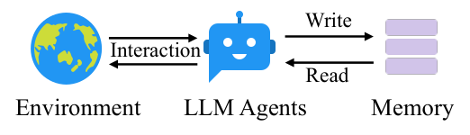

<!-- 原图：https://arxiv.org/html/2502.12110v11/intro-b.png -->
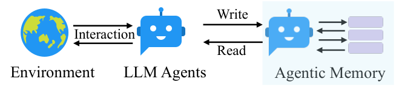

> **图 1（原文 Figure 1）**：Traditional memory systems require predefined memory access patterns specified in the workflow, limiting their adaptability to diverse scenarios. Contrastly, our A-Mem enhances the flexibility of LLM agents by enabling dynamic memory operations.
> （传统记忆系统需要在工作流中指定预定义的记忆访问模式，限制了它们对多样场景的适应性。相比之下，我们的 A-Mem 通过启用动态记忆操作，增强了 LLM 智能体的灵活性。）

本文提出一种名为 **A-Mem** 的新型智能体式记忆系统，使 LLM 智能体能够在**不依赖静态、预定的记忆操作**的前提下实现动态记忆结构化。我们的方法受 **Zettelkasten 方法** `[15, 1]` 启发——这是一套精密的知识管理系统，通过**原子化笔记（atomic notes）与灵活的链接机制**创建互相关联的信息网络。

我们的系统引入了一种智能体式记忆架构，为 LLM 智能体实现自主而灵活的记忆管理。对每一条新记忆，我们构建**完整的笔记**，其中整合了多种表征：包括若干属性的**结构化文本属性**，以及用于相似度匹配的**嵌入向量**。随后 A-Mem 分析历史记忆库，基于语义相似性与共享属性建立有意义的连接。这一整合过程不仅创建新的链接，还使能**动态演化**——当新记忆被纳入时，它们可以触发对已有记忆上下文表征的更新，使整个记忆体系随时间持续精化并加深理解。

**贡献总结如下：**

- 我们提出 **A-Mem**，一个面向 LLM 智能体的智能体式记忆系统，能够自主生成上下文描述、动态建立记忆连接、并基于新经验智能地演化已有记忆。该系统赋予 LLM 智能体长期交互能力，且**无需预定的记忆操作**。
- 我们设计了一种**智能体式记忆更新机制**：新记忆自动触发两个关键操作——**链接生成（link generation）**与**记忆演化（memory evolution）**。链接生成通过识别共享属性与相似的上下文描述，自动建立记忆之间的连接；记忆演化使已有记忆能够随着新经验被分析而动态适应，从而涌现出**更高阶的模式与属性**。
- 我们使用一个长期对话数据集对系统进行了全面评测，在**六个基础模型**上使用**六种不同的评测指标**比较性能，展示了显著改进。此外，我们提供 **T-SNE 可视化**来展示本智能体式记忆系统的结构化组织。

---

## 2. 相关工作

### 2.1 面向 LLM 智能体的记忆

已有关于 LLM 智能体记忆系统的工作探索了多种记忆管理与利用机制 `[23, 21, 8, 39]`。一些方法完成交互存储，通过稠密检索模型 `[39]` 或读写记忆结构 `[24]` 维护全面的历史记录。此外，MemGPT `[25]` 利用类缓存架构来优先处理近期信息。类似地，SCM `[32]` 提出了**自控记忆（Self-Controlled Memory）框架**，通过记忆流与控制器机制增强 LLM 维持长期记忆的能力。

然而，这些方法在处理多样化的现实任务时面临显著局限。虽然它们能提供基本的记忆功能，其操作通常受制于**预定义结构与固定工作流**。这些约束源自它们对刚性操作模式的依赖，尤其在记忆写入与检索过程中。这种不灵活导致在新环境中**泛化能力差**、在长期交互中有效性有限。因此，设计一个灵活、通用的、支持智能体长期交互的记忆系统仍是一项关键挑战。

### 2.2 检索增强生成

检索增强生成（RAG）已成为通过引入外部知识源来增强 LLM 的有力方法 `[18, 6, 10]`。标准 RAG `[37, 34]` 流程包括：把文档索引成块、基于语义相似度检索相关块、并用检索到的上下文增补 LLM 提示以进行生成。高级 RAG 系统 `[20, 12]` 已演进为包含精细的检索前与检索后优化。

在这些基础之上，近期研究引入了**智能体式 RAG 系统**，它们在检索过程中展现出更强的自主性与适应性：这些系统能动态决定**何时检索、检索什么** `[4, 14]`，生成假设性响应以引导检索，并基于中间结果迭代地优化搜索策略 `[31, 29]`。

然而，尽管智能体式 RAG 方法通过自主决定何时与检索什么而在**检索阶段**展现出主动性 `[4, 14, 38]`，我们的智能体式记忆系统则通过**记忆结构的自主演化**在更根本的层面上展现出主动性。受 Zettelkasten 方法启发，我们的系统允许记忆主动生成自己的上下文描述、与相关记忆形成有意义的连接，并随着新经验的出现而演化其内容与关系。**"检索中的主动性"与"存储与演化中的主动性"这一根本区别**，把我们的工作与智能体式 RAG 系统区分开来——后者尽管有精密的检索机制，仍维护着静态的知识库。

---

## 3. 方法（Methodology）

我们提出的智能体式记忆系统受 Zettelkasten 方法启发，实现了一个**动态且自演化的记忆系统**，使 LLM 智能体无需预定操作即可维持长期记忆。系统设计强调**原子化笔记记录、灵活的链接机制与知识结构的持续演化**。

<!-- 原图：https://arxiv.org/html/2502.12110v11/framework.png -->
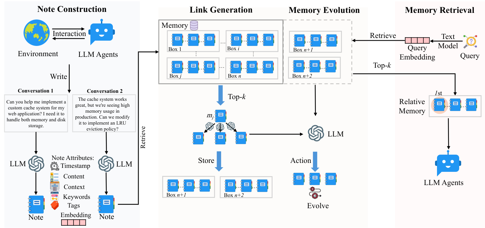

> **图 2（原文 Figure 2）**：Our A-Mem architecture comprises three integral parts in memory storage. During note construction, the system processes new interaction memories and stores them as notes with multiple attributes. The link generation process first retrieves the most relevant historical memories and then employs an LLM to determine whether connections should be established between them. The concept of a 'box' describes that related memories become interconnected through their similar contextual descriptions, analogous to the Zettelkasten method. However, our approach allows individual memories to exist simultaneously within multiple different boxes. During the memory retrieval stage, we extract query embeddings using a text encoding model and search the memory database for relevant matches. When related memory is retrieved, similar memories that are linked within the same box are also automatically accessed.
> （我们的 A-Mem 架构在记忆存储上包含三个组成部分。在**笔记构建**阶段，系统处理新的交互记忆并以带多种属性的笔记形式存储它们。**链接生成**过程首先检索最相关的历史记忆，然后用 LLM 判断它们之间是否应建立连接。"盒子（box）"这一概念描述相关记忆通过相似的上下文描述而互相关联，类似于 Zettelkasten 方法；不过我们的方法**允许单条记忆同时存在于多个不同的盒子中**。在**记忆检索**阶段，我们用文本编码模型抽取查询嵌入并在记忆数据库中搜索匹配项；当检索到相关记忆时，同一盒子内与之链接的相似记忆也会被自动访问。）

### 3.1 笔记构建（Note Construction）

在 Zettelkasten 方法的原子化笔记与灵活组织原则之上，我们引入一种 **LLM 驱动的记忆笔记构建方法**。当智能体与环境交互时，我们构建结构化的记忆笔记，既捕捉显式信息，也捕捉 LLM 生成的上下文理解。我们集合 ℳ = {m₁, m₂, …, m_N} 中的每条记忆笔记 mᵢ 表示为：

**mᵢ = { cᵢ, tᵢ, Kᵢ, Gᵢ, Xᵢ, eᵢ, Lᵢ }**  （公式 1）

其中：
- **cᵢ** — 原始交互内容
- **tᵢ** — 交互的时间戳
- **Kᵢ** — LLM 生成的**关键词**，捕捉关键概念
- **Gᵢ** — LLM 生成的**标签**，用于分类
- **Xᵢ** — LLM 生成的**上下文描述**，提供丰富的语义理解
- **Lᵢ** — 与之存在语义关系的**链接记忆集合**

为了让每条记忆笔记在基本内容与时间戳之外还拥有有意义的上下文，我们利用 LLM 分析交互并生成这些语义组件。笔记构建过程用精心设计的模板 P_s1 提示 LLM：

**Kᵢ, Gᵢ, Xᵢ ← LLM( cᵢ ‖ tᵢ ‖ P_s1 )**  （公式 2）

遵循 Zettelkasten 的**原子性**原则，每条笔记捕捉一个独立的、自包含的知识单元。为了实现高效的检索与链接，我们通过一个文本编码器 `[27]` 计算稠密向量表征，它封装了笔记的所有文本组件：

**eᵢ = f_enc[ concat(cᵢ, Kᵢ, Gᵢ, Xᵢ) ]**  （公式 3）

通过用 LLM 生成富化组件，我们实现了从原始交互中**自主抽取隐式知识**。多面向的笔记结构（Kᵢ、Gᵢ、Xᵢ）创造出捕捉记忆不同侧面的丰富表征，便于精细的组织与检索。此外，把 LLM 生成的语义组件与稠密向量表征相结合，同时提供了上下文信息与计算高效的相似度匹配。

### 3.2 链接生成（Link Generation）

我们的系统实现了一种**自主的链接生成机制**，使新的记忆笔记能够在没有预定义规则的情况下形成有意义的连接。当构建好的记忆笔记 m_n 被加入系统时，我们首先利用其语义嵌入做基于相似度的检索。对每个已有记忆笔记 m_j ∈ ℳ，计算相似度分数：

**s_{n,j} = (e_n · e_j) / (|e_n| |e_j|)**  （公式 4，余弦相似度）

系统随后识别出**最相关的 top-k 条记忆**：

**ℳⁿ_near = { m_j | rank(s_{n,j}) ≤ k, m_j ∈ ℳ }**  （公式 5）

基于这些候选近邻记忆，我们提示 LLM 根据它们潜在共有的属性来分析可能的连接。形式化地，记忆 m_n 的链接集 L_i 更新为：

**L_i ← LLM( m_n ‖ ℳⁿ_near ‖ P_s2 )**  （公式 6）

每条生成的链接 l_i 的结构为 L_i = {m_i, …, m_k}。

通过**用基于嵌入的检索作为初始过滤器**，我们在保持语义相关性的同时实现了高效的可扩展性——A-Mem 即便在大规模记忆集合中也无需穷举比较就能快速识别潜在连接。更重要的是，**LLM 驱动的分析允许对关系做出超越简单相似度指标的细微理解**：语言模型能识别出嵌入相似度alone看不出来的微妙模式、因果关系与概念连接。我们实现了 Zettelkasten 的灵活链接原则，同时利用了现代语言模型的能力。由此产生的网络**从记忆内容与上下文中自然涌现**，实现自然的知识组织。

### 3.3 记忆演化（Memory Evolution）

在为新记忆创建链接之后，A-Mem 会基于近邻记忆的文本信息及其与新记忆的关系来**演化**这些被检索到的记忆。对近邻集合 ℳⁿ_near 中的每条记忆 m_j，系统判断是否更新其上下文、关键词与标签。这一演化过程可形式化表示为：

**m_j* ← LLM( m_n ‖ ℳⁿ_near \ m_j ‖ m_j ‖ P_s3 )**  （公式 7）

演化后的记忆 m_j* 随后在记忆集 ℳ 中**替换**原记忆 m_j。

这种演化式方法支持持续更新与新连接，模仿人类的学习过程。随着系统随时间处理更多记忆，它会发展出**越来越精密的知识结构**，在多条记忆之间发现更高阶的模式与概念。这为**自主记忆学习**奠定了基础：通过新经验与已有记忆之间持续的交互，知识组织变得 progressively 更丰富。

### 3.4 检索相关记忆（Retrieve Relative Memory）

在每次交互中，A-Mem 执行**上下文感知的记忆检索**，为智能体提供相关的历史信息。给定来自当前交互的查询文本 q，我们首先用与记忆笔记相同的文本编码器计算其稠密向量表征：

**e_q = f_enc(q)**  （公式 8）

系统随后用余弦相似度计算查询嵌入与 ℳ 中所有已有记忆笔记之间的相似度分数：

**s_{q,i} = (e_q · e_i) / (|e_q| |e_i|)**，其中 e_i ∈ m_i, ∀ m_i ∈ ℳ  （公式 9）

然后我们从历史记忆存储中检索 **k 条最相关**的记忆，构建上下文适配的提示：

**ℳ_retrieved = { m_i | rank(s_{q,i}) ≤ k, m_i ∈ ℳ }**  （公式 10）

这些被检索的记忆提供相关的历史上下文，帮助智能体更好地理解并响应当前交互。检索到的上下文通过把当前交互与记忆系统中存储的相关过往经验连接起来，丰富了智能体的推理过程。

---

## 4. 实验

### 4.1 数据集与评测

为评估长期对话中指令感知推荐的有效性，我们使用 **LoCoMo 数据集** `[22]`，与已有对话数据集 `[36, 13]` 相比，它包含显著更长的对话。以往数据集的对话约为 1K token、跨越 4–5 个会话；而 LoCoMo 的对话平均达 **9K token、最多跨越 35 个会话**，特别适合评估模型处理长程依赖与在超长对话中保持一致性的能力。

LoCoMo 数据集包含多样化的问题类型，用于全面评估模型理解的不同侧面：(1) **单跳问题**——可从单个会话回答；(2) **多跳问题**——需要跨会话综合信息；(3) **时序推理问题**——测试对时间相关信息的理解；(4) **开放域知识问题**——需要把对话上下文与外部知识结合；(5) **对抗性问题**——评估模型识别不可回答问题（unanswerable）的能力。LoCoMo 在这些类别下共包含 **7,512 个问答对**。

此外，我们使用一个新数据集 **DialSim** `[16]` 来评估记忆系统的有效性。它是从长期多方对话中派生出的问答数据集，取材于热门电视剧（《老友记》《生活大爆炸》《办公室》），覆盖跨越五年的 1,300 个会话、约 350,000 token，每会话包含 1,000 多个问题（源自粉丝问答网站的精炼问题，以及从时序知识图谱生成的复杂问题）。

**对比基线**：LoCoMo `[22]`、ReadAgent `[17]`、MemoryBank `[39]`、MemGPT `[25]`（基线详细介绍见附录 A.1）。

**评测指标**：主要使用两个指标——**F1 分数**（通过平衡精确率与召回率评估答案准确性）与 **BLEU-1** `[26]`（通过与金标准响应的词重叠评估生成响应质量）。同时报告回答一个问题的**平均 token 长度**。此外，我们用另外四个指标（ROUGE-L、ROUGE-2、METEOR、SBERT Similarity）报告实验结果，并使用不同基础模型（包括 DeepSeek-R1-32B `[11]`、Claude 3.0 Haiku `[2]`、Claude 3.5 Haiku `[3]`）——见附录 A.3。

### 4.2 实现细节

对所有基线与我们所提方法，我们使用相同的系统提示以保持一致（详见附录 B）。Qwen-1.5B/3B 与 Llama 3.2 1B/3B 模型通过 **Ollama** 本地实例化部署，并用 **LiteLLM** 管理结构化输出生成；对 GPT 系列模型，我们使用官方的结构化输出 API。在记忆检索过程中，我们主要采用 **k = 10** 的 top-k 记忆选择以保持计算效率，同时对特定类别调整该参数以优化性能（k 的详细配置见附录 A.5）。文本嵌入方面，我们在所有实验中实现 **all-minilm-l6-v2** 模型。

### 4.3 实证结果（Empirical Results）

**性能分析。** 在我们的实证评测中，我们在 LoCoMo 数据集上把 A-Mem 与四个有竞争力的基线（LoCoMo `[22]`、ReadAgent `[17]`、MemoryBank `[39]`、MemGPT `[25]`）进行比较。

- 对**非 GPT 基础模型**，A-Mem 在不同类别上**一致地**优于所有基线，证明了我们智能体式记忆方法的有效性。
- 对 **GPT 系列模型**，虽然 LoCoMo 与 MemGPT 在某些类别（如开放域与对抗性任务）上因其在简单事实检索上的强大预训练知识而表现强劲，我们的 A-Mem 在**多跳任务**上表现更优——性能**至少好两倍**（这些任务需要复杂的推理链）。
- 除 LoCoMo 数据集外，我们还在 **DialSim** 数据集上把本方法与 LoCoMo、MemGPT 比较：A-Mem 在各项评测指标上一致优于所有基线，取得 **F1 3.45**（相对 LoCoMo 的 2.55 提升 35%，比 MemGPT 的 1.18 高 192%）。

A-Mem 的有效性源于其新颖的智能体式记忆架构——它使能了动态且结构化的记忆管理。与使用静态记忆操作的传统方法不同，我们的系统通过**带丰富上下文描述的原子化笔记**创建互连的记忆网络，从而支持更有效的多跳推理。系统基于共享属性动态建立记忆间连接、并用新上下文信息持续更新已有记忆描述的能力，使其能更好地捕捉并利用不同信息之间的关系。

**表 1：LoCoMo 数据集主结果**（F1 / BLEU，以及排序 Ranking 与回答单题的平均 token 长度）

| 模型 | 方法 | 多跳 F1 | 多跳 BLEU | 时序 F1 | 时序 BLEU | 开放域 F1 | 开放域 BLEU | 单跳 F1 | 单跳 BLEU | 对抗 F1 | 对抗 BLEU | 平均排序 | Token 长度 |
|---|---|---|---|---|---|---|---|---|---|---|---|---|---|
| **GPT-4o-mini** | LoCoMo | 25.02 | 19.75 | 18.41 | 14.77 | 12.04 | 11.16 | 40.36 | 29.05 | 69.23 | 68.75 | 2.4 | 16,910 |
| | ReadAgent | 9.15 | 6.48 | 12.60 | 8.87 | 5.31 | 5.12 | 9.67 | 7.66 | 9.81 | 9.02 | 4.2 | 643 |
| | MemoryBank | 5.00 | 4.77 | 9.68 | 6.99 | 5.56 | 5.94 | 6.61 | 5.16 | 7.36 | 6.48 | 4.8 | 432 |
| | MemGPT | 26.65 | 17.72 | 25.52 | 19.44 | 9.15 | 7.44 | 41.04 | 34.34 | 43.29 | 42.73 | 2.4 | 16,977 |
| | **A-Mem** | **27.02** | **20.09** | **45.85** | **36.67** | **12.14** | **12.00** | **44.65** | **37.06** | **50.03** | **49.47** | **1.2** | **2,520** |
| **GPT-4o** | LoCoMo | 28.00 | 18.47 | 9.09 | 5.78 | 16.47 | 14.80 | 61.56 | 54.19 | 52.61 | 51.13 | 2.0 | 16,910 |
| | ReadAgent | 14.61 | 9.95 | 4.16 | 3.19 | 8.84 | 8.37 | 12.46 | 10.29 | 6.81 | 6.13 | 4.0 | 805 |
| | MemoryBank | 6.49 | 4.69 | 2.47 | 2.43 | 6.43 | 5.30 | 8.28 | 7.10 | 4.42 | 3.67 | 5.0 | 569 |
| | MemGPT | 30.36 | 22.83 | 17.29 | 13.18 | 12.24 | 11.87 | 60.16 | 53.35 | 34.96 | 34.25 | 2.4 | 16,987 |
| | **A-Mem** | **32.86** | **23.76** | **39.41** | **31.23** | **17.10** | **15.84** | 48.43 | 42.97 | 36.35 | 35.53 | **1.6** | **1,216** |
| **Qwen2.5-1.5b** | LoCoMo | 9.05 | 6.55 | 4.25 | 4.04 | 9.91 | 8.50 | 11.15 | 8.67 | 40.38 | 40.23 | 3.4 | 16,910 |
| | ReadAgent | 6.61 | 4.93 | 2.55 | 2.51 | 5.31 | 12.24 | 10.13 | 7.54 | 5.42 | 27.32 | 4.6 | 752 |
| | MemoryBank | 11.14 | 8.25 | 4.46 | 2.87 | 8.05 | 6.21 | 13.42 | 11.01 | 36.76 | 34.00 | 2.6 | 284 |
| | MemGPT | 10.44 | 7.61 | 4.21 | 3.89 | 13.42 | 11.64 | 9.56 | 7.34 | 31.51 | 28.90 | 3.4 | 16,953 |
| | **A-Mem** | **18.23** | **11.94** | **24.32** | **19.74** | **16.48** | **14.31** | **23.63** | **19.23** | **46.00** | **43.26** | **1.0** | 1,300 |
| **Qwen2.5-3b** | LoCoMo | 4.61 | 4.29 | 3.11 | 2.71 | 4.55 | 5.97 | 7.03 | 5.69 | 16.95 | 14.81 | 3.2 | 16,910 |
| | ReadAgent | 2.47 | 1.78 | 3.01 | 3.01 | 5.57 | 5.22 | 3.25 | 2.51 | 15.78 | 14.01 | 4.2 | 776 |
| | MemoryBank | 3.60 | 3.39 | 1.72 | 1.97 | 6.63 | 6.58 | 4.11 | 3.32 | 13.07 | 10.30 | 4.2 | 298 |
| | MemGPT | 5.07 | 4.31 | 2.94 | 2.95 | 7.04 | 7.10 | 7.26 | 5.52 | 14.47 | 12.39 | 2.4 | 16,961 |
| | **A-Mem** | **12.57** | **9.01** | **27.59** | **25.07** | **7.12** | 7.28 | **17.23** | **13.12** | **27.91** | **25.15** | **1.0** | 1,137 |
| **Llama 3.2-1b** | LoCoMo | 11.25 | 9.18 | 7.38 | 6.82 | 11.90 | 10.38 | 12.86 | 10.50 | 51.89 | 48.27 | 3.4 | 16,910 |
| | ReadAgent | 5.96 | 5.12 | 1.93 | 2.30 | 12.46 | 11.17 | 7.75 | 6.03 | 44.64 | 40.15 | 4.6 | 665 |
| | MemoryBank | 13.18 | 10.03 | 7.61 | 6.27 | 15.78 | 12.94 | 17.30 | 14.03 | 52.61 | 47.53 | 2.0 | 274 |
| | MemGPT | 9.19 | 6.96 | 4.02 | 4.79 | 11.14 | 8.24 | 10.16 | 7.68 | 49.75 | 45.11 | 4.0 | 16,950 |
| | **A-Mem** | **19.06** | **11.71** | **17.80** | 10.28 | **17.55** | **14.67** | **28.51** | **24.13** | **58.81** | **54.28** | **1.0** | 1,376 |
| **Llama 3.2-3b** | LoCoMo | 6.88 | 5.77 | 4.37 | 4.40 | 10.65 | 9.29 | 8.37 | 6.93 | 30.25 | 28.46 | 2.8 | 16,910 |
| | ReadAgent | 2.47 | 1.78 | 3.01 | 3.01 | 5.57 | 5.22 | 3.25 | 2.51 | 15.78 | 14.01 | 4.2 | 461 |
| | MemoryBank | 6.19 | 4.47 | 3.49 | 3.13 | 4.07 | 4.57 | 7.61 | 6.03 | 18.65 | 17.05 | 3.2 | 263 |
| | MemGPT | 5.32 | 3.99 | 2.68 | 2.72 | 5.64 | 5.54 | 4.32 | 3.51 | 21.45 | 19.37 | 3.8 | 16,956 |
| | **A-Mem** | **17.44** | **11.74** | **26.38** | **19.50** | **12.53** | **11.83** | **28.14** | **23.87** | **42.04** | **40.60** | **1.0** | 1,126 |

**成本效率分析。** A-Mem 在强劲性能之外还展现出显著的**计算与成本效率**。系统每次记忆操作约需 **1,200 token**，通过我们的选择性 top-k 检索机制，相比基线方法（LoCoMo 与 MemGPT 需 16,900 token）实现了 **85–93% 的 token 使用削减**。这一可观的 token 削减直接转化为更低的运营成本——使用商业 API 服务时，**每次记忆操作成本低于 $0.0003**，使大规模部署在经济上可行。处理时间方面，使用 GPT-4o-mini 平均 **5.4 秒**，使用单 GPU 本地托管的 Llama 3.2 1B 仅需 **1.1 秒**。尽管记忆处理期间需要多次 LLM 调用，A-Mem 仍维持了这种经济高效的资源利用，同时在所有测试的基础模型上一致地优于基线方法，尤其在复杂的多跳推理任务上性能翻倍。这种**低计算成本与卓越推理能力的平衡**，凸显了 A-Mem 在现实世界部署中的实用优势。

**表 2：DialSim 数据集结果**

| 方法 | F1 | BLEU-1 | ROUGE-L | ROUGE-2 | METEOR | SBERT 相似度 |
|---|---|---|---|---|---|---|
| LoCoMo | 2.55 | 3.13 | 2.75 | 0.90 | 1.64 | 15.76 |
| MemGPT | 1.18 | 1.07 | 0.96 | 0.42 | 0.95 | 8.54 |
| **A-Mem** | **3.45** | **3.37** | **3.54** | **3.60** | **2.05** | **19.51** |

### 4.4 消融实验（Ablation Study）

为评估**链接生成（LG）**与**记忆演化（ME）**模块的有效性，我们通过系统地移除模型关键组件来进行消融实验。当 LG 与 ME 两个模块都被移除时，系统表现出显著的性能退化，尤其在**多跳推理**与**开放域**任务上。仅启用 LG（w/o ME）的系统表现出中等水平的性能，显著优于两个模块都移除的版本——这证明了**链接生成在建立记忆连接方面的根本重要性**。我们的完整模型 A-Mem 在所有评测类别上一致取得最佳性能，在复杂推理任务上结果尤为突出。这些结果揭示：**链接生成模块是记忆组织的关键基础，而记忆演化模块则为记忆结构提供了必要的精化**。消融实验验证了我们架构设计的取舍，并凸显了这两个模块在构建有效记忆系统时的互补性。

**表 3：消融实验（GPT-4o-mini，F1 / BLEU-1）**

| 方法 | 多跳 F1 | 多跳 BLEU-1 | 时序 F1 | 时序 BLEU-1 | 开放域 F1 | 开放域 BLEU-1 | 单跳 F1 | 单跳 BLEU-1 | 对抗 F1 | 对抗 BLEU-1 |
|---|---|---|---|---|---|---|---|---|---|---|
| w/o LG & ME | 9.65 | 7.09 | 24.55 | 19.48 | 7.77 | 6.70 | 13.28 | 10.30 | 15.32 | 18.02 |
| w/o ME | 21.35 | 15.13 | 31.24 | 27.31 | 10.13 | 10.85 | 39.17 | 34.70 | 44.16 | 45.33 |
| **A-Mem（完整）** | **27.02** | **20.09** | **45.85** | **36.67** | **12.14** | **12.00** | **44.65** | **37.06** | **50.03** | **49.47** |

### 4.5 超参数分析

我们进行了大量实验来分析**记忆检索参数 k**（控制每次交互检索多少条相关记忆）的影响。如图 3 所示，我们以 GPT-4o-mini 为基础模型，在五类任务上评估了不同 k 值（10、20、30、40、50）下的性能。结果揭示了一个有趣的模式：虽然增大 k 通常带来性能提升，但这种提升**逐渐趋于平台期，有时在更高取值处略有下降**。这一趋势在**多跳**与**开放域**任务上尤为明显。该观察提示记忆检索中存在一种微妙的平衡——更大的 k 值提供更丰富的历史上下文用于推理，但也可能引入噪声，并挑战模型有效处理更长序列的能力。我们的分析表明，**中等大小的 k 值**在上下文丰富度与信息处理效率之间取得了最优平衡。

<!-- 原图：https://arxiv.org/html/2502.12110v11/performance_metrics_c1.svg -->
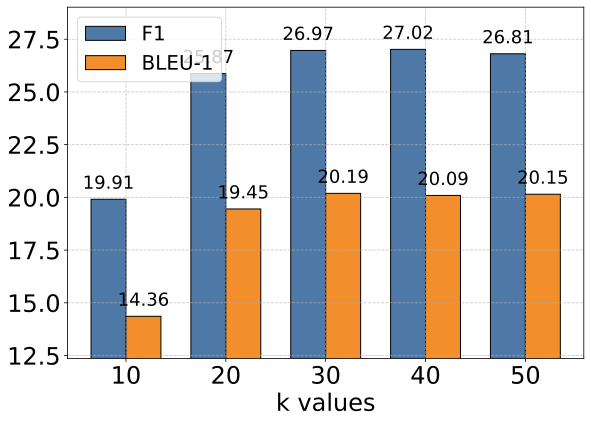

<!-- 原图：https://arxiv.org/html/2502.12110v11/performance_metrics_c2.svg -->
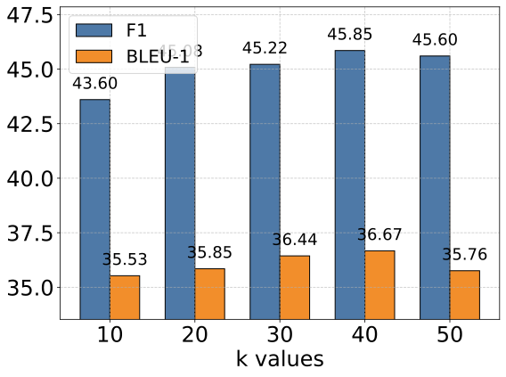

<!-- 原图：https://arxiv.org/html/2502.12110v11/performance_metrics_c3.svg -->
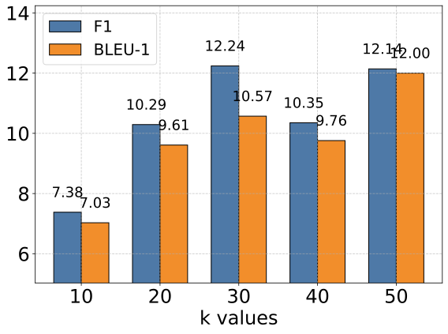

<!-- 原图：https://arxiv.org/html/2502.12110v11/performance_metrics_c4.svg -->
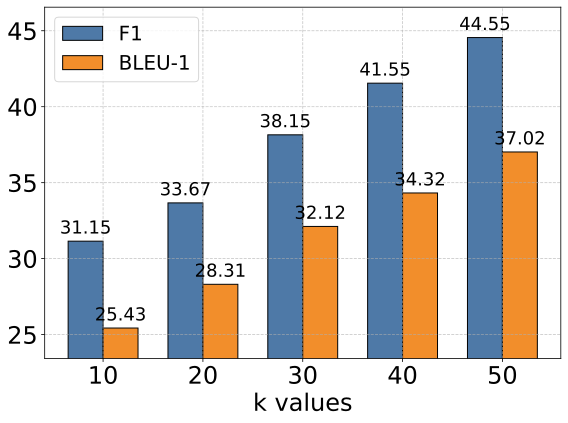

<!-- 原图：https://arxiv.org/html/2502.12110v11/performance_metrics_c5.svg -->
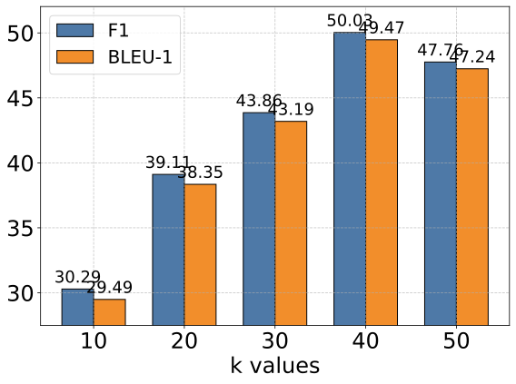

> **图 3（原文 Figure 3）**：Impact of memory retrieval parameter k across different task categories with GPT-4o-mini as the base model. While larger k values generally improve performance by providing richer historical context, the gains diminish beyond certain thresholds, suggesting a trade-off between context richness and effective information processing. This pattern is consistent across all evaluation categories, indicating the importance of balanced context retrieval for optimal performance.
> （以 GPT-4o-mini 为基础模型时，记忆检索参数 k 对不同任务类别的影响。更大的 k 值通常通过提供更丰富的历史上下文来提升性能，但超过某些阈值后增益递减，提示在"上下文丰富度"与"有效信息处理"之间存在权衡。这一模式在所有评测类别中一致，说明平衡上下文检索对最优性能的重要性。）

### 4.6 扩展性分析（Scaling Analysis）

为评估记忆累积时的存储成本，我们考察了 A-Mem 系统与两个基线（MemoryBank `[39]`、ReadAgent `[17]`）在**存储规模与检索时间**之间的关系。我们用相同的记忆内容，在四个规模点上评估这三种记忆系统，每一步把条目数量**增加 10 倍**（从 1,000 到 10,000、100,000，最后到 1,000,000 条）。

实验结果揭示了 A-Mem 系统扩展特性的关键洞见：
- **空间复杂度**方面，三个系统都表现出**相同的线性内存使用增长 O(N)**，这符合基于向量检索系统的预期。这确认了 A-Mem 相比基线**没有引入额外的存储开销**。
- **检索时间**方面，A-Mem 展现出卓越的效率，随记忆规模增长仅有极小增幅。即便扩展到 **100 万条记忆**，A-Mem 的检索时间也仅从 **0.31 μs 增长到 3.70 μs**，表现优异。虽然 MemoryBank 的检索时间略快，但 A-Mem 在提供更丰富的记忆表征与功能的同时保持了可比的性能。

基于空间复杂度与检索时间分析，我们得出结论：A-Mem 的检索机制即便在大规模下也保持卓越效率。跨记忆规模的检索时间增长极小，回应了对大规模记忆系统效率的担忧，证明 A-Mem 为长期对话管理提供了高度可扩展的解决方案。这种**效率、可扩展性与增强记忆能力的独特组合**，使 A-Mem 成为构建 LLM 智能体强大长期记忆机制的重要进展。

**表 4：存储开销与检索时间对比（μs）**

| 记忆规模 | 方法 | 内存占用 (MB) | 检索时间 (μs) |
|---|---|---|---|
| **1,000** | A-Mem | 1.46 | 0.31 ± 0.30 |
| | MemoryBank | 1.46 | 0.24 ± 0.20 |
| | ReadAgent | 1.46 | 43.62 ± 8.47 |
| **10,000** | A-Mem | 14.65 | 0.38 ± 0.25 |
| | MemoryBank | 14.65 | 0.26 ± 0.13 |
| | ReadAgent | 14.65 | 484.45 ± 93.86 |
| **100,000** | A-Mem | 146.48 | 1.40 ± 0.49 |
| | MemoryBank | 146.48 | 0.78 ± 0.26 |
| | ReadAgent | 146.48 | 6,682.22 ± 111.63 |
| **1,000,000** | A-Mem | 1,464.84 | 3.70 ± 0.74 |
| | MemoryBank | 1,464.84 | 1.91 ± 0.31 |
| | ReadAgent | 1,464.84 | 120,069.68 ± 1,673.39 |

> **关键对照**：同样 100 万条记忆，ReadAgent 检索需 **120 毫秒**（120,069 μs），A-Mem 仅需 **3.7 微秒**——差 **3 万倍**。

### 4.7 记忆分析

我们在图 4 中给出记忆嵌入的 **t-SNE 可视化**，以展示本智能体式记忆系统的结构优势。通过分析从 LoCoMo `[22]` 长期对话中采样的两段对话，我们观察到 **A-Mem（蓝色）相比基线系统（红色）一致地展现出更连贯的聚类模式**。这种结构化组织在**对话 2** 中尤为明显——中央区域涌现出边界清晰的簇，为我们的**记忆演化机制与上下文描述生成**的有效性提供了实证支持。相比之下，基线的记忆嵌入呈现出更分散的分布，说明**缺少链接生成与记忆演化组件时，记忆缺乏结构化组织**。这些可视化结果验证了 A-Mem 能够通过动态演化与链接机制**自主地维护有意义的记忆结构**。更多结果见附录 A.4。

<!-- 原图：https://arxiv.org/html/2502.12110v11/tsne_comparison_sample_0.svg -->
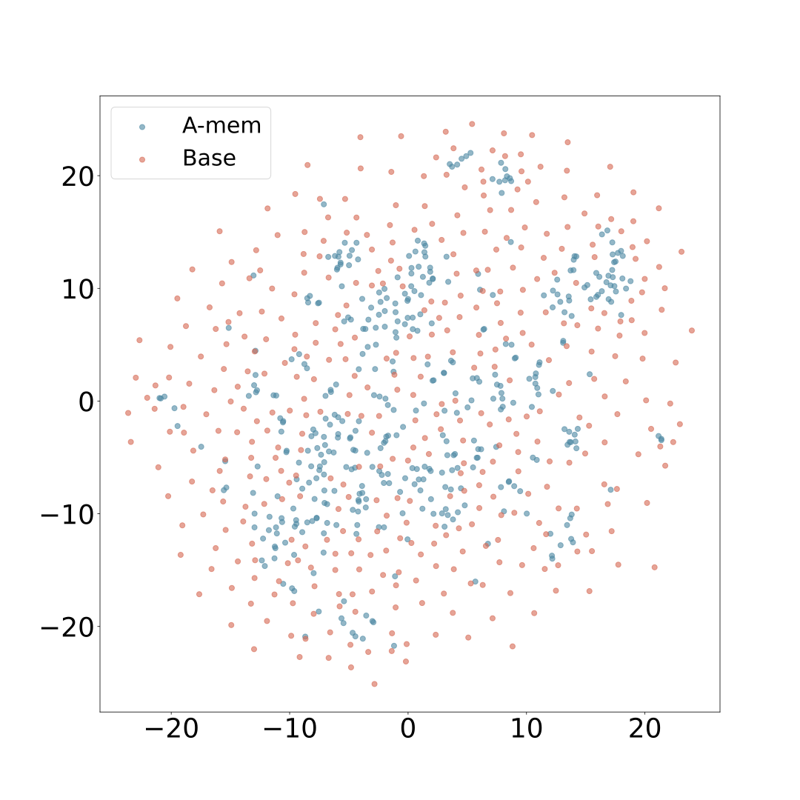

<!-- 原图：https://arxiv.org/html/2502.12110v11/tsne_comparison_sample_1.svg -->
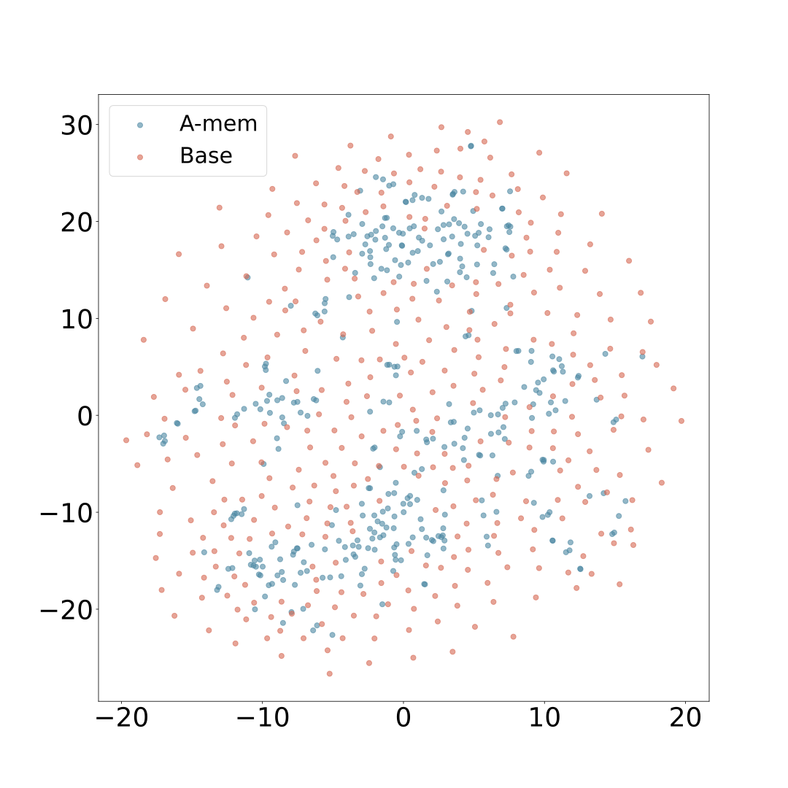

> **图 4（原文 Figure 4）**：T-SNE Visualization of Memory Embeddings Showing More Organized Distribution with A-Mem (blue) Compared to Base Memory (red) Across Different Dialogues. Base Memory represents A-Mem without link generation and memory evolution.
> （记忆嵌入的 t-SNE 可视化：在不同对话中，A-Mem（蓝色）相比基础记忆（红色）呈现更有组织的分布。Base Memory 指移除了链接生成与记忆演化的 A-Mem。）

---

## 5. 结论

本工作中，我们介绍了 **A-Mem**——一个新颖的智能体式记忆系统，使 LLM 智能体能够在不依赖预定义结构的情况下动态地组织与演化其记忆。受 Zettelkasten 方法启发，我们的系统通过**动态索引与链接机制**创建互连的知识网络，以适应多样化的现实任务。系统的核心架构特征是：为新记忆自主生成上下文描述，并基于共享属性智能地建立与已有记忆的连接。此外，我们的方法通过吸收新经验、并在持续交互中发展出更高阶的属性，实现了历史记忆的持续演化。通过在**六个基础模型**上的广泛实证评测，我们证明了 A-Mem 在长期对话任务上相比现有 SOTA 基线取得了更优性能。可视化分析进一步验证了我们记忆组织方法的有效性。这些结果表明，**智能体式记忆系统能够显著增强 LLM 智能体在复杂环境中利用长期知识的能力**。

---

## 6. 局限性

尽管我们的智能体式记忆系统取得了可喜的结果，我们承认仍有若干值得未来探索的方向。首先，虽然系统能动态组织记忆，这些组织的**质量仍可能受底层语言模型固有能力的影响**——不同的 LLM 可能生成略有不同的上下文描述，或在记忆之间建立不同的连接。此外，我们当前的实现聚焦于**基于文本的交互**，未来工作可以探索把系统扩展到处理**多模态信息**（如图像或音频），从而提供更丰富的上下文表征。

---

## 附录 A 实验

### A.1 基线详细介绍

- **LoCoMo `[22]`**：采用直接方法，利用不含记忆机制的基础模型来完成问答任务。对每个查询，它把**完整的先前对话与问题**一起纳入提示，评估模型的推理能力。
- **ReadAgent `[17]`**：通过一套精密的三步方法处理长上下文文档：先是 **episode pagination**（情节分页，把内容切分为可管理的块），然后是 **memory gisting**（记忆要点化，把每页提炼成简洁的记忆表征），最后是 **interactive look-up**（交互式查找，按需检索相关信息）。
- **MemoryBank `[39]`**：提出一种创新的记忆管理系统，维护并高效检索历史交互。系统具有基于**艾宾浩斯遗忘曲线**理论的动态记忆更新机制，根据时间与重要性智能地调整记忆强度。此外它还包含一个**用户画像构建系统**，通过持续的交互分析逐步精化对用户性格的理解。
- **MemGPT `[25]`**：提出一种受传统操作系统内存层次结构启发的新型**虚拟上下文管理**系统。该架构实现双层结构：**主上下文**（类比 RAM，在 LLM 推理期间提供即时访问）与**外部上下文**（类比磁盘存储，保存超出固定上下文窗口的信息）。

### A.2 评测指标

- **F1 分数**：精确率与召回率的调和平均，提供一个把两者合并为单一数值的平衡指标。在问答系统中，F1 在评估预测答案与参考答案的精确匹配上扮演关键角色，对基于片段（span-based）的 QA 任务尤其重要。
- **BLEU-1 `[26]`**：评估系统输出与参考文本之间**一元词（unigram）匹配精确率**的方法。其中 c 为候选长度、r 为参考长度、h_ik 为候选 k 中 n-gram i 的计数、m_ik 为任一参考中的最大计数。在 QA 中，BLEU-1 评估生成答案的词汇精确率，对精确匹配可能过严的生成式 QA 系统尤其有用。
- **ROUGE-L `[19]`**：衡量生成文本与参考文本之间的**最长公共子序列（LCS）**；ROUGE-2 计算二者之间**二元组（bigram）**的重叠。ROUGE-L 关注序列匹配，ROUGE-2 关注局部词序，两者对评估生成答案的流畅性与连贯性都很有用。
- **METEOR `[5]`**：基于候选与参考文本之间对齐的一元词计算分数，**考虑同义词与释义**。其中 P 为精确率、R 为召回率、ch 为块（chunk）数、m 为匹配的一元词数。METEOR 对 QA 评估很有价值，因为它考虑超越精确匹配的语义相似性，适合评估释义后的答案。
- **SBERT 相似度 `[27]`**：使用句嵌入衡量两段文本之间的语义相似度。SBERT(x) 表示文本的句嵌入。SBERT 相似度对评估 QA 系统的语义理解尤其有用，因为它能在词汇重叠很低时仍捕捉意义相似性。

### A.3 补充对比结果

我们使用 ROUGE-2、ROUGE-L、METEOR 与 SBERT 指标的全面评测表明，A-Mem 在保持卓越计算效率的同时取得了更优性能。通过在各种模型规模与任务类别上的广泛实证测试，我们确立了 A-Mem 相比现有基线是更有效的方法，并得到若干有力发现的支持。

- **非 GPT 模型**（Qwen2.5 与 Llama 3.2）上，A-Mem 在所有指标上一致优于所有基线。**多跳类别结果尤为惊人**：Qwen2.5-15b 配合 A-Mem 取得 ROUGE-L **27.23**，大幅超越 LoCoMo 的 4.68 与 ReadAgent 的 2.81——**接近六倍改进**。这一优势模式在 METEOR 与 SBERT 分数上同样一致。
- **GPT 系列模型**上，结果呈现出一个有趣的模式：虽然 LoCoMo 与 MemGPT 在开放域与对抗性任务上展现出强劲能力，A-Mem 在多跳推理任务上表现出显著优势。使用 GPT-4o-mini 时，A-Mem 在多跳任务上取得 ROUGE-L **44.27**，是 LoCoMo 的 18.09 的**两倍多**。这一显著优势在其他指标上保持一致：METEOR 23.43 对 7.61，SBERT 70.49 对 52.30。
- 这些结果的意义因 A-Mem 卓越的**计算效率**而被放大：我们的方法只需 **1,200–2,500 token**，而 LoCoMo 与 MemGPT 需要高达 **16,900 token**。这一效率源于两项关键架构创新：① 新颖的智能体式记忆架构通过带丰富上下文描述的原子化笔记创建互连记忆网络，使能更有效地捕捉与利用信息间的关系；② 选择性 top-k 检索机制促进了动态记忆演化与结构化组织。这些创新的有效性在复杂推理任务上尤为明显，体现在所有评测指标上一致强劲的多跳性能。

**表 5：ROUGE-2 / ROUGE-L 结果（RGE-2 / RGE-L）**

| 模型 | 方法 | 多跳 R2 | 多跳 RL | 时序 R2 | 时序 RL | 开放域 R2 | 开放域 RL | 单跳 R2 | 单跳 RL | 对抗 R2 | 对抗 RL |
|---|---|---|---|---|---|---|---|---|---|---|---|
| **GPT-4o-mini** | LoCoMo | 9.64 | 23.92 | 2.01 | 18.09 | 3.40 | 11.58 | 26.48 | 40.20 | 60.46 | 69.59 |
| | ReadAgent | 2.47 | 9.45 | 0.95 | 13.12 | 0.55 | 5.76 | 2.99 | 9.92 | 6.66 | 9.79 |
| | MemoryBank | 1.18 | 5.43 | 0.52 | 9.64 | 0.97 | 5.77 | 1.64 | 6.63 | 4.55 | 7.35 |
| | MemGPT | 10.58 | 25.60 | 4.76 | 25.22 | 0.76 | 9.14 | 28.44 | 42.24 | 36.62 | 43.75 |
| | **A-Mem** | **10.61** | **25.86** | **21.39** | **44.27** | **3.42** | **12.09** | **29.50** | **45.18** | **42.62** | **50.04** |
| **GPT-4o** | LoCoMo | 11.53 | 30.65 | 1.68 | 8.17 | 3.21 | 16.33 | 45.42 | 63.86 | 45.13 | 52.67 |
| | ReadAgent | 3.91 | 14.36 | 0.43 | 3.96 | 0.52 | 8.58 | 4.75 | 13.41 | 4.24 | 6.81 |
| | MemoryBank | 1.84 | 7.36 | 0.36 | 2.29 | 2.13 | 6.85 | 3.02 | 9.35 | 1.22 | 4.41 |
| | MemGPT | 11.55 | 30.18 | 4.66 | 15.83 | 3.27 | 14.02 | 43.27 | 62.75 | 28.72 | 35.08 |
| | **A-Mem** | **12.76** | **31.71** | **9.82** | **25.04** | **6.09** | **16.63** | 33.67 | 50.31 | 30.31 | 36.34 |

**表 6：METEOR / SBERT 相似度结果**

| 模型 | 方法 | 多跳 ME | 多跳 SBERT | 时序 ME | 时序 SBERT | 开放域 ME | 开放域 SBERT | 单跳 ME | 单跳 SBERT | 对抗 ME | 对抗 SBERT |
|---|---|---|---|---|---|---|---|---|---|---|---|
| **GPT-4o-mini** | LoCoMo | 15.81 | 47.97 | 7.61 | 52.30 | 8.16 | 35.00 | 40.42 | 57.78 | 63.28 | 71.93 |
| | ReadAgent | 5.46 | 28.67 | 4.76 | 45.07 | 3.69 | 26.72 | 8.01 | 26.78 | 8.38 | 15.20 |
| | MemoryBank | 3.42 | 21.71 | 4.07 | 37.58 | 4.21 | 23.71 | 5.81 | 20.76 | 6.24 | 13.00 |
| | MemGPT | 15.79 | 49.33 | 13.25 | 61.53 | 4.59 | 32.77 | 41.40 | 58.19 | 39.16 | 47.24 |
| | **A-Mem** | **16.36** | **49.46** | **23.43** | **70.49** | **8.36** | **38.48** | **42.32** | **59.38** | **45.64** | **53.26** |
| **GPT-4o** | LoCoMo | 16.34 | 53.82 | 7.21 | 32.15 | 8.98 | 43.72 | 53.39 | 73.40 | 47.72 | 56.09 |
| | ReadAgent | 7.86 | 37.41 | 3.76 | 26.22 | 4.42 | 30.75 | 9.36 | 31.37 | 5.47 | 12.34 |
| | MemoryBank | 3.22 | 26.23 | 2.29 | 23.49 | 4.18 | 24.89 | 6.64 | 23.90 | 2.93 | 10.01 |
| | MemGPT | 16.64 | 55.12 | 12.68 | 35.93 | 7.78 | 37.91 | 52.14 | 72.83 | 31.15 | 39.08 |
| | **A-Mem** | **17.53** | **55.96** | **13.10** | **45.40** | **10.62** | **38.87** | 41.93 | 62.47 | 32.34 | 40.11 |

**表 7：其他基础模型结果（F1 / BLEU-1）**

| 模型 | 方法 | 多跳 F1 | 多跳 BLEU | 时序 F1 | 时序 BLEU | 开放域 F1 | 开放域 BLEU | 单跳 F1 | 单跳 BLEU | 对抗 F1 | 对抗 BLEU |
|---|---|---|---|---|---|---|---|---|---|---|---|
| **DeepSeek-R1-32B** | LoCoMo | 8.58 | 6.48 | 4.79 | 4.35 | 12.96 | 12.52 | 10.72 | 8.20 | 21.40 | 20.23 |
| | MemGPT | 8.28 | 6.25 | 5.45 | 4.97 | 10.97 | 9.09 | 11.34 | 9.03 | 30.77 | 29.23 |
| | **A-Mem** | **15.02** | **10.64** | **14.64** | **11.01** | **14.81** | **12.82** | **15.37** | **12.30** | 27.92 | 27.19 |
| **Claude 3.0 Haiku** | LoCoMo | 4.56 | 3.33 | 0.82 | 0.59 | 2.86 | 3.22 | 3.56 | 3.24 | 3.46 | 3.42 |
| | MemGPT | 7.65 | 6.36 | 1.65 | 1.26 | 7.41 | 6.64 | 8.60 | 7.29 | 7.66 | 7.37 |
| | **A-Mem** | **19.28** | **14.69** | **16.65** | **12.23** | **11.85** | **9.61** | **34.72** | **30.05** | **35.99** | **34.87** |
| **Claude 3.5 Haiku** | LoCoMo | 11.34 | 8.21 | 3.29 | 2.69 | 3.79 | 3.58 | 14.01 | 12.57 | 7.37 | 7.12 |

**表 8：各模型在各任务类别上的 k 值设置**

| 模型 | 多跳 | 时序 | 开放域 | 单跳 | 对抗 |
|---|---|---|---|---|---|
| GPT-4o-mini | 40 | 40 | 50 | 50 | 40 |
| GPT-4o | 40 | 40 | 50 | 50 | 40 |
| Qwen2.5-1.5b | 10 | 10 | 10 | 10 | 10 |
| Qwen2.5-3b | 10 | 10 | 50 | 10 | 10 |
| Llama3.2-1b | 10 | 10 | 10 | 10 | 10 |
| Llama3.2-3b | 10 | 20 | 10 | 10 | 10 |

> 所有超参数 k 值见表 8。对那些在 k=10 时已达到 SOTA 性能的模型，我们保持该值不再调参。

### A.4 记忆分析（补充）

除正文中展示的前两段对话的记忆可视化外，我们在**图 5**中给出更多可视化，以展示本智能体式记忆系统的结构优势。通过分析从 LoCoMo `[22]` 长期对话中采样的两段对话，我们观察到 A-Mem（蓝色）相比基线系统（红色）一致地产生更连贯的聚类模式。这种结构化组织在对话 2 中尤为明显——中央区域涌现出清晰的簇，为我们的记忆演化机制与上下文描述生成提供了实证支持。相比之下，基线的记忆嵌入呈现更分散的分布，说明缺少链接生成与记忆演化组件时记忆缺乏结构化组织。这些可视化验证了 A-Mem 能通过动态演化与链接机制自主维护有意义的记忆结构。

<!-- 原图：https://arxiv.org/html/2502.12110v11/tsne_comparison_sample_2.svg -->
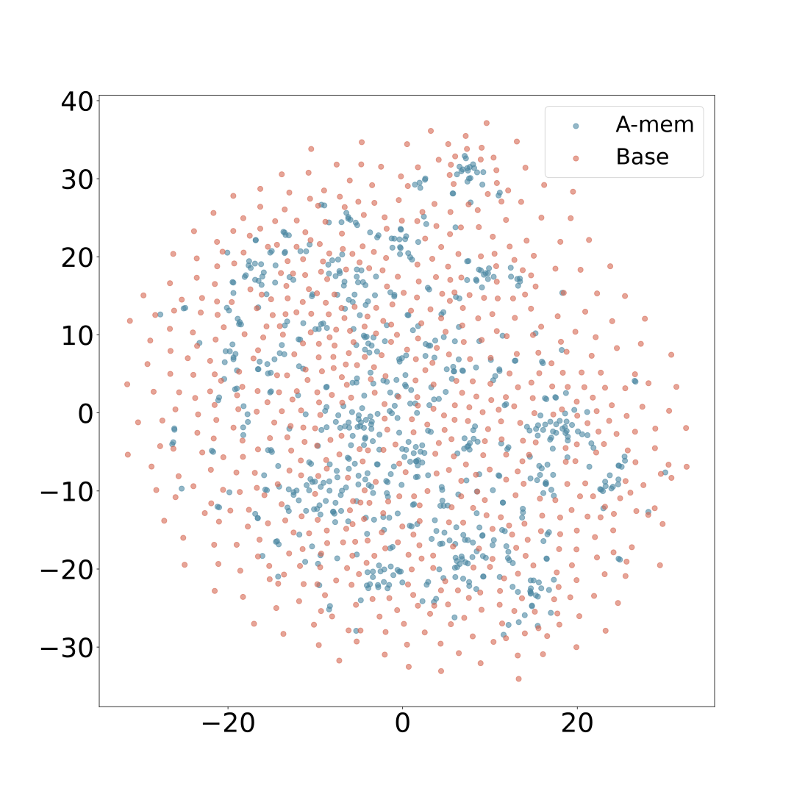

> 说明：论文 HTML 中还包含更多 t-SNE 样本文件（`tsne_comparison_sample_3..9`），已一并下载至 `images/AMem/04-3..04-9-tsne_sample_*.svg`，供对照查看。

---

## 附录 B 提示词模板与示例

### B.1 笔记构建提示词模板（P_s1）

```text
Generate a structured analysis of the following content by:
1. Identifying the most salient keywords (focus on nouns, verbs, and key concepts)
2. Extracting core themes and contextual elements
3. Creating relevant categorical tags
Format the response as a JSON object:
{
"keywords": [
// several specific, distinct keywords that capture key concepts and terminology
// Order from most to least important
// Don't include keywords that are the name of the speaker or time
// At least three keywords, but don't be too redundant.
],
"context":
// one sentence summarizing:
// - Main topic/domain
// - Key arguments/points
// - Intended audience/purpose
,
"tags": [
// several broad categories/themes for classification
// Include domain, format, and type tags
// At least three tags, but don't be too redundant.
]
}
Content for analysis:
```

**中译要点**：通过以下方式对内容进行结构化分析：① 识别最突出的关键词（聚焦名词、动词与关键概念）；② 抽取核心主题与上下文要素；③ 创建相关的分类标签。以 JSON 对象格式输出，包含 `keywords`（按重要性排序、至少三个、不要冗余、不含说话者名字与时间）、`context`（一句话总结：主题/领域、关键论点、目标受众/目的）、`tags`（至少三个宽泛分类标签，含领域、格式、类型）。

### B.2 链接生成提示词模板（P_s2）

```text
You are an AI memory evolution agent responsible for managing and evolving a knowledge base.
Analyze the the new memory note according to keywords and context, also with their several
nearest neighbors memory.
The new memory context: {context}
content: {content}
keywords: {keywords}
The nearest neighbors memories: {nearest_neighbors_memories}
Based on this information, determine:
Should this memory be evolved? Consider its relationships with other memories.
```

**中译要点**：你是一个负责管理与演化知识库的 AI 记忆演化智能体。根据关键词与上下文（以及若干最近邻记忆）来分析这条新记忆笔记。基于这些信息判断：这条记忆是否应当被演化？请考虑它与其他记忆的关系。

### B.3 记忆演化提示词模板（P_s3）

```text
You are an AI memory evolution agent responsible for managing and evolving a knowledge base.
Analyze the the new memory note according to keywords and context, also with their several
nearest neighbors memory. Make decisions about its evolution.
The new memory context: {context}
content: {content}
keywords: {keywords}
The nearest neighbors memories: {nearest_neighbors_memories}
Based on this information, determine:
1. What specific actions should be taken (strengthen, update_neighbor)?
1.1 If choose to strengthen the connection, which memory should it be connected to?
    Can you give the updated tags of this memory?
1.2 If choose to update neighbor, you can update the context and tags of these memories
    based on the understanding of these memories.
Tags should be determined by the content of these characteristic of these memories,
which can be used to retrieve them later and categorize them.
All the above information should be returned in a list format according to the sequence:
[[new_memory],[neighbor_memory_1],...[neighbor_memory_n]]
These actions can be combined.
Return your decision in JSON format with the following structure:
{
"should_evolve": true/false,
"actions": ["strengthen", "merge", "prune"],
"suggested_connections": ["neighbor_memory_ids"],
"tags_to_update": ["tag_1",..."tag_n"],
"new_context_neighborhood": ["new context",...,"new context"],
"new_tags_neighborhood": [["tag_1",...,"tag_n"],...["tag_1",...,"tag_n"]],
}
```

**中译要点**：判断应采取哪些具体动作（`strengthen` 强化连接、`update_neighbor` 更新邻居）：若选择强化连接，应连到哪条记忆、并给出该记忆更新后的标签；若选择更新邻居，可基于对这些记忆的理解更新其上下文与标签。标签应依据记忆内容特征确定，以便后续检索与分类。所有信息按 `[[new_memory],[neighbor_memory_1],…[neighbor_memory_n]]` 的序列以列表形式返回，这些动作可以组合。输出 JSON 结构包含 `should_evolve`、`actions`（strengthen / merge / prune）、`suggested_connections`、`tags_to_update`、`new_context_neighborhood`、`new_tags_neighborhood`。

### B.4 A-Mem 问答示例

```text
Example:
Question 686: Which hobby did Dave pick up in October 2023?
Prediction: photography
Reference: photography

talk start time: 10:54 am on 17 November, 2023
memory content: Speaker Dave says: Hey Calvin, long time no talk! A lot has happened.
  I've taken up photography and it's been great - been taking pics of the scenery around
  here which is really cool.
memory context: The main topic is the speaker's new hobby of photography, highlighting
  their enjoyment of capturing local scenery, aimed at engaging a friend in conversation
  about personal experiences.
memory keywords: ['photography', 'scenery', 'conversation', 'experience', 'hobby']
memory tags: ['hobby', 'photography', 'personal development', 'conversation', 'leisure']

talk start time: 6:38 pm on 21 July, 2023
memory content: Speaker Calvin says: Thanks, Dave! It feels great having my own space to
  work in. I've been experimenting with different genres lately, pushing myself out of my
  comfort zone. Adding electronic elements to my songs gives them a fresh vibe. It's been
  an exciting process of self-discovery and growth!
memory context: The speaker discusses their creative process in music, highlighting
  experimentation with genres and the incorporation of electronic elements for personal
  growth and artistic evolution.
memory keywords: ['space', 'experimentation', 'genres', 'electronic', 'self-discovery', 'growth']
memory tags: ['music', 'creativity', 'self-improvement', 'artistic expression']
```

**说明**：这个例子展示了 A-Mem 的一条记忆笔记长什么样——原始内容之外，LLM 自动补出了**上下文描述（memory context）**、**关键词**与**标签**三层结构化属性；检索匹配正是基于这些富化后的属性（连同嵌入）完成的。

---

## 架构要点速览

| 维度 | 设计 |
|---|---|
| **核心灵感** | Zettelkasten 卡片盒笔记法：原子化笔记 + 灵活链接 + 持续演化 |
| **笔记结构** | mᵢ = {cᵢ 内容, tᵢ 时间戳, Kᵢ 关键词, Gᵢ 标签, Xᵢ 上下文描述, eᵢ 嵌入, Lᵢ 链接集} |
| **笔记构建** | LLM 从原始交互生成 K/G/X；嵌入 eᵢ = f_enc[concat(c, K, G, X)]（not 只编码原文） |
| **链接生成** | 余弦相似度先粗筛 top-k → LLM 判断是否建链（超越相似度指标，能识别因果/概念连接） |
| **记忆演化（独有）** | 新记忆进来后**回过头改写已有近邻记忆**的 context / keywords / tags，替换原记忆 |
| **"盒子"语义** | 相关记忆通过相似上下文描述聚成 box；**一条记忆可同时属于多个 box**（对 Zettelkasten 的扩展） |
| **检索** | 查询嵌入 → 余弦 top-k（默认 k=10）→ 触发同 box 内链接记忆一并召回 |
| **写入成本** | 约 1,200 token/次操作（vs LoCoMo/MemGPT 16,900），**降 85–93%**；单次 < $0.0003 |
| **延迟** | GPT-4o-mini 5.4s；本地 Llama 3.2 1B 单 GPU 仅 1.1s |
| **扩展性** | 空间 O(N) 与基线相同、无额外开销；100 万条时检索 3.70 μs（ReadAgent 需 120 ms，差 3 万倍） |
| **主结果（LoCoMo）** | 6 个基础模型上一致优于 LoCoMo/ReadAgent/MemoryBank/MemGPT；GPT-4o-mini 时序 F1 45.85（MemGPT 25.52）、多跳 27.02（MemGPT 26.65） |
| **DialSim** | F1 3.45 vs LoCoMo 2.55（+35%）、MemGPT 1.18（+192%） |
| **消融** | 去掉 LG 与 ME 后多跳 F1 9.65→27.02；两者互补，LG 是基础、ME 是精化 |
| **k 的影响** | k 增大先涨后平甚至微降（多跳/开放域最明显），中等 k 最优 |
| **局限** | 组织质量受底层 LLM 能力影响；仅支持文本，未做多模态 |
| **与 PC 的关联** | "记忆演化改写已有记忆"与 PowerContext 的**不可变 Revision** 是相反路线——A-Mem 原地覆写（无版本历史），PC 追加不可变版本；A-Mem 同样**无 Source 证据链**（演化后的 context 不指向原始交互） |

---

*译文完。原文：https://arxiv.org/abs/2502.12110 ｜ HTML 全文源：https://arxiv.org/html/2502.12110v11 ｜ 插图目录：`images/AMem/`*
