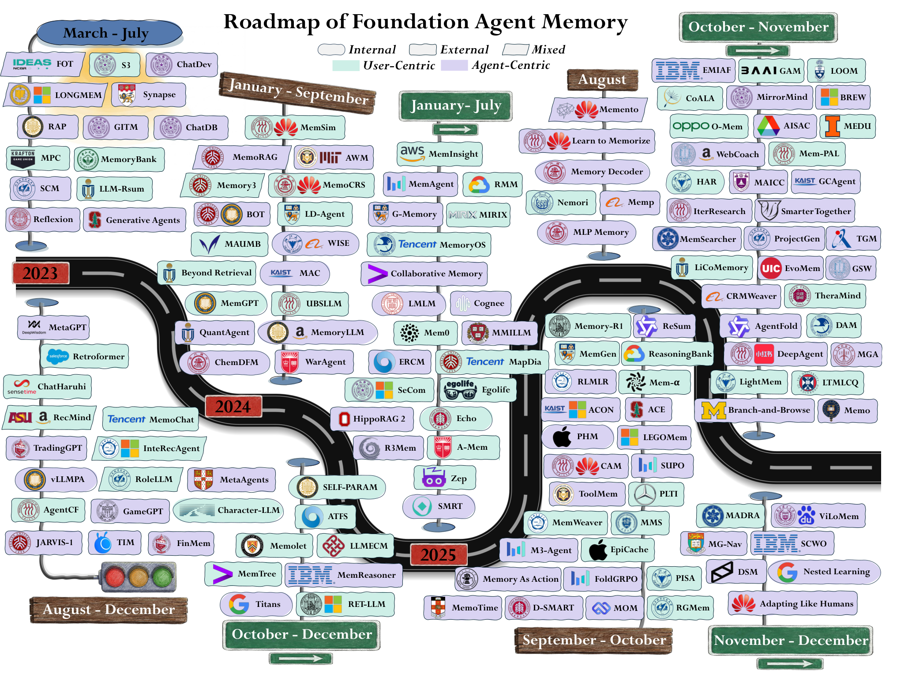
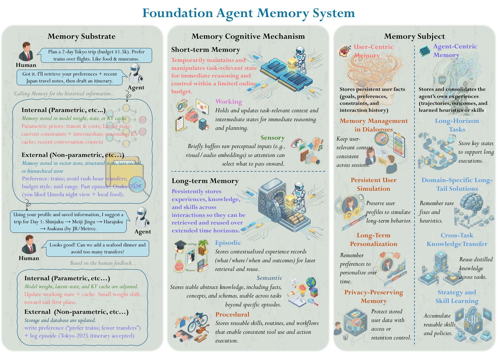
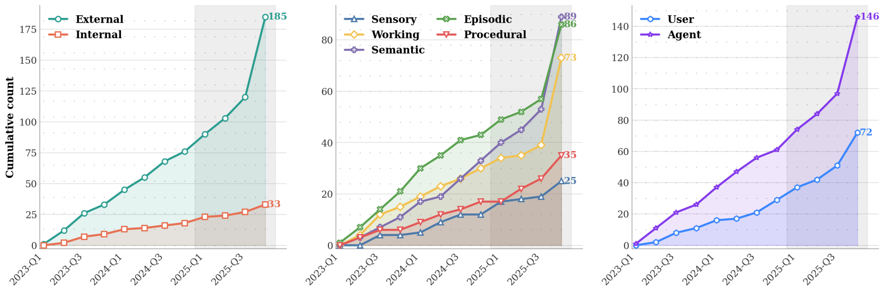
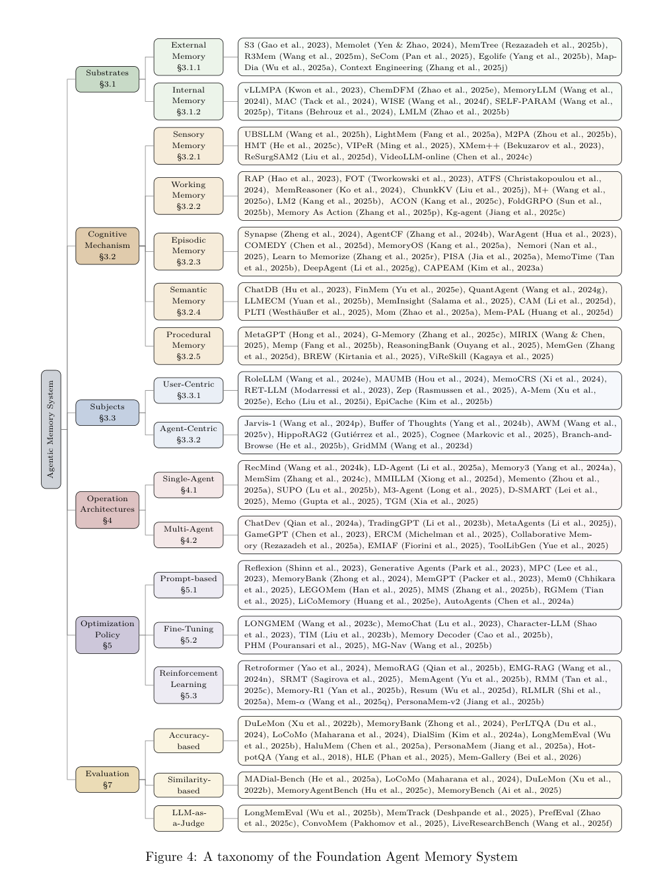
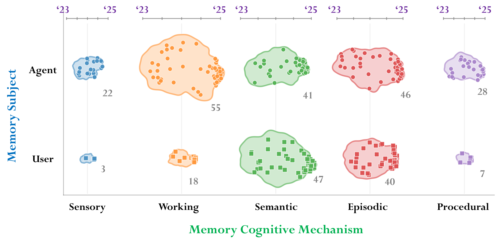
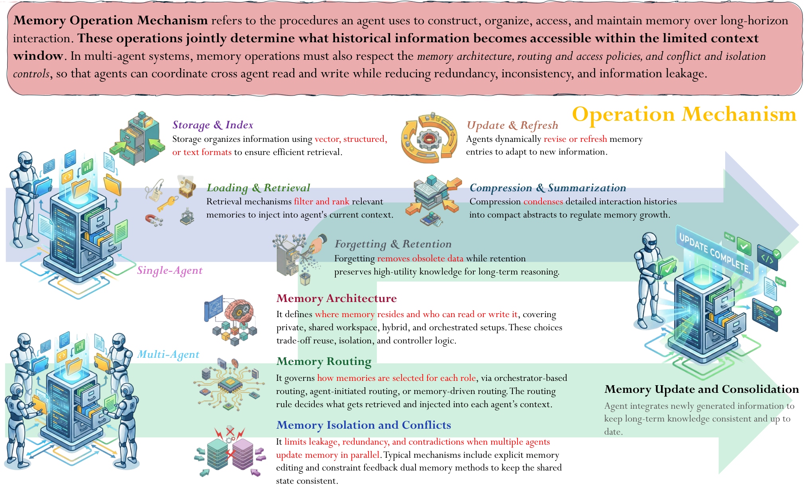
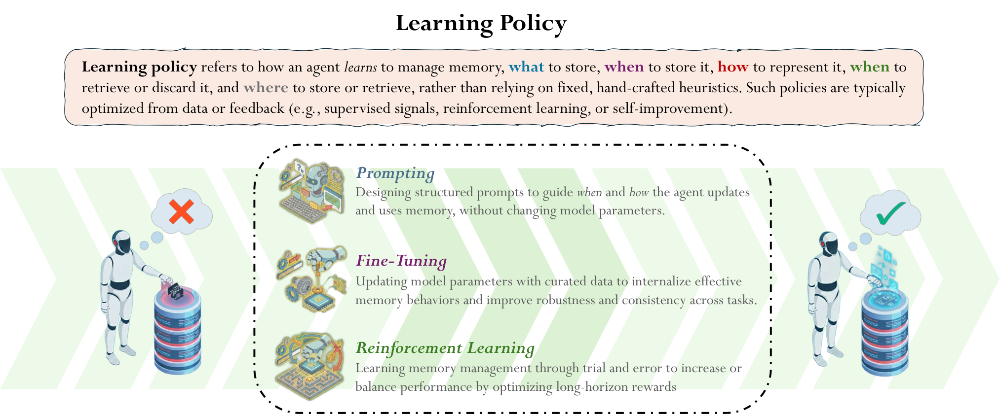
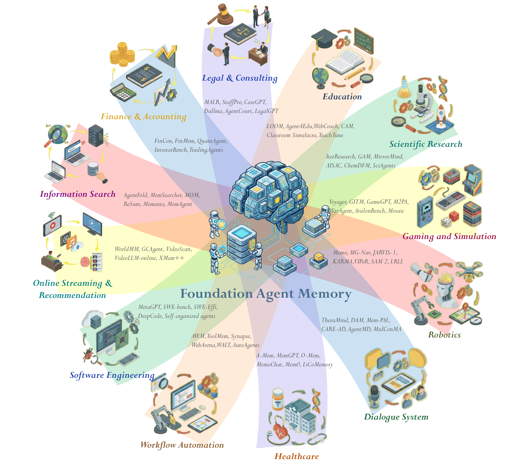
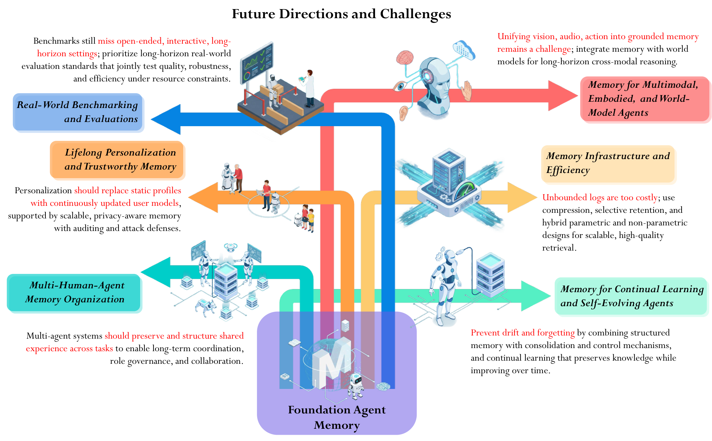

# A Survey of Agent Memory in the Second Half: Towards Self-Evolving and Long-Horizon Agents —— 全文中文翻译

> **论文元数据**
>
> - **英文标题**：A Survey of Agent Memory in the Second Half: Towards Self-Evolving and Long-Horizon Agents
> - **中文标题**：智能体记忆的“下半场”综述：迈向自我进化与长时程智能体
> - **作者**：Wei-Chieh Huang 等（共 60 位作者；完整作者列表见 arXiv 原文）
> - **arXiv**：[2602.06052](https://arxiv.org/abs/2602.06052)（固定翻译版本：v4，2026-08-04）
> - **篇幅**：90 页；HTML 结构统计为 15 个 figure 容器、6 个 table 元素
> - **翻译说明**：依据 arXiv HTML 与 PDF 对照进行分块翻译，并人工校订章节标题、摘要、核心术语、六张表和结论；章节层级、公式、图注和正文引用均保留。参考文献保留英文原样，不逐条翻译。图中英文标签沿用论文原图，中文含义见相邻图注与正文。

---

###### 摘要（Abstract）

人工智能研究正在经历一次范式转变：关注点正从模型创新和基准分数，转向问题定义和严格的真实世界评估。随着该领域进入“下半场”，核心挑战变成了如何在长时程、动态、依赖具体用户的环境中产生真实效用，例如智能体式编码、深度研究和计算机使用。在这些场景里，基于 LLM 的智能体面对远超固定上下文窗口的上下文爆炸，必须在持续交互中不断积累、管理并选择性复用大量信息。仅 2025 年就有数百篇相关论文发表，记忆因此成为弥合这种效用缺口的关键方向。

记忆不再只是被动存储，也越来越成为智能体自我进化的载体：短期记忆决定执行期间哪些经验会被感知、选择和抽象；长期记忆则积累这些经验并将其巩固为可复用的知识和技能，由此形成智能体依靠自身经验不断改进、维持持续学习的闭环。

本综述从三个维度统一组织基础智能体记忆：*记忆载体*，即内部参数状态与外部检索增强存储；*认知机制*，即感觉记忆、工作记忆、情节记忆、语义记忆和程序记忆；*记忆主体*，即以用户为中心的个性化，以及以智能体为中心的经验。随后，论文分析记忆如何在单智能体和多智能体拓扑中运行，并重点讨论针对记忆操作的学习策略，说明记忆管理本身如何成为一种可训练、可自我进化的能力。这条路线涵盖强化学习式上下文管理、决策时经验整合，以及通过智能体运行时、上下文工程和标准化工具中介协议暴露出来的显式、可移植、可共享技能生态。最后，论文回顾评估记忆效用的基准与指标，并提出开放挑战和未来方向。

OpenReview 评审页：<https://openreview.net/forum?id=XycbogUAeJ>

GitHub

[AgentMemoryWorld/Awesome-Agent-Memory](https://github.com/AgentMemoryWorld/Awesome-Agent-Memory)

图 1：基础智能体记忆路线图。时间线展示 2023 年至 2025 年发布的代表性框架，并按三个分类维度中的两个组织：记忆载体（内部、外部或混合）和记忆主体（以用户或智能体为中心）。

## 1. 引言（Introduction）

人工智能 (AI) 的格局现已经历了根本性的范式转变：从优先考虑基础模型架构和简化的基准性能到强调问题定义和严格的现实世界评估。
这标志着AI开发“上半场”的结束，其中进展主要由训练方法（Liu等人，2024a）、缩放（He等人，2016；Achiam等人，2023；Gu等人，2025）和模型架构（Vaswani等人，2017）驱动，这些反复推动在标准化基准上得分更高（Wang 等人，2024l；Krizhevsky 等人，2012）。
在此期间，该领域集中在缩放数据和模型大小的主导范式上。该范式遵循大规模预训练（Minaee et al., 2024）和后训练过程（Ouyang et al., 2022）的一般方法，以极高的准确性解决传统基准问题。在明确定义的训练管道下，大语言模型 (LLM) 和智能体可以在 MMLU ( Hendrycks et al., 2021b ) 或 MATH ( Hendrycks et al., 2021b ) 或 MATH ( Hendrycks et al., 2021b ) 等基准上实现 90% 以上的准确率等人，2021c）。因此，LLM 和智能体迅速从静态预测器（如传统的机器学习模型）演变为能够进行复杂推理（Wu et al., 2025e）、规划（Li et al., 2025i）和工具使用（Huang et al., 2025a；Zou）的通用智能体。等，2025b）在各种任务和环境中。在本综述中，我们将基础智能体定义为由基础模型（例如 LLM、Vision-Language 模型（VLM）或世界模型）驱动的自主或半自主系统，并通过感知、推理、规划、工具使用和记忆进行增强管理（有关更多详细信息，请参阅第 2 节）。

图 2：基础智能体记忆的分类。 基础智能体的记忆底层（表示什么形式）包括内部和外部记忆（第 3.1 节），其中内部记忆涵盖权重、潜在状态和 KV 缓存（第 3.1.2 节）和外部记忆涵盖向量索引、文本记录和结构/分层存储（第 3.1.1 节）。在记忆认知机制（记忆的功能）角度，记忆分为*感觉*、*工作*、*情景*、*语义*和*程序* 记忆（第 3.2 节；每种类型请参阅第 3.2.1–第 3.2.5 节）。基于记忆主题（受支持的对象），记忆的特征为*以用户为中心*和*以智能体为中心的* 视角（§3.3）。

尽管在标准基准测试中展示了令人印象深刻的功能，但报告的性能与许多现实世界任务和环境中的实用性之间仍然存在显着差距（Yu 等人，2024b）。大多数评估协议在很大程度上简化了实验假设并设计静态的预定义规则，并具有相对较短和孤立的任务设置（Cobbe 等人，2021；Chen 等人，2021；Budzianowski 等人，2018）。特别是，最近的智能体评估基准与较短的智能体式执行时间相结合，没有多轮、长期交互（Wang 等人，2024j；Lu 等人，2025a）。因此，这些评估不再反映基础智能体的现实能力，其中交互本质上是长时程、长上下文、深度依赖于用户且高度复杂的。随着该领域向更现实的设置过渡，例如体现的智能体（Li等人，2024b）、GUI自动化（Ye等人，2025a）、智能体式编码和计算机使用、深入研究（Huang等人，2025c）、个人医疗保健（Zhan等人） al.，2024）和 human-智能体合作（Feng 等人，2024；Zou 等人，2025c），操作环境的复杂性爆炸性增长，将智能体暴露在异常庞大和动态的环境中。
在这种情况下，静态的一次性能力是不够的。相反，智能体必须在交互过程中累积、保留并有选择地重用信息。因此，记忆成为弥合理想基准性能与实际实施和环境之间差距的关键且自然的解决方案（Zhang 等人，2025p）。与固定任务 AI 系统（其中记忆主要针对效率和成本进行优化）不同，基础智能体需要记忆支持动态长时程环境中的持续累积、选择性重用、跨会话保留和用户适应。

随着该领域进入AI开发的“下半场”，重点从改进训练配方转向解决现实中的关键效用问题（Bell等，2025；Yao等，2025）。如何设计一个基准来评估真实环境中的智能体已成为最重要的挑战之一（ Xu et al., 2025c ），特别是智能体努力适应两个主要的经验维度：面向用户的个性化（ Cai et al., 2025 ；Zhang et al., 2025n ； Wu et al., 2025d ）和面向任务的专业化（Ling et al., 2025；Zhang et al., 2025h）。在这两个维度上，特定用户的长期历史或垂直任务（例如编码（Islam et al., 2024）和网络搜索（He et al., 2024a））的交互上下文远远超出了仅基于提示的机制所能容纳的范围。随着日常交互中的多会话数据或项目工作中积累的上下文呈指数级增长，仅依赖静态记忆机制是不够的。因此，记忆架构从静态、预定义和简单的机制（Hao 等人，2023；Hu 等人，2023）发展为自适应、自我进化和灵活的单元（Liu 等人，2025g；Liu 等人，2025f），以智能地存储、加载、汇总、忘记并细化记忆，以便为下游任务保留丰富的经验。

这种转变在记忆层次结构中形成了一个闭环：工作记忆控制了进入和保留在活动环境中的内容，策展策略越来越多地通过强化学习而不是手工设计的启发式进行端到端训练（Zhang et al., 2025o ; Yuan et al., 2025a ; Zhou et al., 2025c ; Yu et al., 2025b）；保留下来的经验以情节记录的形式积累，经过反思和巩固，提炼成语义事实和程序技能（Yang et al., 2025a；Liu et al., 2025b；Ouyang et al., 2025），这些技能进一步外化为智能体自主诱导、修改和维护的明确的、可组合的和可共享的技能， 智能体通过上下文工程和标准化工具中介协议进行暴露（Wang 等人，2025c；Anthropic，2025；Belikova 等人，2026；Song 等人，2026；Zhang 等人，2026a）。因此，记忆不仅充当智能体历史的接口，而且作为智能体自我进化本身的基础（Gao 等人，2025a），一条贯穿认知机制（第 3.2 节）、记忆操作（第 4 节）和学习的线程政策（第 5 节）。

尽管基础智能体记忆研究的快速增长已经产生了多项综述，但在如何从现实世界的智能体公用设施设置中的系统设计角度分析智能体记忆方面仍然存在重要差距。这种记忆设计已从简短、孤立的提示转变为长时程交互，其中智能体必须在爆炸性的上下文窗口、多会话工作流程和持久的真实用户关系上运行。
早期的作品通常主要通过任务应用或管理策略来组织记忆（Zhang et al., 2025p；Du et al., 2025），或者采用神经科学启发的观点，通过功能类比和预测将AI 记忆投射到人类记忆上。 记忆生命周期（Wu et al., 2025f；Liang et al., 2025）。
虽然这些方法提供了有用的概念基础，但它们没有系统地描述底层记忆基底的特征，也没有明确地对记忆在智能体系统中服务的主题进行建模，而当上下文超出基础模型的限制时，这些方法就很重要。
因此，他们无法区分智能体记忆的优化目标，并且忽略了互补维度之间的联系，而这些联系对于在实际应用中设计和部署自主智能体系统至关重要。
最近的工作开始拓宽这一概念领域。特别是，胡等人。 (2025d) 按照形式、功能和时间动态组织智能体记忆。
尽管提供了记忆的有价值的整合，但它在很大程度上仍然是片面的，主要关注记忆如何在以智能体为中心的任务中发挥作用，而不是如何为用户设计、优化和部署记忆。这项综述的动机源于当前文献在检索增强生成 (RAG) 系统、长上下文建模、认知记忆架构、个性化、持续学习、反思和智能体评估方面的碎片化，使得研究人员很难理解不同的记忆机制如何关联以及如何设计记忆系统以实现实际部署。我们的综述通过三个贡献解决了这一差距：（1）连接基质、机制和主题维度的三维分类法，这些维度在之前的评论中经常单独讨论； (2) 对记忆如何跨单智能体拓扑和多智能体拓扑进行实例化、操作和评估的系统设计分析； （3）将记忆定位为现实世界实用性和智能体在AI发展的“下半场”自我进化和自我完善的中心机制，并有六个开放挑战来指导未来的研究。为此，我们从三个主要的互补角度分析了数百篇论文，将记忆与日益复杂的环境中的系统级设计选择联系起来。

具体来说，我们引入了围绕三个核心设计维度组织的统一分类法：记忆基底、认知机制和记忆主题，如图 2 所示。我们将现有的基础智能体记忆作品按基底分为外部和内部，按认知机制分为功能类别，如感觉、工作、情景、语义和程序记忆，并按主题分为以用户为中心与以智能体为中心的主题。从系统角度，我们进一步分析这些基础智能体记忆系统如何在不同的智能体拓扑下运行，区分single-智能体系统中的基本记忆操作和记忆路由多智能体设置。此外，我们强调了学习政策日益重要的作用，展示了智能体如何越来越多地接受培训来掌握记忆管理本身，从而从他们的交互历史中学习并随着时间的推移进行自我进化。这些学习策略闭合了短期选择和长期整合之间的循环，将记忆从被动管理的资源转变为主动发展的能力。为了反映环境变化对基础智能体记忆设计的影响，我们讨论了交互范围、环境复杂性以及交互智能体和系统的数量方面的可扩展性问题，并回顾了用于衡量记忆性能和实用性的评估方法和指标。最后，我们概述了基础智能体记忆中的六个开放挑战，以指导下一代基础智能体记忆设计。

图3：记忆-related研究在LLM 智能体中的累计发表趋势（2023 Q1 – 2025 Q4）。这些图显示了 218 篇收集的论文在三个关键维度上的分布：记忆基底（左）、记忆认知机制（中）和记忆主题（右）。阴影区域突出显示了 2025 年观察到的研究成果的快速加速。在左侧面板中，外部和内部分别指存储在模型外部的记忆（第 3.1.1 节）和模型权重和推理时间状态中保存的记忆（第 3.1.2 节）。中图和右图对应于认知机制（第 3.2 节）和记忆受试者（第 3.3 节）。一篇论文可能表现出多种认知机制，因此中间面板的总和超过了收集的 218 篇论文，而左右面板则将它们分开。

## 2. 背景（Background）

### 2.1 大语言模型与基础智能体

最近的进展使大语言模型超越了一次性问答，变成了基础智能体
( Park et al., 2023 ; Xi et al., 2025a ; Luo et al., 2025 ; Liu et al., 2025a )：能够感知环境、通过复杂目标进行推理并执行行动以实现指定目标的系统。与传统的“一次性”聊天机器人不同，智能体在一个完整的循环中运行：它解释指令、选择操作、观察结果并更新其内部状态或记忆。这种迭代交互使得智能体特别适合长时程动态问题解决。这种趋势在 Deep Research 和 Manus 等新兴智能体式产品中已经很明显，这些产品强调多步骤执行和工具增强决策而不是单轮响应（Zhang et al., 2025k）。

基础智能体通常是一个自治或半自治系统，它使用基础模型（例如 LLM）作为其核心决策模块，并通过状态估计、动作执行和记忆管理机制进行增强。
在本综述中，我们使用术语*基础智能体*来表示AI 智能体，其核心决策由通用基础模型驱动，包括大语言模型、视觉语言模型或学习世界模型。
核心能力通常包括任务分解和决策规划（Yao等，2023；Huang等，2024b）、通过外部函数或模型使用工具（Wu等，2025b；Yuan等，2025b；Lu等，2025a）、多模态感知（Liu等，2023a；Bai等，2025）、和记忆跨越短期背景和长期视野（Lumer 等人，2025；Wang 等人，2025s）。 记忆（Zhang et al., 2025p；Xiong et al., 2025d）变得尤为重要，因为上下文窗口是有限的并且环境随着时间的推移而演变；因此，许多智能体依赖于外部记忆存储，并结合总结（Lu et al., 2025b）、反思（Renze and Guven, 2024）或将经验压缩为可重用知识的整合程序（Kang et al., 2025；Yu et al., 2025b）。越来越多的工作进一步将基础智能体构建为自我进化系统，这些系统在部署时从自身的执行体验中进行改进，而不是仅仅通过离线训练（Gao 等人，2025a），并且新兴基准已经开始直接评估自我进化记忆上的这种经验驱动的测试时学习（Wei 等人，2025a）。 2025d）。 记忆是使这种自我进化成为可能的基础：如果没有记录、巩固和重用经验的机制，每一集都会使智能体保持不变，并且长时程交互退化为一系列孤立的一次性任务。 多智能体系统（Talebirad 和 Nadiri，2023；Wu 等人，2024b）通过向多个进行通信和协调的智能体分配专门的角色和记忆来扩展此范式（Lan 等人，2024；Estornell 等人，2025）。

基础智能体现在正在探索不同的现实世界应用，例如工作流程自动化（Xiong等人，2025c）、辅导（Wang等人，2025l）、网络和GUI交互（He等人，2024a；Wang等人，2025e）、模拟或真实环境中的体现控制（Fan）等人，2022；Yang 等人，2025b），以及智能体式科学援助的早期形式（Ren 等人，2025；Pantiukhin 等人，2025；Zheng 等人，2025d）。
尽管取得了这些进展，但仍然存在一些基本挑战。首先，长时程可靠性（Huang et al., 2024b；Xi et al., 2025b）需要防止复合错误、行为循环和不可靠的重新规划。其次，评估（Yehudai et al., 2025）应该超越静态的 QA，转向衡量动态、交互能力的基准，例如工具使用、多步骤决策和长时程反馈。第三，随着自主性和工具获取的扩展，一致性和安全性（Hua等，2024；Yuan等，2024a；Tian等，2023；Zhang等，2024b）变得越来越重要，需要更强的可控性保证。解决这些挑战最终可能会将当今使用工具的助手变成智能体，它们有足够的能力解决更复杂的任务，并且足够值得信赖，可以在现实世界的部署中保持可预测和可控。

### 2.2 记忆

记忆通常是指系统随着时间的推移保留、组织和利用信息的能力。在 LLM-based 基础智能体的背景下，记忆用于解释智能体如何超越单轮背景来支持长期交互、行为一致性和经验积累（Luo et al., 2025）。虽然生物学研究通常将记忆描述为持久的、经验驱动的神经变化（例如，突触可塑性和巩固（Hebb，2005；Bliss 和 Lømo，1973；Tonekawa 等人，2015）），但对于智能体系统，更相关的见解在于如何记忆的设计、实现和实际使用是为了支持不同的函数、表示和目标。

在人类认知模型中，记忆通常被理解为一组跨不同时间尺度组织的交互子系统。短期记忆支持在持续处理过程中临时保留和操作信息。 感觉记忆短暂缓冲原始感知输入，实现下游处理（Sperling，1960），而工作记忆在严格的容量限制下运行，并支持在线信息操作、推理和控制（Baddeley，2020；Baddeley，2000）。长期记忆支持长时间保留信息，并包含多个功能不同的系统。 情节记忆存储位于时间和上下文中的特定经验，语义记忆积累抽象事实和概念知识（Tulving，1972；Tulving，1985），而程序记忆捕获通常通过表现而非明确召回来隐式表达的技能、习惯和行动策略（Cohen 和 Squire，1980）乡绅，1992）。至关重要的是，这些子系统并不是孤立运行的。短期系统决定在持续处理过程中感知、选择和抽象哪些经验，而长期系统则积累这些经验并将其巩固为稳定的知识和技能；他们的互动，而不是任何单独的商店，构成了行为随着经验而改善的循环（Gao et al., 2025a）。我们对基础智能体也采用了这种系统视图：智能体记忆被视为一个集成的层次结构，其操作（从选择和保留到巩固和技能形成）本身可以被设计、优化，并且越来越多地从智能体自身的交互中学习。在生物系统中，记忆的功能差异最终基于物理基质，例如突触可塑性（Hebb，2005；Bliss 和 Lømo，1973；Martin 等人，2000）以及产生持久记忆痕迹或印迹的电路级变化（Tonekawa 等人， 2015；乔斯林和利根川，2020）。
虽然这些认知和生物学视角提供了必要的基础，但基础智能体记忆系统引入了额外的设计考虑因素，包括明确区分记忆旨在捕获和支持哪些信息、它在什么物理基础上实现、它发挥什么认知作用、构建分类法的三个问题，以及如何获取其操作策略（第 5 节）。

图 4：基础智能体记忆系统的分类

## 3. 基础智能体记忆的分类法

我们通过使用记忆-related 关键词（例如智能体记忆、长期记忆、上下文管理、个性化记忆）查询 Google Scholar 并手动审查主要计算机科学会议和期刊（包括顶级期刊）的会议记录，进行了系统的文献收集。 NLP、ML、IR 和 AI 场地）。从最初的数百篇论文中，我们通过迭代筛选筛选出最相关的贡献，最终选择了 2023 年 Q1 至 2025 年 Q4 之间发表的 218 篇关键文章。由此产生的趋势如图 3 所示，表明研究活动急剧升级，图 1 按时间线排列了代表性框架。最值得注意的是，2025 年累计出版量大幅增长，其中 Q4 增长最快。这些趋势表明对更智能的记忆设计的需求不断增长，使智能体能够在日益复杂的环境中完成长时程长上下文任务。

为了更好地区分记忆设计，我们沿着三个正交视角将记忆分类为基础智能体，如图2所示：
(1) 记忆底层，也称为存储格式，描述了记忆在不同设置中的表示形式，如第 3.1 节所示；
(2) 记忆认知机制，描述记忆在管道或工作流程中的功能角色，如第 3.2 节所示；
(3) 记忆记忆旨在捕获和支持其信息的主体，在第 3.3 节中进行了详细说明。此外，我们在图 4 中介绍了分类法。然后，我们介绍了记忆在单一系统和多智能体系统中的操作和管理（第 4 节）、学习策略（第 5 节）、扩展（第 6 节）、评估（第 7 节）、应用（第 8 节）和开放挑战（第 9 节）。

### 3.1 记忆载体

记忆基底是保留基础智能体与人类在各种任务和环境中交互过程中产生的历史知识的基本机制。根据当前研究的框架、存储介质和持久化机制，我们将这些基底分为外部和内部记忆。这些类别的定义和实现分别在第 3.1.1 和 3.1.2 节中详细阐述。

#### 3.1.1 外部记忆

外部记忆

*外部记忆*是指存储智能体模型参数或状态之外的知识、信息和过去经验的任何记忆基底。 智能体可以通过检索显式读取和写入外部记忆和更新操作，从而实现可扩展、易于更新、跨会话的知识和交互历史保留。

外部记忆表示以向量索引、文本记录、结构存储和分层存储形式存储信息的信息存储系统（Lewis et al., 2020；Zhang et al., 2023a）。它的运行独立于神经网络内的梯度更新权重。而且，它的特点是在 LLM 的内部参数内执行的计算与存储在外部数据库或记忆模块中的知识之间存在明显的分离（Mallen 等人，2023；Zhong 等人，2024）。这种分离的计算和检索设计允许智能体访问广泛且持续更新的信息，而不需要对基础模型进行昂贵的重新训练（Omidi 等人，2025；Aratchige 和 Ilmini，2025）。此外，外部记忆既可扩展又灵活。只需进行一些更改，就可以轻松添加、替换或插入到大多数框架中。此外，与内部记忆（Saha et al., 2021）不同，内部记忆可以由于新经验的权重更新而导致知识被覆盖或调整，外部记忆可以以其原始形式保存过去的信息，通过利用额外的存储模块帮助减少幻觉或知识中断（Castrillo et al., 2025）。

然而，这种设计也有缺点和权衡。通常，推理需要较长时间，因为智能体必须从外部存储检索信息。当智能体在多轮迭代或复杂环境中运行时，这个问题变得更加严重。此外，检索可能不可靠。如果相似性或排名算法不完善，它们可能会提供与当前任务无关或无帮助的结果。这些不相关的信息会引入噪声，可能会降低智能体的效用（Xu 等人，2025a）。随着系统运行时间的延长、轮次的增加以及记忆的增长，存储和索引成本的不断上升可能会进一步降低效率和性能（Chen 等人，2025e）。因此，一个结构良好的外部记忆通常需要可靠的程序来调节记忆的大小和质量，包括汇总、选择性保留、遗忘、重复数据删除以及定期修剪低价值或过时的项目（Du et al., 2025；He et al., 2024b）。

##### 向量索引

向量索引是通过将记忆项目或查询嵌入到共享向量空间中，运行近似最近邻搜索来获取 top-$k$ 项目，并将这些片段附加到提示作为基础上下文来实现的（Lewis et al., 2020；Zou et al., 2025a）。在智能体或 LLM 当前工作中，外部记忆的主要实现是向量数据库，在 RAG 框架内使用（Quinn 等人，2025；Li 等人，2025i；Zhang 等人，2025k）。该方法将记忆作为几何问题来操作。通过将文本或多模态信息嵌入到高维向量中，它将每个记忆项表示为连续空间中的一个点。新的查询也被转换为具有相同嵌入机制的向量，并且智能体搜索最近的点，这些数据代表最接近的语义信息。当前的技术，例如分层可导航小世界（HNSW）（Liu et al., 2025h）、倒排文件（IVF）（Rege et al., 2023）或乘积量化（PQ）（Huang and Huang, 2024）索引，被开发和优化以找到在高维嵌入空间中有效地获取语义最相似的文档或过去的交互。这种近似最近邻搜索检索一小组上下文片段，这些片段被映射回其原始形式并输入到智能体或 LLM 中，以将其响应与相关的、以前未见过的信息集成（Guu 等人，2020）。

##### 文本记录

文本记录记忆将智能体的长期记忆视为一组显式文本文档，而不是嵌入或图形（Zhang et al., 2025p）。它被实现为持久的人类可读文本工件（例如，正在运行的“核心摘要”加上情节日志），这些工件被定期汇总或编辑，并在生成下一个响应时有选择地复制到提示中。常见的实现会保留持久的核心摘要，并通过语义和情节列表对其进行扩充。语义列表存储离散事实，并且可以通过插入、更新和删除操作进行修改。相比之下，情节列表是带时间戳的事件和交互的按时间顺序排列的分类帐。在记忆更新期间，智能体会修改这些结构（Zhu et al., 2025c；Wang and Chen, 2025）。在响应生成过程中，它会提取有限的相关信息和实例，然后将它们重新集成到带有主要摘要的提示中。该架构通过将记忆构造为人类可读的摘要和列表来促进透明度和快速集成（Yue 等人，2025；Park 等人，2023）。然而，它需要细致的总结和修剪，以保持简洁的核心摘要和易于管理的列表。

##### 结构化存储

结构存储是通过将记忆存储在显式模式中并在格式化 LLM 上下文的返回记录之前通过符号查询或遍历检索它们来实现的。结构化的记忆架构（Jia et al., 2025a；Bei et al., 2025）基于拓扑设计，可以分为*关系表*、*基于图的记忆*或*基于树的记忆*。关系表使用 SQL 从表中检索行记录。他们可以将事实和偏好存储为结构化记录，将短期事务和长期事件分离到不同的表中，并使用连接和索引在不同表之间实现高效的检索（Wang et al., 2024d）。基于图的记忆将片段或信息片段表示为知识图谱中的节点和边（Anokhin 等人，2024）。知识图本质上是一个语义网络。它通常将信息组织成节点，实体和边捕获它们之间的关系。当新信息到达时，系统将语义嵌入和关键字搜索与遍历相结合，以检测边缘变化、解决冲突并维护有效的图结构（Jiang et al., 2025b）。基于树的记忆分层组织知识，树中的每个节点存储文本内容的聚合摘要和相应的语义嵌入，更深的分支代表更具体的细节（Sarthi et al., 2024）。当新信息到达时，系统遍历树并根据嵌入相似性更新或创建节点来决定信息存储的位置。这种动态机制支持多级抽象和高效的检索以支持长对话任务（Rezazadeh 等人，2025b）。结构化的记忆具有不同类型的格式，可以捕获顺序历史和关系并支持多级抽象。该技术为智能体提供了灵活性，并可控制记忆的存储、更新和查询方式。

##### 分层存储

分层记忆将记忆分成多个存储单元，每个存储单元都有自己的模式和存储策略。 智能体不是将所有内容保存在一个平面存档中，而是维护专用的记忆模块（Rezazadeh 等人，2025b；Zhai 等人，2025）。例如，智能体可以维护用于持久角色和用户事实的核心记忆、用于时间敏感事件的情节记忆、用于抽象概念的语义记忆、用于逐步指令的程序记忆、资源记忆用于文档和媒体，以及用于敏感或私人信息的知识存储（Yang 等人，2025a；Wang 等人，2025p）。每个模块都使用适合其内容的数据结构。例如，情节记忆可能存储带有事件类型、摘要、详细信息和时间戳的记录； 语义记忆可以按类型、摘要和来源组织条目； 程序记忆将工作流程编码为 JSON 序列；知识存储应用严格的访问控制来保护凭证和 API 密钥。 meta-记忆管理器（Wang 和 Chen，2025；Zhang 等人，2024a）协调这些模块，将查询定向到正确的存储并利用专门的检索方法（例如，*嵌入相似性*（Xu 等人，2025d）、*BM25 匹配*（Hu 等人， 2025c )，每个存储单元的*字符串匹配* ( Alla et al., 2025 ))。这种多商店基底具有模块化、关注点分离和可扩展性等优点，使得设计专用模式和检索路径变得更加容易，同时支持长期交互中的细微个性化。然而，协调多个记忆模块会增加系统架构的复杂性。在查询多个存储时，它可能会增加延迟和额外的资源成本，并且需要精心设计的机制来维护数据一致性并同步长时程任务中不同轮次之间的更新（Sun 和 Zeng，2025；Li 等人，2025k；Maragheh 和 Deldjoo，2025）。

#### 3.1.2 内部记忆

内部记忆

*内部记忆*是指直接存储在模型架构中的信息，包括嵌入其参数中的持久知识（即参数记忆）和推理过程中使用的工作状态。

##### 权重

权重记忆是通过将记忆写入参数来实现的，因此模型稍后可以在不检索外部上下文的情况下召回信息。通过*预训练*、*后训练*或*目标参数编辑*将知识或经验直接嵌入到神经网络的参数中（Mallen et al., 2023）（Wang et al., 2025q；Ampel et al., 2025；Wang et al., 2024h）。由于这些知识是内部的，因此这些模型可以有效且稳健地召回事实和过去的事件，而无需与外部存储进行通信。然而，维护和更新内部权重具有挑战性。因此，最近的研究将权重更新分为三种主要策略：*持续学习*、*模型编辑*和*蒸馏*。持续学习方法利用新信息逐步更新模型的权重，同时试图避免灾难性遗忘（De Lange et al., 2021）。规范更改以防止覆盖重要权重和应用软掩模有选择地更新参数等方法可以在识别新信息的同时很大程度上保留先前的领域知识（Serra et al., 2018）。模型编辑策略将特定的事实关联视为局部记忆并调整相应的参数：一项工作定位决定性的中间层权重并应用一级更新来更改单个事实关联，而另一项工作则扩展了这一想法，通过跨多个层应用小更新来更新数千个记忆（Meng et al., 2022；Meng et al., 2023）。例如，一些方法表明，使用增强数据仔细微调模型可以实现可比的编辑性能。另一种方法是插入一些新的神经元来顺序纠正错误，而不影响不相关的行为。另一种方法添加校准记忆槽，用于存储校正后的事实而不改变原始参数（Chhetri 等人，2025；Luo 和 Specia，2024）。蒸馏技术将上下文知识压缩到参数本身中。他们可以通过训练学生重现提示教师的输出（例如，提示权重或上下文蒸馏），将提示或上下文相关的行为内化为模型参数。具体来说，一些方法优化了模型，使其表现得好像在推理时隐式存在固定提示（Cao et al., 2025a；Padmanabhan et al., 2023）。虽然这种基于参数的记忆可以在推理时提高召回效率，但修改权重的计算成本很高，并且可能会干扰、覆盖或扭曲先前学习的知识（Meng et al., 2023）。

##### 潜在状态

潜在状态记忆是通过跨步骤或段转发和重用中间隐藏状态来实现的。即使原始token不再位于窗口中，早期的激活也会直接影响以后的计算。中间激活或隐藏状态张量是在前向传递过程中信息流过各层时产生的（Ibanez-Lissen 等人，2025）。这些隐藏状态是将固定学习参数与当前提示相结合的分层表示，形成驱动下一个token预测的模型工作状态。与基于重量的记忆不同，状态记忆并不持久。它通常在运行时激活期间创建，然后使用，并且通常在请求结束时丢弃或重置。因此，它支持会话内的连贯性和推理，但不会跨会话保留知识，除非导出到外部。关键的权衡是资源成本。环境不仅必须保存记忆中的参数，还必须保存中间状态，并且该激活值随模型深度、批量大小和精度缩放。高效且优化的潜在状态管理可降低推理延迟和记忆成本。一个代表性方向跨层重建隐藏表示，以可控成本强化早期上下文（Dillon 等人，2025）。
与重建相反，其他工作跨段缓存隐藏状态向量或记忆 token的紧凑子集，从而将有效上下文长度扩展到固定窗口之外，同时减少记忆和计算成本（Dai et al., 2019）。
除了重用现有状态之外，还可以生成潜在状态记忆。 记忆触发器和记忆编织器合成机器本地潜在标记，这些标记被反馈到模型中以丰富下游推理（Zhang et al., 2025c）。同时，隐藏状态转换的结构化调制保持与先前上下文一致的潜在轨迹，这可以减少长序列中的语义漂移（Carson 和 Reisizadeh，2025）。此外，一些架构将压缩记忆集成到注意力机制中，以存储和重用之前片段的键值对，从而能够处理具有有界记忆的非常长的输入（Munkhdalai 等人，2024）。其他策略将隐藏状态视为在推理过程中通过小优化步骤更新的快速权重，以细化扩展上下文上的内部表示（Zhu et al., 2025b）。

##### KV Cache

在基于 Transformer 的 LLM 中，KV 缓存是瞬态推理时间记忆，可加速自回归解码（Kwon 等人，2023；Liu 等人，2023c）。它是通过在解码期间缓存来自先前token的每层注意键和值并将它们重用于后续token来实现的。在自注意力期间，每个标记都被投影为键和值（Ge et al., 2023；Pope et al., 2023）。如果没有 KV 缓存，这些矩阵会在每一步中针对所有先前的标记重新计算，从而导致不必要的资源浪费并减慢长序列的生成速度（Cai 等人，2024；Feng 等人，2025b）。 KV 缓存存储早期token中的键和值，并且在每个新步骤中，仅针对新生成的token计算它们，并从缓存中检索其余部分。这种机制显着加速了推理，特别是在长输出或大而深的模型上，但代价是更高的记忆使用率和实现复杂性（Pope 等人，2023；Kwon 等人，2023）。最近的研究提出了几种用于压缩 KV 缓存的高影响力方法。一种方法认识到一小部分token对注意力分数贡献最大，并动态地驱逐其余token，从而平衡“重量级人物”与最近生成的token。该方法实现了吞吐量的大幅提升，同时仅保留一小部分缓存（Zhang et al., 2023b）。另一种技术可以识别提示观察窗口内一致的注意力模式，并对重要特征进行聚类，以实现长输入序列的大幅速度和记忆节省（Li et al., 2024d）。另一种方法观察到各层真正需要的键值向量数量不同，而不是为每个层提供相同的缓存大小，而是按重要性对向量进行排名，并使用二分搜索来决定每层在全局预算下保留多少个向量，因此只保留信息最丰富的向量（Wang et al., 2024a）。当前的这些研究表明，可以有效地使用 KV 缓存来显着提高模型性能。

#### 3.1.3 不同记忆载体之间的权衡

不同的记忆基板具有不同的优点和缺点。它们在访问速度、可扩展性、适应性和可靠性方面进行权衡，这在长时程任务中很快就会体现出来。在实践中，选择通常取决于快速、精确的内部状态与可扩展的外部存储，后者随着其增长而变得嘈杂。表 1 总结了八个操作维度的权衡：检索延迟（访问存储信息的时间成本）、存储成本（需要记忆占用空间）、更新灵活性（修改存储内容的便利性）、上下文窗口开销（上下文窗口的额外负担）、跨会话持久性（无论信息是否存在）跨会话生存）、可扩展性（适应不断增长的记忆的能力）、遗忘风险（修改后知识退化的敏感性）和检索精度（定位相关存储信息的准确性）。

表 1：记忆基板在八个操作维度上的权衡比较分析。

| 维度 | 内部记忆（§3.1.2） | 外部记忆（§3.1.1） |
| --- | --- | --- |
| 检索延迟 | 低；通过前向传播或 GPU 驻留缓存访问 | 可变；取决于索引结构、语料库大小和检索算法 |
| 存储成本 | 高；与模型深度和序列长度成比例 | 中等；根据存储的条目进行扩展，独立于模型架构 |
| 更新灵活性 | 低；需要微调、模型编辑或蒸馏 | 高；支持显式插入、更新、删除，无需修改参数 |
| 上下文窗口开销 | 对于潜在状态和 KV 缓存基底很重要 | 中等；检索到的条目必须序列化为提示 |
| 跨会话持久性 | 部分；权重可以持续存在，但潜在状态和 KV cache 会被丢弃 | 持久；条目可以跨会话保存 |
| 可扩展性 | 受约束；训练时参数容量固定 | 高；存储增长独立于模型架构 |
| 遗忘风险 | 参数载体较高，可能发生灾难性遗忘；KV cache 不具备持久性 | 可忽略；除非显式修改，否则原始条目会保留 |
| 检索精度 | 由学习到的关联隐式决定；KV cache 在会话内精度较高 | 可变；对 embedding 质量和排序算法敏感 |
| 代表性工作 | MemoryLLM、WISE、SELF-PARAM（参数）；vLLMPA、Titans、ChunkKV、EpiCache（latent/KV） | Mem0、Zep、A-Mem、HippoRAG2、MIRIX、MemTree |

内部记忆，包括模型权重中编码的参数记忆，通常提供高速访问和与推理的紧密集成。然而，更新成本高昂，并且可能因频繁修改而遭受灾难性遗忘。因此，它比快速变化的或特定于用户的信息更适合稳定的通用知识。隐藏激活或 KV 缓存等潜在基质快速且瞬态，使其非常适合会话内状态。然而，它们的短暂性和序列长度的线性缩放限制了容量，并使它们不适合跨会话保留。此外，潜在状态和 KV 缓存基底直接占用上下文预算，造成显着的上下文窗口开销，并且它们的存储成本随着模型深度、批量大小和精度而变化。

外部记忆，由向量数据库或存储组成，可根据经验自然扩展，并支持灵活编辑，无需重新培训。但是，检索增加了延迟，并使性能对索引和检索质量敏感。先前的研究表明，存储过多或低质量的项目会注入噪音并增加定位信息项目的难度，从而降低紧密耦合的决策能力（Liu et al., 2024b）。 检索精度进一步取决于嵌入质量、相似性度量和排名算法，这使其成为外部记忆系统的关键设计考虑因素。为了更好地解决这个问题，需要明确的记忆管理机制，例如剪枝、汇总和分层组织。

总体而言，如表 1 中总结的互补优势和局限性所示，没有单一基质在各种设置和环境中占主导地位。有效的系统设计越来越多地采用混合记忆架构，使用内部或参数记忆来存储固有知识或事实，使用潜在记忆来进行快速短期推理，使用外部记忆来进行可扩展的经验存储。这种模式反映了从静态或持久的、定义的知识存储机制到更动态和适应性更强的方法的更广泛转变，可以处理现实世界任务的复杂性。

### 3.2 记忆认知机制

人类记忆提供了一个用于分析基于 LLM 的智能体中的记忆的概念支架（Kim 等人，2023b；Li 和 Li，2024；Sumers 等人，2023）。认知心理学区分了多个相互作用的系统，这些系统解释了信息如何被感知、维护和重用（Baddeley，2020；Tulving，1972）。虽然文献中提出了多种认知记忆类型，但我们重点关注与基于 LLM 的智能体特别相关的一组五种原子认知记忆系统：感觉、工作、情景、语义和程序记忆。表 2 通过将核心功能角色映射到代表性研究方向和说明性智能体级实现，总结了这五个记忆系统。这五个系统构成了认知记忆的最小且在架构上完整的分解，而其他记忆构造，例如自传（Conway 和 Pleydell-Pearce，2000）或前瞻性记忆（爱因斯坦和 McDaniel，1990）可以可以理解为基于它们的组合或功能抽象。因此，我们的分类法围绕这五种原子记忆类型进行组织，这些类型涵盖了当前智能体架构中通常显式或隐式实现的短期和长期记忆机制。
除了各自的功能之外，这五个系统在智能体的自我进化中发挥着互补的作用：短期系统（感官和工作记忆）在执行过程中感知、选择和抽象经验，而长期系统（情景、语义和程序记忆）积累这些经验并将其巩固为可重用的知识和技能，共同形成循环智能体根据自己的经验进行改进（Gao 等人，2025a）。

表 2：将五个认知记忆系统映射到其功能角色以及基础智能体中相应的记忆设计方向，并附有说明性智能体级示例。

| 认知类型 | 功能角色 | 核心研究集中在 LLM 智能体（代表作品） | 实现 |
| --- | --- | --- | --- |
| 短期记忆 | | | |
| 感觉记忆 | 感知到了什么。   在进一步处理之前短暂保留最近的视觉、听觉或其他感官输入。 | 多模式流的感知缓冲和轻量级缓存，例如短期嵌入队列和感知状态缓冲区（He et al., 2025b；Fang et al., 2025a；Zhou et al., 2025b；Di et al., 2025）。   时间门控和选择机制，可稳定下游推理和控制的噪声或高带宽观测（Mon-Williams 等人，2025；Bjorck 等人，2025；Black 等人，2025；Ravi 等人，2024；Liu 等人，2025d）。 | 最后 2-5 秒音频和视频帧（或最近的传感器嵌入）的短滚动缓冲区，以平滑感知并处理短暂的遮挡。 |
| 工作记忆 | 当前正在处理什么。   暂时持有和操纵当前信息。 | 预写表示整形，减少必须进入活动上下文的内容，包括压缩、折叠和抽象感知表示（Labate 等人，2025；Kang 等人，2025；Wu 等人，2025c；Sun 等人，2025b；Ye 等人，2025b）。   固定预算下的在线状态维护和自我进化管理，包括上下文和 KV 状态的更新、驱逐和运行时控制，管理策略越来越多地从智能体自己的经验中学习（Zhang et al., 2025o ; Yuan et al., 2025a ; Zhou et al., 2025c；Yu 等人，2025b；Kim 等人，2025b；Kwon 等人，2023；Ni 等人，2025）。 | 正在进行的推理状态（思想链）：“目标：完善综述；前面的部分设定了框架；下一次修订应保持框架的一致性。” |
| 长期记忆 | | | |
| 情节记忆 | 发生了什么事。   具体经历的上下文记录。 | 情节记录和结构，包括写什么、如何组织事件和轨迹以及多尺度情节形成（Rajesh 等人，2025；Yeo 等人，2025a；Yeo 等人，2025b；Anokhin 等人，2024）。   检索，决策时的反思和经验巩固，包括自适应触发、情节选择、保留策略以及将情节提炼成可重用知识以进行自我进化（Yeo et al., 2025b；Latimer et al., 2025；Li et al., 2025f；Sarin et al., 2025；Alqithami， 2025；杨等人，2025a；刘等人，2025b)。 | 过去的交互日志：“上次您喜欢 2 页的摘要；之前的计划由于缺少 API 密钥而失败”，与其时间和情境上下文一起存储。 |
| 语义记忆 | 什么是已知的。   关于世界的概念和事实知识。 | 将知识归纳并组织成可重用的表示，包括记忆图、模式和紧凑的神经表示（Zhao et al., 2025a；Jia et al., 2025a；Li et al., 2025d；Rasmussen et al., 2025；Behrouz et al., 2024） ; Wang 等人，2024k ；Pouransari 等人，2025）。   推理过程中的知识获取和可靠性控制，包括分布偏移下的选择性激活、验证和持续修订（Jimenez Gutierrez et al., 2024；Wang et al., 2025m；Rezazadeh et al., 2025b；Yan et al., 2025b；Wang et al., 2024f；Alqithami, 2025）。 | 知识库：通过查询检索实体或事实（例如项目信息、偏好、定义）并检查可靠性。 |
| 程序记忆 | 如何行动。   技能和行动模式。 | 技能归纳和包装，从经验、工具或交互痕迹中学习可重用的程序，越来越外化为可移植和可共享的技能( Hong et al., 2024 ; Fang et al., 2025b ; Han et al., 2025 ; Zhuang et al., 2025c ; Xia et al., 2025 ; Wang et al., 2025c；Anthropic，2025；徐和严，2026）。   技能执行、组合和适应，在长期变化的背景下调用和完善程序，包括自我进化技能库的维护（Ouyang et al., 2025 ; Li et al., 2025h ; Tablan et al., 2025 ; Terranova et al., 2025 ; Wang and Chen, 2025 ; Belikova et al., 2026；宋等人，2026）。 | 可重用的工作流程或工具技能：“搜索 $\rightarrow$ 读取 $\rightarrow$ 提取 $\rightarrow$ 引用”或“使用消毒剂进行调试”，作为例程调用。 |

#### 3.2.1 感觉记忆

感觉记忆

感觉记忆是指暂时保留传入的感知信号，通过短暂保留原始输入足够长的时间，以便系统决定下一步要处理什么，从而允许注意和选择机制在发生更高级别的处理之前运行。

在当前的基础智能体中，感觉记忆通常没有显式建模。
这主要是由于文本输入的高度抽象性质，其中感知处理已经被分解为符号或语言表示。
与编码稳定知识的记忆系统相比，感觉记忆充当感知和认知之间的瞬态接口，在非常短的时间尺度内跨多种感官模式运行（Atkinson 和 Shiffrin，1968）。
然而，在多模式或体现的智能体中，类似的机制以短暂的感知缓冲区的形式出现，例如视觉、听觉或交互嵌入的缓存。
这些缓冲区充当感官阶段，在过滤、汇总或路由到工作记忆进行下游推理和控制之前，暂时保留经过最低限度处理的观察结果。

只有有限数量的 LLM 智能体作品明确实例化感觉记忆作为其记忆架构中的不同阶段。分层和多阶段设计，例如 HMT（He 等人，2025b）、LightMem（Fang 等人，2025a）和 M2PA（Zhou 等人，2025b）模型感觉记忆作为初始缓冲区在选择、压缩或合并到下游记忆组件之前保留最近的、经过最少处理的输入。除了这些显式表述之外，隐式感觉记忆实现在流媒体和体现智能体中更为常见。 SAM2（Ravi 等人，2024）和 ReSurgSAM2（Liu 等人，2025d）等系统在最近的视频帧上维护短期感知队列，而 ReKV（Di 等人，2025）和V-Rex（Kim 等人，2025a）依靠流式 KV 缓存或记忆队列来在在线推理期间保留最近的token或视觉表示。尽管这些机制很少被标记为感觉记忆，但它们通过缓冲最近的观察来提供类似的功能，以支持感知连续性和计算效率，并且通常与工作和语义记忆紧密耦合，而不是作为独立的认知模块实现。

尽管在当前的 LLM 智能体研究中对其明确的处理有限，但随着智能体在多模式、实体和机器人环境中的部署，感觉记忆可能会变得越来越重要。
在这种环境中，智能体必须在实时和记忆约束下处理连续的高带宽传感流，例如视频帧、音频信号和本体感觉（Black 等人，2025；Bjorck 等人，2025；Mon-Williams 等人，2025）。
在这些具体应用中，感觉记忆通常通过感觉级缓冲和门控机制来实例化，例如短期感知嵌入缓冲区、注意力驱动过滤和时间集成，而不是明确标记的认知模块。
这些设计减少了冗余计算，稳定了部分可观察的环境，并支持从原始感官输入到工作和情节记忆的原则性整合。
因此，感觉记忆的更明确建模可能成为可扩展的实体机器人基础智能体的关键设计考虑因素。

#### 3.2.2 工作记忆

工作记忆

*工作记忆*是指一种短期记忆机制，支持对推理、理解、学习等复杂任务所需信息的临时存储和主动操作，使信息在持续操作过程中能够被主动维护。

在基于 LLM 的智能体设置中，工作记忆（Baddeley，2020）的核心目标是在严格的在线容量限制下维护和操作任务相关状态，以便多步推理和行动可以不间断地进行。
由于 LLM 本质上是无状态的，因此工作记忆提供了一种机制，通过该机制可以跨交互步骤显式地携带和更新此类状态。
除了充当被动缓冲区之外，工作记忆管理本身也越来越被视为智能体的自适应功能：最近的智能体不再仅仅依赖于手工设计的截断或汇总启发式方法，而是从自己的交互经验中学习如何管理进入和保留在主动上下文中的内容，使工作记忆成为直接对象智能体的自我进化（Gao et al., 2025a）。

基础智能体中的工作记忆最常通过活动上下文实例化，其中包括提示上下文、中间推理跟踪、工具输出和运行时状态（例如推理期间可访问的键值缓存）。
在此实例化中，现有方法在执行过程中干预的位置有所不同。
其中一项工作重点是任务相关状态在写入活动上下文之前或写入活动上下文时如何表示。
通过压缩（Kang et al., 2025；Wu et al., 2025c）、重组（Sun et al., 2025b；Ye et al., 2025b）或抽象交互历史（Labate et al., 2025），这些方法旨在延迟或避免源头的上下文饱和。
具体来说，Labate 等人。 (2025) 用轻量级参考替换了大型中间输出，而 Kang 等人。 (2025);吴等人。 （2025c）；孙等人。 (2025b);叶等人。 （2025b）定期总结或折叠已完成的推理片段以保持紧凑的工作环境。
第二行工作在工作状态已经累积之后解决该问题。
这些方法研究如何在执行期间在固定的在线预算下持续维护、更新或驱逐任务相关状态。
在系统级别，运行时机制管理键值缓存和调度等状态（Kim et al., 2025b；Liu et al., 2025i；Kwon et al., 2023；Ni et al., 2025）。在智能体级别，越来越多的工作超越了固定启发式，转向自我进化工作记忆管理，其中策展策略本身是从智能体自己的经验中学习的：智能体通常通过强化学习进行端到端训练，以决定要做什么保留、巩固或丢弃作为推理循环的一个组成部分（Zhang et al., 2025o；Yuan et al., 2025a；Zhou et al., 2025c；Yu et al., 2025b）。一个补充方向将工作上下文本身视为跨任务改进的可进化基础，要么通过不断将执行体验提炼为结构化、可重用的上下文（Zhang et al., 2025i；Suzgun et al., 2025），要么将运行时记忆状态暴露给智能体，以便它可以在执行期间自动存档和恢复自己的上下文（Xu et al., 2025i）。等，2026）。

综上所述，基础智能体中的工作记忆作为智能体的在线工作空间，是在严格的容量限制下通过活动上下文实现的。
现有的工作表明，维持连贯的长时程推理取决于在执行过程中选择性地保留和操作任务相关状态，而不是将较长的上下文窗口作为唯一的解决方案。
这一转变将工作记忆从被动上下文缓冲区重新构建为自我管理的工作空间：反映了智能体记忆从静态、预定义机制到自适应和自我进化设计的更广泛演变，管理工作记忆的策略越来越多地从智能体自己的经验中学习和完善而不是提前固定。 工作记忆进一步充当此自我进化循环的网关，因为短期状态必须经过它才能合并为情景、语义或程序记忆，并且在此阶段执行的选择和抽象决定了智能体以后可以从中学习哪些经验（第 5 节）。随着智能体扩展到更长的视野和更复杂的交互设置，工作记忆的进展将因此取决于有原则的、越来越多的自我进化状态选择和转换，而不是无限制的上下文扩展。

#### 3.2.3 情节记忆

情节记忆

*情节记忆* 是指一种长期记忆的形式，专用于持久存储智能体的跨会话交互体验。它记录特定时间和环境背景下的特定事件，通常组织为交互轨迹、动作序列和相关反馈。

情节记忆在基础智能体中的主要作用是在较长的时间范围内保留历史交互上下文和结果，使智能体能够在与正在进行的交互或决策相关时参考过去的经验（Tulving，1983；Tulving，2002）。
通过保持对过去具体经验的访问，情节记忆支持动态环境中的背景重建和跨会话连续性。这使得智能体将他们的行为扎根于之前观察到的情况，在重复交互中保持一致性，并恢复会话之间可能丢失的相关上下文。

基础智能体中的情节记忆最常被实例化为显式经验存储库，该存储库累积跨会话的交互历史记录，并且可以在需要时由智能体访问。从方法论的角度来看，基础智能体中情节记忆的现有工作可以根据其主要关注点分为两个主要研究方向。
其中一项工作重点是情节记录，即如何将跨会话的历史交互组织成连贯的情节记录，以保留事件结构和情境背景。
对于跨会话交互历史记录，Rajesh 等人。 （2025）强调选择性的情节写作和过去互动的结构化组织，使存储什么以及如何组织情节内容变得明确。
对于长视频理解，Yeo 等人。 （2025a）通过将事件及其时间和因果关系组织在一起来构建情节记录，从而实现扩展视觉体验的连贯的情景级表示。
更广泛地说，Yeo 等人。 (2025b) 表示多个时间尺度的情景事件，允许情景形成和访问适应不同的粒度级别。阿诺欣等人。 (2024) 将情景观察与语义锚联系起来，从而在规划过程中实现情景召回。
第二个工作重点是检索和反射，即如何在决策时触发、选择和利用存储的事件。
杨等人。 (2025b) 将情景检索表述为自适应过程，该过程根据查询和检索历史迭代地选择记忆源和时间尺度。
拉蒂默等人。 （2025）定义了显式召回和反思操作，这些操作根据事件与当前推理上下文的相关性来检索事件，并使用它们来指导后续行为。
在工具使用设置中，Li 等人。 （2025f）通过将当前执行状态与从过去轨迹得出的结构化表示相匹配来检索情景经验。
对于多会话对话，Sarin 等人。 (2025) 使用会话级上下文和用户状态提示触发情景检索，以召回跨会话的相关情景摘要。
最后，Alqithami（2025）表明，固定记忆预算下的保留政策直接决定哪些事件在长期内仍然可检索。

总体而言，情节记忆中的基础智能体研究的重点是保留跨会话的具体交互体验，并允许在决策时选择性地访问这些体验。现有的工作主要解决两个方法论问题：情节记录和情节检索或反思。
从自我进化的角度来看，情节记忆进一步充当了智能体能力增长的经验基础：积累的事件不仅被检索以告知个人决策，而且还通过反思和整合被提炼为语义事实和程序技能，使智能体能够从自己的执行历史中不断改进（Yang et al.）等人，2025a；刘等人，2025b；欧阳等人，2025）。
悬而未决的问题包括智能体应如何定义情节边界、调节推理过程中情节召回的影响以及按情节记忆规模管理长期保留。

#### 3.2.4 语义记忆

语义记忆

*语义记忆*是指长期记忆的一种形式，专用于存储抽象事实、一般概念和结构化知识。它为智能体提供脱离上下文的信息，这些信息随着时间的推移保持稳定，并且可以在不同的情况和目标中重复使用。

在基础智能体架构中，语义记忆充当稳定的知识库，支持了解事实推理（Tulving，1972）。其内容通常是通过对情节记忆中积累的重复事实进行蒸馏和去上下文化而得出的。当智能体在多个任务中遇到相似的知识模式时，来自个人经验的碎片事实信息通过摘要机制整合为通用概念、实体关系或属性摘要。这一语义化过程为智能体配备了类似于百科全书或技术手册的知识基础。通过直接访问经过验证的概念知识而不是重复的原始交互日志检索，语义记忆为复杂的推理和决策提供了连贯且可靠的事实基础。重要的是，在长时程智能体设置中，语义记忆不是静态的，而是随着新信息的积累而不断访问、修订和控制。

现有的语义记忆方法的主要区别在于如何构建和稳定抽象知识，以及如何长期选择、验证和维护抽象知识。
其中一项工作重点是知识归纳和组织，研究如何从交互、文档或外部证据中提取稳定的、脱离语境的知识，并以可被智能体可靠地重用的形式存储。代表性方法使用分层模式（Zhao et al., 2025a；Jia et al., 2025a）、记忆图（Rasmussen et al., 2025；Wang et al., 2024m）或以条目为中心的语义结构（Xu et al., 2025e；Li et al., 2025d）来组织语义知识。 ），支持推理过程中的长期维护和结构化访问。其他方法将语义知识编码到神经记忆模块（Behrouz 等人，2024；Wang 等人，2024k）或辅助参数（Wang 等人，2025o；Pouransari 等人，2025），强调紧凑表示和快速重用，而不依赖于显式外部结构。
第二个工作重点是随着新证据的积累，语义知识在智能体推理过程中如何被激活、验证和更新。代表性方法将语义访问视为决策时间控制过程，其中抽象知识被选择性地选择、检查适用性并应用于当前推理状态，而不是通过固定的相似性查找来检索（Jimenez Gutierrez 等人，2024；Wang 等人，2025m；Rezazadeh 等人，2025b；Yan 等人，2025b）。其他工作通过引入偏好漂移检测（Sun 等人，2025a）、保留或遗忘策略（Alqithami，2025）和持续知识编辑（Wang 等人，2024f）机制来强调长期语义可靠性，以防止过时或不一致的知识降低智能体行为。

总之，语义记忆通过提供稳定且可修改的知识基础来补充工作和情节记忆。它是把碎片化的经验提炼成稳定的、可重用的规律和事实的主要站点。通过从特定事件中剥离通用知识本体，它为智能体配备了跨域任务所需的常识基础。随着研究的进展，语义记忆正在从简单的文档存储向自我进化语义网络演进，确保智能体在长期运行中保持准确一致的知识体系。

#### 3.2.5 程序记忆

程序记忆

*程序记忆*是指专门用于如何执行任务的长期记忆的形式。它对特定场景的操作技能、执行策略和自动化例程进行编码。与存储事实知识的记忆不同，它将复杂的动作序列抽象为可重用的模式，使智能体能够高效、连贯地完成任务。

在基础智能体架构中，程序记忆通常反映在执行层，其中重复的操作序列、决策规则或工作流程决定了高层决策的执行方式。这些知识可以从先前的执行中提取、通过优化学习或在智能体之间共享，而不是绑定到单个记忆基底。随着执行经验的积累，短暂的动作状态可以整合为可重用的技能或例程，从而使智能体在长期交互范围内更一致地执行任务（Fang 等人，2025b）。

程序记忆的实例化通过不同的机制展现了从显式非参数模板到隐式参数神经策略的演变。经验蒸馏和元认知控制涉及将历史轨迹转化为可重用的方案；例如，从经验到策略将交互提炼为结构化策略（Xia 等人，2025），而像人类一样适应则侧重于测试时纠错的元认知例程（Li 等人，2025h）。学习优化和策略细化强调将技能内化为参数权重；例如，Retroformer 采用策略梯度优化来细化智能体操作（Yao 等人，2024），而 BREW 通过持续训练和细化增强任务处理能力（Kirtania 等人，2025）。 多智能体协调和共享实践在协作环境中建立了共同的操作规范，如 Smarter Together、MetaGPT 和 MIRIX 中所探讨的那样（Tablan 等人，2025 年；Hong 等人，2024 年；Wang 和 Chen，2025 年）。工作流外部化和自动化将复杂的操作转换为显式的自动化模板，如智能体工作流记忆和 LEGOMem（Wang 等人，2025u；Han 等人，2025）中所示。此外，自我进化等作品中的 MemGen 和 ReasoningBank 机制有助于长期程序进化的推理痕迹的积累（Zhang et al., 2025c；Ouyang et al., 2025），而 CoEvoSkills 与技能生成器共同进化智能体验证器，以便可以在无需进行地面实况测试的情况下完善技能包（Zhang et al., 2026a）。最后，虽然像评估长期记忆这样的工作表明人们对评估的兴趣日益浓厚（Terranova 等人，2025 年），但程序记忆评估开始围绕专用基准进行标准化，这些基准衡量程序知识的任务级效用及其在任务、角色和模型之间的迁移（Li 等人，2026 年；Belikova）等人，2026）。

最近一项值得注意的发展将程序记忆重新定义为明确的、可共享的*技能*。 Voyager 等早期技能库表明，智能体可以积累经过验证的、可重用的程序作为不断增长的行为库（Wang 等人，2025c），并且这一想法已经成熟为更广泛的生态系统，其中技能被打包为智能体按需加载的可组合指令、代码和资源包（Anthropic，2025； Xu 和 Yan，2026；Wang 等人，2025t）。这种外部化将程序记忆从私有智能体状态转变为可移植、人类可读且可版本控制的基础设施，可以在智能体和模型中检查、共享和重用。从自我进化的角度来看，技能库本身就成为进化的对象：智能体通过迭代诊断和修改周期从自己的执行轨迹修改技能（Belikova 等人，2026），通过合并、修复或退役技能来自主维护库的健康状况，以包含累积的技能级技术债务（Song 等人，2026） ），并了解哪些记忆技能可以在长期范围内诱导和发展（Zhang et al., 2026b）。有两个警告缓和了这一趋势。根据经验，自我生成的技能仍然不如人类策划的技能，这表明完全自主的技能归纳仍然是自我进化智能体的一个公开挑战（Li 等人，2026）；此外，随着技能作为共享工件传播，它们引入了新的安全和治理风险，社区贡献的技能中很大一部分被发现包含漏洞（Liu et al., 2026）。

总之，程序记忆通过提供可重用的动作抽象来补充语义和情节记忆。它目前正在经历从显式非参数指令检索到隐式参数神经策略的关键转变。这一演进不仅支持技能获取，还保证了长时程自主智能体中复杂决策的稳定高效执行。与此同时，智能体技能生态系统的快速崛起凸显了一种互补的反趋势，即程序性知识被外化为明确的、可移植的、可共享的工件；使智能体能够自主诱导、发展和安全地管理此类技能，而不是依赖人类管理，这是自我进化智能体面临的主要挑战。

图5：记忆认知机制与记忆主体之间的联系。该图被组织为网格：列对应于五种认知机制（§3.2）：感觉、工作、语义、情景和程序，而两行对应于以智能体为中心的（上；§3.3.2）和以用户为中心（下；§3.3.1）记忆主题。每个点代表一篇论文，按出版时间（2023 年至 2025 年）沿水平轴定位。簇面积与每个单元格中的纸张数量成正比。

### 3.3 记忆主体

从自我进化和长时程的角度来看，记忆主体表征了记忆主要建模和服务的对象。
该维度与记忆基底和认知机制正交，对于理解基础智能体中记忆的优化目标至关重要。图 5 说明了这种主题级别的区别如何与认知记忆机制联系起来。 工作记忆、程序记忆和感觉记忆主要是以智能体为中心的，反映了它们在支持许多实际下游任务中的作用。语义和情节记忆出现在用户设置和以智能体为中心的设置中。对于用户来说，它们编码纵向交互历史和不断变化的偏好，而在以智能体为中心的记忆中，它们支持世界建模、长时程任务执行和持续的经验积累。总之，我们可能会发现记忆主题与认知类别交织在一起，为组织记忆研究提供了一种补充视角，超越了先前综述中的单一分类（Zhang 等人，2025p；Du 等人，2025）。我们注意到，以用户为中心和以智能体为中心的记忆是概念取向，而不是相互排斥的类别。在实践中，单个系统可以维护用户特定的偏好以及可重用的任务策略。例如，编码助手可以同时维护用户特定的编码风格偏好（以用户为中心）和跨多个用户积累的可重用调试策略（以智能体为中心的）。最近的工作，例如 MemSkill（Zhang 等人，2026b）在两个方向上评估了记忆。然而，当前的基准测试很少同时要求两者，这自然导致现有研究强调其中之一。

#### 3.3.1 以用户为中心的记忆

User-Centric 记忆

*以用户为中心的记忆* 是指对用户特定事实和偏好的抽象，包括传记数据、历史交互和表达的偏好，可以跨会话和领域发展，以与用户保持一致，实现连贯的交互和辅助任务执行。

以用户为中心的记忆构成了 LLM 智能体的基础组件，用于用户相关任务，特别是长期个性化（Liu et al., 2025e ；Chen et al., 2024b ；Zhang et al., 2025n ）。
除了仅告知临时任务执行状态的一般指令提示之外，以用户为中心的记忆还通过将用户的身份和跨短期交互和长期历史的不断变化的上下文作为基础来支持智能体的操作和响应（Tan 等人，2025c）。该组成部分在领域中尤其重要，包括但不限于咨询（Litam 等人，2021）、推荐（Chen 等人，2018；Zhang 等人，2025l；Shao 等人，2026）和个人医疗保健（Velliangiri 等人，2022；Zhang 等人，2026c），其中智能体必须表现出对用户不断变化的偏好、意图和行为特征的即时和纵向认识。
下面，我们不是强加严格的分类，而是强调准确且持久的以用户为中心的记忆所服务的关键目标，使智能体能够不断完善对用户的理解，并在长期交互范围内保持个性化的一致性。

记忆长时程对话中的管理。
对话系统是 user-智能体交互最流行的现实应用场景之一（Chen 等人，2017；Xu 等人，2025e）。在 LLM 的有限上下文窗口内，现有的对话系统通常只能在有限的会话上下文中处理多轮对话（Li et al., 2025a）。提示 LLM 智能体之前对话中的所有细节在计算上是不可行的，并且由于噪声积累和主题漂移，通常会适得其反。因此，有效的用户记忆需要相关对话上下文检索（Maharana 等人，2024）、更新（Xu 等人，2025e）、总结（Chhikara 等人，2025；Salama 等人，2025）和遗忘（Zhong 等人，2025）的原则性机制。 2024）。
最近的现实世界中的记忆系统，例如 MemGPT（Packer 等人，2023）明确形式化了记忆层次结构来管理长期会话状态。与此同时，OpenAI 的 ChatGPT 记忆功能实现了持久的记忆机制，该机制保留与用户相关的详细信息，同时让用户明确控制存储或遗忘的内容（OpenAI，2025）。
这些发展说明了对话记忆管理中的一个核心挑战：确定在长时程 user-智能体交互过程中积累的哪些信息应该保留、更新或遗忘，以支持未来的对话。这些信息可能包括持续的偏好、不断变化的目标、重大的生活事件和敏感的约束。因此，记忆管理不仅仅是保存过去的对话，而是一个持续的过程，通过这个过程，智能体可以随着时间的推移保持用户的连贯且适应性强的表示。

持久的用户模拟。
高保真用户模拟器对于真实的交互式在线平台至关重要，因为它们为培训和评估提供了可扩展、可重复和受控的环境，无需访问大量真实用户数据，从而尊重隐私并降低与实时用户研究和在线 A/B 测试相关的成本（Park 等人，2023；Zhu 等人，2024；Samuel 等人，2024；Zhang 等人，2025r）。
在推荐系统（Zhu et al., 2025a）和社交网络（Gao et al., 2023）等在线数字平台中，模拟器有助于近似长期用户行为和偏好，从而能够在动态条件下而不是静态测试集合下评估政策优化、排名策略和干预影响（Jin et al., 2013；Zhang et al., 2025j）。
在这种场景中，以用户为中心的记忆支持纵向一致性和细粒度偏好演变，因为模拟器需要在扩展范围内维护个性化配置文件和自适应交互模式。 启用记忆的模拟器不应复制固定的角色，而应模拟用户状态、偏好和行为如何随着积累的经验和智能体干预而演变。

Long-Term 个性化。
与主要针对群体或平台级利益的用户模拟和主要捕获 user-智能体对话上下文中表达的偏好的对话系统不同（Zhang et al., 2025m），长期个性化侧重于优化特定用户在数天、数月甚至数年的较长时间范围内的体验。通过跨会话维护明确的用户档案或持久的个人知识库（Zhang et al., 2026d），智能体可以以始终支持同一个人的需求和偏好的方式调整语言风格、决策和行为。
重要的是，这种个性化不应将用户配置文件视为静态记录。相反，智能体必须不断协调历史证据与新观察到的交互，区分持久偏好与临时状态，并在用户的目标或行为发生变化时修改其记忆。此过程使自我进化偏好对齐成为可能，其中智能体逐步调整其理解和行为，同时保持纵向一致性。
长期个性化的早期工作（Salemi 等人，2024）通过情节记忆构造生成上下文相关的响应。后续研究（Tan 等人，2024a）进一步探索将个人记忆编码为参数高效模块，例如 LoRA-based 参数（Hu 等人，2022）。然而，这些方法要么难以充分利用丰富的个人用户数据，要么会产生大量的计算开销。
因此，最近的框架强调有效的记忆机制，可以将新观察到的行为与现有的记忆结构相协调，以实现个性化对齐（Cai et al., 2025；Zhang et al., 2025n）。这一方向将个性化从一次性配置文件构建转变为在整个 user-智能体关系中持续的记忆-driven 适应。

Privacy-Preserving 记忆。
持久用户记忆对隐私、安全和数据治理提出了巨大的要求，因为敏感属性可能会通过记忆增强型智能体中的训练时记忆和推理时上下文泄漏来存储、检索和无意中暴露（Mireshghallah 和 Li，2025）。
最近的工作系统地证明了 LLM 智能体中的记忆模块容易受到定向提取攻击（Wang et al., 2025a），并且可以在黑盒威胁模型下轻松恢复智能体记忆中存储的私人用户数据。在多智能体设置中，异构智能体角色和动态协作进一步加剧了隐私风险，这使得在交互的记忆银行之间执行一致的隐私协议变得复杂（Shi 等人，2025b）。
这些风险对于自我进化智能体来说变得尤为重要，因为持续的个性化要求记忆在长期运行的交互中重复检索、更新、整合并可能共享。
为了确保安全部署，智能体必须支持选择性记忆保留、安全存储、用户控制删除以及对记住或忘记信息的透明审核。他们应该进一步为用户提供对如何推断和更新其不断演变的配置文件的控制，而不是只允许控制单个存储的记录。实际上，这些保护措施通常与差异化隐私机制（特别是在个性化或联合适应中）、基于加密的存储和通过私有向量数据库的检索以及显式保留或访问控制策略相结合，以减轻存储内容和嵌入的泄漏风险（Tran 等人，2025 年；Shi 等人，2025b）。

#### 3.3.2 以智能体为中心的记忆

智能体-Centric 记忆

*以智能体为中心的记忆* 是指智能体通过其自身的任务执行历史积累或通过环境交互获得的提炼知识、技能和操作任务先验。这支持长上下文、长时程和跨真实环境的长时间运行的任务。

与以用户为中心的记忆不同，记忆主要保留有关相应用户的个性化信息，以智能体为中心的记忆编码了更一般的教训和经验，这些教训和经验源自智能体自己解决现实世界任务和交互的历史（Luo 等人，2025 年；Shinn 等人，2023 年） ; Wang 等人，2025c ；Zhang 等人，2025h )。
此记忆汲取了普遍适用的经验教训，而不是与任何单个用户相关。本质上，它代表了智能体如何“从经验和环境中学习”，保留通过以前的经验获得的重要事实、策略和世界知识，以提高未来的绩效（Wei et al., 2025e ；Wei et al., 2025d ；Zhang et al., 2025h ）。与以用户为中心的记忆（优化特定用户的满意度）不同，以智能体为中心的记忆解决更广泛的现实问题，其中体验和解决方案预计在不同的任务、环境或用户中保持有用。这对于长时程自主性至关重要：处理复杂的多步骤任务或终身学习的智能体（Zheng et al., 2025c；Zheng et al., 2025b）必须能够记住并在以前遇到过的事情的基础上进行构建。
除了保留经验之外，以智能体为中心的记忆还提供了自我进化的基础：智能体可以将成功和失败的轨迹提炼为领域知识、操作策略和可执行技能；通过随后的互动来完善它们；并将可重用的抽象转移到以前未见过的任务中。
下面，我们概述了需要以智能体为中心的记忆方法的关键动机和场景。

长时程任务执行。
LLM 智能体经常从事需要数百或数千个推理和行动步骤的任务，例如编码（Jimenez 等人，2024）、网络导航（Zhang 等人，2025k；Zhou 等人，2024）、复杂的多轮决策（Shani 等人，2024）或顺序工具使用（Qin 等人，2024）。在这些设置中，即时的工作记忆很容易被累积的观察和中间推理所淹没。 以智能体为中心的记忆提供了用于存储和检索关键中间状态的外部化机制，使智能体能够在其本机上下文窗口之外进行操作。此类记忆通过保留子目标、行动结果、环境状态、未解决的故障以及暂时遥远的步骤之间的依赖关系，直接支持正在进行的任务中的执行。因此，它使智能体能够恢复中断的工作流程、修改先前的决策，并在整个长期运行的交互过程中保持一致的进度。
例如，MEM1（Zhou et al.，2025c）引入了一种端到端强化学习（RL）框架，该框架保持紧凑的内部状态，使智能体能够在丢弃冗余上下文的同时合并相关信息，从而在任意情况下以近乎恒定的记忆使用进行操作长时间、多轮交互。作为 MEM1 的补充，Mem智能体（Yu 等人，2025b）提出了一种专为长文本处理而定制的 RL-based 记忆智能体。它读取分段块中的长输入，并使用增量更新的固定长度、可覆盖的记忆。这种设计使 LLM 智能体能够扩展到极长的上下文，同时具有线性复杂性和最小的性能下降。最近的方法包括分层记忆模块（Hu 等人，2025b）、上下文折叠方案（Sun 等人，2025b）以及学习记忆控制器（Zhang 等人，2025o），它们决定存储什么以及何时压缩或丢弃过时的信息。
总的来说，这些方法将记忆从被动上下文保留扩展到主动状态管理，以实现持续的智能体执行。

Domain-Specific Long-Tail 解决方案迭代。
许多现实世界的问题都表现出长尾现象（Zhang et al., 2021；Kandpal et al., 2023；Park and Tuzhilin, 2008），其中罕见但重要的模式、错误案例或特定领域的启发法在训练数据中很少出现。 以智能体为中心的经验记忆支持保留这些罕见的见解和知识，使智能体能够在将来出现类似或相关案例时有效地重用它们（Li et al., 2024a）。通过领域内的重复交互，智能体可以逐步将一次性解决方案整合为特定领域的知识，并根据观察到的成功、失败和环境反馈来完善其策略。这使得自我进化能够超越预训练期间最初获得的知识和行为。
例如，在软件调试中（Jimenez et al., 2024），大多数错误都遵循常见模式，但现实世界的系统经常由于高度特定的配置问题、依赖性冲突或依赖于环境的错误而失败。同样，在科学研究中（Ghafarollahi 和 Buehler，2025），虽然一般推理模式和实验程序通常在学科内共享，但许多特定子领域的实验设置（例如，无线通信中的专门信道编码配置）或高度依赖于领域的故障排除实践（例如，考古学中的特定领域协议）很少在研究人员中遇到，因此不太可能在预训练数据中得到充分体现。类似的长尾动态也出现在复杂信息搜索（Wei 等人，2025a）和专业工作流程自动化（Zhang 等人，2025f）中，其中智能体必须解决范围狭窄、上下文相关的问题，这些问题受益于存储定制的一次性解决方案并随着时间的推移重新应用它们（Yang 等人，2025a）。
随着这些经验的积累，记忆允许智能体更新特定领域的启发法，纠正无效策略，并在长期运营范围内发展日益专业的能力。

Cross-Task 技能概括。
长期记忆使智能体能够跨任务和情节积累持久的知识，支持持续改进，而不会发生灾难性遗忘（Hatalis 等人，2023）。在高层次上，跨任务技能泛化涉及智能体如何从不同的交互轨迹中抽象和保留可重用的知识和技能，从而实现跨异构任务、领域和环境的泛化，而不是提高单个设置或环境中的执行力。
例如，智能体 KB（Tang et al., 2025b）构建了一个跨领域体验框架，该框架将从异构智能体轨迹中提取的高级策略和执行经验聚合到共享知识库中，使智能体在面临问题时能够检索和重用可转移的解决问题的知识跨不同领域的新任务。
与特定轨迹重放不同，跨任务记忆的目标是将交互体验提炼为与任务无关的抽象和可跨环境和目标泛化的可重用技能原语。另一个代表性的例子是 WebShop（Yao 等人，2022）和 ALFWorld（Shridhar 等人，2021）中使用的行动思维模式 ReAct（Yao 等人，2023）。
这种抽象还包括可重用的工具使用模式，例如 Toolformer（Schick 等人，2023）和 ToolLLM（Qin 等人，2024）中的稳定工具使用策略，以及通过重复失败积累的避免错误执行启发式（Shinn 等人，2023）。 智能体不需要记住完整的解决方案，而是可以识别重复出现的子问题，提取不变的动作模式，并重新组合以前学到的技能来解决新任务。这使得 LLM 智能体能够逐步发展成为更有能力、更高效的问题解决者，随着时间的推移，表现出反映在不同任务中类人专业知识发展的行为。

持续的策略和技能发展。
作为跨任务泛化的补充，持续策略和技能进化重点关注如何通过重复执行来创建、完善、组合和维护基于环境的程序记忆。这些记忆编码如何在特定交互机制（例如 Web 界面、GUI 系统或物理环境）内有效执行多步骤操作。
例如，网络智能体（Wei 等人，2025e）在 WebArena（Zhou 等人，2024）等环境中学习重用和完善成功的多步骤浏览策略，而不是从头开始重新探索界面。对于 GUI 智能体，此类程序记忆存储特定于界面的操作序列，包括桌面或移动环境约束下的菜单遍历、小部件操作和错误恢复策略（Qin 等人，2025；Wang 等人，2025e）。在智能体的体现中，程序记忆表现为尊重物理动力学和动作先决条件的可执行技能和控制策略（Fung等人，2025；Yang等人，2025b）。
这些存储的经验可以重新用作模板、演示或先验，以更有效地解决任务。然而，自我进化智能体必须超越简单地存储成功轨迹：它们需要从经验中归纳技能，评估其有效性，在环境变化时更新它们，在不同的抽象级别分解或组合它们，并删除过时或冲突的技能。因此，记忆-based 技能学习使智能体能够在重复事件中细化有效行为，并在行动-结果规律层面内化世界模型。随着时间的推移，生成的技能库将作为不断发展的程序基础，支持熟悉领域内日益高效的执行和对新任务的自适应泛化。这种能力是长时程自主性的核心，并构成了终身学习新兴研究（Zheng et al., 2025c）和长期运行的智能体（Yang et al., 2025a）的基础。

图 6：基础智能体记忆系统的运行机制。该图说明了基础智能体记忆系统的完整运行机制。对于single-智能体系统，它定义了五个核心操作：*存储*和*索引*、*加载*和*检索*、*更新*和*刷新*、*压缩*和*汇总*以及*忘记*和*保留*，它们控制如何保存和访问历史信息以支持下游工作。对于多智能体系统，该框架通过*记忆架构定义*、*路由协议*和*隔离和冲突解决策略*来扩展解决协调挑战，确保分布式智能体之间的数据一致性和高效协作。

## 4. 记忆操作机制

除了记忆的表示方式及其所扮演的认知角色之外，记忆系统是由作用于其的操作来定义的。图 6 总结了单设置和多智能体设置的这些操作。第 4.1 节涵盖了单个智能体的五个核心操作，第 4.2 节将它们扩展到多智能体系统，其中架构、路由和隔离控制着如何在智能体之间共享经验并保持一致。

### 4.1 单智能体系统的记忆操作

在single-智能体系统中，记忆操作机制定义了基础智能体在整个长时程交互和任务执行过程中如何主动构建、更新、控制和利用记忆。
现代智能体不是将记忆视为静态存储库，而是通过一系列操作来操纵记忆，包括索引、检索、更新、压缩、摘要、遗忘和修剪。
除了管理信息之外，自我进化智能体还进一步巩固交互轨迹，反思执行结果，并将重复经验提炼为可重用的知识、策略和技能。
这些操作共同规范了如何将过去的经验纳入持续的推理和未来的决策中，形成了 single-智能体记忆系统的操作骨干。
它们共同建立了一个持续的适应循环，其中智能体检索相关经验来指导当前执行，评估最终的成功和失败，并随后修改其记忆和技能库。该循环允许智能体在长时间运行的任务中保持一致状态，同时逐步改进任务和交互事件。

#### 4.1.1 存储与索引

随着智能体的记忆随着时间的推移而增长，如何存储和组织信息对于确保在需要时能够有效、可靠地检索相关信息变得至关重要。
在 single-智能体系统中，记忆通常在写入时通过将每个条目与语义嵌入和辅助元数据（例如时间戳、任务标识符、实体或工具使用情况）相关联来建立索引（Lewis 等人，2020；Zhang 等人，2023a；Rezazadeh 等人，2025b）。
基于向量的存储仍然是非参数智能体记忆中的主导范例，能够在检索增强智能体中对情景或语义记忆进行高效的近似最近邻搜索（Guu 等人，2020 年；Quinn 等人，2025 年）。
除了平面向量索引之外，智能体越来越多地采用结构化存储格式，包括关系表、基于图形的记忆和分层树表示，这些格式支持关系查询、多级抽象和与任务结构一致的模式感知访问（Anokhin 等人，2024 年；Sarthi 等人，2024 年；Rezazadeh 等人， 2025b）。
与此同时，一些系统维护文本记录记忆，存储明确的、人类可读的摘要和时间顺序日志，依靠关键字匹配或基于轻量级字符串的检索来优先考虑透明度和可控性（Park 等人，2023；Zhang 等人，2025p）。
最后，存储不限于外部记忆模块：模型权重中嵌入的参数记忆、上下文窗口中的瞬态工作记忆以及 KV 缓存等推理时间内部状态共同充当影响的隐式存储基础检索行为和推理动力学（Mallen 等人，2023；Kwon 等人，2023；Pope 等人，2023）。
随着记忆扩展到更长的范围，存储格式和索引策略的选择直接影响检索的精度、计算开销和下游推理可靠性。

#### 4.1.2 加载与检索

为了在持续推理和决策过程中利用存储的经验，智能体依赖于检索与任务相关的记忆，同时限制不相关或过时信息的影响。
在 single-智能体系统中，此过程通常从轻量级加载操作开始，这些操作根据新近度、任务范围或记忆类型等元数据过滤或预选记忆条目，然后是基于向量化表示的基于相似性的检索（Lewis 等人，2020；Mallen 等人， 2023；张等人，2025p）。
然后，在将加载的记忆注入模型的提示或工作上下文之前，使用语义相似性、启发式约束或预算感知选择策略对加载的记忆进行排序或细化，形成外部记忆和 LLM 的推理过程之间的主要接口（Park 等人，2023 年；Wang 等人，2025p）。
先前的研究表明，检索的质量对智能体的性能有重大影响。
检索过多的记忆可能会引入噪声和上下文过载，而过度限制的检索可能会阻止访问关键历史信息（Xu 等人，2025e；Hu 等人，2025c）。
因此，有效的加载和检索机制旨在平衡相关性、多样性和上下文预算，以支持连贯的长时程行为。

#### 4.1.3 更新与刷新

由于智能体在扩展范围内与其环境进行交互，以前存储的记忆可能会变得不完整、过时或与新观察到的信息不一致，从而使得静态或仅附加的记忆表示不足。
更新机制使单个智能体能够修改现有的记忆条目，以响应新的观察、外部反馈或反思推理，从而允许记忆内容不断发展，而不仅仅是积累。
在实践中，更新通常在任务完成、评估信号或检测到不一致后触发，并且可能涉及重写语义摘要、合并重叠的情节记录或调整存储信息的重要性（Park 等人，2023；Tan 等人，2025c；Wang 等人，2023a）。
与此同时，刷新操作的重点是调整记忆的相对突出性和可访问性，而不改变其核心内容，例如重新排列显着条目、重新生成简洁摘要或强化经常访问的记忆以保留其对未来推理的影响。
最近的智能体系统进一步证明，反思或自我评估过程可以自主触发更新和刷新操作，从而提高长期一致性和任务绩效（Shinn 等人，2023 年；Ouyang 等人，2025 年）。
这些机制共同允许记忆表示动态发展，支持非静态环境中的适应，同时减少过时或误导性信息的积累。

#### 4.1.4 压缩与总结

长时程智能体记忆系统需要调节生长的机制，同时保留对未来推理和决策至关重要的信息。
压缩和摘要通过将细粒度的情节记录转换为更紧凑和抽象的表示来满足这一需求，从而减少冗余并提高记忆效率。
在实践中，许多智能体系统定期或在任务完成后执行汇总，将交互历史合并为适合长期存储的语义或分层记忆（Wang 等人，2025j；Chen 等人，2025d）。
分层整合进一步将压缩的记忆组织为多级或树形结构表示，从而实现跨不同抽象级别的可扩展检索（Sarthi 等人，2024 年；Rezazadeh 等人，2025b）。
动态备忘单通过维护一个紧凑的、任务自适应的摘要进一步实例化了这一想法，该摘要不断更新，仅显示持续推理的最显着信息，减少推理时重复的大规模检索和上下文扩展（Suzgun 等人，2025）。
虽然这些机制提高了上下文利用率和可扩展性，但先前的工作强调了抽象保真度和长期召回之间的固有权衡，使摘要策略成为 single-智能体记忆系统中的关键设计考虑因素（Lee 等人，2024；Wu 等人，2025c）。

#### 4.1.5 遗忘与保留

在智能体系统中，随着任务目标的变化和环境变得不稳定，记忆相关性会随着时间的推移而演变，使得不加区别的记忆积累与有效的长期推理越来越不一致。
遗忘机制通过显式删除或抑制不再与智能体的持续目标保持一致的记忆条目来减少过时或低效信息的影响，从而解决了这一挑战。
在实践中，遗忘通常是通过启发式策略来实现的，例如基于新近度的衰减或重要性阈值，以及在明确的资源或效率约束下优化记忆删除的学习策略（Alla 等人，2025；Wang 等人，2025p）。
相比之下，保留机制决定哪些记忆应该被保留并优先于扩展的交互范围，确保尽管记忆不断增长，但任务相关的知识仍然可以访问。
最近的工作强调自适应保留策略，其中智能体根据任务上下文、反馈信号或长期绩效目标动态调整保留优先级，从而在非静态环境中实现稳健的行为（Yan 等人，2025b；Zheng 等人，2025a）。

### 4.2 多智能体系统的记忆操作

在多智能体系统中，记忆操作机制描述了多个智能体在协作过程中如何共同构建和重用记忆：每个智能体可以保留自己的私有记忆，并且还可以通过共享工作空间共享经验。与single-智能体系统一样，该机制仍然包括索引、检索、更新、压缩、汇总、遗忘和剪枝等基本操作。
它还可以支持将多个智能体贡献的经验聚合和提炼到共享知识和技能存储库中，从而允许一个智能体发现的有用策略有利于其他智能体或未来的合作。
除了这些基本操作之外，多智能体设置中更重要的是cross-智能体的读写规则：在每个任务中，系统需要为不同角色的智能体选择合适的记忆。这些规则不仅决定了每个智能体可以访问哪些记忆，还决定了角色特定的经验、专业技能和执行反馈如何在智能体之间传递。
此外，系统常常需要额外的操作来去除冗余、解决冲突并保持记忆的一致性。
这些操作必须考虑异构智能体生成的记忆的来源、可靠性和兼容性，特别是当它们的观察或学习策略发生冲突时。通过选择性共享、验证、整合和修订，multi-智能体记忆可以支持集体自我进化，同时保留专业能力和连贯的长时程协作。

#### 4.2.1 记忆架构

在多智能体系统中，记忆可以以不同的方式组织，包括存储在哪一层、如何跨智能体定义读写权限以及系统是否引入控制器。这些设计选择决定了路由是否可以构建有效的记忆视图以及是否可能出现信息泄露等系统性问题。

##### 仅私有

在私有架构中，每个智能体都有自己独立的记忆，其读写权限仅在该智能体的记忆内部生效。在多智能体协作中，智能体只能依靠自己的记忆和当前任务上下文来工作。这种设置提供了很强的隔离性，并使系统更容易检查。然而，相同的记忆往往会在多个私人空间中再次创建，这会浪费资源。
代表性的例子包括Rec智能体（Wang et al., 2025h），它为每个用户实例化一个智能体，并保留一个私有的记忆，以避免混合不同用户的历史记录，从而更好地保护隐私； TradingGPT（Li et al., 2023b），其中每个交易智能体都维护自己的记忆，因此它可以遵循一致的风险偏好和行业焦点，并且协作主要通过交换选定的观点而不是共享完整的记忆来进行； Meta智能体（Li et al., 2025j），它为每个角色配备了一个独立的记忆，记录其过去的想法和决定，因此角色保持稳定和一致，同时从对话中获得的任何信息都会在本地写回。

##### 共享工作区

与专用记忆不同，共享工作区设计使用所有智能体都可以读写的公共池。 智能体通过这种共享状态来共享中间结果，因此它们不需要繁重的点对点消息传递，从而降低了通信成本。然而，共享池可能很快就会变得嘈杂，因此需要过滤机制以及协调策略，以避免多个智能体更新相同信息时发生冲突。
作为代表性的共享工作空间设计，MetaGPT（Hong et al., 2024）使用一个简单的共享池来发布角色智能体的中间工件，每个智能体应用其角色配置文件来过滤池，并仅将相关的记忆拉入上下文。
InteRec智能体（Huang et al., 2025b）通过建立候选总线使共享状态更加特定于任务：工具重复读取当前候选集并写回过滤后的候选集，因此集合逐渐缩小，这可以避免提示长度溢出。
MAICC（Jiang et al., 2025c）进一步将工作空间扩展为具有离线数据和在线重播缓冲区的共享体验池，其中智能体查询当前的子轨迹并检索 top-$k$ 相似的轨迹以在上下文中重用。

##### 混合式

此设置保留私有层和共享层。它使用策略来决定将新信息写入私有空间还是共享空间。在每次调用时，它都会为智能体构建一个权限受限的记忆视图，因此智能体只能看到允许其看到的内容。这在最大化记忆重用和保持敏感信息隔离之间取得了平衡。
例如，在协作记忆（Rezazadeh 等人，2025a）中，系统将所有记忆片段分为私有记忆和共享记忆。在写入过程中，写入策略决定信息是普遍有用的还是特定于用户的，然后将其写入共享层或私有层。在读取过程中，读取策略使用系统提供的访问图为当前调用构建一个权限限制的记忆视图。
类似地，在 MirrorMind（Zeng et al., 2025）中，每个作者智能体都维护一个与其研究兴趣相对应的私有记忆，同时通过公共记忆共享基础学科知识。这种混合设计形成了 AI 科学家的结构。

##### 编排式

前面三个类别的区别主要在于记忆住在哪里以及谁可以看到它。相比之下，精心策划的设计引入了一个显式控制器，该控制器在分层工作流程中协调智能体并调解记忆访问。具体来说，控制器分解任务，将子任务分配给角色智能体，并决定每个智能体可以读或写什么。这种集中协调非常适合多阶段工作流程和强约束设置，但也可能引入瓶颈和额外的系统复杂性。
ChatDev（Qian 等人，2024a）通过在预定义的 ChatChain（设计、编码、测试）下运行角色智能体来举例说明这种模式，其中阶段输出充当结构化切换以减少跨阶段上下文过载。
MIRIX（Wang 和 Chen，2025）类似地协调记忆维护：元记忆管理器将更新/检索路由到专门的记忆管理器，并将其结果聚合为统一响应。
值得注意的是，该控制层与存储布局正交，并且可以与专用存储、共享工作空间或混合记忆存储相结合。
例如，MGA（Cheng et al., 2025）将 GUI 交互组织为观察、规划和指令落地智能体管道。规划器充当控制器，而较低级别的智能体可以在共享工作区中提交中间状态，规划器选择在每个步骤中检索和注入哪些历史记录。类似地，智能体Flow 还将编排与共享工作空间相结合：规划器控制所有模块并将关键中间结果写入共享记忆中，以供以后使用检索（Li et al., 2025l）。

#### 4.2.2 记忆路由

给定一个架构，路由描述了一组记忆分配和访问规则。当新任务到达时，系统需要为智能体构建一个具有不同角色的单独的记忆视图：它决定应该检索哪些过去的记忆以及如何将它们注入到每个智能体的上下文中。我们根据路由决策的位置对路由方法进行分组：中央协调器、单独的智能体或通过检索和匹配的记忆存储本身。

##### 基于编排器的路由

这是指集中编排器以统一方式做出路由决策的设置。它维护全局任务状态和协作进度，将复杂的目标分解为子任务，然后根据不同的工作人员智能体的角色和能力将子任务分配给不同的工作人员智能体，同时分配所需的记忆并决定执行顺序。这些决策可以随着任务状态的变化而动态更新。这种方法强调集中式全局工作流程，但代价是编排器可能成为性能和鲁棒性的瓶颈，产生单点负载和故障风险。
例如，在 LEGOMem（Han et al., 2025）中，协调器保留全局状态，生成下一个子任务，选择智能体来执行它，并使用智能体的摘要更新状态； 记忆以相同的方式进行调度，将任务记忆注入到协调器中进行规划，并将子任务记忆路由到选定的智能体中执行。
GameGPT（Chen 等人，2023）将焦点转移到工作流路由：管理器定义多阶段管道，并要求每个阶段将关键中间输出写入共享工作区，以便后续阶段可以继承和重用它们。
最后，Westhäußer 等人。 (2025) 将编排扩展到记忆-source 路由，其中使用 MCP 的编排器选择要调用的记忆源并注入最相关的片段；如果注入的证据不足，Self-Validator 会请求更多的检索并更新上下文，从而实现集中的记忆控制。

##### 智能体发起的路由

与基于编排器的路由相比，在这种方法中，路由决策不是由集中编排器分配的。相反，每个智能体根据其角色和任务在本地启动它们。信息通常先发布到共享的记忆池中，然后智能体使用约束机制选择自己需要的记忆，形成自己的记忆视图。这种方法往往更加灵活，但也更多地依赖于良好的过滤设计，以避免共享池中的噪音、冲突或丢失重要信息。
在 SRMT（Sagirova 等人，2025）中，每个智能体都保留一个个人记忆向量，并在本地决定从共享记忆中读取多少：在每一步，它都使用对其记忆的交叉关注来从共享中进行选择记忆序列并更新其个人记忆。
采用更明确的过滤路线，S3（Gao et al., 2023）将共享的记忆视为平台范围的消息流，并根据遗忘、相关性和来源可信度等因素对项目进行评分，仅保留一小部分子集作为智能体自己的记忆视图。
在 Talker-Reasoner 设置中（Christakopoulou 等人，2024），共享存储（mem）由 Reasoner 写入并由 Talker 读取，Talker 可以选择读取内容或在回复之前等待新更新，这表明智能体可以决定何时从记忆读取。

##### 记忆驱动的路由

与上面两者不同的是，这里的路由主要是由记忆存储中的检索完成的。系统将当前任务表示为查询，然后在记忆存储中执行“检索，评分和重新排名，选择”，以获得最相关的记忆子集并将其注入上下文中。有时，它还可以使用记忆之间的结构化链接（例如基于图形的扩展）将检索到的结果扩展为一组更完整的体验片段。
作为记忆-driven 路由的典型形式，G-记忆（Zhang et al., 2025b）将多智能体历史组织为分层图，检索新任务的相关节点，通过邻域链接扩展它们，并将结果压缩为核心子图，然后将其修剪为特定于角色的子图记忆意见。
CRMWeaver（Lai 等人，2025）改为在可重用指南级别进行路由：它从过去的成功轨迹中检索最相关的工作流程指南并将其注入当前上下文中，并在不存在匹配时写回新的指南。
最后，在 Spark（Tablan 等人，2025）中，每个编码问题都被视为一个查询，检索智能体分析意图并从共享存储中选择最相关的文档和过去的经验跟踪。

#### 4.2.3 记忆隔离与冲突

基于多智能体架构和记忆路由，记忆隔离非常重要，因为记忆是由多个智能体读取和写入，而不是在单个顺序循环中更新。多个智能体可能会并行产生结论，并且它们的可访问资源和权限通常会随着时间而变化。如果系统将所有信息不做任何分离地写入同一个共享池，并使其对每个智能体都可见，则可能会出现一致性冲突：不同的智能体可能会写入相互矛盾的事实，并且过时的信息可能不会被删除并在以后仍然检索，这可能会误导推理。 智能体 Thinking Fast and Slow（Christakopoulou et al., 2024）报告说，Talker 可能会产生错误或仓促的答案，因为它可以在 Reasoner 更新之前读取过时的信念状态。这里，记忆冲突主要通过两种方式处理：写入时控制，或者通过迭代循环逐步提高一致性。

##### 用于记忆隔离的写入控制

直接策略是在记忆写入和更新阶段强制隔离。在每一轮交互中，智能体首先将新提取的候选事实与现有的记忆状态进行比较，并通过受控评估机制选择性地更新记忆，而不是盲目地附加新信息。
在记忆-R1（Yan 等人，2025b）中，记忆经理智能体
是唯一允许变异记忆的智能体。这包括四种离散编辑操作，即ADD、UPDATE、DELETE和NOOP。 ADD写入新条目； UPDATE 重写或合并现有条目（特别是当新信息是旧信息的细化或修正时，系统倾向于保留包含更多信息的版本）； DELETE 删除与新证据明显矛盾或已过时的条目； NOOP 表示该信息已被覆盖或者对于长期记忆来说不重要，因此不进行更新。对于每个用户查询，记忆管理器观察当前的记忆状态并决定对哪些特定的记忆插槽进行操作。因此，不相关的记忆条目保持不变。
WebCoach（Liu et al., 2025b）采用了一种相关的写入时隔离形式，其中记忆存储仅在剧集完成后更新，因此部分轨迹永远不会写入长期记忆，从而隔离剧集并防止记忆冲突。

##### 通过反馈回路保持记忆一致性

与写控制相反，这行工作将记忆冲突视为一致性的迭代优化过程。一般来说，multi-智能体记忆系统在稳定约束记忆中强制执行任务的硬要求，以便后续迭代可以参考，并且它保留不断增长的反馈记忆，记录早期轮次的失败以支持后续迭代中的学习。 EvoMem（Fan et al., 2025b）是一个代表性的例子。其验证器将每个候选者与存储的约束记忆进行比较并输出分数。只有当分数达到一百分时，系统才会接受解决方案。

图 7：基础智能体记忆系统的记忆演进和优化策略。我们说明了学习策略如何指导智能体决定存储什么、何时存储、如何表示它以及何时何地检索或丢弃记忆。
该图总结了三种常见方法，包括*提示*、*微调*和*强化学习*，逐步改进记忆决策，从不精确的记忆管理转向有效、准确的记忆管理。

## 5. 记忆演化与优化策略

本节研究智能体如何通过读、写、更新、合并、抽象、遗忘和剪枝等操作来获取策略来演化和优化记忆。这些策略不依赖于硬编码的启发式方法，而是确定何时记住什么、记住什么、如何将积累的经验转化为结构化知识和可重用技能，以及如何根据后续交互和反馈修改现有的记忆。我们根据主要优化机制将这些策略分为三种范式：提示、微调和强化学习，如图 7 所示。

这些范例使记忆能够在不同级别上进行演进和优化。推理时提示直接重组和细化外部记忆；微调将记忆-operation 策略内化为模型参数；强化学习根据智能体决策对智能体执行和任务结果的长期影响来优化智能体决策。

### 5.1 提示驱动的记忆演化与优化

提示驱动的记忆优化是指使用提示、反射或总结来管理记忆而不修改模型参数的推理时策略，与微调（第 5.2 节）和强化学习（第 5.3 节）不同。该范例将记忆策略参数化为自然语言提示。 智能体执行这些提示以确定何时访问、修改或修剪记忆。这种方法的主要优点包括消除昂贵的模型微调和策略的高可解释性。我们进一步将此范例分为基于静态提示的控制（第 5.1.1 节）和基于动态提示的控制（第 5.1.2 节）。

#### 5.1.1 基于静态提示的控制

基于静态提示的控制将记忆策略编码为固定的、人为设计的规则，在执行过程中保持不变。
记忆决策在设计时通过提示模板或预定义模式指定，提供强大的可解释性和可预测行为，但缺乏基于交互反馈或分布变化的适应能力。

基于静态提示的记忆控制的现有工作可分为三个设计目标：
*静态记忆 OS 和组织*，其中记忆被视为结构化容器或具有固定形式的操作系统，通过分层分区、索引、汇总或基于模式的表示来强制执行，以减轻长时程上下文降级（例如， SCM（Wang 等人，2023a）、MemGPT（Packer 等人，2023）、LiCo记忆（Huang 等人，2025e）、MemoChat（Lu 等人，2023）、 A-Mem（Xu 等人，2025e）、D-SMART（Lei 等人，2025）、MemWeaver（Yu 等人，2025d）和 Zep（Rasmussen 等人，2025））；
*single-智能体设置中的静态记忆控制*，其中访问和保留受到提示中编码的角色身份或特定领域先验的限制，而不是学习到的相关信号（例如，RoleLLM（Wang 等人，2024e）、ChatHaruhi（Li 等人）等人，2023a），Mem-PAL（黄等人，2025d），War智能体（华等人，2023），MemoTime（谭等人，2025b），FinMem（余等人， 2025e）、TradingGPT（Li 等人，2023b）和 MemoCRS（Xi 等人，2024））；
*记忆系统中的静态记忆分配和协调*，其中记忆通过预定义角色、模块化分解和结构化通信协议分布在智能体上，无需基于学习的协调（例如，MIRIX（Wang 和 Chen，2025）， LEGOMem（Han 等人，2025）、G-记忆（Zhang 等人，2025b）、MADRA（Wang 等人，2025g）、GameGPT（Chen 等人，2023），以及ChatDev（Qian 等人，2024a））。

#### 5.1.2 基于动态提示的控制

基于动态提示的控制探讨了是否可以在测试时根据经验和反馈调整以自然语言提示编码的记忆策略，而无需更新模型参数。
该范例不是在设计时修复记忆行为，而是将记忆控制视为以语言为中介且不断修改的过程。

该领域的现有工作集中在一系列密切相关的研究问题上。
其中一项工作询问是否可以通过反思过去的结果来纠正记忆使用政策，促使智能体分析失败或成功，并将这些见解转化为指导未来行为的修订版记忆指令（例如，Reflexion（Shinn 等人，2023）、ReasoningBank（欧阳等人，2025）、WebCoach（刘等人，2025b）和Quant智能体（王等人，2024g））。
另一条线研究记忆表示本身是否可以动态优化，以在有限的上下文预算下提高信息效率，将压缩、去噪和结构重组视为自适应、提示驱动的过程（例如，ACON（Kang 等人，2025）、ACE（Zhang 等人，2025i）， SeCom（Pan 等人，2025）、Nemori（Nan 等人，2025）、CAM（Li 等人，2025d）、EvoMem（Fan 等人，2025b）以及ViLoMem（Bo 等人，2025））。
进一步的问题涉及动态提示是否可以将积累的经验提炼为可重用的程序性知识，例如推理模板、执行脚本或泛化到情景召回之外的工具使用策略（例如，BoT（Yang 等人，2024b）、Memp（Fang 等人，2025b）和 ToolMem（Xiao 等人）等，2025））。
尽管具有适应性，但这些方法基本上仍然以语言为中介，并且缺乏明确的信用分配，与微调和基于强化学习的方法相比，限制了它们长期政策优化的能力。

### 5.2 面向参数化记忆策略的微调

除了基于提示的适应之外，监督微调 (SFT) 将记忆策略内化到模型参数中，从而实现更稳定和可重用的记忆行为。从策略学习的角度来看，SFT-based 方法研究了记忆策略在嵌入模型权重后如何内化、稳定和高效执行。

#### 5.2.1 将策略内化到参数中

SFT-based 记忆控制的一个定义特征是记忆策略被内化为模型参数，将记忆从外部上下文操作问题转换为参数化策略表示。
这些方法不是在推理时依赖提示或显式缓冲区，而是将记忆-related 行为直接嵌入到权重空间中，从而实现跨任务稳定且可重用的记忆使用。

在这个范式中，现有的工作探讨了几个密切相关的研究问题，涉及如何将记忆控制策略嵌入到模型参数中以及如何构建这种内部化。
一些方法侧重于内化记忆内容本身，将短期上下文信息提炼为长期参数表示（Wang 等人，2024k；Wang 等人，2025o）。
其他人强调通过学习参数化接口或轻量级模块来内部化记忆访问和检索行为，这些接口或轻量级模块调解与外部或结构化记忆存储的交互，而不是将原始内容吸收到权重中（例如，记忆3（Yang 等人，2024a）和MLP 记忆（Wei 等人，2025c））。
相关工作研究了如何分层组织此类参数化记忆策略，从而实现大型记忆组件的可扩展调用，同时将长尾知识与核心推理能力解耦（Pouransari 等人，2025）。
尽管存在差异，这些方法的共同目标是将记忆控制从即时级操作转变为通过监督学习的参数化决策规则。

#### 5.2.2 参数化策略的稳定与边界控制

除了内部化之外，一旦记忆控制嵌入到参数中，SFT 还可以通过学习应写入、更正或抑制的内容的明确边界来稳定记忆策略。
这些方法不仅仅是扩展记忆容量，而是旨在防止长期使用下的错误累积、概念漂移和角色不一致。

这些作品的一个共同主题是使用监督来规范记忆更新并强制执行边界约束。
一些方法在将信息提交给记忆之前训练模型进行反思或自我分析，鼓励存储与任务意图一致的高级、抗噪声表示（Liu et al., 2023b；Zhang et al., 2025q；Chen et al., 2025d）。
其他人则强调通过学习何时应通过校正信号、验证者反馈或路由机制修改或覆盖现有知识来识别和修复错误或过时的记忆（例如，WISE（Wang 等人，2024f）、SuperIntelli智能体（Lin 等人，2025），以及CRMWeaver（Lai 等人，2025））。
在长时程交互设置中，防御边界控制进一步限制记忆更新，通过限制可以保留或重用的体验来保持角色或身份一致性（例如，Character-LLM（Shao 等人，2023））。
总的来说，这些方法并不将反思和自我纠正视为孤立的提示级技术，而是将其视为通过监督学习稳定且有界的记忆策略的机制。

#### 5.2.3 参数化策略效率与检索精化

除了学习存储什么以及如何稳定记忆之外，SFT 还用于细化参数化记忆策略在推理时的执行方式，特别是在记忆读取和检索期间。
这些方法并不依赖于详尽的上下文访问，而是将检索本身视为学习策略，并优化查询的制定、迭代细化以及应用于压缩记忆表示的方式。
通过监督训练，模型学习为目标记忆访问生成精确的检索线索（Qian 等人，2025b），
执行多跳或渐进式检索，以跨推理步骤优化查询（Ko et al., 2024），
并通过内化或可逆地细化记忆表示来优化压缩感知检索（Cao 等人，2025b；Wang 等人，2025m），
从而提高推理鲁棒性，同时减少推理时间开销。
尽管取得了这些成果，最终的检索策略在训练后仍然保持不变，并且没有在扩展的决策范围内纳入明确的信用分配。

### 5.3 面向记忆策略的强化学习

强化学习（RL）（He et al., 2026）通过交互和奖励反馈来优化记忆策略，从而为记忆控制引入了一种根本不同的范式。
与基于提示或监督的方法不同，RL 允许下游任务结果影响早期的记忆-related 决策，使记忆构建本身成为一种可学习的策略。
现有的工作可以理解为逐步扩展强化信号塑造记忆行为的时间范围。

#### 5.3.1 步骤级记忆决策

在最短的时间范围内，通过将记忆管理视为一系列步骤级决策，将强化学习应用于记忆控制。
在此设置中，记忆操作被建模为由学习策略选择的操作，并根据其对任务奖励的即时或短期影响进行优化。

其中一项工作研究如何将记忆编辑形式化为显式动作空间。
记忆-R1（Yan 等人，2025b）定义了原子记忆操作，例如添加、更新、删除或跳过条目，并学习根据任务级奖励在这些操作中进行选择的记忆策略。
MemAct（Zhang et al., 2025o）通过将更细粒度的编辑操作（包括修剪和汇总）直接合并到智能体的统一策略空间中来扩展此公式。
一个密切相关的问题涉及显式容量约束下的步骤级记忆决策。
Mem智能体（Yu 等人，2025b）和 RMM（Tan 等人，2025c）通过交互驱动的反馈学习来解决此设置，在处理极长的上下文时应将哪些信息写入固定大小的记忆缓冲区。 Mem-$\alpha$（Wang et al., 2025p）通过将记忆构造本身构建为一个顺序决策问题来概括这种范式，其中智能体通过强化学习学习如何填充和更新结构化多组件记忆（例如，核心、语义和情节记忆）以最大化长时程任务性能。
总之，这些方法将步骤级记忆控制框架为通过强化信号优化局部记忆动作，而无需明确建模记忆状态构建的长期影响。

#### 5.3.2 轨迹级记忆表示

随着任务延伸到更长的范围，记忆决策的价值通常只能通过它们对未来推理和行动选择的累积影响来体现。
强化学习通过允许延迟任务结果来塑造学习策略如何构建、更新和维护轨迹级记忆状态来实现此设置。

在此范围内，现有工作研究当交互历史不再能够逐步评估时，如何学习紧凑、决策充分的记忆表示。
这些方法不是将记忆视为瞬态缓冲区，而是将轨迹级记忆视为智能体马尔可夫状态的一部分，其质量通过下游决策性能进行评估（Chen 等人，2025c；Wu 等人，2025c）。
一个密切相关的问题涉及应该将多长时间的交互历史抽象成这样的表示。
一些研究将总结、折叠或压缩视为政策决策，其有效性只能通过从未来结果传播的强化信号来评估（Lu et al., 2025b；Sun et al., 2025b；Li et al., 2025g）。
轨迹级记忆还提出了随着新交互的展开，记忆状态应如何随时间演变的问题。
MemSearcher（Yuan 等人，2025a）通过维护迭代更新的紧凑记忆状态并跨上下文传播优势来改进记忆表示来解决此问题。
总之，这些工作将轨迹级记忆描述为一种学习状态表示，其效用由其对强化学习下决策的长期贡献来定义。

#### 5.3.3 跨情节与多智能体记忆

当记忆超越个人轨迹时，它不再仅提供直接推理，而是积累经验，其价值在重复的事件或互动中显现出来。
在这个范围内，强化学习变得特别有价值，因为长期和跨情节奖励信号提供了明确的信用分配，记忆应该通过记忆策略持续、适应或修改。

此级别的研究重点是一旦记忆跨越多个情节或智能体，经验应如何表示、重用和协调。
跨情节记忆的目标不是保留原始交互历史，而是提炼更高级别的决策相关知识，例如可重用策略、自我纠正规则或抽象行为模式，其效用通过重复的强化信号进行评估。
这种观点是 MCTR（Li 等人，2025h）和基于图的经验抽象（Xia 等人，2025）等方法的基础，这些方法将经验编码为通过交互学习的可转移决策知识。
至关重要的是，此类经验是通过强化学习以上下文相关的方式检索和应用的，例如 Retroformer（Yao 等人，2024）和 Memento（Zhou 等人，2025a）中的反思性检索策略。
随着记忆进一步扩展到智能体或表示空间，强化学习使反馈能够传播到个体轨迹之外。
这包括潜在或非文本的记忆表示，例如 MemGen（Zhang 等人，2025c）、检索-path 优化和 ReMemR1 中的回调机制（Shi 等人，2025a），以及共享或去中心化的记忆系统中的记忆策略，例如 MAICC（Jiang 等人，2025c）和 SRMT（Sagirova 等人，2025）。
这些研究将跨情节和 multi-智能体记忆视为基于强化学习的记忆控制的最广泛范围，其中记忆策略通过累积的交互和奖励反馈而不是预定义的规则或一次性监督来演变。

## 6. 演化与扩展：记忆、上下文和环境

随着 LLM 和智能体部署在越来越现实的环境中，其操作过程中积累的经验和上下文信息在开放世界环境中沿着三个缩放轴快速增长：交互范围、环境复杂性以及交互环境、工具和智能体的数量。虽然传统的评估通常依赖于静态的、受上下文限制的设置，而忽略了环境动态，但现实世界的实用程序需要智能体来跨扩展的时间范围和异构数据结构积累、保留、巩固和更新知识。简单地扩展上下文窗口是不够的，因为长期运行的交互会引入冗余、过时、冲突和日益异构的体验，必须有选择地组织和转换这些体验。本节探讨记忆如何成为应对这一扩展挑战的基本架构解决方案，从简单的交互日志转变为用于管理成长经验并支持持续智能体演进的自适应基础。通过有选择地保留与任务相关的状态、将轨迹抽象为可重用的知识和技能、跟踪不断变化的用户偏好以及协调整个智能体的体验，可扩展的记忆使长时程能够在开放世界环境中执行、持久个性化和集体适应。

### 6.1 上下文受限的简单环境

如今，大多数 LLM 和智能体基准测试仍然配置在“上下文受限的简单环境”中，其中智能体被放置在一个紧凑且封闭的世界中，并且仅在短期任务实例上进行交互（Hendrycks 等人，2021b）或与合成的非真实用户（Maharana 等人）进行交互。等，2024）。虽然此类设置有利于再现性和实验比较，但它们大大低估了现实世界智能体面临的记忆需求。因此，强大的基准性能通常反映了上下文模式匹配或短期推理的熟练程度，而不是在扩展交互和不断变化的用户偏好和上下文中积累、保留和重用知识的能力。这种不匹配导致了显着的效用差距：在现有基准上获得高分的智能体经常无法在开放的动态环境中表现出长期适应、用户个性化或特定于任务的技能重用。

现有 LLM 和智能体评估的很大一部分仍然局限于静态、上下文受限的环境。经典的一般问答基准，包括 SQuAD（Rajpurkar 等人，2018）、HotpotQA（Yang 等人，2018）和 KILT（Petroni 等人，2021），在冻结的维基百科快照上运行，而MS MARCO（Craswell 等人，2021）、自然问题（Kwiatkowski 等人，2019）、SearchQA（Dunn 等人，2017）和 TriviaQA（Joshi 等人， 2017）用预先收集的查询和段落取代实时信息访问。这些设计产生稳定的、有界的和良好控制的信息源，在这些信息源下现代系统实现了接近饱和的性能。然而，检索和推理是严格的情景和实例隔离的：智能体既不维护交叉查询状态，也不面对时间漂移、源不一致或不断发展的知识。因此，此类基准测试对持久性记忆提出了最低要求，主要测试短期检索和上下文推理，而不是长期知识积累或自适应上下文管理。
类似的限制也延伸到工具使用和网络交互基准。 ToolBench（Qin 等人，2024）等框架，
WebShop（姚等人，2022），
和 WorkArena（Drouin 等人，2024）依赖于固定的 APIs 或自托管环境，这些环境抽象了身份验证、故障恢复和长期用户或任务状态。即使是与实时网络交互的系统，包括 WebGPT（Nakano 等人，2021）和 WebVoyager（He 等人，2024a），仍然受到有限的浏览界面、精心策划的网站列表和严格的交互预算的限制。顺序和交互式环境，例如 ScienceWorld（Wang 等人，2022）、ALFWorld（Shridhar 等人，2021）、TextWorld（Côté 等人，2018）和 Jericho（Hausknecht 等人，2020） ），以及 APPS（Hendrycks 等人，2021a）、SWE-bench（Jimenez 等人，2024）、SWE-Bench Pro（Deng 等人，2025）和 SWE-Lancer（ Miserendino 等人，2025）增加了任务复杂性，但仍保持情景性、以重置为中心和评估驱动。因此，这些基准系统性地无法评估跨事件的知识积累和长时程的一致性，从而掩盖了记忆对于稳健的现实世界智能体部署的关键作用。

### 6.2 上下文爆炸的真实世界环境

与研究环境中的上下文受限基准评估不同，实际部署将智能体暴露于上下文沿多个轴扩展的环境中。它在长期交互范围内积累，由于结构化和异构环境状态而变得越来越复杂，并且跨越多个环境、智能体和工具。此外，现实世界的背景不仅仅在数量上增加：随着用户修改他们的偏好、环境的演变、工具产生新的观察结果以及智能体获得新的知识和技能，它会不断变化。因此，可扩展的记忆必须支持不断增长的上下文的压缩和智能体保留状态的持续演进。

#### 6.2.1 随长时程交互演化

##### 在扩展交互周期中演化用户记忆

在持续的用户-智能体交互中，智能体需要在扩展的对话范围内保持与用户一致的一致行为和决策一致性。与简短的、独立的对话不同，在早期回合中引入的信息，例如用户偏好、身份属性或隐式任务约束，可能不会立即影响响应，但通常在交互的后期阶段变得决定性。因此，交互历史记录的功能较少作为静态输入，而更多地作为用户状态的不断发展的表示，必须随着时间的推移有选择地维护和修改。这种信息持久性的要求源于某些用户属性的相对稳定性以及不同回合中偏好和目标的逐渐演变（Li et al., 2016）、涉及规划或持续目标的对话任务的长期结构，以及身份和目标一致性对用户信任和可用性的重要性（Zhang et al., 2018）。

因此，长时程个性化必须平衡一致性和适应性：智能体应保留持久的用户特征，同时确定最近的交互何时提供足够的证据来更新先前推断的偏好或约束。然而，在固定的上下文窗口约束下，长时程对话系统经常表现出故障模式，例如随着交互长度的增加，早期上下文遗忘和渐进式上下文漂移（Liu et al., 2024b；Xu et al., 2022a）。这些失败并不是孤立的推理错误，而是长期上下文管理不善的累积结果。它们可能会导致智能体忘记持久的偏好或继续锚定于过时的信息，这两者都会破坏持续的偏好调整。

现有的缓解策略，例如滑动上下文窗口、启发式截断和基于摘要的记忆机制（Park 等人，2023），以及明确的长期结构，例如用户配置文件或角色记忆（Xu 等人，2022a），可以提高可扩展性，但往往会降低召回可靠性。在实践中，看似次要的信息尽管具有潜在的未来相关性，但可能会被不可逆转地丢弃，从而暴露出上下文预算控制和长期信息可访问性之间的基本权衡（Liu et al., 2024b）。因此，挑战不仅仅是保留更多的交互历史记录，而是不断确定哪些信息保持稳定，哪些信息已经过时，以及哪些信息应该修改智能体当前的用户表示。

##### 为多轮工具使用积累执行记忆

在依赖多轮工具使用和推理架构的智能体中，上下文爆炸可能会加剧。除了会话历史之外，基于工具的智能体必须保留工具输入、执行输出和中间状态，其中许多在后续推理步骤中会重复引用（Schick 等人，2023）。在 ReAct（Yao 等人，2023）和规划器-执行器架构（Wang 等人，2023b）等框架中，这种积累尤其严重：规划痕迹、工具反馈和反思推理被明确保留，以保持连贯性和决策一致性（Shinn 等人，2023）。因此，上下文大小会随着交互长度以及工具调用的数量或复杂性而快速增长。

在 ReAct-style 智能体中，显式推理轨迹本身成为上下文的一部分，实现了可解释性和复杂的推理，但同时引入了实质性和持久的上下文负担。此外，对于许多实际应用来说，大型或异构工具输出，例如网络搜索结果（Wei et al., 2025e）和数据库查询结果（Jing et al., 2025），也可能会急剧累积。天真地删除或压缩这些痕迹可能会破坏推理和行动步骤之间的因果依赖关系，并破坏后续决策（Yao et al., 2023）。有效的记忆必须保留任务关键状态、未解决的依赖关系、先前的工具效果和执行失败，同时压缩冗余观察和推理跟踪。

因此，虽然多转刀具的使用大大增强了智能体的能力，但它也暴露了有限上下文窗口的可扩展性限制，强调了长时程智能体设计的核心挑战（Liu 等人，2024b）。除了维护正在进行的任务的状态之外，智能体还应该将重复的工具使用经验整合为可重用的程序和技能，使未来的任务能够从先前的执行中受益，而不是重复相同的长推理轨迹。

#### 6.2.2 随环境复杂度演化

随着环境复杂性的增加，智能体的上下文必须适应异构数据模式、异步工具交互以及协议或权限约束的外部状态。在此类设置中，上下文不能再被视为附加到提示的线性交互跟踪。现实世界的部署需要对结构化工件进行推理，例如 API 响应、文件、数据库、日志和配置状态，其语义取决于模式、来源、更新规则和时间有效性。简单地将这些工件扁平化为token序列不仅效率低下，而且在结构上有损失，会破坏可解释性、精确的检索和有针对性的更新（Modarressi 等人，2024）。因此，环境复杂性的增加使记忆从即时累积的隐式副产品转变为负责结构化上下文管理的显式系统级组件。因此，记忆的挑战从仅仅保留过去的信息转变为在不同来源和生命周期中维护连贯、可查询和可更新的环境状态表示。对于自我进化智能体，这些表示必须随着模式、接口、权限和环境动态的变化而进一步适应，同时保留先前获得的知识和技能的有效性和来源。

最近的智能体系统通过在提示之外外部化记忆并公开显式读写接口来解决这一挑战，从而将存储与推理分离（cauri，2025）。外部化的记忆支持模式感知检索、版本控制、有针对性的编辑和访问控制，这些操作仅在基于提示的上下文中是困难或不可行的（Yakobi 和 Sadon，2025）。基于协议的接口（例如模型上下文协议（Anthropic，2024））标准化了智能体访问外部工具和上下文资源的方式，而面向技能的抽象（例如 Claude 智能体技能（Anthropic，2025））将程序指令、可执行资源和特定于领域的工作流程打包到可重用的单元中。这些抽象将持久状态、环境访问和可重用技能与瞬态推理上下文分开，从而提高模块化、可审计性和行为安全性（Keen，2025）。

随着环境复杂性的增加，持久性变得不可避免：用户模型、系统配置和任务工件代表持久状态，必须在会话之间保持一致，同时尊重隐私、权限和回滚等治理约束（Sarin 等人，2025；Wu 和 Shu，2025）。这些需求带来了额外的挑战，包括模式漂移、并发更新和路径相关评估，强调了对有原则的抽象的需求，将记忆视为复杂、开放世界环境中上下文管理的一流基础设施。因此，记忆必须在内容和结构层面上发展：它应该更新环境事实和任务状态，在模式发生变化时重新组织表示，并在底层接口或操作先决条件不再有效时修改以前学到的技能。

#### 6.2.3 跨多个环境与智能体演化

##### 作为跨工具环境接口的记忆

在开放世界环境中，上下文复杂性不仅源于单个环境中的长时间交互，还源于跨多个异构工具环境进行操作的需要，每个环境都由不同的状态表示、操作空间和访问协议定义。
例如，个人助理可以在物理家庭环境和数字网络环境之间交替，在物理家庭环境中，它执行基于感知反馈的长时程行为，在数字网络环境中，它通过基于浏览器的交互来检索天气预报等信息。支持这种行为需要记忆机制，该机制可以在不同的行动和观察模式中保存、区分和协调特定于环境的状态（Glocker 等人，2025；Hong 等人，2025）。
在 OSWorld（Xie 等人，2024）中，GUI 智能体可以在浏览器中发出搜索查询，从新闻应用中检索结果，并在文件查看器中查阅文档，每次交互都会产生特定于环境的观察结果和状态转换。虽然工具可以在每个环境中实现本地化交互，但记忆提供了跨环境边界保存、组织和上下文化信息的接口功能。
因此，记忆系统不仅需要记录过去的工具调用，还需要维护支持长时程推理的环境状态的结构化和分离的表示，而不超过上下文窗口（Burtsev 等人，2020；Rae 等人，2019）。

##### 多人与多智能体系统中的记忆

随着智能体系统扩展到包括多个智能体和人类参与者，有效的协调越来越依赖于结构化通信和共享的记忆机制，而不是简单的上下文共享，后者在有限的上下文窗口下很快就会分裂（Chen 等人，2025f）。最近的方法引入了智能体-aligned 或半共享记忆抽象，它们编码关系历史、inter-智能体依赖关系以及跨长交互范围的任务相关状态。例如，Intrinsic 记忆智能体为智能体配备了特定于角色的记忆模板，这些模板保留了专业视角，同时能够集成到共享上下文基底中，从而大大提高了长时程规划的稳定性（Yuen 等人，2025）。除了记忆之外，结构化通信协议在协调中发挥着核心作用：分层和角色感知的对话方案减少了 inter-智能体交换中的噪音和偏见（Wang 等人，2025r），而认知自适应编排框架则根据推断的协作者状态动态调整通信模式（Zhang 等人，2025g）。在涉及多人和智能体的开放世界部署中，协调进一步延伸到协调、冲突解决和分歧下的集体决策。实证研究表明，基于辩论的协议和决策规则（例如共识或多数投票）显着影响推理和知识任务的性能（Kaesberg et al., 2025；Samanta et al., 2025），包括多模态提取设置，其中几轮辩论可显着提高准确性（Huang and Caragea, 2026），而自适应和无共识辩论机制平衡计算成本、鲁棒性和整合效应（Fan et al., 2026）。 2025a；崔等人，2025b)。随着这些系统的扩展，显式的图结构表示越来越支持编排和通信，将关系依赖性组织成可优化的通信拓扑，并将上下文管理重新定义为开放世界系统中的分布式记忆、协调和对齐问题（Qian 等人，2025a；Zhang 等人，2025e；Zhang 等人，2025d）。

## 7. 评估

评估基础智能体记忆从根本上来说是衡量存储的信息和经验在长时程交互下是否准确、有用、可靠且可有效访问。下面，我们在第 7.1 节中总结了三个不同基本类别中的常用指标，包括*基于准确性的*、*基于相似性的*和*LLM-as-a-judge*。此外，我们还收集了常用的基准来评估基础智能体的性能，如第 7.2 节所示。

### 7.1 指标

表 3：基础智能体记忆评估中使用的指标。

| 指标 | 简短描述 | 代表基准 |
| --- | --- | --- |
| Accuracy-Based 指标 | | |
| 准确度 / 记忆准确度 | 在基准粒度（例如问题级、轮次级、会话级或任务级）计算的正确回答的实例比例。 | HotpotQA (Yang et al., 2018)、PerLTQA (Du et al., 2024)、MemoryBank (Zhong et al., 2024) |
| F1 分数 | 精确率和召回率的调和平均值，在标记级别计算，并可选择聚合到问题、轮次或会话级别。 | MuSiQue（Trivedi 等人，2022）、MSC（Xu 等人，2022a）、PerLTQA（Du 等人，2024） |
| Recall@K | 通过检查相关证据是否出现在顶部 $K$ 结果中来评估检索的成功。 | LongMemEval（吴等人，2025a），PerLTQA（杜等人，2024）|
| 平均精度 (MAP) | 对相关项目的排名求平均精度，然后对查询进行平均。 | PerLTQA（杜等人，2024），PMR（Kohar 和 Krishnan，2025）|
| NDCG@K | 措施通过优先考虑最高位置，对截止 $K$ 的相关性进行排名。 | LongMemEval（Wu 等人，2025a）、PMR（Kohar 和 Krishnan，2025）|
| Success Rate (SR) / Goal Completion (GC) | 在环境定义的成功检查器下完成的交互式任务的比例，通常在任务或情节级别进行测量。 | WebArena（Zhou et al., 2024）、OSWorld（Xie et al., 2024）、MineDojo（Fan et al., 2022） |
| Pass@K / 解决率 (RR) | $K$ 采样尝试 (Pass@K) 中至少出现一个正确解决方案的概率，或端到端解决的问题（RR）。 | HumanEval（Chen 等人，2021）、SWE-Bench（Jimenez 等人，2024） |
| 记忆完整性 (MI) | 记忆提取的完整性，通过记忆点的覆盖率或召回率来衡量。 | HaluMem（陈等人，2025a）|
| 错误记忆比率 (FMR) | 引入幻觉记忆的比率，包括伪造或不正确的更新。 | HaluMem（陈等人，2025a）|
| Similarity-Based 指标 | | |
| ROUGE | 测量生成文本和参考文本之间的 $n$ 语法和最长公共子序列重叠。它广泛用于总结。 | LoCoMo（Maharana 等人，2024）、MemoryBench（Ai 等人，2025） |
| BLEU | $n$ - 克精度与参考重叠。它通常用于对话生成。 | DuLeMon（Xu 等人，2022b）、LoCoMo（Maharana 等人，2024） |
| Distinct- $n$ | 计算唯一 $n$ 克的比率，以衡量词汇多样性并阻止重复。 | DuLeMon（徐等人，2022b），MADial-Bench（何等人，2025a）|
| BERTScore | 候选和参考之间基于嵌入的语义相似度。 | LoCoMo（Maharana 等人，2024）、MADial-Bench（He 等人，2025a）|
| FactScore | 事实级忠实度：提取原子声明并测量检索到的证据支持的分数。 | LoCoMo（Maharana 等人，2024）、Face4Rag（Xu 等人，2024b）|
| Perplexity | 基于似然的预测参考文本的度量，通常是token级别并在会话中聚合。 | MSC（徐等人，2022a），DuLeMon（徐等人，2022b）|
| LLM-as-a-Judge 指标 (JUDGE) | | |
| 响应正确性 | 强 LLM 判断响应是否回答查询或满足约束。 | LongMemEval（Wu 等人，2025a）、MemTrack（Deshpande 等人，2025） |
| 忠实性/依据 | 法官检查回复声明是否基于检索到的上下文或记忆，或检查引文是否支持声明。 | SeekBench（邵等人，2025），LiveResearchBench（王等人，2025f）|
| 偏好遵循 | Judge 通过检查输出是否满足用户指定的偏好或约束来评估偏好遵循。 | PrefEval（Zhao 等人，2025b）、BEAM（Tavakoli 等人，2025）、ConvoMem（Pakhomov 等人，2025） |

表 3 总结了基础智能体记忆评估中最常用的指标。有多个维度可以评估基础智能体及其记忆模块性能。有些任务有明确的真实答案，并且可以准确地进行评分（Du et al., 2024；Dunn et al., 2017），而其他任务则是开放式的（对话（Budzianowski et al., 2018）、总结（Maharana et al., 2024）、偏好跟踪（Zhao et al., 2025b）），其中多个输出是可接受的，并且基于参考的评分是不可靠。因此，现有工作通常将结果级别的正确性与检索-oriented 评估和基于判断的评分标准相结合，具体取决于基准是否公开记忆模块、使用长上下文提示或评估智能体在特定环境、场景或任务中的作用（Patlan 等人，2025；Yadav 等人， 2025）。

##### 基于准确率的指标

当任务有明确的客观结果时，就会使用基于准确性的指标。对于回答有关长期历史的问题，准确性或记忆准确性直接评估最终响应与地面真实答案的一致性（Yang et al., 2018；Zhong et al., 2024；Du et al., 2024）。 F1 通过在token级别给予部分重叠的信用来放宽精确匹配标准。当响应不完全匹配但存在一定差异时，这种情况尤其普遍（Trivedi 等人，2022；Deng 等人，2023）。当基准评估显式记忆模块时，Recall@K、平均平均精度 (MAP) 和归一化贴现累积增益 (NDCG)@K 成为核心，因为它们将“系统是否检索到了正确的证据”与“生成器是否很好地表述了答案”分开了。 Recall@K 测量 top-$K$ 检索结果中出现的相关项目的比例（Wu 等人，2025a）。另一方面，MAP 和 NDCG@K 也考虑了排名的质量，并给予将相关记忆放在首位的系统更高的分数（Kohar 和 Krishnan，2025）。对于交互式智能体，正确性是由环境评估器定义的，因此成功率（SR）或目标完成（GC）代表智能体是否端到端完成任务（Zhou et al., 2024；Zheng et al., 2025a）。对于具体化的智能体，路径长度加权成功率（SPL）、导航效率和交互成功率等附加指标通常用于捕获二进制完成之外的执行质量。对于代码和工具使用设置，Pass@K 和解决率 (RR) 衡量 $K$ 采样尝试中的至少一项是否解决了任务或解决了问题（Yao 等人，2025 年；Jimenez 等人，2024 年）。此外，记忆-centric 基准测试越来越多地添加故障模式评估，而仅靠最终任务的准确性很难捕获这些故障模式评估。 记忆完整性量化提取的记忆是否覆盖所需的记忆点，错误记忆率衡量系统在存储、更新或使用过程中引入伪造或不正确记忆的频率（Chen 等人，2025a）。

##### 基于相似度的指标

基于相似性的度量在对话生成和摘要中最普遍，其中输出是自由形式的，并且不能通过准确性或 F1 分数来完全检查正确性（Chen 等人，2024d）。 BLEU、ROUGE 和 ROUGE-L 测量与参考的词汇重叠，这对于跟踪表面相似性很有用，但可能会低估有效的释义并高估流畅但无根据的响应（Gehrmann et al., 2023；Ai et al., 2025）。 Distinct-$n$ 通过测量词汇多样性来补充重叠指标，阻止重复生成，因为重复生成可能会夸大相似性分数而不提高忠实度（He et al., 2025a）。当词汇重叠过于严格时，BERTScore 提供基于嵌入的语义相似性近似（Maharana et al., 2024），并且 FactScore 通过检查原子事实声明级别的一致性来评估记忆的可信度（Min et al., 2023），这在摘要为用作长历史的压缩机制（Saxena et al., 2025）。困惑度也在一些长对话基准中用作基于可能性的会话生成质量度量（Xu et al., 2022a），但它仍然是记忆性能的间接指标，因为它不能验证模型的内容是否基于正确的历史证据（Durmus et al., 2022）。

##### LLM-as-a-Judge 指标

LLM-as-a-judge 指标用于以下情况：真实答案或参考文献不完整、可以接受多个响应、或者评估需要难以编码为字符串匹配的标题（Yu 等人，2025a）。响应正确性要求一个强大的模型来决定答案是否满足用户查询（Deshpande et al., 2025），这对于开放式响应很方便，但引入了判断依赖性和对提示的敏感性。忠实性或指令落地性使用法官来验证主张是否得到检索到的上下文或记忆的支持（以及在某些情况下，提供的引文是否支持响应）（Shao 等人，2025；Wang 等人，2025f），这有助于区分有用但幻觉的答案和有证据支持的答案。偏好跟随使用判断器来确定输出是否尊重明确的用户约束或陈述的偏好（Zhao et al., 2025b；Tavakoli et al., 2025；Pakhomov et al., 2025），这对于个性化基准至关重要，其中正确性是由用户对齐而不是单个事实标签定义的（Wang et al., 2024b）。

在这些指标中，一个实际的含义是，当基准可以将检索或选择与生成分开时，评估就更容易归因于记忆机制（Chen 等人，2025a）。 检索和排名指标（Recall@K/MAP/NDCG@K）评估记忆界面是否显示正确的项目，而完整性和幻觉导向的指标（MI/FMR）揭示了故障模式，这些故障模式在累积之前可能不会改变最终任务的准确性（Zhang et al., 2025a）。相比之下，基于相似性的指标对于跟踪流畅性和摘要质量仍然有用，但它们应该与基础检查（FactScore 或基于判断的忠实度）配对，以避免奖励不基础的释义（Aralikatte 等人，2021）。此外，一些基准测试还强调成本和可行性（例如容量和效率）（Tan et al., 2025a），不仅激励报告智能体记住的内容，而且激励报告实现该性能所需的计算和存储权衡。

### 7.2 基准

为了评估记忆在不同场景下对基础智能体任务的改进，我们将现有基准分为两个主要领域：以用户为中心的基准和以智能体为中心的基准。以用户为中心的基准，例如 MSC（Xu 等人，2022a）和 MemoryBank（Zhong 等人，2024），主要评估对话一致性，衡量智能体保留角色信息、召回用户偏好以及在多会话或多轮对话中维持连贯交互的能力。另一方面，以智能体为中心的基准测试，包括 OSWorld ( Xie et al., 2024 ) 和 WebArena ( Zhou et al., 2024 )，重点关注记忆在复杂问题解决方面的功能应用，测量需要多跳推理和工具的任务的成功率用法。我们分别在第 7.2.1 节和第 7.2.2 节中介绍常用的以用户为中心的基准和以智能体为中心的基准。

#### 7.2.1 以用户为中心的评估基准

表 4：以用户为中心的记忆基准概述。
记忆能力—
FE：事实提取；
MR：多会话推理；
TR：时间推理；
UR：更新&刷新；
CS：压缩和汇总；
FR：遗忘与保留；
UP：用户事实和偏好；
AS：辅助事实；
IC：隐式推理和连接；
AB：弃权和边界处理。
标记—
✓：*明确涵盖*。基准将这种能力定义为具有专用任务类型或注释的目标，并直接对其进行评估；
✓：*部分或间接承保*。在某些情况下可能需要该能力或设置暗示该能力，但缺乏专门的标签或特定于能力的评估，因此覆盖范围较弱或无法明确归因；
✗：*未涵盖*。不存在相应的任务、注释或评分标准，并且评估不要求或衡量这种能力。
资源—
REAL（人类创作或现实世界的对话），SIM（完全合成或模拟），
MIX（真实和合成的混合物）。
评价指标——
AR：准确的检索； TTL：Test-Time学习； LRU：Long-Range 了解； SF：选择性遗忘；
MM-R: Multi-Message 相关性； RC：响应正确性； CC：语境连贯性；
MA：记忆精度； MI：记忆诚信； FMR：假记忆率； MRS：记忆保留分数； JUDGE：LLM-as-a-judge。

| 名称 | 会话数 | 问题数 | 最大 token | FE | MR | TR | UR | CS | FR | UP | AS | IC | AB | 数据来源 | 链接 | 评估 |
| --- | --- | --- | --- | --- | --- | --- | --- | --- | --- | --- | --- | --- | --- | --- | --- | --- |
| MSC | 5K | – | 1K | ✓ | ✓ | ✓ | ✓ | ✓ | ✗ | ✓ | ✓ | ✓ | ✗ | REAL | [GitHub](https://github.com/facebookresearch/ParlAI) | 困惑度 |
| DuLeMon | 27,501 | – | 1K | ✓ | ✓ | ✗ | ✓ | ✓ | ✗ | ✓ | ✓ | ✓ | ✗ | REAL | [GitHub](https://github.com/PaddlePaddle/Research/tree/master/NLP/ACL2022-DuLeMon) | F1, Recall@K, BLEU，不同- $n$ |
| MemoryBank | 300 | 194 | 5K | ✓ | ✓ | ✓ | ✓ | ✓ | ✓ | ✓ | ✓ | ✓ | ✗ | SIM | [GitHub](https://github.com/zhongwanjun/MemoryBank-SiliconFriend?tab=readme-ov-file) | 检索精度，RC， CC |
| PerLTQA | 3,409 | 8,593 | 1M | ✗ | ✓ | ✗ | ✗ | ✗ | ✗ | ✓ | ✓ | ✓ | ✗ | SIM | [GitHub](https://github.com/Elvin-Yiming-Du/PerLTQA) | 精度，F1， Recall@K、MAP |
| LoCoMo | 1K | 7,512 | 10K | ✓ | ✓ | ✓ | ✗ | ✓ | ✓ | ✓ | ✓ | ✓ | ✓ | MIX | [GitHub](https://github.com/snap-research/LoCoMo) | F1, ROUGE、BLEU、MM-R |
| DialSim | $\sim$ 1,300 | 1M | 367K | ✗ | ✓ | ✓ | ✓ | ✓ | ✓ | ✓ | ✓ | ✓ | ✓ | MIX | [GitHub](https://github.com/jiho283/Simulator) | 精度 |
| LOCCO | 3,080 | 2,981 | – | ✓ | ✗ | ✓ | ✗ | ✗ | ✓ | ✓ | ✗ | ✗ | ✗ | SIM | [GitHub](https://github.com/JamesLLM/LoCoGen) | 精度，MRS |
| MemoryAgentBench | 130 | 207 | 1.44M | ✓ | ✓ | ✓ | ✓ | ✓ | ✓ | ✓ | ✗ | ✓ | ✓ | SIM | [GitHub](https://github.com/HUST-AI-HYZ/MemoryAgentBench) | 精度，F1， AR、TTL、LRU、SF |
| LongMemEval | 50K | 500 | 1.5M | ✓ | ✓ | ✓ | ✓ | ✓ | ✓ | ✓ | ✓ | ✓ | ✓ | MIX | [GitHub](https://xiaowu0162.github.io/long-mem-eval/) | JUDGE, Recall@K, NDCG@K |
| HaluMem | 1,387 | 3,467 | 1M | ✓ | ✓ | ✓ | ✓ | ✗ | ✓ | ✓ | ✓ | ✓ | ✓ | MIX | [GitHub](https://github.com/MemTensor/HaluMem) | MA, MI，FMR |
| PersonaMem | 60 | $\sim$6K | 1M | ✓ | ✓ | ✓ | ✗ | ✓ | ✓ | ✓ | ✗ | ✓ | ✗ | SIM | [GitHub](https://github.com/bowen-upenn/PersonaMem?tab=readme-ov-file) | 精度 |
| PrefEval | – | 3,000 | 100K | ✓ | ✓ | ✓ | ✓ | ✗ | ✓ | ✓ | ✗ | ✓ | ✓ | MIX | [GitHub](https://prefeval.github.io/) | JUDGE，精度 |
| MemBench | 65K | 53K | 100K | ✓ | ✓ | ✓ | ✓ | ✓ | ✓ | ✓ | ✓ | ✓ | ✗ | MIX | [GitHub](https://github.com/import-myself/Membench) | 精度、容量、效率|
| MemoryBench | 20K | – | – | ✓ | ✓ | ✓ | ✓ | ✓ | ✓ | ✓ | ✗ | ✓ | ✓ | MIX | [GitHub](https://github.com/LittleDinoC/MemoryBench) | 精度、F1、JUDGE |
| ConvoMem | 300 | 75,335 | 3M | ✓ | ✓ | ✓ | ✓ | ✗ | ✓ | ✓ | ✓ | ✓ | ✓ | SIM | [GitHub](https://github.com/SalesforceAIResearch/ConvoMem) | 精度 |

以用户为中心的基准测试在个性化对话中评估基础智能体，其目标是与特定用户不断变化的个人资料和长期共享的交互历史保持一致。与以智能体为中心的任务相比，其评估指标在很大程度上是用户不变的（Mo et al., 2025），以用户为中心的设置本质上是用户相关的（Zhao et al., 2025c）。 智能体必须决定从对话中存储什么，在需要时检索相关信息，在用户改变偏好时对其进行修改，并在证据缺失时保持校准（Terranova 等人，2025）。表 4 使用 ✓/✓/✗ 总结了交互规模（#sessions、#questions、最大上下文长度）、数据资源（REAL/SIM/MIX）和记忆能力和评估覆盖率的代表性基准。

我们定义了十种以用户为中心的记忆能力来描述智能体在长时程交互中必须记住和使用的内容（Wu 等人，2025a；Pakhomov 等人，2025）： 事实提取（FE）是识别和存储可重用事实的能力来自对话（例如，用户属性、约束、关键事件），以便以后可以召回起来； 多会话推理 (MR) 需要集成分布在多个会话和回合中的证据，而不是包含在单个会话中的证据；时间推理（TR）涵盖时间序列推理（排序、时间戳、新近度）以及在信息变化时选择正确的状态；更新和刷新（UR）捕获当新证据与旧内容相矛盾时明确修改记忆（覆盖过时的事实并遵循冲突下的最新状态）；压缩和总结 (CS) 能够将长交互历史压缩为紧凑的记忆表示形式，并保持忠实和可用；遗忘与保留（FR）体现了维持远程信息的同时选择性地遗忘过时或不相关的内容以减少干扰；用户事实和偏好 (UP) 专注于以用户为中心的记忆主题（角色、偏好、关系、重复习惯或事件）及其演变；助理事实 (AS) 跟踪助理自己之前的陈述、建议或承诺，以便智能体与其之前所说的保持一致；隐式推理和连接（IC）衡量智能体是否可以链接分散的线索并执行多跳或隐式推理（例如，在没有提醒的情况下将前面提到的限制应用于新的推荐）；弃权和边界处理（AB）措施识别未知或无法回答的情况、冲突或虚假前提并避免捏造，例如在从未陈述所需信息时明确说“我不知道”。

表 4 中的一个关键模式是 MR 和 UP 是最一致的覆盖能力，反映了用户记忆的主导框架是从长对话中检索与用户相关的事实并稍后使用它们。相比之下，操作能力的定义则不太统一。早期的长对话基准，例如 MSC（Xu 等人，2022a）和 DuLeMon（Xu 等人，2022b）强调多会话连贯性和角色使用，但它们的评估很大程度上依赖于基于相似性或基于生成的指标（例如，BLEU， Distinct-$n$，Perplexity，ROUGE），弱隔离记忆。流畅性和通用帮助性可能会掩盖不正确的召回，从而使 FE、UR 和 FR 难以归因。新的基准越来越多地通过定义特定的任务类型或评估来转向机制归因评估。 MemoryBank（Zhong et al., 2024）和HaluMem（Chen et al., 2025a）引入了显式的记忆记录和操作级搜索，将提取、更新和记忆完整性故障转变为可测量的目标。 LongMemEval（Wu et al., 2025a）通过根据记忆能力对问题类型进行明确分类，进一步加强归因，从而能够更清晰地定位时间推理、更新或弃权行为的失败。然而，在当前的基准设计中，CS 和 FR 的评估相对较低，且评估较少。压缩仅在少数基准中是明确的（Hu et al., 2025c），并且选择性遗忘或保留（Jia et al., 2025b）经常是部分或缺失的，尽管这对于在有限的记忆预算和不断变化的用户状态下运行的长时程助手至关重要。 AB 的要求也不一致（Ai 等，2025；Jiang 等，2025a）。只有少数基准明确奖励在证据缺失的情况下弃权，从而为评估防止自信幻觉的安全记忆行为留下了空白。

表 4 中的评估遵循几个主要方面，反映了基准提供的评估程度。首先，许多基准测试减少了对基本事实问题、报告准确性和 F1 的答案级别正确性的评估（例如，PerLTQA（Du 等人，2024）、LoCoMo（Maharana 等人，2024）、DialSim（Kim 等人， 2024a）、PersonaMem（Jiang et al., 2025a）、MemoryAgentBench（Hu et al., 2025c）），并且在某些情况下，使用检索式评分，例如 Recall@K 或排名相关性度量（MAP/NDCG@K）当任务被明确定义为选择支持记忆而不是生成自由格式文本时（例如，PerLTQA（Du et al., 2024）、LongMemEval（Wu et al., 2025a））。其次，几个以用户为中心的基准测试引入了记忆专用评估，该评估超越最终答案，直接评估记忆系统行为。 HaluMem 报告记忆的准确性和完整性以及虚假记忆率，以量化幻觉或不正确的记忆操作（Chen 等人，2025a），LOCCO（Jia 等人，2025b）报告记忆保留 (MRS) 和 MemBench (Tan et al., 2025a) 明确测量容量和效率，以捕获固定记忆预算下的性能和成本权衡。第三，当输出是开放式的或参考答案不足时，基准越来越依赖于 LLM-as-a-judge 来对响应正确性或偏好遵守情况进行评分（例如，LongMemEval（Wu et al., 2025a）、PrefEval（Zhao et al., 2025b）和 MemoryBench （艾等人，2025））。与精确匹配评分相比，基于法官的评估将覆盖范围扩大到现实的助理行为，但对评估者模型和评分标准更加敏感。

#### 7.2.2 以智能体为中心的评估基准

表 5：以智能体为中心的任务基准概述（§7.2.2）。每个基准都由任务环境（Env）、交互模式（Interact）、数据源（Resource）、核心能力（Abilities）和评估指标（Evaluation）来注释。环境—TEXT：文本/文档； WEB：网页； OS：操作系统/桌面； APP：应用/API-centric； CODE：代码/软件工程； ROBOT：具身机器人； GAME：游戏/模拟； VIDEO：视频（长格式）； PAPER：科学论文/研究。互动—QA：问答； MT：多轮； GUI：图形界面； API：工具/API 调用； EXEC：基于执行； MM：多模态； ACT：动作/控制。资源—REAL：现实世界； SIM：模拟/合成； MIX：混合真实+模拟。能力—MHOP：多跳推理； PLAN：规划/重规划； STATE：状态跟踪； GROUND：指令落地； TOOL：工具使用； DEBUG：调试； CODEGEN：代码生成； PATCH：补丁/修复； TEMP：时间推理； DIAL：对话管理； TTL：Test-Time 学习。评估—SR：成功率/解决率； PR：通过率； GC：目标完成； RR：解决率； LCCS：最长连续正确序列。

| 名称 | 数据量 | 环境 | 交互方式 | 数据来源 | 核心能力 | 链接 | 评估 |
| --- | --- | --- | --- | --- | --- | --- | --- |
| HotpotQA | 113K | TEXT | QA | REAL | MHOP 、 STATE | [GitHub Github](https://hotpotqa.github.io) | 准确度、F1 |
| 2WikiMultiHopQA | 193K | TEXT | QA | REAL | MHOP 、 STATE | [GitHub Github](https://github.com/Alab-NII/2wikimultihop) | 准确度、F1 |
| MuSiQue | 25K | TEXT | QA | REAL | MHOP , STATE | [GitHub Github](https://github.com/StonyBrookNLP/musique) | F1 |
| HLE | 2.5K | TEXT | QA | REAL | MHOP , STATE | [GitHub 网站](https://agi.safe.ai/) | 精度, RMSE |
| BrowseComp | 1,266 | WEB | QA , GUI | REAL | PLAN 、 TOOL 、 MHOP 、 STATE | [GitHub网站](https://openai.com/index/browsecomp/) | 精度、PR |
| Mind2Web | 2.35K | WEB | GUI | REAL | GROUND , PLAN , STATE | [GitHub 网站](https://osu-nlp-group.github.io/Mind2Web/) | 精度、F1、SR |
| WebArena | 812 | WEB | GUI | SIM | GROUND , PLAN , STATE | [GitHub 网站](https://webarena.dev/) | SR |
| WebShop | 12.1K | WEB | GUI | MIX | GROUND 、 PLAN 、 STATE | [GitHub Github](https://github.com/princeton-nlp/WebShop) | 任务分数，SR |
| GAIA | 466 | WEB | QA , GUI | REAL | TOOL 、 MHOP 、 PLAN 、 STATE | [GitHub网站](https://ai.meta.com/research/publications/gaia-a-benchmark-for-general-ai-assistants/) | 精度、SR |
| OSWorld | 369 | OS | GUI , MM | REAL | GROUND , PLAN , STATE | [GitHub 网站](https://os-world.github.io/) | SR |
| AppWorld | 750 | APP | API 、 MT | SIM | TOOL 、 CODEGEN 、 PLAN 、 STATE | [GitHub网站](https://appworld.dev/) | SR |
| $\tau$-Bench | 165 | APP | API、MT | SIM | TOOL、PLAN、STATE、DIAL | [GitHub](https://github.com/sierra-research/tau-bench) | Pass^1、Pass^k |
| $\tau$-Bench2 | 2.3K | APP | API、MT | SIM | TOOL、PLAN、STATE、DIAL | [GitHub](https://github.com/sierra-research/tau2-bench) | Pass^1、Pass^k |
| HumanEval | 164 | CODE | EXEC | REAL | CODEGEN , DEBUG | [GitHub Github](https://github.com/openai/human-eval) | Pass@1 |
| SWE-Bench | 2.3K | CODE | EXEC | REAL | PATCH , DEBUG , STATE | [GitHub 网站](https://www.swebench.com/) | RR |
| LoCoBench | 8K | CODE | EXEC | SIM | CODEGEN 、 PATCH 、 DEBUG 、 STATE | [GitHub Github](https://github.com/SalesforceAIResearch/LoCoBench) | 多指标 |
| LoCoBench-Agent | 8K | CODE | EXEC | SIM | TOOL , PLAN , CODEGEN , PATCH , DEBUG , STATE | [GitHub Github](https://github.com/SalesforceAIResearch/LoCoBench-Agent) | 多指标 |
| PaperBench | 20 | PAPER | EXEC , MT | REAL | TOOL , PLAN , CODEGEN , DEBUG , STATE | [GitHub 网站](https://openai.com/index/paperbench/) | 复现分数 |
| RECODE-H | 102 | PAPER | EXEC 、 MT | REAL | CODEGEN , PATCH , DEBUG , DIAL , STATE | [GitHub Github](https://github.com/ChunyuMiao98/RECODE-H) | 召回，PR |
| ALFRED | 25.7K | ROBOT | ACT , MM | SIM | GROUND , PLAN , STATE | [GitHub网站](https://askforalfred.com/) | SR, GC |
| ALFWorld | 3.8K | ROBOT | ACT , MT | SIM | PLAN , STATE , GROUND | [GitHub网站](https://alfworld.github.io/) | SR |
| MineDojo | 3.1K | GAME | ACT , MM | MIX | PLAN , STATE , GROUND | [GitHub网站](https://minedojo.org/) | SR |
| EgoSchema | 5,031 | VIDEO | QA , MM | REAL | TEMP | [GitHub 网站](https://egoschema.github.io/) | 精度 |
| Video-MME | 2,700 | VIDEO | QA , MM | REAL | TEMP | [GitHub 网站](https://video-mme.github.io/home_page.html) | 精度 |
| LongVideoBench | 6.7K | VIDEO | QA , MM | REAL | TEMP | [GitHub 网站](https://longvideobench.github.io/) | 精度|
| MT-Mind2Web | 720 | WEB | GUI , MT | REAL | GROUND 、 PLAN 、 STATE 、 DIAL | [GitHub Github](https://github.com/magicgh/self-map) | 准确度、F1、SR |
| MPR | 10.8K | TEXT | QA | SIM | MHOP 、 STATE | [GitHub Github](https://github.com/nuster1128/MPR) | 准确度|
| StoryBench | 397 | GAME | MT , ACT | SIM | PLAN、STATE、TEMP | – | 精度、LCCS |
| Evo-Memory | $\sim$ 3,700 | TEXT | QA , MT | MIX | TTL 、 PLAN 、 STATE | – | 精度、 SR |
| LifelongAgentBench | 1,396 | APP , OS | API , MT | SIM | TTL , TOOL , PLAN , STATE | [GitHub官网](https://caixd-220529.github.io/LifelongAgentBench/) | SR |
| OdysseyBench | 602 | APP | GUI 、 MT | MIX | PLAN 、 TOOL 、 STATE 、 TEMP | [GitHub Github](https://github.com/microsoft/OdysseyBench) | PR |

以智能体为中心的基准测试将基础模型评估为*半自主智能体*，它必须在环境中执行多步骤操作才能达到明确指定的目标，而不是仅对静态提示产生响应。这些基准测试通常提供任务规范（例如，带有约束的初始状态）以及客观的成功检查器，并使用端到端指标总结性能，例如文本 QA 任务的准确度/F1 或交互式环境的成功率 (SR)。由于正确性是由环境状态定义的，因此目标结果在很大程度上是用户不变的：在相同的任务设置下，发出相同请求的不同用户应该获得相同的完成信号，即使智能体遵循不同的轨迹（Trivedi 等人，2024 年；Zhou 等人，2024 年）。

我们在表 5 中总结了常用的以智能体为中心的基准。除了按任务环境 (Env) 和界面 (Interact) 标记每个基准之外，我们还进一步注释 (i) 资源类型，表明任务世界和证据是使用真实世界数据还是模拟数据或两者的混合构建的，以及 (ii) 基准最直接运用的核心智能体能力 (Abilities)。我们定义了一组通常用于表征智能体和记忆基准的“核心能力标签”：TEMP（事件顺序和时间依赖性的时间/序列推理）、STATE（跨多步交互跟踪和更新环境/任务状态）、GROUND （将自然语言指令融入具体的环境目标/动作），PLAN（规划和重新规划实现目标的多步骤动作），TOOL（选择并正确调用工具/APIs来解决子任务），MHOP（组成多个证据的多跳推理）， DIAL（目标导向的对话管理，例如轮流的澄清和一致性），以及DEBUG、CODEGEN和PATCH（在软件工程环境中诊断故障、生成新代码和修复现有代码）；可选地，TTL表示测试时学习，其中智能体通过在记忆*没有*参数更新中积累经验来提高以后的性能。在这些工作中，记忆被视为跨会话知识转移和经验共享的工具和模块，使智能体能够长期保存中间发现、工具输出和状态更新，并限制上下文窗口提高下游任务完成能力。

在不同环境中，以智能体为中心的评估涵盖了 TEXT/WEB 信息搜索（Yang et al., 2018 ; Trivedi et al., 2022 ; Deng et al., 2023 ; Yao et al., 2022 ; Mialon et al., 2024 ; Wei et al., 2024 ）等，2025a），
OS/APP 计算机使用（Xie 等人，2024；Trivedi 等人，2024；Yao 等人，2025；Barres 等人，2025），
CODE 软件工程（Chen 等人，2021；Qiu 等人，2025a），
体现了 ROBOT/GAME 控制（Shridhar 等人，2020；Shridhar 等人，2021；Fan 等人，2022），
以及长格式 VIDEO/PAPER 工作流程（Mangalam 等人，2023；Fu 等人，2025；Wu 等人，2024a；Starace 等人，2025）。
这些环境会产生不同的记忆压力。
文本和多跳 QA 强调证据跟踪和状态簿记而不是中间事实（Ho 等人，2020；Trivedi 等人，2022）。
Web、桌面和应用设置强调情景操作记忆。 基础智能体必须记住访问过的页面、填充的字段、下载的文件、先前的工具输出、交互过程中发现的约束，并避免冗余探索（Deng 等人，2023；Zhou 等人，2024；Yao 等人，2022）。
代码和论文工作流程需要工作记忆，例如文件、补丁、假设和实验日志，以支持跨阶段连续性（Starace 等人，2025；Miao 等人，2025）。这些要求使得压缩、选择和检索保真度对于完成任务至关重要（Jimenez 等人，2024；Qiu 等人，2025b）。
视频基准测试还对长剪辑进行感觉记忆测试，其中关键线索可能会在问题提出之前很久就出现（Fu et al., 2025；Wu et al., 2024a）。随着基准变得更加现实，长时程、基础智能体无法在提示中保留所有任务相关上下文，而必须通过显式记忆操作来外部化状态，以随着时间的推移保留和检索关键信息。

表5中基准的评估方法主要分为几类。 TEXT 的答案级别*准确度/F1*（Trivedi 等人，2022 年；Phan 等人，2025 年），
基于目标的 SR、GC 用于交互式 WEB/OS/APP/ROBOT/GAME（Xie 等人，2024； Trivedi 等人，2024；Shridhar 等人，2021；Fan 等人，2022），
CODE 的以执行为中心的指标（例如 Pass@1、RR）（Jimenez 等人，2024 年；Qiu 等人，2025b）。对于记忆-centric 分析，另外两个维度至关重要：(1) 依赖距离——所需信息及其后续使用发生的距离有多远，例如轮内、跨轮或跨会话；(2) 交互下的记忆正确性——随着环境的发展，存储的项目是否保持忠实、不矛盾和策略一致。这促使通过记忆敏感测量来补充端到端的成功，例如：（i）检索对所需事实或工具输出的忠实度和覆盖范围，（ii）状态跟踪中的错误模式（漂移，遗漏，矛盾），（iii）中断下的持久性（长间隙后恢复），以及（iv）效率权衡（记忆大小，更新频率和检索成本）。我们预计下一代基准测试将超越单一的端到端准确性或成功率，而是纳入记忆-related 指标，以便评估也可以归因于记忆机制，而不是短期提示或偶然启发法。

图 8：基础智能体记忆系统的应用。该图介绍了基础智能体记忆系统的一般应用领域，包括*教育*、*科学研究*、*游戏与模拟*、*机器人*、*对话系统*、*医疗保健*、*工作流程自动化*、*软件工程*、*在线流媒体和推荐*、*信息搜索*、*财务会计*、*法律与咨询*。

## 8. 应用

记忆将 LLM 转变为动态、持久的智能体，代表了近期研究的根本性转变。当在复杂的现实场景中实施时，智能体式记忆不仅作为存储实用程序出现，而且作为实现连续性、学习和个性化的认知基础，将智能体过去的经验与其未来的行动联系起来。最近的工作广泛研究了 LLM 智能体中的启用记忆的功能，其中存储、操作和管理记忆的方式差异很大。为了深入了解记忆设计的改进如何进一步提高能力，本节讨论并总结了近期在教育、科学研究、游戏和模拟、机器人、医疗保健、对话系统、工作流程自动化、软件工程、在线流媒体和推荐、信息搜索、财务和会计以及法律和咨询方面的代表性工作。应用领域如图 8 所示，总结如表 6 所示。

表 6：代表性智能体式记忆应用的总结。

| 应用 | 记忆使用 | 工作 |
| --- | --- | --- |
| Education | 跟踪学习者进度并模拟知识衰减，以提供个性化的教学指导。 | LOOM（Cui等人，2025a）、智能体4Edu（Gao等人，2025b）、WebCoach（Liu等人，2025b）、CAM（Li等人， 2025d）、课堂模拟（Xu等人，2025b）、TeachTune（Jin等人，2025a）、Edu智能体（Xu等人，2024a）、EvaAI（Lagakis和Demetriadis，2024）、 OATutor（Pardos 等人，2023）、MEDCO（Wei 等人，2024） |
| 科学研究 | 综合大量文献并在多阶段发现过程中保持推理来源。 | IterResearch（Chen 等人，2025c）、GAM（Yan 等人，2025a）、MirrorMind（Zeng 等人，2025）、AISAC（Bhattacharya 和Som，2025），Lee 等人。 (2024)、ChemDFM (Zhao 等人，2025d)、AI-coscientist (Gottweis 等人，2025)、Sci智能体 (Ghafarollahi 和 Buehler，2025)、智能体实验室 (Schmidgall 等人)等人，2025），NovelSeek（团队等人，2025）|
| 游戏和模拟 | 通过情节记忆实现自下而上的技能获取和复杂社会动态的出现。 | Voyager ( Wang et al., 2025c )、GITM ( Zhu et al., 2023 )、 Generative 智能体 ( Park et al., 2023 )、 GameGPT ( Chen et al., 2023 )、 M2PA（周等人，2025b），江等人。 (2025c)、War智能体 (Hua et al., 2023)、S3 (Gao et al., 2023)、AvalonBench (Light et al., 2023)、Mosaic (Liu et al., 2025c) |
| Robotics | 通过维护空间图和轨迹摘要，将高级推理与低级控制联系起来。 | Memo (Gupta et al., 2025)、MG-Nav (Wang et al., 2025b)、JARVIS-1 (Wang et al., 2024o)、KARMA (Wang et al., 2025s)、 VIPeR（Ming 等人，2025）、SAM 2（Ravi 等人，2024）、LRLL（Tziafas 和 Kasaei，2024）、Video智能体（Fan 等人，2024）、Kim 等等人。 (2023a)、RAP (Kagaya 等人，2024)、GridMM (Wang 等人，2023c) |
| Healthcare | 维护生理趋势和情绪状态的纵向记录，以建立用户信任和依从性。 | TheraMind (Hu et al., 2025a)、DAM (Lu and Li, 2025)、Mem-PAL (Huang et al., 2025d)、ReSurgSAM2 (Liu et al., 2025) 2025d）、CARE-AD（Li 等人，2025e）、智能体MD（Jin 等人，2025b）、MedConMA（Wang 等人，2025k）、MD智能体（Kim 等人，2024b） ）、Med智能体（唐等人，2024）、ChatCAD（唐等人，2025a）|
| 对话系统 | 管理上下文窗口约束和角色一致性，以模拟持久的类人关系。 | A-Mem（Xu等人，2025e）、MemGPT（Packer等人，2023）、O-Mem（Wang等人，2025i）、MemoChat（Lu等人， 2023）、Mem0（Chhikara 等人，2025）、SEAL（Wang 等人，2025d）、LiCo记忆（Huang 等人，2025e）、Lu 和 Li（2025）、Terranova 等人。 (2025), LightMem (Fang et al., 2025a), RGMem (Tian et al., 2025) |
| 工作流程自动化 | 引入可重用的工作流程模板并从成功的执行历史记录中学习工具使用模式。 | AWM（Wang等人，2025u）、ToolMem（Xiao等人，2025）、Synapse（Zheng等人，2024）、WebArena（Zhou等人，2024）、Wheeler和Jeunen（2025），Wang 等人。 (2025t)、WALT (Prabhu 等人，2025)、Mobile-智能体-v2 (Wang 等人，2024c)、Auto智能体 (Chen 等人，2024a)、SIT-Graph (Li 等人， 2025f ) |
| 软件工程 | 维护全局代码上下文并召回故障轨迹，以改进多文件调试和开发。 | MetaGPT（Hong等人，2024）、ChatDev（Qian等人，2024a）、SWE-bench（Jimenez等人，2024）、SWE-Effi（Fan等人， 2025c）、TroVE（Wang 等人，2024n）、自组织智能体（Ishibashi 和 Nishimura，2024）、Openhands（Wang 等人，2025n）、Masai（Arora 等人，2024）、 DeepCode（李等人，2025m）|
| 在线流媒体和推荐 | 将高吞吐量多模态提炼成持久表示，以识别长范围时间模式。 | WorldMM（Yeo 等人，2025b）、GC智能体（Yeo 等人，2025a）、XMem++（Bekuzarov 等人，2023）、VideoScan（Li等人，2025c），Xiong 等人。 (2025b)，钱等人。 (2024b)、VideoLLM-online (Chen 等人，2024c)、VideoLLM-MoD (Wu 等人，2024c)、Di 等人。 (2025) |
| 信息搜索 | 将静态检索转换为活动工作区，用于合成冲突报告并跟踪搜索来源。 | 智能体Fold（Ye等人，2025b）、MemSearcher（Yuan等人，2025a）、MoM（Zhao等人，2025a）、ReSum（Wu等人， 2025c）、Memento（Zhou 等人，2025a）、MLP 记忆（Wei 等人，2025c）、Mem智能体（Yu 等人，2025b）、Wang 等人。 (2025o), MemoryLLM ( Wang et al., 2024k ) |
| 财务与会计 | 在波动的市场周期中保持战略一致性，并平衡定量信号与定性历史先例。 | FinCon（Yu等人，2024a）、FinMem（Yu等人，2025e）、Quant智能体（Wang等人，2024g）、FLAG-Trader（Xiong等人， 2025a）、InvestorBench（李等人，2025b）、Trading智能体（肖等人，2024）、TradingGPT（李等人，2023b）、Open-FinLLM（黄等人，2024a） ) |
| 法律与咨询 | 管理多文档来源并将相互冲突的法规综合为跨长期案例历史的连贯建议。 | MALR（Yuan 等人，2024b）、StaffPro（Maritan，2025）、Blair-Stanek 等人。 (2025)、LegalMind (Vara 等人，2025)、CaseGPT (Yang，2024)、Dallma (Westermann，2024)、智能体Court (Chen 等人，2025b)、LegalGPT ( Shi et al., 2024 ), Feat ( Shen et al., 2025 ) |

教育。教育智能体需要长期持续、个性化的互动，这使得记忆对于跟踪学习者进度、调整教学和保持教学一致性至关重要（Chu et al., 2025）。如果没有记忆，智能体会将每次互动视为一个孤立的事件，无法建立学生的先验知识或保持教学的一致性。最近的模型说明了向更复杂的记忆模块的转变。例如，LOOM（Cui et al., 2025a）利用学习器记忆图形映射具有先决条件依赖性的教育概念，以促进个性化课程生成。 智能体4Edu（Gao et al., 2025b）明确复制了艾宾浩斯遗忘曲线来模拟教师培训的知识衰减。 WebCoach（Liu et al., 2025b）使用持久跨会话记忆来启用自我进化教学指导。这些系统表明，在教育领域，记忆的功能与其说是历史日志，不如说是学生的认知数字孪生（Zheng et al., 2022）。未来的工作应该朝着可互操作的记忆协议发展，该协议允许学习者的认知概况在不同的教育平台上持续存在，从而有效地创建他们智力发展的不断发展的记录。

科学研究。科学研究是一个过程漫长且成本高昂的前沿领域，需要智能体综合大量文献、管理来源并在多阶段工作中保持推理连续性。在最近的研究中，General 智能体式记忆 (GAM) (Yan et al., 2025a)聘请了专门的研究人员智能体对通用页面存储进行深入研究，从而实现复杂多跳推理的动态上下文重建。 IterResearch（Chen 等人，2025c）维护一个工作空间，仅保留不断变化的报告和即时结果，以防止上下文窒息。 MirrorMind（Zeng et al., 2025）通过检索特定认知风格和知识库的分层架构来模拟集体智慧。 AISAC（Bhattacharya 和 Som，2025）实现了混合记忆，将语义检索与结构化 SQLite 日志相结合，以实现可重复性。这些研究智能体体现了范式转变，其中记忆充当研究过程的验证层，保持结论得出方式的透明沿袭。未来的系统将从单独的研究助理演变为实验室规模的集体智能，其中多个智能体共享特定科学领域的统一的、不断发展的知识图，并随着新论文的发表和合成而实时更新。

游戏和模拟。
在开放式游戏环境和模拟中，记忆能够实现技能获取、空间探索以及复杂社交动态的出现。 智能体必须利用程序记忆来保留学到的技能，并利用情节记忆来维持可信的社会历史。例如，Voyager（Wang et al., 2025c）将成功的动作作为可执行代码存储在技能库中以实现复合能力。 GITM（Zhu et al., 2023）采用基于分层文本的记忆，其中规划器记录结构化子目标摘要。生成式智能体（Park 等人，2023）使用记忆流，其中智能体反映以综合对关系和计划的高级见解。 GameGPT（Chen et al., 2023）应用记忆作为多智能体游戏开发的共享状态，管理版本控制和冲突解决。在这些作品中，记忆模块允许行为从经验的积累中自下而上地出现，而不是自上而下的编程。该领域的下一个前沿可能是社会协调和遗忘机制的发展。随着模拟运行时间较长，智能体应该模仿类人的记忆衰退，确保个性有机发展，而不会被无限、琐碎的历史数据的噪音所麻痹。

机器人技术。在物理世界中运行的智能体面临着部分可观察性的挑战（Fung 等人，2025），要求记忆将视觉输入与语义概念联系起来，并随着时间的推移保持空间表示。 记忆必须被压缩但足够详细，以支持非静态环境中的导航和操作。 Memo（Gupta 等人，2025）引入了周期性汇总标记，压缩长时程导航的轨迹。 MG-Nav（Wang et al., 2025b）利用地标区域而不是密集的点云构建空间记忆图，模仿人类导航。 JARVIS-1（Wang et al., 2024o）通过基于视觉和语义相似性的多模态记忆检索体验来扩展体现智能体。这些应用表明记忆是高级推理和低级控制之间的桥梁。未来的研究应集中在多模式记忆集成上，使智能体能够根据存储在程序记忆中的过去的成功和失败来模拟物理可供性。

医疗保健。在医疗保健领域，记忆使智能体能够跟踪纵向健康趋势、情绪轨迹和干预措施的效果。 TheraMind（Hu et al., 2025a）引入了一种双循环架构，将即时响应与战略跨会话记忆更新分开，以调整治疗策略。 DAM（Lu and Li，2025）将记忆单位视为情绪极性的置信分布，以进行稳定的概率情绪建模。 Mem-PAL（Huang et al., 2025d）采用 H²记忆架构区分客观生理日志和主观对话来推断健康指标相关性。 智能体式记忆的部署表明，情感连续性与临床准确性一样重要，从而显着提高用户信任度和依从性。然而，该领域面临隐私和道德方面的挑战。未来的架构应通过平衡长期记忆的实用性与患者保密要求的设计机制来实现隐私保护记忆。

对话系统。对于通用助理，记忆创建了持续的个性化关系的错觉，在提供对话历史记录的同时管理上下文窗口。该领域侧重于主动管理保留和上下文窗口约束之间的权衡。 MemGPT（Packer 等人，2023）引入了上下文管理系统，可以在主上下文和外部上下文之间显式移动数据，以实现更长的对话。 O-Mem（Wang 等人，2025i）使用三分量记忆来提取和更新整体用户角色，以实现一致的响应。 MemoChat（Lu et al., 2023）采用指令调整来训练编写结构化备忘录的模型，以提高远程一致性。这些对话架构展示了向 OS-level 记忆管理的转变，其中智能体充当管理其自身资源的内核。对话系统的未来在于自我优化记忆。下一代智能体可能会学习个性化的记忆策略，而不是依赖固定的启发式规则来记住什么。

工作流程自动化。 LLM 智能体还可以充当助手，通过工作流程自动化提高生产力。自动化智能体主要协调多步骤流程、协调工具使用并根据执行反馈调整程序。 记忆机制使智能体能够积累程序知识、优化工作流程并跨复杂的自动化管道维护任务上下文。 AWM（Wang et al., 2025u）从成功的轨迹中引入可重用的工作流程模板作为参数化的程序记忆。 ToolMem（Xiao et al., 2025）实现了语义记忆的工具使用模式，学习针对特定任务类型的有效工具。在 WebArena（Zhou 等人，2024）上，保留 Web 交互序列情节记忆的智能体大大优于无记忆基线。 Synapse（Zheng et al., 2024）引入了轨迹作为范例提示，将成功的控制序列存储为情节记忆以进行类比推理。在这些工作中，记忆的集成促进了从严格的脚本执行到自适应程序学习的转变，从而显着提高了鲁棒性和效率。未来的系统将不仅仅遵循人类定义的操作流程，而应该根据长期的执行日志主动重写自己的指令，从简单的任务执行者演变成自主完善企业工作流程以实现最大效率的流程架构师。

软件工程。对于软件工程，智能体在复杂的代码库中运行，需要长时程推理、多文件协调和积累调试经验。 记忆使这些智能体能够维护代码上下文、从实现尝试中学习并导航大型存储库。 MetaGPT（Hong et al., 2024）实现了程序记忆的开发工作流程，同时维护项目规范的共享语义记忆。 ChatDev（Qian 等人，2024a）通过开发迭代情节记忆扩展了这一点，以便从调试会话中学习。对 SWE-bench（Jimenez 等人，2024）的评估报告称，记忆机制通过维护跨多文件编辑的上下文并利用先前的调试经验来改善问题解决。至关重要的是，有效的编码智能体不仅仅生成代码；它还生成代码。他们召回起以前失败的轨迹并进行修复，以在通过单元测试时获得更高的成功率。该领域的未来应用可能会超越本地项目记忆 ，转向共享、匿名的知识存储库，其中分布式编码智能体有助于并查询算法解决方案和错误补丁的通用池，从而加快全球自动化软件开发的步伐。

在线流媒体和推荐。在在线流媒体和推荐系统时代，智能体处理高吞吐量多模式输入，其中信息的相关性随时间动态变化。 记忆允许智能体保持时间一致性并识别跨视频帧和用户交互的远程模式。例如，WorldMM（Yeo et al., 2025b）利用动态多模态记忆存储视觉语言特征，以对长时间视频流进行复杂推理。 GC智能体（Yeo et al., 2025a）引入了双结构情节记忆，将示意性知识与叙述序列分开，以实现结构化视频理解。同样，熊等人。 (2025b) 实现了记忆-enhanced 知识缓冲区，支持与保留上下文的多轮交互。这些应用表明，在流上下文中，记忆充当时间过滤器，将瞬态数据提炼为持久表示。未来的研究应该集中在遗忘感知推荐记忆上，它可以区分用户短暂的兴趣和长期偏好，优化实时提要中新颖性和相关性之间的平衡。

信息搜索。除了简单的检索之外，用于信息搜索的智能体还必须综合相互冲突的报告、跟踪不断发展的故事并在不失去推理深度的情况下管理庞大的文档空间。 记忆作为组织框架，将静态搜索结果转换为知识合成的活跃工作空间。 智能体Fold（Ye 等人，2025b）通过主动上下文管理解决长时程 Web 导航问题，折叠不相关的轨迹以防止溢出，同时保留关键发现。 MemSearcher（Yuan et al., 2025a）采用强化学习进行联合搜索和记忆管理。 MoM（Zhao et al., 2025a）利用场景感知记忆，将查询动态路由到专门的记忆存储体。此外，拉杰什等人。 (2025) 将 RAG 与情节记忆连接起来，维护搜索过程本身的存储库。这些系统表明，有效的搜索不仅仅是查找数据，还涉及管理搜索轨迹的认知负荷。下一代信息搜索智能体可能会向协作记忆结构发展，其中多个智能体验证事实并更新智能体之间的共享信念图，以响应突发新闻周期。

财会。金融领域的特点是高频波动、定量数据和定性新闻的混合以及迫切需要长期战略一致性。 记忆在这里至关重要，因为交易和会计需要智能体处理实时信号并召回历史市场状况并保持持久的交易特征以避免不稳定的决策。最近的工作为此目的引入了专门的架构。 FinMem（Yu等人，2025e）实施了分层的记忆系统，将即时市场观察与长期投资经验分开，使智能体能够随着时间的推移完善其个性和风险状况。 FinCon（Yu et al., 2024a）利用多智能体设置，其中记忆作为概念语言强化的存储库，使系统能够通过反思反馈循环从过去的财务决策中学习。 Quant智能体（Wang et al., 2024g）通过自我改进机制寻求投资圣杯，进一步推动了这一点，其中成功轨迹存储为程序记忆以供未来策略细化。尽管取得了这些成果，但主要挑战仍然是金融记忆的信噪比。 智能体必须学会区分短暂的市场波动和基本面的转变。未来的研究应该探索具有遗忘意识的金融智能体，它可以修剪过时的经济假设，同时保留核心风险管理原则。

法律和咨询。在法律和咨询服务中，智能体必须浏览大量异构文档，其中每项索赔的精确出处都是强制性的。 记忆是认知基础，允许这些智能体对长期案例执行多步骤推理，确保建议与之前引用的法规或客户历史保持一致。例如，MALR（Yuan et al., 2024b）利用多智能体框架通过维护模拟法律专家之间协作辩论的交互历史来改进复杂的法律推理。 StaffPro（玛丽坦，2025）专注于咨询方面，通过使用记忆来分析一段时间内的工人和项目需求，通过过去绩效数据的反馈循环实现动态人员配置。 Blair-Stanek 等人。 (2025) 通过将数千页不断发展的法规和判例法合成为持久推理图，展示了记忆在发现新颖的税收最小化策略方面的力量。该领域的核心挑战是幻觉记忆的高风险。一个错误记住的条款就可能导致法律责任。未来的方向可能会集中在可验证的记忆架构上，该架构将每个检索到的见解链接回加密签名的源文档，确保最高水平的专业诚信和责任感。

图 9：基础智能体记忆的未来方向和挑战。该图突出显示了未来智能体式记忆工作的关键机会，包括 *记忆用于持续学习和自我进化智能体*、*multi-human-智能体记忆组织*、*记忆基础设施和效率*、*终身个性化和值得信赖的记忆*、*记忆用于多模式、具体化和世界模型智能体* 和*现实世界基准测试和评估*。每个方向都将挑战与有希望的研究路径结合起来。

## 9. 未来方向

基于前面的分析，我们重点介绍了我们认为对基础智能体记忆最重要的六个开放挑战。图 9 总结了它们以及我们认为最有希望的方向。

### 9.1 面向持续学习与自我进化智能体的记忆

启用记忆的自我进化智能体的基本挑战在于管理跨任务内和跨任务时间尺度的记忆动态。在任务内级别，智能体必须不断决定从工具输出、搜索结果、反馈信号和中间推理轨迹等异构流中保留、压缩或丢弃哪些信息，所有这些都在严格的上下文窗口约束下（Gao et al., 2025a）。现有系统很大程度上依赖于启发式记忆控制器，导致记忆演化和推理行为之间的内部耦合知之甚少。在跨任务层面，智能体有望积累跨情节和任务分布的经验（Wei et al., 2025d），但当前的方法主要强调推理时间重用，而不是有原则的整合和泛化。相比之下，经典的持续学习方法侧重于通过重放、正则化或参数隔离来防止灾难性遗忘（Rebuffi et al., 2017；Lopez-Paz and Ranzato, 2017；Shin et al., 2017；Kemker and Kanan, 2018），但它们通常将记忆视为静态机制为了保留知识。此框架对于智能体-based 系统来说是不够的，其中记忆还必须跟踪不断变化的交互状态、用户特定信息和程序行为。此外，根据积累的经验实现稳定的训练后适应仍未得到充分探索，负迁移、不受控制的漂移和语义不一致的风险尚未解决（Ke et al., 2025b）。

因此，未来的研究应该围绕记忆的更丰富的以智能体为中心的概念重新构建持续学习，该概念集成了语义、情景和程序组件（Ke 等人，2025a；Sumers 等人，2023）。除了显式文本日志之外，潜在的结构化记忆表示为可扩展和高效的适应提供了一个有希望的方向，实现紧凑存储，同时保留因果和行为抽象。要取得进展，可能需要超越推理时间启发式，转向有原则的训练后范例，利用积累的智能体经验来持续改进。这包括设计巩固机制，选择性地提取长期知识，使不断发展的记忆与模型参数保持一致，并在不牺牲可塑性的情况下减少遗忘。相应地，需要新的基准，不仅要评估任务级保留，还要评估持续适应、相关性感知记忆管理以及非平稳目标和环境下的行为稳定性（Ke et al., 2024）。建立一个统一的框架，将经典的持续学习目标与结构化的记忆设计联系起来仍然是自我进化基础智能体的一个关键开放方向。

### 9.2 多人与多智能体记忆组织

最近的多智能体 LLM 框架，例如 AutoGen（Wu 等人，2024b）和智能体Lite（Liu 等人，2024c），通过结构化消息传递和提示驱动控制来实现任务分解和基于角色的协调。在实践中，此类系统越来越多地在*human-智能体协作设置*中运行，其中人工智能体不仅与其他智能体交互，而且还通过迭代反馈、纠正和委派与人类用户或主管交互（Lu等人，2025c；Zou等人，2025b；Zou等人， 2025c），基准开始在可配置的人类参与以及明确的角色和权限结构下评估此类系统（Wu 等人，2026）。然而，尽管复杂性不断增加，协调在很大程度上仍然是“偶发性和短暂性的”：交互范围仅限于单个任务实例，任务完成后几乎不会保留任何经验（Suzgun 等人，2025）。因此，智能体-智能体和 human-智能体协作都会从头开始反复重新建立，从而限制了系统在重复任务或部署中调整交互策略、个性化行为或提高协作质量的能力。

在交互实体（包括基础智能体和人类）之间实现持久且适应性的协作将激发长期研究问题（Han 等人，2024；Li 等人，2024c）。一个重要的方向是*协作（社交）记忆*，其中智能体保留有关协作者的经验，例如通信偏好、领域专业知识、反馈模式或历史交互结果，使他们能够随着时间的推移调整信号策略、校准信任并减少协调开销。同时，智能体可能受益于*特定角色的工作流程和程序记忆*，积累有关自己的重复工作流程的经验（Wang et al., 2025u），包括任务分解模式、执行策略和常见故障模式，以便智能体承担稳定的功能角色可以通过经验驱动的专业化逐渐完善其行为。在此类多实体环境中引入持久性记忆还会带来*记忆治理和协调*挑战，包括所有权、访问权、责任以及如何处理不同观点或人为纠正的问题。随着多智能体系统规模、异构性和任务复杂性的扩展，解决这些问题对于防止不受控制的错误传播和维持可靠的协作至关重要。

### 9.3 记忆基础设施与效率

随着基础智能体越来越多地部署在长时程交互式和开放式环境中，记忆基础设施已成为中心效率瓶颈（Chhikara 等人，2025；Qiu 等人，2025a）。大多数现有的智能体记忆设计仍然以文本为中心，将记忆视为不断增长的过去交互、摘要或情节日志的集合，这些日志被检索并注入到提示中（Xu 等人，2025e；Zhong 等人，2024）。虽然这种策略可以提高任务性能，但它会产生大量的token开销，记忆上下文通常会扩展到数千个token，并表现出边际收益递减（Chhikara 等人，2025）。 记忆成本的线性增长（Kwon 等人，2023）直接转化为更高的推理延迟和更低的可扩展性，特别是在多轮或终身设置中。更根本的是，当前的方法将记忆容量与提示长度混为一谈，隐含地假设更多上下文意味着更好的推理。这种假设忽视了选择性保留、结构化访问和巩固经验的需要。此外，记忆通常通过总结或截断等启发式方法进行外部管理，而不是集成到智能体的推理和学习过程中。这些限制凸显了一个核心挑战：如何设计记忆系统，使智能体能够在严格的资源约束下有效地保留、抽象和重用经验，而不依赖于无限的上下文扩展。

对记忆基础设施和效率的未来研究可以被视为朝着日益抽象和集成的体验表示的进展。短期内，一个有希望的方向在于基于有组织的文本的记忆，其中文本记忆被明确结构化以实现有效访问而不是最大覆盖。最近的工作探索了基于模式或图结构的记忆表示（Edge et al., 2024；Chhikara et al., 2025），但这些工作主要针对推理准确性而不是效率。一个开放的机会是设计结构感知存储和面向精度的检索机制，该机制仅公开推理关键跨度，从而最大限度地减少不必要的上下文注入。除了文本组织之外，还可以通过压缩潜在记忆来实现效率增益，其中情景、语义或程序体验被编码为紧凑的向量表示，这些向量表示充当持久的记忆单元，而不仅仅是相似性索引。在更深层次的集成中，内部化或参数化记忆提供了一条通往恒定大小记忆的路径，其中长期经验被吸收到内部状态或模型参数中。 MEM1（Zhou 等人，2025c）和 Mem-$\alpha$（Wang 等人，2025p）等框架通过强化学习训练智能体来巩固、更新和丢弃记忆作为推理过程的一部分，从而例证了这种转变本身，即使在长时程任务中也启用有界记忆。实现这些方向还需要强大的环境基础设施，能够支持受控、多步骤交互和可扩展的评估。 NeMo Gym（NVIDIA，2025）等平台将环境逻辑与训练分离，并提供模块化奖励和验证服务，是该生态系统的重要组成部分。总之，这些进步预示着未来记忆不再是外部提示管理工件，而是与智能体推理和决策共同进化的核心学习子系统，通过结合结构化潜在表示（例如，具有可微读/写接口的分层向量表）、联合优化的集成记忆架构来实现记忆和策略通过端到端强化学习或元学习目标，以及自适应记忆控制器，根据任务相关性、不确定性估计和长期效用动态分配、压缩和淘汰记忆单元。

### 9.4 终身个性化与可信记忆

终身个性化旨在使基础智能体能够持续适应各个用户的会话、任务和延长的时间范围（Wang 等人，2024i）。与依赖静态用户配置文件或瞬态上下文信号的传统个性化方法不同，此设置需要智能体来维护不断变化的用户表示，以捕获逐渐的偏好转变、长期目标和行为规律。虽然最近在持久性记忆和动态用户建模方面的努力已经取得了初步进展（Zhong et al., 2024；Tan et al., 2025c；Zhang et al., 2025n），但现有系统在很大程度上依赖于交互历史的启发式聚合或非结构化记忆检索，这限制了它们的能力提炼出可靠、可解释且有因果关系的用户知识（Pink 等人，2025）。此外，长时程个性化在记忆陈旧性、概念漂移和信用分配方面引入了重大挑战：智能体必须决定哪些过去的交互仍然相关，如何随着时间的推移协调冲突的信号，以及如何防止过时的偏好主导当前的行为。可扩展性限制进一步加剧了这些问题，因为天真地保留或重放长交互历史记录会导致过高的存储、检索和推理成本，尤其是在现实世界中部署在始终在线的助手设置中时。

一个关键的研究方向是设计可扩展和动态的记忆系统，该系统可以增量更新用户模型，同时将细粒度的情景跟踪与更高级别的抽象（例如偏好、习惯或长期意图）联系起来。有前途的方法包括分层记忆架构，将短期情景缓冲区与精炼的语义用户配置文件分开（Tan 等人，2025c），学习记忆控制器，调节何时写入、压缩或覆盖用户信息（Zhang 等人，2025n），以及减轻分布转移下遗忘的持续表示学习技术（De兰格等人，2021；帕里西等人，2019）。与此同时，该领域需要针对终身个性化定制的新评估基准，超越单轮准确性，转向评估长期一致性、偏好变化的适应性以及扩展交互下的鲁棒性的指标（Xu et al., 2025e）。同样重要的是开发值得信赖的记忆基础设施。持久用户记忆会带来巨大的风险，包括隐私泄露（Wang et al., 2025a）、记忆中毒（Tan et al., 2024b）和对抗性操纵（Dong et al., 2025），这些风险会随着时间的推移而悄然累积。最近关于安全和可审计的记忆模块的工作（Wei 等人，2025b；Wang 等人，2025a）强调了对用户可控机制的需求，该机制支持检查、编辑和撤销存储的记忆，同时防御未经授权的访问和恶意写入。最终，在设计和评估终身个性化基础智能体时，稳健性、透明度和安全性应被视为与适应性同等重要的首要目标（Yu 等人，2025c）。

### 9.5 面向多模态、具身和世界模型智能体的记忆

下一代基础智能体的核心挑战在于设计记忆系统，该系统可以忠实地表示、对齐和抽象异构感官流，包括视觉、音频、语言、触觉反馈和本体感觉信号，将其转化为连贯的内部状态（Bei 等人，2026）。虽然文本记忆机制在长时程推理和个性化方面取得了显着的成功（Xu 等人，2025e），但现有方法很大程度上假设单峰或语言主导的表示。多模态智能体记忆的早期研究（Long 等人，2025；Bo 等人，2025；Liu 等人，2025g）表明，将基于文本的记忆简单地扩展到高维感知输入会导致严重的低效率、跨模态的语义错位和脆弱性。 检索行为。这些挑战在具体环境中进一步放大，智能体在闭环环境中运行，并且必须对暂时扩展的感知-行动-结果轨迹进行推理。在这种情况下，记忆必须超越存储情景观察，而是编码有关动态、可供性和物理约束的基础知识（Wang 等人，2025s）。然而，当前系统缺乏针对动作条件记忆更新、跨模式抽象以及跨情节层、语义层和程序记忆层的一致性维护的原则性机制。因此，具体化的智能体经常与技能碎片、长时程计划失败以及由错位或过时的记忆引起的复合错误作斗争。

展望未来，一个有前途的研究方向是将智能体记忆提升为一个明确的、预测性的世界模型，该模型不将记忆视为被动日志，而是视为随时间演变的可控内部状态。基于世界模型的公式（Hafner 等人，2023；Ha 和 Schmidhuber，2018）提供了一个统一的视角，其中记忆更新可以建模为以感知和行动为条件的潜在状态转换。这为*主动的记忆规划*打开了大门，其中智能体模拟在提交更新之前存储、压缩或忘记信息的长期后果（Schrittwieser 等人，2020 年；Silver 等人，2017 年）。在此框架内，记忆操作成为与外部决策共同优化的内部行动，使智能体能够平衡即时效用与长期一致性和任务绩效。此外，将多模态记忆与结构化世界表示相集成，例如空间地图、以对象为中心的图（Singh 等人，2023）或技能图（Wang 等人，2025c；Feng 等人，2025a），可以支持跨时间和模态的抽象，同时提高检索效率。最后，记忆和世界模型应该在一个相辅相成的循环中进行共同训练：稳定、结构化的记忆可以提供改善世界模型预测的长期状态线索，而世界模型可以规范记忆的演化，以防止身份漂移、目标不一致和行为不稳定（Savinov 等人，2019）。推进这种协同作用是构建可扩展、可靠的多模态和具体智能体的关键，该智能体能够在复杂的现实环境中实现长时程自治。

### 9.6 真实世界基准与评估

启用记忆的基础智能体现实世界基准测试的一个核心挑战在于，对于以用户为中心的和以智能体为中心的记忆而言，研究级基准测试抽象与现实世界部署复杂性之间持续不匹配。在用户方面，大多数现有基准将长期个性化减少为合成事实召回，其中智能体检索嵌入在长上下文或脚本化交互历史记录中的静态用户属性（例如，角色事实、偏好或对话）。虽然此类设置有助于受控评估，但它们无法捕获真正的用户满意度，这取决于偏好漂移、相互冲突的信号、部分可观察性以及数周或数月的延迟反馈。 LoCoMo（Maharana 等人，2024）等基准强调长上下文检索的准确性，但隐含地假设固定的用户意图和明确的基本事实，忽略了关键的故障模式，例如过时的偏好重用、长期用户状态的不正确覆盖或敏感信息的不安全保留。即使是明确针对不断变化的偏好的 PersonaMem（Jiang 等人，2025a）也会在完全模拟的会话中对其进行评估，并且不会评估记忆的更新或刷新。在以智能体为中心的方面，包括 WebArena（Zhou 等人，2024）和 OSWorld（Xie 等人，2024）在内的交互式基准测试通过基于执行的评估提高了真实性，但仍然受到策划环境、以重置为中心的任务设计和短评估范围的限制。最近的扩展开始放宽其中的第一个：InterruptBench 通过在任务中添加、修改和撤销用户的目标来增强 WebArena-Lite，并且报告称，即使对于强大的骨干网来说，处理它们仍然很困难（Zou 等人，2026）。这些限制掩盖了智能体是否可以积累、修改和安全地利用跨事件的经验，特别是在非固定工具、策略或环境下。因此，智能体可能会优化短期成功，但在关键记忆能力（例如来源跟踪、矛盾解决和长期政策一致性）上默默失败。探测隐藏的用户状态直接使这种差距变得可测量：即使对于无记忆基线，任务完成也会饱和，而用户不断发展的状态的恢复仍然中等，并且在 top-$K$ 检索下进一步退化（Ma 等人，2026）。这一差距反映了一般助理基准测试中的观察结果，例如 GAIA（Mialon 等人，2024），其中失败通常不是由孤立的推理错误引起，而是由脆弱的状态转换和跨多模式和工具介导的交互的不正确的记忆更新引起。

未来的研究应该转向闭环、纵向和以执行为基础的评估范式，明确强调在现实约束下对用户和智能体而言持久的记忆。对于以用户为中心的记忆，基准测试应包含与受控偏好漂移、模糊反馈和真实用户奖励的重复交互，从而能够直接测量与满意度一致的记忆行为，例如压缩、选择性遗忘和安全覆盖，而不是静态召回准确性（例如，通过多月偏好演变或反事实反馈来扩展用户历史记录）。对于以智能体为中心的记忆，评估应该超越模拟重置，转向部分开放或持续发展的环境，在这些环境中，经验积累会产生真正的后果，例如金融交易沙箱、长时间运行的 Web 服务或具有延迟回报的竞争控制任务，从而能够在记忆增强型智能体和无记忆基线在相同条件下。基于执行的框架，如 OSWorld（Xie 等人，2024）可以使用记忆敏感不变量进行扩展，要求智能体进行版本控制、审核和回滚持久状态，并将来源元数据附加到存储的知识。同时，标准化工具中介层（例如 MCP 式接口）可以实现可重复的日志记录、权限执行和重放，支持在现实约束下对记忆策略交互进行细粒度评估。最后，基准测试应明确量化资源与效用的权衡，根据token预算、存储成本和延迟来衡量记忆质量，反映实际部署的有界记忆条件。总的来说，这些方向将基准测试从间歇性任务完成重新构建为记忆的系统级评估，作为一流的能力，共同塑造用户信任、智能体自主性和在不断变化的环境中的长期效用。

## 10. 结论

记忆正在成为基础智能体应对长时程、上下文爆炸和用户相关环境的关键组件，这些环境包括智能体式编码、深度研究和计算机使用。本综述从三个维度给出统一视图：内部与外部记忆载体；感觉、工作、情节、语义和程序等认知机制；以用户为中心的个性化与以智能体为中心的经验。论文分析这些记忆如何在单智能体和多智能体系统中运行，以及基于提示、微调和强化学习的演化与优化策略如何逐渐塑造记忆管理。

论文还汇总了评估基础智能体记忆的指标与基准，并按代表性应用领域组织现有工作。贯穿全文的主线是：记忆正在从被动存储转变为智能体自我进化的基础。最后提出的六项挑战，共同指向可靠、可扩展且可信的下一代记忆基础设施。

## 参考文献（保留英文原文）

- Achiam et al. (2023)
  J. Achiam, S. Adler, S. Agarwal, L. Ahmad, I. Akkaya, F. L. Aleman, D. Almeida, J. Altenschmidt, S. Altman, S. Anadkat, et al.
  Gpt-4 technical report.
  arXiv preprint arXiv:2303.08774.
  Cited by: §1.
- Ai et al. (2025)
  Q. Ai, Y. Tang, C. Wang, J. Long, W. Su, and Y. Liu
  MemoryBench: a benchmark for memory and continual learning in llm systems.
  arXiv preprint arXiv:2510.17281.
  Cited by: §7.1,
  §7.2.1,
  §7.2.1,
  Table 3.
- Alla et al. (2025)
  C. V. K. Alla, H. N. Gaddam, and M. Kommi
  BudgetMem: learning selective memory policies for cost-efficient long-context processing in language models.
  arXiv preprint arXiv:2511.04919.
  Cited by: §3.1.1,
  §4.1.5.
- Alqithami (2025)
  S. Alqithami
  Forgetful but faithful: a cognitive memory architecture and benchmark for privacy-aware generative agents.
  arXiv preprint arXiv:2512.12856.
  Cited by: §3.2.3,
  §3.2.4,
  Table 2,
  Table 2.
- Ampel et al. (2025)
  B. Ampel, C. Yang, J. Hu, and H. Chen
  Large language models for conducting advanced text analytics information systems research.
  ACM Transactions on Management Information Systems 16 (1), pp. 1–27.
  Cited by: §3.1.2.
- Anokhin et al. (2024)
  P. Anokhin, N. Semenov, A. Sorokin, D. Evseev, A. Kravchenko, M. Burtsev, and E. Burnaev
  Arigraph: learning knowledge graph world models with episodic memory for llm agents.
  arXiv preprint arXiv:2407.04363.
  Cited by: §3.1.1,
  §3.2.3,
  Table 2,
  §4.1.1.
- Anthropic (2024)
  Anthropic
  Model context protocol.
  Note: <https://github.com/modelcontextprotocol>GitHub repository, an open protocol for connecting LLM with external data sources and tools
  Cited by: §6.2.2.
- Anthropic (2025)
  Anthropic
  Claude agent skills.
  Note: <https://github.com/anthropics/skills>GitHub repository
  Cited by: §1,
  §3.2.5,
  Table 2,
  §6.2.2.
- Aralikatte et al. (2021)
  R. Aralikatte, S. Narayan, J. Maynez, S. Rothe, and R. McDonald
  Focus attention: promoting faithfulness and diversity in summarization.
  In Proceedings of the 59th Annual Meeting of the Association for Computational Linguistics and the 11th International Joint Conference on Natural Language Processing (Volume 1: Long Papers),
  pp. 6078–6095.
  Cited by: §7.1.
- Aratchige and Ilmini (2025)
  R. Aratchige and W. Ilmini
  Llms working in harmony: a survey on the technological aspects of building effective llm-based multi agent systems.
  arXiv preprint arXiv:2504.01963.
  Cited by: §3.1.1.
- Arora et al. (2024)
  D. Arora, A. Sonwane, N. Wadhwa, A. Mehrotra, S. Utpala, R. Bairi, A. Kanade, and N. Natarajan
  Masai: modular architecture for software-engineering ai agents.
  arXiv preprint arXiv:2406.11638.
  Cited by: Table 6.
- Atkinson and Shiffrin (1968)
  R. C. Atkinson and R. M. Shiffrin
  Human memory: a proposed system and its control processes.
  In Psychology of learning and motivation,
  Vol. 2, pp. 89–195.
  Cited by: §3.2.1.
- Baddeley (2000)
  A. Baddeley
  The episodic buffer: a new component of working memory?.
  Trends in cognitive sciences 4 (11), pp. 417–423.
  Cited by: §2.2.
- Baddeley (2020)
  A. Baddeley
  Working memory.
  Memory, pp. 71–111.
  Cited by: §2.2,
  §3.2.2,
  §3.2.
- Bai et al. (2025)
  S. Bai, K. Chen, X. Liu, J. Wang, W. Ge, S. Song, K. Dang, P. Wang, S. Wang, J. Tang, et al.
  Qwen2. 5-vl technical report.
  arXiv preprint arXiv:2502.13923.
  Cited by: §2.1.
- Barres et al. (2025)
  V. Barres, H. Dong, S. Ray, X. Si, and K. Narasimhan
  ${\tau}^{2}$-bench: evaluating conversational agents in a dual-control environment.
  arXiv preprint arXiv:2506.07982.
  Cited by: §7.2.2.
- Behrouz et al. (2024)
  A. Behrouz, P. Zhong, and V. Mirrokni
  Titans: learning to memorize at test time.
  arXiv preprint arXiv:2501.00663.
  Cited by: §3.2.4,
  Table 2.
- Bei et al. (2026)
  Y. Bei, T. Wei, X. Ning, Y. Zhao, Z. Liu, X. Lin, Y. Zhu, H. Hamann, J. He, and H. Tong
  Mem-gallery: benchmarking multimodal long-term conversational memory for mllm agents.
  arXiv preprint arXiv:2601.03515.
  Cited by: §9.5.
- Bei et al. (2025)
  Y. Bei, W. Zhang, S. Wang, W. Chen, S. Zhou, H. Chen, Y. Li, J. Bu, S. Pan, Y. Yu, et al.
  Graphs meet ai agents: taxonomy, progress, and future opportunities.
  arXiv preprint arXiv:2506.18019.
  Cited by: §3.1.1.
- Bekuzarov et al. (2023)
  M. Bekuzarov, A. Bermudez, J. Lee, and H. Li
  Xmem++: production-level video segmentation from few annotated frames.
  In Proceedings of the IEEE/CVF International Conference on Computer Vision,
  pp. 635–644.
  Cited by: Table 6.
- Belikova et al. (2026)
  J. Belikova, R. Parchiev, E. Egorov, G. Davydenko, G. Gusev, A. Savchenko, and M. Makarenko
  Managing procedural memory in llm agents: control, adaptation, and evaluation.
  arXiv preprint arXiv:2606.23127.
  Cited by: §1,
  §3.2.5,
  §3.2.5,
  Table 2.
- Bell et al. (2025)
  J. Bell, L. Quarantiello, E. N. Coleman, L. Li, M. Li, M. Madeddu, E. Piccoli, and V. Lomonaco
  The future of continual learning in the era of foundation models: three key directions.
  arXiv preprint arXiv:2506.03320.
  Cited by: §1.
- Bhattacharya and Som (2025)
  C. Bhattacharya and S. Som
  AISAC: an integrated multi-agent system for transparent, retrieval-grounded scientific assistance.
  arXiv preprint arXiv:2511.14043.
  Cited by: Table 6,
  §8.
- Bjorck et al. (2025)
  J. Bjorck, F. Castañeda, N. Cherniadev, X. Da, R. Ding, L. Fan, Y. Fang, D. Fox, F. Hu, S. Huang, et al.
  Gr00t n1: an open foundation model for generalist humanoid robots.
  arXiv preprint arXiv:2503.14734.
  Cited by: §3.2.1,
  Table 2.
- Black et al. (2025)
  K. Black, N. Brown, J. Darpinian, K. Dhabalia, D. Driess, A. Esmail, M. R. Equi, C. Finn, N. Fusai, M. Y. Galliker, et al.
  $\pi\_{0.5}$: A vision-language-action model with open-world generalization.
  In Proceedings of The 9th Conference on Robot Learning,
  Vol. 305, pp. 17–40.
  Cited by: §3.2.1,
  Table 2.
- Blair-Stanek et al. (2025)
  A. Blair-Stanek, N. Holzenberger, and B. Van Durme
  Can llms identify tax abuse?.
  arXiv preprint arXiv:2508.20097.
  Cited by: Table 6,
  §8.
- Bliss and Lømo (1973)
  T. V. Bliss and T. Lømo
  Long-lasting potentiation of synaptic transmission in the dentate area of the anaesthetized rabbit following stimulation of the perforant path.
  The Journal of physiology 232 (2), pp. 331–356.
  Cited by: §2.2,
  §2.2.
- Bo et al. (2025)
  W. Bo, S. Zhang, Y. Sun, J. Wu, Q. Xie, X. Tan, K. Chen, W. He, X. Li, N. Zhao, et al.
  Agentic learner with grow-and-refine multimodal semantic memory.
  arXiv preprint arXiv:2511.21678.
  Cited by: §5.1.2,
  §9.5.
- Budzianowski et al. (2018)
  P. Budzianowski, T. Wen, B. Tseng, I. Casanueva, S. Ultes, O. Ramadan, and M. Gasic
  MultiWOZ-a large-scale multi-domain wizard-of-oz dataset for task-oriented dialogue modelling.
  In Proceedings of the 2018 Conference on Empirical Methods in Natural Language Processing,
  pp. 5016–5026.
  Cited by: §1,
  §7.1.
- Burtsev et al. (2020)
  M. S. Burtsev, Y. Kuratov, A. Peganov, and G. V. Sapunov
  Memory transformer.
  arXiv preprint arXiv:2006.11527.
  Cited by: §6.2.3.
- Cai et al. (2025)
  H. Cai, Y. Li, W. Wang, F. Zhu, X. Shen, W. Li, and T. Chua
  Large language models empowered personalized web agents.
  In Proceedings of the ACM on Web Conference 2025,
  pp. 198–215.
  Cited by: §1,
  §3.3.1.
- Cai et al. (2024)
  Z. Cai, Y. Zhang, B. Gao, Y. Liu, Y. Li, T. Liu, K. Lu, W. Xiong, Y. Dong, J. Hu, et al.
  Pyramidkv: dynamic kv cache compression based on pyramidal information funneling.
  arXiv preprint arXiv:2406.02069.
  Cited by: §3.1.2.
- Cao et al. (2025a)
  B. Cao, D. Cai, and W. Lam
  InfiniteICL: breaking the limit of context window size via long short-term memory transformation.
  arXiv preprint arXiv:2504.01707.
  Cited by: §3.1.2.
- Cao et al. (2025b)
  J. Cao, J. Wang, R. Wei, Q. Guo, K. Chen, B. Zhou, and Z. Lin
  Memory decoder: a pretrained, plug-and-play memory for large language models.
  arXiv preprint arXiv:2508.09874.
  Cited by: §5.2.3.
- Carson and Reisizadeh (2025)
  J. D. Carson and A. Reisizadeh
  A statistical physics of language model reasoning.
  arXiv preprint arXiv:2506.04374.
  Cited by: §3.1.2.
- Castrillo et al. (2025)
  V. d. L. Castrillo, H. K. Gidey, A. Lenz, and A. Knoll
  Fundamentals of building autonomous llm agents.
  arXiv preprint arXiv:2510.09244.
  Cited by: §3.1.1.
- cauri (2025)
  cauri
  Memory in multi-agent systems: technical implementations.
  Note: <https://artium.ai/insights/memory-in-multi-agent-systems-technical-implementations>Artium.ai Insights article
  Cited by: §6.2.2.
- Chen et al. (2023)
  D. Chen, H. Wang, Y. Huo, Y. Li, and H. Zhang
  Gamegpt: multi-agent collaborative framework for game development.
  arXiv preprint arXiv:2310.08067.
  Cited by: §4.2.2,
  §5.1.1,
  Table 6,
  §8.
- Chen et al. (2025a)
  D. Chen, S. Niu, K. Li, P. Liu, X. Zheng, B. Tang, X. Li, F. Xiong, and Z. Li
  HaluMem: evaluating hallucinations in memory systems of agents.
  arXiv preprint arXiv:2511.03506.
  Cited by: §7.1,
  §7.1,
  §7.2.1,
  §7.2.1,
  Table 3,
  Table 3.
- Chen et al. (2024a)
  G. Chen, S. Dong, Y. Shu, G. Zhang, J. Sesay, B. Karlsson, J. Fu, and Y. Shi
  AutoAgents: a framework for automatic agent generation.
  In Proceedings of the Thirty-Third International Joint Conference on Artificial Intelligence,
  pp. 22–30.
  Cited by: Table 6.
- Chen et al. (2025b)
  G. Chen, L. Fan, Z. Gong, N. Xie, Z. Li, Z. Liu, C. Li, Q. Qu, H. Alinejad-Rokny, S. Ni, et al.
  Agentcourt: simulating court with adversarial evolvable lawyer agents.
  In Findings of the Association for Computational Linguistics: ACL 2025,
  pp. 5850–5865.
  Cited by: Table 6.
- Chen et al. (2025c)
  G. Chen, Z. Qiao, X. Chen, D. Yu, H. Xu, W. X. Zhao, R. Song, W. Yin, H. Yin, L. Zhang, et al.
  IterResearch: rethinking long-horizon agents via markovian state reconstruction.
  arXiv preprint arXiv:2511.07327.
  Cited by: §5.3.2,
  Table 6,
  §8.
- Chen et al. (2017)
  H. Chen, X. Liu, D. Yin, and J. Tang
  A survey on dialogue systems: recent advances and new frontiers.
  Acm Sigkdd Explorations Newsletter 19 (2), pp. 25–35.
  Cited by: §3.3.1.
- Chen et al. (2024b)
  J. Chen, X. Wang, R. Xu, S. Yuan, Y. Zhang, W. Shi, J. Xie, S. Li, R. Yang, T. Zhu, et al.
  From persona to personalization: a survey on role-playing language agents.
  arXiv preprint arXiv:2404.18231.
  Cited by: §3.3.1.
- Chen et al. (2024c)
  J. Chen, Z. Lv, S. Wu, K. Q. Lin, C. Song, D. Gao, J. Liu, Z. Gao, D. Mao, and M. Z. Shou
  Videollm-online: online video large language model for streaming video.
  In Proceedings of the IEEE/CVF Conference on Computer Vision and Pattern Recognition,
  pp. 18407–18418.
  Cited by: Table 6.
- Chen et al. (2021)
  M. Chen, J. Tworek, H. Jun, Q. Yuan, H. P. de Oliveira Pinto, J. Kaplan, H. Edwards, Y. Burda, N. Joseph, G. Brockman, A. Ray, R. Puri, G. Krueger, M. Petrov, H. Khlaaf, G. Sastry, P. Mishkin, B. Chan, S. Gray, N. Ryder, M. Pavlov, A. Power, L. Kaiser, M. Bavarian, C. Winter, P. Tillet, F. P. Such, D. Cummings, M. Plappert, F. Chantzis, E. Barnes, A. Herbert-Voss, W. H. Guss, A. Nichol, A. Paino, N. Tezak, J. Tang, I. Babuschkin, S. Balaji, S. Jain, W. Saunders, C. Hesse, A. N. Carr, J. Leike, J. Achiam, V. Misra, E. Morikawa, A. Radford, M. Knight, M. Brundage, M. Murati, K. Mayer, P. Welinder, B. McGrew, D. Amodei, S. McCandlish, I. Sutskever, and W. Zaremba
  Evaluating large language models trained on code.
  arXiv preprint arXiv:2107.03374.
  Cited by: §1,
  §7.2.2,
  Table 3.
- Chen et al. (2025d)
  N. Chen, H. Li, J. Chang, J. Huang, B. Wang, and J. Li
  Compress to impress: unleashing the potential of compressive memory in real-world long-term conversations.
  In Proceedings of the 31st International Conference on Computational Linguistics,
  pp. 755–773.
  Cited by: §4.1.4,
  §5.2.2.
- Chen et al. (2018)
  X. Chen, H. Xu, Y. Zhang, J. Tang, Y. Cao, Z. Qin, and H. Zha
  Sequential recommendation with user memory networks.
  In Proceedings of the eleventh ACM international conference on web search and data mining,
  pp. 108–116.
  Cited by: §3.3.1.
- Chen et al. (2025e)
  Y. Chen, J. Zhang, B. Lu, Q. Zhang, C. Zhang, J. Luo, D. Liu, H. Jiang, Q. Chen, J. Liu, et al.
  RetroInfer: a vector-storage approach for scalable long-context llm inference.
  arXiv preprint arXiv:2505.02922.
  Cited by: §3.1.1.
- Chen et al. (2024d)
  Y. Chen, N. Nishida, H. Nakayama, and Y. Matsumoto
  Recent trends in personalized dialogue generation: a review of datasets, methodologies, and evaluations.
  arXiv preprint arXiv:2405.17974.
  Cited by: §7.1.
- Chen et al. (2025f)
  Y. Chen, Y. Wang, S. Zhu, H. Yu, T. Feng, M. Zhang, M. Patwary, and J. You
  Multi-agent evolve: llm self-improve through co-evolution.
  arXiv preprint arXiv:2510.23595.
  Cited by: §6.2.3.
- Cheng et al. (2025)
  W. Cheng, E. Ni, W. Wang, Y. Sun, J. Liu, W. Shen, Y. Chen, B. Shi, and D. Wang
  MGA: memory-driven gui agent for observation-centric interaction.
  arXiv preprint arXiv:2510.24168.
  Cited by: §4.2.1.
- Chhetri et al. (2025)
  V. Chhetri, A. Siddique, and U. Farooq
  Understanding robustness of model editing in code llms: an empirical study.
  arXiv preprint arXiv:2511.03182.
  Cited by: §3.1.2.
- Chhikara et al. (2025)
  P. Chhikara, D. Khant, S. Aryan, T. Singh, and D. Yadav
  Mem0: building production-ready ai agents with scalable long-term memory.
  arXiv preprint arXiv:2504.19413.
  Cited by: §3.3.1,
  Table 6,
  §9.3,
  §9.3.
- Christakopoulou et al. (2024)
  K. Christakopoulou, S. Mourad, and M. Matarić
  Agents thinking fast and slow: a talker-reasoner architecture.
  arXiv preprint arXiv:2410.08328.
  Cited by: §4.2.2,
  §4.2.3.
- Chu et al. (2025)
  Z. Chu, S. Wang, J. Xie, T. Zhu, Y. Yan, J. Ye, A. Zhong, X. Hu, J. Liang, P. S. Yu, and Q. Wen
  LLM agents for education: advances and applications.
  In Findings of the Association for Computational Linguistics: EMNLP 2025, C. Christodoulopoulos, T. Chakraborty, C. Rose, and V. Peng (Eds.),
  Suzhou, China, pp. 13782–13810.
  Cited by: §8.
- Cobbe et al. (2021)
  K. Cobbe, V. Kosaraju, M. Bavarian, M. Chen, H. Jun, L. Kaiser, M. Plappert, J. Tworek, J. Hilton, R. Nakano, et al.
  Training verifiers to solve math word problems.
  arXiv preprint arXiv:2110.14168.
  Cited by: §1.
- Cohen and Squire (1980)
  N. J. Cohen and L. R. Squire
  Preserved learning and retention of pattern-analyzing skill in amnesia: dissociation of knowing how and knowing that.
  Science 210 (4466), pp. 207–210.
  Cited by: §2.2.
- Conway and Pleydell-Pearce (2000)
  M. A. Conway and C. W. Pleydell-Pearce
  The construction of autobiographical memories in the self-memory system.
  Psychological Review 107 (2), pp. 261–288.
  Cited by: §3.2.
- Côté et al. (2018)
  M. Côté, A. Kádár, X. Yuan, B. Kybartas, T. Barnes, E. Fine, J. Moore, M. Hausknecht, L. El Asri, M. Adada, et al.
  Textworld: a learning environment for text-based games.
  In Workshop on Computer Games,
  pp. 41–75.
  Cited by: §6.1.
- Craswell et al. (2021)
  N. Craswell, B. Mitra, E. Yilmaz, D. Campos, and J. Lin
  Ms marco: benchmarking ranking models in the large-data regime.
  In Proceedings of the 44th international ACM SIGIR conference on research and development in information retrieval,
  pp. 1566–1576.
  Cited by: §6.1.
- Cui et al. (2025a)
  J. Cui, K. Pu, and T. Grossman
  LOOM: personalized learning informed by daily llm conversations toward long-term mastery via a dynamic learner memory graph.
  arXiv preprint arXiv:2511.21037.
  Cited by: Table 6,
  §8.
- Cui et al. (2025b)
  Y. Cui, H. Fu, H. Zhang, L. Wang, and C. Zuo
  Free-mad: consensus-free multi-agent debate.
  arXiv preprint arXiv:2509.11035.
  Cited by: §6.2.3.
- Dai et al. (2019)
  Z. Dai, Z. Yang, Y. Yang, J. G. Carbonell, Q. Le, and R. Salakhutdinov
  Transformer-xl: attentive language models beyond a fixed-length context.
  In Proceedings of the 57th annual meeting of the association for computational linguistics,
  pp. 2978–2988.
  Cited by: §3.1.2.
- De Lange et al. (2021)
  M. De Lange, R. Aljundi, M. Masana, S. Parisot, X. Jia, A. Leonardis, G. Slabaugh, and T. Tuytelaars
  A continual learning survey: defying forgetting in classification tasks.
  IEEE transactions on pattern analysis and machine intelligence 44 (7), pp. 3366–3385.
  Cited by: §3.1.2,
  §9.4.
- Deng et al. (2025)
  X. Deng, J. Da, E. Pan, Y. Y. He, C. Ide, K. Garg, N. Lauffer, A. Park, N. Pasari, C. Rane, et al.
  SWE-bench pro: can ai agents solve long-horizon software engineering tasks?.
  arXiv preprint arXiv:2509.16941.
  Cited by: §6.1.
- Deng et al. (2023)
  X. Deng, Y. Gu, B. Zheng, S. Chen, S. Stevens, B. Wang, H. Sun, and Y. Su
  Mind2web: towards a generalist agent for the web.
  Advances in Neural Information Processing Systems 36, pp. 28091–28114.
  Cited by: §7.1,
  §7.2.2.
- Deshpande et al. (2025)
  D. Deshpande, V. Gangal, H. Mehta, A. Kannappan, R. Qian, and P. Wang
  Memtrack: evaluating long-term memory and state tracking in multi-platform dynamic agent environments.
  arXiv preprint arXiv:2510.01353.
  Cited by: §7.1,
  Table 3.
- Di et al. (2025)
  S. Di, Z. Yu, G. Zhang, H. Li, T. Zhong, H. Cheng, B. Li, W. He, F. Shu, and H. Jiang
  Streaming video question-answering with in-context video kv-cache retrieval.
  arXiv preprint arXiv:2503.00540.
  Cited by: §3.2.1,
  Table 2,
  Table 6.
- Dillon et al. (2025)
  F. Dillon, G. Halvorsen, S. Tattershall, M. Rowntree, and G. Vanderpool
  Contextual memory reweaving in large language models using layered latent state reconstruction.
  arXiv preprint arXiv:2502.02046.
  Cited by: §3.1.2.
- Dong et al. (2025)
  S. Dong, S. Xu, P. He, Y. Li, J. Tang, T. Liu, H. Liu, and Z. Xiang
  A practical memory injection attack against llm agents.
  arXiv preprint arXiv:2503.03704.
  Cited by: §9.4.
- Drouin et al. (2024)
  A. Drouin, M. Gasse, M. Caccia, I. H. Laradji, M. D. Verme, T. Marty, D. Vazquez, N. Chapados, and A. Lacoste
  WorkArena: how capable are web agents at solving common knowledge work tasks?.
  In Proceedings of the 41st International Conference on Machine Learning,
  pp. 11642–11662.
  Cited by: §6.1.
- Du et al. (2025)
  Y. Du, W. Huang, D. Zheng, Z. Wang, S. Montella, M. Lapata, K. Wong, and J. Z. Pan
  Rethinking memory in ai: taxonomy, operations, topics, and future directions.
  arXiv preprint arXiv:2505.00675.
  Cited by: §1,
  §3.1.1,
  §3.3.
- Du et al. (2024)
  Y. Du, H. Wang, Z. Zhao, B. Liang, B. Wang, W. Zhong, Z. Wang, and K. Wong
  PerLTQA: a personal long-term memory dataset for memory classification, retrieval, and fusion in question answering.
  In Proceedings of the 10th SIGHAN Workshop on Chinese Language Processing (SIGHAN-10),
  pp. 152–164.
  Cited by: §7.1,
  §7.1,
  §7.2.1,
  Table 3,
  Table 3,
  Table 3,
  Table 3.
- Dunn et al. (2017)
  M. Dunn, L. Sagun, M. Higgins, V. U. Guney, V. Cirik, and K. Cho
  Searchqa: a new q&a dataset augmented with context from a search engine.
  arXiv preprint arXiv:1704.05179.
  Cited by: §6.1,
  §7.1.
- Durmus et al. (2022)
  E. Durmus, F. Ladhak, and T. B. Hashimoto
  Spurious correlations in reference-free evaluation of text generation.
  In Proceedings of the 60th Annual Meeting of the Association for Computational Linguistics (Volume 1: Long Papers),
  pp. 1443–1454.
  Cited by: §7.1.
- Edge et al. (2024)
  D. Edge, H. Trinh, N. Cheng, J. Bradley, A. Chao, A. Mody, S. Truitt, D. Metropolitansky, R. O. Ness, and J. Larson
  From local to global: a graph rag approach to query-focused summarization.
  arXiv preprint arXiv:2404.16130.
  Cited by: §9.3.
- Einstein and McDaniel (1990)
  G. O. Einstein and M. A. McDaniel
  Normal aging and prospective memory..
  Journal of Experimental Psychology: Learning, memory, and cognition 16 (4), pp. 717.
  Cited by: §3.2.
- Estornell et al. (2025)
  A. Estornell, J. Ton, Y. Yao, and Y. Liu
  ACC-collab: an actor-critic approach to multi-agent LLM collaboration.
  In The Thirteenth International Conference on Learning Representations,
  Cited by: §2.1.
- Fan et al. (2022)
  L. Fan, G. Wang, Y. Jiang, A. Mandlekar, Y. Yang, H. Zhu, A. Tang, D. Huang, Y. Zhu, and A. Anandkumar
  Minedojo: building open-ended embodied agents with internet-scale knowledge.
  Advances in Neural Information Processing Systems 35, pp. 18343–18362.
  Cited by: §2.1,
  §7.2.2,
  §7.2.2,
  Table 3.
- Fan et al. (2025a)
  W. Fan, J. Yoon, and B. Ji
  IMAD: intelligent multi-agent debate for efficient and accurate llm inference.
  arXiv preprint arXiv:2511.11306.
  Cited by: §6.2.3.
- Fan et al. (2025b)
  W. Fan, N. Yan, and M. Mortazavi
  EvoMem: improving multi-agent planning with dual-evolving memory.
  arXiv preprint arXiv:2511.01912.
  Cited by: §4.2.3,
  §5.1.2.
- Fan et al. (2024)
  Y. Fan, X. Ma, R. Wu, Y. Du, J. Li, Z. Gao, and Q. Li
  Videoagent: a memory-augmented multimodal agent for video understanding.
  In European Conference on Computer Vision,
  pp. 75–92.
  Cited by: Table 6.
- Fan et al. (2025c)
  Z. Fan, K. Vasilevski, D. Lin, B. Chen, Y. Chen, Z. Zhong, J. M. Zhang, P. He, and A. E. Hassan
  SWE-effi: re-evaluating software ai agent system effectiveness under resource constraints.
  arXiv preprint arXiv:2509.09853.
  Cited by: Table 6.
- Fang et al. (2025a)
  J. Fang, X. Deng, H. Xu, Z. Jiang, Y. Tang, Z. Xu, S. Deng, Y. Yao, M. Wang, S. Qiao, et al.
  Lightmem: lightweight and efficient memory-augmented generation.
  arXiv preprint arXiv:2510.18866.
  Cited by: §3.2.1,
  Table 2,
  Table 6.
- Fang et al. (2025b)
  R. Fang, Y. Liang, X. Wang, J. Wu, S. Qiao, P. Xie, F. Huang, H. Chen, and N. Zhang
  Memp: exploring agent procedural memory.
  arXiv preprint arXiv:2508.06433.
  Cited by: §3.2.5,
  Table 2,
  §5.1.2.
- Feng et al. (2025a)
  T. Feng, Y. Wu, G. Lin, and J. You
  Graph world model.
  arXiv preprint arXiv:2507.10539.
  Cited by: §9.5.
- Feng et al. (2024)
  X. Feng, Z. Chen, Y. Qin, Y. Lin, X. Chen, Z. Liu, and J. Wen
  Large language model-based human-agent collaboration for complex task solving.
  In Findings of the Association for Computational Linguistics: EMNLP 2024,
  pp. 1336–1357.
  Cited by: §1.
- Feng et al. (2025b)
  Y. Feng, J. Lv, Y. Cao, X. Xie, and S. K. Zhou
  Identify critical kv cache in llm inference from an output perturbation perspective.
  arXiv preprint arXiv:2502.03805.
  Cited by: §3.1.2.
- Fu et al. (2025)
  C. Fu, Y. Dai, Y. Luo, L. Li, S. Ren, R. Zhang, Z. Wang, C. Zhou, Y. Shen, M. Zhang, et al.
  Video-mme: the first-ever comprehensive evaluation benchmark of multi-modal llms in video analysis.
  In Proceedings of the Computer Vision and Pattern Recognition Conference,
  pp. 24108–24118.
  Cited by: §7.2.2.
- Fung et al. (2025)
  P. Fung, Y. Bachrach, A. Celikyilmaz, K. Chaudhuri, D. Chen, W. Chung, E. Dupoux, H. Gong, H. Jégou, A. Lazaric, et al.
  Embodied ai agents: modeling the world.
  arXiv preprint arXiv:2506.22355.
  Cited by: §3.3.2,
  §8.
- Gao et al. (2023)
  C. Gao, X. Lan, Z. Lu, J. Mao, J. Piao, H. Wang, D. Jin, and Y. Li
  S3: social-network simulation system with large language model-empowered agents.
  arXiv preprint arXiv:2307.14984.
  Cited by: §3.3.1,
  §4.2.2,
  Table 6.
- Gao et al. (2025a)
  H. Gao, J. Geng, W. Hua, M. Hu, X. Juan, H. Liu, S. Liu, J. Qiu, X. Qi, Y. Wu, et al.
  A survey of self-evolving agents: on path to artificial super intelligence.
  arXiv preprint arXiv:2507.21046.
  Cited by: §1,
  §2.1,
  §2.2,
  §3.2.2,
  §3.2,
  §9.1.
- Gao et al. (2025b)
  W. Gao, Q. Liu, L. Yue, F. Yao, R. Lv, Z. Zhang, H. Wang, and Z. Huang
  Agent4edu: generating learner response data by generative agents for intelligent education systems.
  In Proceedings of the AAAI Conference on Artificial Intelligence,
  Vol. 39, pp. 23923–23932.
  Cited by: Table 6,
  §8.
- Ge et al. (2023)
  S. Ge, Y. Zhang, L. Liu, M. Zhang, J. Han, and J. Gao
  Model tells you what to discard: adaptive kv cache compression for llms.
  arXiv preprint arXiv:2310.01801.
  Cited by: §3.1.2.
- Gehrmann et al. (2023)
  S. Gehrmann, E. Clark, and T. Sellam
  Repairing the cracked foundation: a survey of obstacles in evaluation practices for generated text.
  Journal of Artificial Intelligence Research 77, pp. 103–166.
  Cited by: §7.1.
- Ghafarollahi and Buehler (2025)
  A. Ghafarollahi and M. J. Buehler
  SciAgents: automating scientific discovery through bioinspired multi-agent intelligent graph reasoning.
  Advanced Materials 37 (22), pp. 2413523.
  Cited by: §3.3.2,
  Table 6.
- Glocker et al. (2025)
  M. Glocker, P. Hönig, M. Hirschmanner, and M. Vincze
  Llm-empowered embodied agent for memory-augmented task planning in household robotics.
  arXiv preprint arXiv:2504.21716.
  Cited by: §6.2.3.
- Gottweis et al. (2025)
  J. Gottweis, W. Weng, A. Daryin, T. Tu, A. Palepu, P. Sirkovic, A. Myaskovsky, F. Weissenberger, K. Rong, R. Tanno, et al.
  Towards an ai co-scientist.
  arXiv preprint arXiv:2502.18864.
  Cited by: Table 6.
- Gu et al. (2025)
  Z. Gu, H. P. Zou, Y. Chen, A. Liu, W. Zhang, and P. S. Yu
  Scaling laws for many-shot in-context learning with self-generated annotations.
  arXiv preprint arXiv:2503.03062.
  Cited by: §1.
- Gupta et al. (2025)
  G. Gupta, K. Yadav, Z. Kira, Y. Gal, and R. Aljundi
  Memo: training memory-efficient embodied agents with reinforcement learning.
  arXiv preprint arXiv:2510.19732.
  Cited by: Table 6,
  §8.
- Guu et al. (2020)
  K. Guu, K. Lee, Z. Tung, P. Pasupat, and M. Chang
  Retrieval augmented language model pre-training.
  In International conference on machine learning,
  pp. 3929–3938.
  Cited by: §3.1.1,
  §4.1.1.
- Ha and Schmidhuber (2018)
  D. Ha and J. Schmidhuber
  World models.
  arXiv preprint arXiv:1803.10122 2 (3).
  Cited by: §9.5.
- Hafner et al. (2023)
  D. Hafner, J. Pasukonis, J. Ba, and T. Lillicrap
  Mastering diverse domains through world models.
  arXiv preprint arXiv:2301.04104.
  Cited by: §9.5.
- Han et al. (2025)
  D. Han, C. Couturier, D. M. Diaz, X. Zhang, V. Rühle, and S. Rajmohan
  LEGOMem: modular procedural memory for multi-agent llm systems for workflow automation.
  arXiv preprint arXiv:2510.04851.
  Cited by: §3.2.5,
  Table 2,
  §4.2.2,
  §5.1.1.
- Han et al. (2024)
  S. Han, Q. Zhang, Y. Yao, W. Jin, and Z. Xu
  LLM multi-agent systems: challenges and open problems.
  arXiv preprint arXiv:2402.03578.
  Cited by: §9.2.
- Hao et al. (2023)
  S. Hao, Y. Gu, H. Ma, J. Hong, Z. Wang, D. Wang, and Z. Hu
  Reasoning with language model is planning with world model.
  In Proceedings of the 2023 Conference on Empirical Methods in Natural Language Processing,
  pp. 8154–8173.
  Cited by: §1.
- Hatalis et al. (2023)
  K. Hatalis, D. Christou, J. Myers, S. Jones, K. Lambert, A. Amos-Binks, Z. Dannenhauer, and D. Dannenhauer
  Memory matters: the need to improve long-term memory in llm-agents.
  In Proceedings of the AAAI Symposium Series,
  Vol. 2, pp. 277–280.
  Cited by: §3.3.2.
- Hausknecht et al. (2020)
  M. Hausknecht, P. Ammanabrolu, M. Côté, and X. Yuan
  Interactive fiction games: a colossal adventure.
  In Proceedings of the AAAI Conference on Artificial Intelligence,
  Vol. 34, pp. 7903–7910.
  Cited by: §6.1.
- He et al. (2024a)
  H. He, W. Yao, K. Ma, W. Yu, Y. Dai, H. Zhang, Z. Lan, and D. Yu
  WebVoyager: building an end-to-end web agent with large multimodal models.
  In Proceedings of the 62nd Annual Meeting of the Association for Computational Linguistics (Volume 1: Long Papers),
  pp. 6864–6890.
  Cited by: §1,
  §2.1,
  §6.1.
- He et al. (2025a)
  J. He, L. Zhu, R. Wang, X. Wang, G. Haffari, and J. Zhang
  Madial-bench: towards real-world evaluation of memory-augmented dialogue generation.
  In Proceedings of the 2025 Conference of the Nations of the Americas Chapter of the Association for Computational Linguistics: Human Language Technologies (Volume 1: Long Papers),
  pp. 9902–9921.
  Cited by: §7.1,
  Table 3,
  Table 3.
- He et al. (2016)
  K. He, X. Zhang, S. Ren, and J. Sun
  Deep residual learning for image recognition.
  In Proceedings of the IEEE conference on computer vision and pattern recognition,
  pp. 770–778.
  Cited by: §1.
- He et al. (2026)
  L. He, J. Zhu, Y. Zhou, Z. Gu, J. Liu, W. Huang, H. P. Zou, D. Wipf, P. S. Yu, and Q. Wu
  Resolving action bottleneck: agentic reinforcement learning informed by token-level energy.
  arXiv preprint arXiv:2605.14558.
  Cited by: §5.3.
- He et al. (2025b)
  Z. He, Y. Cao, Z. Qin, N. Prakriya, Y. Sun, and J. Cong
  Hmt: hierarchical memory transformer for efficient long context language processing.
  In Proceedings of the 2025 Conference of the Nations of the Americas Chapter of the Association for Computational Linguistics: Human Language Technologies (Volume 1: Long Papers),
  pp. 8068–8089.
  Cited by: §3.2.1,
  Table 2.
- He et al. (2024b)
  Z. He, W. Lin, H. Zheng, F. Zhang, M. W. Jones, L. Aitchison, X. Xu, M. Liu, P. O. Kristensson, and J. Shen
  Human-inspired perspectives: a survey on ai long-term memory.
  arXiv preprint arXiv:2411.00489.
  Cited by: §3.1.1.
- Hebb (2005)
  D. O. Hebb
  The organization of behavior: a neuropsychological theory.
   Psychology press.
  Cited by: §2.2,
  §2.2.
- Hendrycks et al. (2021a)
  D. Hendrycks, S. Basart, S. Kadavath, M. Mazeika, A. Arora, E. Guo, C. Burns, S. Puranik, H. He, D. Song, and J. Steinhardt
  Measuring coding challenge competence with APPS.
  In Thirty-fifth Conference on Neural Information Processing Systems Datasets and Benchmarks Track (Round 2),
  Cited by: §6.1.
- Hendrycks et al. (2021b)
  D. Hendrycks, C. Burns, S. Basart, A. Zou, M. Mazeika, D. Song, and J. Steinhardt
  Measuring massive multitask language understanding.
  In International Conference on Learning Representations,
  Cited by: §1,
  §6.1.
- Hendrycks et al. (2021c)
  D. Hendrycks, C. Burns, S. Kadavath, A. Arora, S. Basart, E. Tang, D. Song, and J. Steinhardt
  Measuring mathematical problem solving with the math dataset.
  In Thirty-fifth Conference on Neural Information Processing Systems Datasets and Benchmarks Track,
  Cited by: §1.
- Ho et al. (2020)
  X. Ho, A. D. Nguyen, S. Sugawara, and A. Aizawa
  Constructing a multi-hop qa dataset for comprehensive evaluation of reasoning steps.
  In Proceedings of the 28th International Conference on Computational Linguistics,
  pp. 6609–6625.
  Cited by: §7.2.2.
- Hong et al. (2024)
  S. Hong, M. Zhuge, J. Chen, X. Zheng, Y. Cheng, J. Wang, C. Zhang, Z. Wang, S. K. S. Yau, Z. Lin, et al.
  MetaGPT: meta programming for a multi-agent collaborative framework.
  In The Twelfth International Conference on Learning Representations,
  Cited by: §3.2.5,
  Table 2,
  §4.2.1,
  Table 6,
  §8.
- Hong et al. (2025)
  Y. Hong, R. Sun, B. Li, X. Yao, M. Wu, A. Chien, D. Yin, Y. N. Wu, Z. J. Wang, and K. Chang
  Embodied web agents: bridging physical-digital realms for integrated agent intelligence.
  arXiv preprint arXiv:2506.15677.
  Cited by: §6.2.3.
- Hu et al. (2023)
  C. Hu, J. Fu, C. Du, S. Luo, J. Zhao, and H. Zhao
  Chatdb: augmenting llms with databases as their symbolic memory.
  arXiv preprint arXiv:2306.03901.
  Cited by: §1.
- Hu et al. (2022)
  E. J. Hu, Y. Shen, P. Wallis, Z. Allen-Zhu, Y. Li, S. Wang, L. Wang, W. Chen, et al.
  Lora: low-rank adaptation of large language models..
  ICLR 1 (2), pp. 3.
  Cited by: §3.3.1.
- Hu et al. (2025a)
  H. Hu, Y. Zhou, C. Ma, Q. Wang, Z. Zhang, F. Ma, L. Cui, and Q. Tian
  Theramind: a strategic and adaptive agent for longitudinal psychological counseling.
  arXiv preprint arXiv:2510.25758.
  Cited by: Table 6,
  §8.
- Hu et al. (2025b)
  M. Hu, T. Chen, Q. Chen, Y. Mu, W. Shao, and P. Luo
  Hiagent: hierarchical working memory management for solving long-horizon agent tasks with large language model.
  In Proceedings of the 63rd Annual Meeting of the Association for Computational Linguistics (Volume 1: Long Papers),
  pp. 32779–32798.
  Cited by: §3.3.2.
- Hu et al. (2025c)
  Y. Hu, Y. Wang, and J. McAuley
  Evaluating memory in llm agents via incremental multi-turn interactions.
  arXiv preprint arXiv:2507.05257.
  Cited by: §3.1.1,
  §4.1.2,
  §7.2.1,
  §7.2.1.
- Hu et al. (2025d)
  Y. Hu, S. Liu, Y. Yue, G. Zhang, B. Liu, F. Zhu, J. Lin, H. Guo, S. Dou, Z. Xi, et al.
  Memory in the age of ai agents.
  arXiv preprint arXiv:2512.13564.
  Cited by: §1.
- Hua et al. (2023)
  W. Hua, L. Fan, L. Li, K. Mei, J. Ji, Y. Ge, L. Hemphill, and Y. Zhang
  War and peace (waragent): large language model-based multi-agent simulation of world wars.
  arXiv preprint arXiv:2311.17227.
  Cited by: §5.1.1,
  Table 6.
- Hua et al. (2024)
  W. Hua, X. Yang, M. Jin, Z. Li, W. Cheng, R. Tang, and Y. Zhang
  Trustagent: towards safe and trustworthy llm-based agents through agent constitution.
  In Trustworthy Multi-modal Foundation Models and AI Agents (TiFA),
  Cited by: §2.1.
- Huang et al. (2024a)
  J. Huang, M. Xiao, D. Li, Z. Jiang, Y. Yang, Y. Zhang, L. Qian, Y. Wang, X. Peng, Y. Ren, et al.
  Open-finllms: open multimodal large language models for financial applications.
  arXiv preprint arXiv:2408.11878.
  Cited by: Table 6.
- Huang and Caragea (2026)
  W. Huang and C. Caragea
  MADIAVE: multi-agent debate for implicit attribute value extraction.
  In Findings of the Association for Computational Linguistics: EACL 2026,
  Cited by: §6.2.3.
- Huang et al. (2025a)
  W. Huang, H. P. Zou, Y. Wu, D. Li, Y. Chen, W. Zhang, Y. Li, A. Zangari, J. Guo, C. Miao, et al.
  Deepresearchguard: deep research with open-domain evaluation and multi-stage guardrails for safety.
  arXiv preprint arXiv:2510.10994.
  Cited by: §1.
- Huang et al. (2025b)
  X. Huang, J. Lian, Y. Lei, J. Yao, D. Lian, and X. Xie
  Recommender ai agent: integrating large language models for interactive recommendations.
  ACM Transactions on Information Systems 43 (4), pp. 1–33.
  Cited by: §4.2.1.
- Huang et al. (2024b)
  X. Huang, W. Liu, X. Chen, X. Wang, H. Wang, D. Lian, Y. Wang, R. Tang, and E. Chen
  Understanding the planning of llm agents: a survey.
  arXiv preprint arXiv:2402.02716.
  Cited by: §2.1,
  §2.1.
- Huang and Huang (2024)
  Y. Huang and J. Huang
  A survey on retrieval-augmented text generation for large language models.
  arXiv preprint arXiv:2404.10981.
  Cited by: §3.1.1.
- Huang et al. (2025c)
  Y. Huang, Y. Chen, H. Zhang, K. Li, H. Zhou, M. Fang, L. Yang, X. Li, L. Shang, S. Xu, et al.
  Deep research agents: a systematic examination and roadmap.
  arXiv preprint arXiv:2506.18096.
  Cited by: §1.
- Huang et al. (2025d)
  Z. Huang, Q. Dai, G. Wu, X. Wu, K. Chen, C. Yu, X. Li, T. Ge, W. Wang, and Q. Jin
  Mem-pal: towards memory-based personalized dialogue assistants for long-term user-agent interaction.
  arXiv preprint arXiv:2511.13410.
  Cited by: §5.1.1,
  Table 6,
  §8.
- Huang et al. (2025e)
  Z. Huang, Z. Tian, Q. Guo, F. Zhang, Y. Zhou, D. Jiang, and X. Zhou
  LiCoMemory: lightweight and cognitive agentic memory for efficient long-term reasoning.
  arXiv preprint arXiv:2511.01448.
  Cited by: §5.1.1,
  Table 6.
- Ibanez-Lissen et al. (2025)
  L. Ibanez-Lissen, L. Gonzalez-Manzano, J. M. de Fuentes, N. Anciaux, and J. Garcia-Alfaro
  LUMIA: linear probing for unimodal and multimodal membership inference attacks leveraging internal llm states.
  In European Symposium on Research in Computer Security,
  pp. 186–206.
  Cited by: §3.1.2.
- Ishibashi and Nishimura (2024)
  Y. Ishibashi and Y. Nishimura
  Self-organized agents: a llm multi-agent framework toward ultra large-scale code generation and optimization.
  arXiv preprint arXiv:2404.02183.
  Cited by: Table 6.
- Islam et al. (2024)
  M. A. Islam, M. E. Ali, and M. R. Parvez
  MapCoder: multi-agent code generation for competitive problem solving.
  In Proceedings of the 62nd Annual Meeting of the Association for Computational Linguistics (Volume 1: Long Papers),
  pp. 4912–4944.
  Cited by: §1.
- Jia et al. (2025a)
  S. Jia, Z. Huang, X. Wang, H. Zhang, and M. Song
  PISA: a pragmatic psych-inspired unified memory system for enhanced ai agency.
  arXiv preprint arXiv:2510.15966.
  Cited by: §3.1.1,
  §3.2.4,
  Table 2.
- Jia et al. (2025b)
  Z. Jia, Q. Liu, H. Li, Y. Chen, and J. Liu
  Evaluating the long-term memory of large language models.
  In Findings of the Association for Computational Linguistics: ACL 2025,
  pp. 19759–19777.
  Cited by: §7.2.1,
  §7.2.1.
- Jiang et al. (2025a)
  B. Jiang, Z. Hao, Y. Cho, B. Li, Y. Yuan, S. Chen, L. Ungar, C. J. Taylor, and D. Roth
  Know me, respond to me: benchmarking llms for dynamic user profiling and personalized responses at scale.
  arXiv preprint arXiv:2504.14225.
  Cited by: §7.2.1,
  §7.2.1,
  §9.6.
- Jiang et al. (2025b)
  J. Jiang, K. Zhou, W. X. Zhao, Y. Song, C. Zhu, H. Zhu, and J. Wen
  Kg-agent: an efficient autonomous agent framework for complex reasoning over knowledge graph.
  In Proceedings of the 63rd Annual Meeting of the Association for Computational Linguistics (Volume 1: Long Papers),
  pp. 9505–9523.
  Cited by: §3.1.1.
- Jiang et al. (2025c)
  T. Jiang, Z. Lin, L. Li, Y. Li, C. Guan, L. Yuan, Z. Zhang, Y. Yu, and D. Ye
  Multi-agent in-context coordination via decentralized memory retrieval.
  arXiv preprint arXiv:2511.10030.
  Cited by: §4.2.1,
  §5.3.3,
  Table 6.
- Jimenez et al. (2024)
  C. E. Jimenez, J. Yang, A. Wettig, S. Yao, K. Pei, O. Press, and K. R. Narasimhan
  SWE-bench: can language models resolve real-world github issues?.
  In The Twelfth International Conference on Learning Representations,
  Cited by: §3.3.2,
  §3.3.2,
  §6.1,
  §7.1,
  §7.2.2,
  §7.2.2,
  Table 3,
  Table 6,
  §8.
- Jimenez Gutierrez et al. (2024)
  B. Jimenez Gutierrez, Y. Shu, Y. Gu, M. Yasunaga, and Y. Su
  Hipporag: neurobiologically inspired long-term memory for large language models.
  Advances in Neural Information Processing Systems 37, pp. 59532–59569.
  Cited by: §3.2.4,
  Table 2.
- Jin et al. (2025a)
  H. Jin, M. Yoo, J. Park, Y. Lee, X. Wang, and J. Kim
  Teachtune: reviewing pedagogical agents against diverse student profiles with simulated students.
  In Proceedings of the 2025 CHI Conference on Human Factors in Computing Systems,
  pp. 1–28.
  Cited by: Table 6.
- Jin et al. (2013)
  L. Jin, Y. Chen, T. Wang, P. Hui, and A. V. Vasilakos
  Understanding user behavior in online social networks: a survey.
  IEEE communications magazine 51 (9), pp. 144–150.
  Cited by: §3.3.1.
- Jin et al. (2025b)
  Q. Jin, Z. Wang, Y. Yang, Q. Zhu, D. Wright, T. Huang, N. Khandekar, N. Wan, X. Ai, W. J. Wilbur, et al.
  Agentmd: empowering language agents for risk prediction with large-scale clinical tool learning.
  Nature Communications 16 (1), pp. 9377.
  Cited by: Table 6.
- Jing et al. (2025)
  Z. Jing, Y. Su, and Y. Han
  When large language models meet vector databases: a survey.
  In 2025 Conference on Artificial Intelligence x Multimedia (AIxMM),
  pp. 7–13.
  Cited by: §6.2.1.
- Joshi et al. (2017)
  M. Joshi, E. Choi, D. S. Weld, and L. Zettlemoyer
  TriviaQA: a large scale distantly supervised challenge dataset for reading comprehension.
  In Proceedings of the 55th Annual Meeting of the Association for Computational Linguistics (Volume 1: Long Papers),
  pp. 1601–1611.
  Cited by: §6.1.
- Josselyn and Tonegawa (2020)
  S. A. Josselyn and S. Tonegawa
  Memory engrams: recalling the past and imagining the future.
  Science 367 (6473), pp. eaaw4325.
  Cited by: §2.2.
- Kaesberg et al. (2025)
  L. B. Kaesberg, J. Becker, J. P. Wahle, T. Ruas, and B. Gipp
  Voting or consensus? decision-making in multi-agent debate.
  In Findings of the Association for Computational Linguistics: ACL 2025,
  pp. 11640–11671.
  External Links: [Document](https://dx.doi.org/10.18653/v1/2025.findings-acl.606)
  Cited by: §6.2.3.
- Kagaya et al. (2024)
  T. Kagaya, T. J. Yuan, Y. Lou, J. Karlekar, S. Pranata, A. Kinose, K. Oguri, F. Wick, and Y. You
  Rap: retrieval-augmented planning with contextual memory for multimodal llm agents.
  arXiv preprint arXiv:2402.03610.
  Cited by: Table 6.
- Kandpal et al. (2023)
  N. Kandpal, H. Deng, A. Roberts, E. Wallace, and C. Raffel
  Large language models struggle to learn long-tail knowledge.
  In International conference on machine learning,
  pp. 15696–15707.
  Cited by: §3.3.2.
- Kang et al. (2025)
  M. Kang, W. Chen, D. Han, H. A. Inan, L. Wutschitz, Y. Chen, R. Sim, and S. Rajmohan
  ACON: optimizing context compression for long-horizon llm agents.
  arXiv preprint arXiv:2510.00615.
  Cited by: §2.1,
  §3.2.2,
  Table 2,
  §5.1.2.
- Ke et al. (2025a)
  Z. Ke, F. Jiao, Y. Ming, X. Nguyen, A. Xu, D. X. Long, M. Li, C. Qin, P. Wang, silvio savarese, C. Xiong, and S. Joty
  A survey of frontiers in LLM reasoning: inference scaling, learning to reason, and agentic systems.
  Transactions on Machine Learning Research.
  Note: Survey Certification
  External Links: ISSN 2835-8856
  Cited by: §9.1.
- Ke et al. (2024)
  Z. Ke, W. Kong, C. Li, M. Zhang, Q. Mei, and M. Bendersky
  Bridging the preference gap between retrievers and LLM.
  In Proceedings of the 62nd Annual Meeting of the Association for Computational Linguistics (Volume 1: Long Papers),
  Bangkok, Thailand, pp. 10438–10451.
  External Links: [Document](https://dx.doi.org/10.18653/v1/2024.acl-long.562)
  Cited by: §9.1.
- Ke et al. (2025b)
  Z. Ke, Y. Ming, X. Nguyen, C. Xiong, and S. Joty
  Demystifying domain-adaptive post-training for financial LLM.
  In Proceedings of the 2025 Conference on Empirical Methods in Natural Language Processing,
  External Links: [Document](https://dx.doi.org/10.18653/v1/2025.emnlp-main.1579),
  ISBN 979-8-89176-332-6
  Cited by: §9.1.
- Keen (2025)
  S. Keen
  Implicit memory systems for llms.
  Note: <https://deepengineering.substack.com/p/implicit-memory-systems-for-llms>Deep Engineering (Substack) article
  Cited by: §6.2.2.
- Kemker and Kanan (2018)
  R. Kemker and C. Kanan
  FearNet: Brain-Inspired Model for Incremental Learning.
  In ICLR,
  Cited by: §9.1.
- Kim et al. (2023a)
  B. Kim, J. Kim, Y. Kim, C. Min, and J. Choi
  Context-aware planning and environment-aware memory for instruction following embodied agents.
  In Proceedings of the IEEE/CVF International Conference on Computer Vision,
  pp. 10936–10946.
  Cited by: Table 6.
- Kim et al. (2025a)
  D. Kim, S. Yang, W. Shin, and J. Kim
  V-rex: real-time streaming video llm acceleration via dynamic kv cache retrieval.
  arXiv preprint arXiv:2512.12284.
  Cited by: §3.2.1.
- Kim et al. (2024a)
  J. Kim, W. Chay, H. Hwang, D. Kyung, H. Chung, E. Cho, Y. Jo, and E. Choi
  DialSim: a real-time simulator for evaluating long-term multi-party dialogue understanding of conversation systems.
  arXiv preprint arXiv:2406.13144.
  Cited by: §7.2.1.
- Kim et al. (2025b)
  M. Kim, A. Kundu, H. Kim, R. Dixit, and M. Cho
  EpiCache: episodic kv cache management for long conversational question answering.
  arXiv preprint arXiv:2509.17396.
  Cited by: §3.2.2,
  Table 2.
- Kim et al. (2023b)
  T. Kim, M. Cochez, V. François-Lavet, M. Neerincx, and P. Vossen
  A machine with short-term, episodic, and semantic memory systems.
  In Proceedings of the AAAI Conference on Artificial Intelligence,
  Vol. 37, pp. 48–56.
  Cited by: §3.2.
- Kim et al. (2024b)
  Y. Kim, C. Park, H. Jeong, Y. S. Chan, X. Xu, D. McDuff, H. Lee, M. Ghassemi, C. Breazeal, and H. W. Park
  Mdagents: an adaptive collaboration of llms for medical decision-making.
  Advances in Neural Information Processing Systems 37, pp. 79410–79452.
  Cited by: Table 6.
- Kirtania et al. (2025)
  S. Kirtania, P. Biyani, P. Gupta, Y. Bajpai, R. Iyer, S. Gulwani, and G. Soares
  Improving language agents through brew.
  arXiv preprint arXiv:2511.20297.
  Cited by: §3.2.5.
- Ko et al. (2024)
  C. Ko, S. Dai, P. Das, G. Kollias, S. Chaudhury, and A. Lozano
  MemReasoner: a memory-augmented llm architecture for multi-hop reasoning.
  In The First Workshop on System-2 Reasoning at Scale, NeurIPS’24,
  Cited by: §5.2.3.
- Kohar and Krishnan (2025)
  I. Kohar and A. Krishnan
  A benchmark for procedural memory retrieval in language agents.
  arXiv preprint arXiv:2511.21730.
  Cited by: §7.1,
  Table 3,
  Table 3.
- Krizhevsky et al. (2012)
  A. Krizhevsky, I. Sutskever, and G. E. Hinton
  Imagenet classification with deep convolutional neural networks.
  Advances in neural information processing systems 25.
  Cited by: §1.
- Kwiatkowski et al. (2019)
  T. Kwiatkowski, J. Palomaki, O. Redfield, M. Collins, A. Parikh, C. Alberti, D. Epstein, I. Polosukhin, J. Devlin, K. Lee, et al.
  Natural questions: a benchmark for question answering research.
  Transactions of the Association for Computational Linguistics 7, pp. 453–466.
  Cited by: §6.1.
- Kwon et al. (2023)
  W. Kwon, Z. Li, S. Zhuang, Y. Sheng, L. Zheng, C. H. Yu, J. Gonzalez, H. Zhang, and I. Stoica
  Efficient memory management for large language model serving with pagedattention.
  In Proceedings of the 29th symposium on operating systems principles,
  pp. 611–626.
  Cited by: §3.1.2,
  §3.2.2,
  Table 2,
  §4.1.1,
  §9.3.
- Labate et al. (2025)
  A. B. Labate, V. M. de Sousa, S. R. Fiorini, L. G. Azevedo, R. M. Thiago, and V. T. da Silva
  Solving context window overflow in ai agents.
  arXiv preprint arXiv:2511.22729.
  Cited by: §3.2.2,
  Table 2.
- Lagakis and Demetriadis (2024)
  P. Lagakis and S. Demetriadis
  EvaAI: a multi-agent framework leveraging large language models for enhanced automated grading.
  In International Conference on Intelligent Tutoring Systems,
  pp. 378–385.
  Cited by: Table 6.
- Lai et al. (2025)
  Y. Lai, Y. Yang, J. Wu, F. Mo, Z. Wang, T. Liang, J. Lin, and K. Yang
  CRMWeaver: building powerful business agent via agentic rl and shared memories.
  arXiv preprint arXiv:2510.25333.
  Cited by: §4.2.2,
  §5.2.2.
- Lan et al. (2024)
  T. Lan, W. Zhang, C. Lyu, S. Li, C. Xu, H. Huang, D. Lin, X. Mao, and K. Chen
  Training language models to critique with multi-agent feedback.
  arXiv preprint arXiv:2410.15287.
  Cited by: §2.1.
- Latimer et al. (2025)
  C. Latimer, N. Boschi, A. Neeser, C. Bartholomew, G. Srivastava, X. Wang, and N. Ramakrishnan
  Hindsight is 20/20: building agent memory that retains, recalls, and reflects.
  arXiv preprint arXiv:2512.12818.
  Cited by: §3.2.3,
  Table 2.
- Lee et al. (2024)
  K. Lee, X. Chen, H. Furuta, J. Canny, and I. Fischer
  A human-inspired reading agent with gist memory of very long contexts.
  In International Conference on Machine Learning,
  pp. 26396–26415.
  Cited by: §4.1.4,
  Table 6.
- Lei et al. (2025)
  X. Lei, Q. Li, and M. Zhang
  D-smart: enhancing llm dialogue consistency via dynamic structured memory and reasoning tree.
  arXiv preprint arXiv:2510.13363.
  Cited by: §5.1.1.
- Lewis et al. (2020)
  P. Lewis, E. Perez, A. Piktus, F. Petroni, V. Karpukhin, N. Goyal, H. Küttler, M. Lewis, W. Yih, T. Rocktäschel, et al.
  Retrieval-augmented generation for knowledge-intensive nlp tasks.
  Advances in neural information processing systems 33, pp. 9459–9474.
  Cited by: §3.1.1,
  §3.1.1,
  §4.1.1,
  §4.1.2.
- Li et al. (2023a)
  C. Li, Z. Leng, C. Yan, J. Shen, H. Wang, W. Mi, Y. Fei, X. Feng, S. Yan, H. Wang, et al.
  Chatharuhi: reviving anime character in reality via large language model.
  arXiv preprint arXiv:2308.09597.
  Cited by: §5.1.1.
- Li et al. (2025a)
  H. Li, C. Yang, A. Zhang, Y. Deng, X. Wang, and T. Chua
  Hello again! llm-powered personalized agent for long-term dialogue.
  In Proceedings of the 2025 Conference of the Nations of the Americas Chapter of the Association for Computational Linguistics: Human Language Technologies (Volume 1: Long Papers),
  pp. 5259–5276.
  Cited by: §3.3.1.
- Li et al. (2025b)
  H. Li, Y. Cao, Y. Yu, S. R. Javaji, Z. Deng, Y. He, Y. Jiang, Z. Zhu, K. Subbalakshmi, J. Huang, et al.
  Investorbench: a benchmark for financial decision-making tasks with llm-based agent.
  In Proceedings of the 63rd Annual Meeting of the Association for Computational Linguistics (Volume 1: Long Papers),
  pp. 2509–2525.
  Cited by: Table 6.
- Li et al. (2024a)
  H. Li, Y. Ning, Z. Liao, S. Wang, X. L. Li, X. Lu, W. Zhao, F. Brahman, Y. Choi, and X. Ren
  In search of the long-tail: systematic generation of long-tail inferential knowledge via logical rule guided search.
  In Proceedings of the 2024 Conference on Empirical Methods in Natural Language Processing,
  pp. 2348–2370.
  Cited by: §3.3.2.
- Li and Li (2024)
  J. Li and J. Li
  Memory, consciousness and large language model.
  arXiv preprint arXiv:2401.02509.
  Cited by: §3.2.
- Li et al. (2016)
  J. Li, M. Galley, C. Brockett, G. Spithourakis, J. Gao, and W. B. Dolan
  A persona-based neural conversation model.
  In Proceedings of the 54th Annual Meeting of the Association for Computational Linguistics (Volume 1: Long Papers),
  pp. 994–1003.
  Cited by: §6.2.1.
- Li et al. (2024b)
  M. Li, S. Zhao, Q. Wang, K. Wang, Y. Zhou, S. Srivastava, C. Gokmen, T. Lee, E. L. Li, R. Zhang, et al.
  Embodied agent interface: benchmarking llms for embodied decision making.
  Advances in Neural Information Processing Systems 37, pp. 100428–100534.
  Cited by: §1.
- Li et al. (2025c)
  R. Li, Y. Tan, Y. Shi, and J. Shao
  VideoScan: enabling efficient streaming video understanding via frame-level semantic carriers.
  arXiv preprint arXiv:2503.09387.
  Cited by: Table 6.
- Li et al. (2025d)
  R. Li, Z. Zhang, X. Bo, Z. Tian, X. Chen, Q. Dai, Z. Dong, and R. Tang
  CAM: a constructivist view of agentic memory for llm-based reading comprehension.
  arXiv preprint arXiv:2510.05520.
  Cited by: §3.2.4,
  Table 2,
  §5.1.2,
  Table 6.
- Li et al. (2025e)
  R. Li, X. Wang, D. Berlowitz, J. Mez, H. Lin, and H. Yu
  CARE-ad: a multi-agent large language model framework for alzheimer’s disease prediction using longitudinal clinical notes.
  npj Digital Medicine 8 (1), pp. 541.
  Cited by: Table 6.
- Li et al. (2025f)
  S. Li, Y. Huang, Z. Liu, Z. Li, L. Song, J. Bian, J. Zhang, R. Wang, et al.
  SIT-graph: state integrated tool graph for multi-turn agents.
  arXiv preprint arXiv:2512.07287.
  Cited by: §3.2.3,
  Table 2,
  Table 6.
- Li et al. (2026)
  X. Li et al.
  SkillsBench: benchmarking how well agent skills work across diverse tasks.
  arXiv preprint arXiv:2602.12670.
  Cited by: §3.2.5,
  §3.2.5.
- Li et al. (2025g)
  X. Li, W. Jiao, J. Jin, G. Dong, J. Jin, Y. Wang, H. Wang, Y. Zhu, J. Wen, Y. Lu, et al.
  DeepAgent: a general reasoning agent with scalable toolsets.
  arXiv preprint arXiv:2510.21618.
  Cited by: §5.3.2.
- Li et al. (2024c)
  X. Li, S. Wang, S. Zeng, Y. Wu, and Y. Yang
  A survey on llm-based multi-agent systems: workflow, infrastructure, and challenges.
  Vicinagearth 1 (1), pp. 9.
  Cited by: §9.2.
- Li et al. (2025h)
  Y. Li, Z. He, Y. Huang, Z. Xiao, C. Yu, M. Fang, K. Shao, and J. Wang
  Adapting like humans: a metacognitive agent with test-time reasoning.
  arXiv preprint arXiv:2511.23262.
  Cited by: §3.2.5,
  Table 2,
  §5.3.3.
- Li et al. (2023b)
  Y. Li, Y. Yu, H. Li, Z. Chen, and K. Khashanah
  Tradinggpt: multi-agent system with layered memory and distinct characters for enhanced financial trading performance.
  arXiv preprint arXiv:2309.03736.
  Cited by: §4.2.1,
  §5.1.1,
  Table 6.
- Li et al. (2025i)
  Y. Li, W. Zhang, Y. Yang, W. Huang, Y. Wu, J. Luo, Y. Bei, H. P. Zou, X. Luo, Y. Zhao, et al.
  Towards agentic rag with deep reasoning: a survey of rag-reasoning systems in llms.
  In Findings of the Association for Computational Linguistics: EMNLP 2025,
  pp. 12120–12145.
  Cited by: §1,
  §3.1.1.
- Li et al. (2025j)
  Y. Li, L. Sun, and Y. Zhang
  MetaAgents: large language model based agents for decision-making on teaming.
  Proceedings of the ACM on Human-Computer Interaction 9 (2), pp. 1–27.
  Cited by: §4.2.1.
- Li et al. (2024d)
  Y. Li, Y. Huang, B. Yang, B. Venkitesh, A. Locatelli, H. Ye, T. Cai, P. Lewis, and D. Chen
  Snapkv: llm knows what you are looking for before generation.
  Advances in Neural Information Processing Systems 37, pp. 22947–22970.
  Cited by: §3.1.2.
- Li et al. (2025k)
  Z. Li, S. Song, C. Xi, H. Wang, C. Tang, S. Niu, D. Chen, J. Yang, C. Li, Q. Yu, et al.
  Memos: a memory os for ai system.
  arXiv preprint arXiv:2507.03724.
  Cited by: §3.1.1.
- Li et al. (2025l)
  Z. Li, H. Zhang, S. Han, S. Liu, J. Xie, Y. Zhang, Y. Choi, J. Zou, and P. Lu
  In-the-flow agentic system optimization for effective planning and tool use.
  arXiv preprint arXiv:2510.05592.
  Cited by: §4.2.1.
- Li et al. (2025m)
  Z. Li, Z. Li, Z. Guo, X. Ren, and C. Huang
  DeepCode: open agentic coding.
  arXiv preprint arXiv:2512.07921.
  Cited by: Table 6.
- Liang et al. (2025)
  J. Liang, H. Li, C. Li, J. Zhou, S. Jiang, Z. Wang, C. Ji, Z. Zhu, R. Liu, T. Ren, et al.
  AI meets brain: memory systems from cognitive neuroscience to autonomous agents.
  arXiv preprint arXiv:2512.23343.
  Cited by: §1.
- Light et al. (2023)
  J. Light, M. Cai, S. Shen, and Z. Hu
  Avalonbench: evaluating llms playing the game of avalon.
  arXiv preprint arXiv:2310.05036.
  Cited by: Table 6.
- Lin et al. (2025)
  J. Lin, Z. Pan, Y. Zhu, R. Song, and J. Yang
  Towards continuous intelligence growth: self-training, continual learning, and dual-scale memory in superintelliagent.
  arXiv preprint arXiv:2511.23436.
  Cited by: §5.2.2.
- Ling et al. (2025)
  C. Ling, X. Zhao, J. Lu, C. Deng, C. Zheng, J. Wang, T. Chowdhury, Y. Li, H. Cui, X. Zhang, et al.
  Domain specialization as the key to make large language models disruptive: a comprehensive survey.
  ACM Computing Surveys 58 (3), pp. 1–39.
  Cited by: §1.
- Litam et al. (2021)
  S. D. A. Litam, C. D. Ausloos, and J. J. Harrichand
  Stress and resilience among professional counselors during the covid-19 pandemic.
  Journal of Counseling & Development 99 (4), pp. 384–395.
  Cited by: §3.3.1.
- Liu et al. (2024a)
  A. Liu, B. Feng, B. Xue, B. Wang, B. Wu, C. Lu, C. Zhao, C. Deng, C. Zhang, C. Ruan, et al.
  Deepseek-v3 technical report.
  arXiv preprint arXiv:2412.19437.
  Cited by: §1.
- Liu et al. (2025a)
  B. Liu, X. Li, J. Zhang, J. Wang, T. He, S. Hong, H. Liu, S. Zhang, K. Song, K. Zhu, et al.
  Advances and challenges in foundation agents: from brain-inspired intelligence to evolutionary, collaborative, and safe systems.
  arXiv preprint arXiv:2504.01990.
  Cited by: §2.1.
- Liu et al. (2025b)
  G. Liu, S. Geng, S. Li, H. Cui, S. Zhang, X. Liu, and T. Liu
  WebCoach: self-evolving web agents with cross-session memory guidance.
  arXiv preprint arXiv:2511.12997.
  Cited by: §1,
  §3.2.3,
  Table 2,
  §4.2.3,
  §5.1.2,
  Table 6,
  §8.
- Liu et al. (2025c)
  G. Liu, V. T. Le, S. Rahman, E. Kreiss, M. Ghassemi, and S. Gabriel
  Mosaic: modeling social ai for content dissemination and regulation in multi-agent simulations.
  In Proceedings of the 2025 Conference on Empirical Methods in Natural Language Processing,
  pp. 6401–6428.
  Cited by: Table 6.
- Liu et al. (2025d)
  H. Liu, M. Gao, X. Luo, Z. Wang, G. Qin, J. Wu, and Y. Jin
  Resurgsam2: referring segment anything in surgical video via credible long-term tracking.
  In International Conference on Medical Image Computing and Computer-Assisted Intervention,
  pp. 435–445.
  Cited by: §3.2.1,
  Table 2,
  Table 6.
- Liu et al. (2023a)
  H. Liu, C. Li, Q. Wu, and Y. J. Lee
  Visual instruction tuning.
  Advances in neural information processing systems 36, pp. 34892–34916.
  Cited by: §2.1.
- Liu et al. (2025e)
  J. Liu, Z. Qiu, Z. Li, Q. Dai, W. Yu, J. Zhu, M. Hu, M. Yang, T. Chua, and I. King
  A survey of personalized large language models: progress and future directions.
  arXiv preprint arXiv:2502.11528.
  Cited by: §3.3.1.
- Liu et al. (2025f)
  J. Liu, S. Xu, Y. Li, S. Liu, Y. Yu, and P. Cao
  Unifying dynamic tool creation and cross-task experience sharing through cognitive memory architecture.
  arXiv preprint arXiv:2512.11303.
  Cited by: §1.
- Liu et al. (2025g)
  J. Liu, Y. Sun, W. Cheng, H. Lei, Y. Chen, L. Wen, X. Yang, D. Fu, P. Cai, N. Deng, et al.
  MemVerse: multimodal memory for lifelong learning agents.
  arXiv preprint arXiv:2512.03627.
  Cited by: §1,
  §9.5.
- Liu et al. (2023b)
  L. Liu, X. Yang, Y. Shen, B. Hu, Z. Zhang, J. Gu, and G. Zhang
  Think-in-memory: recalling and post-thinking enable llms with long-term memory.
  arXiv preprint arXiv:2311.08719.
  Cited by: §5.2.2.
- Liu et al. (2025h)
  M. Liu, S. Zhong, Q. Yang, Y. Han, X. Liu, and Y. Ma
  WebANNS: fast and efficient approximate nearest neighbor search in web browsers.
  In Proceedings of the 48th International ACM SIGIR Conference on Research and Development in Information Retrieval,
  pp. 2483–2492.
  Cited by: §3.1.1.
- Liu et al. (2024b)
  N. F. Liu, K. Lin, J. Hewitt, A. Paranjape, M. Bevilacqua, F. Petroni, and P. Liang
  Lost in the middle: how language models use long contexts.
  Transactions of the Association for Computational Linguistics 12, pp. 157–173.
  Cited by: §3.1.3,
  §6.2.1,
  §6.2.1,
  §6.2.1.
- Liu et al. (2025i)
  X. Liu, Z. Tang, P. Dong, Z. Li, Y. Liu, B. Li, X. Hu, and X. Chu
  Chunkkv: semantic-preserving kv cache compression for efficient long-context llm inference.
  arXiv preprint arXiv:2502.00299.
  Cited by: §3.2.2,
  Table 2.
- Liu et al. (2026)
  Y. Liu, W. Wang, R. Feng, Y. Zhang, G. Xu, G. Deng, Y. Li, and L. Zhang
  Agent skills in the wild: an empirical study of security vulnerabilities at scale.
  arXiv preprint arXiv:2601.10338.
  Cited by: §3.2.5.
- Liu et al. (2024c)
  Z. Liu, W. Yao, J. Zhang, L. Yang, Z. Liu, J. Tan, P. K. Choubey, T. Lan, J. Wu, H. Wang, et al.
  Agentlite: a lightweight library for building and advancing task-oriented llm agent system.
  arXiv preprint arXiv:2402.15538.
  Cited by: §9.2.
- Liu et al. (2023c)
  Z. Liu, A. Desai, F. Liao, W. Wang, V. Xie, Z. Xu, A. Kyrillidis, and A. Shrivastava
  Scissorhands: exploiting the persistence of importance hypothesis for llm kv cache compression at test time.
  Advances in Neural Information Processing Systems 36, pp. 52342–52364.
  Cited by: §3.1.2.
- Long et al. (2025)
  L. Long, Y. He, W. Ye, Y. Pan, Y. Lin, H. Li, J. Zhao, and W. Li
  Seeing, listening, remembering, and reasoning: a multimodal agent with long-term memory.
  arXiv preprint arXiv:2508.09736.
  Cited by: §9.5.
- Lopez-Paz and Ranzato (2017)
  D. Lopez-Paz and M. Ranzato
  Gradient episodic memory for continual learning.
  In NIPS,
  Cited by: §9.1.
- Lu et al. (2025a)
  J. Lu, T. Holleis, Y. Zhang, B. Aumayer, F. Nan, H. Bai, S. Ma, S. Ma, M. Li, G. Yin, et al.
  Toolsandbox: a stateful, conversational, interactive evaluation benchmark for llm tool use capabilities.
  In Findings of the Association for Computational Linguistics: NAACL 2025,
  pp. 1160–1183.
  Cited by: §1,
  §2.1.
- Lu and Li (2025)
  J. Lu and Y. Li
  Dynamic affective memory management for personalized llm agents.
  arXiv preprint arXiv:2510.27418.
  Cited by: Table 6,
  Table 6,
  §8.
- Lu et al. (2023)
  J. Lu, S. An, M. Lin, G. Pergola, Y. He, D. Yin, X. Sun, and Y. Wu
  Memochat: tuning llms to use memos for consistent long-range open-domain conversation.
  arXiv preprint arXiv:2308.08239.
  Cited by: §5.1.1,
  Table 6,
  §8.
- Lu et al. (2025b)
  M. Lu, W. Sun, W. Du, Z. Ling, X. Yao, K. Liu, and J. Chen
  Scaling llm multi-turn rl with end-to-end summarization-based context management.
  arXiv preprint arXiv:2510.06727.
  Cited by: §2.1,
  §5.3.2.
- Lu et al. (2025c)
  Y. Lu, S. Yang, C. Qian, G. Chen, Q. Luo, Y. Wu, H. Wang, X. Cong, Z. Zhang, Y. Lin, W. Liu, Y. Wang, Z. Liu, F. Liu, and M. Sun
  Proactive agent: shifting LLM agents from reactive responses to active assistance.
  In The Thirteenth International Conference on Learning Representations,
  Cited by: §9.2.
- Lumer et al. (2025)
  E. Lumer, A. Gulati, V. K. Subbiah, P. H. Basavaraju, and J. A. Burke
  Memtool: optimizing short-term memory management for dynamic tool calling in llm agent multi-turn conversations.
  arXiv preprint arXiv:2507.21428.
  Cited by: §2.1.
- Luo and Specia (2024)
  H. Luo and L. Specia
  From understanding to utilization: a survey on explainability for large language models.
  arXiv preprint arXiv:2401.12874.
  Cited by: §3.1.2.
- Luo et al. (2025)
  J. Luo, W. Zhang, Y. Yuan, Y. Zhao, J. Yang, Y. Gu, B. Wu, B. Chen, Z. Qiao, Q. Long, et al.
  Large language model agent: a survey on methodology, applications and challenges.
  arXiv preprint arXiv:2503.21460.
  Cited by: §2.1,
  §2.2,
  §3.3.2.
- Ma et al. (2026)
  E. Ma, Y. Zhou, W. Huang, J. Yang, H. Ma, Z. Wang, C. Li, C. Miao, P. S. Yu, and Z. Wang
  MEMPROBE: probing long-term agent memory via hidden user-state recovery.
  arXiv preprint arXiv:2606.24595.
  Cited by: §9.6.
- Maharana et al. (2024)
  A. Maharana, D. Lee, S. Tulyakov, M. Bansal, F. Barbieri, and Y. Fang
  Evaluating very long-term conversational memory of llm agents.
  In Proceedings of the 62nd Annual Meeting of the Association for Computational Linguistics (Volume 1: Long Papers),
  pp. 13851–13870.
  Cited by: §3.3.1,
  §6.1,
  §7.1,
  §7.1,
  §7.2.1,
  Table 3,
  Table 3,
  Table 3,
  Table 3,
  §9.6.
- Mallen et al. (2023)
  A. Mallen, A. Asai, V. Zhong, R. Das, D. Khashabi, and H. Hajishirzi
  When not to trust language models: investigating effectiveness of parametric and non-parametric memories.
  In Proceedings of the 61st Annual Meeting of the Association for Computational Linguistics (Volume 1: Long Papers),
  pp. 9802–9822.
  Cited by: §3.1.1,
  §3.1.2,
  §4.1.1,
  §4.1.2.
- Mangalam et al. (2023)
  K. Mangalam, R. Akshulakov, and J. Malik
  Egoschema: a diagnostic benchmark for very long-form video language understanding.
  Advances in Neural Information Processing Systems 36, pp. 46212–46244.
  Cited by: §7.2.2.
- Maragheh and Deldjoo (2025)
  R. Y. Maragheh and Y. Deldjoo
  The future is agentic: definitions, perspectives, and open challenges of multi-agent recommender systems.
  arXiv preprint arXiv:2507.02097.
  Cited by: §3.1.1.
- Maritan (2025)
  A. Maritan
  StaffPro: an llm agent for joint staffing and profiling.
  arXiv preprint arXiv:2507.21636.
  Cited by: Table 6,
  §8.
- Martin et al. (2000)
  S. J. Martin, P. D. Grimwood, and R. G. Morris
  Synaptic plasticity and memory: an evaluation of the hypothesis.
  Annual review of neuroscience 23 (1), pp. 649–711.
  Cited by: §2.2.
- Meng et al. (2022)
  K. Meng, D. Bau, A. Andonian, and Y. Belinkov
  Locating and editing factual associations in gpt.
  Advances in neural information processing systems 35, pp. 17359–17372.
  Cited by: §3.1.2.
- Meng et al. (2023)
  K. Meng, A. S. Sharma, A. J. Andonian, Y. Belinkov, and D. Bau
  Mass-editing memory in a transformer.
  In The Eleventh International Conference on Learning Representations,
  Cited by: §3.1.2.
- Mialon et al. (2024)
  G. Mialon, C. Fourrier, T. Wolf, Y. LeCun, and T. Scialom
  Gaia: a benchmark for general ai assistants.
  In The Twelfth International Conference on Learning Representations,
  Cited by: §7.2.2,
  §9.6.
- Miao et al. (2025)
  C. Miao, H. P. Zou, Y. Li, Y. Chen, Y. Wang, F. Wang, Y. Li, W. Yang, B. He, X. Zhang, et al.
  Recode-h: a benchmark for research code development with interactive human feedback.
  arXiv preprint arXiv:2510.06186.
  Cited by: §7.2.2.
- Min et al. (2023)
  S. Min, K. Krishna, X. Lyu, M. Lewis, W. Yih, P. Koh, M. Iyyer, L. Zettlemoyer, and H. Hajishirzi
  Factscore: fine-grained atomic evaluation of factual precision in long form text generation.
  In Proceedings of the 2023 Conference on Empirical Methods in Natural Language Processing,
  pp. 12076–12100.
  Cited by: §7.1.
- Minaee et al. (2024)
  S. Minaee, T. Mikolov, N. Nikzad, M. Chenaghlu, R. Socher, X. Amatriain, and J. Gao
  Large language models: a survey.
  arXiv preprint arXiv:2402.06196.
  Cited by: §1.
- Ming et al. (2025)
  Y. Ming, M. Xu, X. Yang, W. Ye, W. Wang, Y. Peng, W. Dai, and W. Kong
  VIPeR: visual incremental place recognition with adaptive mining and continual learning.
  IEEE Robotics and Automation Letters.
  Cited by: Table 6.
- Mireshghallah and Li (2025)
  N. Mireshghallah and T. Li
  Position: privacy is not just memorization!.
  arXiv preprint arXiv:2510.01645.
  Cited by: §3.3.1.
- Miserendino et al. (2025)
  S. Miserendino, M. Wang, T. Patwardhan, and J. Heidecke
  SWE-lancer: can frontier LLM earn $1 million from real-world freelance software engineering?.
  In Forty-second International Conference on Machine Learning,
  Cited by: §6.1.
- Mo et al. (2025)
  F. Mo, K. Mao, Z. Zhao, H. Qian, H. Chen, Y. Cheng, X. Li, Y. Zhu, Z. Dou, and J. Nie
  A survey of conversational search.
  ACM Transactions on Information Systems 43 (6), pp. 1–50.
  Cited by: §7.2.1.
- Modarressi et al. (2024)
  A. Modarressi, A. Köksal, A. Imani, M. Fayyaz, and H. Schütze
  Memllm: finetuning llms to use an explicit read-write memory.
  arXiv preprint arXiv:2404.11672.
  Cited by: §6.2.2.
- Mon-Williams et al. (2025)
  R. Mon-Williams, G. Li, R. Long, W. Du, and C. G. Lucas
  Embodied large language models enable robots to complete complex tasks in unpredictable environments.
  Nature Machine Intelligence, pp. 1–10.
  Cited by: §3.2.1,
  Table 2.
- Munkhdalai et al. (2024)
  T. Munkhdalai, M. Faruqui, and S. Gopal
  Leave no context behind: efficient infinite context transformers with infini-attention.
  arXiv preprint arXiv:2404.07143 101.
  Cited by: §3.1.2.
- Nakano et al. (2021)
  R. Nakano, J. Hilton, S. Balaji, J. Wu, L. Ouyang, C. Kim, C. Hesse, S. Jain, V. Kosaraju, W. Saunders, et al.
  Webgpt: browser-assisted question-answering with human feedback.
  arXiv preprint arXiv:2112.09332.
  Cited by: §6.1.
- Nan et al. (2025)
  J. Nan, W. Ma, W. Wu, and Y. Chen
  Nemori: self-organizing agent memory inspired by cognitive science.
  arXiv preprint arXiv:2508.03341.
  Cited by: §5.1.2.
- Ni et al. (2025)
  H. Ni, J. Zhang, G. Li, Z. Wang, R. Wu, C. Zhang, and H. Tan
  Astraea: a state-aware scheduling engine for llm-powered agents.
  arXiv preprint arXiv:2512.14142.
  Cited by: §3.2.2,
  Table 2.
- NVIDIA (2025)
  NVIDIA
  NeMo gym: an open source library for scaling reinforcement learning environments for llm.
  Note: <https://github.com/NVIDIA-NeMo/Gym>GitHub repository
  Cited by: §9.3.
- Omidi et al. (2025)
  P. Omidi, X. Huang, A. Laborieux, B. Nikpour, T. Shi, and A. Eshaghi
  Memory-augmented transformers: a systematic review from neuroscience principles to enhanced model architectures.
  arXiv preprint arXiv:2508.10824.
  Cited by: §3.1.1.
- OpenAI (2025)
  OpenAI
  Memory and new controls for chatgpt.
  External Links: [Link](https://openai.com/index/memory-and-new-controls-for-chatgpt/)
  Cited by: §3.3.1.
- Ouyang et al. (2022)
  L. Ouyang, J. Wu, X. Jiang, D. Almeida, C. Wainwright, P. Mishkin, C. Zhang, S. Agarwal, K. Slama, A. Ray, et al.
  Training language models to follow instructions with human feedback.
  Advances in neural information processing systems 35, pp. 27730–27744.
  Cited by: §1.
- Ouyang et al. (2025)
  S. Ouyang, J. Yan, I. Hsu, Y. Chen, K. Jiang, Z. Wang, R. Han, L. T. Le, S. Daruki, X. Tang, et al.
  Reasoningbank: scaling agent self-evolving with reasoning memory.
  arXiv preprint arXiv:2509.25140.
  Cited by: §1,
  §3.2.3,
  §3.2.5,
  Table 2,
  §4.1.3,
  §5.1.2.
- Packer et al. (2023)
  C. Packer, V. Fang, S. G. Patil, K. Lin, S. Wooders, and J. Gonzalez
  MemGPT: towards llms as operating systems..
  arXiv preprint arXiv:2310.08560.
  Cited by: §3.3.1,
  §5.1.1,
  Table 6,
  §8.
- Padmanabhan et al. (2023)
  S. Padmanabhan, Y. Onoe, M. Zhang, G. Durrett, and E. Choi
  Propagating knowledge updates to lms through distillation.
  Advances in Neural Information Processing Systems 36, pp. 47124–47142.
  Cited by: §3.1.2.
- Pakhomov et al. (2025)
  E. Pakhomov, E. Nijkamp, and C. Xiong
  Convomem benchmark: why your first 150 conversations don’t need rag.
  arXiv preprint arXiv:2511.10523.
  Cited by: §7.1,
  §7.2.1,
  Table 3.
- Pan et al. (2025)
  Z. Pan, Q. Wu, H. Jiang, X. Luo, H. Cheng, D. Li, Y. Yang, C. Lin, H. V. Zhao, L. Qiu, et al.
  Secom: on memory construction and retrieval for personalized conversational agents.
  In The Thirteenth International Conference on Learning Representations,
  Cited by: §5.1.2.
- Pantiukhin et al. (2025)
  D. Pantiukhin, B. Shapkin, A. A. Jost, I. Kuznetsov, and N. V. Koldunov
  Accelerating earth science discovery via multi-agent llm systems.
  Frontiers in Artificial Intelligence 8, pp. 1674927.
  Cited by: §2.1.
- Pardos et al. (2023)
  Z. A. Pardos, M. Tang, I. Anastasopoulos, S. K. Sheel, and E. Zhang
  Oatutor: an open-source adaptive tutoring system and curated content library for learning sciences research.
  In Proceedings of the 2023 chi conference on human factors in computing systems,
  pp. 1–17.
  Cited by: Table 6.
- Parisi et al. (2019)
  G. I. Parisi, R. Kemker, J. L. Part, C. Kanan, and S. Wermter
  Continual lifelong learning with neural networks: a review.
  Neural networks 113, pp. 54–71.
  Cited by: §9.4.
- Park et al. (2023)
  J. S. Park, J. O’Brien, C. J. Cai, M. R. Morris, P. Liang, and M. S. Bernstein
  Generative agents: interactive simulacra of human behavior.
  In Proceedings of the 36th annual acm symposium on user interface software and technology,
  pp. 1–22.
  Cited by: §2.1,
  §3.1.1,
  §3.3.1,
  §4.1.1,
  §4.1.2,
  §4.1.3,
  §6.2.1,
  Table 6,
  §8.
- Park and Tuzhilin (2008)
  Y. Park and A. Tuzhilin
  The long tail of recommender systems and how to leverage it.
  In Proceedings of the 2008 ACM conference on Recommender systems,
  pp. 11–18.
  Cited by: §3.3.2.
- Patlan et al. (2025)
  A. S. Patlan, P. Sheng, S. A. Hebbar, P. Mittal, and P. Viswanath
  Real ai agents with fake memories: fatal context manipulation attacks on web3 agents.
  arXiv preprint arXiv:2503.16248.
  Cited by: §7.1.
- Petroni et al. (2021)
  F. Petroni, A. Piktus, A. Fan, P. Lewis, M. Yazdani, N. De Cao, J. Thorne, Y. Jernite, V. Karpukhin, J. Maillard, et al.
  KILT: a benchmark for knowledge intensive language tasks.
  In Proceedings of the 2021 Conference of the North American Chapter of the Association for Computational Linguistics: Human Language Technologies,
  pp. 2523–2544.
  Cited by: §6.1.
- Phan et al. (2025)
  L. Phan, A. Gatti, Z. Han, N. Li, J. Hu, H. Zhang, C. B. C. Zhang, M. Shaaban, J. Ling, S. Shi, et al.
  Humanity’s last exam.
  arXiv preprint arXiv:2501.14249.
  Cited by: §7.2.2.
- Pink et al. (2025)
  M. Pink, Q. Wu, V. A. Vo, J. Turek, J. Mu, A. Huth, and M. Toneva
  Position: episodic memory is the missing piece for long-term llm agents.
  arXiv preprint arXiv:2502.06975.
  Cited by: §9.4.
- Pope et al. (2023)
  R. Pope, S. Douglas, A. Chowdhery, J. Devlin, J. Bradbury, J. Heek, K. Xiao, S. Agrawal, and J. Dean
  Efficiently scaling transformer inference.
  Proceedings of machine learning and systems 5, pp. 606–624.
  Cited by: §3.1.2,
  §4.1.1.
- Pouransari et al. (2025)
  H. Pouransari, D. Grangier, C. Thomas, M. Kirchhof, and O. Tuzel
  Pretraining with hierarchical memories: separating long-tail and common knowledge.
  arXiv preprint arXiv:2510.02375.
  Cited by: §3.2.4,
  Table 2,
  §5.2.1.
- Prabhu et al. (2025)
  V. Prabhu, Y. Dai, M. Fernandez, J. Gu, K. Ramakrishnan, Y. Luo, S. Savarese, C. Xiong, J. Li, Z. Chen, et al.
  WALT: web agents that learn tools.
  arXiv preprint arXiv:2510.01524.
  Cited by: Table 6.
- Qian et al. (2024a)
  C. Qian, W. Liu, H. Liu, N. Chen, Y. Dang, J. Li, C. Yang, W. Chen, Y. Su, X. Cong, et al.
  Chatdev: communicative agents for software development.
  In Proceedings of the 62nd Annual Meeting of the Association for Computational Linguistics (Volume 1: Long Papers),
  pp. 15174–15186.
  Cited by: §4.2.1,
  §5.1.1,
  Table 6,
  §8.
- Qian et al. (2025a)
  C. Qian, Z. Xie, Y. Wang, W. Liu, K. Zhu, H. Xia, Y. Dang, Z. Du, W. Chen, C. Yang, et al.
  Scaling large language model-based multi-agent collaboration.
  In The Thirteenth International Conference on Learning Representations,
  Cited by: §6.2.3.
- Qian et al. (2025b)
  H. Qian, Z. Liu, P. Zhang, K. Mao, D. Lian, Z. Dou, and T. Huang
  Memorag: boosting long context processing with global memory-enhanced retrieval augmentation.
  In Proceedings of the ACM on Web Conference 2025,
  pp. 2366–2377.
  Cited by: §5.2.3.
- Qian et al. (2024b)
  R. Qian, X. Dong, P. Zhang, Y. Zang, S. Ding, D. Lin, and J. Wang
  Streaming long video understanding with large language models.
  Advances in Neural Information Processing Systems 37, pp. 119336–119360.
  Cited by: Table 6.
- Qin et al. (2024)
  Y. Qin, S. Liang, Y. Ye, K. Zhu, L. Yan, Y. Lu, Y. Lin, X. Cong, X. Tang, B. Qian, et al.
  ToolLLM: facilitating large language models to master 16000+ real-world apis.
  In The Twelfth International Conference on Learning Representations,
  Cited by: §3.3.2,
  §3.3.2,
  §6.1.
- Qin et al. (2025)
  Y. Qin, Y. Ye, J. Fang, H. Wang, S. Liang, S. Tian, J. Zhang, J. Li, Y. Li, S. Huang, et al.
  Ui-tars: pioneering automated gui interaction with native agents.
  arXiv preprint arXiv:2501.12326.
  Cited by: §3.3.2.
- Qiu et al. (2025a)
  J. Qiu, Z. Liu, Z. Liu, R. Murthy, J. Zhang, H. Chen, S. Wang, M. Zhu, L. Yang, J. Tan, et al.
  LoCoBench-agent: an interactive benchmark for llm agents in long-context software engineering.
  arXiv preprint arXiv:2511.13998.
  Cited by: §7.2.2,
  §9.3.
- Qiu et al. (2025b)
  J. Qiu, Z. Liu, Z. Liu, R. Murthy, J. Zhang, H. Chen, S. Wang, M. Zhu, L. Yang, J. Tan, et al.
  Locobench: a benchmark for long-context large language models in complex software engineering.
  arXiv preprint arXiv:2509.09614.
  Cited by: §7.2.2,
  §7.2.2.
- Quinn et al. (2025)
  D. Quinn, M. Nouri, N. Patel, J. Salihu, A. Salemi, S. Lee, H. Zamani, and M. Alian
  Accelerating retrieval-augmented generation.
  In Proceedings of the 30th ACM International Conference on Architectural Support for Programming Languages and Operating Systems, Volume 1,
  pp. 15–32.
  Cited by: §3.1.1,
  §4.1.1.
- Rae et al. (2019)
  J. W. Rae, A. Potapenko, S. M. Jayakumar, and T. P. Lillicrap
  Compressive transformers for long-range sequence modelling.
  arXiv preprint arXiv:1911.05507.
  Cited by: §6.2.3.
- Rajesh et al. (2025)
  S. Rajesh, P. Holur, C. Duan, D. Chong, and V. Roychowdhury
  Beyond fact retrieval: episodic memory for rag with generative semantic workspaces.
  arXiv preprint arXiv:2511.07587.
  Cited by: §3.2.3,
  Table 2,
  §8.
- Rajpurkar et al. (2018)
  P. Rajpurkar, R. Jia, and P. Liang
  Know what you don’t know: unanswerable questions for squad.
  In Proceedings of the 56th Annual Meeting of the Association for Computational Linguistics (Volume 2: Short Papers),
  pp. 784–789.
  Cited by: §6.1.
- Rasmussen et al. (2025)
  P. Rasmussen, P. Paliychuk, T. Beauvais, J. Ryan, and D. Chalef
  Zep: a temporal knowledge graph architecture for agent memory.
  arXiv preprint arXiv:2501.13956.
  Cited by: §3.2.4,
  Table 2,
  §5.1.1.
- Ravi et al. (2024)
  N. Ravi, V. Gabeur, Y. Hu, R. Hu, C. Ryali, T. Ma, H. Khedr, R. Rädle, C. Rolland, L. Gustafson, et al.
  Sam 2: segment anything in images and videos.
  arXiv preprint arXiv:2408.00714.
  Cited by: §3.2.1,
  Table 2,
  Table 6.
- Rebuffi et al. (2017)
  S. Rebuffi, A. Kolesnikov, G. Sperl, and C. H. Lampert
  ICaRL: incremental classifier and representation learning.
  In CVPR,
  Cited by: §9.1.
- Rege et al. (2023)
  A. Rege, A. Kusupati, A. Fan, Q. Cao, S. Kakade, P. Jain, A. Farhadi, et al.
  Adanns: a framework for adaptive semantic search.
  Advances in Neural Information Processing Systems 36, pp. 76311–76335.
  Cited by: §3.1.1.
- Ren et al. (2025)
  S. Ren, P. Jian, Z. Ren, C. Leng, C. Xie, and J. Zhang
  Towards scientific intelligence: a survey of llm-based scientific agents.
  arXiv preprint arXiv:2503.24047.
  Cited by: §2.1.
- Renze and Guven (2024)
  M. Renze and E. Guven
  Self-reflection in llm agents: effects on problem-solving performance.
  arXiv preprint arXiv:2405.06682.
  Cited by: §2.1.
- Rezazadeh et al. (2025a)
  A. Rezazadeh, Z. Li, A. Lou, Y. Zhao, W. Wei, and Y. Bao
  Collaborative memory: multi-user memory sharing in llm agents with dynamic access control.
  arXiv preprint arXiv:2505.18279.
  Cited by: §4.2.1.
- Rezazadeh et al. (2025b)
  A. Rezazadeh, Z. Li, W. Wei, and Y. Bao
  From isolated conversations to hierarchical schemas: dynamic tree memory representation for llms.
  In The Thirteenth International Conference on Learning Representations,
  Cited by: §3.1.1,
  §3.1.1,
  §3.2.4,
  Table 2,
  §4.1.1,
  §4.1.4.
- Sagirova et al. (2025)
  A. Sagirova, Y. Kuratov, and M. Burtsev
  SRMT: shared memory for multi-agent lifelong pathfinding.
  arXiv preprint arXiv:2501.13200.
  Cited by: §4.2.2,
  §5.3.3.
- Saha et al. (2021)
  G. Saha, I. Garg, and K. Roy
  Gradient projection memory for continual learning.
  In International Conference on Learning Representations,
  Cited by: §3.1.1.
- Salama et al. (2025)
  R. Salama, J. Cai, M. Yuan, A. Currey, M. Sunkara, Y. Zhang, and Y. Benajiba
  Meminsight: autonomous memory augmentation for llm agents.
  arXiv preprint arXiv:2503.21760.
  Cited by: §3.3.1.
- Salemi et al. (2024)
  A. Salemi, S. Mysore, M. Bendersky, and H. Zamani
  Lamp: when large language models meet personalization.
  In Proceedings of the 62nd Annual Meeting of the Association for Computational Linguistics (Volume 1: Long Papers),
  pp. 7370–7392.
  Cited by: §3.3.1.
- Samanta et al. (2025)
  A. Samanta, A. Magesh, Y. Yu, R. Wu, A. Jain, D. Jiang, B. Vidolov, P. Sajda, Y. Efroni, and K. Hassani
  Internalizing self-consistency in language models: multi-agent consensus alignment.
  arXiv preprint arXiv:2509.15172.
  Cited by: §6.2.3.
- Samuel et al. (2024)
  V. Samuel, H. P. Zou, Y. Zhou, S. Chaudhari, A. Kalyan, T. Rajpurohit, A. Deshpande, K. Narasimhan, and V. Murahari
  Personagym: evaluating persona agents and llms.
  arXiv preprint arXiv:2407.18416.
  Cited by: §3.3.1.
- Sarin et al. (2025)
  S. Sarin, L. Singh, B. Sarmah, and D. Mehta
  Memoria: a scalable agentic memory framework for personalized conversational ai.
  arXiv preprint arXiv:2512.12686.
  Cited by: §3.2.3,
  Table 2,
  §6.2.2.
- Sarthi et al. (2024)
  P. Sarthi, S. Abdullah, A. Tuli, S. Khanna, A. Goldie, and C. D. Manning
  Raptor: recursive abstractive processing for tree-organized retrieval.
  In The Twelfth International Conference on Learning Representations,
  Cited by: §3.1.1,
  §4.1.1,
  §4.1.4.
- Savinov et al. (2019)
  N. Savinov, A. Raichuk, D. Vincent, R. Marinier, M. Pollefeys, T. Lillicrap, and S. Gelly
  Episodic curiosity through reachability.
  In International Conference on Learning Representations,
  Cited by: §9.5.
- Saxena et al. (2025)
  R. Saxena, H. Tang, and F. Keller
  End-to-end long document summarization using gradient caching.
  Transactions of the Association for Computational Linguistics 13, pp. 1271–1297.
  Cited by: §7.1.
- Schick et al. (2023)
  T. Schick, J. Dwivedi-Yu, R. Dessì, R. Raileanu, M. Lomeli, E. Hambro, L. Zettlemoyer, N. Cancedda, and T. Scialom
  Toolformer: language models can teach themselves to use tools.
  Advances in Neural Information Processing Systems 36, pp. 68539–68551.
  Cited by: §3.3.2,
  §6.2.1.
- Schmidgall et al. (2025)
  S. Schmidgall, Y. Su, Z. Wang, X. Sun, J. Wu, X. Yu, J. Liu, Z. Liu, and E. Barsoum
  Agent laboratory: using llm agents as research assistants.
  arXiv preprint arXiv:2501.04227.
  Cited by: Table 6.
- Schrittwieser et al. (2020)
  J. Schrittwieser, I. Antonoglou, T. Hubert, K. Simonyan, L. Sifre, S. Schmitt, A. Guez, E. Lockhart, D. Hassabis, T. Graepel, et al.
  Mastering atari, go, chess and shogi by planning with a learned model.
  Nature 588 (7839), pp. 604–609.
  Cited by: §9.5.
- Serra et al. (2018)
  J. Serra, D. Suris, M. Miron, and A. Karatzoglou
  Overcoming catastrophic forgetting with hard attention to the task.
  In International conference on machine learning,
  pp. 4548–4557.
  Cited by: §3.1.2.
- Shani et al. (2024)
  L. Shani, A. Rosenberg, A. Cassel, O. Lang, D. Calandriello, A. Zipori, H. Noga, O. Keller, B. Piot, I. Szpektor, et al.
  Multi-turn reinforcement learning with preference human feedback.
  Advances in Neural Information Processing Systems 37, pp. 118953–118993.
  Cited by: §3.3.2.
- Shao et al. (2025)
  J. Shao, Y. Lin, M. P. Lohani, Y. Miao, and B. Luo
  Do llm agents know how to ground, recover, and assess? a benchmark for epistemic competence in information-seeking agents.
  arXiv preprint arXiv:2509.22391.
  Cited by: §7.1,
  Table 3.
- Shao et al. (2026)
  Y. Shao, P. Zhou, S. Wang, W. Zhang, S. Kim, and X. Cai
  DTRec: learning dynamic reasoning trajectories for sequential recommendation.
  In Proceedings of the ACM Web Conference 2026,
  pp. 8549–8552.
  Cited by: §3.3.1.
- Shao et al. (2023)
  Y. Shao, L. Li, J. Dai, and X. Qiu
  Character-llm: a trainable agent for role-playing.
  In Proceedings of the 2023 Conference on Empirical Methods in Natural Language Processing,
  pp. 13153–13187.
  Cited by: §5.2.2.
- Shen et al. (2025)
  C. Shen, W. Zhang, K. Li, E. Huang, H. Bi, A. Fan, Y. Shen, H. Dong, J. Zhang, Y. Shao, et al.
  Feat: a multi-agent forensic ai system with domain-adapted large language model for automated cause-of-death analysis.
  arXiv preprint arXiv:2508.07950.
  Cited by: Table 6.
- Shi et al. (2024)
  J. Shi, Q. Guo, Y. Liao, and S. Liang
  LegalGPT: legal chain of thought for the legal large language model multi-agent framework.
  In International Conference on Intelligent Computing,
  pp. 25–37.
  Cited by: Table 6.
- Shi et al. (2025a)
  Y. Shi, Y. Chen, S. Wang, S. Li, H. Cai, Q. Gu, X. Wang, and A. Zhang
  Look back to reason forward: revisitable memory for long-context llm agents.
  arXiv preprint arXiv:2509.23040.
  Cited by: §5.3.3.
- Shi et al. (2025b)
  Z. Shi, G. Wan, W. Huang, G. Zhang, J. Shao, M. Ye, and C. Yang
  Privacy-enhancing paradigms within federated multi-agent systems.
  In ICML 2025 Workshop on Collaborative and Federated Agentic Workflows,
  Cited by: §3.3.1.
- Shin et al. (2017)
  H. Shin, J. K. Lee, J. Kim, and J. Kim
  Continual learning with deep generative replay.
  In NIPS,
  Cited by: §9.1.
- Shinn et al. (2023)
  N. Shinn, F. Cassano, A. Gopinath, K. Narasimhan, and S. Yao
  Reflexion: language agents with verbal reinforcement learning.
  Advances in Neural Information Processing Systems 36, pp. 8634–8652.
  Cited by: §3.3.2,
  §3.3.2,
  §4.1.3,
  §5.1.2,
  §6.2.1.
- Shridhar et al. (2020)
  M. Shridhar, J. Thomason, D. Gordon, Y. Bisk, W. Han, R. Mottaghi, L. Zettlemoyer, and D. Fox
  Alfred: a benchmark for interpreting grounded instructions for everyday tasks.
  In Proceedings of the IEEE/CVF conference on computer vision and pattern recognition,
  pp. 10740–10749.
  Cited by: §7.2.2,
  §7.2.2.
- Shridhar et al. (2021)
  M. Shridhar, X. Yuan, M. Cote, Y. Bisk, A. Trischler, and M. Hausknecht
  ALFWorld: aligning text and embodied environments for interactive learning.
  In International Conference on Learning Representations,
  Cited by: §3.3.2,
  §6.1,
  §7.2.2,
  §7.2.2.
- Silver et al. (2017)
  D. Silver, H. Hasselt, M. Hessel, T. Schaul, A. Guez, T. Harley, G. Dulac-Arnold, D. Reichert, N. Rabinowitz, A. Barreto, et al.
  The predictron: end-to-end learning and planning.
  In International Conference on Machine Learning,
  pp. 3191–3199.
  Cited by: §9.5.
- Singh et al. (2023)
  K. P. Singh, J. Salvador, L. Weihs, and A. Kembhavi
  Scene graph contrastive learning for embodied navigation.
  In Proceedings of the IEEE/CVF International Conference on Computer Vision,
  pp. 10884–10894.
  Cited by: §9.5.
- Song et al. (2026)
  X. Song, H. Pu, and L. Zhao
  SkillOps: managing llm agent skill libraries as self-maintaining software ecosystems.
  arXiv preprint arXiv:2605.13716.
  Cited by: §1,
  §3.2.5,
  Table 2.
- Sperling (1960)
  G. Sperling
  The information available in brief visual presentations..
  Psychological monographs: General and applied 74 (11), pp. 1.
  Cited by: §2.2.
- Squire (1992)
  L. R. Squire
  Memory and the hippocampus: a synthesis from findings with rats, monkeys, and humans..
  Psychological review 99 (2), pp. 195.
  Cited by: §2.2.
- Starace et al. (2025)
  G. Starace, O. Jaffe, D. Sherburn, J. Aung, J. S. Chan, L. Maksin, R. Dias, E. Mays, B. Kinsella, W. Thompson, et al.
  PaperBench: evaluating ai’s ability to replicate ai research.
  In Forty-second International Conference on Machine Learning,
  Cited by: §7.2.2.
- Sumers et al. (2023)
  T. Sumers, S. Yao, K. Narasimhan, and T. Griffiths
  Cognitive architectures for language agents.
  Transactions on Machine Learning Research.
  Cited by: §3.2,
  §9.1.
- Sun and Zeng (2025)
  H. Sun and S. Zeng
  Hierarchical memory for high-efficiency long-term reasoning in llm agents.
  arXiv preprint arXiv:2507.22925.
  Cited by: §3.1.1.
- Sun et al. (2025a)
  H. Sun, Z. Zhang, and S. Zeng
  Preference-aware memory update for long-term llm agents.
  arXiv preprint arXiv:2510.09720.
  Cited by: §3.2.4.
- Sun et al. (2025b)
  W. Sun, M. Lu, Z. Ling, K. Liu, X. Yao, Y. Yang, and J. Chen
  Scaling long-horizon llm agent via context-folding.
  arXiv preprint arXiv:2510.11967.
  Cited by: §3.2.2,
  §3.3.2,
  Table 2,
  §5.3.2.
- Suzgun et al. (2025)
  M. Suzgun, M. Yuksekgonul, F. Bianchi, D. Jurafsky, and J. Zou
  Dynamic cheatsheet: test-time learning with adaptive memory.
  arXiv preprint arXiv:2504.07952.
  Cited by: §3.2.2,
  §4.1.4,
  §9.2.
- Tablan et al. (2025)
  V. Tablan, S. Taylor, G. Hurtado, K. Bernhem, A. Uhrenholt, G. Farei, and K. Moilanen
  Smarter together: creating agentic communities of practice through shared experiential learning.
  arXiv preprint arXiv:2511.08301.
  Cited by: §3.2.5,
  Table 2,
  §4.2.2.
- Talebirad and Nadiri (2023)
  Y. Talebirad and A. Nadiri
  Multi-agent collaboration: harnessing the power of intelligent llm agents.
  arXiv preprint arXiv:2306.03314.
  Cited by: §2.1.
- Tan et al. (2025a)
  H. Tan, Z. Zhang, C. Ma, X. Chen, Q. Dai, and Z. Dong
  MemBench: towards more comprehensive evaluation on the memory of llm-based agents.
  arXiv preprint arXiv:2506.21605.
  Cited by: §7.1,
  §7.2.1.
- Tan et al. (2025b)
  X. Tan, X. Wang, Q. Liu, X. Xu, X. Yuan, L. Zhu, and W. Zhang
  MemoTime: memory-augmented temporal knowledge graph enhanced large language model reasoning.
  arXiv preprint arXiv:2510.13614.
  Cited by: §5.1.1.
- Tan et al. (2024a)
  Z. Tan, Q. Zeng, Y. Tian, Z. Liu, B. Yin, and M. Jiang
  Democratizing large language models via personalized parameter-efficient fine-tuning.
  In Proceedings of the 2024 Conference on Empirical Methods in Natural Language Processing,
  pp. 6476–6491.
  Cited by: §3.3.1.
- Tan et al. (2025c)
  Z. Tan, J. Yan, I. Hsu, R. Han, Z. Wang, L. Le, Y. Song, Y. Chen, H. Palangi, G. Lee, et al.
  In prospect and retrospect: reflective memory management for long-term personalized dialogue agents.
  In Proceedings of the 63rd Annual Meeting of the Association for Computational Linguistics (Volume 1: Long Papers),
  pp. 8416–8439.
  Cited by: §3.3.1,
  §4.1.3,
  §5.3.1,
  §9.4,
  §9.4.
- Tan et al. (2024b)
  Z. Tan, C. Zhao, R. Moraffah, Y. Li, S. Wang, J. Li, T. Chen, and H. Liu
  Glue pizza and eat rocks-exploiting vulnerabilities in retrieval-augmented generative models.
  In Proceedings of the 2024 Conference on Empirical Methods in Natural Language Processing,
  pp. 1610–1626.
  Cited by: §9.4.
- Tang et al. (2025a)
  J. Tang, H. Xiao, X. Li, W. Wang, and Z. Gong
  ChatCAD: an mllm-guided framework for zero-shot cad drawing restoration.
  In ICASSP 2025-2025 IEEE International Conference on Acoustics, Speech and Signal Processing (ICASSP),
  pp. 1–5.
  Cited by: Table 6.
- Tang et al. (2025b)
  X. Tang, T. Qin, T. Peng, Z. Zhou, D. Shao, T. Du, X. Wei, P. Xia, F. Wu, H. Zhu, et al.
  Agent kb: leveraging cross-domain experience for agentic problem solving.
  arXiv preprint arXiv:2507.06229.
  Cited by: §3.3.2.
- Tang et al. (2024)
  X. Tang, A. Zou, Z. Zhang, Z. Li, Y. Zhao, X. Zhang, A. Cohan, and M. Gerstein
  Medagents: large language models as collaborators for zero-shot medical reasoning.
  In Findings of the Association for Computational Linguistics: ACL 2024,
  pp. 599–621.
  Cited by: Table 6.
- Tavakoli et al. (2025)
  M. Tavakoli, A. Salemi, C. Ye, M. Abdalla, H. Zamani, and J. R. Mitchell
  Beyond a million tokens: benchmarking and enhancing long-term memory in llms.
  arXiv preprint arXiv:2510.27246.
  Cited by: §7.1,
  Table 3.
- Team et al. (2025)
  N. Team, B. Zhang, S. Feng, X. Yan, J. Yuan, Z. Yu, X. He, S. Huang, S. Hou, Z. Nie, et al.
  NovelSeek: when agent becomes the scientist–building closed-loop system from hypothesis to verification.
  arXiv preprint arXiv:2505.16938.
  Cited by: Table 6.
- Terranova et al. (2025)
  A. Terranova, B. Ross, and A. Birch
  Evaluating long-term memory for long-context question answering.
  arXiv preprint arXiv:2510.23730.
  Cited by: §3.2.5,
  Table 2,
  §7.2.1,
  Table 6.
- Tian et al. (2025)
  A. Tian, Y. Lu, X. Fan, C. Wang, L. Zhou, Y. Zhang, and Y. Liu
  RGMem: renormalization group-based memory evolution for language agent user profile.
  arXiv preprint arXiv:2510.16392.
  Cited by: Table 6.
- Tian et al. (2023)
  Y. Tian, X. Yang, J. Zhang, Y. Dong, and H. Su
  Evil geniuses: delving into the safety of llm-based agents.
  arXiv preprint arXiv:2311.11855.
  Cited by: §2.1.
- Tonegawa et al. (2015)
  S. Tonegawa, M. Pignatelli, D. S. Roy, and T. J. Ryan
  Memory engram storage and retrieval.
  Current opinion in neurobiology 35, pp. 101–109.
  Cited by: §2.2,
  §2.2.
- Tran et al. (2025)
  L. Tran, W. Sun, S. Patterson, and A. Milanova
  Privacy-preserving personalized federated prompt learning for multimodal large language models.
  In International Conference on Learning Representations,
  Cited by: §3.3.1.
- Trivedi et al. (2022)
  H. Trivedi, N. Balasubramanian, T. Khot, and A. Sabharwal
  MuSiQue: multihop questions via single-hop question composition.
  Transactions of the Association for Computational Linguistics 10, pp. 539–554.
  Cited by: §7.1,
  §7.2.2,
  §7.2.2,
  Table 3.
- Trivedi et al. (2024)
  H. Trivedi, T. Khot, M. Hartmann, R. Manku, V. Dong, E. Li, S. Gupta, A. Sabharwal, and N. Balasubramanian
  AppWorld: a controllable world of apps and people for benchmarking interactive coding agents.
  In Proceedings of the 62nd Annual Meeting of the Association for Computational Linguistics (Volume 1: Long Papers),
  pp. 16022–16076.
  Cited by: §7.2.2,
  §7.2.2,
  §7.2.2.
- Tulving (1972)
  E. Tulving
  Episodic and semantic memory.
  In Organization of Memory, E. Tulving and W. Donaldson (Eds.),
  pp. 381–403.
  Cited by: §2.2,
  §3.2.4,
  §3.2.
- Tulving (1983)
  E. Tulving
  Elements of episodic memory.
  Oxford University Press.
  Cited by: §3.2.3.
- Tulving (1985)
  E. Tulving
  Memory and consciousness..
  Canadian Psychology/Psychologie canadienne 26 (1), pp. 1.
  Cited by: §2.2.
- Tulving (2002)
  E. Tulving
  Episodic memory: from mind to brain.
  Annual review of psychology 53 (1), pp. 1–25.
  Cited by: §3.2.3.
- Tziafas and Kasaei (2024)
  G. Tziafas and H. Kasaei
  Lifelong robot library learning: bootstrapping composable and generalizable skills for embodied control with language models.
  In 2024 IEEE International Conference on Robotics and Automation (ICRA),
  pp. 515–522.
  Cited by: Table 6.
- Vara et al. (2025)
  N. V. D. S. S. Vara, P. Raju, N. Faruqui, N. Patel, O. Alecsoiu, P. Thatoi, S. A. Alyami, and A. Azad
  LegalMind: agentic ai-driven process optimization and cost reduction in legal services using deepseek.
  IEEE Access.
  Cited by: Table 6.
- Vaswani et al. (2017)
  A. Vaswani, N. Shazeer, N. Parmar, J. Uszkoreit, L. Jones, A. N. Gomez, Ł. Kaiser, and I. Polosukhin
  Attention is all you need.
  Advances in neural information processing systems 30.
  Cited by: §1.
- Velliangiri et al. (2022)
  S. Velliangiri, V. Anbarasu, P. Karthikeyan, and S. Anandaraj
  Intelligent personal health monitoring and guidance using long short-term memory.
  Journal of Mobile Multimedia 18 (2), pp. 349–371.
  Cited by: §3.3.1.
- Wang et al. (2024a)
  A. Wang, H. Chen, J. Li, J. Tan, K. Zhang, X. Cai, Z. Lin, J. Han, and G. Ding
  Prefixkv: adaptive prefix kv cache is what vision instruction-following models need for efficient generation.
  arXiv preprint arXiv:2412.03409.
  Cited by: §3.1.2.
- Wang et al. (2023a)
  B. Wang, X. Liang, J. Yang, H. Huang, S. Wu, P. Wu, L. Lu, Z. Ma, and Z. Li
  Scm: enhancing large language model with self-controlled memory framework.
  arXiv e-prints, pp. arXiv–2304.
  Cited by: §4.1.3,
  §5.1.1.
- Wang et al. (2025a)
  B. Wang, W. He, S. Zeng, Z. Xiang, Y. Xing, J. Tang, and P. He
  Unveiling privacy risks in llm agent memory.
  In Proceedings of the 63rd Annual Meeting of the Association for Computational Linguistics (Volume 1: Long Papers),
  pp. 25241–25260.
  Cited by: §3.3.1,
  §9.4.
- Wang et al. (2025b)
  B. Wang, J. Lin, C. Liu, X. Hu, Y. Yu, T. Liu, Z. Wang, and X. Qi
  MG-nav: dual-scale visual navigation via sparse spatial memory.
  arXiv preprint arXiv:2511.22609.
  Cited by: Table 6,
  §8.
- Wang et al. (2024b)
  D. Wang, K. Yang, H. Zhu, X. Yang, A. Cohen, L. Li, and Y. Tian
  Learning personalized alignment for evaluating open-ended text generation.
  In Proceedings of the 2024 Conference on Empirical Methods in Natural Language Processing,
  pp. 13274–13292.
  Cited by: §7.1.
- Wang et al. (2025c)
  G. Wang, Y. Xie, Y. Jiang, A. Mandlekar, C. Xiao, Y. Zhu, L. Fan, and A. Anandkumar
  Voyager: an open-ended embodied agent with large language models.
  Transactions on Machine Learning Research.
  Cited by: §1,
  §3.2.5,
  §3.3.2,
  Table 2,
  Table 6,
  §8,
  §9.5.
- Wang et al. (2025d)
  H. Wang, J. Zhong, C. Wang, Z. Nie, Z. Li, S. Yao, Y. Li, and X. Li
  SEAL: self-evolving agentic learning for conversational question answering over knowledge graphs.
  arXiv preprint arXiv:2512.04868.
  Cited by: Table 6.
- Wang et al. (2025e)
  H. Wang, H. Zou, H. Song, J. Feng, J. Fang, J. Lu, L. Liu, Q. Luo, S. Liang, S. Huang, et al.
  Ui-tars-2 technical report: advancing gui agent with multi-turn reinforcement learning.
  arXiv preprint arXiv:2509.02544.
  Cited by: §2.1,
  §3.3.2.
- Wang et al. (2025f)
  J. Wang, Y. Ming, R. Dulepet, Q. Chen, A. Xu, Z. Ke, F. Sala, A. Albarghouthi, C. Xiong, and S. Joty
  Liveresearchbench: a live benchmark for user-centric deep research in the wild.
  arXiv preprint arXiv:2510.14240.
  Cited by: §7.1,
  Table 3.
- Wang et al. (2025g)
  J. Wang, L. Zhao, and X. S. Zhang
  MADRA: multi-agent debate for risk-aware embodied planning.
  arXiv preprint arXiv:2511.21460.
  Cited by: §5.1.1.
- Wang et al. (2024c)
  J. Wang, H. Xu, H. Jia, X. Zhang, M. Yan, W. Shen, J. Zhang, F. Huang, and J. Sang
  Mobile-agent-v2: mobile device operation assistant with effective navigation via multi-agent collaboration.
  Advances in Neural Information Processing Systems 37, pp. 2686–2710.
  Cited by: Table 6.
- Wang et al. (2024d)
  L. Wang, C. Ma, X. Feng, Z. Zhang, H. Yang, J. Zhang, Z. Chen, J. Tang, X. Chen, Y. Lin, et al.
  A survey on large language model based autonomous agents.
  Frontiers of Computer Science 18 (6), pp. 186345.
  Cited by: §3.1.1.
- Wang et al. (2023b)
  L. Wang, W. Xu, Y. Lan, Z. Hu, Y. Lan, R. K. Lee, and E. Lim
  Plan-and-solve prompting: improving zero-shot chain-of-thought reasoning by large language models.
  arXiv preprint arXiv:2305.04091.
  Cited by: §6.2.1.
- Wang et al. (2025h)
  L. Wang, J. Zhang, H. Yang, Z. Chen, J. Tang, Z. Zhang, X. Chen, Y. Lin, H. Sun, R. Song, et al.
  User behavior simulation with large language model-based agents.
  ACM Transactions on Information Systems 43 (2), pp. 1–37.
  Cited by: §4.2.1.
- Wang et al. (2024e)
  N. Wang, Z. Peng, H. Que, J. Liu, W. Zhou, Y. Wu, H. Guo, R. Gan, Z. Ni, J. Yang, et al.
  Rolellm: benchmarking, eliciting, and enhancing role-playing abilities of large language models.
  In Findings of the Association for Computational Linguistics: ACL 2024,
  pp. 14743–14777.
  Cited by: §5.1.1.
- Wang et al. (2024f)
  P. Wang, Z. Li, N. Zhang, Z. Xu, Y. Yao, Y. Jiang, P. Xie, F. Huang, and H. Chen
  Wise: rethinking the knowledge memory for lifelong model editing of large language models.
  Advances in Neural Information Processing Systems 37, pp. 53764–53797.
  Cited by: §3.2.4,
  Table 2,
  §5.2.2.
- Wang et al. (2025i)
  P. Wang, M. Tian, J. Li, Y. Liang, Y. Wang, Q. Chen, T. Wang, Z. Lu, J. Ma, Y. E. Jiang, et al.
  O-mem: omni memory system for personalized, long horizon, self-evolving agents.
  arXiv e-prints, pp. arXiv–2511.
  Cited by: Table 6,
  §8.
- Wang et al. (2025j)
  Q. Wang, Y. Fu, Y. Cao, S. Wang, Z. Tian, and L. Ding
  Recursively summarizing enables long-term dialogue memory in large language models.
  Neurocomputing 639, pp. 130193.
  Cited by: §4.1.4.
- Wang et al. (2025k)
  R. Wang, Y. Chen, W. Zhang, J. Si, H. Guan, X. Peng, and W. Lu
  MedConMA: a confidence-driven multi-agent framework for medical q&a.
  In Pacific-Asia Conference on Knowledge Discovery and Data Mining,
  pp. 421–433.
  Cited by: Table 6.
- Wang et al. (2022)
  R. Wang, P. Jansen, M. Côté, and P. Ammanabrolu
  ScienceWorld: is your agent smarter than a 5th grader?.
  In Proceedings of the 2022 Conference on Empirical Methods in Natural Language Processing,
  pp. 11279–11298.
  Cited by: §6.1.
- Wang et al. (2024g)
  S. Wang, H. Yuan, L. M. Ni, and J. Guo
  Quantagent: seeking holy grail in trading by self-improving large language model.
  arXiv preprint arXiv:2402.03755.
  Cited by: §5.1.2,
  Table 6,
  §8.
- Wang et al. (2024h)
  S. Wang, Y. Zhu, H. Liu, Z. Zheng, C. Chen, and J. Li
  Knowledge editing for large language models: a survey.
  ACM Computing Surveys 57 (3), pp. 1–37.
  Cited by: §3.1.2.
- Wang et al. (2025l)
  T. Wang, Y. Zhan, J. Lian, Z. Hu, N. J. Yuan, Q. Zhang, X. Xie, and H. Xiong
  Llm-powered multi-agent framework for goal-oriented learning in intelligent tutoring system.
  In Companion Proceedings of the ACM on Web Conference 2025,
  pp. 510–519.
  Cited by: §2.1.
- Wang et al. (2024i)
  T. Wang, M. Tao, R. Fang, H. Wang, S. Wang, Y. E. Jiang, and W. Zhou
  Ai persona: towards life-long personalization of llms.
  arXiv preprint arXiv:2412.13103.
  Cited by: §9.4.
- Wang et al. (2025m)
  X. Wang, S. Wang, and Y. Zhu
  R${}^{3}$Mem: bridging memory retention and retrieval via reversible compression.
  In Findings of the Association for Computational Linguistics: ACL 2025,
  Vienna, Austria, pp. 4541–4557.
  External Links: [Document](https://dx.doi.org/10.18653/v1/2025.findings-acl.235),
  ISBN 979-8-89176-256-5
  Cited by: §3.2.4,
  Table 2,
  §5.2.3.
- Wang et al. (2025n)
  X. Wang, B. Li, Y. Song, F. F. Xu, X. Tang, M. Zhuge, J. Pan, Y. Song, B. Li, J. Singh, et al.
  OpenHands: an open platform for ai software developers as generalist agents.
  In The Thirteenth International Conference on Learning Representations,
  Cited by: Table 6.
- Wang et al. (2024j)
  X. Wang, Z. Wang, J. Liu, Y. Chen, L. Yuan, H. Peng, and H. Ji
  MINT: evaluating LLM in multi-turn interaction with tools and language feedback.
  In The Twelfth International Conference on Learning Representations,
  Cited by: §1.
- Wang and Chen (2025)
  Y. Wang and X. Chen
  Mirix: multi-agent memory system for llm-based agents.
  arXiv preprint arXiv:2507.07957.
  Cited by: §3.1.1,
  §3.1.1,
  §3.2.5,
  Table 2,
  §4.2.1,
  §5.1.1.
- Wang et al. (2024k)
  Y. Wang, Y. Gao, X. Chen, H. Jiang, S. Li, J. Yang, Q. Yin, Z. Li, X. Li, B. Yin, et al.
  MEMORYLLM: towards self-updatable large language models.
  In Proceedings of the 41st International Conference on Machine Learning,
  pp. 50453–50466.
  Cited by: §3.2.4,
  Table 2,
  §5.2.1,
  Table 6.
- Wang et al. (2025o)
  Y. Wang, X. Liu, X. Chen, S. O’Brien, J. Wu, and J. McAuley
  Self-updatable large language models by integrating context into model parameters.
  In The Thirteenth International Conference on Learning Representations,
  Cited by: §3.2.4,
  §5.2.1,
  Table 6.
- Wang et al. (2025p)
  Y. Wang, R. Takanobu, Z. Liang, Y. Mao, Y. Hu, J. McAuley, and X. Wu
  Mem-$\alpha$: learning memory construction via reinforcement learning.
  arXiv preprint arXiv:2509.25911.
  Cited by: §3.1.1,
  §4.1.2,
  §4.1.5,
  §5.3.1,
  §9.3.
- Wang et al. (2025q)
  Y. Wang, R. Wu, Z. He, X. Chen, and J. McAuley
  Large scale knowledge washing.
  In The Thirteenth International Conference on Learning Representations,
  Cited by: §3.1.2.
- Wang et al. (2024l)
  Y. Wang, X. Ma, G. Zhang, Y. Ni, A. Chandra, S. Guo, W. Ren, A. Arulraj, X. He, Z. Jiang, et al.
  Mmlu-pro: a more robust and challenging multi-task language understanding benchmark.
  Advances in Neural Information Processing Systems 37, pp. 95266–95290.
  Cited by: §1.
- Wang et al. (2025r)
  Z. Wang, S. Moriyama, W. Wang, B. Gangopadhyay, and S. Takamatsu
  Talk structurally, act hierarchically: a collaborative framework for llm multi-agent systems.
  arXiv preprint arXiv:2502.11098.
  Cited by: §6.2.3.
- Wang et al. (2024m)
  Z. Wang, Z. Li, Z. Jiang, D. Tu, and W. Shi
  Crafting personalized agents through retrieval-augmented generation on editable memory graphs.
  In Proceedings of the 2024 Conference on Empirical Methods in Natural Language Processing,
  pp. 4891–4906.
  Cited by: §3.2.4.
- Wang et al. (2024n)
  Z. Wang, D. Fried, and G. Neubig
  Trove: inducing verifiable and efficient toolboxes for solving programmatic tasks.
  arXiv preprint arXiv:2401.12869.
  Cited by: Table 6.
- Wang et al. (2023c)
  Z. Wang, X. Li, J. Yang, Y. Liu, and S. Jiang
  Gridmm: grid memory map for vision-and-language navigation.
  In Proceedings of the IEEE/CVF International conference on computer vision,
  pp. 15625–15636.
  Cited by: Table 6.
- Wang et al. (2024o)
  Z. Wang, S. Cai, A. Liu, Y. Jin, J. Hou, B. Zhang, H. Lin, Z. He, Z. Zheng, Y. Yang, et al.
  Jarvis-1: open-world multi-task agents with memory-augmented multimodal language models.
  IEEE Transactions on Pattern Analysis and Machine Intelligence.
  Cited by: Table 6,
  §8.
- Wang et al. (2025s)
  Z. Wang, B. Yu, J. Zhao, W. Sun, S. Hou, S. Liang, X. Hu, Y. Han, and Y. Gan
  Karma: augmenting embodied ai agents with long-and-short term memory systems.
  In 2025 IEEE International Conference on Robotics and Automation (ICRA),
  pp. 1–8.
  Cited by: §2.1,
  Table 6,
  §9.5.
- Wang et al. (2025t)
  Z. Z. Wang, A. Gandhi, G. Neubig, and D. Fried
  Inducing programmatic skills for agentic tasks.
  arXiv preprint arXiv:2504.06821.
  Cited by: §3.2.5,
  Table 6.
- Wang et al. (2025u)
  Z. Z. Wang, J. Mao, D. Fried, and G. Neubig
  Agent workflow memory.
  In Forty-second International Conference on Machine Learning,
  Cited by: §3.2.5,
  Table 6,
  §8,
  §9.2.
- Wei et al. (2024)
  H. Wei, J. Qiu, H. Yu, and W. Yuan
  Medco: medical education copilots based on a multi-agent framework.
  In European Conference on Computer Vision,
  pp. 119–135.
  Cited by: Table 6.
- Wei et al. (2025a)
  J. Wei, Z. Sun, S. Papay, S. McKinney, J. Han, I. Fulford, H. W. Chung, A. T. Passos, W. Fedus, and A. Glaese
  Browsecomp: a simple yet challenging benchmark for browsing agents.
  arXiv preprint arXiv:2504.12516.
  Cited by: §3.3.2,
  §7.2.2.
- Wei et al. (2025b)
  Q. Wei, T. Yang, Y. Wang, X. Li, L. Li, Z. Yin, Y. Zhan, T. Holz, Z. Lin, and X. Wang
  A-memguard: a proactive defense framework for llm-based agent memory.
  arXiv preprint arXiv:2510.02373.
  Cited by: §9.4.
- Wei et al. (2025c)
  R. Wei, J. Cao, J. Wang, J. Kai, Q. Guo, B. Zhou, and Z. Lin
  MLP memory: a retriever-pretrained memory for large language models.
  arXiv preprint arXiv:2508.01832.
  Cited by: §5.2.1,
  Table 6.
- Wei et al. (2025d)
  T. Wei, N. Sachdeva, B. Coleman, Z. He, Y. Bei, X. Ning, M. Ai, Y. Li, J. He, E. H. Chi, et al.
  Evo-memory: benchmarking llm agent test-time learning with self-evolving memory.
  arXiv preprint arXiv:2511.20857.
  Cited by: §2.1,
  §3.3.2,
  §9.1.
- Wei et al. (2025e)
  Z. Wei, W. Yao, Y. Liu, W. Zhang, Q. Lu, L. Qiu, C. Yu, P. Xu, C. Zhang, B. Yin, et al.
  Webagent-r1: training web agents via end-to-end multi-turn reinforcement learning.
  arXiv preprint arXiv:2505.16421.
  Cited by: §3.3.2,
  §3.3.2,
  §6.2.1.
- Westermann (2024)
  H. Westermann
  Dallma: semi-structured legal reasoning and drafting with large language models.
  In 2nd Workshop on Generative AI and Law,
  Cited by: Table 6.
- Westhäußer et al. (2025)
  R. Westhäußer, W. Minker, and S. Zepf
  Enabling personalized long-term interactions in llm-based agents through persistent memory and user profiles.
  arXiv preprint arXiv:2510.07925.
  Cited by: §4.2.2.
- Wheeler and Jeunen (2025)
  S. Wheeler and O. Jeunen
  Procedural memory is not all you need: bridging cognitive gaps in llm-based agents.
  In Adjunct Proceedings of the 33rd ACM Conference on User Modeling, Adaptation and Personalization,
  pp. 360–364.
  Cited by: Table 6.
- Wu et al. (2025a)
  D. Wu, H. Wang, W. Yu, Y. Zhang, K. Chang, and D. Yu
  LongMemEval: benchmarking chat assistants on long-term interactive memory.
  In The Thirteenth International Conference on Learning Representations,
  Cited by: §7.1,
  §7.2.1,
  §7.2.1,
  §7.2.1,
  Table 3,
  Table 3,
  Table 3.
- Wu et al. (2024a)
  H. Wu, D. Li, B. Chen, and J. Li
  Longvideobench: a benchmark for long-context interleaved video-language understanding.
  Advances in Neural Information Processing Systems 37, pp. 28828–28857.
  Cited by: §7.2.2.
- Wu et al. (2025b)
  J. Wu, J. Zhu, Y. Liu, M. Xu, and Y. Jin
  Agentic reasoning: a streamlined framework for enhancing llm reasoning with agentic tools.
  In Proceedings of the 63rd Annual Meeting of the Association for Computational Linguistics (Volume 1: Long Papers),
  pp. 28489–28503.
  Cited by: §2.1.
- Wu et al. (2024b)
  Q. Wu, G. Bansal, J. Zhang, Y. Wu, B. Li, E. Zhu, L. Jiang, X. Zhang, S. Zhang, J. Liu, et al.
  Autogen: enabling next-gen llm applications via multi-agent conversations.
  In First Conference on Language Modeling,
  Cited by: §2.1,
  §9.2.
- Wu and Shu (2025)
  S. Wu and K. Shu
  Memory in llm-based multi-agent systems: mechanisms, challenges, and collective intelligence.
  Authorea Preprints.
  Cited by: §6.2.2.
- Wu et al. (2024c)
  S. Wu, J. Chen, K. Q. Lin, Q. Wang, Y. Gao, Q. Xu, T. Xu, Y. Hu, E. Chen, and M. Z. Shou
  Videollm-mod: efficient video-language streaming with mixture-of-depths vision computation.
  Advances in Neural Information Processing Systems 37, pp. 109922–109947.
  Cited by: Table 6.
- Wu et al. (2025c)
  X. Wu, K. Li, Y. Zhao, L. Zhang, L. Ou, H. Yin, Z. Zhang, X. Yu, D. Zhang, Y. Jiang, et al.
  ReSum: unlocking long-horizon search intelligence via context summarization.
  arXiv preprint arXiv:2509.13313.
  Cited by: §3.2.2,
  Table 2,
  §4.1.4,
  §5.3.2,
  Table 6.
- Wu et al. (2025d)
  Y. Wu, J. Guo, D. Li, H. P. Zou, W. Huang, Y. Chen, Z. Wang, W. Zhang, Y. Li, M. Zhang, et al.
  Psg-agent: personality-aware safety guardrail for llm-based agents.
  arXiv preprint arXiv:2509.23614.
  Cited by: §1.
- Wu et al. (2026)
  Y. Wu, W. Huang, J. Guo, D. Li, R. Jiang, H. P. Zou, C. Miao, S. Li, W. Zhang, W. Ye, et al.
  HAS-bench: evaluating llm-based human-agent systems under configurable human participation.
  arXiv preprint arXiv:2607.04329.
  Cited by: §9.2.
- Wu et al. (2025e)
  Y. Wu, D. Li, Y. Chen, R. Jiang, H. P. Zou, W. Huang, Y. Li, L. Fang, Z. Wang, and P. S. Yu
  Multi-agent autonomous driving systems with large language models: a survey of recent advances, resources, and future directions.
  Findings of the Association for Computational Linguistics: EMNLP 2025.
  Cited by: §1.
- Wu et al. (2025f)
  Y. Wu, S. Liang, C. Zhang, Y. Wang, Y. Zhang, H. Guo, R. Tang, and Y. Liu
  From human memory to ai memory: a survey on memory mechanisms in the era of llms.
  arXiv preprint arXiv:2504.15965.
  Cited by: §1.
- Xi et al. (2024)
  Y. Xi, W. Liu, J. Lin, B. Chen, R. Tang, W. Zhang, and Y. Yu
  Memocrs: memory-enhanced sequential conversational recommender systems with large language models.
  In Proceedings of the 33rd ACM International Conference on Information and Knowledge Management,
  pp. 2585–2595.
  Cited by: §5.1.1.
- Xi et al. (2025a)
  Z. Xi, W. Chen, X. Guo, W. He, Y. Ding, B. Hong, M. Zhang, J. Wang, S. Jin, E. Zhou, et al.
  The rise and potential of large language model based agents: a survey.
  Science China Information Sciences 68 (2), pp. 121101.
  Cited by: §2.1.
- Xi et al. (2025b)
  Z. Xi, J. Huang, C. Liao, B. Huang, H. Guo, J. Liu, R. Zheng, J. Ye, J. Zhang, W. Chen, et al.
  Agentgym-rl: training llm agents for long-horizon decision making through multi-turn reinforcement learning.
  arXiv preprint arXiv:2509.08755.
  Cited by: §2.1.
- Xia et al. (2025)
  S. Xia, Z. Xu, J. Chai, W. Fan, Y. Song, X. Wang, G. Yin, W. Lin, H. Zhang, and J. Wang
  From experience to strategy: empowering llm agents with trainable graph memory.
  arXiv preprint arXiv:2511.07800.
  Cited by: §3.2.5,
  Table 2,
  §5.3.3.
- Xiao et al. (2024)
  Y. Xiao, E. Sun, D. Luo, and W. Wang
  TradingAgents: multi-agents llm financial trading framework.
  arXiv preprint arXiv:2412.20138.
  Cited by: Table 6.
- Xiao et al. (2025)
  Y. Xiao, Y. Li, H. Wang, Y. Tang, and Z. Z. Wang
  ToolMem: enhancing multimodal agents with learnable tool capability memory.
  arXiv preprint arXiv:2510.06664.
  Cited by: §5.1.2,
  Table 6,
  §8.
- Xie et al. (2024)
  T. Xie, D. Zhang, J. Chen, X. Li, S. Zhao, R. Cao, T. J. Hua, Z. Cheng, D. Shin, F. Lei, et al.
  Osworld: benchmarking multimodal agents for open-ended tasks in real computer environments.
  Advances in Neural Information Processing Systems 37, pp. 52040–52094.
  Cited by: §6.2.3,
  §7.2.2,
  §7.2.2,
  §7.2,
  Table 3,
  §9.6,
  §9.6.
- Xiong et al. (2025a)
  G. Xiong, Z. Deng, K. Wang, Y. Cao, H. Li, Y. Yu, X. Peng, M. Lin, K. E. Smith, X. Liu, et al.
  FLAG-trader: fusion llm-agent with gradient-based reinforcement learning for financial trading.
  arXiv preprint arXiv:2502.11433.
  Cited by: Table 6.
- Xiong et al. (2025b)
  H. Xiong, Z. Yang, J. Yu, Y. Zhuge, L. Zhang, J. Zhu, and H. Lu
  Streaming video understanding and multi-round interaction with memory-enhanced knowledge.
  arXiv preprint arXiv:2501.13468.
  Cited by: Table 6,
  §8.
- Xiong et al. (2025c)
  Y. Xiong, J. Wang, B. Li, Y. Zhu, and Y. Zhao
  Self-organizing agent network for llm-based workflow automation.
  arXiv preprint arXiv:2508.13732.
  Cited by: §2.1.
- Xiong et al. (2025d)
  Z. Xiong, Y. Lin, W. Xie, P. He, Z. Liu, J. Tang, H. Lakkaraju, and Z. Xiang
  How memory management impacts llm agents: an empirical study of experience-following behavior.
  arXiv preprint arXiv:2505.16067.
  Cited by: §2.1.
- Xu et al. (2026)
  B. Xu, H. Li, and K. Zhang
  LLM agents are latent context managers: eliciting self-managed context via a proprioceptive dashboard.
  arXiv preprint arXiv:2606.30005.
  Cited by: §3.2.2.
- Xu et al. (2025a)
  H. Xu, J. Hu, K. Zhang, L. Yu, Y. Tang, X. Song, Y. Duan, L. Ai, and B. Shi
  SEDM: scalable self-evolving distributed memory for agents.
  arXiv preprint arXiv:2509.09498.
  Cited by: §3.1.1.
- Xu et al. (2022a)
  J. Xu, A. Szlam, and J. Weston
  Beyond goldfish memory: long-term open-domain conversation.
  In Proceedings of the 60th annual meeting of the association for computational linguistics (volume 1: long papers),
  pp. 5180–5197.
  Cited by: §6.2.1,
  §6.2.1,
  §7.1,
  §7.2.1,
  §7.2,
  Table 3,
  Table 3.
- Xu and Yan (2026)
  R. Xu and Y. Yan
  Agent skills for large language models: architecture, acquisition, security, and the path forward.
  arXiv preprint arXiv:2602.12430.
  Cited by: §3.2.5,
  Table 2.
- Xu et al. (2025b)
  S. Xu, H. Wen, H. Pan, D. Dominguez, D. Hu, and X. Zhang
  Classroom simulacra: building contextual student generative agents in online education for learning behavioral simulation.
  In Proceedings of the 2025 CHI Conference on Human Factors in Computing Systems,
  pp. 1–26.
  Cited by: Table 6.
- Xu et al. (2024a)
  S. Xu, X. Zhang, and L. Qin
  Eduagent: generative student agents in learning.
  arXiv preprint arXiv:2404.07963.
  Cited by: Table 6.
- Xu et al. (2025c)
  T. Xu, L. Chen, D. Wu, Y. Chen, Z. Zhang, X. Yao, Z. Xie, Y. Chen, S. Liu, B. Qian, et al.
  Crab: cross-environment agent benchmark for multimodal language model agents.
  In Findings of the Association for Computational Linguistics: ACL 2025,
  pp. 21607–21647.
  Cited by: §1.
- Xu et al. (2025d)
  T. Xu, H. Wu, W. Wu, and H. Zhao
  OPEN-theatre: an open-source toolkit for llm-based interactive drama.
  In Proceedings of the 2025 Conference on Empirical Methods in Natural Language Processing: System Demonstrations,
  pp. 453–460.
  Cited by: §3.1.1.
- Xu et al. (2025e)
  W. Xu, Z. Liang, K. Mei, H. Gao, J. Tan, and Y. Zhang
  A-mem: agentic memory for llm agents.
  arXiv preprint arXiv:2502.12110.
  Cited by: §3.2.4,
  §3.3.1,
  §4.1.2,
  §5.1.1,
  Table 6,
  §9.3,
  §9.4,
  §9.5.
- Xu et al. (2022b)
  X. Xu, Z. Gou, W. Wu, Z. Niu, H. Wu, H. Wang, and S. Wang
  Long time no see! open-domain conversation with long-term persona memory.
  In Findings of the Association for Computational Linguistics: ACL 2022,
  pp. 2639–2650.
  Cited by: §7.2.1,
  Table 3,
  Table 3,
  Table 3.
- Xu et al. (2024b)
  Y. Xu, T. Cai, J. Jiang, and X. Song
  Face4rag: factual consistency evaluation for retrieval augmented generation in chinese.
  In Proceedings of the 30th ACM SIGKDD Conference on Knowledge Discovery and Data Mining,
  pp. 6083–6094.
  Cited by: Table 3.
- Yadav et al. (2025)
  K. Yadav, Y. Ali, G. Gupta, Y. Gal, and Z. Kira
  FindingDory: a benchmark to evaluate memory in embodied agents.
  arXiv preprint arXiv:2506.15635.
  Cited by: §7.1.
- Yakobi and Sadon (2025)
  O. Yakobi and S. Sadon
  Bringing memory to ai: mcp, a2a & agent context protocols.
  Note: <https://orca.security/resources/blog/bringing-memory-to-ai-mcp-a2a-agent-context-protocols/>Orca Security blog
  Cited by: §6.2.2.
- Yan et al. (2025a)
  B. Yan, C. Li, H. Qian, S. Lu, and Z. Liu
  General agentic memory via deep research.
  arXiv preprint arXiv:2511.18423.
  Cited by: Table 6,
  §8.
- Yan et al. (2025b)
  S. Yan, X. Yang, Z. Huang, E. Nie, Z. Ding, Z. Li, X. Ma, K. Kersting, J. Z. Pan, H. Schütze, et al.
  Memory-r1: enhancing large language model agents to manage and utilize memories via reinforcement learning.
  arXiv preprint arXiv:2508.19828.
  Cited by: §3.2.4,
  Table 2,
  §4.1.5,
  §4.2.3,
  §5.3.1.
- Yang et al. (2025a)
  C. Yang, X. Yang, L. Wen, D. Fu, J. Mei, R. Wu, P. Cai, Y. Shen, N. Deng, B. Shi, et al.
  Learning on the job: an experience-driven self-evolving agent for long-horizon tasks.
  arXiv preprint arXiv:2510.08002.
  Cited by: §1,
  §3.1.1,
  §3.2.3,
  §3.3.2,
  §3.3.2,
  Table 2.
- Yang et al. (2024a)
  H. Yang, Z. Lin, W. Wang, H. Wu, Z. Li, B. Tang, W. Wei, J. Wang, Z. Tang, S. Song, et al.
  Memory3: language modeling with explicit memory.
  arXiv preprint arXiv:2407.01178.
  Cited by: §5.2.1.
- Yang et al. (2024b)
  L. Yang, Z. Yu, T. Zhang, S. Cao, M. Xu, W. Zhang, J. E. Gonzalez, and B. Cui
  Buffer of thoughts: thought-augmented reasoning with large language models.
  Advances in Neural Information Processing Systems 37, pp. 113519–113544.
  Cited by: §5.1.2.
- Yang et al. (2025b)
  R. Yang, H. Chen, J. Zhang, M. Zhao, C. Qian, K. Wang, Q. Wang, T. V. Koripella, M. Movahedi, M. Li, et al.
  Embodiedbench: comprehensive benchmarking multi-modal large language models for vision-driven embodied agents.
  arXiv preprint arXiv:2502.09560.
  Cited by: §2.1,
  §3.3.2.
- Yang (2024)
  R. Yang
  CaseGPT: a case reasoning framework based on language models and retrieval-augmented generation.
  arXiv preprint arXiv:2407.07913.
  Cited by: Table 6.
- Yang et al. (2018)
  Z. Yang, P. Qi, S. Zhang, Y. Bengio, W. Cohen, R. Salakhutdinov, and C. D. Manning
  HotpotQA: a dataset for diverse, explainable multi-hop question answering.
  In Proceedings of the 2018 conference on empirical methods in natural language processing,
  pp. 2369–2380.
  Cited by: §6.1,
  §7.1,
  §7.2.2,
  Table 3.
- Yao et al. (2022)
  S. Yao, H. Chen, J. Yang, and K. Narasimhan
  Webshop: towards scalable real-world web interaction with grounded language agents.
  Advances in Neural Information Processing Systems 35, pp. 20744–20757.
  Cited by: §3.3.2,
  §6.1,
  §7.2.2.
- Yao et al. (2025)
  S. Yao, N. Shinn, P. Razavi, and K. R. Narasimhan
  ${\tau}$-bench: a benchmark for Tool-Agent-User interaction in real-world domains.
  In The Thirteenth International Conference on Learning Representations,
  Cited by: §1,
  §7.1,
  §7.2.2.
- Yao et al. (2023)
  S. Yao, J. Zhao, D. Yu, N. Du, I. Shafran, K. R. Narasimhan, and Y. Cao
  React: synergizing reasoning and acting in language models.
  In The eleventh international conference on learning representations,
  Cited by: §2.1,
  §3.3.2,
  §6.2.1,
  §6.2.1.
- Yao et al. (2024)
  W. Yao, S. Heinecke, J. C. Niebles, Z. Liu, Y. Feng, L. Xue, R. RN, Z. Chen, J. Zhang, D. Arpit, et al.
  Retroformer: retrospective large language agents with policy gradient optimization.
  In The Twelfth International Conference on Learning Representations,
  Cited by: §3.2.5,
  §5.3.3.
- Ye et al. (2025a)
  J. Ye, X. Zhang, H. Xu, H. Liu, J. Wang, Z. Zhu, Z. Zheng, F. Gao, J. Cao, Z. Lu, et al.
  Mobile-agent-v3: fundamental agents for gui automation.
  arXiv preprint arXiv:2508.15144.
  Cited by: §1.
- Ye et al. (2025b)
  R. Ye, Z. Zhang, K. Li, H. Yin, Z. Tao, Y. Zhao, L. Su, L. Zhang, Z. Qiao, X. Wang, et al.
  AgentFold: long-horizon web agents with proactive context management.
  arXiv preprint arXiv:2510.24699.
  Cited by: §3.2.2,
  Table 2,
  Table 6,
  §8.
- Yehudai et al. (2025)
  A. Yehudai, L. Eden, A. Li, G. Uziel, Y. Zhao, R. Bar-Haim, A. Cohan, and M. Shmueli-Scheuer
  Survey on evaluation of llm-based agents.
  arXiv preprint arXiv:2503.16416.
  Cited by: §2.1.
- Yeo et al. (2025a)
  J. H. Yeo, S. Chung, S. Park, D. H. Kim, J. Moon, and Y. M. Ro
  GCAgent: long-video understanding via schematic and narrative episodic memory.
  arXiv preprint arXiv:2511.12027.
  Cited by: §3.2.3,
  Table 2,
  Table 6,
  §8.
- Yeo et al. (2025b)
  W. Yeo, K. Kim, J. Yoon, and S. J. Hwang
  WorldMM: dynamic multimodal memory agent for long video reasoning.
  arXiv preprint arXiv:2512.02425.
  Cited by: §3.2.3,
  Table 2,
  Table 6,
  §8.
- Yu et al. (2025a)
  F. Yu, N. Seedat, D. Herrmannova, F. Schilder, and J. R. Schwarz
  Beyond pointwise scores: decomposed criteria-based evaluation of llm responses.
  In Proceedings of the 2025 Conference on Empirical Methods in Natural Language Processing: Industry Track,
  pp. 1931–1954.
  Cited by: §7.1.
- Yu et al. (2025b)
  H. Yu, T. Chen, J. Feng, J. Chen, W. Dai, Q. Yu, Y. Zhang, W. Ma, J. Liu, M. Wang, et al.
  MemAgent: reshaping long-context llm with multi-conv rl-based memory agent.
  arXiv preprint arXiv:2507.02259.
  Cited by: §1,
  §2.1,
  §3.2.2,
  §3.3.2,
  Table 2,
  §5.3.1,
  Table 6.
- Yu et al. (2025c)
  M. Yu, F. Meng, X. Zhou, S. Wang, J. Mao, L. Pan, T. Chen, K. Wang, X. Li, Y. Zhang, et al.
  A survey on trustworthy llm agents: threats and countermeasures.
  In Proceedings of the 31st ACM SIGKDD Conference on Knowledge Discovery and Data Mining V. 2,
  pp. 6216–6226.
  Cited by: §9.4.
- Yu et al. (2025d)
  S. Yu, M. Cheng, D. Wang, Q. Liu, Z. Liu, Z. Guo, and X. Tao
  MemWeaver: a hierarchical memory from textual interactive behaviors for personalized generation.
  arXiv preprint arXiv:2510.07713.
  Cited by: §5.1.1.
- Yu et al. (2025e)
  Y. Yu, H. Li, Z. Chen, Y. Jiang, Y. Li, J. W. Suchow, D. Zhang, and K. Khashanah
  Finmem: a performance-enhanced llm trading agent with layered memory and character design.
  IEEE Transactions on Big Data.
  Cited by: §5.1.1,
  Table 6,
  §8.
- Yu et al. (2024a)
  Y. Yu, Z. Yao, H. Li, Z. Deng, Y. Jiang, Y. Cao, Z. Chen, J. Suchow, Z. Cui, R. Liu, et al.
  Fincon: a synthesized llm multi-agent system with conceptual verbal reinforcement for enhanced financial decision making.
  Advances in Neural Information Processing Systems 37, pp. 137010–137045.
  Cited by: Table 6,
  §8.
- Yu et al. (2024b)
  Z. Yu, C. Gao, W. Yao, Y. Wang, W. Ye, J. Wang, X. Xie, Y. Zhang, and S. Zhang
  KIEval: a knowledge-grounded interactive evaluation framework for large language models.
  In Proceedings of the 62nd Annual Meeting of the Association for Computational Linguistics (Volume 1: Long Papers),
  pp. 5967–5985.
  Cited by: §1.
- Yuan et al. (2025a)
  Q. Yuan, J. Lou, Z. Li, J. Chen, Y. Lu, H. Lin, L. Sun, D. Zhang, and X. Han
  MemSearcher: training llms to reason, search and manage memory via end-to-end reinforcement learning.
  arXiv preprint arXiv:2511.02805.
  Cited by: §1,
  §3.2.2,
  Table 2,
  §5.3.2,
  Table 6,
  §8.
- Yuan et al. (2025b)
  S. Yuan, K. Song, J. Chen, X. Tan, Y. Shen, K. Ren, D. Li, and D. Yang
  Easytool: enhancing llm-based agents with concise tool instruction.
  In Proceedings of the 2025 Conference of the Nations of the Americas Chapter of the Association for Computational Linguistics: Human Language Technologies (Volume 1: Long Papers),
  pp. 951–972.
  Cited by: §2.1.
- Yuan et al. (2024a)
  T. Yuan, Z. He, L. Dong, Y. Wang, R. Zhao, T. Xia, L. Xu, B. Zhou, F. Li, Z. Zhang, et al.
  R-judge: benchmarking safety risk awareness for llm agents.
  In Findings of the Association for Computational Linguistics: EMNLP 2024,
  pp. 1467–1490.
  Cited by: §2.1.
- Yuan et al. (2024b)
  W. Yuan, J. Cao, Z. Jiang, Y. Kang, J. Lin, K. Song, T. Lin, P. Yan, C. Sun, and X. Liu
  Can large language models grasp legal theories? enhance legal reasoning with insights from multi-agent collaboration.
  In Findings of the association for computational linguistics: EMNLP 2024,
  pp. 7577–7597.
  Cited by: Table 6,
  §8.
- Yue et al. (2025)
  M. Yue, Z. Liu, L. Yang, J. Zhang, Z. Liu, H. Chen, Z. Yao, S. Savarese, C. Xiong, S. Heinecke, et al.
  ToolLibGen: scalable automatic tool creation and aggregation for llm reasoning.
  arXiv preprint arXiv:2510.07768.
  Cited by: §3.1.1.
- Yuen et al. (2025)
  S. Yuen, F. G. Medina, T. Su, Y. Du, and A. J. Sobey
  Intrinsic memory agents: heterogeneous multi-agent llm systems through structured contextual memory.
  arXiv preprint arXiv:2508.08997.
  Cited by: §6.2.3.
- Zeng et al. (2025)
  Q. Zeng, B. Fan, Z. Chen, S. Ren, Z. Zhou, X. Zhang, Y. Zhen, F. Xu, Y. Li, and T. Liu
  MirrorMind: empowering omniscientist with the expert perspectives and collective knowledge of human scientists.
  arXiv preprint arXiv:2511.16997.
  Cited by: §4.2.1,
  Table 6,
  §8.
- Zhai et al. (2025)
  M. Zhai, Z. Gao, Y. Wu, and Y. Jia
  Memory-centric embodied question answer.
  arXiv preprint arXiv:2505.13948.
  Cited by: §3.1.1.
- Zhan et al. (2024)
  X. Zhan, N. Abdi, W. Seymour, and J. Such
  Healthcare voice ai assistants: factors influencing trust and intention to use.
  Proceedings of the ACM on Human-Computer Interaction 8 (CSCW1), pp. 1–37.
  Cited by: §1.
- Zhang et al. (2025a)
  D. Zhang, W. Li, K. Song, J. Lu, G. Li, L. Yang, and S. Li
  Memory in large language models: mechanisms, evaluation and evolution.
  arXiv preprint arXiv:2509.18868.
  Cited by: §7.1.
- Zhang et al. (2025b)
  G. Zhang, M. Fu, G. Wan, M. Yu, K. Wang, and S. Yan
  G-memory: tracing hierarchical memory for multi-agent systems.
  arXiv preprint arXiv:2506.07398.
  Cited by: §4.2.2,
  §5.1.1.
- Zhang et al. (2025c)
  G. Zhang, M. Fu, and S. Yan
  Memgen: weaving generative latent memory for self-evolving agents.
  arXiv preprint arXiv:2509.24704.
  Cited by: §3.1.2,
  §3.2.5,
  Table 2,
  §5.3.3.
- Zhang et al. (2025d)
  G. Zhang, Y. Yue, Z. Li, S. Yun, G. Wan, K. Wang, D. Cheng, J. X. Yu, and T. Chen
  Cut the crap: an economical communication pipeline for LLM-based multi-agent systems.
  In The Thirteenth International Conference on Learning Representations,
  Cited by: §6.2.3.
- Zhang et al. (2025e)
  G. Zhang, Y. Yue, X. Sun, G. Wan, M. Yu, J. Fang, K. Wang, T. Chen, and D. Cheng
  G-designer: architecting multi-agent communication topologies via graph neural networks.
  In Forty-second International Conference on Machine Learning,
  Cited by: §6.2.3.
- Zhang et al. (2026a)
  H. Zhang, S. Fan, H. P. Zou, Y. Chen, Z. Wang, J. Zhou, C. Li, W. Huang, Y. Yao, K. Zheng, X. Liu, X. Li, and P. S. Yu
  CoEvoSkills: self-evolving agent skills via co-evolutionary verification.
  arXiv preprint arXiv:2604.01687.
  Cited by: §1,
  §3.2.5.
- Zhang et al. (2026b)
  H. Zhang, Q. Long, J. Bao, T. Feng, W. Zhang, H. Yue, and W. Wang
  MemSkill: learning and evolving memory skills for self-evolving agents.
  arXiv preprint arXiv:2602.02474.
  Cited by: §3.2.5,
  §3.3.
- Zhang et al. (2024a)
  H. Zhang, W. Du, J. Shan, Q. Zhou, Y. Du, J. B. Tenenbaum, T. Shu, and C. Gan
  Building cooperative embodied agents modularly with large language models.
  In The Twelfth International Conference on Learning Representations,
  Cited by: §3.1.1.
- Zhang et al. (2025f)
  J. Zhang, J. Xiang, Z. Yu, F. Teng, X. Chen, J. Chen, M. Zhuge, X. Cheng, S. Hong, J. Wang, et al.
  AFlow: automating agentic workflow generation.
  In The Thirteenth International Conference on Learning Representations,
  Cited by: §3.3.2.
- Zhang et al. (2025g)
  J. Zhang, Y. Fan, K. Cai, X. Sun, and K. Wang
  OSC: cognitive orchestration through dynamic knowledge alignment in multi-agent LLM collaboration.
  In Findings of the Association for Computational Linguistics: EMNLP 2025,
  pp. 6320–6337.
  Cited by: §6.2.3.
- Zhang et al. (2025h)
  K. Zhang, X. Chen, B. Liu, T. Xue, Z. Liao, Z. Liu, X. Wang, Y. Ning, Z. Chen, X. Fu, et al.
  Agent learning via early experience.
  arXiv preprint arXiv:2510.08558.
  Cited by: §1,
  §3.3.2.
- Zhang et al. (2025i)
  Q. Zhang, C. Hu, S. Upasani, B. Ma, F. Hong, V. Kamanuru, J. Rainton, C. Wu, M. Ji, H. Li, et al.
  Agentic context engineering: evolving contexts for self-improving language models.
  arXiv preprint arXiv:2510.04618.
  Cited by: §3.2.2,
  Table 2,
  §5.1.2.
- Zhang et al. (2018)
  S. Zhang, E. Dinan, J. Urbanek, A. Szlam, D. Kiela, and J. Weston
  Personalizing dialogue agents: i have a dog, do you have pets too?.
  arXiv preprint arXiv:1801.07243.
  Cited by: §6.2.1.
- Zhang et al. (2021)
  S. Zhang, Z. Li, S. Yan, X. He, and J. Sun
  Distribution alignment: a unified framework for long-tail visual recognition.
  In Proceedings of the IEEE/CVF conference on computer vision and pattern recognition,
  pp. 2361–2370.
  Cited by: §3.3.2.
- Zhang et al. (2025j)
  W. Zhang, Y. Bei, L. Yang, H. P. Zou, P. Zhou, A. Liu, Y. Li, H. Chen, J. Wang, Y. Wang, et al.
  Cold-start recommendation towards the era of large language models (llms): a comprehensive survey and roadmap.
  arXiv preprint arXiv:2501.01945.
  Cited by: §3.3.1.
- Zhang et al. (2025k)
  W. Zhang, Y. Li, Y. Bei, J. Luo, G. Wan, L. Yang, C. Xie, Y. Yang, W. Huang, C. Miao, et al.
  From web search towards agentic deep research: incentivizing search with reasoning agents.
  arXiv preprint arXiv:2506.18959.
  Cited by: §2.1,
  §3.1.1,
  §3.3.2.
- Zhang et al. (2026c)
  W. Zhang, Z. Li, H. Palangi, B. Graef, A. A. Heydari, S. A. Lee, S. Rahman, R. Luo, Z. Esmaeilpour, E. Schenck, et al.
  RubricsTree: scalable and evolving open-ended evaluation of personal health agents across health memory and medical skills.
  arXiv preprint arXiv:2606.18203.
  Cited by: §3.3.1.
- Zhang et al. (2026d)
  W. Zhang, X. Wei, W. Huang, Z. Hui, C. Wang, M. Gong, and P. S. Yu
  Memorycd: benchmarking long-context user memory of llm agents for lifelong cross-domain personalization.
  arXiv preprint arXiv:2603.25973.
  Cited by: §3.3.1.
- Zhang et al. (2025l)
  W. Zhang, L. Yang, W. Yang, H. P. Zou, Y. Liu, K. Xu, S. Medya, and P. S. Yu
  Llminit: a free lunch from large language models for selective initialization of recommendation.
  In Proceedings of the 2025 Conference on Empirical Methods in Natural Language Processing: Industry Track,
  pp. 2016–2024.
  Cited by: §3.3.1.
- Zhang et al. (2025m)
  W. Zhang, W. Yang, Y. Cui, Z. Guo, H. Hu, L. Yang, H. P. Zou, Q. Wang, H. Zeng, J. Liu, et al.
  Toward user preference alignment in llm recommendation via explicit context feedback.
  In 2025 IEEE 7th International Conference on Cognitive Machine Intelligence (CogMI),
  pp. 381–388.
  Cited by: §3.3.1.
- Zhang et al. (2025n)
  W. Zhang, X. Zhang, C. Zhang, L. Yang, J. Shang, Z. Wei, H. P. Zou, Z. Huang, Z. Wang, Y. Gao, et al.
  Personaagent: when large language model agents meet personalization at test time.
  arXiv preprint arXiv:2506.06254.
  Cited by: §1,
  §3.3.1,
  §3.3.1,
  §9.4,
  §9.4.
- Zhang et al. (2023a)
  Y. Zhang, Z. Yu, W. Jiang, Y. Shen, and J. Li
  Long-term memory for large language models through topic-based vector database.
  In 2023 International Conference on Asian Language Processing (IALP),
  pp. 258–264.
  Cited by: §3.1.1,
  §4.1.1.
- Zhang et al. (2025o)
  Y. Zhang, J. Shu, Y. Ma, X. Lin, S. Wu, and J. Sang
  Memory as action: autonomous context curation for long-horizon agentic tasks.
  arXiv preprint arXiv:2510.12635.
  Cited by: §1,
  §3.2.2,
  §3.3.2,
  Table 2,
  §5.3.1.
- Zhang et al. (2025p)
  Z. Zhang, Q. Dai, X. Bo, C. Ma, R. Li, X. Chen, J. Zhu, Z. Dong, and J. Wen
  A survey on the memory mechanism of large language model-based agents.
  ACM Transactions on Information Systems 43 (6), pp. 1–47.
  Cited by: §1,
  §1,
  §2.1,
  §3.1.1,
  §3.3,
  §4.1.1,
  §4.1.2.
- Zhang et al. (2025q)
  Z. Zhang, Q. Dai, R. Li, X. Bo, X. Chen, and Z. Dong
  Learn to memorize: optimizing llm-based agents with adaptive memory framework.
  arXiv preprint arXiv:2508.16629.
  Cited by: §5.2.2.
- Zhang et al. (2023b)
  Z. Zhang, Y. Sheng, T. Zhou, T. Chen, L. Zheng, R. Cai, Z. Song, Y. Tian, C. Ré, C. Barrett, et al.
  H2o: heavy-hitter oracle for efficient generative inference of large language models.
  Advances in Neural Information Processing Systems 36, pp. 34661–34710.
  Cited by: §3.1.2.
- Zhang et al. (2024b)
  Z. Zhang, S. Cui, Y. Lu, J. Zhou, J. Yang, H. Wang, and M. Huang
  Agent-safetybench: evaluating the safety of llm agents.
  arXiv preprint arXiv:2412.14470.
  Cited by: §2.1.
- Zhang et al. (2025r)
  Z. Zhang, S. Liu, Z. Liu, R. Zhong, Q. Cai, X. Zhao, C. Zhang, Q. Liu, and P. Jiang
  Llm-powered user simulator for recommender system.
  In Proceedings of the AAAI Conference on Artificial Intelligence,
  Vol. 39, pp. 13339–13347.
  Cited by: §3.3.1.
- Zhao et al. (2025a)
  J. Zhao, Z. Ji, S. Niu, H. Wang, F. Xiong, and Z. Li
  MoM: mixtures of scenario-aware document memories for retrieval-augmented generation systems.
  arXiv preprint arXiv:2510.14252.
  Cited by: §3.2.4,
  Table 2,
  Table 6,
  §8.
- Zhao et al. (2025b)
  S. Zhao, M. Hong, Y. Liu, D. Hazarika, and K. Lin
  Do llms recognize your preferences? evaluating personalized preference following in llms.
  In The Thirteenth International Conference on Learning Representations,
  Cited by: §7.1,
  §7.1,
  §7.2.1,
  Table 3.
- Zhao et al. (2025c)
  Z. Zhao, C. Vania, S. Kayal, N. Khan, S. B. Cohen, and E. Yilmaz
  PersonaLens: a benchmark for personalization evaluation in conversational ai assistants.
  arXiv preprint arXiv:2506.09902.
  Cited by: §7.2.1.
- Zhao et al. (2025d)
  Z. Zhao, D. Ma, L. Chen, L. Sun, Z. Li, Y. Xia, B. Chen, H. Xu, Z. Zhu, S. Zhu, et al.
  Developing chemdfm as a large language foundation model for chemistry.
  Cell Reports Physical Science 6 (4).
  Cited by: Table 6.
- Zheng et al. (2025a)
  J. Zheng, X. Cai, Q. Li, D. Zhang, Z. Li, Y. Zhang, L. Song, and Q. Ma
  LifelongAgentBench: evaluating llm agents as lifelong learners.
  arXiv preprint arXiv:2505.11942.
  Cited by: §4.1.5,
  §7.1.
- Zheng et al. (2025b)
  J. Zheng, S. Qiu, C. Shi, and Q. Ma
  Towards lifelong learning of large language models: a survey.
  ACM Computing Surveys 57 (8), pp. 1–35.
  Cited by: §3.3.2.
- Zheng et al. (2025c)
  J. Zheng, C. Shi, X. Cai, Q. Li, D. Zhang, C. Li, D. Yu, and Q. Ma
  Lifelong learning of large language model based agents: a roadmap.
  arXiv preprint arXiv:2501.07278.
  Cited by: §3.3.2,
  §3.3.2.
- Zheng et al. (2024)
  L. Zheng, R. Wang, X. Wang, and B. An
  Synapse: trajectory-as-exemplar prompting with memory for computer control.
  In The Twelfth International Conference on Learning Representations,
  Cited by: Table 6,
  §8.
- Zheng et al. (2025d)
  T. Zheng, K. K. Tam, N. H. K. Nguyen, B. Xu, Z. Wang, J. Cheng, H. T. Tsang, W. Wang, J. Bai, T. Fang, et al.
  Newtonbench: benchmarking generalizable scientific law discovery in llm agents.
  arXiv preprint arXiv:2510.07172.
  Cited by: §2.1.
- Zheng et al. (2022)
  X. Zheng, J. Lu, and D. Kiritsis
  The emergence of cognitive digital twin: vision, challenges and opportunities.
  International Journal of Production Research 60 (24), pp. 7610–7632.
  Cited by: §8.
- Zhong et al. (2024)
  W. Zhong, L. Guo, Q. Gao, H. Ye, and Y. Wang
  Memorybank: enhancing large language models with long-term memory.
  In Proceedings of the AAAI Conference on Artificial Intelligence,
  Vol. 38, pp. 19724–19731.
  Cited by: §3.1.1,
  §3.3.1,
  §7.1,
  §7.2.1,
  §7.2,
  Table 3,
  §9.3,
  §9.4.
- Zhou et al. (2025a)
  H. Zhou, Y. Chen, S. Guo, X. Yan, K. H. Lee, Z. Wang, K. Y. Lee, G. Zhang, K. Shao, L. Yang, et al.
  Memento: fine-tuning llm agents without fine-tuning llms.
  arXiv preprint arXiv:2508.16153.
  Cited by: §5.3.3,
  Table 6.
- Zhou et al. (2024)
  S. Zhou, F. F. Xu, H. Zhu, X. Zhou, R. Lo, A. Sridhar, X. Cheng, T. Ou, Y. Bisk, D. Fried, et al.
  WebArena: a realistic web environment for building autonomous agents.
  In The Twelfth International Conference on Learning Representations,
  Cited by: §3.3.2,
  §3.3.2,
  §7.1,
  §7.2.2,
  §7.2.2,
  §7.2,
  Table 3,
  Table 6,
  §8,
  §9.6.
- Zhou et al. (2025b)
  Y. Zhou, X. Li, Y. Liu, Y. Zhao, X. Wang, Z. Li, J. Tian, and X. Xu
  M2PA: a multi-memory planning agent for open worlds inspired by cognitive theory.
  In Findings of the Association for Computational Linguistics: ACL 2025,
  pp. 23204–23220.
  Cited by: §3.2.1,
  Table 2,
  Table 6.
- Zhou et al. (2025c)
  Z. Zhou, A. Qu, Z. Wu, S. Kim, A. Prakash, D. Rus, J. Zhao, B. K. H. Low, and P. P. Liang
  MEM1: learning to synergize memory and reasoning for efficient long-horizon agents.
  arXiv preprint arXiv:2506.15841.
  Cited by: §1,
  §3.2.2,
  §3.3.2,
  Table 2,
  §9.3.
- Zhu et al. (2024)
  L. Zhu, X. Huang, and J. Sang
  How reliable is your simulator? analysis on the limitations of current llm-based user simulators for conversational recommendation.
  In Companion Proceedings of the ACM Web Conference 2024,
  pp. 1726–1732.
  Cited by: §3.3.1.
- Zhu et al. (2025a)
  L. Zhu, X. Huang, and J. Sang
  A llm-based controllable, scalable, human-involved user simulator framework for conversational recommender systems.
  In Proceedings of the ACM on Web Conference 2025,
  pp. 4653–4661.
  Cited by: §3.3.1.
- Zhu et al. (2025b)
  R. Zhu, T. Peng, T. Cheng, X. Qu, J. Huang, D. Zhu, H. Wang, K. Xue, X. Zhang, Y. Shan, et al.
  A survey on latent reasoning.
  arXiv preprint arXiv:2507.06203.
  Cited by: §3.1.2.
- Zhu et al. (2023)
  X. Zhu, Y. Chen, H. Tian, C. Tao, W. Su, C. Yang, G. Huang, B. Li, L. Lu, X. Wang, et al.
  Ghost in the minecraft: generally capable agents for open-world environments via large language models with text-based knowledge and memory.
  arXiv preprint arXiv:2305.17144.
  Cited by: Table 6,
  §8.
- Zhu et al. (2025c)
  Y. Zhu, L. Yang, K. Xu, W. Zhang, Z. Song, J. Wang, and P. S. Yu
  LLM-memcluster: empowering large language models with dynamic memory for text clustering.
  arXiv preprint arXiv:2511.15424.
  Cited by: §3.1.1.
- Zou et al. (2025a)
  H. P. Zou, Z. Gu, Y. Zhou, Y. Chen, W. Zhang, L. Fang, Y. Wang, Y. Li, K. Liu, and P. S. Yu
  Testnuc: enhancing test-time computing approaches and scaling through neighboring unlabeled data consistency.
  In Proceedings of the 63rd Annual Meeting of the Association for Computational Linguistics (Volume 1: Long Papers),
  pp. 30750–30762.
  Cited by: §3.1.1.
- Zou et al. (2025b)
  H. P. Zou, W. Huang, Y. Wu, Y. Chen, C. Miao, H. Nguyen, Y. Zhou, W. Zhang, L. Fang, L. He, et al.
  A survey on large language model based human-agent systems.
  Authorea Preprints.
  Cited by: §1,
  §9.2.
- Zou et al. (2025c)
  H. P. Zou, W. Huang, Y. Wu, C. Miao, D. Li, A. Liu, Y. Zhou, Y. Chen, W. Zhang, Y. Li, et al.
  A call for collaborative intelligence: why human-agent systems should precede ai autonomy.
  arXiv preprint arXiv:2506.09420.
  Cited by: §1,
  §9.2.
- Zou et al. (2026)
  H. P. Zou, C. Miao, W. Huang, Y. Chen, Y. Zhou, H. Zhang, Y. Wu, L. Fang, Z. Gu, Z. Zhang, K. Zheng, F. Wang, Y. Nian, S. Li, W. Fan, L. He, W. Zhang, X. Liu, and P. S. Yu
  When users change their mind: evaluating interruptible agents in long-horizon web navigation.
  arXiv preprint arXiv:2604.00892.
  Cited by: §9.6.
