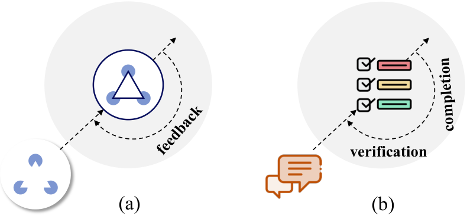
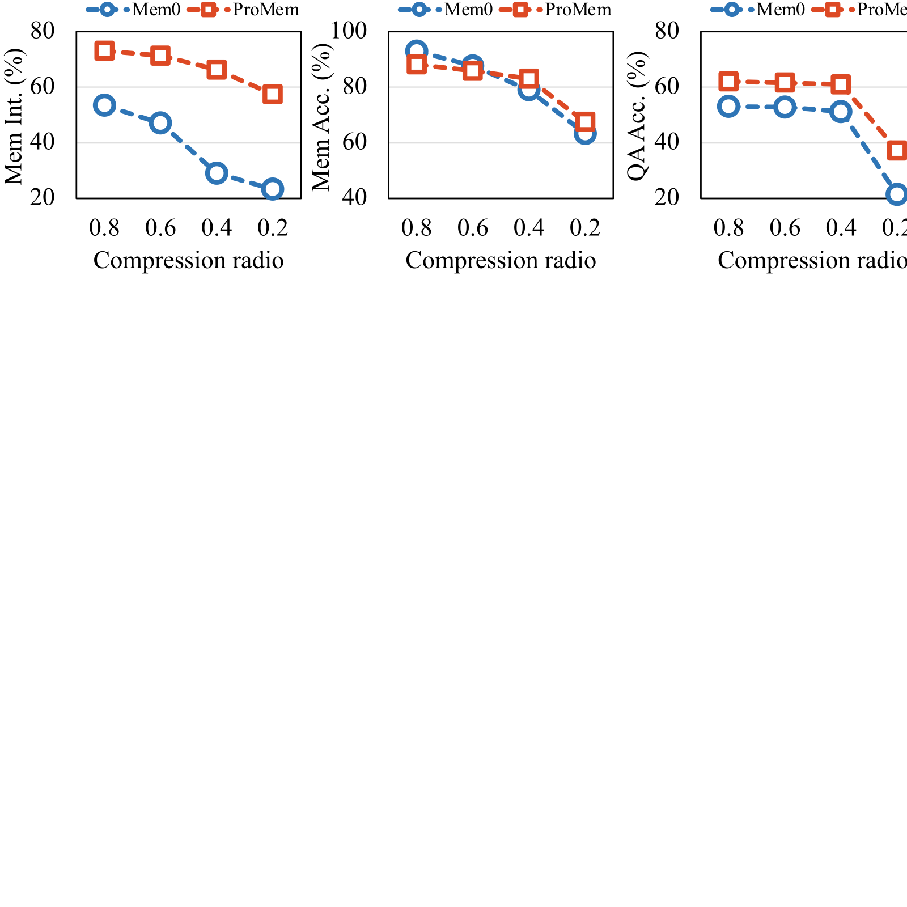
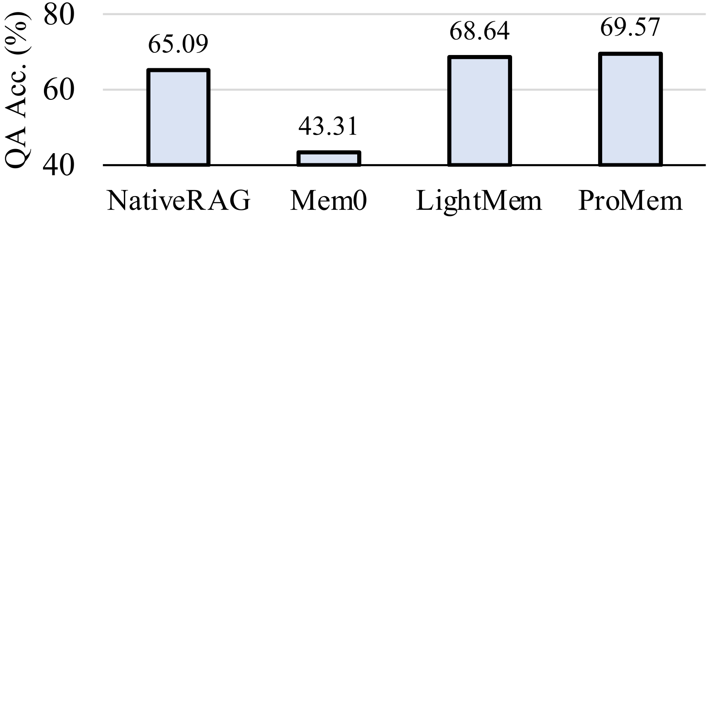

# Beyond Static Summarization: Proactive Memory Extraction for LLM Agents
## 超越静态摘要：面向 LLM 智能体的主动式记忆抽取

> **论文元信息**
> - **arXiv**：[2601.04463](https://arxiv.org/abs/2601.04463)（v1，2026-01-08 提交；v2 修订于 2026-09-01。本译文基于 v1 的官方 HTML）
> - **发表**：**EMNLP 2026 Findings**
> - **分类**：cs.CL（主）、cs.AI
> - **作者**：Chengyuan Yang、Zequn Sun、Wei Wei†、Wei Hu†（南京大学 计算机软件新技术国家重点实验室；南京大学 国家健康医疗大数据研究院）
> - **方法名**：**ProMem**（Proactive Memory Extraction，主动式记忆抽取）

> **翻译说明**
> - 本译文基于 arXiv 官方 HTML 全文（`https://arxiv.org/html/2601.04463v1`）逐段翻译，覆盖：**摘要 + 第 1–5 节 + 局限性 + 图 1–5 + 表 1–4 全量数值**；参考文献保留原文编号，不逐条翻译。
> - **插图**：全部 **5 张图**已从 HTML 抽出图片链接并下载到本地 `images/ProMem/`（其中源为 SVG 的图 4、图 5 同时保留 `.svg` 与转换后的 `.png`）。markdown 使用**相对路径**引用，离线可读；每张图上方保留 `<!-- 原图：URL -->` 注释便于回溯原地址。
> - 公式统一按 LaTeX 重排（原文 HTML 中 MathML 与 LaTeX 重复渲染的痕迹已清理）；术语首次出现时保留英文原文。

---

## 摘要

记忆管理对于 LLM 智能体处理长期交互与个性化至关重要。大多数研究关注**如何组织和利用记忆摘要**，却常常忽略最初始的**记忆抽取（memory extraction）**阶段。本文认为，现有的基于摘要的方法存在两个根本局限，其根源可用**循环加工理论（recurrent processing theory, RPT）**解释。

第一，摘要化是「**提前的（ahead-of-time）**」——它像一个盲目的「**前馈（feed-forward）**」过程，由于不知道未来的任务是什么，会丢掉重要细节。第二，抽取通常是「**一次性（one-off）**」的，缺少验证事实的反馈回路，导致信息损失不断累积。

为解决这些问题，我们提出**主动式记忆抽取（proactive memory extraction，简称 ProMem）**。与静态摘要不同，ProMem 把抽取视为一个**迭代的认知过程**：我们引入一个**循环反馈回路**，让智能体通过**自我提问（self-questioning）**主动探查对话历史。该机制使智能体能够**找回遗漏的信息并纠正错误**。ProMem 显著提升了所抽取记忆的**完整性**与**问答准确率**，并在抽取质量与 token 开销之间取得了更优的权衡。

---

## 1. 引言

记忆管理是 LLM 智能体的基石，使其能够维护长期对话历史与用户个性化信息 `[Hu et al., 2025]`。为突破 LLM 上下文窗口的限制，现有研究依赖于**基于摘要的记忆管理** `[Chhikara et al., 2025]`：这些方法把历史交互压缩成简洁摘要，在保留关键信息的同时降低计算开销。

如**图 1** 所示，当前大多数基于摘要的方法**高度重视记忆组织与利用阶段**，往往设计复杂的记忆演化回路与先进的记忆检索机制来处理已存储的记忆摘要 `[Kang et al., 2025; Ke et al., 2025; Fang et al., 2025]`。然而，**最初的记忆抽取阶段却常被忽视**。我们认为这些方法存在两个根本局限：

<!-- 原图：https://arxiv.org/html/2601.04463v1/pipeline.png -->

> **图 1（原文 Figure 1）**：General framework of summary-based memory management for LLM agents. It starts with memory extraction, where raw dialogue is condensed into summaries, followed by memory organization and utilization stages.
> （面向 LLM 智能体的基于摘要的记忆管理通用框架：从记忆抽取开始，把原始对话凝练为摘要，随后进入记忆组织与利用阶段。）

**第一，记忆摘要化是「提前」发生的。** 这意味着智能体在**尚不知道未来任务是什么**的情况下就完成了对对话历史的摘要。按循环加工理论（RPT）`[Lamme, 2006]` 的说法，这就像一个只有「前馈」而没有任何「反馈」的过程。由于不知道未来，它可能丢掉那些**微小但重要**的细节，或者关注了错误的东西，从而使记忆在日后真正需要时变得不够有用。

**第二，现有方法通常只抽取一次记忆**，我们称之为「**一次性抽取**」。如果智能体在首次抽取记忆时犯错或产生「幻觉」，这个错误就会**留在记忆中**，持续损害智能体后续的表现。基于 RPT，**反馈验证**是实现高质量记忆管理的关键，然而当前研究对这一关键步骤关注不足。

为解决上述局限，受 RPT 启发，我们提出新框架**主动式记忆抽取（ProMem）**。我们的方法不做简单的一次性摘要，而是把记忆抽取变成一个**智能且迭代**的过程：在这个框架中，LLM 智能体可以**向自己提问**，并对自己抽出的内容进行反思，从而发现遗漏的信息、纠正幻觉。我们的结果表明，这个「回路」使记忆摘要在复杂任务上**更完整、更准确**。具体而言，本框架由以下模块组成：

- **记忆抽取（即「前馈阶段」）**：在这个初始阶段，智能体充当「个人信息抽取器」，作为一个快速的前馈处理器，扫描非结构化的对话历史，识别并抽出潜在的用户事实。该步骤把原始对话流转换为**结构化的初始记忆条目列表**，为后续精化提供基线。

- **基于语义匹配的记忆补全（即「上下文对齐阶段」）**：为了让抽出的事实回到其原始语境中，该模块采用**语义相似度匹配**，把每条记忆条目映射回它在对话历史中对应的**来源轮次**。如果某一轮对话无法与任何已有摘要条目对齐，我们就对该轮执行**再抽取**。

- **基于自我提问的记忆验证（即「循环反馈阶段」）**：这是受 RPT 启发的核心组件。此时智能体转变为「**细致的记忆分析师**」：它不再被动接受初始结果，而是**主动生成探查性问题（自我提问）**来重新审视对话历史。这种反馈让智能体能够验证事实的准确性、发现缺失的细节，形成「**补充记忆**」。最后，去重机制移除冗余，确保记忆库简洁且高保真。

为评估 ProMem 的记忆抽取能力，我们使用 **HaluMem** `[Chen et al., 2025]` 作为主数据集。选择它有两个主要原因：第一，我们的研究聚焦于解决简单一次性抽取所造成的「**信息缺失累积**」问题，而 HaluMem 正是为检测这一现象而构建的；第二，该数据集包含需要深度理解的复杂用户—智能体交互，使我们能够检验自我提问机制是否真能抽出比传统方法更准确、更完整的信息。

实验表明，ProMem 在**记忆完整性**与**问答准确率**两方面都显著优于当前最先进的基线。此外，我们的分析确认 ProMem 对 **token 压缩**高度稳健，并且在使用**小语言模型**部署时依然保持成本效益。

---

## 2. 相关工作

本节讨论基于摘要的记忆管理与基于 LLM 的信息抽取这两条相关工作线索。

### 2.1 基于摘要的记忆管理

为处理长时程任务 `[Zhu et al., 2025]`、突破固定上下文窗口的约束，基于摘要的记忆管理已成为主流方案 `[Hu et al., 2025; Liang et al., 2025]`。这类方法把原始交互历史压缩成简洁的文本表示，在保留关键信息的同时丢弃冗余。

例如，早期工作 **Generative Agents** `[Park et al., 2023]` 采用**分层摘要**策略，从低层细节到高层反思递归地总结日常活动；**MemoryBank** `[Zhong et al., 2024]` 通过引入**遗忘机制**关注记忆的时间动态；**MemGPT** `[Packer et al., 2023]` 则实现了一个类似操作系统的**分层虚拟上下文管理系统**来应对上下文上限；**Mem0** `[Chhikara et al., 2025]` 引入一个记忆层，动态管理用户偏好与历史交互，从而实现高度个性化、上下文感知的智能体响应。这些方法可被视为「**抽象式记忆机制**」——智能体在工作记忆中维护高层摘要，并把详细日志存入长期存储。其余大多数基于摘要的方法聚焦于「**何时摘要**」与「**如何组织**」`[Li et al., 2025; Kang et al., 2025; Yan et al., 2025; Fang et al., 2025]`。

尽管这些方法有效降低了上下文负载，它们存在一个根本局限：**抽取是被动且静态的**。与这些工作不同，我们提出的 ProMem 框架引入了一个**主动的、受 RPT 启发的反馈回路**，确保抽取既准确又任务感知。

### 2.2 基于 LLM 的信息抽取

信息抽取（IE）旨在把非结构化文本转换为结构化格式。传统方法依赖有监督的序列标注 `[Souza et al., 2019]`，而 LLM 的出现把范式推向了**生成式 IE**。

当前研究主要利用 LLM 的指令遵循能力 `[Zhang et al., 2023; Wang et al., 2024b; Wang et al., 2024a]`。例如 **UIE** `[Lu et al., 2022]` 提出统一的「文本到结构」生成框架，可通用地建模不同 IE 任务；**CodeKGC** `[Bi et al., 2024]` 与 **ChatIE** `[Wei et al., 2023]` 则利用代码生成或多轮对话策略来增强实体与关系抽取。

然而，大多数已有的基于 LLM 的 IE 方法关注从**百科条目或新闻文章**中抽取静态事实。与它们不同，ProMem 关注从**多轮对话**中抽取**个性化的长期用户记忆**——这不仅要求抽出事实，还要求验证其**一致性与完整性**。

---

## 3. 主动式记忆抽取（ProMem）

本节先简要介绍循环加工理论及我们的动机，然后给出所提出的 ProMem 方法。

<!-- 原图：https://arxiv.org/html/2601.04463v1/rpt.png -->

> **图 2（原文 Figure 2）**：The connection between RPT and our method. (a) The Kanizsa illusion shows how the brain uses recurrent processing to integrate low-level visual cues with high-level interpretation. (b) We map initial extraction, completion and verification onto the feed-forward sweep and the recurrent feedback loop.
> （RPT 与本文方法的联系。**(a)** Kanizsa 错觉展示了大脑如何用循环加工把低层视觉线索与高层解释整合起来；**(b)** 我们把初始抽取、补全与验证分别映射到「前馈扫描」与「循环反馈回路」。）

### 3.1 动机

我们从认知神经科学的**循环加工理论** `[Lamme, 2006]` 中汲取灵感。RPT 最初被提出用于解释大脑如何从无意识加工过渡到有意识知觉，它认为大脑有两种主要加工模式：

- **前馈扫描（feed-forward sweep）**：这是一个快速的初始过程，信号从眼睛传到大脑，被认为是「**无意识的**」。现有工作中的记忆抽取步骤就类似于一次前馈扫描。

- **循环反馈回路（recurrent feedback loop）**：发生在高级脑区把信号回传到低级脑区时。RPT 认为，这一反馈回路是产生**有意识知觉**的必要条件，如图 2(a) 所示。

基于该理论，我们提出主动式记忆抽取，使其与认知过程对齐：

- **初始抽取作为前馈**：我们把初始记忆抽取视为「前馈扫描」。与生物过程一样，它快速、只扫描一遍对话历史。但这一步在记忆质量上是「无意识的」——由于缺乏验证，它常产生幻觉或漏掉细节。

- **补全与验证作为循环反馈**：我们把记忆补全与基于自我提问的验证机制视为「循环反馈回路」。在这个回路中，智能体主动「回看」原始对话以核对抽出的事实。该回路就像 RPT 中通向意识的转变，帮助智能体从被动加工走向**主动的记忆管理**，从而确保最终记忆既完整又准确。

<!-- 原图：https://arxiv.org/html/2601.04463v1/framework.png -->

> **图 3（原文 Figure 3）**：The overview of our proposed proactive memory extraction framework. The workflow consists of three main stages: (1) Initial memory extraction as a feed-forward sweep; (2) Memory completion via semantic matching to align entries with source turns; (3) Memory verification via self-questioning, which forms the recurrent feedback loop.
> （本文提出的主动式记忆抽取框架总览。工作流包含三个主要阶段：**(1)** 作为前馈扫描的初始记忆抽取；**(2)** 通过语义匹配把条目对齐到来源轮次的记忆补全；**(3)** 构成循环反馈回路的自我提问式记忆验证。）

### 3.2 初始记忆抽取

在该模块中，智能体充当**个人信息抽取器**，设计目标是**快速、初步地**扫描对话历史以抓取基本事实，不做复杂验证。

具体来说，给定对话历史序列 $D=\{t_1, t_2, \dots, t_n\}$，其中 $t_i$ 表示第 $i$ 轮对话，我们的目标是抽取一组初始记忆条目 $M_{init}$。为此我们设计了一个专门的系统提示词 $P_{extract}$ 来引导 LLM：该提示词指示智能体阅读对话，并抽取与用户相关的有用信息，如偏好、习惯与具体事件。抽取过程可形式化为：

$$M_{init} = \text{LLM}(D, P_{extract}) \tag{1}$$

其中 $\text{LLM}(\cdot)$ 表示 LLM 的操作，$M_{init}$ 表示抽取出的原始事实列表。

然而，由于这是一个**没有反馈的「一次性」过程**，抽出的记忆 $M_{init}$ 并不完美，可能漏掉一些重要细节。因此我们把 $M_{init}$ 视为一个**初步基线**，需要在后续模块中进一步对齐与验证。

### 3.3 通过语义匹配做记忆补全

初始抽取虽提供了基线，但可能漏掉藏在长上下文中的具体细节。为此我们设计了**记忆补全模块**，其目标是把抽出的记忆条目与其原始对话上下文对齐，并识别出任何「**未被覆盖**」的对话轮次。

#### 语义对齐（Semantic alignment）

首先，我们把抽出的记忆条目映射回对话历史。我们采用预训练文本嵌入模型，对初始记忆列表 $M_{init}$ 与对话轮次 $D$ 同时编码。设 $v_m \in \mathbb{R}^d$ 表示记忆条目 $m \in M_{init}$ 的嵌入向量，$v_{t_i} \in \mathbb{R}^d$ 表示对话中第 $i$ 轮 $t_i$ 的嵌入。我们计算每一轮与所有记忆条目之间的余弦相似度：

$$S(t_i, m) = \frac{v_{t_i} \cdot v_m}{\|v_{t_i}\| \|v_m\|} \tag{2}$$

对每一轮对话 $t_i$，我们找出与其最相关的记忆条目，并检查相似度是否超过预设阈值 $\tau_{match}$：

$$\text{Match}(t_i) = \max_{m \in M_{init}} S(t_i, m) > \tau_{match} \tag{3}$$

若 $\text{Match}(t_i)$ 为真，我们认为 $t_i$ 轮中的信息已被有效捕获。

#### 缺失记忆找回（Missing memory recovery）

若 $\text{Match}(t_i)$ 为假（即最大相似度低于阈值），说明该轮是一个「**未覆盖轮次**」，其中含有在初始全局抽取时被忽略的信息。为保证完整性，我们对这些未覆盖轮次执行**有针对性的二次抽取**：把所有这类轮次收集为集合 $D_{miss}$，用 LLM 抽出**补充记忆** $M_{supp}$：

$$M_{supp} = \text{LLM}(D_{miss}, P_{supp}) \tag{4}$$

其中 $P_{supp}$ 是专门用于抽取缺失细节的提示词。最后，我们把初始记忆与补充记忆合并，形成更完整的候选集 $M_{cand} = M_{init} \cup M_{supp}$。

### 3.4 通过自我提问做记忆验证

这是本框架的**核心模块**。在此阶段，智能体从被动的抽取器转变为主动的「**分析师**」。我们设计了一个三步机制来验证前一模块得到的候选记忆条目 $M_{cand}$，目标是**消除幻觉、精炼细节**。

#### 自我提问（Self-questioning）

首先，对每条记忆条目 $m \in M_{cand}$，智能体主动生成一个具体问题 $q_m$ 来验证其有效性。该问题的目的是**索取该记忆条目的支撑证据**：

$$q_m = \text{LLM}(m, P_{question}) \tag{5}$$

其中 $P_{question}$ 是用于生成问题的提示词。例如，若 $m$ 是「用户喜欢苹果」，那么 $q_m$ 会是「用户为什么喜欢苹果？」

#### 证据寻找与验证（Evidence seeking and verification）

接下来，智能体充当**裁判**：它拿着生成的问题 $q_m$，「回看」原始对话历史 $D$ 去寻找答案，并判断对话 $D$ 是否包含足以回答 $q_m$ 的信息。这里有两种情况：

- **检测到幻觉**：若智能体判断对话中不含该答案，说明原记忆条目 $m$ 可能是幻觉或无依据的推断。此时我们**丢弃**该问题与该条目，以保证记忆的忠实性。

- **找到证据**：若答案存在，智能体从对话中抽出具体信息，形成**已验证的记忆条目** $m_{new}$，从而确保 $m_{new}$ 扎根于原始文本。

#### 去重与合并（Deduplication and merging）

最后，我们把已验证条目 $m_{new}$ 整合进最终记忆库。为避免冗余，我们用嵌入相似度把 $m_{new}$ 与原始候选 $m$ 做比较，计算余弦相似度 $S(m_{new}, m)$：

$$S(m_{new}, m) > \tau_{sim} \tag{6}$$

若相似度大于阈值，说明新的已验证条目与原条目一致：我们**保留抽出的版本 $m_{new}$**（因为它更有依据），并移除重复项。若相似度较低但证据确实存在，则意味着原条目**部分有误**，$m_{new}$ 充当纠正，我们用 $m_{new}$ **替换** $m$。

通过这一迭代的「**提问—验证—更新**」回路，我们得到最终的高质量记忆集 $M_{final}$，供未来检索与利用。

### 3.5 关于计算开销的讨论

我们承认，相比现有的一次性摘要方法，本方法需要**更多 token**——自我提问与补充抽取不可避免地带来更高的计算成本与延迟。但我们认为这是**必要的权衡**，理由如下：

**第一，记忆出错的代价远高于 token 的代价。** 在长期智能体任务中，如果初始记忆含有幻觉或漏掉关键细节，会在所有下游任务中引发**连锁错误**。在抽取阶段多投入一些 token，可以确保记忆从一开始就是干净可靠的。

**第二，记忆抽取是「写一次、读多次」的操作。** 我们只需在对话发生时**付出一次**高昂的抽取成本；此后，这份高质量记忆会被检索并复用**成百上千次**。因此**平均到每次使用的成本**其实是可以接受的。

**第三，记忆抽取通常是异步的后台过程。** 与实时响应生成不同，它不会阻塞用户交互。因此**质量优先于延迟**，这点轻微延迟是保证记忆长期可靠的必要权衡。

**最后，仍有优化空间。** 在真实应用中，我们不必对每一个验证步骤都使用大模型（如 GPT-4o mini）：可以借助**小语言模型（SLM，如 Llama3-8B）**来处理自我提问与匹配任务，从而显著降低 token 消耗与延迟。

---

## 4. 实验

本节给出评估 ProMem 有效性的实验结果。

### 4.1 实验设置

#### 数据集

为全面评估我们的主动式记忆抽取框架，我们选择 **HaluMem** `[Chen et al., 2025]` 作为主数据集。本工作的核心贡献是**优化记忆抽取过程、抑制幻觉**，而 HaluMem 正是为此目的设计的：它提供**细粒度标注**，用于检测记忆幻觉并评估抽出事实与原始对话之间的一致性，这与我们主动式记忆抽取的动机相一致。此外，为保证与现有其他工作可比并展示方法的稳健性，我们也在广泛使用的 **LongMemEval** 基准 `[Wu et al., 2025]` 上做了实验。

**表 1：HaluMem 基准上的记忆抽取与问答性能（%）比较。** 最优结果加粗，次优结果加下划线。「-」表示该方法不支持对应评测，指标无法测得。

| 方法 | 记忆完整性 | 记忆准确率 | 问答准确率 |
|---|---|---|---|
| Memobase `[Memobase, Inc., 2025]` | 14.55 | **92.24** | 35.33 |
| Supermemory `[Supermemory, Inc., 2025]` | 41.53 | 90.32 | 54.07 |
| Mem0 `[Chhikara et al., 2025]` | 42.91 | 86.26 | 53.02 |
| LightMem `[Fang et al., 2025]` | - | - | 56.60 |
| **ProMem（本文）** | **73.80** | 89.47 | **62.26** |

#### 评测指标

沿用 HaluMem 的口径，我们报告以下三个指标：

- **记忆完整性（Memory Integrity）**：衡量记忆抽取的完整程度，计算**真值事实的召回率**，即有多少用户细节被成功抽出。
- **记忆准确率（Memory Accuracy）**：评估所抽出条目的正确性，对幻觉与事实错误进行惩罚，反映记忆的可靠性。
- **问答准确率（Question Answering Accuracy）**：衡量抽出的记忆能否有效支撑智能体回答用户提问。

#### 基线方法

我们选取两个广泛使用的开源项目来考察记忆管理系统的实际表现：**Memobase** `[Memobase, Inc., 2025]` 与 **Supermemory** `[Supermemory, Inc., 2025]`；同时与两个研究领域的领先方法对比：流行方法 **Mem0** `[Chhikara et al., 2025]` 与 SOTA 方法 **LightMem** `[Fang et al., 2025]`。需要说明的是，我们**没有**把 A-MEM `[Xu et al., 2025]`、Zep `[Rasmussen et al., 2025]` 等纳入基线，因为它们**并非基于摘要**。

#### 实现细节

沿用 HaluMem 的设置，ProMem 使用 **GPT-4o-mini** 作为所有生成任务的骨干 LLM，包括初始抽取、自我提问、验证与答案生成；使用 **GPT-4o** 判定答案正确性。语义相似度计算采用预训练嵌入模型 **Qwen3-Embedding-8B** `[Zhang et al., 2025]`。

超参数方面：记忆补全模块的相似度阈值 $\tau_{match}$ 经验性地设为 **0.6**，以确保对未覆盖轮次有足够覆盖率；记忆验证中的去重阈值 $\tau_{sim}$ 设为 **0.8**，以避免冗余、保持记忆库简洁。在记忆利用阶段，我们同样用 Qwen3-Embedding-8B 编码记忆条目并执行检索：给定用户查询，检索 **top-20** 最相关的记忆条目来辅助智能体生成回复，并给检索到的记忆**附加时间戳**。

### 4.2 主要结果

**表 1** 给出了 HaluMem 上的主要结果。

**第一，我们的方法在记忆完整性上取得显著提升。** Mem0、Memobase、Supermemory 等基线的完整性只有约 41%–43%，而我们的方法达到 **73.80%**。这一结果有力证明：主动式记忆抽取框架能够成功找回被传统「一次性」抽取方法忽略的缺失细节。

**第二，在记忆准确率方面，Memobase 得分最高**，但值得注意的是它的**完整性极低（14.55%）**。这说明 Memobase 采取了**保守策略**——通过只抽极少的事实来保证高准确率，却漏掉了一半以上的重要信息。我们的方法取得了更好的平衡：在保持高准确率的同时捕获了远为完整的信息。

**第三，在下游问答任务上，我们的方法取得最佳表现（62.26%）**，说明记忆的高完整性直接带来了更强的问答能力。

### 4.3 消融研究

为评估 ProMem 中每个模块的作用，我们做了消融实验，结果见**表 2**。其中「MC」指记忆补全模块（memory completion），「MV」指记忆验证模块（memory verification）。

**表 2：ProMem 中关键模块的消融研究。**

| 方法 | 记忆完整性 | 记忆准确率 | 问答准确率 |
|---|---|---|---|
| ProMem（完整） | **73.80** | 88.12 | **62.12** |
| w/o MC（去掉记忆补全） | 60.33 | 91.13 | 61.07 |
| w/o MV（去掉记忆验证） | 70.41 | 88.77 | 61.02 |
| w/o MC & MV（两者都去掉） | 54.03 | **92.64** | 50.60 |

**第一，「w/o MC & MV」变体展示了单遍抽取的局限**：它取得最高的记忆准确率，但完整性与问答分数最低。这说明**没有反馈时，智能体会采用「保守策略」**——保证正确性却漏掉大量细节。

**第二，两个模块对性能都不可或缺。** 把「w/o MC」与完整模型对比，记忆补全模块把记忆完整性从 60.33% 显著提升到 **73.80%**，证明其找回缺失信息的能力；而记忆验证模块（体现在「w/o MC & MV」与「w/o MC」的差距上）把问答准确率提升了 **10% 以上**，说明自我提问能有效帮助抽出与答案相关的事实。

**第三，完整方法取得了最佳权衡。** 尽管其记忆准确率略低于基线，但更高的记忆完整性（**+19.77%**）带来了最佳的问答表现。这表明对下游任务而言，**召回完整信息比在少量事实上保持完美精确更重要**。

<!-- 原图：https://arxiv.org/html/2601.04463v1/ratio.svg -->

> **图 4（原文 Figure 4）**：Performance w.r.t. compression ratios.（随压缩比变化的性能表现。）

### 4.4 token 压缩下的结果

如 3.5 节所述，相比单遍方法，我们的抽取方法不可避免地引入更高的 token 开销。为回应该效率顾虑并探索 ProMem 的实际可部署性，我们做了 **token 压缩实验**：以不同压缩比（**0.8、0.6、0.4、0.2**）从对话历史中随机丢弃不重要的 token，并把 ProMem 与基线 Mem0 对比。我们沿用 LightMem 的做法，用 **LLMLingua-2** `[Pan et al., 2024]` 作为压缩模型。结果见**图 4**。

**第一，ProMem 对信息损失表现出极强的稳健性。** 当压缩比从 0.8 降到 0.2（意味着丢弃 80% 的对话 token）时，我们的方法仍保持非常稳定的性能：即使在 0.2 的低压缩比下，ProMem 仍取得 **37.20% 的问答分数**与 **57.20% 的记忆完整性**。这说明我们的自我提问与补充抽取即使在高度压缩的输入上也能成功抽出高质量记忆。

**第二，ProMem 在低资源设置下显著优于基线。** 相反，Mem0 对 token 削减**高度敏感**：如图所示，当压缩比降到 0.2 时 Mem0 性能崩溃，记忆完整性跌至 **23.28%**、问答跌至 **21.34%**。

这些结果强有力地表明：**我们可以在真实应用中用很高的压缩率部署 ProMem**。通过激进压缩输入 token，可以把 token 消耗降低 **60%**，同时仍取得优于「全量输入基线」的性能——这有效回应了关于计算成本的顾虑。

### 4.5 使用小语言模型（SLM）的结果

在前述 token 压缩分析的基础上，我们进一步回应当效率顾虑、并考察 ProMem 框架的稳健性：改用 **Llama3-8B** 作为记忆抽取与问答的语言模型。我们的假设是，ProMem 的**迭代与自我纠错**特性使我们能够使用能力较弱（因而更便宜）的 LLM。

结果见**表 3**。**第一，ProMem 在记忆完整性上显著优于 Mem0**，说明即使模型能力较弱，我们的迭代反馈回路也能有效找回基线遗漏的细节。**第二，ProMem 的记忆准确率与 Mem0 相当**，说明抽出更多信息并未引入额外幻觉。**第三，更高的完整性转化为问答准确率的显著提升（+10.74%）**。这些结果展示了本方法的稳健性：即使在资源受限、使用 SLM 的场景下也能实现高质量的记忆管理与问答。

**表 3：使用 SLM（Llama3-8B）的结果。**

| 方法 | 记忆完整性 | 记忆准确率 | 问答准确率 |
|---|---|---|---|
| Mem0 | 30.59 | 82.56 | 38.41 |
| **ProMem** | **43.09** | 82.32 | **49.15** |

<!-- 原图：https://arxiv.org/html/2601.04463v1/longmemeval.svg -->

> **图 5（原文 Figure 5）**：Performance comparison on LongMemEval.（LongMemEval 上的性能比较。）

### 4.6 LongMemEval 上的结果

HaluMem 侧重评估所抽记忆的完整性与忠实性，我们还需要验证本方法支撑下游应用的有效性，因此在 **LongMemEval** `[Wu et al., 2025]` 上补充了实验——这是一个广泛使用的基准，用于评估智能体在真实检索场景中的长期记忆能力。我们把 ProMem 与 **NativeRAG、Mem0** 以及 SOTA 方法 **LightMem** 对比，结果见**图 5**。

**第一，ProMem 取得最佳表现**，问答准确率达到 **69.57%**，超过所有基线，证明我们的主动式记忆抽取框架能有效捕获回答用户问题所需的关键信息。

**第二，ProMem 超过了 SOTA 方法 LightMem。** 值得注意的是，LightMem 聚焦于优化**检索机制**（如何找到记忆），而本文聚焦于优化**抽取质量**（该存什么）。ProMem 略微胜过 LightMem 这一事实提示了一个根本洞见：「**更好的数据比更好的算法更重要**」——只要保证记忆完整准确，即使不用复杂的检索技巧也能取得更优结果。

**第三，Mem0 的失败凸显了抽取质量的重要性。** Mem0 的表现明显差于 NativeRAG，说明其激进的摘要很可能丢弃了过多细节，使记忆反而不如 NativeRAG 使用的原始分块有用。相比之下 ProMem 显著优于 NativeRAG，这说明：**好的记忆管理有益，而糟糕的记忆管理还不如没有记忆**。

### 4.7 案例研究

为直观展示本方法在细节捕获上的优势，我们在**表 4** 中给出一个案例。该问题询问 Sarah Garcia 的**社交网络**在她的职业转型中具体起到了什么作用。

**表 4：Mem0 与 ProMem 在记忆抽取与问答表现上的案例对比。**

**问题**：What role did Sarah Garcia's social network play in her career transition to Senior Manager at Oracle by Dec 10, 2025?（截至 2025 年 12 月 10 日，Sarah Garcia 的社交网络在她向 Oracle 高级经理职位转型的过程中起了什么作用？）

**标准证据（Gold evidence）**：(1) Sarah Garcia 的社交网络扩张为她向 Oracle 高级经理职位的转型提供了洞见与支持；(2) Sarah Garcia 对朋友 Matthew 与 Linda 给予的情感支持表示感谢，这在她的职业转型中至关重要。
**标准答案（Gold answer）**：提供了洞见与情感支持。

| 方法 | 抽出的记忆 | 最终回答 |
|---|---|---|
| Mem0 | Sarah Garcia 正转型为 Oracle 的高级经理职位。 | Positive influence on career growth.（对职业成长有积极影响。） |
| **ProMem** | (1) ……在她的转型过程中**非常有帮助**；(2) ……已**转型为** Oracle 高级经理职位；(3) ……社交网络为她提供了**多元视角与情感支持**。 | **Provided diverse perspectives and support.**（提供了多元视角与支持。） |

**第一，Mem0 因抽取粒度太粗而失败。** 它只捕获了转型的笼统语境，漏掉了关于「社交网络如何帮助」的具体细节，因而给出过于含糊的回答（「积极影响」）。这印证了传统摘要倾向于丢弃关键细节。

**第二，ProMem 捕获了细粒度细节。** 通过循环验证回路，智能体主动抽出了「多元视角」「情感支持」等关键证据。这份完整的记忆使 ProMem 能生成与标准答案完全吻合的精确回答，展示了其在复杂查询中防止信息丢失的能力。

---

## 5. 结论与未来工作

本文指出了现有「一次性」记忆摘要的局限，并提出**主动式记忆抽取**。受循环加工理论启发，我们的方法引入一个**循环反馈回路**，使智能体能够主动自我提问、验证并补充记忆条目。在 HaluMem 与 LongMemEval 上的大量实验表明，ProMem 在**记忆完整性**与**下游问答任务**上都达到 SOTA 水平。此外，我们还证明 ProMem 对 token 压缩稳健，并可用 SLM 高效部署。

未来工作中，我们计划把本工作扩展到**终身记忆管理（lifelong memory management）**，研究如何整合**更新与遗忘**机制，以在长时间跨度上管理记忆存储上限。

---

## 局限性

尽管 ProMem 在记忆抽取与下游问答任务上表现出优越性能，我们承认有以下局限需要在未来研究中解决。

**第一，计算开销与延迟。** 如 3.5 节所讨论，本方法引入了包含自我提问与补充抽取的循环反馈回路。相比传统单遍摘要，这一迭代过程不可避免地增加了 token 消耗与推理延迟。虽然我们的分析表明记忆的高质量足以证明这一成本是合理的，但对**严格要求实时、或资源受限**的应用而言，这一开销仍可能是瓶颈。

**第二，对骨干 LLM 能力的依赖。** 「自我提问」与「验证」模块的有效性高度依赖骨干 LLM 的推理能力。若模型过弱（例如无法生成高质量的探查性问题），反馈回路可能**无法纠正错误**。尽管我们的实验显示 Llama3-8B 表现尚可，但本框架对模型规模的**下界**仍是一个开放问题。

---

## 参考文献

原文参考文献共 40 余条（含 Hu et al. 2025、Chhikara et al. 2025 (Mem0)、Packer et al. 2023 (MemGPT)、Park et al. 2023 (Generative Agents)、Zhong et al. 2024 (MemoryBank)、Fang et al. 2025 (LightMem)、Chen et al. 2025 (HaluMem)、Wu et al. 2025 (LongMemEval)、Lamme 2006 (RPT)、Xu et al. 2025 (A-MEM)、Rasmussen et al. 2025 (Zep)、Pan et al. 2024 (LLMLingua-2)、Zhang et al. 2025 (Qwen3-Embedding) 等，以及 Memobase, Inc. 2025 与 Supermemory, Inc. 2025 两个开源项目）。本节未逐条翻译，正文中的 `[作者, 年份]` 标记可回到原文 References 章节对应检索。

---

> **译者注**：本文的核心主张与 PowerContext 的写入路径设计高度相关——它把「记忆抽取」从**一次性预处理**重新定义为**带反馈的迭代过程**，并给出了一个可测量的结论：「更好的数据比更好的算法更重要」（在 LongMemEval 上，专注抽取质量的 ProMem 胜过专注检索机制的 LightMem）。若要在 PowerContext 的 Capture/Flush 阶段引入类似的写入门控与自我验证，本文的「语义对齐 → 未覆盖轮次二次抽取 → 自我提问验证 → 去重合并」四步是可参考的最小流程，其中 $\tau_{match}=0.6$、$\tau_{sim}=0.8$ 是可直接复用的经验阈值。

