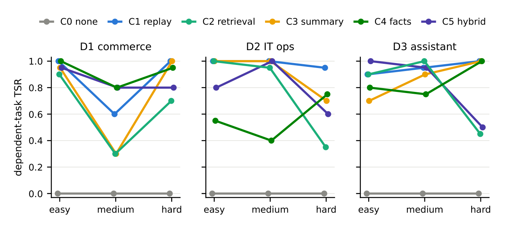
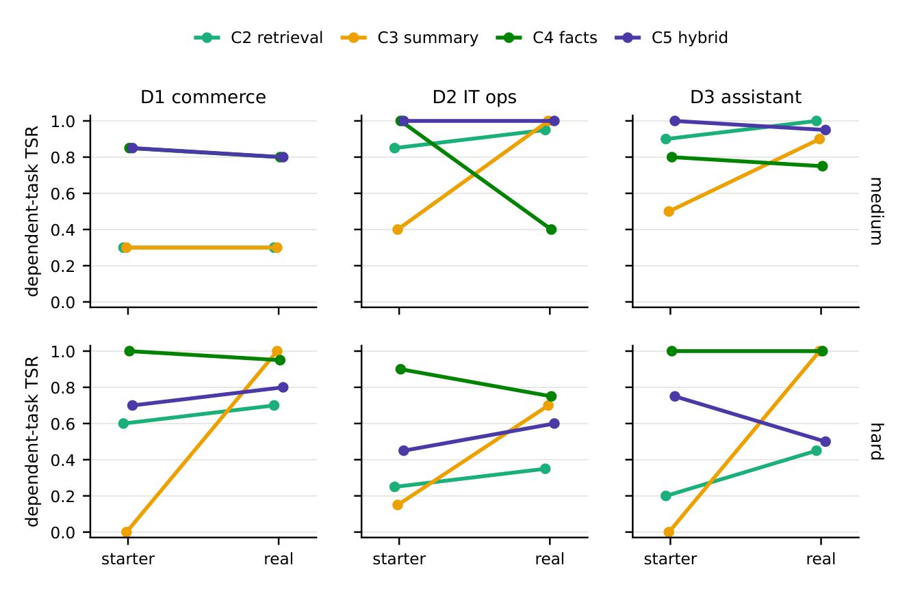
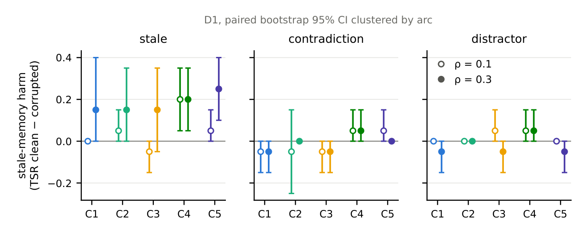
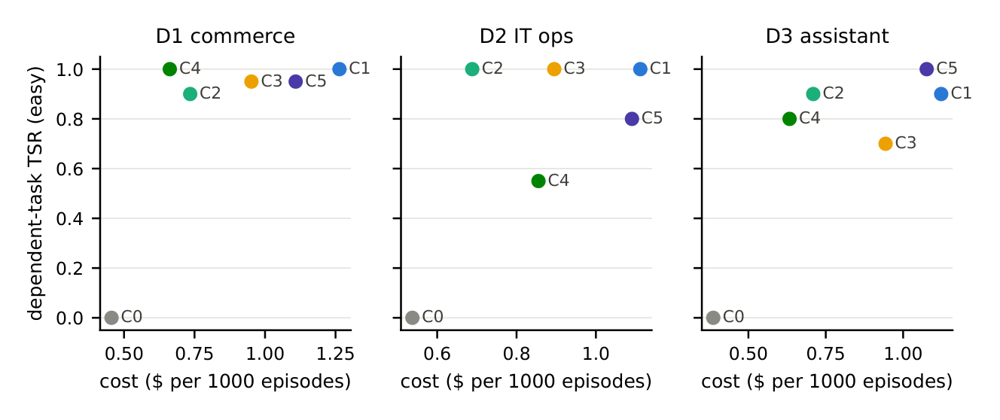

# When Does Memory Help? A Cost-Aware Evaluation of Long-Term Memory in Tool-Using LLM Agents

## 记忆何时真正有用？面向工具调用型 LLM 智能体的长期记忆的成本感知评测

> **论文元信息**
> - **arXiv**：[2609.05441](https://arxiv.org/abs/2609.05441)（v1，2026-07-26 提交）
> - **分类**：cs.AI
> - **作者**：Shweta Mishra、Shashank Mishra（Independent Research）
> - **篇幅**：14 页
> - **方法名**：**MERIT**（Memory Evaluation for Realistic Instrumented Tasks，面向真实可测任务的记忆评测）
> - **复现地址**：<https://github.com/smshweta/merit-bench>

> **翻译说明**
> - 本译文基于 PDF 提取正文逐段翻译，覆盖：**摘要 + 第 1–8 节 + 图 1–6 + 表 1–2 全量数值**；参考文献保留原文编号，不逐条翻译。
> - **本文特殊性（必读）**：该论文**没有 arXiv HTML 版**，正文由 PDF 提取得到，插图是从 PDF 按图号裁出的位图。因此**图号口径即 PDF 印刷版 Figure 1–6**；正文中的页码坐标标记（`[[pN y…]]`）、独立页码数字、页眉页脚残留与图内坐标文字均已清理，但所有实质内容与数字逐字保留。
> - **插图**：共 **6 张图**已下载至 `images/MERIT/`，markdown 使用**相对路径**引用，离线可读；每张图上方保留 `<!-- 原图：PDF Figure N -->` 注释便于回溯。
> - **表格**：表 1、表 2 数值已由人工从 PDF 原始数据行重建为 markdown，译文**逐字保留全部数值**，仅做表题与列名中文化。
> - **公式**：统一按 LaTeX 重排为 `$…$` / `$$…$$`；显著性符号（𝜌、𝑝、ΔTSR、Cohen's 𝜅 等）均按原义重排。

---

## 摘要

如今，对 LLM 智能体长期记忆的评测依赖的是对话式回忆基准（LoCoMo、LongMemEval），它们衡量的是「在对话历史上做问答」的能力，而非「被记住的事实是否改变了工具调用型智能体的行为」。我们提出 **MERIT（Memory Evaluation for Realistic Instrumented Tasks，面向真实可测任务的记忆评测）**——一个在显式成本核算下衡量记忆对任务执行型智能体的边际效用的基准与实验框架。MERIT 提供三个领域的、 episodic（分幕）式的工具调用任务，其中对更早幕事实的依赖由一套自动泄漏检查（leak check）验证；一条以「更新事实回忆」收尾的难度阶梯；受控的记忆损坏；以及对每一次记忆操作的 token 与美元全计量。在 **23,440 个计分幕**（花费 **$42.57**）、一次 gpt-4.1-mini 的两代试点，以及一个预先注册的 3 模型 × 3 种子网格（GPT-4.1、Claude Haiku 4.5，记忆侧固定）上，记忆把依赖型任务成功率从经泄漏验证的 **0.00** 地板提升到 **0.55–1.00**。在更新事实（updated facts）上，嵌入检索（embedding retrieval）以不可预测的方式崩溃（跨模型 **0.30–0.95**；种子间最大差距 **0.45**），且智能体仅在 **55%** 的情况下会对「正确检索到的数值」付诸行动；而「写时更新（update-on-write）」式存储（结构化事实库，以及尤其值得注意的 LLM 摘要）则维持在 **0.70–1.00**；混合方案甚至不如单独的事实库。一次最新一代的抽检（Claude Sonnet 5，以一次干净的全重放控制为门槛）复现了这一模式。替换某记忆的实现方式，可让任务成功率变动最多 **60 分**；而全重放（full replay）在任何情况下都不经济：每个领域最优的条件，其每美元边际效用是最优条件的 **2.7–3.9×**。我们公开发布该基准、实验框架与全部轨迹。

> **脚注（原文置于标题处 ∗）**：§5 中所有数字均为实测结果——一次两代试点（9,940 个计分幕，gpt-4.1-mini），先以起始（starter）记忆实现运行、再以真实（real）实现（嵌入检索、LLM 摘要、LLM 抽取）在相同网格上运行，随后是预先注册的完整网格（§5.7）：3 个智能体模型 × 3 个领域 × 3 个难度层级、在主模型上取 3 个种子，另有 13,500 个幕。试点与完整网格合计 **23,440 个计分幕**、**$42.57** API 成本；最新一代与前沿模型的抽检（Claude Sonnet 5、Opus 4.8）作为诊断结果在 §7 单独报告。代码、轨迹与预先注册信息见 <https://github.com/smshweta/merit-bench>。

---

## 1. 引言

基于 LLM、能够规划、调用工具并跨多个会话（session）行动的智能体，正快速走向生产部署：客服、IT 运维、编程与个人助理。对每一类这样的部署而言，一个核心的架构问题是：是否、以及如何赋予智能体长期记忆——即跨会话持久化、并被有选择地回忆的信息。一个充满活力的记忆系统生态已经出现（Mem0、Letta/MemGPT 式的操作系统型记忆、Zep、LangGraph 检查点、定制的 RAG 存储），厂商们在回忆基准上相互竞争。

然而，对智能体记忆的评测存在三个盲区：

#### 盲区一：对话式问答不等于任务执行

主流基准（LoCoMo [Maharana et al., 2024]、LongMemEval [Wu et al., 2025] 与 BEAM [Tavakoli et al., 2025]）测试的是系统能否回答关于冗长、多会话对话的问题。相比之下，生产环境中的智能体必须利用被记住的事实来选择正确的工具调用：正确的客户 ID、先前约定的退款金额、上周事故中确认的配置修复项。对话式回忆分数能否转化为任务执行的效用，是一个尚待实证回答的问题。

#### 盲区二：默认记忆「有帮助」，其危害却未被度量

近期工作注意到，智能体有时会忽略检索到的记忆记录，或对其使用前后不一致；HaluMem（HaluMem, 2025）考察了记忆的幻觉与一致性，但那是在对话场景下。在任务执行中，一条陈旧记忆（客户的旧地址、被回滚的配置）不只是「没用」——它会引发一个自信但错误的动作。现有基准没有哪一个在受控损坏下量化这一失败模式，也没有量化我们试点所揭示的更基本的失败：智能体明明在上下文中持有正确事实、却仍不据此行动（跨实现的忽略率 Ignore Rate 为 0.45–0.53）。

#### 盲区三：报告了成本，却没有报告边际效用

记忆系统会连同准确率一起报告 token 数量，但从业者面对的决策是经济性的：增加记忆，是否足以提升任务成功率、从而证明其每任务成本的合理性？据我们所知，没有任何评测会跨记忆架构报告「成本调整后的边际效用」（每边际美元带来的成功概率变化）。

我们用 MERIT 同时回应以上三个盲区。我们的贡献如下：

1. **一套可控记忆依赖与难度的任务集。** 三个领域（客服、IT 运维、个人助理）中的 episodic 工具调用任务，其中可调比例的任务依赖于更早幕建立的事实；并有一条三档难度阶梯：易（单事实）、中（须组合多个事实）、难（事实在中途被更新，且需要最新值）。一套自动泄漏检查会在生成时验证：没有任何金标准（gold）事实出现在探针（probe）幕的输入中、或可从工具重新推导出来。

2. **受控的记忆损坏。** 以已知速率 $\rho$ 注入陈旧、矛盾与干扰记录，并附真值标注，用以度量「陈旧记忆危害（Stale-Memory Harm）」。

3. **三个既往评测缺失的指标：** 记忆利用率（Memory Utilization Rate, MUR）、忽略率（Ignore Rate）与成本调整后的边际效用（Cost-Adjusted Marginal Utility, CAMU），由实验框架自动计算（§3.5）。

4. **一项两代试点研究：** 6 种记忆条件 × 3 领域 × 3 难度层级（9,940 个计分幕；完整网格各运行两次，一次用起始实现、一次用真实实现），并带有预先注册的假设与统计量（按弧聚类的配对 bootstrap；Holm–Bonferroni），证明该基准能够区分那些在单事实回忆下无法区分的记忆架构，并能够区分「架构」与「实现质量」；外加一项 3 智能体模型 × 3 种子的复现（再增 13,500 个幕，§5.7），表明嵌入检索在更新事实上的崩溃是「跨模型且跨种子」不稳定的，而写时更新式记忆则处处稳健。

5. **开源发布** 基准、实验框架与全部轨迹，并附带一个确定性的 **$0 模拟模型（mock-model）模式**，用于校验整条流水线。

---

## 2. 相关工作

### 2.1 面向 LLM 智能体的记忆系统

MemGPT [Packer et al., 2023] 把记忆刻画为一种操作系统式的层级结构，由 LLM 将信息分页进出上下文。Mem0 [Chhikara et al., 2025] 在写入时抽取并整合结构化事实；Zep [Rasmussen et al., 2025] 维护一个时序知识图谱；A-Mem [Xu et al., 2025] 动态地组织智能体式笔记。滚动摘要（Rolling summarization）是 LangChain/LangGraph 等智能体框架中的默认模式。这些系统论文主要在对话式问答（LoCoMo、LongMemEval）上做评测；没有一个在成本核算下评测任务执行的效用。MERIT 的条件 C1–C5 是有意地在同一接口下对这些架构家族的重实现，从而使架构机制（检索、摘要、写时更新、混合）能够与产品工程分离开来比较。我们有意评测的是「重实现」而非「已发布产品」：一个产品的分数会把其架构机制与专有的检索调参、提示词与工程实现混在一起，使人无法把结果因果地归于该机制；在 MERIT 上对已发布系统做基准测试，是借助公开发布的实验框架自然可做的后续工作。

### 2.2 面向智能体记忆的基准

LoCoMo [Maharana et al., 2024] 评测的是在极长多会话对话上的问答。LongMemEval [Wu et al., 2025] 覆盖信息抽取、多会话推理、时序推理、知识更新与在约 115K-token 历史下的弃答（abstention）。BEAM [Tavakoli et al., 2025] 把对话式探测扩展到 1,000 万 token。HaluMem（HaluMem, 2025）在记忆操作层面（抽取、更新、问答）评测幻觉。RealMem [Bian et al., 2026] 走向面向项目（project-oriented）的交互。上述全部都是「产出答案」式的评测；而 MERIT 是「产出动作」式的：成功是一个关于可变世界最终状态（final state）的谓词（predicate），而 LongMemEval 与 HaluMem 以对话方式探测的「知识更新」维度，在 MERIT 的难层里变成了一个行为测试——智能体是否会按最新值行动。长上下文基准（RULER [Hsieh et al., 2024]、BABILong [Kuratov et al., 2024]）测试的是对给定上下文的单次注意力（single-pass attention），而非持久记忆的「写入—检索」循环。

### 2.3 工具使用与智能体基准

$\tau$-bench [Yao et al., 2024] 评测的是借助领域 API 与模拟用户对话、并以数据库状态做成功检查的「工具调用型智能体」（其环境设计与 MERIT 最为接近），但每个任务都是单幕的；跨幕的记忆并未被调动起来。AgentBench [Liu et al., 2023]、SWE-bench [Jimenez et al., 2024] 与 WebArena [Zhou et al., 2023] 同样地只评测幕内（within-episode）能力。MERIT 在 $\tau$-bench 式环境之上，额外加入了跨幕的依赖结构（arcs、plants、probes、泄漏检查）。

### 2.4 智能体的可靠性

生产环境的报告一致地把可靠性列为智能体部署的头号障碍；「自信但错误」的动作比「弃答」代价更高。陈旧记忆的危害正是一个具体、可度量的实例：MERIT 以已知速率注入陈旧性，并同时度量成功率的下降，以及智能体在行动前是否会重新核实。

---

## 3. MERIT 基准

### 3.1 设计目标

- **G1（生态效度）：** 任务需要能由程序验证最终状态的工具调用。
- **G2（可控的依赖与难度）：** 依赖型任务比例与难度层级都是基准参数。
- **G3（对抗现实性）：** 损坏反映真实的陈旧化过程。
- **G4（成本透明）：** 记忆系统进出的每一个 token 都被计量。
- **G5（可复现性）：** 确定性的带种子世界、脚本化或缓存的模拟用户、固定的模型版本、公开发布的轨迹，以及一个能够跑通整条流水线的、确定性的 $0 模拟模型。

### 3.2 环境

一「幕（episode）」是一个智能体会话，包含一名模拟用户、一个作用于可变世界状态（SQLite）之上的工具 API。幕被编组为「弧（arc）」，每条弧含 4–6 个共享实体的幕。一条弧包含：种植幕（plant，某一事实通过对话建立起来；用户当时明确禁止据此行动）、可选的更新幕（update，事实被修订）、探针幕（probe，成功依赖该事实；该事实不在本幕输入中），以及独立幕（independent，仅凭本幕即可求解）。

在实践中，两道防护机制被证明不可或缺。**泄漏检查（leak check）** 在生成时断言：每个金标准事实值都不出现在探针幕的输入中、也不出现在初始世界状态中，且金标准值在整个弧内保持唯一。**增量计分（delta scoring）** 仅当某幕的校验谓词在该幕内由「假」翻转为「真」时才将其标记为成功：在早期门控运行中，过于急切的智能体在种植幕就处理了退款，于是探针幕凭「继承来的世界状态」「成功」了；增量计分彻底消除了这一世界状态泄漏通道（在 9,940 个幕中，有 22 个探针幕抵达时其校验器已满足，它们被计为失败、而绝不会被计为继承而来的成功）。

### 3.3 领域

- **D1 客服（零售）：** 工具 = `get_order`、`refund`、`update_address`、`get_policy`、`send_message`。事实：约定好的部分退款金额、更新后的地址。
- **D2 IT 运维：** 工具 = `search_logs`、`get_deploy_history`、`get_config`、`set_config`、`deploy`、`update_ticket`。事实：诊断出的配置修复项、安全的回滚版本。
- **D3 个人助理：** 工具 = `get_calendar`、`create_event`、`send_email`、`get_preference`、`set_preference`。事实：固定的房间/时间偏好、晚餐约定（地点、日期、时间）。

### 3.4 难度阶梯与记忆条件

**难度：** 易 = 每个探针一个金标准事实；中 = 多事实探针（每个金标准值都必须出现在执行的工具调用中）；难 = 更新事实探针：该值先被种植、在后续某幕被修订，而探针需要的是最新值。难层是针对「覆盖式存储（写时更新）」与「累积式存储（重放、检索）」这两种架构区分的有针对性的压力测试。

**记忆条件，统一接口 `write(episode)`、`read(context)`：** C0 无记忆；C1 对先前转录文本的完整重放（full replay）；C2 检索（起始：关键词重叠；真实：嵌入检索，`text-embedding-3-small`）；C3 滚动摘要（起始：抽取式截断；真实：LLM 摘要）；C4 带写时更新的结构化事实库（起始：基于模式的抽取；真实：LLM 抽取）；C5 混合（C4 + C2）。每种条件都各以一个廉价的「起始实现」和一个「真实实现」（记忆侧有 LLM/嵌入调用，全部计量）运行过；网格每代只运行一次（§5.3 对二者做了比较）。所有条件共享同一智能体脚手架（ReAct 式工具循环 [Yao et al., 2023]）、相同提示词（记忆块除外）、相同工具与相同解码（temperature 0）。

### 3.5 指标

- **TSR（任务成功率）：** 由程序化最终状态检查得出的任务成功率，按依赖型/独立型拆分。
- **MUR（记忆利用率）：** 在所有金标准值都出现在被检索记忆块中的依赖型幕里，每个金标准值都出现在执行的工具调用参数中的比例（值追踪，value tracing）。一个冻结的、分层抽样的 100 幕审计样本已提交进代码仓库。一名人类标注者对所有 100 条样本做了盲标（不看见追踪器的输出）：追踪器在 **93%** 的样本上与人类判断一致（Cohen's $\kappa = 0.63$，实质性一致）。全部 7 处分歧方向一致——在「人类判断该值被使用、而追踪器判为未使用」的地方（通常是被重新格式化的、包含性检查会漏掉的值），追踪器低估了利用率，因此我们报告的忽略率是保守的上界。独立的第二名标注者标注留待未来工作。
- **忽略率（Ignore Rate）** $= 1 - \text{MUR}$，作用于「正确记忆存在」的幕。
- **SMH（陈旧记忆危害）：** 在 $\rho \in \{0.1, 0.3\}$ 下，对陈旧 / 矛盾 / 干扰三种损坏，计算 $\text{TSR}(\text{clean}) - \text{TSR}(\text{corrupted})$。
- **成本与 CAMU：** 每幕计量的 token 与美元；$\text{CAMU} = \Delta\text{TSR}_{\text{vs C0}} / \Delta\text{cost}_{\text{vs C0}}$；盈亏平衡任务价值 $= \Delta\text{cost}/\Delta\text{TSR}$。

### 3.6 统计方法

在相同的任务实例上做配对比较；95% 置信区间与双侧 $p$ 值由按弧聚类的配对 bootstrap（10,000 次重采样）给出；在每个预先注册的假设族（H1–H4，在实验前提交到公开仓库；提交历史即预先注册记录）内做 Holm–Bonferroni 校正。

---

## 4. 实验设置

**模型：** gpt-4.1-mini（固定版本；temperature 0）同时用于智能体侧，并在真实实现那一代中用于记忆侧（嵌入：`text-embedding-3-small`）。**每代规模：** 每个（领域 × 难度 × 条件）组合为 10 弧 × 5 幕；依赖型任务比例 0.5；损坏扫描（3 种模式 × $\rho \in \{0.1, 0.3\}$）在 D1 上配合 LLM 改写的用户。**总计：** 9,940 个计分幕、$9.12 API 成本；起始代 5,440 幕 / $4.61，真实代 4,500 幕 / $4.52（含记忆侧调用约为每幕 $0.001，且记忆侧调用已计入所有成本数字）。**框架：** Python，使用 LiteLLM 做厂商无关的调用与计量；SQLite 世界状态；脚本化模拟用户（在 D1 上采用带「改写泄漏检查」的 LLM 改写模式）。模拟模型模式以 $0 确定性地重放整个网格，并由 62 个单元测试覆盖，包括生成确定性、泄漏检查与端到端流水线不变量。除非另有标注，§5.1–5.6 报告的是 gpt-4.1-mini 真实实现这一代。

**完整网格（§5.7）。** 预先注册的多模型网格在三个智能体模型上运行真实实现：gpt-4.1-mini（3 种子）、GPT-4.1（前沿，1 种子）、Claude Haiku 4.5（跨厂商，固定 `claude-haiku-4-5-20251001`，1 种子），覆盖相同的 3 领域 × 3 层级网格，每格 10 弧 × 5 幕。记忆侧对每个智能体模型都固定为 gpt-4.1-mini（嵌入：`text-embedding-3-small`），因此智能体模型是唯一变化的因素。**总计：** 13,500 个计分幕、$33.45（$20.46 OpenAI + $12.99 Anthropic），使整个研究达到 **23,440 个幕**、合计 **$42.57**。

**表 1：按难度层级与记忆条件的依赖型任务 TSR（真实实现，D1 / D2 / D3）。** 每个单元格为三个领域 D1 / D2 / D3 的 TSR；详见图 1。

| 层级 Tier | C1 重放 | C2 检索 | C3 摘要 | C4 事实库 | C5 混合 |
| --- | --- | --- | --- | --- | --- |
| 易 easy | 1.00 / 1.00 / 0.90 | 0.90 / 1.00 / 0.90 | 0.95 / 1.00 / 0.70 | 1.00 / 0.55 / 0.80 | 0.95 / 0.80 / 1.00 |
| 中 medium | 0.60 / 1.00 / 0.95 | 0.30 / 0.95 / 1.00 | 0.30 / 1.00 / 0.90 | 0.80 / 0.40 / 0.75 | 0.80 / 1.00 / 0.95 |
| 难 hard | 1.00 / 0.95 / 1.00 | 0.70 / 0.35 / 0.45 | 1.00 / 0.70 / 1.00 | 0.95 / 0.75 / 1.00 | 0.80 / 0.60 / 0.50 |

<!-- 原图：PDF Figure 1 -->

> **图 1（原文 Figure 1）**：Dependent-task TSR across the difficulty ladder, per memory condition and domain (real implementations). The hard (updated-fact) tier separates memories that overwrite state, i.e., the fact store (C4) and, notably, LLM summarization (C3), which rewrites its summary each episode, and chronological replay (C1) from retrieval-based memories (C2, C5).
> （依赖型任务 TSR 随难度阶梯、各记忆条件与领域的变化（真实实现）。难层（更新事实）把「会覆盖状态的记忆」——即事实库（C4）以及尤其值得注意的是每幕重写其摘要的 LLM 摘要（C3）和时序重放（C1）——与「基于检索的记忆」（C2、C5）区分开来。）

---

## 5. 结果

### 5.1 记忆在依赖型任务上确实有帮助；地板效应是真实的

C0 在全部九个（领域 × 难度）格子上、两代中都取得了依赖型任务 **0.000**：泄漏检查成立；除了记忆之外，没有任何通路能到达金标准事实。在独立任务上 C0 取得 0.83–1.00，确认了任务本身可解。在易难度上，每个记忆条件在每个领域的依赖型任务上都胜过 C0（$\Delta\text{TSR}$ 为 $+0.55$ 至 $+1.00$；全部 Holm 校正后 $p \leq 0.001$，按弧聚类的配对 bootstrap）。

### 5.2 难度阶梯区分了不同架构

表 1 与图 1 展示了三种区分：（1）**更新事实会击垮检索式记忆，包括嵌入检索**：C2 在难层跌至 0.35–0.70，而 C1 维持在 0.95–1.00、C4 维持在 0.75–1.00——检索把陈旧值与新鲜值并排呈现、却没有时效性信号，而写时更新会覆盖旧值、重放则从时序上解决时效性问题。（2）**混合方案在难层上不如它「较好的一半」**：三个领域中均为 0.50–0.80，而 C4 为 0.75–1.00——检索那一半把事实库已经消除掉的陈旧性重新引入了。（3）**全重放对更新免疫、却受限于组合能力**：C1 在 D1-中即使包含了每个事实，仍跌到 0.60——「拥有信息」与「组合信息」是两种不同的能力。第四个模式**只有在真实实现下才出现**：LLM 摘要表现得像写时更新（难层 1.00 / 0.70 / 1.00），因为每幕重新生成摘要会自然保留最新值，这是一种在起始实现中不可见的架构亲缘性（§5.3）。

### 5.3 起始实现 vs 真实实现：替换本身即有诊断价值

在相同网格上就地升级 C2–C5，会让各条件朝两个方向变动（图 2）：

- **C3 摘要，截断 → LLM：** 在难层由 0.00 / 0.15 / 0.00 变为 1.00 / 0.70 / 1.00。起始结果是由「实现」设定的地板，而非由「架构」设定的：截断会丢弃事实（起始版在其保留下来的幕上 MUR = 1.0），而一个每幕重写状态的 LLM 摘要器，从构造上就对更新稳健。
- **C4 事实库，模式 → LLM 抽取：** D2 在中层由 1.00 跌到 0.40（易层 0.60 → 0.55，难层 0.90 → 0.75），而 D1/D3 大致持平。起始版每个领域都需要的、手工调好的模式（§6）并非无用的累赘；通用的 LLM 抽取器漏掉了它们能抓到的 IT 运维事实。抽取质量是对结构化记忆的一项真实「税」，要么以工程投入支付、要么以计量的 token 支付，如今在基准中可见。
- **C2 检索，关键词 → 嵌入：** 处处有小幅提升（难层 $+0.10$ 至 $+0.25$），但难层的崩溃依然在（失败在于架构缺少「时效性仲裁」，而非检索质量）。

两代实现界定了每个架构的「实现敏感度带」；这个带很宽（C3 在更新事实上最高达 1.00 TSR），这本身即构成支持「以动作级评测取代记忆系统基准」的论据。

<!-- 原图：PDF Figure 2 -->

> **图 2（原文 Figure 2）**：Dependent-task TSR, starter vs real implementation of each memory condition (C2–C5), on the medium (top) and hard (bottom) tiers. LLM summarization rescues C3 on updated facts; LLM extraction costs C4 up to 60 points in D2; embedding retrieval does not fix C2's hard-tier collapse.
> （各记忆条件（C2–C5）起始实现与真实实现的依赖型任务 TSR，分中层（上）与难层（下）。LLM 摘要在更新事实上挽救了 C3；LLM 抽取使 C4 在 D2 最多损失 60 分；嵌入检索未能修复 C2 的难层崩溃。）

### 5.4 智能体会忽略它们所持有的记忆

在难层、合并各领域后，C2 检索到的记忆块中曾出现过正确（最新）值的探针幕有 **55** 个；智能体只对其中 **30** 个付诸了行动（忽略率 **0.45**；在起始代中为 0.53；提升检索质量几乎无济于事）。即便是 C1——其记忆块是一份干净完整的转录——在多事实（中层）幕中也会忽略其持有事实的多达 **0.50**（图 3）。这正是「盲区二」变得可度量的体现：除非度量利用率，否则记忆系统的准确率会高估任务层面的收益。

<!-- 原图：PDF Figure 3 -->

> **图 3（原文 Figure 3）**：Ignore Rate (the fraction of dependent episodes where every gold value was present in the memory block but the agent did not act on it) by condition and domain on the medium and hard tiers (real implementations). Numbers above bars are episode counts with memory present (bars at zero are shown by their count only).
> （忽略率——即「每个金标准值都出现在记忆块中、但智能体未据此行动」的依赖型幕所占比例——按条件与领域、分中层与难层（真实实现）。柱上方数字为「记忆存在」的幕计数（零值柱仅以其计数显示）。）

### 5.5 陈旧记忆的危害

在 D1 上使用陈旧损坏（图 4），最大且唯一达到 Holm 显著性的危害再次出现在混合方案 C5 上（SMH $+0.25$，在 $\rho = 0.3$ 处，Holm 校正后 $p = 0.030$），以真实实现复现了起始代的结果。一个值得注意的偏移是：采用 LLM 抽取的 C4 显示出 $+0.20$ 的陈旧危害（原始 $p = 0.013$，未通过 Holm），而正则式 C4 的危害 $\leq 0.05$——LLM 抽取器会摄入那些被刚性模式拒绝的损坏记录，这是抽取质量之「税」的又一面（§5.3）。矛盾与干扰损坏在试点规模上只产生微小、不显著的效果。（超出 D1 的损坏扫描与核实率分析留待未来工作。）

<!-- 原图：PDF Figure 4 -->

> **图 4（原文 Figure 4）**：Stale-memory harm (TSR clean −corrupted, dependent tasks, D1, real implementations) by condition, corruption mode, and corruption rate $\rho$; error bars are paired bootstrap 95% CIs clustered by arc.
> （陈旧记忆危害（干净 TSR − 损坏 TSR，依赖型任务，D1，真实实现）按条件、损坏模式与损坏率 $\rho$ 的变化；误差棒为按弧聚类的配对 bootstrap 95% 置信区间。）

### 5.6 成本与边际效用

在记忆侧调用被计量的前提下，D1-易层每幕成本（图 5）为：C0 $0.00046、C4 $0.00066、C2 $0.00073、C3 $0.00095、C5 $0.00111、C1 $0.00126（2,914 token/幕；是 C0 成本的 2.7×）。**CAMU 与准确率的排名在每个领域都不相同**（支持 H4）：CAMU 最优的是 D1 中的 C4（每边际美元带来 4,839 分依赖型任务成功率）与 D3 中的 C4（3,245），但在 D2 中却是 C2（6,629）——在那里，LLM 抽取的准确率回归（§5.3）抹去了 C4 的优势。**全重放从来都不是经济之选**（1,222–1,741 分/美元；比各领域最优差 2.7–3.9×）。两个起始代的人工作品在诚实计量下消失：C4 那夺人眼球的约 17,300 分/美元（正则式抽取是免费的）变成了 4,839，其在 D2 中的「负边际成本」变成了 $+0.0003——抽取之税，如今上了账本。对所有条件而言，盈亏平衡任务价值都仍是「不到一美分」的量级：当记忆起作用时，它在极低的任务价值上就能回本；在这些模型价格下，从业者真正关心的差异在于鲁棒性（§5.2–5.5），而非原始的「买不买得起」。绝对的 CAMU 数字与 2026 年中的 API 定价绑定，会随价格变化而漂移；但「鲁棒性（而非每幕成本）才是决定性因素、且全重放在 CAMU 上从不领先」这一定性结论是与价格无关的，因为它建立在「各条件间成功率增益与成本差之比」之上。

### 5.7 完整网格：种子鲁棒性与跨模型泛化性

完整网格（§4）提出了试点无法回答的两个问题：试点的那些区分能否在重采样下存活（gpt-4.1-mini 上 3 种子）？在记忆侧固定的情况下，它们能否在一个不同的智能体模型（GPT-4.1；以及不同厂商、不同档次的 Claude Haiku 4.5）切换下存活？

**种子方差集中在嵌入检索上。** 在九个 3 种子格子中，C2 的种子间 TSR 最大两两差距平均为 0.16（所有条件中最大），最差格子达 0.45（C2，D1-难：三个种子的 TSR 为 0.45 / 0.90 / 0.75）。C1 平均为 0.07；写时更新式的 C3、C4 平均为 0.11–0.12。对嵌入检索在难层做一次单种子评测，对同一系统如实报告出的数字可能介于 0.45 到 0.90 之间的任何位置；带离散度的「种子均值」才是唯一站得住脚的总结，下文所有数字均为种子均值。

**难层的崩溃跨模型复现：这是可靠性故障，而非固定缺陷。** 表 2 与图 6 报告了全部三个模型在难（更新事实）层上的表现。嵌入检索（C2）是唯一会崩溃的架构，但它崩溃之处因模型而异：Haiku 4.5 守住了单事实领域（D1 / D2 为 0.90 / 0.95），而 GPT-4.1 与 gpt-4.1-mini 跌到 0.38–0.70；但 Haiku 在多事实的 D3 上摔得最重（0.30）。没有哪个模型能幸免：每个模型都至少有一个领域 $\leq 0.60$，而跨「模型 × 领域」的跨度是 0.30–0.95。相比之下，LLM 摘要（C3）在同样的格子上横跨 0.80–1.00（对每个模型、领域与种子都稳健），结构化事实库（C4）横跨 0.70–1.00。

**这一区分对每个模型都显著。** 在难层合并各领域后，按弧聚类的配对 bootstrap 给出：gpt-4.1-mini 上 $\text{C3}-\text{C2} = +0.44\,[+0.36, +0.53]$，GPT-4.1 上 $+0.38\,[+0.23, +0.53]$，Haiku 4.5 上 $+0.28\,[+0.15, +0.43]$（全部 $p \leq 0.0002$；C4−C2 对全部为正，$p \leq 0.009$），以及 Sonnet 5 抽检格子上的 $+0.25\,[+0.10, +0.40]$（$p = 0.002$）。各领域的对照把 Haiku 的全部赤字定位在 D3（$+0.70\,[+0.45, +0.95]$；D1/D2 不显著）：显著性结构本身勾勒出了崩溃的「因模型而异」的位置。

**比试点更进一步的结论：** 在更新事实上，嵌入检索不只是「更差」，而是「不可预测」——既跨种子（最大差距 0.45）又跨智能体模型（0.30–0.95），因为其成败取决于那个特定智能体能否在检索到的上下文中解决「陈旧 vs 新鲜」的冲突，而这一能力随模型档次非单调地变化。写时更新式架构在写入时就消除了这一冲突，因此处处稳定。一个仅依据「单模型、单种子」基准数字来选记忆系统的从业者，会系统性地高估或低估嵌入检索；MERIT 的网格让这一方差本身变得可度量。

**一次最新一代的抽检。** 作为最后的探测，我们在 Claude Sonnet 5（一个 2026 年生成的智能体式模型）上运行了 D1-难格子，并以那个曾使 Opus 4.8 失去资格的相同 C1 控制为门槛（§7）：此处该控制是干净的（C1 = 1.00，C0 地板 0.00）。模式复现了：嵌入检索（C2）跌到 0.75，而 LLM 摘要（C3）与事实库（C4）守住 1.00（混合 C5 为 0.90）。「仅检索式记忆在更新事实上的弱点」并非旧模型代际的人为产物。

每个真实实现仍只是其家族的一个代表（一个嵌入模型、一个摘要提示词、一个抽取提示词），而 §5.3 已展示了这类选择会有多大影响。

**表 2：跨智能体模型的难（更新事实）层表现，记忆侧固定为 gpt-4.1-mini。** C0 地板为 0.00–0.05、C1 全重放对每个模型均为 1.00（已省略）。所有层级的完整逐格表格见公开发布的轨迹。

| 难层 TSRdep | Haiku 4.5 | GPT-4.1 | gpt-4.1-mini (±sd) |
| --- | --- | --- | --- |
| C2 嵌入检索 — D1 | 0.90 | 0.70 | 0.70 ± 0.23 |
| C2 嵌入检索 — D2 | 0.95 | 0.45 | 0.38 ± 0.08 |
| C2 嵌入检索 — D3 | 0.30 | 0.60 | 0.37 ± 0.03 |
| C3 LLM 摘要 — D1 | 1.00 | 1.00 | 0.98 ± 0.03 |
| C3 LLM 摘要 — D2 | 1.00 | 0.90 | 0.80 ± 0.10 |
| C3 LLM 摘要 — D3 | 1.00 | 1.00 | 1.00 ± 0.00 |
| C4 结构化事实库 — D1 | 1.00 | 1.00 | 0.93 ± 0.08 |
| C4 结构化事实库 — D2 | 1.00 | 1.00 | 0.90 ± 0.05 |
| C4 结构化事实库 — D3 | 0.70 | 0.90 | 0.90 ± 0.09 |

---

## 6. 讨论

**从业者指引（暂定）。** 如果任务依赖于「会被修订的事实」（地址、配置、日程——也就是大多数运营性事实），应优先选择会覆盖状态的记忆（结构化事实库，或 LLM 摘要——后者因每幕重写其摘要而意外地具备更新稳健性），而非会累积的检索式记忆。不要假设混合方案会自动继承其「较好组件」的行为：要实测。全重放是一个很强的准确率基线，却在成本（2.7× token）与多事实组合上失败。并且要把「写入路径」视为一等风险：替换抽取实现在一个领域里就让 C4 变动了 60 分（§5.3）；截断不是摘要。

<!-- 原图：PDF Figure 5 -->

> **图 5（原文 Figure 5）**：Metered cost per episode (including memory-side calls) vs. dependent-task TSR at the easy tier, real implementations. C4 stays on the Pareto frontier in D1/D3 but cedes it in D2; C1 full replay pays a 2–3× cost premium for equal or lower TSR everywhere.
> （每幕计量成本（含记忆侧调用）对易层依赖型任务 TSR（真实实现）。C4 在 D1/D3 保持在帕累托前沿，但在 D2 让位；C1 全重放在各处都付出了 2–3× 的成本溢价，却得到相等或更低的 TSR。）

**为什么智能体会忽略正确的记忆？** 轨迹显示两种模式：（i）在检索下，陈旧值与新鲜值并存，智能体会「取平均」「追问」或「选中陈旧的那一个」（没有来源/时间戳可作仲裁）；（ii）在多事实组合下，智能体只对其任务表述最邻近的那部分事实付诸行动。两者都表明：记忆的「呈现方式」（来源、时效标记、矛盾凸显）与记忆的「存储」同样重要。

**抽取脆弱性作为隐性成本，如今被度量出来了。** 在起始代中，C4 的模式抽取器在家领域之外是盲目的，直到加入手工调好的模式；真实代则展示了反面：通用 LLM 抽取以其通用性为代价，在 D2 付出了 **60 分**的准确率回归，并更愿意摄入陈旧记录（§5.5）。在生产中，抽取质量是结构化记忆所付的「税」，要么以领域工程支付、要么以计量的 token 支付，但永远不为零。MERIT 把它上了账本（CAMU 已包含记忆侧调用）。

**一个方法学注记。** 我们的两道防护机制，都是因为早期运行在没有它们时失败才加上的：过于急切的智能体会把金标准事实泄漏进世界状态（由增量计分修复），而金标准值碰撞会跨任务对泄漏（由弧内唯一性修复）。任务执行型记忆基准拥有一类对话式问答基准无法表达的泄漏通道；我们建议把「针对世界状态、而非仅针对提示词」的泄漏检查作为标准实践。

---

## 7. 局限性与有效性威胁

**构念（Construct）：** 程序化校验器可能无法捕捉所有真实世界的成功概念；MUR 追踪器是字符串包含式（string containment），仅对照单一人类标注者做了验证（$\kappa = 0.63$，保守方向），尚未做独立的双人标注；人类审计（冻结样本已提交）……**内部（Internal）：** 各条件间的提示词差异仅限于记忆块；增量计分消除了世界状态遗留；模拟模型网格守护着流水线，但模拟结果绝不作为发现报告。**外部（External）：** 网格覆盖三个智能体模型外加两个带门槛的抽检，且抽检在两个方向上界定了模型强度问题：前沿能力无法替代记忆（即便对 Claude Opus 4.8 与 Sonnet 5，C0 = 0.00），且 C2 的崩溃在最新一代上依旧存在。然而所有发现仍局限于三个合成领域、配以脚本化用户（LLM 改写模式缓解了 D1 上的措辞过拟合），每格 10 弧，且每个真实记忆实现都只是其家族的一个代表；§5.3 已量化实现选择的影响有多大。**可复现性（Reproducibility）：** 确定性的带种子生成、固定的模型 ID、公开发布的轨迹、$0 模拟模型。API 模型弃用仍是一项局限：公开发布的轨迹保存了所报告的那些运行，且实验框架接受任何 OpenAI 兼容端点（包括本地部署的开权重模型），因此即便所报告的 API 模型退役，该网格仍可重跑。

<!-- 原图：PDF Figure 6 -->

> **图 6（原文 Figure 6）**：Hard-tier TSR across agent models (bar hatch = model, color = condition; whiskers = min–max across the 3 gpt-4.1-mini seeds). Embedding retrieval (C2) collapses somewhere for every model, but where is model-idiosyncratic; LLM summarization (C3) is robust everywhere.
> （各智能体模型在难层的 TSR（条 hatching=模型，颜色=条件；须线=3 个 gpt-4.1-mini 种子的 min–max）。嵌入检索（C2）在每个模型身上都会在某处崩溃，但崩溃位置因模型而异；LLM 摘要（C3）处处稳健。）

#### 前沿模型抽检

任务成功率把「记忆使用」与「策略审慎」混在了一起。在完整网格之后，我们在 Claude Opus 4.8（我们手头最强的模型）上运行了一个诊断格子（D1-难，6 条件 × 50 幕）。无记忆地板依然成立（C0 = 0.00）：在经泄漏验证的依赖型任务上，前沿能力无法替代记忆。但全重放控制却崩溃到了 C1 = 0.75（而三个网格模型均为 1.00），转录文本揭示了原因：在更新事实探针上，该模型引用了它所记住的金额，随后却拒绝据此行动，称更新线索「只能追溯回我自己的确认消息」、只是重复用户主张的值，并为其视为「聊天升级型退款」的事项请求主管确认——这对其作为生产智能体或许是正确行为，也大概是其安全训练的产物。两点启示。第一，跨模型的原始 TSR 比较把「记忆使用」与「策略审慎」混为一谈；C1 控制恰能检测这一混淆，跨模型数字应相对于每个模型自身的 C1 来读。第二，MERIT 的更新事实弧（一个用户跨会话重新协商金额）在结构上类似社会工程式升级，而经过安全调优的模型可能越来越多地把记忆来源（provenance）当作决策的一部分。只给任务完成打分的基准会低估这类模型；我们把这个格子作为诊断、而非排行榜条目来报告。相比之下，同厂商当前智能体式调优的 Claude Sonnet 5，干净地通过了该控制（C1 = 1.00）并复现了 §5.7 的模式（D1-难上 C2 0.75 vs C3/C4 1.00）：审慎混淆是特定安全姿态的属性，而非模型代际的属性，且 C1 控制足以逐模型地检测它。

我们把这视为不止于「测量上的麻烦」。它暗示了一个随着模型越来越被安全调优、动作级记忆评测必须应对的独特维度：**记忆来源怀疑（memory-provenance skepticism）**——即一个正确回忆起某值的智能体，却因无法确立该值是「被合法授权」而非「用户主张」而拒绝行动。在 MERIT 的更新事实弧上，这表现为 TSR 上限的降低，而它根本不是记忆故障（事实已被检索并引用），朴素排行榜会把它误读为一个更弱的智能体。这一行为是否可取（它大概能在生产中防范社会工程），还是过度谨慎（它阻断了合法的任务完成），取决于具体情境、超出我们的研究范围；我们的主张更窄：C1 全重放控制把它与真正的记忆故障隔离开来，因此跨模型 TSR 应始终相对于每个模型自身的 C1 来读。这一观察仅建立在一个诊断格子（一个领域、50 幕）与两个前沿模型之上；在不同领域、提示词与模型家族间刻画来源怀疑，留待未来工作——但 MERIT 的控制结构已使其可见且可分离，我们相信这是研究它的先决条件。

---

## 8. 结论

MERIT 把智能体记忆评测从「系统能回忆吗？」重构为「回忆是否改变了智能体的行为、以何种成本、以及如何失败？」。答案并非单调的：那些在单事实回忆上无法区分的架构，在事实必须被取代时，TSR 差距可达 **0.70**（C3 1.00 vs C2 0.30，Haiku 4.5，D3-难）；智能体忽略了近乎一半被正确检索到的事实；把一种记忆实现替换成另一种，可让任务成功率朝任一方向变动最多 **1.00 TSR**；而最准确记忆的经济性，比最高效记忆差 **2.7–3.9×**。基准、实验框架、轨迹与预先注册信息均已公开；我们邀请记忆系统的作者用 MERIT 来评测。

---

## 参考文献

> 以下保留原文编号与原文条目，不逐条翻译。

- **Bian et al. (2026)** — H. Bian, Z. Yao, S. Hu, Z. Xu, S. Zhang, Y. Guo, Z. Yang, X. Han, H. Wang, R. Chen. *RealMem: Benchmarking LLMs in Real-World Memory-Driven Interaction.* arXiv:2601.06966.
- **Chhikara et al. (2025)** — P. Chhikara, D. Khant, S. Aryan, T. Singh, D. Yadav. *Mem0: Building Production-Ready AI Agents with Scalable Long-Term Memory.* arXiv:2504.19413.
- **Hsieh et al. (2024)** — C.-P. Hsieh et al. *RULER: What's the Real Context Size of Your Long-Context Language Models?* arXiv:2404.06654.
- **HaluMem (2025)** — *HaluMem: Evaluating Hallucinations in Memory Systems of Agents.* arXiv:2511.03506.
- **Jimenez et al. (2024)** — C. Jimenez et al. *SWE-bench: Can Language Models Resolve Real-World GitHub Issues?* ICLR 2024. arXiv:2310.06770.
- **Kuratov et al. (2024)** — Y. Kuratov et al. *BABILong: Testing the Limits of LLMs with Long Context Reasoning-in-a-Haystack.* NeurIPS 2024 Datasets and Benchmarks Track. arXiv:2406.10149.
- **Liu et al. (2023)** — X. Liu et al. *AgentBench: Evaluating LLMs as Agents.* arXiv:2308.03688.
- **Maharana et al. (2024)** — A. Maharana et al. *Evaluating Very Long-Term Conversational Memory of LLM Agents (LoCoMo).* ACL 2024. arXiv:2402.17753.
- **Packer et al. (2023)** — C. Packer et al. *MemGPT: Towards LLMs as Operating Systems.* arXiv:2310.08560.
- **Rasmussen et al. (2025)** — P. Rasmussen et al. *Zep: A Temporal Knowledge Graph Architecture for Agent Memory.* arXiv:2501.13956.
- **Tavakoli et al. (2025)** — M. Tavakoli, A. Salemi, C. Ye, M. Abdalla, H. Zamani, J. R. Mitchell. *Beyond a Million Tokens: Benchmarking and Enhancing Long-Term Memory in LLMs (BEAM).* arXiv:2510.27246.
- **Wu et al. (2025)** — D. Wu et al. *LongMemEval: Benchmarking Chat Assistants on Long-Term Interactive Memory.* ICLR 2025. arXiv:2410.10813.
- **Xu et al. (2025)** — W. Xu et al. *A-Mem: Agentic Memory for LLM Agents.* arXiv:2502.12110.
- **Yao et al. (2024)** — S. Yao, N. Shinn, P. Razavi, K. Narasimhan. *$\tau$-bench: A Benchmark for Tool-Agent-User Interaction in Real-World Domains.* arXiv:2406.12045.
- **Yao et al. (2023)** — S. Yao et al. *ReAct: Synergizing Reasoning and Acting in Language Models.* ICLR 2023. arXiv:2210.03629.
- **Zhou et al. (2023)** — S. Zhou et al. *WebArena: A Realistic Web Environment for Building Autonomous Agents.* arXiv:2307.13854.
