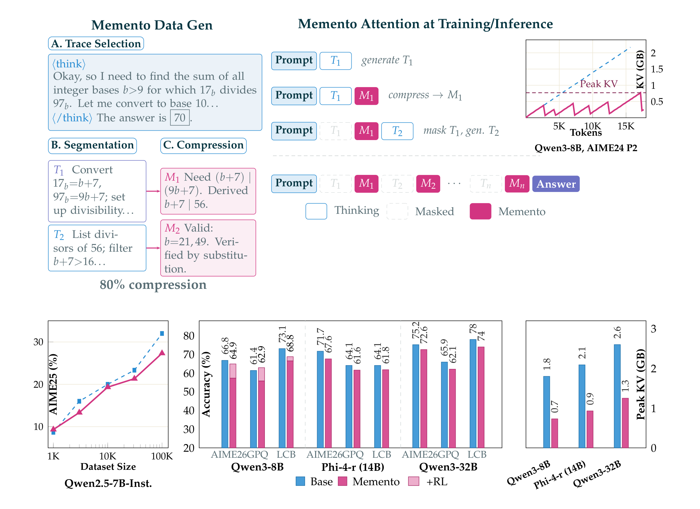
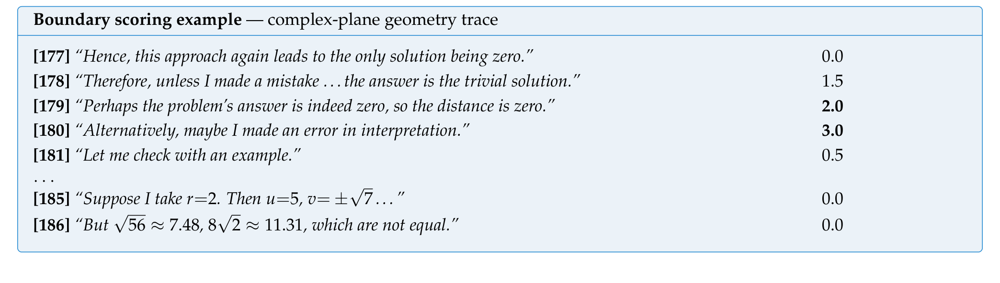
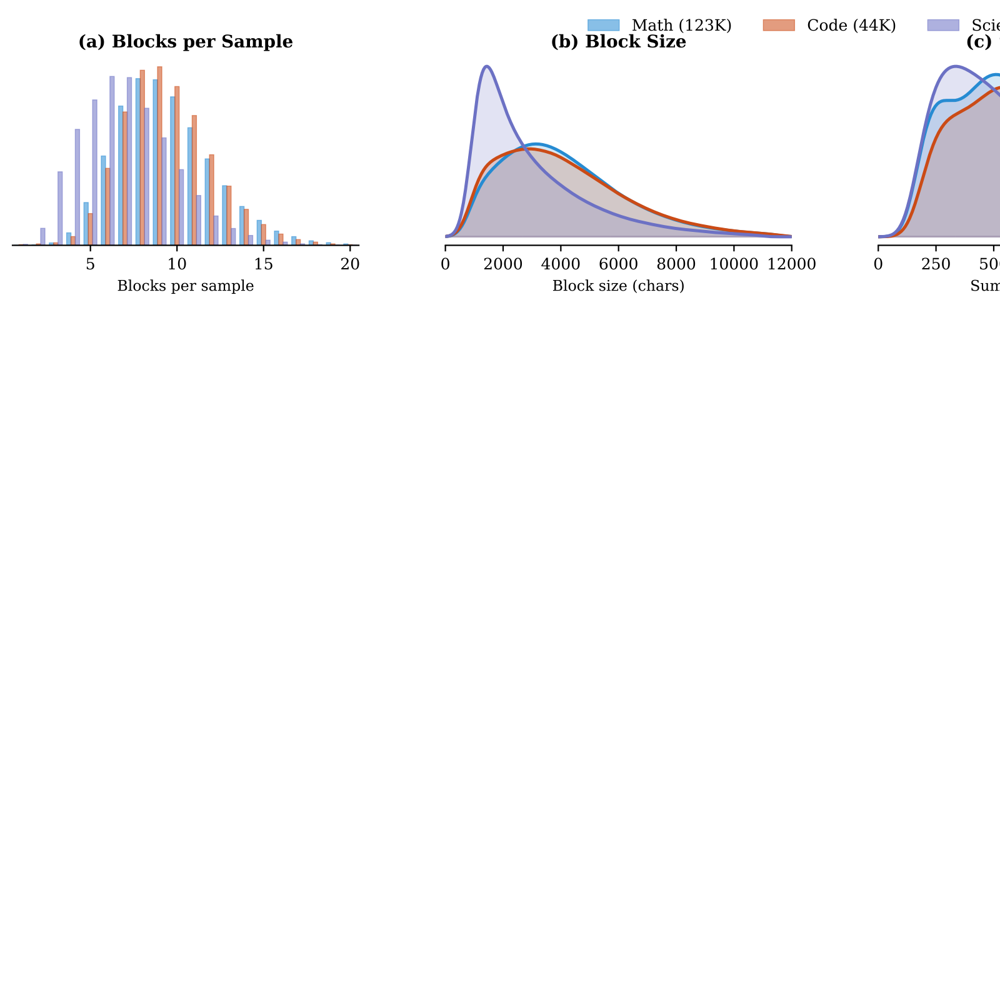
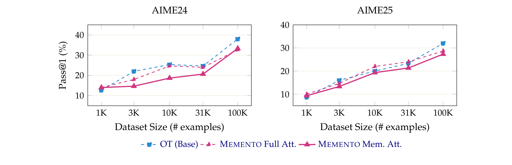
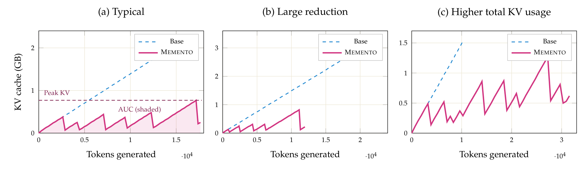
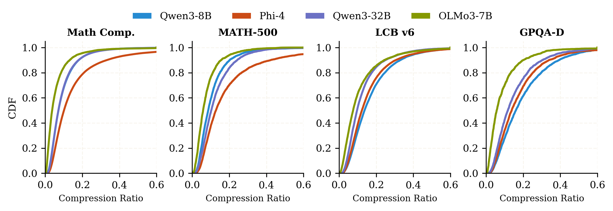
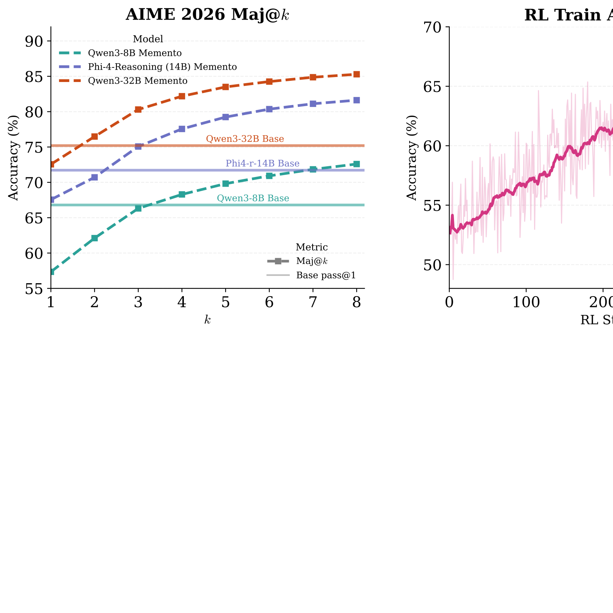
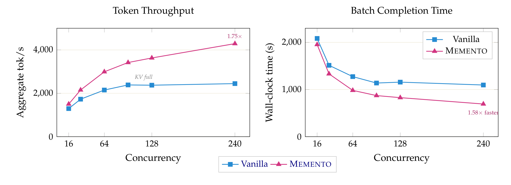
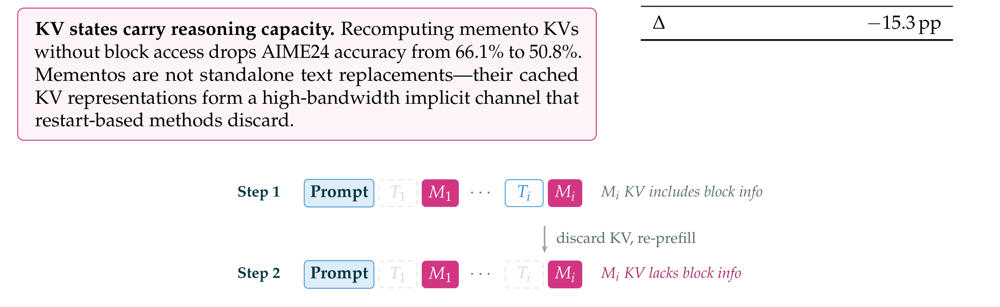
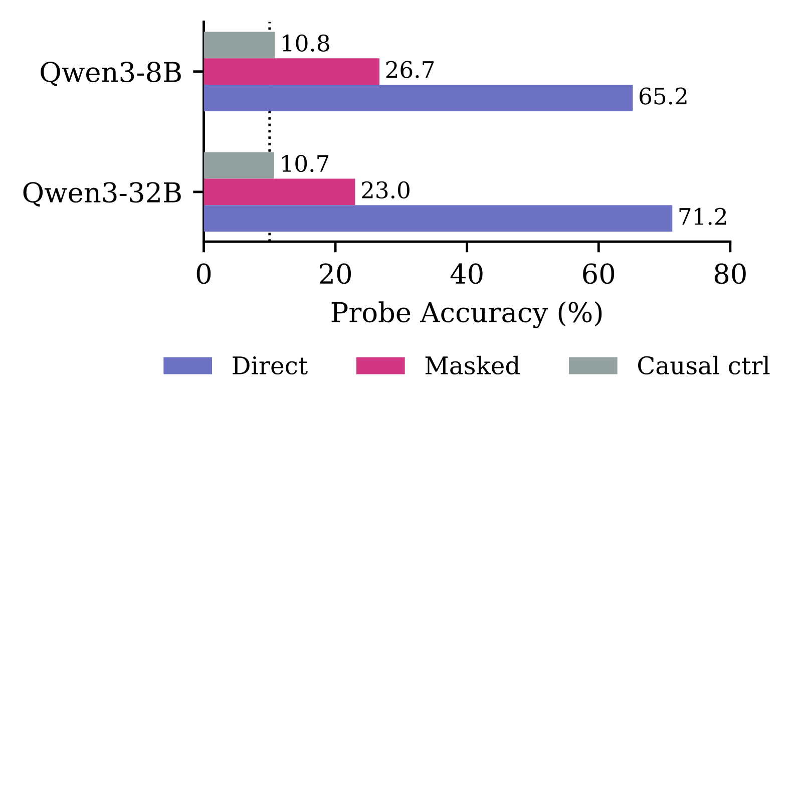

# Memento: Teaching LLMs to Manage Their Own Context
## Memento：让大语言模型学会管理自身上下文

> **论文元信息**
>
> - **英文标题**：Memento: Teaching LLMs to Manage Their Own Context
> - **中文标题**：Memento：让大语言模型学会管理自身上下文
> - **作者**：Vasilis Kontonis、Yuchen Zeng、Shivam Garg、Lingjiao Chen、Hao Tang、Ziyan Wang、Ahmed Awadallah、Eric Horvitz、John Langford、Dimitris Papailiopoulos（后四位为通讯作者）
> - **机构**：Microsoft Research
> - **arXiv**：[2604.09852v1](https://arxiv.org/abs/2604.09852)（2026-04-10，[HTML 版](https://arxiv.org/html/2604.09852v1)）
> - **代码**：https://github.com/microsoft/memento
> - **数据集**：OpenMementos — https://huggingface.co/datasets/microsoft/OpenMementos
> - **篇幅**：30 页；正文含 5 张表格（表 1–5）与 13 幅图（PDF 印刷版编号，本译文收录图 1–10）

> **翻译说明**
>
> - **覆盖范围**：摘要 + 第 1–7 节全部正文 + 附录 A 正文叙述（A.1–A.5）+ 表 1–5 全量数值 + 图 1–10（已导出并随文引用）；参考文献保留原文编号，不逐条翻译。
> - **图号口径**：arXiv HTML 版将总览图标为 Figure 0，其余图号均比 PDF 印刷版小 1（HTML Figure $N$ 对应 PDF 图 $N+1$）。本译文统一采用 PDF 印刷版编号（图 1–图 13）。
> - **插图**：共 10 张（图 1–10），已下载至 `images/Memento/`，以相对路径引用，可离线阅读。附录图 11–13（迭代精炼、多阶段 SFT 消融、玩具 Transformer 探针）未导出图片，在正文中以文字转述，不引用不存在的文件。
> - **公式处理**：统一用 LaTeX 重排（`$…$` / `$$…$$`），数学环境外不出现裸 LaTeX 命令。
> - **术语约定**：首次出现保留英文（memento、thinking block、KV cache、sparse attention 等），之后用中文；正文为简体中文。

---

## 摘要（Abstract）

推理模型以冗长、无结构的流式方式思考，自身没有机制去压缩或组织其中间状态。我们提出 **Memento**：一种教导模型将推理切分为若干块（block）、将每块压缩为一个 **memento**（即稠密的状态摘要），并仅通过关注 memento 向前推理，从而降低上下文、KV cache 与计算量的方法。为训练 Memento 模型，我们发布 **OpenMementos**——一个基于 OpenThoughts-v3 构建、经切分并用中间摘要标注的 22.8 万条公开推理轨迹数据集。我们展示了在 OpenMementos 上的两阶段 SFT 方案，在不同模型族（Qwen3、Phi-4、Olmo 3）与不同规模（8B–32B 参数）上均有效。训练后的模型在数学、科学与代码基准上保持强劲准确率，同时实现约 $2.5\times$ 的峰值 KV cache 缩减。我们将 vLLM 扩展以支持我们的推理方法，在获得约 $1.75\times$ 吞吐提升的同时，还能进行 RL（强化学习）以进一步提升准确率。最后，我们识别出一种**双信息流（dual information stream）**：每个推理块的信息既由 memento 文本承载，也由相应的 KV 状态承载，后者保留了来自原始块的隐含信息。移除这一通道会使 AIME24 上的准确率下降 15 个百分点。

<!-- 原图：https://arxiv.org/html/2604.09852v1/ -->

> **图 1（arXiv HTML 版 Figure 0）**：Memento overview. Top left: SFT data generation pipeline. Starting from a reasoning trace, we split text into sentences, use an LLM to score each sentence boundary as a potential stopping point, optimize boundary selection algorithmically, and finally use an LLM to summarize each block into a memento. Top right: Sparse attention during inference. The model produces alternating thinking blocks ($T_i$) and mementos ($M_i$); once a memento is generated, KV cache entries for its preceding thinking block are physically removed. The sawtooth KV trace shows the resulting memory pattern.
> （中文翻译：MEMENTO 总览。左上：SFT 数据生成流水线——从一条推理轨迹出发，将其拆分为句子，用 LLM 为每个句间边界打分（作为潜在停顿点），以算法方式优化边界选择，最后用 LLM 把每个块总结为一个 memento。右上：推理时的稀疏注意力——模型交替生成 thinking block（$T_i$）与 memento（$M_i$）；一旦生成某个 memento，其前序 thinking block 的 KV cache 条目即被物理移除。锯齿形的 KV 轨迹展示了由此产生的记忆模式。）

## 1. 引言（Introduction）

大语言模型（LLM）在测试时 routinely 地进行推理，往往要花费数千 token 逐步推导才能得出答案（OpenAI, 2024；DeepSeek-AI et al., 2025；Qwen Team, 2024）。这带来了硬推理基准上的巨大提升，但也制造了一个新问题：推理模型没有内建机制来组织自己的思维链（chain-of-thought）。一段 32K token 的 CoT 是一个扁平、无结构的流，模型无法标记某个中间结果“值得保留”，也无法把一个长推导压缩成一个可以在后续引用的紧凑结论。每一个历史 token 都以相同代价停留在注意力窗口中，而模型没有学会丢弃它们。

我们提出 **Memento**，一种训练模型将思维链切分为语义连贯的块、并在每个块之后生成一个压缩摘要（我们称之为 **memento**¹）的方法。¹ 这里借用 Christopher Nolan 2000 年电影《记忆碎片》（Memento）的命名：影片主人公通过维护外部记忆物件来补偿顺行性遗忘症——这恰似一个必须依据自身过去思考的压缩摘要来推理的模型。与通常说明性意义上的摘要不同，每个 memento 是一个推理块的最小化记录，以尽可能少的 token 保留其结论、中间数值与关键的方向性决策。一旦生成 memento，前一个 thinking block 就会通过定制的、基于 vLLM 的引擎（Kwon et al., 2023）在一次不间断的生成调用内部被掩码（mask）：在之后的每一步，模型只关注过去的 memento 与当前块。每个块平均被压缩到约 $5\text{–}20\times$ 更小的规模，因此模型实际关注的上下文只是整条轨迹的一小部分。这一推理过程如图 1（右）所示。

关键在于，由于掩码是**原地（in-place）**发生的，而非通过重启生成，每个 memento 的 KV cache 条目是在完整块仍处于上下文中时计算的，并在该块被掩码后保留下来。尽管原始的 thinking token 已经消失，它们仍隐含地存在于 memento KV 状态的表示中。这就形成了一种**双信息流**：显式的 memento 文本，加上一条通过被缓存 KV 状态的隐含表示通道。我们通过实验验证了这一点：在不带块上下文的情况下重算 memento 的 KV，会使 AIME'24 上的准确率下降 15 个百分点（第 6.2.1 节）；我们的探针实验（第 6.2.2 节）则表明，memento 文本中并未包含、却仍可从 memento KV 状态中恢复出的块信息，且较深的层携带了最多与任务相关的信号。

一个核心顾虑是压缩可能会摧毁推理能力。我们在三个模型族（Qwen3 8B/32B、Phi-4-reasoning 14B、Olmo-3-7B-Think）上的实验表明事实并非如此。在 AIME'26 上，启用 Memento 的 Qwen3-32B 仅损失 2.6 个百分点（72.6% vs. 75.2%），同时把峰值 KV cache 削减了约 $2\times$。在表 1 五个基准组上取平均，准确率差距在 32B 上为 3.5 个百分点、在 8B 上为 6.3 个百分点；并且我们观察到在同一模型族内差距随规模缩小，说明更大的模型能更有效地管理被压缩的上下文。进一步，我们展示了 RL 微调可以弥合剩余的差距——这得益于我们 vLLM 分支对原生块掩码（native block masking）的支持。

为训练 Memento 模型，我们构建了 **OpenMementos**：一个包含 22.8 万条经过切分与摘要标注的推理轨迹的公开数据集，源自 OpenThoughts（Guha et al., 2025）。构建该数据集需要解决一个非平凡的标注问题：推理轨迹缺乏自然的切分边界，而朴素的摘要会丢失模型继续推理所需精确中间状态。我们的流水线结合了 LLM 打分的边界检测、算法化的切分，以及迭代式、由 judge 精炼的摘要生成，从而产出每个 memento 既忠实又最小化的训练数据。我们的主要贡献可归纳如下：

1. **OpenMementos**：一个包含 22.8 万条经过切分、摘要化的推理链的公开数据集，附带标注流水线与代码。
2. **规模化验证**：在三个模型族（Qwen3 8B/32B、Phi-4-reasoning 14B、Olmo-3-7B-Think）上的规模化展示，表明模型将摘要生成为一种习得的能力，同时在 $2\text{–}3\times$ 峰值 KV cache 缩减下保持推理准确率。
3. **vLLM 中的原生块掩码**：一个定制的分支，支持在单次生成调用内部进行原地的 KV cache 掩码——这是 Memento 推理与训练共同面临的关键基础设施瓶颈。它使得带块掩码的 RL 微调成为可能，从而让我们弥合准确率差距。
4. **双信息流**：我们识别并验证了 memento KV 状态编码了来自被掩码块的信息——这是基于重启（restart）的方法所不具备的机制。移除这一通道会使 AIME'24 上的准确率下降 15 个百分点。

## 2. 相关工作（Related Work）

对长程运行模型的上下文管理通常通过外部基础设施来处理：独立的摘要器、记忆模块或编排逻辑（Wu et al., 2025；Xu et al., 2025）。我们则聚焦于教导模型在推理过程中管理**自身**上下文，将其视为一种内部能力而非外部系统。在那些确实训练模型进行上下文管理的工作中，MemAgent（Yu et al., 2025）按段读取文本，并通过用 RL 训练的覆写策略更新一个固定大小的记忆；MEM1（Zhou et al., 2025b）对多轮智能体交互采取类似方法，在工具调用与环境观测之间维护一个紧凑的内部状态。二者主要关注管理外部信息、检索到的文档、工具输出与环境观测，而非在求解困难数学或代码问题时常见的复杂推理链。

与我们的工作最相近的是那些训练模型压缩自身数学等领域推理输出的研究：InftyThink（Yan et al., 2025）、InftyThink+（Yan et al., 2026）、Accordion-Thinking（Yang et al., 2026），以及 The Markovian Thinker（Aghajohari et al., 2025）。这些工作把推理切分为（可能变长的）块，并训练模型从一个紧凑的文本“承接（carryover）”而非完整的先前块继续推理。InftyThink 仅依赖 SFT，而 InftyThink+、Accordion-Thinking 与 The Markovian Thinker 还额外使用 RL 来改进这种块到块的承接。所有这些工作都运作在文本层面：在每个推理块之后，未来的上下文仅由紧凑文本重建，丢弃原始推理 token 及其 KV cache 表示。Memento 的不同之处在于它通过引擎内部的注意力掩码（而非文本层面的上下文重建）保留摘要的 KV 条目，从而创造出双信息流：显式的 memento 文本，以及编码在 memento KV cache 中的隐含表示。我们的实验表明有用信息存储在这些 KV 条目中——丢弃它们、在不带块上下文的情况下重算 memento KV，会使 AIME24 准确率下降 15 个百分点（第 6.2.1 节）。

另一项相近工作 PENCIL（Yang et al., 2025）探索了在合成任务上从零开始训练的模型的习得式上下文管理。PENCIL 教导模型通过归约规则擦除中间推理，使小型（2500 万参数）模型能在 2K 上下文长度下求解 3-SAT 问题与爱因斯坦谜题（一类多约束逻辑演绎），展示了上下文管理的潜力不止于记忆与吞吐效率，它还能让模型求解比标准 CoT 允许的困难得多的问题。这样的增益能否在更大规模以及数学、代码等场景下实现（例如通过 Memento 式压缩），是一个值得未来的有趣方向。

一条紧密相关的研究线把推理块压缩为习得的 **gist token**（即特殊用途 token，其 KV cache 条目编码了前一块的压缩表示），随后原始 token 被驱逐（Zhang et al., 2025b；Monea et al., 2025）。gist-token 方法的一个局限是可解释性丧失：压缩状态完全编码在隐藏表示中。Memento 的摘要是自然语言文本，在保持可解释性的同时仍实现了压缩。

一条互补的研究线旨在通过更短的轨迹或直接压缩 KV cache 来降低推理的内存占用。其中包括训练模型跳过低重要性 token（Xia et al., 2025；Li et al., 2025）、在压缩的推理轨迹上训练（Kang et al., 2025；Zhang et al., 2025c），或通过 RL 引导模型生成更短轨迹（Hou et al., 2025；Shrivastava et al., 2025）。其他工作用潜在表示替代显式推理 token（Shen et al., 2025；Tan et al., 2025；Hao et al., 2024）。在 KV cache 层面，推理时方法如 ThinKV（Ramachandran et al., 2025）、R-KV（Cai et al., 2025）、LazyEviction（Zhang et al., 2025a）以及 Reasoning Path Compression（Song et al., 2025）基于注意力模式剪枝或量化缓存条目，而诸如滑动窗口注意力（sliding-window attention，Beltagy et al., 2020）的架构则通过设计限制注意力跨度（Team Olmo et al., 2025）。这些架构层面的方法与 Memento 正交，且许多很可能可以与之组合：例如我们展示了带有滑动窗口注意力的 Olmo-3-7B-Think 也能与 Memento 有效结合。

最后，我们注意到与近期关于记忆增强型智能体的工作存在命名重合：Zhou et al.（2025a）与 Wang（2026）也用 Memento 这一名称指代那些为推理时智能体自适应维护外部情景记忆（episodic memory）的系统。

## 3. OpenMementos 数据集（OpenMementos Dataset）

训练模型同时进行推理与管理上下文，需要高质量的标注数据：被切分为语义连贯块、并配对以稠密摘要的推理轨迹。一个核心挑战是，典型的推理轨迹并非一系列独立的想法，而是一条没有“自然”边界的连续流。下面我们描述数据生成流水线（图 1，左上），它接收原始 CoT 轨迹并产出用 memento 标注的结构化轨迹。

#### 设计动机（Design rationale）

流水线中的每个阶段都体现了一个深思熟虑的设计选择。起初，我们尝试让前沿 LLM 直接把 CoT 切分为语义连贯的块，这失败了。即便是强模型，也难以处理一个需要考虑所有可能划分组合、同时推理块连贯性、尺寸均衡与语义边界的组合优化问题。

为简化问题，我们将其分解：边界打分（boundary scoring）提出一个局部问题（“这里是否适合把 CoT 切片？”），LLM 擅长此道；而在给定 LLM 打分后，对边界选择的全局优化则由算法完成。我们随后用一个 LLM judge 来为摘要质量打分——以编程方式定义“好摘要”很困难，但 LLM 能针对显式评分量规给出合理分数。我们进而选择了对 memento 的迭代精炼（iterative refinement）而非一次性摘要，因为初始 memento 常常遗漏关键公式或中间数值；零样本方法仅有 28% 的通过率（在我们的量规上得分 $\geq 8/10$），而 judge 反馈循环将其提升到 92%。

#### 阶段 0：种子选取（Seed selection）

我们从 OpenThoughts-v3（Guha et al., 2025）——一个由 QwQ-32B 生成的、被广泛采用的 CoT 轨迹数据集——中取得 22.8 万条推理轨迹，并通过我们的标注流水线处理，得到最终的 OpenMementos 数据集。虽然我们可以用更强的教师模型重新生成轨迹，但我们利用 OpenThoughts，因为：(1) 已在大规模生成这些轨迹上投入了大量精力；(2) OpenThinker-3 论文提供了大量基线，使其成为理想的试验台；(3) 我们的假设——来自相对较强的推理器（QwQ-32B）的轨迹应能跨模型族迁移——得到了经验证实（适用于 Qwen3、Phi-4、Olmo 3）。

#### 阶段 1：句子切分（Sentence splitting）

我们把推理轨迹切分为原子的“句子”：可以独立成句的、完整的、模块化的想法。代码块与多行数学公式被检测出来并作为原子单元保护。纯文本在句子边界处切分（避免在括号、行内数学或缩写内部切分）。最后，我们合并逻辑上相连的句子片段：以冒号结尾的句子附加到下一句；接续词（Therefore、Thus、So）提示需要与前一句合并；短片段（少于 5 个 token）与连续数学表达式被合并。这种结构感知的切分相比朴素句子切分将候选边界减少了约 $2\times$（平均每条约 $397\to 187$ 个）。

#### 阶段 2：边界打分（Boundary scoring）

一个 LLM judge（在我们的例子中是 GPT-5.x）评估每个句间边界作为潜在断点的可能性，打分从 0（想法中途，会打断流畅性）到 3（重大转折，自然的章节边界）。提示词要求：“绝不要在计算中途打 2–3 分。如果上一句以‘:’或‘=’结尾，打 0 分。”由于轨迹包含数百个边界，我们分批打分：judge 看到一个连续句子的窗口，并为窗口内的每个边界打分。边界打分的示例见图 2。

<!-- 原图：https://arxiv.org/html/2604.09852v1/（arXiv HTML 内嵌矢量图 Figure 1） -->

> **图 2（arXiv HTML 版 Figure 1）**：Boundary scoring assigns each inter-sentence boundary a score from 0 to 3. Sentence 179 wraps up a conclusion (score 2.0); sentence 180 pivots to a new strategy (score 3.0—the strongest possible boundary); sentences 185–186 are mid-derivation (scores 0.0—never split here). The segmentation optimizer selects cuts at high-scoring transitions.
> （中文翻译：边界打分——为每个句间边界分配 0 到 3 的分数。第 179 句收束了一个结论（得分 2.0）；第 180 句转向一个新策略（得分 3.0——可能的最强边界）；第 185–186 句处于推导中途（得分 0.0——绝不在此切分）。切分优化器在高分转折处选择切点。）

#### 阶段 3：切分（Segmentation）

给定 $n$ 个句子及其边界分数 $s_1,\ldots,s_{n-1}$，我们通过最大化如下目标将轨迹划分为 $K$ 个连续块：

$$\frac{1}{K}\sum_{b\in\text{boundaries}} s_b \;-\; \lambda\cdot\frac{\sigma(\ell_1,\ldots,\ell_K)}{\mu(\ell_1,\ldots,\ell_K)}$$

并约束每个块至少包含 200 个 token。其中 $b$ 为边界位置，$\ell_k$ 为第 $k$ 个块的 token 数，$\mu$ 与 $\sigma$ 为块尺寸的均值与标准差，且 $\lambda=0.5$。我们在合法的划分与 $K$ 的取值上优化。

我们观察到，第一项奖励在强语义边界处切分：把切点放在 score-3 转折（主题重大变化）处的划分，比放在低分转折（推导中途）处的划分得分更高。第二项惩罚块尺寸不均。变异系数 $\sigma/\mu$ 是尺度无关的，因此无论轨迹是 5K 还是 50K token，该惩罚同样适用。没有这一项，优化器会贪心地切在最高分边界处而不顾均衡，常常产生一个很长的块和若干个极小的块。

#### 阶段 4：迭代式 memento 生成（Iterative memento generation）

每个块被压缩为一个 memento：一种简洁的状态表示，保留后续块成功所需的所有逻辑相关信息（定义、公式、中间数值、所选策略、被拒绝的方法）。与传统摘要不同，目标是推理状态的“无损压缩”：memento 必须捕获未来推理步骤可能需要的一切，目标是原 token 的约 $15\text{–}25\%$，且是纯抽取式的（不引入新的推导或错误修正）。

#### 压缩器（Compressor）

压缩器调用（使用 GPT-5.x）接收所有块，并用简洁记号（分号分隔的子句、“名称: 值”对、紧凑数学）为每个块生成一个 memento。提示词要求：“你是一个 STATE-COMPRESSOR。在完整捕获所有逻辑相关信息的前提下，最小化 token 数。”

#### 判断器（Judge）

一个独立的 LLM 调用（同样使用 GPT-5.x）从六个维度对每个 memento 在 0–10 分上打分：(1) 逐字提取的公式（0–3）；(2) 保留的数值（0–2）；(3) 显式命名的的方法（0–2）；(4) 包含验证（0–1）；(5) 无幻觉（0–1）；(6) 结果优先的结构（0–1）。如果分数低于接受阈值 $\tau=8$（满分 10），judge 会提供可操作的反馈（例如“缺失公式：$K^2-3K+3$”）用于精炼 memento；得分 $\geq\tau$ 的 memento 直接接受，不再精炼。我们使用最大 $T=2$ 次迭代，即 Compressor $\to$ Judge $\to$ Compressor $\to$ Judge。增加更多迭代不会显著提升 memento 质量，反而使 memento 变长。memento 迭代改进的示例见图 11（附录，未导出图片，见正文文字转述）。

**数据集统计（Dataset statistics）。** 图 3 刻画了最终的 OpenMementos 数据集（22.8 万样本：54% 数学、19% 代码、27% 科学）。数学与代码轨迹比科学轨迹产生更多块/样本（中位数 9 vs. 科学的中位数 7），且数学的块最大（中位数 3.8K 字符）。摘要尺寸在各领域 remarkably 稳定（中位数 509–603 字符），得到中位压缩比 0.16（数学）、0.18（代码）、0.23（科学）——对应约 $4\text{–}6\times$ 的块级压缩。在整个数据集上，平均块含约 $1{,}150$ 个 token，平均 memento 约 $194$ 个 token，因此轨迹级压缩约为 $6\times$（从每条约 $10{,}900$ 个块 token 到约 $1{,}850$ 个 memento token）。

<!-- 原图：https://arxiv.org/html/2604.09852v1/training_data_kde.svg -->

> **图 3（arXiv HTML 版 Figure 2）**：OpenMementos dataset distributions by domain (228K samples). (a) Math and code have $\sim 9$ blocks/sample; science has $\sim 7$. (b) Block sizes range from 2.3K (science) to 3.8K (math) chars. (c) Summary sizes cluster around 509–603 chars across all domains, indicating a stable compression target. (d) Math achieves the tightest compression ratio (median 0.16) due to its larger blocks.
> （中文翻译：OpenMementos 数据集按领域的分布（22.8 万样本）。(a) 数学与代码每样本约 9 个块；科学约 7 个。(b) 块尺寸从 2.3K（科学）到 3.8K（数学）字符不等。(c) 摘要尺寸在各领域集中在 509–603 字符，表明压缩目标稳定。(d) 数学因其较大的块而实现最紧的压缩比（中位数 0.16）。）

## 4. 训练 Memento 模型（Training the Memento Models）

我们在 OpenMementos 上使用一个两阶段 SFT 流程，将格式学习与管理上下文分离开来。其直觉遵循标准的课程学习（curriculum learning）：我们先让模型在正常条件下习得块-memento 格式，再引入在不接触被掩码内容的情况下运作这一更难的约束（消融见附录 A.4.1）。

- **阶段 1：全注意力（Full Attention）**：对所有 token 的标准因果注意力。损失计算在所有 token 上，包括 thinking block、memento、特殊 token 与最终答案。模型在无任何上下文管理压力下习得块-memento 格式。
- **阶段 2：Memento 注意力（Memento Attention）**：在每个完成的 memento 之后，其前序 thinking block 被从所有后续注意力中掩码掉。这教导模型生成自包含的 memento，携带下游推理所需的全部信息。

注意力掩码实现维护一个块缓存（block cache），追踪每个 token 属于 thinking block、摘要还是其他内容。当生成 `<|summary_end|>` 时，前序块被标记为完成并从未来注意力中掩码。训练时，该掩码预先构造为稠密矩阵；推理时，块缓存在自回归步骤之间保持状态。四个特殊 token（`<|block_start|>`、`<|block_end|>`、`<|summary_start|>`、`<|summary_end|>`）被加入，并以语义相关已有 token 的均值嵌入（例如 `<|block_start|>` 取自 block、start、begin、section、step）加少量高斯噪声初始化。

#### 数据扩展（Data Scaling）

当从零训练一个非推理模型（Qwen2.5-7B-Instruct）时，数据扩展遵循与标准推理 SFT（Guha et al., 2025）类似的单调趋势。我们通过用不同数量的数据（1K、3K、10K、31K、100K 样本）微调 Qwen2.5-7B-Instruct，比较 vanilla OpenThoughts（OT）、使用全注意力的 OpenMementos（OM/Full）与使用 memento 注意力的 OpenMementos（OM/Mem），来研究性能如何随 OpenMementos 训练数据量扩展。

如图 4 所示，三种方法都从 1K 到 100K 单调提升。OT 在所有数据预算下都取得最高准确率，而 OM/Full 与 OM/Mem 以不大的差距落后。

<!-- 原图：https://arxiv.org/html/2604.09852v1/（arXiv HTML 内嵌矢量图 Figure 3） -->

> **图 4（arXiv HTML 版 Figure 3）**：Training data scaling. Pass@1 accuracy on AIME24 and AIME25 for Qwen2.5-7B-Instruct fine-tuned on 1K–100K examples. All methods improve monotonically with data size.
> （中文翻译：训练数据扩展。在 1K–100K 样本上微调的 Qwen2.5-7B-Instruct 的 AIME24 与 AIME25 的 Pass@1 准确率。所有方法都随数据量单调提升。）

#### 微调推理模型（Fine-Tuning Reasoning Models）

当从已经很强的推理模型出发时，我们发现用更多 epoch 训练更少样本，比用更少 epoch 训练更多样本更有效。我们在 22.8 万 OpenMementos 池中抽取 31K 样本、以 32K 序列长度训练，因为进一步的收益通过强化学习（第 5 节）比通过额外监督数据更容易获得。我们发布完整的 22.8 万数据集，以支持这两个方向的未来研究。

#### 超参数（Hyperparameters）

所有模型与阶段使用相同超参数。关键超参数：学习率 $8\times 10^{-5}$，带 5% 预热的余弦调度（cosine schedule），每阶段 5 个 epoch，AdamW（$\beta_1=0.9$、$\beta_2=0.999$），无权重衰减，bfloat16 精度，批大小 512，32 块 B200 GPU。详见附录 A.2.1。

**表 1：Memento 在统一注意力层模型上实现 $2\text{–}3\times$ 峰值 KV 缩减，同时保持强劲推理性能；在 Qwen3-8B 之上做 RL 进一步提升准确率。Olmo-3-7B 因其混合滑动窗口架构（第 4 节）节省更有限（约 $0.85\text{–}0.93\times$）。$\Delta$ 列给出 Memento 与 Mem.+RL 相对 Control 的变化：准确率增量为加性（pp）；KV 增量为乘性（Method / Control，故 $0.39\times$ 表示 KV 减少 61%）。指标——Accuracy (%)：pass@1 准确率；Peak KV (GB)：峰值 KV cache 大小；AUC KV (GB·ktok)：KV 占用- token 曲线下面积。**

| 模型 | 设置 | 指标 | AIME'26 | Comp. Math | MATH-500 | GPQA-D | LCB v6 |
| --- | --- | --- | --- | --- | --- | --- | --- |
| Qwen3-8B | Base | Acc (%) | 66.8 ±1.1 | 54.3 ±0.3 | 90.5 ±0.9 | 61.4 ±2.4 | 73.1 ±1.0 |
| | | Peak KV (GB) | 2.41 | 2.71 | 0.84 | 1.23 | 1.76 |
| | | AUC KV (GB·ktok) | 25.3 | 30.9 | 4.3 | 6.6 | 15.6 |
| | Control | Acc (%) | 64.7 ±1.1 | 49.2 ±0.3 | 89.7 ±1.0 | 57.8 ±2.5 | 70.0 ±1.0 |
| | | Peak KV (GB) | 2.59 | 2.82 | 0.88 | 1.60 | 1.89 |
| | | AUC KV (GB·ktok) | 28.3 | 33.1 | 4.7 | 11.8 | 19.2 |
| | Memento | Acc (%) | 57.3 ±1.1 (−7.4%) | 45.1 ±0.3 (−4.1%) | 90.1 ±0.9 (+0.4%) | 55.8 ±2.5 (−2.0%) | 66.5 ±1.0 (−3.5%) |
| | | Peak KV (GB) | 1.02 (0.39×) | 1.08 (0.38×) | 0.41 (0.47×) | 0.56 (0.35×) | 0.60 (0.32×) |
| | | AUC KV (GB·ktok) | 9.7 (0.34×) | 10.7 (0.32×) | 1.9 (0.40×) | 4.0 (0.34×) | 5.6 (0.29×) |
| | Mem.+RL | Acc (%) | 64.9 ±1.1 (+0.2%) | 49.4 ±0.3 (+0.2%) | 91.0 ±0.9 (+1.3%) | 62.9 ±2.4 (+5.1%) | 68.8 ±1.0 (−1.2%) |
| | | Peak KV (GB) | 1.45 (0.56×) | 1.48 (0.52×) | 0.68 (0.77×) | 1.24 (0.77×) | 1.12 (0.59×) |
| | | AUC KV (GB·ktok) | 14.9 (0.53×) | 16.4 (0.50×) | 3.2 (0.68×) | 9.2 (0.78×) | 10.3 (0.54×) |
| Phi-4-r (14B) | Base | Acc (%) | 71.7 ±1.0 | 55.1 ±0.3 | 87.3 ±1.1 | 64.1 ±2.4 | 64.1 ±1.0 |
| | | Peak KV (GB) | 2.65 | 3.06 | 1.43 | 0.80 | 2.45 |
| | | AUC KV (GB·ktok) | 28.8 | 35.9 | 17.8 | 3.7 | 29.2 |
| | Control | Acc (%) | 69.8 ±1.0 | 51.4 ±0.3 | 90.6 ±0.9 | 64.1 ±2.4 | 65.0 ±1.0 |
| | | Peak KV (GB) | 3.04 | 3.48 | 1.04 | 2.11 | 2.64 |
| | | AUC KV (GB·ktok) | 28.6 | 36.7 | 4.9 | 14.2 | 26.8 |
| | Memento | Acc (%) | 67.6 ±1.1 (−2.2%) | 48.7 ±0.3 (−2.7%) | 89.7 ±1.0 (−0.9%) | 61.6 ±2.4 (−2.5%) | 61.8 ±1.1 (−3.2%) |
| | | Peak KV (GB) | 1.17 (0.38×) | 1.25 (0.36×) | 0.51 (0.49×) | 0.80 (0.38×) | 0.92 (0.35×) |
| | | AUC KV (GB·ktok) | 11.3 (0.40×) | 13.1 (0.36×) | 2.6 (0.53×) | 6.2 (0.44×) | 9.5 (0.35×) |
| Qwen3-32B | Base | Acc (%) | 75.2 ±1.0 | 62.7 ±0.3 | 91.9 ±0.9 | 65.9 ±2.4 | 78.0 ±0.9 |
| | | Peak KV (GB) | 3.24 | 3.67 | 1.26 | 1.89 | 2.88 |
| | | AUC KV (GB·ktok) | 26.7 | 34.7 | 5.5 | 9.7 | 22.9 |
| | Control | Acc (%) | 74.1 ±1.0 | 58.5 ±0.3 | 91.8 ±0.9 | 64.6 ±2.4 | 75.3 ±0.9 |
| | | Peak KV (GB) | 3.83 | 4.51 | 1.36 | 2.45 | 3.05 |
| | | AUC KV (GB·ktok) | 35.2 | 48.5 | 6.2 | 15.7 | 27.7 |
| | Memento | Acc (%) | 72.6 ±1.0 (−1.5%) | 56.2 ±0.3 (−2.3%) | 91.1 ±0.9 (−0.7%) | 62.1 ±2.4 (−2.5%) | 74.0 ±1.0 (−1.3%) |
| | | Peak KV (GB) | 1.67 (0.44×) | 1.74 (0.39×) | 0.64 (0.47×) | 1.07 (0.44×) | 1.12 (0.37×) |
| | | AUC KV (GB·ktok) | 14.0 (0.40×) | 15.7 (0.32×) | 2.8 (0.45×) | 7.6 (0.48×) | 9.3 (0.34×) |
| Olmo 3 (7B) | Base | Acc (%) | 67.9 ±1.1 | 52.7 ±0.3 | 91.3 ±0.9 | 50.8 ±2.5 | 64.5 ±1.0 |
| | | Peak KV (GB) | 3.95 | 4.21 | 2.11 | 3.21 | 3.33 |
| | | AUC KV (GB·ktok) | 50.8 | 60.1 | 10.7 | 30.8 | 40.0 |
| | Control | Acc (%) | 59.8 ±1.1 | 48.3 ±0.3 | 90.4 ±0.9 | 45.7 ±2.5 | 58.8 ±1.1 |
| | | Peak KV (GB) | 3.51 | 3.78 | 2.00 | 2.94 | 3.22 |
| | | AUC KV (GB·ktok) | 37.1 | 46.0 | 9.1 | 23.8 | 37.6 |
| | Memento | Acc (%) | 55.4 ±3.2 (−4.4%) | 48.1 ±0.9 (−0.2%) | 91.1 ±0.9 (+0.7%) | 49.5 ±2.5 (+3.8%) | 56.0 ±1.1 (−2.8%) |
| | | Peak KV (GB) | 3.21 (0.91×) | 3.43 (0.91×) | 1.70 (0.85×) | 2.72 (0.93×) | 2.21 (0.69×) |
| | | AUC KV (GB·ktok) | 37.8 (1.02×) | 43.6 (0.95×) | 8.5 (0.93×) | 25.2 (1.06×) | 20.6 (0.55×) |

#### 结果与评估（Results and Evaluation）

我们在四个模型族与规模上评估 Memento：Qwen3-8B、Phi-4-reasoning (14B)、Qwen3-32B 与 Olmo-3-7B。Qwen3-32B 的示例 Memento 轨迹见附录 A.5。所有结果报告 pass@1 准确率。我们在 14 个基准上评估，涵盖竞赛数学（来自 MathArena 的 11 场竞赛，在表 1 中归为“Comp. Math”）、标准数学（MATH-500）、科学（GPQA Diamond）与代码（LiveCodeBench v6）；表 1 汇总了准确率与 KV cache 足迹。

#### 控制运行（Control Runs）

为解耦“对已经很强的推理模型做 SFT（会带来一些性能损失）”这一效应，我们做了控制运行（表 1 中灰色显示）：在原始、未修改的 OpenThoughts 子集上训练基础模型。正如预期，对 Memento 与控制运行而言，最大的性能损失都发生在最具挑战性的竞赛数学基准上，而对 MATH-500 等较容易的基准，Memento 几乎能完美匹配基线。

#### 规模有帮助（Scale Helps）

在 Qwen3 族内，准确率差距随规模缩小：从 8B 的 −6.3 个百分点到 32B 的 −3.5 个百分点（在表 1 五个基准组上取平均）。这表明更大的模型能更有效地管理被压缩的上下文，并且在更大规模上可能取得进一步收益。

#### 峰值 KV cache 与 AUC 节省（Peak KV cache and AUC savings）

我们观察到峰值 KV 降低了 $2\text{–}3\times$，而 KV AUC（生成步骤上 KV-cache 尺寸曲线的下面积，刻画总内存-时间成本）在竞赛数学上降低了 $2\text{–}3.5\times$，在基础模型生成长回复的基准上降幅更大。图 5 展示了块掩码产生的逐题 KV cache 行为范围。

<!-- 原图：https://arxiv.org/html/2604.09852v1/（arXiv HTML 内嵌矢量图 Figure 4） -->

> **图 5（arXiv HTML 版 Figure 4）**：KV cache traces on individual problems (Qwen3-8B, both answers correct). (a) AIME24 P2: typical sawtooth pattern with 6 compactions; peak 0.77 vs 2.17 GB (2.8× reduction). (b) AIME24 P26: Memento solves the problem in 12k tokens (vs 23k); frequent compactions keep peak at 0.82 vs 3.41 GB (4.2×). (c) AIME24 P5: Memento generates 3× more tokens (31k vs 10k) with many compactions. Peak is still lower (1.27 vs 1.55 GB), but the total KV area-under-curve is 2.1× higher than the base—a failure mode where block masking induces excessive generation.
> （中文翻译：单个问题的 KV cache 轨迹（Qwen3-8B，两答案均正确）。(a) AIME24 P2：典型锯齿形，6 次压缩；峰值 0.77 vs 2.17 GB（降低 2.8×）。(b) AIME24 P26：Memento 用 12k token 解题（vs 23k）；频繁压缩使峰值保持在 0.82 vs 3.41 GB（4.2×）。(c) AIME24 P5：Memento 生成 3× 更多 token（31k vs 10k），含多次压缩。峰值仍更低（1.27 vs 1.55 GB），但 KV 曲线下总面积比基线高 2.1×——这是块掩码诱发过度生成的一种失败模式。）

#### Memento 在 Olmo-3-7B-Think 上（Memento on Olmo-3-7B-Think）

我们把 OpenMementos 数据集与训练方案应用于 Olmo-3-7B-Think，它使用混合注意力架构：32 层中 24 层采用滑动窗口注意力（窗口大小 4096），仅 8 层使用全因果注意力。此外，Olmo 3 使用多头注意力（MHA，32 个 KV 头），而非分组查询注意力（GQA，Qwen3 中为 8 个 KV 头）。Memento 在未做任何架构特定修改的情况下迁移成功：准确率保持良好，Comp. Math 相对 Control 仅下降 0.2 个百分点，MATH-500 提升 0.7 个百分点（表 1）。然而，KV cache 节省比其他模型族明显有限（峰值约 $0.85\text{–}0.93\times$，vs. $0.35\text{–}0.47\times$）。这是因为滑动窗口层无论如何都会把 KV cache 上限限制在 4096 token，与块掩码无关——因此 75% 的层从驱逐中毫无收益。只有 8 个全注意力层受益，限制了整体缩减。在某些基准上，Memento 的 AUC 指标甚至略差（例如 AIME'26：$1.02\times$），因为摘要拉长了回复，尽管峰值更低，总内存-时间成本却增加了。LCB 显示出最大的节省（峰值 $0.69\times$，AUC $0.55\times$），可能因为代码问题回复更短，超出滑动窗口的 token 更少。

#### 压缩行为（Compression behavior）

压缩如何跨模型族与基准变化？摘要尺寸 remarkably 稳定（中位数 260–615 字符），与训练分布（图 3）一致，而块尺寸跨模型与任务变化很大。这证实了模型习得了一种一致的、能泛化到更困难问题的压缩能力。图 6 展示了全部四个 Memento 模型上压缩比的完整 CDF，显示大部分块实现了 $5\text{–}20\times$ 压缩，仅有很少的低压缩异常值。

<!-- 原图：https://arxiv.org/html/2604.09852v1/compression_cdf.png -->

> **图 6（arXiv HTML 版 Figure 5）**：CDF of compression ratio (summary chars / block chars). OLMo3-7B and Qwen3-8B achieve the tightest compression on competition math. Phi-4 has the widest compression spread, especially on MATH-500.
> （中文翻译：压缩比（摘要字符数 / 块字符数）的累积分布函数（CDF）。OLMo3-7B 与 Qwen3-8B 在竞赛数学上实现最紧的压缩。Phi-4 的压缩分布最宽，尤其在 MATH-500 上。）

## 5. 通过 RL 提升准确率（Improving Accuracy via RL）

#### 压缩下的能力（Capability under compression）

我们首先研究能否用 Memento 匹配基线性能，或者压缩是否存在某种固有局限。我们聚焦数学——这是压缩最具挑战性的领域（表 1）。对 AIME 2024/25/26 上三个模型族每题生成 $n=64$ 个独立补全，我们发现覆盖率（pass@64）几乎相同：差距平均仅 2.6 个百分点，且 Base 与 Memento 已解集合的 Jaccard 相似度平均达 96.4%，在九种设置中有两种达到 100%（表 2）。

**表 2：Base 与 Memento 在 AIME 上的问题覆盖率（pass@64）与已解集合重叠（每题 $n=64$，每基准 30 题）。Ret. 为保留率，Jacc. 为 Jaccard 相似度。**

| 模型 | 基准 | Base (pass@64) | Memento (pass@64) | Ret. (%) | Jacc. (%) |
| --- | --- | --- | --- | --- | --- |
| Qwen3-8B | AIME'24 | 93.3 | 90.0 | 96.4 | 96.4 |
| | AIME'25 | 93.3 | 86.7 | 92.9 | 92.9 |
| | AIME'26 | 86.7 | 90.0 | 100.0 | 96.3 |
| Phi-4-r (14B) | AIME'24 | 93.3 | 93.3 | 100.0 | 100.0 |
| | AIME'25 | 93.3 | 90.0 | 96.4 | 96.4 |
| | AIME'26 | 93.3 | 90.0 | 96.4 | 96.4 |
| Qwen3-32B | AIME'24 | 93.3 | 93.3 | 100.0 | 100.0 |
| | AIME'25 | 90.0 | 83.3 | 92.6 | 92.6 |
| | AIME'26 | 93.3 | 90.0 | 96.4 | 96.4 |

#### 多数投票恢复差距（Majority voting recovers the gap）

上面的覆盖率分析表明，Memento 模型能求解与基线对应模型几乎相同的问题——只是不那么稳定。多数投票（maj@$k$）使之具体化：如图 7 左栏所示，三个 Memento SFT 模型仅用 $k=2\text{–}3$ 个样本就匹配或超过了 Base 的 pass@1 准确率。对 Qwen3-32B 在 AIME'26 上，maj@2 已经超过了 Base 的 pass@1 线。这告诉我们两件事：(1) SFT 后的准确率差距是一个一致性问题，而非能力问题——正确答案存在于分布中，只是不是众数（mode）；(2) RL 是一个自然的修复手段，因为它可以把概率质量向正确轨迹重新分配，而无需教新的技能。

<!-- 原图：https://arxiv.org/html/2604.09852v1/pass_maj_at_k_64rep.svg -->

> **图 7（arXiv HTML 版 Figure 6）**：Majority-vote headroom and Qwen3-8B CISPO (MiniMax et al., 2025) RL trajectory. Left: AIME 2026 maj@k for the three Memento SFT models (Table 1); horizontal lines show each Base model's pass@1. All models match Base accuracy by k=2–3. Middle: per-step RL training accuracy (faint raw trace with 25-step moving average). Right: AIME'25 validation accuracy evaluated every 25 steps, peaking at 66.2% at step 350 (used in Table 1). Majority voting uses uniform tie-breaking among tied majority answers.
> （中文翻译：多数投票余量与 Qwen3-8B 的 CISPO（MiniMax et al., 2025）RL 轨迹。左：三个 Memento SFT 模型的 AIME 2026 maj@k（表 1）；水平线为各 Base 模型的 pass@1。所有模型在 $k=2\text{–}3$ 时即匹配 Base 准确率。中：每步 RL 训练准确率（淡色原始轨迹加 25 步滑动平均）。右：每 25 步评估的 AIME'25 验证准确率，在 step 350 达 66.2% 峰值（用于表 1）。多数投票在并列多数答案间采用均匀打破平局。）

#### 通过 RL 恢复准确率（Recovering accuracy via RL）

鉴于正确答案已存在于 Memento 分布中，RL 应通过把概率质量重新分配给正确的压缩轨迹、而非教全新的技能来提升 pass@1。我们用 CISPO（MiniMax et al., 2025，Clipped Importance-Sampled Policy Optimization，一种 GRPO（Shao et al., 2024）变体，对重要性采样权重做截断与 detach）微调 Qwen3-8B 的 Memento SFT 检查点。与 MiniMax et al.（2025）类似，我们发现 CISPO 在训练期间比标准 GRPO 更稳定。我们还加入 KL 惩罚（$\beta=0.001$）以防止我们在无正则的初始运行中观察到的回复长度坍塌，并采用基于规则的数学奖励。

Rollout 通过我们定制的 vLLM 引擎使用 memento 注意力块掩码（第 6 节）。训练使用稀疏块掩码注意力（类似 SFT 的阶段 2）以匹配推理时的掩码模式。完整超参数与训练细节见附录 A.2.3。

#### CISPO 算法（CISPO algorithm）

我们使用 CISPO（MiniMax et al., 2025，Clipped Importance-Sampled Policy Optimization），一种 GRPO（Shao et al., 2024）变体，用带 stop-gradient 的截断重要性采样权重替换 PPO（Schulman et al., 2017）的截断代理目标：

$$L = -\operatorname{sg}\!\bigl(\operatorname{clip}(r_t(\theta),\,1{-}\epsilon_{\text{low}},\,1{+}\epsilon_{\text{high}})\bigr)\cdot A_t\cdot\log\pi_{\theta}(a_t\mid s_t),\tag{1}$$

其中 $r_t(\theta)=\pi_{\theta}/\pi_{\theta_{\text{old}}}$ 为重要性比（importance ratio），$\operatorname{sg}$ 表示 stop-gradient（停止梯度）。与 PPO 截断（在比率超出信任域时把梯度置零）不同，CISPO 确保每个 token 都贡献一个梯度信号——被截断的比率充当一个固定的逐 token 权重。我们加入 KL 惩罚项 $\beta\cdot D_{\text{KL}}(\pi_{\theta}|\pi_{\text{ref}})$，取 $\beta=0.001$，以防止相对 SFT 检查点过度漂移。

#### 块长度封顶（Block length capping）

由于我们把准确率作为唯一奖励信号，我们观察到模型学会了生成更少但更长的推理块，削弱了块掩码所提供的 KV cache 节省。为在 RL rollout 期间维持低峰值 KV cache 占用，我们把单个块上限设为 7K token：当生成中某块超出此限制时，vLLM 引擎强制产生一个 `<|block_end|>` token，模型从一个新块继续。

图 7 的中栏与右栏展示了训练与验证轨迹。训练准确率在 400 步内从 52.7% 上升到 65.8%（25 步滑动平均），而 AIME'25 验证在 step 350 达 66.2% 峰值。RL 之后，Memento+RL 把 AIME'26 从 57.3 提升到 64.9，Comp. Math 从 45.1 提升到 49.4，同时把 GPQA-D 从 55.8 提升到 62.9，超过 61.4 的 vanilla 基线。压缩仍然显著：RL 后峰值 KV 从 1.08 升到 1.48 GB，仍远低于 2.71 GB 的 vanilla 足迹。因此，RL 把多数投票的余量转化成了更强的单样本准确率，同时保留了 Memento 大部分的记忆优势。

## 6. 推理与隐含 KV 通道（Inference and the Implicit KV Channel）

### 6.1 用 vLLM 服务 Memento 模型（Serving Memento Models with vLLM）

Memento 的块掩码需要非标准的、数据依赖的稀疏注意力：哪些 token 被掩码取决于生成的序列本身，而非编译时已知的固定模式。据我们所知，没有任何生产级推理框架（包括 vLLM（Kwon et al., 2023）、SGLang（Zheng et al., 2024）或 TensorRT-LLM）提供请求级、在生成过程中演化的自定义稀疏注意力掩码的内建机制。因此我们直接把原生的块掩码支持构建进 vLLM 的 V1 引擎，扩展它使其在物理上从 KV cache 中移除被掩码的 token。我们的方法纯在 vLLM 的 Python 层运作，可作为对已有 vLLM 安装的一个简单补丁安装，并与 vanilla FlashAttention 和 FlashInfer 内核配合，无需自定义稀疏注意力内核。实现细节见附录 A.3.2。

<!-- 原图：https://arxiv.org/html/2604.09852v1/（arXiv HTML 内嵌矢量图 Figure 7） -->

> **图 8（arXiv HTML 版 Figure 7）**：Serving throughput (Qwen3-8B, 1× B200 GPU). AIME24 × 8 repetitions (240 requests, 32K max tokens). Left: Memento sustains 1.75× higher token throughput at full concurrency. Right: 1.58× faster batch completion. Vanilla plateaus as KV cache fills GPU memory.
> （中文翻译：服务吞吐（Qwen3-8B，1× B200 GPU）。AIME24 × 8 重复（240 个请求，32K 最大 token）。左：Memento 在满并发下维持 1.75× 更高的 token 吞吐。右：1.58× 更快的批次完成。Vanilla 在 KV cache 填满 GPU 内存时趋于饱和。）

#### 吞吐实验（Throughput experiments）

我们在单块 B200 GPU 上，用 Qwen3-8B、AIME24 × 8 重复（240 个并发请求）、32K 最大 token 来基准测试服务吞吐。在高并发下，vanilla vLLM 变得受 KV-cache 限制：随着 KV cache 填满 GPU 内存，吞吐趋于饱和。Memento 的块掩码在块完成时释放 KV cache 条目，使引擎能在整个运行过程中维持更高的批大小与吞吐。Memento 维持 4,290 tok/s，而 vanilla 为 2,447（1.75×），并以 693s 完成批次，而 vanilla 为 1,096s（快 1.58×）。这一基础设施对于启用带 Memento 的 RL 微调也至关重要：生成 32K token 的训练 rollout 需要一个原生支持生成期间块掩码的推理引擎，因为每个 rollout 必须即时生成并压缩块。没有 vLLM 集成，在 RL 所需规模上生成这些长轨迹将不可行。

### 6.2 双信息流（The Dual Information Stream）

#### 6.2.1 KV Cache 消融：Memento KV 状态是否携带块信息？

在 memento 注意力下，块内容对未来 token 被掩码，但 memento 的 KV 值是在生成期间、模型仍能关注完整块时计算的。这些 KV 状态是否携带超出 memento 文本本身的有用信息？我们把思考块 $i$ 记为 $T_i$，其对应 memento 记为 $M_i$。

##### 实验（Experiment）

我们在同一个 Qwen3-8B memento 注意力检查点上比较两种推理模式：

- **Memento 注意力（正常）**：生成 $M_i$ 时，模型关注 $T_i$ 中的所有 token，以及 prompt 与所有前序 memento。一旦 $M_i$ 完成，$T_i$ 被从所有后续注意力中掩码——但 $M_i$ 的、在计算时带有块上下文的 KV cache 条目被保留。因此未来 token 关注的是隐含编码了块内容的 memento KV 状态。
- **Memento 注意力 + 重启（restart）**：每个 memento 的生成分两步。步骤 1（生成）：与正常 memento 注意力完全相同地生成 $M_i$ 的文本——模型关注 $T_i$ 并产生相同的摘要 token。步骤 2（KV 重算）：在 $M_i$ 完成后，我们丢弃 KV cache，并在有效上下文（prompt + $M_1$ + $M_2$ + $\cdots$ + $M_i$，memento 内部与之间采用标准因果掩码）上做一次全新的 prefill。关键的是，所有过去块现在被掩码，每个 memento 的 KV 条目被重算为仅关注 prompt 与前序 memento，而非其原本摘要的块。两种条件下生成的 memento 文本完全相同；只有 KV 表示不同。这就隔离了问题：在 KV 状态中编码的信息（来自生成时关注过该块）是否超出了 memento 文本所传达的内容？

**表 3：在完整 AIME24（30 题，Qwen3-8B memento 注意力检查点，32K 生成）上的 KV 消融。块掩码准确率来自表 1 的 64 次重复评估；重启实验使用 8 次重复。**

| 推理模式 | Pass@1 |
| --- | --- |
| Memento att. (normal) | 66.1% |
| Memento att. + restart | 50.8% |
| $\Delta$ | −15.3 pp |

这 15 个百分点的下降证实 memento KV 状态携带了来自被掩码块的显著信息。Memento 充当了指向被缓存推理状态的压缩指针，而不只是独立的文本替换。这把 Memento 与先前的迭代摘要方法（Yan et al., 2025；Wang et al., 2025）区分开来——后者在摘要后完全丢弃原始 token：与那些方法不同，Memento 保留了 KV cache，而这一保留是关键。

<!-- 原图：https://arxiv.org/html/2604.09852v1/（arXiv HTML 内嵌矢量图 Figure 8） -->

> **图 9（arXiv HTML 版 Figure 8）**：Restart ablation. Step 1: $M_i$ is generated with full attention to $T_i$ (same as normal memento attention). Step 2: KV cache is discarded and recomputed via prefill over prompt + $M_{1..i}$ only—$T_i$ is masked, so $M_i$'s KV states no longer encode block information. The 15 pp accuracy drop (Table 3) shows the KV channel carries significant reasoning capacity.
> （中文翻译：重启消融。步骤 1：在完整关注 $T_i$ 下生成 $M_i$（同正常 memento 注意力）。步骤 2：KV cache 被丢弃，并仅在 prompt + $M_{1..i}$ 上通过 prefill 重算——$T_i$ 被掩码，因此 $M_i$ 的 KV 状态不再编码块信息。15 个百分点的准确率下降（表 3）表明 KV 通道携带了显著的推理能力。）

#### 6.2.2 探针探测隐含 KV 通道（Probing the Implicit KV Channel）

第 6.2.1 节的 KV 消融表明 memento KV 状态对下游准确率很重要。但它们携带什么信息？我们设计了一个探针实验，把已知信号注入一个被掩码的块，并测量能从从未直接关注过该块的下游 memento KV 状态中恢复出多少。

##### 实验设计（Experimental design）

我们在一个真实 AIME'25 推理轨迹的目标块 $T_2$ 的内容中注入一个随机 5 位数字“密码”（00000–99999），随后以 Memento 块掩码（keep_last_n_blocks=0）跑一次前向传播。我们从特定层的 memento token 位置提取 KV 状态（键与值拼接），并训练一个探针（MLP，512×256 隐藏单元，128 瓶颈）从这些特征预测 5 个独立数字。我们报告 5 个预测（每个密码数字一个）的平均准确率，随机预测基线为 10%。关键的是，验证划分是标签唯一的：没有任何数字组合同时出现在训练与验证中，防止记忆。

我们评估三种探针条件：

- **Direct（直接）**：探测 memento $M_2$ 的 KV 状态，它可以关注目标块 $T_2$。这衡量单个 memento 的 KV 状态中编码信息的上界。
- **Masked（掩码）**：探测 memento $M_3$ 的 KV 状态，它无法关注 $T_2$，因为在计算 $M_3$ 时 $T_2$ 已从 KV cache 中被驱逐。此处恢复出的任何信号必然已通过 memento 链传播。
- **Causal control（因果控制）**：探测 memento $M_1$ 的 KV 状态，它在序列中位于目标块 $T_2$ 之前。由于 $M_1$ 在 $T_2$ 甚至生成之前就已计算，它不可能包含任何关于密码的信息。这作为健全性检查；我们期望达到机会水平准确率（10%）。

我们在两个规模上运行此实验：

- **Qwen3-8B**：来自 8B 模型生成的 AIME'25 轨迹的 15K 样本，含注入密码，在第 3 层与第 35 层探测。
- **Qwen3-32B**：来自 32B 模型生成的 AIME'25 轨迹的 15K 样本，含注入密码，在第 3 层与第 63 层探测。

##### 结果（Results）

图 10 总结了发现。在 direct 位置，memento 文本本身与密码毫无关系，但 KV 状态以 60–70% 的准确率恢复了注入的数字，表明 KV 表示编码的信息远多于对应 token。在 masked 位置（memento 无法关注目标块），两个模型仍恢复到远高于机会水平的密码（Qwen3-8B 为 26.7%，Qwen3-32B 为 23.0%，vs. 10% 机会）。作为因果控制的、探测位于目标块之前的 memento，显示出恰为机会水平的准确率，证实恢复出的信号是真实且有方向性的。表 4 进一步显示泄漏集中在较深的层。在 Qwen3-8B 中，浅层（第 4 层）的 masked 准确率接近机会（10.8%），而最后一层（第 36 层）达 26.5%；同一模式在 Qwen3-32B 中重复（第 4 层 12.8% vs. 第 64 层 22.4%）。direct 条件也呈现同样趋势，较深层携带显著更多的信号（8B：64.9% vs. 51.6%；32B：68.7% vs. 53.8%）。这与残差流跨层累积信息一致。我们用一个受控的玩具 Transformer 实验（附录 A.4.2）进一步验证这些发现：一个在合成数据上训练的 4 层模型展现出相同的泄漏模式（masked 准确率 24.9% vs. 10% 机会），信号随距离逐渐衰减但在距目标块 7 跳处仍高于机会。即便任务准确率从 77% 升到 95%，泄漏在训练检查点间保持恒定，证实该通道是架构性的——而非习得的。

<!-- 原图：https://arxiv.org/html/2604.09852v1/kv_probing_figure12.svg -->

> **图 10（arXiv HTML 版 Figure 9）**：Probing the implicit KV channel. Both Qwen3-8B and Qwen3-32B recover the passcode well above 10% chance from masked memento positions (26.7% and 23.0%), while causal controls show exactly chance-level accuracy. The dotted line marks 10% chance (random guessing over 10 digits).
> （中文翻译：探测隐含 KV 通道。Qwen3-8B 与 Qwen3-32B 都从被掩码的 memento 位置恢复到远高于 10% 机会的密码（26.7% 与 23.0%），而因果控制显示出恰为机会水平的准确率。虚线标记 10% 机会（对 10 个数字的随机猜测）。）

**表 4：较深的层携带信号。在 direct 与 masked 条件（keep0）下的逐层探针准确率（%）。泄漏集中在较深层；浅层在 masked 下接近机会水平。**

| 层 | Qwen3-8B Direct | Qwen3-8B Masked | Qwen3-32B Direct | Qwen3-32B Masked |
| --- | --- | --- | --- | --- |
| 第 4 层（浅层） | 51.6 | 10.8 | 53.8 | 12.8 |
| 最后一层 | 64.9 | 26.5 | 68.7 | 22.4 |
| 两层合并 | 65.2 | 26.7 | 71.2 | 23.0 |
| 随机基线（Chance） | 10.0 | 10.0 | 10.0 | 10.0 |

## 7. 结论（Conclusion）

我们提出了 Memento，一种教导语言模型通过把推理切分为块、将每块压缩为一个稠密 memento、并用稀疏注意力掩码已完成块来管理自身上下文的方法。在三个模型族（Qwen3、Phi-4-reasoning、Olmo-3-7B-Think）上，Memento 把峰值 KV cache 降低 $2\text{–}3\times$、KV AUC 降低至多 $3.5\times$，转化为 $1.75\times$ 更高的服务吞吐，同时保持强劲的推理准确率：Qwen3-32B 在 AIME'26 上仅损失 2.6 个百分点，在五个基准组上平均损失 3.5 个百分点。差距随规模缩小（8B 为 6.3 个百分点 → 32B 为 3.5 个百分点），而我们在 Qwen3-8B 上的初始 CISPO RL 结果恢复了剩余的单样本差距的大部分，同时保留了 KV 节省。

一个关键发现是，memento 通过两个互补通道携带来自被掩码块的信息：显式的摘要文本，以及在块仍可见时计算的隐含 KV 表示。我们的 KV 消融表明，移除这一隐含通道会使准确率下降 15 个百分点，这把 Memento 与那些在摘要后简单丢弃上下文的方法区分开来。

展望未来，我们看到两个自然的扩展：把 RL 方案扩展到更大模型，以及把 Memento 应用于长程智能体任务——其中智能体步骤形成自然的块，而上下文窗口是主要瓶颈。我们发布 OpenMementos（22.8 万条标注推理轨迹）与带原生块掩码支持的 vLLM 分支，以促进进一步研究。

## 参考文献（References）

- Aghajohari et al. (2025). Milad Aghajohari, Kamran Chitsaz, Amirhossein Kazemnejad, Sarath Chandar, Alessandro Sordoni, Aaron Courville, and Siva Reddy. *The Markovian Thinker: Architecture-agnostic linear scaling of reasoning.* arXiv preprint arXiv:2510.06557, 2025.
- Balunović et al. (2025). Mislav Balunović, Jasper Dekoninck, Ivo Petrov, Nikola Jovanović, and Martin Vechev. *MathArena: Evaluating LLMs on uncontaminated math competitions.* Advances in Neural Information Processing Systems, Datasets and Benchmarks Track, 2025.
- Beltagy et al. (2020). Iz Beltagy, Matthew E Peters, and Arman Cohan. *Longformer: The long-document transformer.* arXiv preprint arXiv:2004.05150, 2020.
- Cai et al. (2025). Zefan Cai, Wen Xiao, Hanshi Sun, Cheng Luo, Yikai Zhang, Ke Wan, Yucheng Li, Yeyang Zhou, Li-Wen Chang, Jiuxiang Gu, Zhen Dong, Anima Anandkumar, Abedelkadir Asi, and Junjie Hu. *R-KV: Redundancy-aware KV cache compression for reasoning models.* arXiv preprint arXiv:2505.24133, 2025.
- DeepSeek-AI (2024). *DeepSeek-V3 technical report.* arXiv preprint arXiv:2412.19437, 2024.
- DeepSeek-AI et al. (2025). DeepSeek-AI, Daya Guo, Dejian Yang, Haowei Zhang, Junxiao Song, Ruoyu Zhang, Runxin Xu, Qihao Zhu, Shirong Ma, Peiyi Wang, et al. *DeepSeek-R1: Incentivizing reasoning capability in LLMs via reinforcement learning.* arXiv preprint arXiv:2501.12948, 2025.
- Guha et al. (2025). Etash Guha, Ryan Marten, Sedrick Keh, Negin Raoof, Georgios Smyrnis, Hritik Bansal, Marianna Nezhurina, Jean Mercat, Trung Vu, Zayne Sprague, et al. *OpenThoughts: Data recipes for reasoning models.* arXiv preprint arXiv:2506.04178, 2025.
- Hao et al. (2024). Shibo Hao, Sainbayar Sukhbaatar, DiJia Su, Xian Li, Zhiting Hu, Jason Weston, and Yuandong Tian. *Training large language models to reason in a continuous latent space.* arXiv preprint arXiv:2412.06769, 2024.
- Hou et al. (2025). Bairu Hou, Yang Zhang, Jiabao Ji, Yujian Liu, Kaizhi Qian, Jacob Andreas, and Shiyu Chang. *ThinkPrune: Pruning long chain-of-thought of LLMs via reinforcement learning.* arXiv preprint arXiv:2504.01296, 2025.
- Kang et al. (2025). Yu Kang, Xianghui Sun, Liangyu Chen, and Wei Zou. *C3oT: Generating shorter chain-of-thought without compromising effectiveness.* Proceedings of the AAAI Conference on Artificial Intelligence, 39:24312–24320, 2025.
- Kwon et al. (2023). Woosuk Kwon, Zhuohan Li, Siyuan Zhuang, Ying Sheng, Lianmin Zheng, Cody Hao Yu, Joseph E. Gonzalez, Hao Zhang, and Ion Stoica. *Efficient memory management for large language model serving with PagedAttention.* Proceedings of the 29th Symposium on Operating Systems Principles (SOSP), 2023.
- Li et al. (2025). Zeju Li, Jianyuan Zhong, Ziyang Zheng, Xiangyu Wen, Zhijian Xu, Yingying Cheng, Fan Zhang, and Qiang Xu. *Making slow thinking faster: Compressing LLM chain-of-thought via step entropy.* arXiv preprint arXiv:2508.03346, 2025.
- MiniMax et al. (2025). MiniMax, Aonian Li, Bangwei Gong, Bo Yang, Boji Shan, Chang Liu, Cheng Zhu, Chunhao Zhang, Congchao Guo, Da Chen, et al. *MiniMax-M1: Scaling test-time compute efficiently with lightning attention.* arXiv preprint arXiv:2506.13585, 2025.
- Monea et al. (2025). Giovanni Monea, Yair Feldman, Shankar Padmanabhan, Kianté Brantley, and Yoav Artzi. *Breadcrumbs reasoning: Memory-efficient reasoning with compression beacons.* arXiv preprint arXiv:2510.13797, 2025.
- OpenAI (2024). *Learning to reason with LLMs.* https://openai.com/index/learning-to-reason-with-llms/, 2024.
- Qwen Team (2024). *QwQ: Reflect deeply on the boundaries of the unknown.* https://qwenlm.github.io/blog/qwq-32b-preview/, 2024.
- Ramachandran et al. (2025). Akshat Ramachandran, Marina Neseem, Charbel Sakr, Rangharajan Venkatesan, Brucek Khailany, and Tushar Krishna. *Thinkv: Thought-adaptive kv cache compression for efficient reasoning models.* arXiv preprint arXiv:2510.01290, 2025.
- Schulman et al. (2017). John Schulman, Filip Wolski, Prafulla Dhariwal, Alec Radford, and Oleg Klimov. *Proximal policy optimization algorithms.* arXiv preprint arXiv:1707.06347, 2017.
- Shao et al. (2024). Zhihong Shao, Peiyi Wang, Qihao Zhu, Runxin Xu, Junxiao Song, Xiao Bi, Haowei Zhang, Mingchuan Zhang, Y.K. Li, Y. Wu, and Daya Guo. *DeepSeekMath: Pushing the limits of mathematical reasoning in open language models.* arXiv preprint arXiv:2402.03300, 2024.
- Shen et al. (2025). Zhenyi Shen, Hanqi Yan, Linhai Zhang, Zhanghao Hu, Yali Du, and Yulan He. *Codi: Compressing chain-of-thought into continuous space via self-distillation.* Proceedings of the 2025 Conference on Empirical Methods in Natural Language Processing, 677–693, 2025.
- Shrivastava et al. (2025). Vaishnavi Shrivastava, Ahmed Awadallah, Vidhisha Balachandran, Shivam Garg, Harkirat Behl, and Dimitris Papailiopoulos. *Sample more to think less: Group filtered policy optimization for concise reasoning.* arXiv preprint arXiv:2508.09726, 2025.
- Song et al. (2025). Jiwon Song, Dongwon Jo, Yulhwa Kim, and Jae-Joon Kim. *Reasoning path compression: Compressing generation trajectories for efficient LLM reasoning.* arXiv preprint arXiv:2505.13866, 2025.
- Tan et al. (2025). Wenhui Tan, Jiaze Li, Jianzhong Ju, Zhenbo Luo, Ruihua Song, and Jian Luan. *Think silently, think fast: Dynamic latent compression of LLM reasoning chains.* arXiv preprint arXiv:2505.16552, 2025.
- Team Olmo et al. (2025). Team Olmo, Allyson Ettinger, Amanda Bertsch, Bailey Kuehl, David Graham, David Heineman, Dirk Groeneveld, Faeze Brahman, Finbarr Timbers, Hamish Ivison, et al. *Olmo 3.* arXiv preprint arXiv:2512.13961, 2025.
- von Werra et al. (2020). Leandro von Werra, Younes Belkada, Lewis Tunstall, Edward Beeching, Tristan Thrush, Nathan Lambert, and Shengyi Huang. *Trl: Transformer reinforcement learning.* https://github.com/huggingface/trl, 2020.
- Wang (2026). Jun Wang. *Memento 2: Learning by stateful reflective memory.* arXiv preprint arXiv:2512.22716, 2026.
- Wang et al. (2025). Yibo Wang, Haotian Luo, Huanjin Yao, Tiansheng Huang, Haiying He, Rui Liu, Naiqiang Tan, Jiaxing Huang, Xiaochun Cao, Dacheng Tao, and Li Shen. *R1-compress: Long chain-of-thought compression via chunk compression and search.* arXiv preprint arXiv:2505.16838, 2025.
- Wu et al. (2025). Xixi Wu, Kuan Li, Yida Zhao, Liwen Zhang, Litu Ou, Huifeng Yin, Zhongwang Zhang, Xinmiao Yu, Dingchu Zhang, Yong Jiang, Pengjun Xie, Fei Huang, Minhao Cheng, Shuai Wang, Hong Cheng, and Jingren Zhou. *ReSum: Unlocking long-horizon search intelligence via context summarization.* arXiv preprint arXiv:2509.13313, 2025.
- Xia et al. (2025). Heming Xia, Chak Tou Leong, Wenjie Wang, Yongqi Li, and Wenjie Li. *TokenSkip: Controllable chain-of-thought compression in LLMs.* Proceedings of the 2025 Conference on Empirical Methods in Natural Language Processing, 3351–3363, 2025.
- Xu et al. (2025). Wujiang Xu, Zujie Liang, Kai Mei, Hang Gao, Juntao Tan, and Yongfeng Zhang. *A-MEM: Agentic memory for LLM agents.* arXiv preprint arXiv:2502.12110, 2025.
- Yan et al. (2025). Yuchen Yan, Yongliang Shen, Yang Liu, Jin Jiang, Mengdi Zhang, Jian Shao, and Yueting Zhuang. *InftyThink: Breaking the length limits of long-context reasoning in large language models.* arXiv preprint arXiv:2503.06692, 2025.
- Yan et al. (2026). Yuchen Yan, Liang Jiang, Jin Jiang, Shuaicheng Li, Zujie Wen, Zhiqiang Zhang, Jun Zhou, Jian Shao, Yueting Zhuang, and Yongliang Shen. *InftyThink+: Effective and efficient infinite-horizon reasoning via reinforcement learning.* arXiv preprint arXiv:2602.06960, 2026.
- Yang et al. (2025). Chenxiao Yang, Nathan Srebro, David McAllester, and Zhiyuan Li. *PENCIL: Long thoughts with short memory.* arXiv preprint arXiv:2503.14337, 2025.
- Yang et al. (2026). Zhicheng Yang, Zhijiang Guo, Yinya Huang, Yongxin Wang, Wenlei Shi, Yiwei Wang, Xiaodan Liang, and Jing Tang. *Accordion-Thinking: Self-regulated step summaries for efficient and readable LLM reasoning.* arXiv preprint arXiv:2602.03249, 2026.
- Yu et al. (2025). Hongli Yu, Tinghong Chen, Jiangtao Feng, Jiangjie Chen, Weinan Dai, Qiying Yu, Ya-Qin Zhang, Wei-Ying Ma, Jingjing Liu, Mingxuan Wang, and Hao Zhou. *MemAgent: Reshaping long-context LLM with multi-conv RL-based memory agent.* arXiv preprint arXiv:2507.02259, 2025.
- Zhang et al. (2025a). Haoyue Zhang, Hualei Zhang, Xiaosong Ma, Jie Zhang, and Song Guo. *LazyEviction: Lagged KV eviction with attention pattern observation for efficient long reasoning.* arXiv preprint arXiv:2506.15969, 2025a.
- Zhang et al. (2025b). Jintian Zhang, Yuqi Zhu, Mengshu Sun, Yujie Luo, Shuofei Qiao, Lun Du, Da Zheng, Huajun Chen, and Ningyu Zhang. *LightThinker: Thinking step-by-step compression.* Proceedings of the 2025 Conference on Empirical Methods in Natural Language Processing, 13318–13339, 2025b.
- Zhang et al. (2025c). Yuxiang Zhang, Zhengxu Yu, Weihang Pan, Zhongming Jin, Qiang Fu, Deng Cai, Binbin Lin, and Jieping Ye. *Tokensqueeze: Performance-preserving compression for reasoning llms.* arXiv preprint arXiv:2511.13223, 2025c.
- Zheng et al. (2024). Lianmin Zheng, Liangsheng Yin, Zhiqiang Xie, Chuyue Sun, Jeff Huang, Cody Hao Yu, Shiyi Cao, Christos Kozyrakis, Ion Stoica, Joseph E. Gonzalez, Clark Barrett, and Ying Sheng. *SGLang: Efficient execution of structured language model programs.* arXiv preprint arXiv:2312.07104, 2024.
- Zhou et al. (2025a). Huichi Zhou, Yihang Chen, Siyuan Guo, Xue Yan, Kin Hei Lee, Zihan Wang, Ka Yiu Lee, Guchun Zhang, Kun Shao, Linyi Yang, and Jun Wang. *Memento: Fine-tuning LLM agents without fine-tuning LLMs.* arXiv preprint arXiv:2508.16153, 2025a.
- Zhou et al. (2025b). Zijian Zhou, Ao Qu, Zhaoxuan Wu, Sunghwan Kim, Alok Prakash, Daniela Rus, Jinhua Zhao, Bryan Kian Hsiang Low, and Paul Pu Liang. *MEM1: Learning to synergize memory and reasoning for efficient long-horizon agents.* arXiv preprint arXiv:2506.15841, 2025b.

## 附录 A 补充材料（Appendix A Supplementary Material）

### A.1 数据集构建细节（Dataset Construction Details）

#### A.1.1 完整提示词（Full Prompts）

本节包含 Memento 数据标注流水线中使用的完整提示词（边界打分提示词、摘要器提示词、判断器提示词）。原文中这些提示词以独立小节列出，此处保留其结构；具体提示词文本依原文呈现于论文对应位置。

#### A.1.2 工作示例（Worked Examples）

**图 11（PDF 印刷版编号；arXiv HTML 版 Figure 10；未导出图片，以下为正文文字转述）**：迭代式 memento 精炼示例——关于 NBA 季后赛概率的推理块。

- **块摘录**：定义 $f(n,a,b)$ 为“经过 $n$ 场比赛后，A 队胜 $a$ 场、B 队胜 $b$ 场”的概率。起点 $f(0,0,0)=1$；目标为 $f(6,3,3)$。对第 $n$ 场比赛：若 $n$ 为奇数，主场为 A，P(A 胜)=0.6；若 $n$ 为偶数，主场为 B，P(B 胜)=0.6……
- **初始 memento（第 1 轮，得分 5/10）**：定义了目标概率 P[（A,B）=（3,3）在 6 场后]；主队每场交替；主场胜率=0.6；提出了 DP 方法并考虑枚举所有序列。
- **Judge 反馈**：缺失公式——带有起始条件 $f(0,0,0)=1$ 的递推 $f(n,a,b)$；缺失奇偶场比赛的显式转移概率；要求把“提出 DP 方法”替换为具名的 state 变量与递推式。
- **精炼后 memento（第 2 轮，得分 8/10）**：定义 $f(n,a,b)=P(\text{A 胜 }a\text{ 场，B 胜 }b\text{ 场，经过 }n\text{ 场})$；$f(0,0,0)=1$；目标 $f(6,3,3)$。主场模式：奇数场主场=A，偶数场主场=B；$p_{\text{homewin}}=0.6$。转移：若主场=A，则 $f(n,a,b)+=f(n-1,a-1,b)\times 0.6+f(n-1,a,b-1)\times 0.4$；若主场=B，则交换。

> （原文图注 Figure 10：Iterative memento refinement on a reasoning block about NBA playoff probabilities. The initial memento (pass 1, score 5/10) describes the approach but omits critical formulas. After judge feedback requesting the specific recurrence and transition probabilities, the refined memento (pass 2, score 8/10) captures the full computational state: function definition, base case, target, and recurrence relation.）

### A.2 训练与评估细节（Training and Evaluation Details）

#### A.2.1 训练细节（Training Details）

本节提供 SFT 训练流水线的完整细节，补充第 4 节的高层描述。

##### 训练配置与超参数（Training Configuration and Hyperparameters）

所有 SFT 实验使用 TRL 的 SFTTrainer（von Werra et al., 2020）、PyTorch 2.8+ 及其原生 SDPA 注意力后端。所有模型在 32 块 NVIDIA B200 GPU（4 节点 × 8 GPU，每 GPU 192 GB HBM）上、以 32K 序列长度、在 OpenMementos 的 31K 样本上训练。所有运行共享相同超参数：AdamW 优化器（$\beta_1=0.9$、$\beta_2=0.999$、无权重衰减）、学习率 $8\times 10^{-5}$（余弦调度、5% 预热）、每阶段 5 个 epoch、梯度裁剪 1.0、全局批大小 512、bfloat16 精度、梯度检查点、种子 42。检查点每 50 步保存（Qwen3-32B 为 100 步）。Qwen3-8B 与 Olmo-3-7B 无需模型分片即可装下；Phi-4 使用 DeepSpeed ZeRO-2；Qwen3-32B 需要 ZeRO-3。

##### 两阶段训练流程（Two-Stage Training Procedure）

- **阶段 1（全注意力）**：环境变量 `KEEP_LAST_N_BLOCKS=-1` 禁用块掩码。损失计算在所有补全 token 上（prompt token 通过 `labels=-100` 掩码）。检查点按固定间隔保存，并在 AIME24 上评估以选取阶段 2 的最佳检查点。
- **阶段 2（Memento 注意力）**：环境变量 `KEEP_LAST_N_BLOCKS` 设为 0。模型从最佳阶段 1 检查点初始化，以相同超参数训练。损失计算在所有 token 上，与阶段 1 完全相同。与阶段 1 唯一的区别是注意力模式：自定义的块掩码注意力实现（附录 A.2.1）在前向传播中应用稀疏注意力掩码，确保完成块+摘要之后的 token 无法关注被掩码的块内容。

##### 稀疏注意力掩码实现（Sparse Attention Mask Implementation）

我们为每个架构族（Qwen3、Phi-4、Olmo 3）维护自定义模型分支，修改 `forward()` 方法以在训练与推理时支持块掩码。实现如下：

1. 一个块缓存追踪每个 token 的位置类型：块、摘要或其他。它检测 token 流中的习得特殊 token（`<|block_start|>`、`<|block_end|>`、`<|summary_start|>`、`<|summary_end|>`）。
2. 当生成 `<|summary_end|>` 时，块缓存把前序 thinking block 标记为完成。该块所有推理 token 的 KV-cache 条目被从未来查询中掩码。
3. 块缓存在自回归步骤之间保持状态，通过 KV cache 持久化，避免在每步生成时重新扫描整条序列。
4. 训练时完整序列可用，因此注意力掩码预先构造为稠密掩码矩阵，将来自“摘要之后 token”到其对应块内容的注意力置零。

##### 特殊 Token 初始化（Special Token Initialization）

向 tokenizer 词表加入四个特殊 token：`<|block_start|>`、`<|block_end|>`、`<|summary_start|>`、`<|summary_end|>`。其嵌入初始化为语义相关已有 token 的均值加少量高斯噪声（$\sigma=0.01$）：

- `<|block_start|>` ← mean(block, start, begin, section, step)
- `<|block_end|>` ← mean(block, end, finish, section, done)
- `<|summary_start|>` ← mean(summary, summarize, brief, recap, overview)
- `<|summary_end|>` ← mean(summary, end, finish, done, complete)

##### 数据格式（Data Format）

训练数据预分词为 HuggingFace Arrow 格式以提升效率。每个示例以 ChatML 格式化：

- 用户消息：题目陈述。
- 助手回复：`<think>` ++ [``<|block_start|>`` 推理 ``<|block_end|>`` ``<|summary_start|>`` 摘要 ``<|summary_end|>``]$^*$ ++ `</think>` ++ 最终答案。

对 Qwen3 模型不使用系统提示（匹配 Qwen3 默认行为）；对 Phi-4 保留原生系统提示。序列分词至最大 32,768 token 并截断；分词时不填充（数据整理器在批时处理动态填充）。

#### A.2.2 评估细节（Evaluation Details）

##### 推理后端（Inference Backend）

我们使用一个独立的评估脚本（`evaluate_vllm.py`）评估所有模型，该脚本构建于一个自定义 vLLM 分支（branch `token-span-removal`）之上，实现了原生的 `BlockMaskingConfig` 以支持 KV-cache 级块掩码。该分支作为 Python 覆盖层安装在容器 vLLM 安装之上。脚本有两种模式：(1) 离线模式（默认）：用 vLLM 的 Python `LLM` 类做快速批生成；(2) 服务模式（`--track_kv`）：把 vLLM 启动为 OpenAI 兼容 HTTP 服务（每 GPU 一个），逐 GPU 顺序发请求，并轮询 `/metrics` 端点记录每请求的 KV cache 随时间用量。

##### 块掩码配置（Block masking configuration）

`BlockMaskingConfig` 指定：

- `keep_last_n_blocks`：−1（vanilla，无掩码）、0（memento 注意力，压缩所有块）或 $N$（保留最近 $N$ 个块可见）。
- `mask_delimiters`：Qwen3 与 Olmo 3 为 False（块分隔符保持可见）；Phi-4 为 True（分隔符也被掩码）。
- `compact_on_summary_end`：True——生成 `<|summary_end|>` 时块内容从 KV cache 中被驱逐。
- `enable_prefix_caching`：块掩码激活时必须 False，因为块驱逐以与前缀共享不兼容的方式修改 KV cache。

##### 生成参数（Generation Parameters）

除非另有说明，所有评估使用相同生成参数：温度 0.6、top-$p$ 0.95、top-$k$ 20、min-$p$ 0.0、最大新 token 32,000、`skip_special_tokens=False`（保留输出中的块/摘要 token 以供事后分析）。竞赛数学基准（AIME、HMMT、BrUMO、SMT、CMIMC；各 ≤53 题）每题 64 次独立生成；较大基准（MATH-500、GPQA-Diamond、LiveCodeBench）每题 2 次生成。我们报告 pass@1 准确率：跨所有生成平均的每题正确比例。

##### 硬件与并行（Hardware and Parallelism）

评估运行于 NVIDIA B200 GPU。所有模型使用张量并行（TP）=1、数据并行（DP）=8，跨单节点 8 块 GPU。vLLM 引擎配置 `max_model_length=32768`、`max_num_batched_tokens=32768`、`gpu_memory_utilization=0.85`。

##### 基准（Benchmarks）

表 5 汇总了评估中使用的 14 个基准。所有基准使用 0-shot 评估（无少样本示例）。

**表 5：基准细节。竞赛数学基准每题 64 次生成；MATH-500、GPQA、LiveCodeBench 每题 2 次生成。均使用温度 0.6 与 32K 最大输出 token。**

| 基准 | 来源 | 题数 | 答案格式 |
| --- | --- | --- | --- |
| AIME 2024 | HuggingFaceH4/aime_2024 | 30 | 整数（0–999），$\boxed{}$ |
| AIME 2025 | yentinglin/aime_2025 | 30 | 整数（0–999），$\boxed{}$ |
| AIME 2026 | MathArena/aime_2026 | 30 | 整数（0–999），$\boxed{}$ |
| HMMT Feb 2023 | MathArena/hmmt_feb_2023 | 30 | 数学表达式 |
| HMMT Feb 2024 | MathArena/hmmt_feb_2024 | 30 | 数学表达式 |
| HMMT Feb 2025 | MathArena/hmmt_feb_2025 | 30 | 数学表达式 |
| HMMT Feb 2026 | MathArena/hmmt_feb_2026 | 33 | 数学表达式 |
| HMMT Nov 2025 | MathArena/hmmt_nov_2025 | 30 | 数学表达式 |
| BrUMO 2025 | MathArena/brumo_2025 | 30 | 数学表达式 |
| SMT 2025 | MathArena/smt_2025 | 53 | 数学表达式 |
| CMIMC 2025 | MathArena/cmimc_2025 | 40 | 数学表达式 |
| MATH-500 | HuggingFaceH4/MATH-500 | 500 | 数学表达式 |
| GPQA-Diamond | Idavidrein/gpqa | 198 | 多项选择（A–D） |
| LiveCodeBench v6 | lighteval/code_generation_lite | 1,055 | Python 代码（基于执行） |

##### 答案验证（Answer verification）

对数学基准（AIME、HMMT、BrUMO、SMT、CMIMC、MATH-500），答案验证遵循改编自 OlmoMathReward（Team Olmo et al., 2025）的两阶段流水线：(1) 候选提取：依次尝试 $\boxed{\ldots}$ 内容、“Final Answer: …”模式、最后一个 $…$ 内容、原始归一化文本；(2) 等价性检查：每个候选用两种方法对照真值——(a) 基于 SymPy 的符号等价（LaTeX 解析为符号表达式，其差在 5 秒超时内化简），(b) Hendrycks 式字符串归一化（去除 left/right 定界符、将 dfrac 改写为 frac、去除空白与单位字符串）。任一方法成功即接受。对 GPQA-Diamond，提取回复中最后一个字母选项（A/B/C/D）并与金标签比较。对 LiveCodeBench，生成的 Python 代码在公开与私有测试用例上执行；仅当所有测试用例通过才算解决。

##### 竞赛数学基准（Competition-math benchmarks）

全部十一个竞赛数学基准来自 MathArena（Balunović et al., 2025），该平台在近期的数学竞赛上评估 LLM 以最小化污染风险。各项竞赛：AIME（美国数学邀请赛，2024/2025/2026，每年两场各 15 题，共 30 题，整数答案 0–999）；HMMT（哈佛-MIT 数学锦标赛，2023/2024/2025/2026 年 2 月与 2025 年 11 月）；BrUMO（布朗大学在线数学，2025，30 题）；SMT（斯坦福数学锦标赛，2025，53 题）；CMIMC（卡内基梅隆信息与数学竞赛，2025，40 题）。所有竞赛数据集在 HuggingFace 的 MathArena 组织下提供。

##### 指标（Metrics）

我们报告 pass@1 准确率：对每题，跨所有生成平均二元正确指示符（竞赛数学 64 次、MATH-500/GPQA/LCB 2 次），再跨题平均。主表（表 1）中竞赛数学（Comp. Math）是十一个竞赛数学基准 pass@1 的未加权平均。标准误计算为跨题的每题均值标准误。

#### A.2.3 RLVR 训练细节（RLVR Training Details）

##### Rollout 基础设施（Rollout infrastructure）

RL rollout 期间块掩码必须激活，使策略在与部署相同的条件下生成。我们使用自定义 vLLM 引擎（第 6 节），配置 `BlockMaskingConfig(enable=True, keep_last_n_blocks=0)`，在每个摘要后物理压缩 KV cache 条目，与推理时完全一致。训练前向传播使用对应的稀疏块掩码注意力实现，使梯度计算匹配掩码生成模式。

##### 训练配置（Training configuration）

我们用 DolciMath 训练集（29,670 条提示）与基于规则的 olmo_math 奖励（基于 SymPy 的 LaTeX 答案验证，无 LLM judge），微调 Qwen3-8B 的 Memento SFT 检查点（两阶段 SFT 中阶段 2 的 keep-0 模型）。关键超参数：计算 24 GPU（3 节点 × 8），带优化器卸载的 FSDP；组大小训练每提示 8 个 rollout、评估每提示 64 个；批大小每步 240 提示；优化器 AdamW，lr=$10^{-6}$，余弦预热（10 步），梯度裁剪 1.0；截断 $\epsilon_{\text{low}}=\epsilon_{\text{high}}=0.2$；KL 系数 $\beta=0.001$；批级优势归一化、组总损失归一化；采样温度训练 1.0、评估 0.6，提示长度 1024、回复长度 31744；评估每 25 步在 AIME'24 与 AIME'25 上；选定检查点 step 350（最佳 AIME'25 验证 66.2%）。

##### 详细结果（Detailed results）

350 步后，Memento+RL 相对 Memento SFT 在所有基准上提升：AIME'26 从 57.3% 升至 64.9%，Comp. Math 从 45.1% 升至 49.4%，GPQA-D 从 55.8% 升至 62.9%（超过 61.4% 的 vanilla 基线），LCB v6 从 66.5% 升至 68.8%，MATH-500 从 90.1% 升至 91.0%。KV 足迹小幅上升：峰值 KV 从 1.08 升至 1.48 GB（仍比 vanilla 的 2.71 GB 低 45%），KV AUC 从 10.7 升至 16.4 GB·ktok（约为 vanilla 30.9 的一半）。RL 以少量压缩为代价换来了显著更强的单样本准确率。

### A.3 推理与 KV Cache 细节（Inference and KV Cache Details）

#### A.3.1 KV Cache 模拟验证（KV Cache Simulation Validation）

表 1 中的 KV cache 指标通过离线模拟而非实时剖析计算，从而能在全部 14 个基准、每题 64 次重复（共 >80,000 次补全）上测量。我们针对真实 KV cache 跟踪数据验证了该方法。

##### 模拟流程（Simulation procedure）

对每个生成的回复，我们把完整输出分词并逐步重放生成。在每步追踪 KV cache 中的 token 数，检测 `<|block_start|>`、`<|block_end|>`、`<|summary_end|>` token。在 memento 注意力模式下，所有已完成块在摘要结束时从 KV cache 中被驱逐。这产生逐 token 的 KV 轨迹，从中提取峰值 KV（最大占用）与平均 KV（曲线下面积 / 生成长度）。

##### Token 到 GB 的转换（Token-to-GB conversion）

我们用精确的模型架构把 token 数转换为内存：

$$\text{GB}=\text{tokens}\times\underbrace{2}_{\text{K+V}}\times n_{\text{layers}}\times n_{\text{kv\_heads}}\times d_{\text{head}}\times\underbrace{2}_{\text{bf16 bytes}}\;/\;10^{9}$$

由此得到 Qwen3-8B 为 144 KB/token（36 层、8 KV 头、$d=128$），Qwen3-32B 为 256 KB/token（64 层），Phi4-RP 为 200 KB/token（40 层、10 KV 头）。

##### 对真实测量的验证（Validation against real measurements）

我们此前在 Qwen3-8B/32B 上、跨 4 个基准、在 vanilla 与 memento 注意力模式下启用 vLLM 的 KV cache 跟踪（Prometheus 指标轮询）运行评估（在 1× B200 GPU、TP=1 上共 12,680 对观测）。对每个样本，我们把模拟峰值 KV（token 数）与真实测量峰值 KV（占 GPU KV 池比例）比较。线性相关性在所有模型/基准/模式组合上 $R^2>0.999$，平均绝对误差低于 0.02 GB。测得的 KV 池大小与 B200 的 192 GB HBM 一致：扣除模型权重与 vLLM 开销（约 6–16 GB）后，观测池与理论预测在 6–10% 内吻合。

#### A.3.2 vLLM 块掩码实现（vLLM Block Masking Implementation）

我们扩展 vLLM（branch `token-span-removal`），加入 `BlockMaskingConfig`，在自回归生成期间实现 KV-cache 级块压缩，无需改动模型权重或注意力内核。即便像 DeepSeek-V3 的多头潜注意力（Multi-head Latent Attention，DeepSeek-AI, 2024）那样实现固定稀疏模式的系统，也是通过修改模型架构而非提供通用掩码 API 来实现的。实现有三个组件：

(i) **每请求状态机**：每个请求携带 `BlockMaskingState`，追踪开放块、已完成块与待压缩块。轻量的 `BlockMaskingProcessor` 检查每个生成 token 的四个特殊 token 并驱动状态转移。生成 `<|summary_end|>` 时，对应推理块被标记为待压缩。

(ii) **物理 KV cache 压缩**：与需要自定义注意力内核的逻辑掩码不同，我们物理地从 KV cache 中移除被掩码的 token。块被压缩时，调度器计算活跃（未掩码）逻辑位置集合，翻译为物理 KV cache 位置，并发出 `compact_kv_cache` 操作，把活跃条目复制到连续槽位并释放尾部 KV 块。这意味着标准 FlashAttention 与分页注意力内核无需修改即可工作——它们只是从不“看到”被驱逐的 token。逻辑到物理的翻译层（通过有序 span 与二分查找）在每个请求多次压缩间维持 $O(\log n)$ 的位置查找。

(iii) **调度器集成**：调度器在前向传播之间编排压缩：收集待处理的 KV 复制操作与块表截断，分派给 GPU worker，并更新请求的 `num_computed_tokens`。在重启模式（第 6.2.1 节）下，调度器额外把请求回退到摘要起始位置，触发用干净的、已移除块内容的 KV cache 对 memento token 重新 prefill。

`keep_last_n_blocks` 参数控制压缩激进度：−1 禁用掩码（vanilla），0 压缩所有已完成块（memento 注意力），$N>0$ 保留最近 $N$ 个块可见而压缩更早的块。这提供了一个在 KV 节省与近期块上下文的信息价值之间权衡的旋钮。

#### A.3.3 吞吐细节（Throughput Details）

正文图 8（PDF 印刷版编号；arXiv HTML 版 Figure 7）为吞吐图，见第 6.1 节。

### A.4 额外实验与消融（Additional Experiments and Ablations）

#### A.4.1 多阶段 SFT 消融（Multi-Stage SFT Ablation）

我们的两阶段 SFT 方案是一个关键设计选择。如果跳过某些阶段会怎样？我们在 Qwen2.5-7B 上比较五种训练策略，变换课程：

- **OT**：仅在 OpenThoughts-v3 上训练（标准推理 SFT）。
- **OM/Full**：从基础模型直接在 OpenMementos 上以全因果损失训练。
- **OM/Mem**：从基础模型直接在 OpenMementos 上训练，同时掩码所有 thinking-block 内容。
- **OT → OM/Full**：先在 OpenThoughts-v3 上训练，再在 OpenMementos 上以全因果损失微调。
- **OT → OM/Full → OM/Mem（Ours）**：先训练一个推理模型，再应用两阶段 memento SFT。

**图 12（PDF 印刷版编号；arXiv HTML 版 Figure 11；未导出图片，以下为正文文字转述）**：多阶段 SFT 消融，在 AIME 2024、AIME 2025 与 GPQA-Diamond 上（Pass@1，$n=8$，Qwen2.5-7B）。从基础模型直接在 OpenMementos 上训练（OM/Full 与 OM/Mem）在所有三个基准上都明显不及 vanilla 推理模型（OT），表明若不先获得强推理能力，块-memento 格式很难习得。单步微调推理模型（OT → OM/Full）恢复并有时超过 OT——最显著的是在 AIME 2024 上从 38.0% 提升到 44.7%——但该模型无法在推理时受益于块掩码。我们的完整流水线（OT → OM/Full → OM/Mem）在启用块掩码的同时保持强劲性能：AIME 2024 上 32.7%、AIME 2025 上 28.7%、GPQA-Diamond 上 45.5%——是所有配置中最高的 GPQA-Diamond 分数。对已有推理技能的模型（Qwen3-8B/32B），OpenThoughts 阶段不必要，我们直接使用两阶段 SFT。

#### A.4.2 玩具 Transformer：KV 通道是架构性的（Toy Transformer: KV Channel is Architectural）

##### 实验设置（Experiment setup）

为验证隐含 KV 通道是架构属性而非大规模训练的伪影，我们在一个受控玩具 Transformer（4 层，$d=128$，810K 参数）上复现探针实验，训练于 10 个块、keep_last_n_blocks=0 的合成序列。每个块含 5 个随机数字后跟一个 3 位累积和。我们在 50K 样本上训练探针，从 memento KV 状态预测注入数字。

##### 结果（Results）

玩具模型展现出与产品模型相同的泄漏模式（图 13）。左栏显示泄漏如何随层深变化：第一层对任意条件几乎不带信号，但较深层逐步编码更多——最后一层 masked 准确率达 26.2%，而第一层仅 13.1%。右栏显示 masked 准确率如何随距目标块的距离衰减：从 block_index=+1（26.2%）到 block_index=+2（21.4%）急剧下降，随后逐渐衰减，在 block_index=+7 处信号仍为机会的 1.3×。右栏还证实该通道是架构性的而非习得的：即便任务准确率从 77% 升到 95%，masked 泄漏在训练检查点间保持大致恒定（17–19%）。

**图 13（PDF 印刷版编号；arXiv HTML 版 Figure 12；未导出图片，以下为正文文字转述）**：玩具 Transformer KV 探针（keep0）。左：按层深的探针准确率——较深层携带更多信号，尤其 masked 条件；中：masked 探针准确率随距目标块距离衰减，但在 7 跳外仍高于机会；右：即便任务准确率从 77% 升到 95%，泄漏在训练检查点间保持恒定（17–19%），证实该通道是架构性的。

### A.5 示例 Memento 轨迹（Example Memento Traces）

我们给出来自 AIME'26（A.5.1）、LiveCodeBench（A.5.2）与 GPQA Diamond（A.5.3）的代表性 Memento 轨迹，展示模型如何把推理切分为块并生成压缩的 memento。

#### A.5.1 AIME'26

（原文此节给出一个推理块与 memento 的示例，并注明“为简洁省略另外两个推理块与 memento”。此处依原文保留其结构说明。）

#### A.5.2 LiveCodeBench v6

示例问题：给定 $N$ 个人与数组 $A$（长度为 $N-1$），第 $i$ 个人与第 $i+1$ 个人依次进行一场游戏，胜者得 1 分、负者得 −1 分；要求计算第 $N$ 个人的最终得分。约束：$2\leq N\leq 100$，$-100\leq A_i\leq 100$，所有输入为整数。

模型的关键推理：注意“第 $N$ 个人的最终得分”等于所有 $A_i$ 之和的**负数**。验证样例 1：$N=4$，$A=[1,-2,-1]$，和为 $1+(-2)+(-1)=-2$，答案 $-(-2)=2$，匹配样例输出。样例 2：$N=3$，$A=[0,0]$，和为 0，答案为 0。样例 3：$N=6$，$A=[10,20,30,40,50]$，和为 150，答案为 $-150$。因此解为计算所有 $A_i$ 之和再取负。对应 Python 代码：`n=int(sys.stdin.readline()); a=list(map(int,sys.stdin.readline().split())); print(-sum(a))`。

#### A.5.3 GPQA Diamond

示例为一道生物学/线粒体相关选择题（选项 A–D）。模型推理：选项 C（用 JC-1 等染料做流式细胞术）测量线粒体膜电位，可反映药物是否影响线粒体功能；选项 D（用萤火虫荧光素酶转染并加荧光素）通过 ATP 驱动发光，可反映线粒体产生的 ATP 水平——二者皆与线粒体相关。选项 B（对分离线粒体做葡萄糖摄取测定）不合适，因为葡萄糖摄取由细胞膜而非线粒体完成，线粒体处理的是丙酮酸而非葡萄糖直接摄取。因此最无帮助的是 B。
