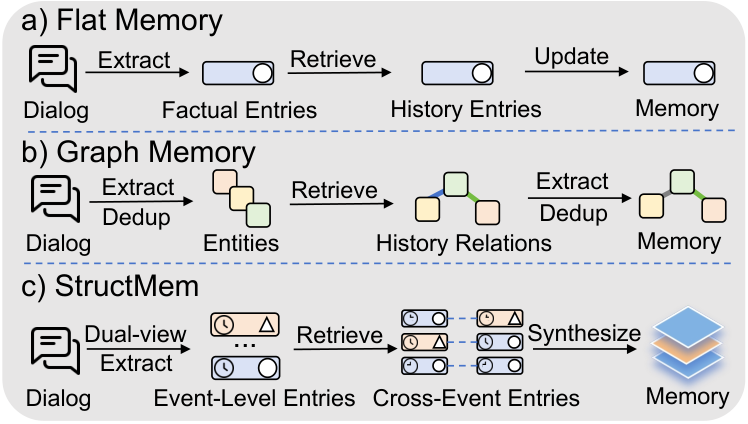
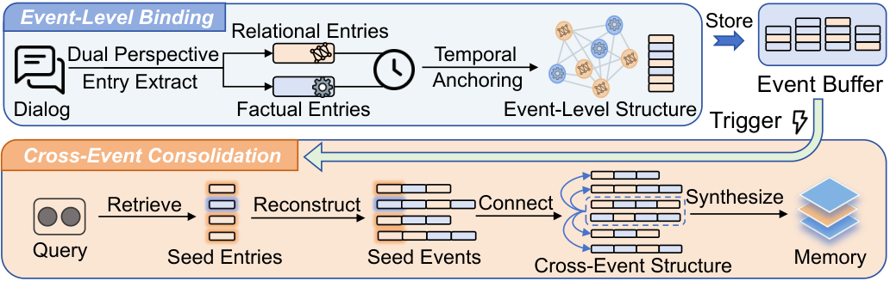
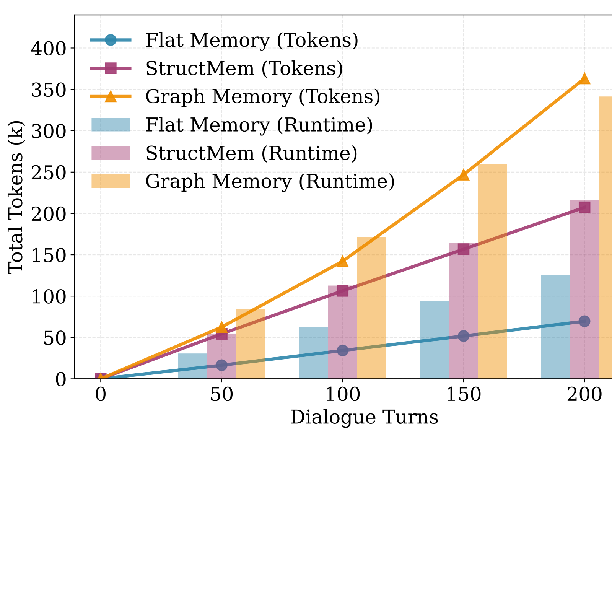
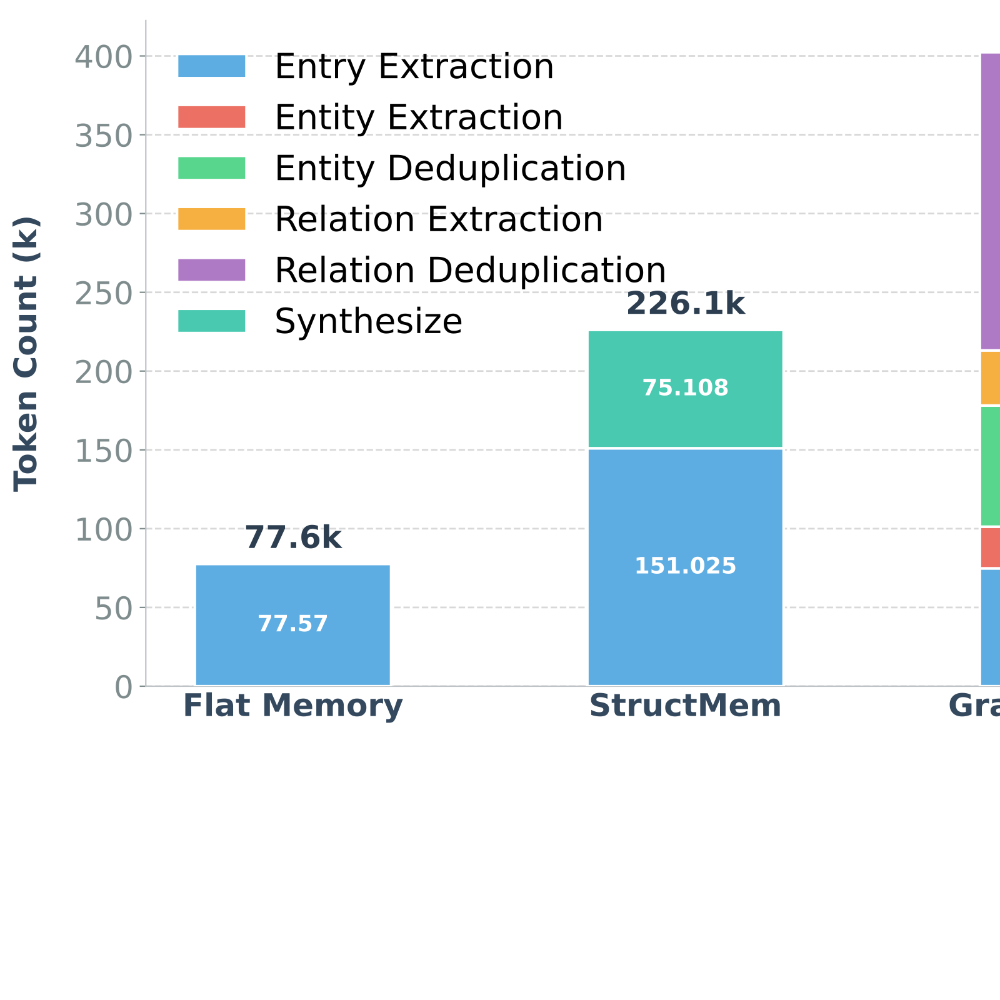
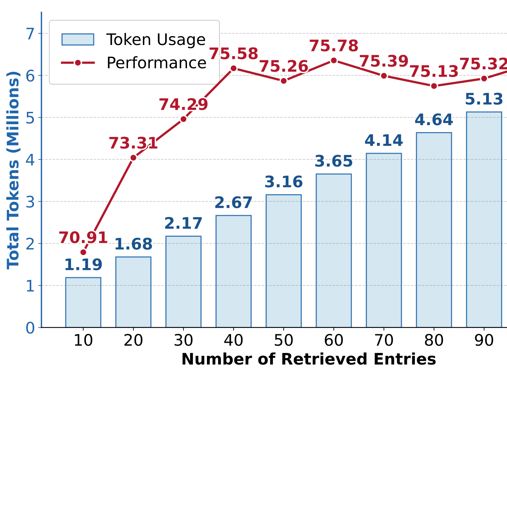
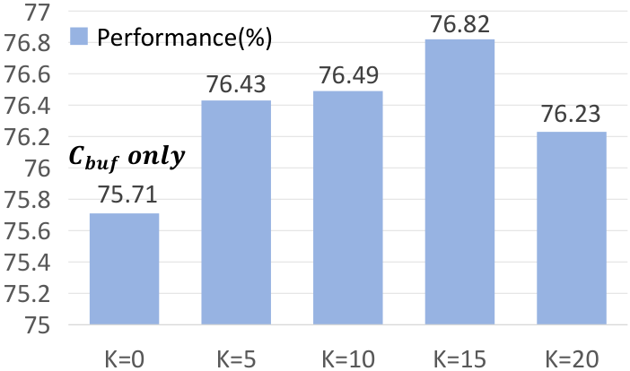

# StructMem: Structured Memory for Long-Horizon Behavior in LLMs
## StructMem：面向大模型长时程行为的结构化记忆

> **论文元信息**
> - **arXiv**：[2604.21748](https://arxiv.org/abs/2604.21748)（v1，2026-04-23 提交）
> - **分类**：cs.CL（计算语言学与计算语言学交叉；原文标注 `[cs.CL]`）
> - **作者**：Buqiang Xu（浙江大学，共同一作）、Yijun Chen（浙江大学，共同一作）、Jizhan Fang（浙江大学）、Ruobin Zhong（浙江大学）、Yunzhi Yao（浙江大学）、Yuqi Zhu（浙江大学；浙江大学—蚂蚁集团知识图谱联合实验室）、Lun Du（蚂蚁集团；浙江大学—蚂蚁集团知识图谱联合实验室）、Shumin Deng（浙江大学，通讯作者）
> - **方法名**：**StructMem**
> - **复现**：代码仓库 https://github.com/zjunlp/LightMem
> - **许可**：CC BY-NC-SA 4.0

> **翻译说明**
> - **覆盖范围**：摘要 + 第 1–5 节（引言、相关工作、方法、实验、结论）+ 局限性 + 致谢 + 附录 A.1–A.8（含表 3–8 完整数值）；表 1–8 全量数值、图 1–3（图 3 含 (a)(b)(c)(d) 四子图，共 6 张图）全部收录；参考文献保留原文编号、不逐条翻译。
> - **插图**：共 **6 张图**，已下载至 `images/StructMem/`，markdown 使用相对路径引用，离线可读；每张图上方保留 `<!-- 原图：URL -->` 注释便于回溯原地址。
> - **未收录的附录提示词图**：原文附录 Figure 4–20 为各阶段 LLM 提示词（事实抽取、关系抽取、叙事整合、实体抽取/去重、关系抽取/去重、问答、评测、保真度评测、无约束整合等）的整页截图，本译文**未下载、未收录**这些图（不在交付素材内）。其目的与关键约束已在正文 A.7 节以文字转述，未引用任何不存在的图片文件。
> - **公式**：统一用 LaTeX 重排（原文 HTML 中 MathML 与 LaTeX 双份渲染、夹零宽字符的痕迹已清理）；术语首次出现保留英文原文，之后用中文。

---

## 摘要

长程对话智能体需要能够捕捉**事件之间关系**、而非仅仅孤立事实的记忆系统，以支撑**时间推理（temporal reasoning）**与**多跳问答（multi-hop question answering）**。现有方法面临一个根本性权衡：**扁平记忆（flat memory）**高效，却无法对关系结构建模；而**基于图的记忆（graph-based memory）**虽能实现结构化推理，却要付出**高昂且脆弱的构建代价**。为应对这些问题，我们提出 **StructMem**——一个**结构增强的层次化记忆框架（structure-enriched hierarchical memory framework）**，既保留**事件级绑定（event-level binding）**，又归纳出**跨事件连接（cross-event connection）**。通过对双视角进行**时间锚定（temporally anchoring dual perspectives）**并执行**周期性的语义整合（periodic semantic consolidation）**，StructMem 在 LoCoMo 上提升了时间推理与多跳表现，同时相较已有记忆系统**大幅降低了 token 用量、API 调用次数与运行时间**¹。

¹ 代码仓库：https://github.com/zjunlp/LightMem

---

## 1. 引言

持久化记忆系统（persistent memory systems）对于语言模型智能体在长期交互中保持连贯性至关重要 `[Park et al., 2023]`。除了事实回忆，长时程对话还需要对**跨轮次的时间依赖、因果链与多跳关系**进行推理 `[Weller et al., 2025; Huang et al., 2025; Maharana et al., 2024; Wu et al., 2025; Yang et al., 2018]`。这就要求记忆表示把事件组织成**时间锚定且关系化的结构** `[Kwiatkowski et al., 2019]`。

现有记忆系统大体落入两种范式——**扁平记忆**与**图记忆**——并在**效率与结构化推理之间呈现权衡**，如图 1 所示。具体而言，**扁平记忆系统** `[Fang et al., 2026; Zhong et al., 2024; Packer et al., 2023]` 把事实或摘要作为独立单元存储，却无法保留跨事件关系，导致在长历史之上的检索退化为**浅层的相似度匹配** `[Liu et al., 2023; Zhuang et al., 2026]`。**基于图的系统** `[Chhikara et al., 2025; Rasmussen et al., 2025]` 通过**实体—关系抽取**恢复关系结构，却带来高昂的构建成本、需要**级联推理（cascaded inference）** `[Edge et al., 2024]`，并且**易受噪声抽取带来的错误累积影响** `[Zhuang et al., 2026]`。我们认为，这些局限源于**不恰当的记忆单元**。对话记忆的基本单元不应是孤立事实或三元组，而应是**时间锚定的关系化事件（temporally grounded relational event）**——它在无需强加刚性模式（rigid schema）的前提下，保留因果与人际语境。

<!-- 原图：https://arxiv.org/html/2604.21748v1/2026ACL-Intro.png -->

> **图 1（原文 Figure 1）**：Three paradigms of Memory systems.
> （记忆系统的三种范式。）

基于这一洞察，我们提出 **StructMem**——一个围绕**事件中心表示（event-centric representations）**构建的层次化记忆框架。这种抽象既保留了「发生了什么」，也保留了「事件如何跨智能体、跨时间相互关联」，同时避免了显式模式设计、实体消解（entity resolution）与符号化图遍历。具体来说，在**事件级（event level）**，StructMem 通过**双视角抽取（dual-perspective extraction）**构建结构化情节（episode），在时域语境中同时捕捉事件内容与交互关系；在**跨事件级（cross-event level）**，它对语义相关的事件执行**周期性整合（periodic consolidation）**，利用**时间局部性（temporal locality）**高效地归纳出更高层的关系结构。在 LoCoMo 上的实验表明，StructMem 在提升长时程推理能力的同时，显著降低了计算开销。

---

## 2. 相关工作

长期记忆是智能体维持人格一致性、并在长跨度上执行推理的认知基础 `[Maharana et al., 2024; Wu et al., 2025; Dong et al., 2025; Huang et al., 2025]`。

**扁平记忆与向量数据库。** 早期方法通过将历史外化到扁平向量数据库来应对上下文窗口限制 `[Park et al., 2023; Packer et al., 2023; Zhong et al., 2024]`。尽管对语义匹配高效，这种范式从根本上把交互历史视为**无序的命题袋（bag of propositions）**，切断了把事件绑成连贯叙事所需的**时间推进、因果依赖与关系基底** `[Gao et al., 2023; Liu et al., 2023]`。这种扁平表示导致**碎片化检索（fragmented retrieval）**——返回的孤立事实缺乏复杂推理所需的结构支架 `[Weller et al., 2025; Li et al., 2025]`。近期工作通过反思式推理与闭环控制机制探索了增强的检索策略 `[Du et al., 2025]`，但这些改进仍受困于扁平表示的根本约束。即便扩展上下文窗口，扁平记忆系统仍受**「中间迷失」（Lost-in-the-Middle）现象**困扰 `[Liu et al., 2023]`——注意力机制在超长序列中退化，最终把多跳推理降格为对脱节事实的肤浅相似度搜索 `[Zhuang et al., 2026]`。

**结构增强的图架构。** 为弥合这一推理鸿沟，该领域日益转向结构增强架构，尤其是借助**知识图谱（Knowledge Graphs）**的方案。静态图方法如微软 **GraphRAG** `[Edge et al., 2024]` 与 **HippoRAG** `[Gutiérrez et al., 2025]` 采用层次化社区检测与个性化 PageRank 来促进全局意义建构与多跳遍历。与此同时，面向智能体的动态记忆系统如 **Mem0ᵍ** `[Chhikara et al., 2025]` 与 **Zep** `[Rasmussen et al., 2025]` 引入了**演化模式（evolving schema）**以捕捉用户交互的流动性。近期进展进一步探索了**可训练的图表示** `[Xia et al., 2025]` 与带实体—关系索引的**轻量层次图** `[Huang et al., 2025]`，在多智能体协作 `[Zhang et al., 2025]` 与程序性技能复用 `[Fang et al., 2025]` 上展现了显著提升。尽管有这些进展，对自然对话强加显式图结构会带来固有权衡：把流动叙事压缩进刚性实体—关系三元组常造成**语义损失** `[Chaudhri et al., 2022; Zhuang et al., 2026]`；而抽取的不稳定性会让**幻觉关系作为持久的结构噪声传播** `[Zhong and Chen, 2021; Kolluru et al., 2020]`；持续图维护的计算开销进一步给实时智能体应用带来延迟挑战 `[Edge et al., 2024; Fang et al., 2026]`。

**无刚性图模式的结构化整合（中间路线）。** 一条并行研究路线试图在不强加刚性图模式的前提下实现结构化整合。**HiMem** `[Zhang et al., 2026]` 把记忆组织为由物理会话边界界定的层次化文本片段，以优化压缩与检索索引。**TiMem** `[Li et al., 2026]` 引入逐轮反思思考链以加深单轮理解，代价是持续的逐轮开销。**PREMem** `[Kim et al., 2025]` 通过在存储前预推理用户偏好，把推理负担前移到记忆阶段，瞄准长期人格一致性。**EMem** `[Zhou and Han, 2025]` 通过**保留原始情节（raw episode）**优先保证检索忠实度，依赖检索驱动的被动整合而非主动合成。**MemWeaver** `[Yu et al., 2025]` 引入轻量实体抽取，在会话级别组织经验。

---

## 3. 方法

<!-- 原图：https://arxiv.org/html/2604.21748v1/2026ACL-Demo.png -->

> **图 2（原文 Figure 2）**：StructMem's hierarchical memory organization. Event-Level Binding constructs event-level structure by extracting dual perspectives and anchoring them temporally. Cross-Event Consolidation constructs cross-event structure through semantic retrieval, event reconstruction, and consolidation synthesis.
> （StructMem 的层次化记忆组织。**事件级绑定**通过抽取双视角并做时间锚定来构建事件级结构；**跨事件整合**通过语义检索、事件重建与整合合成来构建跨事件结构。）

我们提出 **StructMem**——一个通过层次化设计实现结构增强组织的框架。该框架在两个层级上运作：**事件级结构（§3.1）**在单条话语（utterance）内部保留关系绑定，而**跨事件结构（§3.2）**跨时间边界连接信息。

### 3.1 事件级绑定（Event-Level Binding）

事件级绑定（event-level binding）通过**双视角抽取**与**时间锚定**，在单条话语内部保留事实内容与关系语境之间的联系。

**双视角抽取（Dual-Perspective Extraction）。** 对于对话流中的每条话语 $m_i$，我们使用语言模型 $\mathcal{L}$ 配合提示词 $P_{fact}$ 与 $P_{rel}$，从两个互补的视角抽取条目：

$$\Phi_i \cup \Psi_i = \mathcal{L}(P_{fact} \| m_i) \cup \mathcal{L}(P_{rel} \| m_i) \tag{1}$$

其中 $\Phi_i = \{c_{i,1}, \ldots, c_{i,j}\}$ 包含描述事件内容的**事实条目（factual entries）**，$\Psi_i = \{r_{i,1}, \ldots, r_{i,k}\}$ 包含捕捉人际动态、因果影响与时间依赖的**关系条目（relational entries）**。两者均以自然语言而非刚性三元组表示，从而在避免实体消解开销的同时，保留了情节锚定（episodic grounding）所需的语境细节。

**时间锚定（Temporal Anchoring）。** 为保留关系信息与事实信息之间的绑定，所有条目都被锚定到其源头时间戳 $\tau_i$，形成一个事件级单元：

$$\mathcal{M} \leftarrow \bigcup_{i=1}^{N}\left\{\langle x, \mathbf{e}_x, \tau_i\rangle \mid x \in \Phi_i \cup \Psi_i\right\} \tag{2}$$

其中 $\mathbf{e}_x$ 表示条目 $x$ 的嵌入。这种时间耦合使得在检索时能够重建完整的「事实—关系」事件。

**表 1：各记忆系统在 LoCoMo 数据集上的性能与资源消耗对比**（↓ 越小越好；↑ 越大越好；原文中**加粗为最优**、下划线为次优；行底色区分方法类别：RAG 方法、扁平记忆方法、结构化记忆方法。OpenAI 与 FullContext 无构建成本；Zep 与 Memobase 未公开构建细节。StructMem 在整体表现领先的同时，构建 token、调用次数与耗时均为最低）。

| 方法 | Overall ↑ | Multi | Open | Single | Temp | Build Tokens In | Build Tokens Out | Build Tokens Sum | Calls | Time (s) |
|---|---|---|---|---|---|---|---|---|---|---|
| OpenAI | 71.82 | 69.86 | 53.12 | 84.66 | 45.48 | – | – | – | – | – |
| FullContext | 73.83 | 68.79 | 56.25 | **86.56** | 50.16 | – | – | – | – | – |
| MiniRAG | 63.51 | 56.74 | 58.33 | 75.74 | 38.94 | 9.022 | 1.081 | 10.103 | 2508 | **2566** |
| LightRAG | 68.83 | 66.31 | 50.00 | 77.53 | 53.89 | 10.014 | 1.916 | 11.931 | 13576 | 60469 |
| LangMem | 58.10 | 62.23 | 47.92 | 71.12 | 23.43 | 9.873 | 1.192 | 11.066 | 5990 | 26281 |
| A-Mem | 64.16 | 56.03 | 31.25 | 72.06 | 60.44 | 9.126 | 2.368 | 11.494 | 11754 | 60607 |
| Mem0 | 66.88 | 67.13 | 51.15 | 72.93 | 59.19 | 10.958 | 1.239 | 12.196 | 9181 | 30057 |
| MemoryOS | 58.25 | 56.74 | 45.83 | 67.06 | 40.19 | 1.889 | 0.939 | 2.868 | 5534 | 24220 |
| Mem0ᵍ | 68.44 | 65.71 | 47.19 | 75.71 | 58.13 | 33.512 | 2.313 | 35.825 | 53514 | 115670 |
| Zep | 75.14 | **74.11** | **66.04** | 79.79 | 67.71 | – | – | – | – | – |
| Memobase | 75.78 | 70.92 | 46.88 | 77.17 | **85.05** | – | – | – | – | – |
| **StructMem** | **76.82** | 68.77 | 46.88 | 81.09 | 81.62 | **1.501** | **0.436** | **1.937** | **1056** | 22854 |

### 3.2 跨事件整合（Cross-Event Consolidation）

跨事件整合（cross-event consolidation）通过**周期性地合成语义相关事件**，跨越时间边界连接信息。当累积事件超过时间阈值时，我们触发一次合成。

**语义事件连接（Semantic Event Connections）。** 我们缓存自上次整合以来尚未 Consolidation 的条目。这些缓冲条目按时间排序：

$$\mathcal{C}_{buf} = \mathrm{Sort}_{\tau}\{x \in \mathcal{M}_{buffer}\} \tag{3}$$

其中 $\mathcal{M}_{buffer}$ 表示缓冲条目集合。我们把缓冲语境编码为一个聚合查询：把所有缓冲条目文本拼接起来，用嵌入模型编码。随后我们按余弦相似度对所有历史条目对该查询排序，检索出 top-$K$ 个语义最相似的条目作为种子，记作 $\mathcal{S}_{k}$。

对于每个种子条目 $x^{*} \in \mathcal{S}_{k}$，我们通过检索共享同一时间戳的所有条目，重建其完整事件语境：

$$E_{\tau}(x^{*}) = \{x' \in \mathcal{M} \mid \tau(x') = \tau(x^{*})\} \tag{4}$$

这些被重建的事件，连同缓冲事件一起，构成了**基于语义相关性的跨事件结构**：

$$\mathcal{C}_{cross} = \mathcal{C}_{buf} \cup \bigcup_{x^{*}\in\mathcal{S}_{k}} E_{\tau}(x^{*}) \tag{5}$$

**通过合成进行记忆整合（Memory Consolidation through Synthesis）。** 与对顺序文本做有损压缩的传统摘要不同，我们的整合机制作用于**语义重建的事件簇**。它显式地合成跨事件的关系假设（relational hypotheses），形成一个互补的抽象层，在忠实保留原始情节记忆保真度的同时，支撑多跳推理：

$$\mathcal{M} \leftarrow \mathcal{C}_{cons} = \mathcal{L}(P_{cons} \| \mathcal{C}_{cross}) \tag{6}$$

## 4. 实验

### 4.1 实验设置

我们首先描述数据集与评测指标，随后给出用于对比的基线系统。为保证可复现性，用于记忆构建、问答与评测的完整提示词模板与实现细节见附录 A.7。

#### 数据集与指标（Dataset and Metrics）。

我们在 **LoCoMo** 基准 `[Maharana et al., 2024]` 上评测（详细统计见附录 A.2）。效果通过 **LLM-as-a-judge**（以大模型为裁判）评估来衡量；效率通过记忆构建阶段的 **token 用量、API 调用次数与运行时间** 来衡量。

#### 基线（Baselines）。

我们把 StructMem 与三类系统对比：**基于 RAG 的系统**（OpenAI、FullContext、MiniRAG、LightRAG）、**扁平记忆方法**（LangMem、A-Mem、Mem0）与**结构化记忆方法**（MemoryOS、Mem0ᵍ、Zep、Memobase）。所有方法均使用 **gpt-4o-mini** 作为主干、**text-embedding-3-small** 作为嵌入模型。所有基线的详细检索与配置参数见附录 A.4。

### 4.2 整体表现（Overall Performance）

表 1 显示 StructMem 在 LoCoMo 上取得了**最先进的整体表现（state-of-the-art overall performance）**，在**多领域推理与时间推理**上有显著提升——这两类任务中，跨事件的连接对理解跨对话会话的因果关系至关重要。除效果之外，StructMem 还展现出**极高的效率**：相比已有记忆系统，它降低了 token 消耗，并显著减少了 API 调用次数，因为我们的**渐进式结构组织避免了昂贵的「事后图构建（post-hoc graph construction）」**。如附录 A.5 所验证，这些结果在多个裁判模型下保持一致。

### 4.3 分析（Analysis）

我们从两个互补的视角分析 StructMem：一是**范式级对比**，评估全部三种记忆范式在效果与效率上的表现；二是**内部机制分析**，考察 StructMem 推理增益背后的机制。

<!-- 原图：https://arxiv.org/html/2604.21748v1/scalability_combined.svg -->

<!-- 原图：https://arxiv.org/html/2604.21748v1/components_comparison.svg -->

<!-- 原图：https://arxiv.org/html/2604.21748v1/entry_retrieve_ablation_study.svg -->

<!-- 原图：https://arxiv.org/html/2604.21748v1/global_retrieve.png -->

> **图 3（原文 Figure 3）**：Analysis of efficiency across memory paradigms and internal mechanisms of StructMem.
> （跨记忆范式与 StructMem 内部机制的效率分析。(a) 随对话轮次的 token 消耗；(b) 组件级 token 消耗；(c) 检索条目数的影响；(d) 语义检索种子数 K 的影响。）

#### 范式对比（Paradigm Comparison）。

**表 2：LoCoMo 数据集上的范式对比与消融研究**（各列分别为 Multi-hop、Open-domain、Single-session、Temporal 四类推理的得分；StructMem 在全部任务类型上取得一致提升，去掉跨事件整合后整体从 68.77 降至 66.31，与扁平记忆持平）。

| 方法 | Multi | Open | Single | Temp |
|---|---|---|---|---|
| Flat Memory | 66.31 | 46.88 | 78.83 | 78.50 |
| Graph Memory | 66.67 | 48.96 | 80.50 | 76.64 |
| w/o Cross-Event | 66.31 | 46.88 | 80.86 | 79.44 |
| **StructMem** | **68.77** | 46.88 | **81.09** | **81.62** |

为验证每种范式的有效性，我们在表 2 中开展研究。以 **Flat Memory** 为基线，**Graph Memory** 在单会话与开放域任务上取得提升，但在时间推理上反而下降。相比之下，我们的方法在**所有任务类型上均有一致提升**。事件级结构提升了时间推理与单会话表现；跨事件结构通过捕捉**跨时间因果（cross-temporal causal）**关系带来进一步增益。

为考察计算效率，我们在 LoCoMo 第一段对话上分析 token 用量与运行时间。**图 3(a)** 显示图记忆（Graph Memory）随对话推进产生显著更高的 token 用量与运行时间。**图 3(b)** 揭示了根源：图构建每个事件需要**四次级联 LLM 操作**，且去重开销随规模**二次增长**。相比之下，StructMem 通过**缓冲式整合（buffered consolidation）**实现高效：它利用**时间局部性（temporal locality）**——语义相关事件在短时间窗口内自然聚簇——系统累积事件并在周期性合成（periodic synthesis）时**批量处理**。这 effectively 把跨事件组织从「逐事件操作」降为「周期性批处理」，大幅削减 API 调用与 token 消耗。

#### StructMem 内部机制（StructMem Internal Mechanisms）。

我们分析层次化组织是否带来了超越「检索规模扩展」的真正推理增益。

**图 3(c)** 显示扁平检索性能在 **60 条条目**处达到峰值后便停滞，表明单纯检索更多原子条目无法提升效果——瓶颈在于**知识推理**而非覆盖度。跨事件整合通过把语义相关事件**合成为更高层的关系假设**，创造出任何单条记忆条目中都不存在的信息，从而应对这一问题。

**图 3(d)** 进一步证实了这一点：在没有事件连接（$K=0$）时，性能与扁平检索的停滞平台持平；但引入跨事件合成后获得显著提升，说明层次化整合**跨时间边界重建因果关系**，并带来根本性的新推理能力。附录 A.6 的保真度分析进一步确认：这些合成出的连接**接地良好（well-grounded）**，虚假关联极少。

---

## 5. 结论

我们提出 **StructMem**，通过层次化设计实现结构增强的组织：在保留事件级绑定的同时启用跨事件整合，StructMem 在不承受持续图维护计算开销的前提下，保留了时间与关系结构。在 LoCoMo 上的实验表明，StructMem 取得了更优表现，在多跳与时间推理上结果突出，同时相较已有记忆系统大幅降低了 token 消耗、API 调用次数与运行时间。

## 局限性（Limitations）

尽管表现强劲，StructMem 仍有若干局限。**其一**，双视角抽取的质量高度依赖指令提示词，次优的设计可能导致关系信息抽取不完整或不准确；未来研究可探索自动化提示词优化以提升在不同对话语境下的鲁棒性。**其二**，该框架主要解决记忆的扩展与合成，目前**缺少显式的冲突解决与记忆更新机制**。由于用户事实或偏好可能在长时程中演化，缺乏修订流程会导致历史摘要与新信息之间的不一致；后续迭代应引入**记忆衰减或更新策略**，确保层次化组织准确反映交互的最新状态。

## 致谢（Acknowledgements）

我们谨向审稿人致以诚挚谢意，感谢他们深思熟虑且富有建设性的反馈。本工作受国家自然科学基金（No. 62576307）、永江人才引进计划（2021A-156-G）、以及浙江大学信息技术中心与 CAD&CG 国家重点实验室支持。本工作受蚂蚁集团与浙江大学—蚂蚁集团知识图谱联合实验室支持。

---

## 参考文献

原文参考文献共 30 条（按正文 `[Author, Year]` 标注），涵盖 LoCoMo `[Maharana et al., 2024]`、GraphRAG `[Edge et al., 2024]`、HippoRAG `[Gutiérrez et al., 2025]`、Mem0ᵍ `[Chhikara et al., 2025]`、Zep `[Rasmussen et al., 2025]`、LightRAG、HiMem `[Zhang et al., 2026]`、TiMem `[Li et al., 2026]`、PREMem `[Kim et al., 2025]`、EMem `[Zhou and Han, 2025]`、MemWeaver `[Yu et al., 2025]` 等。本节不逐条翻译，正文中的引用标记可回原文 References 章节检索对应条目。

---

## 附录 A Appendix

### A.1 许可（License）

本工作使用 LoCoMo 基准数据集，该数据集公开可供学术研究使用。我们遵循数据集作者指定的全部使用条款。整体论文采用 **CC BY-NC-SA 4.0** 许可。

### A.2 数据集（Dataset）

我们在 LoCoMo 基准 `[Maharana et al., 2024]` 上评测，该基准包含 **10 段长时程对话**，平均每段 **588 轮、16,618 个 token**。我们聚焦问答任务，使用基准中的四类推理类型。**表 3** 给出本次评测所用问题的统计。模型表现通过 LLM-as-a-judge 评估。

**表 3：所用 LoCoMo 问题的统计**

| 推理类型 | # 问题 |
|---|---|
| Single-hop（单跳） | 841 |
| Multi-hop（多跳） | 282 |
| Temporal（时间） | 321 |
| Open-domain（开放域） | 96 |

### A.3 实现细节（Implementation Details）

我们提供 StructMem 的关键实现细节以促进可复现性。**记忆构建**：我们设置 **1 小时的时间窗口阈值**以触发整合；对于跨事件整合，我们从历史记忆中检索 **top-15** 个语义最相似的种子条目。**问答**：推理时我们从记忆中检索 **60 条条目与 5 条合成记忆**，为答案生成提供上下文。

### A.4 基线配置（Baseline Configurations）

为保证实证严谨与可复现性，我们给出所有被评系统的详细检索与架构配置：

**FullContext** 通过全扫描（$k=-1$）以**逆时间顺序**把整个原始对话历史喂入提示词。**OpenAI** 把所有对话轮次拼接为扁平、无序的文本序列，直接处理而**无检索步骤**。

**MiniRAG** 与 **LightRAG** 每题检索 **top-20** 相关条目以提供事实上下文。**A-MEM** 与 **LangMem** 采用全局搜索机制，为每个查询检索 **top-40** 最相关记忆条目。

**MemoryOS** 实现三级层次系统：对全部短时态记忆（STM）页做穷尽召回；对中期记忆（MTM）做两阶段选择（top-5 片段 + top-10 对话页）；并从长时个人记忆（LPM）中提取 top-10 相关条目。

对于基于 API 的系统（**Mem0、Mem0ᵍ、Zep、Memobase**），每个说话人检索 **top-10** 相关记忆用于回复生成。

### A.5 评测的鲁棒性（Robustness of Evaluation）

我们通过广泛的跨模型评测与统计分析，验证 **LLM-as-a-judge** 协议的可靠性。

**表 4** 汇总了记忆系统在三个不同裁判模型族下的表现：gpt-4o-mini、Qwen2.5-32B-Instruct 与 DeepSeek-V3.2。我们进一步计算了所有裁判对之间的裁判间一致性与相关性，详见 **表 5**。不同模型间的 **Fleiss' $\kappa$ 达到 0.8341**，反映出**近乎完美的一致**，大幅超过通常接受的 0.8 可靠性阈值。这一高度共识，加上显著的 Pearson 相关系数（$r>0.81$，$p<10^{-300}$），确认自动化评测协议对语义回复质量提供了**稳定且客观的评估**。

**表 4：LoCoMo 数据集上记忆系统在不同 LLM 裁判模型下的鲁棒性检验**（↑ 越大越好；原文在每个裁判模型分组内**加粗为最优**、下划线为次优。三组块分别对应 gpt-4o-mini、Qwen2.5-32B-Instruct、DeepSeek-V3.2）

| 裁判模型 | 方法 | Overall ↑ | Single Hop | Multi Hop | Temporal | Open Domain |
|---|---|---|---|---|---|---|
| gpt-4o-mini | FullContext | 73.83 | 86.56 | 68.79 | 50.16 | 56.25 |
| gpt-4o-mini | A-MEM | 64.16 | 72.06 | 56.03 | 60.44 | 31.25 |
| gpt-4o-mini | MemoryOS | 58.25 | 67.06 | 56.74 | 40.19 | 45.83 |
| gpt-4o-mini | Memobase | 75.78 | 77.17 | 70.92 | 85.05 | 46.88 |
| gpt-4o-mini | Zep | 75.14 | 79.79 | 74.11 | 67.71 | 66.04 |
| gpt-4o-mini | **StructMem** | **76.82** | **81.09** | 68.77 | **81.62** | 46.88 |
| Qwen2.5-32B-Instruct | FullContext | 71.17 | 83.83 | 67.02 | 48.29 | 48.96 |
| Qwen2.5-32B-Instruct | A-MEM | 60.26 | 68.85 | 53.19 | 52.65 | 31.25 |
| Qwen2.5-32B-Instruct | MemoryOS | 60.32 | 69.80 | 62.41 | 39.88 | 39.58 |
| Qwen2.5-32B-Instruct | Memobase | 76.36 | 78.00 | 71.28 | 85.05 | 47.92 |
| Qwen2.5-32B-Instruct | Zep | 75.52 | 79.19 | 75.18 | 70.40 | 61.46 |
| Qwen2.5-32B-Instruct | **StructMem** | **77.01** | **82.16** | 69.86 | 78.19 | 48.96 |
| DeepSeek-V3.2 | FullContext | 70.97 | 85.49 | 67.02 | 41.43 | 54.17 |
| DeepSeek-V3.2 | A-MEM | 63.90 | 74.55 | 56.38 | 47.35 | 47.92 |
| DeepSeek-V3.2 | MemoryOS | 61.56 | 72.53 | 62.06 | 35.83 | 50.00 |
| DeepSeek-V3.2 | Memobase | 79.29 | 80.86 | 77.66 | 85.67 | 48.96 |
| DeepSeek-V3.2 | Zep | 75.45 | 80.98 | 75.89 | 64.80 | 61.46 |
| DeepSeek-V3.2 | **StructMem** | **79.35** | **85.14** | 73.05 | 77.57 | 53.12 |

**表 5：不同裁判模型对之间的裁判间一致性与相关性**（GPT、Qwen、DS 分别指代 gpt-4o-mini、Qwen2.5-32B-Instruct、DeepSeek-V3.2；$\kappa$ 与 $r$ 越接近 1 一致性越强，— 表示不适用）

| 裁判对 | Cohen's $\kappa$ | Pearson $r$ | $p$-value |
|---|---|---|---|
| Qwen vs. DS | 0.8395 | 0.8438 | $<10^{-300}$ |
| Qwen vs. GPT | 0.8326 | 0.8362 | $<10^{-300}$ |
| DS vs. GPT | 0.8184 | 0.8234 | $<10^{-300}$ |
| Overall (Fleiss' $\kappa$) | 0.8341 | — | — |

### A.6 保真度与幻觉研究（Fidelity and Hallucination Study）

我们开展了系统性研究，以确保归纳出的结构**扎根于源对话**。

#### 事件级抽取保真度（Event-Level Extraction Fidelity）。

我们首先评估原子记忆条目是否准确反映原始话语。我们采用三个独立裁判模型（gpt-4o-mini、Qwen2.5-32B-Instruct、DeepSeek-V3.2）识别跨对话的幻觉条目。具体而言，对每个抽取出的记忆条目，裁判会拿到对应的源对话片段，并被要求判断是否存在任何被原文**捏造或无法佐证**的事实或关系信息。完整提示词模板见 **图 17**（本译文未收录该图）。

如 **表 6** 所示，平均幻觉率仅为 **2.36%**，确认我们层次化记忆的**双视角抽取对源语境高度忠实**。

**表 6：事件级抽取阶段的幻觉率（跨 10 段对话）**

| 对话 | DS | Qwen | GPT | Mean |
|---|---|---|---|---|
| conv-26 | 2.07% | 0.52% | 0.78% | 1.12% |
| conv-30 | 1.81% | 0.60% | 4.83% | 2.41% |
| conv-41 | 2.04% | 1.88% | 2.35% | 2.09% |
| conv-42 | 3.16% | 1.97% | 3.94% | 3.02% |
| conv-43 | 2.94% | 1.63% | 3.10% | 2.56% |
| conv-44 | 1.68% | 0.92% | 1.68% | 1.43% |
| conv-47 | 5.28% | 2.44% | 3.05% | 3.59% |
| conv-48 | 2.71% | 1.45% | 1.08% | 1.75% |
| conv-49 | 3.25% | 1.16% | 1.62% | 2.01% |
| conv-50 | 3.55% | 2.84% | 4.26% | 3.55% |
| Overall | 2.84% | 1.61% | 2.63% | 2.36% |

#### 跨事件整合保真度（Cross-Event Consolidation Fidelity）。

最关键的验证在于跨事件链接的合成。为隔离并审计这些链接，我们采用三个独立裁判模型（gpt-4o-mini、Qwen2.5-32B-Instruct、DeepSeek-V3.2）识别跨对话的幻觉链接。对每次整合步骤，裁判会拿到：（1）缓冲文本（当前事件）；（2）补充文本（检索到的历史）；（3）两份摘要——摘要 A（基线，$k=0$，仅整合缓冲事件）与摘要 B（测试，$k=15$，建立跨事件链接）。裁判识别摘要 B 中独有于摘要 A 的跨事件链接，再逐条分类以判断该链接是否虚假。完整提示词模板见 **图 18 与图 19**（本译文未收录）。

为评估接地锚点的具体影响，我们通过把默认的 **Constrained**（约束）提示词与 **Unconstrained**（无约束）变体对比来做敏感性分析。如 **图 20** 所示，Unconstrained 版本通过移除对时间戳引用与具体依赖聚焦的显式要求（图中灰色高亮部分）得到。

**表 7** 的结果表明，移除这些接地约束会导致所有裁判模型下幻觉率**急剧飙升**。这一趋势强调：StructMem 层次化组织的高保真度，直接依赖于我们的**约束式合成机制**，确认其记忆整合对源语境高度忠实。

**表 7：跨对话链接质量的详细对比**（S、T、R 分别表示虚假链接数 Spurious、总链接数 Total、错误率 R(%)；Constrained 为 StructMem 默认设置，Unconstrained 为移除接地约束的变体）

| 对话 | 配置 | GPT S | GPT T | GPT R(%) | Qwen S | Qwen T | Qwen R(%) | DS S | DS T | DS R(%) |
|---|---|---|---|---|---|---|---|---|---|---|
| conv-26 | Constrained | 0 | 83 | 0.00 | 3 | 70 | 4.29 | 1 | 12 | 8.33 |
| conv-26 | Unconstrained | 4 | 72 | 5.56 | 23 | 101 | 22.77 | 10 | 58 | 17.24 |
| conv-30 | Constrained | 0 | 73 | 0.00 | 0 | 59 | 0.00 | 1 | 23 | 4.35 |
| conv-30 | Unconstrained | 4 | 84 | 4.76 | 6 | 79 | 7.59 | 2 | 44 | 4.55 |
| conv-41 | Constrained | 4 | 108 | 3.70 | 1 | 131 | 0.76 | 1 | 31 | 3.23 |
| conv-41 | Unconstrained | 13 | 104 | 12.50 | 20 | 115 | 17.39 | 6 | 74 | 8.11 |
| conv-42 | Constrained | 0 | 95 | 0.00 | 5 | 93 | 5.38 | 1 | 47 | 2.13 |
| conv-42 | Unconstrained | 8 | 100 | 8.00 | 20 | 106 | 18.87 | 6 | 65 | 9.23 |
| conv-43 | Constrained | 0 | 104 | 0.00 | 5 | 130 | 3.85 | 6 | 40 | 15.00 |
| conv-43 | Unconstrained | 4 | 109 | 3.67 | 11 | 114 | 9.65 | 9 | 74 | 12.16 |
| conv-44 | Constrained | 0 | 110 | 0.00 | 9 | 91 | 9.89 | 2 | 39 | 5.13 |
| conv-44 | Unconstrained | 6 | 104 | 5.77 | 30 | 135 | 22.22 | 16 | 88 | 18.18 |
| conv-47 | Constrained | 1 | 107 | 0.93 | 4 | 90 | 4.44 | 0 | 33 | 0.00 |
| conv-47 | Unconstrained | 11 | 103 | 10.68 | 32 | 108 | 29.63 | 16 | 69 | 23.19 |
| conv-48 | Constrained | 1 | 102 | 0.98 | 2 | 101 | 1.98 | 0 | 36 | 0.00 |
| conv-48 | Unconstrained | 5 | 100 | 5.00 | 27 | 107 | 25.23 | 11 | 62 | 17.74 |
| conv-49 | Constrained | 0 | 94 | 0.00 | 2 | 90 | 2.22 | 0 | 52 | 0.00 |
| conv-49 | Unconstrained | 7 | 81 | 8.64 | 14 | 86 | 16.28 | 10 | 61 | 16.39 |
| conv-50 | Constrained | 0 | 106 | 0.00 | 2 | 113 | 1.77 | 1 | 45 | 2.22 |
| conv-50 | Unconstrained | 10 | 109 | 9.17 | 30 | 114 | 26.32 | 18 | 92 | 19.57 |
| Overall | Constrained | 6 | 982 | 0.61% | 33 | 968 | 3.41% | 13 | 358 | 3.63% |
| Overall | Unconstrained | 72 | 966 | 7.45% | 213 | 1065 | 20.00% | 104 | 687 | 15.14% |

### A.7 提示词模板（Prompt Templates）

本节给出 StructMem 用于**记忆构建、问答与评测**的提示词模板（图 4–20 为各模板的整页截图，本译文**未收录**这些图；以下文字转述其目的与关键约束）。

**记忆构建**：在 LightMem 框架下为不同范式设计了提示词。对**扁平记忆**，事实条目抽取提示词（**图 4、图 5**）引导模型把话语**分解为客观事件描述**。对 **StructMem**，关系条目抽取提示词（**图 6、图 7**）指示模型捕捉**交互动态、因果影响与时间依赖**；叙事合成提示词（**图 8**）在 Macro Synthesis（宏观合成）阶段把局部与检索到的语境整合为连贯摘要。对**图记忆**，实体抽取提示词（**图 9**）从对话中识别关键实体；实体去重提示词（**图 10**）规范化抽取出的实体以消除冗余；关系抽取提示词（**图 11**）构建实体间连接；关系去重提示词（**图 12**）消解知识图谱中的矛盾。

**问答**：为不同记忆架构提供各自的提示词。**图 13** 展示 StructMem 的提示词，采用**双回路检索（dual-circuit retrieval）**，同时利用原子条目与合成记忆；**图 14、图 15** 分别给出适配扁平记忆与图记忆基线的提示词。

**评测**：使用 LLM-as-a-judge 提示词（**图 16**）评估回复的正确性与连贯性。

**保真度与幻觉分析**：**图 17** 给出验证事件级抽取的模板；**图 18、图 19** 给出验证跨事件整合的模板；**图 20** 给出 Unconstrained 合成模板——其中**接地约束被有意移除**，用于评估显式时间锚点对减少幻觉关联的影响。

### A.8 案例研究（Case Study）

**表 8** 给出一个案例研究，比较不同记忆范式如何处理关于**共同参与（joint participation）**的时间推理。该查询询问两位说话人何时一起参加了某事件，需要对各轮对话中**未显式陈述的共参与关系**做推理。

**表 8：三种记忆范式在「共同参与推理」上的案例对比**

> **查询（Query）**：When did Caroline and Melanie go to a pride festival together?（Caroline 和 Melanie 何时一起去了骄傲节？）

| 方法 | 检索内容 | 预测 |
|---|---|---|
| Flat Memory | 事实条目：• Caroline 于 2023-08-11 参加骄傲游行；• Caroline 去年在 Pride fest 玩得很开心（记录于 2023-08-17）；• Melanie 在 Pride fest 与大家玩得很开心（记录于 2023-08-17） | "她们还没一起去过。" |
| Graph Memory | 事实条目：（同上三条）实体—关系图：• caroline → attended → pride_parade；• caroline → had_blast_at → pride_fest；• melanie → enjoyed_time_at → pride_fest；• melanie → expressed_excitement → caroline's_pride_involvement | "上个月，2023 年 6 月。" |
| StructMem | 事件记忆：• Caroline 于 2023-08-11 参加骄傲游行；• Caroline 去年在 Pride fest 玩得很开心（记录于 2023-08-17）；• Melanie 对 Caroline 的骄傲游行经历表现出兴趣；• Melanie 在 Pride fest 与大家玩得很开心（记录于 2023-08-17）；• Melanie 对 Caroline 在 LGBTQ+ 社群的参与表现出兴奋。合成记忆："2023 年 8 月 17 日……当她们回忆去年在 Pride fest 的快乐时光时，Melanie 提议计划一次家庭出游，而 Caroline 提议今年夏天只为她们俩安排一次特别出游……" | "去年，2022 年 8 月。" |

> **参考答案（Reference）**：2022

**表 8（分析）**：Flat Memory 独立检索事实条目——Caroline 参加 Pride fest「去年」（时间锚定到 2023-08-17，指代 2022），而 Melanie 在 Pride fest「与大家」玩得开心。由于缺乏连接这些孤立事实的机制，系统得出「她们还没一起去过」，未能识别隐含的共参与。Graph Memory 在同一组事实条目之上构建实体—关系三元组；尽管图捕捉了各自出席，但这些仍是**无显式共参与边的孤立节点**，事后图结构无法推断「同一对话中不同说话人提及同一事件即代表共同出席」，因而给出错误的时间推断「上个月，2023 年 6 月」。StructMem 通过两种机制解决这一局限：其一是**关系条目在抽取时捕捉人际动态**（"Melanie 对 Caroline 的骄傲游行经历表现出兴趣"提供关键语境）；其二是**合成把时间共现的条目整合**，当 Caroline 与 Melanie 的 Pride fest 提及在按时间排序的语境中相邻出现时，关系条目中的物主代词 "their" 提示了共参与，合成据此把这一隐含连接显式化（"她们去年在 Pride fest 的快乐时光"），使系统正确回答「去年，2022 年 8 月」。

本案例说明：对于时间推理，**抽取时的结构捕捉优于事后的图构建**——通过在记忆形成期而非事后叠加结构来组织信息，StructMem 保留了推断跨轮次隐含关系所需的时间与关系语境。

---

> **译者注**：StructMem 对记忆系统设计的几点启示值得关注。**其一**，以「时间锚定的关系化事件」为基本单元、而非孤立事实或刚性三元组，在保持结构化推理能力的同时规避了图构建的级联开销与错误累积——这对任何需要长时程一致性的对话/智能体记忆系统都是可复用的一阶设计原则。**其二**，其「约束式合成」（Constrained）机制通过显式时间锚点与依赖聚焦把幻觉率从 20% 量级压到 0.6% 量级（表 7），说明**合成记忆的保真度高度依赖接地约束**，这对引入自动摘要/整合的记忆架构是直接的可操作经验。**其三**，图 3(d) 显示「无跨事件连接时性能退化为扁平检索平台」——印证了**结构化组织的价值不在于检索覆盖，而在于生成单条记忆中不存在的关系假设**，这可与侧重检索重排的方案形成互补定位。
