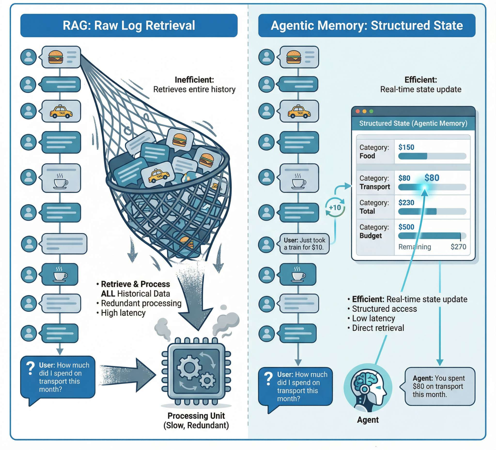
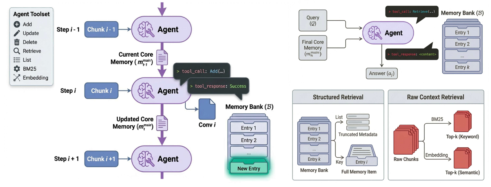
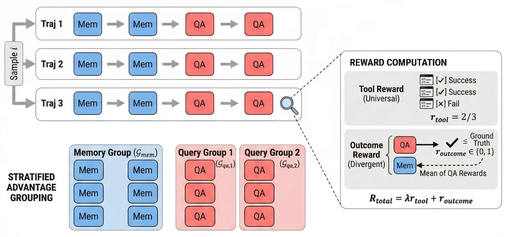
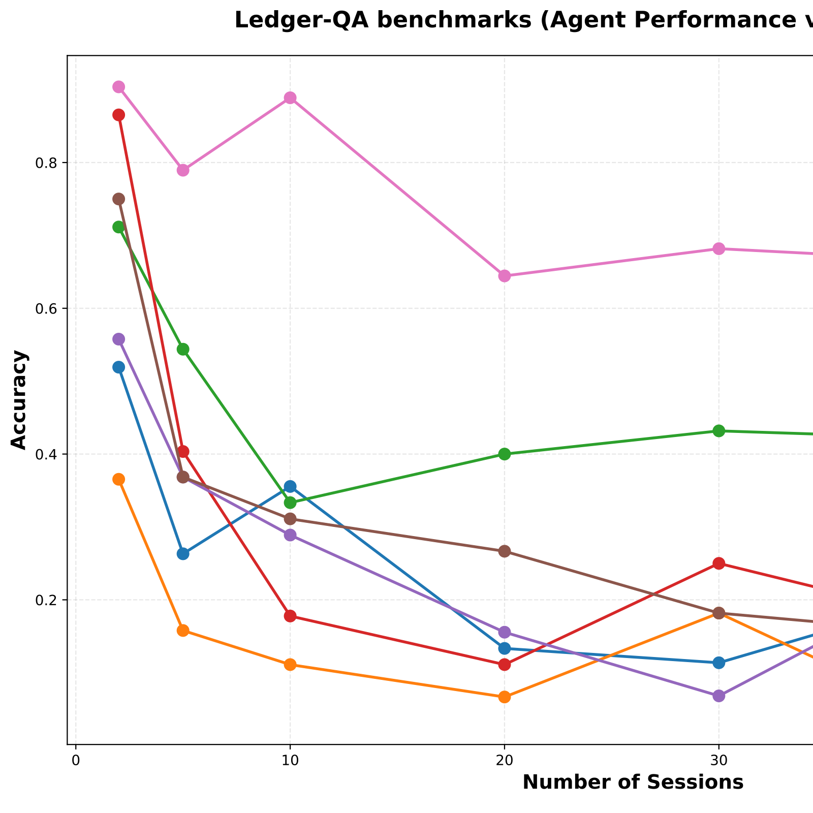

# Learning to Remember: End-to-End Training of Memory Agents for Long-Context Reasoning
## 学会记忆：面向长上下文推理的记忆智能体端到端训练

> **论文元信息**
> - **arXiv**：[2602.18493](https://arxiv.org/abs/2602.18493)（v1，2026-02-13 提交）
> - **发表**：EMNLP 2026 Main Conference（据任务简报）
> - **分类**：cs.LG
> - **作者**：Kehao Zhang、Shangtong Gui、Sheng Yang、Wei Chen（理想汽车）；Yang Feng（通讯作者，中科院计算所 / 中国科学院大学）
> - **方法名**：**UMA**（Unified Memory Agent，统一记忆智能体）
> - **复现地址**：https://github.com/ictnlp/unified-memory-agent

> **翻译说明**
> - 本译文基于 arXiv 官方 HTML 全文（`https://arxiv.org/html/2602.18493v1`）逐段翻译，覆盖：**摘要 + 第 1–6 节 + 局限性 + 参考文献 + 附录 A–I**；**图 1–4、表 1–8 与算法 1 全量呈现**；参考文献保留原文编号，不逐条翻译。
> - **插图**：共 **4 张图**已下载至 `images/UMA/`，markdown 使用相对路径引用，离线可读；每张图上方保留 `<!-- 原图：URL -->` 注释便于回溯原地址。
> - **公式**：原文 HTML 中 MathML 与 LaTeX 重复渲染的痕迹已清理，统一按 LaTeX 重排为 `$…$` / `$$…$$`；术语首次出现时保留英文原文，其后用中文。

---

## 摘要

长上下文大语言模型（LLM）与检索增强生成（RAG）系统被动地处理信息，把状态追踪、矛盾消解与证据聚合都推迟到查询时刻，这在带有频繁更新的超长数据流下会变得脆弱。我们提出**统一记忆智能体（Unified Memory Agent，UMA）**，一个把记忆操作与问答统一在单一策略内的端到端强化学习框架。UMA 维护双重记忆表示：用于全局上下文的紧凑核心摘要，以及一个结构化的记忆库（Memory Bank），支持对键值条目显式的 CRUD（创建、更新、删除、重组）操作，从而在流式输入过程中实现主动整合。为评估长程记忆行为，我们提出 **Ledger-QA**，一个用于连续状态追踪的诊断性基准，其答案是由累积更新导出的潜在值，而非局部片段检索。在横跨 Ledger-QA、测试时学习（Test-Time Learning）与精准检索（Accurate Retrieval）三大类的 13 个数据集上，UMA 在动态推理与学习任务上大幅超越长上下文与 RAG 基线，同时在标准检索基准上保持竞争力，凸显了「习得式、端到端记忆管理」的重要性。

---

## 1. 引言

大语言模型（LLM）的上下文窗口如今已达数百万 token（Google, 2025; Anthropic, 2025; OpenAI, 2025; Qwen, 2025; Liu et al., 2024），然而长上下文模型面临的挑战远超窗口大小。首先，标准注意力机制的计算复杂度随序列长度呈二次方增长（Vaswani et al., 2017），使得处理极长上下文的成本高到难以承受。其次，实证研究显示存在一种「上下文腐化（context rot）」现象（Hong et al., 2025）：即便所有相关信息都已就位，随着输入长度增加，模型性能仍显著退化——模型难以有效定位并利用埋藏在海量上下文中的关键细节。

检索增强生成（RAG）通过在查询时仅检索相关段落来解决可扩展性问题（Xu et al., 2024），却继承了与长上下文方法共通的更深层局限：被动的信息处理。两种范式都把上下文当作静态原材料，把所有推理推迟到查询时刻。如图 1 所示，RAG 系统必须为每个查询重新处理检索到的原始段落。对于推理密集型任务——例如随时间追踪实体状态、消解矛盾、或从碎片化的观测中累积证据——这会导致精度退化与计算冗余。

记忆增强型智能体提供了一种根本不同的范式：主动推理，即在信息到来时就加以整合，而非对每个查询重新处理原始输入。然而，现有方法存在关键局限。基于启发式的方法，如 Mem0（Chhikara et al., 2025）、Zep（Rasmussen et al., 2025）依赖手工设计的提示与记忆模式，缺乏任务适应性。解耦架构如 Memory-R1（Yan et al., 2025）与 Mem-alpha（Wang et al., 2025b）通过独立训练把记忆管理与任务执行分离开来，无法做到端到端优化——任务结果的信用（credit）无法回流以塑造记忆决策。

我们提出**统一记忆智能体（UMA）**，一个端到端强化学习框架，在统一策略中联合优化记忆操作（创建、更新、删除、重组）与任务执行。为诊断主动推理能力，我们提出 **Ledger-QA**，一个需要连续状态追踪的基准，其表现直接反映主动整合信息（而非对每个查询重算原始历史）的能力。我们在横跨三大任务类别的 13 个数据集上做了广泛评测：连续推理（Ledger-QA）、测试时学习、精准检索。实验表明，UMA 在动态推理任务上大幅超越长上下文与 RAG 基线，同时在标准检索基准上保持竞争力；消融实验也证实了端到端优化的必要性。

<!-- 原图：https://arxiv.org/html/2602.18493v1/RAGvsAM.png -->


> **图 1（原文 Figure 1）**：Expense-tracking example: RAG reprocesses retrieved logs per query, while Agentic Memory maintains a structured state and answers by reading the relevant fields.
> （记账示例：RAG 对每个查询都重新处理检索到的日志，而智能体记忆维护一个结构化状态，并通过读取相关字段来作答。）

---

## 2. 方法

<!-- 原图：https://arxiv.org/html/2602.18493v1/mem.png -->


> **图 2（原文 Figure 2）**：Overview of UMA. Phase I incrementally maintains a structured Memory Bank and core summary via CRUD over chunks; Phase II answers queries using both structured retrieval from the bank and raw-context retrieval.
> （UMA 概览。阶段一通过对分块执行 CRUD 操作，增量维护一个结构化的记忆库与核心摘要；阶段二同时利用来自记忆库的结构化检索与原始上下文检索来回答查询。）

### 2.1 问题形式化：MDP

我们把长上下文推理任务形式化为一个马尔可夫决策过程（MDP）。为处理超出上下文窗口的序列，我们把输入分解为一个分块流 $C=\{c_{1},\dots,c_{n}\}$。MDP 元组 $(\mathcal{S},\mathcal{A},\mathcal{P},\mathcal{R})$ 定义如下：

#### 状态空间（$\mathcal{S}$）

在步 $t$，状态 $s_{t}=(\mathcal{M}_{t},x_{t},h_{t})$ 由以下部分组成：

- $\mathcal{M}_{t}=(m^{core},\mathcal{B})$：双重记忆，包含一个高层摘要（$m^{core}$）与一个结构化的键值库（$\mathcal{B}$）。
- $x_{t}$：当前输入焦点。为绕开上下文窗口限制，它在局部文本分块 $c_{k}$（维护阶段）与特定查询 $q$（问答阶段）之间动态切换。
- $h_{t}$：即时交互历史，缓冲近期的观测，并周期性清空以管理上下文长度。

#### 动作空间（$\mathcal{A}$）

我们把所有操作统一到一个单一动作空间，按交互阶段分类。关键在于，只读工具在两个阶段都可用，以确保智能体随时能够核验信念或查询账本。所有工具（输入输出）的详细规格见附录 A。

- **记忆操作（$\mathcal{A}_{mem}$）**：在分块处理阶段用于维护状态。
  - Add、Update、Delete：修改结构化库 $\mathcal{B}$ 的 CRUD 操作。
  - Retrieve、List：只读操作，用于在修改前核查 $\mathcal{B}$ 中已有的键或值。
  - UpdateCore：一个特殊的终止动作，把当前进度提交到 $m^{core}$ 并触发向下一分块的转移。
- **问答操作（$\mathcal{A}_{qa}$）**：在查询阶段用于综合答案。
  - BM25(query)、Embedding(query)：对原始文本分块 $C$ 的混合检索。
  - Retrieve(key)、List()：访问结构化记忆库 $\mathcal{B}$。
  - Answer(text)：生成最终响应的终止动作。

#### 转移动态（$\mathcal{P}$）

系统通过一个分层过程演化：

- **内层循环**：标准工具动作更新 $\mathcal{B}$ 或追加到 $h_{t}$，而不推进输入流。
- **外层循环**：UpdateCore 动作触发一次状态转移，使 $x_{t}$ 推进到 $c_{k+1}$，并重置 $h_{t}$。
- **阶段转移**：在处理完 $c_{n}$ 后，系统转移到 QA 阶段，此时 $x_{t}$ 变为从任务分布 $P(q|C)$ 中采样的一个查询 $q$。

这种随机转移意味着，最优策略必须构建出一个足够稳健的记忆状态 $\mathcal{M}_{n}$，以最大化对所有潜在未来查询的期望回报。

### 2.2 统一记忆智能体架构

基于上述 MDP 形式化，UMA 采用统一策略 $\pi_{\theta}(a_{t}|s_{t})$ 来生成动作。该架构显式处理输入的方式如下：

#### 输入表示

在任意时间步 $t$，提供给 LLM 的输入上下文由四个片段拼接而成：

$$\text{Input}_{t}=[I_{sys},m^{core}_{t},x_{t},h_{t}] \tag{1}$$

- **系统指令（$I_{sys}$）**：规定特定阶段的操作准则——要么管控记忆维护、要么管控问答——并定义可用的工具集（$\mathcal{A}_{mem}$ 或 $\mathcal{A}_{qa}$）。
- **核心记忆（$m^{core}_{t}$）**：不断演化的高层摘要，提供全局上下文。
- **当前焦点（$x_{t}$）**：当前分块 $c_{k}$（阶段一）的原始文本，或用户查询 $q$（阶段二）。
- **交互历史（$h_{t}$）**：近期工具调用及其执行结果的轨迹。

统一记忆智能体的框架包含两个阶段，如图 2 所示。

#### 阶段一：顺序记忆维护

对于每个分块 $c_{k}$，智能体初始化 $h_{t}=\emptyset$。它迭代地采样动作

$$a_{t}\sim\pi_{\theta}(\cdot|I_{sys},m^{core},c_{k},h_{t}) \tag{2}$$

环境执行该工具并把结果追加到 $h_{t}$。这一循环持续，直到智能体输出 UpdateCore——它将相关洞察压缩进 $m^{core}$ 并推进到 $c_{k+1}$。

#### 阶段二：混合检索增强问答

在处理完最后一个分块后，输入焦点 $x_{t}$ 切换到查询 $q$。智能体利用完整构建好的记忆 $\mathcal{M}_{n}$ 与空的历史 $h_{t}$。它可以调用混合检索工具（既通过 Retrieve 访问结构化库，也通过 BM25/Embedding 访问原始文本）来收集证据。当智能体生成 Answer 动作时，过程终止。

### 2.3 训练：任务分层 GRPO

<!-- 原图：https://arxiv.org/html/2602.18493v1/memrl.png -->


> **图 3（原文 Figure 3）**：Illustration of Task-Stratified GRPO. For a given input, multiple trajectories are sampled containing interleaved Memory (blue) and QA (red) steps. (Right) The reward function combines immediate tool execution feedback ($r_{tool}$) with outcome assessments ($r_{outcome}$). Crucially, memory steps receive a Future Utility Signal derived from subsequent QA rewards. (Bottom) Advantages are normalized within distinct groups: all memory steps are aggregated into a global pool ($\mathcal{G}_{mem}$), while QA steps are normalized strictly within their specific query groups ($\mathcal{G}_{qa,j}$).
> （任务分层 GRPO 示意。对于给定输入，采样出多条包含交错的记忆（蓝色）与 QA（红色）步骤的轨迹。（右侧）奖励函数将即时的工具执行反馈（$r_{tool}$）与结果评估（$r_{outcome}$）结合起来。关键在于，记忆步骤会收到一个由后续 QA 奖励导出的「未来效用信号」。（底部）优势在不同组内分别归一化：所有记忆步骤被聚合进一个全局池（$\mathcal{G}_{mem}$），而 QA 步骤严格在其各自的查询组内归一化（$\mathcal{G}_{qa,j}$）。）

我们提出一种**任务分层组相对策略优化（Task-Stratified Group Relative Policy Optimization）**算法。通过把 GRPO 视作一个无价值网络的蒙特卡洛（MC）优势估计器，我们把它改造为适配本任务的分层结构，如图 3 所示。

### 2.3.1 嵌套轨迹采样

为有效估计记忆动作的价值，我们在训练时采用嵌套采样策略。对于给定的上下文 $C$：

1. **记忆 rollout**：采样 $N$ 条不同的记忆轨迹 $\{\tau_{mem}^{1},\dots,\tau_{mem}^{N}\}$，得到 $N$ 个不同的最终记忆状态 $\{\mathcal{M}_{n}^{1},\dots,\mathcal{M}_{n}^{N}\}$。
2. **查询采样**：对每个记忆状态 $\mathcal{M}_{n}^{i}$，从数据集中采样 $M$ 个不同问题 $\{q_{1},\dots,q_{M}\}$。
3. **QA rollout**：对每一对 $(\mathcal{M}_{n}^{i},q_{j})$，生成一条 QA 轨迹 $\tau_{qa}^{i,j}$ 并计算其最终奖励 $R_{i,j}$。

这一过程每个更新步共产生 $N\times M$ 条完整轨迹。

### 2.3.2 奖励函数

一条轨迹的总奖励 $R_{i,j}$ 是即时信号与终止信号的加权和：

$$R_{i,j}=\lambda_{tool}r_{tool}+r_{outcome}(a_{ans},y_{j}) \tag{3}$$

其中 $r_{tool}=N_{valid}/N_{total}$ 表示工具调用的成功率（奖励有效的 API 用法、惩罚语法错误），$r_{outcome}$ 则将最终答案与真值 $y_{j}$ 的正确性进行评估。

### 2.3.3 蒙特卡洛优势估计

标准 GRPO 通过在组内对奖励做归一化、以组均值作为基线来估计优势 $A$。我们将其扩展到我们的两阶段过程：

#### 记忆步的优势（$A_{mem}$）

一条记忆轨迹 $\tau_{mem}^{i}$ 的「回报」是它为未来查询提供的期望效用。我们通过平均与它关联的全部 $M$ 个问题的奖励来估计。基线则是跨全部 $N$ 条记忆轨迹的全局平均。

$$G_{i}^{mem}=\frac{1}{M}\sum_{j=1}^{M}R_{i,j},\quad\bar{G}^{mem}=\frac{1}{N}\sum_{i=1}^{N}G_{i}^{mem} \tag{4}$$

$$A_{mem}^{i}=\frac{G_{i}^{mem}-\bar{G}^{mem}}{\sigma(G^{mem})} \tag{5}$$

这鼓励策略生成在多样查询下都稳健的记忆状态。

#### 问答步的优势（$A_{qa}$）

对于特定问题 $q_{j}$，其难度是内在的。因此，我们把一条 QA 轨迹 $\tau_{qa}^{i,j}$ 的奖励，只相对于回答同一问题 $q_{j}$（但基于不同记忆）的其他轨迹做归一化。

$$\bar{R}_{\cdot,j}=\frac{1}{N}\sum_{k=1}^{N}R_{k,j},\quad A_{qa}^{i,j}=\frac{R_{i,j}-\bar{R}_{\cdot,j}}{\sigma(R_{\cdot,j})} \tag{6}$$

这把推理能力与问题难度隔离开来，确保公平的信用分配。

最后，策略 $\pi_{\theta}$ 通过最大化使用这些分层优势计算的 GRPO 目标来更新：

$$\mathcal{J}(\theta)=\frac{1}{NM}\sum_{i=1}^{N}\sum_{j=1}^{M}\Big[\mathcal{L}_{mem}^{i}+\mathcal{L}_{qa}^{i,j}\Big] \tag{7}$$

其中

$$\mathcal{L}_{mem}^{i}=\sum_{t\in\tau_{mem}^{i}}\Big[\min(\rho_{t}A_{mem}^{i},\text{clip}(\rho_{t},1-\epsilon,1+\epsilon)A_{mem}^{i})-\beta D_{KL}(\pi_{\theta}||\pi_{ref})_{t}\Big] \tag{8}$$

$$\mathcal{L}_{qa}^{i,j}=\sum_{t\in\tau_{qa}^{i,j}}\Big[\min(\rho_{t}A_{qa}^{i,j},\text{clip}(\rho_{t},1-\epsilon,1+\epsilon)A_{qa}^{i,j})-\beta D_{KL}(\pi_{\theta}||\pi_{ref})_{t}\Big] \tag{9}$$

这里 $\rho_{t}=\frac{\pi_{\theta}(a_{t}|s_{t})}{\pi_{ref}(a_{t}|s_{t})}$ 表示当前策略 $\pi_{\theta}$ 与用于轨迹收集的旧策略 $\pi_{ref}$ 之间的重要性采样比。

## 3. The Ledger-QA Benchmark

现有长上下文基准主要关注以检索为中心的、答案显式位于某个特定文本片段内的任务。然而，现实世界的智能体常常运行在需要状态追踪的动态环境中——基于非结构化交互持续更新一个结构化的信念状态。为严格评测这种能力，我们提出 **Ledger-QA**，一个模拟长程个人财务管理过程的合成基准。与基于静态语料构建的已有数据集不同，Ledger-QA 是程序化生成的，用以模拟长程上的动态状态更新。

### 3.1 Dataset Construction

构建流程包含三个阶段，旨在模仿现实记账的复杂性：

#### Long-Horizon Timeline Simulation.

我们模拟一个用户在连续时间线（例如一整年）上的消费行为。与相互独立的 QA 样本不同，Ledger-QA 中的数据被组织成一条按时间排序的 $N$ 个会话（session）流。每个会话对应一个具体日期，从而保证时间依赖性。

#### Natural Dialogue Synthesis.

对每个会话，我们使用一个先进 LLM（如 Gemini-3-Pro）来合成自然的用户—助手对话。为保证真实性与复杂度，生成覆盖了 8 个大类消费场景（如餐饮、交通）的多样分类体系，并掺入显著噪声，如闲聊、澄清与口语化表达。这一设计迫使智能体过滤无关信息，并从噪声非结构化文本中精确抽取结构化的交易记录（日期、场景、金额）。

#### Ground Truth & Query Generation.

与对话并行，我们维护一份结构化的「Transaction」对象列表来计算真值。我们生成需要对这份结构化数据进行推理、而非简单文本匹配的问题。我们设计了 8 种不同的问题类别。

构建方法与示例详见附录 B。

### 3.2 Why Ledger-QA is Challenging

Ledger-QA 与标准 RAG 基准的根本区别在于，它要求长程状态聚合，而非局部信息检索。答案（例如「总支出」）是由横跨整个时间线、把分散的交易（$v_{1}+\dots+v_{n}$）相加得到的潜在值。这要求智能体维护一个连续、高保真度的信念状态——其中任何一点的单次抽取错误都会传导到最终结果，使得简单的检索或近似摘要都无效。

---

## 4. Experiment

### 4.1 Experimental Setup

### 4.1.1 Evaluation Benchmarks

为严格评测统一记忆智能体在从动态更新到静态检索的完整记忆能力谱系上的表现，我们在三个不同类别的任务上做实验。

#### Dynamic State Tracking.

现有基准主要关注只读检索。为评测在长程上维护并不断更新一个持久状态的能力，我们使用我们提出的 Ledger-QA（见第 3 节）。该数据集是智能体「在噪声对话流中执行精确 CRUD 操作并维护一致账本（例如计算滚动累计）」能力的试金石，而这一能力在标准 RAG 基准中并不存在。

#### Test-Time Learning (TTL).

遵循 MemoryAgentBench（Hu et al., 2025）的协议，我们在六个数据集上评测：TREC-Coarse、TREC-Fine、NLU、Clinic、Banking77 与 PubMed-RCT。在这些任务中，输入流由带标签的样例而非叙述性文本组成。智能体必须通过在记忆中存储分类规则、随后将其应用于测试查询来「学习」规则，以此评估智能体借助记忆构建进行归纳推理的能力。

#### Accurate Retrieval (AR).

为验证我们的记忆压缩与索引机制保有了细粒度细节，我们选取七个成熟基准：HotpotQA（Yang et al., 2018）、LoCoMo（Maharana et al., 2024）、LongMemEval（Wu et al., 2025）、MSC（Xu et al., 2022）、PearlTQA（Du et al., 2024）、SQuAD（Rajpurkar et al., 2016）与 ConvoMem（Pakhomov et al., 2025）。这些任务要求从长文档或对话历史中进行高精度信息抽取。

#### Evaluation Metric.

鉴于智能体交互的开放式性质，我们采用 LLM-as-a-Judge 范式做稳健评测。具体地，我们使用 Qwen/Qwen3-30B-A3B-Instruct-2507 作为评估器，针对真值评估智能体答案的正确性。详细的评测提示与打分准则见附录 C。

所有评测数据集的详细统计与具体分类体系见附录 D。

### 4.1.2 Baselines

我们把 UMA 与一组多样的基线比较。首先评估标准方法：Concat，即输入完整上下文以测试基座模型的原生能力；以及 RAG，即使用结合稠密 Embedding 与稀疏 BM25、经互易排序融合（RRF）的混合策略检索 top-20 分块。其次纳入循环式摘要模型：MemAgent（Yu et al., 2025）基于查询迭代更新运行中的记忆状态，而 MemAgent-woq 执行与查询无关的压缩，挑战智能体在没有指引的情况下识别显著信息。最后，与先进的智能体框架比较：Mem1（Zhou et al., 2025）将分块读取与动态检索交错以维护一个不断演化的内部状态；MemAlpha（Wang et al., 2025b）使用 RL 优化的策略来管理一个复合记忆系统（核心、情景、语义），代表当前可训练记忆智能体的最优水平。实现细节见附录 E。

### 4.1.3 Implementation Details

#### Training Dataset Preparation.

为培育一个能处理多样记忆操作的稳健策略，我们从三个来源构建复合训练数据集：（1）源自 HotpotQA（Yu et al., 2025）的多跳检索数据，用于模拟检索密集型环境；（2）改编自 MemAlpha（Wang et al., 2025b）的通用长上下文数据；（3）来自我们合成 Ledger-QA 的状态追踪数据，用于针对动态更新。这些数据集的详细统计见附录 F。

#### Training Setup.

我们使用定制版 veRL（Sheng et al., 2024）实现框架。策略由 Qwen/Qwen3-4B-Instruct 初始化，并在 32 块 NVIDIA H200 GPU 的集群上，通过任务分层组相对策略优化（GRPO）进行优化。完整的超参数与配置细节推迟到附录 G。

### 4.2 Main Results

**表 1：主结果与消融研究（准确率 %）。** Pub: PubMed-RCT；Convo: ConvoMem；LoCo: LoCoMo；LME: LongMemEval；T-C/T-F: TREC-Coarse/Fine。上半部分为基线方法，下半部分为消融变体：w/o Phase I 移除顺序记忆维护阶段、仅依赖问答阶段的迭代检索；w/o RL 使用完整架构但不做强化学习优化；w/o RL & Phase I 表示不做任何记忆机制的基座模型迭代检索；Global Group 把所有步骤（记忆与 QA）的优势在单一全局组内归一化、忽略任务异质性；2 Stage 分两阶段（分别为阶段一与阶段二）训练记忆维护模型与 QA 模型，不做端到端联合优化。注：为全面评测，附录 H 另报所有任务的精确匹配（EM）、F1 与 ROUGE 分数。

| 方法 | 测试时学习（TTL） | | | | | | 精准检索（AR） | | | | | | | 平均 |
| --- | --- | --- | --- | --- | --- | --- | --- | --- | --- | --- | --- | --- | --- | --- |
| | Bank77 | Clinic | NLU | Pub | T-C | T-F | Convo | Hotpot | LoCo | LME | MSC | Perl | SQuAD | Avg. |
| Concat | 72.00 | 79.00 | 71.00 | 57.80 | 71.00 | 18.00 | 5.36 | 65.62 | 33.43 | 33.00 | 61.20 | 42.50 | 64.42 | 51.87 |
| RAG (k=20) | 81.00 | 70.00 | 65.00 | 53.30 | 10.00 | 10.00 | 51.34 | 77.34 | 57.35 | 61.20 | 55.80 | 85.25 | 25.56 | 54.09 |
| MemAgent | 26.00 | 14.00 | 24.00 | 51.20 | 61.00 | 37.00 | 60.27 | 51.56 | 64.15 | 59.40 | 53.00 | 71.50 | 78.06 | 50.09 |
| MemAgent-woq | 27.00 | 41.00 | 34.00 | 47.00 | 70.00 | 44.00 | 2.68 | 14.84 | 29.71 | 9.80 | 29.60 | 26.75 | 25.80 | 30.94 |
| Mem1 | 0.00 | 4.00 | 0.00 | 45.40 | 7.00 | 0.00 | 1.56 | 6.25 | 22.41 | 8.00 | 9.60 | 7.75 | 18.43 | 10.03 |
| MemAlpha | 83.00 | 78.00 | 71.00 | 57.40 | 78.00 | 60.00 | 8.48 | 78.91 | 48.64 | 55.60 | 56.60 | 79.50 | 83.40 | 64.50 |
| UMA (w/o RL & Phase I) | 34.00 | 28.00 | 24.00 | 40.20 | 23.00 | 15.00 | 79.91 | 62.50 | 54.88 | 41.00 | 38.20 | 65.50 | 82.23 | 45.26 |
| UMA (w/o Phase I) | 84.00 | 79.00 | 74.00 | 47.70 | 81.00 | 25.00 | 86.61 | 71.09 | 47.43 | 51.40 | 28.80 | 69.75 | 83.71 | 63.81 |
| UMA (w/o RL) | 76.00 | 72.00 | 61.00 | 38.80 | 70.00 | 20.00 | 85.49 | 66.41 | 47.99 | 50.80 | 66.20 | 62.50 | 80.71 | 61.38 |
| UMA (Global Group) | 72.00 | 79.00 | 82.00 | 74.00 | 89.00 | 55.00 | 83.71 | 76.56 | 61.98 | 44.00 | 75.40 | 83.00 | 80.92 | 73.58 |
| UMA (2 Stage) | 84.00 | 84.00 | 69.00 | 45.00 | 78.00 | 43.00 | 85.49 | 69.53 | 45.97 | 52.20 | 67.60 | 71.50 | 66.45 | 66.29 |
| UMA | 87.00 | 91.00 | 82.00 | 67.20 | 95.00 | 75.00 | 88.17 | 77.34 | 50.28 | 54.80 | 68.00 | 82.50 | 87.32 | 77.36 |

表 1 展示了在 13 个标准基准上的对比表现。我们观察到：

#### Superiority in Test-Time Learning (TTL).

我们的统一记忆智能体在 TTL 任务（如 Banking77、Clinic、TREC-Fine）上表现出色，始终以大幅优势超过 MemAlpha。值得注意的是，Banking77 与 Clinic 在训练时并未见过，但我们的智能体仍分别达到 87.00% 与 91.00% 的准确率，表明我们的智能体具备泛化能力。

#### Robustness in Retrieval & Reasoning.

在精准检索（AR）任务上，我们的方法极具竞争力，凸显出我们的智能体处理多轮会话对话的能力。

### 4.3 Results on Ledger-QA

<!-- 原图：https://arxiv.org/html/2602.18493v1/ledgerqaresult.svg -->


> **图 4（原文 Figure 4）**：Performance comparison on Ledger-QA across varying session counts. The x-axis represents the number of dialogue sessions (simulating increasing time horizons), and the y-axis denotes accuracy. Detailed numerical results are provided in Table 8 in Appendix I.
> （Ledger-QA 在不同会话数量下的性能对比。横轴表示对话会话数（模拟不断增长的时间跨度），纵轴表示准确率。详细数值结果见附录 I 的表 8。）

为评测长程上的动态状态追踪能力，我们在会话数 $N\in\{2,5,\dots,50\}$ 变化的 Ledger-QA 基准上测试所有基线。如图 4 所示，结果揭示出随时间长轴展开时的明显的性能趋势分化。

#### Vulnerability of Baselines.

在短程设定（$N\leq 5$）下，RAG 与 MemAgent-woq 等标准方法取得有竞争力的准确率（70–90%），说明对有限上下文而言，静态检索或简单摘要已足够。然而，随着 $N$ 增大，性能崩塌。RAG 在 $N=50$ 时持续跌至 20% 以下，无法聚合分散的更新。类似地，尽管 MemAgent 在中等长度上表现尚可，但最终屈服于上下文腐化与错误累积，跌到约 $\sim 20\%$。这证实了：没有持久的、结构化的存储，无论是检索还是隐式压缩，都无法维持长程一致性。

#### Robustness of Unified Memory Agent.

相比之下，我们的 UMA（粉色线）展现出非凡的韧性。它在所有基线上都以显著优势持续领先，尤其在长程区间（$N\geq 20$）。即便在最困难的 50 会话设定下，UMA 仍维持超过 50% 的准确率，而最佳基线勉强接近 25%。这验证了我们的显式记忆操作有效地把状态维护与序列长度解耦，使即便在超长上下文下也能稳健记账。

### 4.4 Ablation Studies

为厘清我们统一架构与强化学习范式各自的贡献，我们开展了全面的消融分析，如表 1 底部所示。

#### Impact of Memory Maintenance (Phase I).

我们首先通过比较完整架构与仅检索变体，检验顺序记忆维护阶段的必要性。

- **无 RL**：即便使用基座模型，配备了记忆能力的智能体（w/o RL，61.38%）也显著优于无状态基线（w/o RL & Phase I，45.26%）。这表明，仅仅是赋予智能体「写入」能力，就比被动检索更有利于信息留存。
- **有 RL**：训练后差距依旧存在。完整 UMA 达到 76.46% 的平均准确率，超过经过训练的仅检索智能体（w/o Phase I）的 63.81%。

#### Impact of RL Training.

接下来，我们比较基座模型与其经 RL 训练的对应版本，以评估任务分层 GRPO 的有效性。

- **仅检索智能体**：RL 训练把仅检索智能体的表现从 45.26%（w/o RL & Phase I）提升到 63.81%（w/o Phase I）。这表明，即便没有持久记忆，我们的奖励机制也有效地教会了模型更精准地使用检索工具。
- **统一智能体**：对完整架构而言，增益同样可观，从 61.38%（w/o RL）上升到 76.46%（UMA）。基座模型往往难以连贯地管理记忆生命周期，而经 RL 训练的策略学会了及时更新与精确查找，释放了记忆库的全部潜力。

#### Impact of Stratified Advantage Grouping.

我们进一步通过比较「全局组（Global Group）」变体来验证任务分层 GRPO——该变体不加区分地对所有步骤的优势做归一化。如表 1 所示，全局组变体表现不如我们的方法（73.58% 对 76.46%）。这证实了：混合异构奖励（二值的 QA 得分 vs. 聚合的记忆效用）会稀释学习信号。我们的分层方法通过在任务特定组内做归一化，确保了更公平的信用分配与更有效的策略优化。

#### Two-Stage vs. Unified End-to-End Training.

我们进一步探究 UMA 能否通过解耦的两阶段流水线学习——即分别训练记忆维护与 QA（UMA (2 Stage)）。如表 1 所示，该变体达到 66.29% 的平均准确率，始终低于联合优化的 UMA（76.46%）。我们把这一差距归因于训练—测试的错位：孤立地优化阶段一无法预知在最终 QA 策略下哪些信息最有用，而孤立地优化阶段二也无法反过来塑造上游的记忆决策。相比之下，统一的端到端 RL 使得 QA 结果能够直接把信用回溯分配到记忆操作，从而鼓励生成紧凑、精确且「面向未来查询」的记忆条目。

---

## 5. Related Work

**内部记忆与上下文压缩。** 若干方法通过修改模型内部来扩展上下文，例如把信息嵌入参数（Wang et al., 2025a; Zhang et al., 2025）、压缩 KV 缓存（Qian et al., 2025; Li et al., 2024），或使用软提示（Burtsev et al., 2020; Ge et al., 2023）。虽然提供了高推理效率，这些方法相比外部架构需要白盒访问，并受限于固有的容量瓶颈（Wang and Chen, 2025），限制了它们在超长程上的效用。

**基于提示的外部记忆。** 为绕开内部限制，MemGPT（Packer et al., 2023）与 SCM（Wang et al., 2023）等框架通过类操作系统式的层级或图式来管理外部存储。虽然兼容黑盒模型，它们却严重依赖零样本指令遵循。这造成对大型专有模型的依赖，因为较小的模型难以仅靠提示可靠地执行复杂的记忆更新（Wang et al., 2025b），常常在动态设定下导致次优检索。

**可训练记忆智能体。** 近期工作转向训练模型以进行自主记忆管理。方法包括通过 RL 的循环压缩（Yu et al., 2025）、把检索与推理交错（Zhou et al., 2025），以及使用复合记忆结构（Yan et al., 2025; Wang et al., 2025b）。与我们的统一方法不同，这些方法通常把记忆维护与推理解耦，或依赖瞬时摘要。我们的工作通过把记忆操作与推理统一进单一策略，推进了这一领域，从而实现更有效的跨会话状态追踪。

---

## 6. Conclusion

在本文中，我们提出了统一记忆智能体，一个通过强化学习联合优化记忆获取与利用的端到端框架。通过采用任务分层 GRPO 策略，我们的方法有效地对齐了长程记忆维护与下游问答这两类异构目标。为弥补动态状态追踪基准的缺失，我们提出了 Ledger-QA，一个需要对不断演化的账本做持续更新的数据集。实验结果表明，我们的智能体在状态追踪任务上显著超越基线，同时在标准检索基准上保持竞争力。消融实验证实了习得式策略与显式记忆更新机制两者皆为必要。展望未来，我们的工作表明，稳健的长上下文智能不仅需要被动检索，更需要主动的、习得式的状态管理。

---

## Limitations

尽管我们的统一记忆智能体展现出有前景的能力，仍存在若干局限。首先，我们当前的实现通过截断强制设定了一个硬性上下文窗口上限（例如 16k token）。尽管记忆库缓解了信息丢失，但在没有任何原始上下文兜底的情况下、智能体必须管理跨越数百万 token 的记忆的「无限长程」设定，仍是一个开放挑战。其次，Ledger-QA 基准尽管严格，却是合成生成的。现实世界的记账或状态追踪场景可能比我们当前模拟所覆盖的包含更多非结构化噪声与歧义。最后，我们的训练依赖一组特定工具（CRUD + 检索）；把该框架扩展到支持多模态记忆（如图像、音频）或更复杂的工具使用模式，仍需进一步研究。

---

## References

> 以下保留原文编号与原文条目，不逐条翻译。

- **Anthropic (2025)** — Claude opus 4.5. https://www.anthropic.com/news/claude-opus-4-5（Accessed: 2026-01-04）. Cited by: §1.
- **Burtsev et al. (2020)** — M. S. Burtsev, Y. Kuratov, A. Peganov, and G. V. Sapunov. *Memory transformer.* arXiv preprint arXiv:2006.11527. Cited by: §5.
- **Chhikara et al. (2025)** — P. Chhikara, D. Khant, S. Aryan, T. Singh, and D. Yadav. *Mem0: building production-ready ai agents with scalable long-term memory.* arXiv preprint arXiv:2504.19413. Cited by: §1.
- **Du et al. (2024)** — Y. Du, H. Wang, Z. Zhao, B. Liang, B. Wang, W. Zhong, Z. Wang, and K. Wong. *Perltqa: a personal long-term memory dataset for memory classification, retrieval, and synthesis in question answering.* arXiv preprint arXiv:2402.16288. Cited by: §4.1.1.
- **Ge et al. (2023)** — T. Ge, J. Hu, L. Wang, X. Wang, S. Chen, and F. Wei. *In-context autoencoder for context compression in a large language model.* arXiv preprint arXiv:2307.06945. Cited by: §5.
- **Google (2025)** — Google. *Gemini 3.* Technical report, Google DeepMind（Accessed: 2026-01-04）. Cited by: §1.
- **Hong et al. (2025)** — K. Hong, A. Troynikov, and J. Huber. *Context rot: how increasing input tokens impacts llm performance.* Technical report, Chroma. Cited by: §1.
- **Hu et al. (2025)** — Y. Hu, Y. Wang, and J. McAuley. *Evaluating memory in llm agents via incremental multi-turn interactions.* arXiv preprint arXiv:2507.05257. Cited by: §D.2, §4.1.1.
- **Li et al. (2024)** — Y. Li, Y. Huang, B. Yang, B. Venkitesh, A. Locatelli, H. Ye, T. Cai, P. Lewis, and D. Chen. *Snapkv: llm knows what you are looking for before generation.* Advances in Neural Information Processing Systems 37, pp. 22947–22970. Cited by: §5.
- **Liu et al. (2024)** — A. Liu, B. Feng, B. Xue, B. Wang, B. Wu, C. Lu, C. Zhao, C. Deng, C. Zhang, C. Ruan, et al. *Deepseek-v3 technical report.* arXiv preprint arXiv:2412.19437. Cited by: §1.
- **Maharana et al. (2024)** — A. Maharana, D. Lee, S. Tulyakov, M. Bansal, F. Barbieri, and Y. Fang. *Evaluating very long-term conversational memory of llm agents.* In Proceedings of the 62nd Annual Meeting of the Association for Computational Linguistics (Volume 1: Long Papers), pp. 13851–13870. Cited by: §4.1.1.
- **OpenAI (2025)** — OpenAI. *GPT-5.2.* https://openai.com/index/introducing-gpt-5-2/（Accessed: 2026-01-04）. Cited by: §1.
- **Packer et al. (2023)** — C. Packer, V. Fang, S. G. Patil, K. Lin, S. Wooders, and J. E. Gonzalez. *MemGPT: towards llms as operating systems.* CoRR. Cited by: §D.3, §5.
- **Pakhomov et al. (2025)** — E. Pakhomov, E. Nijkamp, and C. Xiong. *Convomem benchmark: why your first 150 conversations don't need rag.* arXiv preprint arXiv:2511.10523. Cited by: §4.1.1.
- **Qian et al. (2025)** — H. Qian, Z. Liu, P. Zhang, K. Mao, D. Lian, Z. Dou, and T. Huang. *Memorag: boosting long context processing with global memory-enhanced retrieval augmentation.* In Proceedings of the ACM on Web Conference 2025, pp. 2366–2377. Cited by: §5.
- **Qwen (2025)** — Qwen. *Qwen3 technical report: unified thinking and non-thinking modes for massive scaling.* Technical report, Alibaba Group（arXiv:2511.21631 [cs.CL]）. Cited by: §1.
- **Rajpurkar et al. (2016)** — P. Rajpurkar, J. Zhang, K. Lopyrev, and P. Liang. *SQuAD: 100,000+ questions for machine comprehension of text.* In Proceedings of the 2016 Conference on Empirical Methods in Natural Language Processing, pp. 2383–2392. Cited by: §4.1.1.
- **Rasmussen et al. (2025)** — P. Rasmussen, P. Paliychuk, T. Beauvais, J. Ryan, and D. Chalef. *Zep: a temporal knowledge graph architecture for agent memory.* arXiv preprint arXiv:2501.13956. Cited by: §1.
- **Sheng et al. (2024)** — G. Sheng, C. Zhang, Z. Ye, X. Wu, W. Zhang, R. Zhang, Y. Peng, H. Lin, and C. Wu. *HybridFlow: a flexible and efficient rlhf framework.* arXiv preprint arXiv:2409.19256. Cited by: Appendix G, §4.1.3.
- **Vaswani et al. (2017)** — A. Vaswani, N. Shazeer, N. Parmar, J. Uszkoreit, L. Jones, A. N. Gomez, Ł. Kaiser, and I. Polosukhin. *Attention is all you need.* Advances in Neural Information Processing Systems 30. Cited by: §1.
- **Wang et al. (2023)** — B. Wang, X. Liang, J. Yang, H. Huang, S. Wu, P. Wu, L. Lu, Z. Ma, and Z. Li. *Scm: enhancing large language model with self-controlled memory framework.* arXiv e-prints, pp. arXiv–2304. Cited by: §5.
- **Wang and Chen (2025)** — Y. Wang and X. Chen. *Mirix: multi-agent memory system for llm-based agents.* arXiv preprint arXiv:2507.07957. Cited by: §5.
- **Wang et al. (2025a)** — Y. Wang, X. Liu, X. Chen, S. O'Brien, J. Wu, and J. McAuley. *Self-updatable large language models by integrating context into model parameters.* In The Thirteenth International Conference on Learning Representations. Cited by: §5.
- **Wang et al. (2025b)** — Y. Wang, R. Takanobu, Z. Liang, Y. Mao, Y. Hu, J. McAuley, and X. Wu. *Mem-$\alpha$: learning memory construction via reinforcement learning.* arXiv e-prints, pp. arXiv–2509. Cited by: Appendix F, §1, §4.1.2, §4.1.3, §5, §5.
- **Wu et al. (2025)** — D. Wu, H. Wang, W. Yu, Y. Zhang, K. Chang, and D. Yu. *LongMemEval: benchmarking chat assistants on long-term interactive memory.* In The Thirteenth International Conference on Learning Representations. Cited by: Appendix C, §4.1.1.
- **Xu et al. (2022)** — J. Xu, A. Szlam, and J. Weston. *Beyond goldfish memory: long-term open-domain conversation.* In Proceedings of the 60th annual meeting of the association for computational linguistics (volume 1: long papers), pp. 5180–5197. Cited by: §4.1.1.
- **Xu et al. (2024)** — P. Xu, W. Ping, X. Wu, et al. *Retrieval meets long context large language models.* arXiv preprint arXiv:2310.03025. Cited by: §1.
- **Yan et al. (2025)** — S. Yan, X. Yang, Z. Huang, E. Nie, Z. Ding, Z. Li, X. Ma, K. Kersting, J. Z. Pan, H. Schütze, et al. *Memory-r1: enhancing large language model agents to manage and utilize memories via reinforcement learning.* arXiv preprint arXiv:2508.19828. Cited by: §1, §5.
- **Yang et al. (2018)** — Z. Yang, P. Qi, S. Zhang, Y. Bengio, W. Cohen, R. Salakhutdinov, and C. D. Manning. *HotpotQA: a dataset for diverse, explainable multi-hop question answering.* In Proceedings of the 2018 conference on empirical methods in natural language processing, pp. 2369–2380. Cited by: §4.1.1.
- **Yu et al. (2025)** — H. Yu, T. Chen, J. Feng, J. Chen, W. Dai, Q. Yu, Y. Zhang, W. Ma, J. Liu, M. Wang, et al. *MemAgent: reshaping long-context llm with multi-conv rl-based memory agent.* arXiv e-prints, pp. arXiv–2507. Cited by: §D.3, Appendix F, §4.1.2, §4.1.3, §5.
- **Zhang et al. (2025)** — G. Zhang, M. Fu, and S. Yan. *Memgen: weaving generative latent memory for self-evolving agents.* arXiv preprint arXiv:2509.24704. Cited by: §5.
- **Zhou et al. (2025)** — Z. Zhou, A. Qu, Z. Wu, S. Kim, A. Prakash, D. Rus, J. Zhao, B. K. H. Low, and P. P. Liang. *MEM1: learning to synergize memory and reasoning for efficient long-horizon agents.* arXiv preprint arXiv:2506.15841. Cited by: §4.1.2, §5.

---

## Appendix A. Tool Definitions

我们的智能体通过结构化 API 与环境及其内部状态交互。下面给出记忆工具集（$\mathcal{T}_{mem}$）与检索工具集（$\mathcal{T}_{qa}$）中每个工具的详细规格。

### A.1 Memory Toolset ($\mathcal{T}_{mem}$)

在顺序记忆维护阶段用于管理持久的记忆库（$\mathcal{B}$）。

- **Add(key: str, value: str) → str**：在记忆库中创建一个新条目。输入：唯一标题（key）与内容（value）。输出：若 key 为新则返回「Success」；若 key 已存在则返回错误信息。
- **Update(key: str, value: str) → str**：修改已有条目。输入：目标 key 与新 value。输出：若更新成功返回「Success」；若 key 未找到则返回错误。
- **Delete(key: str) → str**：移除一个条目。输入：目标 key。输出：删除成功返回「Success」；key 不存在则返回错误。
- **Retrieve(key: str) → str**：读取某条记忆的完整内容。输入：目标 key。输出：返回存储的 value 字符串；key 不存在则返回错误。
- **List() → List[str]**：扫描记忆库。输入：无。输出：返回当前所有 key（标题）的列表，使智能体在执行操作前能审视已存主题。

### A.2 Retrieval Toolset ($\mathcal{T}_{qa}$)

在混合检索增强问答阶段用于从结构化记忆与原始上下文中取数。注意 Retrieve 与 List 在此阶段也可用，以访问记忆库。

- **Embedding(query: str, top_k: int) → List[str]**：对原始上下文分块做稠密检索。输入：搜索 query 与需检索的分块数（top_k）。机制：使用 `sentence-transformers/all-MiniLM-L6-v2` 编码 query，基于余弦相似度返回 top-k 分块。输出：语义最相关的文本分块列表。
- **BM25(query: str, top_k: int) → List[str]**：对原始上下文分块做稀疏检索。输入：搜索 query 与需检索的分块数（top_k）。机制：使用 BM25 算法做关键词匹配。输出：关键词重叠度最高的 top-k 分块。

---

## Appendix B. Details of Ledger-QA Construction

Ledger-QA 基准的构建采用三阶段流水线，旨在模拟真实的、长程的记账场景。与「先生成结构化数据、再以其为条件生成对话」的传统方法不同，我们采用联合合成策略：向 LLM 提供高层用户意图（如「想买咖啡」），LLM 同时生成自然对话与对应的结构化交易记录。这保证了金额、描述等细节在语境上合理，并自然融入对话之中。

### B.1 Consumption Scene Taxonomy

为模拟多样的个人财务环境，我们定义了一个层级化的消费场景分类体系。数据集覆盖 8 大类，每类含多个子场景：

- **餐饮（Dining）**：快餐、餐厅、咖啡、奶茶、烧烤、火锅、零食、外卖。
- **交通（Transportation）**：地铁、公交、出租车、加油、停车、火车、飞机。
- **购物（Shopping）**：服装、电子、日用品、美妆、图书、食品、家具。
- **娱乐（Entertainment）**：电影、KTV、游戏、健身、旅行、演唱会、密室逃脱。
- **公用事业（Utilities）**：水电、物业费、电话费、宽带、燃气费、房租。
- **医疗（Medical）**：药品、看病、体检、牙科、眼镜。
- **教育（Education）**：培训课、图书资料、网课、考试报名、学费。
- **其他（Other）**：转账、红包、捐赠、宠物、美容美发。

### B.2 Data Generation Pipeline

#### Stage 1: Timeline & Scenario Sampling.

对每个样本，我们首先生成跨越一整年的时间线。我们从该范围内随机采样 $N$ 个日期（会话）。对每个会话，随机选取一个消费场景子集（如餐饮-咖啡、交通-出租车）作为该用户当天的「意图」。

#### Stage 2: Joint Dialogue & Transaction Synthesis.

我们把选定的日期与场景意图输入一个先进 LLM（如 Gemini-3-Pro）。模型被指示扮演用户—助手双方，并生成一个含两个对齐字段的 JSON 对象：

1. **Dialogue**：自然的对话轮次。
2. **Transactions**：与对话对应的结构化真值（金额、描述等）。

关键在于，我们并不预先决定金额。LLM 基于语境决定合理金额（例如咖啡 $5、航班 $500），从而保证语义一致性。

**表 2：用于对话与结构化数据联合生成的提示模板（简化版）。**

> Prompt for Joint Synthesis (Simplified)
> Please generate a natural conversation between a user and an AI assistant about expense tracking.
> Context:
> - Date: {date}
> - The user wants to record: {selected_scenes}
> - [Instruction: First Session vs. Continuation]
> Requirements:
> - The dialogue should be natural, containing {min_turns}-{max_turns} turns.
> - Each consumption scene needs a specific amount (you decide a reasonable amount).
> - Return JSON with two fields:
> 1. "dialogue": List of turns.
> 2. "transactions": List of records (scene, amount, description, date).

#### Stage 3: Question Generation.

我们抽取阶段 2 生成的真值交易账本，并以程序化方式跨 8 种模板生成问题。问题类型包括：

1. **时间区间场景金额**：「1 月到 3 月在餐饮上花了多少钱？」
2. **时间区间多场景**：「第一季度餐饮与旅行的总支出？」
3. **全局总额**：「所有记录的总支出是多少？」
4. **最大场景**：「哪个类别支出最高？」
5. **最高频日期**：「哪一天的交易最多？」
6. **最大单笔金额**：「最大的一笔交易是多少？」
7. **点查询**：「2024-05-01 在咖啡上花了多少钱？」
8. **单日场景金额**：「2024-05-01 在餐饮上花了多少钱？」

### B.3 Dataset Statistics

为评测智能体在不同时间跨度上的鲁棒性，我们构建了一套从短期交互（2 会话）到长程历史（50 会话）的综合数据集。

#### Training Set.

我们使用 10 会话配置进行训练，包含 200 个样本、超过 6,000 个问题。这为智能体学习状态追踪策略提供了均衡的难度。

#### Test Set.

测试集按会话数分层（$N\in\{2,5,10,20,30,40,50\}$）。每种配置的详细统计见表 3。

### B.4 Generation Algorithm

我们联合合成流水线的核心逻辑在算法 1 中形式化。

**算法 1 Ledger-QA 数据生成流水线**

```
输入: Date range [D_start, D_end], 会话数 N, 多样化标志 diversify
输出: 上下文分块 C, 问题集 Q, 真值账本 L
 1: D ← SampleSortedDates(D_start, D_end, N)                 ⊳ 随机采样排序日期
 2: L ← ∅                                                   ⊳ 初始化全局交易账本
 3: C ← ∅                                                   ⊳ 初始化对话历史
 4: for i ← 1 to N do
 5:     d_i ← D[i]
 6:     S_intent ← SampleScenes(Taxonomy)                    ⊳ 随机选取用户意图
 7:     P ← FormatPrompt(d_i, S_intent, is_first=(i==1))     ⊳ 构造联合合成提示
 8:     Response ← LLM_gen(P)                               ⊳ 同时生成对话与交易
 9:     Dialogue_i, Trans_i ← ParseJSON(Response)
10:     C.append(FormatChunk(d_i, Dialogue_i))
11:     L.extend(Trans_i)
12: end for
13: Q_raw ← ApplyTemplates(L, Types={1..8})                 ⊳ 基于完整账本生成问题
14: if diversify then                                        ⊳ 可选: 多样化措辞
15:     Q ← LLM_paraphrase(Q_raw)
16: else
17:     Q ← Q_raw
18: end if
19: return C, Q, L
```

---

## Appendix C. Evaluation Prompts

为保证一致且公平的评测，我们采用基于 Qwen/Qwen3-30B-A3B-Instruct-2507 的 LLM-as-a-Judge 方法。不同基准使用的具体提示详述如下。

#### General Prompt.

除 LongMemEval 外，所有基准都使用一个统一的评测模板，用于评估语义正确性（原文为英文，逐字保留）：

> I will give you a question, a correct answer, and a response from a model. Please answer yes if the response contains the correct answer. Otherwise, answer no. If the response is equivalent to the correct answer or contains all the intermediate steps to get the correct answer, you should also answer yes. If the response only contains a subset of the information required by the answer, answer no.
> Question: {question}
> Correct Answer: {answer}
> Model Response: {prediction}
> Is the model response correct? Answer yes or no only.

#### LongMemEval Prompts.

遵循官方实现（Wu et al., 2025），我们应用任务特定提示来处理不同推理类型的细微差别（如时序推理、知识更新）。

- **默认 / 事实检索**：同上通用提示。
- **时序推理**：对差一错误（off-by-one）增加容忍度：
  > …In addition, do not penalize off-by-one errors for the number of days. If the question asks for the number of days/weeks/months, etc., and the model makes off-by-one errors (e.g., predicting 19 days when the answer is 18), the model's response is still correct…
- **知识更新**：若更新正确，则允许包含先前信息：
  > …If the response contains some previous information along with an updated answer, the response should be considered as correct as long as the updated answer is the required answer…
- **单会话偏好**：基于评分量规评估个性化：
  > …Please answer yes if the response satisfies the desired response… The response is correct as long as it recalls and utilizes the user's personal information correctly. Rubric: {rubric}…
- **拒答（Abstention）**：检查对不可回答问题是否正确识别：
  > …Please answer yes if the model correctly identifies the question as unanswerable. The model could say that the information is incomplete… Explanation: {explanation}. Does the model correctly identify the question as unanswerable? Answer yes or no only.

---

## Appendix D. Evaluation Dataset Details

**表 3：所有评测数据集的详细统计。Avg. Len (Tok) 表示平均总上下文长度（token 数）。Avg. Chunks 表示智能体处理的每个样本的平均上下文分块数。**

| 类别 | 数据集 | 样本数 | 平均问题数 | 平均长度 (Tok) | 平均分块数 |
| --- | --- | --- | --- | --- | --- |
| 动态状态追踪 | Ledger-QA (2 会话) | 5 | 20.6 | 1,693 | 2.0 |
| | Ledger-QA (5 会话) | 4 | 30.8 | 4,204 | 5.0 |
| | Ledger-QA (10 会话) | 3 | 34.3 | 8,192 | 10.0 |
| | Ledger-QA (20 会话) | 3 | 34.0 | 16,487 | 20.0 |
| | Ledger-QA (30 会话) | 3 | 34.3 | 24,772 | 30.0 |
| | Ledger-QA (40 会话) | 3 | 35.0 | 32,792 | 40.0 |
| | Ledger-QA (50 会话) | 3 | 35.0 | 40,610 | 50.0 |
| 测试时学习 | Banking77 | 1 | 100.0 | 127,568 | 111.0 |
| | Clinic150 | 1 | 100.0 | 130,702 | 38.0 |
| | NLU | 1 | 100.0 | 134,060 | 115.0 |
| | PubMed-RCT | 10 | 100.0 | 16,724 | 10.0 |
| | TREC-Coarse | 1 | 100.0 | 123,606 | 111.0 |
| | TREC-Fine | 1 | 100.0 | 125,531 | 108.0 |
| 精准检索 | ConvoMem | 7 | 64.0 | 522,602 | 300.0 |
| | HotpotQA | 128 | 1.0 | 27,945 | 200.0 |
| | LoCoMo | 10 | 198.6 | 22,161 | 27.2 |
| | LongMemEval | 500 | 1.0 | 107,863 | 47.8 |
| | MSC (Batch=5) | 100 | 5.0 | 9,853 | 25.0 |
| | PearlTQA | 4 | 100.0 | 13,038 | 23.0 |
| | SQuAD | 30 | 96.8 | 10,561 | 10.0 |

我们采用一组多样的基准来评测智能体的能力。所有评测数据集的详细统计汇总于表 3。下面我们详述每个数据集的预处理与构建逻辑，对应代码库中的实现。

### D.1 Dynamic State Tracking

#### Ledger-QA (Synthetic).

如附录 B 详述，我们生成合成的记账数据。在实验中，我们使用每样本 10 会话的配置，以平衡复杂度与评测速度。

### D.2 Test-Time Learning (TTL)

对于 TTL 任务，数据来源于 MemoryAgentBench（Hu et al., 2025）。为确保智能体理解这些任务的分类性质，若原查询中尚未包含，我们会为其前置一条特定指令提示：

> Sentence: {original_query}
> What are the labels for the above sentence?

### D.3 Accurate Retrieval (AR)

#### HotpotQA.

遵循 MemAgent（Yu et al., 2025），我们通过使用不重叠的训练/验证划分来保证严格的数据隔离。我们把真值文档注入 200 个打乱的干扰项中，要求智能体从分块流中检索证据以解决多跳查询，且不存在任何数据泄漏风险。

#### LoCoMo.

我们针对特定问题类别调整提示以保证有效评测：

- **时序（Cat 2）**：我们追加「Use DATE of CONVERSATION to answer with an approximate date」以引导相对时间推理。
- **对抗（Cat 5）**：我们将其转换为多选格式「(A) {distractor} (B) Not mentioned」（顺序随机）。智能体必须选择「Not mentioned」以证明对不可回答查询的正确拒绝。

#### LongMemEval.

我们使用 longmemeval_s 子集。问题带有时间戳（如 [2024-01-01] Question...）以提供时序语境。

#### MSC (Multi-Session Chat).

我们使用 MemGPT（Packer et al., 2023）提供的修改版 MSC，地址 https://huggingface.co/datasets/MemGPT/MSC-Self-Instruct。为增加上下文长度，我们把 5 个基础样本批量合并为一个评测实例（batch_size=5）。每个实例因此包含 25 个会话（5 样本 × 5 会话），智能体被询问来自任一合并对话的具体细节。

#### ConvoMem.

我们从 https://huggingface.co/datasets/Salesforce/ConvoMem/tree/main 提供的 pre_mixed_test 中筛选，仅保留总对话长度超过 200 万字符的样本，以确保它们符合长上下文任务。每个对话轮格式化为「{Speaker}: {Text}」。我们选取 user_evidence 类别用于评测。

---

## Appendix E. Baseline Implementation Details

我们使用 https://github.com/wangyu-ustc/Mem-alpha 提供的代码库实现基线方法 Mem1 与 MemAlpha。所有实验均强制设定 16k token 的严格上下文窗口上限。当总输入长度（含记忆/上下文、查询与指令）超过该上限时，我们对记忆或上下文序列做左截断，仅保留最近的 token 以适配 16k 窗口。

#### Backbone Models.

为隔离记忆机制的贡献，我们在可能处统一基座模型：

- **标准基座**：除非另有说明（如 Concat、RAG、MemAgent），上下文处理与最终 QA 阶段都使用 Qwen/Qwen3-4B-Instruct-2507。
- **专用记忆模型**：对于需要特定预训练权重进行记忆操作的基线，我们遵循其原始配置：
  - **Mem1**：记忆形成阶段使用 Mem-Lab/Qwen2.5-7B-RL-RAG-Q2-EM-Release。
  - **MemAlpha**：记忆形成阶段使用 YuWangX/Memalpha-4B。
  - 关键的是，在最终问答阶段，Mem1 与 MemAlpha 都回退到标准 Qwen/Qwen3-4B-Instruct-2507 基座，以保证推理能力的公平比较。

---

## Appendix F. Training Data Details

表 4 汇总了我们训练阶段所用数据集的详细统计。

#### Data Sources.

我们的训练数据精心取自三个主要来源：（1）HotpotQA（修改版）：遵循 MemAgent（Yu et al., 2025）的协议构建检索密集型版本，为每个样本增补 200 篇文档。（2）Ledger-QA（合成）：如第 3 节所述，我们生成用于动态状态追踪的专用数据集。（3）MemAlpha 语料：对于所有其他数据集（SQuAD、PerLTQA、NLU、TREC、PubMed、BookSum），我们直接引入 MemAlpha（Wang et al., 2025b）提供的高质量训练语料，以保证广泛的推理任务覆盖（地址 https://huggingface.co/datasets/YuWangX/Memalpha-full）。

#### Data Isolation.

我们严格施行数据隔离以防泄漏。对于 HotpotQA，我们遵循 MemAgent 协议，分别从原始 HotpotQA 训练集与验证集构建训练集与评测集。对于 Ledger-QA，训练与测试样本以不同随机种子参数独立合成。对于 MemAlpha 语料，我们使用作者提供的官方训练划分，确保与我们实验所用评测基准零重叠。

与我们双轨训练策略（见附录 G）一致，通才智能体（Generalist Agent）在 HotpotQA 与 MemAlpha 语料的联合数据上训练以培育广泛泛化能力，而专家智能体（Specialist Agent）则在 Ledger-QA 数据集上专门微调。为维持训练效率，对于每实例含大量查询的 MemAlpha 语料（如 SQuAD、NLU），我们每个训练样本随机抽样至多 10 个查询。

**表 4：训练数据集的详细统计。Avg. Len (Tok) 表示平均总上下文长度（token 数）。Avg. Chunks 表示智能体处理的每个样本的平均上下文分块数。**

| 数据集 | 样本数 | 平均问题数 | 平均长度 (Tok) | 平均分块数 |
| --- | --- | --- | --- | --- |
| HotpotQA | 8192 | 1.0 | 25,667 | 61 |
| SQuAD | 264 | 10.0 | 10,780 | 10.0 |
| PerLTQA | 27 | 10.0 | 12,046 | 23.3 |
| NLU | 180 | 10.0 | 6,100 | 10.0 |
| TREC-Coarse | 180 | 10.0 | 3,900 | 10.0 |
| PubMed-RCT | 90 | 10.0 | 16,760 | 10.0 |
| BookSum | 1,387 | 1.0 | 15,328 | 8.0 |
| Ledger-QA | 200 | 34.0 | 8,254 | 10.0 |

---

## Appendix G. Training Configuration

我们基于定制版 veRL（Sheng et al., 2024）实现训练框架，针对多对话、多轮智能体 rollout 优化。策略模型由 Qwen/Qwen3-4B-Instruct 初始化，并使用 AdamW 优化，学习率为 $1\times 10^{-6}$。我们采用任务分层组相对策略优化（GRPO）算法，每组上下文采样 $G=16$ 个样本，KL 散度惩罚系数 $\beta=0.001$。

为在多样任务的泛化能力与密集状态追踪的特定需求间取得平衡，我们采用双轨训练策略：

- **通才智能体（TTL & AR）**：为保证在广泛检索与推理任务上的稳健表现，该模型在「多跳 + 通用长上下文」联合数据上训练 2 个 epoch。
- **专家智能体（Ledger-QA）**：鉴于 Ledger-QA 对连续数值更新与长程一致性的独特需求，我们单独在该训练集上训练一个模型。该模型训练 6 个 epoch 以充分适应状态追踪动态，使我们得以探究该专门领域的架构上限。

所有实验在 32 块 NVIDIA H200 GPU（4 节点 × 8 GPU）的集群上进行。为在长程 rollout 期间管理显存效率，我们使用 vLLM 推理，张量并行度为 1，GPU 显存利用率设为 0.5。prompt 与响应的最大序列长度均设为 8,192 token。通才智能体总训练时长约 2 天，专家智能体约 0.5 天。

---

## Appendix H. Detailed Evaluation Metrics

除正文报告的准确率指标外，我们为所有被评测基准提供精确匹配（EM）、F1 与 ROUGE 分数，以更细粒度地展现模型表现。表 5 给出精确匹配分数，衡量预测与真值逐字匹配的百分比。表 6 给出 F1 分数，考虑预测与参考答案间的部分重叠。表 7 给出 ROUGE-L 分数，评估生成响应的词法重叠与流畅度。

**表 5：所有基准上的精确匹配（EM）分数。数值为百分比（%）。** Pub: PubMed-RCT；Convo: ConvoMem；LoCo: LoCoMo；LME: LongMemEval；T-C/T-F: TREC-Coarse/Fine。

| 方法 | 测试时学习（TTL） | | | | | | 精准检索（AR） | | | | | | | 平均 |
| --- | --- | --- | --- | --- | --- | --- | --- | --- | --- | --- | --- | --- | --- | --- |
| | Bank77 | Clinic | NLU | Pub | T-C | T-F | Convo | Hotpot | LoCo | LME | MSC | Perl | SQuAD | Avg. |
| Concat | 66.00 | 79.00 | 71.00 | 57.80 | 70.00 | 18.00 | 0.45 | 30.47 | 13.95 | 18.20 | 27.00 | 5.50 | 40.68 | 38.31 |
| RAG (k=20) | 4.00 | 12.00 | 2.00 | 17.50 | 0.00 | 0.00 | 3.79 | 0.78 | 0.20 | 0.40 | 1.40 | 1.00 | 0.34 | 3.34 |
| MemAgent | 24.00 | 13.00 | 23.00 | 11.70 | 61.00 | 37.00 | 2.90 | 14.06 | 2.92 | 8.80 | 5.20 | 1.00 | 3.31 | 15.99 |
| MemAgent-woq | 27.00 | 41.00 | 34.00 | 0.00 | 69.00 | 42.00 | 0.00 | 0.00 | 0.05 | 0.00 | 0.40 | 0.00 | 0.17 | 16.43 |
| Mem1 | 0.00 | 4.00 | 0.00 | 0.00 | 7.00 | 0.00 | 0.00 | 0.00 | 0.05 | 0.00 | 0.00 | 0.00 | 0.00 | 0.85 |
| MemAlpha | 0.00 | 0.00 | 0.00 | 0.00 | 0.00 | 0.00 | 0.00 | 0.00 | 0.00 | 0.00 | 0.00 | 0.00 | 0.00 | 0.00 |
| UMA (w/o RL & Phase I) | 26.00 | 27.00 | 22.00 | 39.00 | 12.00 | 7.00 | 18.08 | 34.38 | 16.52 | 20.20 | 15.60 | 10.50 | 46.68 | 22.69 |
| UMA (w/o Phase I) | 84.00 | 79.00 | 75.00 | 47.30 | 81.00 | 25.00 | 19.42 | 43.75 | 15.51 | 25.00 | 12.60 | 11.25 | 48.40 | 43.63 |
| UMA (w/o RL) | 76.00 | 72.00 | 61.00 | 37.30 | 69.00 | 20.00 | 19.42 | 41.41 | 16.72 | 25.00 | 23.80 | 9.00 | 44.47 | 39.62 |
| UMA (Global Group) | 69.00 | 77.00 | 82.00 | 69.10 | 87.00 | 47.00 | 19.20 | 40.62 | 19.54 | 14.80 | 28.40 | 6.50 | 30.73 | 45.45 |
| UMA (2 Stage) | 84.00 | 84.00 | 69.00 | 44.30 | 77.00 | 43.00 | 19.20 | 43.75 | 13.75 | 24.40 | 28.00 | 11.00 | 37.62 | 44.54 |
| UMA (Ours) | 87.00 | 91.00 | 82.00 | 67.20 | 95.00 | 75.00 | 20.98 | 48.44 | 19.20 | 30.60 | 29.20 | 12.25 | 56.32 | 54.94 |

**表 6：所有基准上的 F1 分数。数值为百分比（%）。**

| 方法 | 测试时学习（TTL） | | | | | | 精准检索（AR） | | | | | | | 平均 |
| --- | --- | --- | --- | --- | --- | --- | --- | --- | --- | --- | --- | --- | --- | --- |
| | Bank77 | Clinic | NLU | Pub | T-C | T-F | Convo | Hotpot | LoCo | LME | MSC | Perl | SQuAD | Avg. |
| Concat | 70.00 | 79.00 | 71.00 | 57.80 | 70.00 | 18.00 | 8.65 | 49.27 | 25.89 | 27.84 | 48.21 | 18.00 | 53.57 | 45.94 |
| RAG (k=20) | 25.12 | 30.82 | 20.90 | 18.92 | 3.63 | 2.04 | 38.66 | 15.57 | 16.90 | 17.62 | 23.33 | 13.92 | 5.29 | 17.90 |
| MemAgent | 24.40 | 13.00 | 23.00 | 26.01 | 61.00 | 37.00 | 33.55 | 26.34 | 21.96 | 27.11 | 25.11 | 8.42 | 14.88 | 26.29 |
| MemAgent-woq | 27.00 | 41.00 | 34.00 | 0.82 | 69.67 | 42.04 | 12.13 | 2.71 | 2.96 | 5.62 | 8.77 | 2.22 | 3.38 | 19.41 |
| Mem1 | 0.00 | 4.00 | 0.00 | 0.44 | 7.00 | 0.00 | 14.22 | 1.66 | 3.37 | 5.60 | 5.69 | 1.44 | 1.48 | 3.45 |
| MemAlpha | 0.00 | 0.00 | 2.61 | 0.53 | 0.02 | 0.00 | 16.18 | 8.51 | 5.50 | 9.33 | 9.58 | 4.37 | 5.18 | 4.75 |
| UMA (w/o RL & Phase I) | 26.00 | 27.50 | 22.00 | 40.20 | 12.00 | 7.00 | 40.94 | 52.73 | 36.70 | 28.82 | 28.36 | 26.01 | 62.08 | 31.56 |
| UMA (w/o Phase I) | 84.67 | 79.25 | 75.00 | 47.35 | 81.00 | 25.00 | 44.21 | 59.53 | 34.57 | 36.66 | 21.08 | 28.22 | 63.18 | 52.28 |
| UMA (w/o RL) | 78.12 | 72.00 | 61.67 | 39.64 | 69.00 | 20.00 | 43.38 | 56.81 | 32.96 | 36.32 | 46.73 | 24.01 | 60.38 | 49.31 |
| UMA (Global Group) | 69.01 | 77.00 | 82.01 | 69.11 | 87.01 | 47.03 | 44.01 | 56.67 | 40.18 | 27.25 | 52.04 | 30.12 | 50.82 | 56.33 |
| UMA (2 Stage) | 85.07 | 84.67 | 70.17 | 45.47 | 77.00 | 43.00 | 44.36 | 58.73 | 33.03 | 37.53 | 49.98 | 28.86 | 49.78 | 54.43 |
| UMA (Ours) | 87.00 | 91.00 | 82.00 | 67.20 | 95.00 | 75.00 | 46.33 | 65.42 | 40.96 | 41.73 | 52.59 | 32.88 | 71.37 | 65.27 |

**表 7：所有基准上的 ROUGE-L 分数。数值为百分比（%）。**

| 方法 | 测试时学习（TTL） | | | | | | 精准检索（AR） | | | | | | | 平均 |
| --- | --- | --- | --- | --- | --- | --- | --- | --- | --- | --- | --- | --- | --- | --- |
| | Bank77 | Clinic | NLU | Pub | T-C | T-F | Convo | Hotpot | LoCo | LME | MSC | Perl | SQuAD | Avg. |
| Concat | 70.00 | 79.00 | 71.00 | 57.80 | 70.00 | 18.00 | 8.63 | 50.44 | 25.97 | 27.76 | 48.79 | 18.36 | 54.00 | 46.13 |
| RAG (k=20) | 25.13 | 30.82 | 20.90 | 18.92 | 3.63 | 2.04 | 36.55 | 15.47 | 16.55 | 16.30 | 23.17 | 13.92 | 5.40 | 17.60 |
| MemAgent | 24.40 | 13.00 | 23.00 | 26.04 | 61.00 | 37.00 | 32.31 | 25.71 | 21.51 | 26.59 | 25.17 | 8.35 | 15.15 | 26.10 |
| MemAgent-woq | 27.00 | 41.00 | 34.00 | 0.83 | 69.67 | 42.04 | 10.80 | 2.74 | 2.88 | 4.81 | 8.78 | 2.33 | 3.44 | 19.25 |
| Mem1 | 0.00 | 4.00 | 0.00 | 0.45 | 7.00 | 0.00 | 11.63 | 1.77 | 3.28 | 4.70 | 5.36 | 1.54 | 1.54 | 3.17 |
| MemAlpha | 0.00 | 0.00 | 2.61 | 0.54 | 0.02 | 0.00 | 14.33 | 8.49 | 5.26 | 8.43 | 9.71 | 4.29 | 5.22 | 4.53 |
| UMA (w/o RL & Phase I) | 26.00 | 27.50 | 22.00 | 40.20 | 12.00 | 7.00 | 40.86 | 52.78 | 36.34 | 28.76 | 29.18 | 26.24 | 63.03 | 31.68 |
| UMA (w/o Phase I) | 84.67 | 79.25 | 75.00 | 47.35 | 81.00 | 25.00 | 44.16 | 59.34 | 34.15 | 36.51 | 21.29 | 28.57 | 64.20 | 52.34 |
| UMA (w/o RL) | 78.12 | 72.00 | 61.67 | 39.64 | 69.00 | 20.00 | 43.28 | 56.79 | 32.87 | 36.17 | 48.05 | 24.14 | 61.38 | 49.47 |
| UMA (Global Group) | 69.01 | 77.00 | 82.01 | 69.11 | 87.01 | 47.03 | 43.91 | 57.61 | 39.85 | 27.33 | 52.41 | 29.97 | 51.05 | 56.37 |
| UMA (2 Stage) | 85.07 | 84.67 | 70.17 | 45.47 | 77.00 | 43.00 | 44.40 | 59.47 | 32.72 | 37.40 | 50.89 | 29.36 | 50.59 | 54.63 |
| UMA (Ours) | 87.00 | 91.00 | 82.00 | 67.20 | 95.00 | 75.00 | 46.39 | 66.16 | 40.50 | 41.52 | 53.28 | 33.14 | 72.04 | 65.40 |

---

## Appendix I. Numerical Results on Ledger-QA

表 8 给出 Ledger-QA 基准在不同会话数下的精确准确率分数，对应图 4 所示的趋势。

**表 8：Ledger-QA 在不同会话数下的详细准确率分数（%）。列表示输入流中的会话数。**

| 方法 | 会话数 | 2 | 5 | 10 | 20 | 30 | 40 | 50 | 平均 |
| --- | --- | --- | --- | --- | --- | --- | --- | --- | --- |
| Concat | | 51.92 | 26.32 | 35.56 | 13.33 | 11.36 | 20.00 | 26.67 | 26.45 |
| RAG (k=20) | | 75.00 | 36.84 | 31.11 | 26.67 | 18.18 | 15.56 | 17.78 | 31.59 |
| MemAgent | | 71.15 | 54.39 | 33.33 | 40.00 | 43.18 | 42.22 | 20.00 | 43.47 |
| MemAgent-woq | | 86.54 | 40.35 | 17.78 | 11.11 | 25.00 | 17.78 | 13.33 | 30.27 |
| Mem1 | | 36.54 | 15.79 | 11.11 | 6.67 | 18.18 | 4.44 | 4.44 | 13.88 |
| MemAlpha | | 55.77 | 36.84 | 28.89 | 15.56 | 6.82 | 22.22 | 22.22 | 26.90 |
| UMA (Ours) | | 90.38 | 78.95 | 88.89 | 64.44 | 68.18 | 66.67 | 53.33 | 72.98 |
