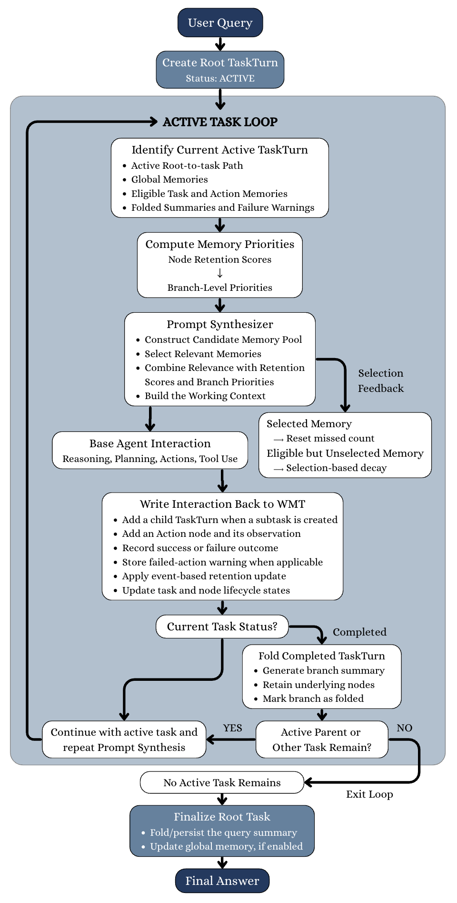
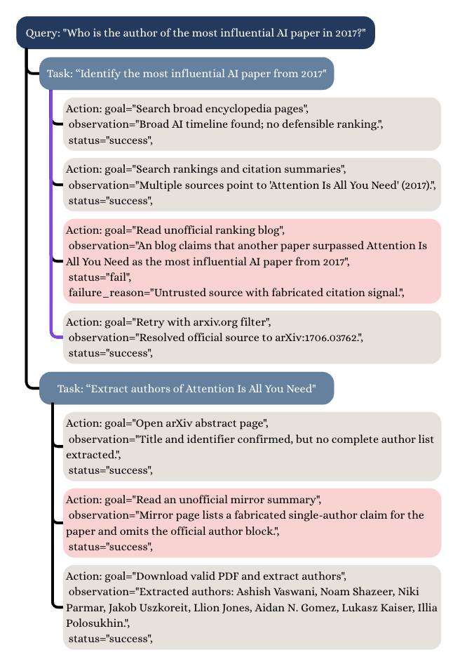

# Weighted Memory Tree: Remembering What Matters for Long-Horizon LLM Agents
## 加权记忆树：为长程 LLM 智能体记住真正重要的信息

> **论文元信息**
> - **arXiv**：[2608.20631](https://arxiv.org/abs/2608.20631)（v1，2026-08-21 提交）
> - **分类**：cs.AI
> - **作者**：Quang Dao（Rose-Hulman Institute of Technology）、Purvi Kathalkar（Georgia Institute of Technology）、Kenneth Eaton（Georgia Tech Research Institute）
> - **方法名**：**WMT**（Weighted Memory Tree，加权记忆树）

> **翻译说明**
> - 本译文基于 arXiv 官方 HTML 全文（`https://arxiv.org/html/2608.20631v1`）逐段翻译，覆盖：**摘要 + 第 1–7 节 + 附录 A（A.1–A.5）+ 图 1–2 + 表 1–4 全量数值**；参考文献保留原文编号，不逐条翻译。
> - **插图**：全部 **2 张图**已下载至 `images/WMT/`，markdown 使用**相对路径**引用，离线可读；每张图上方保留 `<!-- 原图：URL -->` 注释便于回溯原地址。
> - **公式**：原文 HTML 中 MathML 与 LaTeX 重复渲染的痕迹已清理，统一按 LaTeX 重排为 `$…$` / `$$…$$`；术语首次出现时保留英文原文，其后用中文。

---

## 摘要

大型语言模型（LLM）智能体已展现出解决多步任务的能力，这些任务需要规划、工具调用与外部信息获取；然而，不断增长的执行历史会抬高推理成本，并使推理暴露于过时、无关或具误导性的信息之中，可能劣化推理质量。现有的记忆方法虽然会组织化或压缩执行历史，却只能有限地决定哪些记忆应当保持活跃。我们提出**加权记忆树（Weighted Memory Tree，WMT）**，一种把执行过程组织为任务、子任务与动作，并为每条记忆赋予一个**动态保持评分（dynamic retention score）**的分层记忆系统。基于事件的更新与基于选取的衰减会修正这些评分，使 WMT 能够保留有用信息、折叠已完成的轨迹、抑制低效用内容，并保留对已折叠上下文的访问能力。我们在 GAIA-Text 上用 **Qwen3-8B、Gemma 4 E4B 与 Llama-3.1-8B** 评估 WMT，并辅以消融实验与记忆投毒实验。相对于线性记忆，WMT 在准确率上平均提升 **9.97 个百分点**，同时将 prompt token 用量降低 **32.8%**。记忆投毒实验表明，WMT 限制了对不可靠信息的持久化与传播。我们的结果显示，有效的长程智能体记忆，与其说取决于「存储更多信息」，不如说取决于「决定哪些信息应当保持活跃」。

---

## 1. 引言

基于 LLM 的智能体在外部环境中交错进行推理与动作，使它们能够在多步过程中检索信息、调用工具、修订计划，从而解决开放域研究 `[Yao et al., 2023; Schick et al., 2023; Sun et al., 2026]` 这类长程任务。这类任务要求智能体保留早期执行中遇到的证据、工具输出与失败尝试，使得记忆对于维持后续推理所需的任务状态至关重要 `[Zhang et al., 2025; Guan et al., 2026]`。然而，随着执行历史不断增长，过时的观测、失败的尝试以及偶然的细节会与有用信息一同累积，使得「哪些记忆应当继续影响后续决策」越来越难以判断。

一种常见的 ReAct 式设计，通过把推理步骤、工具调用与观测追加到一个线性交互历史中来保存执行状态 `[Yao et al., 2023]`。尽管这保留了完整轨迹，它却对所有记忆一视同仁、不论其效用如何，导致 prompt 长度持续增长，而过时的观测、失败的推理与有效证据仍然混杂在一起。因此，相关信息必须与陈旧或偶然的内容竞争，而这一局限并不能简单地靠扩大上下文窗口来解决。长上下文研究已经表明，语言模型难以在超长输入中利用相关信息，其性能往往远低于名义上下文窗口上限 `[Liu et al., 2024; Levy et al., 2024; Fraga, 2024; He et al., 2024; Hsieh et al., 2024; Tian et al., 2025]`。除了效率与推理质量，持久的智能体记忆还引入了一个安全问题：从长期记忆或外部知识库检索出的被投毒记录可以影响后续智能体行为 `[Chen et al., 2024; Srivastava and He, 2025; Ferrag et al., 2026; Dong et al., 2025]`。因此，长程智能体需要能够「调节哪些已存储信息进入工作上下文」的机制。

近期工作通过结构化或压缩化的执行历史表示，解决了该问题的一部分。**任务记忆引擎（Task Memory Engine，TME）** 把执行组织为一棵分层任务树，并依据活跃任务路径合成提示 `[Ye, 2025]`。**上下文折叠（Context-Folding）** 在回到父轨迹之前，对已完成子任务做摘要 `[Sun et al., 2026]`。这些方法确立了「保留任务结构」与「压缩已完成轨迹」的价值。然而，它们并未显式地维护对每条记忆「持续效用」的动态估计。结果，即使后续证据降低了某条记忆的相关性 or 可靠性，它仍可能保持活跃。这就引出了一个核心问题：能否通过显式估计记忆效用、调节进入智能体工作上下文的内容，来改善长程推理？

为应对这一挑战，我们提出**加权记忆树（WMT）**——一种把执行历史组织为任务、子任务与动作记忆，并为每条记忆赋予动态保持评分的分层记忆架构。这些评分优先安排记忆进入上下文构造，并决定低效用分支何时被抑制；同时，已完成的分支会依据任务状态被折叠为紧凑摘要，使 WMT 能够用最有用的上下文构造提示，同时减少重复的 token 处理、限制陈旧或不可靠信息的影响 `[Chen et al., 2024]`。我们在 GAIA `[Mialon et al., 2024]` 及其纯文本子集 GAIA-Text 上，使用 Qwen3-8B `[Yang et al., 2025]`、Gemma 4 E4B `[Gemma Team et al., 2026]` 与 Llama-3.1-8B `[Grattafiori et al., 2024]` 评估 WMT。我们把完整框架与一个线性记忆基线以及三种组件消融进行对比：无加权的树（A1）、无记忆控制器（A2），以及不带语义节点检索（A3）的消融。

尽管缓解记忆投毒并非 WMT 的首要目标，我们也开展了受控的记忆投毒实验，以评估结构化记忆管理相对传统线性记忆是否提升了鲁棒性。在这些实验中，WMT 降低了攻击成功率、投毒检索率、爆炸半径（blast radius）与放大因子（amplification factor），同时取得了所有被评估方法中最高的任务成功率。综上，这些结果表明，有效的长程记忆不仅依赖保留或压缩执行历史，更依赖**选择性地保留任务相关信息、同时抑制过时或不可靠内容**。

<!-- 原图：https://arxiv.org/html/2608.20631v1/asset/updated_wmt_diagram.png -->

> **图 1（原文 Figure 1）**：Status-driven workflow of WMT. Agent interactions update node scores and branch priorities; lifecycle transitions and prompt-selection feedback determine which memories remain active.
> （WMT 的状态驱动工作流：智能体交互更新节点评分与分支优先级；生命周期转移与提示选取反馈共同决定哪些记忆保持活跃。）

---

## 2. Weighted Memory Tree

我们提出**加权记忆树（WMT）**，这是一个把智能体的执行历史组织为一棵持久化层次结构、并为每步推理构造紧凑工作上下文的记忆管理层。WMT 在不修改基模型参数或工具接口的前提下，增强一个已有的基智能体。

### 2.1 问题定义

令 $q$ 表示用户查询，$\mathcal{T}$ 表示智能体可用的工具。在交互步 $t$，智能体产生动作 $a_t$，接收观测 $o_t$，并记录执行结果 $\omega_t$。累积的交互历史为

$$ H_{t} = \left(q, (a_{1}, o_{1}, \omega_{1}), \dots, (a_{t-1}, o_{t-1}, \omega_{t-1})\right). $$

一个线性历史的智能体会把 $H_t$ 的大部分甚至全部反复序列化进随后的每个 prompt。WMT 则维护一个持久化的记忆状态 $\mathcal{M}_t$。令 $v_{t}^{\star}$ 表示活跃任务节点，$B$ 为配置好的上下文预算。提示合成器（Prompt Synthesizer）选取一个记忆集合 $\mathcal{S}_t$，并按如下方式构造工作上下文：

$$ \mathcal{S}_{t} = \Gamma_{\mathrm{sel}}(q, \mathcal{M}_{t}, v_{t}^{\star}; B), \qquad C_{t} = \operatorname{Serialize}(q, \mathcal{T}, \mathcal{S}_{t}) \tag{1} $$

其中 $\Gamma_{\mathrm{sel}}$ 从 $\mathcal{M}_t$ 中选取记忆，而 $\operatorname{Serialize}$ 把被选中的记忆、用户查询与工具规范格式化为工作上下文 $C_t$。未被选入 $C_t$ 的记忆仍被持久化存储，供未来检索。

### 2.2 整体工作流

图 1 概括了 WMT 的执行循环。WMT 从用户查询初始化一个根任务，并在仍有活跃任务时构造工作上下文。基智能体执行一个交互步，WMT 记录由此产生的任务、动作、观测与结果。执行结果更新节点级的保持评分，这些评分被聚合成分支级优先级。记忆控制器折叠已完成的分支、抑制低优先级或被取代的分支、并重新打开被恢复的分支。提示选取决策提供第二个反馈信号：被选中的记忆重置其「未选中计数」，而有资格却未被选中的记忆则承受「基于选取的衰减」。当根任务完成且不再有活跃任务时，循环终止。

### 2.3 分层记忆树

WMT 把持久化记忆维护为 $\mathcal{M}_t = (\mathcal{G}_t, \mathcal{V}_t, \mathcal{E}_t)$，其中 $\mathcal{G}_t$ 包含**全局记忆（global memories）**，$\mathcal{V}_t$ 包含**查询特定的记忆节点（query-specific memory nodes）**，而 $\mathcal{E}_t$ 包含查询特定节点之间的父子关系。全局记忆跨任务分支或对话存储信息，而查询特定树记录当前任务的执行过程。本文的「一次性（one-shot）」设定为每个查询初始化一棵新树，但在对话模式下，已完成的任务摘要可被提升进 $\mathcal{G}_t$。

沿用 TME `[Ye, 2025]` 以任务为中心的表示，根节点表示用户查询，任务节点（task node）表示目标与子任务，动作节点（action node）记录已尝试的操作、观测与结果。每个记忆节点 $v_i$ 存储其内容、节点类型、父节点、生命周期状态、保持评分、未选中计数与执行元数据。新的子任务挂接到其父任务之下，而动作与观测则挂接到当前任务之下。

令 $v_{\mathrm{root}}$ 与 $v_{t}^{\star}$ 分别表示根节点与活跃任务节点。从用户查询到当前子任务的任务层级

$$ P_{t} = \operatorname{Path}(v_{\mathrm{root}}, v_{t}^{\star}) $$

在上下文构造中始终被保留。对于一个任务节点 $v$，其**分支** $\mathcal{B}(v)$ 是以 $v$ 为根的子树，包含其后代的任务节点与动作节点。

一个节点具有生命周期状态 $z_i \in \{\mathrm{active}, \mathrm{completed}, \mathrm{folded}, \mathrm{obsolete}\}$。对于一个分支 $b = \mathcal{B}(v_b)$，该分支继承其根任务节点 $v_b$ 的生命周期状态 $z_{v_b}$。生命周期状态决定节点是否有资格参与提示构造。抑制（suppression）把一个根任务标记为 obsolete 而不删除它，而任务完成与恢复则分别触发折叠（folding）与重新打开（reopening）。

一个在步 $t_b$ 创建的分支 $b = \mathcal{B}(v_b)$ 初始化为 $z_{v_b}^{(t_b)} = \mathrm{active}$；后续的生命周期操作会更新该状态。

### 2.4 动态保持评分

令 $i$ 索引记忆节点，$t$ 索引交互步。每个记忆节点 $v_i$ 有一个保持评分 $u_i^{(t)} \in [0,1]$，它估计该记忆在未来推理中用于优先排序的效用。每个节点获得一个类型相关的初始评分。

#### 基于事件的更新（Event-based updates）

对于一个动作记忆 $v_i$，令 $\omega_i \in \{\mathrm{success}, \mathrm{failure}\}$ 表示其被记录的执行结果。我们用 $\tilde{u}_i^{(t+1)}$ 表示基于事件的更新之后、选取反馈之前的中间评分。当记录或修订一个结果时，WMT 应用：

$$ \tilde{u}_{i}^{(t+1)} = \begin{cases} u_{\mathrm{success}}, & \omega_{i} = \mathrm{success}, \\ u_{\mathrm{failure}}, & \omega_{i} = \mathrm{failure}. \end{cases} \tag{2} $$

我们设定 $u_{\mathrm{success}} > u_{\mathrm{failure}}$。成功的动作作为支撑性证据获得更高优先级，而失败的动作仍可保留为「避免重复不成功操作」的警告。核心更新是固定的而非学习得到的。

#### 基于选取的衰减（Selection-based decay）

令 $\epsilon_{i,t} \in \{0,1\}$ 表示记忆 $v_i$ 在步 $t$ 是否进入候选池，令 $s_{i,t} \in \{0,1\}$ 表示它是否被选中进入工作上下文。按构造有 $s_{i,t} \leq \epsilon_{i,t}$。

对于一个非全局记忆，令 $m_i^{(t)}$ 表示 $v_i$ 在「有资格却未被选中」的连续选取机会次数。其更新为：

$$ m_{i}^{(t+1)} = \begin{cases} 0, & s_{i,t} = 1, \\ m_{i}^{(t)} + 1, & \epsilon_{i,t} = 1 \text{ 且 } s_{i,t} = 0, \\ m_{i}^{(t)}, & \epsilon_{i,t} = 0. \end{cases} \tag{3} $$

对于全局记忆，实现会在每次衰减更新前重置其未选中计数，因此其有效连选次数为恒定的 1。令 $\rho \in (0,1]$ 表示普通衰减率，$\rho_{\mathrm{G}} \in (0,1]$ 表示全局记忆衰减率，$M \geq 1$ 表示连选次数指数的上限。定义有效衰减乘子：

$$ g_{i}(m) = \begin{cases} \rho_{\mathrm{G}}, & \tau_{i} = \mathrm{global}, \\ \rho^{\min\{m,M\}}, & \tau_{i} \neq \mathrm{global}. \end{cases} \tag{4} $$

其中 $\tau_i$ 表示节点 $v_i$ 的类型。因此，所实现的「基于选取的衰减」函数为：

$$ D_i(u, m) = \operatorname{clip}_{[0,1]}\!\left(u\,g_{i}(m)\right). $$

我们把 $\epsilon_{i,t} = 1$ 且 $s_{i,t} = 0$ 称为一次**未选中（missed selection）**。最终的保持评分为：

$$ u_{i}^{(t+1)} = \begin{cases} D_{i}\!\left(\tilde{u}_{i}^{(t+1)}, m_{i}^{(t+1)}\right), & \text{missed selection}, \\ \tilde{u}_{i}^{(t+1)}, & \text{otherwise}. \end{cases} \tag{5} $$

因此，一条有资格却未被选中的非全局记忆会被乘以 $\rho^{\min\{m_{i}^{(t+1)},M\}}$，而有资格却未被选中的全局记忆会被乘以 $\rho_{\mathrm{G}}$。被选中的记忆重置其未选中计数，而处于候选池之外的记忆保持不变。仅凭流逝的时间不会影响保持评分。

#### 分支级优先级（Branch-level priority）

对于一个任务分支 $b = \mathcal{B}(v_b)$，令 $\mathcal{V}_b^{(t)}$ 表示其记忆节点，$F_b^{(t)}$ 表示失败动作节点的占比，$O_b^{(t)}$ 表示已被标记为 obsolete 的节点占比。分支优先级为：

$$ U_{b}^{(t)} = \alpha \max_{v_{i}\in\mathcal{V}_{b}^{(t)}} u_{i}^{(t)} + \frac{\beta}{|\mathcal{V}_{b}^{(t)}|} \sum_{v_{i}\in\mathcal{V}_{b}^{(t)}} u_{i}^{(t)} - \gamma F_{b}^{(t)} - \delta O_{b}^{(t)} \tag{6} $$

其中 $\alpha, \beta, \gamma, \delta \geq 0$ 是固定系数。最大项保留一个「含有单个高价值记忆」的分支，而均值项捕捉分支的整体效用。最后两项惩罚「由失败或已过时内容主导」的分支。

分支优先级有两个用途：它为提示合成器提供跨分支的效用信号，并为记忆控制器提供抑制信号。对于每个有资格进行生命周期评估的分支，控制器依据下式更新其根节点的状态：

$$ z_{v_{b}}^{(t+1)} = \begin{cases} \mathrm{obsolete}, & U_{b}^{(t)} < \tau_{\mathrm{obs}}, \\ z_{v_{b}}^{(t)}, & \text{otherwise}. \end{cases} \tag{7} $$

其中 $\tau_{\mathrm{obs}}$ 是过时阈值（默认 $\tau_{\mathrm{obs}} = 0.10$）。把 $z_{v_{b}}^{(t+1)}$ 标记为 obsolete 会从普通上下文构造中抑制该分支及其后代，而不删除已存储的执行记录。Eq. 7 只定义了抑制转移；若分支优先级保持在阈值之上，则分支维持其当前的生命周期状态。

### 2.5 记忆控制器与生命周期操作

记忆控制器执行三种生命周期操作。第一，**任务完成触发折叠（folding）**：一个已完成的分支由一条紧凑摘要表示，而其底层的执行轨迹仍保留在持久化记忆中 `[Sun et al., 2026]`。该摘要保留任务目标、最终结果、支撑证据、未决问题以及相关的失败警告。

第二，一个优先级低于 $\tau_{\mathrm{obs}}$ 的分支，通过将其根任务节点标记为 obsolete 而被**抑制**。取代（supersession）或失效（invalidation）事件可能独立于评分触发同样的转移。已过时的分支仍被存储以备溯源，但被排除在普通上下文构造之外。一个失败的动作不会自动过时；它仍可保留为「避免重复不成功操作」的警告。

第三，当执行回到一个已被折叠的任务时，控制器把其根任务节点恢复为 active 状态。被折叠的摘要立即可用，而底层记忆在需要更多细节时可重新进入候选池。当根任务完成且不再有活跃任务时，WMT 终止执行循环。在对话模式下，已完成的根摘要还可被提升为全局记忆。

### 2.6 效用感知的提示合成器

提示合成器构造 Eq. 1 中定义的工作上下文。其候选池包含强制性的活跃路径 $P_t$、来自 $\mathcal{G}_t$ 的有资格全局记忆、有资格的任务与动作记忆、被折叠的摘要，以及失败警告。属于过时分支的记忆被排除在普通选取之外，而被折叠的分支则通过其摘要来表示。

当前实现使用一个基于 LLM 的语义选择器，而非确定性的 top-$k$ 规则。每个候选由其内容、记忆类型、生命周期状态、保持评分表示；对于查询特定记忆，还包含其所属分支的优先级。全局记忆依据其节点级保持评分与语义相关性来评估，因为它们不属于某个查询特定的分支。因此，该选择器把「与活跃任务的相关性」与 WMT 维护的持久化效用信号结合起来。

被选中的记忆在「当前任务与活跃层级」之后序列化，随后是被折叠的摘要与相关的失败警告。上下文构造之后，被选中的记忆被标记为已访问并重置其未选中计数。有资格却未被选中的记忆承受 Eq. 5 中的衰减，而处于候选池之外的记忆保持不变。WMT 随后重新计算受影响的分支优先级，记忆控制器在下一个上下文构造周期之前应用任何由此产生的抑制转移。

## 3. 实验设置

我们沿两个维度评估 WMT：（1）在 GAIA-Text 与 GAIA 验证集上，跨三种基模型的任务准确率与 prompt token 用量（§3.1）；（2）在记忆投毒协议下的鲁棒性（§3.2）。所有配置使用相同的基智能体脚手架、工具、任务指令与交互预算；变化的只有记忆系统。

### 3.1 基准评测

**基准（Benchmarks）。** 我们在 GAIA `[Mialon et al., 2024]` 的公开验证划分上评估，该划分包含跨三个难度等级的 165 道验证题。GAIA 需要多步推理、信息检索与工具调用。我们报告两个评测集上的结果。GAIA-Text 由 **127 道不含输入文件**的验证题组成，在降低文档、图像、音频与表格处理的方差的同时，保留了多步推理与工具调用。GAIA 包含全部 165 道验证题，提供更宽泛的端到端评测。两个设定都使用官方的参考答案与归一化方式。

**模型与智能体配置（Models and agent configuration）。** 我们评估 **Qwen3-8B** `[Yang et al., 2025]`、**Gemma 4 E4B** `[Gemma Team et al., 2026]` 与 **Llama-3.1-8B** `[Grattafiori et al., 2024]`。每个模型都在同一个基于 OpenTools 的智能体脚手架 `[Dang et al., 2026]` 中作为被冻结的推理模型；实验中仅记忆系统发生变化。工具、任务指令与交互上限保持不变。每道基准题都初始化一棵新的查询特定记忆树，题目之间不共享全局记忆。保持评分系数与生命周期阈值对所有模型固定。组件消融的细节在附录中报告。

**记忆变体（Memory variants）。** 对于基准评测，我们比较四种主要记忆变体：

- **No Memory（无记忆）**：在推理步之间不保留任何先前的动作—观测历史，提供一个下界参考。
- **Linear History（线性历史）**：把完整的交互历史追加到每个 prompt。
- **Unweighted Tree（无加权树）**：使用 WMT 的层次结构，但不带保持评分或分支优先级；有资格的记忆被一视同仁。
- **Full WMT（完整 WMT）**：使用第 2 节描述的完整框架。

对于组件研究，我们还额外评估 **Tree + Selection**、**Tree + Summary** 与 **Tree + Selection + Summary**，以独立于 WMT 完整的保持评分与生命周期机制，分别隔离语义检索与分支折叠的贡献。

**评测指标（Evaluation metrics）。** 我们报告任务准确率与 prompt token 用量，其中 token 用量是所有基准题上处理的输入 token 总数。为考虑分词器差异，token 总数在每个模型家族内以百万计报告。prompt token 核算包含了对应配置所需的全部语言模型调用，包括基智能体推理、语义记忆选取以及分支摘要（启用时）。这确保了归于 WMT 的降低并非通过排除其辅助记忆操作的成本而获得。

### 3.2 记忆投毒消融设置

我们在受控的记忆投毒攻击下评估 WMT：在长程执行过程中，向记忆中插入具误导性的观测。该实验检验「效用感知的记忆管理」是否能相对线性记忆降低被投毒信息的持久化与传播。

<!-- 原图：https://arxiv.org/html/2608.20631v1/asset/memory_poisoning_example.png -->

> **图 2（原文 Figure 2）**：A simplified memory-poisoning scenario containing ordinary task and action memories together with intentionally poisoned memories shown in red.
> （一个简化的记忆投毒场景：包含普通的任务与动作记忆，以及以红色标出的刻意投毒记忆。）

**消融（Ablations）。** 我们对比线性记忆、三种组件消融与完整 WMT。**无加权树（A1）** 移除保持评分与分支优先级；**无记忆控制器（A2）** 禁用折叠、抑制与重新打开；**无语义检索（A3）** 保留评分与生命周期控制，但检索「完整的被选分支」而非单条记忆。

**指标（Metrics）。** 我们报告攻击成功率（Attack Success Rate, ASR）、投毒检索率（Poison Retrieval Rate, PRR）、感染持久性（Infection Persistence, IP）、爆炸半径（Blast Radius, BR）、放大因子（Amplification Factor, AF）、上下文压缩比（Context Compression Ratio, CCR）、任务成功率（Task Success Rate, TSR）、prompt token 用量与延迟。指标定义在附录 A.1。

---

## 4. 结果

### 4.1 基准性能

**主对比（Main comparison）。** 表 1 报告了无记忆、线性历史、无加权树与完整 WMT 配置的准确率与 prompt token 用量。在两种基准变体与全部三种基模型上，WMT 都取得了基于记忆的配置中最高的准确率与最低的 prompt token 用量。无记忆条件处理的 token 明显更少（因为它不保留先前的交互），但其持续偏低的准确率表明它只是一个下界性能参考，而非可直接比较的记忆效率基线。

相对于 GAIA-Text 上的线性历史，WMT 的结果对应 Qwen3-8B、Gemma 4 E4B、Llama-3.1-8B 分别 **13.39、8.66、7.87 个百分点**的绝对提升，平均为 **9.97 个百分点**。WMT 还把 prompt token 用量分别降低了 25.6%、42.0%、30.8%，三种模型平均降低 **32.8%**。

同样的模式在 GAIA 上成立。WMT 相对线性历史，在 Qwen3-8B、Gemma 4 E4B、Llama-3.1-8B 上分别提升 9.70、4.85、15.76 个百分点，平均提升 **10.10 个百分点**。prompt token 用量分别降低 25.8%、38.5%、32.5%，平均降低 **32.2%**。在 GAIA-Text 与 GAIA 上一致的提升表明，所观察到的收益并不局限于单一模型家族或纯文本评测设定。

无加权树并未提供同样一致的改进。在 GAIA-Text 上，它相对线性历史对 Gemma 4 E4B 略有提升、与 Llama-3.1-8B 持平、对 Qwen3-8B 则降低了准确率。在 GAIA 上也出现类似模式，无加权树仅在 Llama-3.1-8B 上超过线性历史。相比之下，WMT 在全部六种「模型—基准」组合上都优于无加权树，幅度为 5.46–18.11 个百分点，且在每种情况下处理的 prompt token 都更少。这些结果表明，**仅有层次化组织是不够的**；WMT 的收益来自把树结构、选择性上下文构造、动态保持评分与生命周期管理结合起来。

**组件消融（Component ablations）。** 附录中的表 2 与表 3 进一步分离了 WMT 主要组件的效应。在无加权树之上加入语义选取通常会提升准确率（尤其对 Qwen3-8B 与 Llama-3.1-8B），但会在所有模型上增加 token 用量。因此单靠选取并不保证更紧凑的上下文，因为选择器增加了模型调用，而底层的执行分支仍未压缩。

分支摘要则有相反的主要效果：它在两种基准变体上都为每个模型相对无加权树降低了 token 用量，但对准确率的影响好坏参半。例如，Tree + Summary 改善了 Llama-3.1-8B 在 GAIA-Text 上的表现，却降低了 Qwen3-8B 在 GAIA 上的准确率。把选取与摘要结合提升了部分系统的平均准确率，但仍不如完整 WMT 准确、通常也不如它高效。

对三种模型取平均，**完整 WMT 在 GAIA-Text 上达到 28.08% 准确率、40.50M prompt token**，而按平均准确率计最强的部分配置为 21.78% 准确率、51.98M token。在 GAIA 上，完整 WMT 取得 28.49% 准确率、52.93M token，而最强的部分配置为 21.41% 准确率、73.99M token。因此，完整 WMT 在两种基准变体上都提供了最强的整体准确率—效率权衡。消融表明，选取与摘要解决了上下文构造中互补的方面，而保持评分与生命周期控制则是「优先保留有用记忆、限制低效用分支影响」所必需的。

**表 1：GAIA-Text 与 GAIA 上跨三种基模型的性能。Accuracy 为正确完成任务百分比，token usage 为以百万计的 prompt token 总数。加粗为各模型与基准下基于记忆的方法中最高的准确率与最低的 token 用量。**

| 配置 | Qwen3-8B | | Gemma 4 E4B | | Llama-3.1-8B | |
| | Acc. (%) ↑ | Tokens (M) ↓ | Acc. (%) ↑ | Tokens (M) ↓ | Acc. (%) ↑ | Tokens (M) ↓ |
| --- | --- | --- | --- | --- | --- | --- |
| **GAIA-Text** | | | | | | |
| No Memory | 9.45 | 0.20 | 14.17 | 0.13 | 6.30 | 0.03 |
| Linear History | 20.47 | 43.67 | 24.41 | 65.27 | 9.45 | 73.96 |
| A1: Unweighted Tree | 15.75 | 39.24 | 25.20 | 53.90 | 9.45 | 77.13 |
| Full WMT | **33.86** | **32.48** | **33.07** | **37.85** | **17.32** | **51.17** |
| **GAIA** | | | | | | |
| No Memory | 12.12 | 0.21 | 13.94 | 0.16 | 6.06 | 0.04 |
| Linear History | 20.00 | 57.51 | 26.06 | 75.81 | 9.09 | 102.85 |
| A1: Unweighted Tree | 18.18 | 58.46 | 25.45 | 65.09 | 11.52 | 101.91 |
| Full WMT | **29.70** | **42.69** | **30.91** | **46.64** | **24.85** | **69.45** |

### 4.2 记忆投毒消融结果

附录中表 4 的记忆投毒评测包含 100 个长程场景，含 297 个子任务与 1,118 条记忆条目，其中 709 条良性、409 条刻意投毒。

如预期，基线**线性记忆**在几乎每一项安全指标上都表现最差，因为整个执行历史持续可访问，使被投毒记忆能够持久存在并反复影响下游推理。这导致最高的攻击成功率、爆炸半径、放大因子，以及完全的感染持久性。

在保留层次化记忆结构的前提下移除保持评分与分支优先级（A1），相对线性记忆大幅提升了鲁棒性。尽管 A1 取得了与完整系统相同的近零感染持久性，但其更高的攻击成功率、投毒检索率与更低任务成功率表明：把所有保留的记忆一视同仁，会让低价值或误导性信息继续影响推理。

移除记忆控制器（A2）凸显了生命周期管理的重要性。没有折叠与抑制，被投毒记忆保持活跃或有资格进入普通上下文构造，导致尽管攻击成功率与任务完成度有中等改善，却出现了**完全的感染持久性**。这表明，如果恶意记忆在整个长程执行中始终可用，仅降低即时暴露是不够的。

语义检索消融（A3）表明，没有语义选取的生命周期管理同样不足。尽管低优先级记忆可被抑制，但检索整个任务分支增大了 prompt 规模，并重新引入了无关或被投毒的信息，导致比完整系统更高的攻击成功率、爆炸半径、放大因子与更低的任务成功率。

**完整 WMT 取得最强的整体表现**：最低的攻击成功率（0.419）、投毒检索率（0.097）、爆炸半径（0.315）与放大因子（0.965），同时与最低的感染持久性（0.009）持平。它还取得了最高的任务成功率（0.575），且所需的平均 prompt token 最少（131.963），表明加权记忆选取与语义检索同时改善了鲁棒性与推理效率。

---

## 5. 相关工作

**面向 LLM 智能体的记忆（Memory for LLM agents）。** 智能体记忆系统把信息从即时上下文中外化，并在相关时检索或摘要之。**生成式智能体（Generative Agents）** 以自然语言存储过去经验的记录，并依据最近性、重要性与相关性检索 `[Park et al., 2023]`。**MemoryBank** 引入持续更新的长期对话记忆 `[Zhong et al., 2023]`；**MemGPT** 在不同的记忆层级间管理信息，以把有效上下文扩展到模型即时窗口之外 `[Packer et al., 2024]`。这些系统主要解决持久的对话或经验记忆。WMT 则聚焦于长程智能体任务中累积的**执行状态**，以及控制该状态的哪些部分影响每步推理。

近期方法已把结构引入智能体工作记忆。**HiAgent** 围绕子目标组织动作—观测历史，并用摘要观测替换已完成的子目标历史 `[Hu et al., 2025]`。**任务记忆引擎（TME）** 把任务执行表示为一种层次结构，并依据活跃任务路径构造提示 `[Ye, 2025]`。**上下文折叠（Context-Folding）** 创建局部子轨迹，并在回到父任务前折叠其已完成的执行轨迹 `[Sun et al., 2026]`。WMT 建立在这一「任务结构化」视角之上，但为每条记忆引入了**显式的效用状态**：该效用由执行结果与记忆选取行为更新，跨分支聚合，并联合用于提示构造与生命周期控制。

**长上下文可靠性与记忆鲁棒性（Long-context reliability and memory robustness）。** 长上下文研究表明，增大可用上下文并不能保证可靠地利用其中所有信息。模型会对相关证据的位置敏感，并可能随输入长度增加而表现出推理退化 `[Liu et al., 2024; Levy et al., 2024]`。这些发现促使我们去**选择任务相关的状态**，而非反复呈现完整的交互历史。

持久的智能体记忆也制造了一个对抗面。**AgentPoison** 表明，插入长期记忆或知识库的恶意记录可被检索并影响后续行为 `[Chen et al., 2024]`。我们的鲁棒性评测研究一个相关但有区别的问题：记忆组织、效用评分、生命周期控制与选择性上下文构造能否降低不可靠记录的持久化与传播。WMT 并非事实错误或对抗输入的通用检测器；它在信息进入记忆系统之后，调节已存储信息的影响。

---

## 6. 结论

我们提出了**加权记忆树（WMT）**，一种把智能体执行组织为层次化的任务与动作记忆、同时显式建模其持续效用的记忆管理框架。通过结合动态记忆评分、生命周期管理与效用感知的提示构造，WMT 把持久化记忆与用于即时推理的上下文分离开来。在三种基模型上，WMT 相对线性历史在 GAIA-Text 上提升准确率 9.97 个百分点、在 GAIA 上提升 10.10 个百分点，同时分别把 prompt token 用量降低 32.8% 与 32.2%。受控的记忆投毒实验进一步证明，结构化记忆管理提升了鲁棒性——WMT 取得了最低的攻击成功率、投毒检索率、爆炸半径与放大因子，并在所有被评估方法中达到最高的任务成功率。组件消融表明，层次化组织、生命周期管理与语义检索各自都有贡献，而它们的组合提供了鲁棒性、推理质量与 prompt 效率之间最强的平衡。总体而言，这些发现表明，有效的长程智能体记忆不仅取决于信息如何被存储，也取决于持续调节哪些信息保持活跃以引导未来推理。

---

## 7. 局限性

我们的评测局限于 GAIA 基准家族。GAIA-Text 有助于隔离基于文本的推理与记忆管理，而 GAIA 提供了涉及附件的更宽泛评测；尽管如此，两套集合共享相同的任务构造与答案格式。在交互式网页环境、软件工程智能体、具身任务或长程对话上，表现可能不同。此外，基准评测为每道题初始化一棵新任务树，因此并未评估第 2.3 节描述的跨对话全局记忆模式。

我们的评测还局限于相对较小的开放权重模型：Qwen3-8B、Gemma 4 E4B 与 Llama-3.1-8B。模型规模可能影响记忆管理的收益。更大的模型可能更善于忽略陈旧或无关上下文，从而可能缩小 WMT 的相对准确率增益；但其更高的 prompt 处理成本可能保留甚至增大选择性上下文构造的效率收益。由于我们未评估更大的模型，模型规模与 WMT 的交互仍是一个开放问题。

当前的 WMT 使用手工指定的初始化值、基于事件的评分更新、分支聚合系数与过时阈值。这些参数在所有被评估模型上保持固定，但可能对其他智能体架构或任务分布并非最优。

此外，保持评分估计的是**操作效用**而非事实正确性。一条有用的记忆可能在反复未被选中后被抑制，而一条误导性信息若对「看似成功的动作」有贡献，则可能保持高评分。基于 LLM 的选择器与摘要生成器也可能引入选取或压缩错误，并需要额外的模型调用，因此对于执行历史有限的短任务，WMT 的效率优势可能更小。

未来的工作应在更宽泛的交互式基准与长程对话上评估 WMT，并研究用学习到的方案替代其固定的记忆管理规则。一个有前景的方向是**基于强化学习、感知预算的记忆策略**，它把初始保持评分与后续更新建立在记忆内容、任务状态、执行结果与选取历史之上。这样的策略可以联合调整分支聚合系数，并决定在剩余交互预算下，何时反复失败足以证明应当抑制或终止一个分支。提示合成器也可以被训练为：选取能改善下游任务成功的记忆，同时惩罚 prompt 成本与对不可靠内容的重复检索。这一扩展需要能够区分「真正的任务正确」与「仅仅是表面进展」的奖励函数。

---

## 参考文献

> 以下保留原文编号与原文条目，不逐条翻译。

- **Barnes (2026)** — J. Barnes. *OpenSec: measuring incident response agent calibration under adversarial evidence.* External Links: 2601.21083. Cited by: §A.1.
- **Chen et al. (2024)** — Z. Chen, Z. Xiang, C. Xiao, D. Song, B. Li. *AgentPoison: red-teaming LLM agents via poisoning memory or knowledge bases.* In Advances in Neural Information Processing Systems, Vol. 37. External Links: Document, Link. Cited by: §1, §1, §5.
- **Dang et al. (2026)** — H. Dang, Q. Dao, M. Jiang. *Open, reliable, and collective: a community-driven framework for tool-using AI agents.* External Links: 2604.00137, Document, Link. Cited by: §3.1.
- **Dash et al. (2026)** — P. Dash, T. Ge, A. Jain, T. Shah, Z. Shang. *From untrusted input to trusted memory: a systematic study of memory poisoning attacks in llm agents.* External Links: 2606.04329, Link. Cited by: §A.1, §A.1.
- **Dong et al. (2025)** — S. Dong, S. Xu, P. He, Y. Li, J. Tang, T. Liu, H. Liu, Z. Xiang. *Memory injection attacks on LLM agents via query-only interaction.* In The Thirty-ninth Annual Conference on Neural Information Processing Systems. External Links: Link. Cited by: §1.
- **Ferrag et al. (2026)** — M. A. Ferrag, N. Tihanyi, D. Hamouda, L. Maglaras, A. Lakas, M. Debbah. *From prompt injections to protocol exploits: threats in llm-powered ai agents workflows.* ICT Express 12 (2), pp. 353–383. External Links: ISSN 2405-9595, Document. Cited by: §A.1, §1.
- **Fraga (2024)** — N. Fraga. *Challenging LLMs beyond information retrieval: reasoning degradation with long context windows.* Preprints.org Preprint, version 1. External Links: Document, Link. Cited by: §1.
- **Gemma Team et al. (2026)** — Gemma Team, S. El Abd, V. Aggarwal, R. Algayres, A. Andreev, et al. *Gemma 4 technical report.* arXiv preprint arXiv:2607.02770. Cited by: §1, §3.1.
- **Grattafiori et al. (2024)** — A. Grattafiori, A. Dubey, A. Jauhri, A. Pandey, A. Kadian, A. Al-Dahle, A. Letman, A. Mathur, A. Schelten, A. Vaughan, et al. *The Llama 3 herd of models.* arXiv preprint arXiv:2407.21783. External Links: 2407.21783, Document, Link. Cited by: §1, §3.1.
- **Guan et al. (2026)** — S. Guan, J. Wang, J. Bian, B. Zhu, J. Lou, H. Xiong. *Evaluating LLM-based agents for multi-turn conversations: a survey.* ACM Transactions on Intelligent Systems and Technology 17 (4), pp. 85:1–85:40. External Links: Document, Link. Cited by: §1.
- **He et al. (2024)** — J. He, K. Pan, X. Dong, Z. Song, Y. Liu, Q. Sun, Y. Liang, H. Wang, E. Zhang, J. Zhang. *Never lost in the middle: mastering long-context question answering with position-agnostic decompositional training.* In Proceedings of the 62nd Annual Meeting of the Association for Computational Linguistics (Volume 1: Long Papers), pp. 13628–13642. External Links: Link, Document. Cited by: §1.
- **Hsieh et al. (2024)** — C. Hsieh, Y. Chuang, C. Li, Z. Wang, L. Le, A. Kumar, J. Glass, A. Ratner, C. Lee, R. Krishna, T. Pfister. *Found in the middle: calibrating positional attention bias improves long context utilization.* In Findings of the Association for Computational Linguistics: ACL 2024, pp. 14982–14995. External Links: Link, Document. Cited by: §1.
- **Hu et al. (2025)** — M. Hu, T. Chen, Q. Chen, Y. Mu, W. Shao, P. Luo. *HiAgent: hierarchical working memory management for solving long-horizon agent tasks with large language model.* In Proceedings of the 63rd Annual Meeting of the Association for Computational Linguistics (Volume 1: Long Papers), pp. 32779–32798. External Links: Link, Document, ISBN 979-8-89176-251-0. Cited by: §5.
- **Lee and Tiwari (2024)** — D. Lee, M. Tiwari. *Prompt infection: llm-to-llm prompt injection within multi-agent systems.* External Links: 2410.07283, Link. Cited by: §A.1.
- **Levy et al. (2024)** — M. Levy, A. Jacoby, Y. Goldberg. *Same task, more tokens: the impact of input length on the reasoning performance of large language models.* In Proceedings of the 62nd Annual Meeting of the Association for Computational Linguistics (Volume 1: Long Papers), pp. 15339–15353. External Links: Link, Document. Cited by: §1, §5.
- **Liu et al. (2024)** — N. F. Liu, K. Lin, J. Hewitt, A. Paranjape, M. Bevilacqua, F. Petroni, P. Liang. *Lost in the middle: how language models use long contexts.* Transactions of the Association for Computational Linguistics 12, pp. 157–173. External Links: Document, Link. Cited by: §1, §5.
- **Liu et al. (2022)** — Y. Liu, Q. Jia, K. Zhu. *Reference-free summarization evaluation via semantic correlation and compression ratio.* In Proceedings of the 2022 Conference of the North American Chapter of the Association for Computational Linguistics: Human Language Technologies, pp. 2109–2115. External Links: Link, Document. Cited by: §A.1.
- **Mialon et al. (2024)** — G. Mialon, C. Fourrier, T. Wolf, Y. LeCun, T. Scialom. *GAIA: a benchmark for general AI assistants.* In The Twelfth International Conference on Learning Representations. External Links: Link. Cited by: §1, §3.1.
- **Packer et al. (2024)** — C. Packer, S. Wooders, K. Lin, V. Fang, S. G. Patil, I. Stoica, J. E. Gonzalez. *MemGPT: towards llms as operating systems.* External Links: 2310.08560, Link. Cited by: §5.
- **Park et al. (2023)** — J. S. Park, J. C. O'Brien, C. J. Cai, M. R. Morris, P. Liang, M. S. Bernstein. *Generative agents: interactive simulacra of human behavior.* External Links: 2304.03442, Link. Cited by: §5.
- **Schick et al. (2023)** — T. Schick, J. Dwivedi-Yu, R. Dessi, R. Raileanu, M. Lomeli, E. Hambro, L. Zettlemoyer, N. Cancedda, T. Scialom. *Toolformer: language models can teach themselves to use tools.* In Advances in Neural Information Processing Systems, Vol. 36. External Links: Document, Link. Cited by: §1.
- **Sharma et al. (2025)** — G. Sharma, V. Kulkarni, M. King, K. Huang. *Towards unifying quantitative security benchmarking for multi agent systems.* External Links: 2507.21146, Link. Cited by: §A.1, §A.1, §A.1.
- **Srivastava and He (2025)** — S. S. Srivastava, H. He. *MemoryGraft: persistent compromise of llm agents via poisoned experience retrieval.* External Links: 2512.16962, Link. Cited by: §A.1, §1.
- **Sun et al. (2026)** — W. Sun, M. Lu, Z. Ling, K. Liu, X. Yao, Y. Yang, J. Chen. *Scaling long-horizon agent via context folding.* In Proceedings of the 43rd International Conference on Machine Learning, Proceedings of Machine Learning Research, Vol. 306. External Links: Link. Cited by: §1, §1, §2.5, §5.
- **Tian et al. (2025)** — R. Tian, Y. Li, Y. Fu, S. Deng, Q. Luo, C. Qian, S. Wang, X. Cong, Z. Zhang, Y. Wu, Y. Lin, H. Wang, X. Liu. *Distance between relevant information pieces causes bias in long-context LLMs.* In Findings of the Association for Computational Linguistics: ACL 2025, pp. 521–533. External Links: Link, Document, ISBN 979-8-89176-256-5. Cited by: §1.
- **Wang et al. (2025)** — L. Wang, T. Zhu, L. Qin, L. Gao, W. Zhou. *Bias amplification in rag: poisoning knowledge retrieval to steer llms.* External Links: 2506.11415, Link. Cited by: §A.1.
- **Yang et al. (2025)** — A. Yang, A. Li, B. Yang, B. Zhang, B. Hui, B. Zheng, B. Yu, C. Gao, C. Huang, C. Lv, et al. *Qwen3 Technical Report.* arXiv preprint arXiv:2505.09388. External Links: 2505.09388, Document, Link. Cited by: §1, §3.1.
- **Yao et al. (2023)** — S. Yao, J. Zhao, D. Yu, N. Du, I. Shafran, K. R. Narasimhan, Y. Cao. *ReAct: synergizing reasoning and acting in language models.* In The Eleventh International Conference on Learning Representations. External Links: Link. Cited by: §1, §1.
- **Ye (2025)** — Y. Ye. *Task memory engine (TME): enhancing state awareness for multi-step LLM agent tasks.* External Links: 2504.08525, Document, Link. Cited by: §1, §2.3, §5.
- **Zhang et al. (2025)** — Z. Zhang, Q. Dai, X. Bo, C. Ma, R. Li, X. Chen, J. Zhu, Z. Dong, J. Wen. *A survey on the memory mechanism of large language model-based agents.* ACM Transactions on Information Systems 43 (6), pp. 1–47. External Links: Document, Link. Cited by: §1.
- **Zhong et al. (2023)** — W. Zhong, L. Guo, Q. Gao, H. Ye, Y. Wang. *MemoryBank: enhancing large language models with long-term memory.* External Links: 2305.10250, Link. Cited by: §5.
- **Zhou et al. (2026)** — Y. Zhou, X. Lu, D. Liu, J. Yan, J. Shao. *INFA-guard: mitigating malicious propagation via infection-aware safeguarding in llm-based multi-agent systems.* External Links: 2601.14667, Link. Cited by: §A.1.

## 附录 A. 附录

### A.1 评测指标的公式

**攻击成功率（ASR）**：

$$ \mathrm{ASR} = \frac{C_s}{S_c} \tag{8} $$

其中 $C_s$ 是受到破坏的关键推理步数，$S_c$ 是关键推理步的总数。ASR 越低表示对记忆投毒的鲁棒性越强 `[Ferrag et al., 2026; Dash et al., 2026]`。

**投毒检索率（PRR）**：

$$ \mathrm{PRR} = \frac{H_p}{H_p + H_c} \tag{9} $$

其中 $H_p$ 与 $H_c$ 分别是提示合成器选入工作上下文的被投毒记忆与干净记忆的数量。PRR 越低表示被选入提示的投毒记忆越少 `[Srivastava and He, 2025; Dash et al., 2026]`。

**感染持久性（IP）**：

$$ \mathrm{IP} = \frac{P_r}{P_i} \tag{10} $$

其中 $P_i$ 是注入的被投毒记忆数量，$P_r$ 是记忆管理之后仍保持活跃或有资格进入普通上下文构造的那些记忆的数量。IP 越低表示长期韧性越强 `[Lee and Tiwari, 2024]`。

**爆炸半径（BR）**：

$$ \mathrm{BR} = \frac{T_c}{T_p} \tag{11} $$

其中 $T_c$ 是包含受污染记忆的提示构造步数，$T_p$ 是提示构造步的总数。爆炸半径越低，表示被投毒记忆在任务执行中影响的 prompt 越少 `[Barnes, 2026; Sharma et al., 2025]`。

**放大因子（AF）**：

$$ \mathrm{AF} = \frac{H_p}{P_i} \tag{12} $$

它衡量被注入的投毒记忆相对初始插入数量被反复检索的频率。放大因子越低，表示记忆系统阻止了投毒记忆反复影响未来推理 `[Wang et al., 2025; Sharma et al., 2025]`。

**上下文压缩比（CCR）**：

$$ \mathrm{CCR} = \frac{1}{T_p} \sum_{i=1}^{T_p} \frac{T_{\mathrm{sel},i}}{T_{\mathrm{cand},i}} \tag{13} $$

其中 $T_{\mathrm{sel},i}$ 是选入 prompt 的记忆 token 数，$T_{\mathrm{cand},i}$ 是第 $i$ 个提示构造步所考虑的记忆 token 候选总数。CCR 越低表示上下文压缩越强、prompt 效率越高；但应结合任务成功率一起解读，以确保过度压缩没有劣化任务表现 `[Liu et al., 2022]`。

**任务成功率（TSR）**：

$$ \mathrm{TSR} = \frac{1}{N_t} \sum_{i=1}^{N_t} S_i, \quad S_i = \begin{cases} 1, & \text{task } i \text{ is successful}, \\ 0, & \text{otherwise}. \end{cases} \tag{14} $$

其中 $N_t$ 是被评估任务的总数，$S_i$ 是任务 $i$ 的二元成功指示。TSR 越高，表示尽管存在对抗性记忆污染，智能体成功完成的任务比例越大 `[Zhou et al., 2026; Sharma et al., 2025]`。

### A.2 GAIA-Text 与 GAIA 组件消融

**共享评测配置（Shared evaluation configuration）。** 组件消融使用与第 3.1 节主基准对比相同的 GAIA 题目、基智能体脚手架、工具、任务指令与交互预算。我们以两种形式评估公开的 GAIA 验证集：GAIA-Text 含 127 道无附件题目，GAIA 含全部 165 道验证题。我们评估 Qwen3-8B、Gemma 4 E4B 与 Llama-3.1-8B 作为被冻结的推理模型。每道题初始化一棵新的查询特定记忆树，题目之间不转移全局记忆。prompt token 总数包含对应配置所需的每一次语言模型调用（基智能体推理、语义记忆选取以及启用时的分支摘要）。

所有实验中使用的固定结果评分与分支优先级系数为：

$$ u_{\mathrm{success}} = 0.75, \qquad u_{\mathrm{failure}} = 0.30, \qquad (\alpha,\beta,\gamma,\delta) = (0.60,\,0.30,\,0.20,\,0.20). $$

三种模型使用相同的保持评分配置。「基于选取的衰减」只应用于进入候选池却未被选中的记忆；选中一条记忆会将其未选中计数重置为零。分支优先级对失败节点与过时节点的占比使用固定的惩罚 $\gamma = \delta = 0.20$。当一个有资格的分支满足 $U_b^{(t)} < \tau_{\mathrm{obs}}$（其中 $\tau_{\mathrm{obs}} = 0.10$）时，它被标记为 obsolete。

**组件配置（Component configurations）。** 主基准表对比了 No Memory、Linear History、Unweighted Tree 与 Full WMT。以下额外配置隔离了语义记忆选取与已完成分支摘要：

- **Tree Memory**：把交互历史组织为任务、子任务与动作节点，但不使用语义选取、分支摘要、动态保持评分或基于评分的抑制。
- **Tree + Selection**：在 Tree Memory 之上加入基于 LLM 的语义选择器；选择器依据与活跃任务的相关性选取记忆，但不提供动态保持或分支优先级信号。
- **Tree + Summary**：把已完成分支折叠为紧凑摘要，但不使用语义选取或动态保持评分。
- **Tree + Selection + Summary**：结合语义选取与已完成分支摘要，但省略基于事件的评分更新、基于选取的衰减、分支优先级聚合与基于评分的抑制。
- **Full WMT**：结合层次化记忆、语义选取、分支摘要、基于事件的保持更新、基于选取的衰减、分支级优先级、抑制与重新打开。

表 2 与表 3 报告完整的组件结果。

**表 2：GAIA-Text 上的组件消融结果。Accuracy 为正确完成任务百分比，prompt-token 用量以百万计。加粗为各模型与指标下、所报告的基于树的配置中的最优结果。**

| 记忆配置 | Qwen3-8B | | Gemma 4 E4B | | Llama-3.1-8B | |
| | Acc. (%) ↑ | Tokens (M) ↓ | Acc. (%) ↑ | Tokens (M) ↓ | Acc. (%) ↑ | Tokens (M) ↓ |
| --- | --- | --- | --- | --- | --- | --- |
| Tree Memory | 15.75 | 39.24 | 25.20 | 53.90 | 9.45 | 77.13 |
| Tree + Selection | 22.05 | 74.37 | 25.20 | 92.02 | 14.96 | 101.22 |
| Tree + Summary | 15.75 | 34.00 | 25.98 | 28.58 | 19.69 | 66.83 |
| Tree + Selection + Summary | 18.90 | 47.33 | 29.13 | 31.55 | 17.32 | 77.05 |
| Full WMT | **33.86** | **32.48** | **33.07** | **37.85** | **17.32** | **51.17** |

**表 3：GAIA 上的组件消融结果。Accuracy 为正确完成任务百分比，prompt-token 用量以百万计。加粗为各模型与指标下、所报告的基于树的配置中的最优结果。**

| 记忆配置 | Qwen3-8B | | Gemma 4 E4B | | Llama-3.1-8B | |
| | Acc. (%) ↑ | Tokens (M) ↓ | Acc. (%) ↑ | Tokens (M) ↓ | Acc. (%) ↑ | Tokens (M) ↓ |
| --- | --- | --- | --- | --- | --- | --- |
| Tree Memory | 18.18 | 58.46 | 25.45 | 65.09 | 11.52 | 101.91 |
| Tree + Selection | 21.21 | 100.51 | 26.67 | 105.57 | 16.36 | 134.15 |
| Tree + Summary | 15.15 | 49.83 | 24.85 | 36.02 | 16.97 | 94.25 |
| Tree + Selection + Summary | 15.76 | 66.84 | 28.48 | 42.68 | 20.00 | 112.44 |
| Full WMT | **29.70** | **42.69** | **30.91** | **46.64** | **24.85** | **69.45** |

**模型特定的趋势（Model-specific trends）。** 组件消融揭示了跨模型家族的不同模式。Qwen3-8B 在 GAIA-Text 与 GAIA 上都从 Tree + Selection 取得其最强部分配置准确率，说明它受益于保留细粒度证据并有选择地检索。Gemma 4 E4B 在部分配置中以 Tree + Selection + Summary 表现最好，而 Tree + Summary 产生其最低的 prompt token 用量；这一模式表明摘要为 Gemma 移除了冗余的执行历史，而语义选取对恢复任务特定证据仍有用。Llama-3.1-8B 表现出不同趋势：在 GAIA-Text 上，Tree + Summary 达到 19.69% 准确率，超过 Full WMT 的 17.32%；而在 GAIA 上，Tree + Selection + Summary 是最强的部分配置，Full WMT 以 24.85% 取得整体最佳的 Llama 结果。一个可能的解释是：仅摘要的上下文足以为纯文本任务移除嘈杂的中间轨迹，而更异质的 GAIA 任务则受益于把压缩与有针对性的、效用感知的检索结合起来。这些解释是**事后假设**，而非对模型行为的直接测量。

### A.3 记忆投毒消融细节

**评测语料（Evaluation corpus）。** 记忆投毒评测包含 100 个长程场景，由 297 个子任务与 1,118 条记忆条目组成。其中 709 条良性、409 条刻意投毒。投毒条目向执行历史中引入误导性观测、捏造主张或被破坏的工具派生信息，以影响后续的检索与推理。每种记忆配置使用相同的场景结构与注入记忆，因此该评测隔离了「记忆组织、保持评分、生命周期管理与语义检索如何影响其持久化与传播」。

**消融配置（Ablation configurations）。** 我们比较五种记忆配置：

- **Linear Memory（线性记忆）**：把所有任务与动作历史存储在单一顺序上下文中，不使用层次结构、效用评分、抑制或选择性检索。
- **Unweighted Tree（A1，无加权树）**：把记忆组织为任务与动作分支，但不使用保持评分或分支优先级。
- **No Memory Controller（A2，无记忆控制器）**：计算保持评分与分支优先级，但禁用生命周期操作（包括折叠、基于评分的抑制与重新打开）。
- **No Semantic Retrieval（A3，无语义检索）**：保留层次化树、保持评分与记忆控制器，但提示构造包含「完整的被选分支」而非语义地选取单条记忆。
- **Full WMT（完整 WMT）**：使用层次化记忆、动态保持评分、分支级优先级、生命周期控制与语义提示构造。

攻击成功率、投毒检索率、感染持久性、爆炸半径、放大因子、上下文压缩比与任务成功率在附录 A.1 中定义；我们额外报告平均 prompt token 用量与延迟。完整结果报告于表 4。

**表 4：WMT 及其消融的记忆投毒结果。箭头表示偏好方向。加粗为各指标的最优结果；并列者共同加粗。Linear Memory 保留完整顺序历史，A1 移除加权，A2 移除生命周期控制，A3 移除语义记忆选取。**

| 指标 | Linear Memory | Unweighted Tree (A1) | No Memory Controller (A2) | No Semantic Retrieval (A3) | Full WMT |
| --- | --- | --- | --- | --- | --- |
| Attack Success Rate ↓ | 0.995 | 0.631 | 0.601 | 0.680 | **0.419** |
| Poison Retrieval Rate ↓ | 0.246 | 0.125 | 0.158 | 0.139 | **0.097** |
| Infection Persistence ↓ | 1.000 | **0.009** | **0.009** | **0.009** | **0.009** |
| Blast Radius ↓ | 0.906 | 0.388 | 0.509 | 0.669 | **0.315** |
| Amplification Factor ↓ | 6.103 | 1.280 | 1.638 | 1.977 | **0.965** |
| Task Success Rate ↑ | 0.183 | 0.431 | 0.451 | 0.393 | **0.575** |
| Context Compression Ratio ↓ | 1.000 | 0.815 | **0.634** | 1.000 | 0.819 |
| Average Prompt Tokens ↓ | 362.143 | 133.733 | 146.721 | 189.770 | **131.963** |
| Latency (ms) ↓ | 0.022 | 0.081 | 0.108 | **0.020** | 0.080 |

### A.4 记忆投毒动力学的逐步示例

图 2 展示了 WMT 如何在单个执行树内处理普通记忆与投毒记忆。蓝色节点表示查询与任务层级，灰色节点表示普通的动作记忆，红色节点表示刻意投毒的记忆。该示例包含两个任务分支：识别一篇候选论文，以及抽取其作者。其目的是说明记忆状态更新，而非确立对 2017 年发表论文的某种规范排序。

**任务初始化与事件评分（Task initialization and event scores）。** WMT 首先为用户查询创建一个根节点，并为「识别论文」创建一个活跃的子任务。在该任务下执行的每个动作都作为子记忆插入，连同其观测与记录的结果。如 Eq. 2 所定义，该结果在施加任何选取反馈之前，为动作记忆赋予一个中间的保持评分。所报告的配置使用：

$$ (u_{\mathrm{success}}, u_{\mathrm{failure}}) = (0.75, 0.30). $$

因此，成功的动作收到 $\tilde{u}_i = 0.75$，而失败的动作收到 $\tilde{u}_i = 0.30$。波浪号表示事件赋予的中间评分；基于选取的衰减随后可能降低该值，产生最终的保持评分 $u_i$。

**示例中的基于选取的衰减（Selection-based decay in the example）。** 图 2 中的所有动作记忆都是非全局记忆。令 $u_i^{[r]}$ 表示记忆 $v_i$ 在 $r$ 次连续未选中之后的评分，且 $u_i^{[0]} = \tilde{u}_i$。由 Eq. 4 与 Eq. 5，第 $r$ 次未选中产生：

$$ u_i^{[r]} = \operatorname{clip}_{[0,1]}\!\left(u_i^{[r-1]}\,\rho^{\min\{r,M\}}\right). $$

于是，在 $r$ 次连续未选中之后：

$$ u_i^{[r]} = \operatorname{clip}_{[0,1]}\!\left(\tilde{u}_i\,\rho^{h_M(r)}\right), $$

其中

$$ h_M(r) = \sum_{k=1}^{r} \min\{k, M\} = \begin{cases} \dfrac{r(r+1)}{2}, & r \leq M, \\[5.0pt] M r - \dfrac{M(M-1)}{2}, & r > M. \end{cases} \tag{15} $$

这一累积表达式假设其间没有发生选取或新的基于事件的更新。选中该记忆会将其未选中计数重置为零，而未进入候选池的记忆不会被衰减。

**第一分支：识别论文。** 第一个动作检索宽泛的百科页面。尽管返回的信息没有提供可辩护的排序，该动作被记录为操作上成功，因此收到：

$$ \tilde{u}_{\mathrm{encyclopedia}} = 0.75. $$

第二个动作检索引用摘要，并产出支持 *Attention Is All You Need* 的证据，同样被记录为成功：

$$ \tilde{u}_{\mathrm{citation}} = 0.75. $$

第一条被投毒记忆由一个「查阅非官方排序博客」的动作引入。该观测包含一个无支撑的主张，且该动作被显式记录为失败。其事件赋分为：

$$ \tilde{u}_{\mathrm{blog}} = 0.30. $$

WMT 保留这一失败动作作为警告，但较低的评分降低了它作为支撑性证据的优先级。随后的动作检索官方 arXiv 记录并被记录为成功：

$$ \tilde{u}_{\mathrm{arXiv}} = 0.75. $$

假设官方 arXiv 记录在随后的提示构造中被选中，其未选中计数被重置为零。如果投毒博客记忆仍有资格却连续 $r$ 次未被选中，其评分变为：

$$ u_{\mathrm{blog}}^{[r]} = \operatorname{clip}_{[0,1]}\!\left(0.30\,\rho^{h_M(r)}\right). $$

因此，被投毒记录仍留在持久化记忆中，但其影响后续 prompt 的能力随反复未选中而下降。如果它未进入候选池，其评分保持不变。一旦论文识别任务完成，记忆控制器把该分支折叠为一条紧凑摘要；该摘要可以保留被支撑的论文身份、官方来源，以及对失败博客查询的警告，而无需在后续 prompt 中重放整个分支。

**第二分支：抽取作者。** 在论文识别分支完成后，WMT 激活「抽取论文作者」的任务。第一个动作打开 arXiv 摘要页，验证了标题与标识符，但未恢复完整的作者列表；由于操作上成功，它收到：

$$ \tilde{u}_{\mathrm{abstract}} = 0.75. $$

第二条被投毒记忆更棘手：一个非官方镜像页返回了捏造的「单一作者」主张，但对应动作被记录为成功。因此基于事件的评分赋予：

$$ \tilde{u}_{\mathrm{mirror}} = 0.75, $$

与一条干净的成动作所得的中间评分相同。这一情况说明：事件结果代表的是**操作成功**而非**事实正确**；因此，一个看似合理却错误的观测，可能在动作本身看似成功时被赋予较高的初始评分。

最后一个动作检索官方 PDF 并抽取完整的作者列表，被记录为成功并收到：

$$ \tilde{u}_{\mathrm{PDF}} = 0.75. $$

一旦官方结果可用，提示合成器可以优先选取它而非镜像页观测。如果镜像记忆连续 $r$ 次有资格却未被选中，其评分变为：

$$ u_{\mathrm{mirror}}^{[r]} = \operatorname{clip}_{[0,1]}\!\left(0.75\,\rho^{h_M(r)}\right). $$

与失败的博客查询不同，镜像记忆不会立即获得较低的事件评分；其影响必须转而通过语义选取、反复未选中的衰减，或一条显式的取代（supersession）规则来降低。如果官方 PDF 结果取代了镜像主张，控制器可把该投毒记忆标记为 obsolete；它仍被存储以备溯源，但被排除在普通上下文构造之外。

**分支优先级更新（Branch-priority updates）。** 节点评分更新后，WMT 用 Eq. 6 重新计算每个任务分支的优先级。在第一分支中，失败的博客动作提高了失败动作占比 $F_b$，从而降低了分支优先级；如果一条投毒记忆随后被标记为 obsolete，它也会贡献于过时节点占比 $O_b$。第二分支最初不含显式失败的投毒动作，因为镜像查询被记录为成功，因此仅失败率惩罚无法把投毒镜像记忆与干净的成动作区分开；其影响转而通过语义选取、基于选取的衰减与官方 PDF 结果的取代来控制。这说明了「基于事件的评分赋值」与「基于选取的反馈」的互补作用。如果某个有资格分支重新算出的优先级满足 $U_b^{(t)} < \tau_{\mathrm{obs}}$，记忆控制器就应用 Eq. 7，把该分支的根任务节点标记为 obsolete；该分支及其后代随后被排除在普通上下文构造之外而不被删除。单条低评分记忆并不必然抑制一个本有用的分支，因为 $U_b^{(t)}$ 还纳入了分支的最大节点评分与平均效用。

**最终上下文构造（Final context construction）。** 在最后的推理步，提示合成器保留活跃任务路径，并可纳入被折叠的论文识别摘要、官方 arXiv 记录，以及从官方 PDF 抽取的作者列表；当它能防止智能体重访不可信来源时，也可纳入一条紧凑的失败警告。被投毒的博客与镜像记忆仍留在持久化存储中，但无需进入工作上下文。最终的 prompt 因此包含被支撑的论文身份与作者信息，而非完整的执行历史。该示例展示了两种不同情形：一条被显式失败的投毒记忆以较低的事件评分 $u_{\mathrm{failure}}$ 起始，而一条被记录为成功的、看似合理的投毒记忆则以 $u_{\mathrm{success}}$ 起始，必须通过选取反馈、取代与生命周期管理来控制。

### A.5 推理时延与 GPU 算力开销

所有实验均为纯推理，并在一台配备八块 NVIDIA Quadro RTX 6000 GPU（每块 24 GB 设备内存，合计 192 GB 已安装 GPU 内存）的服务器上执行。Qwen3-8B、Gemma 4 E4B 与 Llama-3.1-8B 作为被冻结的推理模型使用，未执行任何参数训练或微调。独立的基准任务被调度到可用的 GPU 上。

完整的基准网格包含 7 种唯一记忆配置、3 种基模型与 2 个评测集，共 42 个「模型—数据集—配置」设定。GAIA-Text 含 127 道题，GAIA 含 165 道题。由于每个设定都在其对应的题目集上独立评估，该基准网格包含

$$ R = 7 \times 3 \times (127 + 165) = 6{,}132 $$

个题目级智能体执行。每次执行都初始化一棵新的查询特定记忆树。该计数涵盖 GAIA-Text 与 GAIA 的基准及组件消融运行；独立的记忆投毒评测未计入。

保留下来的基准产物提供了 prompt token 总数，但不包含一致的逐执行挂钟账本、设备利用率轨迹或功耗测量。因此我们不报告平均运行时长、总挂钟时间、GPU 小时、浮点运算次数或能耗；改用 prompt token 量作为可复现的推理工作负载度量。

在去重同时出现在主表与组件表中的配置后，这 7 种唯一配置在 GAIA-Text 上处理了约 10.28 亿 prompt token，在 GAIA 上处理了 13.63 亿，整个基准网格合计 23.91 亿 prompt token。Full WMT 在 GAIA-Text 上占 1.215 亿、在 GAIA 上占 1.5878 亿，合计 2.8028 亿 prompt token。这些总数包含每个配置所需的全部语言模型调用（基智能体推理、语义记忆选取以及启用时的分支摘要）。由于三个模型家族使用不同的分词器，合并后的 token 计数代表聚合的推理工作负载，而非跨模型的、分词器归一化后的比较。

所报告的 192 GB 表示八块 GPU 上的合计已安装内存，不应被解读为单次运行所消耗的内存；峰值已分配 GPU 内存未被记录。
