# Agent Memory：从经典论文到开源实现与工程实践

这篇文章沿着一条完整链路展开：先用认知架构建立坐标，再读懂五条经典论文路线，随后进入开源实现、Context Engineering 和生产治理。重点不是收集项目名称，而是回答三个问题：**记忆以什么形式存在、怎样进入模型当前上下文、出了错能否追溯和纠正。**

## 一、认知坐标：Agent Memory 在系统中的位置

1. **CoALA — Cognitive Architectures for Language Agents**（Princeton, arXiv:2309.02427）

算是 agent memory 的"奠基性框架之作”。整个领域现在通用的记忆词汇表就出自这篇：**working / episodic / semantic / procedural** 四类记忆 + action space + 决策循环。先读它，后面所有系统你都能归位（PC 的 Memory≈semantic、Handoff≈episodic、Skill/Experience≈procedural）。

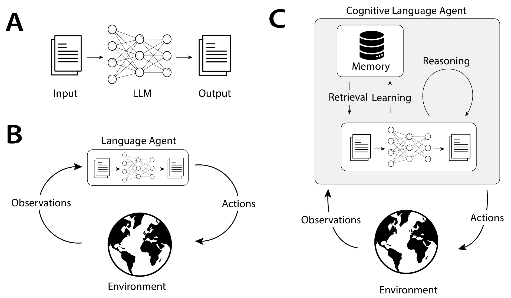

文章原文在 https://arxiv.org/abs/2309.02427 ，AI 翻译的中文版  https://github.com/AlexStocks/agent-memory/blob/main/starting/CoALA_%E5%85%A8%E6%96%87%E8%AF%A6%E7%BB%86%E7%BF%BB%E8%AF%91.md 。

2. **A Survey on the Memory Mechanism of LLM based Agents**（arXiv:2404.13501）
  
该领域**第一篇系统性综述**：记忆分类、读写机制、评估基准（LoCoMo/LongMemEval/DMR）一次讲清，适合当"地图"反复翻。

原文在 https://arxiv.org/abs/2404.13501 ，AI 翻译的中文版 https://github.com/AlexStocks/agent-memory/blob/main/starting/LLM-Agent-Memory-Survey-2404.13501-%E5%85%A8%E6%96%87%E4%B8%AD%E6%96%87%E7%BF%BB%E8%AF%91.md 。

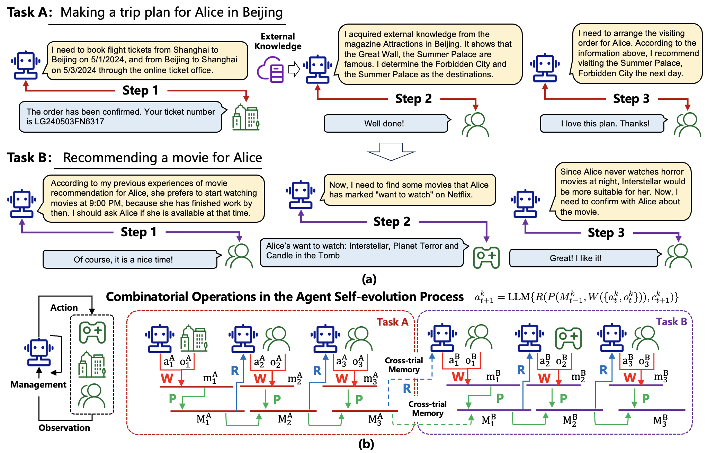

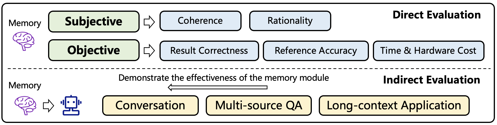

## 二、经典论文：七条奠基路线

| 论文                            | 贡献一句话                                                   | 链接             |
| ------------------------------- | ------------------------------------------------------------ | ---------------- |
| **Generative Agents** (UIST'23) | 记忆流 memory stream + reflection 反思 + recency/importance/relevance 三级检索——几乎所有后续记忆设计的源头 | arXiv:2304.03442 |
| **MemGPT** (2023)               | "LLM 即 OS、上下文即 RAM、外存即磁盘"的虚拟上下文管理，agent 自己决定换页 | arXiv:2310.08560 |
| **Mem0** (ECAI'25)              | 生产级记忆流水线：抽取→更新(ADD/UPDATE/DELETE 工具调用)→检索，LoCoMo 上 token 省 90%+ | arXiv:2504.19413 |
| **Zep/Graphiti** (2025)         | **双时态知识图**：事实带 valid/expired 窗口，能答"上周二 agent 以为什么是真的" | arXiv:2501.13956 |
| **A-MEM** (NeurIPS'25)          | Zettelkasten 卡片盒：记忆动态建链+演化，不再只读             | arXiv:2502.12110 |
| **Memory for Autonomous LLM Agents** (2026) | `write–manage–read` 闭环 + 时间范围/表示载体/控制策略三维分类 + 四层评估栈 | arXiv:2603.07670 |
| **Agent Memory in the Second Half** (TMLR'26) | 以 218 篇论文建立“载体 × 认知机制 × 记忆主体”全景图，并把记忆策略学习与真实环境扩展纳入主线 | arXiv:2602.06052 |

### 2.1 Generative Agents（"斯坦福小镇"，arXiv:2304.03442）

**一句话定位**：把大语言模型接上"记忆流 + 反思 + 规划"三件套，25 个智能体在《模拟人生》式小镇里自发生活两天——首次证明这三个组件对"行为可信度"有**因果贡献**，而不只是让模型看起来更聪明。

AI 翻译的中文版 https://github.com/AlexStocks/agent-memory/blob/main/starting/Generative-Agents_2304.03442_%E5%85%A8%E6%96%87%E8%AF%A6%E7%BB%86%E7%BF%BB%E8%AF%91.md 。

#### 2.1.1 要解决的核心问题

LLM 能在**单个时间点**生成像人的行为，但一放到长时间跨度和多个智能体交互中就崩：会重复吃三顿午餐、记不住昨天约了谁、行为缺乏长期弧线。论文认为根因不是模型不够强（连 GPT-4 也有这问题），而是**缺架构**：需要一个能管理持续增长记忆、并按需检索合成的框架。

#### 2.1.2 架构三件套

| 组件 | 设计要点 |
|---|---|
| **记忆流** | 自然语言存经验全量；每条含描述 + 创建时间 + 最近访问时间 |
| **检索** | `score = 近因性 + 重要性 + 相关性`（α 全为 1，min-max 归一化）。近因性：0.995 指数衰减；重要性：让 LLM 打 1–10 分（"打扫房间"=2，"约暗恋对象"=8）；相关性：嵌入余弦相似度 |
| **反思** | 取最近 100 条记忆 → LLM 提 3 个高层问题 → 用问题去检索（含已有反思）→ 生成带引用指针的洞见 → 形成**反思树**（叶=观察，非叶=逐级抽象的想法）。触发条件：近期事件重要性分之和 > 150，实践中每天约 2–3 次 |
| **规划** | 自顶向下递归分解：一天的 5–8 个粗块 → 小时级 → 5–15 分钟级；规划本身也写回记忆流并参与检索 |
| **反应 / 对话** | 每步判断"继续计划 or 反应"；反应时从该时刻重新生成规划；对话以双方对彼此的摘要记忆 + 对话历史为条件逐句生成 |

**关键类比**：反思不是"总结"，是**递归抽象**——反思可以对反思再反思，这才是 Maria 能推断出"该送 Wolfgang 音乐作曲相关礼物"的原因（纯观察记忆只会选"见面最多的人"）。

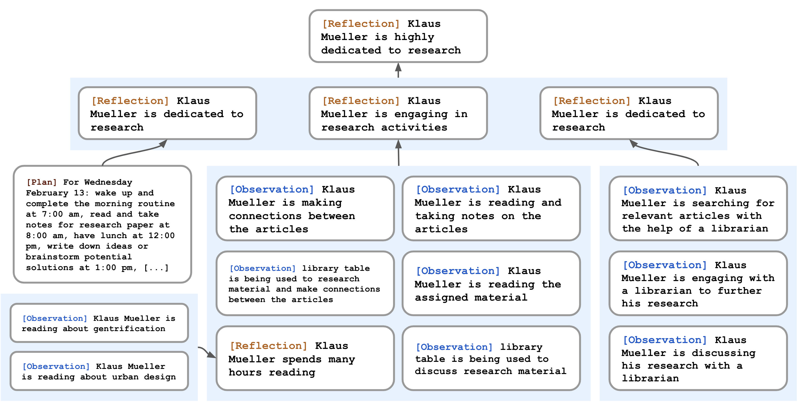

#### 2.1.3 实验结果

- **受控评估**（100 名评估者排序，TrueSkill）：完整架构 μ=29.89 > 无反思 26.88 > 无反思无规划 25.64 > **人类众包 22.95** > 完全消融 21.21。与"代表先前工作"的完全消融条件相比 **Cohen's d = 8.16（八个标准差）**，Kruskal-Wallis H(4)=150.29, p<0.001。
- **端到端两天模拟**：Sam 参选消息扩散 4%→32%，派对消息 4%→52%（零用户干预）；关系网络密度 0.167→0.74；12 位受邀者中 5 位到场——全部从"Isabella 想办派对"这一条种子自然长出来。
- **三种失效模式**（7.2）：① 记忆变多后反而选错地点；② 难以用自然语言传达的物理规范导致误判（"宿舍浴室"被当成多人用、商店打烊后仍进店）；③ 检索不到 / 检索到碎片 → 幻觉式添油加醋。

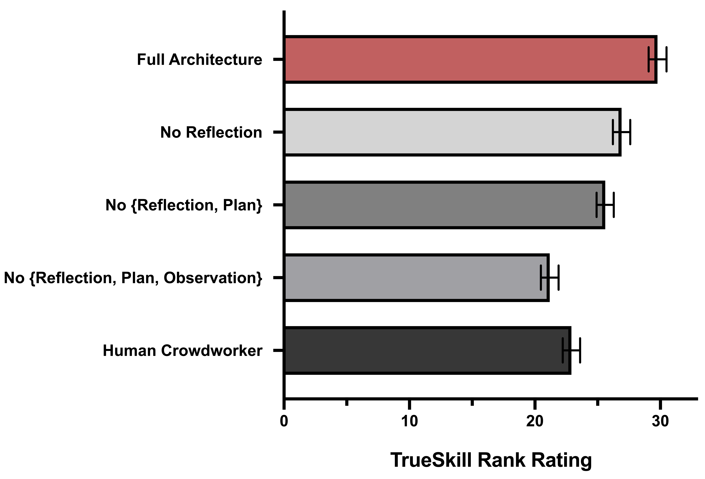

### 2.2 MemGPT: Towards LLMs as Operating Systems（arXiv:2310.08560）

**一句话定位**：把操作系统的**虚拟内存分页**搬进 LLM——上下文窗口当主存、外部存储当磁盘，让 LLM **自己**通过函数调用做换页，从而在固定上下文下撑出"无限上下文"的假象。UC Berkeley 出品，项目后更名 Letta。

AI 翻译的中文版 https://github.com/AlexStocks/agent-memory/blob/main/starting/MemGPT_2310.08560_%E5%85%A8%E6%96%87%E8%AF%A6%E7%BB%86%E7%BF%BB%E8%AF%91.md 。

#### 2.2.1 要解决的核心问题

不是"模型不够聪明"，而是**容量硬约束 + 扩展不划算**：自注意力让扩上下文成本二次方增长；即便扩了，Liu et al. 2023 也证明长上下文模型用不好中段信息（lost-in-the-middle）。所以论文走"**在固定上下文模型之上加一层内存管理**"的路线，而不是等更长的模型。

#### 2.2.2 架构

| 组件 | 设计要点 |
|---|---|
| **主上下文（三层）** | ① 系统指令（只读：控制流 + 存储层级说明 + 函数用法）② 工作上下文（固定大小读写块，存用户事实/偏好/人设）③ FIFO 队列（滚动消息 + **队首递归摘要**） |
| **外部上下文** | 召回存储（消息库，无限期保留）+ 归档存储（任意长文本对象 + 向量检索，PostgreSQL + pgvector + HNSW） |
| **内存压力机制** | 达 70% → 插系统告警，让 LLM 主动把重要信息写进工作上下文/归档；达 100% → 驱逐约 50% 消息并 **重生成递归摘要**（旧摘要 + 被驱逐消息） |
| **自我导向编辑** | 输出被解析成函数调用 → 执行 → **结果连同运行时错误反馈回处理器**（反馈回路）；系统提示里明确告诉 LLM token 限制 |
| **事件驱动控制流** | 用户消息 / 系统消息 / 用户交互 / **定时事件**都能触发推理（可无用户干预运行）；`request_heartbeat=true` → 函数链（多步检索）；不给 → yield 等下一个事件 |
| **分页检索** | 检索结果强制分页，防止溢出上下文窗口 |

**关键洞见**：内存管理不是"系统替模型做"，而是**交给模型自己做**——编译器式的自动换页换成了"LLM 自己决定什么时候存、存什么、什么时候继续翻页"。这也是它最大的脆弱点（见第 4 点）。

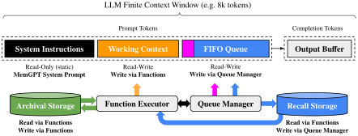

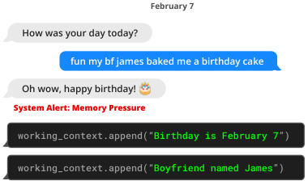

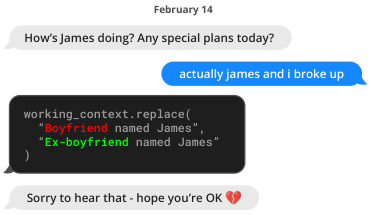

#### 2.2.3 实验结果

- **DMR 深度记忆检索（一致性）**：GPT-4 32.1% → **92.5%**；GPT-4 Turbo 35.3% → **93.4%**；GPT-3.5 38.7% → 66.9%（ROUGE-L 同步大涨）。注意基线拿到的是"过去五轮对话的摘要"，MemGPT 拿到的是完整历史但必须自己检索——**差距几乎全部来自"能否把对的记忆换进上下文"**。
- **嵌套 KV 多跳检索**：GPT-3.5 在 1 层嵌套就 0%（失效模式是直接把原始值返回）；GPT-4 / GPT-4 Turbo 在 3 层掉到 0%；**MemGPT + GPT-4 不受嵌套层数影响**。反常的是 MemGPT + GPT-4 Turbo 反而差于 + GPT-4——长上下文不是越强越好，函数调用策略才是瓶颈。
- **文档 QA**：固定上下文基线的准确率**上限被检索器性能锁死**（检索器没召回金标准文档就注定答错）；MemGPT 可多次调用检索器迭代翻页，性能不随文档数增加而退化。

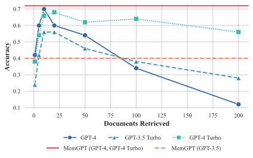

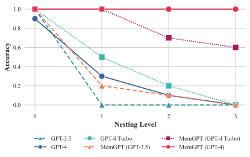

#### 2.2.4 关键局限

① 性能**强依赖底层模型的函数调用能力**（GPT-3.5 上大幅掉点）；② MemGPT **经常在耗尽检索库之前就停止翻页**——理论上能翻完，实际上不等于会翻完；③ 仍受嵌入检索质量制约。

#### 2.2.5 高价值部分

- 这是 **2404.13501 综述框架里"文本形式记忆 + 写入/管理/读取"的完整工程实现**：递归摘要 ≈ 管理操作里的"遗忘/合并"，归档/召回双库 ≈ 记忆来源的"跨试验信息 + 外部知识"，分页检索 ≈ 读取操作。
- 对"有界召回"的直接启发：MemGPT 证明了**告警阈值（70%）+ 强制递归摘要**是个可用的工程范式，代价是摘要会丢信息。
- 内存压力告警：prompt token 达 70% → 插入系统告警，让 LLM 主动把重要信息写入工作上下文/归档；达 100% → 驱逐约 50% 消息并生成新的递归摘要

### 2.3 Mem0（LoCoMo 基准上的长期记忆架构，arXiv:2504.19413）

**这是你竞品清单里 mem0 的官方论文**——Mem0 AI 团队，2025-04，在 **LOCOMO** 上跑了 6 类基线的系统对比。

AI 中文翻译版 https://github.com/AlexStocks/agent-memory/blob/main/starting/Mem0_2504.19413_%E5%85%A8%E6%96%87%E8%AF%A6%E7%BB%86%E7%BF%BB%E8%AF%91.md 。

#### 2.3.1 两套架构

| | **Mem0** | **Mem0ᵍ** |
|---|---|---|
| 表示 | 自然语言稠密记忆（事实条目） | 有向带标签图：实体节点（类型+嵌入+时间戳）+ 关系三元组边 |
| 抽取 | 输入 = 对话摘要 S（**异步刷新**）+ 近 m=10 条消息 + 新消息对 → LLM 抽候选事实 | 两阶段：实体抽取器 → 关系生成器 |
| 更新 | 检索 top s=10 相似记忆 → **LLM 通过 tool call 自选 ADD / UPDATE / DELETE / NOOP**（不用单独分类器） | 相似度阈值判节点复用 → **冲突检测** → LLM 消解器把冲突关系**标记为无效而非物理删除**（保留时间推理能力） |
| 检索 | 向量相似度 | **双路**：① 实体锚点 + 出入边子图展开；② 查询整体编码 vs 三元组文本编码相似度 |
| 引擎 | GPT-4o-mini + 稠密向量库 | GPT-4o-mini（function calling）+ **Neo4j** |

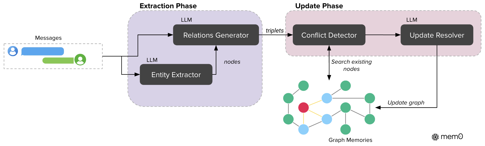

#### 2.3.2 核心结果（LOCOMO，整体 J 分数）

- **Mem0ᵍ 68.44** > Mem0 66.88 > Zep 65.99 > LangMem 58.10 > OpenAI 52.90 > A-Mem 48.38 > 最佳 RAG 约 61
- **全上下文 72.90 最高，但 p95 总延迟 17.1 秒**；Mem0 只 **1.44 秒（−91%）**，搜索 p50 **0.148s** 全场最低
- 分类别：Mem0 强在**单跳 67.13 / 多跳 51.15**；Mem0ᵍ 强在**时序 58.13（全场最高）/ 开放域 75.71**（开放域仍略逊 Zep 76.60）

#### 2.3.3 最值得记住的三个反直觉结论

1. **图记忆在多跳上反而拖后腿**（Mem0ᵍ 47.19 < Mem0 51.15）。关系结构只在**时序**任务上真正兑现价值——结构化不是万能，要看任务类型。
2. **全上下文仍然是准确率天花板**（J 72.90），记忆系统的胜场在**成本而非质量**：p95 从 17s 打到 1.4s。
3. **Zep 的记忆图烧掉 600k+ token**（是 Mem0 的 85 倍，比原文全文还多 20 倍），且添加记忆后**要等数小时**才能正确检索——异步图构建的运维代价暴露得很彻底；LangMem 搜索 p95 达 59.8s，基本不可用。

#### 2.3.4 与你主线的关联

- **最直接的对照点是"更新阶段的四操作"**：Mem0 让 LLM 自己判 ADD/UPDATE/DELETE/NOOP，且冲突时**标无效而不删除**——这正好是 PowerContext 的 Flush 阶段要回答的问题，也是它**没有 Source 证据链**的短板所在（删/标无效都不可回溯到原始消息）。
- Mem0 的抽取阶段用"**对话摘要 + 近期消息 + 新消息对**"三重上下文，与 PC 的 Capture/Prepare Context 分层思路同构，可作为有界召回的输入设计参考。
- 论文对 **MemGPT 的复现结论**也在这张表里：MemGPT 在 LOCOMO 上单跳 J 未报、多跳 9.15 F1、时序 25.52 F1——**明显弱于 A-Mem/Mem0 这一代**，说明"OS 式换页"路线在纯对话记忆场景不如"事实级抽取 + 图"路线。

### 2.4 Zep / Graphiti（arXiv:2501.13956）

Zep/Graphiti 和 Mem0ᵍ 同属"图记忆"路线，但差异化卖点是**双时态（bi-temporal）**——事实不只存"当前值"，还存"何时为真、何时失效"，所以能回答"上周二 agent 以为什么是真的"。

AI 中文翻译版 https://github.com/AlexStocks/agent-memory/blob/main/starting/Zep_2501.13956_%E5%85%A8%E6%96%87%E8%AF%A6%E7%BB%86%E7%BF%BB%E8%AF%91.md 。

#### 2.4.1 架构：三层子图 + 四个时间戳

| 层 | 作用 |
|---|---|
| **情节子图 𝒢ₑ** | 原始消息/文本/JSON，**非损存储**，是抽取的原料；带参考时间戳 t_ref（用来解析"下周四""两周前"） |
| **语义实体子图 𝒢ₛ** | 实体节点（1024 维嵌入 + 全文索引 + LLM 消解）+ 事实边；同一事实可在多实体间重复抽取 = **超边** |
| **社群子图 𝒢𝒸** | 实体聚类 + 高层摘要；用**标签传播**而非 Leiden，因为标签传播能"单步动态扩展"（新节点直接归给邻居占多数的社群），代价是社群会漂移，仍需周期性重建 |

**双时态是核心**：边上有 4 个时间戳——`t_valid`/`t_invalid` 属事件时间线 T（事实在真实世界里何时成立），`t′_created`/`t′_expired` 属摄取时间线 T′（系统何时写入/失效）。

**边失效机制**（全文最有价值的一点）：新边进来 → LLM 比对语义相关的旧边 → 若发现时间上重叠的矛盾 → 把旧边的 `t_invalid` 设为新边的 `t_valid`，**不物理删除**，且按 T′ 始终优先新信息。→ 既保留当前状态，又保留演化历史。

#### 2.4.2 检索：f(α) = χ(ρ(φ(α)))

- **搜索 φ（三路并行）**：余弦语义 + BM25 全文 + **图上 BFS**。BFS 是亮点——可以拿"最近的情节"当种子，把刚提到的实体关系捞回来。
- **重排序 ρ**：RRF / MMR / 情节提及频次 / 节点距离 / cross-encoder（最贵）。
- **构造器 χ**：事实带 `valid_at–invalid_at` 区间，实体带 name+summary，社群带 summary。
- 写入图谱用**预定义 Cypher**，不让 LLM 生成查询（保模式一致、降幻觉）。

> **注**：Zep 论文 12 页 3 表、**原论文没有任何图形 figure**，下面这张是依据 §2 与 §2.3 自绘的架构示意图（非论文原图）。

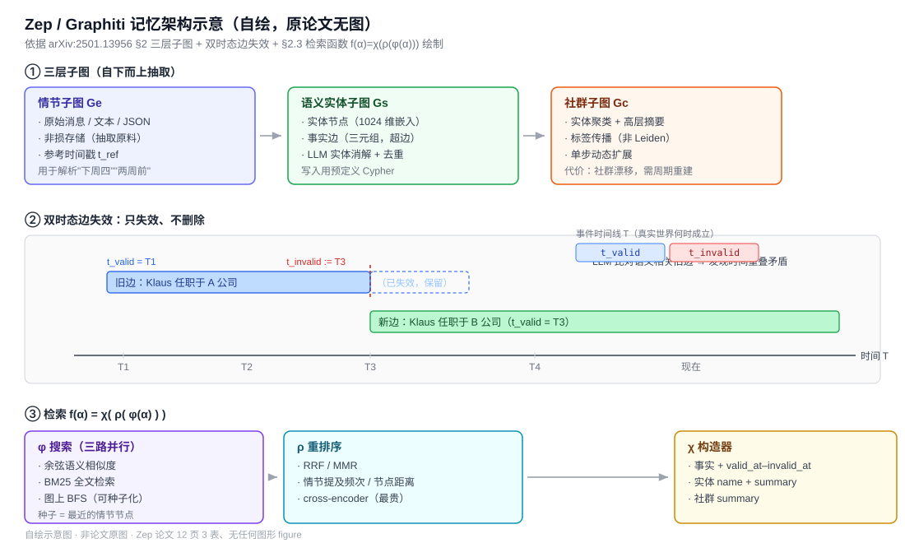

#### 2.4.3 实验结果

**DMR**（他们自己都说这个基准太弱）：Zep 94.8%（gpt-4-turbo）/ 98.2%（gpt-4o-mini），对比 MemGPT 93.4%、全上下文 94.4%。论文诚实指出——每段对话才 60 条消息，全上下文就能打满，这基准测不出东西。

**LongMemEvalₛ**（平均 115k token，这才是主战场）：

| 模型 | 全上下文 | Zep | 延迟 | 上下文 |
|---|---|---|---|---|
| gpt-4o-mini | 55.4% | **63.8%**（+15.2%） | 31.3s → **3.20s** | 115k → **1.6k** |
| gpt-4o | 60.2% | **71.2%**（+18.5%） | 28.9s → **2.58s** | 115k → **1.6k** |

分类别看：时序推理 +48.2%、偏好类 +77.7%（gpt-4o +184%）涨得最猛；**single-session-assistant 反而下降 17.7%**（gpt-4o），这是唯一的显著例外，论文认了。

#### 2.4.4 高价值部分

- Zep 的"**只失效不删除 + 保留时间区间**"正是 Flush 阶段冲突处理的参照系——比 Mem0ᵍ 的"标无效"更进一步，因为它带真实时间区间。还要注意，Zep 并非完全没有 Source 证据：论文 §2.1 明确描述了 episode 与派生实体/语义边的双向索引，可从派生事实回溯原始 episode。它没有直接覆盖的是更完整的治理链，例如不可变 revision、抽取模型/提示版本、访问决策与删除证明。
- 论文对基准的批评值得记：它说现有基准多是"大海捞针式事实检索"，**没有一个能评估"对话 + 结构化业务数据"的综合能力**。
- 论文还提到一件事：他们想在 LongMemEval 上对比 MemGPT，但 MemGPT 不支持导入历史消息，硬塞进 archival 后跑不通。

### 2.5 A-Mem（arXiv:2502.12110，NeurIPS 2025）

agiresearch/A-mem 把 **卡片盒笔记法（Zettelkasten）** 搬进 agent 记忆，并 **点名批评** Mem0 那类图数据库方案——"依赖预定义 schema 与关系，从根本上限制适应性"。

AI 中文翻译版 https://github.com/AlexStocks/agent-memory/blob/main/starting/A-Mem_2502.12110_%E5%85%A8%E6%96%87%E8%AF%A6%E7%BB%86%E7%BF%BB%E8%AF%91.md 。

#### 2.5.1 它要解决什么

现有记忆系统（含 Mem0 的图方案）要求开发者**预先定义存储结构、指定写入点、确定检索时机**。作者举的例子很直白：智能体学到一种新的数学解法时，现有系统只能把它塞进预设分类，**无法随着知识演进而长出新的组织方式**。

#### 2.5.2 核心机制：四步

| 步骤 | 做什么 |
|---|---|
| **① 笔记构建** | 每条记忆 = `{内容 c, 时间戳 t, 关键词 K, 标签 G, 上下文描述 X, 嵌入 e, 链接集 L}`。K/G/X 都由 LLM 自动生成；嵌入 `e = enc(concat(c,K,G,X))`——**注意不是只编码原文**，富化属性一起进向量 |
| **② 链接生成** | 嵌入相似度先粗筛 top-k → LLM 判断是否真的该建链（能识别嵌入看不出的因果/概念关联） |
| **③ 记忆演化（最独特点）** | 新记忆进来后**回头改写已有近邻记忆的 context / keywords / tags，并原地替换**。论文说这模拟人类学习，能涌现"更高阶模式" |
| **④ 检索** | 查询嵌入 top-k；命中一条后，**同一"盒子"内链接的记忆自动一并召回** |

**"盒子"（box）**是它对 Zettelkasten 的扩展：相似上下文描述的记忆聚成 box，但**一条记忆可以同时属于多个 box**——传统卡片盒是一张卡放一个位置。

#### 2.5.3 结果（LoCoMo，GPT-4o-mini F1）

| 类别 | MemGPT | A-Mem | 提升 |
|---|---|---|---|
| 多跳 | 26.65 | **27.02** | 略胜 |
| 时序 | 25.52 | **45.85** | **+80%** |
| 单跳 | 41.04 | **44.65** | +9% |
| 对抗 | 43.29 | **50.03** | +16% |

- **成本才是杀手锏**：每次记忆操作约 **1,200 token** vs 基线 **16,900**（降 85–93%），单次 < $0.0003；本地 Llama 3.2 1B 只要 1.1 秒。
- **扩展性**：100 万条记忆时检索 **3.70 μs**，ReadAgent 需要 **120 ms**——差 3 万倍。空间复杂度 O(N)，无额外开销。
- **消融**：砍掉链接生成 + 记忆演化，多跳 F1 从 27.02 崩到 **9.65**；两者互补，链接生成是地基、演化是精化。
- **k 的规律**：k 从 10 加到 50，性能先涨后平甚至微降（多跳/开放域最明显），中等 k 最优。

#### 2.5.4 高价值部分

- **A-Mem 的"记忆演化"是原地覆写**——新经验直接改写老记忆的内容与标签，不留版本历史。A-Mem 追求"记忆随理解深化而变形"。
- 它和 Zep 也形成一组对照：Zep 用**结构化的双时态时间区间**回答"当时以为什么是真的"；A-Mem 用**LLM 自主改写**来"让理解自己进化"。前者可审计，后者更灵活但不可回溯。
- **A-Mem 没有为演化后的字段定义 revision / lineage**：context、keywords、tags 被原地改写后，论文没有给出“这次变化由哪条新经验、哪次模型调用产生”的审计结构。Mem0 论文里的事实条目也没有暴露到原始消息的稳定映射；Graphiti / Zep 是三者中的例外，它用 episode 与派生语义产物的双向索引提供了数据谱系，但仍不等于完整治理 provenance。
- 论文自己也承认局限：组织质量受底层 LLM 能力影响，不同模型会生成不同的链接结构。

### 2.6 Memory for Autonomous LLM Agents（arXiv:2603.07670）

**一句话定位**：这是一篇面向工程和评估的短综述。它不再只问“记忆存什么”，而是把智能体记忆写成一个与行动循环耦合的 `write–manage–read` 系统，并明确要求同时优化效用、效率、适应性、忠实性和治理。

原文：https://arxiv.org/abs/2603.07670 。

全文中文翻译：[Memory-for-Autonomous-LLM-Agents_2603.07670_全文详细翻译.md](Memory-for-Autonomous-LLM-Agents_2603.07670_全文详细翻译.md)。翻译固定对应 `v1`（2026-03-08），包含全部正文、公式、2 张论文表格及 63 条英文参考文献。

#### 2.6.1 形式化：记忆不是数据库，而是策略闭环

论文把每一步智能体行为写成：

$$
a_t = \pi_\theta\bigl(x_t,\mathcal{R}(M_t,x_t),g_t\bigr)
$$

$$
M_{t+1}=\mathcal{U}(M_t,x_t,a_t,o_t,r_t)
$$

其中，$\mathcal{R}$ 负责从记忆中读取，$\mathcal{U}$ 负责写入和管理；后者不是简单 append，而是可能包含总结、去重、优先级评分、矛盾处理和删除。智能体依据记忆行动，行动结果又反过来修改记忆，因此一次错误写入可能持续污染后续决策。

论文进一步用 POMDP 类比解释这一点：$M_t$ 相当于智能体对不可完全观测世界维护的 belief state。评价记忆的标准不是“数据库有没有命中”，而是它是否为下一步行动保留了足够统计量。

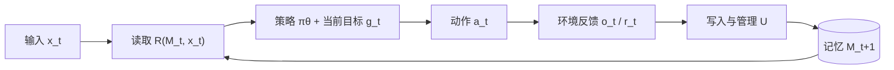

*图 2-1：依据论文 §2 重绘的记忆闭环。记忆质量最终要通过行动质量验证。*

#### 2.6.2 三维分类法

| 维度 | 回答的问题 | 主要类别 |
|---|---|---|
| **时间范围** | 记忆在多长时间尺度上工作？ | 工作、情节、语义、程序记忆 |
| **表示载体** | 记忆以什么形式存在？ | 上下文文本、向量索引、结构化存储、可执行仓库、混合存储 |
| **控制策略** | 谁决定写入、召回和遗忘？ | 启发式规则、提示驱动的自我管理、端到端学习策略 |

这个分类法的价值在于把经常混在一起的三个问题拆开。例如，程序记忆可以保存在 Markdown、数据库或代码仓库中；“程序”描述它的认知用途，“代码仓库”描述表示载体，“由 agent 自主写入还是人工审批”则属于控制策略。

#### 2.6.3 从召回率转向四层评估

论文认为 Precision@$k$、nDCG 等经典检索指标只能说明“是否找到了文档”，不能说明 agent 是否正确使用了它，也不能回答这次检索是否值得增加延迟。它建议使用四层指标栈：

1. **任务效用**：成功率、事实正确性、计划完成率；
2. **记忆质量**：召回准确率、矛盾率、陈旧分布、任务事实覆盖率；
3. **效率**：单次记忆操作延迟、注入 token、每步检索次数、存储增长；
4. **治理**：隐私泄漏、删除合规、访问作用域违规。

它还比较 LoCoMo、MemBench、MemoryAgentBench 和 MemoryArena，强调一个很重要的变化：**被动回答“你记得什么”与在多阶段任务里主动使用记忆，是两种不同能力**。在论文引用的结果中，一些在 LoCoMo 上接近饱和的模型，在 MemoryArena 的相互依赖任务上会掉到 40%–60%。这个数字来自该综述引用的 benchmark，使用时仍应回到 MemoryArena 原论文核对模型和实验设置。

#### 2.6.4 工程价值与证据边界

- 写入路径要做过滤、规范化、去重、优先级评分和 metadata 标注；
- 读取路径可以使用两阶段召回、retrieval-or-not gating、token budget 和热点缓存；
- 长期运行必须处理 temporal versioning、source attribution、contradiction 和 consolidation；
- 每一次 write/read/update/delete 都应可观测，并能重放失败交互；
- 实现上应优先从“Context + Retrieval Store”开始，只有实测证明学习式控制有效时再升级到复杂分层架构。

需要注意两个边界。第一，这是一篇 15 页、单作者、当前仍为 `v1` 的综述，适合建立工程清单，不适合替代对每个项目和 benchmark 的原始论文核验。第二，摘要称深入讨论“五类机制”，但正文 §4 实际列出六个小节，额外包含 parametric memory / weight-based adaptation；本文按正文结构理解，不替作者消解这个计数差异。

### 2.7 A Survey of Agent Memory in the Second Half（arXiv:2602.06052，TMLR 2026）

**一句话定位**：如果 2024 年综述回答的是“记忆从哪里来、以什么形式存、怎样读写”，这篇 90 页综述回答的是“记忆系统在 AI 下半场如何演化、扩展和评估”。它汇集 60 位作者，筛选 2023 Q1 至 2025 Q4 的 218 篇论文，并把记忆策略本身是否可学习放到中心位置。

> **题名校正**：原提纲中的 “Rethinking Memory Mechanisms” 不是 `2602.06052` 的正式题名。arXiv `v4` 的正式题名是 **A Survey of Agent Memory in the Second Half: Towards Self-Evolving and Long-Horizon Agents**；论文发表于 TMLR 2026。

原文：https://arxiv.org/abs/2602.06052 ，OpenReview：https://openreview.net/forum?id=XycbogUAeJ 。

全文中文翻译：[Agent-Memory-in-the-Second-Half_2602.06052_全文详细翻译.md](Agent-Memory-in-the-Second-Half_2602.06052_全文详细翻译.md)。翻译固定对应 `v4`（2026-08-04），包含全部 10 章、6 张表、8 幅 HTML 原图、1 幅 PDF 补图和 535 条英文参考文献。

#### 2.7.1 三维分类：载体、认知机制、记忆主体

| 维度 | 分类 | 设计含义 |
|---|---|---|
| **Memory Substrate** | 外部：向量索引、文本记录、结构化/分层存储；内部：权重、latent state、KV cache | 决定容量、延迟、更新成本、跨会话持久性和可删除性 |
| **Cognitive Mechanism** | 感觉、工作、情节、语义、程序记忆 | 决定信息在感知、当前推理、经验积累、知识抽象和技能复用中的功能 |
| **Memory Subject** | user-centric 与 agent-centric | 区分“为用户个性化”与“让 agent 积累任务经验”两种优化目标 |

这三维是正交的。一个 coding agent 的失败轨迹可以是 agent-centric episodic memory，落在外部文本日志中；一条用户代码风格偏好可以是 user-centric semantic memory，既能放 profile，也能写入参数。只按“向量/图/文本”分类，会丢掉用途和所有权；只按“语义/情节/程序”分类，又会丢掉运行成本与治理边界。

#### 2.7.2 操作机制：单智能体与多智能体必须分开

对单智能体，论文给出五类操作：

1. **Storage and Index**：决定写什么、怎样编码和建立索引；
2. **Loading and Retrieval**：按查询、状态和预算取回记忆；
3. **Update and Refresh**：面对新证据更新或替代旧内容；
4. **Compression and Summarization**：在固定预算下保留高价值信息；
5. **Forgetting and Retention**：主动淘汰过时、低价值或受政策约束的内容。

多智能体再增加三组独有问题：

- **架构**：private-only、shared workspace、hybrid 或 orchestrated；
- **路由**：由 orchestrator 分配、agent 主动访问，或由记忆内容触发路由；
- **隔离与冲突**：谁能写、谁能读、并发事实如何合并、错误如何通过反馈回路纠正。

这部分比“共享一个向量库”更接近生产现实：共享存储只解决可达性，没有解决所有权、访问控制、一致性和责任归属。

#### 2.7.3 记忆策略也成为学习对象

论文把记忆演化策略分成三个层次：

| 策略 | 学习发生在哪里 | 优点 | 代价 |
|---|---|---|---|
| **Prompt-driven** | 用静态或动态 prompt 指挥抽取、更新、反思和遗忘 | 透明、容易接入 | 易受 prompt 与底层模型漂移影响 |
| **Fine-tuning** | 将记忆操作策略内化进参数 | 推理时更顺滑，减少显式编排 | 更新昂贵，边界和遗忘更难审计 |
| **Reinforcement learning** | 把 write/read/update/forget 当成步骤级或轨迹级动作 | 可直接优化长期任务回报 | 奖励设计、训练成本和策略稳定性困难 |

这里的核心变化是：记忆系统不再只优化“存储内容”，还开始学习**何时记、记成什么、何时取、什么时候忘**。这也是它所说的 self-evolving agent 的真正含义，而不是简单地让 memory store 越积越多。

#### 2.7.4 评估版图与六个未来方向

论文把 benchmark 分成两大类：

- **user-centric**：多会话个性化、事实/偏好、时间更新、压缩、遗忘、abstention；
- **agent-centric**：文本多跳、Web/GUI、OS/App、coding、机器人、游戏、长视频和研究任务中的状态保持与行动成功。

这个拆分很重要。前者的 ground truth 会随用户变化；后者通常由环境状态和任务完成条件判定。一个系统在 LoCoMo 上擅长用户事实召回，并不能推出它在 SWE-bench、WebArena 或 OSWorld 中能维持长期执行状态。

论文最后提出六条未来路线：

1. 面向持续学习与 self-evolving agent 的记忆；
2. 多人与多智能体记忆组织；
3. 记忆基础设施和效率；
4. 终身个性化与可信记忆；
5. 多模态、具身和 world-model agent 的记忆；
6. 更接近真实部署的纵向、闭环、执行式评估。

#### 2.7.5 与前六条路线的关系

这篇论文最大的价值不是再发明一种 store，而是把前面的路线放进同一个坐标系：Generative Agents 属情节/反思路线，MemGPT 属分层工作记忆路线，Mem0 属外部事实管理路线，Zep 属结构化时间记忆路线，A-MEM 属动态组织路线；`2603.07670` 补上工程与评估清单，`2602.06052` 则补上内部记忆、策略学习、多智能体和真实环境扩展。

它的边界也很明确：覆盖面极广意味着单个项目只能得到有限篇幅；表格中的“覆盖某能力”主要来自论文描述，不等于在统一模型、数据和硬件下完成了横向复现。因此，它适合作为索引和研究地图，不应被当成项目性能排行榜。

## 三、开源实现：从论文机制到可运行系统

论文回答的是“一个机制能不能成立”，项目回答的是“这个机制能不能被接入、运行、隔离、观测和删除”。这一章不按 GitHub star 排名：star 会变化，也不能证明记忆质量。下面统一看六件事：**记忆表示、写入、检索、更新/时间语义、作用域、运行边界**。

> **快照说明**：本章按 2026-09-08 的官方仓库与文档整理。项目接口仍在快速变化，尤其要区分论文中的算法、开源仓库和同名托管服务。正文中的“强/弱”是架构判断，不是跨项目 benchmark 排名；不同项目公布的分数不能直接横比。

| 项目 | 它实际是什么 | 主要记忆表示 | 写入方式 | 读取方式 | 最鲜明的取舍 |
|---|---|---|---|---|---|
| **Mem0** | 可嵌入应用的 memory layer，另有托管 Platform | 原子事实；Platform 另有实体共现图 | 从消息抽取，再做 ADD/UPDATE/DELETE/NOOP | 向量、关键词、实体信号融合 | 接入面宽，但抽取与合并判断依赖 LLM |
| **Graphiti** | 时间知识图构建与检索框架；Zep 是其托管产品路线 | episode、entity、temporal fact、community | 增量抽取实体/关系并处理事实失效 | 语义、BM25、图遍历、时间过滤 | 时间与谱系强，但图构建和运维更重 |
| **Letta** | 完整的有状态 agent runtime，不只是 memory SDK | context blocks、消息历史、archival passages/files | agent 通过工具自编辑；可由 sleep-time agent 后台整理 | 常驻块直接注入，历史/归档按需搜索 | agent 自主管理上下文，能力和失败都更依赖模型策略 |
| **LangMem** | LangGraph 生态中的记忆管理库 | profile、collection、episode、prompt rule | 热路径工具写入或后台抽取/反思 | key、语义检索、metadata filter | 语义/情节/程序记忆分得清，但与 LangGraph 结合较深 |

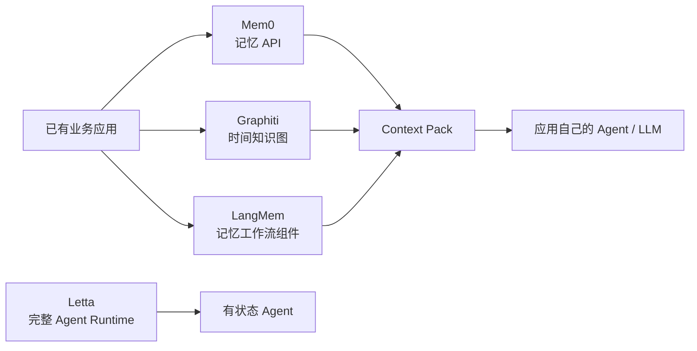

*图 3-1：四个项目处在不同责任层。Mem0、Graphiti 和 LangMem 通常嵌入已有应用；Letta 则把记忆与 agent runtime 一起接管。*

### 3.1 Mem0：把记忆做成应用基础设施

#### 3.1.1 先分清论文、OSS 与 Platform

第二章讲的是 2025 年 Mem0 论文中的 `Mem0` / `Mem0ᵍ`。今天使用项目时，还要再分两层：

- **开源仓库 `mem0ai/mem0`**：应用自行实例化 `Memory`，显式执行 `search` 与 `add`，并选择 LLM、embedding、vector store 等后端。官方最小示例本身就是“先搜索相关记忆 → 注入 system prompt → 生成回答 → 把新一轮对话交给 `add`”。[P-1]
- **Mem0 Platform**：提供托管 API、Dashboard、entity scope 和内建 Graph Memory。Platform 当前的 Graph Memory 已不是论文 `Mem0ᵍ` 那种对外暴露的有类型关系图：它把人物、地点、组织、概念等实体连接到提及它们的 memory，利用共现关系给检索排序加权；搜索结果仍是普通 memory，不返回独立 graph payload。[P-2]

这一区分很重要。不能看到“Graph Memory”四个字，就把论文里 Neo4j 上的关系三元组、开源版的可配置 graph store、Platform 当前的内建实体图当成同一个实现。

#### 3.1.2 一次写入实际发生了什么

Mem0 的主路径可以压成四步：

1. 从新消息中抽取候选事实；
2. 用候选事实搜索已有记忆；
3. 让 LLM 判断新增、改写、删除还是忽略；
4. 保存结果与元数据，供后续检索。

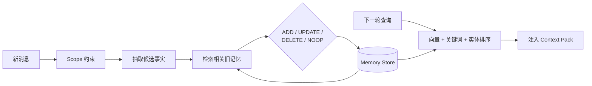

*图 3-2：Mem0 的关键不只是存储，而是抽取、与旧记忆比对、更新决策和下一轮召回组成的闭环。*

这条路径的工程价值是把“记住什么”从每个业务 agent 的 prompt 中抽出来，变成独立 API。代价也同样集中：**错误不再只是一次回答错，而可能被持久化**。抽取遗漏会造成失忆，错误合并会覆盖正确事实，错误删除会让后续每轮都缺上下文。

#### 3.1.3 Scope 不是图里的 entity

Platform 把 `user_id`、`agent_id`、`app_id`、`run_id` 用作存储和查询的隔离维度；它们与文本里抽出来的“张三”“OceanBase”“北京”等 graph entity 是两套概念。[P-3]

可以把两者理解为：

- **scope ID 回答“谁有资格看到哪一组记忆”**；
- **graph entity 回答“这些记忆在谈论谁、什么对象，它们如何关联”**。

把这两层混在一起是多租户记忆系统最危险的错误之一。实体相似不应突破租户、用户、agent 或 run 的权限边界；检索必须先受 scope 约束，再做语义和实体排序。

#### 3.1.4 适用边界

Mem0 适合“给已有应用外挂长期个性化记忆”：客服偏好、用户习惯、跨会话助手、轻量 agent state。它的优势是 API 面直接、集成示例多、读写闭环完整。

它不自动解决下面这些问题：

- 原始消息是否是不可变证据；
- 某条记忆由哪些消息、规则和模型版本推导而来；
- 事实“何时成立”和系统“何时知道”是否分别记录；
- 删除是否覆盖向量索引、图投影、缓存、备份与审计副本；
- LLM 作出的 UPDATE/DELETE 决策如何复核和回滚。

**证据强度：高。** 功能描述由官方仓库、Platform Graph Memory 和 Entity-Scoped Memory 文档交叉确认；“适用边界”是基于这些公开接口作出的工程判断。

### 3.2 Graphiti / Zep：把事实变化本身建模

#### 3.2.1 两个名字不是同一产品边界

- **Graphiti** 是开源的 temporal knowledge graph 框架，需要自己选择并运维图数据库、模型、embedding、API 和多租户外围能力。
- **Zep** 是托管的 context graph 产品路线，官方将规模化存储、治理、低延迟服务和开发工具放在托管层。[P-4]

所以，“Graphiti 支持双时态”可以直接从开源实现验证；“Zep 在某个规模下有某个延迟”则属于供应商部署声明，除非在自己的数据与配置上复现，不能当成 Graphiti 的普遍性能保证。

#### 3.2.2 数据模型：episode 是权威输入，fact 是派生视图

Graphiti 当前把上下文图拆成四类对象：

| 对象 | 职责 |
|---|---|
| **Episode** | 原始摄取单元，可以是 message、text 或 JSON；保存内容、来源描述、摄取时间与事件参考时间 |
| **Entity node** | 从 episode 中解析和去重的实体，可用默认类型或开发者定义的 Pydantic 类型 |
| **Fact / entity edge** | `source entity → relation → target entity`，带 `valid_at` / `invalid_at` 等时间语义 |
| **Community / saga** | 对实体社群或有序 episode 序列做更高层组织与摘要 |

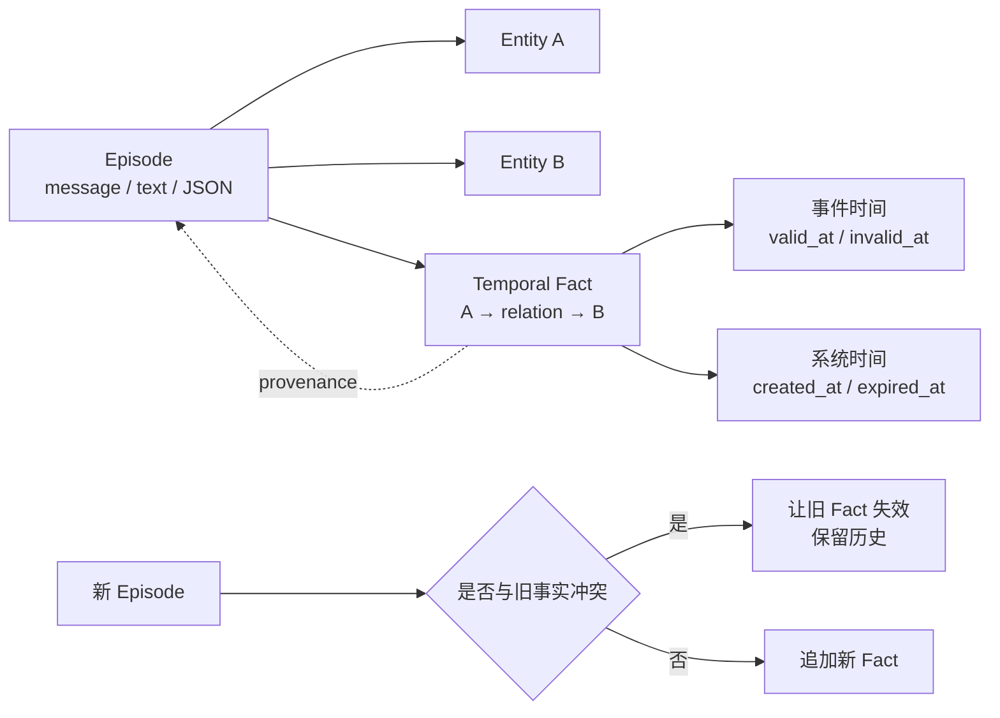

*图 3-3：Graphiti 同时保留原始 episode、派生事实和两条时间线；事实到 episode 的反向边承担数据谱系。*

这也补全了论文部分容易被忽略的一点：当前官方仓库明确把 episode 称为 provenance，并提供 `get_episode_entities` 从 episode UUID 追到由它产生的实体和事实。[P-4][P-5]

更准确的边界是：**Graphiti 有事实到原始 episode 的数据谱系，但 episode provenance 不等于完整治理 provenance**。后者还可能要求不可变制品 revision、内容哈希、签名、摄取者身份、抽取模型/提示版本、访问决策和删除证明。Graphiti 是否满足这些要求，要看外围系统如何保存和约束 episode。

#### 3.2.3 写入与读取

写入时，Graphiti 对新 episode 做实体抽取、实体消歧、关系抽取和冲突处理；同一 `group_id` 的 episode 顺序处理，以减少时间线竞争。新事实与已有事实冲突时，系统可以让旧边失效而不是物理覆盖，从而保留历史。

读取不是“把整个图丢给 LLM”。当前 MCP/核心接口提供：

- 节点搜索：语义 + 关键词 + 图信号；
- 事实搜索：可按 fact 类型、`valid_at` / `invalid_at` 时间范围过滤；
- 中心节点重排：按与指定实体的图距离调整排序；
- episode / edge 定点读取，用于取回证据和解释结果。[P-5]

它比普通向量库多出来的真正能力，不是“图看起来更高级”，而是**事实身份、变化历史、时间过滤和来源 episode 可以同时参与查询**。

#### 3.2.4 成本与风险

- **摄取成本高于纯向量写入**：实体、关系、时间和冲突都可能触发模型调用；批量导入要处理并发、速率限制与失败重试。
- **图是派生判断，不是天然真相**：实体消歧和边抽取错误会形成稳定但错误的结构。
- **图后端是运行责任**：开源版需要 Neo4j、FalkorDB 或 Neptune 等后端；索引、迁移、备份和容量规划不会因为有 SDK 而消失。[P-4]
- **时间正确性需要输入质量**：`reference_time` 缺失或自然语言时间解析错误，会让双时态字段形式完整但语义错误。
- **删除与治理仍要端到端验证**：删除 episode 后，关联边、仅由该 episode 产生的节点、搜索索引、缓存和备份是否都按政策处理，不能只测一个 API 返回 200。

**证据强度：高。** 核心模型、MCP 工具和后端要求均来自官方仓库/文档；性能不作跨项目结论。

### 3.3 Letta：让 agent 自己管理可见上下文

#### 3.3.1 它首先是 runtime，其次才是 memory layer

Letta 延续 MemGPT 的核心假设：模型不仅使用记忆，也通过工具参与管理记忆。当前产品包含 Agent SDK、可自托管 App Server 和托管服务；如果只想要一个 `remember/search` SDK，Letta 往往比需要的边界更大。[P-6]

当前可观察到的主要存储层是：

| 层 | 是否常驻 context | 典型内容 | 访问方式 |
|---|---:|---|---|
| **Memory blocks** | 是 | persona、human、organization、任务状态 | agent 或应用通过 block API 读取/更新；可设只读、挂载/卸载、跨 agent 共享 |
| **Message history / recall** | 部分 | 持续增长的消息与工具轨迹 | runtime 管理窗口内消息，并保留可召回历史 |
| **Archival memory / passages / files** | 否 | 长文本、资料、历史知识 | 通过搜索或文件工具按需取回 |

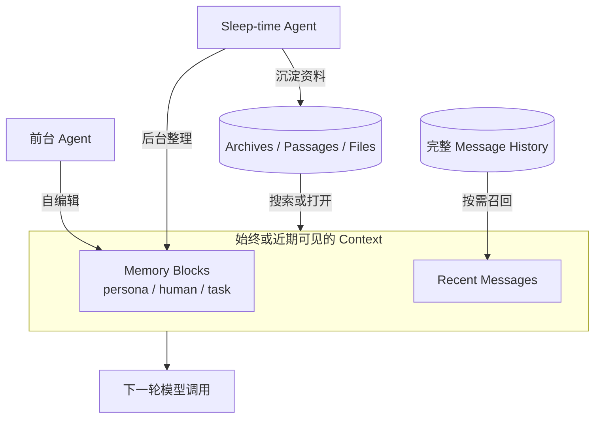

*图 3-4：Letta 把常驻 block、近期消息和外部归档分层，并允许前台或后台 agent 改写记忆。*

Memory block 不是普通数据库行那么简单，它是“预留给模型的上下文区域”：挂载后持续可见，因而适合放身份、用户偏好和当前任务的高价值状态。官方 API 允许一个 block 挂载给多个 agent；一方修改后，其他挂载者看到同一状态。[P-7]

#### 3.3.2 Sleep-time compute 的真实意义

前台 agent 每轮既要回答问题，又要整理记忆，会增加延迟并争夺上下文。Letta 的 sleep-time agent 把一部分反思、归纳和 block 更新移到后台，并与前台 agent 共享记忆。

它解决的是**何时整理**，不是自动解决**整理得对不对**。后台 consolidation 仍然需要：

- 记录输入消息范围与输出 revision；
- 防止旧后台任务覆盖较新的前台更新；
- 对高风险记忆使用人工确认或只追加策略；
- 给失败、重试、重复执行和模型版本漂移留审计信息。

#### 3.3.3 最值得借鉴的不是“三层命名”

Letta 最有价值的工程抽象是：**把“始终可见的少量状态”建成显式对象**。每个 block 有 label、内容、大小限制、描述和访问属性；应用可以控制挂载关系，而不是把所有检索结果临时拼到一个无结构 prompt 中。

这同时暴露了它的核心风险：

- agent 可以自编辑关键状态，错误会被持续放大；
- 多 agent 共享 block 会引入并发写入和所有权问题；
- 常驻 block 占用每一轮 token，必须有严格预算；
- “模型理论上会主动搜索/换页”不等于“模型在所有任务上都会这么做”。

**证据强度：高。** block、archive、共享挂载和 sleep-time agent 均由官方文档/API 交叉确认；对自主编辑风险的判断为架构推论。

### 3.4 LangMem：把记忆类型映射成可组合工作流

#### 3.4.1 三类长期记忆

LangMem 直接采用 semantic / episodic / procedural 三分法：[P-8]

- **Semantic memory**：事实与知识。可以是一个有 schema 的 profile，也可以是持续增长、按需检索的 collection。
- **Episodic memory**：完整保留一次成功交互的情境、思考、动作和结果，用作以后任务的 few-shot 经验。
- **Procedural memory**：改变 agent 行为的规则或 system prompt。它不是“用户喜欢深色模式”这种事实，而是“遇到某类任务应采用什么步骤”。

与原提纲相比，更准确的说法不是“LangMem 是唯一做 procedural memory 的项目”，而是：**在这一组项目中，LangMem 最明确地把 procedural memory 命名为独立类别，并提供 prompt optimization API**。其他系统也能把规则写进 block 或文本，但不一定把它建模成单独的记忆类型。

#### 3.4.2 热路径与后台路径

LangMem 把写入时机也显式拆开：

| 模式 | 谁触发 | 优点 | 风险 |
|---|---|---|---|
| **Hot path** | agent 在当前轮调用 manage-memory tool | 新事实可立即影响后续步骤 | 增加当前轮延迟；模型可能忘记调用或过度写入 |
| **Background** | `ReflectionExecutor` 或独立任务处理对话 | 前台响应快；可批量合并和去重 | 存在延迟可见性、重复任务和版本竞争 |

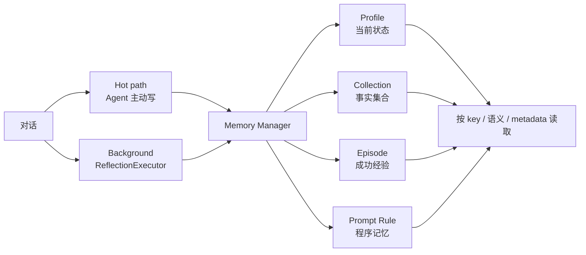

*图 3-5：LangMem 同时把“什么时候写”和“写成哪类记忆”显式建模。*

`create_memory_store_manager` 会搜索相关旧记忆、抽取新信息、更新已有条目，并维护变更历史；存储通过 LangGraph `BaseStore` 的 namespace 组织，支持 key 读取、语义搜索和 metadata filter。[P-8]

#### 3.4.3 Profile 与 Collection 是一个重要取舍

- **Profile** 适合“当前状态”：字段明确、容易整块读取、容易给用户编辑。例如语言、时区、通知偏好。
- **Collection** 适合“不断累积的事实”：单条写入，查询时只取相关项。例如历史事件、做过的决策、多个项目经验。

一个大 JSON profile 看似简单，但并发更新容易互相覆盖，且每轮都加载会越来越贵；collection 可扩展，但依赖召回质量，也更难向用户展示“系统到底记住了什么”。实践中常见做法是：少量强 schema 的 profile + 可搜索 collection，而不是二选一。

#### 3.4.4 适用边界

LangMem 适合已经采用 LangGraph store、namespace 和执行模型的系统。它提供的是记忆管理组件，不是完整的 agent runtime，也不替应用定义租户授权、数据保留、敏感信息策略和可观测性。

**证据强度：高。** 分类、manager、namespace、热/后台写入均来自官方概念与 API 文档；“与 LangGraph 结合较深”是由公共接口直接得出的集成判断。

### 3.5 三个值得单独看的补充项目

#### A-MEM：研究“记忆如何自己长出组织”

A-MEM 仍然是研究自组织记忆的好样本：结构化笔记、语义候选、LLM 建链、旧笔记演化。它适合研究“关联和抽象能否提高经验复用”，但不应直接等同于生产级审计存储。官方仓库也明确把论文复现代码与面向 agent 构建的 memory system 分开。[P-9]

最大的设计分歧仍是**原地演化**：新经验会修改旧 note 的 context、tag 等属性。若业务需要回答“当时系统为什么这样判断”，就必须额外保存 revision 和生成证据，否则演化后的 note 会覆盖当时的解释。

#### Cognee：从数据摄取管线走向共享知识图

Cognee 的主线是 `add → cognify → search/memify`：接收文本、文件等数据，抽取图结构，保存到 graph/vector/relational 后端，再以多种检索模式使用。当前官方入口又把它包装为 `remember / recall / improve / forget`，并区分廉价的 session cache 与可持久化的知识图。[P-10]

它与 Graphiti 的重合点是图与多源摄取，差别在产品重心：Graphiti 把双时态 fact 和 episode provenance 放在中心；Cognee 更强调可组合数据管线、ontology、多个后端和“company brain”式共享知识。选择时要看任务是否真的需要知识抽取管线，而不是只看“都用了图”。

#### Cloudflare：必须区分 Session 与 Agent Memory

Cloudflare 当前有两套相邻但不同的能力：

1. **Agents SDK Sessions API**：保存树状消息、上下文块、FTS、分支和 compaction overlay。压缩时原消息留在 SQLite，读取时用摘要覆盖中间区间，是典型的非破坏式派生视图。该 API 仍位于 `agents/experimental/memory/session`。[P-11]
2. **Agent Memory**：托管的跨会话记忆服务，抽取 fact、event、instruction、task，保存原始消息，并用关键词、topic key、向量和原始消息多路召回。官方文档截至本快照仍标为 private beta。[P-12]

前者主要解决“一个会话怎样持续变长而不爆 context”；后者解决“跨会话怎样形成可检索的长期记忆”。把两者都叫 memory 没错，但它们的生命周期、故障模式和验证方法不同。

### 3.6 怎么选：先选责任边界，再选存储技术

| 你的主问题 | 优先研究 | 原因 | 上线前必须补的验证 |
|---|---|---|---|
| 已有应用要快速加入用户长期偏好 | Mem0 | API 闭环短，scope 与集成面清晰 | 错误写入、跨用户隔离、删除、成本/延迟 |
| 事实经常变化，必须回答“何时为真” | Graphiti | 双时态 fact、失效历史、episode provenance | 时间抽取、回填、冲突、级联删除、图运维 |
| 要构建长期自主运行的 stateful agent | Letta | block、历史、归档和 runtime 在同一控制面 | 自编辑失控、block 并发、上下文预算、模型退化 |
| 已经使用 LangGraph，需要可组合记忆 | LangMem | profile/collection/episode/prompt 直接接 BaseStore | 后台一致性、namespace 隔离、prompt 演化回滚 |
| 多源文档和会话要进入共享知识管线 | Cognee | 摄取、图抽取、ontology、多个检索后端 | 数据血缘、权限传播、重建、后端一致性 |
| 研究自组织与记忆演化 | A-MEM | note linking 与 evolution 是核心实验对象 | revision、可解释性、错误演化和真实负载 |
| 系统已运行在 Cloudflare Agents | Sessions + Agent Memory | 会话压缩和跨会话记忆可分层组合 | beta 变更、平台锁定、删除/导出和故障降级 |

真正稳健的实现通常不是“选一个项目包打天下”，而是组合这些不变量：**原始事件只追加、派生记忆可重建、当前事实有时间语义、检索受 scope 约束、进入 context 的内容有预算和来源、每次变更可审计**。

作为延伸阅读，wal.sh 的《Agent Memory Architectures: JITIR Against the Field》用 **value-oriented（事实作为带时间的值累积）/ place-oriented（在固定位置原地覆盖）** 来比较这些系统，并把主动式 JITIR 与主流的被动召回放在同一张图里。[I-6] 这个视角很适合检查架构取舍，但它属于作者分析；涉及具体项目能力时仍应回到官方仓库、API 和论文。

## 四、Context Engineering：让记忆在正确时机进入上下文

### 4.1 Memory 不等于 Context

可以先用一句公式把两者分开：

> **Memory 是未来可能有用的持久状态；Context 是模型这一轮实际看到的全部 token。**

Context 不只包括记忆，还包括 system/developer 指令、用户消息、历史对话、工具 schema、工具结果、当前计划、检索文档和环境状态。Memory 即使存得完全正确，只要没有在合适的轮次被选进 context，就不会影响模型；反过来，把全部 memory 都塞进 context，也会因为噪声、冲突和注意力稀释而变差。

Anthropic 将 context engineering 定义为：从不断增长的信息空间中，为每次推理挑选和维护最有用的一组 token；核心目标不是最大化 token 数，而是找到能提高目标行为概率的**最小高信号集合**。[C-1]

### 4.2 六种手段解决的是六个不同问题

| 手段 | 解决什么 | 不解决什么 | 主要风险 |
|---|---|---|---|
| **长期记忆** | 跨会话保存事实、事件、规则和经验 | 当前轮是否一定召回正确内容 | 写错后长期污染；scope 泄漏 |
| **JIT 检索** | 只把当前问题相关的信息放进 context | 未召回的内容不可见 | 召回遗漏、排序偏差、查询改写错误 |
| **Compaction** | 把较老的会话压成摘要，延长单会话寿命 | 跨会话知识治理；原文精确查证 | 摘要丢失约束、ID、否定或未决项 |
| **Tool-result clearing** | 删除已经消费过的大块工具输出 | 不能替代长期记忆或完整摘要 | 清早了会失去证据；清晚了浪费窗口 |
| **Prompt caching** | 降低稳定前缀的重复费用和延迟 | 不减少模型实际注意的 token | 把“便宜”误当成“上下文更干净” |
| **Subagent / 隔离执行** | 把高 token 子任务放进独立 context，只回传结果 | 不自动保证结果完整或可信 | 子 agent 丢掉关键约束；汇总失真 |

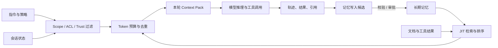

*图 4-1：Memory 只是 Context Pack 的一个输入。权限、信任和预算共同决定这一轮模型真正看见什么。*

Anthropic 的当前文档也把 compaction、context editing 和 memory 明确区分：compaction 总结历史，context editing 选择性清理旧 tool/thinking block，memory 保存跨会话信息；长任务往往三者一起用。[C-2][C-3]

OpenAI Responses API 的 `/responses/compact` 同样说明了这一区别：它返回用于继续会话的压缩对象，目标是延长长任务的有效上下文，而不是创建一个可查询、可治理的用户记忆库。[C-4]

### 4.3 一个更稳定的热 / 温 / 冷分层

把项目里的数据按“是否必须在这一轮可见”分层，比先争论向量库还是图数据库更有用。

| 层 | 典型内容 | 进入 context 的方式 | 写入纪律 |
|---|---|---|---|
| **热：Core / Working Context** | 当前目标、硬约束、主体身份、最近动作、未决问题 | 每轮常驻，严格 token 上限 | 小、结构化、可覆盖但必须有 revision |
| **温：Session / Handoff State** | 当前会话轨迹、计划、工具结果索引、阶段性摘要 | 最近窗口 + compaction + 定点展开 | 原始轨迹只追加，摘要作为 overlay |
| **冷：Durable Memory / Sources** | 跨会话事实、经验、技能、文档、原始证据 | 搜索、图遍历、按 ID 读取、按需加载 | 权威 Source 不可变；派生索引可重建 |

还有一条容易漏掉的旁路：**程序记忆 / Skill**。它不应该与事实检索共用完全相同的排序。用户问“这次发布用什么步骤”，系统应加载受版本控制的 runbook；用户问“上次为什么回滚”，系统应检索事件和证据。两者都可能以 Markdown 保存，但读取合同不同。

### 4.4 一轮可靠的上下文组装过程

可以把每一轮的 Context Pack 看成一个有预算的派生制品：

1. **确定主体与作用域**：tenant、user、agent、project、session、权限和数据地域；
2. **固定硬约束**：system policy、项目指令、工具权限、输出合同；
3. **恢复热状态**：当前目标、已完成动作、未决项和关键 ID；
4. **分析信息缺口**：此轮真正不知道什么，而不是无差别搜索全部记忆；
5. **分路召回**：关键词、向量、实体、时间、直接 ID、技能目录分别检索；
6. **校验与排序**：先做 scope/ACL/trust 过滤，再按 relevance、recency、authority、diversity 排序；
7. **装箱**：在 token 预算内带入内容、来源、时间、置信度和冲突信息；
8. **执行并留痕**：记录本轮使用了哪些记忆、为什么入选、模型做了什么；
9. **提交写入候选**：高风险变更先待审，低风险事实按策略写入；
10. **异步整理**：去重、建图、摘要和 embedding 都作为可重试的派生任务运行。

这个过程里最关键的顺序是：**权限过滤必须早于相关性排序和 prompt 注入**。先从全库搜出“最相关”内容再事后过滤，不仅浪费资源，也更容易在日志、缓存或重排模型中留下越权数据。

### 4.5 Context 侧常见失效模式

#### 失效一：上下文很长，但关键事实不在模型注意力里

长上下文提供容量，不保证利用率。应测“目标证据位于开头、中间、结尾”时的任务表现，而不是只测 token 是否塞得进去。

#### 失效二：Compaction 把“完成了什么”与“准备做什么”混在一起

摘要必须分别保存：已验证事实、已执行副作用、失败命令、当前工作树/资源 ID、未决风险、下一步。否则恢复后最危险的错误不是忘记，而是把计划误当成已经完成。

#### 失效三：检索结果没有时间和来源

“用户使用 PostgreSQL”可能来自三年前；“已通过测试”可能来自旧 commit。进入 Context Pack 的事实至少应带 `source_id`、事件时间、摄取时间、revision/commit 和适用 scope。

#### 失效四：记忆写入成为持久化 prompt injection

外部文档、网页、Issue 评论和工具结果都可能包含指令性文本。抽取器不应把它们直接提升为高优先级程序记忆；事实、引用内容和行为指令必须分类型，并限制谁能写入后两者。

#### 失效五：缓存命中掩盖了上下文污染

Prompt caching 只改变费用与延迟，不会替模型删除低价值 token。评估 context quality 时要同时看 token 构成、任务成功率和引用证据，不能只看 cache hit rate。

### 4.6 应该怎么评估

只跑一个 LoCoMo 总分不够。至少拆成下面六组：

| 维度 | 关键问题 | 可观察指标 |
|---|---|---|
| **召回** | 该来的证据是否进了 Context Pack | Recall@k、MRR、遗漏率、无答案时 abstention |
| **时间** | 能否区分当前事实、历史事实和迟到事件 | 更新题、point-in-time query、backfill 正确率 |
| **冲突** | 新旧信息冲突时是否保留历史且当前值正确 | supersession / retraction / rollback 用例 |
| **隔离** | 不同 tenant/user/agent/session 是否互不泄漏 | 越权检索率、跨 scope 删除与导出测试 |
| **长任务** | compaction 后能否继续正确执行 | 约束保留率、重复副作用率、恢复成功率 |
| **成本与运维** | 质量提升是否值得写入和检索成本 | p50/p95 延迟、token、模型调用数、积压、重试、重建时间 |

其中“重复副作用率”尤其重要：长任务恢复后重复发消息、重复下单、重复 push，比答错一个历史问题严重得多。

## 五、行业实践：从文件约定到记忆治理

### 5.1 CLI coding agent 的现实答案：约定即 schema

截至 2026 年，主流 coding agent 并没有等一个统一 memory protocol 才开始工作，而是围绕文件系统形成了可移植的约定：

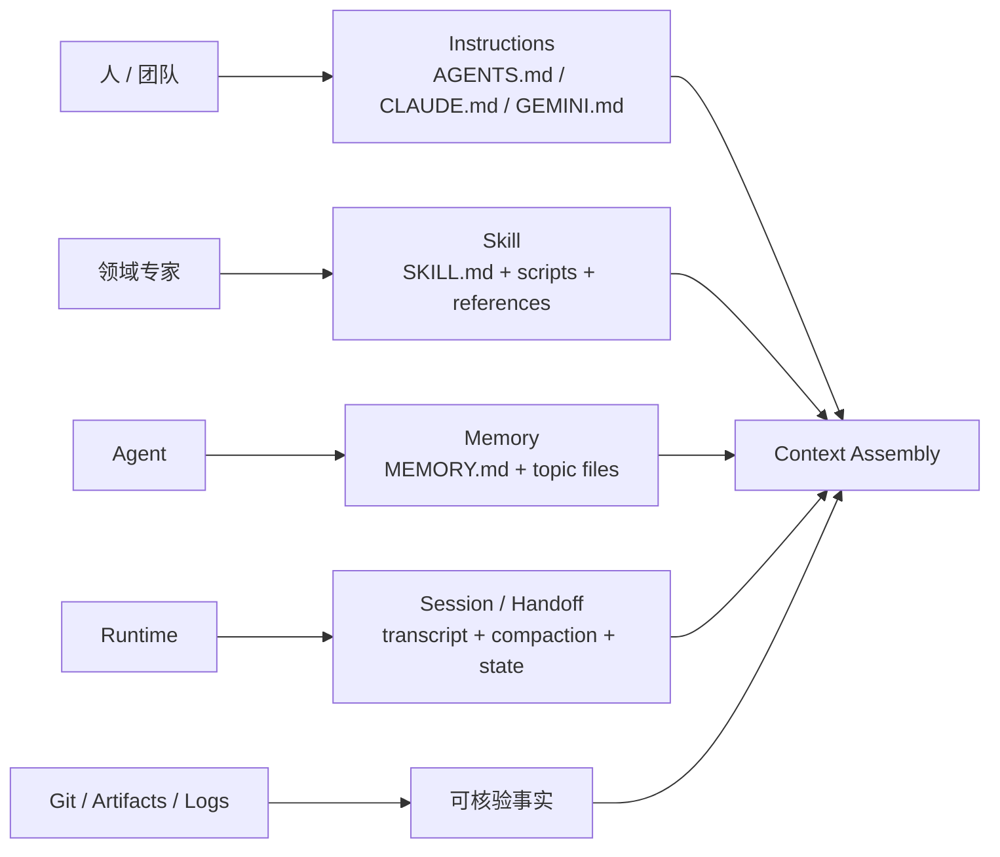

*图 5-1：文件形式相似，但 Instructions、Skill、Memory、Session 和 Evidence 的作者、权限与生命周期不同。*

这个模式能快速普及，是因为 Markdown 可读、可 diff、可进 Git、任何 agent 都能用普通文件工具处理。但“都是文件”不代表它们是同一种 memory。至少要分清四类所有权和生命周期。

### 5.2 四类制品不能混写

| 制品 | 谁写 | 何时读取 | 典型内容 | 最关键的治理 |
|---|---|---|---|---|
| **Instructions** | 人/团队 | 启动或进入目录时 | 架构约束、命令、审查规则 | 层级优先级、变更评审、长度预算 |
| **Memory** | agent 或人确认 | 启动摘要 + 按需读取 | 偏好、排障经验、项目事实 | 来源、过期、作用域、可编辑/删除 |
| **Skill** | 专家/团队 | 任务匹配时渐进加载 | 可重复流程、脚本、参考资料 | 版本、触发边界、依赖和权限 |
| **Session / Handoff** | runtime | 恢复当前任务时 | 已做事项、工具结果、未决项、工作树状态 | 精确 ID、时效、幂等、不得把计划写成完成 |

把 agent 自动总结的“经验”直接写进团队 `AGENTS.md`，等于让一次概率性判断升级为所有人、所有任务的强约束。更稳妥的流程是：先写入可审阅 memory，经过重复证据或人工批准，再提升为 instruction 或 skill。

### 5.3 三个 coding agent 的具体做法

#### Codex：层级 AGENTS.md + 渐进加载 Skills

Codex 官方文档说明，它从全局到项目根目录再到当前工作目录构建 `AGENTS.md` 指令链，越接近当前目录的文件越晚进入 prompt，因而可以覆盖更宽泛的规则；每个目录至多选择一个指令文件，并有总字节预算。[I-1]

Skills 则采用 progressive disclosure：启动时只给模型 name、description 和路径，任务匹配后才读取完整 `SKILL.md`，需要时再下钻 scripts、references 和 assets。[I-2] 这正好体现了 Context Engineering 的基本原则：**高频且短的规则常驻，低频且长的过程按需加载**。

#### Claude Code：人写 CLAUDE.md，agent 写 auto memory

Claude Code 把两者明确分开：

- `CLAUDE.md` 是人维护的 project/user/org instructions；
- auto memory 是 Claude 根据纠正、偏好和排障过程写给未来自己的笔记。

当前文档显示，每个 Git 仓库共享一个 `~/.claude/projects/<project>/memory/`，入口为 `MEMORY.md`，详细内容拆到 topic files；启动只加载 `MEMORY.md` 的前 200 行或 25KB，其余文件按需读取。它也明确说明这些内容是 context，不是强制执行的配置，且 auto memory 默认是本机范围，不自动跨机器/云环境同步。[I-3]

这是一个很成熟的边界：人类规则和 agent 学习不共用一个写权限，也不给长期记忆无限常驻 token。

#### Gemini CLI：GEMINI.md 既是层级上下文，也是简单记忆载体

Gemini CLI 从全局、项目/父目录和子目录发现 `GEMINI.md`，支持 `@file.md` 导入；`/memory show|refresh|add` 用来查看、重载或向全局文件追加事实。`save_memory` 本质上也是把简短事实追加到 `~/.gemini/GEMINI.md`。[I-4]

它的优点是透明、简单；局限也很直接：追加式 Markdown 不自带事实去重、双时态、租户 ACL 或派生索引。适合作为个人 CLI 的小规模记忆，不应未经扩展就当成企业 memory service。

### 5.4 API 层的行业做法：把存储责任留给应用

Anthropic 的 memory tool 提供 `view/create/str_replace/insert/delete/rename` 一类文件操作接口，但由客户端实现 `/memories` 背后的存储，并要求阻止路径逃逸。官方建议把 memory 与 compaction 组合：前者保存必须跨会话存在的信息，后者压缩当前长会话。[I-5]

这种设计很值得注意：模型供应商定义**工具合同**，应用保留**数据控制权**。同一个工具协议可以落在本地文件、数据库、加密对象存储或企业内容系统上。但它仍不是完整的 memory standard，因为协议没有替应用决定：

- 哪些内容值得记；
- 用户、agent、项目和组织作用域如何组合；
- 新事实是追加、覆盖还是让旧事实失效；
- 哪些记忆能自动写，哪些必须审批；
- 删除、导出、保留期和法律留置如何执行；
- 检索结果如何在 token 预算内组装进 context。

### 5.5 为什么还没有真正的“Memory MCP”

MCP 可以把 `remember`、`search`、`forget` 暴露成工具，所以“做一个 memory MCP server”并不难。难的是不同服务对这些动词的语义并不一致。

| 缺口 | 必须回答的问题 |
|---|---|
| **身份与作用域** | memory 属于人、agent、线程、项目、组织还是它们的交集？主体切换后谁还能读？ |
| **事实身份** | 两句相似文本是同一事实的两个版本，还是两个独立事件？ |
| **时间语义** | 何时发生、何时写入、何时失效、何时删除是否分别记录？ |
| **来源与信任** | 来自用户陈述、代码、网页还是模型推断？哪一个可作为权威证据？ |
| **写入与审核权** | 模型能否修改核心身份、团队规则或安全策略？谁批准提升为程序记忆？ |
| **遗忘语义** | soft delete、supersede、hard erase、索引清除和备份到期分别如何证明？ |
| **交换格式** | 导出的是原始 episode、规范化 fact、embedding、图，还是可重放 revision？ |
| **上下文投影** | 谁决定 top-k、token 预算、冲突展示、citation 与 abstention？ |

因此，“memory server 支持 MCP”只是**传输和工具发现兼容**，不是记忆语义互操作。AgentMarketCap 的《The Agent Memory Protocol Gap》抓住了这个问题，但它是行业评论而非标准文本；适合当论点入口，不适合拿其中的市场数字或厂商 benchmark 当事实依据。[I-7]

### 5.6 生产系统的最小基线

一个准备进生产的 agent memory 系统，至少应具备下面这些合同：

1. **权威输入与派生投影分离**：原始消息、文档、工具结果和制品 revision 可重放；embedding、摘要、事实表和图可以重建。
2. **显式作用域**：tenant/user/agent/project/session 是存储和查询条件，不只是 metadata 建议；默认拒绝跨 scope。
3. **明确记忆类型**：fact、event、instruction、task、experience、source 不使用同一套更新规则。
4. **时间与版本**：至少区分事件时间和系统写入时间；覆盖要产生 revision 或 supersession，而不是抹掉历史。
5. **来源可追溯**：每条派生记忆可回到 source/episode，记录抽取器、模型、prompt/schema 版本和置信度。
6. **可控写入**：自动写入有 schema、大小、频率和敏感信息限制；高风险 instruction/identity 变更需要人工确认。
7. **可解释检索**：返回内容之外，还返回 source、score 分解、时间、scope 和选入 Context Pack 的原因。
8. **完整生命周期**：支持查看、纠正、导出、失效、硬删除、保留期和重建；删除验证覆盖所有投影和缓存。
9. **Context budget**：每类内容有独立预算和降级策略；检索失败时允许“不知道”，而不是拿低相关记忆补满。
10. **端到端评估**：从真实入口验证写入 → 延迟可见 → 召回 → 使用 → 更正/删除，而不只测 helper 或向量查询。

### 5.7 六个常见反模式

1. **把所有历史都叫 memory**：消息日志、当前状态、事实、技能和文档的读取合同完全不同。
2. **把“写进向量库”当作记住了**：没有 scope、召回和 context 注入的端到端证明，存储成功没有产品意义。
3. **让模型直接改全局规则**：一次错误推断会影响未来所有任务，应先进入待审 memory，再提升为 instruction。
4. **原地覆盖事实且不留 revision**：当前答案可能正确，但无法回答“当时知道什么”和“为什么改变”。
5. **只做语义相似度**：名称、ID、否定、时间、权限和精确版本往往需要 FTS、filter、graph 或 direct lookup。
6. **拿 vendor benchmark 或 star 做选型**：数据集、judge、模型、top-k、延迟口径和硬件不一致时，数字没有可比性。

### 5.8 一条务实的成熟度路线

如果从零实现，不必第一天就上知识图：

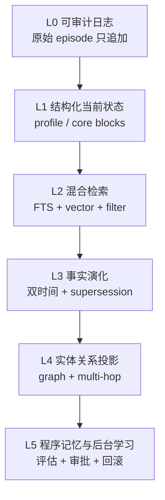

*图 5-2：成熟度不是组件数量，而是从可审计事实逐层增加派生能力，并始终保留回退路径。*

1. **L0：可审计日志**。原始 episode 只追加，带主体、scope、时间和内容哈希。
2. **L1：结构化当前状态**。少量 profile/core blocks，有 schema、revision 和人工编辑入口。
3. **L2：混合检索**。FTS + vector + metadata filter，返回来源并做 Context Pack 预算。
4. **L3：事实演化**。增加 supersession、事件/摄取双时间和冲突展示。
5. **L4：实体与关系投影**。只有多跳、对象关系或时间查询的真实指标证明需要时，再引入 graph。
6. **L5：程序记忆与后台学习**。把经验提升为 skill/prompt 前加入评估、审批、版本与回滚。

这条路线的判断标准不是“架构看起来是否先进”，而是每升一级都能用新的可观察行为证明价值，同时保留回退和重建能力。

## 附录：资料来源与证据边界

来源编号按主题分组：`P` 表示 Projects，`C` 表示 Context Engineering，`I` 表示 Industry Practice。

### 开源实现与平台文档

- **[P-1]** Mem0, *The Memory Layer for AI Agents*, 官方 GitHub 仓库 `mem0ai/mem0`，当前 `main` 快照，访问于 2026-09-08：https://github.com/mem0ai/mem0
- **[P-2]** Mem0, *Graph Memory*, 官方 Platform 文档，当前页，访问于 2026-09-08：https://docs.mem0.ai/platform/features/graph-memory
- **[P-3]** Mem0, *Entity-Scoped Memory*, 官方 Platform 文档，当前页，访问于 2026-09-08：https://docs.mem0.ai/platform/features/entity-scoped-memory
- **[P-4]** Graphiti, *Build Real-Time Knowledge Graphs for AI Agents*, 官方 GitHub 仓库 `getzep/graphiti`，当前 `main` 快照，访问于 2026-09-08：https://github.com/getzep/graphiti
- **[P-5]** Graphiti, `graphiti_mcp_server.py` 中的官方 MCP 工具合同，当前 `main` 快照，访问于 2026-09-08：https://github.com/getzep/graphiti/blob/main/mcp_server/src/graphiti_mcp_server.py
- **[P-6]** Letta, *Documentation: The platform for building stateful agents*, 官方文档，访问于 2026-09-08：https://docs.letta.com/
- **[P-7]** Letta, *Agents / Blocks / Passages API*, 官方 API 文档，访问于 2026-09-08：https://docs.letta.com/api/python/resources/agents
- **[P-8]** LangMem, *Core Concepts* 与 *Memory API Reference*, 官方文档，访问于 2026-09-08：https://langchain-ai.github.io/langmem/concepts/conceptual_guide/ ，https://langchain-ai.github.io/langmem/reference/memory/
- **[P-9]** A-MEM, *Agentic Memory for LLM Agents*, 官方 GitHub 仓库 `agiresearch/A-mem`，当前 `main` 快照，访问于 2026-09-08：https://github.com/agiresearch/A-mem
- **[P-10]** Cognee, *The Open-Source AI Memory Platform for Agents*, 官方 GitHub 仓库 `topoteretes/cognee`，当前 `main` 快照，访问于 2026-09-08：https://github.com/topoteretes/cognee
- **[P-11]** Cloudflare, *Agents SDK Sessions*, 官方文档，最后更新 2026-06-05，访问于 2026-09-08：https://developers.cloudflare.com/agents/runtime/lifecycle/sessions/
- **[P-12]** Cloudflare, *How Agent Memory works*, 官方文档，最后更新 2026-06-02，访问于 2026-09-08：https://developers.cloudflare.com/agent-memory/concepts/how-agent-memory-works/

### Context Engineering 与 coding agent 惯例

- **[C-1]** Anthropic Applied AI Team, *Effective context engineering for AI agents*, 发布于 2025-09-29，访问于 2026-09-08：https://www.anthropic.com/engineering/effective-context-engineering-for-ai-agents
- **[C-2]** Anthropic, *Context editing*, 官方 Claude Platform 文档，当前页，访问于 2026-09-08：https://platform.claude.com/docs/en/build-with-claude/context-editing
- **[C-3]** Anthropic, *Memory tool*, 官方 Claude Platform 文档，当前页，访问于 2026-09-08：https://platform.claude.com/docs/en/agents-and-tools/tool-use/memory-tool
- **[C-4]** OpenAI, *Compact a response*, 官方 Responses API 文档，当前页，访问于 2026-09-08：https://developers.openai.com/api/reference/java/resources/responses/methods/compact
- **[I-1]** OpenAI, *Custom instructions with AGENTS.md*, 官方 Codex 文档，当前页，访问于 2026-09-08：https://learn.chatgpt.com/docs/agent-configuration/agents-md
- **[I-2]** OpenAI, *Build skills*, 官方 Codex/ChatGPT 文档，当前页，访问于 2026-09-08：https://learn.chatgpt.com/docs/build-skills
- **[I-3]** Anthropic, *How Claude remembers your project*, 官方 Claude Code 文档，当前页，访问于 2026-09-08：https://code.claude.com/docs/en/memory
- **[I-4]** Google, *Provide Context with GEMINI.md Files* 与 *Memory Tool (`save_memory`)*，官方 Gemini CLI 文档，访问于 2026-09-08：https://google-gemini.github.io/gemini-cli/docs/cli/gemini-md.html ，https://google-gemini.github.io/gemini-cli/docs/tools/memory.html
- **[I-5]** Anthropic, *Memory tool*, 官方 Claude Platform 文档，当前页，访问于 2026-09-08：https://platform.claude.com/docs/en/agents-and-tools/tool-use/memory-tool

### 二手分析，仅用于提出问题

- **[I-6]** David Walsh, *Agent Memory Architectures: JITIR Against the Field*, 更新于 2026-06-13，访问于 2026-09-08：https://wal.sh/research/2026-agent-memory-systems/
- **[I-7]** AgentMarketCap, *The Agent Memory Protocol Gap: Why There's No 'MCP for Memory' Yet*, 发布于 2026-04-06，访问于 2026-09-08：https://agentmarketcap.ai/blog/2026/04/06/agent-memory-protocol-gap-mcp-letta-memgpt-zep-open-memory-layer

### 来源质量说明

| 来源组 | 权威性 | 用法 | 限制 |
|---|---|---|---|
| 原始论文 | 高 | 算法、实验设置、消融和论文期结论 | 不代表当前产品接口或生产成熟度 |
| 官方仓库 / API 文档 | 高 | 当前对象模型、接口、后端、生命周期 | 主要证明“提供了什么”，不能独立证明性能和可靠性 |
| 厂商 benchmark | 中 | 理解厂商评估口径和目标任务 | 模型、judge、数据处理和硬件不同，不跨项目排名 |
| wal.sh 架构分析 | 中 | value-oriented / place-oriented、JITIR 等观察框架 | 作者分析，不是项目规范或独立复现 |
| AgentMarketCap 行业评论 | 低至中 | 引出 memory 语义标准缺口 | 含市场和性能叙述，本文未用其数字作结论 |

**仍未验证的部分**：本文没有在统一硬件、统一模型、统一 judge 和统一数据预处理下重跑 Mem0、Graphiti、Letta、LangMem、Cognee；因此只比较可从论文、接口和数据模型核实的能力，不给出“最好”或“可安全用于某行业”的结论。涉及合规、删除、隔离和性能时，仍需在目标部署上做端到端验证。
