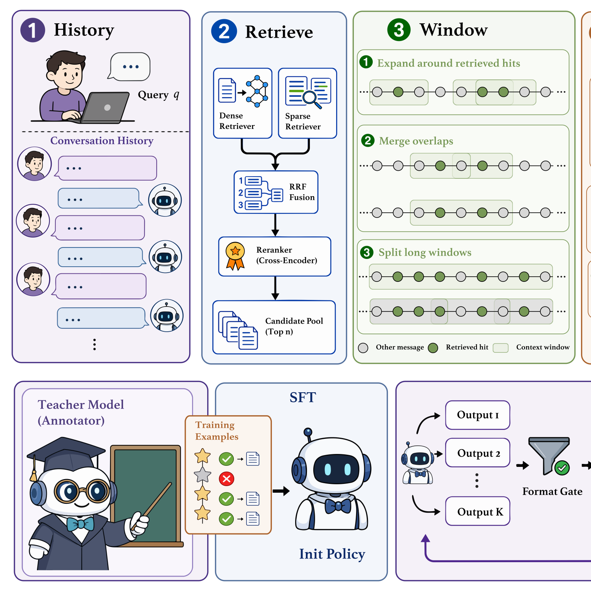
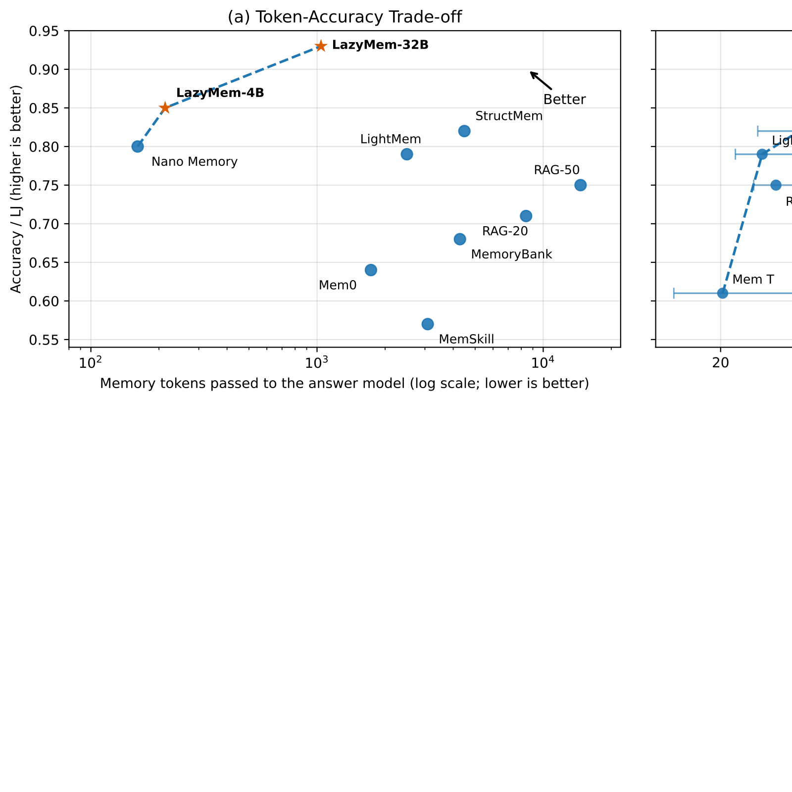

# LazyMem: Retrieve Broadly, Construct Selectively for Efficient Long-Term Agent Memory
## LazyMem：宽泛检索、选择性构造的高效长期智能体记忆

> **论文元信息**
> - **arXiv**：[2607.22690](https://arxiv.org/abs/2607.22690)（v1，2026-07-17 提交；v2，2026-07-28）
> - **分类**：cs.AI
> - **作者**：Jing Yu、Yibo Zhao、Jiaming Zhang、Xiang Li（华东师范大学数据科学与工程学院）
> - **方法名**：**LazyMem**
> - **代码**：https://github.com/allacnobug/LazyMem

> **翻译说明**
> - 本译文基于 arXiv 官方 HTML 全文（`https://arxiv.org/html/2607.22690v1`）逐段翻译，覆盖：**摘要 + 第 1–5 节 + 附录 A–G + 图 1–2 + 表 1–16 及评分子表、提示清单全量内容**；参考文献保留原文编号，不逐条翻译。
> - **插图**：全部 2 张图已下载至 `../images/LazyMem/`，markdown 使用相对路径引用，离线可读；每张图上方保留 `<!-- 原图：URL -->` 注释便于回溯原地址。
> - **公式**：原文 HTML 中 MathML 与 LaTeX 重复渲染的痕迹已清理，统一按 LaTeX 重排为 `$…$` / `$$…$$`；术语首次出现时保留英文原文，其后用中文。

---

## 摘要

长期记忆让 LLM 智能体能够复用过往的交互，但原始对话历史冗长且信息稀疏。宽泛检索能提升证据覆盖度，却会用噪声淹没下游推理；而在写入时压缩虽能减少噪声，却会不可逆地丢弃未来查询可能需要的细节。

我们提出 **LazyMem**，它把所有记忆构造推迟到查询时刻，从而规避这一两难。一个轻量的 4B 模型在重叠的并行窗口中处理被检索出的候选池，仅选择性地保留并压缩与查询相关的内容。该模型通过监督式微调，再结合基于分组的强化学习进行训练，所用奖励是一个「格式门控的复合奖励」，它把衡量选取准确性的、基于规则的动作信号，与衡量来源忠实度与查询效用的、由 LLM 评判的质量信号结合在一起。

在 LongMemEval 基准上，LazyMem-4B 仅用 213 个记忆 token 就取得了 0.85 的 LLM 评判准确率，比仅检索少 68.7×，并在无目标域训练的情况下泛化到 LoCoMo（0.68），同时相比此前的查询时基线降低了平均时延。32B 变体达到 0.93，在聚合密集的题型上超过了基于黄金上下文的参照。本工作的代码公开于 https://github.com/allacnobug/LazyMem。

---

## 1. 引言

通过维护长期记忆，LLM 智能体能够保存与用户过往的交流，并在后续对话中加以利用 (Park et al., 2023; Packer et al., 2024; Zhong et al., 2024)。然而，累积的对话历史可能远超上下文窗口，不加区分地纳入会把相关证据淹没在噪声中。因此，智能体必须检索出其历史中与查询相关的一个子集，并将其纳入当前上下文。这一检索步骤在目的上类似于 RAG，但底层语料的质量与结构有所不同。

传统 RAG 假设使用的是经过整理、信息密集的段落 (Lewis et al., 2020; Karpukhin et al., 2020)，而原始智能体记忆结构松散、冗长，关键事实散布于各个交互轮次之中 (Maharana et al., 2024; Wu et al., 2024)。这种错配造成了一个两难。噪声与碎片化使得与查询相关的证据难以检索，但为改善证据覆盖而扩大召回池又会增加上下文负担、进一步稀释关键信息 (Shi et al., 2023; Liu et al., 2024)。

多数现有方法试图通过「先构造后检索」（construct-then-retrieve）范式来缓解这一两难。它们在存储前，对原始交互进行摘要 (Zhong et al., 2024; Fang et al., 2025)、改写 (Chhikara et al., 2025; Zhang et al., 2026)、聚合 (Sun and Zeng, 2025; Li et al., 2026)，或把原始交互链接为结构化的记忆单元 (Xu et al., 2026a; Xu et al., 2026b)，并在查询时检索相关单元。该范式通过提前压缩并组织原始交互，便利了查询匹配、减轻了下游推理的负担。然而，由于这一记忆构造过程必然与查询无关（query-agnostic），它可能丢弃那些后来被证明相关的细节。AMA-Bench (Zhao et al., 2026) 报告的一项消融研究表明，即使在排除检索错误的情况下，拿到构造后记忆的模型表现也显著差于拿到对应黄金交互轮次的模型，暴露出记忆构造过程中引入的信息损失（详见附录 A）。

一个自然的替代方案是保留原始交互、把构造推迟到查询时刻。由于查询已知，系统便能决定保留哪些事实、以及以多大力度压缩它们，从而避免与查询无关的构造所固有的永久性信息损失。Wu et al. (2026) 以「查询驱动剪枝」（Query-Driven Pruning）作为起点：先检索原始对话，再由一个独立的语言模型通过提示抽取与查询相关的内容，之后把得到的证据传给作答模型。该设计证明了「先检索后构造」（retrieve-then-construct）范式的可行性——原始交互被保留，证据则基于查询来构造。然而，这种方法有两个局限。其一，尽管抽取与作答生成解耦，检索覆盖与上下文负担之间的权衡依然存在：抽取模型仍一次性处理整个召回池，随着关键证据被冗长、含噪的上下文稀释，它易受「上下文腐烂」（context rot）影响。其二，基于提示的抽取在抽取质量、成本与时延之间引入了新的权衡：大模型无需任务专门训练即可取得尚可的抽取质量，但昂贵且缓慢；轻量模型更便宜更快，但没有专门训练则表现很差。我们在附录 B 的实验中证实了这一观察。

这些发现引出了本工作的核心问题：在现实的成本与时延约束下，智能体记忆系统如何在信息保真度与上下文负担之间取得平衡？

我们提出 **LazyMem**——一个为应对这些权衡而设计的「先检索后构造」智能体记忆系统。其名称体现了两种「懒惰」之意：它在写入时不做任何有损构造，把记忆构造推迟到查询到来；并把构造工作交给一个轻量的记忆处理模型，使主推理模型无需处理原始记忆。在查询时刻，LazyMem 首先检索出一个庞大的原始观测池，以保证充足的证据覆盖；随后记忆处理模型为下游推理构造出紧凑的、以查询为条件的证据。为控制上下文负担，它在重叠的窗口中处理召回池，使每个输入足够短以缓解上下文腐烂，同时跨窗口边界保留证据。为了在模型规模很小的情况下仍取得高构造质量，我们用强化信号训练它，这些信号联合优化对原始交互的忠实度与下游推理效用。窗口被并行处理，以在召回池增大时约束时延；而模型的小规模则使推理成本保持低廉。

我们的主要贡献如下。

- 我们提出 LazyMem，一个「先检索后构造」的智能体记忆系统：它保留原始交互，在查询时宽泛检索，并通过一个在重叠并行窗口上运行的轻量模型构造紧凑证据，从而在避免不可逆的写入时损失的同时，约束上下文长度与时延。
- 我们用 SFT 与「格式门控的强化学习」训练一个 4B 记忆处理模型，联合奖励选取准确性、忠实度与查询效用。累积式训练把 LongMemEval 长上下文记忆基准上的 LLM 评判准确率从 0.41（仅提示）提升到 0.85。
- 在两个成熟基准上，LazyMem-4B 在 LongMemEval 上以 213 个记忆 token 取得 0.85 的 LLM 评判准确率（比仅检索少 68.7×），并在无任何目标域训练的情况下于 LoCoMo 上取得 0.68，同时相比此前的查询时方法降低了平均端到端时延。

---

## 2. 相关工作

MemoryBank (Zhong et al., 2024) 与 MemGPT (Packer et al., 2024) 等早期工作为 LLM 智能体配备了超出有限上下文窗口的持久记忆。尽管设计各异，这些系统共享一条通用流水线：存储过往交互、检索与当前查询相关的信息、并把检索到的内容纳入模型上下文。从「过往交互何时被转化为任务可用记忆」这一视角出发，我们把现有方法宽泛地归为两类范式：「先构造后检索」与「先检索后构造」。

「先构造后检索」方法在未来查询未知之前，就把交互转化为紧凑或结构化的记忆表示。一类方法通过显式操作来管理持久记忆，从基于提示执行预定义的一组 ADD/UPDATE/DELETE 操作 (Chhikara et al., 2025)，到通过强化学习学得的操作策略 (Yan et al., 2026; Yue et al., 2026)，再到可复用、可演化的记忆技能 (Zhang et al., 2026)。另一类以层次化方式组织交互历史，把具体交互整合为时间、主题、关系等不同粒度与抽象层级的结构 (Fang et al., 2025; Li et al., 2026; Xu et al., 2026a)。在检索侧，机制针对这些表示做了定制，包括原子笔记之间的语义链接 (Xu et al., 2026b)、实体—关系图 (Chhikara et al., 2025)、自顶向下的层次化搜索 (Sun and Zeng, 2025)，以及可搜索的模块化记忆架构 (Zhang et al., 2025a)。尽管有效，它们写入时的构造必然与查询无关，从而可能与未预见到的未来信息需求不匹配。

「先检索后构造」方法则保留贴近原始交互的细粒度记录，把建模推迟到构造阶段，在查询已知后通过过滤、压缩、重组召回内容来形成任务特定的上下文。尽管重排序 (Yu et al., 2024)、上下文压缩 (Xu et al., 2023)、查询聚焦摘要 (Edge et al., 2024) 等相关思想在传统 RAG 中已被充分研究，这一范式在智能体记忆中仍鲜被探索。NanoMemory (Wu et al., 2026) 保留原始对话，并结合轮次隔离检索与查询驱动剪枝，把召回的会话提炼为紧凑、信息密集的上下文。然而，由于它一次性处理整个召回池，上下文腐烂在记忆构造中仍是挑战。此外，其基于提示的构造器在构造质量与推理效率之间存在权衡。

我们的 LazyMem 建立在这一范式之上，把「以查询为条件的记忆构造」建模为一个由轻量模型实现的学习策略。它通过重叠窗口并行处理庞大的候选池，在每个构造步骤中限制所处理的上下文规模，同时控制查询时时延。

---

## 3. 方法

### 3.1 LazyMem 流程

<!-- 原图：https://arxiv.org/html/2607.22690v1/figure.svg -->


> **图 1（原文 Figure 1）**：Pipeline of LazyMem.
> （LazyMem 的整体流程：消息在写入时不做处理、原样存储；查询时先检索出庞大的原始观测池以保证证据覆盖，再由轻量记忆处理模型经重叠并行窗口构造紧凑的、以查询为条件的证据，供下游作答模型使用。）

我们考虑在一段长交互历史上回答查询 $q$ 的问题，其中智能体必须利用散布于过往用户与助手消息中的相关信息。LazyMem 把这一问题作为一个「懒惰的、先检索后构造」的记忆系统来处理（图 1）：消息在写入时原样存储、不做任何处理，所有工作都推迟到查询时刻，系统在此分三个阶段运行。

#### 宽泛检索（Retrieve broadly）

LazyMem 首先使用标准混合检索构建至多 $n$ 条候选消息的高召回池 $\mathcal{R}_q$。稠密（双编码器）与稀疏（BM25）检索器在 $q$ 上并行运行，它们的排序列表通过倒数排名融合（Reciprocal Rank Fusion，Cormack et al., 2009）合并；随后一个交叉编码器重排器为融合后的候选打分并保留前 $n$ 条。所有检索组件都是现成的。LazyMem 的贡献在于随后如何处理这个候选池。

#### 选择性构造（Construct selectively）

随后，一个构造模块把 $\mathcal{R}_q$ 压缩为紧凑的、以查询为条件的记忆上下文 $m_q$。它把候选池划分为重叠的证据窗口，并把一个轻量、经 RL 训练的记忆处理模型 $\pi_\theta$ 并行地应用于所有窗口（§3.2）。窗口化使每个模型输入保持简短，同时保留跨边界的证据；并行化则在候选池增大时约束时延。§3.3 描述 $\pi_\theta$ 如何在规模很小的情况下仍取得高构造质量。

#### 作答（Answer）

最后，作答模型接收查询 $q$ 与紧凑上下文 $m_q$，产出预测。

### 3.2 以查询为条件的记忆构造

构造分两步：一是「历史窗口化」步骤，为每个被检索的消息恢复其周围的局部对话上下文；二是记忆处理模型，把每个窗口压缩为与查询相关的内容。

#### 历史窗口化（History windowing）

$\mathcal{R}_q$ 中的消息在到达时已剥离其周围的对话，因此孤立地处理它们会破坏对话连贯性。例如，解析被检索消息中的一个代词，可能需要其前面的若干轮次。因此 LazyMem 直接从交互历史中重建局部上下文。令 $d_1,\ldots,d_{|\mathcal{R}_q|}$ 表示按时间顺序排列的被检索消息，$\mathrm{idx}(\cdot)$ 返回一条消息在历史中的位置。每条 $d_i$ 被扩展为一个包含自身及两侧各 $w$ 条消息的片段。这些邻居提供了有助于理解的上下文，并常常能找回检索遗漏的相关信息。当两条相邻被检索消息的片段重叠时，它们被合并为单个连续窗口：

$$\mathrm{idx}(d_{i+1})-\mathrm{idx}(d_i)\leq 2w. \tag{1}$$

按传递性应用这一规则，得到 $M$ 个无重复上下文的最大窗口。超过最大长度 $L$ 的窗口被切分为重叠的子窗口，从而约束每次模型调用的输入长度。我们把最终的窗口集合记为 $\{W_1,\ldots,W_P\}$，其中 $P\ge M$，并在附录 C.4 分析 $w$ 的影响。

#### 记忆处理模型（Memory-processing model）

模型 $\pi_\theta$ 以单条消息为粒度，独立地处理每一对 $(q, W_j)$。对 $W_j$ 中的每条消息 $x$，它预测一个动作 $\alpha_x\in\{\textsc{Keep},\textsc{Drop}\}$：被保留的消息被改写为仅保留查询相关内容的压缩形式 $\tilde{x}$，而被丢弃的消息不产生任何输出。当重叠子窗口对同一条消息给出预测时，我们按 $\mathrm{idx}(\cdot)$ 去重，优先保留 Keep，平局时按窗口顺序。随后，存活的压缩结果按时间顺序拼接为 $m_q$，与 $q$ 一起传给作答模型。

### 3.3 记忆处理模型的训练

我们用监督式微调（SFT）继以基于分组的强化学习（RL）来训练 $\pi_\theta$。

#### 监督式微调（Supervised fine-tuning）

我们从带有「黄金 / 非黄金」标签的源交互中构建 SFT 样本。黄金消息包含回答问题所需的证据，非黄金消息则不含。利用上述候选检索与历史窗口化，我们把查询与每个证据窗口提供给一个遵循指令的教师模型，由其执行记忆处理任务：为每条消息标注 Keep 或 Drop，并为每条 Keep 消息生成与查询相关的压缩文本。若教师丢弃了黄金消息、产生不可解析的输出、违反模式（schema），或返回的决策数量与窗口大小不符，我们就丢弃该样本。每个保留下来的样本，把一个查询与一个证据窗口映射到逐条消息的动作，以及所有 Keep 消息的压缩结果。在这些样本上的监督式微调教会模型输出格式与基本的 Keep/Drop 行为，所得检查点作为参考策略 $\pi_{\mathrm{ref}}$。完整实现细节见 §4.1。

#### 基于分组的策略优化（Group-based policy optimization）

从 $\pi_{\mathrm{ref}}$ 出发，我们用「分组相对策略优化」（Group Relative Policy Optimization, GRPO；Shao et al., 2024）精炼 $\pi_\theta$，并做如下修改。每个提示 $p$ 把查询 $q$ 与一条证据窗口配对。采样策略 $\pi_{\theta_{\mathrm{old}}}$ 生成 $G$ 个候选输出 $\{o^k\}_{k=1}^{G}$，每个都从式 (6) 的复合奖励获得标量奖励 $r^k=R(o^k;\,p)$。每个输出的优势相对于其所在组计算：

$$\hat{A}^{k}=\frac{r^{k}-\mathrm{mean}\{r^{l}\}_{l=1}^{G}}{\mathrm{std}\{r^{l}\}_{l=1}^{G}+\delta}. \tag{2}$$

其中 $\delta$ 是为数值稳定而设的小常数。对每个生成的 token $o_t^k$，我们计算当前策略与采样策略之间的重要性采样比：

$$\rho_{t}^{k}=\frac{\pi_{\theta}\!\left(o_{t}^{k}\mid p,\,o_{<t}^{k}\right)}{\pi_{\theta_{\mathrm{old}}}\!\left(o_{t}^{k}\mid p,\,o_{<t}^{k}\right)}. \tag{3}$$

该比值以上下界 $\epsilon_l$ 与 $\epsilon_h$ 做非对称裁剪，得到逐 token 的代理项：

$$l_{t}^{k}=\min\!\bigl(\rho_{t}^{k}\,\hat{A}^{k},\;\mathrm{clip}(\rho_{t}^{k},\,1{-}\epsilon_{l},\,1{+}\epsilon_{h})\,\hat{A}^{k}\bigr). \tag{4}$$

上述非对称裁剪与下文逐 token 归一化遵循「解耦裁剪与动态采样策略优化」（Decoupled Clip and Dynamic Sampling Policy Optimization, DAPO；Yu et al., 2025）。与 DAPO 不同，我们保留了 GRPO 的 KL 惩罚以让策略贴近 $\pi_{\mathrm{ref}}$，得到如下目标：

$$\mathcal{J}(\theta)=\mathbb{E}_{\,p,\;\{o^{k}\}_{k=1}^{G}\sim\pi_{\theta_{\mathrm{old}}}}\!\left[\frac{\sum_{k=1}^{G}\sum_{t=1}^{|o^{k}|}l_{t}^{k}}{\sum_{k=1}^{G}|o^{k}|}-\beta\,D_{\mathrm{KL}}\bigl(\pi_{\theta}\,\|\,\pi_{\mathrm{ref}}\bigr)\right]. \tag{5}$$

我们关于 $\theta$ 最大化该目标。代理项在整组范围内按 token 级别归一化，除以总 token 数 $\sum_k|o^k|$ 而非逐输出求平均，从而使较长的输出不会被降权。KL 项 $D_{\mathrm{KL}}$ 使用低方差的 $k_3$ 估计器 (Shao et al., 2024)，由 $\beta$ 控制其强度。

#### 奖励设计（Reward design）

奖励以格式有效性为门控，组合动作奖励 $R_{\mathrm{act}}$ 与质量奖励 $R_{\mathrm{qual}}$（二者均归一化到 $[0,1]$）：

$$R(o;\,p)=\mathbb{I}[o\in\mathcal{V}]\left(\lambda_{\mathrm{act}}R_{\mathrm{act}}+\lambda_{\mathrm{qual}}R_{\mathrm{qual}}\right). \tag{6}$$

一个输出有效（$o\in\mathcal{V}$）的条件是：它是一个匹配规定模式的单个 JSON 对象，对窗口中每条消息恰好包含一个决策，并为每条 Keep 消息提供所需的压缩内容。任何不满足这些条件之一的输出获得零奖励。权重 $\lambda_{\mathrm{act}},\lambda_{\mathrm{qual}}$ 及其调度在下文的奖励课程中给出。

#### 动作奖励（Action reward）

我们复用源数据集自身的标注：被标记为支持查询证据的消息为黄金消息，其余为非黄金消息。对预测动作为 $\alpha_x$ 的消息 $x$，逐条消息的动作得分定义为：

$$s_{x}=\begin{cases}\phantom{-}r_{\mathrm{g}},&x\text{ gold},\;\alpha_{x}=\textsc{Keep},\\-p_{\mathrm{g}},&x\text{ gold},\;\alpha_{x}=\textsc{Drop},\\\phantom{-}r_{\mathrm{n}},&x\text{ non-gold},\;\alpha_{x}=\textsc{Drop},\\-p_{\mathrm{n}},&x\text{ non-gold},\;\alpha_{x}=\textsc{Keep},\end{cases} \tag{7}$$

其中 $r_{\mathrm{g}},p_{\mathrm{g}},r_{\mathrm{n}},p_{\mathrm{n}}>0$ 为奖励与惩罚的量级。这种非对称设计奖励「保留黄金消息、丢弃非黄金消息」，并惩罚相反操作。我们分别在黄金与非黄金类别内部计算 $s_x$ 的均值，再对出现的各类别的均值取平均，得到 $S_{\mathrm{act}}$。由于这是在类别层面取平均，只要两类都存在，黄金与非黄金就获得相等权重，从而数量更多的类别无法主导 $S_{\mathrm{act}}$。随后，我们依据该样本可取到的最小与最大值，将 $S_{\mathrm{act}}$ 重缩放为 $R_{\mathrm{act}}\in[0,1]$（附录 E）。

#### 质量奖励（Quality reward）

质量奖励对保留集合 $\mathcal{K}=\{x:\alpha_x=\textsc{Keep}\}$ 打分。它只评判被保留内容的质量，而「保留是否为正确动作」则留给 $R_{\mathrm{act}}$。一个 LLM 评判器在「无 / 部分 / 完全」两个维度上对各 $x\in\mathcal{K}$ 打分（均为 $\{0,1,2\}$）：忠实度得分 $f_x$ 衡量压缩内容是否得到源消息支撑，效用得分 $u_x$ 衡量其对回答查询的有用程度。完整评分细则与评判提示见附录 E。逐条消息的质量得分定义为：

$$Q(x)=\mathbb{I}[f_{x}>0]\,\frac{f_{x}+u_{x}}{4}\;\in\;[0,1]. \tag{8}$$

指示函数以忠实度为门控。完全不忠实的内容（$f_x=0$）未被源消息支撑或与源消息冲突，因此无论其看似多有用都得零分。部分忠实的内容（$f_x=1$）仍扎根于源消息、只是不够精确，因此留在门限之上但得分低于完全忠实的内容。越过门限后，忠实度与效用相加，因此任一项的不足都会使得分逐渐下降，而非硬性通过/失败。这些分级得分比二元门控能给 GRPO 的优势归一化（式 2）提供更多信号。对保留消息上的 $Q(x)$ 取平均，得到窗口级奖励：

$$R_{\mathrm{qual}}=\begin{cases}0,&\mathcal{K}=\emptyset,\\[4.0pt]\displaystyle\frac{1}{|\mathcal{K}|}\sum_{x\in\mathcal{K}}Q(x),&\text{otherwise}.\end{cases} \tag{9}$$

#### 奖励课程（Reward curriculum）

权重满足 $\lambda_{\mathrm{act}},\lambda_{\mathrm{qual}}\geq 0$ 且 $\lambda_{\mathrm{act}}+\lambda_{\mathrm{qual}}=1$，这使 $R\in[0,1]$ 并在权重变化时效固定奖励尺度。我们分两个阶段调度它们。第一阶段设 $(\lambda_{\mathrm{act}},\lambda_{\mathrm{qual}})=(1,0)$，仅依赖格式门控与廉价的、基于规则的动作奖励。一旦验证集的格式有效率达到阈值 $\tau$ 以上，训练一次性切换到一组固定的、两分量均为正的预设权重，并在余下训练中保持不变。如此延迟引入 LLM 评判的质量奖励，可降低早期训练成本。预设权重、$\tau$、评分细则、评判模型，以及全部奖励超参数见附录 E。

## 4. 实验

我们的实验围绕本文所研究的权衡展开：在现实的成本与时延约束下，在保留有用记忆信息的同时控制上下文开销。我们围绕四个研究问题组织评测。

- **RQ1（有效性）**：LazyMem 是否在域内与域外都优于有竞争力的记忆基线（§4.2）？
- **RQ2（效率）**：这些收益是否以更低的上下文开销取得，即以推理时延与输入 token 衡量（§4.3）？
- **RQ3（消融）**：累积的 SFT 与 RL 训练阶段，相对于仅提示的基构造器贡献了多少（§4.4）？
- **RQ4（进一步分析）**：LazyMem 在何处失败，错误如何在流水线各阶段间分布（§4.5）？

### 4.1 实验设置

#### 数据集（Datasets）

我们在两个长上下文记忆基准上评测。LongMemEval (Wu et al., 2024) 包含 500 道题，每道题扎根于一段长程、多会话的用户—助手历史。由于我们的方法需要训练数据，我们按问题类型做分层抽样，把数据集切分为 360/40/100 的train/validation/test 样本（附录 D.1）。所有基线都在我们的测试划分上用同一作答模型重新评测，因此所报告的数值彼此可直接比较，尽管与先前发表的全体集合结果不可比。LoCoMo (Maharana et al., 2024) 严格仅用于测试，被排除在 SFT 与 RL 之外。遵循 Zhang et al. (2026)，我们评测最后两段对话中第 1–4 类问题（314 道题）。因此 LongMemEval 衡量域内性能，LoCoMo 衡量域外泛化。

#### 训练（Training）

我们使用 Qwen3-4B (Yang et al., 2025) 作为基础记忆处理模型，先施加监督式微调，教它记忆选取与压缩格式。SFT 数据来自从 LongMemEval 训练划分中采样的 100 道题（按问题类型分层抽样），由 DeepSeek-V4-Flash (DeepSeek-AI et al., 2026) 标注。由于窗口中多数消息是非黄金证据，正确的标注以 Drop 为主，因此我们在窗口层面平衡数据，避免模型偏向任一动作，得到 776 个 SFT 样本。完整的构建与统计量见附录 D.2。

随后我们用 GRPO (Shao et al., 2024) 训练，采用 DAPO 风格的非对称裁剪 (Yu et al., 2025)，并把 RL 数据重采样为「含 / 不含黄金证据」的 50/50 平衡，使模型获得足够多的含黄金窗口，从而学会何时保留、而非仅学会何时丢弃（附录 D.2）。奖励在式 (6) 的格式门控下，组合基于规则的动作奖励 $R_{\mathrm{act}}$ 与 LLM 评判的质量奖励 $R_{\mathrm{qual}}$，并遵循 §3.3 的两阶段课程。两阶段的超参数见附录 D.3。

#### 基线（Baselines）

我们把 LazyMem 与涵盖主要记忆构造范式的方法做比较。(i) 黄金参照：Oracle Turn 与 Oracle Session 把黄金证据轮次或会话直接提供给作答模型，作为参照点。(ii) 无构造的检索：RAG Top20/Top50 使用与 LazyMem 相同的混合检索（§3.1），随后按时间顺序拼接前若干结果而不做进一步处理。(iii) 先构造后检索：在查询到达前构建或更新记忆的系统。包括免训练的 LightMem (Fang et al., 2025)、StructMem (Xu et al., 2026a)、Mem0 (Chhikara et al., 2025)、MemoryBank (Zhong et al., 2024)，以及经过训练的 MemSkill (Zhang et al., 2026) 与 MemT (Yue et al., 2026)。(iv) 先检索后构造：NanoMemory (Wu et al., 2026)，它在推理时存储原始消息并构造与查询相关的上下文，与 LazyMem 属于同一范式。除非另有说明，基线使用开启思维模式的 Qwen3-32B 作为构造各系统记忆的记忆处理模型；对 LazyMem，我们同时报告 Qwen3-32B (Yang et al., 2025) 变体与训练得到的 LazyMem-4B 模型。配置与提示见附录 D.4。

#### 检索与作答模型（Retrieve and answer model）

对 LazyMem，我们用 §3.1 的混合检索流水线检索 $k=50$ 条消息的候选池，稠密嵌入使用 Qwen3-Embedding-8B (Zhang et al., 2025b)，稀疏检索使用 Okapi BM25，重排使用 BGE-Reranker-v2-M3，并以半径 $w=2$ 的上下文窗口扩展每条消息。除特别说明外，所有方法共享同一个冻结的作答模型——开启思维模式的 Qwen3-32B，从而使性能差异仅反映记忆质量。

#### 指标（Metrics）

我们的主指标是 LLM 评判（LLM-as-a-judge, LJ）得分 (Zheng et al., 2023)。具体地，DeepSeek-V4-Pro 把每个预测与参考答案比较，并赋予一个二值正确性标签。我们报告每个数据集的平均 LJ 得分，以及按问题类型的细分。对于效率分析（RQ2），我们测量两个量：在线的、端到端的每查询时延，以及作答模型处理的总输入 token 数。更多测量细节见附录 C.2。

### 4.2 主结果（RQ1）

**表 1：LongMemEval 与 LoCoMo 上的准确率。**LongMemEval 各列：KU=知识更新、MS=多会话推理、SSA=单会话助手、SSP=单会话偏好、SSU=单会话用户、TR=时间推理；LJ=整体 LLM 评判得分。LoCoMo 各列：MH=多跳、Temp.=时间、Open=开放域、Single=单跳；LJ=整体 LLM 评判得分。MPM=记忆处理模型。非 oracle 方法中最佳与次佳结果在原表中分别以黑体与下划线标出（本译文数值照录，未加标记）。

| 方法 | MPM | KU | MS | SSA | SSP | SSU | TR | LJ | MH | Temp. | Open | Single | LJ |
| --- | --- | --- | --- | --- | --- | --- | --- | --- | --- | --- | --- | --- | --- |
| **黄金上下文** | | | | | | | | | | | | | |
| Oracle Turn | None | 0.88 | 0.85 | 0.91 | 0.67 | 0.93 | 0.69 | 0.82 | 0.67 | 0.60 | 0.60 | 0.86 | 0.75 |
| Oracle Session | None | 1.00 | 0.81 | 1.00 | 0.67 | 1.00 | 0.65 | 0.84 | – | – | – | – | – |
| **基础检索** | | | | | | | | | | | | | |
| RAG Top20 | None | 0.81 | 0.63 | 1.00 | 0.33 | 1.00 | 0.54 | 0.71 | 0.49 | 0.51 | 0.75 | 0.81 | 0.67 |
| RAG Top50 | None | 0.88 | 0.52 | 1.00 | 0.50 | 1.00 | 0.73 | 0.75 | 0.48 | 0.46 | 0.65 | 0.81 | 0.66 |
| **写入时记忆构造（免训练）** | | | | | | | | | | | | | |
| LightMem | Qwen3-32B | 0.81 | 0.81 | 0.27 | 0.67 | 1.00 | 0.88 | 0.79 | 0.38 | 0.48 | 0.40 | 0.52 | 0.47 |
| StructMem | Qwen3-32B | 0.81 | 0.81 | 0.36 | 0.83 | 1.00 | 0.92 | 0.82 | 0.38 | 0.55 | 0.50 | 0.57 | 0.52 |
| Mem0 | Qwen3-32B | 0.63 | 0.67 | 0.64 | 0.83 | 0.93 | 0.42 | 0.64 | 0.42 | 0.15 | 0.60 | 0.57 | 0.45 |
| MemoryBank | Qwen3-32B | 0.88 | 0.56 | 1.00 | 0.33 | 0.79 | 0.58 | 0.68 | 0.16 | 0.42 | 0.40 | 0.51 | 0.41 |
| **写入时记忆构造（已训练）** | | | | | | | | | | | | | |
| MemSkill | Controller + Qwen3-32B | 0.81 | 0.41 | 0.55 | 0.50 | 0.64 | 0.58 | 0.57 | 0.36 | 0.43 | 0.50 | 0.44 | 0.43 |
| MemT | Trained 4B | 0.63 | 0.52 | 0.91 | 0.17 | 0.93 | 0.50 | 0.61 | 0.36 | 0.58 | 0.40 | 0.68 | 0.57 |
| **查询时记忆构造** | | | | | | | | | | | | | |
| NanoMemory | Qwen3-32B | 0.69 | 0.78 | 1.00 | 0.33 | 1.00 | 0.81 | 0.80 | 0.46 | 0.57 | 0.80 | 0.81 | 0.68 |
| **查询时记忆构造：我们的方法** | | | | | | | | | | | | | |
| LazyMem | Qwen3-32B | 1.00 | 0.93 | 1.00 | 0.50 | 1.00 | 0.88 | 0.93 | 0.58 | 0.55 | 0.85 | 0.78 | 0.69 |
| LazyMem | LazyMem-4B | 0.94 | 0.67 | 1.00 | 0.67 | 1.00 | 0.88 | 0.85 | 0.55 | 0.58 | 0.75 | 0.78 | 0.68 |

表 1 以肯定作答了 RQ1：LazyMem 在域内与域外都取得了最佳的整体表现。在 LongMemEval 上，使用 Qwen3-32B 的 LazyMem 达到 0.93 的 LJ，比最强的非黄金基线（StructMem，0.82）高出 0.11；而 LazyMem-4B 仍以 0.85 位居所有基线之上。在 LoCoMo 上，32B 变体再次领先（0.69），4B 变体以 0.68 紧随其后——它没有任何 LoCoMo 训练数据，却仍高于在 LoCoMo 上训练过的 MemT 与 MemSkill。最强的查询时方法在两个基准上都优于最强的写入时方法。

#### 收益从何而来，以及为何能超过黄金上下文

收益集中在聚合型与时间导向型题型上。在 KU 与 MS 上，32B 变体分别达到 1.00 与 0.93，较最佳基线在两者上都提升 0.12。在 MS 与 TR 上，它甚至超过了两个黄金上下文 oracle，而后者的得分远低于饱和（Oracle Turn：0.85/0.69；Oracle Session：0.81/0.65）。这是可能的，因为单个 oracle 轮次或会话无法容纳散布于多个会话的证据，而提供完整会话实际上会引入噪声。查询时构造通过「以问题为条件过滤被检索上下文」同时规避了两个问题：在去除噪声的同时，为下游推理保留跨会话证据。在单事实题型（KU、SSA、SSU）上，oracle 上下文已足够，LazyMem 与 oracle 都饱和在 1.00 附近。LazyMem 唯一落后于 oracle 的题型是 SSP（0.50 对 0.67）。这类问题要求基于用户历史的推荐，这种设定偏好持久的用户画像，而非按需组装证据：写入时方法（StructMem 0.83、Mem0 0.83）大幅优于所有查询时方法。

这一效应出现在 LongMemEval 而非 LoCoMo 上，原因是检索召回的差异。如表 9 所示，LongMemEval 的召回近乎完整（All@50 = 0.99），因此瓶颈在于噪声，仅过滤就足以超过黄金上下文基线。在 LoCoMo 上，召回较低（All@50 = 0.89）：过滤有帮助，却无法找回缺失的证据，使收益仅限于「追平」而非「超过」oracle 表现。写入时方法在两个基准上都落后，因为它们不在查询时过滤检索池，无论召回如何都会在 QA 上下文中留下噪声。

轻量的 4B 变体在 LongMemEval 的六个题型中有五个排名前二；唯一的例外是 MS，且整体 32B→4B 的下降（0.93→0.85）几乎全部来自该题型（0.93→0.67）。我们将结合 §4.5 的错误归因来分析这一 MS 差距。

### 4.3 效率分析（RQ2）

<!-- 原图：https://arxiv.org/html/2607.22690v1/efficiency_tradeoff_two_panel.svg -->


> **图 2（原文 Figure 2）**：Accuracy–efficiency trade-offs on LongMemEval. Left: LJ versus the average number of memory tokens passed to the answer model (log scale). MemT is omitted because its mechanism does not expose an answer-input memory-token count that is directly comparable under our accounting protocol. Right: LJ versus mean end-to-end latency for representative competitive methods from basic retrieval, write-time construction, and query-time construction with complete measurements under the same serving setup; the LazyMem point uses the 4B constructor. Horizontal bars span P50 to P95. Dashed lines indicate Pareto frontiers, and the upper-left direction is better. Exact token counts and latency statistics are reported in Tables 6 and 7.
> （LongMemEval 上的准确率—效率权衡。左图：LJ 相对传给作答模型的平均记忆 token 数（对数刻度）；MemT 因机制所限、无法给出在本记账协议下直接可比的作答输入记忆 token 数而被省略。右图：LJ 相对代表性竞争方法的平均端到端时延，这些方法分别来自基础检索、写入时构造与查询时构造，并在同一服务设置下具备完整测量；LazyMem 的点使用 4B 构造器。水平条覆盖 P50 到 P95；虚线表示帕累托前沿，越靠左上越好。精确的 token 数与时延统计见表 6 与表 7。）

图 2 显示，LazyMem 提供了强劲的「准确率—上下文」权衡，两种配置都位于 token—准确率帕累托前沿上。LazyMem-4B 仅以平均 213 个记忆 token 就取得 0.85 的 LJ，相对 RAG Top50 与 StructMem 分别把 token 数降低了 68.7 倍与 21.0 倍，同时 LJ 分别提升 0.10 与 0.03。改用 Qwen3-32B 构造器进一步把 LJ 提升到 0.93（1,041 个 token）。这些结果表明，基于查询构造证据能够在不牺牲相关信息的前提下，减少传给作答模型的上下文（表 6）。

时延结果表明，LazyMem-4B 还提供了有利的「准确率—时延」权衡。尽管它的在线时延高于写入时方法 LightMem 与 StructMem，它却取得了更高的准确率。与另一种查询时构造方法 Nano Memory 相比，LazyMem-4B 把 LJ 从 0.80 提升到 0.85，同时将平均端到端时延从 55.35 s 降到 40.86 s，使其位于时延—准确率帕累托前沿上。其轻量的、经训练的构造器，以及对召回历史窗口的并行处理，使额外的查询时开销可控（表 7）。

### 4.4 消融研究（RQ3）

**表 2：LazyMem-4B 记忆处理模型（MPM）在 LongMemEval 与 LoCoMo 上的累积式训练阶段消融。**Qwen3-4B 是仅提示的基 MPM，SFT 加入监督式微调，RL 进一步施加 GRPO 训练。Gate Fmt. 是「含可解析 JSON 决策数组、且每个输入消息恰好一个决策」的输出占比，衡量结构合规而非决策正确性。左块为 LongMemEval（KU, MS, SSA, SSP, SSU, TR, Gate Fmt., LJ），右块为 LoCoMo（MH, Temp., Open, Single, Gate Fmt., LJ）。

| MPM | KU | MS | SSA | SSP | SSU | TR | Gate Fmt. | LJ | MH | Temp. | Open | Single | Gate Fmt. | LJ |
| --- | --- | --- | --- | --- | --- | --- | --- | --- | --- | --- | --- | --- | --- | --- |
| Qwen3-4B | 0.63 | 0.19 | 0.55 | 0.17 | 0.71 | 0.35 | 0.397 | 0.41 | 0.39 | 0.45 | 0.70 | 0.66 | 0.622 | 0.56 |
| Qwen3-4B (SFT) | 0.94 | 0.56 | 1.00 | 0.17 | 1.00 | 0.65 | 0.963 | 0.72 | 0.46 | 0.52 | 0.75 | 0.74 | 0.985 | 0.63 |
| Qwen3-4B (RL) | 0.94 | 0.67 | 1.00 | 0.67 | 1.00 | 0.88 | 0.997 | 0.85 | 0.55 | 0.58 | 0.75 | 0.78 | 0.997 | 0.68 |

表 2 显示，累积式训练相对于仅提示稳定地改进了构造器。最终的 RL 模型把 LongMemEval 上的 LJ 从 0.41 提升到 0.85，把 LoCoMo 上的 LJ 从 0.56 提升到 0.68。最初的增益主要来自 SFT，它分别把 LJ 提升 0.31 与 0.07，同时把 Gate Fmt. 从 0.397 大幅提升到 0.963、从 0.622 提升到 0.985。这表明 SFT 增益的相当一部分与消除畸形或错位的门控输出有关，尽管格式合规本身并不保证语义正确的决策。

RL 进一步把 LJ 提升 0.13 与 0.05，增益最大的是 LongMemEval 的 SSP、TR 与 MS。由于 Gate Fmt. 在两个基准上都仅微增到 0.997，这些增益无法仅靠格式改进来解释。这一模式支持了我们分阶段训练设计的有效性：SFT 先建立可靠的门控执行，RL 随后精炼与任务相关的记忆构造，并使下游表现提升到格式合规之上。

### 4.5 进一步分析（RQ4）

我们打开流水线以定位 LazyMem 在何处失败。每个错误答案按「首个出错的阶段」分类：(i) 检索遗漏（retrieval miss）——黄金证据从未进入候选集；(ii) 编辑损失（editing loss）——证据被检索到，但在记忆构造中被丢弃或扭曲；(iii) QA 推理错误（QA reasoning error）——构造出的记忆包含必要事实，但作答模型出错。

**表 3：LazyMem 在 LongMemEval（4B 有 15 处错误、32B 有 7 处）与 LoCoMo（4B 有 60 处、32B 有 62 处）上的错误归因。**每处错误归入首个出错的流水线阶段；两个变体在两个基准上共享同一检索器。

| 基准 | 变体 | 检索遗漏 | 编辑损失 | QA 推理 |
| --- | --- | --- | --- | --- |
| LongMemEval | 4B | 0 (0%) | 13 (87%) | 2 (13%) |
| LongMemEval | 32B | 0 (0%) | 7 (100%) | 0 (0%) |
| LoCoMo | 4B | 24 (40%) | 12 (20%) | 24 (40%) |
| LoCoMo | 32B | 26 (42%) | 8 (13%) | 28 (45%) |

#### 整体分布（Overall distribution）

以下的错误计数已排除通过人工评测识别出的评判噪声（附录 F.3）。表 3 汇总了结果。在 LongMemEval 上，两个变体共享同一检索器并取得了近乎完整的召回（All@50 = 0.99），因此不存在检索遗漏。编辑损失占主导：LazyMem-4B 错误的 87%（13/15）以及 32B 的全部 7 处错误，都源于构造器丢弃或扭曲了答案关键事实。纯粹的 QA 推理错误很少（4B 为 13%，32B 为 0%），表明一旦证据幸存进入最终记忆，下游模型几乎总能正确作答。

在 LoCoMo 上，对话更长、检索召回更低（All@50 = 0.89），检索遗漏重新成为重要因素：4B 错误的 40%（24/60）与 32B 错误的 42%（26/62）。其余错误在编辑损失（4B 为 20%，32B 为 13%）与 QA 推理（4B 为 40%，32B 为 45%）之间分配。按类型的细分与代表性案例见附录 F。

#### 4B 的多会话差距（The 4B multi-session gap）

§4.2 指出，LongMemEval 上 32B→4B 的下降几乎全部来自 MS（0.93→0.67）。由于两个变体共享同一检索器，这一差距必然源自编辑或推理。按类型的归因证实了这一点：在 MS 上，4B 编辑器的编辑损失错误为 8 处，而 32B 仅 1 处（附录 F.1）。4B 模型更频繁地丢弃那些「单独看无关、但合起来对跨会话聚合必要」的证据片段。消融研究进一步佐证了这一点：MS 是唯一个在格式已饱和、RL 仍只带来 modest 改进（0.56→0.67）的题型，而 TR 从 0.65 跃升至 0.88、SSP 从 0.17 升至 0.67，表明瓶颈在于跨会话证据整合的模型容量。

详细的按类型细分、代表性案例研究，以及对 LLM 评判噪声的人工审计见附录 F。

---

## 5. 结论

我们提出了 LazyMem——一个把所有记忆构造推迟到查询时刻的「先检索后构造」智能体记忆系统。通过用一个轻量、经 RL 训练的模型，在受限的、重叠的并行窗口中处理召回的历史，LazyMem 同时实现了高信息保真度与极致的上下文压缩。

核心发现是：以查询为条件的构造使一个 4B 模型能够匹敌甚至超过大得多的写入时系统。在 LongMemEval 上，4B 构造器仅用 213 个记忆 token 就达到 0.85 的 LLM 评判准确率，比标准检索少 68.7×；32B 变体达到 0.93，在聚合密集的题型上超过了基于黄金上下文的参照。在 LoCoMo 上，LazyMem 在无目标域训练的情况下取得 0.68/0.69，优于那些在该基准上训练过的基线。

错误归因表明，检索与作答模型阶段已基本饱和，剩余增益集中于构造阶段。这使记忆处理模型的规模扩展与更丰富的训练信号，成为进一步推动「以查询为条件的记忆系统」的有前景方向。

---

## 参考文献

> 以下保留原文编号与原文条目，不逐条翻译。

- **Chhikara et al. (2025)** — P. Chhikara, D. Khant, S. Aryan, T. Singh, and D. Yadav. *Mem0: building production-ready ai agents with scalable long-term memory.* arXiv preprint arXiv:2504.19413. Cited by: 5th item, §1, §2, §4.1.
- **Cormack et al. (2009)** — G. V. Cormack, C. L. A. Clarke, and S. Buettcher. *Reciprocal rank fusion outperforms condorcet and individual rank learning methods.* In Proceedings of the 32nd International ACM SIGIR Conference on Research and Development in Information Retrieval, SIGIR ’09, New York, NY, USA, pp. 758–759. External Links: ISBN 9781605584836, Link, Document. Cited by: §3.1.
- **DeepSeek-AI et al. (2026)** — DeepSeek-AI et al. *DeepSeek-v4: towards highly efficient million-token context intelligence.* External Links: 2606.19348, Link. Cited by: §D.2, §4.1.
- **Edge et al. (2024)** — D. Edge, H. Trinh, N. Cheng, J. Bradley, A. Chao, A. Mody, S. Truitt, D. Metropolitansky, R. O. Ness, and J. Larson. *From local to global: a graph rag approach to query-focused summarization.* arXiv preprint arXiv:2404.16130. Cited by: §2.
- **Fang et al. (2025)** — J. Fang, X. Deng, H. Xu, Z. Jiang, Y. Tang, Z. Xu, S. Deng, Y. Yao, M. Wang, S. Qiao, et al. *Lightmem: lightweight and efficient memory-augmented generation.* arXiv preprint arXiv:2510.18866. Cited by: 3rd item, §1, §2, §4.1.
- **Karpukhin et al. (2020)** — V. Karpukhin, B. Oguz, S. Min, P. Lewis, L. Wu, S. Edunov, D. Chen, and W. Yih. *Dense passage retrieval for open-domain question answering.* In Proceedings of the 2020 Conference on Empirical Methods in Natural Language Processing (EMNLP), B. Webber, T. Cohn, Y. He, and Y. Liu (Eds.), Online, pp. 6769–6781. External Links: Link, Document. Cited by: §1.
- **Lewis et al. (2020)** — P. Lewis, E. Perez, F. Petroni, V. Karpukhin, N. Goyal, H. Küttler, M. Lewis, W. Yih, T. Rocktäschel, S. Riedel, and D. Kiela. *Retrieval-augmented generation for knowledge-intensive nlp tasks.* In Advances in Neural Information Processing Systems, H. Larochelle, M. Ranzato, R. Hadsell, M.F. Balcan, and H. Lin (Eds.), Vol. 33, pp. 9459–9474. External Links: Link. Cited by: §1.
- **Li et al. (2026)** — K. Li, X. Yu, Z. Ni, Y. Zeng, Y. Xu, Z. Zhang, X. Li, J. Sang, X. Duan, X. Wang, et al. *TiMem: temporal-hierarchical memory consolidation for long-horizon conversational agents.* arXiv preprint arXiv:2601.02845. Cited by: §1, §2.
- **Liu et al. (2024)** — N. F. Liu, K. Lin, J. Hewitt, A. Paranjape, M. Bevilacqua, F. Petroni, and P. Liang. *Lost in the middle: how language models use long contexts.* Transactions of the association for computational linguistics 12, pp. 157–173. Cited by: §1.
- **Maharana et al. (2024)** — A. Maharana, D. Lee, S. Tulyakov, M. Bansal, F. Barbieri, and Y. Fang. *Evaluating very long-term conversational memory of llm agents.* In Proceedings of the 62nd Annual Meeting of the Association for Computational Linguistics (Volume 1: Long Papers), pp. 13851–13870. Cited by: §D.5, §1, §4.1.
- **Packer et al. (2024)** — C. Packer, S. Wooders, K. Lin, V. Fang, S. G. Patil, I. Stoica, and J. E. Gonzalez. *MemGPT: towards llms as operating systems.* External Links: 2310.08560, Link. Cited by: §1, §2.
- **Park et al. (2023)** — J. S. Park, J. O’Brien, C. J. Cai, M. R. Morris, P. Liang, and M. S. Bernstein. *Generative agents: interactive simulacra of human behavior.* In Proceedings of the 36th Annual ACM Symposium on User Interface Software and Technology, UIST ’23, New York, NY, USA. External Links: ISBN 9798400701320, Link, Document. Cited by: §1.
- **Shao et al. (2024)** — Z. Shao, P. Wang, Q. Zhu, R. Xu, J. Song, X. Bi, H. Zhang, M. Zhang, Y. K. Li, Y. Wu, and D. Guo. *DeepSeekMath: pushing the limits of mathematical reasoning in open language models.* External Links: 2402.03300, Link. Cited by: §D.3, §3.3, §3.3, §4.1.
- **Sheng et al. (2025)** — G. Sheng, C. Zhang, Z. Ye, X. Wu, W. Zhang, R. Zhang, Y. Peng, H. Lin, and C. Wu. *HybridFlow: a flexible and efficient rlhf framework.* In Proceedings of the Twentieth European Conference on Computer Systems, EuroSys ’25, pp. 1279–1297. External Links: Link, Document. Cited by: §D.3.
- **Shi et al. (2023)** — F. Shi, X. Chen, K. Misra, N. Scales, D. Dohan, E. H. Chi, N. Schärli, and D. Zhou. *Large language models can be easily distracted by irrelevant context.* In International Conference on Machine Learning, pp. 31210–31227. Cited by: §1.
- **Sun and Zeng (2025)** — H. Sun and S. Zeng. *Hierarchical memory for high-efficiency long-term reasoning in llm agents.* arXiv preprint arXiv:2507.22925. Cited by: §1, §2.
- **Wu et al. (2024)** — D. Wu, H. Wang, W. Yu, Y. Zhang, K. Chang, and D. Yu. *Longmemeval: benchmarking chat assistants on long-term interactive memory.* arXiv preprint arXiv:2410.10813. Cited by: §D.1, §D.5, §1, §4.1.
- **Wu et al. (2026)** — Y. Wu, W. Chen, Z. Huang, J. Chen, Q. Liu, K. Wang, X. Zhou, and Y. Liang. *Back to basics: let conversational agents remember with just retrieval and generation.* arXiv preprint arXiv:2604.11628. Cited by: 9th item, §1, §2, §4.1.
- **Xu et al. (2026a)** — B. Xu, Y. Chen, J. Fang, R. Zhong, Y. Yao, Y. Zhu, L. Du, and S. Deng. *StructMem: structured memory for long-horizon behavior in llms.* In Proceedings of the 64th Annual Meeting of the Association for Computational Linguistics (Volume 2: Short Papers), pp. 122–146. Cited by: 4th item, §1, §2, §4.1.
- **Xu et al. (2023)** — F. Xu, W. Shi, and E. Choi. *Recomp: improving retrieval-augmented lms with compression and selective augmentation.* arXiv preprint arXiv:2310.04408. Cited by: §2.
- **Xu et al. (2026b)** — W. Xu, Z. Liang, K. Mei, H. Gao, J. Tan, and Y. Zhang. *A-mem: agentic memory for llm agents.* Advances in Neural Information Processing Systems 38, pp. 17577–17604. Cited by: §1, §2.
- **Yan et al. (2026)** — S. Yan, X. Yang, Z. Huang, E. Nie, Z. Ding, Z. Li, X. Ma, J. Bi, K. Kersting, J. Z. Pan, et al. *Memory-r1: enhancing large language model agents to manage and utilize memories via reinforcement learning.* In Proceedings of the 64th Annual Meeting of the Association for Computational Linguistics (Volume 1: Long Papers), pp. 12805–12825. Cited by: §2.
- **Yang et al. (2025)** — A. Yang, A. Li, B. Yang, B. Zhang, B. Hui, B. Zheng, B. Yu, C. Gao, C. Huang, C. Lv, C. Zheng, D. Liu, F. Zhou, F. Huang, F. Hu, H. Ge, H. Wei, H. Lin, J. Tang, J. Tu, J. Zhang, J. Yang, J. Yang, J. Zhou, J. Zhou, J. Lin, K. Dang, K. Bao, K. Yang, L. Yu, L. Deng, M. Li, M. Xue, M. Li, P. Zhang, P. Wang, Q. Zhu, R. Men, R. Gao, S. Liu, S. Luo, T. Li, T. Tang, W. Yin, X. Ren, X. Wang, X. Zhang, X. Ren, Y. Fan, Y. Su, Y. Zhang, Y. Zhang, Y. Wan, Y. Liu, Z. Wang, Z. Cui, Z. Zhang, Z. Zhou, and Z. Qiu. *Qwen3 technical report.* External Links: 2505.09388, Link. Cited by: §D.3, §4.1, §4.1.
- **Yu et al. (2025)** — Q. Yu, Z. Zhang, R. Zhu, Y. Yuan, X. Zuo, Y. Yue, W. Dai, T. Fan, G. Liu, L. Liu, X. Liu, H. Lin, Z. Lin, B. Ma, G. Sheng, Y. Tong, C. Zhang, M. Zhang, W. Zhang, H. Zhu, J. Zhu, J. Chen, J. Chen, C. Wang, H. Yu, Y. Song, X. Wei, H. Zhou, J. Liu, W. Ma, Y. Zhang, L. Yan, M. Qiao, Y. Wu, and M. Wang. *DAPO: an open-source llm reinforcement learning system at scale.* External Links: 2503.14476, Link. Cited by: §3.3, §4.1.
- **Yu et al. (2024)** — Y. Yu, W. Ping, Z. Liu, B. Wang, J. You, C. Zhang, M. Shoeybi, and B. Catanzaro. *Rankrag: unifying context ranking with retrieval-augmented generation in llms.* Advances in Neural Information Processing Systems 37, pp. 121156–121184. Cited by: §2.
- **Yue et al. (2026)** — Y. Yue, B. Peng, X. Fan, J. Guo, Q. Li, and Y. Zhang. *Mem-t: densifying rewards for long-horizon memory agents.* arXiv preprint arXiv:2601.23014. Cited by: 8th item, §2, §4.1.
- **Zhang et al. (2025a)** — G. Zhang, H. Ren, C. Zhan, Z. Zhou, J. Wang, H. Zhu, W. Zhou, and S. Yan. *Memevolve: meta-evolution of agent memory systems.* arXiv preprint arXiv:2512.18746. Cited by: §2.
- **Zhang et al. (2026)** — H. Zhang, Q. Long, J. Bao, T. Feng, W. Zhang, H. Yue, and W. Wang. *MemSkill: learning and evolving memory skills for self-evolving agents.* arXiv preprint arXiv:2602.02474. Cited by: 7th item, §1, §2, §4.1, §4.1.
- **Zhang et al. (2025b)** — Y. Zhang, M. Li, D. Long, X. Zhang, H. Lin, B. Yang, P. Xie, A. Yang, D. Liu, J. Lin, F. Huang, and J. Zhou. *Qwen3 embedding: advancing text embedding and reranking through foundation models.* External Links: 2506.05176, Link. Cited by: §C.3, §4.1.
- **Zhao et al. (2026)** — Y. Zhao, B. Yuan, J. Huang, H. Yuan, Z. Yu, H. Xu, L. Hu, A. Shankarampeta, Z. Huang, W. Ni, et al. *Ama-bench: evaluating long-horizon memory for agentic applications.* arXiv preprint arXiv:2602.22769. Cited by: Table 4, Appendix A, §1.
- **Zheng et al. (2023)** — L. Zheng, W. Chiang, Y. Sheng, S. Zhuang, Z. Wu, Y. Zhuang, Z. Lin, Z. Li, D. Li, E. Xing, et al. *Judging llm-as-a-judge with mt-bench and chatbot arena.* Advances in neural information processing systems 36, pp. 46595–46623. Cited by: §4.1.
- **Zheng et al. (2024)** — Y. Zheng, R. Zhang, J. Zhang, Y. Ye, and Z. Luo. *LlamaFactory: unified efficient fine-tuning of 100+ language models.* In Proceedings of the 62nd Annual Meeting of the Association for Computational Linguistics (Volume 3: System Demonstrations), Y. Cao, Y. Feng, and D. Xiong (Eds.), Bangkok, Thailand, pp. 400–410. External Links: Link, Document. Cited by: §D.3.
- **Zhong et al. (2024)** — W. Zhong, L. Guo, Q. Gao, H. Ye, and Y. Wang. *Memorybank: enhancing large language models with long-term memory.* In Proceedings of the AAAI conference on artificial intelligence, Vol. 38, pp. 19724–19731. Cited by: 6th item, §1, §1, §2, §4.1.

## 附录 A. AMA-Bench Needle 诊断

**表 4：AMA-Bench 上的 needle 诊断结果（复现自 Zhao et al., 2026）。**Full Obs. w/ Needle 把含目标证据的原始观测轮次提供给作答模型；Constructed Mem. w/ Needle 则提供由这些观测构造出的、方法特定的记忆，从而隔离记忆构造过程中的信息损失；End-to-End System 额外应用各方法的检索流程，捕捉因检索带来的进一步损失。括号内百分比表示相对前一列的下降。

| 方法 | 含 needle 的完整观测 | 含 needle 的构造记忆 | 端到端系统 |
| --- | --- | --- | --- |
| HippoRAG2 | 0.46 | 0.37 (↓19.6%) | 0.21 (↓43.2%) |
| Mem1 | 0.46 | 0.29 (↓37.0%) | 0.20 (↓31.0%) |
| A-Mem | 0.46 | 0.29 (↓37.0%) | 0.24 (↓17.2%) |
| MemoryBank | 0.46 | 0.27 (↓41.3%) | 0.26 (↓3.7%) |

为更好理解记忆增强系统中信息在何处丢失，我们报告 Zhao et al. (2026) 提出的 needle 诊断。表 4 复现了原工作中的结果；我们未重跑相应实验。该诊断在三种仅暴露给作答模型的信息不同的输入条件下，评测同一组含 needle 的样本：包含 needle 的原始观测、由这些观测构造出的记忆，以及完整检索流水线返回的记忆。从「含 needle 的完整观测」到「含 needle 的构造记忆」的下降，衡量的是检索介入之前、记忆构造过程中引入的信息损失。这种构造损失对全部四种方法都相当可观，范围从 HippoRAG2 的 19.6% 到 MemoryBank 的 41.3%，表明当原始观测被转化为持久记忆时，相关证据可能被遗漏、压缩或改变。

## 附录 B. Nano Memory 中检索深度与模型规模的影响

**表 5：Nano Memory 中检索深度与记忆构造模型规模的影响。**Qwen3-32B 固定为作答模型，Constructor 表示用于以查询为条件的记忆构造的模型。Tok. 为检索到的记忆 token 平均数。LoCoMo 使用更大的 top-k 值，因其会话更短；LoCoMo Top-30 的 token 预算与 LongMemEval Top-10 相当。LongMemEval 时延仅报告记忆过滤与构造阶段，不含检索与答案生成。注：表头中的 Filtering Latency (s) 对应右侧 Mean/Median/P90/P95 四列（过滤与构造阶段的时延，单位秒）。

| Top-kk | Mem. Model | Tok. | KU | MS | SSA | SSP | SSU | TR | L-J | 时延 Mean | 时延 Median | 时延 P90 | 时延 P95 |
| --- | --- | --- | --- | --- | --- | --- | --- | --- | --- | --- | --- | --- | --- |
| 3 | Qwen3-4B | 7808 | 0.63 | 0.44 | 0.82 | 0.33 | 0.71 | 0.58 | 0.58 | 17.55 | 8.61 | 28.74 | 43.06 |
| 3 | Qwen3-32B | — | 0.88 | 0.56 | 1.00 | 0.33 | 0.79 | 0.69 | 0.71 | 26.64 | 21.66 | 46.08 | 59.72 |
| 5 | Qwen3-4B | 12167 | 0.75 | 0.48 | 1.00 | 0.50 | 0.86 | 0.58 | 0.66 | 16.95 | 9.81 | 26.07 | 39.56 |
| 5 | Qwen3-32B | — | 0.75 | 0.52 | 1.00 | 0.50 | 0.86 | 0.73 | 0.71 | 38.14 | 24.80 | 58.60 | 67.61 |
| 10 | Qwen3-4B | 23841 | 0.69 | 0.52 | 1.00 | 0.33 | 0.86 | 0.54 | 0.64 | 19.54 | 12.50 | 31.90 | 43.63 |
| 10 | Qwen3-32B | — | 0.69 | 0.78 | 1.00 | 0.33 | 1.00 | 0.81 | 0.80 | 40.74 | 32.54 | 67.71 | 87.49 |

表 5 研究了 Nano Memory 中检索深度与记忆构造模型规模的影响，同时固定 Qwen3-32B 为作答模型。对于 LongMemEval 的时延测量，我们使用配备两块 NVIDIA A800 80GB PCIe GPU 与 AMD EPYC 7763 CPU 的服务器。记忆构造模型以 vLLM 部署在单块 A800 GPU 上，采用 bfloat16 精度、GPU 显存利用率 0.9、批大小 1、并发 1，问题嵌入则在另一块 GPU 上计算。我们丢弃三次预热运行，并在其后三次运行上报告统计值。

增大 top-k 能改善证据覆盖，但也会引入更多需要构造模型过滤的 token。在 LongMemEval 上，32B 模型从 Top-3 的 0.71 提升到 Top-10 的 0.80，而 4B 模型在 Top-5 达到峰值后下降。LoCoMo 上也出现类似模式：32B 模型最高提升到 0.73，而 4B 模型在 Top-20 达到峰值、在更深检索下退化。这表明更大的构造模型能更有效地处理更长、更含噪的检索上下文。

更高的过滤质量伴随着更高的计算成本。在 LongMemEval 上，32B 模型平均需要 26.64–40.74 秒的过滤时延，而 4B 模型为 16.95–19.54 秒。性能差距在 Top-10 处最大，因为此时检索上下文最长。因此 Nano Memory 在检索覆盖、过滤质量、上下文规模与时延之间呈现出明显的权衡。

## 附录 C. 效率与消融：细节与额外结果

### C.1 上下文开销

**表 6：传给作答模型的每问题平均记忆 token 数。**报告值对应图 2 的 token—准确率结果。N/A 表示该法未暴露在本记账协议下直接可比的作答输入记忆 token 数。

| 检索方式 | 方法 | 构造器 | LongMemEval | LoCoMo |
| --- | --- | --- | --- | --- |
| 黄金上下文 | Oracle Turn | None | 515 | 171 |
| 黄金上下文 | Oracle Session | None | 5,778 | – |
| 基础检索 | RAG Top20 | None | 8,401 | 1,658 |
| 基础检索 | RAG Top50 | None | 14,628 | 3,834 |
| 写入时构造（免训练） | LightMem | Qwen3-32B | 2,497 | 2,445 |
| 写入时构造（免训练） | StructMem | Qwen3-32B | 4,483 | 5,010 |
| 写入时构造（免训练） | Mem0 | Qwen3-32B | 1,731 | 8,881 |
| 写入时构造（免训练） | MemoryBank | Qwen3-32B | 4,284 | 1,599 |
| 写入时构造（已训练） | MemSkill | Trained Controller + Qwen3-32B | 3,086 | 2,358 |
| 写入时构造（已训练） | MemT | Trained 4B | N/A | N/A |
| 查询时构造 | Nano Memory | Qwen3-32B | 161 | 133 |
| 查询时构造：我们的方法 | LazyMem | Qwen3-32B | 1,041 | 1,945 |
| 查询时构造：我们的方法 | LazyMem | LazyMem-4B | 213 | 697 |

表 6 报告了传给作答模型的记忆 token 精确数量。与基于检索的方法及多数写入时构造方法相比，LazyMem 在保持更强准确率的同时大幅缩减了作答输入上下文。LazyMem-4B 变体尤为紧凑，在两个基准上每题仅用几百个记忆 token。Nano Memory 产生更短的上下文，但准确率大幅更低，如图 2 所示。

### C.2 时延协议与分解

**表 7：LongMemEval 上的端到端时延分解（单位秒）。**总时延含检索、方法特定的记忆处理与答案生成；写入时方法的离线记忆构造成本未计入。Processing 指检索后执行的记忆过滤或构造。Med.、P90、P95 分别为中位数、第 90 百分位、第 95 百分位。短横表示该阶段不适用。

| 方法 | 总时延 Mean | 总时延 Med. | 总时延 P90 | 总时延 P95 | 检索 Mean | 检索 Med. | 检索 P90 | 检索 P95 | 处理 Mean | 处理 Med. | 处理 P90 | 处理 P95 | 答案 Mean | 答案 Med. | 答案 P90 | 答案 P95 |
| --- | --- | --- | --- | --- | --- | --- | --- | --- | --- | --- | --- | --- | --- | --- | --- | --- |
| RAG-50 | 30.24 | 26.13 | 50.99 | 58.36 | 1.58 | 1.53 | 1.89 | 1.97 | – | – | – | – | 28.66 | 24.35 | 49.41 | 56.45 |
| Mem T | 20.38 | 11.35 | 44.48 | 63.03 | 14.53 | 7.53 | 31.68 | 35.54 | – | – | – | – | 5.80 | 3.46 | 9.77 | 17.37 |
| LightMem | 27.69 | 22.73 | 49.69 | 61.76 | 0.04 | 0.02 | 0.07 | 0.08 | – | – | – | – | 27.65 | 22.67 | 49.67 | 61.73 |
| StructMem | 34.55 | 26.87 | 69.14 | 83.58 | 0.04 | 0.03 | 0.04 | 0.05 | – | – | – | – | 34.51 | 26.84 | 69.08 | 83.55 |
| Nano Memory | 55.35 | 47.85 | 89.39 | 101.86 | 0.05 | 0.05 | 0.06 | 0.06 | 40.74 | 32.54 | 67.71 | 87.49 | 14.56 | 12.67 | 22.01 | 26.84 |
| LazyMem | 40.86 | 36.31 | 61.86 | 70.49 | 1.58 | 1.53 | 1.89 | 1.97 | 23.09 | 20.83 | 36.26 | 41.83 | 16.18 | 12.78 | 28.84 | 36.70 |

所有时延实验都在配备两块 NVIDIA A800 80GB PCIe GPU 与 AMD EPYC 7763 CPU 的服务器上运行。我们用 vLLM 在单块 GPU 上以 bfloat16 精度、GPU 显存利用率 0.9 提供 LLM 推理，问题嵌入则在另一块 GPU 上计算。每种方法使用其各自配置的模型规模。

我们逐题评测，问题之间无批处理或并行。对 LazyMem，单题内相互独立的若干历史窗口被并发处理（一次最多 64 个），以利用构造过程提供的查询内并行。我们丢弃三次预热运行，并在其后三次运行上报告统计值。

表 7 把端到端时延拆解为检索、记忆处理与答案生成。查询时方法增加了一个记忆处理阶段。

### C.3 检索与重排

**表 8：LongMemEval 上查询构造、检索组件、稀疏索引表示与 CrossEncoder 重排的消融。**Query 表示用于检索的查询：Raw 用原始查询，QU 用查询理解生成的改写查询，HQ 用两者。Dense 表示是否启用稠密检索。Sparse Input 表示稀疏检索所索引的表示：Raw 用原始文本，Trad 用传统方法抽取的实体，LLM 用 LLM 生成的标签，LLM+Raw 把标签与原始文本结合。A@K 是所有黄金证据都进入前 K 结果的题目占比，N@10 表示 NDCG@10。短横表示该组件未使用。最佳结果在原表中加粗。主实验采用配置 #15。

| ID | Query | Dense | Sparse Input | A@10 | A@30 | A@50 | N@10 |
| --- | --- | --- | --- | --- | --- | --- | --- |
| 不带重排 | | | | | | | |
| #1 | Raw | Yes | – | 0.65 | 0.83 | 0.89 | 0.63 |
| #2 | Raw | – | Raw | 0.67 | 0.78 | 0.83 | 0.68 |
| #3 | Raw | Yes | Raw | 0.74 | 0.87 | 0.91 | 0.72 |
| #4 | QU | Yes | – | 0.65 | 0.83 | 0.89 | 0.63 |
| #5 | QU | – | Raw | 0.70 | 0.84 | 0.87 | 0.68 |
| #6 | QU | Yes | Raw | 0.76 | 0.89 | 0.93 | 0.72 |
| #7 | QU | Yes | Trad | 0.69 | 0.86 | 0.91 | 0.67 |
| #8 | QU | Yes | LLM | 0.76 | 0.89 | 0.93 | 0.72 |
| #9 | QU | Yes | LLM+Raw | 0.78 | 0.90 | 0.94 | 0.73 |
| #10 | HQ | Yes | Raw | 0.76 | 0.89 | 0.93 | 0.72 |
| #11 | HQ | Yes | LLM | 0.76 | 0.89 | 0.93 | 0.72 |
| #12 | HQ | Yes | LLM+Raw | 0.78 | 0.90 | 0.94 | 0.73 |
| 带 CrossEncoder 重排 | | | | | | | |
| #13 | Raw | Yes | – | 0.78 | 0.89 | 0.93 | 0.78 |
| #14 | Raw | – | Raw | 0.76 | 0.86 | 0.88 | 0.76 |
| #15 | Raw | Yes | Raw | 0.78 | 0.89 | 0.94 | 0.77 |
| #16 | QU | Yes | Raw | 0.78 | 0.90 | 0.95 | 0.77 |
| #17 | QU | Yes | Trad | 0.73 | 0.89 | 0.92 | 0.67 |
| #18 | QU | Yes | LLM | 0.82 | 0.94 | 0.95 | 0.77 |
| #19 | QU | Yes | LLM+Raw | 0.81 | 0.89 | 0.95 | 0.80 |
| #20 | HQ | Yes | Raw | 0.78 | 0.90 | 0.95 | 0.77 |
| #21 | HQ | Yes | LLM | 0.82 | 0.93 | 0.95 | 0.77 |
| #22 | HQ | Yes | LLM+Raw | 0.81 | 0.90 | 0.95 | 0.80 |

表 8 考察了查询构造、稠密—稀疏检索、稀疏文档表示与 CrossEncoder 重排的影响。除非另有说明，我们使用 Qwen3-Embedding-8B (Zhang et al., 2025b) 生成稠密嵌入，并用 BGE-Reranker-v2-M3 重排。

结合稠密与稀疏检索通常能改善黄金证据覆盖，而重排进一步改善了排名靠前结果的质量。查询改写与 LLM 生成标签在某些配置下带来额外增益，但会产生额外的 LLM 推理成本。

我们在主实验中采用配置 #15。它使用原始查询，把稠密检索与对原始记忆文本的稀疏检索结合，并施加 CrossEncoder 重排。该配置在无需查询改写或基于 LLM 的标签生成的情况下，取得了接近最佳变体的检索质量。用于查询理解与标签生成的提示未经精细调参；因此，相应结果应视为指示性而非对这些技术的最终比较。

### C.4 历史窗口半径

**表 9：历史窗口半径 w 在 LongMemEval 与 LoCoMo 上的影响。**半径决定被检索项每侧纳入的相邻轮次数。LJ 为整体 LLM 评判得分，All@50 为「以半径 w 内的相邻消息扩充前 50 个被检索项后，所有必需证据都被覆盖的题目占比」。各列最佳结果在原表中加粗。

| 半径 w | LongMemEval LJ | LongMemEval All@50 | LoCoMo LJ | LoCoMo All@50 |
| --- | --- | --- | --- | --- |
| 0 | 0.770 | 0.936 | 0.631 | 0.781 |
| 1 | 0.820 | 0.974 | 0.640 | 0.847 |
| 2 | 0.850 | 0.990 | 0.662 | 0.889 |
| 3 | 0.850 | 0.994 | 0.662 | 0.892 |

表 9 评估了每个被检索项周围纳入的相邻历史量。增大半径持续提升证据覆盖，而整体答案质量在 w=2 之后饱和。这说明有限的局部对话上下文已足以恢复大部分有用信息，更大的窗口只带来边际增益。

## 附录 D. 实验设置细节

### D.1 数据集与划分构建

LongMemEval (Wu et al., 2024) 包含 500 道题，每道题扎根于一段长程、多会话的用户—助手交互历史。数据集定义了六种题型：单会话用户、单会话助手、单会话偏好、多会话、时间推理、知识更新。弃权题通过题号后缀 `_abs` 标识，并保留其原始题型。

由于我们的方法需要训练数据，我们按类型对 500 道题做分层抽样，并切分为 360/40/100 的train/validation/test 样本（72%/8%/20%）。在每个类型内部，样本按题号排序，并用固定种子 42 打乱，同时用最大余数法保留原始类型分布。

**表 10：LongMemEval 各划分的题型统计。**

| 题型 | 总计 | 训练 | 验证 | 测试 |
| --- | --- | --- | --- | --- |
| Single-session user（单会话用户） | 70 | 50 | 6 | 14 |
| Single-session assistant（单会话助手） | 56 | 40 | 4 | 12 |
| Single-session preference（单会话偏好） | 30 | 22 | 2 | 6 |
| Multi-session（多会话） | 133 | 96 | 11 | 26 |
| Temporal reasoning（时间推理） | 133 | 96 | 11 | 26 |
| Knowledge update（知识更新） | 78 | 56 | 6 | 16 |
| 总计 | 500 | 360 | 40 | 100 |

表 10 报告了所得按类型的计数。测试划分被排除在 SFT 与 RL 训练、超参调优与检查点选择之外。所有模型选择决策基于验证划分，测试划分仅用于最终评测。

### D.2 训练数据

#### SFT 数据构建（SFT data construction）

采样的 100 道题产生 3,075 个查询—窗口对。我们用 Listing 1 中的提示，以高思维（high-thinking）模式调用 DeepSeek-V4-Flash (DeepSeek-AI et al., 2026)。对窗口中的每条消息，教师预测一个 keep/drop 决策，并在保留时给出压缩改写；其推理与结构化决策构成 SFT 目标。

由于窗口内黄金证据稀疏，原始标注为 3.92% keep 与 96.08% drop。我们丢弃了 36 个丢弃黄金证据的窗口，随后在窗口层面平衡：把含 keep 决策的 388 个窗口与采样的 388 个全 drop 窗口配对，得到 776 个样本，平均输入与目标长度分别为 2,585 与 873 个 token。自动校验发现原始标注中无格式错误。

#### RL 数据平衡（RL data balancing）

原始 RL 训练池包含 11,072 个查询—窗口提示，其中 8.98% 含黄金证据、91.02% 不含。我们通过对每组各采样 5,000 个，构建一个 10,000 个提示的平衡训练集：含黄金的提示有放回采样，非黄金提示无放回采样。

### D.3 训练超参数

**表 11：SFT 与 RL 阶段的训练超参数。**

| 配置项 | SFT | RL (GRPO) |
| --- | --- | --- |
| Base model（基础模型） | Qwen3-4B | SFT checkpoint |
| Framework（框架） | LLaMA-Factory | VERL |
| Learning rate（学习率） | 5×10⁻⁶ | 1×10⁻⁶ |
| LR schedule（学习率调度） | cosine | constant |
| Warmup ratio（预热比例） | 0.03 | 0.0 |
| Epochs（轮数） | 2 | 3 |
| Global batch size（全局批大小） | 16 | 32 |
| Max input length（最大输入长度） | 8192 | 8192 |
| Max generation length（最大生成长度） | — | 3072 |
| Rollouts per prompt（每提示 rollout 数） | — | 8 |
| Sampling temperature (rollout)（采样温度） | — | 0.9 |
| KL coefficient（KL 系数） | — | 0.001 |
| Clip ratio（裁剪比） | — | 0.2 |
| Precision（精度） | bf16 | bf16 |
| Optimizer（优化器） | AdamW | AdamW |
| Hardware（硬件） | 1×2 GPUs | 1×2 GPUs |

表 11 列出两个训练阶段的完整配置。SFT 使用 LLaMA-Factory (Zheng et al., 2024) 做全参数微调；RL 使用在 VERL (Sheng et al., 2025) 中实现的 GRPO (Shao et al., 2024)。两个阶段都在单节点双 GPU 上训练 Qwen3-4B (Yang et al., 2025)。SFT 约需 0.36 小时。RL 阶段包含 936 个优化步，在连续运行中约需 7.5–8.5 天，含周期性验证与检查点保存。

对于 SFT，有效全局批大小 = 每设备批大小 1 × 梯度累积步数 8 × 2 GPU。对于 RL，批大小指每个训练批次的提示数；每个提示采样 8 个 rollout。RL actor 使用 PPO 小批大小 16 与每 GPU 微批大小 4。Rollout 生成使用 top-p=0.95 的核采样。

### D.4 实现与推理细节

除特别说明外，所有方法都使用开启思维模式的 Qwen3-32B，既作为构造各系统记忆的记忆处理模型，也作为作答模型，与正文一致。构造出的记忆与查询拼接后传给作答模型；答案提示见 Listing 3。

#### 基线实现（Baseline implementations）

我们按各方法的原始或官方流水线实现每个基线，同时在适当处统一骨干模型与检索预算。

- **Oracle Turn 与 Oracle Session**：分别把黄金证据轮次或包含它的完整会话提供给作答模型。
- **RAG Top20 与 RAG Top50**：使用表 8 中的检索配置 #15 每查询检索前 20 或前 50 条消息，按时间顺序拼接后再生成答案。
- **LightMem (Fang et al., 2025)**：使用原始的记忆条目构造与检索流水线（混合用户—助手消息），检索前 50 个记忆条目。
- **StructMem (Xu et al., 2026a)**：使用原始流水线（含结构化摘要与记忆条目），采用混合用户—助手消息，检索前 50 个记忆条目与前 5 个结构化摘要。
- **Mem0 (Chhikara et al., 2025)**：使用开源 Mem0 流水线，以 Qwen3-Embedding-8B 做稠密检索、Qdrant 作向量库，每查询检索前 50 条记忆，其余遵循官方 Mem0 基准配置。
- **MemoryBank (Zhong et al., 2024)**：保留原始 MemoryBank 设计，包括用户特定的长期记忆库、带日期的对话记忆、事件级与人格级摘要，以及以 all-MiniLM-L6-v2 嵌入、top-8 检索的 FAISS 索引。这保留了其原生的记忆粒度，而非其他基线所用的统一检索粒度。
- **MemSkill (Zhang et al., 2026)**：使用原作者发布的、在 LoCoMo 上训练的控制器检查点，在我们测试划分上零样本评测（不重训）。Qwen3-32B 作为执行器，检索前 50 条记忆用于答案生成。
- **MemT (Yue et al., 2026)**：遵循官方推理设置，使用发布的 Mem-T-4B 检查点、默认检索 top-k，以及原始的工具调用与最大工具步设置。LongMemEval 用官方流水线构建记忆库；LoCoMo 使用发布的预建记忆库。
- **NanoMemory (Wu et al., 2026)**：使用其查询时记忆构造流水线（会话级检索），并把检索深度从原始 top-3 提升到 top-10 以做更强对比。

### D.5 LLM 评判（LLM Judge）

对于 LongMemEval (Wu et al., 2024) 与 LoCoMo (Maharana et al., 2024)，我们采用原论文随附的官方评测脚本与评判提示，仅更换评判模型。具体地，评判器为 DeepSeek-V4-Pro（OpenAI 兼容 API：`https://api.deepseek.com/v1`，于 2026 年 7 月访问，温度 0），它接收问题、参考答案与模型预测，输出二值正确性标签。我们不修改这些脚本的提示、决策规则或答案匹配逻辑，只替换底层模型。

在每个基准内，评判器统一应用于所有系统，且从不观察某预测由哪个系统产生。需注意，尽管 DeepSeek 模型同时用于 SFT 标注与评判，但评判器统一应用于所有方法，因此任何偏差都对所有系统一视同仁。

## 附录 E. 奖励细节

本附录补充 §3.3 的奖励设计：动作奖励的归一化（E.1）、质量奖励的评分细则与评判配置（E.2），以及完整奖励超参数（E.3）。

### E.1 动作奖励归一化

正文用可取到的最小/最大值把聚合动作得分 $S_{\mathrm{act}}$ 重缩放为 $R_{\mathrm{act}}\in[0,1]$；我们在此给出这些界限。两种极值都发生在「某类别中每条消息都收到同一动作」时：$S_{\mathrm{act}}$ 在丢弃全部黄金、保留全部非黄金消息时最小，在相反操作时最大。把相应的逐条消息得分（$-p_{\mathrm{g}},r_{\mathrm{g}},-p_{\mathrm{n}},r_{\mathrm{n}}$；式 7）代入类别层面平均，得到 $S_{\min}$ 与 $S_{\max}$，归一化奖励为：

$$R_{\mathrm{act}}=\frac{S_{\mathrm{act}}-S_{\min}}{S_{\max}-S_{\min}}\;\in\;[0,1]. \tag{10}$$

由于所有量级均为正，每个类别跨度为 $s_c^{\max}-s_c^{\min}=r_c+p_c>0$，因此对任意非空窗口都有 $S_{\max}>S_{\min}$，分母永不为零。

### E.2 质量奖励：评分细则与评判配置

#### 法官模型（Judge model）

我们用 Qwen-32B 在温度 0 下计算质量奖励 $R_{\mathrm{qual}}$（式 9），输出上限 1024 个 token（超时 180 s、重试 3 次、启用思维并设 512 token 预算）。完整评判提示见 Listing 2。

#### 忠实度细则（Faithfulness rubric）

**忠实度评分细则（Faithfulness rubric）：**忠实度得分 $f_x$ 评判压缩内容是否扎根于源消息。

| 分数 | 判据 |
| --- | --- |
| 0 | 包含未被源消息支撑、捏造、矛盾或过度推断的信息。 |
| 1 | 基本忠实，但存在轻微歧义、不精确措辞，或源消息未明确支持的轻度过度泛化。 |
| 2 | 完全忠实；所有内容都得到源消息明确支撑，无矛盾、幻觉或过度推断。 |

#### 效用细则（Utility rubric）

**效用评分细则（Utility rubric）：**效用得分 $u_x$ 评判压缩内容对回答查询 $q$ 的帮助程度。

| 分数 | 判据 |
| --- | --- |
| 0 | 无关或误导；对参考答案或推理链无帮助。 |
| 1 | 有一定帮助；提供间接支撑、有用背景、消歧上下文或部分相关证据。 |
| 2 | 很有帮助；保留了到达、验证或解释答案所需的关键直接/间接证据、约束、事实或上下文。 |

### E.3 奖励超参数

**表 12：奖励超参数。**

| 组件 | 参数 | 值 |
| --- | --- | --- |
| Action reward（动作奖励） | 黄金保留奖励 $r_{\mathrm{g}}$ | 4.0 |
| Action reward（动作奖励） | 黄金丢弃惩罚 $p_{\mathrm{g}}$ | 10.0 |
| Action reward（动作奖励） | 非黄金丢弃奖励 $r_{\mathrm{n}}$ | 0.3 |
| Action reward（动作奖励） | 非黄金保留惩罚 $p_{\mathrm{n}}$ | 1.0 |
| Reward weights（奖励权重） | 阶段 1：$(\lambda_{\mathrm{act}},\lambda_{\mathrm{qual}})$ | (1.0, 0.0) |
| Reward weights（奖励权重） | 阶段 2：$(\lambda_{\mathrm{act}},\lambda_{\mathrm{qual}})$ | (0.5, 0.5) |
| Curriculum（课程） | 格式有效阈值 $\tau$ | 0.99 |

表 12 列出全部奖励超参数。这些值是启发式设定的，用以编码相对偏好而非标定成本：例如，丢弃黄金证据（$p_{\mathrm{g}}=10.0$）的惩罚远高于保留一条非黄金消息（$p_{\mathrm{n}}=1.0$）。

## 附录 F. 错误归因细节

本附录补充 §4.5：按类型的错误细分、代表性案例研究，以及对评测可靠性的评估。

### F.1 按类型的错误细分

以下的错误计数在排除 §F.3 识别出的评判噪声后计算。表 13 与表 14 分别按题型分解 LazyMem 在 LongMemEval 与 LoCoMo 上的错误。两个变体在每个基准上共享同一检索器。

**表 13：LongMemEval 上按类型的错误归因。**格式：检索遗漏 / 编辑损失 / QA 推理 = 合计。

| 类型 | LazyMem-4B | LazyMem-32B |
| --- | --- | --- |
| MS | 0 / 9 / 0 = 9 | 0 / 2 / 0 = 2 |
| TR | 0 / 2 / 1 = 3 | 0 / 3 / 0 = 3 |
| SSP | 0 / 2 / 0 = 2 | 0 / 2 / 0 = 2 |
| KU | 0 / 0 / 1 = 1 | 0 / 0 / 0 = 0 |
| 全部 | 0 / 13 / 2 = 15 | 0 / 7 / 0 = 7 |

**表 14：LoCoMo 上按类型的错误归因。**格式：检索遗漏 / 编辑损失 / QA 推理 = 合计。

| 类型 | LazyMem-4B | LazyMem-32B |
| --- | --- | --- |
| MH（多跳） | 16 / 1 / 4 = 21 | 17 / 3 / 5 = 25 |
| Temp.（时间） | 3 / 7 / 8 = 18 | 3 / 3 / 13 = 19 |
| Open（开放域） | 2 / 0 / 1 = 3 | 2 / 0 / 0 = 2 |
| Single（单跳） | 3 / 4 / 11 = 18 | 4 / 2 / 10 = 16 |
| 全部 | 24 / 12 / 24 = 60 | 26 / 8 / 28 = 62 |

在 LongMemEval 上，最鲜明的对比在 MS：4B 编辑器产生 8 处编辑损失错误，而 32B 仅 1 处，证实准确率差距局限于编辑阶段。在 LoCoMo 上，多跳错误由共享的检索遗漏主导（两个变体共 33/46）；时间错误集中在 4B 模型的编辑损失（7/18）与 32B 模型的 QA 推理（13/19）；单跳错误主要是 QA 推理失败（21/34）。

### F.2 代表性案例研究

**表 15：跨失败类型与基准的代表性错误案例。**以 R 开头的案例表示检索遗漏，C 表示编辑/压缩损失，Q 表示 QA 推理错误。

| ID | 基准 | 类型 | 阶段 | 现象 |
| --- | --- | --- | --- | --- |
| R1 | LoCoMo | Single（单跳） | Retrieval（检索） | 黄金证据（手机导航故障）在所有原始窗口中均缺失；模型以一个语义相似的自主结账故障替代。 |
| R2 | LoCoMo | Multi-hop（多跳） | Retrieval（检索） | 需要两件黄金项（豪宅 + 法拉利）；仅召回法拉利。模型报告其所见，但无法补全集合。 |
| C1 | LoCoMo | Temporal（时间） | Editing（编辑） | “last week”被改写为消息日期（6 月 6 日）；黄金答案是前一周。时间锚点被压缩破坏。 |
| C2 | LoCoMo | Temporal（时间） | Editing（编辑） | “Yesterday”被改写为消息日期（10 月 4 日）而非 10 月 3 日。因混淆报告时间与事件时间而产生一天偏移。 |
| C3 | LongMemEval | Multi-session（多会话） | Editing（编辑） | 保留了预审额度（$350k）但丢弃了售价（$325k）；QA 无法计算 $25k 的差额。 |
| C4 | LongMemEval | Multi-session（多会话） | Editing（编辑） | 保留了 HelloFresh 40% 折扣但丢弃了 UberEats 20% 折扣；只有单个操作数，比较无法作答。 |
| Q1 | LoCoMo | Temporal（时间） | QA（推理） | 记忆完整保留了 “a few days ago”，但 QA 输出的是消息日期而非计算出的偏移量。 |
| Q2 | LongMemEval | Multi-session（多会话） | QA（推理） | 两个操作数都在（Alex 21 岁，用户 32 岁）；模型却输出 “无法确定”，而非计算 32−21=11。 |

表 15 给出每类失败的代表性案例。以 R 开头的案例表示检索遗漏，C 表示编辑/压缩损失，Q 表示 QA 推理错误。

### F.3 人工评测与评判噪声分析

为评估自动评测的可靠性，三位专家标注者独立审计两个基准上所有 LLM 评判标签，最终决策由多数投票确定。对每个基准，标注者检查每个评判为负（judge-negative）的样本，并用实体、数值与跨方法一致性信号交叉核对评判为正（judge-positive）的样本。在 LoCoMo 上，我们额外识别出 19 道含黄金答案标注错误的题，这些题被从所有方法中统一排除。

假阴性（FN）指正确预测被判为错误；假阳性（FP）指错误预测被判为正确。表 16 报告主评测中出现的所有 13 个方法（LoCoMo 上为 12 个，因为 Oracle Session 在那里未定义）的结果。

**表 16：主评测中所有方法的评判噪声审计。**FN/FP 表示经三位标注者人工复核（多数投票）识别出的假阴性数与假阳性数。Corr. LJ 应用了标签翻转。在 LoCoMo 上，19 道含黄金答案错误的题被从所有方法中排除；corrected 列使用原始 314 题分母，以与主表可比。左块为 LongMemEval（100 题），右块为 LoCoMo（314 题）。

| 检索方式 | 方法 | Raw LJ | FN | FP | Corr. LJ | Raw LJ | FN | FP | Corr. LJ |
| --- | --- | --- | --- | --- | --- | --- | --- | --- | --- |
| 黄金上下文 | Oracle Turn | 0.82 | 3 | 0 | 0.85 | 0.75 | 24 | 0 | 0.82 |
| 黄金上下文 | Oracle Session | 0.84 | 0 | 1 | 0.83 | – | – | – | – |
| 基础检索 | RAG Top20 | 0.71 | 2 | 2 | 0.71 | 0.67 | 20 | 0 | 0.74 |
| 基础检索 | RAG Top50 | 0.75 | 2 | 2 | 0.75 | 0.66 | 25 | 0 | 0.74 |
| 写入时构造 | LightMem | 0.78 | 2 | 1 | 0.79 | 0.47 | 36 | 1 | 0.58 |
| 写入时构造 | StructMem | 0.77 | 2 | 1 | 0.78 | 0.52 | 29 | 0 | 0.61 |
| 写入时构造 | Mem0 | 0.64 | 1 | 3 | 0.62 | 0.45 | 35 | 0 | 0.56 |
| 写入时构造 | MemoryBank | 0.68 | 0 | 1 | 0.67 | 0.41 | 25 | 0 | 0.49 |
| 写入时构造 | MemSkill | 0.57 | 1 | 2 | 0.56 | 0.43 | 23 | 0 | 0.50 |
| 写入时构造 | MemT | 0.61 | 5 | 1 | 0.65 | 0.57 | 23 | 0 | 0.64 |
| 查询时构造 | NanoMemory | 0.80 | 0 | 2 | 0.78 | 0.68 | 13 | 0 | 0.72 |
| 查询时构造：我们的方法 | LazyMem (32B) | 0.93 | 0 | 0 | 0.93 | 0.69 | 18 | 0 | 0.75 |
| 查询时构造：我们的方法 | LazyMem-4B | 0.85 | 0 | 0 | 0.85 | 0.68 | 22 | 0 | 0.75 |

#### LongMemEval

在 13 个方法 × 100 道题 = 1,300 个标签中，我们识别出 18 个 FN 与 16 个 FP（总体噪声率 2.62%）。假阴性与假阳性大致平衡，因此各方法的修正幅度在 −2 到 +5 个百分点之间。两个 LazyMem 变体的评判噪声均为零；它们报告的得分是精确的。修正后所有方法的相对排名不变。

#### LoCoMo

在 12 个方法 × 314 道题 = 3,768 个标签中，评判噪声更高且方向性强：294 个翻转标签中，293 个为假阴性、仅 1 个为假阳性（总体噪声率 7.80%）。因此原始评判系统性地低估了所有方法。该偏差在各方法间一致（每方法 FN 率在 4% 到 12% 之间），故修正后相对排名保持不变。此外，我们识别出 19 道黄金答案本身含标注错误的题（主语错误、日期错误或无支撑的时间主张）；这些题被从所有方法中统一排除，不影响相对比较。

#### 评判噪声的来源（Sources of judge noise）

两个基准共有的主要噪声模式为：

- 因表层形式差异而拒绝语义等价的答案（如 “3” 与 “3 weddings”、“45 minutes” 与 “45 minutes each way”）。
- 关键词重叠掩盖了事实错误，导致假阳性（如正确实体与不正确的时间量一同出现）。
- 相对时间表达（“last week”、“tomorrow”）未被识别为解析到黄金日期。
- 谨慎的限定语（“no exact date is given”）导致评判器忽略其前面的正确答案。

#### 对报告结果的影响（Impact on reported results）

所有主结果均使用未经人工修正的原始 LLM 评判标签，以确保可复现性。审计证实：(1) 评判噪声不改变任一基准上任何方法的相对排名；(2) 对 LazyMem 而言噪声是保守的（LongMemEval 上 FN 为零，LoCoMo 上以 FN 为主）；(3) §4.5 的错误归因分析在分类失败前，已排除经人工确认的评判噪声。

## 附录 G. 完整提示与输出模式

本节给出我们自动化流水线所用提示的完整文本。形如 `{query}` 的带花括号表达式是运行时占位符。源清单中的小标题（如 “SYSTEM PROMPT”）仅为展示消息分界，本身并不发送给模型。

### G.1 窗口标注提示

**Listing 1：本地窗口标注的系统消息与用户消息模板。**

```
SYSTEM PROMPT

You are a local memory editing model.

You will receive a user query and one local chronological memory window.

Your task is to output a sequence of local editing decisions for this local window only, following the original message order.

Return exactly one valid JSON array.

Each item in the array must correspond to one non-empty role message in previous_bridge, core_messages, and next_bridge.

Each item in the array must contain exactly three fields: op, compressed_content, and reason.

The only allowed decision operations are KEEP and DROP.

For KEEP, retain dialogue content that is relevant to the query and useful for answering the query.

KEEP may be realized as verbatim keeping, key-span extraction, or concise compression depending on each message.

For DROP, compressed_content must be an empty string.

Use only the provided window content.

Do not output markdown, explanations, or any extra text.

Your output must be directly parseable by json.loads().

USER PROMPT TEMPLATE

# Task

Given the following query-conditioned memory window, produce a sequence of local editing decisions.

# Required Output

Return only a JSON array with the following structure:

[

 {

  "op": "KEEP | DROP",

  "compressed_content": "empty string if DROP; otherwise retained content in one KEEP style: verbatim keeping, key-span extraction, or concise compression",

  "reason": "brief local reason"

 }

]

# Local Editing Rules

1. The output array must contain one decision for every non-empty role message in previous_bridge, core_messages, and next_bridge.

2. The decisions must follow the original chronological order: previous_bridge, then core_messages, then next_bridge.

3. Each decision must contain exactly three fields: op, compressed_content, and reason.

4. op must be either KEEP or DROP.

5. KEEP means preserving dialogue content that is relevant to the query and useful for the main model to answer the question.

6. DROP means the message is locally irrelevant and should not enter the final memory.

7. For KEEP, choose the most appropriate retention style for each message:

 - verbatim keeping: keep the original message text when it is short and directly useful;

 - key-span extraction: keep only the query-relevant span when only part of the message is relevant;

 - concise compression: faithfully rewrite the message into a shorter form when it is useful but too long, or only partially relevant.

8. For any KEEP style, remain faithful to the source meaning and do not introduce unsupported facts.

9. If the whole window is irrelevant, still output one decision for every non-empty role message, and set every op to DROP.

10. When op is DROP, compressed_content must be an empty string.

11. If a message may contain answer evidence, user facts, temporal updates, or content related to the query entity/attribute, prefer KEEP even when relevance is uncertain.

12. Return only the JSON array. Do not output markdown, comments, or extra text.

13. The output must be directly parseable by json.loads().

# Query

Query Time: {query_time}

Query: {query}

# History Window

{window}
```

### G.2 记忆质量奖励评判提示

**Listing 2：记忆质量评判器的系统消息、用户消息模板、输出模式与得分—奖励映射。**

```
SYSTEM PROMPT

You are a strict reward judge for memory construction. Evaluate whether a kept
constructed_memory is faithful and useful. Keep the two dimensions strictly
separate: faithfulness only judges the relationship between constructed_memory
and source_messages; utility judges how helpful constructed_memory is for the
gold_answer and referenced_reasoning_chain. Return exactly one valid JSON object.

Do not output Markdown, explanations, or extra text.

USER PROMPT TEMPLATE

{
 "query_time": "{query_time}",
 "query": "{query}",
 "gold_answer": "{gold_answer}",
 "referenced_reasoning_chain": "{referenced_reasoning_chain}",
 "source_messages": [
  {
   "role": "{role}",
   "content": "{source_message_content}",
   "timestamp": "{timestamp}"
  }
 ],
 "constructed_memory": "{compressed_memory}",
 "evaluation_rules": [
  "Score faithfulness using only source_messages. Do not use gold_answer or referenced_reasoning_chain for faithfulness.",
  "Each source message may include a timestamp. Treat that timestamp as part of the source evidence when checking dates, chronology, ordering, and time intervals.",
  "Treat query_time as the time when the query was asked. Compare it with source message timestamps when judging temporal relevance, recency, chronology, and knowledge updates.",
  "Faithfulness checks whether constructed_memory contains unsupported, fabricated, contradictory, or over-inferred information relative to source_messages, including their timestamps.",
  "Score utility using query, gold_answer, and referenced_reasoning_chain together.",
  "Utility checks whether constructed_memory helps answer the query, reach or verify gold_answer, or perform the reasoning in referenced_reasoning_chain.",
  "Utility does not require a direct one-hop contribution. Indirectly useful evidence, constraints, background, disambiguation, chronology, entities, or context can receive utility credit if they help the final answer or reasoning chain.",
  "Score faithfulness and utility independently; a faithful but useless memory may have faithfulness=2 and utility=0.",
  "A useful but unfaithful memory must have faithfulness=0; do not raise faithfulness because it matches gold_answer or referenced_reasoning_chain.",
  "If constructed_memory is only generic background or repeats information irrelevant to gold_answer and referenced_reasoning_chain, assign a low utility score.",
  "If constructed_memory preserves key direct or indirect evidence needed by gold_answer or referenced_reasoning_chain, assign a high utility score.",
  "When uncertain, choose the lower score."
 ],
 "rubric": {
  "faithfulness": {
   "0": "Contains information unsupported by source_messages, fabrication, clear contradiction, or states uncertain information as fact.",
   "1": "Mostly faithful, but has minor ambiguity, mild over-generalization, imprecise wording, or details not explicitly supported by source_messages.",
   "2": "Fully faithful; all key information is explicitly supported by source_messages, with no contradiction, hallucination, or over-inference."
  },
  "utility": {
   "0": "Not helpful for gold_answer or referenced_reasoning_chain, irrelevant, or misleading for the final answer or reasoning.",
   "1": "Somewhat helpful for gold_answer or referenced_reasoning_chain, including indirect support, useful background, disambiguating context, chronology, entities, constraints, or partially relevant evidence.",
   "2": "Strongly helpful for gold_answer or referenced_reasoning_chain; preserves key direct or indirect evidence, constraints, facts, or context needed to reach, verify, or explain the answer."
  }
 },
 "required_output": {
  "faithfulness": 0,
  "utility": 0,
  "unsupported_claims": [],
  "useful_evidence": [],
  "reason": "Brief reason in English"
 }
}

REWARD MAPPING

The judge assigns faithfulness and utility scores in {0, 1, 2}. If faithfulness
is 0, the reward for the kept memory is set to -1. Otherwise, faithfulness and
utility are averaged with equal weights and linearly mapped to [-1, 1]. R_judge
is the mean judge reward over all KEEP decisions.
```

### G.3 答案生成提示

**Listing 3：答案生成的共享提示（系统消息与用户消息模板）。**压缩记忆条件与黄金/文本记忆条件仅在记忆块的说明与渲染上不同。

```
SYSTEM PROMPT

Answer the user question concisely and faithfully from the provided memory.

USER PROMPT TEMPLATE FOR COMPRESSED MEMORY

You are answering a user question using compressed chronological conversation memory.

Use the memory when it is relevant. If the memory is insufficient, say what is missing instead of inventing facts.

# Query

Query Time: {query_time}

Query: {query}

# Memory

[{timestamp}] {role}: {compressed_content}

...

# Answer

USER PROMPT TEMPLATE FOR GOLD/TEXT MEMORY

You are answering a user question using chronological conversation memory.

Use the memory when it is relevant. If the memory is insufficient, say what is missing instead of inventing facts.

# Query

Query Time: {query_time}

Query: {query}

# Memory

{memory_text}

# Answer
```
