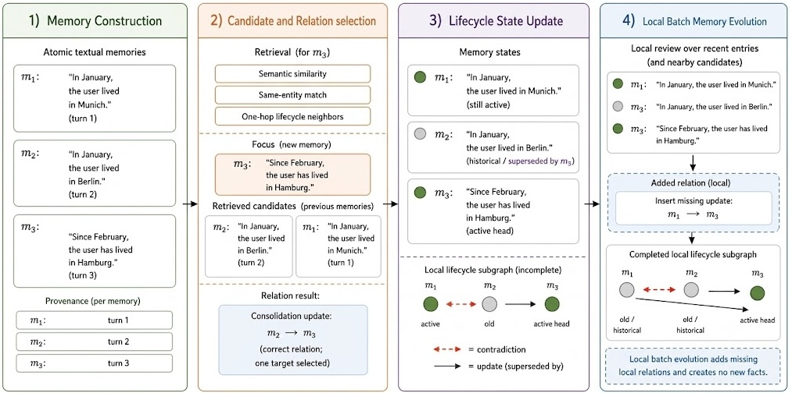
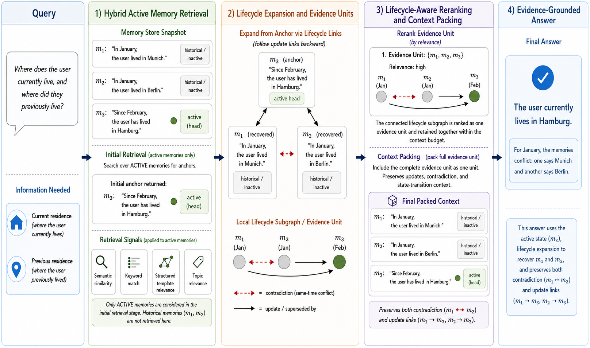

# MemoryLACE: Memory Lifecycle-Aware Consolidation and Evidence Retrieval
## MemoryLACE：记忆生命周期感知的整合与证据检索

> **论文元信息**
> - **arXiv**：[2609.03201](https://arxiv.org/abs/2609.03201)（v1，2026-09-02 提交）
> - **分类**：cs.CL
> - **作者**：Meriem Yacoubi¹、Pia Schmidt²、Nenad Petrovic¹、Ahmed Frikha³、Martin Kirchhoff²、Alois Knoll¹（¹慕尼黑工业大学机器人与人工智能实时系统讲席教授团队，²inovex GmbH，³Cerebras Systems Inc.）
> - **方法名**：**MemLACE**（MemoryLACE）
> - **篇幅**：8 页；2 图 4 表

> **翻译说明**
> - 本译文基于 arXiv 官方 HTML 全文（`https://arxiv.org/html/2609.03201v1`）逐段翻译，覆盖：**摘要 + 第 I–VII 节 + 图 1–2 + 表 I–IV 全量数值**；参考文献保留原文编号，不逐条翻译。
> - **插图**：全部 **2 张图**已下载至 `../images/MemoryLACE/`，markdown 使用**相对路径**引用，离线可读；每张图上方保留 `<!-- 原图：URL -->` 注释便于回溯原地址。
> - **公式**：原文 HTML 中 MathML 与 LaTeX 重复渲染的痕迹已清理，统一按 LaTeX 重排为 `$…$` / `$$…$$`；术语首次出现时保留英文原文，其后用中文。

---

## 摘要

长期运行的 LLM 智能体必须在多次交互间保留信息，同时区分重复证据、历史状态、更新与未解决的矛盾。现有的文本记忆系统能高效地检索语义相关的记忆，却往往让这些关系保持隐式；而更丰富的结构化方法则通过全局图、层次化抽象或反思来建模这些关系，代价是更高的复杂度。我们提出 **MemoryLACE（MemLACE）**，一种轻量级记忆框架，它通过稀疏的合并（merge）、取代（supersession）与矛盾（contradiction）关系显式地对文本证据的生命周期建模，同时保留原子的自然语言记忆及其溯源。MemLACE 不再独立地检索记忆，而是重构「关系感知的证据单元」，将当前、历史、支撑与冲突的证据一并暴露给下游推理。在 BEAM 与 StructMemEval 上，借助开源与专有 LLM 主干，MemLACE 在同主干对比中取得了最高的总体性能，同时将 BEAM 上的端到端运行时相对最强报告的反思式记忆基线 Hindsight 降低了 66.6%。消融实验将生命周期扩展与时间感知识别为这些增益的主要来源。总体结果表明，显式地对文本证据的局部生命周期建模，已足以在不依赖完备知识图谱或全局反思的前提下，大幅改善长期记忆推理。

**索引词**：长程记忆、LLM 智能体、证据生命周期、记忆整合、矛盾处理

---

## I. 引言

大语言模型（LLM）正越来越多地支撑着跨任务、跨会话与用户交互的智能体。在单一上下文窗口之外，这类智能体需要能够保留偏好、计划、纠正、约束、任务进展以及既有事实的记忆机制 [1]。外部记忆可以 grounding 生成 [2]、支撑持久行为 [3]、并延展长期交互 [4]。然而，可靠的记忆不只是检索相关文本：新证据可能重复、替换或矛盾于已存储的信息。现有方法呈现出一种实际的权衡：紧凑的文本系统提供高效的存储与检索 [5, 17]，却往往让记忆间的关系保持隐式；结构化、层次化与反思式的架构则显式地表示这些关系 [9, 24, 10, 11]，但可能需要更宽泛的图构建、抽象或反思。这引出了一个聚焦的问题：智能体如何在无需构建完备全局结构的前提下，既保留文本证据中的变化、又能联合检索相互依赖的记忆？

我们提出 **MemoryLACE（MemLACE）**，它位于扁平文本记忆与完备结构化记忆之间、走一条轻量级的中间路线。MemLACE 保留原子的自然语言记忆及其溯源，同时通过稀疏的局部关系（合并、取代、矛盾）把相关条目连接起来。在写入阶段，有界的候选比较与局部批式演化建立并修复这些关系；在检索阶段，活跃记忆提供初始锚点，生命周期扩展找回相连的历史或冲突证据，关系感知的证据单元在上下文预算下被重排序并打包。因此，答案模型接收到的是一套可解释的「当前、历史、支撑、冲突」证据结构，而非彼此独立的片段。

我们的贡献有三点。第一，我们提出了一种显式的生命周期表示与整合框架，它在保留原子自然语言记忆及其溯源的同时，区分重复证据、有序的状态变化与未解决的矛盾。第二，我们提出了一种关系感知的检索机制，它通过生命周期关系扩展活跃记忆，重构出生命周期感知的证据单元，使语言模型能够联合地理解当前、历史、支撑与冲突证据，而非孤立的记忆片段。第三，通过在 BEAM 与 StructMemEval 上使用开源与专有 LLM 主干的全面评测，并辅以消融实验，我们证明了仅显式地建模局部证据生命周期结构，已足以大幅改善长期记忆推理，在同主干对比中取得最强的总体性能，而无需完备知识图谱或全局反思阶段。

---

## II. 相关工作

近期综述从信息如何被表示、使用、演化与检索的角度刻画智能体记忆 [1]。在文本记忆中，Mem0 抽取显著的对话信息，将其与已存储条目调和（reconcile），并在跨会话中检索所得的记忆对象 [17]；而 SimpleMem 强调语义压缩、递归整合与查询感知检索 [5]。SeCom 研究记忆单元的粒度，并构建围绕连贯主题组织的压缩记忆片段 [6]；MemInsight 增强已存储的交互以改善语义表示与检索 [7]。EMem 将对话表示为带归一化实体、时间线索与来源归属的结构化事件级命题，并可选择性地通过轻量异构图相连接 [8]。这些系统表明，紧凑的文本或事件级记忆能够提供强大的长程召回，但通常不会把重复、取代与未解决的矛盾表示为显式的生命周期关系。

A-MEM、Zep、Theanine、TiMem 与 HiMem 提供了与演化式、时间组织式记忆紧密相关的方案。A-MEM 构建结构化笔记，并允许新证据触发相连表示的演化 [9]；Zep 使用具备时间感知的知识图谱 [24]；Theanine 通过时间与因果时间线连接记忆 [12]；TiMem 与 HiMem 将观测整合为层次化的情景与语义表示 [10, 11]。这些系统展示了时间连续性的价值，但它们的表示建模的是更宽泛的语义、因果或层次结构。相比之下，MemLACE 仅在「会改变对已存储证据之解释」时才创建局部的合并、取代与矛盾关系。

反思式记忆管理（Reflective Memory Management）、Hindsight 与 MemOS 通过更丰富的维护机制来处理记忆演化。反思式记忆管理同时维护前瞻性与回顾性的用户表示 [16]；Hindsight 则将保留的观测、召回的信息与反思式解释分散在不同的记忆网络中 [15]；MemOS 把记忆视为受治理的系统资源，支持溯源、版本控制、组合、迁移以及在异构记忆形态间的演化 [18]。这些方法强化了「在允许证据的解释与运行状态演化的同时保留证据」的重要性。MemLACE 不引入专门的反思模块或记忆操作层，而是把维护限制在「有界的候选比较、稀疏的生命周期关系与关系感知检索」上。

长期记忆的基准已超越简单的对话召回。LoCoMo 与 LongMemEval 考察多会话问答、时间推理、知识更新与弃答（abstention）[20, 21]，而 MemBench 与 Evo-Memory 将效率、容量与持续记忆演化加入评测维度 [22, 23]。我们在 BEAM [13] 与 StructMemEval [14] 上评测，二者考察互补的能力：BEAM 跨十项能力衡量长上下文对话记忆，而 StructMemEval 则隔离地考察「累积证据能否被组织起来以支撑结构化推理」。二者共同覆盖了「演化证据的解释」与「其结构化使用」这两类我们所针对的场景。

---

## III. MemoryLACE 架构

MemLACE 把长期记忆视为不断演化的证据，而非扁平的摘要集合。其架构包含一个记忆表示与两个阶段。该表示用时间元数据、溯源、活跃状态与稀疏生命周期关系来建模原子化的文本记忆。第一阶段（记忆构造与整合）将对话转换为独立的记忆、加以存储，并确定新证据与既有记忆的关系。第二阶段（证据检索与上下文构造）检索活跃锚点（即被判定为与查询相关的活跃记忆），扩展它们的局部关系，并在答案生成之前组织好相连条目。这一设计使系统能够在保留证据随时间演化的同时检索相关证据，而无需一张完备、全局归一化的知识图谱。

### III-A. 记忆表示

每条被存储的记忆表示为

$$ m_{i}=(x_{i},\tau_{i},z_{i},p_{i},a_{i},R_{i}) $$

其中 $x_{i}$ 是一条显式对话证据中单条原子信息的独立自然语言重述。该重述保留了原意与相关细节，同时使记忆能在原始对话上下文之外被独立理解。字段 $\tau_{i}$ 记录以证据为依据的时间元数据，例如显式陈述的事件时间或有效期；而 $z_{i}$ 包含轻量元数据，如实体、关键词、主题与位置。溯源字段 $p_{i}$ 记录支撑该记忆的对话轮次标识符，从而保留证据的时序与来源；$a_{i}$ 指示该记忆是否处于活跃状态；$R_{i}$ 表示与之关联的生命周期关系引用集合，包含零个或多个合并、取代与矛盾关系。这里，一条记忆的「生命周期」指其状态随新证据到来而演化的方式：它是否保持活跃，以及它如何与重复、被取代、正在取代或相矛盾的记忆相关联。取代关系是双向表示的：较新的记忆指向它们所替换的条目，而较旧的记忆指向它们的后继者。

完整的记忆存储构成一个稀疏关系图 $G=(M,E)$，其中 $M$ 是文本记忆节点的集合，$E$ 由有向的取代边以及对称的合并与矛盾链接组成。与可能编码实体、分类、因果或语义关系的通用知识图谱不同，MemLACE 只存储解释已存储证据所需的关系。溯源标识一条记忆的来源，而生命周期关系描述它与其他记忆的连接。这既保留了自然语言记忆的灵活性，又使其演化可被检视。

### III-B. 阶段一：记忆构造与整合

图 1 展示了第一阶段。该过程沿用 SimpleMem [5] 的轻量级滑动窗口记忆构造：重叠的对话窗口被转换为独立的原子记忆，由重叠引入的重复条目在生命周期处理之前先被整合。MemLACE 用面向「随时间演化的证据」的生命周期感知整合扩展了这一过程。

<!-- 原图：https://arxiv.org/html/2609.03201v1/figures/write_phase.png -->

> **图 1（原文 Fig. 1）**：Memory construction and consolidation in MemLACE. Atomic provenance-bearing memories undergo bounded relation selection, lifecycle-state updates, and local batch repair of missed relations.
> （MemoryLACE 的记忆构造与整合：携带溯源信息的原子记忆经过有界关系选择、生命周期状态更新以及局部批式的关系修复。）

#### III-B1. 记忆构造

对于一个对话窗口 $D_{t}$，记忆构造器产生

$$ B(D_{t})\rightarrow\{m_{1},m_{2},\ldots,m_{k}\}. $$

每条原子条目捕获一条单一的显式事实、偏好、计划、纠正、决策、事件或状态，并附带将其链接到支撑对话证据的源轮次溯源。名称、日期、数量、否定与说话者归属都按原样保留，不推断任何未陈述的信息；例如，提及去柏林旅行，并不意味着在那里居住。这种原子粒度很重要，因为更新或矛盾通常只影响更宽泛对话片段中的单条断言，从而让整合能精确地作用于被影响的记忆。由于重叠窗口可能多次从相同轮次抽取相同断言，这类重复的抽取会被合并、其溯源也会被合并；而来自不同轮次的重复则保持分离，以便可能的合并连接。

#### III-B2. 候选与关系选择

记忆按时间顺序被整合，以使后续证据不会被当作先于其所修改的状态。对于每条记忆 $m_{\mathrm{new}}$，MemLACE 首先通过语义相似度与同实体匹配检索相关记忆，再用它们的一跳生命周期邻居扩展该集合，形成候选集 $C(m_{\mathrm{new}})$。这些邻居是通过合并、取代或矛盾关系相连的记忆。一个 cross-encoder 对候选重排序，保留生命周期相连的记忆并优先排列排名最高的剩余候选。重排序只决定哪些记忆被纳入比较，而不决定它们与 $m_{\mathrm{new}}$ 的关系。

整合模块随后恰好选择一个策略 $r$，并在适用时选择一个目标记忆。把每一步限制为单一「关系—目标」对，可使模型一次只聚焦于一个决策，这比把关系同时分配给多个候选更可靠：

$$ \mathcal{R}=\{\mathrm{merge},\mathrm{update},\mathrm{contradict},\mathrm{no\_action}\}, $$

$$ g(m_{\mathrm{new}},C(m_{\mathrm{new}}))\rightarrow(r,c^{\star}),\qquad r\in\mathcal{R}. $$

这里 $g$ 表示整合决策函数，$c^{\star}\in C(m_{\mathrm{new}})$ 表示被选中的目标记忆，当不需要目标时为 null。merge 用于关于同一事实的重复证据，update 用于同一状态的有序变化，contradict 用于同一范围下不相容的断言，而 no action 用于相互独立的记忆。由于检索只识别出潜在相关的候选，整合模型在指派关系之前会评估它们的主题、属性、断言与时间范围，从而防止仅凭主题相似性就改变记忆的生命周期状态。与其他记忆的关系由后续的局部批式步骤恢复，而非被强行塞进这一单一决策。

#### III-B3. 生命周期状态更新

在默认配置下，生命周期决策修改记忆的活跃性（即一条记忆是否属于活跃集 $A$），以及连接性（即它与其他记忆的生命周期关系），而不删除源证据。令

$$ A=\{m_{i}\in M\mid a_{i}=1\} $$

表示完整记忆存储 $M$ 的活跃子集。当 $m_{n}$ 更新 $m_{o}$ 时，较旧的条目变为不活跃，而较新的条目成为活跃链头：

$$ a_{o}\leftarrow 0,\qquad a_{n}\leftarrow 1, $$

$$ m_{n}\xrightarrow{\mathrm{supersedes}}m_{o},\qquad m_{o}\xrightarrow{\mathrm{superseded\_by}}m_{n}. $$

相矛盾的记忆保持活跃，因为现有证据无法消解其冲突，并且它们被对称地相连。被指派为 no action 的记忆保持可独立检索。对于 merge，我们探索两种整合策略。在默认的「链接式合并（linked-merge）」策略下，被指派 merge 关系的记忆保留其原始文本与溯源，同时获得双向的合并引用，从而每条原始证据仍可被单独检索。相比之下，「紧凑式合并（compact-merge）」策略用一条合成出的活跃记忆替换被合并的条目，以丢弃原始独立条目为代价换来更小的记忆存储。除非另有说明，MemLACE 使用默认的链接式合并策略。此外，被取代的状态被排除在普通的活跃检索之外，而历史的、合并相连的以及冲突的证据仍被保留存储。

#### III-B4. 局部批式记忆演化

每条记忆都通过一个单一的生命周期决策被整合，使每个逐记忆步骤保持有界且可检视，同时降低对决策顺序的敏感性。在一组新记忆被加入之后，MemLACE 用一个有界的局部演化步骤来补充之，该步骤将这组记忆作为一个整体来考量。它会审视新加入的记忆及其第一阶段的整合候选，并建立那些只有把整组放在一起看时才显现的进一步 update、contradict 或 merge 链接（例如一条记忆与多个更早条目相关）。这一步只作用于生命周期结构，更新关系链接与相应的活跃状态，而不重写记忆文本或增添事实内容。因此，把「单决策整合」与「组级演化」协调起来，既修复了额外的生命周期关系，又保留了有界的局部决策过程。

### III-C. 阶段二：证据检索与上下文构造

图 2 概括了查询时的处理流水线。

<!-- 原图：https://arxiv.org/html/2609.03201v1/figures/read_phase.png -->

> **图 2（原文 Fig. 2）**：Evidence retrieval and context construction in MemLACE. Active anchors are expanded through lifecycle relations, grouped into evidence units, reranked, and packed for evidence-grounded generation.
> （MemoryLACE 的证据检索与上下文构造：活跃锚点通过生命周期关系扩展，被分组为证据单元，经重排序后打包，用于基于证据的生成。）

#### III-C1. 混合活跃记忆检索

在查询时，我们使用语义相似度、关键词匹配、结构化模板相关性与主题相关性，在活跃记忆上产生互补的排序列表。所得排序通过倒数排名融合（Reciprocal Rank Fusion, RRF）[25] 进行合并，该方法不要求它们的原始分数可直接比较：

$$ s_{\mathrm{RRF}}(m)=\sum_{c\in\mathcal{C}}\frac{1}{k+\operatorname{rank}_{c}(m)}, $$

其中 $\mathcal{C}$ 表示检索通道，$k$ 是排名平滑常数。把初始搜索限制在活跃记忆上，可减少来自被取代状态的竞争。不活跃记忆仍被存储，在需要历史证据时可通过被检索锚点的生命周期关系恢复。形式上，混合检索返回活跃锚点集

$$ A_{q}=R_{\mathrm{hybrid}}(q,A), $$

其中 $A$ 是活跃记忆集，$R_{\mathrm{hybrid}}$ 通过上述 RRF 融合各检索通道。

#### III-C2. 生命周期扩展与证据单元

混合检索返回相关的活跃锚点 $A_{q}$，但其本身可能并不包含解释「对应信息随时间如何演化」所需的全部证据。因此 MemLACE 通过有界的生命周期关系扩展每个锚点：

$$ E_{q}=A_{q}\cup L(A_{q}), $$

其中 $L(A_{q})$ 沿取代谱系追溯以恢复先前状态，并沿一跳矛盾关系把直接冲突的证据呈现出来。该扩展保持局部性，而非遍历整张记忆图，从而在限制每个查询所引入的额外上下文的同时，仍能恢复查询可能依赖的历史与冲突证据。

所得的记忆被分组为证据单元。一个单元可以表示一条独立的记忆，也可以表示由检索池中记忆之间的取代、矛盾与合并链接所构成的连通分量。取代边把每个分量按从较早到较新的状态排列，使历史证据与活跃状态都保持可见。未解决的矛盾断言被一起保留，而非过早地以一方取代另一方。在重排序之前先分组，使那些解释依赖于其关系的记忆能够作为一个连贯单元被评估，而不是作为独立片段相互竞争。

#### III-C3. 链式感知重排序与上下文打包

一个重排序器针对用户查询对所得的生命周期感知证据单元打分，随后选出得分最高的单元用于答案生成。由于证据单元是作为整体被打分的，关系相连的记忆在重排序期间被联合评估，而非作为独立片段相互竞争。随后在上下文预算约束下选出排名最高的单元。更新链保持其「从旧到新」的顺序，只要预算允许就保留完整的证据单元。当某个单元会超出剩余预算时，只部分纳入它，保留其高优先级记忆而丢弃其余部分。

#### III-C4. 基于证据的答案生成

在答案生成期间，被打包的上下文以生命周期顺序呈现，向 LLM 区分当前、被取代与相冲突的记忆。因此，模型可以为「当前状态」类问题优先使用活跃证据，为「历史或时序」类问题恢复更早的状态，并在矛盾未解决时保留竞争性断言——它接收到的是关系相连、且时间结构被保留的证据，而非从无序片段中推断关系。

---

## IV. 实验设置

我们在两个长期记忆基准上评测 MemLACE。BEAM [13] 是对话式长期记忆的主要基准，而 StructMemEval [14] 评估证据能否支撑结构化推理。

### IV-A. 基准

BEAM 在长对话历史上评估十种不同的记忆能力 [13]。我们使用其 100K-token 子集，包含 20 段对话与 400 道问题。StructMemEval 评估在持久存储信息上的状态追踪、基于树的推理、基于计数的推理与推荐 [14]。我们使用其 51 场景主集，包含每个任务族中最长的案例。

### IV-B. 实验配置

为公平比较，我们将 MemLACE 与对应基线的模型与评测设置对齐。在 BEAM 上，被评测的主干是 Qwen3.5-4B 与 Qwen3.5-9B（均为 FP8）[26]。在 StructMemEval 上，MemLACE 与 Mem-Agent 用 GPT-5.5 [27] 评测。对于每个基准，该主干被用于记忆构造、整合、批式演化、查询分析与答案生成。生成的答案由 GPT-4o mini [28] 作为固定的 LLM 裁判，按各基准的评测协议打分。所有 Qwen3.5 运行均关闭推理模式（reasoning mode），生成温度设为 0.0。

记忆构造使用 20 轮窗口、2 轮重叠。整合在总共 15 的候选预算下检索 12 个语义候选与 8 个实体候选，对得分最高的五个候选重排序，并在批式演化期间最多审视 24 个条目。查询时检索仅用活跃锚点，最多检索 40 个语义、30 个关键词、30 个结构化与 20 个主题候选，并用 $k=60$ 的 RRF 融合。取代谱系扩展上限为 80 个节点，矛盾扩展上限为 4 条记忆，最终上下文上限为 64 条记忆。语义检索使用 Qwen/Qwen3-Embedding-0.6B [30]，而候选与证据单元重排序使用 cross-encoder/ms-marco-MiniLM-L6-v2 [29]。

---

## V. 结果与分析

**表 I：BEAM 100K 子集上的类别级结果（单位：%）。**

| 方法 | 主干 | Abst. | Contr. | Event | Info. | Instr. | Update | Multi. | Pref. | Summ. | Temp. | Overall |
| --- | --- | --- | --- | --- | --- | --- | --- | --- | --- | --- | --- | --- |
| SimpleMem | Qwen3.5-4B | 38.8 | 7.2 | 21.9 | 56.0 | 29.4 | 31.9 | 26.9 | 53.1 | 7.7 | 32.5 | 30.5 |
| LIGHT | Qwen3.5-4B | 62.5 | 13.8 | 2.6 | 57.3 | 45.0 | 35.6 | 38.7 | 63.3 | 29.8 | 7.5 | 35.6 |
| Hindsight | Qwen3.5-4B | 50.0 | 6.6 | 18.7 | 50.0 | 59.4 | 30.0 | 40.3 | 85.0 | 33.4 | 28.1 | 40.1 |
| MemLACE | Qwen3.5-4B | 88.8 | 36.6 | 29.3 | 52.9 | 61.9 | 25.0 | 33.8 | 81.3 | 27.8 | 16.9 | 45.4 |
| SimpleMem | Qwen3.5-9B | 37.5 | 10.0 | 21.2 | 51.2 | 30.0 | 36.9 | 33.7 | 48.8 | 7.8 | 30.0 | 30.7 |
| LIGHT | Qwen3.5-9B | 75.0 | 13.8 | 2.3 | 67.7 | 51.2 | 52.5 | 38.9 | 71.9 | 36.0 | 11.9 | 42.1 |
| Hindsight | Qwen3.5-9B | 63.7 | 40.9 | 20.8 | 61.1 | 68.1 | 51.2 | 50.3 | 71.2 | 40.4 | 35.0 | 50.3 |
| MemLACE | Qwen3.5-9B | 71.3 | 40.3 | 25.6 | 55.9 | 72.5 | 51.9 | 55.3 | 84.4 | 35.5 | 26.3 | 51.9 |

我们在 BEAM 100K 子集与 StructMemEval 主集上评测 MemLACE。在 BEAM 上，我们对比 LIGHT [13]（被基准报告为性能最高的记忆架构）、Hindsight [15]（采用带全局反思的 retain–recall–reflect 流水线），以及 SimpleMem [5]（一个与我们共享独立构造方案的紧凑文本记忆系统，从而隔离出生命周期表示与检索的贡献）。我们的 BEAM 评测使用 Qwen3.5 模型作为主干。在 StructMemEval 上，我们在相同的 GPT-5.5 主干下对比基于 markdown 的记忆智能体 Mem-Agent [19]。

### V-A. BEAM 类别级对比

表 I 报告了我们在 BEAM 十项记忆能力上的结果。列缩写分别表示：弃答（Abst.）、矛盾消解（Contr.）、事件排序（Event）、信息抽取（Info.）、指令遵循（Instr.）、知识更新（Update）、多跳推理（Multi.）、偏好遵循（Pref.）、摘要（Summ.）与时间推理（Temp.）。

我们发现，在两种模型规模上，MemLACE 在总体平均上都大幅优于所有基线。以 Qwen3.5-4B 为主干时，MemLACE 在 4B 系统中于弃答、矛盾消解、事件排序与指令遵循上取得最佳结果，这表明生命周期结构的收益在更小的模型规模上就已显现，而无需更大的 LLM 主干来补偿杂乱的上下文。

以 Qwen3.5-9B 为主干时，MemLACE 在十类中的六类上优于最强基线 Hindsight。这些增益并非均匀铺开：它们集中在偏好遵循、弃答、多跳推理、事件排序与指令遵循上——恰恰是正确的答案需要把若干相关记忆放在一起（而非孤立地）考虑的那几类。这与生命周期感知检索一致：它把活跃状态连同与之相连的历史与支撑证据一并送达。知识更新仅边际改善，这是意料之中的：单次活跃记忆查找已足够，并不因加入并分组相关条目而受益。

尽管 MemLACE 取得了最高的 9B 分数，Hindsight 仍在时间推理上保有 8.7 个百分点的优势，在信息抽取上保有 5.2 个百分点，在摘要上保有 4.9 个百分点。这一模式反映了两套系统不同的设计取舍。MemLACE 刻意使用原子记忆、稀疏局部关系与有界的证据打包，以高效地消解演化中的状态，而非像 Hindsight 那样重建完整对话或维护全局反思式表示。尽管这一权衡带来了显著更高的效率（如下一节所示），它也更不适于穷举式摘要与显式的时间区间计算。

#### V-A1. 运行时对比

本节中，我们以 Qwen3.5-9B 为主干，比较 MemLACE 与性能最高的基线方法 Hindsight 所需的运行时。表 II 报告了在相同评测设置（即 BEAM 100K 子集、vLLM 服务环境、并行处理配置，以及一块分配 24 GB 显存的 NVIDIA A40 虚拟 GPU 配置）下的分阶段明细。

**表 II：BEAM 100K 子集上、以 Qwen3.5-9B 为骨干的运行时分阶段明细。**

| 阶段 | MemLACE | Hindsight | 加速比 |
| --- | --- | --- | --- |
| 记忆构造 | 6 h 06 min | 18 h 27 min | 3.02× |
| 答案生成 | 1 h 25 min | 4 h 03 min | 2.86× |
| 总计 | 7 h 31 min | 22 h 30 min | 2.99× |

MemLACE 将系统总运行时降低了 66.6%，即 2.99× 的加速。最大的节省发生在记忆构造阶段（3.02×），该阶段 MemLACE 采用有界整合与局部批式修复，而非 Hindsight 所用的昂贵全局反思阶段。

### V-B. StructMemEval 结果

StructMemEval 基准上的结果如表 III 所示。我们以 GPT-5.5 为主干 LLM，将 MemLACE 与在 StructMemEval [14] 上评测的记忆系统中最强的 Mem-Agent [19] 对比。当一个场景至少一半的问题被判为正确时即算作被解决，表中报告每个子任务中被解决场景的比例及其宏平均。

**表 III：以 GPT-5.5 为 LLM 的 StructMemEval 结果（单位：%）。**

| 方法 | State | Tree | Count | Recsys | Overall |
| --- | --- | --- | --- | --- | --- |
| Mem-Agent | 57.00 | 50.00 | 0.00 | 33.00 | 35.00 |
| MemLACE | 100.00 | 100.00 | 0.00 | 8.33 | 52.08 |

MemLACE 以超过 17 个百分点的优势优于 Mem-Agent。MemLACE 解决了全部 14 个状态追踪场景与全部 10 个基于树的场景，而 Mem-Agent 分别为 57.00% 与 50.00%。状态追踪结果直接受益于我们提出的记忆表示：取代链接保留了每个状态，而活跃链头（active-head）管理解析出当前记忆，从而既能正确回答当前状态问题，也能正确回答历史问题。基于树的结果更值得注意，因为它要求重建层次化关系——这通常被视为图式记忆而非扁平文本存储的专长。MemLACE 从原子的关系记忆、结构化检索与证据单元分组中重建出被查询的层次，为答案模型提供局部相关的依赖关系，而非一张完备的层次化知识图谱。两个族上的完美准确率将宏平均拉升至 52.08%，而与 Mem-Agent 的差距完全由这两类结构化、演化状态的任务类型所驱动。

计数与推荐结果指出了该框架一个针对性的扩展机会。两种方法都未解决基于计数的场景。在推荐上，根据问题级裁判输出计算，MemLACE 正确回答了 32.2% 的单个问题，而在基准 50% 正确率阈值下，场景级仅达 8.33%。这些任务依赖于跨许多分布式偏好信号的全局数值累积或排序，而 MemLACE 的设计目标是保留演化证据片段间的有效性、溯源与依赖关系。专门的聚合算子——例如调用计算器或代码执行工具——可以补充 MemLACE 产出的证据单元，而无需更昂贵的全局记忆架构。

---

## VI. 消融研究

我们进行消融研究，以进一步洞察每个 MemLACE 组件的重要性与经验影响。我们在完整的 BEAM 100K 子集上、用 Qwen3.5-9B 评测 MemLACE 的变体，从而隔离出每个组件的贡献。除「组合移除」变体外，每次运行恰好改变一个组件；该组合变体使用紧凑式合并，并同时禁用两个重排序器、批式演化、时间感知与生命周期扩展。表 IV 报告了每个变体的类别级结果。

**表 IV：以 Qwen3.5-9B 在 BEAM 100K 上的消融研究结果（单位：%），包含相对完整 MemLACE 配置的绝对变化（Δ）。组合变体采用紧凑式合并，并同时禁用两个重排序器、批式演化、时间感知与生命周期扩展。**

| 变体 | Abst. | Contr. | Event | Info. | Instr. | Update | Multi. | Pref. | Summ. | Temp. | Overall | Δ |
| --- | --- | --- | --- | --- | --- | --- | --- | --- | --- | --- | --- | --- |
| Full MemLACE | 71.3 | 40.3 | 25.6 | 55.9 | 72.5 | 51.9 | 55.3 | 84.4 | 35.5 | 26.3 | 51.9 | – |
| Without both rerankers | 70.0 | 39.1 | 23.4 | 57.9 | 63.8 | 56.3 | 50.8 | 80.6 | 37.3 | 27.5 | 50.7 | -1.23 |
| Compact merge | 71.3 | 44.1 | 24.7 | 54.8 | 71.3 | 53.8 | 43.0 | 83.8 | 34.4 | 23.8 | 50.5 | -1.43 |
| Without batch evolution | 72.5 | 36.9 | 24.1 | 56.5 | 60.6 | 55.0 | 48.2 | 83.3 | 38.1 | 26.9 | 50.2 | -1.68 |
| Without temporal awareness | 72.5 | 26.6 | 23.8 | 54.4 | 67.5 | 48.8 | 46.9 | 75.6 | 37.0 | 16.3 | 46.9 | -4.97 |
| Without lifecycle expansion | 73.8 | 40.3 | 23.4 | 47.8 | 69.4 | 35.0 | 42.3 | 85.8 | 35.9 | 13.8 | 46.7 | -5.16 |
| Combined removal | 67.5 | 23.1 | 25.2 | 48.5 | 69.4 | 36.3 | 37.6 | 78.8 | 35.9 | 11.3 | 43.3 | -8.55 |

生命周期扩展与时间感知带来了两项最大的降幅，但它们的作用落在不同的能力上，说明它们针对的是不同的失败模式。一方面，移除生命周期扩展（−5.16）保持了活跃记忆检索不变，却使其无法遍历取代与矛盾链接，损失集中在那些需要「较早与当前状态一起」的类别上：知识更新（51.9→35.0）、多跳推理（55.3→42.3）与时间推理（26.3→13.8）。矛盾消解在报告精度上不变（两者均为 40.3），说明相关的冲突记忆即便在没有矛盾链接扩展时，也常作为活跃锚点被独立检索到。另一方面，移除时间感知（−4.97）会劣化矛盾消解（40.3→26.6）、偏好遵循（84.4→75.6）与时间推理（26.3→16.3）。此处的时间感知指的是 MemLACE 在整合与排序记忆时使用以证据为依据的时间元数据（$\tau_i$），例如事件时间与有效期，从而把「随时间的有序变化」与「真正的冲突」区分开来；没有它，一次有效的更新更容易被误读为冲突。因此这两个组件不可互换：连接性决定检索到哪些相关记忆，而时间 grounding 决定它们之间的差异是被解读为真正的冲突，还是有序的变化。

其余组件带来的准确率降幅较小。受影响的类别澄清了每个组件的贡献。移除批式演化（−1.68）对指令遵循（72.5→60.6）与多跳推理（55.3→48.2）影响最大，这与其「恢复那些由单决策整合分别处理的、跨条目的关系」的作用一致。移除两个重排序器（−1.23）带来的性能下降最小，尽管指令遵循从 72.5 降至 63.8，这与「对已被检索到的证据重新加权、而非改变存在哪些证据或关系」的组件特性一致。合并方式的对比最具诊断意义：紧凑式合并策略用一条合成记忆替换默认的链接式合并条目，改善了矛盾消解（40.3→44.1），却大幅降低了多跳推理（55.3→43.0），净降幅为 1.43 个百分点。因此，当一条调和后的陈述即足够时，把证据合并为一条条目是有帮助的，但它丢弃了多跳问题所依赖的独立溯源与表述。MemLACE 所采用的默认链接式合并策略取得了更好的权衡。

组合移除将总体分数降至 43.3%，降幅大于任何单一消融。我们注意到，这一组合降幅小于各单项降幅之和，说明这些组件存在部分重叠，同时仍贡献着可分离的效果。劣化集中在演化与依赖关系的类别上，即矛盾消解（23.1）、知识更新（36.3）、多跳推理（37.6）与时间推理（11.3），而事件排序（25.2）与摘要（35.9）则仍接近完整配置。

---

## VII. 结论

我们提出了 **MemoryLACE（MemLACE）**，一个长期记忆框架，它通过连接重复、被取代与矛盾记忆的稀疏生命周期关系来表示文本证据的演化，同时保留其原始溯源。通过检索并基于关系感知的证据单元（而非孤立记忆）进行推理，MemLACE 使语言模型能够在一个统一的检索流水线内解释当前、历史、支撑与冲突的证据。在 BEAM 与 StructMemEval 上，MemLACE 在同主干对比中取得了最强的总体性能，同时相对最强报告的反思式记忆基线 Hindsight 大幅降低了运行时。消融研究进一步表明，生命周期扩展与时间感知贡献了这些增益的大部分，为「显式地对文本证据的局部生命周期建模，已足以恢复通常与沉重得多的记忆架构相关联的推理收益中的大部分」提供了经验证据。这些发现表明，在所评测的设置下，长期记忆的主要挑战并非更丰富的全局结构，而是保留证据随时间的演化方式。因此，未来的工作可以在保留同一轻量记忆表示的同时，用面向聚合、计数与数值推理的专用算子来扩展这一生命周期感知的接口。

---

## 参考文献

> 以下保留原文编号与原文条目，不逐条翻译。

- **[1]** Y. Hu, S. Liu, Y. Yue, G. Zhang, B. Liu, F. Zhu, J. Lin, H. Guo, S. Dou, Z. Xi, et al., “Memory in the Age of AI Agents,” arXiv preprint arXiv:2512.13564, 2025.
- **[2]** P. Lewis, E. Perez, A. Piktus, F. Petroni, V. Karpukhin, N. Goyal, H. Kuttler, M. Lewis, W. Yih, T. Rocktaschel, S. Riedel, and D. Kiela, “Retrieval-Augmented Generation for Knowledge-Intensive NLP Tasks,” in Advances in Neural Information Processing Systems, 2020.
- **[3]** J. S. Park, J. C. O’Brien, C. J. Cai, M. R. Morris, P. Liang, and M. S. Bernstein, “Generative Agents: Interactive Simulacra of Human Behavior,” arXiv preprint arXiv:2304.03442, 2023.
- **[4]** C. Packer, S. Wooders, K. Lin, V. Fang, S. G. Patil, I. Stoica, and J. E. Gonzalez, “MemGPT: Towards LLMs as Operating Systems,” arXiv preprint arXiv:2310.08560, 2023.
- **[5]** J. Liu, Y. Su, P. Xia, S. Han, Z. Zheng, C. Xie, M. Ding, and H. Yao, “SimpleMem: Efficient Lifelong Memory for LLM Agents,” arXiv preprint arXiv:2601.02553, 2026.
- **[6]** Z. Pan, Q. Wu, H. Jiang, X. Luo, H. Cheng, D. Li, Y. Yang, C.-Y. Lin, H. V. Zhao, L. Qiu, and J. Gao, “On Memory Construction and Retrieval for Personalized Conversational Agents,” arXiv preprint arXiv:2502.05589, 2025.
- **[7]** R. Salama, J. Cai, M. Yuan, A. Currey, M. Sunkara, Y. Zhang, and Y. Benajiba, “MemInsight: Autonomous Memory Augmentation for LLM Agents,” in Proceedings of EMNLP, 2025, pp. 33136–33152.
- **[8]** S. Zhou and J. Han, “A Simple Yet Strong Baseline for Long-Term Conversational Memory of LLM Agents,” arXiv preprint arXiv:2511.17208, 2025.
- **[9]** W. Xu, Z. Liang, K. Mei, H. Gao, J. Tan, and Y. Zhang, “A-MEM: Agentic Memory for LLM Agents,” in Advances in Neural Information Processing Systems, 2025.
- **[10]** K. Li, X. Yu, Z. Ni, Y. Zeng, Y. Xu, Z. Zhang, X. Li, J. Sang, X. Duan, X. Wang, C. Liu, and J. Tan, “TiMem: Temporal-Hierarchical Memory Consolidation for Long-Horizon Conversational Agents,” arXiv preprint arXiv:2601.02845, 2026.
- **[11]** N. Zhang, X. Yang, Z. Tan, W. Deng, and W. Wang, “HiMem: Hierarchical Long-Term Memory for LLM Long-Horizon Agents,” arXiv preprint arXiv:2601.06377, 2026.
- **[12]** K. T.-i. Ong, N. Kim, M. Gwak, H. Chae, T. Kwon, Y. Jo, S.-w. Hwang, D. Lee, and J. Yeo, “Towards Lifelong Dialogue Agents via Timeline-Based Memory Management,” in Proceedings of NAACL, 2025, pp. 8631–8661.
- **[13]** M. Tavakoli, A. Salemi, C. Ye, M. Abdalla, H. Zamani, and J. R. Mitchell, “Beyond a Million Tokens: Benchmarking and Enhancing Long-Term Memory in LLMs,” arXiv preprint arXiv:2510.27246, 2025.
- **[14]** A. Shutova, A. Olenina, I. Vinogradov, and A. Sinitsin, “Evaluating Memory Structure in LLM Agents,” arXiv preprint arXiv:2602.11243, 2026.
- **[15]** C. Latimer, N. Boschi, A. Neeser, C. Bartholomew, G. Srivastava, X. Wang, and N. Ramakrishnan, “Hindsight is 20/20: Building Agent Memory that Retains, Recalls, and Reflects,” arXiv preprint arXiv:2512.12818, 2025.
- **[16]** Z. Tan, J. Yan, I-H. Hsu, R. Han, Z. Wang, L. Le, Y. Song, Y. Chen, H. Palangi, G. Lee, et al., “In Prospect and Retrospect: Reflective Memory Management for Long-Term Personalized Dialogue Agents,” in Proceedings of ACL, 2025, pp. 8416–8439.
- **[17]** P. Chhikara, D. Khant, S. Aryan, T. Singh, and D. Yadav, “Mem0: Building Production-Ready AI Agents with Scalable Long-Term Memory,” arXiv preprint arXiv:2504.19413, 2025.
- **[18]** Z. Li, C. Xi, C. Li, D. Chen, B. Chen, S. Song, S. Niu, H. Wang, J. Yang, C. Tang, et al., “MemOS: A Memory OS for AI System,” arXiv preprint arXiv:2507.03724, 2025.
- **[19]** A. Tekparmak and O. Kaya, “mem-agent: Equipping LLM Agents with Memory Using RL,” Hugging Face Community Article, Oct. 2025. [Online]. Available: https://huggingface.co/blog/driaforall/mem-agent-blog
- **[20]** A. Maharana, D.-H. Lee, S. Tulyakov, M. Bansal, F. Barbieri, and Y. Fang, “Evaluating Very Long-Term Conversational Memory of LLM Agents,” in Proceedings of ACL, 2024, pp. 13851–13870.
- **[21]** D. Wu, H. Wang, W. Yu, Y. Zhang, K.-W. Chang, and D. Yu, “LongMemEval: Benchmarking Chat Assistants on Long-Term Interactive Memory,” in Proceedings of ICLR, 2025.
- **[22]** H. Tan, Z. Zhang, C. Ma, X. Chen, Q. Dai, and Z. Dong, “MemBench: Towards More Comprehensive Evaluation on the Memory of LLM-Based Agents,” in Findings of ACL, 2025.
- **[23]** T. Wei, N. Sachdeva, B. Coleman, Z. He, Y. Bei, X. Ning, M. Ai, Y. Li, J. He, E. H. Chi, et al., “Evo-Memory: Benchmarking LLM Agent Test-Time Learning with Self-Evolving Memory,” arXiv preprint arXiv:2511.20857, 2025.
- **[24]** P. Rasmussen, P. Paliychuk, T. Beauvais, J. Ryan, and D. Chalef, “Zep: A Temporal Knowledge Graph Architecture for Agent Memory,” arXiv preprint arXiv:2501.13956, 2025.
- **[25]** G. V. Cormack, C. L. A. Clarke, and S. Büttcher, “Reciprocal Rank Fusion Outperforms Condorcet and Individual Rank Learning Methods,” in Proceedings of the 32nd International ACM SIGIR Conference on Research and Development in Information Retrieval, 2009, pp. 758–759.
- **[26]** Qwen Team, “Qwen3.5: Towards Native Multimodal Agents,” 2026. [Online]. Available: https://qwen.ai/blog?id=qwen3.5
- **[27]** OpenAI, “GPT-5.5 System Card,” 2026. [Online]. Available: https://deploymentsafety.openai.com/gpt-5-5
- **[28]** OpenAI, “GPT-4o mini: Advancing Cost-Efficient Intelligence,” 2024. [Online]. Available: https://openai.com/index/gpt-4o-mini-advancing-cost-efficient-intelligence/
- **[29]** Sentence-Transformers, “Cross-Encoder for MS MARCO: cross-encoder/ms-marco-MiniLM-L6-v2,” Hugging Face. [Online]. Available: https://huggingface.co/cross-encoder/ms-marco-MiniLM-L6-v2
- **[30]** Y. Zhang, M. Li, D. Long, X. Zhang, H. Lin, B. Yang, P. Xie, A. Yang, D. Liu, J. Lin, et al., “Qwen3 Embedding: Advancing Text Embedding and Reranking Through Foundation Models,” arXiv preprint arXiv:2506.05176, 2025.
