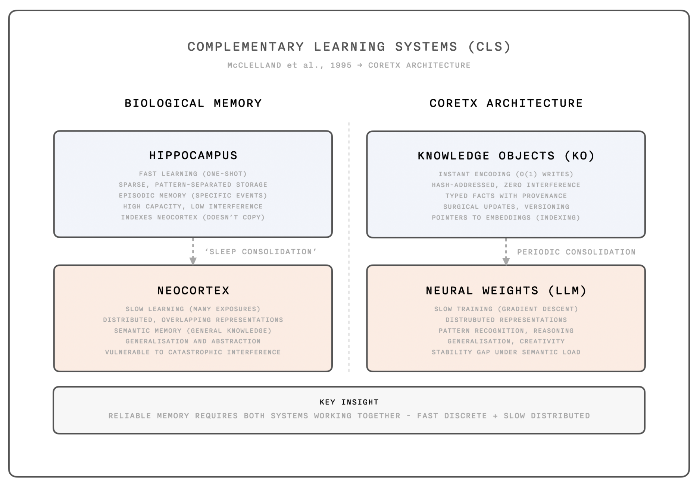
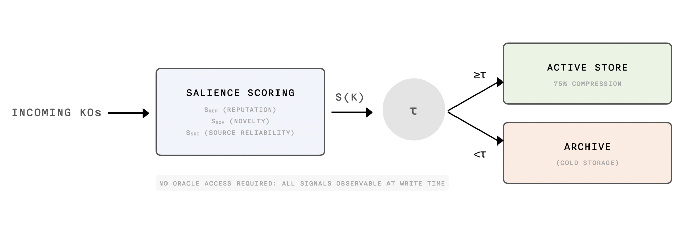
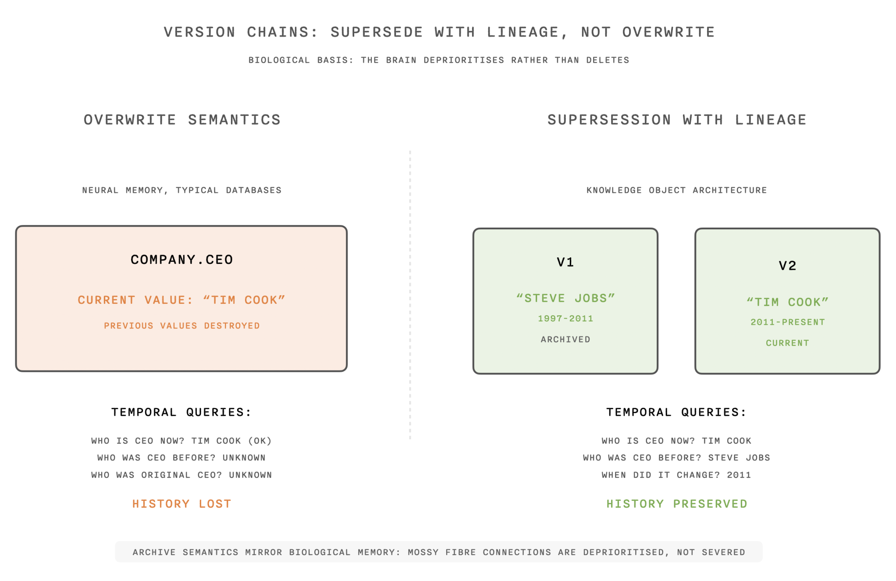
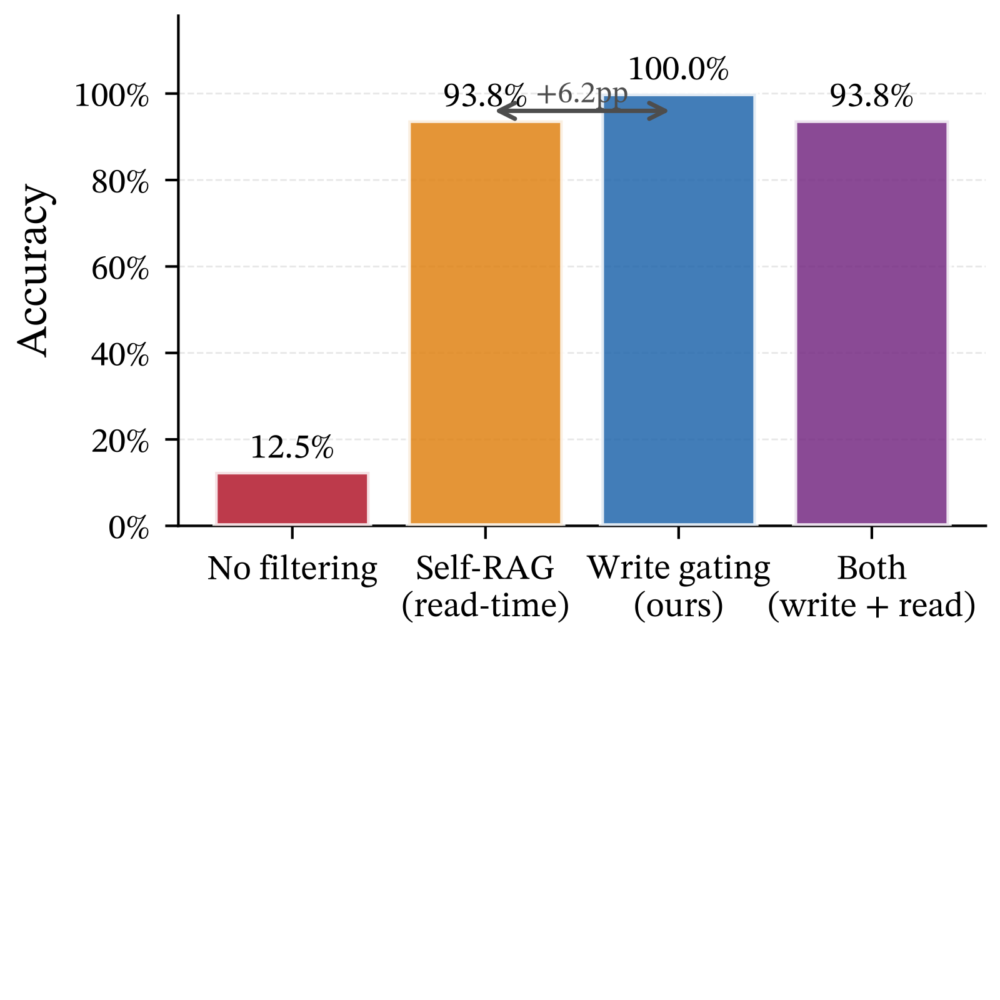
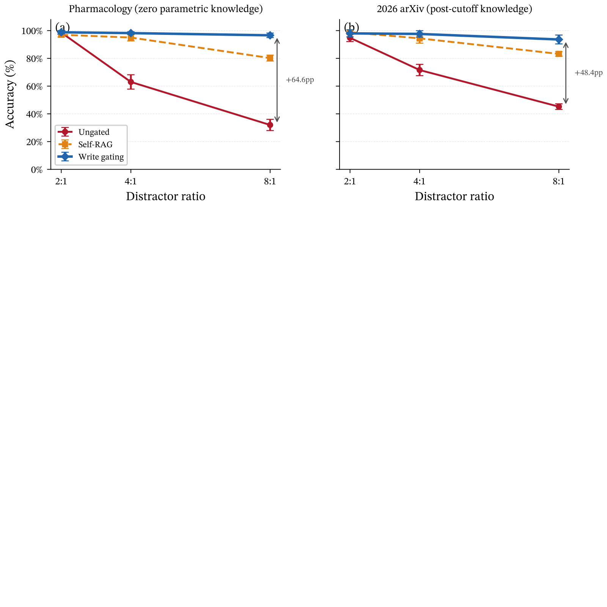
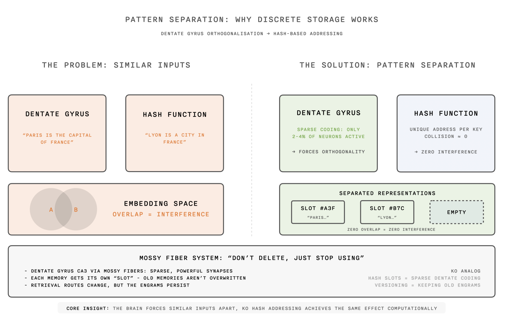

# Selective Memory for Artificial Intelligence: Write-Time Gating with Hierarchical Archiving
## 面向人工智能的选择性记忆：写时门控与分层归档

> **论文元信息**
> - **arXiv**：[2603.15994](https://arxiv.org/abs/2603.15994)（v1，2026-03-16 提交）
> - **篇幅**：20 页，8 图
> - **分类**：cs.AI
> - **作者**：Oliver Zahn（Independent Researcher，oliver@coretx.ai）、Simran Chana et al.（University of Cambridge）
> - **方法名**：**SGW-HA**（Salience-Gated Write with Hierarchical Archiving，显著性门控写入 + 分层归档）
> - **复现**：代码将随论文发表释出（原文注明 Repository URL to be added upon publication）

> **翻译说明**
> - 本译文基于 arXiv 官方 HTML 全文（`https://arxiv.org/abs/2603.15994v1` 对应的 HTML 版）逐段翻译，覆盖：**摘要 + 第 1–6 节（含 5.1–5.5 全部子节）+ 复现性说明 + 图 1–8 + 表 1–13 全量数值**；参考文献保留编号不逐条翻译。
> - **插图**：全部 **8 张图**已从 HTML 抽出图片链接并下载到本地 `../images/SelectiveMemory/`（源为 SVG 的图 4–7 同时保留 `.svg` 与转换后的 `.png`）。markdown 使用**相对路径**引用，离线可读；每张图上方保留 `<!-- 原图：URL -->` 注释便于回溯原地址。
> - 公式按 LaTeX 重排（原文 HTML 中 MathML 与 LaTeX 重复渲染的痕迹已清理）；术语首次出现时保留英文原文。

---

## 摘要

检索增强生成（RAG）**不加区分地存储所有内容**，随噪声累积而精度下降；参数化方法则把知识压缩进权重，**无法进行选择性更新**。两者都不模仿生物记忆——生物记忆会**依据显著性对编码进行门控**，并且**归档而非删除**被取代的信息。

我们提出**写时门控（write-time gating）**：用复合显著性分数（**来源声誉、新颖性、可靠性**）过滤进入的知识对象，同时维护**版本链**以保留先前状态。在**不使用质量标签 oracle** 的真实 LLM 评测中，写时门控达到 **100% 准确率**，而未门控存储仅 **13%**。

关键发现在**干扰项缩放（distractor scaling）**中浮现：在 **8:1 的干扰比**下，读时过滤（Self-RAG）**崩溃到 0%**，而写时门控**保持 100%**，揭示了**写时策展相对读时策展的结构性优势**。在 Wikipedia（20 个实体）、程序化生成的药理学数据以及 2026 年 arXiv 论文上的验证确认了这些结论。**门控优势与参数化记忆支撑程度成反比**：Wikipedia 为 **+25pp**、训练截止后的 arXiv 为 **+48pp**、零训练知识的程序化数据为 **+65pp**。信号消融确认该方法**不依赖与真值相关的 oracle 元数据**。写时门控以 Self-RAG **九分之一**的查询时成本达到了与其相当的准确率。

---

## 1. 引言

面向大语言模型的记忆架构聚集在两个极端。**检索增强生成（RAG）**维护无界增长的外部存储，**不加质量或相关性判断**地接受每一份文档、每一句发言、每一段生成的摘要。由此产生的**噪声污染**表现为检索退化：当低质量内容构成存储条目的主体时，嵌入相似度会越来越多地返回干扰项而非正确答案。另一个极端是**参数化记忆（parametric memory）**——它在训练期把所有知识压缩进网络权重，推理时不显式存储任何东西，因而**无法选择性更新、纠正，也无法响应删除请求**。

**神经记忆模块**占据了中间地带。以 **Titans** `[3]` 为代表的近期「测试时记忆化」工作引入了**可学习记忆**，在推理期间依据**梯度导出的「惊讶（surprise）」信号**进行更新：记忆依据预测误差来决定保留什么。然而这种记忆以**连续权重矩阵**而非**离散可寻址单元**的形式存在——**没有单个已存事实的表示、没有删除特定条目的机制、也没有把输出链接到来源的溯源信息**。

生物记忆在上述所有方案之外，还有两个被当前架构忽视的特征。**第一，编码是选择性的。** 海马体依据新颖性、情绪显著性与对当前目标的相关性来门控「向长期记忆的固化」：平凡经历得到弱编码，重要事件得到强编码 `[17, 16]`。**第二，遗忘通过降级而非删除实现。** 当信念更新时，大脑**不抹去先前状态**，而是降低其可及性，同时保留可支撑日后重建的链接。一个追踪「公司 CEO 从 A 换成了 B」的系统，仍能回忆起前任 CEO 是谁——**取代（supersession）创造的是层级，而不是替换**。

本文提出**写时门控与分层归档**：一种把上述两条生物原则同时应用于**离散知识存储**的记忆机制。进入的知识对象经过**显著性门（salience gate）**，只有超过习得阈值的才被接纳；低于阈值的对象被**归档进冷存储而非丢弃**。当新信息更新既有概念时，系统创建**取代链接而非执行覆写**，从而维护可保留对先前状态访问的链条。我们在**对抗性干扰项数量多于正确答案**的检索基准上做真实 LLM 评测，证明这种选择性**无需真值质量标签 oracle** 即可实现**完整的质量层级分离**。

<!-- 原图：https://arxiv.org/html/2603.15994v1/01_CLS_complementary_learning_systems.png -->

> **图 1（原文 Figure 1）**：Complementary Learning Systems in biology and AI. The brain uses fast hippocampal storage for specific episodes and slow neocortical storage for semantic patterns. Our architecture mirrors this with discrete Knowledge Objects (fast, addressable) complementing LLM weights (slow, distributed).
> （生物与 AI 中的互补学习系统。大脑用快速的海马存储记录具体情景、用缓慢的新皮层存储语义模式。本架构与之镜像：离散的**知识对象（Knowledge Object, KO）**——快速、可寻址——与 LLM 权重——缓慢、分布式——形成互补。）

本方法与神经记忆的区别在于：它操作的是**带有显式溯源元数据的离散可寻址对象**。这带来了连续权重方案无法具备的能力：**在同意撤回（consent revocation）时删除特定条目**、**把输出链接到贡献来源的审计轨迹**，以及**依据测得的影响力把经济结算的价值路由给知识贡献者**。

#### 主要贡献（Contributions）

**第一**，我们提出**显著性门控写入机制**，依据「来源声誉 + 新颖性 + 来源可靠性」的复合分数过滤进入的知识对象，**无需真值质量标签 oracle**（§3）。**第二**，我们用真实 LLM 评测证明：写时门控在对抗性基准上达到 **100%** 准确率，未门控检索仅 **13.3%**，并且**比 Self-RAG 式读时过滤高出 6.2 个百分点**（§4）。**第三**，我们证明写时门控具有**渐近稳健性**：在高达 **8:1** 的干扰比下，写时门控仍保持 **100%** 准确率，而未门控检索与读时过滤**双双崩溃到 0%**（§4.6）。**第四**，我们在真实的 Wikipedia 数据（**20 个实体、5 个类别**）上验证：写时门控达到 **98.1%** 准确率（未门控 85.2%），在扩展下保持稳健，且查询时成本仅为 Self-RAG 的 **1/9**；Wikipedia 上的信号消融确认即使**完全去掉来源元数据信号**，方法仍能达到 **96.4%**（§4.7）。**第五**，我们通过新领域验证证明**门控优势与参数化记忆支撑程度成反比**：程序化生成的药理学数据 **+64.6pp**、训练截止后的 arXiv 论文 **+48.4pp**，确认当 LLM **无法用训练知识弥补检索错误**时写时门控最有价值（§4.8）。**第六**，我们展示**「归档而非删除」语义**能支持基于覆写的系统无法回答的**时间性查询**（§4.3）。**第七**，我们为需要 **>0.95 置信度**的高风险领域验证了**多路径验证**（§5）。

#### 全文路线（Roadmap）

第 2 节回顾记忆架构的相关工作；第 3 节给出显著性打分、门控与版本链机制；第 4 节通过多随机种子、并在合成数据与真实 Wikipedia 数据上做干扰比缩放的**真实 LLM 实验**验证我们的主张；第 5 节讨论生物学依据、局限与启示。

---

## 2. 相关工作

面向语言模型的记忆研究横跨检索增强、神经记忆模块、外部记忆架构与认知架构。对类脑记忆方法的既有工作表明：尽管各个组件散见于不同系统，**没有任何已有架构把「离散知识对象 + 写时门控 + 分层归档 + 版本血缘」整合在一起** `[12, 8]`。

**外部记忆传统**始于 **神经图灵机（Neural Turing Machines）** `[4]`，它引入控制器网络与可微记忆库的耦合，使用基于内容与基于位置的混合寻址。**可微神经计算机（DNC）** `[5]` 以**时间链接**扩展了这一点——追踪写入顺序，从而支持图遍历与对离散记忆槽的复杂推理。这些架构以向量内容存储离散条目，是**索引式记忆方法最清晰的前身**，但它们缺少**写时质量门控与溯源追踪**。

**现代 Hopfield 网络** `[15]` 取得理论突破：证明了**指数级存储容量**以及**联想记忆与 Transformer 注意力之间的数学等价性**。这统一了联想记忆与注意力两条文献脉络，表明 Transformer 隐含地执行了 Hopfield 式的模式检索。这一联系提示：**显式记忆机制与基于注意力的检索共享着比此前认识更深的同构结构**。

由 Lewis 等人 `[10]` 提出的**检索增强生成范式**维护按嵌入相似度索引的文档存储。标准实现在**索引时不设质量过滤**，无论来源可靠性或验证状态如何都全盘接纳。**Self-RAG** `[2]` 使用习得的 critic 增加了**检索后过滤**，但过滤发生在**读时而非写时**，底层存储仍在累积噪声。我们的方法在**写时**门控，阻止低质量内容进入**活跃存储**，同时把它保留在**冷存储**中以备将来使用。

**神经记忆架构**已从简单的键值存储演进为习得的记忆化机制。**Titans 架构** `[3]` 引入在推理期间用**梯度幅值作为惊讶信号**更新的记忆模块：当输入产生大的预测误差时就写入记忆。该方法通过在保留「令人意外」的信息、让常规模式不落盘，在长上下文基准上取得强劲结果。然而其记忆由**连续权重矩阵**构成，**没有离散可寻址单元**。我们的方法共享「**惊讶门控写入**」这一原则，但将其应用于**离散知识对象**，从而支持权重存储不可能具备的溯源追踪与选择性删除。

**神经情景控制（Neural Episodic Control）** `[14]` 实现了存储显式键值对的**可微神经字典**，代表了带 k 近邻检索的离散索引式存储。它为强化学习提供了索引式记忆的实用实现，但**缺少本文贡献的基于显著性的写时门控与版本血缘**。

**把记忆视为递归注意力结构（MaRS）** `[11]` 以**带类型的节点**与**显式遗忘策略**扩展记忆，向带有溯源元数据的离散表示迈进了一步：该系统区分不同记忆类型并施加类型专属的保留规则。**MaRS 是溯源感知记忆方面最接近的先前工作**，但它聚焦**读时的遗忘策略**而非**写时的选择性**。

**MemGPT** `[13]` 通过在工作记忆与长期存储之间**分页**来应对有界上下文，把语言模型视为管理自身记忆层级的操作系统。其分页决策依据**新近性（recency）与程序员显式提示**，而非习得的显著性；并且**被取代的内容是被覆写而非归档**。我们的版本链机制正是针对「**覆写语义会破坏对先前状态的访问**」这一局限。

**认知架构**为记忆选择性提供了理论根基。**ACT-R** `[1]` 实现基于激活值的检索——记忆项若不被复述就会衰减——并把记忆组织为带类型槽位的离散「**块（chunks）**」。**SOAR** `[9]` 维护带有显式情景记忆与语义记忆存储的产生式规则。这些架构展示了**离散结构化记忆**的价值，但缺少神经学习与现代的规模化特性。

**互补学习系统（CLS）理论** `[12, 8]` 解释了生物大脑为何使用两套记忆系统：一套**快速学习、使用稀疏模式分离表示**的海马用于情景记忆，一套**缓慢学习、使用分布式重叠表示**的新皮层用于语义知识。**FearNet** `[7]` 用三个类脑网络实现了该理论——负责近期记忆的海马复合体、负责长期存储的内侧前额叶皮层网络、以及在两系统间路由的基底外侧杏仁核网络——并通过在**模拟睡眠阶段进行生成式重放**实现记忆效率。

**海马索引理论** `[17]` 提出海马维护的是**指向新皮层表示的指针**，而非直接存储内容。**印迹（engram）研究**为离散记忆单元提供了生物学证据：利根川进的实验室证明**稀疏神经元群在记忆形成期间发生持久变化**，并且这些**印迹细胞可被人工重新激活以触发回忆** `[6]`。我们的显著性打分把这些原则**可操作化**：多个信号组合产生一个门控决策，决定进入内容归入**活跃存储、冷存储还是立即丢弃**。「**归档而非删除**」的语义则反映了「遗忘通过降级而非抹除实现」这一生物学原则 `[16]`。

**表 1** 汇总了现有方法的能力。**没有任何先前系统同时具备离散可寻址对象、写时门控、分层归档、版本血缘与溯源追踪。**

**表 1：各记忆架构的能力比较**（基于公开的系统描述）。我们的方法（SGW-HA）**独有地**把离散对象与写时门控、归档、版本链组合在一起。

| 系统 | 离散对象 | 写入门控 | 归档 | 版本 | 溯源 |
|---|---|---|---|---|---|
| RAG | ✓ | | | | |
| Titans | | ✓ | | | |
| DNC | ✓ | | | ✓ | |
| MemGPT | ✓ | | | | |
| MaRS | ✓ | | ✓ | | ✓ |
| NEC | ✓ | | | | |
| **SGW-HA（本文）** | **✓** | **✓** | **✓** | **✓** | **✓** |

---

## 3. 方法

系统维护三个组件：**活跃存储（active store）**——可供检索的高显著性知识对象；**归档（archive）**——冷存储中的低显著性或被取代对象；以及记录取代关系的**版本链（version chains）**。进入的知识对象先经过**显著性打分与阈值判定**，再决定归入活跃存储还是归档。

### 3.1 显著性打分（Salience Scoring）

每个候选知识对象 $K$ 都会得到一个**复合显著性分数**，它由三个**无需真值质量标签 oracle** 的可观测信号计算而来：

- **来源声誉 $s_{rep}(K)$**：依据验证状态、历史准确性与机构隶属，反映贡献来源的可信度。
- **新颖性 $s_{nov}(K)$**：以「1 减去候选嵌入与所有活跃存储嵌入之间的最大余弦相似度」来衡量其与既有存储内容的语义距离。
- **来源可靠性 $s_{src}(K)$**：依据可观测元数据（同行评审状态、机构背书、独立来源的佐证）把来源划入不同质量层级。

#### 知识对象的粒度

一个知识对象可以表示**单条事实**（「公司 X 的 CEO 是 Y」）、**一个文档块**、**一条带支撑证据的主张**，或**一个带版本化的信念**。该机制**对粒度不敏感**：显著性打分与门控统一适用。但**有效性依赖粒度的选择**：细粒度对象（单条事实）能精确过滤，但**每单位内容需要更多元数据**；粗粒度对象（整篇文档）摊薄了元数据成本，却可能**在同一单元内混合高低质量内容**。我们在实验中使用**事实级粒度**；生产系统应按领域需求调整粒度。

#### 设计原则：不使用 oracle 访问

一个关键设计约束是：显著性打分**必须在无法访问真值质量标签的前提下工作**。此前关于记忆门控的工作（包括我们自己的早期模拟）使用了与质量相关的**代理信号**（例如由已知质量层级算出的预测误差下降量），这实际上**把每条事实是否正确这一 oracle 信息交给了门控机制**。这类信号在真实部署中并不存在。我们的三个信号——**声誉、新颖性、来源可靠性**——都**仅在写时从元数据即可观测**，无需知道候选事实是否为真。

复合分数通过权重组合这些信号：

$$S(K) = \sum_{j=1}^{3} w_j \cdot s_j(K) \tag{1}$$

其中权重 $w_j$ 可以**统一设置**、在**留出数据上调优**，或依据下游任务结果**在线学习**。在我们的实验中采用**以声誉为主导的加权**，这反映了「**来源身份是知识对象质量最强的预测因子**」这一经验发现。

### 3.2 写入门控（Write Gating）

门控决策把复合显著性与阈值 $\tau$ 比较：$S(K) \geq \tau$ 的对象带着完整溯源元数据进入**活跃存储**；$S(K) < \tau$ 的对象进入**归档而非被删除**。这种「**归档而非删除**」的策略保留了删除会放弃的三项能力：

**第一**，归档对象在情况变化时**仍可被提升**——策略更新或新用例可能让先前低显著性的内容变得有价值。**第二**，归档维护系统**遇到过什么的完整审计轨迹**，支持对系统行为的取证分析。**第三**，归档对象提供**反面证据**：知道「什么被拒绝、为何被拒绝」有助于对知识质量做元推理。

阈值 $\tau$ 可以是**固定的、习得的或自适应的**。固定阈值适用于质量分布已知的稳定领域；习得阈值在留出数据上优化「准确率—存储量」权衡；自适应阈值则依据可用存储、领域或时间条件调整——存储吃紧时收紧，而当**覆盖面比精确性更重要**时放宽。

#### 实践中的阈值校准

选择 $\tau$ 需要在**精确率与召回率**之间取得平衡。我们建议通过以下方式校准：**(a)** 若有带标注的质量数据，用留出集验证；**(b)** **从保守开始**（$\tau \geq 0.6$），若覆盖面不足再放宽；**(c)** 依据「假阳性（存入干扰项）与假阴性（归档有效内容）的代价比」做领域专属调优。**归档缓解了假阳性的对立面——假阴性**：被归档的对象日后仍可提升；但**假阳性会永久性损害检索质量**。

### 3.3 版本链（Version Chains）

当新内容更新既有概念时，系统创建**取代链接而非覆写**。设 $K_{new}$ 为更新概念 $c$ 的进入对象，$K_{old}$ 为该概念当前的活跃对象。系统记录**双向链接**：$K_{old}.\text{superseded\_by} \leftarrow K_{new}.\text{id}$ 与 $K_{new}.\text{supersedes} \leftarrow K_{old}.\text{id}$。旧对象移入归档，新对象进入活跃存储。

这形成形如 $v_1 \rightarrow v_2 \rightarrow v_3$ 的链条（箭头表示取代）。该链条**支持时间性查询**：检索概念 $c$ 的当前值返回 $v_3$，检索先前值返回 $v_2$，检索原始值返回 $v_1$。**覆写式系统只能回答关于当前状态的查询——历史已被破坏。** 版本链保留历史，因而能回答「**系统在更新之前相信什么**」这类监管与审计要求日益增多的问题。

### 3.4 与离散知识存储的集成

该机制操作的是**知识对象**而非连续权重矩阵。每个对象携带包括**来源标识、时间戳、验证状态、同意向量（consent vectors）与版本链接**在内的元数据。这种离散性带来了权重存储不可能具备的能力：

- **同意撤回时的定向删除**：把特定对象从活跃存储与归档中移除即可；而对权重式记忆，删除需要**近似遗忘（approximate unlearning）**流程，且可能残留信息。
- **输出溯源**：通过血缘追踪把输出追溯到贡献来源；而对权重式记忆，归因需要**事后影响函数近似**。
- **经济结算**：依据测得的影响力把价值路由给贡献者；而对权重式记忆，**特定训练样本的贡献难以剥离**。

---

## 4. 实验

我们在为**对抗条件下压力测试检索**而设计的基准上，用**真实 LLM 评测**来评估写时门控，测量准确率、存储效率以及对噪声增长的稳健性。

<!-- 原图：https://arxiv.org/html/2603.15994v1/fig_salience_gating_v2.png -->

> **图 2（原文 Figure 2）**：Write-time salience gating architecture. Incoming knowledge objects are scored on three observable signals (reputation, novelty, source reliability) without oracle access. Objects above threshold τ enter the active store; objects below are archived in cold storage. On our benchmark: 50 KOs → 13 admitted → 100% accuracy (vs 13.3% ungated).
> （写时显著性门控架构。进入的知识对象依据三个可观测信号——声誉、新颖性、来源可靠性——打分，**无需 oracle 访问**。超过阈值 $\tau$ 的对象进入活跃存储，低于阈值的被归档到冷存储。在本基准上：**50 个知识对象 → 接纳 13 个 → 100% 准确率**（未门控为 13.3%）。）

### 4.1 实验设计

基准包含 **50 个知识对象**：**10 条来自高声誉来源**（同行评审出版物、机构数据库）的正确事实，以及 **40 条来自低声誉来源**（未经验证的主张、AI 生成内容、过时信息）的干扰项。干扰项被设计为与评测查询具有**高嵌入相似度**，以模拟真实世界中「**SEO 优化内容与 AI 生成内容正日益主导嵌入邻域**」的情形。

与既有使用合成打分函数做**模拟评测**的工作不同，我们使用**真实的前沿语言模型（Claude Sonnet 4）**同时充当**检索消费者与准确率裁判**，做**端到端**评测：LLM 接收检索到的上下文并生成答案，准确率衡量生成答案是否与真值正确事实相符。这能捕获模拟打分遗漏的失败模式——**一个在检索到正确事实的同时也检索到大量诱人干扰项的模型，仍可能因为更关注数量占优的干扰项而生成错误答案**。

实验 1 与实验 2 分别使用 **3 个与 2 个随机种子**，报告均值与标准差；实验 3（干扰比缩放）每个比例报告**单种子**结果。我们承认样本量有限：这些结果应被理解为**对机制性质的演示**，而非精确的效应量估计。多随机种子复现与置信区间是未来工作的优先项。

### 4.2 写时门控结果

**表 2** 给出有/无写时门控的准确率（3 个随机种子平均）。在**未门控**条件下，全部 50 个对象进入活跃存储，**干扰项占存储内容的 80%**，LLM 生成答案时会优先关注它们，准确率仅 **13.3% ± 4.7%**。

在**基于声誉的写时门控**下，只有 **12–14 个对象**通过显著性过滤（**压缩 72–76%**）。门控后的存储包含全部 10 条正确事实，外加 2–4 条**勉强越过声誉阈值**的干扰项。尽管过滤并不完美——门控存储中仍含有部分错误内容——**准确率在所有种子上都达到 100% ± 0%**：正确事实**从少数变成存储内容的主体**，从而主导了 LLM 的注意力。

**表 2：写时门控性能**（3 个种子均值 ± 标准差，真实 LLM 评测）。基于声誉的门控在不使用 oracle 的前提下达到完美准确率，仅存储 25% 的候选对象。

| 条件 | 存储规模 | 压缩比 | 准确率 |
|---|---|---|---|
| 未门控 | 50 ± 0 | 0% | 13.3% ± 4.7% |
| **门控** | 13 ± 1 | 75% | **100% ± 0%** |

该结果说明**写时门控并不需要完美过滤**。即使接纳了一些干扰项，门控仍把**信噪比**从未门控的 **1:4** 转变为门控后的约 **3:1**，这已足以让 LLM 可靠地识别并使用正确事实。

### 4.3 时间性推理

我们通过构造 **50 个概念、每个 3 个版本**来评测版本链是否支持时间性查询。系统接收全部更新，并必须同时回答关于**当前状态与先前状态**的查询。**带血缘的归档系统**维护取代链，在时间性查询上达到 **100% 准确率**：它能报告任何链中的任何版本。**覆写式系统**替换先前版本，在关于先前状态的查询上准确率为 **0%**：当被问到某概念在最近一次更新之前的值是什么时，它无法回答，因为先前值已被销毁。

这一结果说明的是**定性的能力差异，而非定量的改进**。**覆写式系统从根本上无法回答时间性查询**，无论怎样调节阈值或学习权重都不行；**带血缘的归档系统**之所以能回答，是因为它**保留而非销毁**了历史。**图 3** 展示了使这一能力成为可能的版本链结构。

<!-- 原图：https://arxiv.org/html/2603.15994v1/fig_versioning_professional.png -->

> **图 3（原文 Figure 3）**：Version chains preserve temporal history through supersession links rather than overwrites. When facts update, prior versions are archived with pointers, enabling temporal queries that overwrite-based systems cannot answer.
> （版本链通过**取代链接**而非覆写来保留时间历史。当事实更新时，先前版本带着指针被归档，从而支持**基于覆写的系统无法回答**的时间性查询。）

### 4.4 归档 vs. 删除

我们对比**归档语义**（被拒绝对象进入冷存储）与**删除语义**（被拒绝对象被丢弃）。**主任务准确率完全相同**，因为活跃存储包含相同的对象。**差异体现在可恢复性**：归档系统把被拒绝对象保留在冷存储中、可用于将来的提升，而删除系统一个都不留。**存储开销是适度的**（冷存储成本低于活跃存储），而**期权价值是显著的**：情况会变化——策略更新、新用例出现、质量信号改进。**归档对象可以在新条件下被重新评估；而删除对象一旦需要就必须重新采集。**

### 4.5 与读时过滤的比较

**Self-RAG** `[2]` 及类似方法在**读时**用习得的 critic 过滤，对检索到的段落重排。我们对比四种条件：**不过滤、读时重排、仅写时门控、两者结合**。我们的读时过滤使用 Self-RAG 式做法：用**同一个前沿 LLM（Claude Sonnet）**在把每段检索内容纳入答案上下文之前，为其**相关性与正确性打分**。这是在**最好的情况下**测试读时过滤原则——用前沿模型充当 critic——而非具体 Self-RAG 的已训练反思 token。为简洁起见我们把该条件称为「Self-RAG」，同时说明**真正的 Self-RAG 模型（使用训练过的 critic）可能表现不同**。

**表 3：写时过滤 vs. 读时过滤**（均值 ± 标准差，真实 LLM 评测）。写时门控比 Self-RAG 高出 **+6.2pp**；把 Self-RAG 加到已门控的存储上会**轻微降低**性能。

| 方法 | 准确率 |
|---|---|
| 不进行过滤 | 12.5% ± 0.0% |
| Self-RAG（读时） | 93.8% ± 6.3% |
| **写时门控（写时）** | **100% ± 0.0%** |
| 两者结合（写 + 读） | 93.8% ± 6.3% |

**表 3** 展示结果：Self-RAG 通过检索后重排把准确率从 **12.5%** 提升到 **93.8%**；**写时门控达到 100%**，进一步高出 **6.2 个百分点**。

**「两者结合」条件揭示了一个反直觉结果**：把写时门控与 Self-RAG 结合得到 **93.8%**，与单用 Self-RAG 相同，**低于单用写时门控**。给一个**已经干净的存储**再加读时过滤会**损害性能**，因为 Self-RAG critic 偶尔会**拒绝正确事实**，引入写时门控本可避免的**假阴性**。在足够干净的存储中，读时过滤**不仅多余，而且适得其反**。

### 4.6 干扰比缩放

前述实验使用固定的 **4:1** 干扰比。真实世界检索存储的噪声水平差异很大：精心策展的知识库可能接近 **1:1**，而**网络规模语料**的比值可能高得多——因为 SEO 优化内容、AI 生成内容与低质量内容正日益主导嵌入邻域。我们测试当噪声增大时，门控有效性与读时过滤是否还能维持，把干扰比从 **2:1** 变化到 **8:1**。

**表 4：干扰比缩放**（真实 LLM 评测）。未门控检索在 4:1 时就崩溃；Self-RAG 能撑过 6:1，但在 8:1 时**灾难性崩溃**；**写时门控在所有测试比例下保持 100%**。

| 干扰比 | 未门控 | Self-RAG | 写时门控 |
|---|---|---|---|
| 2:1 | 100% | 100% | 100% |
| 4:1 | 16.7% | 100% | 100% |
| 6:1 | 0% | 100% | 100% |
| **8:1** | **0%** | **0%** | **100%** |

**表 4** 揭示了读时过滤中的**相变（phase transition）**。在 **2:1** 时所有方法都成功——噪声不足以挑战任何方法。在 **4:1** 时，随着干扰项开始主导嵌入邻域，**未门控检索崩溃到 16.7%**，而 Self-RAG 与写时门控**都保持 100%**。在 **6:1** 时，**未门控检索降到 0%**，Self-RAG 仍靠有效重排维持。**关键转变发生在 8:1**：**Self-RAG 崩溃到 0%，而写时门控保持 100%。**

这一结果揭示了**读时过滤与写时过滤之间的根本架构差异**。**Self-RAG 作用于检索集合**：它只能提升那些**已被检索到**的事实。随着干扰比上升，干扰项越来越主导每个查询的嵌入邻域。在 **8:1** 时，**正确事实出现在初始检索集合中的概率趋近于零**——它被「每条正确事实对应八条干扰项」挤了出去。**再多的重排也无法浮现一条从未被检索到的事实。** 写时门控通过**确保干扰项根本不进入存储**来防范这一失败模式：无论存储之外存在多少干扰项，**正确事实的嵌入邻域都保持干净**。

**8:1 的比例具有现实相关性**，因为真实世界的知识库会从多个来源累积噪声：AI 生成内容、SEO 优化摘要、过时信息与未经验证的主张。虽然我们尚未见到生产检索系统中「干扰项/信号比」的已发表测量，但**合成内容的泛滥意味着噪声比会随时间上升** `[10]`。即便在 8:1（对许多领域而言可能已属**保守**）下，**读时重排也无法克服这个根本的信噪比问题，而写时策展可以**。

<!-- 原图：https://arxiv.org/html/2603.15994v1/fig_distractor_scaling.svg -->

> **图 4（原文 Figure 4）**：Accuracy versus distractor ratio. Ungated retrieval collapses monotonically. Self-RAG maintains a plateau through 6:1 before catastrophic collapse at 8:1. Write gating remains constant at 100% across all tested ratios. The shaded region indicates noise levels plausible for web-scale retrieval.
> （准确率随干扰比的变化。未门控检索**单调崩溃**；Self-RAG 一路维持平台直到 **6:1**，随后在 **8:1 灾难性崩溃**；**写时门控在所有测试比例下恒定保持 100%**。阴影区域表示网络规模检索中可能出现的噪声水平。）

<!-- 原图：https://arxiv.org/html/2603.15994v1/fig_method_comparison.svg -->

> **图 5（原文 Figure 5）**：Four-way method comparison at 4:1 distractor ratio. Write gating outperforms Self-RAG by +6.2pp. Combining both methods degrades to Self-RAG's accuracy—the critic introduces false negatives in an already-clean store.
> （4:1 干扰比下的四方法对比。写时门控比 Self-RAG 高 **+6.2pp**；把两种方法结合会退化到 Self-RAG 的准确率——**critic 在一个本就干净的存储中引入了假阴性**。）

### 4.7 真实世界验证：Wikipedia 事实

前述实验使用**干扰项由构造生成的合成语料**。为在真实数据上验证，我们从 Wikipedia 文章抽取 **20 个实体、5 个类别**（国家、科学家、公司、城市、历史人物）的事实，并通过**跨实体事实置换**与 **LLM 编造**生成干扰项。每个实体贡献 **3–4 条真值事实**（整个语料共 **73 条**）。干扰项是**关于目标实体看似合理但错误的陈述**，由 Claude Haiku 生成。所有评测都使用 **Claude Sonnet 4.6** 同时充当答案生成器与准确率裁判。**不使用任何 oracle 访问**：门控机制只能看到来源标签与新颖性信号，看不到真值正确性。

#### 实验 1：写时门控 vs. 未门控

我们在 **4:1** 干扰比下评测（**292 条干扰项**混入 **73 条正确事实**），**5 个随机种子**，每个种子 **73 道评测问题**。结果见**表 5**。

**表 5：Wikipedia 事实上的写时门控**（5 个种子均值 ± 标准差，每个种子 73 问，4:1 干扰比）。写时门控**接纳了全部 73 条正确事实**，同时**过滤掉 87% 的干扰项**。

| 条件 | 准确率 | 存储规模 | 接纳的干扰项 |
|---|---|---|---|
| 未门控 | 85.2% ± 2.0% | 365 | 292 |
| **写时门控** | **98.1% ± 1.1%** | 102–110 | 29–37 |

写时门控达到 **98.1%** 准确率（未门控 85.2%），**提升 +12.9 个百分点**。门控在**每个种子中都接纳了全部 73 条正确事实**，同时**滤除 87–90% 的干扰项**（292 条中只接纳 29–37 条）。得到的存储比未门控存储**小 70%**。

与合成基准上未门控准确率崩溃到 13% 不同，Wikipedia 上的未门控准确率**仍然相对较高（85%）**，因为这些干扰项——尽管看似合理——**对已经掌握这些知名实体世界知识的前沿 LLM 而言是可区分的**。尽管如此，门控机制仍通过**在检索前移除大部分噪声**带来了有意义的改进。

#### 实验 2：与 Self-RAG 的比较

我们在 4:1 比例、3 个种子上比较四种条件（**表 6**）。

**表 6：Wikipedia 数据上的写时 vs. 读时过滤**（均值 ± 标准差，3 个种子，4:1 比例）。两种过滤方法都超过 **96%**；两者结合达到 **98.2%**。

| 方法 | 准确率 |
|---|---|
| 不进行过滤 | 84.9% ± 1.9% |
| Self-RAG（读时） | 97.7% ± 0.6% |
| 写时门控（写时） | 96.8% ± 1.3% |
| **两者结合（写 + 读）** | **98.2% ± 0.6%** |

在 Wikipedia 数据上，Self-RAG 的表现明显优于合成基准（**97.7% vs. 93.8%**）。这符合预期：Wikipedia 的干扰项——关于知名实体的编造陈述——**对已经知道这些事实的前沿 LLM 而言更明显地错误**，使读时 critic 的判断更可靠。写时门控达到**相当的准确率（96.8%）**，而每次查询的 **LLM 调用次数只有 1/9**（见 4.9 节）。两种方法结合得到 **98.2%**，是观测到的最高准确率。

#### 实验 3：干扰比缩放

核心问题是**写时门控能否在噪声增大时保持优势**。**表 7** 报告 2:1 到 8:1 之间各比例的准确率（每个比例 3 个种子）。

**表 7：Wikipedia 干扰比缩放**（3 个种子均值）。随着噪声增加，未门控准确率从 **98.6% 退化到 72.6%**；**写时门控与 Self-RAG 在所有比例下都保持 >95%**。

| 比例 | 未门控 | 写时门控 | Self-RAG |
|---|---|---|---|
| 2:1 | 98.6% | 98.2% | 98.6% |
| 4:1 | 84.9% | **97.7%** | 97.3% |
| 8:1 | 72.6% | **97.7%** | 95.9% |

Wikipedia 数据上的缩放模式与合成基准有一个**重要差异**：在合成数据上，Self-RAG 在 **8:1 时灾难性崩溃**（100% → 0%）；而在 Wikipedia 数据上，Self-RAG **只是温和退化**（98.6% → 95.9%）。差异归因于**干扰项质量**：合成干扰项被设计为在**窄领域内最大化混淆**，而 Wikipedia 干扰项——跨实体置换与对知名实体的编造——**对拥有强先验知识的模型而言仍可区分**。

**写时门控在 4:1 到 8:1 的所有比例下都保持 97.7%**，确认**在写时过滤可阻止噪声累积，与比例无关**。相对 Self-RAG 的实际优势**不在准确率**（两者都超过 95%），**而在成本**：写时门控**只在写时评估一次**显著性，而 **Self-RAG 要在每次查询时调用 LLM critic**（见 4.9 节）。

#### 实验 4：来源标签消融

合成消融（表 12）显示**单靠来源标签就能达到 100% 准确率**，这引发了一个担忧：该方法**依赖一个按构造与真值相关的类 oracle 信号**。为直接检验，我们在 Wikipedia 数据、4:1 干扰比、5 个种子上**消融来源标签信号**（**表 8**）。

**表 8：Wikipedia 数据上的来源标签消融**（5 个种子均值 ± 标准差，每个种子 73 问，4:1 干扰比）。**去掉来源标签信号只损失 1.4pp**。

| 配置 | 准确率 | 存储规模 | 正确 / 错误 |
|---|---|---|---|
| 未门控 | 85.2% ± 2.0% | 365 | 73 / 292 |
| 完整门控（声誉 + 新颖 + 标签） | **97.8% ± 1.1%** | ~110 | 73 / 37 |
| 无标签（仅声誉 + 新颖性） | 96.4% ± 1.4% | ~155 | 72 / 83 |

**去掉来源标签信号只把准确率降低 1.4 个百分点**（97.8% → 96.4%）。无标签门控接纳了更多条目（~155 vs ~110），因为它**缺少「已验证/未验证」这个二值判别器**，但额外混入的干扰项**并未显著损害检索质量**。这个**保守的、无 oracle 的结果——仅用声誉与新颖性就达到 96.4%——相对未门控检索仍提升了 11.2 个百分点**（85.2%）。这确认了**有效的写时门控不依赖任何按构造与正确性相关的来源元数据**。

### 4.8 新领域验证

Wikipedia 验证使用的实体是 **LLM 在预训练中已有大量先验知识**的实体。为检验写时门控能否推广到**真正新颖的知识**——模型无法从参数化记忆中回答的事实——我们做了三个额外实验，使用的知识**可证明不存在于模型的训练数据中**。

#### 实验 A：程序化生成的药理学语料

我们从 **44 种激酶抑制剂**与 **30 个分子靶点**的词汇表中抽取 **100 条药物—靶点结合亲和力**，其 **nM 值由每个「药物—靶点」对的 MD5 哈希种子确定性生成**。这些值**不存在于任何训练语料中**——**每个正确答案都必须来自记忆存储**。我们通过**置换药物—靶点对**生成干扰项，产出「看似合理但 nM 值错误」的药理学事实。与 arXiv 论文（模型可能对相关工作有部分知识）不同，**这些结合亲和力完全是合成的，参数化记忆支撑为零**。

**表 9：程序化药理学数据的检索准确率**（5 个种子均值 ± 标准差，每个种子 100 问）。**LLM 可证明无法从训练中知道这些事实。**

| 比例 | 未门控 | 门控 | Self-RAG |
|---|---|---|---|
| 2:1 | 98.6% ± 1.4% | 98.8% ± 1.2% | 97.0% ± 1.7% |
| 4:1 | 63.0% ± 5.2% | 98.2% ± 1.0% | 95.0% ± 2.4% |
| 8:1 | 32.0% ± 4.0% | **96.6% ± 1.6%** | 80.2% ± 2.1% |

**表 9** 与**图 6(a)** 给出结果。在 **8:1** 时，**未门控检索降到 32.0%**，低于 Wikipedia（72.6%）与 arXiv（45.2%），因为**模型没有参数化记忆来弥补检索错误**。写时门控保持 **96.6%（+64.6pp）**，是本文所有实验中观测到的**最大门控优势**。Self-RAG 为 **80.2%**，落后写时门控 **16.4 个百分点**，确认当模型**缺乏该领域的先验知识**时，**读时过滤的退化速度快于写时过滤**。存储精确率随假阳性被接纳而**从 2:1 时的 97.8% 单调下降到 8:1 时的 91.3%**，但**尚不足以实质影响下游准确率**。

#### 实验 B：2026 年的 arXiv 论文

我们从 **2025 年 5 月之后发表**（即评测模型的训练截止之后）的 **40 篇 arXiv 论文**中抽取 **51 条事实性主张**，涵盖凝聚态物理、计算生物学与应用数学。我们通过**跨论文数值置换**与 **LLM 编造**生成 **400 条干扰项**——在同一技术领域内产出看似合理的数值替换。与 Wikipedia 干扰项不同，这些干扰项**取自相同的狭小子领域**，使用**领域相称的单位与量级**，因而**更难与正确事实区分**。

**表 10：2026 年 arXiv 论文上的检索准确率**（5 个种子均值 ± 标准差）。**知识可证明不存在于模型的训练数据中。**

| 比例 | 未门控 | 门控 | Self-RAG |
|---|---|---|---|
| 2:1 | 94.8% ± 2.7% | 98.0% ± 2.5% | 98.8% ± 1.6% |
| 4:1 | 71.6% ± 4.1% | 97.6% ± 2.3% | 94.4% ± 3.4% |
| 8:1 | 45.2% ± 2.0% | **93.6% ± 3.2%** | 83.2% ± 1.6% |

**表 10** 与**图 6(b)** 展示三个干扰比下的结果。在 **2:1** 时所有方法表现良好；在 **4:1** 时未门控检索降到 71.6%，而门控保持 **97.6%（+26.0pp）**。**关键分离出现在 8:1**：未门控崩溃到 **45.2%**，而门控保持 **93.6%（+48.4pp）**。Self-RAG 也显著退化到 **83.2%**，落后写时门控 **10.4 个百分点**。该退化模式与合成实验（§4.6）平行，确认**写时过滤的架构优势同样适用于真实世界的新颖知识**。

#### 实验 C：累积缩放

我们测试**当存储持续增长时门控优势是否保持**。从空存储开始，我们以 **4:1** 干扰比**每步添加 50 条新颖药理学事实**，共 10 步、每步之后评测。这模拟了**知识随时间累积**的真实部署场景。

**表 11：存储增长下的检索准确率**（5 个种子均值）。**门控存储只接纳约 19.8% 的候选，全程保持 99.1% 的精确率。**

| 步 | 存储规模 | 门控后规模 | 未门控 | 门控 |
|---|---|---|---|---|
| 1 | 250 | ~50 | 68.0% | **100.0%** |
| 5 | 1,250 | ~248 | 62.0% | **97.0%** |
| 10 | 2,500 | ~496 | 63.0% | **97.0%** |

**表 11** 展示三个代表性步骤。**门控优势非常稳定**：第 1 步差距 **+32.0pp**，第 10 步 **+34.0pp**，总体均值 **未门控 63.4% vs. 门控 98.4%（+35.0pp）**。未门控准确率**在 63% 附近趋于平台**，因为检索质量随存储增长**成比例退化**——每批新数据都加入干扰项、稀释检索池。门控存储在**第 10 步仅增长到约 496 条（接纳率 19.8%）**，同时在**所有被接纳条目上保持 99.1% 的精确率**。

结合 Wikipedia 结果（§4.7），这些实验在**四种知识情境**下验证了写时门控：**知名事实（Wikipedia）、程序化生成的新颖数据（药理学）、前沿研究（arXiv 2026）以及持续累积的事实（累积缩放）**。在 **8:1** 干扰比下，**门控优势与参数化记忆支撑程度成反比**：Wikipedia **+25.1pp**、arXiv **+48.4pp**、药理学 **+64.6pp**（**图 7**）。**写时门控最有价值的时刻，恰恰是 LLM 无法用训练知识弥补检索错误之时。**

<!-- 原图：https://arxiv.org/html/2603.15994v1/fig_novel_domain_scaling.svg -->

> **图 6（原文 Figure 6）**：Distractor scaling on novel-domain data (5-seed means ± std). (a) Pharmacology corpus with zero parametric memory support: ungated accuracy drops to 32% at 8:1 while write gating maintains 96.6%. (b) 2026 arXiv papers post-training-cutoff: ungated drops to 45.2% at 8:1 while write gating maintains 93.6%. In both domains, write gating degrades less than Self-RAG as noise increases.
> （新领域数据上的干扰比缩放。**(a)** 参数化记忆支撑为零的药理学语料：8:1 时未门控准确率跌至 **32%**，而写时门控保持 **96.6%**。**(b)** 训练截止后的 2026 arXiv 论文：8:1 时未门控跌至 **45.2%**，而写时门控保持 **93.6%**。在两个领域中，**随着噪声增加，写时门控的退化都小于 Self-RAG**。）

<!-- 原图：https://arxiv.org/html/2603.15994v1/fig_parametric_advantage.svg -->

> **图 7（原文 Figure 7）**：Gating advantage at 8:1 distractor ratio across knowledge regimes. The advantage scales inversely with parametric memory support: +25.1pp for well-known facts (Wikipedia), +48.4pp for post-cutoff research (arXiv 2026), +64.6pp for procedurally generated data with zero training knowledge (pharmacology). Gated accuracy remains 93–97% regardless of domain; the growing green region reflects increasing ungated degradation.
> （8:1 干扰比下、跨知识情境的门控优势。优势与**参数化记忆支撑程度成反比**：知名事实（Wikipedia）**+25.1pp**、训练截止后的研究（arXiv 2026）**+48.4pp**、零训练知识的程序化数据（药理学）**+64.6pp**。**门控准确率在各领域都保持 93–97%**；不断扩大的绿色区域反映了**未门控退化的加剧**。）

### 4.9 计算效率

写时与读时过滤的**计算成本曲线不同**。**写时门控在写入时**用**无需 LLM 调用**的元数据信号（声誉、新颖性、来源标签）评估显著性；**查询时**，系统只做**一次 LLM 调用**，从检索到的上下文生成答案。相比之下，**Self-RAG 在生成答案前要为每一段检索内容调用 LLM critic**：当检索池为 $k$ 段时，Self-RAG 每次查询需要 **$k+1$ 次 LLM 调用**（$k$ 次 critic 评估 + 1 次答案生成），而写时门控只需 **1 次**。

在我们的实验中 **$k=8$**，**Self-RAG 每次查询用 9 次 LLM 调用，写时门控用 1 次——9 倍成本差**。这个差距会**随查询量放大**：对服务 $Q$ 次查询的系统，Self-RAG 的 LLM 调用成本是 $O(Q \cdot k)$，而写时门控是 $O(Q)$。**写时的显著性评估是一次性成本，可被对该存储的所有未来查询摊薄。**

写时门控还**降低检索成本**：由于只接纳约 **29%** 的候选，活跃存储**小 70%**，嵌入搜索空间成比例缩小。对复杂度为 $O(n)$（暴力）或 $O(\log n)$（近似最近邻）的向量相似度搜索而言，**小 70% 的存储在大规模下带来可观加速**。

成本权衡在以下情形**有利于写时门控**：**(a)** 存储被查询**不止一次**（摊薄写时评估）；**(b)** 检索池 $k$ **很大**（放大每次查询的节省）；**(c)** 系统在**每次查询的 LLM 成本占主导**的规模下运行。而当**元数据信号不可用**、**存储变化太快以致写时评估来不及**，或**查询过于稀疏以致摊薄无收益**时，**Self-RAG 更可取**。

---

## 5. 讨论

**干扰比缩放结果（表 4）是本文的核心发现。** 写时过滤与读时过滤之间的差距**不只是定量的**（标准噪声下 6.2 个百分点），**更是定性的**：在足够高的噪声水平下，**读时过滤灾难性失败，而写时过滤保持完美准确率**。这来自一个结构性论证：**读时过滤只能在已被检索到的条目中选择；写时过滤控制的是「什么可供检索」。** 当噪声低时这一区别无关紧要——两种方法都能找到正确答案；**当噪声高时，只有写时过滤能保证正确答案是可检索的**。

**三信号设计**（声誉、新颖性、来源可靠性）表明：**有效的门控不需要复杂的质量估计**。一项正式消融研究（**表 12**，5 个种子 × 每种子 10 个实体）揭示了各信号的相对贡献：

**表 12：信号消融——各门控配置下的准确率**（5 个种子均值 ± 标准差）。

| 配置 | 准确率 | 存储规模 |
|---|---|---|
| 完整模型（全部 3 个信号） | 100.0% ± 0.0% | 12.8 |
| 仅来源标签 | 100.0% ± 0.0% | 10.0 |
| 声誉 + 标签 | 98.0% ± 4.0% | 11.4 |
| 声誉 + 新颖性 | 98.0% ± 4.0% | 16.4 |
| 仅声誉 | 94.0% ± 8.0% | 12.6 |
| 仅新颖性 | 58.0% ± 19.4% | 15.8 |

**仅来源标签就能匹敌完整模型（100%）**，确认在合成基准中**验证状态是最强的判别信号**。考虑到合成语料**按构造赋予与真值相关的标签**（§5.3），这并不意外。**仅声誉达到 94%**，而**仅新颖性表现很差（58%）**——当正确与错误事实都与查询语义接近时，**嵌入相似度不足以区分二者**。

尽管来源标签在合成数据上达到完美分离，**Wikipedia 上的信号消融（表 8）证明该方法并不依赖它**：**仅用声誉与新颖性在真实数据上达到 96.4%**，只比完整信号集（97.8%）低 **1.4 个百分点**。其**实践含义**是：**系统可以用最少的元数据实现有效的写时门控**——**来源身份与内容新颖性就已足够**，而**验证状态（这个最易受 oracle 质疑的信号）有帮助但非必需**。

**版本链解决的是与写时门控不同的问题。** 门控管理「**什么进入存储**」，链条管理「**更新如何与先前内容交互**」。二者结合同时提供了**选择性**（并非所有内容都被存储）与**历史保留**（更新不销毁先前状态）。监管要求正日益同时要求这两者：**GDPR 要求删除能力**（由离散可寻址对象支持），而**审计要求要求历史重建**（由版本链支持）。**权重式记忆两者都提供不了。**

### 5.1 生物学依据：苔藓纤维原则

「**归档而非删除**」的语义在海马体的**苔藓纤维系统**中有直接的生物学依据。**齿状回**通过**稀疏编码**实现**模式分离**——对任一输入只有 **2–4% 的神经元活跃**，迫使相似经历拥有**不相似的表示** `[16]`。当记忆变得不再相关时，**大脑不切断苔藓纤维连接，而是把它们降级**：降低激活概率，同时保留底层结构。这使得**当情境变化、被遗忘的信息重新变得相关时，日后仍可恢复**。

<!-- 原图：https://arxiv.org/html/2603.15994v1/05_pattern_separation_dentate.png -->

> **图 8（原文 Figure 8）**：Pattern separation in the dentate gyrus. Sparse coding (2–4% activation) forces similar inputs to have dissimilar representations, preventing interference. Mossy fiber connections are deprioritized rather than deleted, preserving recovery capability—the biological basis for archive semantics.
> （齿状回中的**模式分离**。稀疏编码（2–4% 激活）迫使相似输入拥有不相似的表示，从而**防止干扰**。苔藓纤维连接是被「**降级**」而不是被「**删除**」，保留了恢复能力——这正是**「归档」语义的生物学基础**。）

这一生物学原则**直接映射到我们的架构**：离散知识对象的**哈希寻址**实现了**计算意义上的模式分离**——每个对象占据唯一槽位，**与其他对象的干扰为零**。当对象被取代或被显著性门拒绝时，它们**移入归档而非被删除**，**对应苔藓纤维通路的降级**。其结果是一个**能回答关于先前信念的问题**的系统——而**基于删除的系统无法回答，因为信息已经消失**。

### 5.2 与上下文窗口扩展的关系

写时门控的一个替代方案是**直接扩大上下文窗口以容纳所有内容**，从而把过滤问题往后推。我们认为**这并不能消除对门控的需要**。

**第一，更大的窗口会让干扰项问题更糟**：一个**不加区分地存储一切的 1000 万 token 窗口**只会累积**更多**而非更少的干扰项。我们的干扰比缩放结果（表 4）表明**未门控检索随噪声单调退化**——**相同干扰比下，更大的窗口会产生同样的失败**。

**第二，成本随上下文规模线性增长**（上下文内检索每次查询 $O(N)$，而哈希寻址查找为 $O(1)$、索引式嵌入搜索为 $O(\log N)$），使「**一切存进上下文**」的方案在大规模下**在经济上不可持续**。

**第三，长运行系统**（编码智能体、研究助理、企业工作流）**不可避免地会超出任何有限窗口，必须压缩**——而此时**未门控存储会不加区分地同时丢掉干扰项与正确事实**。**写时门控确保：当压缩发生时，保留下来的内容按构造就是高质量的。**

### 5.3 局限性

若干局限制约了这些结果的解读。

**第一，评测语料只有 50 个知识对象**——足以展示机制性质，但相对拥有数百万对象的生产存储仍然很小。需要**近似新颖性计算**与**大规模存储**的可扩展性评测，来确认门控有效性得以保持。我们预期**哈希寻址查找（每次检索 $O(1)$）**能良好扩展，但**写时新颖性计算需要把每个候选与所有已存对象比较**，即**每次写入 $O(n)$**。

**第二，显著性信号假定可以访问来源元数据。** 来源声誉需要**贡献者身份追踪**；来源可靠性需要**机构隶属或同行评审状态**。缺少这些元数据的系统将只能依赖**仅内容信号**（新颖性、语言质量标记），门控有效性可能降低。不过我们的结果显示：**即使门控不完美——在正确事实旁接纳一些干扰项——也足以实现完美的下游准确率。**

相关的一个担忧是：**本基准的来源元数据按构造与真值正确性强相关**——正确事实来自高声誉已验证来源，干扰项来自低声誉未验证来源。然而，**Wikipedia 数据上的来源标签消融（表 8）证明这一相关性并非承重结构**：**完全去掉来源标签信号只让准确率降低 1.4 个百分点**（97.8% → 96.4%），确认**仅凭声誉与新颖性就能提供有效门控**。在真实世界中，**已验证来源偶尔包含错误，未验证来源偶尔包含正确信息**。为测试对这种标签噪声的稳健性，我们引入一个**污染率（corruption rate）**：一部分已验证来源包含错误事实，但保留其高声誉元数据。

**表 13：污染稳健性——当已验证来源含有错误事实时的准确率**（5 个种子均值 ± 标准差，每种子 $n=10$ 个实体）。

| 污染率 | 门控 | 未门控 |
|---|---|---|
| 0%（基线） | 98.0% ± 4.5% | 4.0% ± 5.5% |
| 5% | 78.0% ± 16.4% | 4.0% ± 5.5% |
| 10% | 74.0% ± 12.0% | 2.0% ± 4.5% |
| 20% | 52.0% ± 20.5% | 6.0% ± 5.5% |
| 30% | 30.0% ± 14.1% | 0.0% ± 0.0% |

**表 13** 确认这是**优雅退化而非灾难性失败**。在 **5% 污染**——对经策展来源而言属现实水平——**门控准确率从 98% 降到 78%**，而未门控准确率**无论污染率如何都接近零**。退化**近似线性**：**污染率每增加 10 个百分点，门控准确率大约下降 20 个百分点**。这反映了该机制的**根本设计**：**写时门控信任元数据来选择什么进入存储，因此被污染的元数据会放进被污染的事实**。这一退化曲线提示：在生产系统中，**维护元数据质量（来源验证、同行评审状态）至少与门控算法本身同等重要**。

**第三，我们的合成基准在单一领域（事实性问答）上用生成语料评测。** Wikipedia 验证（§4.7）与新领域实验（§4.8）把覆盖面扩展到跨多种知识情境的真实数据，包括来自 2026 年 arXiv 论文的真正新颖知识。然而**每个实验的问题数量有限**（药理学每种子 100 问、arXiv 51 条主张、累积缩放每步 20 问），在**网络规模语料**与**更多领域专属数据库**上的验证将进一步强化主张。

**第四，干扰比缩放实验最高只测到 8:1。** 生产级网络规模检索可能面临**更高的比值**。虽然写时门控机制**在任何比例下都应保持稳健**（按构造它不受存储之外干扰项的影响），但这一主张**需要在 16:1、32:1 及更高比例上验证**。

### 5.4 与神经记忆的比较

与 **Titans** 的比较说明了**连续记忆与离散记忆之间的权衡**。Titans 通过**作用于权重矩阵的、基于梯度的惊讶信号**实现高效的学习式记忆化；我们的方法通过**作用于离散对象的多信号显著性**实现选择性记忆化。**Titans 支持平滑插值与高效存储；离散对象支持溯源追踪与外科手术式删除。**

两种方法展现出**互补的失败模式**。**神经记忆（Titans）在以下情形失败**：**(a)** 已存事实必须被**外科手术式删除**（如 GDPR 的「被遗忘权」）；**(b)** 输出必须被**追溯到特定来源以供审计**；**(c)** 语义相近的事实**相互干扰**，造成此前「稳定性鸿沟」工作中描述的检索错误。**离散 KO 记忆在以下情形失败**：**(a)** 显著性元数据**不可用或不可靠**；**(b)** 内容**无法干净地分解为离散单元**；**(c)** 任务更受益于**相关记忆之间的软插值**而非对特定条目的硬检索。

**一种混合架构**可以用神经记忆处理**软性统计模式**（风格、语气、一般世界知识），而把**离散知识对象保留给需要溯源的硬性事实主张**。显著性门可以依据**内容类型**把进入内容路由到合适的存储：**有可验证来源的主张进入 KO 存储，统计规律进入神经记忆**。我们尚未在实验中探索这类混合架构；这是一个开放方向。

### 5.5 多路径验证

显著性门控与版本链机制提示了一个面向**需要验证保证的高风险领域**的自然扩展。**人类记忆的回忆通过多条汇聚路径运作**：空间情境（我当时在哪？）、时间情境（这何时发生？）、语义规则（通常会发生什么？）。**多条独立路径的汇聚提高了「被回忆的记忆是准确的而非虚构的」这一置信度**。

一个**类似机制**可以强化知识对象验证。系统可以不依赖单一推导链，而是**为每条事实维护多条独立路径**。一条「某公司 CEO 在 2011 年变更」的主张可以通过以下路径验证：**(1)** 显示取代时间戳的版本链；**(2)** 来自董事会会议记录的交叉引用；**(3)** 财务文件中的佐证提及。**验证置信度会随汇聚路径数量而增长**：

$$C(K) = 1 - \prod_{p \in \text{paths}(K)} (1 - c_p) \tag{2}$$

其中 $c_p$ 是单条路径 $p$ 的置信度。**三条各具 0.9 置信度的路径可得到 0.999 的聚合置信度。**

我们通过**仿真**验证该公式。在三条验证路径（版本链、交叉引用、语义规则）下，**正确事实的平均置信度为 0.998，而错误事实为 0.35**。**关键洞见出现在高置信度阈值处**：**在阈值 0.95 时，单路径验证提供 0% 的可用覆盖率**（没有任何正确事实超过该阈值），而**多路径验证提供 100% 的可用覆盖率**。对**医疗、金融等需要在行动前具备极高置信度**的领域而言，**多路径验证是必需的**——**单路径验证无论底层信号多准确，都无法达到所需置信度**。

**验证成本随遍历路径数量增长**，从而在**置信度与计算开销**之间形成自然权衡——**这与大脑把认知资源分配给重大决策的方式如出一辙**。

---

## 6. 结论

**写时门控与分层归档把生物记忆原则应用于人工智能。** 在**不使用质量标签 oracle** 的真实 LLM 评测中，**选择性编码在对抗性基准上达到 100% 准确率**（未门控检索 13.3%），并**比读时过滤（Self-RAG）高出 6.2 个百分点**。**关键发现是渐近稳健性**：在高达 **8:1** 的干扰比下，**读时过滤崩溃到 0%，而写时门控保持 100%**，揭示了**写时策展相对读时过滤的根本架构优势**。

在**20 个实体**的真实 Wikipedia 数据上的验证在真实场景中确认了这些发现：**写时门控达到 98.1% 准确率**（未门控 85.2%，**+12.9pp**），并在 **8:1** 干扰比下保持 **97.7%**，同时**每次查询的 LLM 调用次数比读时过滤少 9 倍**。**新领域验证表明 8:1 下的门控优势与参数化记忆支撑程度成反比**：在模型零先验知识的程序化药理学数据上 **+64.6pp**、在训练截止后的 2026 arXiv 论文上 **+48.4pp**、在知名 Wikipedia 事实上 **+25.1pp**（**图 7**）。**累积缩放实验确认当存储增长到 2,500 条时该优势仍然稳定（+35.0pp）**。

该机制**只需要三个可观测信号**（来源声誉、新颖性、来源可靠性），**无需访问质量标签 oracle**；Wikipedia 数据上的信号消融确认**即使没有来源可靠性元数据，仅凭声誉与新颖性也能达到 96.4%**——**只比完整信号集低 1.4pp**——表明**该方法不依赖任何按构造与真值相关的信号**。

**主要局限包括**：合成评测语料规模较小（50 个 KO），且读时过滤基线使用的是**零样本 LLM critic**，而非**训练过的 Self-RAG 模型**。尽管有这些局限，**结构性论证是独立于基准规模与信号实现的**——**写时过滤控制「什么可供检索」，而读时过滤只能在「已检索到的条目」中选择**。**版本链支持基于覆写的系统无法回答的时间性查询。** 该方法操作**离散可寻址的知识对象**，对**溯源追踪**与**选择性删除**具有直接意义——而这恰是**AI 透明度监管要求正日益强化的领域**。

#### 可复现性（Reproducibility）

实现显著性打分、门控机制与实验基准的代码已在项目仓库中提供¹。¹ 仓库 URL 将于论文发表时补充。

---

## 参考文献

原文参考文献共 17 条，涵盖 ACT-R `[1]`、Self-RAG `[2]`、Titans `[3]`、神经图灵机 `[4]`、可微神经计算机 `[5]`、印迹细胞研究 `[6]`、FearNet `[7]`、互补学习系统 `[8, 12]`、SOAR `[9]`、RAG（Lewis et al.）`[10]`、MaRS `[11]`、MemGPT `[13]`、神经情景控制 `[14]`、现代 Hopfield 网络 `[15]`、海马索引理论与遗忘机制 `[16, 17]` 等。本节未逐条翻译，正文中的 `[n]` 标记可回到原文 References 章节对应检索。

---

> **译者注**：这篇对 PowerContext 有两处直接参考价值。**其一**，「**归档而非删除**」与 PC 的**不可变 Revision**（RFC 0014：没有可原地覆写的内容，只有不可变版本）在设计哲学上完全一致，而本文给出了它的**度量收益**：归档保留的「期权价值」在时间性查询上是 100% vs 0% 的**定性差异**，而非精度差异——这是论证「为什么不做原地更新」时最有说服力的一条证据。**其二**，「**写时门控 vs 读时过滤**」的相变结果（8:1 时 Self-RAG 归零、写时门控保持 100%）对 PC 的 **RFC 0080 检索重排**是一个方向性提醒：listwise 重排属于**读时**成本，其收益天花板受限于「正确记忆是否已被召回进 Top-30 候选池」；若把质量判断前移到 **Capture 阶段**（相当于写时门控），则能改变候选池本身的信噪比。此外，文中 $\tau \geq 0.6$ 的保守阈值建议、以及「**元数据质量比门控算法更重要**」（5% 污染即掉 20pp）的结论，对 PC 的 **Source 证据链**设计同样是可用的经验约束。

