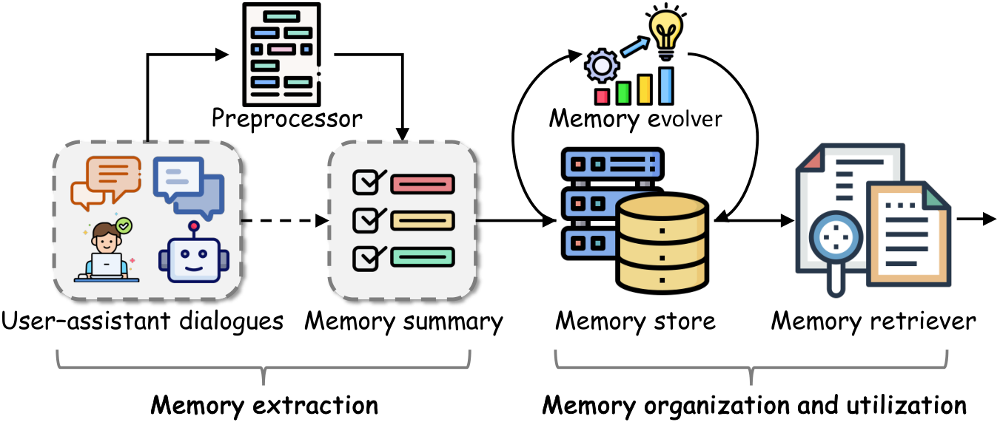
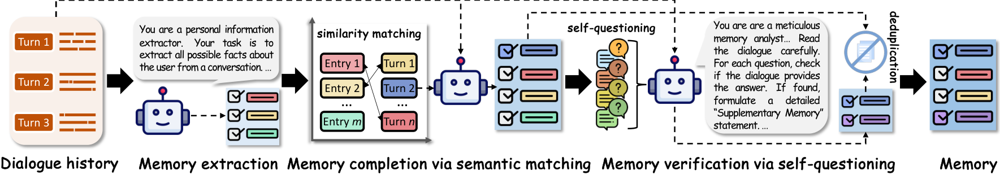
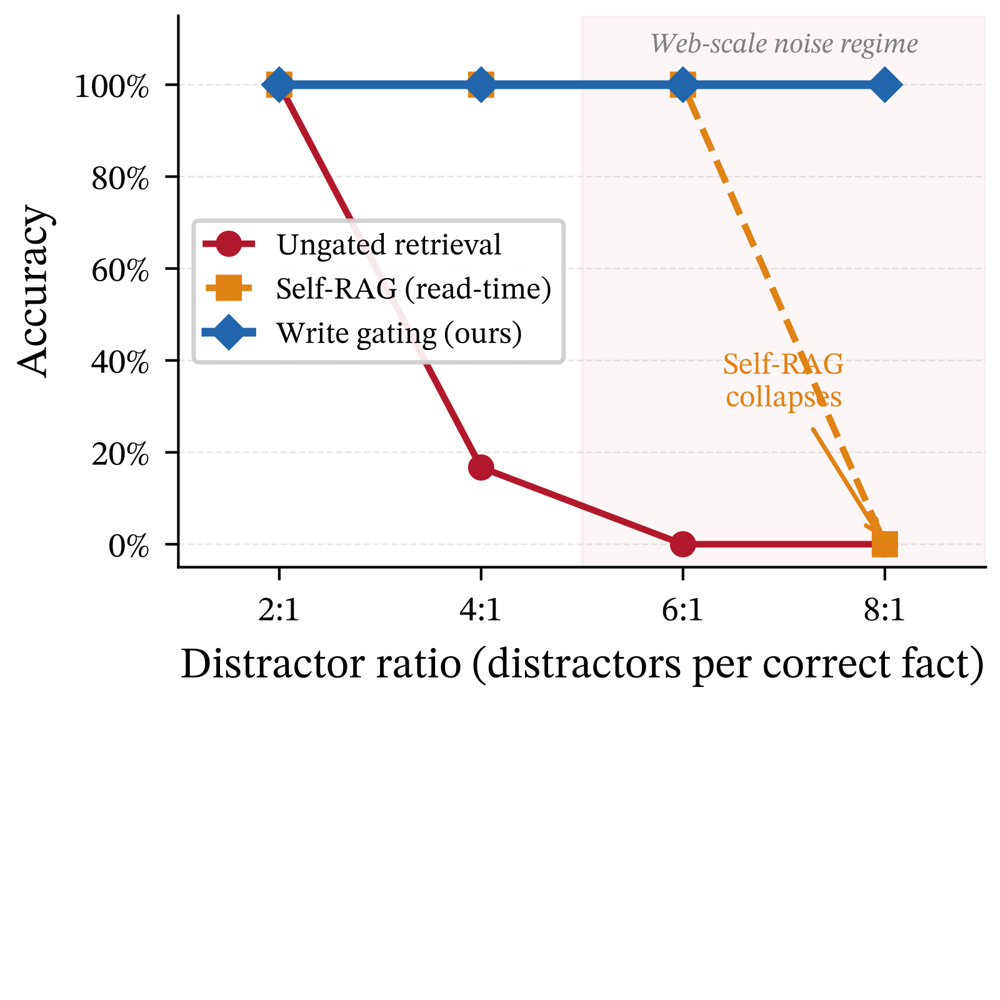
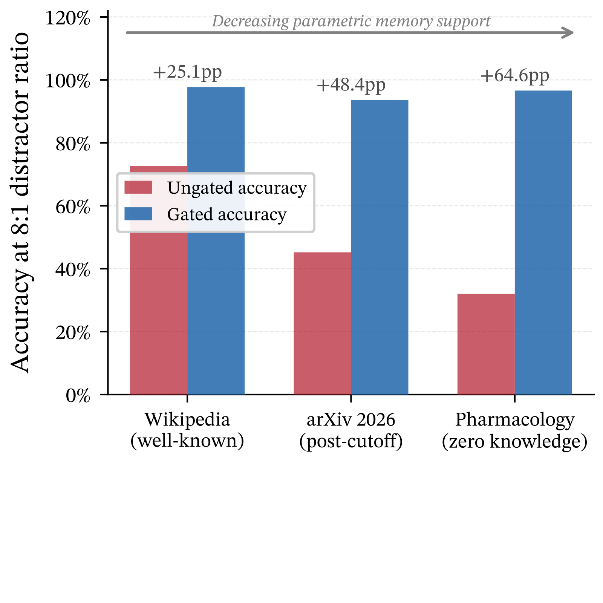
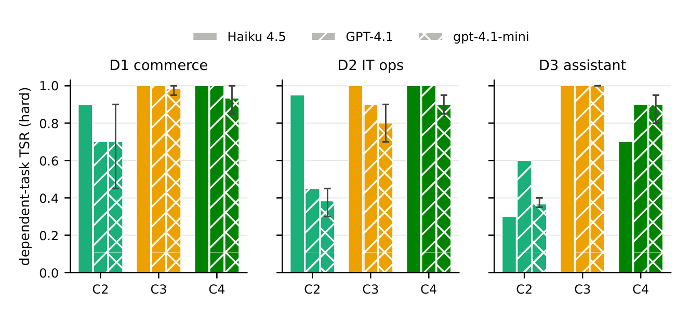
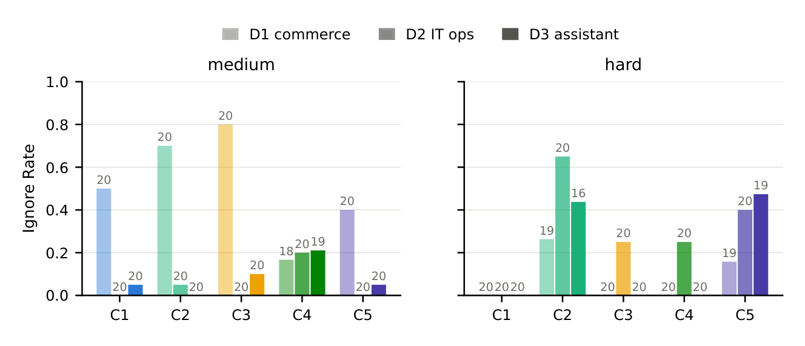

# Agent Memory 的写入路径：从抽取回路到分歧轴

一条信息一旦写进 Agent Memory，后面的检索、重排和提示词只能处理它留下的候选池。漏写、误写，或把失效条目和当前条目混在一起，都会在读时被放大。

本文是《Agent Memory 技术综述》系列第 5 篇。前四篇讨论记忆系统的形状、实现与治理；这一篇只盯住那个更早的动作：**一条信息被允许进入记忆之前，系统做了什么判断。**

2026 年的七篇论文给出的答案并不整齐。一条路线给抽取加上反馈回路，一条路线把质量判断前移到写入时；随后五篇论文分别追问：这些评测真的测到了 agent 的执行吗？判断是否一定要发生在写时？撤销标记有没有在读时被执行？

> **赶时间？** 第 2、3 节讲 ProMem 与 Selective Memory 的机制和实验；第 5 节是全文的转折，解释五篇后续论文如何收窄前面的结论；第 6 节给出工程动作。

本文可以独立阅读，不要求先看前四篇。核心的两篇论文是：

- **P-1**，Chengyuan Yang 等，*Beyond Static Summarization: Proactive Memory Extraction for LLM Agents*，arXiv:2601.04463，EMNLP 2026 Findings；
- **P-2**，Oliver Zahn、Simran Chana，*Selective Memory for Artificial Intelligence: Write-Time Gating with Hierarchical Archiving*，arXiv:2603.15994。

P-1 管的是候选记忆有没有被完整、忠实地抽出来；P-2 管的是候选对象该进活跃层还是进归档层。它们都把注意力从读时挪回写时，但还没有回答全部问题。

第 5 节讨论五篇后续论文（MERIT、LazyMem、UMA、Revoked、MemoryLACE）。它们不是来给前两篇凑例子的：其中一篇质疑评测任务本身，一篇反对写时构造，另一篇证明归档后仍需在检索侧执行有效性。这些分歧决定了本文不能把「写时更重要」写成一条没有条件的结论。

---

## 一、入口被忽略了很久

2023 年以来，记忆系统的演进路线很清楚：Generative Agents 加 memory stream 和 reflection，MemGPT 做上下文分页，Mem0 抽事实，Zep 建时间知识图，A-Mem 让记忆自组织。

这些工作几乎都在优化**存进去之后**的事情：怎么组织、怎么索引、怎么在需要时把对的条目找回来。检索、重排、压缩、路由，全是这一侧的题目。

P-1 的第一个论断就在这里：**抽取是被忽视的一段**。抽取发生在 agent 还不知道未来任务是什么的时候，却已经决定了后面所有环节能拿到什么原料。原料是脏的，检索再准也没用。

这也是这两篇论文值得单独成篇的原因。前四篇讲的是记忆系统的形状与治理，这两篇讲的是**形状之前的那一刀**。

> **与前文对照**
> 第 3 篇的十条生产基线里，头两条是「权威输入与派生投影分离」和「可控写入」。当时那是从工程事故里反推出来的原则。这两篇论文换了个角度：它们用对照实验去量化「写错了要付多少代价」，结论比原则本身更有说服力。

---

## 二、P-1：把抽取从一次性动作改成回路

P-1 的核心论证借自认知神经科学里的**循环加工理论（recurrent processing theory, RPT）**：大脑处理视觉信号时，先有一次快速的**前馈扫描**，再由高级脑区把信号回传形成**循环反馈回路**，后者才产生有意识的知觉。

作者认为现有的记忆抽取相当于只有前馈、没有反馈，于是它有两个先天缺陷：

- **提前**：抽取发生在知道任务之前，所以会丢掉那些当时看不出用途的细节；
- **一次过**：抽取只做一遍，错了没有第二次机会，错误会留在记忆里持续污染下游。

对应的解法就是把抽取拆成三个阶段，并在第三阶段装上一个回路：

1. **初始抽取（前馈扫描）**：让模型当「个人信息抽取器」，快速扫一遍对话，抽出一批初始记忆条目；
2. **语义匹配补全**：用嵌入模型把每条记忆映射回它来源的那几轮对话；如果某一轮和任何条目都对不上，说明这轮被漏掉了，对它做一次**针对性二次抽取**；
3. **自我提问验证（循环反馈）**：对每条候选记忆，让模型自己生成一个「索取证据」的问题，然后回到原文去回答。答不上来就判定为幻觉、直接丢弃；答得上来就用原文里的表述替换掉原条目。最后做去重合并。

第 3 阶段最值得记的一点是：**它不是让模型再总结一遍，而是让模型先提问、再回答。** 抽取是生成动作，容易顺着上下文编；提问—找证据是判别动作，模型必须回到原文里指名道姓地找，幻觉明显更难通过。

### 2.1 一次过抽取到底会丢多少东西

论文在 **HaluMem**（一个专门为检测记忆幻觉而构建的基准）上做了主实验。下面的数字取自该论文的 **v2 修订版（2026-09-01）**——v1 的实验部分被大幅改写，v1 的数值已不适用：

| 方法 | 记忆完整性 | 记忆准确率 | 问答准确率 |
|---|---|---|---|
| Memobase | 14.55 | 92.24 | 35.33 |
| Supermemory | 41.53 | 90.32 | 54.07 |
| MemOS | 84.81 | 86.25 | 67.23 |
| Mem0 | 42.91 | 86.26 | 53.02 |
| LightMem | 57.94 | 92.33 | 55.81 |
| ProMem | 81.37 | 94.68 | 63.43 |

几个数字值得单独看：

- **完整性从 41%—43% 抬到 81.37%。** 也就是说传统一次性抽取会漏掉一半以上的用户信息，而不是漏一点。
- **但完整性和问答准确率的第一名都不是 ProMem，而是新增基线 MemOS（84.81% / 67.23%）。** ProMem 拿的是**最高的记忆准确率（94.68%）与最高的综合 F1（87.52%）**。MemOS 走的是与 Memobase 恰好相反的极端：抽得多，但也把更多错误带进了记忆（准确率 86.25%）。
- **Memobase 的准确率高达 92.24%，完整性却只有 14.55%。** 这不是它抽得准，而是它抽得少——只抽极少数把握大的事实，用覆盖率换精确率。P-1 的消融实验把这个策略讲得更清楚：把抽取压回一次性动作以后，模型拿到**最高的准确率（92.64%）却拿到最低的完整性和问答分（54.03 / 50.60）**。没有反馈的模型会自动转向保守。
- **问答分 63.43%，高于专注检索优化的 LightMem（55.81%）。** 最后这条是 P-1 最锋利的地方。LightMem 优化的是「怎么找到记忆」，P-1 优化的是「该存什么」。在 LongMemEval-S 上，P-1 拿到 **72.12%**，超过包括 LightMem（68.64%）在内的全部基线；在 LoCoMo 上则是 **77.56%** 对 LightMem 的 **72.99%**。作者由此下了一个判断：**更好的数据比更好的算法更重要。**

同一组实验里还有一个反向证据：**Mem0 的表现明显差于 NativeRAG**——也就是反而不如直接用原始对话分块。这引出一句我认为值得贴在每个记忆系统设计文档首页的话：

> **好的记忆管理有益，糟糕的记忆管理还不如没有记忆。**

### 2.2 这笔 token 值不值得花

多一个验证回路，就多一轮模型调用。P-1 没有回避这个问题，而是给了三条理由和一个实验：

- **写一次、读多次**：抽取成本只在对话发生时付一次，之后这份记忆会被检索复用很多次，摊到每次使用上并不高；
- **抽取通常是异步的**：它不阻塞用户交互，所以可以接受质量优先于延迟；
- **可以用小模型**：把自我提问和匹配交给小模型做。实验里换成 Llama3-8B 以后，ProMem 的完整性仍从 Mem0 的 30.59% 提到 43.09%，问答分提升 **10.74 个百分点**，而准确率基本不变——说明多抽出来的内容没有引入额外幻觉。

更实用的一个结论来自 **token 压缩实验**：把输入对话压到只剩 20%（丢弃 80% 的 token），ProMem 仍保持 **37.20% 的问答分和 57.20% 的完整性**，而 Mem0 在同一条件下崩到 **21.34% / 23.28%**。作者的解读是：激进压缩输入、把省下来的预算花在验证回路上，可以省掉约 60% 的 token，同时不损失性能。

---

## 三、P-2：把质量判断前移到写入那一刻

如果 P-1 管的是「写什么」，P-2 管的是「准不准写」。它给出的方案叫**写时门控 + 分层归档**。

论文的出发点是一组对照：RAG 不加判断地接收一切，噪声累积后检索精度下降；参数化记忆把知识压进权重，又无法选择性更新或删除。两者都不像生物记忆。生物记忆有两个被现有架构忽略的特征：

- **编码是选择性的**：海马体依据新颖性、情绪显著性和目标相关性来决定什么被固化；
- **遗忘靠降级而非删除**：信念更新时不抹掉旧状态，只降低它的可及性，保留日后重建的链接。

第二点被论文提炼成一句很好记的话：**取代创造的是层级，而不是替换。**

### 3.1 三个信号和一道门

每个进入的知识对象先算一个复合显著性分数，由三个**在写时就能观测到、不需要知道答案对错**的信号组成：

- **来源声誉**：贡献者或来源的历史可信度；
- **新颖性**：与活跃存储中已有内容的最大余弦相似度之补，也就是「这条信息有多新」；
- **来源可靠性**：同行评审状态、机构背书、独立佐证等元数据。

分数超过阈值 τ 的进活跃存储，低于阈值的**进冷归档，而不是被丢掉**。

论文特别强调了一个设计约束：门控**不访问 oracle**。此前不少记忆门控工作实际上用了与真值相关的代理信号，等于偷偷告诉门控「哪条是对的」，这在真实部署里不存在。声誉、新颖性、可靠性这三个信号，都只看写时的元数据。

### 3.2 结果有多硬

在合成对抗基准上（50 个知识对象 = 10 条正确事实 + 40 条高相似度干扰项），结果是这样的：

| 条件 | 存储规模 | 压缩比 | 准确率 |
|---|---|---|---|
| 未门控 | 50 ± 0 | 0% | 13.3% ± 4.7% |
| 写时门控 | 13 ± 1 | 75% | 100% ± 0% |

未门控时干扰项占存储内容的 80%，模型会被数量占优的错误内容带偏。门控后只留下 12—14 条，其中仍有 2—4 条漏网的干扰项——但准确率在所有随机种子上都是 100%。作者的解读是：**门控不需要过滤得完美**。它只需要把信噪比从未门控的 1:4 扭到约 3:1，让正确事实从少数变成多数，模型就能稳定地找出它。

然后是全篇最重要的那张表。

| 干扰比 | 未门控 | Self-RAG（读时） | 写时门控 |
|---|---|---|---|
| 2:1 | 100% | 100% | 100% |
| 4:1 | 16.7% | 100% | 100% |
| 6:1 | 0% | 100% | 100% |
| 8:1 | 0% | 0% | 100% |

读时过滤在 8:1 时崩溃到 0%，写时门控保持 100%。论文对这个相变的解释是结构性的，也是我认为整篇最该记住的一句话：

> **读时过滤只能在「已经被检索到」的条目里做选择；写时过滤决定的是「什么才可供检索」。**

当噪声低时这个区别无所谓；当噪声高时，正确事实根本不会出现在候选集合里，再多的重排也无法让一条从未被检索到的事实浮现出来。

还有一个反直觉的结果：把写时门控和读时过滤**叠加使用**，准确率反而从 100% 掉回 93.8%。原因是在一个已经很干净的存储上，读时的 critic 会误拒正确事实，引入写时门控本来可以避免的假阴性。**在读时过滤变成了净损失。**

### 3.3 归档而不是删除

P-2 的另一个机制是**版本链**：新信息更新旧概念时，系统建立取代链接而不是覆写，旧版本移进归档。于是能回答「这个概念上一次更新之前是什么」。

论文构造了 50 个概念、每个 3 个版本做时间性查询：**带血缘的归档系统 100%，覆写式系统 0%。**

作者强调这不是精度差异，而是**定性的能力差异**——覆写式系统无论怎么调阈值都答不出历史查询，因为它把历史销毁了。

这在工程上有两个直接对应物。一是合规：删除能力（面向「被遗忘权」）靠离散可寻址对象支持，历史重建（面向审计）靠版本链支持，而权重式记忆两样都给不了。二是**期权价值**：被门拒绝的对象进归档而不是被删除，等策略变化、新用例出现或质量信号改进时还能被重新评估。论文的说法是：**归档对象可以在新条件下被重新评估，删除对象一旦需要就必须重新采集。**

### 3.4 优势不是恒定的，它和「模型会不会自己答」成反比

P-2 最后一段实验设计得很好。作者把同样的机制放到四种知识情境里测，得到了一个非常干净的规律：

- **Wikipedia 知名事实**：未门控还有 85.2%，门控 98.1%，**+12.9pp**（该实验 4:1 干扰比）；
- **2026 年 arXiv 论文**（在模型训练截止之后发布）：8:1 时未门控 45.2%，门控 93.6%，**+48.4pp**；
- **程序化生成的药理学数据**（结合亲和力的 nM 值由哈希确定性生成，模型不可能见过）：8:1 时未门控 32.0%，门控 96.6%，**+64.6pp**。

规律是：**门控优势与参数化记忆的支撑程度成反比。** 模型自己「记得」知识时，写错一点它还能靠先验补救；当知识完全来自外部、模型零先验时，写入质量就成了唯一的安全网。论文的总结是：写时门控最有价值的时刻，恰恰是 LLM 无法用训练知识弥补检索错误之时。

成本侧的对比同样清楚。写时门控在写入时用元数据算分，**不调用 LLM**；查询时只做一次生成调用。而 Self-RAG 式读时过滤要为每一段检索内容调用一次 critic——检索池为 8 段时，每次查询需要 9 次 LLM 调用，写时门控只需 1 次，**9 倍差距**。用论文自己的话：写时的显著性评估是一次性成本，可以被对该存储的所有未来查询摊薄。

### 3.5 两个必须知道的边界

**第一，元数据是承重墙。** 论文做了一个污染实验：让一部分高声誉来源里混入错误事实，同时保留它的高声誉标签。结果门控准确率**每增加 10 个百分点污染就下降约 20 个百分点**（0% 污染 98.0% → 5% 78.0% → 20% 52.0% → 30% 30.0%）。而未门控准确率无论污染率多低都接近零。作者由此得出的结论我认为比门控算法本身更重要：**在生产系统里，维护元数据质量（来源验证、评审状态）至少和门控算法同等重要。**

**第二，别把 100% 当成能力指标。** 那个 100% 出自一个 50 个对象的合成基准，而且基准里的来源标签是按构造与真值相关的——正确事实都来自高声誉来源。真正让结论站稳的是两个补充实验：在真实 Wikipedia 数据上（20 个实体、5 类、73 条真值事实 + 292 条干扰项），写时门控达到 **98.1%**（未门控 85.2%），滤掉 87%—90% 的干扰项；以及**把来源标签信号整个去掉以后，只靠声誉与新颖性仍有 96.4%，比完整信号集只低 1.4 个百分点**。这后一个数字才是「不依赖 oracle」这句话的证据。

---

## 四、两篇论文已经说清什么，还没说清什么

P-1 和 P-2 很容易被概括成「写时优于读时」，这个说法太粗。它们各自覆盖的是不同层次，实验场景也不同。

| 层次 | P-1 ProMem | P-2 Selective Memory | 工程上要回答的问题 |
|---|---|---|---|
| 候选生成 | 抽取—补全—验证，减少遗漏和幻觉 | 不讨论如何从对话中抽取候选 | 候选是否完整、是否有原始证据 |
| 活跃层准入 | 不以此为重点 | 按写时元数据把对象分进活跃层或冷归档 | 哪些内容值得参与默认检索 |
| 历史与更新 | 去重、修正条目 | 建立取代链，保留旧版本 | 当前值、历史值和冲突值如何并存 |
| 读时责任 | 以问答表现验证抽取质量 | 对比了读时 critic | 已撤销或被取代的条目能否被拦住 |

两篇共同支持一个较窄但有力的判断：写入阶段决定了默认候选池的质量。P-1 在 LongMemEval-S 上以 72.12% 超过 LightMem 的 68.64%；P-2 在高噪声合成场景中显示，正确事实没有进候选集合时，后续重排无从补救。

这还不能推出三个更强的结论：写时一定比读时适合所有任务；归档后旧记录自然不会被读到；对话问答高分必然转化为 agent 的正确行动。第 5 节的五篇论文恰好逐一检验这三处空白。

---

## 五、2026 下半年：这条路分岔了

上半年的两篇论文把写入机制拆开了；下半年的五篇论文开始补它们没有覆盖的条件：评测是否贴近执行、候选构造应该发生在何时、版本链是否真的约束了读取。它们没有给出单一胜者，而是把选型问题拆得更具体。

这一节按「先校验问题，再讨论路线，最后补执行约束」的顺序展开。MERIT 既提供最强的外部证据，也给前文划出最重要的适用范围。

### 5.1 先问一个更硬的问题：记忆评测本身选错了题

MERIT（*When Does Memory Help? A Cost-Aware Evaluation of Long-Term Memory in Tool-Using LLM Agents*，arXiv:2609.05441）指出，当前对 agent 记忆的评测几乎都建立在对话式回忆基准上——LoCoMo、LongMemEval、BEAM。它们测的是「系统能不能回答关于一长串对话的问题」，而生产环境里的 agent 要用记住的事**去选对工具调用**：对的客户 ID、上次谈定的退款金额、上周事故里确认的配置改法。

「能答对」和「会照做」是两件事，而后者此前没有被量化过。

它造了一个专门测后者的基准：三个领域（客服、IT 运维、个人助理）的分幕工具调用任务，难度分三档，其中**难档就是「事实在任务中途被更新」**；每个任务配自动泄漏检查，确保除了记忆之外没有任何其他通路能拿到金标准事实；再叠加受控的记忆损坏（按已知速率注入陈旧、矛盾、干扰记录）。最后，它把每一次记忆操作的 token 与美元都计上账。规模是 23,440 个计分幕、$42.57 的真实 API 成本、3 个 agent 模型 × 3 个种子。

**无记忆时，依赖型任务的成功率在全部九个格子上都是 0.00**，而加上记忆后被抬到 0.55—1.00。也就是说，这些任务**真的**只能靠记忆完成。

然后是本文最该关心的那一组。

| 事实被更新的难度档 | D1 客服 | D2 IT 运维 | D3 个人助理 |
|---|---|---|---|
| 嵌入检索（C2） | 0.90 / 0.70 / 0.70 | 0.95 / 0.45 / 0.38 | 0.30 / 0.60 / 0.37 |
| LLM 摘要（C3） | 1.00 / 1.00 / 0.98 | 1.00 / 0.90 / 0.80 | 1.00 / 1.00 / 1.00 |
| 结构化事实库（C4） | 1.00 / 1.00 / 0.93 | 1.00 / 1.00 / 0.90 | 0.70 / 0.90 / 0.90 |

（每格三个数依次为 Claude Haiku 4.5 / GPT-4.1 / gpt-4.1-mini 三个模型；记忆侧固定。全重放基线在九个格子上都是 1.00，无记忆是 0.00。）

**嵌入检索在这一档上崩了，而且崩得不可预测。** Haiku 4.5 在客服和 IT 运维上守住了 0.90 / 0.95，却在个人助理上摔到 0.30；GPT-4.1 与 gpt-4.1-mini 相反，在 IT 运维上掉到 0.45 / 0.38。跨「模型 × 领域」的总跨度是 **0.30—0.95**；同一个系统在不同随机种子上，最差格子能报出 0.45 到 0.90 之间的任何数字（种子间最大差距 0.45）。相比之下，**写时更新式的记忆横跨 0.70—1.00**。

作者的归因很直接：检索会把陈旧值和新鲜值**并排**返回，而返回内容里没有时效性信号可供仲裁；写时更新在写入那一刻就把旧值覆盖掉了，冲突根本不存在。他们还额外发现一条反直觉的事实：**混合方案不如它「较好的那一半」**（0.50—0.80 vs 事实库的 0.75—1.00），因为检索那一半把事实库已经消除的陈旧性重新引了进来。

这里有一处需要停下来讲清楚，因为它直接动摇 P-1 的前提。

表里最稳健的条件之一是「LLM 摘要」——也就是 P-1 标题里说要超越的那个「静态摘要」。它稳健的原因不是摘要更聪明，而是**它每一幕都重写状态**，因此天然保留最新值；同一篇论文里，用截断式摘要（起始实现）的版本在难档上只有 0.00 / 0.15 / 0.00。所以「摘要」这一族内部差得极远：**问题不在「写了状态」，而在「写了一次之后不再动」。**

P-1 的完整标题是 *Beyond Static Summarization*，「static」这个词承担了全部论证重量——它是对的，但只对到这一步为止。

第二组结果是一个此前没有被量化过的失败面：**agent 会忽略它已经拿到的记忆。**

在难档、合并各领域后，共有 55 个幕的记忆块里出现过正确的最新值，而 agent 只对其中 30 个付诸了行动——**忽略率 0.45**（起始实现代是 0.53）。即便拿全重放（记忆块就是一份干净完整的转录）来测，在多事实的中档幕里，agent 也会忽略掉多达 0.50 的自己「手里有」的事实。提高检索质量对这一点几乎无补。

论文从轨迹里读出两种模式：一是在检索条件下，陈旧值与新鲜值并存，agent 会「取平均」「追问」，或者干脆挑中陈旧的那个；二是在需要组合多个事实时，agent 只对它认为离任务最近的那部分事实行动。

两种模式都指向同一句话：**记忆的「呈现方式」——有没有来源标记、有没有时效标记、矛盾有没有被凸显——和记忆的「存储」一样重要。** 这句话是本文前四节没有说到的。

第三组结果是几条具体的账目，合起来说明「写入路径的工程质量」是一笔必须以某种形式支付的税：

- **替换实现方式本身就能造成最多 60 分的摆动。** 把结构化事实库的抽取器从手工调好的正则模式换成通用 LLM 抽取器，在 IT 运维的中档上从 1.00 掉到 0.40。作者的说法是：抽取质量是结构化记忆的「税」，要么以领域工程支付、要么以计量的 token 支付，但**永不为零**。
- **陈旧记忆危害落在最该防守的地方。** 在客服领域注入陈旧数据后，唯一达到统计显著性的危害出现在「混合方案」上（在污染率 0.3 处危害 +0.25）；而换成 LLM 抽取器的事实库也出现 +0.20 的危害，正则式版本则 ≤0.05——通用抽取器会摄入那些刚性模式本来会拒绝的损坏记录。
- **成本从来不是决定因素。** 论文报告了一个成本调整后的边际效用指标，结论是：全重放从来不是经济之选（比各领域最优差 2.7—3.9×），但当记忆起作用时，所有条件的盈亏平衡任务价值都在「不到一美分」的量级。在这些模型价格下，从业者真正在选的是鲁棒性，不是每幕省下的那点钱。
- **一个全新的维度：记忆来源怀疑。** 在最强模型 Claude Opus 4.8 上，原本用于校验基准的「全重放」控制格崩到了 0.75。轨迹显示原因不是记忆故障：模型**引用**了被记住的金额，然后拒绝据此行动，理由是这条信息「只能追溯回我自己的确认消息」，并要求主管确认。作者把这归结为安全姿态的产物，并指出朴素的任务完成率排行榜会把它误读成一个更弱的 agent。同一厂商的 Sonnet 5 干净通过了这个控制并复现了原模式。

对本文来说，MERIT 的意义是双向的。它用完全不同的场景和指标**独立复现了「写入侧决定上限」**——而且是在「事实会演化」这个具体场景里干净胜出。但它同时把 P-1 的证据基础划了范围：LongMemEval 与 LoCoMo 属于「对话式回忆」，它们的高分说明的是「能答对」。P-1 的 72.12% 是一个关于回忆的结论，把它直接外推到「agent 会照做」，中间隔着一个 0.45 的忽略率。

### 5.2 反方向的证据：写时干脆什么也不做

LazyMem（*Retrieve Broadly, Construct Selectively for Efficient Long-Term Agent Memory*，arXiv:2607.22690）是本文立论最锋利的反例。它把现有主流做法统称为「先构造后检索」（construct-then-retrieve）——也就是 P-1 和 P-2 都站的那一侧——并给出一个结构性的反对理由：

**写入时的构造必然与查询无关**（query-agnostic）。既然还不知道未来要问什么，这个构造就可能丢掉后来才显得关键的细节，而丢掉是不可逆的。

它引用的支撑材料相当硬：AMA-Bench 的消融显示，**即使把检索错误完全排除**，拿到「构造后记忆」的模型也显著差于拿到对应黄金交互轮次的模型——损失来自构造这一步本身。

LazyMem 的做法是反过来的。写入时**原样存储、零处理**；查询时先用稠密 + BM25 混合检索加交叉编码器重排，捞出一个刻意做大的高召回候选池，再由一个 4B 的记忆处理模型在**重叠的并行窗口**上逐条消息预测「保留 / 丢弃」，被保留的改写成只含查询相关内容的压缩形式，按时间拼成最终上下文。它的训练用 SFT 打底，再用分组策略优化（GRPO）微调，奖励是一个格式门控的复合量：一半来自数据自身的黄金标注（保留黄金消息、丢弃非黄金消息的非对称奖惩），一半来自 LLM 评判的质量分（**忠实度做门控**，完全不忠实的内容无论看起来多有用都得零分），并按两阶段课程调度。

数字是这样的：LongMemEval 上，4B 的 LazyMem 拿到 **0.85** 的 LLM 评判准确率，而最终喂给回答模型的上下文只有 **213 个记忆 token**——比「只做检索、不做构造」的做法少 **68.7 倍**；在完全没有目标域训练的情况下泛化到 LoCoMo 得 **0.68**；32B 变体到 **0.93**，在聚合密集的题型上超过了基于黄金上下文的参照。端到端时延还低于此前的查询时方法。代码开源。

**为什么说它锋利：** P-2 的主张是「在写时压缩并筛掉低质量对象，优于在读时再筛」；LazyMem 指出的则是，查询未知时，写时构造可能先丢掉未来问题需要的细节。它的证据面也更宽：两个成熟基准与开源实现，对比 P-2 的 50 个合成对象主实验。

两篇没有在比较同一个读时动作。P-2 批评的是在**已经被检索出来的候选里**再做质量筛查的 Self-RAG 式 critic；LazyMem 则先从未经压缩的原始对话中高召回检索，再围绕当前查询构造上下文。P-2 又会把被门拒绝的对象放进冷归档，而不是物理删除。

更基础的分歧是：**系统是否把抽取后的记忆当成唯一副本。** ProMem 会丢弃无法经原文验证的候选，P-2 会把低显著性对象归档，LazyMem 会保留原始对话并把构造推迟到查询时。只要原始对话或审计日志能长期保存，丢弃候选条目不等于丢失证据；一旦抽取层是唯一副本，任何写时压缩都必须按不可逆操作来设计。

因此，判断位置仍然是一条重要轴，但它不是唯一轴：P-2 在写时用元数据作判断，LazyMem 在读时为每个查询运行小模型，ProMem 在写时以原文验证候选。三者的成本和错误类型不同，不能把它们简单归为同一派。

代价结构也因此不同，而这才是选型时真正要算的账：

| 路线 | 成本付在哪 | 换来什么 | 代价 |
|---|---|---|---|
| 写时判断（P-2 / MERIT 的 update-on-write） | 一次，被该存储的所有未来查询摊薄 | 候选池信噪比高、冲突在写时就消解 | 假阴性不可逆；元数据被污染时退化很快 |
| 写时不判断（LazyMem） | 每次查询 | 不丢任何细节，尤其适合查询分布未知的场景 | 查询时延与算力；上下文预算管理变复杂 |
| 把判断交给策略（下一节） | 训练 + 奖励设计的钱 | 任务适应性 | 需要一个可自动判分的任务分布 |

LazyMem 还没有解决时效性仲裁：它按相关性构造，不负责判定哪个版本是当前值。查询时构造仍可能把陈旧值挑进上下文，这正是 MERIT 里嵌入检索失效的成因。无论判断发生在何时，系统仍需要独立的生命周期与有效性语义。

### 5.3 第三条路：把「写什么」交给学习

UMA（*Learning to Remember: End-to-End Training of Memory Agents for Long-Context Reasoning*，arXiv:2602.18493，EMNLP 2026 Main）是 P-1 最自然的后继：如果把 P-1 的三段回路（抽取—补全—验证）看作一套**人工设计**的记忆写入策略，UMA 问的是——这套策略能不能**学**出来。

UMA 的做法是把记忆操作与问答统一在**单一策略**里：策略既维护一个支持显式增删改重组的结构化记忆库（外加一份紧凑的核心摘要做全局上下文），又负责回答。训练用任务分层 GRPO——**用下游问答的结果反向监督记忆写入**（记忆维护阶段与问答阶段交替采样，优势估计按任务分层）。

它给出的理由值得单独记：现有方法要么是启发式的（Mem0、Zep 靠手工提示与模式，没有任务适应性），要么把记忆管理与任务执行**分开训练**（Memory-R1、Mem-alpha），而后者的根本问题是——**任务结果产生的信用无法回流去塑造记忆决策**。做得对还是做得错，写记忆的那部分拿不到信号。

它自建了一个诊断基准 **Ledger-QA**：答案由累积更新导出的**潜在值**决定，而不是靠检索某个局部片段就能拼出来——专门用来测连续状态追踪。结果是：

- **13 个数据集（测试时学习 / 精准检索 / Ledger-QA 三类）平均 77.36%**，对比 MemAlpha 64.50%、RAG(k=20) 54.09%、简单拼接 51.87%；
- **Ledger-QA 上把会话数拉到 50**：RAG 跌到 20% 以下，MemAgent 掉到约 20%，UMA 仍保持 50% 以上（最佳基线勉强 25%）。短程（≤5 会话）时 RAG 还能拿 70—90%，所以这是纯粹的长程崩塌。

消融实验是这一篇最有说服力的地方：把训练拆成「先训记忆维护、再训问答」两个阶段（即放弃端到端），平均从 77.36 掉到 66.29——**11 个百分点**；完全不训记忆维护掉到 63.81；不做强化学习掉到 61.38。也就是说，这不只是「联合训练略有收益」，而是**记忆策略的价值主要来自端到端的信用回流**。

边界也要讲清楚：UMA 的奖励仍然来自下游任务结果，因此它需要一个**可自动判分的任务分布**。「Ledger-QA 对得上账吗」是可计算的，「这段用户对话里什么值得记」不是。所以在开放场景里，这条路暂时还接不上——它能学的，是有验证信号的那部分记忆。

### 5.4 写对了还不够：撤销要能被执行

前面几节都在讨论「怎么写对」。Revoked（*Revoked but Still Authoritative*，arXiv:2609.08258）转向另一个问题：**写对之后，被否定的旧记录还能不能继续发挥作用？**

它的出发点是本文 3.3 节那个结论：这一代记忆系统普遍采用**软撤销**——把被矛盾的事实标记为无效并保留，而不是删除（正是 P-2 的「归档而非删除」）。这个设计支持审计与时间点查询，也避免了破坏性更新。但论文问了一个此前没人测过的问题：**这个标记在检索时真的被执行了吗？**

它测了五个主流系统（Graphiti、Zep、mem0、langmem、cognee）× 九种策略场景 × 九种模型 × 六种防御条件。

| 防御条件 | 作用位置 | 不安全动作率 |
|---|---|---|
| 无防御 | — | 43.1%（699/1,620） |
| 提示词加固 | 读取之后 | 37.2% |
| 输出过滤 | 读取之后 | 18.1%（且被额外告知了「哪条是已撤销的」） |
| 存储级过滤 | 读取之前 | 0.0%（0/1,620） |
| 过滤器 + 提示词加固 | 两者 | 0.0% |

**没有任何系统在默认情况下强制执行撤销。** 五款里有两款把已撤销记录返回给 agent（各 81/81），而且**每一次都把它排在替代它的新策略之上**——已撤销策略的措辞通常更绝对（「必须被阻断」对比「被监控」），而按相似度排序的检索器恰好偏好这种措辞。后果是 agent 在 Graphiti 上有 44.2%、在 mem0 上有 42.1% 的试验里，依据一条已经被撤销的策略采取了**不安全动作**。

失效有三种形态：①**撤销从未被记录**（cognee、langmem）；②记录了，但状态对调用方隐瞒，任何应用都无法执行它（Zep）；③记录了、也可见，但**在检索时不被执行**（Graphiti 默认）。

- **仅提示词加固几乎无效（43.1% → 37.2%）**——提示要求模型忽略被取代的事实，但被检索出来的上下文里**根本没有说明哪条被取代了**，模型必须在缺少关键信息的情况下做判断。输出过滤能降到 18.1%，但那是在一个真实部署不具备的优势下取得的：它被额外告知了哪条文本是已撤销事实。
- 第三组结论是根因定位。论文做了一个很干净的消融：**同一份 mem0 数据，只改一个检索标志**，81 个匹配单元里有 39 个从安全翻成不安全，**且从未反向**。两款被暴露的系统是独立实现，但在相同场景与模型网格上无法区分（p = 0.629）。**失效在检索侧，不在存储侧。**
- 第四组结论最反直觉：**这和模型能力无关。** 九种模型全部中招，不安全动作率 15.0%—60.0%，而且**能力层级与不安全动作率之间没有相关性**——旗舰组跨度是 33.3%—58.9%，而整个集合里最抗的一个是快速的**非推理**模型 Grok-4-Fast（15.0%）。原因是两条策略在上下文里以平等的姿态出现，模型手里没有任何可以区分它们的依据。所以「换个更强的模型」在这里救不了，和 P-2 的元数据污染实验指向同一类工程约束。

论文的总结一行字：**所缺失的控制是「检索时有效性」，而不是来源。**

这一节同时修正了本文 3.3 节和 P-2 的一个推论。

3.3 节说「归档而非删除」，理由（审计、期权价值、可重建历史）依然全部成立——Revoked 没有推翻任何一条。但它补上了**必要条件**：归档的正确性只保证「信息还在」，**不保证陈旧信息不会继续指挥 agent**。归档之后必须再配一道检索层的有效性闸门，否则那个 100% 对 0% 的能力差异会变成 43.1% 的不安全动作率。

对 P-2 的修正更微妙。P-2 的实验说读时过滤是**净损失**——把写时门控和读时过滤叠加，准确率反而从 100% 掉回 93.8%，因为在一个已经很干净的存储上，读时的 critic 会误拒正确事实。Revoked 却说读时的有效性检查是**唯一有效**的控制手段。

两者不矛盾，因为它们管的是两件事：

- 读时做**「质量判断」**是多此一举甚至有害的（存储已经干净了）；
- 读时做**「有效性强制」**是不可省的（存储里的旧版本永远还在）。

这恰好回到 P-2 自己那句话——**取代创造的是层级，而不是替换**。层级既然被创造出来了，就必须有人**在读取的时候走对那条边**。写时门控决定「层级里有什么」，读时有效性决定「沿着层级读到的那个是不是当前值」。前者不能替代后者。

### 5.5 中间路线：不吃掉全局图的归档语义

前文提出「不要原地销毁信息」是这一代记忆系统最接近共识的设计约束。**MemoryLACE（arXiv:2609.03201）** 是这条约束已经落地成工程实现的一个例子，而且它证明了**不需要**付出全局知识图或反思阶段的代价。

它把自己定位在「扁平文本记忆」与「完备结构化记忆」之间：保留原子的自然语言记忆及其溯源，但用**稀疏的局部关系**——合并（merge）、取代（supersession）、矛盾（contradiction）——把相关条目连起来。写入阶段靠有界的候选比较与局部批式演化建立并修复这些关系；读取阶段用活跃记忆做锚点，沿生命周期链接扩展出相连的历史与冲突证据，把「当前—历史—支持—冲突」重新打包成一个**关系感知的证据单元**交给下游，而不是扔给它一堆互不相干的片段。

- **BEAM 100K 上同主干对比最优**（4B 主干 45.4，9B 主干 51.9 总体分），增益集中在「正确答案需要把若干相关记忆放在一起看」的那几类：偏好遵循、弃答、多跳推理、事件排序、指令遵循；
- **端到端运行时 7 小时 31 分，对比反思式基线 Hindsight 的 22 小时 30 分，降低 66.6%（2.99×）**，最大的节省就在记忆构造阶段（3.02×）——它用有界整合和局部批式修复，替代了 Hindsight 那套昂贵的全局反思；
- **StructMemEval（GPT-5.5 主干）上状态追踪 100%、树结构 100%**，对比 Mem-Agent 的 57% 与 50%，宏平均 52.08% vs 35.00%。状态追踪拿满分直接来自本文第 3.3 节讲的那套语义：**取代链接保留每一个历史状态，活跃链头解析出当前状态**，于是「现在是什么」和「以前是什么」都能答对。

消融也值得抄下来，因为两个最关键的组件**不可互换**：

| 消融变体 | 总体分变化 | 损失集中在哪 |
|---|---|---|
| 去掉生命周期扩展 | −5.16 | 知识更新 51.9→35.0、多跳 55.3→42.3、时间推理 26.3→13.8 |
| 去掉时间感知 | −4.97 | 矛盾消解 40.3→26.6、偏好遵循 84.4→75.6 |

作者的解释是本篇读到的最清楚的一处机制区分：**连接性决定「检索到哪些相关记忆」，而时间 grounding 决定「它们之间的差异被读成真正的冲突，还是有序的变化」。** 没有后者，一次正常的更新会被误判为矛盾。

合并策略也有一个很实用的取舍。把多条证据压成一条紧凑记忆，会让矛盾消解从 40.3 提到 44.1，却让多跳推理从 55.3 降到 43.0，总体净降 1.43。需要一条调和后的当前结论时，紧凑合并有价值；需要追溯独立证据、串起多跳关系时，保留原条目和链接的默认合并更合适。

它的结论原话，我认为可以直接作为本文的收尾判断之一：在它评测的设置下，长期记忆的主要挑战**并非更丰富的全局结构，而是保留证据随时间的演化方式。**

边界同样清楚：矛盾消解与知识更新是它的强项，但计数类任务它完全没解决（Count 得 0%），推荐类只有 8.33%。作者自己指出需要专门的聚合算子（比如去调计算器或代码执行）。**生命周期关系管「证据的有效性」，不管「数值的累积」**——这两件事不该由同一套机制扛。

### 5.6 五篇之后，结论要拆成三条轴

| P-1 / P-2 给出的初步判断 | 五篇之后的限定 |
|---|---|
| 质量判断应该前移到写入侧 | 在事实会演化的场景里成立（MERIT 独立复现）；但它不再是单向共识——「写时零构造」是一条有分量的对手路线（LazyMem） |
| 写时门控优于读时过滤 | 要拆成两件事：读时的**质量判断**确实多余（P-2）；读时的**有效性强制**不可省（Revoked，0/1,620 vs 43.1%） |
| 归档而非删除 | 仍是共识，但只是**必要**条件。必须再配一道检索层有效性闸门，否则旧版本继续指挥 agent |
| 召回天花板由写入决定 | 还要补一句：**检索正确 ≠ 行动正确**（MERIT 忽略率 0.45）；记忆的呈现方式与存储同等重要 |
| 三段回路是手工设计的 | 这条回路**可以被学出来**（UMA），但前提是有可自动判分的任务分布 |
| 两篇论文的实验规模偏小 | MERIT 在 23,440 个计分幕、$42.57 成本的执行型基准上给出外部证据，但其三个领域仍是程序化构造 |

选型时，至少要同时看三条轴，而不是只问「写时还是读时」。

- **证据是否可逆**：原始对话、来源和版本链是否仍在。它决定「拒绝一个候选」是可恢复的筛选，还是永久的数据丢失。
- **判断放在哪里**：写时门控、读时构造，或由端到端策略学习。它决定成本由一次写入还是每次查询承担。
- **有效性如何执行**：无论前两项怎么选，当前读取路径都必须能区分当前、被取代和冲突的记录。

在可回溯的证据层之上，三条路线的成本结构才有可比性：写时门控把一次判断摊给未来查询；LazyMem 把构造留到每次查询；UMA 用训练与奖励设计换取任务适应性。它们的共同下限是两件事：不要把唯一副本不可逆地销毁；在检索时强制执行有效性。

---

## 六、工程上可以立刻做的五件事

先说重合的部分。下面第 6.1 条与第 4 篇第 5.1 节（原始与派生分离）、第 6.3 条与第 3 篇（可控写入、来源可追溯）在结论上有重叠。区别在于性质：前几篇给的是**设计建议**，这几篇给的是**对照实验**——为什么必须这么做，以及不这么做要付多少代价。建议与实测对上，说明这些不是某一家的偏好。

### 6.1 抽取从「一次过」改成「抽取—对齐—验证」三段

最小可用的版本是三步：先快速抽一批初始条目；再用嵌入相似度把条目回对到它的来源轮次，找出**没有任何条目覆盖的对话轮次**并对它们做二次抽取；最后对每条候选记忆生成一个索取证据的问题，回原文验证，答不上来的丢弃。

v2 明确给出并可复用的阈值只有**完整性检查阈值 τ_comp = 0.6**（附录做了 0.35–0.75 的敏感性扫描，结论是 0.6 处在质量与 token 开销之间的甜点位置；v1 里那个去重阈值 0.8 在 v2 正文中已不再保留）。

v2 还把这条流水线拆成四个可独立消融的模块：完整性检查（CC）、幻觉验证（HV）、细节锚定（DA）、关系验证（Rel）。四者的消融结果恰好说明它们管的是不同的失败面——去掉 CC，完整性从 81.37% 掉到 69.48%；去掉 HV，准确率降到 93.43%、QA 幻觉率升到 21.40%；去掉 DA 或 Rel，记忆分数几乎不动，但 QA 分别掉到 57.80% 和 61.12%。**记忆的失败从来不是一个维度：幻觉与遗漏是两个独立的面。**

值得注意的是第 3 步的形态：**让模型提问，而不是让它再总结一遍。** 生成动作容易顺着上下文编，判别动作必须回原文找证据，这个差别在抑制幻觉上很关键。

### 6.2 把质量门放在写入侧，而不是只靠读时重排

这是两篇论文共同指向的架构判断。读时重排的收益上限受限于「正确条目是否已经进到候选池里」；一旦候选池被噪声淹没，重排就无事可做。而在写入侧设一道门，改变的是候选池本身的信噪比。

P-2 给了一个保守起点：**阈值从 0.6 起，覆盖不足再放宽**。理由也很实际——假阴性的代价是可控的（归档对象日后还能提升），**假阳性则会永久性损害检索质量。**

补充一条边界：这条建议在**事实会演化**的场景里已经有独立实测支撑（MERIT：写时更新 0.70—1.00 对嵌入检索 0.30—0.95）。但如果你的查询分布完全未知、且写入时的判断更容易出错，那么「写时不构造、查询时构造」（LazyMem 路线）是值得认真比较的替代方案，判定标准是上面那张成本表。

### 6.3 给「拒绝」留一条冷路径，不要物理删除

把低显著性和被取代的条目移进冷存储，保留指向它的链。收益有三个：策略变化时可以重新提升；留下「系统遇到过什么、拒绝过什么」的审计轨迹；被拒绝的内容本身是反面证据，可以用来做关于知识质量的元推理。

成本上论文的结论是：冷存储比活跃存储便宜，而且只接纳约 29% 的候选会让活跃存储小 70%，向量检索空间同比例缩小。

但归档只是一半，另一半是本节新增的第 6.5 条。冷归档的语义正确性只保证「信息还在」，不保证「陈旧信息不再影响 agent」——Revoked 实测的两款系统里，已撤销记录 81/81 被返回、每次都排在替代项之上，并让 agent 在 43.1% 的试验里采取了不安全动作。

### 6.4 把元数据当成基础设施，而不是可选字段

如果采纳 6.2，那么门控的所有输入都来自元数据，而元数据质量直接决定门控质量（5% 污染即掉约 20 个百分点）。至少要有三样东西：**来源身份**（谁的贡献）、**验证状态**（是否经过评审或交叉佐证）、**写入时间与取代关系**。第三样同时也是版本链的前提。

### 6.5 在检索层强制执行「有效性」，并把它和「质量」分开

这一条是本文前四节没写、由 Revoked 的实测补上的。

关键是把两种「读时动作」分开：

- **读时的质量判断**（Self-RAG 式 critic）：在已经被检索出来的候选里再筛一遍相关性。P-2 的实测说它多余甚至有害（和写时门控叠加，准确率从 100% 掉回 93.8%，因为存储已经干净时它会误拒正确事实）。
- **读时的有效性强制**：在返回给 agent 之前，扣留那些已经过期、已被取代、或与替代项冲突的记录。Revoked 的实测说它**不可省**——存储级过滤把不安全动作率从 43.1% 直接压到 0/1,620，而**仅在提示词里要求模型忽略已撤销事实几乎无效（43.1% → 37.2%）**，因为检索出来的上下文根本没有说明哪条被取代了。

落地上有四件事必须做对：

1. **失效点在检索，不在存储。** 同一份 mem0 数据只改一个检索标志，81 个匹配单元里 39 个从安全翻成不安全，且从未反向。所以修的地方是检索路径，不是换个记忆后端。
2. **别指望模型能力救。** 九种模型的不安全动作率 15.0%—60.0%，**与能力层级无相关性**，最抗的是一个快速的非推理模型。这和 P-2 的元数据污染实验指向同一类工程约束。
3. **有效性标记必须对调用方可见。** 五种失效形态里有一种是「撤销被记录了，但状态对调用方隐瞒」，这种情况下无论上层应用怎么写都无法执行撤销——这是一个接口设计约束，不是算法问题。
4. **相关性排序不能代替时间顺序。** 守卫无法确定两条冲突记录谁更新时，应保留二者并报告冲突。论文早期实现曾按检索结果顺序裁决，结果扣留了当前策略、放行被撤销策略，不安全动作率从 0% 反转为 100%。

还有一条配套的现象值得警惕：MERIT 发现在正确的最新值已经进入检索结果的情况下，agent 只有 55% 真的照它行动。原因是检索结果里新旧值并排出现、没有任何可仲裁的标记。所以除了「扣留过期的」，还要**给保留下来的记录带上时效与来源标记**——否则你只是把「选错」换成了「忽略」。

---

## 七、这七篇论文的边界

七篇都是 2026 年的工作，但它们不是同一个证据等级，也不该被当成通用结论使用。

| 论文 | 最适合用来做什么 | 不要拿来做什么 |
|---|---|---|
| P-1（2601.04463）ProMem | 设计抽取流程、写入门控与验证回路 | 当成记忆抽取的统一 SOTA 榜单 |
| P-2（2603.15994）Selective Memory | 论证写入侧门控与归档语义的价值 | 把 100% 当成生产环境的预期准确率 |
| MERIT（2609.05441） | 论证「写入侧决定上限」+ 度量忽略率与陈旧危害 | 把它的绝对分数当排行榜；它测的是 3 个合成领域 |
| LazyMem（2607.22690） | 论证「写时零构造」这条路线及其成本结构 | 当成「写时门控没用了」的证据——它解决的是丢不丢，不是哪个对 |
| UMA（2602.18493） | 论证记忆策略可以被端到端学出来 | 当成开放场景的方案——它需要一个可自动判分的任务分布 |
| Revoked（2609.08258） | 论证检索层有效性闸门是必需品 | 当成某个产品的缺陷报告——失效在检索范式本身 |
| MemoryLACE（2609.03201） | 论证轻量生命周期关系足以拿到大部分收益 | 用于计数/聚合类任务（它的 Count 是 0%） |

具体到各自的短板：

- **P-1 的代价是真实的。** 迭代回路必然增加 token 与延迟，论文自己也承认对严格实时或资源受限的场景可能是瓶颈；自我提问与验证的质量高度依赖骨干模型能力，模型太弱时回路纠不了错，而「多弱算太弱」论文没有给出下界。实验覆盖 HaluMem 与 LongMemEval 两个基准，**都是对话记忆场景**——按 MERIT 的框架，这两类基准测的是「能答对」，不是「会照做」。
- **P-2 的实验规模最小。** 主实验只有 50 个知识对象，作者明确说这些结果应被理解为**机制性质的演示，而非精确的效应量估计**；干扰比最高只测到 8:1；读时过滤的基线用的是**零样本 LLM critic**，而不是训练过的 Self-RAG 模型，作者也说明了真正的 Self-RAG 可能表现不同；代码尚未释出（原文注明发表时补充仓库地址）。它是一条方向性很强的论证，还不是一份可以直接照抄的工程规格。它目前也没有被社区当作可复现基线。
- **MERIT 的领域是合成的。** 三个领域都是程序化构造、配脚本化用户（用 LLM 改写模式缓解措辞过拟合），每格 10 条弧；每个真实记忆实现只是其家族中的一个代表，而论文自己量化了「换实现能差 60 分」；MUR 追踪器是字符串包含式，只对照单一人类标注者做过验证。它的**定性结论**（写时更新在事实演化场景胜出、全重放从不经济、成本不是决定因素）比它的绝对分数更值得引用。
- **LazyMem 没解决时效性仲裁。** 它按相关性构造，不按时效性仲裁，所以「哪个是当前值」它答不了——这恰恰是 MERIT 里嵌入检索崩塌的成因。它的 0.85 是 LLM 评判准确率，与本文其它百分数不同源。
- **UMA 需要可判分的任务分布。** 它的奖励来自下游结果，因此「什么值得记」这个问题只有在下游可自动判分时才成立。Ledger-QA 那种「账对得上吗」可以算，开放对话不行。
- **Revoked 是相关性研究，不是因果实验。** 它的场景分组之间在动作集、干扰项数量上都不同，论文明确说两组不是受控比较；「有规则」组只支持一个更窄的论断——**提示词里的禁令不可靠**。守卫部分的一致（0/1,620）也不是独立证据，因为守卫第一阶段读的是与存储过滤器相同的字段；真正独立的证据只在「间接插入」条件下。
- **MemoryLACE 的强项很窄。** 它赢在矛盾消解、知识更新、多跳与状态追踪，但计数类完全没解决（0%）、推荐类只有 8.33%，且时间推理上落后 Hindsight 8.7 个百分点（因为原子记忆 + 有界打包不适合穷举摘要与显式时间区间计算）。

还有两条跨论文的提醒。

**第一，这些数字几乎都不能相加。** P-1 的 81.37% 是记忆完整性，P-2 的 100% 是检索问答准确率，MERIT 的 0.55—1.00 是任务成功率，LazyMem 的 0.85 是 LLM 评判准确率，UMA 的 77.36% 是 13 个数据集的平均分——五个百分数描述的是五种不同的东西。它们**只有方向可以对照，量级不能对照**。

**第二，「实验规模小」不是一个可以单独拿来批评某篇论文的理由。** 这个领域的评测可靠性本身正在被系统性地质疑（基准饱和、指标效度、judge 敏感性、维护开销被忽略），而本文引用的七篇里没有一篇逃得掉这一条——包括规模最大的 MERIT，它的领域也是合成的。真正的判据是**结论与证据类型是否匹配**：方向性论证只需要机制演示，工程规格才需要多环境复现。

---

## 八、写在最后

前四篇讨论记忆系统如何组织；这一篇讨论组织之前，什么证据能够进入系统、以什么状态留下、又怎样退出默认检索路径。

七篇论文没有证明「写时总比读时好」。它们支持的是一套更具体的工程纪律：候选记忆要能回到原始证据核验；低价值或被取代的记录不能只靠覆写消失；检索必须理解记录的当前有效性。P-1、P-2 与 MERIT 分别说明写入质量会限制后续表现，LazyMem 和 UMA 则说明判断的位置仍然可以选择。

落地时先问三件事：原始证据是否是持久的唯一事实来源；查询分布是否足以让写时判断可靠；已撤销和被取代的条目是否会在返回给 agent 前被拦住。这三件事答清楚，再去比较写时门控、读时构造和可学习策略，才不会把不同论文的结论拼成一个看似有力、实际失真的口号。

模型越不了解的领域，来源、时间、版本和撤销这些字段越不能省。它们不是记忆系统的附属信息，而是让系统知道自己该信什么、该保留什么、该停止使用什么的依据。

---

## 《Agent Memory 技术综述》系列

| 篇目 | 主题 | 内容 |
|---|---|---|
| 第 1 篇 | 经典论文篇 | 认知坐标与五条论文路线 |
| 第 2 篇 | 开源实现篇 | Mem0 / Graphiti·Zep / Letta / LangMem 选型 |
| 第 3 篇 | 工程实践篇 | Context Engineering 与十条生产基线 |
| 第 4 篇 | 前沿综述篇 | 两篇 2026 综述与工程落地五件事 |
| 第 5 篇 | 写入机制篇（本篇） | 写入路径的七篇论文：从抽取回路到分歧轴 |

前 4 篇在公众号内搜索「Agent Memory 技术综述」即可找到。七篇论文的中文全文翻译、本文配图与延伸论文清单见仓库 <https://github.com/AlexStocks/agent-memory>。

---

## 证据边界

本文论文元数据已回 arXiv 原始页面核对（P-1 为 v1 2026-01-08、v2 2026-09-01，EMNLP 2026 Findings；P-2 为 v1 2026-03-16；MERIT 为 v1 2026-07-26；LazyMem 为 v1 2026-07-17 / v2 2026-07-28；UMA 为 v1 2026-02-13，EMNLP 2026 Main；Revoked 为 v1 2026-09-08；MemoryLACE 为 v1 2026-09-02）。文中所有数字均为论文自报结果：P-2、MERIT 的实验建立在合成语料上，MERIT 为三个程序化构造领域，MemoryLACE 的计数类为 0%、时间推理落后基线。各篇百分数**不同源、不可相加**（完整性 / 问答准确率 / 任务成功率 / LLM 评判准确率 / 多数据集平均各为一类）。做技术选型或性能判断时，应回到原文并在目标环境中复现。

---

## 参考文档

### 一、本文主引论文（P-1 ~ P-2）

- **P-1**：Chengyuan Yang、Zequn Sun、Wei Wei、Wei Hu，*Beyond Static Summarization: Proactive Memory Extraction for LLM Agents*，arXiv:2601.04463（v1 2026-01-08，v2 2026-09-01），EMNLP 2026 Findings
- **P-2**：Oliver Zahn、Simran Chana，*Selective Memory for Artificial Intelligence: Write-Time Gating with Hierarchical Archiving*，arXiv:2603.15994（v1 2026-03-16），20 页 8 图

### 二、本文提到的基准与系统（B-1 ~ B-5）

- **B-1**：HaluMem（记忆幻觉检测基准，P-1 主实验数据集）
- **B-2**：LongMemEval（长期记忆问答基准，arXiv:2410.10813）
- **B-3**：Self-RAG（读时过滤基线，arXiv:2310.11511）
- **B-4**：Mem0（arXiv:2504.19413）、LightMem、Memobase、Supermemory、NativeRAG（均为 P-1 对比基线）
- **B-5**：Titans、DNC、MaRS、Neural Episodic Control（P-2 相关工作对比的索引式与神经记忆方案）

### 三、前四篇覆盖的原始出处

- 经典论文：CoALA、Generative Agents（arXiv:2304.03442）、MemGPT（arXiv:2310.08560）、Mem0（arXiv:2504.19413）、Zep / Graphiti（arXiv:2501.13956）、A-Mem（arXiv:2502.12110）
- 前沿综述：arXiv:2603.07670、arXiv:2602.06052（TMLR 2026）

### 四、五篇 2026 下半年跟踪论文（MERIT ~ MemoryLACE）

- **MERIT**：Shweta Mishra、Shashank Mishra，*When Does Memory Help? A Cost-Aware Evaluation of Long-Term Memory in Tool-Using LLM Agents*，arXiv:2609.05441（v1 2026-07-26）。用 23,440 条工具调用轨迹论证「写入侧决定上限」并量化忽略率与陈旧危害。代码：<https://github.com/smshweta/merit-bench>
- **LazyMem**：Jing Yu 等，*Retrieve Broadly, Construct Selectively for Efficient Long-Term Agent Memory*，arXiv:2607.22690（v1 2026-07-17 / v2 2026-07-28）。反例路线：写时零构造、读时构造，代码开源：<https://github.com/allacnobug/LazyMem>
- **UMA**：Kehao Zhang 等，*Learning to Remember: End-to-End Training of Memory Agents for Long-Context Reasoning*，arXiv:2602.18493（v1 2026-02-13，EMNLP 2026 Main）。把记忆写入策略端到端学出来。代码：<https://github.com/ictnlp/unified-memory-agent>
- **Revoked**：Yi Ting Shen、Kentaroh Toyoda、Alex Leung，*Revoked but Still Authoritative: An Empirical Study of Revocation Enforcement in Agent Memory Systems*，arXiv:2609.08258（v1 2026-09-08）。实测撤销在检索侧普遍不被执行。代码：<https://github.com/VulcanLab/Memory-Rebirth-Attack>
- **MemoryLACE**：Meriem Yacoubi 等，*MemoryLACE: Memory Lifecycle-Aware Consolidation and Evidence Retrieval*，arXiv:2609.03201（v1 2026-09-02）。轻量生命周期关系替代全局知识图。

### 五、七篇论文全文中文翻译入口

- ProMem（P-1）全文中文翻译：[Beyond-Static-Summarization_2601.04463_全文详细翻译.md](Beyond-Static-Summarization_2601.04463_全文详细翻译.md)
- Selective Memory（P-2）全文中文翻译：[Selective-Memory_2603.15994_全文详细翻译.md](Selective-Memory_2603.15994_全文详细翻译.md)
- MERIT 全文中文翻译：[MERIT_2609.05441_全文详细翻译.md](MERIT_2609.05441_全文详细翻译.md)
- LazyMem 全文中文翻译：[LazyMem_2607.22690_全文详细翻译.md](LazyMem_2607.22690_全文详细翻译.md)
- UMA 全文中文翻译：[UMA_Learning-to-Remember_2602.18493_全文详细翻译.md](UMA_Learning-to-Remember_2602.18493_全文详细翻译.md)
- Revoked 全文中文翻译：[Revoked-but-Still-Authoritative_2609.08258_全文详细翻译.md](Revoked-but-Still-Authoritative_2609.08258_全文详细翻译.md)
- MemoryLACE 全文中文翻译：[MemoryLACE_2609.03201_全文详细翻译.md](MemoryLACE_2609.03201_全文详细翻译.md)
- 五篇跟踪论文的逐篇认真总结：[五篇跟踪论文总结.md](五篇跟踪论文总结.md)

---

## 附：本篇图片与文件索引

| 位置 | 内容 | 文件 |
|---|---|---|
| 第一节 | 记忆管理通用框架（抽取是被忽视的那一段） | `../images/ProMem/01-pipeline.png` |
| 第二节 | ProMem 三阶段回路 | `../images/ProMem/03-framework.png` |
| 第 3.2 节 | 准确率随干扰比变化（红＝未门控） | `../images/SelectiveMemory/04-distractor_scaling.png` |
| 第 3.4 节 | 8:1 干扰比下三处知识情境的门控优势 | `../images/SelectiveMemory/07-parametric_advantage.png` |
| 第 5.1 节 | MERIT：难档跨模型崩塌（颜色＝记忆条件） | `../images/MERIT/06-figure6.png` |
| 第 5.1 节 | MERIT：忽略率（柱高＝忽略率，越低越好） | `../images/MERIT/03-figure3.png` |

> 说明：七篇论文的局限已在正文 3.5、第 6 节与第 7 节说明；引用时应区分论文原始结论与本文作者的工程判断。P-2 的代码与仓库地址尚未释出，本系列翻译所依据的是 arXiv v1 官方 HTML 全文。
