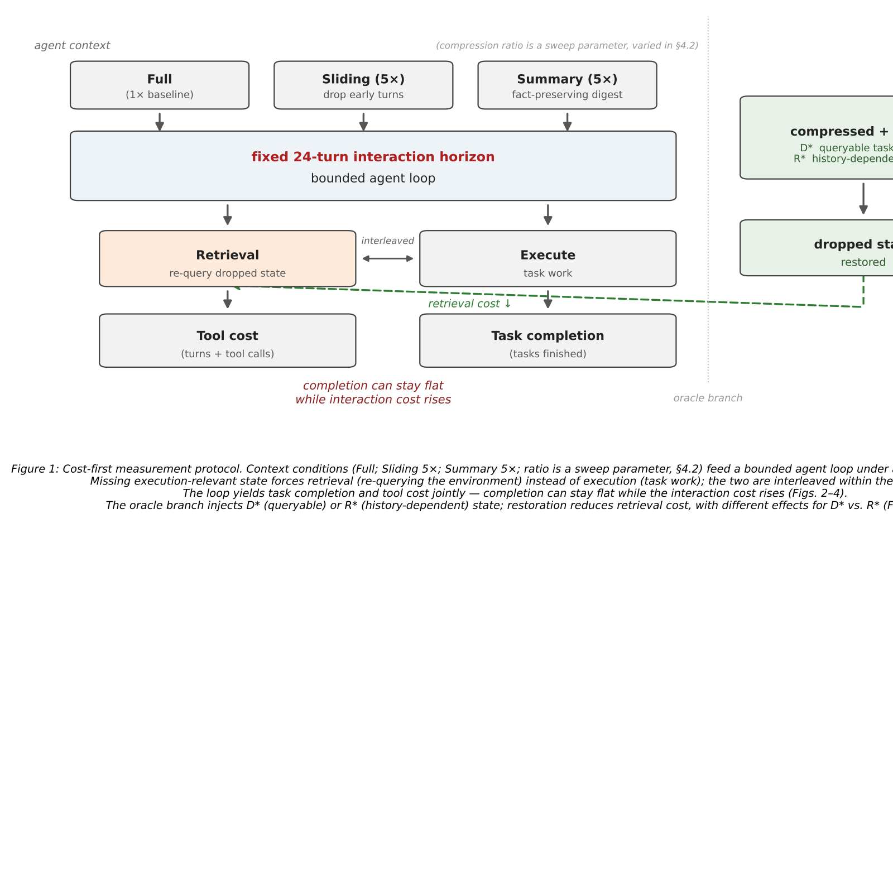
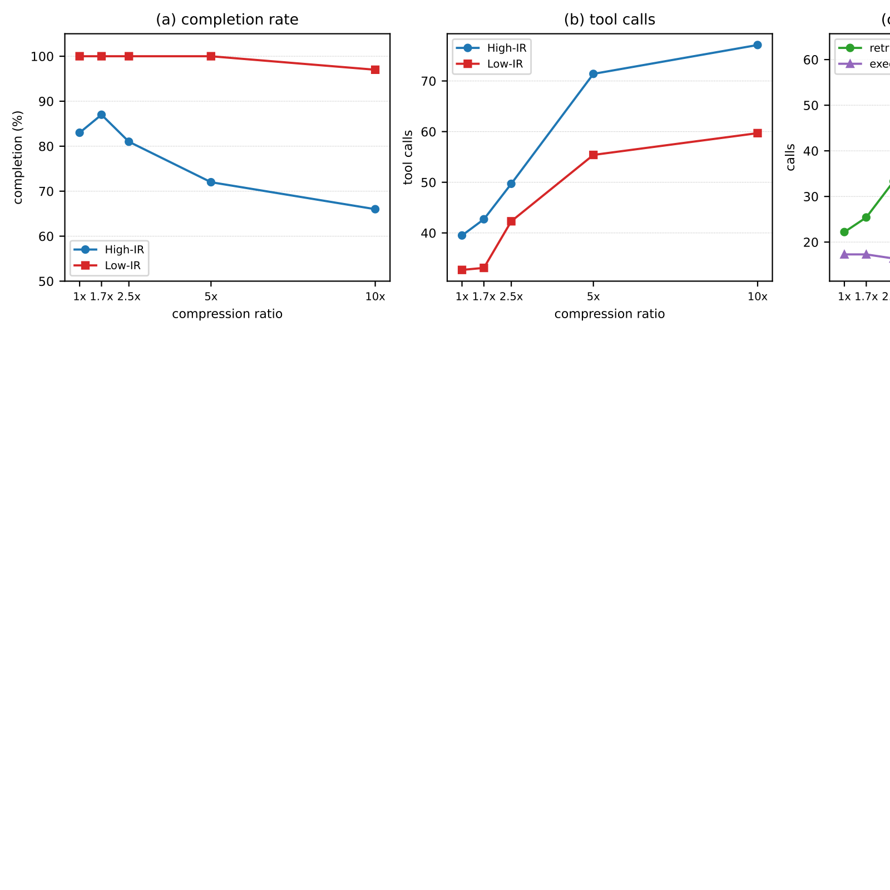
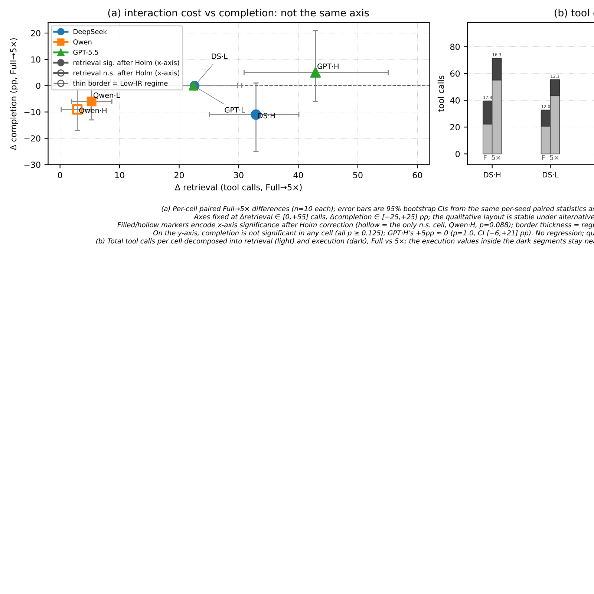
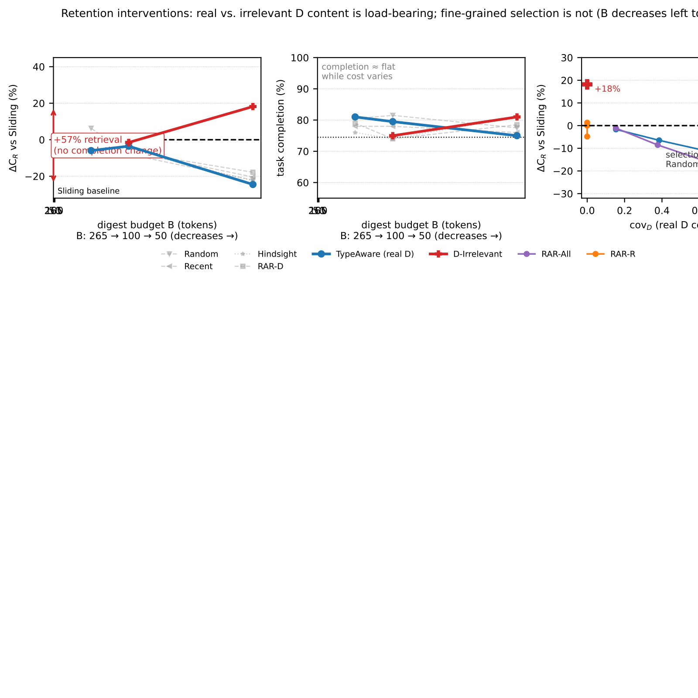
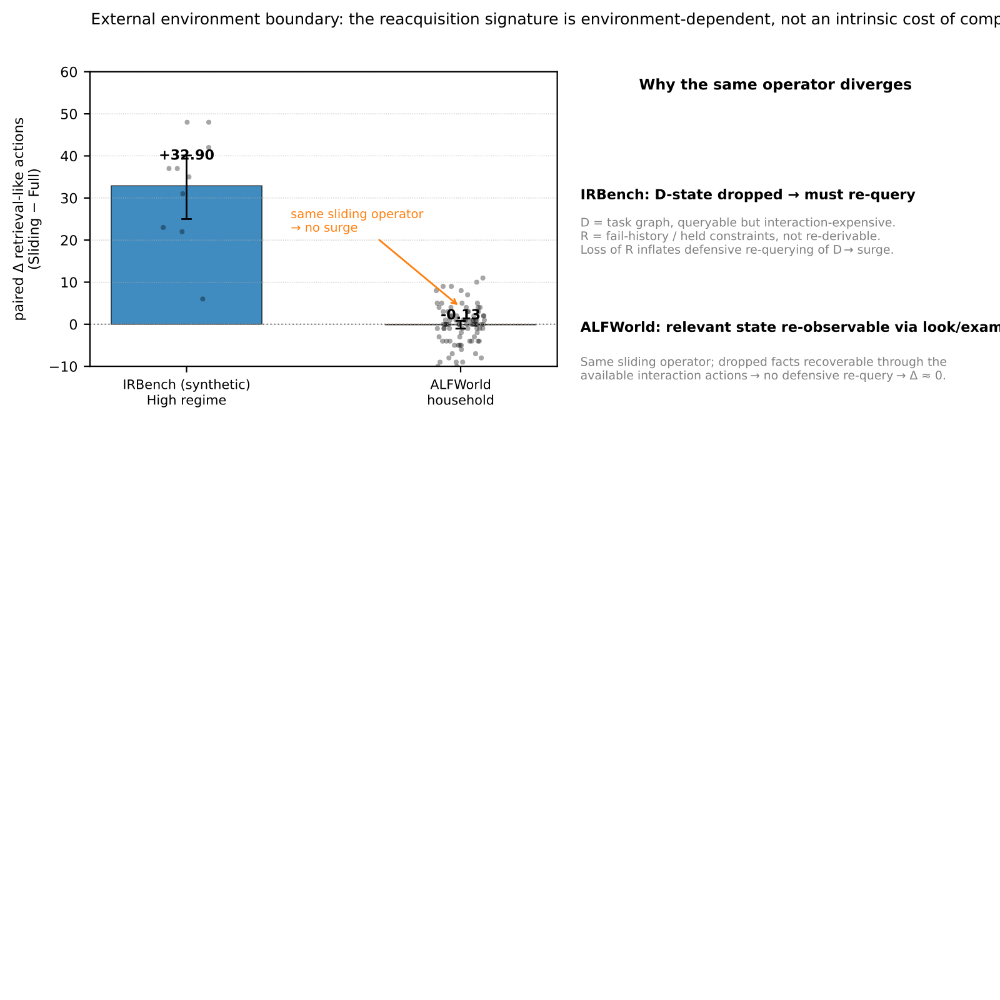
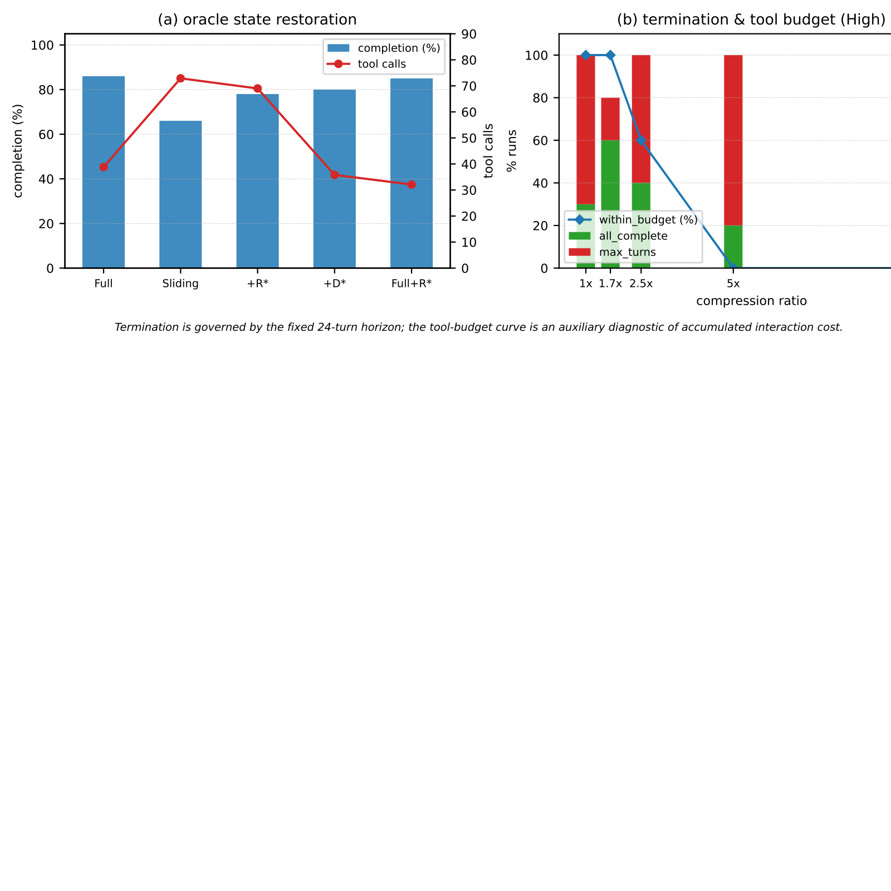

# What Does Context Compression Cost an Agent? Interaction Costs Unrevealed by Task-Completion Metrics
## 上下文压缩会让智能体付出什么代价？任务完成度指标所未能揭示的交互成本

> **论文元信息**
> - **arXiv**：[2608.16370](https://arxiv.org/abs/2608.16370)（v1，2026 提交；本译文基于官方 HTML 全文）
> - **发表**：COLM 2026 Efficient Reasoning Workshop（早期版本接收）
> - **分类**：cs.AI / cs.CL / cs.LG（推测；原文 HTML 页头未显式列出分类）
> - **作者**：Shuyu Liu（重庆科技大学，Chongqing University of Science and Technology）
> - **方法/环境**：受控运行时测量协议（runtime measurement protocol）；环境 **IRBench**（确定性项目规划环境）；无统一方法缩写
> - **复现地址**：文中未提供公开仓库

> **翻译说明**
> - 本译文基于 arXiv 官方 HTML 全文逐段翻译，覆盖：**摘要 + 第 1–6 节 + 附录 A + 致谢 + 参考文献**；参考文献保留原文编号，不逐条翻译。
> - **插图**：全部 **6 张图**已从 HTML 抽出并下载到本地 `../images/CompressionCost/`，markdown 使用相对路径引用，离线可读；每张图上方保留 `<!-- 原图：URL -->` 注释便于回溯原地址。
> - **表格**：**表 1–11 全量数值**已从 HTML 抽取并逐一翻译表题与脚注。
> - 公式统一按 LaTeX 重排；术语首次出现时保留英文原文（如 reacquisition 再获取、retrieval 检索、execution 执行、regime 体制、oracle 神谕恢复）。
> - 说明：源正文 `text2.txt` 存在 OCR 级噪声（如 "Deep"→DeepSeek、"Agent?" 等），译文已据 HTML 原文校正；所有数字一律取自源文件，不凭印象。

---

## 摘要

任务完成度（task completion）是评估上下文压缩（context compression）的标准指标，但它是一种不完整的度量：压缩会显著抬高智能体的交互成本——即对被丢弃状态的再获取（reacquisition）——而在统计上却不改变任务完成度。我们把「仅看完成度」的评估形式化为对完整评估结局的一次有损投影（lossy projection），并在一个受控设定中证明，它确实可能漏掉一笔巨大的交互成本。

我们提出一套受控的运行时测量协议（runtime measurement protocol），用于在「有界视野（bounded-horizon）」智能体中隔离上下文压缩的再获取成本。一个智能体在固定的交互预算（24 轮）下，于一个确定性的规划环境中行动；我们改变压缩比，在相等预算下对比「丢弃算子（dropping operator）」与「保真算子（fact-preserving operator）」，通过 oracle 恢复来操纵被丢弃状态的可用性，并把工具调用分解为「检索（retrieval）」与「执行（execution）」两类。我们对一个模型在多个压缩强度上做了扫描，并在固定压缩比下对另外两个模型、在两种任务体制（regime）上做了评估。

在我们的六个「模型–体制」对比中，检索工具调用在每一次对比中都上升，并几乎贡献了所有增加的交互；而执行调用基本保持不变；六次检索上升中有五次在 Holm 校正后依然显著。相比之下，完成度并不跟踪这一成本：在预先设定的 $5\times$ 对比点上，它在六个单元格中没有任何一个发生显著变化（全部 $p\geq 0.125$），即便是 DeepSeek，其完成度也只有在最激进的压缩比（$10\times$，$p=0.016$）下才变得显著——成本信号在比完成度更温和的压缩下就已响应。GPT-5.5 是最鲜明的例子——完成度在统计上不变（$80\%\to 85\%$，$p=1.0$），而检索量大约翻了三倍（增加 42.9 次调用）。只有当再获取消耗了足够多的交互视野、从而限制任务推进时，完成度才显著退化，这在 DeepSeek 高压缩下表现得最清楚。恢复被丢弃的状态可以消除大约一半的检索成本；而在相同压缩比下，一个保真算子在保持完成度的同时，避免了绝大部分额外的检索。

我们用保留干预（retention interventions）作为因果探针，把「保留了多少状态」与「保留了哪些状态」以及「被保留内容是否有效」区分开来。随机选择在效果上等同于一个离线后见之明（offline hindsight）oracle，而把保留下来的 D 状态替换为语义无关的内容，会使检索量上升 57%（$p<0.001$），同时完成度在统计上不变——以完成度为中心的评估，既可能暴露不了一个会改变成本之干预的幅度，也可能暴露不了它的行为后果。

我们并不声称压缩有固定的成本：在第二个环境（ALFWorld）中，同一个算子并未产生检索激增，因此这种再获取特征依赖于环境，而非缩短上下文的固有后果。在我们的受控设定中，压缩的隐藏交互成本会在「与执行相关的状态变得缺失且必须被重新获取」时出现；仅凭完成度可能漏掉这一成本，而成本的幅度——甚至其是否存在——都依赖于模型、任务、状态与环境。我们为这一完成度中心评估所无法暴露的成本，提供了一个工具层面的诊断。

本工作的早期版本已被 COLM 2026 Efficient Reasoning Workshop 接收。

---

## 1. 引言

长视野（long-horizon）智能体会不断累积轨迹，很快超出任何上下文窗口，因此现代运行时（runtime）会理所当然地通过摘要、滑动窗口或检索过滤来进行压缩。一种常见的评估观点是：当压缩在降低上下文成本的同时保持了任务性能，它就是成功的；具备失败感知（failure-aware）的压缩器能在许多任务上匹配全上下文性能（ACON），而我们即便发现一个确定性的抽取式摘要在 $5\times$ 压缩下也近乎无损（near-lossless）。现有评估追问的是「任务性能是否幸存」。我们要问一个互补的问题：在性能发生变化之前，会累积多少运行时成本？任务完成度是对上下文压缩之运行时成本的一种不完整度量——它本身并不揭示：当智能体必须重新获取被压缩掉的状态时，会产生多大的交互成本。

「近乎无损」衡量的是保留（retention）：surviving 的上下文是否还包含所需的事实。它并不衡量再获取（reacquisition）：当某条与执行相关的状态真正缺失时，智能体会怎么做——重新查询环境以获取任务图、隐藏约束、资源占用——以及这在智能体自身的「货币」上要花多少代价。任务完成度受交互视野所限，而工具调用则直接度量花在再获取上的交互成本。因此，压缩是否会变得昂贵，并不只由保留下来的内容决定；它还取决于智能体必须做些什么，才能重新获取那些不再可用的状态。完成度对此成本而言是一种迟钝的工具：它由交互视野共同决定，并可能在再获取负担增长的同时保持不变。

关于上下文压缩的既往工作提出四个问题：保留什么（方法：ACON；Memento；RE-TRAC），信息是否幸存或可被恢复（Context Codec 的往返保证；Reclaim 的黑盒恢复），保留下来的信息是否被使用（「丢失在压缩中」的注意力瓶颈），以及在能力与效率上哪种上下文管理策略表现最好（聚合效率评估；Less Context, Better Agents；智能体评估综述把「成本」称为 LLM 智能体评估中一个被低估的维度）。这些工作评估的是压缩「保留或达成了什么」。没有一项度量「当状态真的消失时，智能体会做什么」。我们要问第五个问题：重新获取被丢弃的东西，对智能体而言成本几何，而标准指标能否看见这一成本？这正是我们要填补的空白——一个受控的论证，表明二者可能分道扬镳。

我们提出一套用于度量上下文压缩之再获取成本的受控测量协议。该设定固定单一交互视野（24 轮）；通过滑动窗口算子改变压缩比；覆盖两种在「运行时必须发现多少与执行相关的状态」上不同的任务体制；通过受控的 oracle 恢复来操纵与执行相关状态的可用性——把特定的被丢弃状态注入回上下文——并把智能体的工具调用分解为检索（重新获取外部状态）与执行（执行任务的操作）。我们在三个模型上运行该协议——DeepSeek（deepseek-v4-flash）、Qwen（qwen3.7-plus）和 GPT-5.5——以区分跨模型成立的部分与模型特定的部分（DeepSeek 做完整的强度扫描，Qwen 和 GPT-5.5 在固定的 $5\times$ 比下）。

我们的贡献如下：

1. **上下文压缩下的评估不可辨识性（evaluation non-identifiability）。** 任务完成度并不是交互成本的一个可辨识投影：我们将其形式化为一个不可辨识性结论，并在受控干预下予以实现。GPT-5.5 在我们的研究中付出了最大的再获取成本，而其完成度却未被检测为变化（$80\%\to 85\%$，$p=1.0$；检索 $21.0\to 63.9$，$p=0.002$）；而在一个保留干预中（第 3.5 节），注入语义无关状态使检索上升 57%（$p<0.001$），同时完成度在统计上不变（$p=0.41$）。完成度不仅对交互成本的幅度视而不见，对其行为后果也同样视而不见——它未能暴露该干预所引发的巨大成本差异。

2. **对隐藏成本的机制性分解。** 我们沿着一条「可恢复性轴（recoverability axis）」分解再获取负担：可外部查询的任务状态（D）vs. 依赖历史的状态（R），并存在一个再查询回路（re-query loop），其中 R 的丢失会放大对 D 的防御性再查询。检索调用在我们的六个「模型–体制」对比中全部上升，并几乎贡献了所有增加的交互；恢复被丢弃的状态可消除大约一半的检索成本；而沿着「保留预算轴」，这一削减跟踪 D 状态被保留的覆盖率（在固定摘要格式内的剂量–反应关系，dose–response）。

3. **保留干预作为因果探针：被保留状态的行为相关性。** 我们用一组保留干预，把「保留了多少状态」与「保留了哪些状态」以及「被保留内容是否有效」区分开来。在我们这个设定中，在真实、与任务相关的原子之间进行细粒度选择，边际价值有限——随机选择等同于一个离线后见之明 oracle——而用语义无关状态替换 D 内容则会急剧抬高检索。内容效应在宽松预算下跨模型复现（GPT-5.5，第 4.6.4 节），但其幅度与预算门槛（budget-gating）仍具模型特定性。状态内容是「承载负载的（load-bearing）」；但这只有在摘要占据上下文窗口相当大份额时才可见（一个 内容×预算 的交互效应）。ALFWorld 中的一个外部探针（第 4.7 节）为整个信号划定了边界：在相关状态可被直接重新观察的地方，同一个算子不会产生检索激增——因此这种隐藏的交互成本取决于「哪些与执行相关的状态变得不可用且必须被重新获取」，而完成度指标无法暴露它。

在三个模型与两种任务体制下，我们进一步刻画了成本信号的边界：再获取成本始终上升，而它向完成度损失的转化则差异巨大——DeepSeek 在高压缩下退化，Qwen 基本不敏感，GPT-5.5 则不然。成本信号也更早出现：检索在更温和的压缩（$5\times$）下就已响应，而完成度要更晚才响应，对 DeepSeek 而言要到 $10\times$ 才响应。第二个环境（ALFWorld，第 4.7 节）从另一侧为信号划定了边界：在那里，同一个滑动压缩根本不产生检索激增，因此即便是成本的存在与否也是有条件的——它出现在「与执行相关的状态必须被重新获取」时，而完成度指标无法暴露它。

本文不是又一篇压缩基准，也不是「压缩一致地损害智能体」的断言——我们自己的数据就排除了后者。它是对一个评估盲区（evaluation blind spot）的受控实证论证：一个测量协议表明，在该设定下，再获取成本是真实的、可分解的、且依赖于模型的——而完成度中心的评估可能漏掉它，即便在一个急剧改变成本的干预之下也是如此。我们并不提出一套关于智能体评估的普适理论；我们展示的是一个使完成度可能低估压缩成本的机制，并为运行时设计者提供针对它的诊断。对运行时设计者而言，可操作的量不是「哪个压缩比是安全的」，而是「哪些与执行相关的状态，一旦被丢弃，智能体会花费其预算去重新获取？」——而我们的结果把「可外部查询的任务状态」确定为该成本的一个主要来源，并用保留预算的结果（第 3.5 节）来限定：摘要的「内容」——而非其单纯存在——在降低这一成本上负有多大责任。

---

## 2. 相关工作

**分类地图（Category map）。** 关于上下文压缩的既往工作可分为四类。(i) 压缩方法追问「如何压缩得更好」——保留什么、何时压缩（ACON；Memento；VISTA；RE-TRAC；LLMLingua）——并为智能体性能做优化。(ii) 可恢复性评估追问信息是否幸存或可被恢复（Context Codec 的往返保证；Reclaim 的黑盒恢复）——把保留度作为压缩产物的一种属性来度量。(iii) 长上下文利用追问保留下来的信息是否真的被使用，表明压缩可能因注意力而非删除而失败（「丢失在压缩中」，lost in compaction）。(iv) 聚合效率评估在比较上下文管理策略时，把完成度与聚合成本——token、延迟、运行时——一并报告（Less Context, Better Agents），而智能体评估综述与基准日益主张：仅有成功是不够的，必须辅以成本（Yehudai et al.；CostBench）。这些线索各自评估压缩「保留、恢复或达成了什么」。没有一项为「完成度中心评估所无法暴露的交互成本」提供诊断——即增加的交互去了哪里，以及完成度是否跟踪它。本文正是那个诊断：一个在固定设定下的受控协议，度量再获取成本并检验完成度是否暴露它。

**智能体的评估指标，以及完成度的不足。** 另一条工作线追问「智能体的正确指标是什么」。生产经验表明，仅凭完成度是一种迟钝的工具：现实中的智能体会重新查询工具、重新获取已计算过的状态，而完成度读取的是最终结果，而非其背后的轨迹。形式化工作从不同方向把这种不足说得精确：完成率压缩了过程层面的方差——「完成度谬误」（completion fallacy，Hou et al.）——二元的通过/失败掩盖了失败智能体之间有意义的差异，从而催生了分级可靠性（graded reliability）与基于进度的指标（Khanal et al.；AgentBoard），而有界视野的结局分解则揭示了依赖于视野的权衡（the Verifier Tax）。另一条平行工作线形式化了成本侧：工具调用协议本身就携带着一项加性的准确性税（accuracy tax，Zhang et al.），成本最优规划通过成本缺口（cost gaps）被基准化（CostBench），而「每单位回报的成本」框架则把有效性–效率权衡显式化（Bogdanov et al.）。两点观察框定了、却并未填补我们要填补的空白。这些「不足论」关乎完成度在「过程质量或结局」上未能揭示什么——而非关乎「上下文压缩的运行时成本」；而成本会计框架是在「上下文完好」的前提下，为架构或协议选择定价，并未把成本与「压缩所丢弃的状态」联系起来。在压缩一侧，再获取成本在操作性上已被认识到——每任务 token 数把重新获取计入（Factory），截断会侵蚀召回（context-clock），而 token 削减并不必然降低计费成本（Weinberger & Hozez）——但都只是观察性的，缺乏因果归因。没有任何工作定义了一个黑盒的、模型无关的量度，来度量一个智能体为重新获取被通用压缩所移除的状态，花费了多少交互预算，也没有人对其状态的可用性做因果操纵。我们的协议恰好提供了这一度量（命题 1…[截断]）。

**最接近的评估视角对比。** 表 1 总结了四篇最接近的、从评估视角出发的工作。没有一项度量「智能体为重新获取被压缩算子丢弃的状态，花费了多少交互预算」，也没有一项对状态的可用性做因果操纵；我们的协议做到了。

**表 1：最接近的评估视角对比**

| Work | Measures | Manipulates | Decomposes | What completion can miss | Our difference |
| --- | --- | --- | --- | --- | --- |
| CostBench | cost-optimal planning; cost gaps | tool costs & availability (blocking events) | cost by event type | cost-suboptimal but valid plans | intact context; we price reacquiring dropped state |
| CompressAgent | reliability & success vs compression | compression retention level | failures: tool-execution vs reasoning | tool failures precede success collapse | no causal state manipulation; we add oracle attribution |
| Token Red. $\neq$ Cost | billed cost; token vs cost deltas | token-reduction strategies | cost by billing component (cache $\approx$87%) | token savings $\neq$ cost savings | provider-specific billing; we use a model-agnostic budget |
| Tool-Use Tax | accuracy tax of the tool protocol | tool availability (no-op / oracle probes) | accuracy gap: $\Delta$cmp + $\Delta$frc + $\Delta$sty | protocol tax swamps tool gains | accuracy over intact context; we meter cost of lost state |

**最接近的对比（Closest contrasts）。**

- **Lost in Compaction** 表明压缩因注意力瓶颈而非删除而失败（「grep-LLM 鸿沟」：关键词搜索能找到 82–93% 的事实，而 LLM 在压缩区只回忆出 0–7%）。我们的机制针对一种不同的失败模式，并在受控设定中可实验区分：我们的滑动条件删除了旧的轮次，因此被丢弃的状态是真正缺失的，而智能体可观察到的反应是去重新获取它（检索调用增加 2–3×；执行调用不增加）；oracle 条件通过恢复状态、消除大部分检索成本，确认了这一归因。我们并不反驳注意力稀释（attention-dilution）的说法——它们预测了我们所观察到的「GPT-5.5 耐受压缩」——但我们隔离出了第二个独立的成本，而注意力中心的说法捕捉不到它，因为对它们而言文本仍然存在。两种机制可以共存；我们度量的是再获取这一侧。

- **Context Codec** 形式化了压缩表示的编解码级往返可恢复性。它们的可恢复性是「表示属性」（编码器+解码器能否往返？）；ours 是一个黑盒的、智能体行为属性（智能体能否在有界预算下恢复？）。同一个词，不同的层——互补。

- **Reclaim Evaluation** 测试从受损的单载体记忆中恢复可纠正的状态（「有损记忆比空记忆更糟」）。我们在智能体循环内部度量级联的再获取成本，并通过 oracle 注入直接操纵可恢复性。

- **Plans Don't Persist** 探查潜在隐状态，表明内部计划无法在压缩下幸存。这是白盒地对内部状态做探针，vs 我们对环境状态（ERS）的黑盒观察；我们对潜在推理不做任何断言。

- **Memento** 在单次推理内部压缩 KV 缓存。我们研究的是跨轮次的智能体上下文——跨工具调用持续存在的轨迹——以及为重新获取环境状态所花费的交互预算。

- **ACON** 表明具备失败感知的压缩可以匹配全上下文性能。它们的目标是「压缩不应有害」；我们在自己的设定中复现了一个近乎无损的摘要，并表明分歧只在「与执行相关的状态被丢弃（滑动）」时才出现，这与我们的主张一致：压缩质量取决于「哪些与执行相关的状态被保留」。

- **VISTA** 提供精确字节的无损归档恢复（以稳定句柄把庞大的块作为外部负载归档，按需恢复）。我们表明，即便这样的恢复，在硬预算下本身也是一个连续的成本谱：即便是可恢复的任务图状态，重新获取也要花费真实的轮次，而在有界交互视野下，这一成本可能对性能变得举足轻重。

- **Less Context, Better Agents** 表明，在企业工具使用工作流中，剪枝加摘要能在削减 token 与运行时的同时提升完成度。它们的评估是一个「配置选择」问题——哪种上下文管理策略表现最好——在完成度、token、运行时上联合报告，并辅以一个失败分类法。我们在更细的粒度上追问一个不同的问题：额外的交互去了哪里（检索 vs. 执行），以及即便交互成本发生了变化，完成度是否也变化。我们的贡献是一个分解与一个诊断，而非一个相互竞争的「配置选择」；二者互补。

- **CompressAgent** 独立地观察到了我们所度量的同一顺序：工具执行失败出现在更温和的压缩下，而任务成功只在激进压缩下才崩塌。它们研究的是规模化下的压缩可靠性，我们在受控预算下隔离出机制——状态再获取——并用 oracle 恢复对其做干预。

- **Rate-distortion / 记忆综述** 明确标记了一个空白：智能体层面的重复压缩几乎未被度量，也没有任何基准在跨层上共享一条预算轴。我们提供的恰恰是那项缺失的受控实验——在固定交互预算下的 算子×体制×模型。

关于上下文压缩的既往工作追问：保留什么、压缩在多大程度上保留信息、保留下来的信息是否被使用、以及哪种策略在聚合结局上胜出。我们要问第五个问题——重新获取被丢弃的东西，对智能体成本几何，而完成度指标能否暴露这一成本——并表明这一成本可以在完成度保持不变的同时大幅上升：

> 「压缩之所以昂贵，并非仅仅因为信息丢失；而是当被丢弃的状态必须通过在有界预算下的额外交互被重新获取时，它才变得昂贵。」

---

## 3. 方法

图 1（测量协议总览）：一个智能体上下文要么喂入完整/保真上下文，要么喂入压缩（滑动）上下文；缺失的执行状态分化为检索（再获取）与执行（任务工作），二者共同消耗 24 轮视野并决定完成度/工具成本。一条并行的 oracle 分支（压缩 + $D^{*}$/$R^{*}$ → 注入被丢弃的状态 → 检索成本下降）表明：可恢复性是一个被操纵的变量，而非被动的观察。

<!-- 原图：https://arxiv.org/html/2608.16370v1/fig1_draft.svg -->

> **图 1（原文 Figure 1）**：Measurement protocol overview: full / fact-preserving vs. sliding (compressed) context; missing execution state diverges into retrieval (reacquisition) vs. execution (task work); a parallel oracle branch (compressed + $D^{*}$ / $R^{*}$ $\to$ injected dropped state $\to$ retrieval cost drops) makes recoverability a manipulated variable.
> （测量协议总览：完整/保真上下文与滑动（压缩）上下文对比；缺失的执行状态分化为再获取（reacquisition，即检索）与执行（任务工作）两条去向；并行的 oracle 分支（压缩上下文 + $D^{*}$/$R^{*}$ → 注入被丢弃的状态 → 再获取成本下降）把「可恢复性」变成一个被主动操纵的变量。）

### 3.1 评估结局、投影与非可辨识性

我们形式化本文所度量的评估对象。对于一个上下文管理条件 $m$，我们记录一个由实测结局组成的三元组。

**定义 1（评估结局，Evaluation outcome）。** $Y(m)=(Q(m),\,C_{R}(m),\,C_{E}(m))$，其中 $Q$ 是任务完成率，$C_{R}$ 是检索工具调用次数，$C_{E}$ 是执行工具调用次数，均在固定交互视野下记录。我们把 $C_{R}$ 解释为反映「状态再获取努力」，$C_{E}$ 反映「任务工作」。我们把 $C=C_{R}+C_{E}$ 称为工具层面的交互成本——即智能体被预算分配的「货币」，而非关于墙上时钟或货币成本的断言。

完成度中心的评估对这个三元组施加一个投影 $\pi_{Q}(Y)=Q$。我们要问：这样的投影何时能保持各策略按交互效率的排序。令 $\sim_{Q}$ 表示「预先设定的配对检验（带 Holm 校正的配对 Wilcoxon 符号秩检验；第 3.4 节）未能检测到两个条件之间的完成度差异」。仅看完成度的评估，只有当 $m_{1}\sim_{Q}m_{2}$ 也意味着这两个条件在交互成本上没有实质差异时，才能保持「成本感知」的排序。

**命题 1（仅看完成度评估的不可辨识性，Non-identifiability of completion-only evaluation）。** 仅看完成度的投影 $\pi_{Q}$ 丢弃了 $Y$ 的交互成本维度。因此，具有不同交互成本的不同结局状态，可能映射到同一个完成度值。在我们的协议下，这一不可辨识性由如下条件在经验上实现：其完成度差异未被预先设定的配对检验检测到，而其检索成本却差异巨大。

**经验反例（Empirical counterexample）。** 在 High-IR 下，GPT-5.5 上的 Full vs. Sliding（$5\times$）：完成度 $80\%\to 85\%$（配对 $p=1.0$；95% CI $[-6,+21]$ 个百分点，含零），而检索 $21.0\to 63.9$（配对 $p=0.002$；Cohen's $d=2.07$；95% CI $[+31,+55]$，不含零）。一个仅看完成度的评估者会微弱地偏好 Sliding（85% vs. 80%），尽管检索成本大约增至三倍。

注意，我们的主张并不是说这两个条件等价；而是说仅看完成度的评估对成本维度视而不见。在指标层面，任何把结局投影到仅完成度的评估，都按构造丢弃了交互成本维度；上面的反例是一个经验实例，其中这个被丢弃的维度既大又在操作上相关（成本差异携带 $d=2.07$，而完成度差异未被检测到）。完成度变化的方向无关紧要：即便完成度在压缩下提升了，仅看完成度的评估者仍会对同时发生的成本上升视而不见。

#### 成本感知占优（Cost-aware dominance）

我们说 $m_{1}$ 占优（dominates）$m_{2}$，当且仅当 $Q(m_{1})\geq Q(m_{2})$ 且 $C(m_{1})\leq C(m_{2})$，且至少一个不等式严格成立——这是 $(Q,C)$ 上的一个二维帕累托关系。仅看完成度的评估无法检测到它，因为 $\pi_{Q}$ 坍缩了成本维度。最干净的实例是 DeepSeek High 上 $5\times$ 下的 Summary vs. Sliding：Summary 取得了更高的完成度（83% vs. 72%），却以更低的交互成本（39.0 vs. 71.4）。仅看完成度的评估者正确地偏好 Summary，却无法量化好多少：11 个百分点的完成度差距，低估了 32.4 次调用的交互成本差距。分解式 $C=C_{R}+C_{E}$ 把这一成本差距几乎完全归于检索（19.5 vs. 55.1；执行 19.5 vs. 16.3）。

#### 完成度不敏感区（Completion-insensitivity region，描述性）

我们用这个术语描述性地指代这样一些（压缩比，模型）对：在压缩下检索成本的增加 $\Delta C_{R}=C_{R}(\text{compressed})-C_{R}(\text{Full})$ 在统计上可检测，而配对检验却未检测到完成度变化（以 Cohen's $d\geq 0.5$ 作为次要的描述性判据）。这是一个带有常规阈值的描述性刻画——不是等价性检验，也不是一个被提议的指标；该术语指代一种经验模式，而非完成度不敏感性的证明。在我们的数据中（图 3a），GPT-5.5 High 在 $5\times$ 处位于区内；DeepSeek High 在 $10\times$ 处离开该区，此时完成度退化变得显著；Qwen High 位于边界，检索仅轻微抬高而完成度温和下降。

### 3.2 智能体任务环境

我们研究一个运行于确定性项目规划环境（称为 IRBench）上的、最小化的工具使用智能体。该环境有 10 个任务与一小组资源（每个容量为 1）。任务带有隐藏的执行约束，这些约束只能通过交互才被揭示：排序规则、带有释放时间的资源占用，以及「fail-until（失败直到）」计数。智能体拥有四个工具：get_task_info、check_externally 与 query_resource（全部为检索类：它们获取环境状态），以及 execute（执行类：它执行一个任务并揭示约束）。检索/执行的切分是核心：它让我们无需借助思维链（CoT）或潜在推理，就能直接度量再获取成本。

该环境是确定性的：一个随机种子（seed）完全决定了世界实例，因此任何条件都可以在完全相同的任务集上运行。我们通过改变隐藏的、与执行相关的事实的密度来生成两种任务体制，同时保持静态结构具有可比性（由环境自检验证）：High-IR（约束只在执行期间揭示，一旦被丢弃就很昂贵）与 Low-IR（多跳依赖链，但状态可从公开任务图重新推导）。具体而言，一个任务可能因必须跟在另一个任务之后而失败，也可能因某个资源被占用直到后续某个事件而失败。任务图与当前资源状态可随时再次查询；相比之下，一个先前被揭示的失败条件或 fail-until 计数，只存在于执行历史中。

智能体接收一条固定的系统提示词（在所有条件下相同），指示它发现前置条件、遵守约束，并在固定的 24 轮交互视野内完成全部 10 个任务；每一轮是一次模型调用外加其工具结果。完成度由视野结束时 10 个必需任务中有多少被完成来判定。我们额外计算一个辅助的工具预算统计量（$\alpha\times$ 参考工具数，$\alpha=2.0$）；这是一个诊断量，而非终止判据——智能体绝不会因它而被切断。

### 3.3 上下文条件：算子与干预

我们通过固定任务实例、系统提示词、工具模式与模型，只改变喂给模型的上下文，来隔离压缩的效果。所有压缩条件都在线施加，且位于智能体循环中的同一点、在每次生成模型回复之前——上下文在每一轮都被重新派生，因此算子看到的正是迄今为止累积的轨迹。轮次被分组为原子单元（一条助手消息外加它的工具结果），因此上下文对 API 而言始终是良构的。

**表 2：上下文条件**

| Condition | Context |
| --- | --- |
| Full | the complete trajectory (baseline) |
| Sliding | a token budget of $r^{-1}\times$ the trajectory ($r=1.7\times$, $2.5\times$, $5\times$, $10\times$); greedily keep the most recent turns within budget; drop early turns outright |
| Summary | the same budget, but dropped early turns are replaced by a deterministic fact digest [Summary of earlier trajectory --- observed facts] (extractive; keeps observed state facts, discards the model’s reasoning text); zero extra LLM calls |
| Oracle | Full or Sliding context with a specific state string injected as a trailing message (same position in every condition) |

滑动是删除（而非摘要），因此被丢弃的状态是真正缺失的——这检验的是「缺失 → 重新获取」，而非「存在却被忽略」。Summary 共享相同的 token 预算，使算子之间的对比公平；抽取式模式排除了摘要器质量带来的混杂——我们的抽取式摘要保留摘要中所表示的、被观察到的状态事实，同时丢弃轨迹的推理文本；它是一个受设计的对照，而非通用的摘要器。Oracle 注入是一条位于固定位置的尾部消息，系统提示词保持不变，从而在各条件间保持相同的提示承诺。

Oracle 恰好提供了滑动所丢弃的、与执行相关的状态，并被分为两个可恢复性类别：$D^{*}$——可外部查询的状态（任务图：前置条件、资源占用）——原则上可用更多工具调用恢复；以及 $R^{*}$——依赖历史的状态（被揭示的约束、失败计数、被占用的资源），无法从任何单一公开查询中恢复。这些是「可恢复性投影」，而非「数据/推理」二分法。这给了我们一个被操纵的自变量——被丢弃状态的可用性——使我们得以追问：如果丢失的状态被恢复，有多少补偿性的检索会消失？

### 3.4 协议与分析

对每一条件与每个模型，我们运行相同的 10 个种子（每个种子 10 个任务实例，每条件 100 个任务级观测）；第 3.5 节的保留干预族使用扩展的 20 个配对种子，以绑定选择空值（selection null，第 4.6.1 节）。统计量是逐种子的配对量（两个条件使用同一种子）：对逐种子差异做 Wilcoxon 符号秩检验与 bootstrap 95% 置信区间。我们预先指定了主要比较（Full vs. Sliding 在任务完成度、工具调用与检索调用上）。对于多重比较控制，主要族是六次检索比较（三个模型 × 两种体制）；我们施加 Holm–Bonferroni 校正（$\alpha=0.05$），校正后六次中有五次依然显著。其余检验为描述性的。模型：DeepSeek（deepseek-v4-flash）、Qwen（qwen3.7-plus）与 GPT-5.5。所有模型均在无显式扩展思考（extended-thinking）模式下、温度 0.3 下评估，以让跨提供商的「可观察交互协议」尽可能可比。每个模型都通过 OpenAI 兼容接口提供服务。

### 3.5 保留干预作为因果探针

Oracle 结果（第 4.4 节）表明，恢复被丢弃的状态可降低再获取成本。这引出了关于粒度的一个问题：在何种层次上，被保留的状态才会影响智能体的交互成本——保留了多少、保留了哪些原子、以及被保留的内容是否有效且与任务相关？我们用一组保留干预来解决它，这些干预在固定的压缩点（第 10 轮，$t_{c}$）在线施加，各自取截至 $t_{c}$ 的已观测轨迹，抽取已观测到的状态原子集合，并在摘要预算 $B\in\{265,100,50\}$ token 下重新渲染一个压缩前缀——这是一个独立的资源轴，不与压缩比共变。每个摘要都以相同位置、相同 [State retention digest] 格式注入，其后是在总预算内的最近轮次。原子被分为第 3.3 节的 D/R 两类。我们记录每类的保留覆盖率（$\mathrm{cov}_{D}$、$\mathrm{cov}_{R}$）与实际渲染出的摘要大小，因此请求的预算与交付的摘要都被报告。

**表 3：保留干预**

| Intervention | Selection rule |
| --- | --- |
| Sliding | recency baseline; no digest (recent turns only) |
| RAR-D | retain D-type atoms only |
| RAR-R | retain R-type atoms only |
| RAR-All | retain all atoms in observation order ($\approx$ Summary control) |
| RAR-TypeAware | retain all atoms, R-first (recoverability-prioritized) |
| Random | random subset of atoms (seeded) |
| Recent | most-recently-observed atoms |
| Hindsight | top-$k$ by offline future re-access counts (reference) |
| D-Irrelevant | as TypeAware (R first), but D-budget filled with fabricated out-of-universe atoms |

候选宇宙严格是在线的：即 $t_{c}$ 之前观测到的原子，因此没有任何条件能看到未来的观测。后见之明（Hindsight）是一个离线参考，而非上界；我们称之为「参考轨迹下的离线后见之明 oracle」。可恢复性优先的排序（R 先于 D）是一个被预先注册、正在被检验的假设，而非一个被假定的排序——Random 与 Recent 这两个对照的存在，正是为了检验「排序是否胜过忽略排序的选择」。摘要预算 $B$ 是一个预算扫描（所有干预在全部三个预算下）的自变量。

**预注册与 D-Irrelevant 对照。** 我们预先注册了主要比较（RAR-D vs. Sliding 在检索成本上，判据 $\Delta C_{R}\leq-30\%$ 且 95% CI 不含零）以及上面的条件矩阵。如第 3.5 节所述，细粒度选择空值（Random $\approx$ Hindsight）在 $N=20$ 时出现，催生了一个机制性后续：D-Irrelevant 干预在保持摘要格式、位置、预算与保留的 R 内容不变的前提下，仅把 D 原子替换为「宇宙外（out-of-universe）」状态（即任务/资源宇宙之外的标识符，因此没有任何实体能与当前世界混淆）。它的判定判据（$\Delta C_{R}=C_{R}[\text{D-irrelevant}]-C_{R}[\text{TypeAware}]$，配对 95% CI）在干预运行前就已固定。我们把它透明地报告为一个事后序贯诊断（post-hoc sequential diagnostic），而非预先注册的主要比较。

## 4. 实验

### 4.1 设置

我们遵循第 3 节的协议。除非另有说明，「完成度」是指在固定的 24 轮视野内完成的 10 个必需任务所占的比例；「工具」是每次运行的工具调用计数，并进一步拆分为检索调用与执行调用。每个条件在 10 个种子上运行，按逐种子配对分析（Wilcoxon 符号秩；bootstrap 95% CI）；主要比较是 Full vs. Sliding 在完成度、工具与检索调用上。

### 4.2 压缩在任务完成退化之前先抬高再获取成本（图 2）

**强度扫描，DeepSeek（High）。** 用滑动窗口算子在 High-IR 上改变压缩强度（$r\in\{1,1.7,2.5,5,10\}$）：

**表 4：DeepSeek，High 体制：强度扫描**

| ratio | completion | tools | retrieval | execute | turns |
| --- | --- | --- | --- | --- | --- |
| $1\times$ (Full) | 83% | 39.5 | 22.2 | 17.3 | 22.9 |
| $1.7\times$ | 87% | 42.7 | 25.4 | 17.3 | 23.3 |
| $2.5\times$ | 81% | 49.7 | 33.3 | 16.4 | 22.8 |
| $5\times$ | 72% | 71.4 | 55.1 | 16.3 | 23.1 |
| $10\times$ | 66% | 77.1 | 63.2 | 13.9 | 23.6 |

<!-- 原图：https://arxiv.org/html/2608.16370v1/fig2_draft.svg -->

> **图 2（原文 Figure 2）**：Compression raises reacquisition cost before completion may degrade. Panel A: completion vs. compression ratio; Panel B/C: tool / retrieval–execution decomposition.
> （压缩在任务完成退化之前先抬高再获取成本。**(a)** 完成度 vs. 压缩比；**(b)(c)** 工具 / 检索–执行分解：检索调用随压缩单调上升，而执行调用基本不变。）

完成度在中等压缩比下是平坦的——在 $1.7\times$ 处的小幅上扬（87% vs. Full 的 83%）落在轮次间噪声范围内，与「温和压缩移除陈旧或分散注意力的状态」这一机制一致（即「更少上下文，更好智能体」背后的机制）；它并未持续——并且只在两个最激进的压缩比下才下降（$5\times$：$-11$ 个百分点，$p=0.25$ 不显著；$10\times$：$-17$ 个百分点，$p=0.016$）。这是我们研究中唯一达到显著性的完成度变化，而且只在最激进的压缩比下才出现。相比之下，检索在 $5\times$ 处就已显著抬高（$p=0.002$）：成本信号在比完成度更温和的压缩下就已响应（第 4.5 节）。压缩并不会带来完成度下降；更稳定的信号是随之而来的交互成本增长。工具调用从 $2.5\times$ 起单调递增，在预先指定的检验下配对差异显著：工具从 39.5 升至 77.1（$10\times$ 时 $+37.6$，$p<0.01$）。分解式显示了额外交互去了哪里：检索调用从 22.2 升至 63.2（$+41.0$，$p<0.01$），而执行调用并不随强度增加（从 17.3 降至 13.9）。压缩并没有让智能体尝试更多任务工作；它让智能体把更多交互花在重新获取被丢弃的状态上。全上下文基线仅在几个百分点内变化（80–86%），处于聚合随机设定下轮次间可变性之内；我们采用该规范扫描用于所有主要比较。

**体制对比（Low）。** 在 Low-IR 下，同一个算子在完成度上近乎零成本（直到 $10\times$ 每个压缩比下都是 100%，仅 $10\times$ 时为 97%），而工具响应被保留：工具从 32.7 升至 59.7（$10\times$ 时 $+83\%$），由检索主导。Low-IR 的状态可从公开图重新推导，因此额外的再获取成本足够小，得以在受评估的视野内保持完成度不变。

### 4.3 保留什么比压缩比更重要（算子对比）

同样的 $5\times$ 预算可以用两种方式花费：滑动（丢弃旧轮次）或抽取式摘要（把旧轮次提炼为已观测的状态事实）。预算与模型固定：

**表 5：算子对比（$5\times$，High 体制，DeepSeek）**

| condition ($5\times$, High) | completion | tools | retrieval |
| --- | --- | --- | --- |
| Full | 80% | 37.4 | 19.0 |
| Sliding | 72% | 71.4 | 55.1 |
| Extractive Summary | 83% | 39.0 | 19.5 |

在相同的压缩比下，摘要算子是近乎无损的（完成度 83% ≈ 全上下文 80%；工具基本持平 37.4→39.0），而 Sliding 既降低完成度又抬高检索。抽取式算子保留已观测的状态事实，同时丢弃轨迹的推理文本；滑动则两者都丢弃。这一受控对比表明，「保留了什么」可能比压缩比本身更重要。它也复现了 ACON 式的「压缩未必有害」——但只对那个保留状态事实的算子成立，这与我们的主张一致。

### 4.4 恢复被丢弃的状态可降低再获取成本（oracle 干预）

为了显式建立因果联系，我们把被精确丢弃的状态作为一条尾部消息注入回滑动上下文（$D^{*}$=可查询的任务图；$R^{*}$=仅依赖历史的约束/失败计数）：

**表 6：Oracle 干预（$5\times$，High 体制，DeepSeek）**

| condition ($5\times$, High) | completion | tools | $\Delta$ tools vs sliding |
| --- | --- | --- | --- |
| Full | 86% | 38.8 | — |
| Sliding | 66% | 72.9 | — |
| Sliding + $R^{*}$ | 78% | 69.0 | $-3.9$ |
| Sliding + $D^{*}$ | 80% | 35.8 | $-37.1$ |
| Full + $R^{*}$ (sanity) | 85% | 32.1 | — |

恢复 $D^{*}$ 消除了大部分补偿性检索（72.9 → 35.8 次工具调用），并挽回了大部分完成度差距（66% → 80%）。注入 $R^{*}$ 有助于完成度（$+12$ 个百分点），却让检索成本居高不下（69.0），因为 $R^{*}$ 仅依赖历史，它的缺失正是迫使对 D 做防御性再查询的原因。健全性条件（Full + $R^{*}$）无害（85% ≈ Full 的 86%），确认注入并未扭曲基线。该干预提供了因果证据：移除与执行相关的状态会增大再获取行为，而恢复（replicate）则会减小这种行为。

### 4.5 成本可泛化；结局不可（三模型）（图 3）

我们在 Qwen（qwen3.7-plus）与 GPT-5.5 上重复 Full vs. Sliding（$5\times$）的比较（High 与 Low）：

**表 7：三模型，Full vs. Sliding（$5\times$），两种体制**

| Model | regime | completion Full$\to 5\times$ | $\Delta$ (p) | tools Full$\to 5\times$ | retrieval $\Delta$ (p) | execute $\Delta$ |
| --- | --- | --- | --- | --- | --- | --- |
| DeepSeek | High | 83 $\to$ 72 | $-11$ (0.25) | 39 $\to$ 71 | +32.9 (.002)† | $-1.0$ |
| Qwen | High | 75 $\to$ 66 | $-9$ (0.13) | 34 $\to$ 37 | +2.9 (.088) | $\approx 0$ |
| GPT-5.5 | High | 80 $\to$ 85 | +5 (1.0) | 39 $\to$ 82 | +42.9 (.002)† | $\approx 0$ |
| DeepSeek | Low | 100 $\to$ 100 | 0 | 33 $\to$ 55 | +22.6 (.004)† | +0.1 |
| Qwen | Low | 100 $\to$ 94 | $-6$ (0.25) | 28 $\to$ 36 | +5.3 (.023)† | +2.7 |
| GPT-5.5 | Low | 100 $\to$ 100 | 0 | 26 $\to$ 49 | +22.4 (.002)† | +0.7 |

> † 经 Holm–Bonferroni 校正（主族为六个检索比较，$\alpha=0.05$）后仍显著。

该比较点是预先指定的。这个六单元格矩阵使用单一压缩比 $5\times$（在实验 A 的设计中固定为 fraction=0.2）——在强度扫描揭示完成度在何处退化之前。我们为每个模型评估一个代表性点，而非完整扫描，因为三模型矩阵在共享的 API 预算下运行；$5\times$ 是预先注册的主要比较，而 DeepSeek 的完整强度扫描单独报告（第 4.2 节）。这不是为了回避一个显著的完成度结果：DeepSeek 的完成度确实在 $10\times$ 时变得显著（$\Delta-17$ 个百分点，$p=0.016$），而这与我们的主张一致——甚至是被其预测的。成本信号（检索）在 $5\times$ 时已显著（$p=0.002$），而完成度只在最激进的压缩比（$10\times$）下才响应：完成度是较不敏感的度量。如果只度量 $5\times$ 下的完成度——许多生产系统运行的浅压缩工作点——人们会得出「压缩无损」的结论，而此时检索早已抬高。

在我们的六个「模型–体制」比较中，检索工具调用在每一次比较中都上升，执行调用在六次中有五次大致稳定；六次检索上升中有五次在预先指定族上的 Holm–Bonferroni 校正后依然显著（$p=0.002,0.002,0.002,0.004,0.023,0.088$）。完成度更具异质性，且没有任何一次达到显著（全部 $p\geq 0.125$）：DeepSeek 的高压缩退化是边际的、不显著的（$-11$ 个百分点，$p=0.25$）；Qwen 基本不敏感——它的检索响应也最弱（$p=0.088$），可能反映了在状态缺失时更依赖推理而非再查询；而 GPT-5.5 的完成度在统计上不变（$p=1.0$），却付出了最大的再获取成本（工具 $+110\%$，且完全是检索）。再获取模式在我们的各模型中是一致的；但它向完成度下降的转化则不是。这种异质性是我们主张的边界条件，而非矛盾。（跨模型比较在每个模型内部使用相同的任务种子，但并非跨模型的配对比较。）

**两轴，而非一轴（Two axes, not one，图 3）。** 与第 4.2 节的剂量–反应模式一致，六个单元格占据的是一个二维空间，而非单一的「成功轴」（图 3a）：高检索增长伴随完成度损失（DeepSeek High）、高检索增长伴随完成度稳定（GPT-5.5 High 与两个 Low 单元格），以及温和的检索增长伴随温和的完成度下降（Qwen）。完成度变化在任何单元格中都不显著（全部 $p\geq 0.125$），而六次检索上升中有五次挺过 Holm 校正——这两个量相关但不可互换。因此成本敏感性是二维的：交互成本与任务完成度占据不同的轴（未拟合任何回归；该图是一个定性的相位图）。GPT-5.5 High 是最鲜明的例证：配对检验未检测到完成度变化（$p=1.0$；宽泛的 CI $[-6,+21]$ 个百分点反映了该工作点下较高的轮次间方差），而检索大约翻了三倍（$+42.9$，$p=0.002$）。图 (b) 把同样的单元格显示为工具分解：新增的调用几乎完全是检索，执行大致持平。

<!-- 原图：https://arxiv.org/html/2608.16370v1/fig4_draft.svg -->

> **图 3（原文 Figure 3）**：Two axes, not one. (a) Phase map of the six model–regime cells in ($\Delta\text{retrieval},\Delta\text{completion}$) space; (b) tool decompositions.
> （两轴，而非一轴。**(a)** 六个「模型–体制」单元格在（$\Delta\text{retrieval}$，$\Delta\text{completion}$）空间中的相位图；(b) 工具分解。）

### 4.6 保留干预揭示两种不同层次的依赖（图 4）

我们现在报告保留干预矩阵（第 3.5 节）在 DeepSeek（High 体制，20 个配对种子；共 540 次运行——主矩阵为每个种子 25 次运行 [在 $B=265$ 处的 Sliding 加三个预算下的八种干预]，共 500 次，外加 $B\in\{265,100\}$ 下的 D-Irrelevant 对照 40 次）。结果把第 4.2 节压缩扫描所混淆的两个问题分开：保留了哪些原子，以及被保留的内容是否有效且与任务相关。

#### 4.6.1 选择空值：保留哪些原子无关紧要

大多数结构化摘要相对于近因基线都降低了检索成本，但其幅度并不可靠地依赖于选择策略：

**表 8：选择空值，在 $B=265$ 处（DeepSeek，High）**

| policy ($B=265$) | $\Delta C_{R}$ vs Sliding | p |
| --- | --- | --- |
| RAR-All | $-26.0\%$ | $<0.001$ |
| RAR-TypeAware | $-24.5\%$ | $<0.001$ |
| Hindsight | $-22.4\%$ | 0.001 |
| Random | $-22.1\%$ | 0.001 |
| Recent | $-20.4\%$ | 0.002 |
| RAR-D | $-17.8\%$ | 0.002 |
| RAR-R | $-4.8\%$ | n.s. |

随机选择匹配离线后见之明 oracle（$-22.1\%$ vs $-22.4\%$；配对差异 $\approx 0.10$，95% CI $[-2.3,+2.3]$，$d\approx 0.02$）。可恢复性优先的保留（TypeAware）在检索成本或完成度上都不胜 Random 或 Recent（所有配对比较均不显著）。覆盖结构成立——TypeAware 在各预算下保持 $\mathrm{cov}_{R}\approx 1.0$，而未排序的 RAR-All 摘要随着预算收紧把 $\mathrm{cov}_{R}$ 从 0.30 降到 0.00——但这一覆盖优势并未转化为差异化的成本或完成度。R 类状态天生紧凑（约 35 个 token，因此 R-only 摘要在每个预算下都相同），这就是为什么即便最紧的预算也让 R 被完全保留。

配对选择效应很小：在 20 个配对种子下，观测到的配对差异及其 95% CI 排除了本实验中较大的选择收益，其量级比下文的「内容效应」小一个数量级。尽管更大的 $N$ 在原则上可能检测到边际差异，但实际结论是：在我们这个设定中，在真实、与任务相关的原子之间进行细粒度选择，相对于粗略的内容–有效性效应而言，边际价值很低。

#### 4.6.2 内容干预：D-Irrelevant 对照

选择空值留下了一个悬而未决的问题：摘要的内容到底是否重要，还是任何「D 形状的文本」填满预算都等价。D-Irrelevant 对照在保持摘要格式、位置、预算与保留的 R 内容不变的前提下，把 D 原子替换为「宇宙外」状态。在 $B=265$ 处，效应既大且一致：

**表 9：D-Irrelevant 内容干预，在 $B=265$ 处（DeepSeek，High）**

| metric | TypeAware (real D) | D-Irrelevant | $\Delta$ | 95% CI | p |
| --- | --- | --- | --- | --- | --- |
| $C_{R}$ (retrieval) | 20.4 | 31.9 | +11.5 | [9.2, 13.9] | $<0.001$ |
| tools | 37.6 | 48.2 | +10.7 | [8.1, 13.4] | $<0.001$ |
| execute | 17.2 | 16.4 | $-0.8$ | $[-1.9,+0.2]$ | n.s. |
| Q (completion) | 75.0 | 81.0 | +6.0 pp | $[-2.5,+16.0]$ | 0.41 |

全部 20 个种子都显示检索上升（范围 $+3$ 到 $+23$）；增量完全在检索上，执行不变。注入语义无关状态是有害的：D-Irrelevant 的检索甚至超过了无摘要的滑动基线（$+18\%$，$p=0.002$）。我们把它报告为一个事后序贯诊断（见第 3.5 节）：语义无关状态注入引发了额外的验证与检索行为。这个新增的检索究竟反映的是「语义无关本身」还是「对内部不一致状态内容的验证」，是一个机制性区分，留待未来工作；两种解读都支持「状态内容是行为上承载负载的」这一主张。

#### 4.6.3 预算依赖：当摘要占据窗口时内容才重要

内容效应并非预算不变。在 $B=100$ 时，同一比较为空（$\Delta+0.6$，95% CI $[-2.4,+3.4]$，$p=0.60$，$d=0.09$）：约 77 个 token 的摘要只是被压缩窗口的一小部分，智能体倚重最近的轮次，因此真实与无关难以区分。在 $B=265$ 时，摘要（约 209 个 token）主导了被压缩的窗口，内容才变得承载负载。因此内容相关性作为一个 内容×预算 的交互效应而重要：粗略的、有效的、与任务相关的 D 内容在宽松预算下降低检索，而在此类内容内部的细粒度选择则不会，并且这一区分只有当摘要占据上下文相当大份额时才在行为上可见。

与此一致的是，在我们的设定中，在紧预算下，近因（recency）是「可恢复性感知选择」的一个有竞争力的近似；而当保留预算紧张时，保留依赖历史的状态（R）被干预结果强烈青睐——因为 R 足够紧凑，可在任何预算下被完全保留，而丢弃它正是迫使对 D 做防御性再查询的原因（第 4.6.1 节的 RAR-D 单元格）。

#### 4.6.4 内容干预的跨模型复现

为了检验内容相关性效应是否 DeepSeek 特有，我们在 GPT-5.5（High 体制，$B\in\{265,100\}$，10 个配对种子）上复现了关键条件。内容相关性效应在宽松摘要预算下跨模型复现，而其幅度与预算依赖则具模型特定性。在 $B=265$ 时，方向完全匹配 DeepSeek（在检索上：真实 < 无关 < 滑动）：GPT-5.5 的真实 D 摘要在检索上相对于滑动有所降低（$-9.5$，$p=0.002$），而其 D-Irrelevant 对照把检索推了回去（相对于真实 D $+7.3$，$p=0.006$），同时完成度在统计上不变（78% vs. 74%，$p=0.125$）。因此内容相关性机制并非模型特定。

有三个值得诚实报告的、模型特定的边界。第一，GPT-5.5 的无关注入并未超过原始滑动基线（27.4 vs. 29.6），不像 DeepSeek 那样（$+18\%$）；毒化强度是模型特定的。第二，在 $B=100$ 时，GPT-5.5 中检测不到额外的内容效应（无关 26.0 vs. 真实 28.8，$p=0.125$），与 DeepSeek 在更紧预算下的近零效应一致。第三，GPT 响应的机制在构成上不同：无关注入降低的是执行调用（$-2.4$，$p=0.035$）而非增加检索，暗示一种模型特定的错误纠正策略。因此我们这样陈述结果：内容效应的方向是可复现的，而其行为表达则依赖于模型与预算。

<!-- 原图：https://arxiv.org/html/2608.16370v1/fig5_retention.svg -->

> **图 4（原文 Figure 4）**：Retention interventions. Digest budget $B$ decreases from left to right in (a)–(b). (a) $\Delta C_{R}$ vs. Sliding (%): TypeAware (real D) and D-Irrelevant are highlighted against the faded remaining policies; the $\sim$ 57% retrieval gap at $B{=}265$ leaves completion statistically unchanged. (b) task completion ($\approx$ flat across policies and budgets). (c) coverage dose–response ($\mathrm{cov}_{D}\to\Delta C_{R}$) with the selection null (Random $\approx$ Hindsight) and the D-Irrelevant point at $B{=}265$.
> （保留干预。摘要预算 $B$ 在 (a)–(b) 中从左向右递减。**(a)** $\Delta C_{R}$ vs. Sliding（%）：TypeAware（真实 D）与 D-Irrelevant 在淡化的其余策略中高亮；在 $B{=}265$ 处约 57% 的检索差距并未改变完成度的统计显著性。**(b)** 任务完成度（在各策略与预算下基本持平）。**(c)** 覆盖率剂量–反应（$\mathrm{cov}_{D}\to\Delta C_{R}$），含选择空值（Random $\approx$ Hindsight）与 $B{=}265$ 处的 D-Irrelevant 点。）

### 4.7 外部环境边界：ALFWorld

为了检验再获取特征究竟是「缩短上下文的固有后果」，还是「依赖于环境的可恢复性结构」，我们在 ALFWorld 中运行了同样的 Full vs. Sliding 对比——这是一个由 TextWorld 引擎生成观测的、 household 指令遵循领域。我们在全部六种 ALFWorld 任务类型上抽样 18 个任务（每类 3 个），并对每个任务运行 5 个配对种子（共 180 次运行；全部完成，零 API 错误）。「类检索动作」（look / examine / inventory）与「类执行动作」（take / put / clean / heat / cool / use）以及导航（go）分开计数。

在我们的 ALFWorld 探针中，相关状态通常可以通过可用的交互动作被直接重新观察，而我们在滑动压缩下并未观察到检索激增：配对 $\Delta$（类检索动作）$=-0.13$，在种子间以 39/35 分裂（围绕零对称）；$\Delta$ 工具 $\approx 0$；完成度没有差异（Full 10.0% vs. 滑动 8.9%，且 90 次配对运行中有 89 次完全相同）。完成度由抽样任务的难度分布主导——只有最简单的任务类型（look_at）在该适配器下可被可靠求解——因此我们在该探针中把完成度视为次要结局。

**表 10：外部环境边界**

| Environment | Compression | $\Delta$ retrieval-like actions | $\Delta$ completion |
| --- | --- | --- | --- |
| IRBench (this work) | Sliding | large positive (2–3$\times$) | model / regime dependent |
| ALFWorld | Sliding | $\approx$ 0 (paired, symmetric) | small / ceiling-bound |

因此，再获取特征是依赖于环境的，而非缩短上下文的固有后果。在 IRBench 中，被丢弃的任务图状态必须被重新查询；在 ALFWorld 中，同样的缺失在本适配器下并不会迫使额外的再获取。这一边界与我们的可恢复性解释一致——甚至是其所预测的：压缩成本不是算子的属性，而是「哪些与执行相关的状态变得不可用、以及该状态如何被重新获取」的属性。

<!-- 原图：https://arxiv.org/html/2608.16370v1/fig6_crossenv.svg -->

> **图 5（原文 Figure 5）**：External environment boundary: paired $\Delta$ retrieval-like actions under the same sliding operator are large and positive in IRBench and $\approx 0$ (symmetric) in ALFWorld.
> （外部环境边界：同一滑动算子下，配对的 $\Delta$ 类检索动作在 IRBench 中大且为正，在 ALFWorld 中 $\approx 0$（对称）。）

### 4.8 交互预算：轮次视野与工具预算

我们的辅助工具预算（$\alpha\times$ 参考值，$\alpha=2.0$）是一个诊断量，而非终止判据——智能体始终被 24 轮视野切断。这两个量讲述了故事的不同两半（DeepSeek，High）：

- **轮次视野在每个 High 条件下都是紧约束**，包括 Full：10 次 Full 运行中有 7 次、压缩运行中有 8–9 次在 max_turns 处终止。压缩并未引入轮次压力；它减少了智能体在同一视野内所能容纳的任务进度（完成度在 $10\times$ 时 83% → 66%）。

- **工具预算是成本标记**：Full 在 10/10 次运行中都停留在 $\alpha\cdot 2.0$ 预算内；Sliding $5\times$ 与 $10\times$ 在 0/10 次运行中停留其中。再获取开销大到足以突破一个参考执行预算，而全上下文智能体从未接近它。

终止原因按每次运行记录（all_complete / max_turns），因此失败的运行可被审计为「轮次耗尽」而非 API 错误；每个被报告的条件都有 10/10 次完成的运行。

<!-- 原图：https://arxiv.org/html/2608.16370v1/fig3_draft.svg -->

> **图 6（原文 Figure 6）**：Oracle conditions and the interaction budget: retrieval / execution decomposition, termination (all_complete vs. max_turns), and within-budget diagnostics.
> （Oracle 条件与交互预算：检索 / 执行分解、终止原因（all_complete vs. max_turns）以及预算内诊断。）

---

## 5. 讨论

### 5.1 协议度量了什么，以及为何指标重要

我们的协议把压缩的交互成本分解为状态再获取（检索）与任务工作（执行）。最醒目的观察是：任务完成度是这一成本的一种不完整度量——在我们的六个单元格中，经 Holm 校正后检索上升在六次中有五次显著，而完成度变化在任何一个单元格中都不显著。GPT-5.5 是最鲜明的例证——完成度在统计上不变（$p=1.0$），而检索大约翻了三倍。完成度并非无用：当再获取消耗了足够多的交互视野、从而限制任务进度时（如高压缩下的 DeepSeek），它才成为一个有意义的信号。但单独使用时，它对稳健模型低估了压缩的成本，对脆弱模型则高估了它。这并不是「压缩损害智能体」的论断——我们自己的数据就排除了它——而是说：成本是真实的、可分解的，并且在完成度发生变化之前（或无需变化）就已在工具行为中可见。可见成本背后的机制是智能体花费其预算之处发生了转移：在压缩下，主导性转移是朝向检索而非执行，而这一再获取正是完成度信号可能错过的东西。

### 5.2 保留 vs. 再获取：两种可分离的退化来源

我们的 Sliding 与 Summary 算子之间的对比隔离出了那个杠杆：在相同预算下，保留已观测状态事实的算子是近乎无损的，而丢弃它们的算子则降低完成度并使检索增至三倍。这把「保留（retention，压缩产物是否仍包含该状态？）」与「再获取（reacquisition，当它不包含时智能体做什么？）」分开。这两者与「丢失在压缩中」的注意力中心解释互补：那条线索表明幸存文本可能被忽略；而我们表明缺失状态必须被重新获取，且要付出与注意力无关的预算成本。针对其中一种退化来源的运行时优化，并不能解决另一种。

为何再获取成本由检索主导？Oracle 干预（第 4.4 节）隔离出了机制。恢复可外部查询的任务图（$D^{*}$）消除了大部分补偿性检索（Sliding 72.9 → 35.8 次工具调用，$-51\%$；配对 $p=0.002$），并挽回了大部分完成度差距（66% → 80%）；而恢复依赖历史的状态（$R^{*}$）虽改善完成度（$+12$ 个百分点），却让检索几乎不变（72.9 → 69.0，$-5\%$；不显著）。这种不对称性源于环境的可恢复性结构（第 3.3 节）：D 可查询——一次查询即可恢复——因此当它丢失时，智能体只能通过重新查询环境来恢复，这是一种在生产智能体系统中被记录为「冗余检索」或「检索抖动（retrieval thrashing）」的交互模式；R 依赖历史——没有单一的公开查询能恢复它——因此当它丢失时，重新查询无济于事，智能体在不确定的情况下继续，所测得的检索成本并不增长。数据与这一解释一致：压缩下新增的检索几乎完全是 D 的再获取（$D^{*}$ 把它恢复到接近全上下文的水平），而完成度则依赖于两个状态类别（无论是 $D^{*}$ 还是 $R^{*}$ 都恢复了大部分完成度差距）。我们称之为「再查询回路」（re-query loop），是因为恢复可查询状态会消除新增的检索；我们并不声称观察到了智能体的内部决策过程。

保留干预（第 4.6 节）细化了在这一回路中，保留决策是在何处起作用的。如果再获取成本是一个再查询回路，那么一个自然的问题是：运行时能否通过保留正确的状态来降低它。我们的答案是分层的，并且区分了保留策略通常混淆的两个概念。在我们的 D 状态池内部，保留哪些真实原子几乎测不出边际效应：随机选择匹配一个离线后见之明 oracle（检索调用 $\Delta+0.10$，CI $[-2.3,+2.3]$），处于最优选择的一个小预算之内，因为可外部查询的原子在再获取成本上是同质的。被保留内容是否有效且与任务相关，则确实重要：用语义无关状态替换 D 原子会使检索上升 57%，而完成度在统计上不变。因此状态内容是行为上承载负载的——智能体并不把摘要当作一个惰性的锚点——但选择能够利用它的粒度是粗略的（有效 vs. 无效），而非精细的（哪个有效原子）。同一干预表明该效应是受预算门槛限制的：只有当摘要主导被压缩的窗口时才可见，因此在紧预算下，近因是「可恢复性感知保留」的一个有竞争力的近似。

综上，四个发现构成了一个关于「压缩下什么驱动交互成本」的层级——状态缺失（强：丢弃状态抬高再获取）、有效内容（强：用语义无关内容替换真实 D 内容使成本上升 57%）、精细选择（弱：在有效原子间选择收益近乎零）、以及效应可见性（受预算门槛限制：内容效应只在摘要主导窗口时出现）。因此，在这种设定下，保留决策在「有效性与存在性」的层次上是重要的，而在「细粒度排序」的层次上不重要。

对选择空值有两种与我们的数据相容的解释。D 原子是同质的——每一个都可由一次公开查询以可比成本恢复——因此以相等覆盖率保留任何真实子集都具有相等的再获取价值。或者（也或许叠加地），智能体可能并未在短视野内利用精细差异。D-Irrelevant 结果支持前者：在 $B=265$ 时，智能体明显对摘要的 D 内容做出反应（当内容为假时重新查询更多），因此它是内容敏感的，而类内平坦性更应归因于 D 原子的同质性，而非完全无法利用摘要。

### 5.3 对运行时设计的启示

对运行时设计者而言，可操作的量不是「哪个压缩比是安全的」，而是「哪些与执行相关的状态，一旦被丢弃，智能体会花费其预算去重新获取？」。我们的 oracle 结果指向一个具体答案：可外部查询的任务状态（任务图及其约束）是再获取成本的一个主要来源，恢复它可消除大约一半的检索开销。保留干预限定了如何行动：当保留预算紧张时，保留依赖历史的状态（R）被强烈青睐——它足够紧凑，可在任何预算下被完全保留，而丢弃它正是迫使对 D 做防御性再查询的原因。在剩余的 D 预算内部，细粒度排序在我们的设定中收效甚微；重要的是被保留的内容是真实且与任务相关的。因为内容效应受预算门槛限制，在紧预算下，近因是「可恢复性感知保留」的一个有竞争力的近似——这是我们为这一设定陈述的边界，而非一条普适定律。

**一个用于诊断上下文管理成本的实用部署清单。** 该协议并不绑定于我们的环境；它是任何评估者都可以施加于某种上下文管理策略的清单。实践中：(1) 固定智能体、任务实例与交互视野；(2) 联合记录完成度与交互成本；(3) 在工具语义允许处，把交互成本分解为检索与执行；(4) 在需要因果归因处，把特定的被丢弃状态作为对照恢复；(5) 把能力结局与交互开销一并报告。这一结论与命题 1 直接相连：一个保持了完成度却大幅抬高再获取成本的策略，不应仅依据完成度指标就被当作与基线等价。

### 5.4 边界：模型、体制与环境的依赖性

再获取模式在我们的三个模型中是一致的；但它向完成度下降的转化则不是（图 3）。我们视之为一个特性：压缩的成本是「智能体–环境交互」的属性，而该成本是否变成失败，则是「模型的交互模式」与「任务的可恢复性」的属性。仅报告完成度的压缩评估，可能给出关于成本的扭曲视图，这取决于模型吸收额外交互的难易程度。我们的两轴结果（图 3a）使之显式化：交互成本与任务完成度相关但不可互换，因此需要一个成本层面的诊断来把二者分开。

环境增添了第三个边界轴（第 4.7 节）：在 ALFWorld 中，相关状态可以通过可用的交互动作被直接重新观察，滑动压缩根本不产生检索激增——成本信号并非缩短上下文的固有后果。因此，成本的存在与否（而不仅是其幅度）取决于「哪些与执行相关的状态变得不可用、以及该状态如何被重新获取」。对压缩成本的完整说明因而跨越三个边界条件——模型、任务体制与环境可恢复性——而仅看完成度的评估可能在每一个上都会漏掉成本。

### 5.5 与更广泛文献的关系

我们与四条线索建立联系：把成本作为副产物报告的方法（我们对其做分解）；把成本当作表示属性来对待的可恢复性框架（我们在预算下从行为上度量它）；注意力稀释解释（我们隔离出一种不同的、状态缺失的失败模式）；以及聚合效率评估（我们追问一个更精细的问题：额外的交互去了哪里，以及完成度是否暴露了它）。Rate-distortion 综述所点名的空白——跨层没有一条共享的预算轴——正是我们的 算子×体制×模型 矩阵所在之处。

因此我们并不声称上下文压缩在本质上是害还是利；我们刻画的是它所引入的交互成本，以及该成本变得举足轻重的那些条件。

---

## 6. 局限性

1. **两个有界环境，且都与合成相邻。** 核心机制在 IRBench（一个合成约束规划领域，两种体制）中测得；一个 ALFWorld 探针（第 4.7 节）表明再获取特征是依赖于环境的——在相关状态可被直接重新观察之处，它会消失。我们并不声称具体的成本幅度会迁移到开放式任务；未来工作应把该探针扩展到部分可观测、长视野的环境（如 WebArena、SWE-bench），其中再获取是举足轻重的。其价值在于协议与分解，二者与环境无关。

2. **三个模型。** 我们评估了三个模型家族（DeepSeek、Qwen、GPT-5.5），这并不穷尽。跨模型比较是描述性的而非配对的，并且我们避免跨提供商解释绝对的工具/token 计数（服务条件并不完全可比）。服务细节记录在可复现性附录中。

3. **24 轮视野是一个设计选择。** 我们在有界交互预算下评估，因为真实智能体始终在某个预算下运行；一个在该预算内对巨大的交互成本增长不敏感的评估指标，是指标的结构性局限，而非仅仅是「等得不够久」的问题。不同的视野可能改变「成本–失败」转化发生的位置；我们把该转化报告为体制依赖而非普适，并指出 D-Irrelevant 干预（第 4.6 节）在同一视野内急剧改变了成本（甚至方向上还抬高了完成度）——完成度信号并未暴露这一成本差异。视野扫描留待未来工作。

4. **工具调用计数是「成本」的一个代理。** 我们有意度量被预算分配的交互「货币」——轮次与工具调用——而非依赖于提供商的墙上时钟延迟或美元成本。这是一个设计选择：墙上时钟与美元成本依赖于提供商与服务条件，会掩盖我们所隔离的结构性再获取信号。

5. **检索/执行分解是工具层面的。** 它把每次调用归于一个 schema，而非归于一个语义意图。Oracle 结果缓解了这一点（恢复状态会降低再查询量），但逐消息的意图分析超出范围。对「检索突发何时发生」的轮次级时间分析同样不可行：逐运行的工具调用日志在存储前已被聚合为条件级总量。为研究再获取的时间动态而装备逐轮日志记录，留待未来工作。

6. **抽取式摘要是我们的受设计对照，而非通用摘要器。** 它在 $5\times$ 下的近乎无损，是我们所定义的「保真摘要」的属性，也是与 Sliding 的刻意对比；它并非「任意 LLM 摘要器都无损」的证据。

7. **10 个种子下的统计功效。** 在预先指定的 $5\times$ 点上缺乏显著的完成度变化，其本身就是发现的一部分：它表明完成度对压缩不如检索信号敏感，而后者在 Holm 校正后六次中有五次显著。我们把工具层面的效应作为主要的经验结果，为所有比较报告效应量与 CI，并指出完成度一侧的数字更噪声。预先注册的主要比较与 Holm 校正限制了多重比较风险。

8. **单一的跨模型压缩点。** 三模型矩阵只评估了一个压缩比（$5\times$），在原始实验设计中固定并统一施加；只有 DeepSeek 条件有完整的强度扫描（第 4.2 节）。这限制了我们在更激进压缩比下跨模型比较完成度的精度；该扫描被完整报告，包括 DeepSeek 完成度首次变得显著的 $10\times$ 点。

9. **两个算子。** 我们评估了一个丢弃算子（滑动窗口）与一个保真抽取式摘要。其他算子——LLM 生成的抽象式摘要、token 级压缩器——的成本模式仍有待刻画；我们并不声称具体的幅度可泛化。

10. **D-Irrelevant 伪造只是「无关」的一种。** 该对照（第 3.5 节）用捏造的「宇宙外」实体替换 D 原子，智能体可将其识别为不存在。因此新增的检索可能既反映了「对不一致状态内容的验证」，也反映了「语义无关本身」；两种解读都支持「承载负载」的主张，但更细的分解（例如一个「在真实实体上给出错误取值」的对照）留待未来工作。我们也并不声称该效应特属于「语义无关状态」而非任何被损坏的内容。

11. **选择空值与内容复现各自仅在模型的子集上得到确认。** 选择空值（Random $\approx$ Hindsight）与覆盖率剂量–反应仅在 DeepSeek 上测得；GPT-5.5 子集复现了内容干预（第 4.6.4 节），但并未重跑选择对照，因此我们并不声称选择空值是跨模型的。内容效应在两个模型（DeepSeek、GPT-5.5）的宽松预算下得到确认；其幅度与预算门槛仍具模型特定性。

---

## 附录 A 种子级关联

我们考察：在一个「模型–体制」单元格内部，逐种子的成本增长是否与逐种子的完成度变化相关，以及这一关联是否随单元格变化。对六个「模型–体制」单元格中的每一个，我们计算了逐种子的检索调用配对变化（$\Delta C_{R}=C_{R}(\text{Sliding})-C_{R}(\text{Full})$）与完成度变化（$\Delta Q$，百分点），均在 $5\times$ 下，以及它们之间的 Spearman 相关。

**表 11：逐种子 $\Delta C_{R}$ 与 $\Delta Q$ 之间的种子级关联**

| Model | Regime | $\rho$ | p | 95% bootstrap CI |
| --- | --- | --- | --- | --- |
| DeepSeek | High | $-0.40$ | .25 | $[-0.97,+0.49]$ |
| DeepSeek | Low | — | — | completion invariant across seeds |
| Qwen | High | $-0.32$ | .37 | $[-0.75,+0.29]$ |
| Qwen | Low | $+0.16$ | .67 | — |
| GPT-5.5 | High | $-0.64$ | .045 | $[-0.84,-0.18]$ |
| GPT-5.5 | Low | — | — | completion invariant across seeds |

方向在所有三个 High 体制单元格中都是负的，且 GPT-5.5 High 达到了名义显著性（$\rho=-0.64$，$p=0.045$），其 bootstrap CI 不含零：检索增长更大的种子往往显示出更大的完成度下降，这与「再获取消耗了交互预算」一致。两个 Low 体制单元格未定义，因为完成度在各种子间不变（两种条件下每个种子都完成了全部任务）。我们把这些报告为探索性的、单元格内的描述性关联，而非因果估计；鉴于每个单元格的小样本（$n=10$）与多重比较，那个单一的显著单元格应被谨慎解读。我们并不合并「模型–体制」单元格，因为基线难度与模型响应的跨单元格异质性使合并关联难以解释。High 体制下的负方向，与——但并未确立——第 5 节的再查询回路解释一致。

---

## 致谢

本稿件的部分内容（如语言翻译与润色）是在 AI 语言模型的辅助下完成的。所有实验设计、实现、数据收集与分析均由作者独立完成。

---

## 参考文献

- [1] M. Kang, W.-N. Chen, D. Han, H. Inan, L. Wutschitz, Y. Chen, R. A. Sim, and S. Rajmohan. ACON: Optimizing Context Compression for Long-horizon LLM Agents. In ICML 2026. arXiv:2510.00615.
- [2] MEMENTO: Teaching LLMs to Manage Their Own Context. Microsoft Research, 2026. arXiv:2604.09852.
- [3] B. Xu, H. Li, and K. Zhang. LLM Agents Are Latent Context Managers: Eliciting Self-Managed Context via a Proprioceptive Dashboard. arXiv:2606.30005, 2026.
- [4] RE-TRAC: REcursive TRAjectory Compression for Deep Search Agents. arXiv:2602.02486, 2026.
- [5] H. Jiang, Q. Wu, C.-Y. Lin, Y. Yang, and L. Qiu. LLMLingua: Compressing Prompts for Accelerated Inference of Large Language Models. arXiv:2310.05736, 2023.
- [6] N. Trukhina and V. Vashkelis. Compress the Context, Keep the Commitments: A Formal Framework for Verifiable LLM Context Compression. arXiv:2605.17304, 2026.
- [7] A. Kwon. Reclaim Evaluation: A Lossy Memory Is Worse Than an Empty One. arXiv:2606.25449, 2026.
- [8] Lost in Compaction: Measuring Information Loss in LLM Context Summaries. Zenodo record 20273815, 2026.
- [9] A. Lodha, M. Pahlavikhah Varnosfaderani, A. Chakraborty, and A. Mithal. Less Context, Better Agents: Efficient Context Engineering for Long-Horizon Tool-Using LLM Agents. arXiv:2606.10209, 2026.
- [10] A. Yehudai, L. Eden, A. Li, and G. Uziel. Survey on Evaluation of LLM-based Agents. arXiv:2503.16416, 2025.
- [11] J. Liu, C. Qian, Z. Su, and Q. Zong. CostBench: Evaluating Multi-Turn Cost-Optimal Planning and Adaptation in Dynamic Environments for LLM Tool-Use Agents. arXiv:2511.02734, 2025.
- [12] Y. Hou and Z. Yang. Control Under Compression: Reliability Frontiers for Tool-Using Agents. arXiv:2608.01056, 2026.
- [13] D. Hou, L. Jiang, D. Li, and Z. Li. Beyond Completion: Probing Cumulative State Tracking to Predict LLM Agent Performance. arXiv:2603.27343, 2026.
- [14] A. Khanal, Y. Tao, and J. Zhou. Beyond pass@1: A Reliability Science Framework for Long-Horizon LLM Agents. arXiv:2603.29231, 2026.
- [15] C. Ma, J. Zhang, Z. Zhu, and C. Yang. AgentBoard: An Analytical Evaluation Board of Multi-turn LLM Agents. arXiv:2401.13178, 2024.
- [16] T. Sah, V. Srivastava, D. Sah, and K. Jordan. The Verifier Tax: Horizon Dependent Safety Success Tradeoffs in Tool Using LLM Agents. arXiv:2603.19328, 2026.
- [17] K. Zhang, Z. Xiong, M. Zhong, and Z. Jiang. Are Tools All We Need? Unveiling the Tool-Use Tax in LLM Agents. arXiv:2605.00136, 2026.
- [18] I. Bogdanov, C.-H. Lung, T. Kunz, J. Gao, A. Taylor, and M. Zaman. Context, Reasoning, and Hierarchy: A Cost-Performance Study of Compound LLM Agent Design in an Adversarial POMDP. arXiv:2605.16205, 2026.
- [19] S. Weinberger and A. Hozez. Token Reduction Is Not Cost Reduction. arXiv:2607.12161, 2026.
- [20] Factory AI. Evaluating Context Compression. Research report, 2025.
- [21] context-clock: a benchmark for truncation vs. recall. GitHub: bolnet/context-clock.
- [22] T. Lindenbauer, I. Slinko, L. Felder, E. Bogomolov, and Y. Zharov. The Complexity Trap: Simple Observation Masking Is as Efficient as LLM Summarization for Agent Context Management. arXiv:2508.21433, 2025.
- [23] A. G. Colaco and N. Lahjouji. What to Keep, What to Forget: A Rate–Distortion View of Memory Compaction in LLMs and Agents. arXiv:2607.08032, 2026.
- [24] A. Nagle, A. Girish, M. Bondaschi, and M. Gastpar. Fundamental Limits of Prompt Compression: A Rate-Distortion Framework for Black-Box Language Models. arXiv:2407.15504, 2024.
