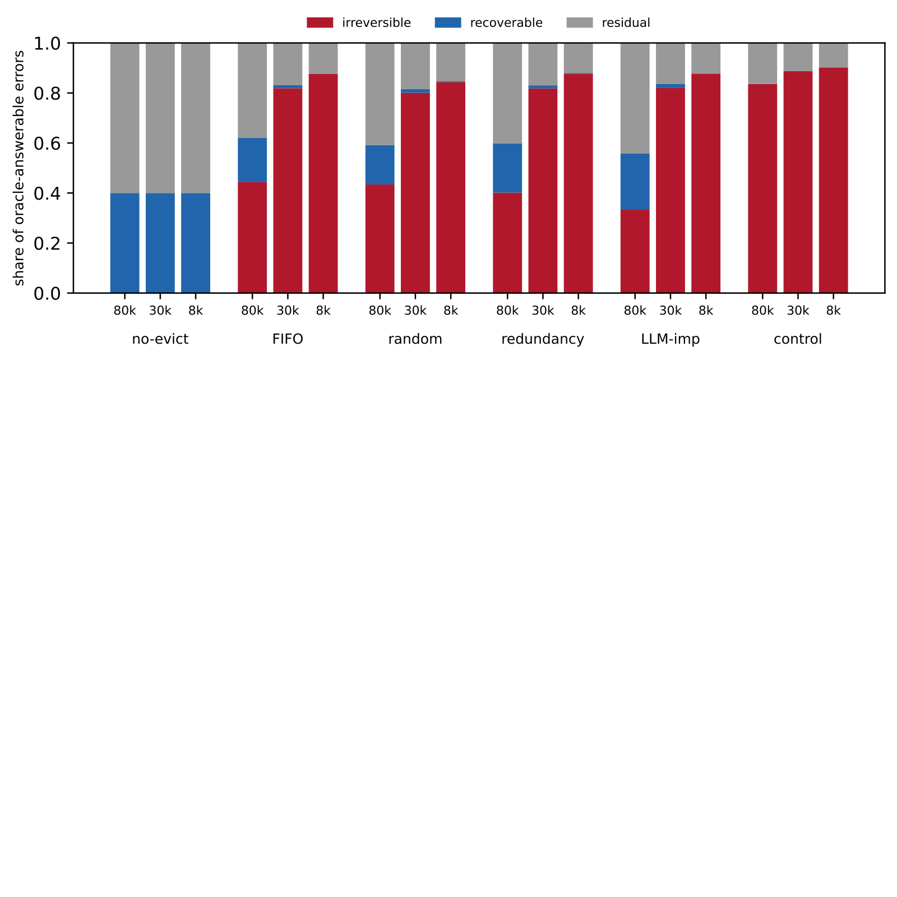
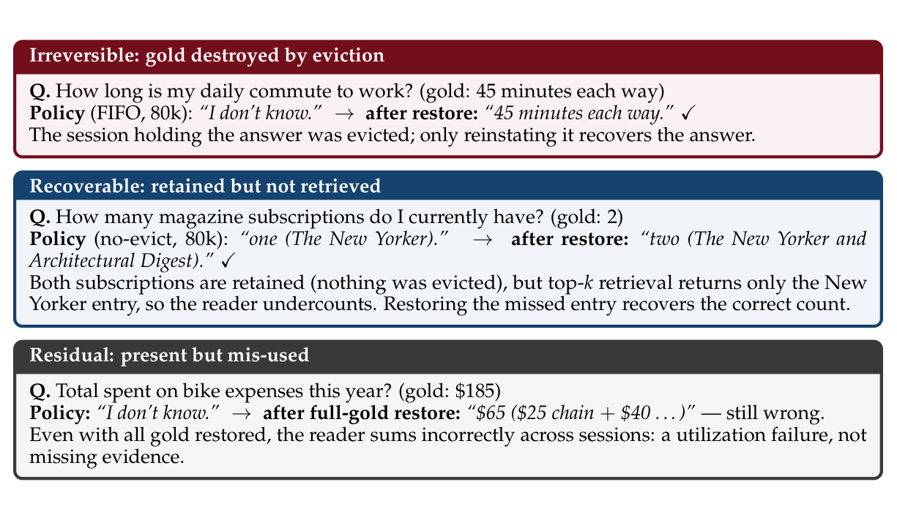

# What Eviction Destroys: A Restore-Counterfactual Audit of Forgetting in Agent Memory
## 驱逐毁掉了什么：面向智能体记忆遗忘的恢复反事实审计

> **论文元信息**
> - **arXiv**：[2609.08279](https://arxiv.org/abs/2609.08279)（v1，2026-09-08 提交）
> - **分类**：cs.CL（计算与语言）
> - **作者**：Chen Shen（单作者）；隶属 Megagon Labs；邮箱 chen_s@megagon.ai
> - **方法名**：恢复反事实（restore counterfactual）/ 恢复反事实审计（restore-counterfactual audit）
> - **许可**：CC BY-NC-SA 4.0
> - **复现地址**：https://github.com/megagonlabs/restore-counterfactual（含评测代码、逐问题记录、bootstrap 置信区间、校准报告与绘图脚本）
> - **篇幅**：arXiv HTML 全文，含摘要 + 第 1–7 节 + 参考文献（保留编号）+ 附录 A–D（正文以 LongMemEval-S 基准、4 种驱逐策略、3 档预算、2 种检索机制的研究为主；约 12 页）
> - **发表情况**：arXiv 预印本（文中未见会议/期刊接收标注）

> **翻译说明**
> - 本译文基于 arXiv 官方 HTML 全文（`https://arxiv.org/html/2609.08279v1`）逐段翻译，覆盖：**摘要 + 第 1–7 节 + 参考文献（保留编号）+ 附录 A–D**；**图 1–2 与表 1 全量数值**均完整呈现，所有数字逐字取自正文（text2.txt），未做任何概括或省略。
> - **插图**：共 **2 张**，已下载至 `images/EvictionDestroys/`，markdown 使用相对路径 `../images/EvictionDestroys/<文件名>` 引用，离线可读；每张图上方保留 `<!-- 原图：URL -->` 注释便于回溯。
>   - **图 1** 源为矢量 SVG（`figure1_decomposition.svg`），已转换为 PNG。
>   - **图 2 为 PDF 裁剪得到的位图**：原 HTML 中 Figure 2 没有独立图像文件，其内容被包进 figure 内部的排版元素，此处系从论文 PDF 裁剪所得，**并非原始矢量图**；原图来自 `https://arxiv.org/pdf/2609.08279`（正文三个 bin 的实例见 §5.1 译文的文字转录与图 2 位图）。
> - 公式统一按 LaTeX 重排（原文 MathML 与 LaTeX 双份渲染的重复串已清理）；术语首次出现时保留英文原文，之后统一用中文（如 eviction=驱逐、restore counterfactual=恢复反事实、oracle-answerable=oracle 可答、reader=读者、judge=裁判、ranker=排序器、gold evidence=金标准证据、budget=预算、regime=机制）。

---

## 摘要

智能体记忆系统（agent memory systems）在历史超出固定 token 预算时必须丢弃已存储的信息。现有的「预算–准确率前沿」（budget–accuracy frontier）量化了由此导致的准确率损失，却没有区分由驱逐（eviction）造成的**不可逆损失**与**可恢复的检索失败**。我们引入**恢复反事实**（restore counterfactual），一种逐问题配对干预：它在读取时的上下文中复原（reinstate）该问题的金标准证据（gold evidence），并重跑同一个读者（reader）。把正确性的变化与「驱逐后该证据是否被保留」结合起来，就把每个 **oracle 可答**（oracle-answerable）错误归类为**可恢复**、**不可逆**或**残余**；在残余（residual）情形下，即便恢复之后答案仍然错误。我们在 LongMemEval-S 上评估了 FIFO、random、redundancy-aware 与 LLM-importance 四种驱逐，覆盖三档预算与两种检索机制，使用 GPT-4o-mini 作为主读者与裁判（judge），并以 GPT-5.4-mini 作为稳健性读者。在 80k token 预算下的 top-kk 检索中，FIFO、random 与 redundancy-aware 驱逐下「被恢复所纠正的错误」中不可逆占比为 $0.67$–$0.73$，而 LLM-importance 为 $0.60$。在 8k token 下，四类策略均达到 $1.00$。可恢复错误出现在 80k 下的 top-kk 检索中，但在强制金标准注入（forced-gold injection）下构造上不存在，因此除非报告检索机制，否则预算–准确率结果不可直接比较。一项探索性的匹配准确率分析在 $1.2$–$6$ 个百分点的分辨率下，未检测到准确率匹配的策略对之间在不可逆率上有任何差异。同一分析检测到了那个刻意破坏的对照。据我们所知，这是在标准对话基准上、针对外部智能体记忆存储的驱逐所做的首个逐项、逐问题的恢复反事实审计。

---

## 1. 引言

在多会话交互中，一个 LLM 智能体会积累超出其上下文窗口容量的经验。这类智能体使用一条记忆流水线：写入信息、管理哪些信息被保留或遗忘、并读取信息（Zhang et al., 2025; Sumers et al., 2024）。现有系统（Park et al., 2023; Kang et al., 2025; Chhikara et al., 2025）与基准（Maharana et al., 2024; Wu et al., 2025）使这条流水线变得具体。近期关于记忆预算的研究包括理论工作（Zou et al., 2026）与经验工作（Zhang et al., 2026）关于预算–准确率前沿，以及可学习的保留策略（Li et al., 2026; Kang et al., 2026）。这些研究量化了在更紧的预算下损失的准确率，却没有刻画该损失的具体构成。

一个前沿点把两种具有相反补救手段的失败模式混为一谈。如果所需的证据已从存储中被驱逐，没有任何排序器能找回它，只有更多的保留（retention）才有帮助（损失是不可逆的）；如果它存活下来却未被检索到，那么一个更好的排序器（retriever）就能帮上忙，而无需额外保留（这是可恢复的）。一个「全可恢复的前沿」与一个「全不可逆的前沿」在准确率轴上可能看起来一模一样，却需要不同的干预。

恢复反事实从某个策略的驱逐后存储出发，在读取时上下文中复原该问题的金标准证据，重跑同一个被冻结的读者，并记录正确性的任何变化。正确性的变化，连同「金标准证据在驱逐后是否被保留」，把每个 oracle 可答的策略错误归类为可恢复、不可逆或残余；在残余情形下，即便恢复之后答案仍然错误。我们贡献了这一工具与这一分解。我们并不提出新的记忆系统，也不对策略排名。每种结果都有不同的诊断解释：一个大的不可逆占比指向**保留**问题；一个大的可恢复占比指向**检索**问题；一个大的残余占比则表明读者**未能利用**被恢复的证据。当遗忘是由隐私或数据保护约束所要求时，同一分解同样适用；它衡量由此造成的任务准确率损失究竟是可恢复还是不可逆的。

**贡献。（i）** 用于外部智能体记忆存储中驱逐的恢复反事实度量（§3.1）；（ii）在 oracle 可答分母上的可恢复/不可逆/残余分解（§3.2）；以及（iii）一项受控的 LongMemEval-S 研究，覆盖四种驱逐策略（含一个 LLM-importance 臂）、三档预算与两种检索机制（§4–§5）。该研究表明：除非报告检索机制，否则预算–准确率前沿不可直接比较。

---

## 2. 相关工作

#### 预算化记忆与遗忘

MaRS/FiFA 在合成的生成式智能体模拟上用复合效用上界比较驱逐，而非下游准确率（Alqithami, 2025）。EMBER（Li et al., 2026）与 OSL-MR（Kang et al., 2026）提出了学习预算化保留的方法并报告端任务准确率。二者都没有区分不可逆损失与可恢复损失。DeMem（Zou et al., 2026）形式化了一个最优遗忘边界；我们则给出了一个可操作的、逐问题的估计量，用以判断该边界是否已被越过。BudgetMem（Zhang et al., 2026）在 LoCoMo 与 LongMemEval 上报告准确率–代价前沿；我们的分解则按失败类型刻画了前沿某一点上的损失。

#### 阶段分解

WhenLoss（Yu et al., 2026）在聚合层面把记忆失败分解为写入侧 vs 检索侧的质量。我们的分解用逐问题的干预把错误归因到驱逐。观测式诊断（Garg et al., 2026）与「检索 vs 利用」切分（Yuan et al., 2026）定位或归因失败，但都没有通过逐项的恢复把失败归因到一个受容量约束的驱逐决策。最相关的研究 AgingBench（Zhu et al., 2026）在智能体写入的存储上使用成对的 oracle 注入探针来诊断写入/检索/利用失败，但它针对的是自定义场景上的老化机制，而非受容量约束的驱逐策略。在此，我们在 LongMemEval-S 上通过逐问题恢复所需证据，对每个 oracle 可答的策略错误进行分类。

#### 干预类别

重新植入一个条目并测量由此带来的变化，是留一上下文归因（leave-one-out context attribution）（Cohen-Wang et al., 2024）的一种形式，也是反事实记忆化（counterfactual memorization）（Zhang et al., 2023）在推断时的类比；逐项的下游效用也出现在检索评估中（Salemi & Zamani, 2024）。据我们所知，这是首次把这类干预应用于外部智能体记忆存储的驱逐，并以端任务准确率为结果。这一设定把我们的审计与此类干预的先前应用以及 oracle 注入诊断（Zhu et al., 2026）区分开来。

#### 上下文分页把恢复用作服务机制

Mason（2026）把恢复用作一种服务机制。由于 KV-cache 驱逐可能优于完整缓存，一个聚合的「无驱逐差值」会误测驱逐造成的损害（Bui et al., 2026）。那些假设可恢复性或内部修复检索的系统（Hsu et al., 2026; Lu et al., 2026; Semenov & Dorofeev, 2026）并不度量由驱逐引起的不可逆任务损失。

#### 检索混淆因素

由于一个冻结的排序器可能漏掉存储在其中的证据（Derehag et al., 2026; Wu et al., 2025），驱逐效应必须在受控的检索条件下解释。因此我们报告两种检索设置，并把它们之间的差异作为一个结果。

---

## 3. 恢复反事实

遵循因果测量的模板（Lesci et al., 2024），我们把目标量定义为「由一个遗忘决策造成的端任务准确率损失」，在既定假设下从可观测变量中识别它，并给出估计量。§3.1 定义逐问题的估计量，§3.2 用它构造三箱分解，§3.3 陈述把这些箱解释为不可逆、可恢复与残余错误所需的假设。

### 3.1 恢复反事实度量

#### 为什么用反事实，而非准确率下降

朴素估计量衡量的是驱逐之后的准确率下降。但这一下降把我们本需要分离开的两种失败模式混在了一起：某个问题所需的证据可能已被驱逐销毁，也可能仍存于存储中只是没有被检索到。二者所需的补救手段截然相反，却在准确率轴上无法区分。

恢复反事实通过「复原该问题所需的具体证据、再检查答案是否变正确」来区分这两种失败模式。这是一种留一上下文归因（Cohen-Wang et al., 2024）。

#### 估计量

一个冻结的读者基于从一个受容量约束的存储中注入的记忆单元来回答一个问题 $q$。对于预算 $B$ 下的某个驱逐策略 $P$，记驱逐后的存储为 $S_P$。恢复反事实把该问题的完整金标准证据集 $G_q$（即基准标注为「包含答案」的那些单元）重新注入读取时的上下文，并重新作答：

$$\text{restore\_gain}(q)=\mathrm{acc}_q(\text{restored})-\mathrm{acc}_q(\text{policy})\in\{-1,0,1\}$$

$$\text{irreversible\_loss}(q)=\max(0,\text{restore\_gain}(q))\cdot\mathbf{1}[G_q\not\subseteq S_P]$$

这里 $\mathrm{acc}_q(c)\in\{0,1\}$ 表示在条件 $c\in\{\text{restored},\text{policy}\}$ 下问题 $q$ 的判定正确性。读者、提示词、解码（温度 $0$）、裁判与排序器在「策略条件」与「恢复条件」之间保持固定，因此该比较仅在统一的注入流程下改变 $G_q$ 的可用性；于是 $\text{restore\_gain}$ 衡量的是「恢复 $G_q$ 对正确性的影响」，其正值部分即为「通过读取时恢复可挽回的准确率」。在固定上限下，恢复会把 $G_q$ 强制排在排序器结果之前，因此也可能改变哪些非金标准单元出现；A3 给出了这一上限带来的松弛（slack）的边界。$G_q$ 来自基准对未改写的轮次/会话单元所标注的证据标签；我们不使用重新表示或派生的摘要式存储，因为其单元将不再与所标注的证据对应。

#### 一个算例

LongMemEval-S 中有一个问题问「用户每天通勤上班要花多长时间」。在 80k 预算下，FIFO 已经把记录这一信息的会话驱逐出去，读者回答「我不知道」。恢复反事实重新注入那个被驱逐的会话；读者现在答出正确的「单程 45 分钟」，于是 $\text{restore\_gain}=1$ 且至少有 $1$ 个金标准单元被驱逐——这是一个不可逆损失，唯一的解法是保留那个会话。若该金标准会话本存活于 $S_P$ 中、且同样的恢复把答案翻转，那么损失就是可恢复的（排序器漏掉了它）。这一流程逐题地把每个错误归入上述某一类。

### 3.2 可恢复性分解

分母由「oracle 可答的策略错误」构成：即那些读者在干净的全金标准注入下能答对、却在策略条件下答错的问题。（对于强制金标准注入下的驱逐策略，这些是驱逐引起的；no-evict 参照与 top-kk 机制下还允许检索遗漏/利用失败错误，这些由可恢复与残余箱隔离出来。）每个这样的错误恰好属于以下三类之一：

- **不可逆（irreversible）**：恢复 $G_q$ 使答案由错变对，且 $G_q$ 中至少有 $1$ 个单元被驱逐（销毁，只能靠保留来修复）；
- **可恢复（recoverable）**：恢复使答案由错变对，且 $G_q$ 全部存活（一种检索遗漏，靠更好的排序器修复）；
- **残余（residual）**：即便恢复了 $G_q$ 答案仍然错误（利用失败，单独报告）。

我们按「策略 × 预算」报告堆叠占比，并给出问题簇 bootstrap 置信区间与族内 Holm–Bonferroni 校正。以 oracle 可答性为条件，把分解限定在「读者凭干净金标准能答对」的错误上，因此各箱不会被「本质上不可答」的问题污染。残余占比单独刻画了「读者能否利用该证据」。

### 3.3 各箱何时名副其实

解释这一分解需要三个假设。对每一个，我们都说明它在此处为何合理，以及它可能如何失效。

#### A1（oracle 可答性）

我们只对那些「读者在干净全金标准注入下能答对」的错误打分。有了这一限制，被判分的错误就是「读者本可从干净金标准答出」的错误，因此各箱反映的是预算对该证据做了什么，而非读者「答不出」的能力问题。这一解释只有在「干净金标准上下文本身不可答」时才会失效，而过滤器在构造上已经排除了这种情况。同一过滤器也把我们的刻画限定在基准中「可答」的那一部分，排除了弃答（abstention）行为。

#### A2（裁判有效性）

读者与裁判都是 GPT-4o-mini。为检验评分稳定性，我们在主评估前用 40 道题对裁判做了校准，得到相对 $0.90$ 阈值的重复自一致性为 $1.0$（附录 A）。这证明了评分的稳定性，但并未证明它与读者相互独立。因此，一个相关的「读者–裁判」偏差对跨读者检验是不可见的。作为评分一致性的另一项独立检验，一个独立的 GPT-5.5 裁判对分层抽样重新打分，与 GPT-4o-mini 的一致率为 $95.7\%$（Cohen's $\kappa=0.90$；附录 C）。两位裁判都是 OpenAI 的模型，因此换用不同提供商的裁判或人工标注会是更强的检验。

#### A3（恢复紧致性）

全金标准恢复是默认设置；它使不可逆占比成为「销毁量」的上界。三项检验量化了这一上界在 $2{,}276$ 个不可逆案例上的松弛（附录 C）。只恢复存活的金标准会把 $0.3\%$ 重分类；注入完整的保留存储（100% 覆盖）能挽回 $2\%$，因此 $98\%$ 的不可逆案例并不潜伏在保留的记忆中，与「真正的销毁」而非「检索遗漏」一致。最后，一个等长的安慰剂（在金标准位置放置非金标准内容）翻转了 $8.3\%$，而金标准恢复翻转了 $100\%$，因此该箱反映的是证据可用性，而非摆放位置（这 $8.3\%$ 给出了「呈现方式 + 未标注证据」联合效应的上界）。

---

## 4. 实验设置

本研究在单一基准上评估四种驱逐策略、三档预算、两种检索机制，遵循一套在测量前即冻结的协议。

#### 数据

LongMemEval-S（Wu et al., 2025）包含约 $102\mathrm{k}$ 个 token 的多会话历史，因此三档预算全部「收紧」（binding）；数据集版本由附录 A 报告的哈希值固定。我们使用全部 $470$ 道带证据标注的问题，并剔除弃答问题（它们没有可供恢复的金标准位置）。证据会话 id 含有答案子串，但从不暴露给读者或裁判。

#### 策略

我们评估四种驱逐策略（FIFO、random、redundancy-aware、LLM-importance），外加一个 no-evict（不驱逐）参照。LLM-importance 使用一个冻结的 GPT-4o-mini 打分器，在不接触问题或金标准证据的前提下，为每个单元打一个 $1$ 到 $10$ 的「通用重要性」分数；它是一个简单的重要性基线，而非最先进的保留系统。没有任何策略决策读取金标准。我们加入了一个刻意破坏的阳性对照（一个信息密度启发式，以约 $3\times$ 于基线的速率驱逐金标准）；它是 R3（§5.3）的阳性对照，用来证明本审计在销毁确实存在时能够登记到它。

#### 预算

三档存储上限 $8\mathrm{k}$、$30\mathrm{k}$、$80\mathrm{k}$ 个 token 对约 $102\mathrm{k}$ token 的历史全部收紧，覆盖从严重到轻微的内存压力。

#### 检索机制

评估两种读取时条件：(a) 强制金标准注入（forced-gold injection），通过保证存活的金标准被读到，从而隔离出销毁；(b) 一个冻结的 top-kk 排序器，这是一种真实条件，其中存活的金标准可能被漏掉。可恢复占比之差（计算为机制 (b) 减机制 (a)）本身就是一个结果（R2，§5.2）。

#### 读者与裁判

读者与裁判均为 GPT-4o-mini（温度 $0$，确定性）；我们用更强的 GPT-5.4-mini 推理读者复现了结构性结果（§5）。打分按问题配对；裁判方差与效应量同量级，因此配对是强制性的。评测代码用一个确定性的模型调用替代做了构造效度验证，并与逐问题记录一同发布（附录 B 中的链接）。§3.3 给出了关于分母、裁判与恢复的效度假设。

#### 统计与协议

我们跑三个随机种子（确定性策略用种子 0；附录 A）。在一个测量前即冻结、并随发布物一同提供的预指定协议中，显著性使用「问题簇 bootstrap（10,000 次重采样）」评估，并在每个假设族内做 Holm–Bonferroni 校正。预指定的 H1 族是在强制金标准下（机制 a）的一个「每格占比 $>0$」检验。由于强制金标准在构造上清空了可恢复箱，H1 是一个构造性检查，证明分解是良定义的——而实质性的 R1 量级（销毁占多数，双箱占比 $>0.5$）是从机制 b 的占比及其 bootstrap 置信区间读出（R1）。H3 是机制 (b)−(a) 在「驱逐策略 × 预算」各格上的可恢复差值。no-evict 各格（构造上销毁为 $0$）在两个族中都是被排除的参照。对于 H1/H3，这个 $12$ 格的族由四个基线/对照策略（FIFO、random、redundancy-aware、info-density 对照）× $3$ 档预算构成；后来加入的 LLM-importance 进入表 1 与 H2 的匹配准确率分析，而非这些计数。H2 是关于准确率匹配对的不可逆率检验，在冻结之后追加（R3）。

## 5. 结果

<!-- 原图：https://arxiv.org/html/2609.08279v1/figure1_decomposition.svg -->


> **图 1（原文 Figure 1）**：The recoverable/irreversible/residual decomposition per policy at three budgets (top-kk regime), as three-bin shares of oracle-answerable policy errors. Destruction dominates on the two-bin denominator, not the shares plotted here; the no-evict reference has zero irreversible loss by construction. LLM-importance has the lowest irreversible share at 80k, but this is descriptive — at matched accuracy no policy dissociates (§5.3, R3). (The two-bin headline share is irreversible/(irreversible+recoverable); per-cell counts in Table 1.)
> （各策略在三种预算下（top-kk 机制）的可恢复/不可逆/残余分解，以 oracle 可答策略错误的三箱占比表示。销毁在双箱分母上占主导，而非图中所绘的占比；no-evict 参照在构造上不可逆损失为零。LLM-importance 在 80k 下的不可逆占比最低，但这是描述性的——在匹配准确率下没有任何策略分化（§5.3，R3）。（双箱标题占比为不可逆/(不可逆+可恢复)；逐格计数见表 1。））

### 5.1 销毁是主要成分（R1）

在强制金标准注入下，可恢复箱在构造上为空，因此全部 $12$ 个驱逐/对照格的双箱占比都位于 $1.00$。这确认了分解是良定义的，且强制金标准隔离出了销毁，但这是一个代数恒等式，而非证据（§5.3）。真正的证据来自真实 top-kk 机制下的量级。在双箱分母 $\text{irr}/(\text{irr}+\text{rec})$ 上，80k 下的占比为 FIFO $0.71$（CI $.61$–$.81$）、random $0.73$、redundancy-aware $0.67$、对照 $1.00$。每个下界都超过 $0.5$，因此销毁是主要成分。LLM-importance 是例外：其占比 $0.60$（CI $.47$–$.72$）横跨 $0.5$，而 no-evict 在构造上为 $0.00$。表 1 报告了逐格计数；图 1 绘制了较小的三箱占比（FIFO、random、redundancy-aware 在 80k 下约为 $0.40$–$0.44$）。

**表 1：驱逐损失以销毁为主导。** 在 80k 下，每个驱逐策略的双箱占比 $\text{irr}/(\text{irr}+\text{rec})$ 都超过 $0.5$（加粗），并且随着预算收紧到 8k 升至 $1.00$。真实 top-kk 机制 (b) 下、主读者（GPT-4o-mini）的逐格计数：oracle 可答分母 $N$、策略错误数 $\text{err}$、不可逆/可恢复/残余分解、双箱占比、以及不可逆率 $\text{irr}/N$。机制 (a) 是构造参照（rec $\equiv 0$，双箱 $\equiv 1.00$）。random 在 3 个种子上合并（$N=1008$），其余为确定性（种子 0，$N=336/332$）。完整网格（两种机制、两种读者、bootstrap 置信区间）与逐问题记录见附录 B 与发布物。

| 策略 | 预算 | $N$ | $\text{err}$ | $\text{irr}$（不可逆） | $\text{rec}$（可恢复） | $\text{res}$（残余） | 双箱占比 $\text{irr}/(\text{irr}+\text{rec})$ | 不可逆率 $\text{irr}/N$ |
|---|---|---|---|---|---|---|---|---|
| no-evict | 80k/30k/8k | 336 | 95 | 0 | 38 | 57 | 0.00 | 0.00 |
| FIFO | 80k | 336 | 124 | 55 | 22 | 47 | 0.71 | 0.16 |
| FIFO | 30k | 336 | 243 | 199 | 3 | 41 | 0.99 | 0.59 |
| FIFO | 8k | 336 | 299 | 262 | 0 | 37 | 1.00 | 0.78 |
| random | 80k | 1008 | 387 | 168 | 61 | 158 | 0.73 | 0.17 |
| random | 30k | 1008 | 708 | 567 | 11 | 130 | 0.98 | 0.56 |
| random | 8k | 1008 | 894 | 754 | 3 | 137 | 1.00 | 0.75 |
| redundancy-aware | 80k | 336 | 127 | 51 | 25 | 51 | 0.67 | 0.15 |
| redundancy-aware | 30k | 336 | 242 | 198 | 3 | 41 | 0.99 | 0.59 |
| redundancy-aware | 8k | 336 | 300 | 263 | 1 | 36 | 1.00 | 0.78 |
| LLM-importance | 80k | 332 | 102 | 34 | 23 | 45 | 0.60 | 0.10 |
| LLM-importance | 30k | 332 | 239 | 196 | 4 | 39 | 0.98 | 0.59 |
| LLM-importance | 8k | 332 | 302 | 265 | 0 | 37 | 1.00 | 0.80 |
| control (info-density) | 80k | 336 | 244 | 204 | 0 | 40 | 1.00 | 0.61 |
| control (info-density) | 30k | 336 | 311 | 276 | 0 | 35 | 1.00 | 0.82 |
| control (info-density) | 8k | 336 | 327 | 295 | 0 | 32 | 1.00 | 0.88 |

> **表 1 注**：双箱占比 $\text{irr}/(\text{irr}+\text{rec})$ 中，加粗值（80k 下各驱逐策略 $>0.5$）表示销毁在「不可逆+可恢复」分母上占主导；机制 (a) 下该占比恒为 $1.00$（可恢复箱构造上为空）。不可逆率 $\text{irr}/N$ 衡量「被销毁的 oracle 可答错误」占全部 oracle 可答问题的比例。random 跨 3 个种子合并（$N=1008$），其余策略为确定性运行（种子 0，$N=336$ 或 $332$）。

下图给出每个箱的一个真实实例（LongMemEval-S，top-kk 机制）：

- **不可逆（Irreversible）**：金标准被驱逐销毁。
  **问**：我每天通勤上班要花多长时间？（金标准：单程 45 分钟）
  **策略（FIFO，80k）**：「我不知道。」→ 恢复后：「单程 45 分钟。」✓
  持有答案的会话已被驱逐；只有把它重新注入才能找回答案。

- **可恢复（Recoverable）**：被保留但未被检索到。
  **问**：我目前订了几本杂志？（金标准：2 本）
  **策略（no-evict，80k）**：「一本（《纽约客》）。」→ 恢复后：「两本（《纽约客》和《建筑文摘》）。」✓
  两本订阅都被保留了（什么都没被驱逐），但 top-kk 检索只返回了《纽约客》条目，因此读者少算了。恢复那个被漏掉的条目即找回正确计数。

- **残余（Residual）**：证据在场却被误用。
  **问**：今年在自行车开销上总共花了多少钱？（金标准：185 美元）
  **策略**：「我不知道。」→ 全金标准恢复后：「65 美元（25 美元的链条 + 40 美元……）」——仍然错误。
  即便恢复了所有金标准，读者仍跨会话错误地求和：这是利用失败，而非证据缺失。

<!-- 原图：（PDF 裁剪）来自 https://arxiv.org/pdf/2609.08279 （原 HTML 中 Figure 2 无独立图像文件，此处为从 PDF 裁剪得到的位图） -->


> **图 2（原文 Figure 2）**：One real instance of each bin (LongMemEval-S, top-kk regime). Irreversible: the gold was evicted; recoverable: the gold was retained but the retriever missed it; residual: the gold is present yet the reader still answers wrong. Bin colors match Fig. 1.
> （每个箱的一个真实实例（LongMemEval-S，top-kk 机制）。不可逆：金标准被驱逐；可恢复：金标准被保留但检索器漏掉了它；残余：金标准在场但读者仍然答错。箱的颜色与图 1 一致。）

这一构成随预算与证据布局而变化。随着预算收紧，双箱占比从 FIFO、random、redundancy-aware 在 80k 下的 $0.67$–$0.73$ 上升到四者在 8k 下均为 $1.00$（表 1）。证据布局也很重要：单会话问题的不可逆率约为 $95\%$，而多会话与时间推理问题的残余占比为 $23\%$–$34\%$，贡献了绝大部分残余错误。图 2 给出了每个箱的一个真实实例。换用 GPT-5.4-mini 作读者时，H1/H3 的拒绝计数与各策略排序保持不变，而残余质量缩小（附录 C）。

### 5.2 两种检索机制不可互换（R2）

可恢复错误出现在 top-kk 检索下，但在强制金标准注入下构造上不存在。在 80k 下，这一可恢复占比之差为 FIFO $+0.29$（CI $.19$–$.39$）、random $+0.27$、redundancy-aware $+0.33$、no-evict $+1.00$，在 Holm 校正后均显著（$p_{\text{adj}}=.007$）。random 在 30k 下的一个小差值在校正后也显著（$+0.019$，CI $.005$–$.036$，$p_{\text{adj}}=.042$）。综合起来，这些结果在 $12$ 个驱逐格中的 $4$ 个上给出了拒绝。$3$ 个 no-evict 格在强制金标准下双箱分母为空（$\text{irr}=\text{rec}=0$），被排除在该计数之外。

这一差值集中在 80k，因为更紧的预算销毁了证据而非让它「未被检索到」，因此在 top-kk 检索下剩余的可恢复错误更少。拒绝模式在 GPT-5.4-mini 下同样成立，它复现了「12 个驱逐格中 4 个被 H3 拒绝」的计数（附录 C）。要在同一预算下比较各研究报告，研究者必须控制、或至少报告读取时的检索设置。

### 5.3 在匹配准确率下，没有任何策略分化——且检验有功效（R3）

R3 是一个需要谨慎解释的否定结果：最初指定的「干净零假设」是在强制金标准注入下评估不可逆占比而产生的人造物。在强制金标准注入（机制 a）下，不可逆占比在构造上被钉在 $1.00$：所有存活的金标准都被读到，因此可恢复箱为空。这一 $1.00$ 的对比因此无法检测分化；它是一个代数恒等式，而非检验（协议在冻结后被修订，以替换这一退化统计量）。H1 与 H3 仍按原指定（验证性）保留。H2 被明确标记为冻结后的追加项。

改在非退化的不可逆率（$\text{irr}/N$，top-kk 机制）上，成对在 $|\Delta\text{acc}|\leq 0.05$（预指定的校准窗，caliper）下计为准确率匹配：没有任何准确率匹配的基线对在任一预算下分化：$9$ 对中的 $0$ 对（即三对基线 {FIFO/random、FIFO/redundancy-aware、random/redundancy-aware} 在 80k/30k/8k 各档），且 $|\Delta\text{rate}|\leq 0.036$，每个置信区间都跨过 $0$。一个内容感知的 LLM-importance 臂也没有分化（$6$ 个准确率匹配比较中的 $0$ 个：在 30k 与 8k 下对三个基线；检验跑在成对共享的 oracle 可答 qid 上，$n\approx 329$）。在 80k 下，LLM-importance 的准确率更高、不可逆率低于三个基线，但这三个比较并不准确率匹配（$0.69$ 对约 $0.62$，超出 $0.05$ 校准窗），因此不算作 H2 分化。在 30k 与 8k（准确率匹配处），相对于基线未检测到任何不可逆率分化。

**分辨率与阳性对照。** 只有在检验本可能检测到真实效应时，一个「未拒绝」才有信息量。那个刻意破坏的对照（以约 $3\times$ 于基线的速率驱逐金标准）在所有 $9$ 个对比中都产生了显著的不可逆率差异（主读者下 $p<0.001$；两位读者下 $p<0.05$）。这些对比并不准确率匹配，因此它们表明该统计量能登记到大的破坏性差异，而非在校准窗内确立功效；匹配比较的灵敏度是观测到的配对 bootstrap 置信区间半宽，$1.2$–$6$ 个百分点；因此我们报告「在该分辨率下未检测到分化」，而非统计等价（等价声明需要有力度的 TOST，留待后续工作）。这一零结果在更强的读者下复现。

### 5.4 残余是读者利用失败（R4）

残余箱容纳的是即便全金标准恢复后仍存活的错误。这些案例是 oracle 可答的，裁判的严格性至多解释 $20\%$。其余的解释是「利用失败」而非「证据缺失」：金标准在场，但读者未能正确地对之作推理，几乎总是发生在跨会话聚合信息时。在一个这样的案例中，一笔 $185$ 美元的跨会话求和被返回为「$65$ 美元」。

在更强的读者下，残余箱减少超过一半，从 no-evict 在 80k 强制金标准注入下的 $59$ 降到 $28$；被纠正的案例恰好就是那些聚合错误（附录 C）。因此残余箱也依赖于读者。

---

## 6. 讨论

测得的结构表明哪个成分需要改进。在紧预算下，改进保留比改进检索更优先（R1）：在保留更多证据之前，更好的排序器收益甚微。可恢复成分非零，但依赖于检索机制（R2）。因此，预算–准确率前沿在检索机制被报告之前是不可直接比较的。在匹配准确率下，在所测策略对之间、在 $1.2$–$6$ 个百分点的分辨率下未检测到不可逆率的差异（R3）。该工具能识别限制成分，却不挑选最优策略。

**局限性。** 本研究使用单一基准、两位读者与一个主裁判；审计裁判与模型同属一个提供商。R1/R2 与 R3 的零结果跨读者复现；残余则依赖于读者。该审计需要金标准标签与一个 oracle 可答过滤器，这限制了它只能用于基准分析。各驱逐臂是策略类别，而非已发布的系统。该零结果仅针对所测的策略与预算。

**伦理。** 此处「销毁（destruction）」仅指因驱逐造成的任务证据损失。在部署中，遗忘可能是满足隐私与数据保护要求（数据最小化、存储限制或删除）所必需的；在此类情形下，保留更多信息可能并不可取，甚至不被允许。该工具量化的是「一个遗忘决策的任务代价」，并不规定信息应当保留还是删除；同一分解也可以审计「一次被要求的删除」是否造成了可恢复或不可逆的任务损失。

---

## 7. 结论

恢复反事实通过分离「驱逐销毁了什么、检索漏掉了什么、读者未能利用什么」，来刻画内存预算下 oracle 可答的策略错误。这三类错误来源需要不同的补救手段。对于预算化记忆的研究文献而言，这意味着：除非报告读取时的检索机制，否则预算–准确率前沿是不可比较的。我们的贡献是做这一分析的工具；它不对策略排名。

---

## 参考文献

> 以下按正文出现顺序编号保留原文条目（条目标题不译）。

[1] Saad Alqithami. *Forgetful but Faithful: A Cognitive Memory Architecture and Benchmark for Privacy-Aware Generative Agents.* arXiv:2512.12856, 2025.

[2] Ngoc Bui, Hieu Trung Nguyen, Arman Cohan, Rex Ying. *Make Each Token Count: Towards Improving Long-Context Performance with KV Cache Eviction.* arXiv:2605.09649, 2026.

[3] Adyant Bui, Hieu Trung Nguyen, et al. (Chhikara et al.) *Mem0: Building production-ready AI agents with scalable long-term memory.* ECAI 2025, IOS Press, 2025. doi:10.3233/FAIA251160.

[4] Benjamin Cohen-Wang, Harshay Shah, Kristian Georgiev, Andrew Ilyas, Aleksander Mądry. *Contextcite: Attributing model generation to context.* NeurIPS 2024.

[5] Johan Derehag, Joey Öhman, et al. *SmartSearch: How Ranking Beats Structure for Conversational Memory Retrieval.* arXiv:2603.15599, 2026.

[6] Yash Garg, Anmol Agarwal, et al. *MemFail: Stress-Testing Failure Modes of LLM Memory Systems.* arXiv:2605.26667, 2026.

[7] Tzu-Heng Hsu, Yu-Chao Huang, et al. *Organize then Retrieve: Hierarchical memory navigation for efficient agents.* arXiv:2606.11680, 2026.

[8] Jiho Kim, Janghwan Lee, et al. (Kang et al.) *Memory OS of AI agent.* EMNLP 2025, pp.25961–25970. doi:10.18653/v1/2025.emnlp-main.1318.

[9] Jingwen Kang, Ayesha Altaf, et al. *Learning What to Remember: Observability-Safe Memory Retention via Constrained Optimization for Long-Horizon Language Agents.* arXiv:2606.10616, 2026.

[10] Pietro Lesci, Tianyu Liu, et al. *Causal estimation of memorisation profiles.* ACL 2024, pp.15616–15635. doi:10.18653/v1/2024.acl-long.834.

[11] Jing Li, Hao Li, et al. *EMBER: Efficient Memory via Budgeted Evidence Retention for Long-Horizon Agents.* arXiv:2606.05894, 2026.

[12] Zheqi Lu, Siming Chen, et al. *REAL: A Reasoning-Enhanced Graph Framework for Long-Term Memory Management of LLMs.* arXiv:2606.10694, 2026.

[13] Adyant Maharana, Dong-Ho Lee, et al. *Evaluating very long-term conversational memory of LLM agents.* ACL 2024, pp.13851–13870. doi:10.18653/v1/2024.acl-long.747.

[14] Benjamin Mason. *The Missing Memory Hierarchy: Demand Paging for LLM Context Windows.* arXiv:2603.09023, 2026.

[15] Joon Sung Park, Joseph O'Brien, et al. *Generative agents: Interactive simulacra of human behavior.* ACM UIST 2023, pp.1–22. doi:10.1145/3586183.3606763.

[16] Alireza Salemi, Hamed Zamani. *Evaluating retrieval quality in retrieval-augmented generation.* ACM SIGIR 2024, pp.2395–2400. doi:10.1145/3626772.3657957.

[17] Denis Semenov, Artem Dorofeev. *Beyond Compaction: Structured Context Eviction for Long-Horizon Agents.* arXiv:2606.11213, 2026.

[18] Theodore Sumers, Shunyu Yao, et al. *Cognitive architectures for language agents.* TMLR 2024.

[19] Yujia Wu, Jimmy Lin, et al. *Longmemeval: Benchmarking chat assistants on long-term interactive memory.* ICLR 2025.

[20] Ruyi Yuan, Peng Chen, et al. (Yu et al.) *WhenLoss: Diagnosing Write and Retrieval Bottlenecks in Long-Context Memory Systems.* arXiv:2605.24579, 2026.

[21] Ruyi Yuan, Peng Chen, et al. *Diagnosing Retrieval vs. Utilization Bottlenecks in LLM Agent Memory.* arXiv:2603.02473, 2026. (Accepted at MemAgents Workshop, ICLR 2026.)

[22] Eliza Zhang, Irena Gao, et al. *Counterfactual memorization in neural language models.* NeurIPS 2023.

[23] Jingwen Zhang, Wei Chen, et al. *Learning Query-Aware Budget-Tier Routing for Runtime Agent Memory.* arXiv:2602.06025, 2026. (ICML 2026.)

[24] Zeyu Zhang, Xiaohe Bo, et al. *A survey on the memory mechanism of large language model-based agents.* ACM TOIS, 43(6):1–47, 2025. doi:10.1145/3748302.

[25] Yue Zhu, Zhen Tan, et al. *Your Agents Are Aging Too: Agent Lifespan Engineering for Deployed Systems.* arXiv:2605.26302, 2026.

[26] Xuan Zou, Dongsheng Li, et al. *Remember the Decision, Not the Description: A Rate-Distortion Framework for Agent Memory.* arXiv:2605.10870, 2026.

---

## A. 协议常量与可复现性（附录）

读者/裁判为 GPT-4o-mini（温度 $0$，确定性）；稳健性读者为 GPT-5.4-mini。数据集：LongMemEval-S 的 `longmemeval_s_cleaned.json`，sha256 `d6f21ea9…c3a442`（$470$ 道带证据标注的问题，约 $102\mathrm{k}$ token/历史，o200k 分词器）；已弃用的原始发布版本与之不同。存储预算 $80\mathrm{k}/30\mathrm{k}/8\mathrm{k}$ token；读取时 top-k $=60$；恢复注入上限 $=2000$ token（容纳每个金标准集，最大约 $1{,}000$）；$3$ 个种子（$0,1,2$；确定性策略用种子 $0$）。LLM-importance 打分器：一个冻结的 GPT-4o-mini 评分器（对 $1$–$10$ 的通用重要性打分，从不看问题或金标准）。Bootstrap：问题簇，$10{,}000$ 次重采样，平滑双边 $p$；在每个假设族内做 Holm–Bonferroni 校正。裁判校准（主评估前的闸门运行，$40$ 道题）：相对 $0.90$ 阈值的重复自一致性为 $1.0$，oracle 可答率为 $0.95$，负恢复增益率相对 $0.05$ 上限为 $0.00$。模型（OpenAI API）：读者/裁判 `gpt-4o-mini`、稳健性读者 `gpt-5.4-mini`、重要性打分器 `gpt-4o-mini`，以及独立的评分审计裁判 `gpt-5.5`（附录 C）；全部可通过 API 复现。发布的产物通过精确的带日期快照 id 固定了模型版本，并包含附录 D 复现的全部提示词。

**检索与恢复。** top-kk 排序器是一个冻结的确定性 BM25-lite，作用在保留的存储上（词法重叠；每个臂用同一排序器；以近因打破平局）。机制 (b) 是纯 top-kk（无强制金标准）；机制 (a) 强制存活的金标准。一次恢复会把缺失的金标准加入存储，强制完整的金标准集（绝不截断），跳过重复的强制 id，然后加入能放进剩余注入上限（$2000$ token）的排序器结果；最终注入的片段按时间顺序排列。问题簇 bootstrap 在问题层级重采样（某个被抽样问题的所有种子副本一起移动），因此重复种子不会膨胀有效样本量。分母：oracle 可答过滤器在基线网格上给出 $N=336$；后来加入的 LLM-importance 臂作为一个独立的强化网格运行，使用它自己的过滤器（$N=332$），而每个「LLM 对基线」的配对检验都跑在成对共享的 oracle 可答 qid 上（$n\approx 329$）。把「正确答变错」的恢复（负恢复增益）的速率被校准闸门控制在 $0.05$ 以下，且这类恢复从不制造一次挽回：不可逆损失在 $0$ 处被截断，只有「策略错误且 oracle 可答」的错误才被分箱。

## B. 扩展结果与发布物（附录）

表 1（正文）给出了真实 top-kk 机制 (b) 下、主读者时的标题性逐格计数。发布物包含完整网格：两种检索机制 (a) 与 (b)、两位读者（GPT-4o-mini 与 GPT-5.4-mini）、每个占比上的逐格 bootstrap 置信区间，以及逐问题记录。机制 (a) 是构造参照（可恢复 $\equiv 0$，因此双箱占比 $\equiv 1.00$）；random 在 $3$ 个种子上合并（$N=1008$），其余为确定性（种子 $0$，$N=336/332$）。

**发布物。** 公开发布包含评测代码（策略、恢复、分解与 bootstrap）、两位读者的逐问题记录、带 bootstrap 置信区间的逐格表、校准报告，以及绘图脚本：https://github.com/megagonlabs/restore-counterfactual。机制 (a) 的「占比 $>0$」检验是 H1 的构造检查（可恢复在构造上 $\equiv 0$，因此占比 $\equiv 1.00$）；no-evict 各格（不可逆在构造上 $\equiv 0$）是 H1/H3 拒绝计数中被排除的零销毁参照（§5）。

## C. 读者稳健性、残余分析与恢复紧致性消融（附录）

**读者稳健性（R1/R2）。** 把 GPT-4o-mini 读者换成更强的 GPT-5.4-mini 推理读者，结构性结果保持不变：相同的 Holm 计数（$12$ 个驱逐/对照 H1 格全部拒绝；$12$ 个驱逐 H3 格中 $4$ 个拒绝）以及双箱占比相同的各策略排序。残余箱是唯一发生变化的成分。

**残余机制（R4）。** 主读者基线网格（两种检索机制、所有预算格）中的 $1{,}922$ 条残余记录都是读者利用失败：金标准在场，但读者未能正确地对之作推理，压倒性地出现在跨会话的计数与求和上（例如把总计 $185$ 美元答成「$65$ 美元」）。在一个刻意保守的启发式下，$\leq 20\%$ 可能是裁判严格性的案例（大多数是读者算术错误，只是与金标准共享了实体）；金标准不足可忽略（这些案例是 oracle 可答的）。更强的读者解决了这些相同的聚合问题（例如那段 $185$ 美元的跨会话求和，较弱读者答成「$65$ 美元」，而在 GPT-5.4-mini 下是正确的），且残余箱减少超过一半（no-evict@80k：$59\to 28$）。

**恢复紧致性消融（§3.3，A3）。** 三项检验界定了不可逆箱的松弛，均在机制 (b) 的不可逆案例上（种子 $0$，$N=2{,}276$；每次 $0$ 个 API 错误）。(i) 存活的金标准：只用 $G_q\cap S_P$ 恢复后重新作答，把 $0.3\%$（$7$ 例）重分类为「实践中可恢复」；$87\%$ 的案例根本没有任何存活的金标准。(ii) 完整的保留存储：注入整个存活的存储（全部内容，而非仅标注的金标准；平均覆盖率 $1.00$，最高到完整的 $80\mathrm{k}$ 预算）能挽回 $2.0\%$（$45$ 例），因此即便提供了所有保留内容，$98\%$ 的不可逆案例仍不正确，与「真正的销毁」而非「从保留内容中检索」一致。(iii) 长度/位置安慰剂：在金标准位置强制注入等长的非金标准内容（安慰剂/金标准 token 比 $\leq 1.5$，靠近金标准的时间位置），把 $8.3\%$（$190$ 例）由错变对，而金标准恢复为 $100\%$，因此不可逆翻转反映的是证据可用性，而非摆放位置；这 $8.3\%$ 给出了「呈现方式 + 未标注证据」联合效应的上界（安慰剂是非标注的，不保证语义无关）。因此全金标准恢复是销毁的一个紧上界。

**裁判审计（§3.3，A2）。** 一个独立的 GPT-5.5 裁判用冻结的裁判提示词，对 $396$ 条被记录下来的（问题、参考、候选）分层抽样重新打分（既有原本错误的策略答案，也有常为正确的恢复答案）；$3$ 次 GPT-5.5 调用返回错误被排除，留下覆盖两类正确性（132 正确、261 不正确）的 $393$ 条完成打分。GPT-5.5 裁判与 GPT-4o-mini 裁判的一致率为 $95.7\%$（Cohen's $\kappa=0.90$；在两类恢复答案上 $\kappa=0.83$），分歧主要来自 $14$ 个 GPT-5.5 判得更严的案例。因此二元评分跨模型是可靠的；但两位裁判都是 OpenAI 模型，因此换用不同提供商的裁判或人工标注会是更强的检验。

## D. 提示词（附录）

全程解码温度 $0$；`max_tokens` = $600$（读者）/ $16$（裁判）/ $4$（重要性打分器）。会话 id 从不暴露给读者或裁判。下面三个提示词逐字复现自发布代码（`models.py`）；`{...}` 标记运行时被替换的字段，`{snippets}` 是所注入单元（或 `(no memory available)`）的换行连接渲染。

LLM-importance 打分器从不看问题或金标准标签。以下三个提示词逐字复现自发布代码（`models.py`）。

**读者提示词（reader）**：

```
System.
You answer a question using ONLY the provided memory snippets from earlier
conversations between a user and an assistant. Give the direct answer --- concise
but COMPLETE (for a list/order question, include every item in order; for a 'how
many days ago' question, compute it from today's date). If the snippets truly do
not contain the answer, reply exactly: I don't know.

User.
Today's date is {question_date}.
Memory snippets from earlier conversations:
{snippets}

Question: {question}
Answer:
```

**裁判提示词（judge）**：

```
System.
Grade whether a candidate answer matches a reference answer for the same
question. Reply with exactly one word: CORRECT or INCORRECT. Grade CORRECT if the
candidate conveys the same key facts as the reference --- IGNORE articles,
capitalization, phrasing, and extra detail. For list/order answers, every
reference item must appear (order matters only if the question asks for order).
For dates/numbers, the value must match.

User.
Question: {question}
Reference answer: {answer}
Candidate answer: {prediction}

Grade (CORRECT or INCORRECT):
```

**LLM-importance 打分器提示词（importance scorer）**：

```
System.
Rate how generally important this single memory snippet is to remember about the
user, on a scale of 1 (trivial small-talk) to 10 (a durable fact, preference, or
commitment). Reply with only the integer.

User.
Memory snippet: {content}
Importance (1-10):
```
