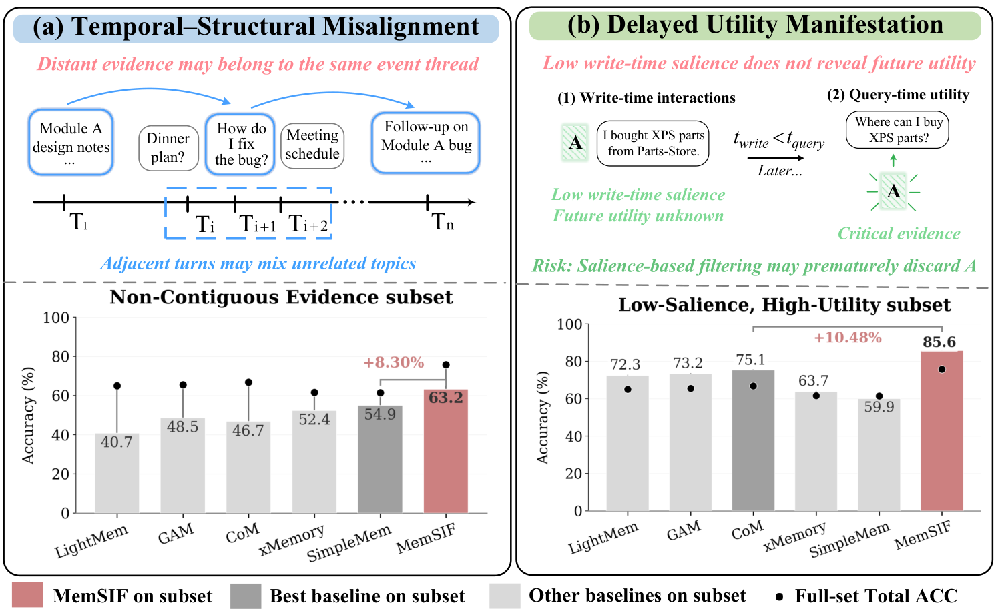
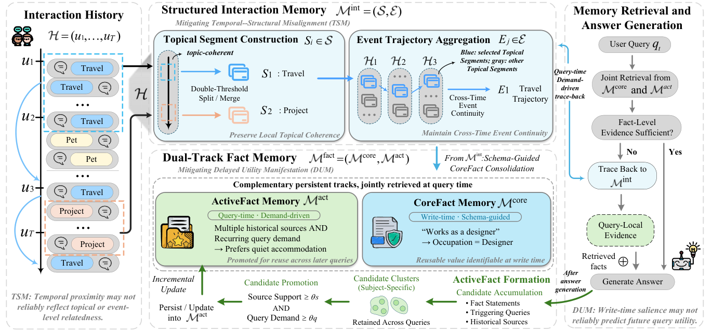
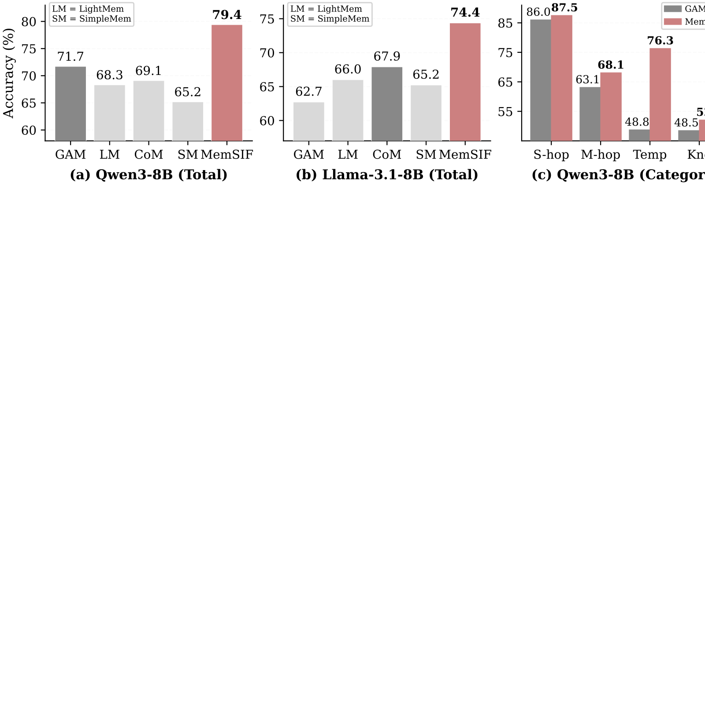
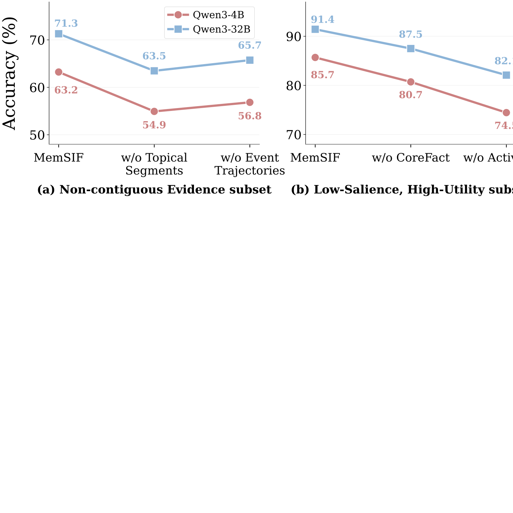
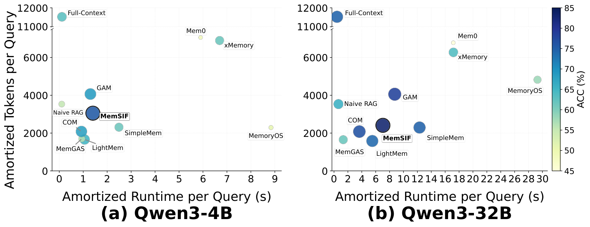
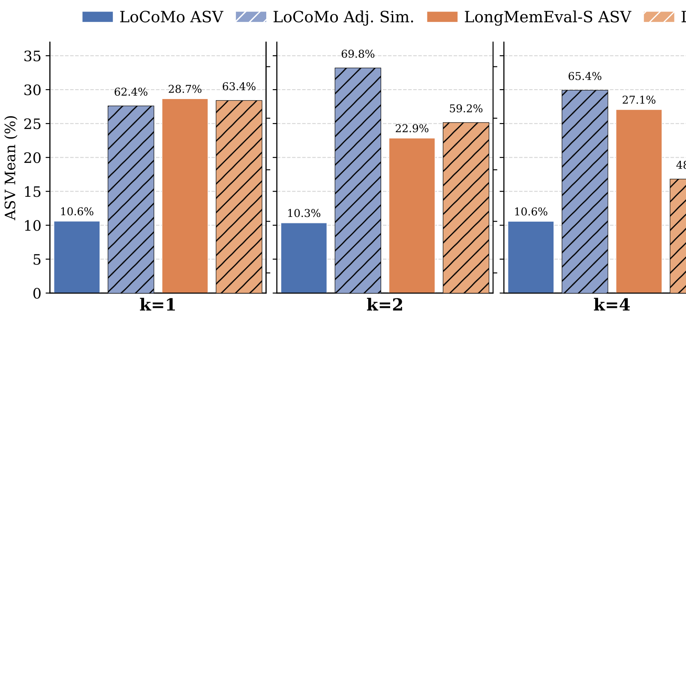
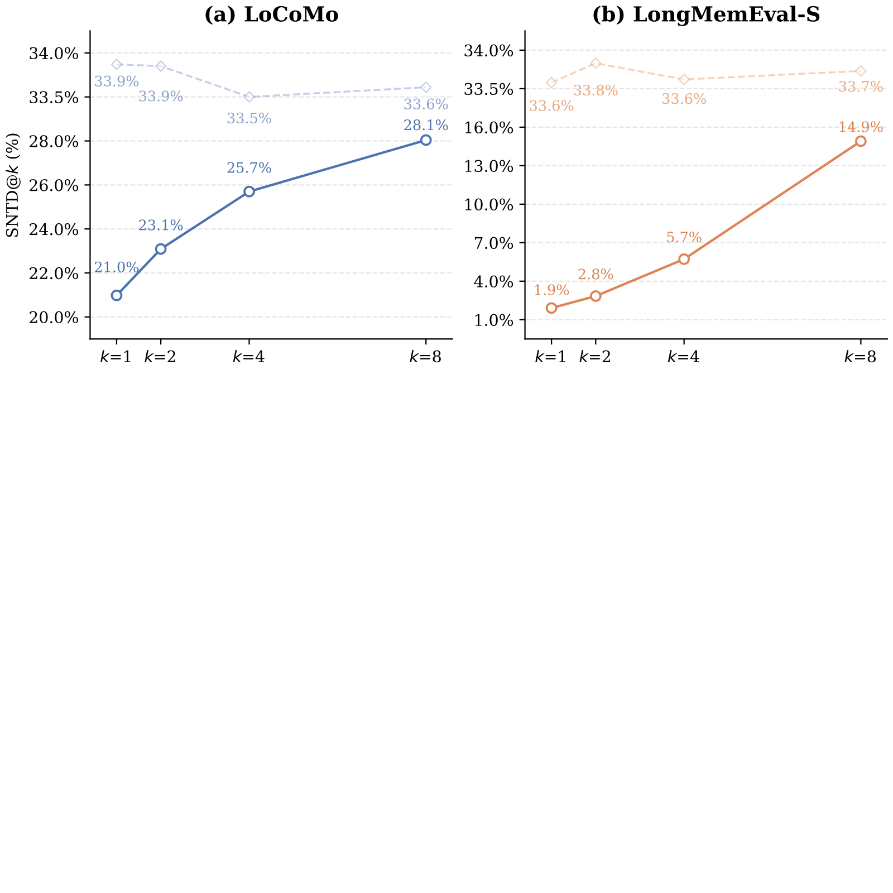
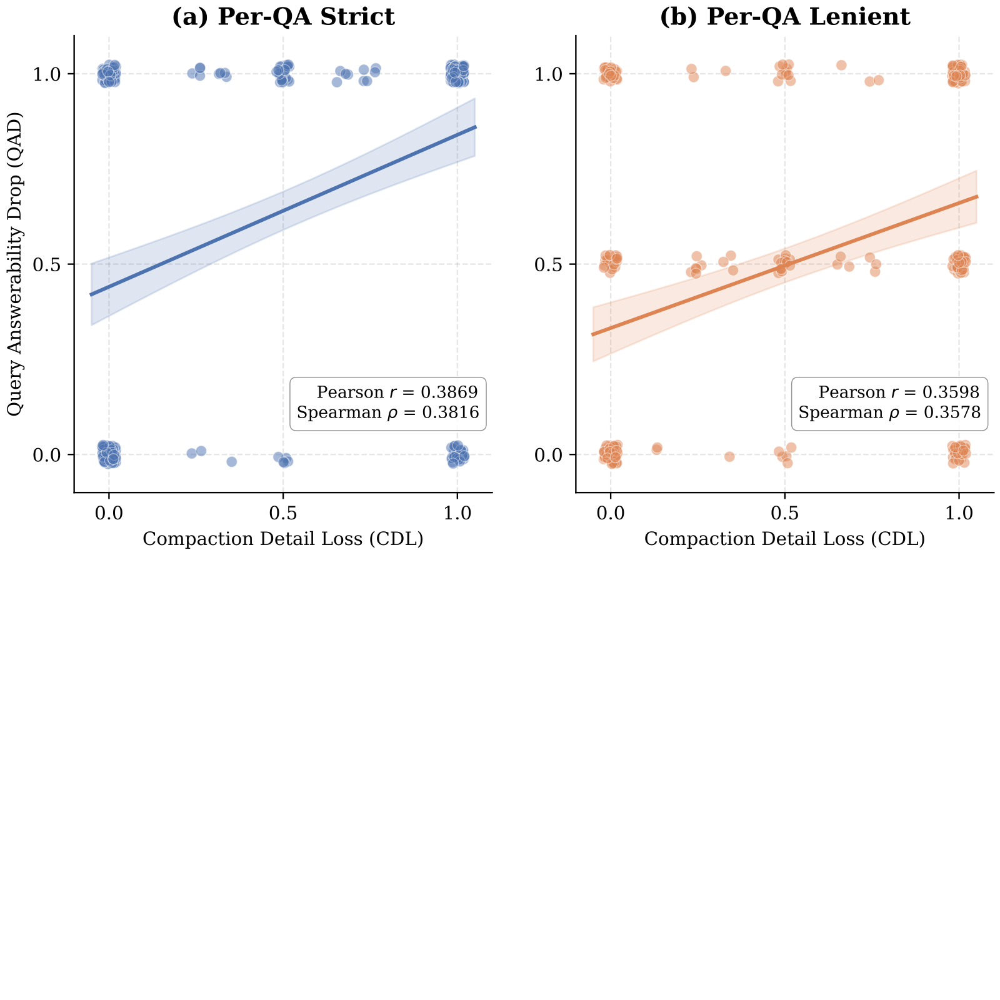
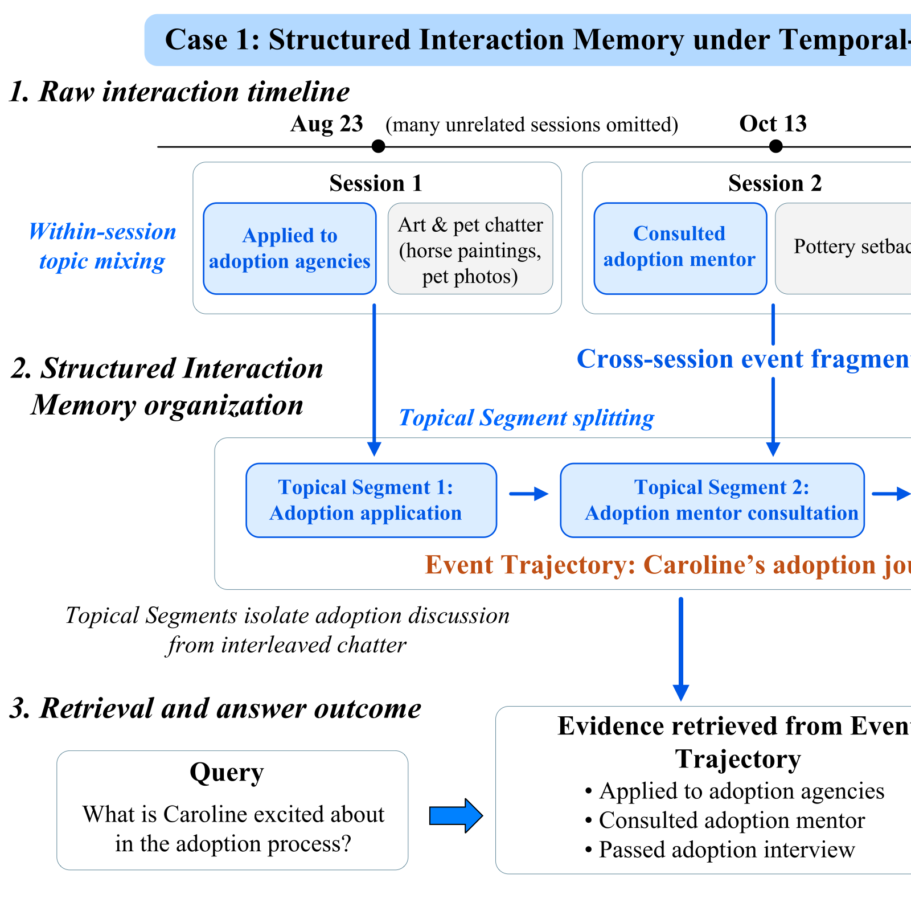
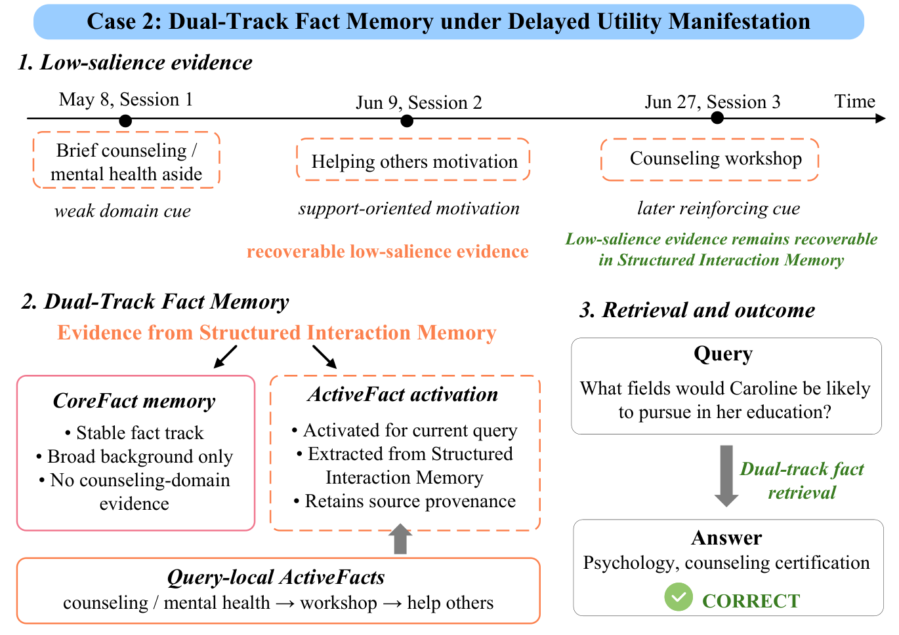

# MemSIF: From Structured Interactions to Dual-Track Fact Memory for LLM Agents

## MemSIF：从结构化交互到面向 LLM 智能体的双轨事实记忆

> **论文元信息**
> - **arXiv**：[2608.01742](https://arxiv.org/abs/2608.01742)（v2，版本日期 2026-08-05）
> - **官方 HTML**：https://arxiv.org/html/2608.01742v2
> - **分类**：cs.AI（主分类）
> - **作者**：YuFei Luo（罗宇飞）、Xiucheng Xu（徐秀成）、Zhen Yang（杨震，通讯作者）
> - **机构**：① 北京邮电大学（Beijing University of Posts and Telecommunications）；② 中国科学院大学（University of Chinese Academy of Sciences）
> - **方法名**：**MemSIF**（Memory with Structured Interactions and Facts，结构化交互与事实记忆）
> - **复现地址**：https://github.com/luoyufeihaha/MemSIF

> **翻译说明**
> - 本译文基于 arXiv 官方 HTML 全文（`https://arxiv.org/html/2608.01742v2`）逐段翻译，覆盖：**摘要 + 第 1–5 节 + 附录 A–I 全文**；**图 1–10**（均含原图，已下载到本地 `../images/MemSIF/`，采用相对路径，离线可读）+ **图块 11–17**（位于附录 I，为 7 个 Prompt 模板，无独立图像文件，按文字忠实给出）；**表 1–18 全量数值**；参考文献保留原文编号，不逐条翻译。
> - 每张图上方保留 `<!-- 原图：URL -->` 注释便于回溯原地址；每张图均含「三件套」（原图引用 + 中文说明图 + 中英双语文图注）。
> - 公式统一按 LaTeX 重排（`$...$` 行内、`$$...$$` 展示）；术语首次出现保留英文原文；数字取自原文，未凭印象增补结论。

---

## 摘要

长期记忆对于在长程交互中运行的 LLM 智能体至关重要。然而，现有记忆系统的若干持续性局限，可追溯到长程交互场景中的两类反复出现的**错配模式（misalignment pattern）**：**时间—结构错配（Temporal–Structural Misalignment，TSM）**与**效用延迟显现（Delayed Utility Manifestation，DUM）**。TSM 出现在「时间邻近性」并不可靠地对齐「主题或事件级相关性」之时；而 DUM 出现在「写入时的显著度」并不可靠地预测「未来查询效用」之时。为缓解这两类错配模式，我们提出 **MemSIF（Memory with Structured Interactions and Facts，结构化交互到事实的记忆框架）**，一个结构化「交互→事实」记忆框架。

**结构化交互记忆（Structured Interaction Memory）**把原始交互组织为**主题片段（Topical Segment）**（保留局部主题连贯性）与**事件轨迹（Event Trajectory）**（维持跨时间的事件连续性）。**双轨事实记忆（Dual-Track Fact Memory）**使用两条互补的轨道：**核心事实记忆（CoreFact memory）**在写入时整合稳定的、受模式（schema）引导的信息；而**活跃事实记忆（ActiveFact memory）**按需形成事实，并把那些得到多个历史来源与反复查询需求支持的事实提升（promote）为可复用条目。在 LoCoMo 与 LongMemEval-S 上、跨 5 个骨干 LLM 的实验表明，MemSIF 在所有设定下都取得了最高的 Total ACC（总准确率），相对最强基线在 LoCoMo 上超出 2.29%–8.79%，在 LongMemEval-S 上超出 2.87%–6.15%。这些结果支持了「结合结构化交互记忆与双轨事实记忆以缓解 TSM 与 DUM」的有效性。代码见 https://github.com/luoyufeihaha/MemSIF 。

---

## 1. 引言

LLM 智能体已从单轮应答系统，演进为能够支撑长程任务（long-horizon tasks）的系统 `(Xia et al. 2025; Singh et al. 2025; Schmidgall et al. 2025)`。随着交互历史的累积，把所有历史都放进上下文窗口来处理，不仅成本高昂，还可能对性能产生损害 `(Liu et al. 2024; Du et al. 2025; Pollertlam and Kornsuwannawit 2026)`。因此，构建可检索、可更新的外部记忆，是扩展智能体能力的核心 `(Xiong et al. 2026; Yu et al. 2026; Zhang et al. 2025b; Zheng et al. 2026)`。

<!-- 原图：https://arxiv.org/html/2608.01742v2/fig1_empirical_motivation-3.png -->

> **图 1（原文 Figure 1）**：TSM and DUM as recurring mismatch patterns, with diagnostic-subset results on Qwen3-4B. Subset construction details are provided in Appendix A .
> （TSM 与 DUM 作为反复出现的错配模式，并给出 Qwen3-4B 上的诊断子集结果；子集构造细节见附录 A。）

现有记忆系统通过摘要化、检索或结构化索引来管理长程上下文，从而降低上下文开销并改善对历史证据的获取 `(Zhong et al. 2024; Chhikara et al. 2025; Xu et al. 2026b)`。近期研究指出了当前长程记忆系统中的两类广泛局限。第一类关乎历史交互的组织，包括主题碎片化，以及难以链接跨时间分布的多跳证据 `(Zhang et al. 2026; Tan et al. 2025; Gutiérrez et al. 2024)`。第二类关乎信息效用的评估，包括过早移除潜在有用信息，以及随着用户状态演化而需要更新已存储信息 `(Zhong et al. 2024; Cham 2026; Huang et al. 2026)`。这些局限并非特定系统的孤立故障，而是反映了长程记忆设计中两类反复出现的系统性错配：**时间—结构错配（TSM）**——时间邻近性并不可靠地对齐主题或事件级相关性；以及**效用延迟显现（DUM）**——写入时的显著度并不可靠地预测信息对未来查询的价值。

图 1(a) 说明了第一类错配模式 TSM。时间上相邻的对话轮次可能讨论不相关的主题，而不连续的轮次却可能代表同一个演化中事件或任务的不同阶段。因此，预定义的时间边界既可能把不相关主题归并进同一记忆单元，也可能把相关证据分割到多个单元之中，使得同时保留「局部主题连贯性」与「跨时间事件连续性」变得困难。现有方法试图通过分层记忆结构（如 xMemory `(Hu et al. 2026)`）或自包含记忆条目（如 SimpleMem `(Liu et al. 2026)`）来改善历史交互的组织。然而，由于这些方法仍然在预定义的记忆单元上运作，与同一事件相关的证据仍可能分散在互不相连的条目中。图 1(a) 中「非连续证据（Non-Contiguous Evidence，NCE）」子集的结果进一步表明，现有系统在链接跨时间分布的相关证据方面能力仍然有限。

图 1(b) 说明了第二类错配模式 DUM。已存储信息的效用，会随后续交互展开与任务需求变化而改变。由于在写入时未来效用未知，看似不重要的信息，可能对回答后续查询至关重要，这使得记忆系统难以可靠地判断哪些信息应当保留或整合为可复用事实。写入时整合方法（包括 Mem0 `(Chhikara et al. 2025)` 与 MemoryOS `(Kang et al. 2025)`）必须在未来查询已知之前就选择或压缩信息。它们面临一个权衡：激进的过滤可能丢弃后来变得关键的信息，而保守的保留可能留下大量冗余细节。查询时方法（包括 CoM `(Xu et al. 2026c)` 与 GAM `(Yan et al. 2025)`）把证据选择推迟到观察到查询之后，并能通过证据链组织或更深层检索来找回初始显著度低的信息。然而，这些查询时方法的成功，依赖于为每个查询取回相关的原始交互；由于找回的证据仅用于当前查询而非持久整合，系统必须在后续查询中再次取回它，使未来的复用易受检索缺失的影响。图 1(b) 中「低显著度—高效用（Low-Salience, High-Utility，LSHU）」子集的结果进一步表明，现有系统在保留、找回、复用那些价值仅在写入后才显现的信息方面能力有限。

现有长程记忆方法通常独立地优化「交互组织」或「事实构建」。然而，改进交互组织无法保护低显著度证据在写入时被移除，而考虑效用评估的机制也无法修复被时间切分打断的证据链。为联合缓解 TSM 与 DUM，我们提出 **MemSIF（Memory with Structured Interactions and Facts）**，一个把交互组织与事实构建耦合起来的结构化「交互→事实」记忆框架。MemSIF 由两个模块组成：**结构化交互记忆**与**双轨事实记忆**。为缓解 TSM，结构化交互记忆把交互历史组织为**主题片段**与**事件轨迹**——前者保留局部主题连贯性，后者维持跨时间事件连续性。在结构化交互记忆之上，双轨事实记忆通过两条轨道缓解 DUM：**CoreFact** 与 **ActiveFact**。CoreFact 在写入时整合模式引导的、长期价值明确的稳定信息；ActiveFact 在其效用通过查询变得明显时按需形成候选事实，当这些候选事实得到多个历史来源与反复查询需求支持时，被提升为可复用条目。

在 5 个骨干 LLM 上的实验表明，MemSIF 在 LoCoMo 与 LongMemEval-S 的每个设定下都取得了最高的 Total ACC，相对最强基线分别超出 2.29%–8.79% 与 2.87%–6.15%。在图 1 所示的 NCE 与 LSHU 诊断子集上，MemSIF 相对最强基线分别超出 8.30% 与 10.48%。这些针对性结果进一步支持了其在缓解 TSM 与 DUM 上的有效性。我们的贡献总结如下：

- 我们将 TSM 与 DUM 刻画为长程智能体记忆中两类反复出现的错配模式，通过实证诊断加以验证，并构建了针对性的诊断子集用于评估。
- 我们提出 MemSIF，一个结构化「交互→事实」记忆框架，通过结构化交互组织与双轨事实记忆联合应对 TSM 与 DUM。
- 我们在两个长程记忆问答基准与 5 个骨干 LLM 上评估了 MemSIF，展示了在所有设定下一致的 Total ACC 提升、机制层面的证据，以及良好的准确率—效率权衡。

<!-- 原图：https://arxiv.org/html/2608.01742v2/MemSIF_method-2.png -->

> **图 2（原文 Figure 2）**：Overview of MemSIF . Structured Interaction Memory and Dual-Track Fact Memory jointly address TSM and DUM.
> （MemSIF 总览：结构化交互记忆与双轨事实记忆联合应对 TSM 与 DUM。）

## 2. 相关工作

本节讨论智能体记忆中两条相关的工作线索：交互组织与事实构建。

### 2.1 智能体记忆中的交互组织

交互组织关乎记忆系统如何在不同粒度上对历史交互进行切分、索引与检索 `(Park et al. 2023; Packer et al. 2023; Zhong et al. 2024; Lu et al. 2023)`。细粒度方法以消息、轮次或短跨度为记忆单元 `(Shinn et al. 2023; Zhao et al. 2024)`；例如，A-Mem `(Xu et al. 2026b)` 为每一轮构建一张 MemoryNote。粗粒度方法组织更大的上下文，例如 SimpleMem `(Liu et al. 2026)` 中的滑动窗口条目，以及 MemoryOS `(Kang et al. 2025)` 中的 Pages 与 Sessions。固定粒度使构建可行、检索高效。近期工作引入了更丰富的结构，包括 xMemory 的分层记忆组件 `(Hu et al. 2026)`、SEEM 将关系事实图与情节事件帧结合 `(Lu et al. 2026)`、Wu 等人 `(Wu et al. 2026)` 的事件进展图（Event Progression Graph）与主题关联网络（Topic Associative Network），以及 SAGE `(Wang et al. 2026)` 通过读写反馈进行的图记忆精化。

然而，固定粒度的单元可能与交互结构错配。局部主题偏移会发生在窗口或会话内部，而相关的事件证据会在时间上分离的单元间反复出现。结构化方法通过分层聚合、事件建模、整合或图演化来放松固定边界，但它们常把交互组织与事实构建当作分离的设计阶段。MemSIF 则在一个统一框架内联合组织交互并构建事实，把连续的**主题片段**与非连续的**事件轨迹**耦合起来，使事实构建既能利用局部连贯性，也能利用跨时间的证据连续性。

### 2.2 智能体记忆中的事实构建

事实构建关乎记忆系统何时把信息整合为可复用事实，以及这些事实如何随用户状态与任务需求演化而更新 `(Zhang et al. 2025b; Huang et al. 2026)`。现有方法在「何时评估记忆价值」与「如何组织所得事实」上各不相同 `(Cham 2026; Xiong et al. 2026)`。**写入时（write-time）方法** `(Modarressi et al. 2023)` 在查询已知之前就构建记忆；Mem0 `(Chhikara et al. 2025)` 抽取并整合显著信息，SimpleMem `(Liu et al. 2026)` 通过自包含记忆表述提升事实可用性。**查询时（query-time）方法**把证据选择与组合推迟到观察到查询之后 `(Qian et al. 2024; Sarthi et al. 2024)`；例如 CoM `(Xu et al. 2026c)` 与 GAM `(Yan et al. 2025)` 按需检索并组合与查询相关的证据。**结构约束方法**用预定义的记忆类型或分层组织来引导构建，例如 MemoryOS `(Kang et al. 2025)` 中的 Profile 与 Knowledge 记忆，以及 xMemory `(Hu et al. 2026)` 中的组件层级。

每种策略都引入一种权衡。写入时方法创建紧凑的可复用事实，但可能丢弃那些效用后来才显现的细节。查询时方法找回与任务相关的证据，但主要构建的是「查询特定」的上下文，而非持久的可复用事实。结构约束方法提升了一致性，但可能容纳不下其预定义结构之外的未来需求。MemSIF 通过双轨事实记忆应对这些权衡：CoreFact 记忆整合写入时事实，而 ActiveFact 记忆在其效用仅在后来显现时才按需形成事实，并在事实级证据不足时回溯到结构化交互记忆。这一设计把交互组织与事实构建耦合起来，使对 TSM 与 DUM 的联合处理成为其核心关注点。

## 3. 方法

### 3.1 总览

如图 2 所示，MemSIF 是一个面向长程智能体记忆的结构化「交互→事实」记忆框架。给定交互历史 $\mathcal{H}$，MemSIF 构建结构化交互记忆 $\mathcal{M}^{\mathrm{int}}=(\mathcal{S},\mathcal{E})$，并维护双轨事实记忆 $\mathcal{M}^{\mathrm{fact}}=(\mathcal{M}^{\mathrm{core}},\mathcal{M}^{\mathrm{act}})$。结构化交互记忆把 $\mathcal{H}$ 组织为**主题片段** $S_{i}\in\mathcal{S}$ 与**事件轨迹** $E_{j}\in\mathcal{E}$，以保留局部主题边界与跨时间事件连续性，从而应对 TSM。双轨事实记忆通过两条互补轨道缓解 DUM：**核心事实记忆（CoreFact memory）**整合在写入时可识别其可复用价值的、稳定的、模式引导的信息；而**活跃事实记忆（ActiveFact memory）**在其效用通过后续查询变得明显时按需形成候选事实。两条轨道最终都维护持久的、可更新的事实，但在整合的时机与所用证据上有所不同。在本节中，「事实」指的是一条规范化的、带来源链接的记忆记录，而非外部已验证的命题。

### 3.2 结构化交互记忆

为在不依赖预定义时间边界的前提下缓解 TSM，结构化交互记忆从原始交互历史中构建两种互补的表示：**主题片段**与**事件轨迹**。

给定交互历史 $\mathcal{H}=(u_{1},u_{2},\ldots,u_{T})$，其中每个 $u_{t}$ 是一条消息，MemSIF 构建结构化交互记忆 $\mathcal{M}^{\mathrm{int}}=(\mathcal{S},\mathcal{E})$。**主题片段** $S_{i}\in\mathcal{S}$ 是一个时间连续、主题连贯的交互单元。**事件轨迹** $E_{j}\in\mathcal{E}$ 把属于同一演化中事件或任务的非连续主题片段关联起来。这两种结构联合组织 $\mathcal{H}$，供下游事实构建使用。MemSIF 为片段构建与轨迹聚合使用同一个匹配函数：

$$ \phi(A,B)=\alpha\, s_{\mathrm{sem}}(A,B)+(1-\alpha)\,J(\mathcal{K}_{A},\mathcal{K}_{B}) \tag{1} $$

其中 $A$ 与 $B$ 可以是消息、主题片段或事件轨迹。权重 $\alpha$ 平衡语义相似度与实体重叠。语义分数 $s_{\mathrm{sem}}$ 是归一化余弦相似度，$J$ 计算关键实体集之间的 Jaccard 重叠。对于片段与轨迹等复合单元，文本嵌入由组成消息均值池化得到，实体集取并集。每次追加或赋值后，受影响单元的嵌入与实体集相应更新。

**主题片段构建（Topical Segment Construction）。**

MemSIF 按时间顺序处理消息。第一条消息初始化 $S_{1}$。对于之后的每条消息 $u_{t}$，MemSIF 用 $\phi(u_{t},S_{i})$ 把它与当前片段 $S_{i}$ 比较，并应用双阈值规则 $\tau_{\mathrm{split}}<\tau_{\mathrm{merge}}$。若 $\phi(u_{t},S_{i})\geq\tau_{\mathrm{merge}}$，则把该消息追加进 $S_{i}$；若 $\phi(u_{t},S_{i})\leq\tau_{\mathrm{split}}$，则开启一个新片段。落在两阈值之间的分数会调用 LLM 来判断该消息是否延续当前主题；若是则追加进 $S_{i}$，否则创建新片段。这一设计只把模糊的边界决策委托给 LLM，在保持主题连贯性的同时使构建保持高效。

**事件轨迹聚合（Event Trajectory Aggregation）。**

MemSIF 接着按时间顺序处理主题片段。对于每个 $S_{i}$，它根据 $\phi(S_{i},E_{j})$ 取回 Top-$K$ 个候选轨迹，并用 LLM 评估事件同一性、任务连续性与状态一致性。若多个轨迹兼容，MemSIF 选取得分最高者并把 $S_{i}$ 追加进去；若没有任何轨迹兼容，则 $S_{i}$ 初始化一条新轨迹。

### 3.3 模式引导的 CoreFact 整合

**核心事实记忆（CoreFact memory）** $\mathcal{M}^{\mathrm{core}}$ 整合那些在写入时可识别其可复用价值的信息。把结构化交互记忆的内容转换为事实记忆可能引入冗余并增加检索成本；MemSIF 采用一个可配置的 **CoreFact 模式（schema）** $\mathcal{Y}^{\mathrm{core}}$，为目标设定指定紧凑的、可复用的、事实类型，例如用户偏好与任务状态。该模式在记忆构建之前指定，并在每个设定内固定。

LLM 首先从主题片段中抽取模式合格的候选事实。随后，事件轨迹提供跨时间的证据，用来补充或调和跨多个片段的事实。每条 CoreFact 条目表示为 $f^{\mathrm{core}}=\langle\text{subject},\text{type},\text{stmt},\text{meta}\rangle$，其中 subject 是被描述的实体，$\text{type}\in\mathcal{Y}^{\mathrm{core}}$ 是其模式类别，stmt 是规范化陈述。元数据记录时间戳、来源出处与有效性状态。

在写入之前，MemSIF 用 subject、type 与语义相似度检索 CoreFact 条目。一个受模式约束的 LLM 选择四种操作之一：**Add**（新建一条事实）、**Update**（把兼容的新证据整合进已有事实）、**Merge**（合并重复或近似重复的条目）、**Supersede**（把过期事实标记为被取代，同时保留它以供历史查询）。落在 $\mathcal{Y}^{\mathrm{core}}$ 之外、或在写入时不确定（uncertain）的信息，作为可恢复证据保留在结构化交互记忆中，供 ActiveFact 形成使用。

**表 1：LoCoMo 主实验结果（三组骨干，报告三次运行均值 ACC (%)，加粗为各列最优、下划线为次优；† 表示 MemSIF 相对同骨干最强基线的 95% 配对 bootstrap 置信区间不含零）**

| 方法 | Qwen3-4B | | | | | Qwen3-32B | | | | | DeepSeek-v4-pro | | | | |
| --- | --- | --- | --- | --- | --- | --- | --- | --- | --- | --- | --- | --- | --- | --- | --- |
|  | S-hop | M-hop | Temp | Kno | Total | S-hop | M-hop | Temp | Kno | Total | S-hop | M-hop | Temp | Kno | Total |
| Full-Context | 78.94 | 48.06 | 38.77 | 45.74 | 62.89 | 85.04 | 65.09 | 59.41 | 59.85 | 74.47 | 85.48 | 75.99 | 78.53 | 63.48 | 80.92 |
| Naive RAG | 69.91 | 37.59 | 40.00 | 29.17 | 55.25 | 77.85 | 46.90 | 53.06 | 39.04 | 64.63 | 80.45 | 50.34 | 70.98 | 51.76 | 71.18 |
| Mem0 | 59.48 | 46.10 | 26.25 | 35.42 | 48.64 | 57.56 | 45.46 | 47.69 | 44.38 | 52.47 | 65.48 | 48.82 | 51.89 | 47.33 | 58.47 |
| MemoryOS | 64.93 | 43.26 | 23.13 | 41.67 | 50.84 | 71.77 | 48.91 | 33.94 | 41.64 | 57.86 | 81.76 | 55.71 | 38.66 | 47.44 | 65.86 |
| MemGAS | 70.58 | 45.01 | 33.94 | 40.59 | 56.43 | 74.15 | 50.32 | 41.71 | 51.01 | 61.62 | 82.63 | 56.07 | 46.48 | 56.84 | 68.62 |
| LightMem | 76.54 | 53.19 | 53.12 | 37.50 | 64.98 | 83.89 | 61.70 | 68.13 | 43.75 | 74.06 | 83.01 | 80.47 | 82.05 | 63.85 | 81.15 |
| GAM | 77.73 | 55.35 | 49.39 | 41.15 | 65.48 | 87.15 | 68.52 | 64.31 | 58.85 | 77.21 | 88.43 | 73.09 | 83.41 | 62.79 | 82.97 |
| CoM | 80.54 | 59.39 | 44.34 | 43.10 | 66.83 | 86.02 | 66.67 | 65.00 | 56.25 | 76.26 | 84.42 | 69.15 | 77.88 | 55.21 | 78.44 |
| xMemory | 75.36 | 56.03 | 34.38 | 45.83 | 61.48 | 80.09 | 50.10 | 55.26 | 52.01 | 67.70 | 81.72 | 66.66 | 70.41 | 62.07 | 75.38 |
| SimpleMem | 73.67 | 59.89 | 35.18 | 44.76 | 61.36 | 87.23 | 63.09 | 57.29 | 55.18 | 74.61 | 90.11 | 75.49 | 80.01 | 60.02 | 83.45 |
| MemSIF | 85.44 | 61.96 | 69.49 | 50.38 | 75.62† | 91.20 | 68.79 | 79.13 | 65.62 | 82.99† | 91.79 | 78.29 | 82.59 | 65.30 | 85.74† |

**表 2：LongMemEval-S 主实验结果（三组骨干，报告三次运行均值 ACC (%)，加粗为各列最优、下划线为次优；† 表示 MemSIF 相对同骨干最强基线的 95% 配对 bootstrap 置信区间不含零）**

| 方法 | Qwen3-4B | | | | | Qwen3-32B | | | | | DeepSeek-v4-pro | | | | |
| --- | --- | --- | --- | --- | --- | --- | --- | --- | --- | --- | --- | --- | --- | --- | --- |
|  | S-hop | M-hop | Temp | Kno | Total | S-hop | M-hop | Temp | Kno | Total | S-hop | M-hop | Temp | Kno | Total |
| Full-Context | 44.19 | 29.95 | 24.47 | 35.35 | 33.84 | 52.83 | 40.93 | 39.99 | 59.24 | 47.28 | 61.70 | 47.80 | 46.71 | 69.18 | 55.22 |
| Naive RAG | 62.25 | 44.56 | 23.46 | 51.25 | 45.53 | 73.97 | 54.06 | 45.56 | 75.29 | 61.37 | 80.53 | 59.32 | 53.83 | 70.01 | 66.24 |
| LightMem | 75.59 | 47.23 | 56.02 | 69.59 | 62.08 | 81.17 | 53.06 | 62.11 | 74.28 | 67.73 | 84.50 | 56.83 | 68.71 | 79.36 | 72.32 |
| GAM | 70.52 | 51.78 | 35.47 | 61.02 | 54.77 | 76.87 | 56.25 | 43.22 | 69.33 | 61.31 | 79.50 | 60.50 | 49.03 | 73.62 | 65.47 |
| CoM | 74.75 | 51.28 | 54.48 | 71.41 | 62.72 | 80.52 | 60.13 | 62.77 | 72.87 | 69.30 | 83.35 | 63.50 | 62.21 | 77.56 | 71.64 |
| SimpleMem | 70.98 | 50.22 | 52.28 | 68.27 | 60.17 | 78.40 | 58.83 | 65.10 | 56.11 | 66.35 | 84.57 | 65.86 | 67.45 | 76.27 | 73.86 |
| MemSIF | 79.76 | 57.72 | 63.61 | 74.22 | 68.87† | 83.41 | 64.20 | 69.15 | 78.87 | 73.92† | 86.54 | 67.69 | 70.60 | 82.30 | 76.73† |

### 3.4 查询驱动的 ActiveFact 形成

**活跃事实记忆（ActiveFact memory）** $\mathcal{M}^{\mathrm{act}}$ 面向那些在写入时复用价值不确定、并可能通过后续查询变得明显的信息。它经历四个阶段：查询局部抽取（query-local extraction）、答案后候选累积（post-answer candidate accumulation）、候选提升（candidate promotion）与持久维护（persistent maintenance）。查询局部证据可以支撑当前答案而无需立即整合；而那些得到多个历史来源与反复查询需求支持的候选，则被提升为持久条目以便直接复用，而非需要从原始历史反复重建。

**查询局部抽取与候选累积（Query-Local Extraction and Candidate Accumulation）。**

当取回的事实级证据不足以回答某个查询 $q_{t}$ 时，MemSIF 检索相关的主题片段与事件轨迹，并抽取查询局部证据。每条证据条目包含一个规范化陈述、subject 与来源出处。它支撑当前答案 $a_{t}$ 的生成，但并不直接写入 ActiveFact 记忆。

只有在 $a_{t}$ 生成之后，每条证据条目才有资格进入候选累积。MemSIF 把候选事实组织为**主题特定的簇（subject-specific clusters）** $C_{k}=(s_{k},\mathcal{X}_{k},\mathcal{Q}_{k},\mathcal{R}_{k})$，其中 $s_{k}$ 表示规范化 subject，$\mathcal{X}_{k}$ 包含去重后的事实陈述，$\mathcal{Q}_{k}$ 包含近重复移除后的不同触发查询，$\mathcal{R}_{k}$ 包含证据出处中不同历史交互单元的标识符。当一条证据条目的 subject 与 $s_{k}$ 匹配、且其陈述与 $\mathcal{X}_{k}$ 中累积的陈述兼容时，它会被合并进已有簇；否则初始化一个新簇。

候选更新只使用被抽取的陈述、其来源出处与触发查询 $q_{t}$。查询局部证据在每次答案生成后被清空，而候选簇在同一交互历史内的多次查询之间被保留，使历史支持与查询需求能随时间累积。

**候选提升与维护（Candidate Promotion and Maintenance）。**

随着候选簇累积，MemSIF 用两个信号评估每个簇：来源支持（source support）与查询需求（query demand）：

$$ \mathrm{Score}_{\mathrm{src}}(C_{k})=\left(1-1/|\mathcal{R}_{k}|\right)\cdot\mathrm{Coh}(\mathcal{X}_{k}) \tag{2} $$

$$ \mathrm{Score}_{\mathrm{qry}}(C_{k})=\left(1-1/|\mathcal{Q}_{k}|\right)\cdot\mathrm{Coh}(\mathcal{Q}_{k}) \tag{3} $$

$|\mathcal{R}_{k}|$ 与 $|\mathcal{Q}_{k}|$ 分别表示不同历史来源数与保留的触发查询数。$\mathrm{Coh}(\cdot)$ 表示一个集合内两两归一化余弦相似度的均值；对于单元素集合，$\mathrm{Coh}(\cdot)=1$。来源分数刻画历史支持的量与一致性，查询分数刻画重复且语义连贯的需求。提升决策定义为：

$$ P(C_{k})=\mathbf{1}\!\left[\mathrm{Score}_{\mathrm{src}}(C_{k})\geq\theta_{s}\land\mathrm{Score}_{\mathrm{qry}}(C_{k})\geq\theta_{q}\right] \tag{4} $$

一个候选只有在其既被历史支持、又被反复需求时才会被提升。当 $P(C_{k})=1$ 时，MemSIF 把该簇规范化为一个被提升的 ActiveFact 条目 $\tilde{f}_{k}^{\mathrm{act}}=\langle\text{subject},\text{stmt},\text{meta}\rangle$，其中 $\text{subject}=s_{k}$，stmt 是由 $\mathcal{X}_{k}$ 综合得到的规范化陈述，meta 记录出处、时间戳与触发查询引用。所得条目被存入 ActiveFact 记忆 $\mathcal{M}^{\mathrm{act}}$。在持续部署中，当后续查询浮现出演化中交互历史的额外证据时，兼容条目会被更新。

### 3.5 记忆检索与答案生成

对于每个查询 $q_{t}$，MemSIF 通过语义相似度从 $\mathcal{M}^{\mathrm{core}}$ 检索相关 CoreFact 条目、从 $\mathcal{M}^{\mathrm{act}}$ 检索持久的 ActiveFact 条目。一个基于 LLM 的**充分性检查器（sufficiency checker）**判断取回的事实级证据是否覆盖了 $q_{t}$ 所需的信息。当足够时，取回的条目构成答案上下文；否则，MemSIF 从结构化交互记忆 $\mathcal{M}^{\mathrm{int}}$ 检索查询局部证据。答案上下文随后把取回的事实条目与查询局部证据结合起来，而非直接纳入原始交互单元。LLM 由答案上下文生成 $a_{t}$。生成之后，查询局部证据进入 ActiveFact 流水线。附录 G 通过具体案例研究说明 MemSIF 在 TSM 与 DUM 下的行为。

**表 3：MemSIF 在 Qwen3-4B 上的消融研究（每个单元格为绝对 ACC (%)，括号外为相对 MemSIF Full 的 $\Delta$；加粗 $\Delta$ 表示该列最大降幅。LoCoMo / LongMemEval-S 各五类指标）**

| 变体 | LoCoMo | | | | | LongMemEval-S | | | | |
| --- | --- | --- | --- | --- | --- | --- | --- | --- | --- | --- | --- |
|  | S-hop | M-hop | Temp | Kno | Total | S-hop | M-hop | Temp | Kno | Total |
| MemSIF | 85.44 | 61.96 | 69.49 | 50.38 | 75.62 | 79.76 | 57.72 | 63.61 | 74.22 | 68.87 |
| w/o TS | 79.83 (-5.61) | 53.63 (-8.33) | 62.77 (-6.72) | 47.41 (-2.97) | 69.46 (-6.16) | 73.18 (-6.58) | 48.25 (-9.47) | 57.78 (-5.83) | 68.88 (-5.34) | 61.94 (-6.93) |
| w/o ET | 81.33 (-4.11) | 56.18 (-5.78) | 59.13 (-10.36) | 49.87 (-0.51) | 70.14 (-5.48) | 75.83 (-3.93) | 52.55 (-5.17) | 56.73 (-6.88) | 69.91 (-4.31) | 63.77 (-5.10) |
| w/o CF | 75.17 (-10.27) | 56.17 (-5.79) | 66.86 (-2.63) | 39.22 (-11.16) | 67.72 (-7.90) | 65.48 (-14.28) | 49.25 (-8.47) | 55.93 (-7.68) | 61.43 (-12.79) | 56.10 (-12.77) |
| w/o AF | 78.27 (-7.17) | 48.73 (-13.23) | 63.11 (-6.38) | 41.77 (-8.61) | 67.43 (-8.19) | 72.33 (-7.43) | 45.34 (-12.38) | 55.72 (-7.89) | 64.68 (-9.54) | 59.72 (-9.15) |

<!-- 原图：https://arxiv.org/html/2608.01742v2/ （Figure 3，本地映射 03-backbone-generalization.png） -->

> **图 3（原文 Figure 3）**：Backbone generalization on LoCoMo. Panels (a,b): Total ACC of representative baselines on Qwen3-8B and Llama-3.1-8B-Instruct. Panels (c,d): MemSIF vs. strongest per-backbone baseline across question categories. Full results in Appendix E .
> （LoCoMo 上的骨干泛化性。面板 (a)(b)：代表性基线在 Qwen3-8B 与 Llama-3.1-8B-Instruct 上的 Total ACC；面板 (c)(d)：MemSIF 与各骨干最强基线跨问题类别的对比；完整结果见附录 E。）

## 4. 实验

### 4.1 实验设置

**基准数据集（Benchmark Dataset）。**

我们在两个长程记忆问答基准上评估 MemSIF：LoCoMo `(Maharana et al. 2024)` 与 LongMemEval-S `(Wu et al. 2024)`。LoCoMo 包含 10 段双方对话，每段约跨 27 个会话、平均 16.6K token；我们排除对抗性问题，保留 1,540 个基于证据的样本。LongMemEval-S 包含 500 个独立样本，交互历史平均超过 100K token；排除 30 个弃答问题后，剩余 470 个样本用于评估。数据集统计见附录 B。

**诊断子集（Diagnostic Subsets）。**

两个诊断子集由 LoCoMo 的 gold 证据构建。**非连续证据（Non-Contiguous Evidence，NCE）**子集选取那些 gold 证据跨广泛分离轮次的查询，以「时间证据离散度（Temporal Evidence Dispersion，TED $\geq 0.3$）」度量。**低显著度—高效用（Low-Salience, High-Utility，LSHU）**子集选取那些证据写入时显著度低、但查询时效用高（$S(e)\leq 2$，$U(e,q)=3$）的查询。完整的构建准则与对 TSM、DUM 的实证分析见附录 A。

**基线（Baselines）。**

我们把 MemSIF 与 10 个基线比较：**Full-Context** 与 **Naive RAG** 作为基本上界；**Mem0** `(Chhikara et al. 2025)`、**MemoryOS** `(Kang et al. 2025)`、**MemGAS** `(Xu et al. 2025)`、**xMemory** `(Hu et al. 2026)`、**SimpleMem** `(Liu et al. 2026)` 作为写入时整合方法；以及 **LightMem** `(Fang et al. 2025)`、**GAM** `(Yan et al. 2025)`、**CoM** `(Xu et al. 2026c)` 作为查询时组合方法。

**评估指标（Evaluation Metric）。**

我们以准确率（Accuracy，ACC）作为主要指标。一个 GPT-4o `(Hurst et al. 2024)` 评判器在答案直接回应问题、且与关键参考信息语义一致时，将其标为正确。我们在 Qwen3-4B 下、从两个数据集与所有系统中抽样的 440 个答案上验证了评判器。两位标注者在不知系统身份与 GPT-4o 标签的情况下，用相同准则独立评估每个样本。GPT-4o 与裁定后的人工标签达成 93.0% 一致（Cohen's $\kappa=0.81$）；完整协议与分析见附录 D.1。

**实现细节（Implementation Details）。**

主实验在两个数据集上使用 Qwen3-4B、Qwen3-32B `(Yang et al. 2025)` 与 DeepSeek-v4-pro `(Xu et al. 2026a)`（均为非思考模式）。我们在 LoCoMo 上还评估了 Qwen3-8B `(Yang et al. 2025)`（非思考）与 Llama-3.1-8B-Instruct `(Grattafiori et al. 2024)`。我们使用 Qwen3-Embedding-8B `(Zhang et al. 2025a)` 作为嵌入骨干。MemSIF 对交互匹配函数取 $\alpha=0.8$，对主题片段边界取 $\tau_{\mathrm{split}}=0.325$ 与 $\tau_{\mathrm{merge}}=0.60$，对事件轨迹聚合取 Top-$K=3$，对 ActiveFact 提升取 $\theta_{s}=\theta_{q}=0.45$。为量化所报告增益的不确定性，我们在每个「数据集—骨干」设定下对 MemSIF 与最强基线做 10,000 次重采样的配对 bootstrap（paired bootstrap）；报告 $\Delta\mathrm{ACC}=\mathrm{ACC}_{\textsc{MemSIF}}-\mathrm{ACC}_{\text{baseline}}$ 的 95% 置信区间。完整方法见附录 D.2；实现细节见附录 C。

**表 4：LoCoMo 上 Qwen3-4B 的 ActiveFact 形成分析（Query-local 表示仅做查询局部抽取）**

| 变体 | Total | LSHU | Tokens/q | Time/q (s) |
| --- | --- | --- | --- | --- |
| w/o AF | 67.43 | 74.45 | 1,935 | 1.14 |
| Query-local only | 73.09 | 81.28 | 3,364 | 1.53 |
| Full MemSIF | 75.62 | 85.69 | 3,052 | 1.40 |

### 4.2 主结果

表 1 与表 2 报告了单跳（S-hop）、多跳（M-hop）、时间（Temp）与知识（Kno）问题的 ACC。MemSIF 在两个数据集与全部三个主骨干上都取得了最高的 Total ACC，支持其在不同交互长度与模型能力下的有效性。下面我们考察各组成部分的贡献。

在 LoCoMo 上，MemSIF 相对最强基线在 Qwen3-4B、Qwen3-32B、DeepSeek-v4-pro 下分别超出 8.79%、5.78%、2.29%。最大增益出现在 Qwen3-4B 下，说明当骨干能力有限时 MemSIF 尤为有益。在 Qwen3-4B 与 Qwen3-32B 下最大的类别级增益出现在 Temp（分别为 16.37% 与 11.00%），与事件轨迹找回跨时间分布证据的作用一致。在 DeepSeek-v4-pro 下，MemSIF 在 M-hop 上落后 LightMem 2.18%、在 Temp 上落后 GAM 0.82%，说明在最强骨干下 MemSIF 的增益并非在所有类别上均匀。尽管如此，MemSIF 在三个骨干下都取得了最高的 Total ACC。

在 LongMemEval-S 上，MemSIF 相对最强基线在 Qwen3-4B、Qwen3-32B、DeepSeek-v4-pro 下分别超出 6.15%、4.62%、2.87%。与 LoCoMo 上最大增益集中在 Temp 不同，在该基准上 MemSIF 在三个骨干下领先所有问题类别。由于每个查询都配有一段超过 100K token 的独立历史，证据获取可能更强调长上下文证据过滤。广泛的类别级增益与双轨事实记忆的作用一致：CoreFact 记忆保持可复用信息的可获取性，而 ActiveFact 记忆从那些效用在查询时才显现的证据中形成事实。

图 3 进一步在 LoCoMo 上评估了 Qwen3-8B 与 Llama-3.1-8B-Instruct。MemSIF 相对最强基线分别超出 7.69% 与 6.47%，类别级模式与三个主骨干一致。这些结果进一步支持了 MemSIF 跨模型规模与家族的泛化性。完整数值结果见附录 E。

配对 bootstrap 分析进一步支持了这些增益的可靠性：在全部 6 个「数据集—骨干」设定下，相对最强基线的 Total ACC 提升的 95% 置信区间都不含零；这包括 DeepSeek-v4-pro 在 LoCoMo 下较小的增益（+2.29%，95% CI [0.45, 5.03]）与在 LongMemEval-S 下较小的增益（+2.87%，95% CI [0.32, 6.44]）。完整的置信区间见附录 D.2。

### 4.3 消融与机制分析

为理解每个设计对 MemSIF 性能的贡献，我们进行了组件消融、诊断子集分析与敏感性研究。我们在两个数据集上用 Qwen3-4B 对四个组件做消融（表 3）。**w/o TS** 直接从原始消息构建事件轨迹；**w/o ET** 仅使用主题片段；**w/o CF** 移除 CoreFact 记忆，仅依赖 ActiveFact 记忆；**w/o AF** 关闭 ActiveFact 记忆，仅保留 CoreFact 记忆。

移除事件轨迹造成最大的 Temp 降幅（LoCoMo 上 10.36%），与其在跨时间事件连续性中的作用一致；移除主题片段损害 M-hop，因为它需要主题连贯的单元来跨片段组装证据。移除 CoreFact 记忆在 LongMemEval-S 上后果最严重（Total 下降 12.77%），在 100K+ token 上下文中维持紧凑可复用事实变得重要；移除 ActiveFact 记忆造成最大的 M-hop 损失（13.23% 与 12.38%），反映其在找回效用在查询时显现的证据方面的作用。没有任何单一组件主导所有模式；TSM 与 DUM 需要互补的解决方案。

为直接测试 MemSIF 如何处理 TSM 与 DUM，我们在两个诊断子集上做消融（图 4）。在 NCE 子集上，移除事件轨迹或主题片段造成最大降幅（5.56%–8.30%），说明交互结构化是缓解 TSM 的核心。在 LSHU 子集上，移除 ActiveFact 记忆造成最大下降（9.34%–11.24%），而移除 CoreFact 记忆造成中等降幅（3.93%–4.98%）。移除 ActiveFact 记忆带来更大降幅，说明查询驱动形成是 LSHU 上的主要机制；而较小的 CoreFact 降幅则表明可复用写入时事实也有互补贡献。

表 4 报告了 ActiveFact 形成分析。**Query-local only** 已取得 73.09% 的 Total ACC，已超出 LoCoMo 最强基线（CoM，66.83%），说明即使没有持久候选累积，按需证据抽取也是有效的。完整 MemSIF 相对 Query-local only 进一步把 LSHU ACC 提升 4.41%，同时降低 token 用量与运行时间，因为从更早查询保留下来的持久 ActiveFact 条目可被复用，无需回溯到结构化交互记忆。

MemSIF 对其构建期超参数具有鲁棒性。改变匹配权重仅使 Total ACC 变化 2.83%，说明性能并不依赖精细调参。把语义相似度与实体重叠结合（75.60%）优于任一种信号单独使用，说明两种信号提供了互补证据。对于片段构建，默认的双阈值设定优于单阈值替代方案；把间隙宽度从 0.075 变到 0.475 时，Total ACC 保持在 71.13%–75.62% 区间内，且默认设定表现最佳。完整结果见附录 F。

<!-- 原图：https://arxiv.org/html/2608.01742v2/ （Figure 4，本地映射 04-ablation_linechart.png） -->

> **图 4（原文 Figure 4）**：Diagnostic-subset ablation results under Qwen3-4B and Qwen3-32B.
> （Qwen3-4B 与 Qwen3-32B 下的诊断子集消融结果。）

<!-- 原图：https://arxiv.org/html/2608.01742v2/scatter_combined.png -->

> **图 5（原文 Figure 5）**：Accuracy–cost trade-off on LoCoMo under Qwen3-4B and Qwen3-32B. darker, larger bubbles indicate higher ACC.
> （LoCoMo 上 Qwen3-4B 与 Qwen3-32B 的准确率—成本权衡；气泡越深、越大表示 ACC 越高。）

### 4.4 效率分析

我们评估每个查询的分摊 token 与运行时间，覆盖从记忆构建到答案生成的完整流水线；详细测量范围见附录 H。图 5 报告了 LoCoMo 上的准确率—成本权衡。MemSIF 在 Qwen3-4B 与 Qwen3-32B 下都取得最高 ACC，同时提供良好的准确率—成本权衡。在 Qwen3-32B 下，它比 GAM 少用 40.6% 的 token（2.41K vs. 4.06K），同时把 ACC 从 77.21% 提升到 82.99%；与相同 token 预算下的 SimpleMem 相比，ACC 提升 8.38%、运行时间减少 42.8%（7.04 vs. 12.31 秒）。这一效率来自双轨设计：CoreFact 记忆存储紧凑的可复用事实，而持久的 ActiveFact 条目在多次查询间被复用，减少了对原始交互与结构化交互记忆的重复访问。完整数值结果见附录 H。

## 5. 结论

我们提出了 MemSIF，一个结构化「交互→事实」记忆框架，通过结构化交互记忆与双轨事实记忆缓解**时间—结构错配**与**效用延迟显现**。在 LoCoMo 与 LongMemEval-S 上、跨 5 个骨干 LLM 的实验展示了持续的 Total ACC 提升。消融与诊断结果支持了这两个组件互补的贡献，而效率分析展示了良好的准确率—成本权衡。更广义地说，LLM 记忆系统应超越检索效率，显式地建模「交互经验如何随时间演化为可复用知识」。MemSIF 朝这个方向迈出了一步。NCE 与 LSHU 诊断子集为评估这些错配模式提供了一个可复用的框架。未来工作包括在线 CoreFact 模式自适应，以及向多智能体设定的扩展。

## 参考文献

> 参考文献保留原文编号与条目（不逐条翻译）；以下条目按原文列出。

- Cham (2026) E. E. Cham. WritePolicyBench: benchmarking memory write policies under byte budgets. arXiv preprint arXiv:2602.02574. Cited by: §1, §2.2.
- Chhikara et al. (2025) P. Chhikara, D. Khant, S. Aryan, T. Singh, and D. Yadav. Mem0: building production-ready ai agents with scalable long-term memory. arXiv preprint arXiv:2504.19413. Cited by: §1, §1, §2.2, §4.1.
- Du et al. (2025) Y. Du, M. Tian, S. Ronanki, S. Rongali, S. Bodapati, A. Galstyan, A. Wells, R. Schwartz, E. A. Huerta, and H. Peng. Context length alone hurts llm performance despite perfect retrieval. arXiv preprint arXiv:2510.05381. Cited by: §1.
- Fang et al. (2025) J. Fang, X. Deng, H. Xu, Z. Jiang, Y. Tang, Z. Xu, S. Deng, Y. Yao, M. Wang, S. Qiao, et al. Lightmem: lightweight and efficient memory-augmented generation. arXiv preprint arXiv:2510.18866. Cited by: §4.1.
- Grattafiori et al. (2024) A. Grattafiori, A. Dubey, A. Jauhri, A. Pandey, A. Kadian, A. Al-Dahle, A. Letman, A. Mathur, A. Schelten, A. Vaughan, et al. The llama 3 herd of models. arXiv preprint arXiv:2407.21783. Cited by: §4.1.
- Gutiérrez et al. (2024) B. J. Gutiérrez, Y. Shu, Y. Gu, M. Yasunaga, and Y. Su. Hipporag: neurobiologically inspired long-term memory for large language models. Advances in neural information processing systems 37, pp. 59532–59569. Cited by: §1.
- Hu et al. (2026) Z. Hu, Q. Zhu, R. Zhao, D. Liang, H. Yan, Y. He, and L. Gui. Beyond rag for agent memory: retrieval by decoupling and aggregation. arXiv preprint arXiv:2602.02007. Cited by: §1, §2.1, §2.2, §4.1.
- Huang et al. (2026) W. Huang, W. Zhang, Y. Liang, Y. Bei, Y. Chen, T. Feng, X. Pan, Z. Tan, Y. Wang, T. Wei, et al. Rethinking memory mechanisms of foundation agents in the second half: a survey. arXiv preprint arXiv:2602.06052. Cited by: §1, §2.2.
- Hurst et al. (2024) A. Hurst, A. Lerer, A. P. Goucher, A. Perelman, A. Ramesh, A. Clark, A. Ostrow, A. Welihinda, A. Hayes, A. Radford, et al. Gpt-4o system card. arXiv preprint arXiv:2410.21276. Cited by: §4.1.
- Kang et al. (2025) J. Kang, M. Ji, Z. Zhao, and T. Bai. Memory os of ai agent. In Proceedings of the 2025 Conference on Empirical Methods in Natural Language Processing, pp. 25972–25981. Cited by: §1, §2.1, §2.2, §4.1.
- Liu et al. (2026) J. Liu, Y. Su, P. Xia, S. Han, Z. Zheng, C. Xie, M. Ding, and H. Yao. SimpleMem: efficient lifelong memory for llm agents. arXiv preprint arXiv:2601.02553. Cited by: §1, §2.1, §2.2, §4.1.
- Liu et al. (2024) N. F. Liu, K. Lin, J. Hewitt, A. Paranjape, M. Bevilacqua, F. Petroni, and P. Liang. Lost in the middle: how language models use long contexts. Transactions of the association for computational linguistics 12, pp. 157–173. Cited by: §1.
- Lu et al. (2023) J. Lu, S. An, M. Lin, G. Pergola, Y. He, D. Yin, X. Sun, and Y. Wu. Memochat: tuning llms to use memos for consistent long-range open-domain conversation. arXiv preprint arXiv:2308.08239. Cited by: §2.1.
- Lu et al. (2026) Z. Lu, D. Li, Y. Shi, B. Wang, L. Wang, and B. Hu. Structured episodic event memory. arXiv preprint arXiv:2601.06411. Cited by: §2.1.
- Maharana et al. (2024) A. Maharana, D. Lee, S. Tulyakov, M. Bansal, F. Barbieri, and Y. Fang. Evaluating very long-term conversational memory of llm agents. In Proceedings of the 62nd Annual Meeting of the Association for Computational Linguistics (Volume 1: Long Papers), pp. 13851–13870. Cited by: Appendix B, §4.1.
- Modarressi et al. (2023) A. Modarressi, A. Imani, M. Fayyaz, and H. Schütze. Ret-llm: towards a general read-write memory for large language models. arXiv preprint arXiv:2305.14322. Cited by: §2.2.
- Packer et al. (2023) C. Packer, V. Fang, S. Patil, K. Lin, S. Wooders, and J. Gonzalez. MemGPT: towards llms as operating systems. arXiv preprint arXiv:2310.08560. Cited by: §2.1.
- Park et al. (2023) J. S. Park, J. O'Brien, C. J. Cai, M. R. Morris, P. Liang, and M. S. Bernstein. Generative agents: interactive simulacra of human behavior. In Proceedings of the 36th annual acm symposium on user interface software and technology, pp. 1–22. Cited by: §2.1.
- Pollertlam and Kornsuwannawit (2026) N. Pollertlam and W. Kornsuwannawit. Beyond the context window: a cost-performance analysis of fact-based memory vs. long-context llms for persistent agents. arXiv preprint arXiv:2603.04814. Cited by: §1.
- Qian et al. (2024) H. Qian, P. Zhang, Z. Liu, K. Mao, and Z. Dou. Memorag: moving towards next-gen rag via memory-inspired knowledge discovery. arXiv preprint arXiv:2409.05591. Cited by: §2.2.
- Sarthi et al. (2024) P. Sarthi, S. Abdullah, A. Tuli, S. Khanna, A. Goldie, and C. Manning. Raptor: recursive abstractive processing for tree-organized retrieval. In International Conference on Learning Representations, Vol. 2024, pp. 32628–32649. Cited by: §2.2.
- Schmidgall et al. (2025) S. Schmidgall, Y. Su, Z. Wang, X. Sun, J. Wu, X. Yu, J. Liu, M. Moor, Z. Liu, and E. Barsoum. Agent laboratory: using llm agents as research assistants. Findings of the Association for Computational Linguistics: EMNLP 2025, pp. 5977–6043. Cited by: §1.
- Shinn et al. (2023) N. Shinn, F. Cassano, A. Gopinath, K. Narasimhan, and S. Yao. Reflexion: language agents with verbal reinforcement learning. Advances in neural information processing systems 36, pp. 8634–8652. Cited by: §2.1.
- Singh et al. (2025) J. Singh, R. Magazine, Y. Pandya, and A. Nambi. Agentic reasoning and tool integration for llms via reinforcement learning. arXiv preprint arXiv:2505.01441. Cited by: §1.
- Tan et al. (2025) Z. Tan, J. Yan, I. Hsu, R. Han, Z. Wang, L. Le, Y. Song, Y. Chen, H. Palangi, G. Lee, et al. In prospect and retrospect: reflective memory management for long-term personalized dialogue agents. In Proceedings of the 63rd Annual Meeting of the Association for Computational Linguistics (Volume 1: Long Papers), pp. 8416–8439. Cited by: §1.
- Wang et al. (2026) J. Wang, H. Zhao, G. Pan, X. Wang, Y. Wang, Q. Deng, and M. Zhang. SAGE: a self-evolving agentic graph-memory engine for structure-aware associative memory. arXiv preprint arXiv:2605.12061. Cited by: §2.1.
- Wu et al. (2024) D. Wu, H. Wang, W. Yu, Y. Zhang, K. Chang, and D. Yu. Longmemeval: benchmarking chat assistants on long-term interactive memory. arXiv preprint arXiv:2410.10813. Cited by: Appendix B, §4.1.
- Wu et al. (2026) Z. Wu, H. Zhang, F. Lin, W. Xu, X. Xu, Y. Chen, H. P. Zou, S. Chen, W. Zhang, X. Liu, P. S. Yu, and H. Wang. GAM: hierarchical graph-based agentic memory for llm agents. arXiv preprint arXiv:2604.12285. Cited by: §2.1.
- Xia et al. (2025) P. Xia, K. Zeng, J. Liu, C. Qin, F. Wu, Y. Zhou, C. Xiong, and H. Yao. Agent0: unleashing self-evolving agents from zero data via tool-integrated reasoning. arXiv preprint arXiv:2511.16043. Cited by: §1.
- Xiong et al. (2026) Z. Xiong, Y. Lin, W. Xie, P. He, Z. Liu, J. Tang, H. Lakkaraju, and Z. Xiang. How memory management impacts llm agents: an empirical study of experience-following behavior. In Proceedings of the 64th Annual Meeting of the Association for Computational Linguistics (Volume 1: Long Papers), pp. 623–645. Cited by: §1, §2.2.
- Xu et al. (2026a) A. Xu, B. Lin, B. Xue, B. Wang, B. Xu, B. Wu, B. Zhang, C. Lin, C. Dong, C. Ling, et al. DeepSeek-v4: towards highly efficient million-token context intelligence. arXiv preprint arXiv:2606.19348. Cited by: §4.1.
- Xu et al. (2025) D. Xu, Y. Wen, P. Jia, Y. Zhang, Y. Wang, H. Guo, R. Tang, X. Zhao, E. Chen, T. Xu, et al. From single to multi-granularity: toward long-term memory association and selection of conversational agents. arXiv preprint arXiv:2505.19549. Cited by: §4.1.
- Xu et al. (2026b) W. Xu, Z. Liang, K. Mei, H. Gao, J. Tan, and Y. Zhang. A-mem: agentic memory for llm agents. Advances in Neural Information Processing Systems 38, pp. 17577–17604. Cited by: §1, §2.1.
- Xu et al. (2026c) X. Xu, B. Xu, T. Xueyun, Z. Huang, R. Chen, L. Yunfan, and H. Shen. Chain-of-memory: lightweight memory construction with dynamic evolution for llm agents. In Proceedings of the 64th Annual Meeting of the Association for Computational Linguistics (Volume 1: Long Papers), pp. 11618–11631. Cited by: §1, §2.2, §4.1.
- Yan et al. (2025) B. Yan, C. Li, H. Qian, S. Lu, and Z. Liu. General agentic memory via deep research. arXiv preprint arXiv:2511.18423. Cited by: §1, §2.2, §4.1.
- Yang et al. (2025) A. Yang, A. Li, B. Yang, B. Zhang, B. Hui, B. Zheng, B. Yu, C. Gao, C. Huang, C. Lv, et al. Qwen3 technical report. arXiv preprint arXiv:2505.09388. Cited by: §4.1.
- Yu et al. (2026) Y. Yu, L. Yao, Y. Xie, Q. Tan, J. Feng, Y. Li, and L. Wu. Agentic memory: learning unified long-term and short-term memory management for large language model agents. arXiv preprint arXiv:2601.01885. Cited by: §1.
- Zhang et al. (2025a) Y. Zhang, M. Li, D. Long, X. Zhang, H. Lin, B. Yang, P. Xie, A. Yang, D. Liu, J. Lin, et al. Qwen3 embedding: advancing text embedding and reranking through foundation models. arXiv preprint arXiv:2506.05176. Cited by: §4.1.
- Zhang et al. (2025b) Z. Zhang, Q. Dai, X. Bo, C. Ma, R. Li, X. Chen, J. Zhu, Z. Dong, and J. Wen. A survey on the memory mechanism of large language model-based agents. ACM Transactions on Information Systems 43 (6), pp. 1–47. Cited by: §1, §2.2.
- Zhang et al. (2026) Z. Zhang, W. Bu, K. Pan, B. Miao, W. Zhang, G. Wang, W. Ji, R. Tang, J. Li, and S. Tang. Evolving generalist virtual agents with generative and associative memory. In Proceedings of the AAAI Conference on Artificial Intelligence, Vol. 40, pp. 13006–13014. Cited by: §1.
- Zhao et al. (2024) A. Zhao, D. Huang, Q. Xu, M. Lin, Y. Liu, and G. Huang. Expel: llm agents are experiential learners. In Proceedings of the AAAI Conference on Artificial Intelligence, Vol. 38, pp. 19632–19642. Cited by: §2.1.
- Zheng et al. (2026) J. Zheng, C. Shi, X. Cai, Q. Li, D. Zhang, C. Li, D. Yu, and Q. Ma. Lifelong learning of large language model based agents: a roadmap. IEEE Transactions on Pattern Analysis and Machine Intelligence. Cited by: §1.
- Zhong et al. (2024) W. Zhong, L. Guo, Q. Gao, H. Ye, and Y. Wang. Memorybank: enhancing large language models with long-term memory. In Proceedings of the AAAI conference on artificial intelligence, Vol. 38, pp. 19724–19731. Cited by: §1, §2.1.

## Appendix A 时间—结构错配与效用延迟显现的实证分析

简而言之，本节证明 TSM 与 DUM 在「与方法无关」的诊断中可被观测到。对于 TSM，NCE 构建与 ASV/SNTD 分析表明，按时间顺序排列的邻近性只是主题或事件级结构的不完备代理。对于 DUM，LSHU 构建、LSHUR 与受控压缩诊断表明，写入时显著度常常低估未来效用，影响了至少含一条关键证据话语的 43.71% 的查询。这些发现与 MemSIF 架构响应之间的联系在 A.7 节讨论。

### A.1 目的与正文的联系

本附录为第 1 节提出的 TSM 与 DUM 论断提供实证基础。它定义了诊断度量，描述了正文中使用的非连续证据（NCE）与低显著度—高效用（LSHU）子集的构建，并给出图 1 背后的实证诊断。诊断定义与子集构建独立于方法输出，仅在把这些固定子集与图 1 关联时才引用方法性能。

### A.2 实验基础

分析使用两个具有互补性质的长程对话基准。LoCoMo 在共享的多会话对话上提供了密集标注的 gold 证据，使其同时适用于 TSM 与 DUM 分析。在按标准协议排除对抗性问题后，它包含来自 10 段双方对话的 1,540 个基于证据的问答样本，每段约跨 27 个会话、平均 16.6K token。LongMemEval-S 提供了一个互补的大上下文设定，其中每个样本配有一段平均超过 100K token 的独立交互历史；排除 30 个弃答问题后，剩余 470 个评估样本。TSM 在两个数据集上均被分析，而 DUM 仅在 LoCoMo 上分析（因其需要 gold 证据标注）。

对于 TSM 分析，原始对话轮次被整合为固定大小的片段，片段长度 $\ell$ 在 $\{1,2,4,8\}$ 上变化以测试对分析粒度的鲁棒性。这一分割仅用于实证诊断，独立于 MemSIF 的语义分割模块，避免对提出方法的偏倚。所有片段用 Qwen3-Embedding-8B 编码，归一化嵌入间的余弦相似度定义了 ASV 与 SNTD@$k$ 使用的语义空间。

对于 DUM 分析，LoCoMo 的 gold 证据话语沿两个轴评估：写入时显著度（write-time salience）与查询时效用（query-time utility）。显著度评分在不透露未来查询的情况下给出，而效用评分在给出查询但不给出 gold 答案的情况下给出。这一设计把「某句话初次出现时是否值得存储」与「它后来是否对回答特定查询有用」分离开来。

对于 TSM，GPT-4o 通过事后验证确认基于嵌入的度量确实对应真实的主题偏移或同线程关系，采用盲评与 $N=3$ 自一致性多数投票。对于 DUM，显著度与效用分数由 GPT-4o 以单次调用、温度 $0.1$ 给出，其中显著度评分隐藏查询、效用评分使用未来查询但排除 gold 答案。细节可恢复性与答案正确性判断使用 GPT-4o 进行盲评、在适用处确定性地打乱输入顺序，并采用 $N=3$ 多数投票。额外的译码设置、提示模板、随机种子与计算成本在 A.6 节报告。

<!-- 原图：https://arxiv.org/html/2608.01742v2/ （Figure 6，本地映射 06-asv-chunk-sensitivity.png） -->

> **图 6（原文 Figure 6）**：Adjacent Semantic Volatility (ASV) and adjacent similarity across segment lengths on LoCoMo and LongMemEval-S.
> （LoCoMo 与 LongMemEval-S 上跨片段长度的相邻语义波动（ASV）与相邻相似度。）

### A.3 诊断子集构建

我们从 1,540 个非对抗性 LoCoMo 问题中构建两个诊断子集，以更直接地评估时间—结构错配与效用延迟显现。两个子集都独立于 MemSIF 与基线输出构建，且图 1 与图 4 使用相同的固定问题 ID。NCE 把 TSM 的「跨时间证据碎片化」方面操作化，而 LSHU 通过选取那些关键证据在初次出现时不显著的问题，在查询层面操作化 DUM。

**非连续证据（Non-Contiguous Evidence）。**

对于每个问题 $q$，令 $\mathcal{E}_{q}$ 表示其 gold 证据话语，令 $\mathrm{pos}(e)$ 表示证据话语 $e$ 在长度为 $L_{q}$ 的交互历史中的全局消息位置。我们定义**时间证据离散度（Temporal Evidence Dispersion，TED）**为：

$$ \mathrm{TED}(q)=\frac{\max_{e\in\mathcal{E}_{q}}\mathrm{pos}(e)-\min_{e\in\mathcal{E}_{q}}\mathrm{pos}(e)}{L_{q}-1} \tag{5} $$

TED 落于 $[0,1]$，度量证据所覆盖的归一化跨度，便于在不同长度的对话间比较。我们首先保留包含至少两条 gold 证据话语的 409 个问题。它们的 TED 分布在非常小跨度和非常大跨度处集中，过渡区相对稀疏：156 个问题落在 $[0,0.1)$，67 个落在 $[0.1,0.3)$，186 个落在 $[0.3,1]$。因此我们使用 $\mathrm{TED}(q)\geq 0.3$（该阈值位于经验 TED 分布两个模式之间的谷底），得到 186 个问题。所选问题的平均 TED 为 0.581，平均证据跨度为 352.6 个消息位置。

**低显著度—高效用（Low-Salience, High-Utility）。**

对于每条 gold 证据话语 $e$，GPT-4o 仅使用 $e$ 及其前两条话语，给出写入时显著度分数 $S(e)\in\{1,2,3\}$。由于显著度意在表示写入时价值，这一步隐藏查询，分数独立于任何未来查询给出。对于每个证据—查询对 $(e,q)$，GPT-4o 单独使用相同局部上下文加 $q$，给出查询时效用分数 $U(e,q)\in\{1,2,3\}$。两种评分过程都排除 gold 答案。所有分数以单次调用、温度 $0.1$ 获得。

分数 $S(e)\leq 2$ 表示该话语初次出现时无明确归档价值，而 $U(e,q)=3$ 表示它对回答 $q$ 至关重要。我们定义严格的低显著度—高效用（LSHU）子集为：

$$ \mathcal{D}_{\mathrm{LSHU}}=\left\{q:\exists e\in\mathcal{E}_{q},\,S(e)\leq 2\land U(e,q)=3\right\} \tag{6} $$

在 2,229 个证据—查询对中，1,035 个得到 $U(e,q)=3$，其中 430 个同时满足 $S(e)\leq 2$，得到对级别的 LSHU 率为 $41.55\%$。在问题层面，970 个问题包含至少一条关键证据话语，424 个包含至少一条严格的 LSHU 话语。所得查询级率在高效用问题中为 $43.71\%$，在所有 1,540 个评估问题中为 $27.53\%$。

表 5 报告了所得子集的类别分布。NCE 以 M-hop 问题为主，与其依赖跨交互单元分布的证据一致。LSHU 更集中于 S-hop 与 Temp 问题，说明延迟效用并不限于多跳证据组合。

**表 5：诊断子集的问题类别分布（NCE / LSHU）**

| 子集 | S-hop | M-hop | Temp | Kno | Total |
| --- | --- | --- | --- | --- | --- |
| NCE | 0 (0.0%) | 152 (81.7%) | 12 (6.5%) | 22 (11.8%) | 186 |
| LSHU | 271 (63.9%) | 44 (10.4%) | 109 (25.7%) | 0 (0.0%) | 424 |

完整的 question-ID 列表在补充材料中提供，使两个诊断评估都能被精确复现。这些固定子集用于图 1 中的诊断比较。

### A.4 时间—结构错配

在长程对话中，时间顺序并不总是一致地指示主题连续性，因为相邻轮次可能混入了不相关主题，而共享同一事件或任务的片段可能出现在相隔很远的位置。本节考察仅用时间顺序是否足以捕捉此类对话的主题组织。

分析遵循「构建代理—验证」框架。核心构念（construct）**主题相关性（topical relatedness）**捕捉片段是否共享事件或任务线程。**相邻语义波动（Adjacent Semantic Volatility，ASV）**与**语义邻居时间距离（Semantic-Neighbor Temporal Distance，SNTD@$k$）**作为基于嵌入的操作化代理；LLM 判断独立验证这些代理确实追踪预期构念，区分有意义的主题偏移与表层变化。

考察两个互补论断。**Claim 1.1**（A.4 节）用 ASV 与语义偏移验证测试时间邻近性是否保证主题连续性；**Claim 1.2**（A.4 节）用 SNTD@$k$ 与同线程验证测试主题相关性是否被局限于局部邻近。

使用 A.2 节引入的 LoCoMo 与 LongMemEval-S 语料，片段嵌入通过 Qwen3-Embedding-8B 计算。基于 LLM 的验证采用 GPT-4o 进行盲评与 $N=3$ 多数投票，详见 A.2 节。

#### Claim 1.1：时间邻近性并不保证语义连续性

Claim 1.1 测试时间邻近性是否一致地指示主题连续性。如果时间邻近性是主题连续性的可靠代理，相邻片段相似度应很少出现剧烈变化。因此，相邻语义相似度的变化可作为局部主题不连续性的可度量代理。

这通过**相邻语义波动（ASV）**量化。给定固定片段长度下的片段序列 $s_{1},\ldots,s_{m}$，以及归一化嵌入 $e_{1},\ldots,e_{m}$，相邻片段间的余弦相似度为：

$$ a_{i}=\cos(e_{i},e_{i+1}),\quad i=1,\ldots,m-1 \tag{7} $$

令 $A=\{a_{1},\ldots,a_{m-1}\}$ 表示相邻相似度序列。ASV 度量平均绝对波动：

$$ \mathrm{ASV}=\frac{1}{m-2}\sum_{i=1}^{m-2}|a_{i+1}-a_{i}| \tag{8} $$

ASV 越高，表示相邻相似度波动越大，反映局部主题连续性越弱。

ASV 使用 A.2 节的片段嵌入按对话计算，并在数据集层面聚合，在片段长度 $\ell\in\{1,2,4,8\}$ 下重复以保证鲁棒性。图 6 报告了结果。

在所有片段长度下，两个数据集都显示出不可忽略的波动。如果时间邻近性一致地指示主题连续性，相邻相似度应只呈现有限的局部波动。观测到的 ASV 在不同粒度下都稳定，因此表明邻近性并非主题连续性的可靠代理。LongMemEval-S 持续更高的 ASV 进一步说明，更密集的交互历史削弱了这种一致性。

为验证 ASV 确实捕捉到真实的主题不连续性，我们进行了 LLM 语义偏移验证。在 $\ell=2$ 下的相邻对按局部模式分数分桶：

$$ r_{i}=z(1-a_{i})+z(\Delta_{i}),\quad\Delta_{i}=\max\{|a_{i}-a_{i-1}|,|a_{i+1}-a_{i}|\} \tag{9} $$

其中不可用的边界项被省略，$z(\cdot)$ 表示对话内标准化。高波动/低相似度桶从高 $r_{i}$ 的上三分位抽样，低波动/高相似度桶从下三分位抽样，中间桶从中三分位抽样。这把稳定的局部连续性与剧烈的局部语义下降作对比。对于每个桶，按 A.2 节所述由 GPT-4o 用 $N=3$ 多数投票判断 100 对。表 6 报告结果。

**表 6：按波动桶划分的 LLM 语义偏移验证**

| 数据集 | 桶 | 语义偏移率 |
| --- | --- | --- |
| LoCoMo | High-volatility / low-similarity | 23.00% |
| LoCoMo | Mid | 3.00% |
| LoCoMo | Low-volatility / high-similarity | 3.00% |
| LongMemEval-S | High-volatility / low-similarity | 47.00% |
| LongMemEval-S | Mid | 20.00% |
| LongMemEval-S | Low-volatility / high-similarity | 12.00% |

LLM 验证支持将 ASV 用作主题不连续性的代理：两个数据集上高波动桶的语义偏移率都明显高于低波动桶（LoCoMo 为 23% vs. 3%，LongMemEval-S 为 47% vs. 12%）。高波动桶中更高的偏移率说明 ASV 捕捉到有意义的主题不连续性，而非仅是嵌入噪声。因此，基于嵌入的波动度量提供了证据，表明记忆系统应当建模主题结构，而非仅依赖时间邻近性。

这些结果表明，时间邻近性并不总是一致地保证主题连续性。仅凭时间顺序不足以捕捉长程记忆中的主题结构。

#### Claim 1.2：语义邻居的时间离散性

本节考察主题相关的片段是否被局限于局部邻近。如果局部时间窗口就足够，语义邻居应聚集在附近；然而，关于同一事件、任务或角色的信息可能在相隔很远的位置跨会话反复出现。该分析测试主题相关性是否被局部时间邻近完全捕捉：SNTD@$k$ 作为通过嵌入相似度的操作化代理，而 LLM 同线程验证评估时间上遥远的语义邻居是否反映真实的主题线程。

这通过**排名 $k$ 处的语义邻居时间距离（SNTD@$k$）**量化。给定固定片段长度 $\ell=2$ 下的片段序列 $s_{1},\ldots,s_{m}$，以及归一化嵌入 $e_{1},\ldots,e_{m}$，片段 $i$ 的 Top-$k$ 语义邻居 $\mathcal{N}_{k}(i)$ 在同一对话内通过余弦相似度取回（排除 $i$ 自身）。片段 $i$ 与邻居 $j$ 间的归一化时间距离为：

$$ d(i,j)=\frac{|i-j|}{m-1} \tag{10} $$

SNTD@$k$ 是所有 Top-$k$ 语义邻居上的平均归一化时间距离：

$$ \mathrm{SNTD}@k=\frac{1}{m}\sum_{i=1}^{m}\frac{1}{k}\sum_{j\in\mathcal{N}_{k}(i)}d(i,j) \tag{11} $$

SNTD@$k$ 越高，表示语义邻居的时间离散度越大。随机基线 Random SNTD@$k$ 通过均匀随机抽取 $k$ 个非自身片段构建。如果 SNTD@$k$ 显著低于随机基线，语义邻居在局部聚集；如果 SNTD@$k$ 随 $k$ 增大而增大，则更广的语义检索正在覆盖时间上更远的邻居。遵循「构建代理—验证」框架，SNTD@$k$ 按 A.2 节的嵌入、在邻居排名 $k\in\{1,2,4,8\}$ 下逐对话计算，随机基线以相同方式计算。检索限制在同一对话内。图 7 报告结果。

<!-- 原图：https://arxiv.org/html/2608.01742v2/ （Figure 7，本地映射 07-sntd_trend.png） -->

> **图 7（原文 Figure 7）**：Semantic-Neighbor Temporal Distance (SNTD@ $k$ ) compared with random baseline on LoCoMo and LongMemEval-S.
> （LoCoMo 与 LongMemEval-S 上的语义邻居时间距离（SNTD@$k$）对比随机基线。）

两个数据集都显示语义邻居并非随机散布。LoCoMo 表现出局部集中，SNTD@1 为 20.98% 而随机基线为 33.87%。然而，随着 $k$ 从 1 增至 8，SNTD@$k$ 从 20.98% 升到 28.11%，逼近随机基线。LongMemEval-S 表现出更强的局部集中，SNTD@1 为 1.91%，但遵循从 1.91% 到 14.91% 的相同单调趋势。这些结果表明最近的语义邻居一般在时间上集中，但更广的语义检索会逐渐覆盖更远的片段。这种增长是描述性的，因为纳入排名更低的邻居自然会扩展时间覆盖；仅凭它本身并不能确立那些遥远的邻居属于同一主题线程。因此我们采用 LLM 同线程判断来评估时间上遥远的语义邻居是否代表真实的跨时间关联。

为验证遥远的语义邻居是否反映真实的主题线程，我们沿用 A.4 节的相同协议进行 LLM 同线程验证。使用片段长度 $\ell=2$，把语义邻居对分为近/中/远时间距离桶；GPT-4o 以 $N=3$ 投票判断同线程归属。表 7 报告结果。

**表 7：按时间距离桶划分的 LLM 同线程验证**

| 数据集 | 距离桶 | 同线程率 |
| --- | --- | --- |
| LoCoMo | Near | 82.00% |
| LoCoMo | Mid | 74.00% |
| LoCoMo | Far | 70.00% |
| LongMemEval-S | Near | 59.00% |
| LongMemEval-S | Mid | 37.00% |
| LongMemEval-S | Far | 5.00% |

在 LoCoMo 中，同线程率在所有桶中都保持较高：近为 82.00%、中为 74.00%、远为 70.00%，表明稳健的跨时间主题连续性。在 LongMemEval-S 中，比率随距离急剧下降，从近范围的 59.00% 降到远范围的 5.00%，表明更强的局部主题集中。因此两个数据集暴露了不同程度的时间离散：LoCoMo 包含稳健的跨时间主题连续性，而 LongMemEval-S 更具局部结构。然而在两种情况下，仅凭时间位置都无法完整描述主题结构，因为语义相关性必须与原始时间顺序分开建模。

这些结果表明，主题相关性未被局部时间邻近完全捕捉。虽然两个数据集都表现出局部集中，但语义结构不能被简化为狭窄的时间窗口。局部邻近有用，但不足以表示长程对话的主题结构。

综上，A.4 节从两个互补角度为时间—结构错配提供了证据。ASV 分析表明存在不可忽略的相邻波动，LLM 验证确认高波动对更可能对应主题不连续性，说明时间邻近性并不总是一致地保证主题连续性。SNTD@$k$ 分析表明语义邻居在局部集中，却可跨越逐渐更大的时间距离，LLM 验证展示了依赖于数据集的跨时间主题连续性程度。LoCoMo 为反复出现的跨时间事件线程提供了强证据，而 LongMemEval-S 展现出更局部的结构；二者共同表明，时间顺序本身并不能描述主题组织。A.7 节讨论这些发现如何启发 MemSIF 的架构响应。

### A.5 效用延迟显现

在长程对话中，交互的效用常在它初次发生时并不明显，因为那些在写入时看似低显著度的背景细节，后来可能成为回答未来查询的关键证据。因此，写入时显著度是对未来查询时效用的不完美指引。这种错配对那些在未来信息需求已知之前就承诺保留或压缩决策的记忆系统有直接影响。

沿用 A.4 节引入的「构建代理—验证」框架，这里的核心构念是未来效用的可预测性——即信息的终极价值能否在写入时被一致地判断。**低显著度—高效用率（LSHUR）**、**压缩细节损失（Compaction Detail Loss，CDL）**与**查询可答性下降（Query Answerability Drop，QAD）**作为基于 LLM 辅助判断、在 A.2 节一致性控制下计算的操作化代理。CDL–QAD 相关性提供内部一致性检验。

考察两个互补论断。**Claim 2.1**（A.5 节）用 LSHUR 作代理测试写入时显著度是否与未来效用对齐；**Claim 2.2**（A.5 节）用 CDL 与 QAD 作代理测试过早压缩是否降低细节可恢复性与可答性，并以 CDL–QAD 相关性作验证。

仅使用 LoCoMo 语料，因为显著度与效用评分需要 gold 证据标注。显著度与效用分数由 GPT-4o 以单次调用、温度 $0.1$ 给出，遵循 A.2 节所述的隐藏查询、隐藏 gold 答案协议。细节可恢复性与答案正确性判断使用 GPT-4o 进行盲评与 $N=3$ 多数投票。

#### Claim 2.1：写入时显著度与未来效用错配

Claim 2.1 测试写入时显著度是否一致地预测未来查询时效用。如果写入时显著度足够，未来高效用的证据在初次出现时应一致地表现为高显著度；系统性的错配将表明写入时价值评估本质上是不完备的。

这通过**低显著度—高效用率（LSHUR）**量化。对于每个证据—查询对 $(e,q)$，独立给出写入时显著度分数 $S(e)\in\{1,2,3\}$ 与查询时效用分数 $U(e,q)\in\{1,2,3\}$。$S=3$ 表示该话语值得作为持久事实立即归档；$S\leq 2$ 表示无明确的即时归档价值。$U=3$ 表示对回答未来查询的关键/直接证据。在对级别，LSHUR 是写入时显著度低于阈值 $\tau_{s}$ 的未来高效用对的比例：

$$ \mathrm{LSHUR}_{\mathrm{pair}}=\frac{|\{(e,q):S(e)\leq\tau_{s}\land U(e,q)\geq\tau_{u}\}|}{|\{(e,q):U(e,q)\geq\tau_{u}\}|} \tag{12} $$

在查询级别，LSHUR 统计至少含一条低显著度—高效用证据的问题：

$$ \mathrm{LSHUR}_{\mathrm{query}}=\frac{|\{q:\exists e,\ S(e)\leq\tau_{s}\land U(e,q)\geq\tau_{u}\}|}{|\{q:\exists e,\ U(e,q)\geq\tau_{u}\}|} \tag{13} $$

低显著度阈值固定为 $\tau_{s}=2$（即 $S(e)\leq 2$），效用阈值固定为 $\tau_{u}=3$，仅纳入被判定为对回答未来查询关键的证据。

写入时显著度评分时，LLM 只看到目标话语及其前两条话语，不提供未来查询、gold 答案或下游任务，确保评分与查询无关。查询时效用评分加入未来查询但排除 gold 答案。显著度与效用分数由 GPT-4o 以单次调用、温度 $0.1$ 给出，遵循 A.2 节。表 8 报告整体 LSHUR。

**表 8：整体低显著度—高效用率（LSHUR）**

| 指标 | 分子 / 分母 | 比率 |
| --- | --- | --- |
| LSHUR-pair | 430 / 1,035 | 41.55% |
| LSHUR-query | 424 / 970 | 43.71% |

结果在整个 LoCoMo 评估集上揭示出显著的显著度—效用错配。在对级别，41.55% 的未来关键证据—查询对在写入时是低显著度的。在查询级别，至少含一条关键证据话语的查询中有 43.71% 至少含一条此类低显著度关键话语。如果写入时显著度是未来效用的可靠代理，低显著度—高效用证据的比例预期会显著更低。观测到的比率反而说明，写入时的价值评估常常是不完备的，表明记忆架构应避免仅依赖写入时的保留决策。

所得 LSHU 问题的类别分布在表 5 中给出。该子集集中于 S-hop 与 Temp 问题，说明延迟效用超出了多跳证据组合。由于显著度评分隐藏查询、效用评分排除 gold 答案，且两个评分都不使用方法输出，子集构建不依赖于 gold 答案泄露或方法性能。

这些结果表明，写入时显著度是未来效用的不完美代理。不可忽视比例（43.71%）的未来关键证据在写入时被误判，影响了至少含一条关键证据话语的查询。

#### Claim 2.2：过早压缩降低细节可恢复性与可答性

本小节考察 Claim 2.1 确立的显著度—效用错配是否产生可度量的后果。如果一个系统在已知未来查询揭示真实需求之前，基于写入时显著度执行早期压缩，与查询相关的细节可能丢失，从而降低下游可答性。

定义两个指标。**压缩细节损失（CDL）**度量从压缩记忆中不可恢复的查询关键 gold 事实的比例。对于查询 $q$、gold 事实集 $\mathcal{G}_{q}$ 与压缩记忆 $M_{c}$，一个 LLM 评判器把每个事实分类为完全可恢复、部分可恢复或不可恢复。细节恢复率（DRR）给出 $\mathrm{CDL}_{c}(q)=1-\mathrm{DRR}_{c}(q)$。**查询可答性下降（QAD）**度量使用压缩记忆相对使用原始 gold 证据时答案正确性的相对退化。对于每个查询，分别从原始证据与压缩记忆 $M_{c}$ 生成答案；一个 LLM 评判器进行盲正确性评估。CDL 在事实层面计算后聚合，而 QAD 在查询层面计算。

两个指标都报告严格（strict）与宽松（lenient）两种变体。在严格设定下，部分正确/可恢复计为不正确/不可恢复；在宽松设定下，计为 0.5。于是 $\mathrm{QAD}_{c}=\mathrm{Acc}_{\mathrm{raw}}-\mathrm{Acc}_{c}$。

CDL 与 QAD 在从严格 LSHU 子集按问题类别分层抽样的 100 个查询上评估。过早压缩通过基于显著度排名的截断在查询层面模拟：对于每个查询 $q$，其 gold 证据话语按隐藏查询的写入时显著度分数 $S(e)$ 排名，仅保留 Top-$c$ 条话语作为压缩记忆 $M_{c}$，$c\in\{2,4,8\}$。这建模了与未来信息需求无关的、查询无关的压缩。该设定并非作为可部署的记忆基线，而是一个受控诊断，把显著度排名保留的效应与检索错误隔离开来。即使候选池仅限于 gold 证据，仅凭写入时显著度也未能保留所有查询关键细节。查询关键 gold 事实取自 LoCoMo 的 gold 证据标注。答案生成使用 GPT-4o-mini；所有可恢复性与正确性判断使用 A.2 节协议下的 GPT-4o。

**细节可恢复性（CDL）。**

表 9 报告跨记忆来源的 CDL。

**表 9：跨记忆来源的压缩细节损失（CDL）**

| 记忆来源 | 完全可恢复 | 部分可恢复 | 不可恢复 | DRR（严格） | CDL（严格） | DRR（宽松） | CDL（宽松） |
| --- | --- | --- | --- | --- | --- | --- | --- |
| Raw evidence | 120 | 15 | 11 | 82.19% | 17.81% | 87.33% | 12.67% |
| c = 2 | 64 | 4 | 78 | 43.84% | 56.16% | 45.21% | 54.79% |
| c = 4 | 73 | 3 | 70 | 50.00% | 50.00% | 51.03% | 48.97% |
| c = 8 | 74 | 6 | 66 | 50.68% | 49.32% | 52.74% | 47.26% |

压缩记忆降低了细节可恢复性。原始证据基线作为诊断上界来源，因为可恢复性仍在相同盲 LLM 协议下基于自然语言证据判断。它达到 17.81% 的严格 CDL，而所有压缩设定都把严格 CDL 提升到 49%–56%。即使在宽松标准下，CDL 仍高于 47%。当压缩决策在写入时、且不知未来查询的情况下做出时，近一半的 gold 标准证据变得不可恢复。原始基线与所有压缩设定之间的差距表明，仅凭写入时显著度作为唯一保留准则，容易丢弃与查询相关的细节。

**可答性退化（QAD）。**

表 10 报告跨记忆来源的 QAD。

**表 10：跨记忆来源的查询可答性下降（QAD）**

| 记忆来源 | 正确 | 部分正确 | 错误 | Acc（严格） | Acc（宽松） | QAD（严格） | QAD（宽松） |
| --- | --- | --- | --- | --- | --- | --- | --- |
| Raw gold evidence | 56 | 21 | 23 | 56.00% | 66.50% | — | — |
| c = 2 | 31 | 25 | 44 | 31.00% | 43.50% | 25.00% | 23.00% |
| c = 4 | 31 | 35 | 34 | 31.00% | 48.50% | 25.00% | 18.00% |
| c = 8 | 40 | 29 | 31 | 40.00% | 54.50% | 16.00% | 12.00% |

在压缩下可答性出现可度量的退化。原始 gold 证据达到 56.00% 的严格准确率；压缩记忆准确率在 $c$ 各设定下降到 31%–40%，得到严格 QAD 为 16%–25%。宽松 QAD 显示一致的 12%–23% 衰减。这一退化表明，CDL 度量的细节损失转化为了切实的下游危害：从压缩记忆生成的答案在准确性上可度量地更低，且即使在放宽、给部分正确性计分的评估标准下，该效应依然存在。

**CDL–QAD 相关性。**

为验证记忆层面的损失与任务层面的退化在内部一致，CDL–QAD 相关性在聚合层面与逐 QA 层面都做了计算。图 8 报告逐 QA 结果。

<!-- 原图：https://arxiv.org/html/2608.01742v2/ （Figure 8，本地映射 08-cdl-qad-scatter.png） -->

> **图 8（原文 Figure 8）**：Compaction Detail Loss–Query Answerability Drop (CDL–QAD) correlation at per-QA level (300 observations = 100 queries $\times$ 3 compaction settings $c\in\{2,4,8\}$ ). QAD values are discrete (strict: $\{0.0,1.0\}$ , lenient: $\{0.0,0.5,1.0\}$ ); a small vertical jitter ( $\pm$ 0.025) is applied to reveal point density. All reported statistics (Pearson $r$ , Spearman $\rho$ ) are computed on the original unjittered data.
> （逐 QA 层面的压缩细节损失—查询可答性下降（CDL–QAD）相关性（300 个观测 = 100 查询 × 3 种压缩设定 $c\in\{2,4,8\}$）。QAD 取值离散（严格：$\{0.0,1.0\}$，宽松：$\{0.0,0.5,1.0\}$）；施加了小的垂直抖动（$\pm 0.025$）以显现场点密度。所有报告的统计量（皮尔逊 $r$、斯皮尔曼 $\rho$）均在原始未抖动数据上计算。）

在聚合层面，两个设定下皮尔逊 $r$ 均为正（严格：$r=0.58$；宽松：$r=0.94$）。在跨越 100 个查询、3 种压缩设定、共 300 个观测的逐 QA 层面，相关性中等但一致为正（严格：$r=0.39$；宽松：$r=0.36$）。这些相关性表明记忆层面的细节损失与任务层面的退化一致地协同变化，同时残留的逐实例变异性仍然存在。

这些结果表明，基于写入时显著度的过早压缩显著降低了细节可恢复性，严格 DRR 从原始证据下的 82.19% 降到显著度排名压缩下的 43.84%–50.68%，并把可答性降低了 16%–25%。正的 CDL–QAD 相关性表明记忆层面的损失与任务层面的退化相关联。

综上，A.5 节从两个互补角度为效用延迟显现提供了证据。LSHUR 分析表明写入时显著度低估了未来查询时效用，这一差距影响了至少含一条关键证据话语的 43.71% 的查询。CDL 与 QAD 分析表明，基于写入时显著度的过早压缩在细节可恢复性与可答性两方面都产生了可度量的退化，正 CDL–QAD 相关性确认了这两个损失维度在内部一致。这些结果证明写入时显著度是未来效用的不完美代理，因为信息价值往往只在未来查询揭示出具体需求时才显现。A.7 节讨论这些发现如何启发 MemSIF 的双轨事实记忆。

### A.6 可复现性与实现细节

片段嵌入用 Qwen3-Embedding-8B 计算。GPT-4o 用于 DUM 的显著度与效用评分，以及面向判断的验证。采用任务特定提示、隐藏查询的显著度评分、隐藏 gold 答案的效用评分与盲评，以减少直接泄露与方法输出偏倚。

**译码与一致性控制。**

显著度与效用分数以单次调用、温度 $0.1$ 给出。显著度评分隐藏查询：模型只看到目标话语及其前两条话语。效用评分使用未来查询但排除 gold 答案。面向判断的步骤——包括 TSM 语义偏移验证、同线程验证、细节可恢复性与答案正确性——使用温度 $0.0$ 与 $N=3$ 自一致性多数投票。正确性与可恢复性判断在适用处使用确定性打乱的输入顺序进行盲评。

**计算成本。**

嵌入计算在每个片段长度配置下处理完整 LoCoMo 语料；其成本确定性强，且显著低于基于 LLM 的标注与判断步骤。TSM 的 LLM 验证涉及 600 次成对判断（2 数据集 × 3 桶 × 100 对），每次判断约 200 token。DUM 的显著度与效用标注包含 2,229 个证据—查询对的效用评分，加上对应证据话语的显著度评分，总计约 3,000 次 LLM 调用。QAD 评估的答案生成（100 查询 × 4 记忆来源 = 400 次生成）消耗约 200K 输出 token。

**可复现性。**

所有抽样与分桶操作——包括用于 CDL/QAD 评估的 100 查询分层样本——都使用固定种子 42。给定相同输入，固定长度分割、嵌入计算与统计聚合是确定性的。给定相同的模型版本、提示、译码设置与发布的的中间标注，基于 LLM 的步骤是可复现的。完整的提示模板与生成的标注文件在补充材料中提供。

### A.7 从实证发现到架构设计

A.4 与 A.5 节的实证发现澄清了为何 MemSIF 把交互组织与事实构建分开。TSM 表明，仅凭时间邻近性无法同时表示局部主题边界与跨时间事件连续性。这启发了**结构化交互记忆**：主题片段保留局部连贯的交互单元，而事件轨迹把属于同一演化中事件或任务的非连续单元重新连接。

DUM 表明，写入时显著度对未来效用的预测不完备，且基于显著度的压缩会降低细节可恢复性与可答性。这启发了**双轨事实记忆**：CoreFact 记忆整合在写入时可识别其可复用价值的、模式引导的信息，而不确定的细节仍可从结构化交互记忆中恢复；当后续查询揭示这些细节的效用时，ActiveFact 记忆支持查询驱动的形成。

二者共同应对记忆激活与整合过程的不同环节。结构化交互记忆改变交互历史被组织的方式，而双轨事实记忆改变不确定信息被激活与整合的时机。查询揭示了哪些可恢复细节重要，而反复的源支持与反复的查询需求可把此类细节转化为持久的 ActiveFact 条目。

**表 11：LoCoMo 上 Qwen3-8B 与 Llama-3.1-8B-Instruct 的主结果（加粗为各列最优、下划线为次优）**

| 方法 | Qwen3-8B | | | | | Llama-3.1-8B-Instruct | | | | |
| --- | --- | --- | --- | --- | --- | --- | --- | --- | --- | --- | --- |
|  | S-hop | M-hop | Temp | Kno | Total | S-hop | M-hop | Temp | Kno | Total |
| Full-Context | 86.49 | 58.16 | 44.37 | 33.33 | 69.21 | 77.75 | 47.66 | 50.12 | 58.54 | 65.28 |
| Naive RAG | 76.42 | 37.21 | 45.99 | 27.33 | 59.84 | 69.80 | 38.63 | 46.88 | 42.55 | 57.62 |
| Mem0 | 67.66 | 50.20 | 37.24 | 42.02 | 56.52 | 52.23 | 52.78 | 37.80 | 47.94 | 49.06 |
| MemoryOS | 70.84 | 51.65 | 32.88 | 46.52 | 57.90 | 56.41 | 57.95 | 45.46 | 50.86 | 54.06 |
| MemGAS | 49.58 | 52.70 | 53.58 | 49.46 | 50.98 | 72.06 | 33.64 | 47.92 | 47.87 | 58.48 |
| LightMem | 81.52 | 53.19 | 58.12 | 31.25 | 68.32 | 78.76 | 46.11 | 51.17 | 62.41 | 66.01 |
| GAM | 86.02 | 63.12 | 48.75 | 48.50 | 71.72 | 79.52 | 38.62 | 43.03 | 52.20 | 62.72 |
| CoM | 81.28 | 64.54 | 50.00 | 39.58 | 69.10 | 79.81 | 53.27 | 51.04 | 63.12 | 67.91 |
| xMemory | 79.38 | 53.90 | 38.75 | 41.67 | 63.89 | 65.52 | 52.65 | 43.75 | 50.71 | 57.70 |
| SimpleMem | 75.37 | 61.57 | 47.50 | 45.75 | 65.19 | 79.86 | 39.59 | 49.20 | 65.95 | 65.23 |
| MemSIF | 87.51 | 68.09 | 76.32 | 52.08 | 79.41 | 84.56 | 68.86 | 54.61 | 67.51 | 74.38 |

## Appendix B 数据集统计

评估在两个长程记忆问答基准上进行：LoCoMo `(Maharana et al. 2024)` 与 LongMemEval-S `(Wu et al. 2024)`。

LoCoMo 包含 10 段长程双方对话，每段约跨 27 个会话、184–293 个日历日，平均 16.6K token。同一对话内的问题共享交互历史，要求记忆系统针对单一演化中的对话回答多样化查询。我们排除 446 个对抗性问题，保留 1,540 个基于证据的评估样本。

LongMemEval-S 包含 500 个独立样本，每个配有一段不同的长交互历史，平均超过 100K token。排除 30 个不需要基于证据检索的弃答问题后，剩余 470 个评估样本。表 12 总结了关键统计与问题类别分布。

**表 12：数据集统计与问题类别分布**

| 统计项 | LoCoMo | LongMemEval-S |
| --- | --- | --- |
| Conversations / Samples | 10 | 470 |
| Sessions per history | 27.2 (19–32) | 47.7 (38–62) |
| Avg. tokens | 16,641 | 103,030 |
| Date span (days) | 238 (184–293) | 28.6 (0–304) |
| 问题类别分布 |  |  |
| S-hop | 841 (54.6%) | 150 (31.9%) |
| M-hop | 282 (18.3%) | 121 (25.7%) |
| Temp | 321 (20.8%) | 127 (27.0%) |
| Kno | 96 (6.2%) | 72 (15.3%) |
| Total | 1,540 | 470 |

> 注：Token 计数使用 cl100k_base 分词器计算。

**问题类别（Question Categories）。**

我们使用四类报告所有结果：S-hop、M-hop、Temp、Kno。S-hop 表示单跳事实回忆；M-hop 需要来自多个片段的证据；Temp 涉及时间推理；Kno 需要基于知识的推断或综合。对于 LongMemEval-S，single-session-user、single-session-assistant、single-session-preference 映射到 S-hop；multi-session 映射到 M-hop；temporal-reasoning 映射到 Temp；knowledge-update 映射到 Kno。

## Appendix C 实现细节

### C.1 MemSIF 超参数

MemSIF 依正文式 (1) 为记忆单元计算匹配分数：

$$ \phi(A,B)=\alpha\cdot s_{\mathrm{sem}}(A,B)+(1-\alpha)\cdot J(\mathcal{K}_{A},\mathcal{K}_{B}) \tag{14} $$

其中 $s_{\mathrm{sem}}$ 是归一化到 $[0,1]$ 的余弦相似度，$J(\mathcal{K}_{A},\mathcal{K}_{B})$ 是关键实体集之间的 Jaccard 重叠。

**表 13：MemSIF 超参数（LoCoMo 默认）**

| 组件 | 参数 | 值 |
| --- | --- | --- |
| Topical Segment | $\alpha$ | 0.8 |
| Topical Segment | $\tau_{\mathrm{merge}}$ | 0.60 |
| Topical Segment | $\tau_{\mathrm{split}}$ | 0.325 |
| Event Trajectory | $\alpha$ | 0.8 |
| Event Trajectory | Top-$K$ | 3 |
| ActiveFact Promotion | $\theta_{s}$ | 0.45 |
| ActiveFact Promotion | $\theta_{q}$ | 0.45 |

主题片段构建采用双阈值边界策略：分数高于 $\tau_{\mathrm{merge}}=0.60$ 触发自动合并，低于 $\tau_{\mathrm{split}}=0.325$ 触发自动切分，中间分数调用 LLM 评判器裁决。事件轨迹聚合使用相同的匹配函数 $\phi$，取 $\alpha=0.8$ 与 Top-$K=3$，依赖 LLM 评判器做赋值决策。

对于 ActiveFact 提升，仅当候选簇的源支持分数与查询需求分数都超过阈值 $\theta_{s}=\theta_{q}=0.45$ 时才提升。

在我们的 LoCoMo 与 LongMemEval-S 实验中，可配置的 CoreFact 模式使用四种事实类型：**Identity**（静态属性，如职业与地点）、**Event**（有时间锚定的事件，如旅行与成就）、**Preference**（跨领域的主观态度，如食物、娱乐与职业）、**Relation**（社会关系，如家人、朋友与同事）。Event 类别描述事实内容，与组织对话片段的**事件轨迹（Event Trajectory）**不同。所有超参数跨骨干共享。超参数值通过在留出验证划分上的手工调参设定，并参考了先前基于嵌入的记忆检索系统工作的惯例。

### C.2 基线配置

八个记忆增强基线（Mem0、MemoryOS、LightMem、MemGAS、GAM、CoM、xMemory、SimpleMem）使用其官方开源实现与推荐超参数运行，但基于嵌入的组件统一使用 Qwen3-Embedding-8B 编码器以保证公平比较。两个非记忆基线的配置如下：

**Full-Context。**

整个交互历史作为上下文提供，尾部截断以适配骨干模型的有效上下文预算（为系统提示与答案生成预留空间后约 32K token）。不执行记忆构建。

**Naive RAG。**

每个对话轮次作为一个独立的检索块。块用 Qwen3-Embedding-8B 以余弦相似度索引，取回 Top-100 最相关块并按时间顺序拼接，受与 Full-Context 相同的上下文预算约束。

**模型与检索配置。**

Qwen3 系列模型（32B、8B、4B）本地部署；DeepSeek-v4-pro 通过其官方 API 访问。Qwen3 系列模型与 DeepSeek-v4-pro 以非思考模式运行，而 Llama-3.1-8B-Instruct 使用其标准指令遵循配置。所有骨干共享相同的答案生成参数（temperature $=0.1$，max tokens $=512$），如 D 节所述。

所有方法的统一嵌入编码器是 Qwen3-Embedding-8B，产生 4096 维嵌入并以余弦相似度为距离度量。

**软件与硬件环境。**

所有实验在 Ubuntu 22.04.5 LTS、Python 3.10.0、PyTorch 2.10.0+cu128、CUDA 12.8、vLLM 0.19.0、transformers 4.57.0、sentence-transformers 5.1.1 与 FlashAttention v3（flashinfer 0.6.6）上进行。硬件为 2 × NVIDIA H20 GPU（每块 96 GB HBM3）。

## Appendix D 评估协议

所有方法共享相同的答案生成与 GPT-4o 评判器提示（附录 I）。唯一方法特定的组件是记忆构建与检索。

**评估流水线（Evaluation Pipeline）。**

每个测试问题分三阶段进行。第一，每个方法用自身机制构建并检索记忆证据。第二，取回的证据被插入附录 I 提供的答案生成提示，骨干 LLM 生成答案。第三，GPT-4o 评判器用附录 I 的评判提示将生成答案与 gold 参考比较，返回 CORRECT 或 WRONG 标签。

对于 LoCoMo，我们遵循正文使用的在线查询状态协议。同一对话的问题以固定的随机顺序处理。查询局部证据在每次答案后清空，而候选簇与持久 ActiveFact 条目在同一对话内保留、跨对话重置。记忆更新仅使用取回的交互证据；gold 答案与评判器反馈从不用于记忆更新。LongMemEval-S 样本使用隔离的记忆状态，因为每个样本携带独立的交互历史。

**重复运行（Repeated Runs）。**

报告的 ACC 值在三次独立运行上平均。

### D.1 基于 LLM 的评判器验证

为评估 GPT-4o 作为自动评判器的可靠性，我们在 Qwen3-4B 实验生成的答案的分层样本上进行了人工验证研究。

**抽样（Sampling）。**

我们从每个数据集抽样 220 个生成答案（11 个系统 × 每系统 20 个答案），共 440 个答案，按数据集与方法分层。每个方法在每个数据集内贡献相同数量的随机选取答案。在每个层内，抽样不条件于 GPT-4o 决策，从而保留被判定为 CORRECT 与 WRONG 的答案的自然分布。样本覆盖 MemSIF 与所有被比较的方法。

**标注协议（Annotation Protocol）。**

两位标注者独立地把每个生成答案标为正确或错误。对每个实例，向他们展示问题、参考答案与生成答案，与提供给 GPT-4o 评判器的输入一致。标注者不知方法身份与 GPT-4o 判断。他们遵循与自动评判器相同的评估准则：仅当答案直接回应问题、且与参考答案中的关键信息语义一致时，才视为正确。分歧通过讨论解决，得到裁定后的人工标签。

**一致性结果（Agreement Results）。**

表 14 报告标注者间一致性与 GPT-4o 同裁定后人工标签的一致性。我们同时报告百分比一致性与 Cohen's $\kappa$ 以考虑偶然一致。人—人一致性建立了评估任务的上界：即使专家标注者也无法达到完美一致，GPT-4o—人的一致性应相对于这一上限来解释。

**表 14：GPT-4o 评判器的人工验证（H–H 表示两位人工标注者间一致，GPT–H 表示 GPT-4o 与裁定后人工标签间一致；Overall 对两数据集等权聚合）**

| 数据集 | # 答案 | H–H 一致 | H–H $\kappa$ | GPT–H 一致 | GPT–H $\kappa$ |
| --- | --- | --- | --- | --- | --- |
| LoCoMo | 220 | 96.4% | 0.90 | 93.6% | 0.82 |
| LongMemEval-S | 220 | 94.5% | 0.86 | 92.3% | 0.79 |
| Overall | 440 | 95.5% | 0.88 | 93.0% | 0.81 |

**方法层面与分歧分析（Method-wise and Disagreement Analysis）。**

在全部 440 个抽样答案中，GPT-4o 与裁定后人工标签在 31 个案例上不一致（7.0%）。分歧几乎对称：15 个案例 GPT-4o 接受了人被拒的答案，16 个案例 GPT-4o 拒绝了人被接受的答案，表明不存在偏向过度接受或过度拒绝的系统偏差。在各方法内部，GPT-4o—人的一致性在 87.5% 到 97.5% 之间。MemSIF 的一致性为 92.5%，而基线为 87.5%–97.5%。最频繁的分歧模式涉及部分正确的答案与措辞间接但语义等价的答案。

### D.2 统计可靠性分析

为量化所报告准确率增益的不确定性，我们在主结果（表 1 与表 2）的六个「数据集—骨干」设定下，对 MemSIF 与最强基线做配对 bootstrap 重采样。

对每个设定，我们首先把三个独立运行上的逐样本二值正确性判断平均，得到每个「方法—样本」对的一个 $[0,1]$ 分数。样本 $i$ 的配对差为 $\Delta_{i}=\mathrm{Acc}_{\textsc{MemSIF}}(i)-\mathrm{Acc}_{\text{baseline}}(i)$，点估计为样本均值 $\bar{\Delta}=\frac{1}{n}\sum_{i=1}^{n}\Delta_{i}$。

我们用 $B=10{,}000$ 次重采样构建 $\bar{\Delta}$ 的 bootstrap 分布。重采样策略尊重每个数据集的依赖结构。对于 LoCoMo（多个问题共享同一对话历史），我们使用配对簇 bootstrap：以有放回方式重采样 10 段对话，并包含每段被采样对话的所有问题。对于 LongMemEval-S（每个样本携带独立交互历史），我们使用类别分层配对 bootstrap：在四个问题类别（S-hop、M-hop、Temp、Kno）各自内部，以有放回方式重采样相同数量的问题。两种策略中，MemSIF 与基线共享相同的重采样索引，保留配对结构。对每个 bootstrap 副本 $b$，计算 $\bar{\Delta}^{(b)}$，95% 置信区间通过百分位法得到：$[\bar{\Delta}_{(0.025)},\bar{\Delta}_{(0.975)}]$。随机种子设为 $2026+k$（$k$ 为第 $k$ 次比较）。

**表 15：配对 bootstrap 可靠性分析（$\Delta$ ACC $=$ ACC$_{\textsc{MemSIF}}-$ ACC$_{\text{baseline}}$；每个数据集—骨干设定下取最强基线；所有置信区间均不含零）**

| 数据集 | 骨干 | 基线 | $\Delta$ ACC (%) | 95% CI 下界 | 95% CI 上界 |
| --- | --- | --- | --- | --- | --- |
| LoCoMo | Qwen3-4B | CoM | 8.79 | 4.28 | 11.41 |
| LoCoMo | Qwen3-32B | GAM | 5.78 | 1.43 | 7.39 |
| LoCoMo | DeepSeek-v4-pro | SimpleMem | 2.29 | 0.45 | 5.03 |
| LongMemEval-S | Qwen3-4B | CoM | 6.15 | 1.69 | 10.83 |
| LongMemEval-S | Qwen3-32B | CoM | 4.62 | 0.67 | 8.64 |
| LongMemEval-S | DeepSeek-v4-pro | SimpleMem | 2.87 | 0.32 | 6.44 |

全部六个置信区间都不含零，确认 MemSIF 相对最强基线的提升在 95% 置信水平下统计可靠。LongMemEval-S 的置信区间比 LoCoMo 更宽，反映了更小的样本量（470 vs. 1,540 个问题）。最窄的区间出现在两个数据集的 DeepSeek-v4-pro 下，与点估计更小一致；然而，即便这些比较也得到正下界的置信区间，说明增益不能仅归因于抽样变异性。

## Appendix E 补充实验结果

为评估 MemSIF 的益处是否跨模型规模与架构泛化，我们在 LoCoMo 上用两个额外骨干做了补充实验：Qwen3-8B（把 Qwen3 家族扩展到中等规模）与 Llama-3.1-8B-Instruct（代表不同的架构家族）。表 11 报告结果。

**Qwen3-8B 结果。**

在 Qwen3-8B 下（表 11），MemSIF 取得最高 Total ACC 79.41%，超越表现最好的基线 GAM（71.72%）达 7.69%。该结果介于 Qwen3-4B 的 75.62% 与 Qwen3-32B 的 82.99% 之间，遵循所评估 Qwen3 规模上的递增趋势。

Temp 类别显现最大增益：MemSIF 达到 76.32%，而 GAM 为 48.75%，优势 27.57%。这一差距与事件轨迹设计一致——跨会话链接证据提供了 Temp 问题所需的跨时间连接，而会话级记忆组织无法提供。MemSIF 在全部四个类别上领先，表明收益跨问题类型均衡。

**Llama-3.1-8B-Instruct 结果。**

在 Llama-3.1-8B-Instruct 下（表 11），MemSIF 再次取得最高 Total ACC 74.38%，超越表现最好的基线 CoM（67.91%）达 6.47%。MemSIF 在全部四个类别上领先。M-hop 类别显现最大增益，为 68.86% vs. 57.95%，而 S-hop 与 Temp 也呈现一致增益。

值得注意的是，Llama 骨干展现出与 Qwen3 不同的类别级轮廓，其 Kno 分数远高于 Qwen3-8B（如 MemSIF 为 67.51% vs. 52.08%）。这一差异反映了 Llama-3.1-8B-Instruct 进行知识密集型推理的能力。MemSIF 在全部四个类别上领先，表明其益处延伸到具有不同类别级特征的架构。

**跨骨干分析（Cross-Backbone Analysis）。**

在 LoCoMo 上 4B、8B、32B 三个 Qwen3 骨干间，MemSIF 的 Total ACC 从 75.62% 经 79.41% 升到 82.99%，同时在每个规模上都保持对表现最好基线的领先。相对最好基线的相对增益在 4B 最大（相对 CoM 的 66.83% 超出 8.79%），在 32B 收窄到 5.78%，说明当骨干内在推理能力更有限时，MemSIF 提供更强的边际收益。

Llama-3.1-8B 的结果（74.38%，相对最好基线超出 6.47%）表明 MemSIF 的益处跨架构迁移，尽管幅度与类别轮廓随骨干优势而变化。

<!-- 原图：https://arxiv.org/html/2608.01742v2/ （Figure 9，本地映射 09-case-study-1.png） -->

> **图 9（原文 Figure 9）**：Case study 1, Structured Interaction Memory under Temporal–Structural Misalignment (TSM) through Topical Segments and Event Trajectories.
> （案例研究 1：在 TSM 下通过主题片段与事件轨迹实现的结构化交互记忆。）

<!-- 原图：https://arxiv.org/html/2608.01742v2/case-study-2.png -->

> **图 10（原文 Figure 10）**：Case study 2, Dual-Track Fact Memory under Delayed Utility Manifestation (DUM) through CoreFact memory and ActiveFact memory.
> （案例研究 2：在 DUM 下通过 CoreFact 记忆与 ActiveFact 记忆实现的双轨事实记忆。）

## Appendix F 敏感性与策略分析

本节所有实验使用 LoCoMo 与 Qwen3-4B，并遵循与主实验相同的检索、生成与评判流水线（附录 D）。我们聚焦影响主 LoCoMo 在线查询状态协议下交互匹配与主题片段边界决策的、构建期超参数：交互匹配权重与主题片段边界阈值。除非另有说明，其余所有超参数固定为默认值（附录 C.1）。准确率针对四个问题类别（S-hop、M-hop、Temp、Kno）及总集报告。默认配置在本节全程作为参考配置。

**交互匹配权重（Interaction Matching Weight）。**

匹配函数 $\phi(A,B)=\alpha\cdot s_{\mathrm{sem}}(A,B)+(1-\alpha)\cdot J(\mathcal{K}_{A},\mathcal{K}_{B})$ 把语义相似度与实体重叠作为互补信号结合，其中语义相似度捕捉主题连贯性，而实体重叠锚定反复出现的参与者、对象或事件。为评估该设计对 $\alpha$ 选择是否鲁棒，对主题片段构建与事件轨迹合并统一应用 $\alpha$，在 $\alpha\in\{0.0,0.25,0.50,0.75,1.0\}$ 上扫描。Per-Module 行使用实际的逐模块默认值，即主题片段构建与事件轨迹聚合都取 $\alpha=0.8$（附录 C.1）。

**表 16：LoCoMo 上 Qwen3-4B 对交互匹配权重 $\alpha$ 的敏感性（"Per-Module" 在主题片段构建与事件轨迹聚合上都取 $\alpha=0.8$）**

| $\alpha$ | S-hop | M-hop | Temp | Kno | Total |
| --- | --- | --- | --- | --- | --- |
| 0.00 (entity only) | 78.92 | 75.93 | 62.49 | 49.04 | 73.09 |
| 0.25 | 81.37 | 75.95 | 55.20 | 57.71 | 73.45 |
| 0.50 | 84.43 | 65.06 | 66.46 | 59.69 | 75.60 |
| 0.75 | 85.76 | 65.73 | 48.68 | 60.23 | 72.77 |
| 1.00 (semantic only) | 86.25 | 61.11 | 58.20 | 67.82 | 74.65 |
| Per-Module (0.8) | 85.44 | 61.96 | 69.49 | 50.38 | 75.62 |

结果显示，语义相似度与实体重叠是互补的。纯实体设定（$\alpha=0.0$）达到 73.09% 的 Total ACC，纯语义设定（$\alpha=1.0$）达到 74.65%；二者都低于平衡的统一设定（$\alpha=0.5$，75.60%）与 Per-Module 默认（75.62%）。在统一扫描中，Total ACC 从 72.77% 到 75.60% 变化，说明 MemSIF 对匹配权重的选取具有鲁棒性。

类别级趋势进一步显示两种信号扮演不同角色。S-hop 与 Kno 随 $\alpha$ 增大而提升，说明单跳回忆与知识导向问题更受益于语义匹配。相反，M-hop 在纯实体匹配下达到峰值，与证据通过反复出现的实体相连的情况一致。Per-Module 默认在各类别间给出最佳整体平衡。

**片段边界阈值（Segment Boundary Thresholds）。**

主题片段构建采用双阈值策略：匹配分数超过 $\tau_{\mathrm{merge}}$ 的轮次自动合并进当前片段，分数低于 $\tau_{\mathrm{split}}$ 的轮次开启新片段，落在 $\tau_{\mathrm{split}}$ 与 $\tau_{\mathrm{merge}}$ 之间的情形调用 LLM 评判器裁决边界。该设计把高置信的合并与切分决策同模糊边界分开，仅为不确定情形保留 LLM 评判器，减少不必要的 LLM 调用。LoCoMo 上的默认阈值为 $\tau_{\mathrm{merge}}=0.60$、$\tau_{\mathrm{split}}=0.325$，得到以 $c=0.4625$ 为中心的 $0.275$ 间隙（附录 C.1）。

为评估敏感性，在固定中心 $c$ 的同时改变间隙宽度 $w=\tau_{\mathrm{merge}}-\tau_{\mathrm{split}}$，产生从 Very Narrow（$w=0.075$）到 Very Wide（$w=0.475$）的五种配置。

**表 17：LoCoMo 上 Qwen3-4B 对片段边界阈值的敏感性（固定中心 $c$，改变间隙宽度 $w$）**

| 设定 | $\tau_{\mathrm{merge}}$ | $\tau_{\mathrm{split}}$ | $w$ | S-hop | M-hop | Temp | Kno | Total |
| --- | --- | --- | --- | --- | --- | --- | --- | --- |
| Very Narrow | 0.50 | 0.425 | 0.075 | 82.23 | 59.18 | 59.01 | 49.55 | 71.13 |
| Narrow | 0.55 | 0.375 | 0.175 | 86.47 | 62.21 | 54.22 | 52.85 | 73.21 |
| Default | 0.60 | 0.325 | 0.275 | 85.44 | 61.96 | 69.49 | 50.38 | 75.62 |
| Wide | 0.65 | 0.275 | 0.375 | 79.73 | 65.04 | 59.71 | 54.59 | 71.30 |
| Very Wide | 0.70 | 0.225 | 0.475 | 80.75 | 64.91 | 63.63 | 53.90 | 72.61 |

默认设定在测试配置中取得最高 Total ACC，为 75.62%。类别级趋势揭示出权衡：M-hop 从 Very Narrow 到 Wide 提升，说明允许更宽的模糊区域用于边界判断，有助于隔离多片段推理所需的证据。相反，S-hop 在更宽间隙下下降，说明在细粒度证据分离与保留局部单跳连续性之间存在权衡。Temp 在默认设定达到峰值，说明中等间隙最好地平衡了这些效应对时间问题的影响。总体上，默认设定在测试间隙中提供最佳平衡。

**总结（Summary）。**

综上，这些分析表明 MemSIF 的构建期选择在一系列超参数设定下保持鲁棒。匹配分数受益于结合语义与实体信号，而双阈值分割策略在合理的间隙宽度变化下保持有效。这些结果确认了底层信号的互补性。

**表 18：LoCoMo 上分摊效率比较（Qwen3-4B 与 Qwen3-32B；加粗为各列最优、下划线为次优，更高 ACC / 更低 token 与时间更优）**

| 方法 | Qwen3-4B | | | Qwen3-32B | | |
| --- | --- | --- | --- | --- | --- | --- |
|  | ACC (%) | Tokens | Time (s) | ACC (%) | Tokens | Time (s) |
| Full-Context | 62.89 | 11,523 | 0.11 | 74.47 | 11,525 | 0.43 |
| Naive RAG | 55.25 | 3,532 | 0.10 | 64.63 | 3,533 | 0.64 |
| Mem0 | 48.64 | 7,056 | 5.90 | 52.47 | 6,780 | 17.17 |
| MemoryOS | 50.84 | 2,291 | 8.84 | 57.86 | 4,822 | 29.29 |
| MemGAS | 56.43 | 1,697 | 0.94 | 61.62 | 1,650 | 1.33 |
| LightMem | 64.98 | 1,661 | 1.06 | 74.06 | 1,581 | 5.51 |
| GAM | 65.48 | 4,064 | 1.30 | 77.21 | 4,055 | 8.74 |
| CoM | 66.83 | 2,084 | 0.92 | 76.26 | 2,078 | 3.65 |
| xMemory | 61.48 | 6,897 | 6.70 | 67.70 | 6,271 | 17.19 |
| SimpleMem | 61.36 | 2,310 | 2.49 | 74.61 | 2,293 | 12.31 |
| MemSIF | 75.62 | 3,052 | 1.40 | 82.99 | 2,410 | 7.04 |

## Appendix G 案例研究

两个有代表性的 LoCoMo 案例说明了 MemSIF 如何应对两类错配模式：结构化交互记忆在 TSM 下重建分散的证据，而双轨事实记忆在 DUM 下抽取低显著度证据。

**案例 1：TSM 下的结构化交互记忆。**

通过以下案例考察结构化交互记忆对时间—结构错配（TSM）的处理。查询「What is Caroline excited about in the adoption process?」（gold：为需要孩子的家庭创造家庭）依赖分散在两个月、三个会话中的证据，跨越向机构申请、咨询导师、通过面试。在每个会话内部，领养讨论与宠物照片、马画、陶艺等无关闲聊交织；跨会话时，这些片段被数周无关对话隔开。这以双重形式说明了 TSM：会话内主题混合与跨会话事件碎片化并存。

结构化交互记忆通过互补结构处理这两种模式。主题片段检测主题边界并相应切分对话，把领养讨论从同一会话内的交织闲聊中隔离出来。事件轨迹随后跨会话重新连接分离的领养片段，把它们合并为单一轨迹（Caroline 的领养历程），恢复「申请—咨询—通过」的因果链。

图 9 说明了重建后的结构。一旦被事件轨迹连接，所有三个领养片段都通过它们共享的轨迹被取回。该案例说明了为何需要两个交互层面的视角：主题片段把领养相关轮次从局部主题混合中分离，而事件轨迹把分离的片段重新连接为超越任何固定时间窗口的共享检索路径。

**案例 2：DUM 下的双轨事实记忆。**

通过以下案例考察双轨事实记忆对效用延迟显现（DUM）的处理。查询「What fields would Caroline be likely to pursue in her education?」（gold：Psychology、counseling certification）依赖一段关于心理咨询与心理健康的简短提及，该提及仅出现在三个对话轮次中，随后话题转向艺术。在写入时，这段插话显著度低、低于基于显著度的过滤器典型保留阈值。对于该查询，MemSIF 从结构化交互记忆取回咨询相关证据，抽取查询局部证据用于回答，并可在相似证据与查询需求反复出现时，把候选累积为持久的 ActiveFact 条目。

仅 CoreFact 记忆无法回答该查询。其检索只返回「Caroline 有方向」这一泛化偏好，无法把 counseling 识别为具体领域。CoreFact 记忆在写入时未编码这段插话，因为它缺乏足够显著度与跨会话佐证。

ActiveFact 记忆填补了这一缺口。当取回的 CoreFact 条目不足以回答查询时，MemSIF 回溯到结构化交互记忆，把咨询相关证据作为带来源出处的查询局部证据抽取出来。该证据支撑当前答案，并在答案生成后更新跨查询候选状态。当观察到反复的源支持与反复的查询需求时，该候选可被提升为持久的 ActiveFact 条目，供后续查询使用。

图 10 说明了互补角色：CoreFact 记忆锚定写入时识别出的可复用背景知识，而 ActiveFact 记忆在当前问题需要时才按需形成事实。该案例说明了 DUM：咨询插话低于 CoreFact 整合的显著度阈值，却仍可通过结构化交互记忆恢复，并在教育领域查询使其有用时被抽取为查询局部证据。

## Appendix H 效率分析细节

我们把每个方法的分摊成本报告为记忆构建、检索与答案生成的总成本除以测试查询数 $N_{q}$。嵌入计算与外部评估评判器被排除。这同时捕捉了一次性记忆构建开销与正文相同范围下的逐查询推理成本。表 18 报告了 LoCoMo 上 Qwen3-4B 与 Qwen3-32B 下所有方法的逐查询 token 与运行时间成本，以及 Total ACC（$N_{q}=1{,}540$）。

在 Qwen3-32B 下，MemSIF 取得最高 ACC 82.99%，同时每查询消耗 2.41K token 与 7.04 秒。与准确率最强基线 GAM（77.21%）相比，MemSIF 少用 40.6% 的 token（2.41K vs. 4.06K）与 19.4% 的运行时间（7.04s vs. 8.74s），同时 ACC 提升 5.78%。与相近 token 预算的 SimpleMem（2.29K vs. 2.41K）相比，MemSIF 运行时间减少 42.8%、ACC 提升 8.38%。

LightMem 与 MemGAS 在 Qwen3-32B 下取得最低 token 消耗（1.58K–1.65K token），但其 ACC 仍低于 MemSIF，说明激进压缩以证据完整性换取了 token 效率。

Full-Context 与 Naive RAG 因绕过记忆构建而在挂钟时间上很快，但二者 ACC 都低于 MemSIF。Full-Context 每查询 token 成本最高（11.5K），而 Naive RAG token 消耗中等但准确率低于大多数显式记忆方法。这些结果确认，即使那些基线在计算上高效，显式记忆组织也比全上下文或简单检索基线取得更高准确率。

## Appendix I Prompt 模板

本节报告 MemSIF 基于 LLM 的模块以及共享的答案生成与评估流水线所用的提示模板。提示在适用处使用结构化输出，以使中间决策可审计。MemSIF 内部提示不使用 gold 答案、生成答案或评估反馈。

所有方法使用相同的答案生成提示。context 字段包含各方法取回或构建的证据。答案生成使用温度 $0.1$、max tokens $512$。GPT-4o 评判器对所有方法使用相同的评估提示，温度 $0.0$、max tokens $256$。仅当生成答案直接回答问题、且与 gold 答案中的关键信息语义一致时，才标为 CORRECT；仅主题或实体重叠是不够的。

> 附录 I 的图块 11–17 在原文中无图注、无独立图像文件，实为以下 7 个 Prompt 模板（Prompt 1–7），按文字忠实给出。

### Prompt 1：答案生成 Prompt（Answer Generation Prompt）

**System Message**
你是一个有帮助的助手。仅使用提供的上下文，简洁、直接地回答问题。若上下文包含相关线索，请仅基于该上下文做出简洁推断。不要使用外部知识。若上下文不足，回复「I don't know」。

**User Message**
Context:
{}
Question:
{}
Instruction.
仅基于上述上下文提供直接、简短的答案。不要重复问题。

### Prompt 2：答案评估评判器 Prompt（Answer Evaluation Judge Prompt）

**System Message**
你是一个答案评估评判器。判断一个生成答案应被标为 CORRECT 还是 WRONG。仅返回合法 JSON。

**User Message**
针对给定问题的 gold 答案评估生成答案。
Question:
{}
Gold Answer:
{}
Generated Answer:
{}
Evaluation Criteria
该问题询问基于先前交互历史的信息。gold 答案可能很简洁，语义等价不要求逐词重叠。仅当生成答案直接回答问题、且与 gold 答案中的关键信息（相关实体、事件、关系、属性、数量或偏好）语义一致时，才标为 CORRECT。仅主题或实体重叠是不够的。额外信息仅在它不矛盾或不实质改变答案时才可接受；否则标为 WRONG。对于时间相关问题，不同的日期格式或相对表达仅当指同一时间点或时段时才等价。
Output Format
仅返回一个 JSON 对象，含简要理由与最终标签：
{
"reason": "...",
"label": "CORRECT" or "WRONG"
}
不要在 label 字段同时包含 CORRECT 与 WRONG。

### Prompt 3：主题片段边界评判器 Prompt（Topical Segment Boundary Judge Prompt）

**System Message**
你是一个对话分割评判器。判断一条新话语是延续当前主题片段，还是应开启新片段。

**User Message**
给定当前片段、一条新话语与一小段前瞻上下文，判断新话语是否保持同一主题，或引入了主题/事件偏移。
CURRENT_SEGMENT:
{current_segment}
NEW_UTTERANCE:
{new_utterance}
SUBSEQUENT_TURNS:
{next_turns}
Decision Criteria
若新话语延续同一主题、事件、目标或讨论方向，返回 1。若它引入了不同主题、改变了焦点或目标，或前瞻上下文表明对话已偏移，返回 0。仅把明确的延续合并进当前片段。
Output Format
仅返回 0 或 1。

### Prompt 4：事件轨迹兼容性 Prompt（Event Trajectory Compatibility Prompt）

**System Message**
你是一个事件轨迹评判器。判断一条新主题片段是否属于已有事件轨迹。

**User Message**
给定一个事件轨迹概要、其已有片段概要，以及一条新主题片段，判断新片段是否应被链接到同一演化中事件或任务。
EVENT_TRAJECTORY_OVERVIEW:
{event_trajectory_summary}
EXISTING_SEGMENT_SUMMARY:
{existing_segment_summary}
NEW_TOPICAL_SEGMENT:
{new_topical_segment_text}
Decision Criteria
若新片段是同一演化中事件或任务的后续、进展更新、详述、阶段转换、决策或澄清，返回 1。若它反映不同活动、目标、上下文或主题，返回 0。仅把具有明确事件同一性、任务连续性与状态一致性的片段链接起来。
Output Format
仅返回 0 或 1。

### Prompt 5：CoreFact 构建 Prompt（CoreFact Construction Prompt）

**System Message**
你是一个 CoreFact 构建智能体。从结构化交互记忆中抽取模式合格的事实，并决定如何更新 CoreFact 记忆。仅返回合法 JSON。

**User Message**
给定一个 CoreFact 模式、主题片段证据、事件轨迹证据与已有 CoreFacts，构建由所提供证据支持的、可复用的事实。主题片段提供局部交互细节，事件轨迹提供跨时间上下文与佐证。
COREFACT SCHEMA:
{corefact_schema}
TOPICAL SEGMENT EVIDENCE:
{topical_segments}
EVENT TRAJECTORY EVIDENCE:
{event_trajectories}
EXISTING COREFACTS:
{existing_corefacts}
Rules
仅抽取符合所提供模式、且具有明确可复用价值的事实。保留重要的名字、数字、标题、日期、关系与偏好。使用事件轨迹合并或更新跨多个片段被支持的事实。不要编造、推断或扩展超出所提供证据的信息。把过时事实标记为 supersede 而非删除。
Output Format
仅返回一个 JSON 对象：
{
"corefacts": [
{
"operation": "add | update | merge | supersede",
"type": "schema type",
"subject": "entity or user",
"statement": "normalized factual statement",
"evidence": ["source ids or short provenance"],
"target_ids": ["existing fact ids, if applicable"]
}
]
}

### Prompt 6：证据充分性检查器 Prompt（Evidence Sufficiency Checker Prompt）

**System Message**
你是一个证据充分性评估器。判断取回的事实是否足以回答一个查询。仅返回合法 JSON。

**User Message**
给定查询、其信息需求，以及当前取回的事实概要，判断该概要是否提供足够证据回答查询。
QUERY:
{query}
INFORMATION NEEDS:
{needs_block}
RETRIEVED FACT SUMMARY:
{accumulated_summary}
Rules
检查每条信息需求。仅当所有需求都被取回事实清晰、具体地覆盖时，设 enough=true。若任何需求缺失、模糊、离题或不清晰，设 enough=false。不要回答查询，也不要编造或推断取回事实中未明确陈述的事实。
Output Format
仅返回一个 JSON 对象：
{
"enough": true or false
}

### Prompt 7：查询局部证据抽取 Prompt（Query-local Evidence Extraction Prompt）

**System Message**
你是一个查询局部证据抽取智能体。从所提供的来源中为查询选择相关证据，并将其提炼为简洁的查询局部证据。

**Stage 1: Evidence Selection Inputs**
RETRIEVED TOPICAL SEGMENTS AND EVENT TRAJECTORIES:
{retrieved_interaction_units}
SUBJECTS:
{subjects_block}
USER QUERY:
{query}
INFORMATION NEEDS:
{needs_block}
Selection Rules
仅当某交互单元的描述直接匹配查询或信息需求、且其 subject_id 匹配被查询实体时，才选择它。不要仅因提到同一个人就选择某单元。若没有明确相关的单元，返回空列表。逐字复制所选标识符。
Selection Output
仅返回一个 JSON 对象：
{
"selected": [
{"subject_id": "copied id", "interaction_unit_id": "copied id"}
]
}

**Stage 2: Evidence Distillation Inputs**
USER QUERY:
{query}
RETRIEVED EVIDENCE:
{facts_text}
Distillation Rules
仅总结基于所取回证据、且对回答查询有用的信息。不要猜测。将摘要控制在五句以内，省略无关细节，使用平实散文，并在出现多个主体时把主张归属于正确的人。若没有证据有助于回答查询，精确返回 NO_RELEVANT_EVIDENCE。
Distillation Output
仅返回摘要文本。
