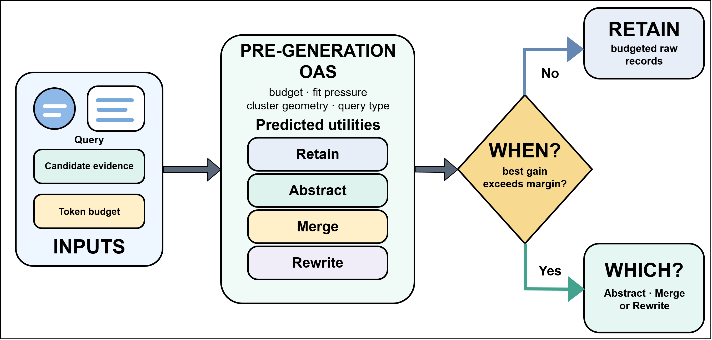
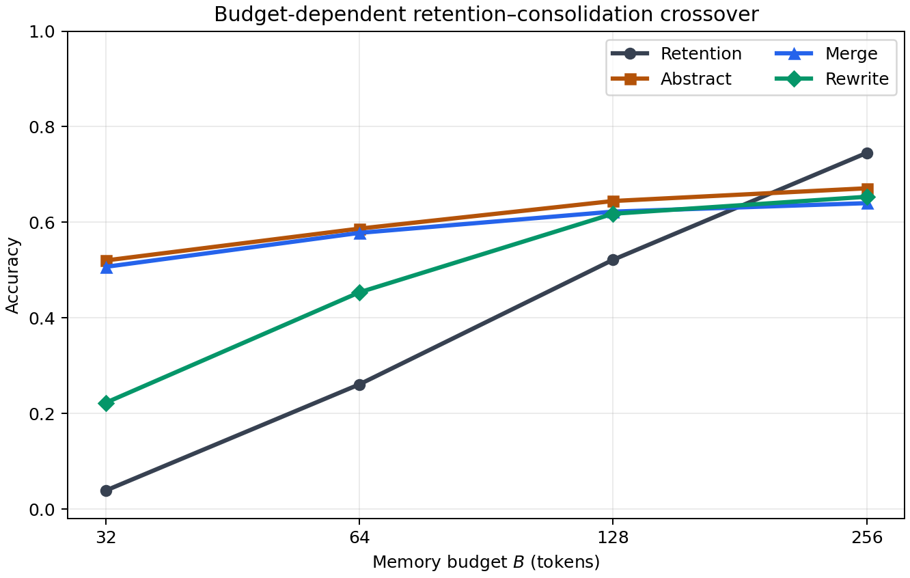

# Retain or Consolidate? Budget-Dependent Operator Selection for Language Agent Memory

## 留存还是整合？面向语言智能体记忆的预算依赖算子选择

> **论文元信息**
> - **arXiv**：[2607.17545](https://arxiv.org/abs/2607.17545)（v2，2026-07-21 发布；本译文基于 v2 官方 HTML `https://arxiv.org/html/2607.17545v2`）
> - **分类**：cs.AI（主分类）
> - **作者**：Qingcan Kang、Mingyang Liu、Shixiong Kai、Kaichao Liang、Zhentao Tang、Yuqi Cui、Tao Zhong、Mingxuan Yuan（华为诺亚方舟实验室；香港城市大学 计算机科学系）；∗ 共同第一作者，† 通讯作者
> - **方法名**：**OAS**（Offline Abstraction-Safety，离线抽象安全）
> - **复现地址**：论文未公开独立代码仓库；实验协议与超参数细节见 arXiv 附带的 Supplementary Material（补充材料）

> **翻译说明**
> - 本译文基于 arXiv 官方 HTML 全文（`https://arxiv.org/html/2607.17545v2`）逐段翻译，覆盖：**摘要 + 第 1–5 节（引言、相关工作、方法论、实验、结论）+ 附录 A/B 全量**；参考文献保留原文编号，不逐条翻译。
> - **插图**：共 **2 张图**（Figure 1 OAS 工作流、Figure 2 预算交叉点），已下载到本地 `../images/RetainOrConsolidate/`，使用相对路径引用；每张图上方保留 `<!-- 原图：URL -->` 注释便于回溯。
> - **表格**：共 **12 张表**（Table 1–12，含附录中的预算敏感性表），数值全量照抄，不得省略。
> - 公式统一按 LaTeX 重排（清理原文 HTML 中 MathML 与 LaTeX 重复渲染痕迹）；术语首次出现保留英文原文。

---

## 摘要

记忆使语言智能体能够调用过往交互中的信息，以支持未来的推理与行动。然而，大语言模型（LLM）有限的上下文窗口与推理成本，限制了多少已存储信息可被真正利用。现有智能体系统主要通过两种记忆管理策略来应对这一挑战：留存（retention）与整合（consolidation）。留存把精确细节保存在原始记录中，但在预算紧张时可能遗漏相关证据；整合通过压缩提升证据的覆盖面，却面临丢失查询关键细节的风险。两种策略并非普适优劣。这引出两个耦合的问题：何时该用整合取代留存？应该用哪个算子——合并（Merge）、抽象（Abstract）还是重写（Rewrite）？我们把这一联合决策形式化：将每个整合算子的价值分解为「对留存所遗漏证据的覆盖效应」与「对已被完好装入的原始证据的带符号替换效应」。这一权衡解释了为何最优动作会随相对预算压力而改变。我们用**离线抽象安全（Offline Abstraction-Safety, OAS）**落地该机制——一个轻量学习器，从生成前特征估计动作效用，并用留出集的伤害校准来限制有害替换。在公开的 LongMemEval 与 LoCoMo 基准上的实验揭示出一致的预算依赖模式：在 LongMemEval 上，预算紧张时整合把准确率最高提升 48 个百分点，而预算宽松（大部分相关原始证据都能完整留存）时，留存更优；LoCoMo 在更小的绝对预算处复现了同一交叉点，与其更短的证据一致。这些结果表明，留存与整合的选择取决于证据长度相对于可用预算的大小，而非某个固定的 token 阈值。在两个基准上，当压缩不可避免时，跨笔记的 Abstract 与 Merge 通常优于局部的 Rewrite。

---

## 1. 引言

语言智能体建立在 LLM 之上，常常需要跨越单次提示运行。它们积累观测、对话与检索到的事实，以支撑后续决策，但这段历史不能无代价地增长。LLM 拥有有限的上下文窗口，而在触及该上限之前，更长的输入也会增加推理成本与延迟；相关证据在长上下文中还可能被不可靠地使用（Liu et al., 2024）。因此 token 预算是一项现实的部署约束：记忆系统必须把有用的证据装进预算，同时尽量不降低答案质量。

现有系统通常通过两种策略管理这一约束：记忆留存（memory retention）与记忆整合（memory consolidation）。留存选取原始记录并保持其内容不变，从而保留确切措辞、来源、时间戳与更正信息，但当证据冗余或分散时 token 利用效率不高——在紧张预算下，一条相关证据可能装不下。已有系统在原始记录存储之外，混合使用层级结构、遗忘、摘要或反思（Packer et al., 2023；Zhong et al., 2024；Park et al., 2023）。Kang et al.（2026）进一步把长程留存形式化为约束随机优化，并学习在延迟遗漏、重新获取与过期成本下该保留哪些原始笔记。整合则为一个或多个记录生成紧凑的替代表示：摘要、合并或重写可以去除冗余、提升每个 token 的证据覆盖，但生成过程可能遗漏决定性细节、模糊时间顺序、丢弃一次更正，或引入无依据的内容。Mem0 与 A-MEM 生成结构化记忆，而 RecMem 与 TrustMem 分别研究由复发触发的整合与可靠转移（Chhikara et al., 2025；Xu et al., 2025；Dai et al., 2026；Yang et al., 2026）。

这两条研究线索分别确立了两种策略，却没有解决它们的联合决策。留存研究关注的是「保留哪些原始记录」，整合研究则主要关注「如何构造紧凑记忆」。至于何时该用生成的压缩替代原始证据、以及该用哪个整合算子，仍不清楚。答案取决于预算压力：若相关原始证据装不下，整合或可挽回原本会被遗漏的信息；若该证据本就装得下，替换它可能白白牺牲精确细节而不增加有用的覆盖。这一权衡催生了我们的核心问题：智能体何时应当整合？又该选择哪个算子——合并、抽象还是重写？为隔离这一比较，我们固定查询、候选证据、检索器、答案模型与答案时预算，只改变记忆表示。

我们把留存与三个整合算子形式化为一个有限的、依赖预算的动作集合。每个动作都有定义良好的条件期望答案效用。最优动作本可通过比较这四种效用得到，但未执行动作的效用是反事实的，在部署时不可知；障碍在于缺失效用信息，而非难以求解的组合问题。为解释最优动作如何变化，我们引入一个理想化的机制模型，把每个算子的价值分解为两项：对留存所遗漏证据的覆盖效应，以及对已装入原始证据的带符号替换效应。二者的平衡随相对预算压力变化，并同时决定「整合何时有益」与「哪个算子提供最大期望效用」。

我们用**离线抽象安全（OAS）**——一个轻量多动作效用学习器——把该形式化落地。OAS 从生成前可观测的特征（包括预算规模、证据装入压力、簇几何结构与查询类型）估计那些不可知的动作效用，再套用一个插件式最大化器；一个留出安全阈值限制有害替换。线性回归是主要的估计器，因为可得的监督数据更倾向于低容量模型；多层感知机（MLP）作为非线性容量控制，用于检验岭回归是否对动作—效用关系欠拟合。这一设计把学习用在刀刃上：估计反事实效用，而非掩盖一个简单的有限动作优化。

在公开基准 LongMemEval 与 LoCoMo 上的实验支持上述刻画。在 LongMemEval 上，预算紧张时整合相对留存的绝对准确率最高提升 $48\%$；而当原始证据基本装得下后，留存在每个整合算子之上领先 $8\%$–$11\%$。换用一个答案模型复现了同一反转。LoCoMo 呈现相同模式，但其交叉点出现在更小的绝对预算处，因为其证据更短。这一结果支持「相对预算压力」而非「通用 token 阈值」。算子比较回答了「哪个」问题：在压缩下，跨笔记的 Abstract 与 Merge 通常比局部的 Rewrite 更有效，尽管两个跨笔记算子都不在每种设定下占优。OAS 在预算受压迫条件下改进了受控的「何时—哪个」决策；其单独评估的全历史变体并未超过最强的固定策略，这为我们主张划了界：实验对预算依赖机制的验证，强于对通用逐实例路由的验证。

我们的贡献如下。

- 统一的「何时—哪个」形式化。我们把留存与三个生成式整合算子置于同一决策空间，配以带符号、依赖预算的效用，使「是否整合、如何整合」成为问题形式化中显式的决策。

- 可检验的预算依赖机制。一个理想化代理把整合价值分解为带符号的覆盖效应与替换效应。在公开基准上的实验识别出预测的反转，并在机制分析与实验中表明，算子选择取决于预算压力与证据结构。

- 把形式化落地的轻量学习器。OAS 从生成前特征学习多动作效用，并使用留出伤害校准。受控评估与独立评估区分了成功的预算感知选择，与当前可迁移路由的边界（详见方法论与补充材料）。

<!-- 原图：https://arxiv.org/html/2607.17545v2/figures/figure_overview.png -->

> **图 1（原文 Figure 1）**：OAS workflow for deciding when to consolidate and which operator to use. From pre-generation features, OAS estimates retention and three consolidation utilities. It consolidates when the best predicted gain exceeds a margin—zero for Direct OAS and calibrated on held-out questions for Calibrated OAS—and otherwise retains ( when ); it then applies the highest-utility generative operator ( which ).
> （OAS 决定「何时整合、用哪个算子」的工作流：基于生成前特征，OAS 估计留存与三个整合算子的效用；当最优预测增益超过某边界——Direct OAS 取零，Calibrated OAS 在留出问题上校准得到——时执行整合，否则留存（何时）；随后套用效用最高的生成式算子（哪个）。）

---

## 2. 相关工作

#### 智能体记忆系统与整合。

关于智能体记忆的综述回顾了表示、评估以及整合、遗忘、检索与压缩等操作（Zhang et al., 2024；Du et al., 2025）。现有系统把存储与检索同层级结构、反思、摘要或结构化更新结合起来（Packer et al., 2023；Zhong et al., 2024；Park et al., 2023）。更近期的工作研究整合、关联笔记、基于复发的触发器或转移验证（Chhikara et al., 2025；Xu et al., 2025；Dai et al., 2026；Yang et al., 2026）。这些系统设计流水线或单个算子。我们则固定查询、证据与答案时预算，以隔离「何时变换有益、应由哪个算子执行」。

#### 检索上下文与提示压缩。

RECOMP 学习抽取式与抽象式压缩器，而 LLMLingua 通过 token 级压缩控制提示长度（Xu et al., 2024；Jiang et al., 2023）。我们的干预改为用生成的记忆替换情景证据，并在配对实例上比较留存与多个语义算子；目标是答案效用而非压缩率：它决定何时变换记忆、选择哪种变换。

#### 对话记忆基准。

LongMemEval 测试五种记忆能力，包括时间推理与知识更新；LoCoMo 评估长会话问答、事件摘要与多模态对话生成（Wu et al., 2025；Maharana et al., 2024）。某些问题需要精确细节，而分散的证据制造压缩压力，使两个基准都成为我们「何时—哪个」机制的自然测试场。

#### 选择性记忆与生成式记忆。

Kang et al.（2026）把长程留存形式化为约束序贯优化，并学习保留哪些未改动的笔记。我们互补的决策则追问：已识别的证据应保留为原始形式，还是由生成记录替代。经典的预算化选择在有固定覆盖或次模目标下具有近似保证（Nemhauser et al., 1978；Khuller et al., 1999），但生成既可能改善覆盖也可能降低保真度。我们用算子特定的效用建模这一带符号权衡，并遵循更广义的「带预测的学习算法」原则学习由此得到的有限动作决策（Mitzenmacher and Vassilvitskii, 2021）。

---

## 3. 方法论

我们把记忆整合形式化为在由上下文容量或部署成本所施加的 token 预算下的一次性查询时决策。目标是在维持答案效用的同时高效利用可用上下文。我们形式化地说明整合为何既可能改善也可能降低答案效用，然后学习一个轻量效用路由器，从生成前可得的特征决定何时整合、应用哪个算子。论述分三步：先定义四动作决策，再推导其预算依赖的理想化机制，最后说明 OAS 如何在测试时不观测生成记录、仅从离线结果学习该决策。

### 3.1 问题形式化

#### 记忆、预算与检索。

令 $M=\{m_{i}\}_{i=1}^{N}$ 为一个智能体记忆，其笔记包含文本、元数据与嵌入 $\mathbf{e}_{i}$。检索器 $R_{B}$ 把查询 $q$ 与记忆状态映射为一个有序子集 $S=R_{B}(q,M)$，其 token 开销服从上下文预算 $B$；即所选笔记的总开销不超过预算。该预算可反映模型的上下文窗口上限，也可反映为控制推理成本与延迟而选取的更小运行上限。随后答案模型由 $(q,S)$ 生成回复，固定的评判者对照参考答案给出二元效用 $u(q,S)\in\{0,1\}$。在每一组配对比较中，检索器、回答者、评判者与预算均固定，唯一变化的是记忆表示。

#### 生成式整合算子。

对候选证据簇 $C\subseteq M$，智能体可施加一个生成式算子，发出一个预算定向的表示 $\tilde{m}_{o,B}(C)$，该表示不在原始记录之中。生成式族为 $\mathcal{O}_{\rm gen}=\{\textsc{Merge},\textsc{Abstract},\textsc{Rewrite}\}$。Merge 把若干笔记合并为一条紧凑事实记录，Abstract 在其输入之上综合出一条更高层的笔记，而 Rewrite 在装入同一预算前各自重构每条笔记。为方便记号，打包后的 Rewrite 输出被视为一个表示 $\tilde{m}_{o,B}(C)$，同时保留其内部笔记边界。这些不同于保留、丢弃或重索引已有原始内容的选择式算子。本研究中的每个生成式算子都替换答案上下文中的打包构成（从而释放预算），得到相对于「原样留存」状态 $M$ 的整合后状态。

三个算子都能同时改变覆盖与保真度，因此每个都需要一个选择决策。记 $T_{C,o,B}(M)$ 为用算子 $o\in\mathcal{O}_{\rm gen}$ 生成的表示替换簇 $C$。受控实验研究一个查询时打包决策：在查询识别出候选证据簇之后、但在生成紧凑记录之前，策略选择留存或某个生成式算子。这一范围使查询类型可观测，且并不声称解决查询无关的背景整合。我们一次分析一个查询—簇决策；重复记忆更新之间的交互不在当前保证之内。

**定义 1（整合增益）**。对于记忆状态 $M$、候选簇 $C$、查询 $q$、预算 $B$ 与算子 $o$，实现的配对整合增益为

$$\Delta_{o}(z)=u_{o}(z)-u_{\mathrm{ret}}(z),$$

$$u_{o}(z)=u\!\left(q,R_{B}(q,T_{C,o,B}(M))\right).$$

即在相同检索器、预算、回答者与评判者下，相对「整合 $C$ 而非留存 $C$」所带来的评分答案效用变化。这是一个配对、运行级的量，因此取值为 $-1$、$0$ 或 $1$。在我们下面定义期望动作效用时，生成、回答与评判的随机性被取平均。

#### 决策问题。

打包策略 $\pi$ 把可观测实例 $z=(M,C,q,B)$ 映射到动作集 $\mathcal{A}=\{\mathrm{ret}\}\cup\mathcal{O}_{\rm gen}$ 中的一个动作。对生成式动作 $o$，记 $u_{\mathrm{ret}}(z)=u(q,R_{B}(q,M))$、$u_{o}(z)=u(q,R_{B}(q,T_{C,o,B}(M)))$。一个策略的价值就是其所选动作期望效用，期望覆盖实例、生成、回答与评判：

$$V(\pi)=\mathbb{E}\big[u_{\pi(z)}(z)\big].$$

令 $\pi_{\mathrm{ret}}$ 表示始终留存原始记录的固定策略。

#### 良定义性与适用范围。

对每个实例，候选簇 $C$ 由上游检索器或证据选择器给出，并被打包决策视为固定。每个动作都产生一个 token 开销至多为 $B$ 的上下文：留存打包完整的原始记录，而每个生成表示被限制在同一预算内。实现的动作效用是有界的二元随机变量，因此下面每个条件均值 $\mu_{a}(z)$ 都存在。由于动作集合有限，至少总存在一个效用最大化的动作；平局朝留存方向解决。该形式化因而对任意给定的 $(M,C,q,B)$ 定义了一个有效的一步决策。它刻意不优化候选发现或重复记忆更新，二者分别是上游与序贯扩展。

#### 联合的「何时」与「哪个」决策。

令 $\mu_{a}(z)=\mathbb{E}[u_{a}(z)\mid z]$ 表示动作 $a\in\mathcal{A}$ 的条件效用，并定义最佳生成优势

$$\Gamma(z)=\max_{o\in\mathcal{O}_{\rm gen}}\mu_{o}(z)-\mu_{\mathrm{ret}}(z),$$

$$o^{\star}(z)\in\arg\max_{o\in\mathcal{O}_{\rm gen}}\mu_{o}(z).$$

因此两个问题其实是一个决策：何时，即 $\Gamma(z)$ 为正（或超过安全边界）时整合；哪个，即选中整合时套用 $o^{\star}(z)$。该形式化不假设某个算子拥有固定的全局排名：两个比较都依赖于 $z$ 中的查询、候选簇与预算。下面的 OAS 从生成前特征估计这些动作效用。等价地，在平局朝留存解决下，最优动作为

$$a^{\star}(z)=\begin{cases}\mathrm{ret},&\text{if }\Gamma(z)\leq 0,\\ o^{\star}(z),&\text{if }\Gamma(z)>0.\end{cases}$$

#### 为何需要学习。

若全部四个条件效用 $\{\mu_{a}(z):a\in\mathcal{A}\}$ 都已知，问题只需比较四个数即可精确求解，无需通用求解器。部署难点在统计而非组合。在决策之前，生成记录尚不存在，其答案效用是反事实且未知的；基于参考的正确性在正常部署中同样不可得。对每个候选都生成并打分将抵消低成本路由的意义，而数值求解器无法恢复缺失的目标值。因此我们离线评估所有动作，从生成前特征学习其效用，并在部署时把估计值用于同一个四动作最大化。OAS 近似的是未知目标，而非计算困难的 argmax。

### 3.2 预算依赖的理想化机制

我们刻意使用一个简化的代理效用，以隔离「用生成记录替换原始记忆」的两类效应。这里的「代理」指一个可分析的机制模型：它旨在解释观测到的准确率变化方向，但并未被假定等于定义 1 中的 LLM 评判准确率 $u$。该构造分别应用于每个生成式算子；为可读性我们暂时省略算子下标。该模型描述查询总体上的平均预算效应；实例级决策仍是式 (3) 中的条件效用问题，由下面的 OAS 学习。

令 $\mathcal{Q}$ 为可能查询的集合，$q\sim F$ 表示从评估分布中抽取的查询。查询是该代理中唯一的随机变量；记忆集合、预算、检索器与生成记录均固定。分布 $F$ 表示查询出现的频率；$\Pr_{F}$ 与 $\mathbb{E}_{F}$ 表示在 $F$ 下的概率与期望。我们未拟合参数密度：在基准分析中，$F$ 是评估问题上的均匀经验分布，因此概率是问题占比，期望是问题均值。对任意笔记 $m$ 及其支撑的查询，带符号保真度 $\varphi_{m}(q)\in[-1,1]$ 表示该笔记提供的是准确证据还是误导证据：正值表示正确支撑，负值表示误导支撑，零表示无贡献。在这一刻意简化的模型中，$s_{B}(q,M)$ 是在预算 $B$ 下从记忆状态 $M$ 检索到的最高排序适用笔记所贡献的带符号保真度；若没有检索到的笔记支撑该查询，则为零。我们把代理效用定义为期望贡献

$$\mathcal{U}_{B}(M)=\mathbb{E}_{F}[s_{B}(q,M)].$$

该期望良定义，因为 $s_{B}$ 介于 $-1$ 与 $1$ 之间。在有限基准上，它只是跨查询的平均贡献。

对受分析的固定预算，令 $H_{B}\subseteq\mathcal{Q}$ 为生成记录 $\tilde{m}_{B}$ 所支撑的查询，并假设 $H_{B}$ 在 $F$ 下具有正概率。令 $G_{B}\subseteq\mathcal{Q}$ 为原始支撑区：即留存会检索到 $C$ 的某个适用构成所对应的查询。定义 $X_{B}=H_{B}\setminus G_{B}$ 为「由生成记录支撑、却被留存遗漏」的查询。在嵌套的原始打包下，增大预算只会扩大 $G_{B}$；生成的覆盖 $H_{B}$ 也可能随目标预算变化。

**假设 1（局部化检索变化）**。用 $\tilde{m}_{B}$ 替换 $C$ 后，在 $H_{B}$ 之外检索贡献不变；在 $X_{B}$ 上，留存贡献为零而整合检索到 $\tilde{m}_{B}$。在 $H_{B}\cap G_{B}$ 内，令 $J_{B}$ 为「检索从在位原始笔记 $m_{\rm raw}(q)$ 变为 $\tilde{m}_{B}$」的替换区。

该假设把干预局部化：替换 $C$ 只可能改变被生成记录支撑的查询的证据。它仅用于得到命题 1 中精确的两项分解；OAS 与经验比较并不需要它。该假设有局限性，因为它排除了 $H_{B}$ 之外的检索或打包溢出。没有它，效用变化会多出一个剩余溢出项。

**命题 1（算子索引的预算分解）**。对每个 $o\in\mathcal{O}_{\rm gen}$，令 $H_{B,o}$ 为 $\tilde{m}_{o,B}$ 所支撑的查询，$X_{B,o}=H_{B,o}\setminus G_{B}$，并令 $J_{B,o}\subseteq H_{B,o}\cap G_{B}$ 为其替换区。在假设 1 下，该算子的代理效用变化 $\Delta\mathcal{U}_{B,o}=\mathcal{U}_{B}(T_{C,o,B}(M))-\mathcal{U}_{B}(M)$ 为

$$\Delta\mathcal{U}_{B,o}=C_{B,o}+R_{B,o},$$

$$C_{B,o}=\Pr_{F}(q\in X_{B,o})\,\mathbb{E}_{F}[\varphi_{\tilde{m}_{o,B}}(q)\mid q\in X_{B,o}],$$

$$R_{B,o}=\Pr_{F}(q\in J_{B,o})\,\mathbb{E}_{F}[\varphi_{\tilde{m}_{o,B}}(q)-\varphi_{m_{\rm raw}(q)}(q)\mid q\in J_{B,o}].$$

此处 $C_{B,o}$ 与 $R_{B,o}$ 分别是覆盖效应与替换效应。当其所 conditioning 事件概率为零时，每项定义为零。当 $X_{B,o}$ 具有正概率且生成记录在那里具有正平均保真度时，覆盖效应为正。若生成记录在 $J_{B,o}$ 全程都不高于在位原始记录的保真度，则替换效应非正。

证明把查询划分为 $X_{B,o}$、$J_{B,o}$ 与未变的剩余部分后取期望；完整细节见补充材料。

命题 1 分别给出每个生成动作的价值。下一结果把这些算子索引的增益转化为联合的「何时—哪个」决策。

**命题 2（何时与哪个的联合规则）**。令 $\Delta\mathcal{U}_{B,o}$ 为命题 1 中的算子特定值。对固定簇、预算与查询分布，令留存增益为零，并令 $o^{\star}\in\arg\max_{o\in\mathcal{O}_{\rm gen}}\Delta\mathcal{U}_{B,o}$。当 $\Delta\mathcal{U}_{B,o^{\star}}\leq 0$ 时最优代理动作为留存，否则为 $o^{\star}$。因此，「何时」问的是最佳整合算子是否优于留存，而「哪个」选的是具有最大正增益的算子。零增益平局朝留存解决；正增益算子之间的平局可任意解决。

结果来自把三个算子增益与留存的零增益比较；形式化证明见补充材料。

#### 解释与可证伪推论。

式 (6) 并不保证出现交叉。随着 $B$ 减小，$G_{B}$ 收缩；整合只有在覆盖效应压过任何负向替换效应时才有帮助。它还预测伤害应集中在压缩降低保真度的地方，例如时间戳、更正与实体绑定。实验检验这些方向性推论，但不识别潜在保真度函数，也不把代理等同于 LLM 答案准确率。哪个具名算子具有最大增益仍是一个经验问题。

### 3.3 离线抽象安全学习

该机制表明最优决策依赖于不可观测的量（尚未生成的紧凑记录的真实保真度）。离线抽象安全（OAS）通过在事后恢复监督、并拟合一个作用于生成前可得特征的轻量路由器，使该决策可学习。

#### 标注。

对每个训练实例 $z=(M,C,q,B)$，我们在相同检索器、预算、答案模型与评判者下评估留存与每个生成动作。这产出动作效用 $u_{a}(z)$、式 (1) 的配对增益，以及当某生成动作效用低于留存时的伤害事件。这些结果并非语义层面的真值，而是与下游答案度量对齐的、系统特定的监督。它们仅在离线时观测，绝不作为测试时特征使用。

#### 可观测性分离。

查询与候选证据可观测，但决策在紧凑记录生成、其答案效用已知之前做出。OAS 在生成前特征上拟合效用路由器，并用离线恢复的结果监督它。这是查询时自适应打包，而非查询无关的记忆维护。

#### 在线可观测特征映射。

每个观测实例 $z$ 由一个 11 维特征向量 $\psi(z)\in\mathbb{R}^{11}$ 表示。七个入口是标量特征：归一化预算 $B/512$、构成数量、token 压力（候选证据开销除以 $B$）、预算装入比例 $f_{B}$（留存装入的候选证据占比）、所代表会话数、以笔记嵌入到其簇均值的均方距离度量的不一致性代理，以及平均成对余弦相似度。其余四个入口构成对基准查询类型的 one-hot 编码。常数 512 仅用于将预算特征置于便利的数值尺度。在受控的 oracle-证据协议下，这些在生成前可得；在端到端部署中，候选证据开销与基准类型需由检索器与类型分类器估计。

#### 直接效用路由器与假设类。

OAS 不把决策分解为一个二值的「何时」头与一个单独拟合的算子启发式，而是直接预测每个动作的效用。对每个 $a\in\mathcal{A}$，它拟合一个带正则的线性响应，参数向量 $\theta_{a}\in\mathbb{R}^{11}$、截距 $b_{a}\in\mathbb{R}$：

$$\widehat{\mu}_{a}(z)=b_{a}+\langle\theta_{a},\psi(z)\rangle,$$

并部署 $\widehat{\pi}(z)=\arg\max_{a\in\mathcal{A}}\widehat{\mu}_{a}(z)$。于是「何时」即与预测留存效用的比较，「哪个」即最大预测生成动作效用；二者从同一低容量模型学习。

#### 效用回归。

离线配对评估为每个训练实例 $i$ 上的动作 $a$ 提供 $u_{a,i}\in[0,1]$。我们用岭回归拟合四个响应：

$$(\widehat{b}_{a},\widehat{\theta}_{a})=\arg\min_{b,\theta}\,\frac{1}{n}\sum_{i=1}^{n}\big(u_{a,i}-b-\langle\theta,\psi(z_{i})\rangle\big)^{2}+\lambda\lVert\theta\rVert_{2}^{2}.$$

其中 $n$ 为训练实例数，$\lambda\geq 0$ 为正则强度；截距不被惩罚。$\lambda$ 值由仅使用训练问题的内层分组交叉验证选定，之后效用函数被冻结。这一直接目标尊重效应幅度，并避免把大量零增益平局当作正或负的分类样本。若每个预测效用都在其条件目标的 $\epsilon$ 之内，插件式最大化的条件效用损失至多 $2\epsilon$（见补充材料）。这一标准比较并不要求岭回归被正确设定。我们把线性形式用作正则化、数据高效的归纳偏置，而非假定真实决策边界是线性的。在相同分组协议下评估一个单隐层 MLP，以检验额外的非线性容量是否能改善效用估计；实验与补充材料报告它相对岭回归并无可靠改善。

#### 风险可控的运行阈值。

令 $o^{+}(z)=\arg\max_{o\in\mathcal{O}_{\rm gen}}\widehat{\mu}_{o}(z)$ 为预测效用最高的生成动作，并定义其预测优势 $s(z)=\widehat{\mu}_{o^{+}(z)}(z)-\widehat{\mu}_{\mathrm{ret}}(z)$。给定冻结的效用路由器，对每个预算在一个留出验证切分上选取一个独立的运行阈值 $\tau_{\mathrm{safe},B}$。候选阈值为观测到的验证优势，外加一个「全部弃权」选项。校准先聚焦于那些「有害生成选择的经验频率满足指定伤害约束」的阈值，再选取验证准确率最高的阈值。我们要求在校准切分上观测到的有害选择为零。弃权选项保证可行性。无约束路由器选择预测效用最大的动作；校准变体仅当其预测优势达到该预算特定阈值时才选择 $o^{+}(z)$，否则留存原始笔记。由于候选阈值构成一个嵌套的接受族，校准只需对验证分数做一次扫描。验证准确率的平局朝更保守的阈值解决。这是一条保守的运行规则，而非总体安全证书；因此实验在互斥问题上报告实现的帮助与伤害。

---

## 4. 实验

我们在 LongMemEval 与一份固定的、结果盲的、按证据长度分层的 LoCoMo 样本上，跨所有预算评估每个算子。两个数据集具有不同的证据长度分布，使我们得以检验整合边界是否遵循可观测的预算压力，而非某个固定的 token 值。

我们的实验回答三个问题。（Q1）整合的价值是否随记忆预算变号？（Q2）最佳生成式算子（Merge / Abstract / Rewrite）是否依赖预算？（Q3）一个共享的轻量打分器能否仅从生成前特征学习「何时整合、用哪个算子」的联合决策？Q1 检验命题 1 预测的预算依赖符号；Q2 检验其算子索引的比较；一个按拟合度分层的诊断探查覆盖与替换效应；Q3 评估对式 (3) 的学习近似。

#### 设置。

LongMemEval（Wu et al., 2025）是主基准。在建模之前，其样本池被切分为拟合、开发与测试三种角色，路由进一步按问题分离效用拟合、阈值校准与测试。在受控评估中，每个动作都接收相同的 gold 证据，仅在预算化表示上不同。留存打包完整的原始条目，而 Abstract、Merge 与 Rewrite 产生问题形式化中定义的表示。这一配对把「何时—哪个」决策与证据发现隔离开来。

LongMemEval 使用 32、64、128、256 token 的预算。单个证据轮次的中位开销为 59 token，而在这些预算下，留存能完整装入全部所需证据的问题占比分别为 $1.3\%$、$9.3\%$、$52.0\%$ 与 $85.3\%$。我们以这一「完整装入率」而非绝对 token 值来定义预算区间：32 与 64 token 分别为「极紧」与「紧」，128 token 为「过渡区」，256 token 为「宽松」。LoCoMo（Maharana et al., 2024）提供一份结果盲、按证据长度分层的复现样本，其证据更短，对应更小的预算 16、32、64、128 token。每个生成表示都被确定性地封顶于其目标预算。完整的证据分布与实现细节见补充材料。

答案由 DeepSeek-V3.2 在统一提示下生成并评判，在 LongMemEval 上有三个配对实现。统计比较在每个问题内对重复取平均，并使用问题级配对 bootstrap 区间与随机化检验。一个 GLM-5.2 复现检验答案模型敏感性。一个额外的全历史评估为两种方法提供来自 BM25（一种以词项罕见度与轮次长度调整来打分的稀疏词法检索器）的相同候选（Robertson and Zaragoza, 2009）。这些鲁棒性协议详见补充材料。

### 4.1 预算交叉点（Q1）

图 2 报告了预算扫描结果。随着能装入的原始证据轮次减少，留存准确率从宽松预算下的 $74.5\%$ 下降到极紧预算下的 $3.9\%$。在紧区间与过渡区间，每个整合算子的准确率点估计都高于留存，而在宽松预算下留存的准确率最高。以具代表性的 Abstract 比较为例：紧预算下的绝对准确率增益为 $48.0\%$，bootstrap 区间为 $37.3\%$–$58.2\%$；其宽松预算下的差异为 $-8.0\%$，区间为 $-16.9\%$–$0.5\%$。Merge 在宽松预算下的对应区间在负方向排除零（补充配对推断）。因此这一反转支持命题 1 的方向性预测：降低预算会收缩由原始留存所支撑的区域，并增大潜在的覆盖效应。该扫描并未分别识别潜在项；这一推论由下面的按拟合度分层诊断检验。

<!-- 原图：https://arxiv.org/html/2607.17545v2/figures/fig_budget_crossover.png -->

> **图 2（原文 Figure 2）**：The budget crossover across consolidation operators. Mean accuracy of retention, Abstract , Merge , and Rewrite on the LongMemEval test partition with three label realizations. At 32 tokens, Abstract reaches $52.0\%$ accuracy versus $4.0\%$ for its paired retention baseline, an absolute gain of $48.0\%$ . Every consolidation operator leads retention in the tight regimes, and the advantage narrows in the 128-token transition regime. At the loose 256-token budget, retention exceeds every consolidation operator. Thus consolidation is favored when raw evidence does not fit, whereas retention is favored when most evidence already fits. Question-level paired uncertainty is reported in the supplementary material. The plotted retention curve averages all paired retention realizations; operator effects and confidence intervals use each operator’s within-run retention counterpart.
> （跨整合算子的预算交叉点：在 LongMemEval 测试切分上，留存、Abstract、Merge 与 Rewrite 在三个标签实现下的平均准确率。32 token 时 Abstract 达到 $52.0\%$ 准确率，而其配对留存基线仅 $4.0\%$，绝对增益 $48.0\%$。在紧区间每个整合算子都领先留存，优势在 128 token 过渡区收窄；宽松的 256 token 预算下留存超过每个整合算子。因此当原始证据装不下时偏好整合，而大多证据已装得下时偏好留存。问题级配对不确定性见补充材料；图中留存曲线平均所有配对留存实现，算子效应与置信区间使用各算子运行内的留存对应项。）

#### 跨模型复现。

使用 GLM-5.2 的完整「留存 vs 抽象」扫描复现了同一「何时」答案：在极紧区间抽象提升准确率，而在宽松区间劣于留存。完整结果见补充材料。

#### 全历史检索评估。

在相同的词法检索候选下，抽象在紧区间再次优于留存，而随预算放宽其优势消失。这一辅助结果表明预算交互在检索噪声下依然存在；它并未确立对优化后的端到端记忆系统的优越性。完整结果与配对不确定性见补充材料。

**表 1：按留存完整度分层的机制诊断**

| 算子 | B | 留存是否完整装入 | 配对增益（help/harm；n） |
| --- | --- | --- | --- |
| Abstract | 128 | 不完整 | +.343 (.38/.04; 36) |
|  | 128 | 完整 | -.043 (.06/.10; 39) |
|  | 256 | 不完整 | -.061 (.21/.27; 11) |
|  | 256 | 完整 | -.083 (.07/.16; 64) |
| Merge | 128 | 不完整 | +.324 (.41/.08; 36) |
|  | 128 | 完整 | -.145 (.06/.21; 39) |
|  | 256 | 不完整 | +.152 (.27/.12; 11) |
|  | 256 | 完整 | -.151 (.04/.19; 64) |
| Rewrite | 128 | 不完整 | +.306 (.39/.08; 36) |
|  | 128 | 完整 | -.094 (.08/.17; 39) |
|  | 256 | 不完整 | -.061 (.18/.24; 11) |
|  | 256 | 完整 | -.089 (.07/.16; 64) |

> **表 1（原文 Table 1）**：Fit-stratified mechanism diagnostic. Paired gain according to whether retention packs all candidate evidence; parentheses report helped and harmed rates and stratum size. The table uses the transition and loose budgets, where both fit strata are sufficiently populated for comparison. At 32 and 64 tokens, complete fit occurs for only one and seven questions, respectively; their aggregate tight-budget results appear in Figure 2 .
> （按留存完整度分层的机制诊断：按留存是否装入全部候选证据给出配对增益；括号报告帮助率、伤害率与层规模。该表使用过渡与宽松预算，两层拟合样本都足够用于比较。在 32 与 64 token 下，完整装入分别只出现在 1 个与 7 个问题上；其紧预算聚合结果见图 2。）

### 4.2 哪种算子？预算依赖的权衡（Q2）

算子领跑者随预算变化。在两个紧区间，Abstract 居首，其后依次是 Merge、Rewrite 与留存；在宽松预算下，留存居首，且每个生成式算子都有负的配对增益。两个跨笔记算子在压缩下优于局部 Rewrite，但二者直接差异不显著。因此「哪个」并非某个通用的具名算子：对碎片化证据偏好跨笔记融合，而抽象与合并之间的选择仍依赖实例。完整的 pairwise 检验与按类型的结果见补充材料。

### 4.3 机制诊断：覆盖与替换

我们通过对留存装入比例 $f_{B}$ 分层结果来检验代理的可观测推论。表 1 显示，当部分证据装不下时每个算子都有增益，而在过渡区间当全部证据都装得下时则转亏；在宽松预算下完整装入的损失持续存在。这一覆盖—替换交互支持命题 1，但不声称识别了其潜在保真度项。

### 4.4 何时与哪个的统一闸门（Q3）

OAS 由分组五折交叉拟合评估：效用拟合、阈值校准与测试使用互斥的问题，且同一问题的所有预算都留在同一折。表 2 显示在三个受压区间相对留存有显著增益，而在宽松预算下无差异。所选动作随证据装入度增大，从跨笔记算子转向留存，从而同时实现「何时」与「哪个」。校准以部分效用代价减少了有害替换；其经验约束并非总体安全证书。

**表 2：联合「何时—哪个」路由**

| 策略 | B | 准确率 | 增益 [95% CI] | 伤害 |
| --- | --- | --- | --- | --- |
| Direct OAS | 32 | .545 | +.507 [.404,.607] | 3 |
|  | 64 | .618 | +.357 [.227,.483] | 12 |
|  | 128 | .640 | +.119 [.015,.224] | 14 |
|  | 256 | .745 | .000 [-.061,.064] | 10 |
| Calibrated OAS | 32 | .487 | +.449 [.345,.551] | 1 |
|  | 64 | .403 | +.142 [.056,.234] | 3 |
|  | 128 | .613 | +.092 [.034,.160] | 2 |
|  | 256 | .742 | -.003 [-.009,.000] | 1 |

> **表 2（原文 Table 2）**：Joint when–which routing. Direct OAS selects the action with the largest predicted utility. Calibrated OAS applies a budget-specific harm threshold fitted on disjoint questions and otherwise retains the raw evidence. Gain is relative to retention; Harm counts lower-utility generated selections. All results use grouped five-fold cross-fitting.
> （联合「何时—哪个」路由：Direct OAS 选择预测效用最大的动作；Calibrated OAS 应用一个在互斥问题上拟合的、按预算设定的伤害阈值，否则留存原始证据。增益相对留存；Harm 计为效用更低的生成选择数。所有结果使用分组五折交叉拟合。）

### 4.5 跨数据集复现（LoCoMo）

LoCoMo 复现了两个结论。在其极紧区间，Abstract 与 Merge 达到 $48.0\%$ 准确率，相比之下留存为 $12.9\%$、Rewrite 为 $26.7\%$；它们在两个紧区间的配对增益仍显著。一旦 64 token 能容纳约四分之三样本的证据，优势即消失。由于 LoCoMo 证据更短，这一更早出现的交叉点支持命题 1 预测的「相对装入压力」而非绝对 token 阈值。它也复现了「哪个」结论：在压缩下偏好跨笔记综合，但未确立 Abstract 与 Merge 之间的普遍主导。完整的算子结果、配对推断、路由器对照与 MLP 比较见补充材料。

---

## 5. 结论

我们把记忆管理形式化为一个联合的、依赖预算的「何时—哪个」决策。其覆盖与替换效应解释了 LongMemEval 与 LoCoMo 上的一致模式：当相关原始证据装不下时偏好整合，装下后留存更优，而在压缩下跨笔记综合比局部重写更有效。OAS 通过轻量多动作效用学习把该机制落地。结果确立了「相对预算压力」——而非某个通用算子或 token 阈值——作为整合的核心决定因素。

#### 局限性与未来工作。

受控研究把表示与检索隔离开来；未来工作可在持久记忆中联合学习检索、整合与打包。

---

## 参考文献

- Chhikara et al. (2025) P. Chhikara, D. Khant, S. Aryan, T. Singh, and D. Yadav Mem0: building production-ready AI agents with scalable long-term memory . arXiv preprint arXiv:2504.19413 . Cited by: Introduction , Agent memory systems and consolidation. .
- Dai et al. (2026) Z. Dai, S. Deng, S. Guan, Y. Tian, X. Yao, X. Yan, and J. Cheng RecMem: recurrence-based memory consolidation for efficient and effective long-running LLM agents . arXiv preprint arXiv:2605.16045 . Cited by: Introduction , Agent memory systems and consolidation. .
- Du et al. (2025) Y. Du, W. Huang, D. Zheng, Z. Wang, S. Montella, M. Lapata, K. Wong, and J. Z. Pan Rethinking memory in ai: taxonomy, operations, topics, and future directions . arXiv preprint arXiv:2505.00675 . Cited by: Agent memory systems and consolidation. .
- Jiang et al. (2023) H. Jiang, Q. Wu, C. Lin, Y. Yang, and L. Qiu LLMLingua: compressing prompts for accelerated inference of large language models . In Proceedings of the 2023 Conference on Empirical Methods in Natural Language Processing , pp. 13358–13376 . External Links: Document , Link Cited by: Retrieved-context and prompt compression. .
- Kang et al. (2026) Q. Kang, M. Liu, S. Kai, K. Liang, T. Zhong, and M. Yuan Learning what to remember: observability-safe memory retention via constrained optimization for long-horizon language agents . External Links: 2606.10616 , Link Cited by: Introduction , Selectional versus generative memory. .
- Khuller et al. (1999) S. Khuller, A. Moss, and J. (. Naor The budgeted maximum coverage problem . Information Processing Letters 70 ( 1 ), pp. 39–45 . Cited by: Selectional versus generative memory. .
- Liu et al. (2024) N. F. Liu, K. Lin, J. Hewitt, A. Paranjape, M. Bevilacqua, F. Petroni, and P. Liang Lost in the middle: how language models use long contexts . Transactions of the Association for Computational Linguistics 12 , pp. 157–173 . External Links: Document Cited by: Introduction .
- Maharana et al. (2024) A. Maharana, D. Lee, S. Tulyakov, M. Bansal, F. Barbieri, and Y. Fang Evaluating very long-term conversational memory of LLM agents . In Proceedings of the 62nd Annual Meeting of the Association for Computational Linguistics (Volume 1: Long Papers) , pp. 13851–13870 . External Links: Document Cited by: Conversational-memory benchmarks. , Setup. .
- Mitzenmacher and Vassilvitskii (2021) M. Mitzenmacher and S. Vassilvitskii Algorithms with predictions . In Beyond the Worst-Case Analysis of Algorithms , T. Roughgarden (Ed.) , pp. 646–662 . Cited by: Selectional versus generative memory. .
- Nemhauser et al. (1978) G. L. Nemhauser, L. A. Wolsey, and M. L. Fisher An analysis of approximations for maximizing submodular set functions—i . Mathematical Programming 14 ( 1 ), pp. 265–294 . Cited by: Selectional versus generative memory. .
- Packer et al. (2023) C. Packer, S. Wooders, K. Lin, V. Fang, S. G. Patil, I. Stoica, and J. E. Gonzalez MemGPT: towards LLMs as operating systems . arXiv preprint arXiv:2310.08560 . Cited by: Introduction , Agent memory systems and consolidation. .
- Park et al. (2023) J. S. Park, J. C. O’Brien, C. J. Cai, M. R. Morris, P. Liang, and M. S. Bernstein Generative agents: interactive simulacra of human behavior . In Proceedings of the 36th Annual ACM Symposium on User Interface Software and Technology (UIST) , pp. 1–22 . External Links: Document Cited by: Introduction , Agent memory systems and consolidation. .
- Robertson and Zaragoza (2009) S. Robertson and H. Zaragoza The probabilistic relevance framework: BM25 and beyond . Foundations and Trends in Information Retrieval 3 ( 4 ), pp. 333–389 . External Links: Document Cited by: Setup. .
- Wu et al. (2025) D. Wu, H. Wang, W. Yu, Y. Zhang, K. Chang, and D. Yu LongMemEval: benchmarking chat assistants on long-term interactive memory . In International Conference on Learning Representations , Cited by: Conversational-memory benchmarks. , Setup. .
- Xu et al. (2024) F. Xu, W. Shi, and E. Choi RECOMP: improving retrieval-augmented LMs with compression and selective augmentation . In International Conference on Learning Representations , External Links: Link Cited by: Retrieved-context and prompt compression. .
- Xu et al. (2025) W. Xu, Z. Liang, K. Mei, H. Gao, J. Tan, and Y. Zhang A-MEM: agentic memory for LLM agents . In Advances in Neural Information Processing Systems , Vol. 38 . Cited by: Introduction , Agent memory systems and consolidation. .
- Yang et al. (2026) T. Yang, S. Paul, V. Srinivasan, V. Kulkarni, and S. Chappidi TrustMem: learning trustworthy memory consolidation for LLM agents with long-term memory . arXiv preprint arXiv:2606.25161 . Cited by: Introduction , Agent memory systems and consolidation. .
- Zhang et al. (2024) Z. Zhang, X. Bo, C. Ma, R. Li, C. Xu, Q. Dai, J. Zhu, Z. Dong, and J. Wen A survey on the memory mechanism of large language model based agents . arXiv preprint arXiv:2404.13501 . Cited by: Agent memory systems and consolidation. .
- Zhong et al. (2024) W. Zhong, L. Guo, Q. Gao, H. Ye, and Y. Wang MemoryBank: enhancing large language models with long-term memory . In Proceedings of the AAAI Conference on Artificial Intelligence , Vol. 38 , pp. 19724–19731 . External Links: Document Cited by: Introduction , Agent memory systems and consolidation. .

---

## 附录 A 何时—哪种形式化的适用范围

命题 1 的分解仅在假设 1 下对代理 $\mathcal{U}_{B}$ 精确成立。它刻意未被陈述为二元 LLM 评判准确率的恒等式。这一区分使机制可证伪：预算扫描可以与它的方向性预测一致或相反，而无需用它来定义潜在保真度函数。命题 2 随后把那些算子特定值所隐含的联合动作形式化。它不在 Merge、Abstract 与 Rewrite 之间强加通用的语义排名；因此跨算子与预算的比较在经验上决定排名。

**命题 1 的证明**。固定算子 $o$，记 $d_{o}(q)=s_{B}(q,T_{C,o,B}(M))-s_{B}(q,M)$。由假设 1，在 $H_{B,o}$ 之外及 $H_{B,o}\cap G_{B}$ 的未变部分上 $d_{o}(q)$ 为零。在 $X_{B,o}$ 上，留存贡献零而整合贡献 $\varphi_{\tilde{m}_{o,B}}(q)$；在 $J_{B,o}$ 上，贡献从 $\varphi_{m_{\rm raw}(q)}(q)$ 变为 $\varphi_{\tilde{m}_{o,B}}(q)$。因此

$$d_{o}(q)=\mathbf{1}\{q\in X_{B,o}\}\varphi_{\tilde{m}_{o,B}}(q)+\mathbf{1}\{q\in J_{B,o}\}\bigl(\varphi_{\tilde{m}_{o,B}}(q)-\varphi_{m_{\rm raw}(q)}(q)\bigr).$$

在 $F$ 下取期望，由条件期望得到 $C_{B,o}+R_{B,o}$。所述符号条件直接由两项推出。∎

**命题 2 的证明**。留存的代理增益为零。令 $\delta^{\star}=\max_{o\in\mathcal{O}_{\rm gen}}\Delta\mathcal{U}_{B,o}$。若 $\delta^{\star}\leq 0$，则无生成动作优于留存，故所述平局规则选择留存。若 $\delta^{\star}>0$，则任何达到 $\delta^{\star}$ 的算子都具有比留存更大的代理效用，且不小于任何其他生成动作。因此选择这样的算子是最优的。∎

### A.1 插件式效用界

下述标准界解释了为何动作效用回归与有限「何时—哪个」决策对齐。它以估计精度为条件，并不断言 OAS 达到某个特定误差；该问题由留出实验评估。

**命题 3（效用估计控制决策后悔）**。对实例 $z$，假设每个预测动作效用满足 $|\widehat{\mu}_{a}(z)-\mu_{a}(z)|\leq\epsilon(z)$。令 $a^{\star}(z)$ 最大化真实条件效用，$\widehat{\pi}(z)$ 最大化预测效用。则所学「何时—哪个」决策损失的的条件效用至多 $2\epsilon(z)$：

$$\mu_{a^{\star}(z)}(z)-\mu_{\widehat{\pi}(z)}(z)\leq 2\epsilon(z).$$

**证明**。 $a^{\star}(z)$ 的真实效用至多为其预测效用加 $\epsilon(z)$。预测最大化使其不超过 $\widehat{\pi}(z)$ 的预测效用加 $\epsilon(z)$，而后者又至多为真實效用 $\widehat{\pi}(z)$ 加 $2\epsilon(z)$。∎

---

## 附录 B 可复现性与实验细节

本节先报告支撑主算子比较的配对推断，再汇集辅助鲁棒性分析，最后记录共享评估协议与路由器容量检验。所有表格使用与「问题形式化」及「实验」节相同的动作定义与预算上限。

### B.1 主配对推断

表 3 与表 4 报告 LongMemEval 与 LoCoMo 上支撑主「何时—哪个」结论的问题级配对推断。前者跨预算检验每个算子相对留存，后者在更短证据的基准上验证相应的预算依赖模式。

**表 3：跨预算算子性能的问题级推断**

| 算子 | 预算 | 配对增益 [95% CI] | 单侧 p |
| --- | --- | --- | --- |
| Abstract | 32 | +0.480 [+0.373,+0.582] | below .001 |
| Abstract | 64 | +0.333 [+0.204,+0.458] | below .001 |
| Abstract | 128 | +0.142 [+0.044,+0.244] | 0.005 |
| Abstract | 256 | -0.080 [-0.169,+0.005] | 0.969 |
| Merge | 32 | +0.458 [+0.347,+0.569] | below .001 |
| Merge | 64 | +0.316 [+0.191,+0.436] | below .001 |
| Merge | 128 | +0.080 [-0.036,+0.196] | 0.108 |
| Merge | 256 | -0.107 [-0.204,-0.013] | 0.989 |
| Rewrite | 32 | +0.196 [+0.116,+0.280] | below .001 |
| Rewrite | 64 | +0.187 [+0.067,+0.307] | 0.002 |
| Rewrite | 128 | +0.098 [-0.018,+0.218] | 0.061 |
| Rewrite | 256 | -0.084 [-0.178,+0.009] | 0.967 |

> **表 3（原文 Table 3）**：Question-level inference for operator performance across budgets. Each interval is a 10,000-replicate paired bootstrap over question IDs after averaging the three label realizations within question. The reported p tests the one-sided beneficial alternative; for negative effects at 256 tokens, values near one reject benefit rather than directly reporting the reverse one-sided test. The 32-token Merge cell is the strict rerun with both a 32-token API ceiling and a lexical hard cap.
> （跨预算算子性能的问题级推断：每个区间是在问题内对三个标签实现取平均后，对问题 ID 的 10,000 次配对 bootstrap。报告的 p 检验单侧有利备择；对 256 token 处的负效应，接近 1 的值拒绝「有利」而非直接报告反向单侧检验。32 token 的 Merge 单元是同时施加 32 token API 上限与词法硬上限的严格重跑。）

**表 4：LoCoMo 跨预算算子性能的问题级推断**

| 预算 | 算子 | 配对增益 | 95% bootstrap 区间 | 帮助/伤害 |
| --- | --- | --- | --- | --- |
| 16 | Abstract | +0.360 | [+0.227,+0.480] | 30/3 |
| 16 | Merge | +0.347 | [+0.227,+0.467] | 29/3 |
| 16 | Rewrite | +0.133 | [+0.013,+0.253] | 16/6 |
| 32 | Abstract | +0.173 | [+0.040,+0.307] | 20/7 |
| 32 | Merge | +0.253 | [+0.120,+0.387] | 24/5 |
| 32 | Rewrite | +0.133 | [+0.000,+0.267] | 19/9 |
| 64 | Abstract | +0.000 | [-0.107,+0.107] | 8/8 |
| 64 | Merge | -0.013 | [-0.107,+0.080] | 6/7 |
| 64 | Rewrite | -0.027 | [-0.120,+0.067] | 6/8 |
| 128 | Abstract | -0.027 | [-0.093,+0.053] | 3/5 |
| 128 | Merge | -0.040 | [-0.120,+0.040] | 3/6 |
| 128 | Rewrite | +0.000 | [-0.093,+0.093] | 6/6 |

> **表 4（原文 Table 4）**：Question-level inference for LoCoMo operator performance across budgets. The evaluation sample is drawn before outcome generation with fixed seed 20260716, stratified proportionally over four gold-evidence-cost strata. Each row uses the operator-paired retention realization and 10,000 paired bootstrap samples over question IDs. Helped and Harmed count questions on which the generated action is better or worse than retention.
> （LoCoMo 跨预算算子性能的问题级推断：评估样本在结果生成前以固定种子 20260716 抽取，按四个 gold-证据成本层比例分层。每行使用算子配对的留存实现，及对问题 ID 的 10,000 个配对 bootstrap 样本。Helped 与 Harmed 计为生成动作优于或劣于留存的问题数。）

### B.2 辅助鲁棒性表

下述分析检验主「何时—哪个」结论是否依赖答案模型、受控证据供给、问题类型或路由器类别。它们单独报告，因为支撑的是鲁棒性而非定义主机制证据。

**表 5：相同 LongMemEval 问题上跨模型的预算交叉**

| 模型 | 预算 | 留存 | 抽象 | 配对增益 [95% CI] | 帮助/伤害 |
| --- | --- | --- | --- | --- | --- |
| DeepSeek-V3.2 | 32 | 0.040 | 0.520 | +0.480 [+0.373,+0.582] | 49/2 |
|  | 64 | 0.253 | 0.587 | +0.333 [+0.204,+0.458] | 37/10 |
|  | 128 | 0.502 | 0.644 | +0.142 [+0.044,+0.244] | 22/11 |
|  | 256 | 0.751 | 0.671 | -0.080 [-0.169,+0.005] | 8/18 |
| GLM-5.2 | 32 | 0.027 | 0.507 | +0.480 [+0.360,+0.600] | 37/1 |
|  | 64 | 0.267 | 0.627 | +0.360 [+0.227,+0.493] | 32/5 |
|  | 128 | 0.453 | 0.707 | +0.253 [+0.120,+0.387] | 24/5 |
|  | 256 | 0.707 | 0.560 | -0.147 [-0.267,-0.027] | 7/18 |

> **表 5（原文 Table 5）**：Cross-model budget crossover on the same LongMemEval questions. DeepSeek-V3.2 averages three paired realizations per question; GLM-5.2 uses one complete realization scored by the fixed DeepSeek-V3.2 judge. Intervals are 10,000 question-level paired bootstrap replicates; Helped and Harmed denote questions improved or worsened after averaging available reruns.
> （相同 LongMemEval 问题上跨模型的预算交叉：DeepSeek-V3.2 每问题平均三个配对实现；GLM-5.2 使用一个完整实现，由固定 DeepSeek-V3.2 评判打分。区间为 10,000 个问题级配对 bootstrap 复现；Helped 与 Harmed 表示在可用重跑取平均后改善或恶化的问题数。）

**表 6：完整 LongMemEval 测试切分上的全历史词法检索评估**

| 预算 | 留存 | 抽象 | 配对增益 [95% CI] | 帮助/伤害 | 二元 oracle |
| --- | --- | --- | --- | --- | --- |
| 32 tokens | 0.040 | 0.400 | +0.360 [+0.240,+0.480] | 28/1 | 0.413 |
| 64 tokens | 0.240 | 0.413 | +0.173 [+0.040,+0.307] | 20/7 | 0.507 |
| 128 tokens | 0.427 | 0.453 | +0.027 [-0.107,+0.160] | 13/11 | 0.600 |
| 256 tokens | 0.480 | 0.453 | -0.027 [-0.147,+0.093] | 9/11 | 0.600 |

> **表 6（原文 Table 6）**：Full-history lexical-retrieval evaluation on the complete LongMemEval test split (one complete realization). Both methods see the identical retrieved candidate set (top 20, capped at 2,048 tokens); retention packs candidates in rank order, while Abstract compresses the candidate set into the target budget. Intervals use 10,000 paired question bootstrap samples; Helped and Harmed count improved and worsened questions. The binary oracle is descriptive hindsight, not a trained router.
> （完整 LongMemEval 测试切分上的全历史词法检索评估（一个完整实现）：两种方法看到相同的检索候选集（前 20，封顶 2,048 token）；留存按排名顺序打包候选，而抽象把候选集压缩进目标预算。区间使用 10,000 个配对问题 bootstrap 样本；Helped 与 Harmed 计改善与恶化的问题数。二元 oracle 是描述性后见，并非训练出的路由器。）

**表 7：宽松预算（256 token）下按问题类型的算子性能**

| 问题类型 | n | Abstract | Merge | Rewrite |
| --- | --- | --- | --- | --- |
| Single-session | 9 | +0.037 (0.7/0.3) | -0.037 (0.0/0.3) | -0.037 (1.0/1.3) |
| Multi-session | 13 | +0.051 (2.7/2.0) | +0.179 (2.3/0.0) | -0.077 (0.7/1.7) |
| Temporal | 13 | -0.154 (1.7/3.7) | -0.051 (2.0/2.7) | +0.051 (2.3/1.7) |
| Knowledge-update | 40 | -0.125 (2.0/7.0) | -0.233 (1.0/10.3) | -0.142 (2.3/8.0) |
| All | 75 | -0.080 (7.0/13.0) | -0.107 (5.3/13.3) | -0.084 (6.3/12.7) |

> **表 7（原文 Table 7）**：Operator performance by question type at the loose budget (256 tokens, mean over three label realizations). Each cell is the paired gain over retention with helped and harmed counts per realization. Harm concentrates in knowledge-update and temporal questions, while multi-session questions provide the main exception. These estimates are descriptive complements to the aggregate when–which comparisons.
> （宽松预算（256 token，三个标签实现均值）下按问题类型的算子性能：每格为相对留存的配对增益，以及每次实现的帮助/伤害计数。伤害集中在知识更新与时间类问题，多会话问题则是主要例外。这些估计是聚合「何时—哪个」比较的描述性补充。）

**表 8：相同分组交叉拟合协议下的路由基线**

| 策略 | 32 tokens | 64 tokens | 128 tokens | 256 tokens |
| --- | --- | --- | --- | --- |
| Retention | 0.039 (0) | 0.261 (0) | 0.521 (0) | 0.745 (0) |
| Training-selected fixed operator | 0.493 (5) | 0.569 (13) | 0.631 (14) | 0.631 (26) |
| Evidence-fit rule | 0.493 (5) | 0.563 (12) | 0.681 (3) | 0.729 (4) |
| k-NN utility router | 0.487 (4) | 0.556 (14) | 0.618 (13) | 0.747 (6) |
| Direct utility (ours) | 0.545 (3) | 0.618 (12) | 0.640 (14) | 0.745 (10) |
| Calibrated-safe (ours) | 0.487 (1) | 0.403 (3) | 0.613 (2) | 0.742 (1) |

> **表 8（原文 Table 8）**：Routing baselines under the same grouped cross-fitting protocol. Cells report accuracy with the number of harmful generated choices in parentheses. All learned hyperparameters use only outer-training questions; only the frozen safe router’s threshold uses the calibration fold.
> （相同分组交叉拟合协议下的路由基线：单元格报告准确率，括号中为有害生成选择数。所有学习超参数仅使用外层训练问题；仅冻结安全路由器的阈值使用校准折。）

### B.3 共享协议与统计单元

#### 固定配置。

主算子与路由器运行使用 DeepSeek-V3.2（temperature $0$）经 OpenAI 兼容端点，几何特征使用 text-embedding-3-small。检索器打包、答案提示与评判提示在每个策略、预算与算子间固定；仅记忆状态变化。跨模型表用 GLM-5.2 重跑完整的「留存 vs 抽象」比较，相同提示，每问题一个配对实现，固定主评判 DeepSeek-V3.2。我们在报告算子比较之前，把 500 条的 LongMemEval_S 划分为互斥的训练（350）、开发（75）与测试（75）切分。预算与算子扫描覆盖整个测试切分；没有按结果、证据长度或算子成功过滤任何问题。问题级配对 bootstrap 与符号翻转推断由缓存结果计算。效用路由器表是受控评估矩阵上的分组五折交叉拟合估计：每次轮转，三折训练，一折互斥校准阈值，最后一折测试；同一问题的所有预算都留在一折内。

#### 独立单元与声明精度。

四个预算与三个标签实现是重复测量，而非额外的独立样本。我们先在问题内对实现取平均，再在留出的问题 ID 上做推断。因此本文用评估来支持那些「问题 bootstrap 区间排除零」的效应，例如紧预算增益与跨笔记融合相对局部 Rewrite 的优势。它报告 Abstract 与 Merge 的点估计排序，但因二者配对区间包含零而不声称主导。MLP 容量检验遵循同一规则。这一显式层级在保留每个可用测试问题的同时避免伪重复。

#### 预算、算子与标签实现。

对 LongMemEval，我们评估 32、64、128、256 token 的预算。Abstract 发出更高层摘要，Merge 发出紧凑事实并集，Rewrite 在按最便宜优先打包前各自重构笔记。每个结果表示都被封顶于目标预算。由于回答者与评判者在重跑间随机，预算交叉点与跨预算算子比较把测试切分重标三次，而按问题类型与算子的细分使用相同的三个实现，全部以跨运行均值报告。算子增益使用每个文件内的留存配对。对统一动作比较，每个动作的效用是其三次运行均值，留存是所有九个配对重跑的均值，避免把一个算子文件与另一文件随机留存标签的错误组合。

**表 9：受控 LongMemEval 测试切分上的预算压力**

| B | 平均装入 | 完整 (%) | 零 (%) | 部分 (%) | 区间 |
| --- | --- | --- | --- | --- | --- |
| 32 | .065 | 1.3 | 78.7 | 20.0 | 极紧 |
| 64 | .424 | 9.3 | 10.7 | 80.0 | 紧 |
| 128 | .718 | 52.0 | 1.3 | 46.7 | 过渡 |
| 256 | .911 | 85.3 | 0.0 | 14.7 | 宽松 |

> **表 9（原文 Table 9）**：Budget pressure on the controlled LongMemEval test split. Fit fraction is the share of gold evidence turns packed by cheapest-first retention. “Full,” “zero,” and “partial” report the percentage of questions for which all, none, or some of the gold turns fit. Raw-turn cost uses the same alphanumeric-token count as dataset construction.
> （受控 LongMemEval 测试切分上的预算压力：Fit fraction 为由最便宜优先留存装入的 gold 证据轮次占比。「Full」「zero」「partial」分别报告所有、无一、部分 gold 轮次装入的问题百分比。Raw-turn cost 使用与数据集构造相同的字母数字 token 计数。）

**表 10：直接的算子间比较**

| B | Merge − Abstract | Abstract − Rewrite | Merge − Rewrite |
| --- | --- | --- | --- |
| 32 | -.013 [-.093,+.067] | +.298 [+.196,+.396] | +.284 [+.173,+.396] |
| 64 | -.009 [-.080,+.058] | +.133 [+.027,+.240] | +.124 [+.018,+.227] |
| 128 | -.022 [-.093,+.049] | +.027 [-.062,+.120] | +.004 [-.089,+.098] |
| 256 | -.031 [-.111,+.049] | +.018 [-.062,+.098] | -.013 [-.107,+.080] |

> **表 10（原文 Table 10）**：Direct operator-to-operator comparisons. Entries are paired differences in answer accuracy after averaging the three realizations within question, with 95% question-bootstrap intervals. Positive values favor the row’s first named operator. These comparisons reuse cached outcomes and require no additional model calls beyond the strict 32-token Merge rerun.
> （直接的算子间比较：条目为问题内三个实现取平均后的答案准确率配对差异，附 95% 问题 bootstrap 区间。正值有利于该行首个具名算子。这些比较复用缓存结果，除严格的 32 token Merge 重跑外无需额外模型调用。）

#### 统一路由器。

低容量路由器为每个动作拟合一个岭效用响应，并选择预测效用最高的动作。岭正则由完全在每个外层训练切分内部的折内分组 CV 选定。所得生成动作选择器及其相对留存的预测优势随后被冻结；仅按预算阈值在互斥校准折上选定。没有测试问题告知效用模型、超参数或阈值。这估计的是基准内泛化；并非总体安全证书。

### B.4 非线性路由器容量检验

我们检验线性效用头是否仅对非线性动作边界欠拟合。比较使用一个单隐层 ReLU MLP，含四个 sigmoid 效用输出，作为最小非线性控制。隐层宽度 4、8、16，权重衰减 0.001、0.01、0.1，以及早停轮次，由完全在每个外层训练切分内部的折内问题分组 CV 选定。随后在这些训练问题上重拟合，并在未触及的外层测试折上评估；外层校准折未使用。因此 300 个预算行从未被当作 300 个独立切分样本。

**表 11：非线性容量检验**

| 预算 | 岭回归准确率 | MLP 准确率 | 相对岭回归的差异 [95% CI] |
| --- | --- | --- | --- |
| 32 | 0.545 | 0.529 | -0.016 [-0.049,+0.007] |
| 64 | 0.618 | 0.604 | -0.013 [-0.040,+0.004] |
| 128 | 0.640 | 0.644 | +0.004 [-0.027,+0.036] |
| 256 | 0.745 | 0.708 | -0.037 [-0.102,+0.024] |

> **表 11（原文 Table 11）**：Nonlinear capacity check. Out-of-fold action accuracy under the same five-fold question-grouped protocol. Intervals are paired question-bootstrap intervals for the difference between MLP and ridge. None excludes zero, and the two-sided sign-flip tests do not identify a significant difference at any budget.
> （非线性容量检验：相同五折问题分组协议下的折外动作准确率。区间为 MLP 与岭回归之差的配对问题 bootstrap 区间。无一排除零，双侧符号翻转检验在任何预算下都未识别出显著差异。）

MLP 在 32 与 64 token 处绝对准确率比岭回归低 $1.6\%$ 与 $1.3\%$，在 128 token 处高 $0.4\%$，在 256 token 处低 $3.7\%$；差异均无统计可分性。因此我们保留岭回归作为主轻量学习器。这一选择是经验且方差感知的，并非试图回避神经网络方法。目的是检验基础非线性是否改变结果，而非进行单独的架构搜索。在通用分组协议下，额外的非线性容量并未提供可靠的额外效用，且对伤害校准更不具吸引力。

### B.5 全历史检索压力测试

#### 受控设置。

自始至终，「留存」、每个算子与 oracle 闸门都接收每问题相同的 gold 证据；该研究孤立地度量整合决策。独立的检索诊断从每个测试问题的完整时序记忆池出发。它使用主设置中定义的词法检索器的本地确定性实现，词频饱和参数 1.2、长度归一化参数 0.75，检索排名前 20 的对话轮次，并贪心地施加公共的 2,048 token 候选上限。从同一封顶排名列表中，留存把完整轮次装入 $B$，而抽象生成一个封顶于 $B$ 的记录；答案与评判提示共享。完整切分含 9 个单会话、13 个多会话、13 个时间、40 个知识更新问题。我们在 32、64、128、256 token 四个预算上报告一个实现，并对配对问题差异 bootstrap 10,000 次。这是一次检索压力测试，而非调优的检索器或全系统排行榜比较。

### B.6 独立切分的全历史四动作评估

这一更严格的迁移测试使用先前未用过的 LongMemEval 训练问题，按类型分层切分为互斥的拟合、校准与闸门切分。词法检索器在公共 2,048 token 候选上限下，为留存、Abstract、Merge 与 Rewrite 提供相同的前 20 轮次。生成、回答与固定评判使用 temperature 为零的 DeepSeek-V3.2。路由器特征排除 gold-证据指示，所有模型选择与校准阈值在闸门结果聚合前冻结。该迁移测试使用其自身预设的伤害上限，因此其安全阈值不同于受控交叉拟合实验中「零观测伤害」的校准。

表 12 报告一个完整实现。固定 Merge 与在拟合数据上按预算选定的策略持平，取得最高的宏准确率 $45.7\%$。直接岭回归达到 $44.7\%$，而冻结安全路由器达到 $39.3\%$，相对固定 Merge 把有害生成选择从 9 个减到 6 个。后见之明的动作 oracle 达到 $50.3\%$，故存在异构动作价值，但安全生成前路由器在独立全历史切分上并不能可靠地将其排序。这一结果是论文受限路由主张的依据：受控评估支持可学习的「何时—哪个」结构，而可迁移的端到端路由则未被确立。

**表 12：独立的全历史四动作评估**

| 策略 | 32 tokens | 64 tokens | 128 tokens | 256 tokens | 宏平均 |
| --- | --- | --- | --- | --- | --- |
| Retention | .173 (0) | .267 (0) | .387 (0) | .480 (0) | .327 |
| Fixed abstract | .373 (2) | .400 (4) | .480 (1) | .453 (6) | .427 |
| Fixed merge | .387 (2) | .453 (2) | .467 (2) | .520 (3) | .457 |
| Fixed rewrite | .320 (2) | .440 (1) | .440 (2) | .480 (3) | .420 |
| Per-budget policy selected on fit data | .387 (2) | .453 (2) | .467 (2) | .520 (3) | .457 |
| Direct ridge | .347 (2) | .440 (2) | .480 (1) | .520 (2) | .447 |
| Frozen safe router | .347 (2) | .307 (2) | .440 (0) | .480 (2) | .393 |
| Action oracle | .440 (0) | .520 (0) | .493 (0) | .560 (0) | .503 |

> **表 12（原文 Table 12）**：Independent full-history four-action evaluation (one label realization). Cells are accuracy with harmful generated choices in parentheses. Macro averages the four budget accuracies. All fit choices and calibration thresholds are frozen before gate aggregation; the action oracle is descriptive hindsight.
> （独立的全历史四动作评估（一个标签实现）：单元格为准确率，括号中为有害生成选择数。Macro 为四个预算准确率的均值。所有拟合选择与校准阈值在闸门聚合前冻结；动作 oracle 为描述性后见。）
