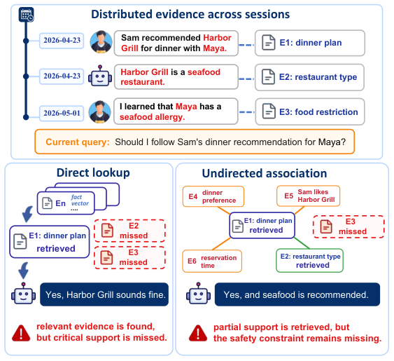
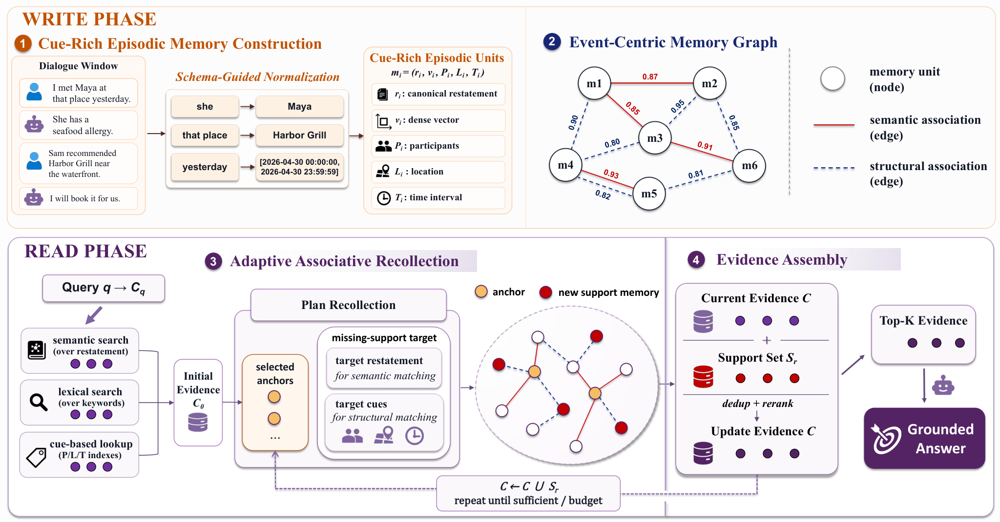
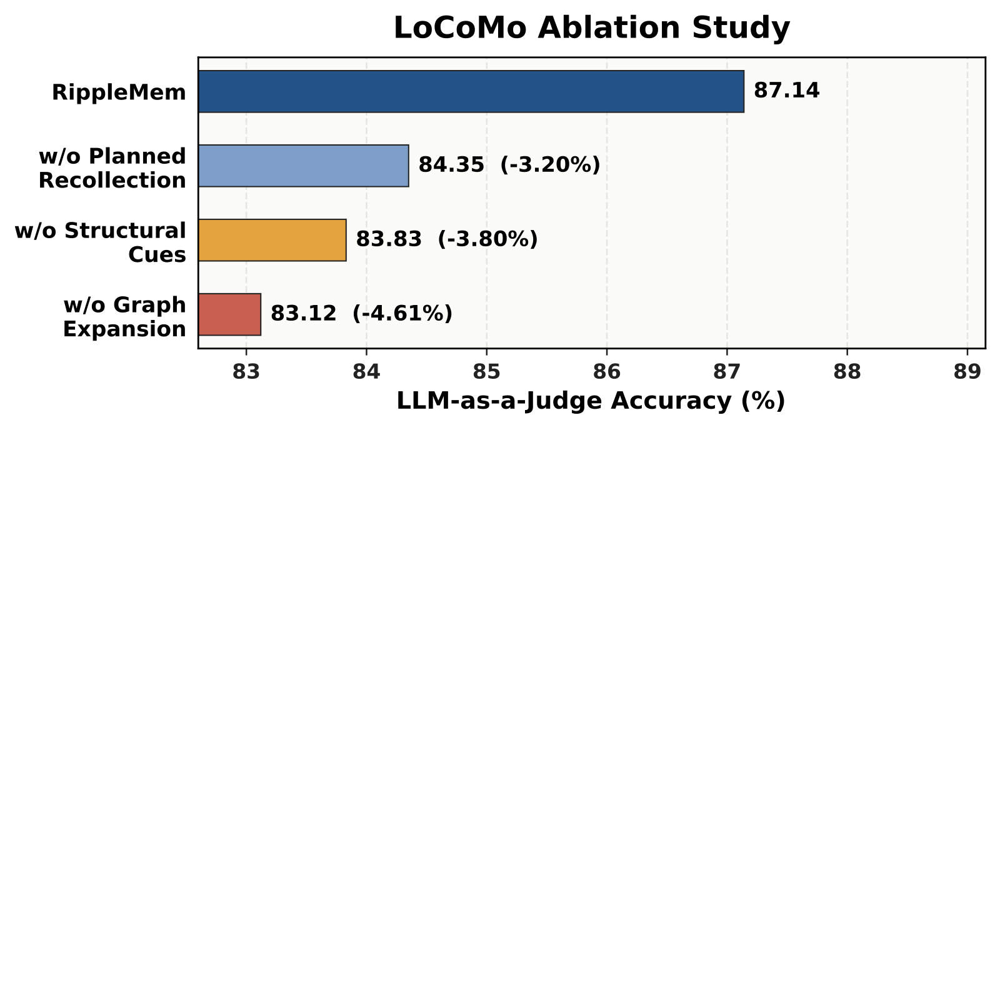
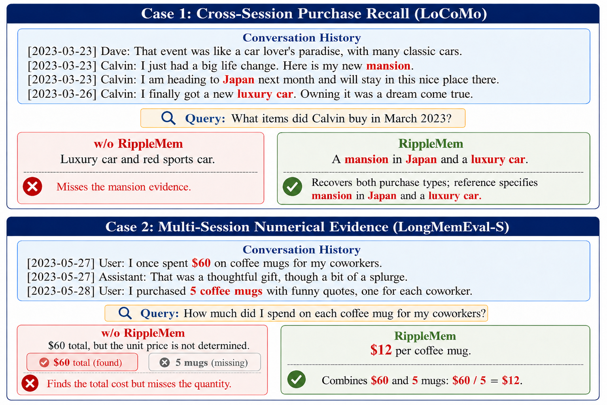

# RippleMem: From Isolated Retrieval to Associative Recollection for Long-Term Agent Memory

## RippleMem：从孤立检索到联想回忆的长期智能体记忆

> **论文元信息**
> - **arXiv**：[2608.13334](https://arxiv.org/abs/2608.13334)（v1；arXiv 编号 2608 对应 2026 年 8 月提交）
> - **发表**：预印本（未见正式会议/期刊标注）
> - **分类**：原文 HTML 未显式标注分类；按主题推断为 cs.CL / cs.AI / cs.MA
> - **作者**：Jingbo Ji、Lingyi Li、Xilong Cheng、Yuhao Zhou、Wenji Zhang、Yuting Tan、Yunxiao Qin†（通讯作者）；单位：中国传媒大学（Communication University of China），北京；媒体融合与传播国家重点实验室
> - **方法名**：**RippleMem**（从孤立检索到联想回忆的长期记忆系统）
> - **复现地址**：论文页头未提供公开代码仓库；官方 HTML 见 https://arxiv.org/html/2608.13334v1

> **翻译说明**
> - 本译文基于 arXiv 官方 HTML 全文（`https://arxiv.org/html/2608.13334v1`）逐段翻译，覆盖：**摘要 + 第 1–5 节 + 局限性 + 致谢 + 参考文献（保留编号不译条目）+ 附录 A–E 全量**；数值全部取自已剥离标签的正文 `text2.txt`，未凭印象增补。
> - **插图**：共 **4 张图**（Figure 1–4），已从 HTML 下载到本地 `../images/RippleMem/`，使用相对路径引用、离线可读，每张图上方保留 `<!-- 原图：URL -->` 注释。Algorithm 1 与 Algorithm 2 为算法块（非图），按约定以代码块逐行译出，不引用图片、不写图注三件套。
> - **表格**：共 **14 张表**（Table 1–14），数值全量照抄，表题单独成行、表下脚注译出。
> - 公式统一按 LaTeX 重排（数学环境外不出现裸反斜杠命令）；术语首次出现时保留英文原文。

---

## 摘要

基于 LLM 的智能体（LLM-based agents）越来越依赖外部记忆来支持长时程推理与交互。然而，主要瓶颈并不只是存储过往经验，而是在相关信息分散于多次交互时，找回正确的一组证据。现有方法在这种「访问」问题上表现吃力：全上下文（full-context）方法需要做嘈杂的长上下文搜索；扁平检索（flat retrieval）常常只返回孤立且不完整的记录；而基于图的记忆系统构建代价高昂，同时还会压缩丰富的事件上下文。我们提出 **RippleMem**，一个长期记忆系统，用「自适应的联想回忆（adaptive associative recollection）」取代一次性检索。受「线索依赖的情景回忆（cue-dependent episodic retrieval）」与「联想补全（associative completion）」启发，RippleMem 把交互历史存储为「线索丰富的情景记忆单元（cue-rich episodic memory units）」，并在「以事件为中心的记忆图（event-centric memory graph）」中组织它们。给定查询，它先通过混合线索回忆相关的记忆锚点（memory anchors），再沿语义与结构关联从这些锚点扩展，以找回缺失的支撑证据。这样，最初被回忆起的记忆不仅充当答案上下文，也成为「补全作答所需证据」的线索。在 LoCoMo 与 LongMemEval-S 上的实验表明，RippleMem 在各评估设置下均取得最佳总体表现：在 LoCoMo 上把 LLM-as-a-Judge 准确率提升 3.95%，在 LongMemEval-S 上最高提升 11.87%，同时将图构建开销降低约 30×。

---

## 1. 引言

大语言模型（LLM）正越来越多地被部署为需要在长时程上进行推理、规划与交互的智能体（Park et al., 2023；Shinn et al., 2023；Yao et al., 2023）。在此类场景下，记忆不再只是辅助组件，而成为愈发关键的能力：智能体常常需要保留过往交互中的有用信息，并在后续查询依赖早期事件、偏好或决策时将其作为证据找回（Hatalis et al., 2024；Zhang et al., 2025）。然而，在长时程交互中，回答一个查询所需的信息往往并不存在于单轮历史话语或单条记忆记录中。它可能被分散在时隔遥远的多个会话里，与日常对话混杂，并且只有把多个片段一起找回时才能发挥作用。因此，长期记忆的核心挑战不只是「存储过往经验」，而是「从分散的痕迹中回忆出一组可作答的证据」。

近期的长期记忆系统因而探索了各种方式，使存储的交互历史在查询时更易被访问。一些系统把过往交互存为紧凑的记忆记录，并用语义或查询感知机制检索，从而支持在长历史上高效个性化（Zhong et al., 2024；Chhikara et al., 2025；Liu et al., 2026）。记忆操作系统与基于生命周期的框架进一步随时间维护、更新并重组记忆，为长时程访问提供更稳定的基底（Li et al., 2025；Hu et al., 2026a）。另一条互补路线引入显式结构或关联，借助图、时间链接或回忆式检索，让记忆访问超越独立的记录查找（Xu et al., 2025b；Rasmussen et al., 2025；Zhang et al., 2026）。

尽管有这些进展，记忆访问仍可能拼不出一组可作答的证据。以查询为中心的扁平查找可能停在最直接匹配的那条记录上，而在没有显式证据需求的情况下做图扩展，又可能遍历到邻近但并无支撑作用的记忆。此时，系统会漏掉那些「已存储却未与最初浮现的记忆一起被找回」的支撑证据。

<!-- 原图：https://arxiv.org/html/2608.13334v1/motivation.png -->


> **图 1（原文 Figure 1）**：Failure modes in long-term memory access. Answer-critical evidence may be stored across sessions, while direct lookup or undirected association can still fail to assemble the missing support needed for an appropriate answer.
> （长期记忆访问的失败模式。答题关键证据可能分散存储在多个会话中，而直接查找或无导向的联想仍可能拼不齐作答所需的缺失支撑。）

这类失败引出一个核心问题：当一条最初检索到的记忆相关却不完整时，记忆访问应如何继续找回作答所需的缺失支撑？如图 1 所示，该查询不仅需要一个「晚餐计划」记忆，还需要分别存储的关于客人饮食禁忌与餐厅类型的证据。直接查找可能过早停止，而无导向的关联可能浮现相关痕迹，却无法保证缺失的证据角色被填满。受此观察启发，我们认为长期记忆访问应当是「以证据为条件（evidence-conditioned）」的：被回忆起的记忆应作为找回缺失支撑的线索，而不是检索的终点。

为把这一想法落到实处，我们提出 **RippleMem**，一个把记忆访问视为「自适应联想回忆（adaptive associative recollection）」的长期记忆系统。其命名体现了核心机制：如同水波从初始接触点扩散，RippleMem 从最初回忆起的记忆出发，沿相连的情景记忆做局部扩展，以找回缺失证据。该设计受认知科学中「把经验组织为类事件单元」（Zacks et al., 2007；Baldassano et al., 2017）以及「把回忆视为线索依赖且联想性的」（Tulving and Thomson, 1973；Norman and O'Reilly, 2003）等观点启发。我们仅把这些观点当作设计直觉，而非机制性论断。RippleMem 通过「写入—读取」设计将其落地：写入阶段把交互历史存为线索丰富的情景记忆单元，并用语义与结构关联相连；读取阶段则把最初回忆起的记忆用作找回额外支撑的线索。这让记忆访问超越了「一次性查询匹配」与「无导向的图遍历」，走向「在已存储事件记忆上的证据补全」。

综上，我们的贡献如下：

- 我们把长期记忆访问建模为一个「证据找回（evidence recovery）」问题：相关历史可能已被存储，但当支撑分散在多次交互中时，仍可能无法被回忆为一组可作答的证据。这一视角凸显了「一次性查询—记忆匹配」的局限。
- 我们提出 RippleMem，一个以事件为中心的长期记忆系统，将「线索丰富的情景记忆构建」与「锚点局部的联想回忆」相结合。其关键设计让被回忆起的记忆既作为答案上下文，又通过语义与结构关联充当找回缺失支撑的线索。
- 我们表明 RippleMem 在 LoCoMo 与 LongMemEval-S 上取得最佳总体表现，相对最强基线，在 LoCoMo 上把 LLM-as-a-Judge 准确率提升 3.95%，在 LongMemEval-S 上最高提升 11.87%；同时相比基于图的记忆基线，把图构建开销降低约 30×。

## 2. 相关工作

### 2.1 LLM 智能体的记忆机制

#### 长上下文与检索增强记忆。

大语言模型受限于有限的上下文窗口，近期工作通过扩展上下文建模与长上下文提示来改进长上下文处理（Dai et al., 2019；Bai et al., 2024；Beltagy et al., 2020）。然而，更长的上下文并不保证可靠的记忆访问，因为模型仍易受热证退化与「中间迷失（lost-in-the-middle）」效应的影响（Liu et al., 2024）。检索增强生成（RAG）通过文档或分块检索把记忆外化（Lewis et al., 2021；Gao et al., 2024；Fan et al., 2024），但其效果取决于检索器能否浮现那些可能分散在轮次、会话与时间中的证据（Yu et al., 2024；Sorodoc et al., 2025）。基于图的 RAG 进一步把外部知识组织为关系化访问，包括 HyperGraphRAG 的 n 元超图表示、PathRAG 的关系路径剪枝，以及 G-reasoner 基于图基础模型的推理（Edge et al., 2025；Luo et al., 2025；Chen et al., 2026；Luo et al., 2026）。这条路线主要面向文档或知识为中心的图，而 RippleMem 研究的是在演化中的情景交互记忆上的证据找回。

#### 长期记忆系统。

大量工作通过把交互历史转化为可检索的记忆条目，为 LLM 智能体构建长期记忆（Lee et al., 2024；Tan et al., 2025b）。MemGPT（Packer et al., 2024）把记忆视为虚拟上下文空间，通过记忆分页管理信息。MemoryBank（Zhong et al., 2024）跨交互存储用户特定信息，而 Mem0（Chhikara et al., 2025）强调为下游检索抽取简洁的长期记忆。SimpleMem（Liu et al., 2026）进一步通过语义压缩、结构化索引与查询感知的检索规划提升记忆质量。近期系统也用显式结构组织记忆。MemTree（Rezazadeh et al., 2025）通过分层记忆组织支持「由粗到细」的访问。MemOS 与 EverMemOS 等记忆操作系统（Li et al., 2025；Hu et al., 2026a）把记忆当作系统级资源来管理。基于图的架构如 A-MEM（Xu et al., 2025b）与 Zep（Rasmussen et al., 2025）通过结构化关联或时间知识图谱关系连接记忆。尽管这些方法为持久记忆提供了实用的基底，但当最初检索到的证据相关却不完整时，记忆访问应如何继续下去，这一问题仍悬而未决。

### 2.2 情景与联想式记忆访问

#### 情景回忆的认知视角。

人类情景记忆（episodic memory）为长期智能体记忆提供了一面透镜。情景记忆关乎特定事件的体验及其上下文细节（Tulving, 1972）。事件分割（event segmentation）观点认为，连续经验被组织为离散的类事件单元，从而支持后续的理解与回忆（Zacks et al., 2007；Baldassano et al., 2017）。回忆还依赖于把条目信息与时间、地点、周边上下文等上下文特征相绑定（Davachi, 2006；Yonelinas et al., 2019）。编码特异性原则（encoding specificity principle）认为，当当前线索与最初体验编码时的信息重叠时，检索才会成功（Tulving and Thomson, 1973）。超越直接线索匹配，海马体索引（hippocampal indexing）与模式补全（pattern-completion）观点认为，部分线索可以重新激活相关痕迹并找回额外信息（Norman and O'Reilly, 2003）。RippleMem 并不以机制方式模拟人类记忆，而是采纳这些思想，作为「事件级记忆构建、线索丰富的上下文绑定、联想式回忆」的设计直觉。

#### 记忆系统中的联想式访问。

近期的记忆系统探索了超越一次性匹配的结构化访问。M-Flow（FlowElement AI, 2026）把记忆组织为锥形多粒度图，并通过图路由的路径传播对事件束打分。MemGAS（Xu et al., 2025a）构建多粒度记忆表示，并从中选择用于上下文构建。REMem（Shu et al., 2026）在混合图中组织时间感知的要点（gist）与时间限定事实，并用智能体检索器做迭代证据收集。RF-Mem（Zhang et al., 2026）提出检索侧的「熟悉度—回忆（familiarity–recollection）」机制，在直接检索与回忆式扩展之间自适应切换。这些工作表明，长期记忆访问受益于结构、关联与自适应检索。RippleMem 与这条路线互补，聚焦于「检索过程中已经找回的证据如何充当线索，去发现额外的支撑记忆」。

## 3. 方法

RippleMem 是一个从交互历史中找回「答案支撑证据」的长期记忆框架。它先构建以事件为中心的记忆基底，再利用该基底在推理时执行自适应联想回忆。

### 3.1 总览

图 2 展示了 RippleMem 的整体架构，围绕「写入—读取」设计组织。

**写入阶段（Write Phase）**。写入阶段为后续回忆构建记忆基底。「线索丰富的情景记忆构建（Cue-Rich Episodic Memory Construction）」把对话历史转换为带有语义表示与情景线索、可独立理解的事件记忆；「以事件为中心的记忆图（Event-Centric Memory Graph）」则通过语义与结构关联把这些记忆连接起来。二者共同把原始交互历史转化为连通的事件记忆空间。

**读取阶段（Read Phase）**。读取阶段利用该事件记忆空间为查询找回证据。「自适应联想回忆（Adaptive Associative Recollection）」先回忆候选证据，再在需要时沿显著被回忆记忆的局部关联扩展，以找回缺失支撑。「证据整合（Evidence Assembly）」把得到的记忆汇总为紧凑的证据上下文，用于有依据的回答生成。

总体而言，RippleMem 把记忆访问视为「受控的证据补全」而非一次性检索，被回忆起的记忆既作为候选证据，又作为找回额外支撑的线索。

<!-- 原图：https://arxiv.org/html/2608.13334v1/method.png -->


> **图 2（原文 Figure 2）**：Illustration of the RippleMem framework, including cue-rich episodic memory construction, event-centric memory graph construction, adaptive associative recollection, and evidence assembly. In recollection, anchors define where to expand, while the missing-support target guides what support to recover.
> （RippleMem 框架示意图，包括线索丰富的情景记忆构建、以事件为中心的记忆图构建、自适应联想回忆与证据整合。在回忆阶段，锚点决定向何处扩展，而缺失支撑目标引导应找回哪些支撑。）

### 3.2 线索丰富的情景记忆构建

如图 2 的写入阶段所示，RippleMem 受事件分割观点启发（Zacks et al., 2007；Baldassano et al., 2017），把交互历史转换为线索丰富的情景记忆单元。给定一个对话轨迹，我们将其处理为带有局部重叠的连续「轮次级窗口」$\{W_t\}$，以保留窗口边界处的连续性。每个窗口被送入一个「模式引导的 LLM 抽取器（schema-guided LLM extractor）」，返回一份记忆单元 JSON 列表；当窗口中没有任何值得存储的持久事件、偏好、承诺、观察或计划时，也可能返回空列表。抽取结果在写入记忆库前，会对照记忆模式（schema）做校验。

每个记忆单元遵循一个固定的模式：

$m_{i}=(r_{i},\mathbf{v}_{i},P_{i},L_{i},T_{i}),$ | (1)

其中 $r_i$ 是可独立于原对话窗口理解的规范化事件重述（canonicalized event restatement），$\mathbf{v}_i$ 是 $r_i$ 的稠密表示，而 $P_i$、$L_i$、$T_i$ 分别表示（在可用时）被锚定的参与者（participants）、地点（locations）与时间线索或区间（temporal cues）。

为保留情景回忆中至关重要的上下文绑定（Davachi, 2006；Yonelinas et al., 2019），结构化线索字段保留了「谁、在哪里、何时」的信息，供后续基于线索的访问与关联使用。抽取器被指示把说话者相关的指称解析为显式的参与者姓名；仅当对话时间戳支持时，才把相对时间表达锚定为绝对区间；并把含多事件的窗口拆分为可独立检索的记忆单元。若参与者、地点或时间表达无法被锚定，则对应字段留空而非推断。

稠密向量 $\mathbf{v}_i$ 支持语义访问，而 $(P_i,L_i,T_i)$ 暴露出可在结构化与跨线索关联中发挥作用的情景线索。因此，写入阶段不只是把对话压缩为更短的摘要；它构建的是「可被线索寻址（cue-addressable）的事件记忆」，旨在支持联想式回忆。

### 3.3 以事件为中心的记忆图

记忆构建完成后，RippleMem 把记忆库组织为一个稀疏的带权事件图 $G=(\mathcal{M},\mathcal{E})$。如图 2 所示，每个节点是一个记忆单元，而 $\mathcal{E}=\mathcal{E}_{\mathrm{sem}}\cup\mathcal{E}_{\mathrm{str}}$ 包含关联打分后保留的类型化连边。每条被保留的边都带着对应的关联分数作为边权，并充当两个记忆单元之间潜在的回忆路径。

#### 语义关联。

语义关联（semantic association）捕捉记忆重述在「意义层面」的邻近度。由于每个记忆单元都有稠密表示 $\mathbf{v}_i$，RippleMem 计算

$s_{\mathrm{sem}}(i,j)=\cos(\mathbf{v}_{i},\mathbf{v}_{j}).$ | (2)

该通道保留图中的概念连续性，使被回忆起的事件能在回忆时引出语义相关的记忆。

#### 结构关联。

结构关联（structural association）捕捉共享的、被锚定的情景线索。对一对记忆单元，RippleMem 计算线索相似度向量 $\mathbf{u}_{ij}=[u^{P}_{ij},u^{L}_{ij},u^{T}_{ij}]$。其中 $u^{P}_{ij}$ 与 $u^{L}_{ij}$ 是基于规范化参与者与地点字段的 Jaccard 重叠。对于时间线索，RippleMem 给重叠或邻近的区间赋予更高的兼容性：

$u^{T}_{ij}=\begin{cases}1,&T_{i}\cap T_{j}\neq\emptyset,\\ \exp(-\Delta(T_{i},T_{j})/\tau),&\text{otherwise},\end{cases}$ | (3)

其中 $\Delta(T_{i},T_{j})$ 是两个不重叠区间之间的间隔，$\tau$ 是固定的时间衰减尺度。

RippleMem 把线索级相似度聚合为「在可比较线索类型上的结构兼容性分数」：

$s_{\mathrm{str}}(i,j)=\frac{\sum_{x\in\{P,L,T\}}\beta_{x}\mathbb{I}_{x}u^{x}_{ij}}{\sum_{x\in\{P,L,T\}}\beta_{x}\mathbb{I}_{x}},$ | (4)

其中 $\mathbb{I}_{x}$ 表示线索类型 $x$ 是否对两个记忆单元都「存在且可比较」，$\beta_{x}$ 表示固定的线索权重。没有任何可比较线索类型的单元对不会被赋予结构分数。

#### 稀疏图构建。

图构建是增量式且稀疏的。当插入一个新记忆单元时，RippleMem 从语义近邻搜索以及基于参与者、地点、时间的线索索引中获得一个「有界的候选池」，再通过两个关联通道对其打分。语义连边从 $s_{\mathrm{sem}}$ 超过分数阈值的候选中保留，最多 $K_{\mathrm{sem}}$ 条；结构连边类似地用 $s_{\mathrm{str}}$ 保留，最多 $K_{\mathrm{str}}$ 条。一对记忆单元可能通过任一通道或同时通过两个通道相连。在锚点局部回忆时，两个类型化通道可被分别遍历再合并，从而让系统找回「因意义、因被锚定的情景线索、或两者兼具」而相关的记忆单元。

### 3.4 自适应联想回忆

#### 混合初始回忆。

如图 2 的读取阶段所示，RippleMem 从查询 $q$ 中抽取检索线索 $c_q$ 开始回忆，线索包括语义、词汇与被锚定的情景线索。与检索的编码特异性观点一致（Tulving and Thomson, 1973），这些线索实例化了三种互补的回忆视图：

$C_{0}=C_{\mathrm{sem}}\cup C_{\mathrm{lex}}\cup C_{\mathrm{cue}},$ | (5)

其中 $C_{\mathrm{sem}}$、$C_{\mathrm{lex}}$、$C_{\mathrm{cue}}$ 分别通过语义搜索、词汇匹配与结构化线索匹配获得。我们把当前证据状态初始化为 $C\leftarrow C_{0}$，并在每轮回忆后更新它。

#### 记忆锚点规划。

给定当前证据状态 $C$，RippleMem 调用一个模式受限的回忆控制器 $\Pi_{\mathrm{rec}}$：

$(d_{r},A_{r},g_{r},s_{r})=\Pi_{\mathrm{rec}}(q,c_{q},C).$ | (6)

其输出指明是否继续（$d_{r}$）、所选锚点（$A_{r}\subseteq C$）、缺失支撑目标（$g_{r}$）以及可选的停止原因（$s_{r}$）。给定当前证据状态 $C$，控制器判断是否还需要进一步回忆。如果需要，它选择在查询中居于中心、或可能通过图关联唤起缺失支撑的记忆作为锚点，并用一个目标重述（target restatement）与可选的结构化线索定义 $g_{r}$。

#### 锚点局部扩展。

给定有效计划，RippleMem 仅从所选锚点在一个有界的图邻域内扩展：

$U_{r}=\{m\in\mathcal{M}\setminus C\mid d_{G}(m,A_{r})\leq h\}.$ | (7)

这里 $d_{G}$ 是在「由语义边与结构边诱导出的并集图」上计算的，而后续的选择保留通道特异的来源（provenance）。扩展沿两个图通道进行。对每个所选锚点，RippleMem 收集在 $h$ 跳内、经语义边与结构边可达的候选，排除已在 $C$ 中的记忆。然后候选针对缺失支撑目标打分：目标重述用于语义匹配，目标线索用于结构匹配。两个通道中得分最高的候选按记忆身份（memory identity）合并，形成轮次级支撑集 $S_{r}$。

证据状态更新为 $C\leftarrow C\cup S_{r}$。当候选的目标匹配分数相近时，RippleMem 偏好「离锚点更近、且经更强带权路径相连」的候选。这一循环持续到证据充足、没有新支撑被找回、或达到轮次预算为止，如算法 1 所总结。

> **算法 1：自适应联想回忆（Adaptive associative recollection）**
> **输入**：查询 $q$，查询线索 $c_q$，记忆图 $G$
> **输入**：初始证据 $C_0$，跳数上限 $h$，轮次预算 $R$
> **输出**：证据状态 $C$

```
 1: C ← C_0
 2: for r = 1 to R do
 3:     (d_r, A_r, g_r, s_r) ← Π_rec(q, c_q, C)
 4:     if d_r = STOP or A_r = ∅ then break
 5:     U_r ← LocalNeighbors(G, A_r, h) 差集 C
 6:     S_r ← SelectSupport(U_r, g_r, A_r)
 7:     if S_r = ∅ then break
 8:     C ← C ∪ S_r
 9: end for
10: return C
```

### 3.5 证据整合

#### 证据合并。

如图 2 的证据整合组件所示，RippleMem 把最终证据状态 $C$ 转换为一个受预算约束的证据上下文，用于回答生成。它先按记忆单元身份合并记忆。如果同一记忆单元通过多个回忆视图、锚点或锚点局部扩展路径到达，RippleMem 保留单份副本并合并其来源信息，得到合并后的记忆集 $\bar{C}$。

RippleMem 随后对 $\bar{C}$ 施加一个确定性的「来源感知排序（source-aware ordering）」：

$\rho(m)=\lambda_{q}a(q,m)+\lambda_{p}\pi(m)+\lambda_{a}\mathbb{I}_{\mathrm{anc}}(m),$ | (8)

其中 $a(q,m)$ 是查询与记忆重述之间的归一化语义对齐度，$\pi(m)$ 汇总检索来源排名、来源分数与扩展路径支撑，$\mathbb{I}_{\mathrm{anc}}(m)$ 指示 $m$ 是否充当过记忆锚点。所有权重在评估前固定；具体实例化见附录 A.5。

最终证据上下文 $E_{K}$ 由该排序下排名前 $K$ 的记忆单元组成，其中 $K$ 是在评估前固定、且在各基准间保持不变的记忆数量预算。答案生成器接收原始查询与 $E_{K}$，并基于组装好的记忆生成最终回答。

## 4. 实验

我们通过主基准对比、消融研究与分阶段效率分析来评估 RippleMem。详细的数据集统计、实现设置与定性案例见附录。

### 4.1 实验设置

#### 数据集。

我们在 LoCoMo（Maharana et al., 2024）与 LongMemEval-S（Wu et al., 2025）上评估 RippleMem，这两个长期对话记忆基准覆盖了超长对话与全历史用户—智能体交互（He et al., 2025；Tan et al., 2025a；Wang and Zhao, 2024；Chu et al., 2024）。详细的数据集统计与问题类别见附录 A.1。我们还在 EverMemBench（Hu et al., 2026b）上评估，该基准是动态的多方、多组对话记忆基准，完整协议与结果见附录 B.2。

**表 1：LoCoMo 主实验结果**

| Method | Multi-Hop |   |   | Temporal |   |   | Open Domain |   |   | Single Hop |   |   | Average |   |   |
| --- | --- | --- | --- | --- | --- | --- | --- | --- | --- | --- | --- | --- | --- | --- | --- |
| Method | F1 $\uparrow$ | B1 $\uparrow$ | J $\uparrow$ | F1 $\uparrow$ | B1 $\uparrow$ | J $\uparrow$ | F1 $\uparrow$ | B1 $\uparrow$ | J $\uparrow$ | F1 $\uparrow$ | B1 $\uparrow$ | J $\uparrow$ | F1 $\uparrow$ | B1 $\uparrow$ | J $\uparrow$ |
| Full-Context | 32.06 | 23.63 | 61.70 | 44.39 | 33.23 | 50.78 | 21.60 | 17.88 | 53.13 | 50.72 | 44.88 | 81.57 | 44.17 | 36.83 | 69.74 |
| Mem0 | 32.42 | 24.70 | 62.06 | 47.91 | 42.03 | 64.49 | 20.20 | 15.56 | 53.13 | 39.31 | 34.70 | 62.54 | 38.65 | 33.20 | 62.27 |
| Mem0g | 34.43 | 25.91 | 68.44 | 51.41 | 44.47 | 64.80 | 22.68 | 16.93 | 57.29 | 41.84 | 36.81 | 66.59 | 41.28 | 35.17 | 65.97 |
| Zep | 30.64 | 22.89 | 66.31 | 49.05 | 37.97 | 70.72 | 22.55 | 18.60 | 60.42 | 49.08 | 42.87 | 84.30 | 43.98 | 36.68 | 76.69 |
| MemGAS | 16.70 | 13.09 | 64.89 | 15.63 | 10.01 | 48.91 | 12.15 | 9.04 | 56.25 | 23.10 | 13.92 | 71.58 | 19.69 | 12.65 | 64.68 |
| M-Flow | 33.76 | 26.39 | 72.34 | 42.83 | 36.31 | 61.68 | 15.51 | 12.10 | 61.46 | 40.48 | 31.69 | 83.74 | 38.18 | 30.46 | 75.67 |
| REMem | 26.28 | 20.09 | 71.99 | 35.77 | 24.63 | 82.55 | 23.69 | 19.60 | 61.46 | 37.54 | 28.45 | 83.47 | 34.24 | 25.57 | 79.81 |
| SimpleMem | 37.12 | 29.98 | **78.01** | 56.92 | 42.77 | 76.01 | 24.75 | 19.77 | 63.54 | 55.45 | 49.21 | 89.42 | 50.48 | 42.51 | 82.92 |
| RF-Mem† | 37.04 | 29.00 | 75.89 | 59.62 | 45.15 | 80.69 | **26.54** | **21.87** | 68.75 | 54.14 | 48.00 | 89.42 | 50.43 | 42.30 | 83.83 |
| RippleMem | **38.58** | **31.12** | 77.67 | **62.37** | **47.29** | **85.67** | 25.71 | 20.93 | **70.83** | **56.44** | **49.79** | **92.75** | **52.49** | **44.05** | **87.14** |

> 注：LoCoMo 主结果。报告 F1、BLEU-1（B1）与 LLM-as-a-Judge 准确率（J）。RF-Mem† 使用 RippleMem 抽取的记忆单元，并匹配每问证据预算。加粗为各项最佳结果。

#### 基线。

我们把 RippleMem 与代表性的长上下文与记忆增强基线比较。在 LoCoMo 上，我们纳入 Full-Context、Mem0 与 Mem0 g（Chhikara et al., 2025）、Zep（Rasmussen et al., 2025）、MemGAS（Xu et al., 2025a）、M-Flow（FlowElement AI, 2026）、REMem（Shu et al., 2026）、SimpleMem（Liu et al., 2026）与 RF-Mem（Zhang et al., 2026）。在 LongMemEval-S 上，我们额外与已报道的 LightMem（Fang et al., 2026）、MemU（NevaMind AI, 2025）、MemOS（Li et al., 2025）与 EverMemOS（Hu et al., 2026a）结果比较。基线超参数遵循原论文、公开实现或官方建议（若可用）；简要说明见附录 A.2。

#### 指标。

对 LoCoMo，我们报告 F1、BLEU-1 与 LLM-as-a-Judge 准确率。F1 与 BLEU-1 衡量与参考答案的词面重叠，而 Judge 分数评估超出精确表层匹配的语义正确性。对 LongMemEval-S，我们按其对准确率风格评估协议，报告二元的 LLM-as-a-Judge 准确率。附录 A.3 与 A.4 提供指标聚合与 Judge 细节。

#### 实现细节。

除非另有说明，GPT-4.1-mini 是记忆抽取、查询分析、回忆规划与答案生成的骨干 LLM，所有解码温度设为 0。对 LoCoMo，GPT-4.1-mini 同时充当 Judge，Qwen3-Embedding-0.6B 作为稠密编码器。对 LongMemEval-S，我们遵循两个与先验对齐的设置：SimpleMem 对齐使用 GPT-4.1-mini 作 Judge、Qwen3-Embedding-0.6B 作编码器；EverMemOS 对齐使用 GPT-4o-mini 作 Judge、Qwen3-Embedding-4B 作编码器，并取相应先验工作中的基线结果。

RippleMem 对记忆构建、首跳回忆、图扩展与证据整合使用固定的、基准特定的预算，见附录 A.5。对 RF-Mem，我们使用 RippleMem 抽取的记忆单元，并匹配 RippleMem 的每问证据预算，以隔离记忆访问策略的影响。

**表 2：LongMemEval-S 主实验结果**

| Setting | Method | SS-User | Multi-S | SS-Pref | Temp. Reas | Know. Upd | SS-Asst | Overall |
| --- | --- | --- | --- | --- | --- | --- | --- | --- |
| SimpleMem setting | Full-Context | 47.14 | 30.08 | 60.00 | 27.06 | 41.03 | 32.14 | 35.40 |
| SimpleMem setting | Mem0 | 87.14 | 50.37 | 63.33 | 40.60 | 69.23 | 48.21 | 58.40 |
| SimpleMem setting | LightMem | 88.57 | 47.37 | 76.67 | **85.71** | **92.30** | 21.43 | 69.20 |
| SimpleMem setting | SimpleMem | 85.71 | 60.92 | 76.67 | 83.46 | 79.48 | 75.00 | 75.80 |
| SimpleMem setting | RippleMem | **97.14** | **78.20** | **96.67** | 76.70 | 91.03 | **89.29** | **84.80** |
| EverMemOS setting | MemU | 67.14 | 42.10 | 77.67 | 17.29 | 41.02 | 19.64 | 38.40 |
| EverMemOS setting | Zep | 92.90 | 47.40 | 53.30 | 54.10 | 74.40 | 75.00 | 63.80 |
| EverMemOS setting | Mem0 | 82.86 | 63.15 | 90.00 | 72.18 | 66.67 | 26.78 | 66.40 |
| EverMemOS setting | MemOS | 95.71 | 70.67 | **96.67** | 77.44 | 74.26 | 67.86 | 77.80 |
| EverMemOS setting | EverMemOS | **97.14** | 73.68 | 93.33 | 77.44 | **89.74** | 85.71 | 83.00 |
| EverMemOS setting | RippleMem | 95.71 | **80.45** | 83.33 | **84.21** | 88.46 | **94.64** | **86.60** |

> 注：LongMemEval-S 主结果，报告 LLM-as-a-Judge 准确率（%）。SS 表示单会话；Asst 与 Pref 分别表示助手与偏好；Multi-S 表示多方会话；Know. Upd 与 Temp. Reas 分别表示知识更新与时间推理问题。每组内加粗为最佳结果。

### 4.2 主结果

表 1 与表 2 总结了 LoCoMo 与 LongMemEval-S 的主结果。我们强调三点关键观察。

#### 跨基准的一致总体增益。

RippleMem 在两个基准上都取得最佳总体表现。在 LoCoMo 上，它获得 52.49% F1、44.05% BLEU-1 与 87.14% LLM-as-a-Judge 准确率。相对各指标上的最强基线，RippleMem 相对 SimpleMem 把 F1 与 BLEU-1 分别提升 3.98% 与 3.62%，相对 RF-Mem 把 Judge 准确率提升 3.95%。在 LongMemEval-S 上，RippleMem 在两个对比组中均取得最佳总体准确率，在 SimpleMem 评估设置下达 84.80%，在 EverMemOS 评估设置下达 86.60%。这些结果显示 RippleMem 在「对话级」与「全历史」两类长期记忆评估设置下都带来稳定增益。

#### 在证据分散问题上的更大增益。

在需要连接分散记忆的问题类型上，提升尤为明显。在 LoCoMo 的时间类问题上，RippleMem 相对 SimpleMem 提升 5.45 个 F1 点与 9.66 个 Judge 准确率点。在开放域问题上，RippleMem 取得最高 Judge 准确率，相对 RF-Mem 从 68.75 提升到 70.83，尽管 RF-Mem 的词面重叠更高。LongMemEval-S 在两个对比组中也呈现类似模式：RippleMem 在多方会话推理上相对 SimpleMem（78.20 vs. 60.92）与相对 EverMemOS（80.45 vs. 73.68）都有提升，并在答案往往依赖厘清事件顺序或变化的用户状态时的时间类与知识更新类问题上保持竞争力。这一模式与 RippleMem 的设计一致，因为从被回忆起的锚点扩展有助于找回那些未被原查询直接匹配到的支撑记忆。

#### 有依据的回忆至关重要。

关联式与回忆式的基线提供了有竞争力的记忆访问信号。RF-Mem 在匹配记忆单元与证据预算下取得 LoCoMo 上最强的基线 Judge 分数，而 REMem、MemGAS 与 M-Flow 分别引入了智能体式、多粒度或图路由的检索。尽管如此，RippleMem 仍取得最佳总体 Judge 准确率，并在时间、开放域与单跳类别上取得最强结果。这表明增益并非仅仅来自「增加关联或迭代检索」，而是来自「把回忆锚定在已存储的事件记忆中，并用已回忆起的证据找回额外支撑」。附录 B.6 进一步在对抗性的「无支撑」问题上评估了这一行为——即对话中并不提供有效支撑证据的情形。

### 4.3 消融研究

<!-- 原图：https://arxiv.org/html/2608.13334v1/ablation_locomo.svg -->


> **图 3（原文 Figure 3）**：Ablation results on LoCoMo using LLM-as-a-Judge accuracy. Values in parentheses denote relative decreases compared with the full RippleMem model.
> （基于 LLM-as-a-Judge 准确率的 LoCoMo 消融结果。括号内数值表示相对完整 RippleMem 模型的相对下降幅度。）

我们在 LoCoMo 上做消融，以分离结构线索、锚点局部图扩展与有计划的回忆各自的贡献。骨干模型、记忆抽取与答案生成保持不变；只变动对应的记忆访问组件。含 F1、BLEU-1 与 Judge 准确率的完整消融结果见附录 B.3。关于边构建机制的独立受控替换研究见附录 B.4。

图 3 显示，移除图扩展造成 Judge 准确率最大降幅，从 87.14 降至 83.12，说明首跳回忆常常漏掉支撑证据。移除结构线索把准确率降至 83.83，尤其当相关记忆用词不同却共享参与者、地点或时间线索时。有计划的回忆也有帮助：即便使用相同的扩展预算，去掉它准确率也会降到 84.35。

### 4.4 分阶段效率分析

**表 3：LoCoMo 分阶段开销对比**

| Method | Build (s) $\downarrow$ | Build Tok. $\downarrow$ | Ans. Ctx. $\downarrow$ | J $\uparrow$ |
| --- | --- | --- | --- | --- |
| Mem0g | 3623.63 | 4,243,278 | **628.17** | 65.97 |
| Zep | 3532.03 | 6,037,130 | 1,629.50 | 76.69 |
| RippleMem | **117.51** | **87,097** | 1,471.93 | **87.14** |

> 注：LoCoMo 分阶段开销对比。构建时间与构建 token 按每段对话平均；答案上下文 token 按每问平均。J 表示总体 LLM-as-a-Judge 准确率。

表 3 把效率拆解为离线的记忆构建与作答时的证据上下文。相比 Mem0 g 与 Zep，RippleMem 把构建时间降低约 30×，把构建阶段 token 降低 48.7–69.3×。同时，它保持了相对紧凑的平均作答上下文预算（每问 1,471.93 个 token），并取得最强的总体 Judge 准确率。这些结果展示了在「持久记忆构建、作答时上下文规模与下游效果」之间的良好分阶段权衡。查询时回忆控制的额外开销在附录 B.5 单独分析。

## 5. 结论

本文中我们提出 RippleMem，一个面向 LLM 智能体的长期记忆系统，把记忆访问从孤立检索转向自适应联想回忆。受「基于事件的记忆组织」与「线索依赖的回忆」等认知观点启发，RippleMem 把交互历史表示为线索丰富的情景记忆单元，在「以事件为中心的记忆图」中相连，并通过基于记忆锚点的回忆找回缺失支撑。在 LoCoMo 与 LongMemEval-S 上的实验显示出强劲的总体表现，在证据分散问题上增益尤为明显。这些结果表明，可靠的长期记忆不仅依赖存储过往经验，也依赖「以可组织的方式存储」，使部分回忆能引导进一步的证据找回。更广义地，回忆感知（recollection-aware）的记忆访问为构建更可靠、更高效、更具上下文敏感性的 LLM 智能体提供了一条有前景的方向。

## 局限性

RippleMem 主要在纯文本的长期对话记忆基准上评估。该设置未覆盖多模态交互、具身智能体或工具使用环境，其中记忆可能涉及视觉观察、动作与外部工具状态。把联想回忆扩展到此类设置仍是未来工作的重要方向。

RippleMem 在记忆抽取、查询分析与回忆规划中使用 LLM 中介的操作。尽管这些操作带来了灵活的记忆构建与自适应回忆，但相比单遍检索基线，它们增加了延迟与开销。某些组件可缓存、批处理或异步执行，但进一步提升端到端效率对大规模部署仍有价值。

最后，当前基准对「在极长时间线上持续增长的个人记忆」的压力测试有限。未来用更长历史、演化的用户状态、记忆老化与隐私保护式删除做的评估，将能更完整地评估长期智能体记忆系统。

## 致谢

本工作受国家自然科学基金（No. 62206259）资助。

## 参考文献

- Bai et al. (2024) Y. Bai, X. Lv, J. Zhang, H. Lyu, J. Tang, Z. Huang, Z. Du, X. Liu, A. Zeng, L. Hou, Y. Dong, J. Tang, and J. Li LongBench: a bilingual, multitask benchmark for long context understanding. In Proceedings of the 62nd Annual Meeting of the Association for Computational Linguistics (Volume 1: Long Papers), L. Ku, A. Martins, and V. Srikumar (Eds.), Bangkok, Thailand, pp. 3119–3137. External Links: Link, Document Cited by: §2.1.
- Baldassano et al. (2017) C. Baldassano, J. Chen, A. Zadbood, J. W. Pillow, U. Hasson, and K. A. Norman Discovering event structure in continuous narrative perception and memory. Neuron 95 (3), pp. 709–721. Cited by: §1, §2.2, §3.2.
- Beltagy et al. (2020) I. Beltagy, M. E. Peters, and A. Cohan Longformer: the long-document transformer. External Links: 2004.05150, Link Cited by: §2.1.
- Chen et al. (2026) B. Chen, Z. Guo, Z. Yang, Y. Chen, J. Chen, Z. Liu, C. Shi, and C. Yang PathRAG: pruning graph-based retrieval augmented generation with relational paths. Proceedings of the AAAI Conference on Artificial Intelligence 40 (36), pp. 30183–30191. External Links: Document, Link Cited by: §2.1.
- Chhikara et al. (2025) P. Chhikara, D. Khant, S. Aryan, T. Singh, and D. Yadav Mem0: building production-ready ai agents with scalable long-term memory. External Links: 2504.19413, Link Cited by: §A.2, §1, §2.1, §4.1.
- Chu et al. (2024) Z. Chu, J. Chen, Q. Chen, W. Yu, H. Wang, M. Liu, and B. Qin TimeBench: a comprehensive evaluation of temporal reasoning abilities in large language models. In Proceedings of the 62nd Annual Meeting of the Association for Computational Linguistics (Volume 1: Long Papers), L. Ku, A. Martins, and V. Srikumar (Eds.), Bangkok, Thailand, pp. 1204–1228. External Links: Link, Document Cited by: §4.1.
- Dai et al. (2019) Z. Dai, Z. Yang, Y. Yang, J. Carbonell, Q. Le, and R. Salakhutdinov Transformer-XL: attentive language models beyond a fixed-length context. In Proceedings of the 57th Annual Meeting of the Association for Computational Linguistics, A. Korhonen, D. Traum, and L. Màrquez (Eds.), Florence, Italy, pp. 2978–2988. External Links: Link, Document Cited by: §2.1.
- Davachi (2006) L. Davachi Item, context and relational episodic encoding in humans. Current opinion in neurobiology 16 (6), pp. 693–700. Cited by: §2.2, §3.2.
- Edge et al. (2025) D. Edge, H. Trinh, N. Cheng, J. Bradley, A. Chao, A. Mody, S. Truitt, D. Metropolitansky, R. O. Ness, and J. Larson From local to global: a graph rag approach to query-focused summarization. External Links: 2404.16130, Link Cited by: §2.1.
- Fan et al. (2024) W. Fan, Y. Ding, L. Ning, S. Wang, H. Li, D. Yin, T. Chua, and Q. Li A survey on rag meeting llms: towards retrieval-augmented large language models. In Proceedings of the 30th ACM SIGKDD conference on knowledge discovery and data mining, pp. 6491–6501. Cited by: §2.1.
- Fang et al. (2026) J. Fang, X. Deng, H. Xu, Z. Jiang, Y. Tang, Z. Xu, S. Deng, Y. Yao, M. Wang, S. Qiao, H. Chen, and N. Zhang LightMem: lightweight and efficient memory-augmented generation. External Links: 2510.18866, Link Cited by: §A.2, §4.1.
- FlowElement AI (2026) FlowElement AI M-flow. Note: https://github.com/FlowElement-ai/m_flow GitHub repository Cited by: §A.2, §2.2, §4.1.
- Gao et al. (2024) Y. Gao, Y. Xiong, X. Gao, K. Jia, J. Pan, Y. Bi, Y. Dai, J. Sun, M. Wang, and H. Wang Retrieval-augmented generation for large language models: a survey. External Links: 2312.10997, Link Cited by: §2.1.
- Hatalis et al. (2024) K. Hatalis, D. Christou, J. Myers, S. Jones, K. Lambert, A. Amos-Binks, Z. Dannenhauer, and D. Dannenhauer Memory matters: the need to improve long-term memory in llm-agents. Proceedings of the AAAI Symposium Series 2 (1), pp. 277–280. External Links: Link, Document Cited by: §1.
- He et al. (2025) J. He, L. Zhu, R. Wang, X. Wang, G. Haffari, and J. Zhang MADial-bench: towards real-world evaluation of memory-augmented dialogue generation. In Proceedings of the 2025 Conference of the Nations of the Americas Chapter of the Association for Computational Linguistics: Human Language Technologies (Volume 1: Long Papers), L. Chiruzzo, A. Ritter, and L. Wang (Eds.), Albuquerque, New Mexico, pp. 9902–9921. External Links: Link, Document, ISBN 979-8-89176-189-6 Cited by: §4.1.
- Hu et al. (2026a) C. Hu, X. Gao, Z. Zhou, D. Xu, Y. Bai, X. Li, H. Zhang, T. Li, C. Zhang, L. Bing, and Y. Deng EverMemOS: a self-organizing memory operating system for structured long-horizon reasoning. External Links: 2601.02163, Link Cited by: §A.2, §1, §2.1, §4.1.
- Hu et al. (2026b) C. Hu, T. Li, X. Gao, H. Chen, Y. Bai, D. Xu, T. Lin, X. Li, Y. Han, J. Pei, and Y. Deng Evaluating long-horizon memory for multi-party collaborative dialogues. In Proceedings of the 32nd ACM SIGKDD Conference on Knowledge Discovery and Data Mining, External Links: 2602.01313, Link Cited by: §B.2, §4.1.
- Lee et al. (2024) K. Lee, X. Chen, H. Furuta, J. Canny, and I. Fischer A human-inspired reading agent with gist memory of very long contexts. External Links: 2402.09727, Link Cited by: §2.1.
- Lewis et al. (2021) P. Lewis, E. Perez, A. Piktus, F. Petroni, V. Karpukhin, N. Goyal, H. Küttler, M. Lewis, W. Yih, T. Rocktäschel, S. Riedel, and D. Kiela Retrieval-augmented generation for knowledge-intensive nlp tasks. External Links: 2005.11401, Link Cited by: §2.1.
- Li et al. (2025) Z. Li, C. Xi, C. Li, D. Chen, B. Chen, S. Song, S. Niu, H. Wang, J. Yang, C. Tang, Q. Yu, J. Zhao, Y. Wang, P. Liu, Z. Lin, P. Wang, J. Huo, T. Chen, K. Chen, K. Li, Z. Tao, H. Lai, H. Wu, B. Tang, Z. Wang, Z. Fan, N. Zhang, L. Zhang, J. Yan, M. Yang, T. Xu, W. Xu, H. Chen, H. Wang, H. Yang, W. Zhang, Z. J. Xu, S. Chen, and F. Xiong MemOS: a memory os for ai system. External Links: 2507.03724, Link Cited by: §A.2, §1, §2.1, §4.1.
- Liu et al. (2026) J. Liu, Y. Su, P. Xia, S. Han, Z. Zheng, C. Xie, M. Ding, and H. Yao SimpleMem: efficient lifelong memory for llm agents. External Links: 2601.02553, Link Cited by: §A.2, §1, §2.1, §4.1.
- Liu et al. (2024) N. F. Liu, K. Lin, J. Hewitt, A. Paranjape, M. Bevilacqua, F. Petroni, and P. Liang Lost in the middle: how language models use long contexts. Transactions of the Association for Computational Linguistics 12, pp. 157–173. External Links: Link, Document Cited by: §2.1.
- Luo et al. (2025) H. Luo, H. E, G. Chen, Y. Zheng, X. Wu, Y. Guo, Q. Lin, Y. Feng, Z. Kuang, M. Song, Y. Zhu, and A. T. Luu HyperGraphRAG: retrieval-augmented generation via hypergraph-structured knowledge representation. In Advances in Neural Information Processing Systems, Vol. 38, pp. 152206–152234. External Links: Link Cited by: §2.1.
- Luo et al. (2026) L. Luo, Z. Zhao, J. Liu, Z. Qiu, J. Dong, S. Panev, C. Gong, T. Vu, G. Haffari, D. Phung, A. W. Liew, and S. Pan G-reasoner: foundation models for unified reasoning over graph-structured knowledge. In The Fourteenth International Conference on Learning Representations, External Links: Link Cited by: §2.1.
- Maharana et al. (2024) A. Maharana, D. Lee, S. Tulyakov, M. Bansal, F. Barbieri, and Y. Fang Evaluating very long-term conversational memory of LLM agents. In Proceedings of the 62nd Annual Meeting of the Association for Computational Linguistics (Volume 1: Long Papers), L. Ku, A. Martins, and V. Srikumar (Eds.), Bangkok, Thailand, pp. 13851–13870. External Links: Link, Document Cited by: §4.1.
- MemPalace Contributors (2026) MemPalace Contributors MemPalace. Note: https://github.com/MemPalace/mempalace GitHub repository Cited by: §B.1.
- NevaMind AI (2025) NevaMind AI MemU. Note: https://github.com/NevaMind-AI/memU GitHub repository Cited by: §A.2, §4.1.
- Norman and O'Reilly (2003) K. A. Norman and R. C. O'Reilly Modeling hippocampal and neocortical contributions to recognition memory: a complementary-learning-systems approach. Psychological review 110 (4), pp. 611. Cited by: §1, §2.2.
- Packer et al. (2024) C. Packer, S. Wooders, K. Lin, V. Fang, S. G. Patil, I. Stoica, and J. E. Gonzalez MemGPT: towards llms as operating systems. External Links: 2310.08560, Link Cited by: §2.1.
- Park et al. (2023) J. S. Park, J. O'Brien, C. J. Cai, M. R. Morris, P. Liang, and M. S. Bernstein Generative agents: interactive simulacra of human behavior. In Proceedings of the 36th annual acm symposium on user interface software and technology, pp. 1–22. Cited by: §1.
- Rasmussen et al. (2025) P. Rasmussen, P. Paliychuk, T. Beauvais, J. Ryan, and D. Chalef Zep: a temporal knowledge graph architecture for agent memory. External Links: 2501.13956, Link Cited by: §A.2, §1, §2.1, §4.1.
- Rezazadeh et al. (2025) A. Rezazadeh, Z. Li, W. Wei, and Y. Bao From isolated conversations to hierarchical schemas: dynamic tree memory representation for llms. In International Conference on Learning Representations, Y. Yue, A. Garg, N. Peng, F. Sha, and R. Yu (Eds.), Vol. 2025, pp. 990–1023. External Links: Link Cited by: §2.1.
- Shinn et al. (2023) N. Shinn, F. Cassano, A. Gopinath, K. Narasimhan, and S. Yao Reflexion: language agents with verbal reinforcement learning. In Advances in Neural Information Processing Systems, A. Oh, T. Naumann, A. Globerson, K. Saenko, M. Hardt, and S. Levine (Eds.), Vol. 36, pp. 8634–8652. External Links: Link Cited by: §1.
- Shu et al. (2026) Y. Shu, S. P. Jonnalagedda, X. Gao, B. J. Gutiérrez, W. Qi, K. Das, H. Sun, and Y. Su REMem: reasoning with episodic memory in language agent. In The Fourteenth International Conference on Learning Representations, External Links: Link Cited by: §A.2, §2.2, §4.1.
- Sorodoc et al. (2025) I. T. Sorodoc, L. F. R. Ribeiro, R. Blloshmi, C. Davis, and A. de Gispert GaRAGe: a benchmark with grounding annotations for RAG evaluation. In Findings of the Association for Computational Linguistics: ACL 2025, W. Che, J. Nabende, E. Shutova, and M. T. Pilehvar (Eds.), Vienna, Austria, pp. 17030–17049. External Links: Link, Document, ISBN 979-8-89176-256-5 Cited by: §2.1.
- Tan et al. (2025a) H. Tan, Z. Zhang, C. Ma, X. Chen, Q. Dai, and Z. Dong MemBench: towards more comprehensive evaluation on the memory of LLM-based agents. In Findings of the Association for Computational Linguistics: ACL 2025, W. Che, J. Nabende, E. Shutova, and M. T. Pilehvar (Eds.), Vienna, Austria, pp. 19336–19352. External Links: Link, Document, ISBN 979-8-89176-256-5 Cited by: §4.1.
- Tan et al. (2025b) Z. Tan, J. Yan, I. Hsu, R. Han, Z. Wang, L. Le, Y. Song, Y. Chen, H. Palangi, G. Lee, A. R. Iyer, T. Chen, H. Liu, C. Lee, and T. Pfister In prospect and retrospect: reflective memory management for long-term personalized dialogue agents. In Proceedings of the 63rd Annual Meeting of the Association for Computational Linguistics (Volume 1: Long Papers), W. Che, J. Nabende, E. Shutova, and M. T. Pilehvar (Eds.), Vienna, Austria, pp. 8416–8439. External Links: Link, Document, ISBN 979-8-89176-251-0 Cited by: §2.1.
- Tulving and Thomson (1973) E. Tulving and D. M. Thomson Encoding specificity and retrieval processes in episodic memory. Psychological review 80 (5), pp. 352. Cited by: §1, §2.2, §3.4.
- Tulving (1972) E. Tulving Episodic and semantic memory. Organization of memory 1 (381-403), pp. 1. Cited by: §2.2.
- Wang and Zhao (2024) Y. Wang and Y. Zhao TRAM: benchmarking temporal reasoning for large language models. In Findings of the Association for Computational Linguistics: ACL 2024, L. Ku, A. Martins, and V. Srikumar (Eds.), Bangkok, Thailand, pp. 6389–6415. External Links: Link, Document Cited by: §4.1.
- Wu et al. (2025) D. Wu, H. Wang, W. Yu, Y. Zhang, K. Chang, and D. Yu LongMemEval: benchmarking chat assistants on long-term interactive memory. In The Thirteenth International Conference on Learning Representations, External Links: Link Cited by: §4.1.
- Xu et al. (2025a) D. Xu, Y. Wen, P. Jia, Y. Zhang, wenlin zhang, Y. Wang, H. Guo, R. Tang, X. Zhao, E. Chen, and T. Xu From single to multi-granularity: toward long-term memory association and selection of conversational agents. External Links: 2505.19549, Link Cited by: §A.2, §2.2, §4.1.
- Xu et al. (2025b) W. Xu, Z. Liang, K. Mei, H. Gao, J. Tan, and Y. Zhang A-mem: agentic memory for llm agents. External Links: 2502.12110, Link Cited by: §1, §2.1.
- Yao et al. (2023) S. Yao, J. Zhao, D. Yu, N. Du, I. Shafran, K. R. Narasimhan, and Y. Cao ReAct: synergizing reasoning and acting in language models. In The Eleventh International Conference on Learning Representations, External Links: Link Cited by: §1.
- Yonelinas et al. (2019) A. P. Yonelinas, C. Ranganath, A. D. Ekstrom, and B. J. Wiltgen A contextual binding theory of episodic memory: systems consolidation reconsidered. Nature Reviews Neuroscience 20 (6), pp. 364–375. Cited by: §2.2, §3.2.
- Yu et al. (2024) W. Yu, H. Zhang, X. Pan, P. Cao, K. Ma, J. Li, H. Wang, and D. Yu Chain-of-note: enhancing robustness in retrieval-augmented language models. In Proceedings of the 2024 Conference on Empirical Methods in Natural Language Processing, Y. Al-Onaizan, M. Bansal, and Y. Chen (Eds.), Miami, Florida, USA, pp. 14672–14685. External Links: Link, Document Cited by: §2.1.
- Zacks et al. (2007) J. M. Zacks, N. K. Speer, K. M. Swallow, T. S. Braver, and J. R. Reynolds Event perception: a mind-brain perspective. Psychological bulletin 133 (2), pp. 273. Cited by: §1, §2.2, §3.2.
- Zhang et al. (2026) Y. Zhang, J. Li, W. Zhang, P. Jia, X. Li, Y. Wang, D. Xu, Y. Wen, H. Guo, Y. Liu, and X. Zhao Evoking user memory: personalizing llm via recollection-familiarity adaptive retrieval. External Links: 2603.09250, Link Cited by: §A.2, §1, §2.2, §4.1.
- Zhang et al. (2025) Z. Zhang, Q. Dai, X. Bo, C. Ma, R. Li, X. Chen, J. Zhu, Z. Dong, and J. Wen A survey on the memory mechanism of large language model-based agents. ACM Transactions on Information Systems 43 (6), pp. 1–47. Cited by: §1.
- Zhong et al. (2024) W. Zhong, L. Guo, Q. Gao, H. Ye, and Y. Wang MemoryBank: enhancing large language models with long-term memory. Proceedings of the AAAI Conference on Artificial Intelligence 38 (17), pp. 19724–19731. External Links: Link, Document Cited by: §1, §2.1.

## 附录 A 评估协议与实现细节

### A.1 评估设置

对 LoCoMo，我们在 10 段超长对话的 1,540 个问题上评估，覆盖单跳、多跳、时间与开放域问答。我们报告 F1、BLEU-1 与 LLM-as-a-Judge 准确率。

对 LongMemEval-S，我们在长用户—智能体交互历史的 500 个问题上评估。该基准包含多方会话推理、时间推理、知识更新、用户特定事实、助手提供信息、偏好回忆等问题类型。

对 LongMemEval-S，我们报告两个与先验对齐的对比设置，以确保与已报道基线可比。在 SimpleMem 对齐设置中，RippleMem 使用 GPT-4.1-mini 作 LLM Judge、Qwen3-Embedding-0.6B 作稠密编码器。在 EverMemOS 对齐设置中，RippleMem 使用 GPT-4o-mini 作 LLM Judge、Qwen3-Embedding-4B 作稠密编码器。每组中的基线分数取自相应先验工作，而 RippleMem 在相同的 Judge 与编码器配置下评估。

### A.2 基线说明

- **Full-Context**：该基线直接把可用的交互历史提供给 LLM，不使用外部记忆模块，作为长上下文提示的参照。
- **Mem0 与 Mem0 g**（Chhikara et al., 2025）：Mem0 从交互中抽取紧凑的长期记忆并检索用于下游作答。Mem0 g 以图记忆增强该设计，以捕捉已存储记忆间的关系。
- **Zep**（Rasmussen et al., 2025）：Zep 在用户交互上维护一个时间知识图，通过随时间的结构化实体与关系更新支持记忆检索。
- **MemGAS**（Xu et al., 2025a）：MemGAS 跨多个粒度构建记忆关联，并为长期对话推理选择相关记忆单元。
- **M-Flow**（FlowElement AI, 2026）：M-Flow 通过流式检索过程组织记忆，使用结构化记忆路由支持对已存储交互记录的逐步访问。
- **REMem**（Shu et al., 2026）：REMem 从时间感知的要点与时间限定事实构建混合情景记忆图，并使用带语义、词汇、时间与图探索工具的智能体检索器做迭代证据收集。
- **SimpleMem**（Liu et al., 2026）：SimpleMem 通过语义压缩、结构化索引与在紧凑记忆条目上的查询感知检索规划，改进终身记忆。
- **RF-Mem**（Zhang et al., 2026）：RF-Mem 提出熟悉度—回忆检索机制，在直接记忆检索与回忆式扩展之间自适应切换。在我们的 LoCoMo 对比中，我们在与 RippleMem 相同的抽取记忆单元上评估其检索侧机制，并匹配每问证据预算，以隔离记忆访问策略的影响。该设置不复用 RippleMem 的图扩展或回忆控制器。
- **LightMem**（Fang et al., 2026）：LightMem 关注轻量级记忆管理，以高效利用长期记忆，在保持用户特定信息的同时降低存储与检索开销。
- **MemU**（NevaMind AI, 2025）：MemU 是一个面向 LLM 智能体的记忆管理框架，通过持久存储与面向检索的更新维护用户记忆。
- **MemOS**（Li et al., 2025）：MemOS 把记忆视为受管理的系统资源，提供调度、存储与检索不同类型记忆的统一框架。
- **EverMemOS**（Hu et al., 2026a）：EverMemOS 把记忆建模为生命周期，将情景痕迹转化为固化记忆结构，并使用重构式回忆做长时程推理。

### A.3 指标聚合

对 LoCoMo，类别级分数用于诊断性分析，而平均分数在所有评估问题上计算，而非对类别级分数做宏平均。对 LongMemEval-S，总体准确率定义为「判断正确的回答总数 / 问题总数」。

### A.4 LLM-as-a-Judge 协议

当词面重叠不足以评判长形式记忆答案时，我们使用 LLM-as-a-Judge 协议评估语义正确性。Judge 仅接收问题、参考答案与生成答案，返回二元正确性标签。同一评估设置内所有方法使用相同的 Judge 模型，温度设为 0。Judge 提示见附录 E。对 LoCoMo，使用 GPT-4.1-mini 作 Judge。对 LongMemEval-S，Judge 遵循附录 A.1 中描述的相应先验对齐设置。

### A.5 实现设置

表 4 报告 RippleMem 使用的基准特定设置。所有值在评估前固定，不按每问或每类调参。轮次预算 $R$ 计算首跳回忆之后额外的锚点局部回忆轮数；所有已报告实验设 $R=1$。

**表 4：RippleMem 各基准实现设置**

| Setting | LoCoMo | LongMemEval-S |
| --- | --- | --- |
| Memory window | 40 turns | 10 turns |
| Window overlap | 2 turns | 0 turns |
| Semantic recall top-$k$ | 10 | 15 |
| Lexical recall top-$k$ | 5 | 8 |
| Structured recall top-$k$ | 5 | 8 |
| Expansion hops | 2 | 2 |
| Max anchors | 3 | 3 |
| Semantic expansion top-$k$ | 5 | 5 |
| Structural expansion top-$k$ | 5 | 5 |
| Final evidence budget | 30 | 30 |
| Additional recollection rounds $R$ | 1 | 1 |

> 注：RippleMem 各基准特定的实现设置。

表 5 报告 RippleMem 使用的图构建设置。这些值同样在评估前固定。

**表 5：RippleMem 图构建设置**

| Setting | Value |
| --- | --- |
| Semantic edge candidate pool | 20 |
| Cue-based edge candidate pool | 20 |
| Max semantic edges per node | 6 |
| Max structural edges per node | 6 |
| Semantic edge threshold | 0.85 |
| Structural edge threshold | 0.60 |
| Participant cue weight | 0.50 |
| Location cue weight | 0.20 |
| Temporal cue weight | 0.30 |
| Temporal decay scale | 7 days |

> 注：RippleMem 使用的图构建设置。

#### 来源感知排序权重。

证据排序分数在所有实验中使用固定权重。我们设 $\lambda_{q}=1.25$、$\lambda_{p}=1.0$、$\lambda_{a}=0.05$。来源项 $\pi(m)$ 以固定来源权重聚合检索来源贡献：语义搜索 1.0、词汇搜索 0.75、基于线索的查找 0.9、锚点局部扩展 0.85。对每个来源，排名支撑计算为 $1/(5+\mathrm{rank})$，并与可用的归一化来源分数结合。这些权重在评估前固定，不按数据集、类别或测试问题调参。

## 附录 B 额外实验结果

### B.1 与 MemPalace 的对齐对比

MemPalace（MemPalace Contributors, 2026）报告会话级检索召回，这与端到端 QA 准确率不直接可比。因此我们采用相同的 LoCoMo 切分、Qwen3-Embedding-0.6B 编码器、GPT-4.1-mini 作答模型与 Judge、以及答案级评估流程，做对齐的端到端对比。我们保留 MemPalace 的 hybrid-v5、不做 LLM 重排的会话级检索，并评估 Top-5 与 Top-10 两种配置。

**表 6：LoCoMo Categories 1–4 端到端对齐对比**

| Method | J $\uparrow$ | Answer Ctx. $\downarrow$ |
| --- | --- | --- |
| MemPalace (Top-5) | 81.75 | 3,802.01 |
| MemPalace (Top-10) | 86.69 | 7,502.59 |
| RippleMem | **87.14** | **1,471.93** |

> 注：LoCoMo Categories 1–4 的端到端对齐对比。J 表示 LLM-as-a-Judge 准确率，答案上下文 token 按每问平均。Top-10 是 MemPalace 文档化的 LoCoMo 配置。

相比 MemPalace Top-5，RippleMem 把 Judge 准确率提升 5.39 个点，同时使用约 2.6× 更少的作答上下文 token。在 MemPalace 文档化的 Top-10 配置下，RippleMem 取得略高的 Judge 准确率（87.14 vs. 86.69），同时使用约 5.1× 更少的作答上下文 token（降低 80.4%）。这表明 RippleMem 以显著更紧凑的证据维持了更高的端到端答案准确率，而非依赖更大的答案上下文。

### B.2 在 EverMemBench 上的评估

#### 基准。

我们还在 EverMemBench 上评估 RippleMem，使用其 EverMemBench-Dynamic 发布版（Hu et al., 2026b）。与 LoCoMo 和 LongMemEval-S 中的双人对话不同，EverMemBench 在多方、多组对话中评估长期记忆，含跨组交互、演化信息与角色特定人设。它包含 5 段项目历史、51,023 轮对话与 2,400 个问题，覆盖三个维度与九个子任务：细粒度回忆（单跳、多跳、时间）、记忆意识（约束、主动性、更新）与画像理解（风格、技能、角色）。

#### 实验设置。

我们把 RippleMem 与 Full Context、MemoBase、Mem0、Zep、MemOS 与 RF-Mem 比较。Full Context 接收完整对话历史，遵循 EverMemBench 设置。MemoBase、Mem0、Zep 与 MemOS 遵循该基准报告的实现与记忆/检索设置。RF-Mem 遵循我们主实验的受控设置：它复用 RippleMem 的记忆单元与嵌入，每个问题返回的记忆数与 RippleMem 匹配。RippleMem 使用其以事件为中心的记忆图构建与联想回忆流水线。

所有方法在同一基准切分上评估，使用 GPT-4.1-mini 做答案生成与开放题判断，并采用相同打分流程。选择题通过精确选项匹配评估。对 RippleMem，我们使用 BGE-M3 作稠密编码器、20 轮且重叠 1 轮的记忆窗口、语义/词汇/结构化检索预算 10/5/5，以及 30 条记忆的最终证据预算。这些设置在所有问题与子任务间固定。总体准确率在所有 2,400 个问题上计算，而非对九个子任务分数做宏平均。

**表 7：EverMemBench 实验结果**

| Method | Fine-Grained Recall |   |   | Memory Awareness |   |   | Profile Understanding |   |   | Overall |
| --- | --- | --- | --- | --- | --- | --- | --- | --- | --- | --- |
| Method | Single | Multi | Temp. | Const. | Proact. | Update | Style | Skill | Role | Overall |
| Full Context | 84.18 | 1.62 | 9.14 | 62.91 | 27.83 | 40.31 | **39.76** | 34.92 | 38.85 | 37.58 |
| MemoBase | 58.77 | 15.36 | 20.72 | 63.94 | 34.02 | 31.44 | 15.18 | 30.22 | 39.64 | 34.48 |
| Mem0 | 56.08 | 9.11 | 4.56 | 67.03 | 55.74 | 50.92 | 24.11 | 30.77 | 35.48 | 37.23 |
| Zep | 71.62 | 10.47 | 15.38 | 66.43 | 45.18 | 44.92 | 28.64 | 34.81 | 45.12 | 40.16 |
| MemOS | 72.14 | 21.76 | 18.35 | 68.64 | 54.82 | 42.09 | 30.61 | 31.82 | 47.36 | 42.73 |
| RF-Mem | 91.55 | 15.66 | 21.00 | 77.36 | 67.21 | 54.10 | 30.68 | **39.64** | 49.49 | 52.42 |
| **RippleMem** | **92.02** | **22.09** | **21.33** | **78.11** | **71.66** | **58.96** | 31.25 | 36.69 | **53.06** | **54.75** |

> 注：EverMemBench 结果。所有值均为准确率百分比。每列最佳结果加粗。总体准确率在所有 2,400 个问题上计算。

#### 结果。

RippleMem 取得最高总体准确率 54.75%，相对 MemOS 提升 28.13%，相对预算匹配的 RF-Mem 基线提升 4.44%。它在九个子任务中的七个上表现最佳：单跳、多跳、时间、约束、主动性、更新与角色。因此增益超越了事实检索，延伸到需要跨组证据整合、演化记忆消解与角色敏感推理的问题。在匹配记忆单元与证据预算下相对 RF-Mem 的提升进一步表明，以证据为条件的联想回忆的贡献超出了「仅使用回忆式检索」本身。

### B.3 完整消融结果

表 8 报告含 F1、BLEU-1 与 LLM-as-a-Judge 准确率的完整 LoCoMo 消融结果。主文为可读性可视化了 Judge 准确率，而本表提供完整的指标拆解。

**表 8：LoCoMo 完整消融结果**

| Method | Multi-Hop |   |   | Temporal |   |   | Open Domain |   |   | Single Hop |   |   | Average |   |   |
| --- | --- | --- | --- | --- | --- | --- | --- | --- | --- | --- | --- | --- | --- | --- | --- |
| Method | F1 $\uparrow$ | B1 $\uparrow$ | J $\uparrow$ | F1 $\uparrow$ | B1 $\uparrow$ | J $\uparrow$ | F1 $\uparrow$ | B1 $\uparrow$ | J $\uparrow$ | F1 $\uparrow$ | B1 $\uparrow$ | J $\uparrow$ | F1 $\uparrow$ | B1 $\uparrow$ | J $\uparrow$ |
| w/o Structural Cues | 37.24 | 28.90 | 74.82 | 59.96 | 45.85 | 81.93 | **29.98** | **24.79** | 62.50 | 55.37 | 49.17 | 90.01 | 51.43 | 43.24 | 83.83 |
| w/o Graph Expansion | 37.42 | 28.99 | 72.70 | 58.81 | 44.29 | 82.87 | 25.98 | 21.40 | 61.46 | 54.87 | 48.62 | 89.18 | 50.69 | 42.43 | 83.12 |
| w/o Planned Recollection | 36.36 | 28.90 | 77.66 | 60.37 | 45.95 | 81.31 | 26.39 | 22.28 | 60.42 | 55.20 | 48.94 | 90.49 | 51.03 | 42.99 | 84.35 |
| RippleMem | **38.58** | **31.12** | **77.67** | **62.37** | **47.29** | **85.67** | 25.71 | 20.93 | **70.83** | **56.44** | **49.79** | **92.75** | **52.49** | **44.05** | **87.14** |

> 注：LoCoMo 完整消融结果。报告 F1、BLEU-1（B1）与 LLM-as-a-Judge 准确率（J）。各指标下加粗为最佳结果。

词面重叠指标与 Judge 准确率之间出现小幅不一致。例如，w/o Structural Cues 在开放域问题上取得更高的 F1/BLEU-1，但其 Judge 准确率低于完整模型。这表明纯语义扩展有时能检索到措辞重叠的记忆，而结构关联有助于把被锚定的线索组织为更好地支撑语义正确回答的证据。

### B.4 边构建机制消融

我们做一个替换消融，检验 RippleMem 的类型化关联打分是否可被基于 LLM 的边决策取代。我们构建一个受控变体，记为 LLM-Edge，其中仅边决策机制被 GPT-4.1-mini 取代，其余组件不变。抽取的记忆单元、候选池、每节点度预算、回忆控制器、图扩展、答案生成器与 Judge 都不变。两种变体都考虑「语义 top-20 与基于线索的 top-20」的并集候选。对每个候选对，验证器预测 Sem-Supports、Struct-Supports、Both 或 None。词汇匹配仍是查询时的回忆通道，在两种变体中都不创建持久图边。

表 9 报告效果对比。基于 LLM 的验证器把多跳 Judge 准确率从 77.67 提升到 79.79，说明灵活的边判断在某些情况下能找回有用关系。然而它并未提升总体表现，取得 86.62 的 Judge 准确率，而 RippleMem 为 87.14。

**表 9：用 GPT-4.1-mini 边决策替换类型关联打分的效果**

| Method | Multi-Hop |   |   | Temporal |   |   | Open Domain |   |   | Single Hop |   |   | Average |   |   |
| --- | --- | --- | --- | --- | --- | --- | --- | --- | --- | --- | --- | --- | --- | --- | --- |
| Method | F1 $\uparrow$ | B1 $\uparrow$ | J $\uparrow$ | F1 $\uparrow$ | B1 $\uparrow$ | J $\uparrow$ | F1 $\uparrow$ | B1 $\uparrow$ | J $\uparrow$ | F1 $\uparrow$ | B1 $\uparrow$ | J $\uparrow$ | F1 $\uparrow$ | B1 $\uparrow$ | J $\uparrow$ |
| LLM-Edge | 37.81 | 30.65 | **79.79** | 61.67 | 46.69 | 83.80 | **30.31** | **24.66** | **70.83** | 55.64 | 48.98 | 91.80 | 52.05 | 43.63 | 86.62 |
| RippleMem | **38.58** | **31.12** | 77.67 | **62.37** | **47.29** | **85.67** | 25.71 | 20.93 | **70.83** | **56.44** | **49.79** | **92.75** | **52.49** | **44.05** | **87.14** |

> 注：在 LoCoMo 上用 GPT-4.1-mini 边决策替换 RippleMem 类型化关联打分的效果。F1、B1、J 分别表示 F1、BLEU-1 与 LLM-as-a-Judge 准确率。平均分数在所有评估问题上计算。每列加粗为较优结果。

表 10 比较相应的离线构建开销。LLM-Edge 需要约 27.7× 更多的构建 token 与 33.0× 更多的构建调用。RippleMem 的构建调用来自记忆抽取，而 LLM-Edge 对每个源记忆额外发起一次批量的候选边验证调用。因此，尽管 LLM 中介的边决策有益于特定问题类型，RippleMem 的类型化关联在「总体准确率—构建开销」权衡上更强。

**表 10：两种边决策机制的离线构建开销**

| Method | Build Tokens $\downarrow$ | Build Calls $\downarrow$ |
| --- | --- | --- |
| LLM-Edge | 2,408,796 | 521.2 |
| RippleMem | **87,097** | **15.8** |

> 注：两种边决策机制在 LoCoMo 上的离线构建开销。按每段对话平均；越低越好。

### B.5 查询时回忆控制器开销

一旦查询线索被抽取，语义、词汇与基于线索的查找以及有界的图遍历都不再需要额外 LLM 调用。RippleMem 额外调用一个模式受限的回忆控制器，以评估证据充分性、选择记忆锚点并构造缺失支撑目标。在 LoCoMo 上，该控制器平均每问消耗 2,880.6 个提示与补全 token。由于轮次预算固定为 $R=1$，控制器在首跳回忆后最多被调用一次。相应的消融显示了它的效用：在相同扩展预算下去掉有计划的回忆，会把 Judge 准确率从 87.14 降到 84.35。

### B.6 对抗性无支撑分析

LoCoMo 第 5 类含 446 道对抗性问题，对话中并不提供有效答案支撑。因此正确处理要求识别出证据不足，而非给出无支撑的回答。RippleMem 采用保守策略：控制器不是立即声明不存在支撑，而可能发起一轮额外的有界验证（$R=1$）。当没有候选匹配缺失支撑目标时，锚点局部扩展返回空支撑集，因此仅在找到合适支撑时才更新证据状态。

**表 11：LoCoMo Category-5 对抗性无支撑问题上的 Judge 准确率**

| Method | Category-5 J (%) |
| --- | --- |
| Zep | 35.43 |
| Mem0g | 38.12 |
| SimpleMem | 86.32 |
| RF-Mem† | **88.57** |
| RippleMem w/o Round 2 | 84.75 |
| RippleMem | 86.32 |

> 注：LoCoMo Category-5（对抗性无支撑问题）上的 LLM-as-a-Judge 准确率。

**表 12：可答与对抗性无支撑问题上的回忆控制器行为**

| Metric | Categories 1–4 | Category 5 |
| --- | --- | --- |
| Number of questions ($N$) | 1540 | 446 |
| Round-2 trigger rate (R2, %) | 60.8 | 93.0 |
| J(all) | 87.1 | 86.3 |
| J(R2) | 81.7 | 87.5 |
| J(stop) | 95.5 | 71.0 |

> 注：可答与对抗性无支撑 LoCoMo 问题上的回忆控制器行为。R2 为触发额外有界回忆轮的提问占比；J(all)、J(R2)、J(stop) 分别表示所有问题、被触发案例与首跳即停止案例的 Judge 准确率。

表 11 显示，RippleMem 在对抗性无支撑问题上取得 86.32% 的 Judge 准确率。去掉额外的回忆轮次把准确率降到 84.75，说明即便没有有效答案支撑，有界验证仍有用。

表 12 进一步显示，控制器对 93.0% 的第 5 类问题触发额外轮次，而第 1–4 类为 60.8%。被触发的对抗例中的准确率达到 87.5%。这一行为反映了 RippleMem 对「首跳证据不足」的保守响应：它执行一轮有界验证，但仅在找到合适支撑时才更新证据状态。

## 附录 C 可复现构件

### C.1 RippleMem 推理流程

算法 2 总结了 RippleMem 的推理流程。该算法抽离了实现特定的索引细节，突出了测试时使用的受控回忆循环。

> **算法 2：RippleMem 推理（含自适应联想回忆）**
> **输入**：查询 $q$，记忆图 $G=(\mathcal{M},\mathcal{E}_{\mathrm{sem}}\cup\mathcal{E}_{\mathrm{str}})$，跳数上限 $h$，最大轮次 $R$，证据预算 $K$
> **输出**：证据上下文 $E_K$

```
 1: c_q ← ExtractQueryCues(q)
 2: C_sem ← SemanticRecall(q, c_q, M)
 3: C_lex ← LexicalRecall(q, c_q, M)
 4: C_cue ← StructuredCueRecall(c_q, M)
 5: C ← C_sem ∪ C_lex ∪ C_cue
 6: for r = 1 to R do
 7:     (d_r, A_r, g_r, s_r) ← Π_rec(q, c_q, C)
 8:     if d_r = STOP or A_r = ∅ then break
 9:     U_r^sem ← Expand(G_sem, A_r, h) 差集 C
10:     U_r^str ← Expand(G_str, A_r, h) 差集 C
11:     S_r^sem ← SelectTop(U_r^sem, g_r)
12:     S_r^str ← SelectTop(U_r^str, g_r)
13:     S_r ← Dedup(S_r^sem ∪ S_r^str)
14:     if S_r = ∅ then break
15:     C ← C ∪ S_r
16: end for
17: C̄ ← ConsolidateByMemoryId(C)
18: E_K ← TopK_ρ(C̄, K)
19: return E_K
```

## 附录 D 定性分析

### D.1 案例研究

<!-- 原图：https://arxiv.org/html/2608.13334v1/fig/case1.png -->


> **图 4（原文 Figure 4）**：Case studies on LoCoMo and LongMemEval-S. In both examples, the answer depends on evidence distributed across multiple conversation snippets. RippleMem recovers and composes the missing support, while the comparison setting produces an incomplete answer from partial evidence.
> （LoCoMo 与 LongMemEval-S 案例研究。两例中答案都依赖分散在多个对话片段中的证据。RippleMem 找回并拼合缺失支撑，而对比设置仅基于部分证据给出不完整答案。）

图 4 展示了 RippleMem 如何处理答案需要跨会话证据组合的问题。LoCoMo 示例需要找回多个与购买相关的记忆，而 LongMemEval-S 示例需要把一个总额与另一处单独提到的数量相结合。两例中，对比设置都基于部分证据作答，而 RippleMem 找回了生成可作答证据上下文所需的缺失支撑。

### D.2 写-读完整回放

表 13 给出一个完整的写-读回放，把事件图构建与查询时联想回忆联系起来。该示例展示了写入阶段建立的「类型化关联」如何让 RippleMem 找回首跳回忆缺失的推荐证据。

**表 13：联想回忆的写-读完整回放**

| **Stage** | **Trace** |
| --- | --- |
| Query | Which books has John recommended to James? |
| Reference | The Name of the Wind, The Stormlight Archive, Kingkiller Chronicle, and The Expanse. |
| Failure example | “The Name of the Wind fantasy novel trilogy,” which omits the other three recommendations. |
| Write phase: event-memory construction and association |   |
| Event memory $m_{1}$ | Source D8:14. John recommended The Name of the Wind to James and praised its writing. Participants: $\{\text{John},\text{James}\}$; location: $\emptyset$; time: $[2022\text{-}04\text{-}29\mathrm{T}14{:}36{:}00,\,2022\text{-}04\text{-}29\mathrm{T}14{:}36{:}00]$. |
| Event memory $m_{2}$ | Source D14:9. James asked John which book series he loves and would recommend. Participants: $\{\text{James},\text{John}\}$; location: $\emptyset$; time: $[2022\text{-}06\text{-}16\mathrm{T}17{:}07{:}00,\,2022\text{-}06\text{-}16\mathrm{T}17{:}07{:}00]$. |
| Event memory $m_{3}$ | Source D14:10. John recommended The Stormlight Archive, Kingkiller Chronicle, and The Expanse. Participants: $\{\text{John}\}$; location: $\emptyset$; time: $[2022\text{-}06\text{-}16\mathrm{T}17{:}07{:}00,\,2022\text{-}06\text{-}16\mathrm{T}17{:}07{:}00]$. |
| Typed associations | RippleMem retains both semantic and structural associations between $m_{2}$ and $m_{3}$. Their restatements concern the same recommendation exchange, providing semantic compatibility. The shared participant John and overlapping time intervals provide structural compatibility. Consequently, $m_{3}$ is reachable from $m_{2}$ through bounded local expansion. |
| Read phase: adaptive associative recollection |   |
| First-hop evidence $C_{0}$ | Hybrid recall retrieves $m_{1}$, which supplies The Name of the Wind, and $m_{2}$, which identifies the later recommendation exchange. It also retrieves a follow-up memory in which James thanks John for the recommendations and asks why they are his favorites. The remaining book-series names are absent from $C_{0}$. |
| Recollection anchors $A_{r}$ | The controller selects the recommendation-request memory $m_{2}$ and the recalled follow-up memory as anchors. These memories locate the relevant exchange but do not yet provide the missing recommendation names. |
| Target goal | Find additional books recommended by John to James. |
| Target restatement | Other books or book series recommended by John to James besides The Name of the Wind trilogy. |
| Target cues | Participants: $\{\text{John},\text{James}\}$; locations: $\emptyset$. Time range: 2022-06-16T00:00:00 to 2022-06-16T23:59:59. |
| Anchor-local expansion | RippleMem expands from $A_{r}$ over the retained semantic and structural associations. The target restatement guides semantic matching, while the participant and temporal cues guide structural matching. Candidates from both channels are merged by memory identity. |
| Recovered support $S_{r}$ | The second recollection round recovers two supporting memories: (1) John suggested The Expanse for science-fiction fans and described it as epic; and (2) John recommended The Stormlight Archive and Kingkiller Chronicle as favorites, while also suggesting The Expanse. Together, these memories supply the three recommendation names missing from $C_{0}$. |
| Evidence update | RippleMem updates the evidence state as $C\leftarrow C\cup S_{r}$. Evidence assembly then retains support for all four reference items in the final evidence context $E_{K}$. |
| Final answer | RippleMem answers: “The Name of the Wind, The Stormlight Archive, Kingkiller Chronicle, and The Expanse series.” |

> 注：联想回忆的写-读完整回放。写入阶段构建线索丰富的事件记忆与类型化关联；推理时，首跳记忆定位出一个局部回忆区域，RippleMem 从中找回首跳证据状态缺失的推荐证据。

## 附录 E 提示模板

本节提供 RippleMem 使用的核心提示模板。这些提示以面向实现的形式给出，以便复现。对具有匿名用户/助手角色的基准，可在抽取线索前把说话者相关的指称映射到固定的规范化角色名，从而在不改变查询含义的情况下把角色信息表示在参与者字段中。诸如 {query}、{dialogue_text}、{current_evidence} 等占位符在运行时填充。表 14 总结了每个提示的目的与输出格式。实现字段 lossless_restatement 对应于第 3.2 节的记忆重述 $r_i$。

**表 14：RippleMem 提示模板概览**

| Prompt | Purpose | Output |
| --- | --- | --- |
| Memory extraction | Construct cue-rich memory units | JSON memories |
| Query cue extraction | Parse first-hop retrieval cues | Query/cue JSON |
| Recollection planning | Select anchors and target | Plan JSON |
| Answer generation | Generate grounded response | Answer JSON |
| LLM-as-a-Judge | Evaluate correctness | Binary label |

> 注：RippleMem 所用提示模板概览。
