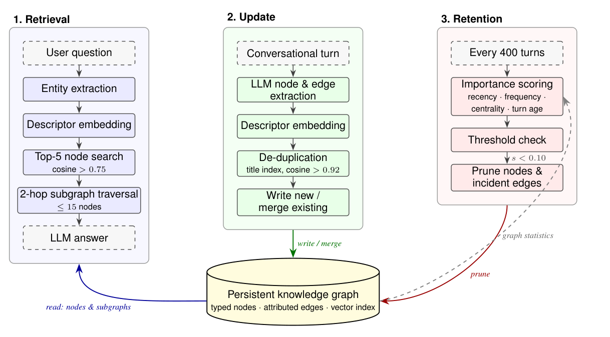

# Selective Forgetting: A Graph-Based Memory Framework for Long-Term LLM Agents
## 选择性遗忘：一种面向长期 LLM 智能体的基于图的内存框架

> **论文元信息**
> - **arXiv**：[2608.28978](https://arxiv.org/abs/2608.28978)（v1，2026-08-29 提交）
> - **分类**：cs.AI
> - **作者**：Theo Rusu、Sourena Khanzadeh†、Manar Alalfi（多伦多城市大学 Department of Computer Science / The Creative School；加拿大安大略省多伦多；Sourena Khanzadeh 另属 Flybits Creative AI Hub）
> - **方法名**：**Selective Forgetting**（代码仓库名为 **Selective-Amnesia**）
> - **复现地址**：https://github.com/skhanzad/Selective-Amnesia
> - **许可**：CC BY 4.0

> **翻译说明**
> - 本译文基于 arXiv 官方 HTML 全文（arXiv:2608.28978v1）逐段翻译，覆盖：**摘要 + 第 1–6 节 + 作者贡献 + 参考文献 + 全部附录（A.1–A.7）**；参考文献保留原文编号，不逐条翻译。
> - **插图**：原文共标注 **2 个图形对象**。其中 **图 1（Figure 1，框架总览）** 为 **PDF 裁剪位图**（无 HTML 源文件），已下载至本地 `../images/SelectiveForgetting/01-figure1-overview.png`，上方保留 `<!-- 原图：（PDF 裁剪）https://arxiv.org/pdf/2608.28978 -->` 注释；**图 2（Algorithm 1，Knowledge-Graph Ingestion Pipeline）是算法块而非图**，按约定以代码块逐行译出，不引用图片文件、不写图注三件套。markdown 使用相对路径引用，离线可读。
> - **表格**：原文 Table 1–7 全部译出（含 Table 5 的 SEM 与 95% bootstrap CI 全量数值），落在正文对应位置。
> - 公式统一按 LaTeX 重排；术语首次出现时保留英文原文；所有数字均取自原文正文，未凭印象补写。

---

## 摘要

知识图谱被提出作为长期智能体记忆中扁平检索增强生成（retrieval-augmented generation, RAG）的一种结构化替代方案，其假设是：把对话表示为实体与关系能够提升召回。我们直接验证这一假设。我们的框架把每一轮对话抽取为带类型的节点与带属性的边，从一个两跳子图回答问题，并周期性地剪除在「近因、访问频率、度中心性、年龄」的加权组合上得分较低的节点。在 LongMemEval 上，在匹配为 5 个检索根（retrieval root）的候选生成预算下，该图并未超过扁平向量基线：token F1 为 $0.417$ 对 $0.468$，对 500 个问题做的配对 bootstrap 给出 $\Delta=-0.050$（95% CI $[-0.085,-0.016]$）。差距在要求回忆某个特定先前助手回复轮次的问题上最大——判定正确率从 $0.911$ 降至 $0.607$，说明把一轮对话分解为实体会丢弃这些问题所依赖的表层形式。遗忘模块则更为成功。将它一次性应用于一个持久的 27,021 节点图上，它移除了 9.8% 的节点与 9.5% 的存储字节；token F1 不变（$+0.001$，95% CI $[-0.015,+0.016]$），判定正确率下降 1.6 个百分点，95% 区间把任何损失限制在 3.8 个百分点以内（$[-0.038,+0.006]$）。由于我们的抽取器是在单一基准上评估的单一小模型，这些结果刻画的是这一基于抽取的流水线，而非一般意义上的图结构记忆。

代码：https://github.com/skhanzad/Selective-Amnesia

---

## 1. 引言

大型语言模型（LLM）已迅速从独立的文本生成器演变为复杂智能体系统的基石，这些系统能够进行推理、规划并使用外部工具。这类系统正日益被采纳为与用户长期交互的个人 AI 助手。此类交互的质量不仅依赖于模型即时的推理能力，也依赖于模型整合来自过往交流信息的能力。因此，记忆成为这些系统的关键组成部分，通常分为两类：短期记忆与长期记忆。

当前被广泛采用的长期记忆方法是检索增强生成（retrieval-augmented generation, RAG）[Lewis et al., 2020]，即在推理时对流式密集向量存储建立索引并查询，以检索增强模型输出的相关条目。这种方法把记忆建模为一个扁平的、基于相似度的检索系统，已被证明对噪声敏感、容易检索到不相关或冗余的上下文，并且在支持多跳推理或维持连贯的长期知识方面能力有限 [Gao et al., 2023]。

为应对这些局限，近期工作探索了基于知识图谱的结构化记忆表示，其中信息被组织为实体及其关系，而非独立的嵌入。在这些系统中，记忆被编码为节点与边，从而能够存储更复杂的语义与关系表示 [Ji et al., 2021; Peng et al., 2023]。

然而，现有的基于图的方法主要关注如何添加信息并保持一致性 [Chhikara et al., 2025]。这并未解决长期记忆系统的一个根本挑战：无界增长。随着交互随时间累积，记忆存储变得越来越大，产生一系列下游负面影响，包括检索质量下降、计算成本升高，以及低效用信息的滞留。

随着记忆在长时间交互中累积，系统必须整合新信息并管理已有知识的相关性。持续学习与神经记忆系统的先前工作表明，有效的记忆需要选择性保留与遗忘的机制，因为保留全部信息会导致性能退化 [Kirkpatrick et al., 2017; Wei et al., 2026]。

在本工作中，我们研究：把长期对话记忆组织为知识图谱是否确实能改善 LLM 智能体的检索与推理，以及系统能否在长时间交互中保持高效。我们引入一个带有显式遗忘模块的基于图的记忆框架，以控制所存储信息的生命周期。我们并非假设结构表示总是有益的，而是通过实证刻画基于图的记忆何时有帮助、何时会降低性能。此外，我们表明，基于近因、频率与结构重要性的选择性遗忘能够在不实质影响检索质量的前提下缩减记忆规模。这些发现凸显：有效的长期记忆需要结构化表示，以及对更新与保留机制的精心设计。

## 2. 相关工作

### 2.1 基于 LLM 的智能体中的记忆

为神经系统集成显式记忆早于当前一代语言模型。早期的可微分架构，如神经图灵机（Neural Turing Machines）[Graves et al., 2014] 与端到端记忆网络（End-to-End Memory Networks）[Sukhbaatar et al., 2015]，将控制器与可寻址的外部存储耦合，建立了后来记忆系统继承的读/写抽象。随着 LLM 成为智能体系统的支柱，记忆被重新用于在不同轮次与会话之间、而非单次前向传播内部持久化信息 [Zhang et al., 2025]。一个常见设计是 Generative Agents [Park et al., 2023] 的记忆流（memory stream），它记录观察并综合使用近因、重要性与相关性检索它们，并周期性地综合出更高层的反思。后续系统沿不同维度扩展这一思想：MemoryBank [Zhong et al., 2024] 引入受艾宾浩斯遗忘曲线（Ebbinghaus forgetting curve）[Ebbinghaus, 1913] 启发的更新方案；MemGPT [Packer et al., 2023] 把记忆视为操作系统式的层次结构，在受限的上下文窗口与外部存储之间分页信息；ReadAgent [Lee et al., 2024] 把极长上下文压缩为要点记忆（gist memory）；而 Think-in-Memory [Liu et al., 2023]、Self-Controlled Memory [Wang et al., 2025] 与 MemLLM [Modarressi et al., 2024] 赋予模型对存储与回忆内容的显式控制。这些方法也支撑了 Xu et al. (2022) 研究的长期对话设置。然而，这类工作大多把记忆组织为扁平的条目集合，并强调写入与读取，而非有原则的移除。

### 2.2 检索增强生成

用外部知识 grounding LLM 输出的主导策略是检索增强生成（RAG）[Lewis et al., 2020]，它从非参数存储中检索相关段落并以之为条件生成。密集检索（dense retrieval）[Karpukhin et al., 2020] 以及联合预训练的检索—阅读模型，如 REALM [Guu et al., 2020] 与 RETRO [Borgeaud et al., 2022]，在规模上提升了检索质量；同时检索被证明能减少对话中的幻觉 [Shuster et al., 2021]。更近的变体增加了关于何时检索、检索什么的自我反思控制 [Asai et al., 2024]，并针对对话场景专门化模型 [Liu et al., 2024]。然而，正如 Gao et al. (2023) 所综述，RAG 从根本上把记忆建模为对独立嵌入的扁平、基于相似度的查找。这使其对检索噪声与冗余敏感，并限制了其多跳推理或维持连贯长期知识的能力，从而推动了对更结构化记忆表示的探索。

### 2.3 图结构记忆

知识图谱提供了一种结构化替代方案，其中信息被表示为实体及其间的关系 [Ji et al., 2021; Peng et al., 2023]。越来越多的工作把这种结构与 LLM 相结合 [Pan et al., 2024]，范围从用检索到的三元组做提示 [Baek et al., 2023]，到让模型通过遍历图来推理 [Sun et al., 2024]。就检索而言，GraphRAG [Edge et al., 2024] 构建实体图与社区摘要以支持面向查询的摘要，HippoRAG [Gutiérrez et al., 2024] 借鉴海马体索引理论，将知识图谱与基于图的检索结合用于长期召回。在智能体记忆场景中，Mem0 [Chhikara et al., 2025] 等系统采用图表示跨会话存储并整合用户信息。这些方法展示了关系结构对检索与推理的益处，但它们集中于信息如何被添加与保持一致，基本未解决记忆存储的无界增长问题。

### 2.4 遗忘与记忆保留

遗忘的必要性在智能体记忆之外早已确立。在人类认知中，保持（retention）随时间可预测地衰减 [Ebbinghaus, 1913]。在神经网络中，朴素的顺序学习会引发灾难性遗忘（catastrophic forgetting）[McCloskey and Cohen, 1989]，催生了保护重要参数的机制 [Kirkpatrick et al., 2017]；Wang et al. (2024) 综述了深度学习中遗忘这一更广泛的现象，而机器反学习（machine unlearning）研究刻意移除特定信息 [Bourtoule et al., 2020]。这些领域一个一致的发现是：有效的记忆需要选择性保留，而非无限累积。这一原则直到最近才被应用于智能体记忆：FadeMem [Wei et al., 2026] 引入受生物启发遗忘以保持智能体记忆高效。我们的工作精神上最接近这一方向，但把遗忘与基于图的存储耦合：我们不是把保留视为对扁平条目的事后过滤，而是把遗忘模块整合进节点与边的生命周期，从而在保留关系结构的同时移除过时或低效用的记忆。

### 2.5 评估长期记忆

评估长时间交互下的记忆需要专门的基准。LoCoMo [Maharana et al., 2024] 评估极长期对话记忆，LongMemEval [Wu et al., 2024] 在长时交互记忆能力（如多会话推理与知识更新）上探测聊天助手。我们采用 LongMemEval 来评估：随着交互累积，带遗忘的结构化记忆能否维持高质量召回。

## 3. 方法

本研究提出一个基于图的对话记忆框架，把交互建模为一个结构化、不断演进的知识图谱。该系统不是把过往交流存储为独立嵌入，而是把实体及其关系维护为节点与边，随着新对话轮次到来持续更新此图，并周期性剪除低重要性节点，以在长期交互中约束图的增长。

### 3.1 架构

该框架组织为三阶段流水线：检索（retrieval）、更新（update）与保留（retention）。在检索阶段，选取与当前问题最相关的子图，并将其序列化为答案生成的上下文。在更新阶段，一个 LLM 从当前对话轮次抽取实体与关系，并将其整合进知识图谱。在保留阶段，一个遗忘模块为每个存储节点打分，并移除重要性低于阈值的节点，从而约束图的增长并丢弃低效用信息。图 1 给出了完整流水线及各阶段如何与持久知识图谱交互的概览。

<!-- 原图：（PDF 裁剪）https://arxiv.org/pdf/2608.28978 -->


> **图 1（原文 Figure 1）**：Overview of the proposed memory framework. Each conversational turn is processed by the update stage, which extracts, embeds, de-duplicates, and writes nodes and edges into the persistent knowledge graph. At question time, the retrieval stage embeds the referenced entities, selects the top-5 matching nodes ranked by cosine similarity, and expands them via a 2-hop subgraph traversal to build the answer-generation context. Every 400 turns, the retention stage scores each node by recency, access frequency, centrality, and turn age, pruning nodes whose importance falls below the threshold together with their incident edges.
> （所提出记忆框架的概览。每一轮对话由更新阶段处理，该阶段抽取、嵌入、去重并把节点与边写入持久知识图谱。在提问时，检索阶段嵌入所引用的实体，按余弦相似度选取 top-5 匹配节点，并通过 2 跳子图遍历扩展它们，以构建答案生成上下文。每 400 轮，保留阶段按近因、访问频率、中心性与轮龄为每个节点打分，剪除重要性低于阈值及其关联边。）

### 3.2 知识图谱模式

该图由带类型的节点与边组成，二者均有类型与属性。每个节点带有 label（标签）、短 title（标题）、自然语言 content（内容描述）、一个扁平的 attributes（属性）字典，以及用于时间、访问与保留追踪的系统字段（created_at、access_count、last_accessed_at、turns_at_creation、importance_score）。

在一个固定的本体中定义了九种节点标签：Person（人物）、Organization（组织）、Location（地点）、Event（事件）、Concept（概念）、Artifact（制品）、Preference（偏好）、Goal（目标）与 Skill（技能）。边通过带类型的关谓词连接成对的节点，并可携带自己的属性字典，以在不引入额外节点的情况下捕获诸如持续时间、置信度或数量等关系性质。

### 3.3 抽取流水线

每一轮对话由一个单一的 LLM 抽取调用（GPT-4o-mini）处理，使用定义本体、输出模式与抽取规则的结构化系统提示词。轮次以说话者角色前缀（[Role: user] 或 [Role: assistant]）标注，以便抽取器恰当地分别处理。

用户轮次与助手轮次在抽取时被区别处理。对于用户轮次，系统捕获关于用户的事实，包括其偏好、目标、技能与关系。助手轮次以两种模式处理：(a) 助手引用或确认的用户相关事实；(b) 助手陈述的事实性主张、推荐与命名实体信息，使系统能够回忆先前轮次中提供的信息。

仅含多余或通用填充词的轮次产生空输出。

抽取器返回符合图模式（graph schema）的严格 JSON。一个验证层拒绝任何无法解析、引用未定义本体类型，或含有结构无效节点—边引用的输出。

### 3.4 嵌入与去重

节点描述符由各节点的 label、title 与 content 构成，并使用通过 Ollama 本地提供的 nomic-embed-text 嵌入。所得向量与每个节点一同存储在图的 vector_index 字典中，并随图 JSON 文件持久化。

在新节点写入图之前，依次执行两道去重检查。第一道基于 title：若已有节点与 incoming 节点共享相同的 label 与归一化 title，则被识别为匹配，并完全跳过嵌入检查。为支持基于 title 的检查，系统维护一个 title_index——一个把每个节点的归一化 title 映射到其节点 ID 的字典——它在每次创建新节点时更新，从而无需任何向量计算即可 O(1) 查找。第二道基于嵌入，仅在 title 检查未找到匹配时应用：incoming 节点的向量通过线性余弦扫描与所有已存储向量比较；若最近的已有节点余弦相似度高于 0.92，则被视为同一实体。当任一检查识别到匹配时，被匹配节点的 access_count 与 last_accessed_at 字段被更新，从而在正式检索发生之前为重要性打分模块提供频率信号。

### 3.5 子图检索

在推理时，一个轻量抽取调用识别当前问题所引用的实体，并嵌入它们的描述符。对所有已存储节点嵌入执行穷举余弦相似度搜索。相似度得分高于 0.75 的节点被保留并按得分排序。我们以广度优先搜索（BFS）从 top-5 检索节点出发，从这些根节点向外扩展至多两跳，并在收集到最多 15 个节点时停止。这些参数选择的理由见附录 A.2。

检索到的节点与边被序列化为紧凑的文本表示，并作为上下文记忆纳入答案生成提示词。

检索子图中被访问的节点其 access_count 递增，last_accessed_at 更新为当前会话时间戳。

### 3.6 重要性打分与遗忘

每个节点被赋予一个重要性得分，由四个分量组合而成：

$$\text{Score}=w_{r}\cdot\text{recency}(t)+w_{f}\cdot\text{frequency}(c)+w_{c}\cdot\text{centrality}(d)+w_{t}\cdot\text{turns\_decay}(k),$$

其中 recency（近因）是来自节点最后访问时间戳、半衰期 90 天的指数衰减；frequency（频率）是经对数归一化的访问计数；centrality（中心性）是经对数缩放的边度；turns_decay（轮次衰减）是来自节点创建轮次、半衰期 1,000 轮的指数衰减。权重设为 $w_{r}=0.35$、$w_{f}=0.25$、$w_{c}=0.20$、$w_{t}=0.20$。

遗忘模块每 400 个对话轮次被调用一次。重要性得分低于 0.10 的所有节点，连同与这些节点关联的所有边，都被剪除。更多细节见附录 A.2。

## 4. 实验

本节给出两项实验，旨在评估 (1) 知识图谱检索机制是否比扁平向量基线提升答案准确率，(2) 所提出的遗忘模块能否在不过度降低检索质量的前提下缩减图存储。在所有实验中，底层语言模型保持不变，仅改变检索与记忆机制。

### 4.1 数据集

两项实验均使用 LongMemEval 基准 [Wu et al., 2024]，这是一个用于评估对话系统长期对话记忆的数据集。该基准由 500 个问题组成，每个问题配有一段多会话对话历史，称为 haystack（干草堆），其中包含回答问题所需的信息。Haystack 会话跨越约 33 个月（2021 年 6 月 – 2024 年 2 月）的真实历史日期，每个问题涉及一到多个会话。

问题被分为六类，探测不同的记忆需求。Single-session（user）（单会话（用户））问题询问用户直接陈述的事实，如个人属性或过往事件。Single-session（assistant）（单会话（助手））问题要求回忆助手在先前轮次中提供的特定信息，如一条推荐或事实性解释。Single-session（preference）（单会话（偏好））问题针对对话中表达的隐式或显式用户偏好。Knowledge-update（知识更新）问题测试系统是否正确追踪跨会话变化的值，更看重最近的表述而非较早的表述。Multi-session（多会话）问题要求聚合分散在两个或更多独立会话中的信息。Temporal-reasoning（时间推理）问题要求对事件排序或根据嵌入 haystack 的信息计算时间间隔。

### 4.2 实验 1：检索质量与知识保留

实验 1 的目标是确定：把对话记忆组织为知识图谱是否比扁平向量基线提升检索质量。对于 500 个问题中的每一个，仅由该问题的 haystack 会话构建一个全新的知识图谱，然后用它来回答问题。基线把相同的 haystack 轮次作为原始文本分块存储在扁平向量存储中，并在查询时检索 top-5 最相似的分块。两个系统使用相同的语言模型生成答案，且都无法访问该问题自身 haystack 之外的信息。

性能通过 token 级精度（precision）与 F1 值，以及一个 LLM 作为判定者（LLM-as-judge）的正确率得分（二值，跨问题取平均）来衡量。

**表 1：实验 1 结果：LongMemEval 上 Graph RAG 与 Baseline RAG 对比。J = LLM 判定；Single = 单轮会话。**

|  | Graph RAG（本文） | Baseline RAG |  |  |  |  |  |  |
|---|---|---|---|---|---|---|---|---|
| 类型 | n | P | F1 | J | n | P | F1 | J |
| Single (user) | 70 | 0.743 | 0.737 | 0.771 | 70 | 0.823 | 0.819 | 0.929 |
| Single (asst.) | 56 | 0.680 | 0.575 | 0.607 | 56 | 0.916 | 0.774 | 0.911 |
| Single (pref.) | 30 | 0.312 | 0.083 | 0.233 | 30 | 0.274 | 0.114 | 0.367 |
| Know.-update | 78 | 0.507 | 0.456 | 0.513 | 78 | 0.553 | 0.511 | 0.590 |
| Multi-session | 133 | 0.384 | 0.326 | 0.398 | 133 | 0.381 | 0.342 | 0.436 |
| Temporal | 133 | 0.468 | 0.328 | 0.293 | 133 | 0.416 | 0.334 | 0.278 |
| Overall | 500 | 0.505 | 0.417 | 0.454 | 500 | 0.532 | 0.468 | 0.536 |

### 4.3 实验 2：遗忘下的长期记忆效率

实验 2 的目标是确定：遗忘模块能否在不过度降低检索质量的前提下压缩知识图谱。通过按顺序摄入全部 500 个问题的 haystack 会话构建一个单一的持久图，模拟一个系统在许多独立交互中累积记忆的长期运行部署。比较两种变体：保留每个节点的 no-forgetting（不遗忘）图，以及在摄入完成后应用一次遗忘模块的 forgetting（遗忘）图。两种变体随后回答全部 500 个基准问题，并比较它们的检索质量与存储足迹。

**表 2：实验 2 结果：带遗忘与不带遗忘的持久图在存储与检索质量上的对比。**

| 变体 | 节点 | 边 | 大小 | F1 | 判定 |
|---|---|---|---|---|---|
| No-forgetting | 27,021 | 46,538 | 440.6 MB | 0.292 | 0.300 |
| Forgetting | 24,368 | 43,978 | 398.6 MB | 0.293 | 0.284 |
| Change | $-$9.8% | $-$5.5% | $-$9.5% | $+0.001$ | $-$0.016 |

## 5. 讨论与局限

实验揭示了关于基于图的长期记忆的两个互补发现。第一，把对话记忆表示为知识图谱并不能一致地改善对扁平向量存储的检索。第二，一旦记忆被表示为持久图，选择性遗忘就能在基本保持检索质量的同时大幅缩减其规模。

在实验 1 中，基线 RAG 系统总体上优于 Graph RAG，token F1 达到 0.468 对 0.417，LLM 判定准确率达到 0.536 对 0.454。然而，性能在不同问题类型间有差异，说明图结构的有用性取决于所检索信息的类型。

Graph RAG 仅在时间推理问题的 LLM 判定指标上取得唯一提升（0.293 对 0.278）。该任务天然契合图表示：事件可表示为带有时间属性的带类型节点，并连接到参与其中的实体，使检索能够保留关系与时间结构。相比之下，扁平分块检索并不显式表示事件参与者、顺序或时间关系。

最大的性能赤字出现在单会话（助手）问题上（判定：0.607 对 0.911）。这类问题常常要求回忆先前助手回复中的某条特定推荐或事实性陈述。扁平基线能够逐字检索原始助手轮次，而图抽取则把轮次分解为实体与关系。在此过程中，它可能丢失关于具体强调哪一个条目或陈述的信息。这凸显了基于抽取的记忆表示的一个重要局限：结构化抽象在改善关系组织的同时，也可能丢弃精确或逐字回忆所需的信息。

Graph RAG 在知识更新问题上也表现较弱（F1：0.456 对 0.511）。对失败案例的检查表明，当前的冲突解决策略在缺乏显式置信度分数时，可能保留较早的属性值而非用更近的值替换它。因此，对适当的 factual 与 numeric 属性采用「最后写入获胜（last-write-wins）」策略可以提升知识更新任务的性能。多会话与单会话（用户）问题上较小的赤字似乎源自相关的抽取与检索效应。尽管图结构可以支持跨会话实体链接，不完美的抽取与实体合并会引入检索噪声，而直接保留在原始文本中的简洁事实可能在图构建过程中被抽象掉。

实验 2 考察了记忆系统的另一属性：累积的图记忆能否在不过度降低检索的情况下被缩减。应用遗忘机制移除了 2,653 个节点（9.8%）与 2,560 条边（5.5%），把图大小从 440.6 MB 降至 398.6 MB，降幅 9.5%。token 级 F1 几乎不变，从 0.292 升至 0.293，而 LLM 判定准确率从 0.300 降至 0.284。

实验 2 的绝对检索性能低于实验 1，因为全部 500 个 haystack 被合并为一个单一持久图，引入了跨对话检索干扰。因此，该实验的目的不是最大化检索准确率，而是比较同一持久记忆设置在有无遗忘下的表现。

遗忘机制移除的节点在模拟对话期结束后低于重要性阈值，其特征为低再引用频率、有限的结构连通性与降低的近因。它们的移除对 token 级 F1 影响甚微，说明重要性函数优先移除对检索贡献相对较小的外围信息。然而，LLM 判定准确率的下降表明，一些被剪除的信息仍可能有助于得到正确答案，凸显了记忆效率与信息保留之间的权衡。

总体来看，这些结果表明：仅凭图结构不足以改善长期对话记忆。当关系与时间结构重要时，其益处最强；而对于精确或逐字回忆，扁平文本检索仍具优势。与此同时，显式的保留机制提供了一种控制持久记忆增长的实际手段。因此，有效的长期记忆系统可能受益于把结构化表示与更强的更新策略、选择性保留，以及为逐字上下文仍重要的信息保留访问权限的机制相结合。

## 6. 结论

本研究证明，把对话记忆组织为知识图谱既带来益处也存在局限。尽管关系表示能够支持对时间与语义相连信息的推理，它们也会引入信息损失，对要求精确或逐字回忆的任务产生负面影响。这些结果表明，记忆系统的改进无法仅通过表示来实现。相反，性能关键取决于信息如何被抽取、更新并随时间保留。

所提出的遗忘模块贡献了一种其代价可被约束的保留机制：对一个 27,021 节点存储的低重要性尾部进行剪枝，移除了 9.8% 的节点与 9.5% 的字节，而对 500 个问题做的配对 bootstrap 在四项指标中的任一项上都未检出显著变化（表 7）。总体而言，这些发现表明：有效的长期记忆系统应将结构化表示与更强的更新机制及选择性保留策略相结合，而非孤立地依赖单一方法。

## 作者贡献

Sourena Khanzadeh 提出了研究想法并制定了最初的研究方向。Theo Rusu 主要负责实现与实验执行。Manar Alalfi 指导了研究并提供技术与学术指导。

## 参考文献

- Asai et al. (2024) A. Asai, Z. Wu, Y. Wang, A. Sil, and H. Hajishirzi Self-rag: learning to retrieve, generate, and critique through self-reflection . In International conference on learning representations , Vol. 2024 , pp. 9112–9141 . Cited by: §2.2 .

- Baek et al. (2023) J. Baek, A. F. Aji, and A. Saffari Knowledge-augmented language model prompting for zero-shot knowledge graph question answering . In Proceedings of the 1st Workshop on Natural Language Reasoning and Structured Explanations (NLRSE) , pp. 78–106 . Cited by: §2.3 .

- Borgeaud et al. (2022) S. Borgeaud, A. Mensch, J. Hoffmann, T. Cai, E. Rutherford, K. Millican, G. B. Van Den Driessche, J. Lespiau, B. Damoc, A. Clark, et al. Improving language models by retrieving from trillions of tokens . In International conference on machine learning , pp. 2206–2240 . Cited by: §2.2 .

- Bourtoule et al. (2020) L. Bourtoule, V. Chandrasekaran, C. A. Choquette-Choo, H. Jia, A. Travers, B. Zhang, D. Lie, and N. Papernot Machine unlearning . External Links: 1912.03817 , Link Cited by: §2.4 .

- Chhikara et al. (2025) P. Chhikara, D. Khant, S. Aryan, T. Singh, and D. Yadav Mem0: building production-ready ai agents with scalable long-term memory . arXiv preprint arXiv:2504.19413 . Cited by: §1 , §2.3 .

- Ebbinghaus (1913) H. Ebbinghaus A contribution to experimental psychology . Cited by: §2.1 , §2.4 .

- Edge et al. (2024) D. Edge, H. Trinh, N. Cheng, J. Bradley, A. Chao, A. Mody, S. Truitt, D. Metropolitansky, R. O. Ness, and J. Larson From local to global: a graph rag approach to query-focused summarization . arXiv preprint arXiv:2404.16130 . Cited by: §2.3 .

- Gao et al. (2023) Y. Gao, Y. Xiong, X. Gao, K. Jia, J. Pan, Y. Bi, Y. Dai, J. Sun, M. Wang, and H. Wang Retrieval-augmented generation for large language models: a survey . arXiv preprint arXiv:2312.10997 . Cited by: §1 , §2.2 .

- Graves et al. (2014) A. Graves, G. Wayne, and I. Danihelka Neural turing machines . arXiv preprint arXiv:1410.5401 . Cited by: §2.1 .

- Gutiérrez et al. (2024) B. J. Gutiérrez, Y. Shu, Y. Gu, M. Yasunaga, and Y. Su Hipporag: neurobiologically inspired long-term memory for large language models . Vol. 37 , pp. 59532–59569 . Cited by: §2.3 .

- Guu et al. (2020) K. Guu, K. Lee, Z. Tung, P. Pasupat, and M. Chang Retrieval augmented language model pre-training . In International conference on machine learning , pp. 3929–3938 . Cited by: §2.2 .

- Ji et al. (2021) S. Ji, S. Pan, E. Cambria, P. Marttinen, and P. S. Yu A survey on knowledge graphs: representation, acquisition, and applications . IEEE transactions on neural networks and learning systems 33 ( 2 ), pp. 494–514 . Cited by: §1 , §2.3 .

- Karpukhin et al. (2020) V. Karpukhin, B. Oguz, S. Min, P. Lewis, L. Wu, S. Edunov, D. Chen, and W. Yih Dense passage retrieval for open-domain question answering . In Proceedings of the 2020 conference on empirical methods in natural language processing (EMNLP) , pp. 6769–6781 . Cited by: §2.2 .

- Kirkpatrick et al. (2017) J. Kirkpatrick, R. Pascanu, N. Rabinowitz, J. Veness, G. Desjardins, A. A. Rusu, K. Milan, J. Quan, T. Ramalho, A. Grabska-Barwinska, et al. Overcoming catastrophic forgetting in neural networks . Proceedings of the national academy of sciences 114 ( 13 ), pp. 3521–3526 . Cited by: §1 , §2.4 .

- Lee et al. (2024) K. Lee, X. Chen, H. Furuta, J. Canny, and I. Fischer A human-inspired reading agent with gist memory of very long contexts . Cited by: §2.1 .

- Lewis et al. (2020) P. Lewis, E. Perez, A. Piktus, F. Petroni, V. Karpukhin, N. Goyal, H. Küttler, M. Lewis, W. Yih, T. Rocktäschel, et al. Retrieval-augmented generation for knowledge-intensive nlp tasks . Vol. 33 , pp. 9459–9474 . Cited by: §1 , §2.2 .

- Liu et al. (2023) L. Liu, X. Yang, Y. Shen, B. Hu, Z. Zhang, J. Gu, and G. Zhang Think-in-memory: recalling and post-thinking enable llms with long-term memory . arXiv preprint arXiv:2311.08719 . Cited by: §2.1 .

- Liu et al. (2024) Z. Liu, W. Ping, R. Roy, P. Xu, C. Lee, M. Shoeybi, and B. Catanzaro Chatqa: surpassing gpt-4 on conversational qa and rag . Advances in Neural Information Processing Systems 37 , pp. 15416–15459 . Cited by: §2.2 .

- Maharana et al. (2024) A. Maharana, D. Lee, S. Tulyakov, M. Bansal, F. Barbieri, and Y. Fang Evaluating very long-term conversational memory of llm agents . In Proceedings of the 62nd Annual Meeting of the Association for Computational Linguistics (Volume 1: Long Papers) , pp. 13851–13870 . Cited by: §2.5 .

- McCloskey and Cohen (1989) M. McCloskey and N. J. Cohen Catastrophic interference in connectionist networks: the sequential learning problem . 24 , pp. 109–165 . Cited by: §2.4 .

- Modarressi et al. (2024) A. Modarressi, A. Köksal, A. Imani, M. Fayyaz, and H. Schütze Memllm: finetuning llms to use an explicit read-write memory . arXiv preprint arXiv:2404.11672 . Cited by: §2.1 .

- Packer et al. (2023) C. Packer, S. Wooders, K. Lin, V. Fang, S. G. Patil, I. Stoica, and J. E. Gonzalez Memgpt: towards llms as operating systems . Cited by: §2.1 .

- Pan et al. (2024) S. Pan, L. Luo, Y. Wang, C. Chen, J. Wang, and X. Wu Unifying large language models and knowledge graphs: a roadmap . IEEE Transactions on Knowledge and Data Engineering 36 ( 7 ), pp. 3580–3599 . Cited by: §2.3 .

- Park et al. (2023) J. S. Park, J. O’Brien, C. J. Cai, M. R. Morris, P. Liang, and M. S. Bernstein Generative agents: interactive simulacra of human behavior . In Proceedings of the 36th annual acm symposium on user interface software and technology , pp. 1–22 . Cited by: §A.2 , §2.1 .

- Peng et al. (2023) C. Peng, F. Xia, M. Naseriparsa, and F. Osborne Knowledge graphs: opportunities and challenges . External Links: 2303.13948 , Link Cited by: §1 , §2.3 .

- Shuster et al. (2021) K. Shuster, S. Poff, M. Chen, D. Kiela, and J. Weston Retrieval augmentation reduces hallucination in conversation . In Findings of the Association for Computational Linguistics: EMNLP 2021 , pp. 3784–3803 . Cited by: §2.2 .

- Sukhbaatar et al. (2015) S. Sukhbaatar, J. Weston, R. Fergus, et al. End-to-end memory networks . Vol. 28 . Cited by: §2.1 .

- Sun et al. (2024) J. Sun, C. Xu, L. Tang, S. Wang, C. Lin, Y. Gong, L. Ni, H. Shum, and J. Guo Think-on-graph: deep and responsible reasoning of large language model on knowledge graph . In International Conference on Learning Representations , Vol. 2024 , pp. 3868–3898 . Cited by: §2.3 .

- Wang et al. (2025) B. Wang, X. Liang, J. Yang, H. Huang, Z. Wu, S. Wu, Z. Ma, and Z. Li Scm: enhancing large language model with self-controlled memory framework . pp. 188–203 . Cited by: §2.1 .

- Wang et al. (2024) Z. Wang, E. Yang, L. Shen, and H. Huang A comprehensive survey of forgetting in deep learning beyond continual learning . IEEE Transactions on Pattern Analysis and Machine Intelligence 47 ( 3 ), pp. 1464–1483 . Cited by: §2.4 .

- Wei et al. (2026) L. Wei, X. Dong, X. Peng, N. Xie, and B. Wang Fademem: biologically-inspired forgetting for efficient agent memory . pp. 4011–4015 . Cited by: §1 , §2.4 .

- Wu et al. (2024) D. Wu, H. Wang, W. Yu, Y. Zhang, K. Chang, and D. Yu Longmemeval: benchmarking chat assistants on long-term interactive memory . Cited by: §2.5 , §4.1 .

- Xu et al. (2022) J. Xu, A. Szlam, and J. Weston Beyond goldfish memory: long-term open-domain conversation . In Proceedings of the 60th annual meeting of the association for computational linguistics (volume 1: long papers) , pp. 5180–5197 . Cited by: §2.1 .

- Zhang et al. (2025) Z. Zhang, Q. Dai, X. Bo, C. Ma, R. Li, X. Chen, J. Zhu, Z. Dong, and J. Wen A survey on the memory mechanism of large language model-based agents . ACM Transactions on Information Systems 43 ( 6 ), pp. 1–47 . Cited by: §2.1 .

- Zhong et al. (2024) W. Zhong, L. Guo, Q. Gao, H. Ye, and Y. Wang Memorybank: enhancing large language models with long-term memory . In Proceedings of the AAAI conference on artificial intelligence , Vol. 38 , pp. 19724–19731 . Cited by: §A.2 , §2.1 .

## A. 附录

### A.1 给审稿人关于实验范围与 AI 使用的说明

#### 预算约束

本工作在上述消费级工作站所固定的计算与 API 预算下完成。我们明确说明由此产生的范围限制，以便读者以恰当的粒度阅读我们的主张。我们评估的每一种配置都需要重新摄入全部 500 个 LongMemEval 问题的 haystack 会话，每个对话轮次花费一次抽取调用，每个问题花费一次生成与一次判定调用。因此，一次被评估的配置代价高昂，预算只允许少量完整运行而非大规模扫描。我们选择把预算花在四个完整运行上（实验 1 的处理组与对照组、实验 2 的处理组与对照组），取 $n=500$、temperature $=0$，并报告这些运行的配对 bootstrap 区间，而不是花在更多数量的部分评估配置上。

相应地，我们的发现应被读作刻画了此模型规模下这一基于抽取的图记忆流水线，而非一般意义上的图结构记忆。若有额外预算，我们的优先顺序将是：一个匹配压缩的对照组，即随机剪除相同比例的节点，以隔离重要性函数的贡献；第二个基准；以及一个更强的抽取模型。

#### AI 的生成式使用

我们区分本工作中语言模型的两种用途。第一，作为方法本身的组成部分：如第 3.3 节与第 4.1 节所述，GPT-4o-mini 执行知识图谱抽取与答案生成，并充当 LLM 判定者。第二，作为写作工具。在后者角色中，我们使用 gpt5.6 sol 起草附录中的散文并辅助文献检索，使用 Opus 4.8 辅助实现实验流水线。主要技术内容，包括实验设计、分析与结果解释，均为作者本人工作；模型对这些部分的辅助仅限于语法与格式。所有 AI 辅助产出均经作者审阅，所有被引参考文献均对照原始来源核对，作者对论文内容负全部责任。

### A.2 实验与方法所选参数的合理性说明

表 3 列出了系统的每个自由参数及其设置与选择依据。我们区分三种情形：在小规模探针集上经经验选取值（E）、由预算或成本约束先验固定值（B），以及由约定或与基线对称固定值（C）。我们未对保留参数做完整扫描；其后果在本节末尾讨论。

**表 3：参数、设置与选择依据。E = 经验探针，B = 预算或成本约束，C = 约定或与基线对称。**

| 参数 | 值 | 依据 |
|---|---|---|
| 去重余弦阈值 $\tau_{\text{dedup}}$ | 0.92 | E |
| 检索余弦下限 $\tau_{\text{ret}}$ | 0.75 | E |
| 检索根数（top-$k$） | 5 | C |
| 子图扩展深度 | 2 hops | B |
| 子图节点上限 | 15 | B |
| 遗忘间隔 | 400 turns | B |
| 剪枝阈值 $s_{\min}$ | 0.10 | B |
| 近因半衰期 | 90 days | C |
| 轮次衰减半衰期 | 1,000 turns | C |
| 打分权重 $(w_{r},w_{f},w_{c},w_{t})$ | $(0.35,0.25,0.20,0.20)$ | C |

去重阈值。由附录 A.5 描述的探针流程选出。该值刻意保守，因为两种错误模式并不对称：一次错误的合并会不可逆地折叠两个不同实体，并破坏与它们关联的所有边，而一次漏检的合并只留下冗余节点，后续去重遍历或检索阶段仍可使之浮现。因此我们接受了较高的假阴性率，以换取较低的假合并率。

检索余弦下限。nomic-embed-text 产生的描述符嵌入是各向异性的，因此无关短描述符之间的余弦相似度并不集中在零附近。0.75 的下限放行同一实体的释义与部分提及，同时排除仅主题相邻（topically adjacent）的节点。该参数并非关键：因为候选随后被排序并截断到 top 5，下限只影响那些少于五个节点越过它的查询，在这种情况下系统正确地检索更小的上下文，而非用无关节点填充它。

检索根数量。设为 5 以匹配扁平向量基线检索的分块数（第 4.2 节），从而两个系统在相等的候选生成预算下比较，任何性能差异都归因于表示而非检索命中次数。

扩展深度与节点上限。从种子节点扩展一跳只返回其直接邻居，对大多数种子而言即附加到单个实体的属性集合，因此除种子本身外增益甚微。三跳或更多跳在合并图中超线性扩展，且检查表明该距离的节点通常通过枢纽（hub）实体而非任何与查询相关的关序关系与种子相连。因此两跳是支持图表示旨在服务的关系与多会话情形所需的最小深度。

遗忘间隔与剪枝阈值。打分在图规模上是 $O(N+M)$，因此很少调用它能把成本摊销到许多对话轮次上；400 轮也长到足以让近因与轮次衰减项区分真正休眠的节点与恰好近期未被访问的节点。0.10 的阈值设定为保守，只针对得分分布的尾部而非固定的压缩比。这一选择决定了实验 2 所报告的工作点，也是报告降幅约为 10% 而非更大数字的原因。

半衰期与打分权重。90 天的近因半衰期是相对于 LongMemEval haystack 的时间跨度设定的，后者覆盖约 33 个月的真实时间戳；显著更短的半衰期会使几乎所有节点的近因项饱和，显著更长的半衰期则会把它拉平。1,000 轮的衰减半衰期在摄入顺序上起相同作用。权重是事先固定、未经调参的：它们编码了一个来自记忆流与遗忘曲线文献 [Park et al., 2023; Zhong et al., 2024] 的先验，即访问驱动的信号（近因、频率）应主导结构与基于年龄的信号。

局限。保留参数 $(w_{r},w_{f},w_{c},w_{t})$、$s_{\min}$ 与遗忘间隔未经扫描，因此实验 2 刻画的是压缩—质量权衡上的单点而非整条曲线。我们也未隔离各个打分分量的贡献；在匹配压缩下证明四项重要性函数优于更简单的保留规则，留待未来工作。

#### 计算环境

所有实验在一台本地工作站上进行，配备 AMD Radeon RX 7800 XT GPU、16 GB 系统内存与 Intel Core i5-9400F CPU。该配置用于本地执行记忆流水线、图操作、嵌入相关负载，我们使用 OpenAI 模型，主要是（gpt4o-mini）进行 API 调用。

### A.3 角色感知的抽取提示词

这一角色感知变体显式区分用户与助手轮次，并指定应保留哪些助手提供的事实。

### A.4 知识图谱抽取提示词示例

以下示例展示了我们整个实验所用抽取提示词的结构。

### A.5 算法

算法 1 总结了记忆摄入流水线。给定一个对话轮次，系统首先抽取一组结构化的节点与边，并嵌入每个被抽取的节点。候选节点先用精确 title 匹配、再用语义相似度与已有记忆匹配。高于去重阈值 $\tau_{\mathrm{dedup}}$ 的匹配被映射到已有节点，而未匹配的实体被赋予新标识符。在标准操作中，同一条消息还被转换为检索实体，用于识别并扩展一个相关图子图，该子图被序列化为上下文记忆。随后抽取的节点与边被写入持久记忆，并依据配置的记忆维护策略触发一次可选的遗忘遍历。

**算法 1：知识图谱摄入流水线（Knowledge-Graph Ingestion Pipeline）**

```
输入：用户消息 m，记忆图 G
输出：更新后的图 G 与检索上下文 C

1:  E ← Extract(m)                        ▷ 抽取节点与关系
2:  Z ← Embed(E.nodes)                    ▷ 嵌入被抽取的实体
3:  for all n ∈ E.nodes do
4:      v ← Match(n, Z_n, G)
5:      if v 与 n 足够相似 then
6:          Merge(n, v, G)
7:      else
8:          AddNode(n, G)
9:      end if
10: end for
11: AddRelations(E.edges, G)
12: Q ← ExtractQueryEntities(m)
13: R ← RetrieveRelevantNodes(Q, G)
14: S ← ExpandSubgraph(R, G)
15: C ← Serialize(S)
16: if ForgettingTriggered(G) then
17:     G ← Forget(G)
18: end if
19: return (C, G)
```

#### 去重阈值选择

为确定合适的去重阈值，我们构建了一组提示词序列，这些提示词反复引用相同的底层实体，同时跨提示词变换措辞与上下文表达。这使我们能够评估随着相似度阈值变化，语义等价的实体被合并的一致性如何。随后我们选择了在正确合并重复实体与避免不同实体间错误合并之间取得最佳权衡的阈值。

### A.6 计算复杂度

令 $N$ 与 $M$ 为记忆图中的节点数与边数，$d$ 为嵌入维度，$k$ 为从 incoming 消息抽取的实体数，$\ell$ 为与之抽取的关系统数，$q$ 为从查询抽取的实体数。表 4 总结了每个阶段的代价；我们排除了 LLM 与嵌入调用的内部代价，后者取决于 token 长度而非图规模。

**表 4：穷举向量搜索下的各阶段复杂度。$T$ 为遗忘间隔（400 轮），$V_{S},E_{S}$ 为检索子图的节点与边。**

| 阶段 | 代价 | 备注 |
|---|---|---|
| 嵌入被抽取实体 | $O(kd)$ |  |
| 基于 title 的去重 | 每实体 $O(1)$ | 哈希索引 |
| 基于嵌入的去重 | $O(kNd)$ | 线性扫描 |
| 图写入 | $O(k+\ell)$ | 索引更新 |
| 候选检索 | $O(qNd)$ | 线性扫描 |
| 子图遍历 | $O(N+M+|V_{S}|+|E_{S}|)$ | 邻接构建 |
| 遗忘 | 每 $T$ 轮 $O(N+M)$ | 摊销 $O\!\left(\tfrac{N+M}{T}\right)$ |

两次穷举向量扫描占主导，一次在去重时、一次在检索时，给出最坏情况每轮代价

$$O\big((k+q)Nd+N+M\big)=O(Nd+M),$$

因为 $k$、$q$ 与子图大小在构造上是有界的（遍历上限为 15 个节点）。$N+M$ 项仅因邻接表示在查询时重建而出现，若它随图持久化则会消失。空间复杂度为 $O(Nd+N+M)$，其中 $Nd$ 解释存储的嵌入，$N+M$ 解释图结构与元数据。

因此线性扫描项是仅有的随记忆规模增长的成分，且二者都非设计所必需：用近似最近邻索引替换穷举搜索会大幅降低 $O(Nd)$ 因子，使遗忘模块成为约束 $N$ 本身的机制。

### A.7 实验结果的统计显著性

我们报告支撑主要主张（即遗忘模块高效处理长期记忆增长：它在表 2 所示不显著降低答案质量的前提下大幅缩减图存储）的结果的统计显著性。以下所有区间都是在我们基准运行（第 4 节）产生的每问题结果上事后计算的；计算它们无需额外的模型调用。

#### 设置

以下每个区间所捕获的变异性来源是：从固定的 LongMemEval 评估集中抽样了哪些问题，即我们在问题层面重采样；答案生成使用 temperature $=0$，因此不存在需要捕获的额外解码随机性成分。崩溃或出错的运行的行在聚合前被丢弃。对于每个条件与指标，我们报告均值以及均值的标准误（SEM，一个 1-$\sigma$ 区间，如此显式说明）和一个 95% 置信区间，该区间来自非参数 bootstrap（10,000 次有放回重采样，基于问题，百分位法），它不对底层指标分布做任何正态性假设。对于二值判定正确率指标，其抽样分布是 bounded in $[0,1]$ 的比例，我们额外报告 95% Wilson 分数区间，它在构造上不能延伸到 $[0,1]$ 之外；对于该指标我们偏好它而非对称区间，以避免暗示超出范围数值的风险。

#### 每条件结果

表 5 报告了四个实验条件各自的均值 $\pm$ SEM 与 95% bootstrap 置信区间。

**表 5：各条件的均值 $\pm$ SEM（1 $\sigma$）与 95% bootstrap CI，每个条件 $n=500$ 个问题。**

| 条件 | F1 | 精度 | 召回 | 判定准确率 |
|---|---|---|---|---|
| Baseline RAG（逐问题，实验 1 对照组） | $0.468\pm 0.019$ | $0.532\pm 0.019$ | $0.486\pm 0.020$ | $0.536\pm 0.022$ |
| Graph RAG（逐问题，实验 1 处理组） | $0.417\pm 0.019$ | $0.505\pm 0.020$ | $0.412\pm 0.019$ | $0.454\pm 0.022$ |
| 持久图，不遗忘（实验 2 对照组） | $0.292\pm 0.017$ | $0.363\pm 0.018$ | $0.295\pm 0.018$ | $0.300\pm 0.021$ |
| 持久图，带遗忘（实验 2 处理组） | $0.293\pm 0.017$ | $0.359\pm 0.018$ | $0.294\pm 0.018$ | $0.284\pm 0.020$ |

**表 6：对应表 5 的 95% bootstrap 置信区间。对判定准确率，除 bootstrap CI 外还给出 95% Wilson 分数区间。**

| 条件 | F1 | 精度 | 召回 | 判定准确率 |
|---|---|---|---|---|
| Baseline RAG（逐问题，实验 1 对照组） | $[0.432,0.505]$ | $[0.496,0.571]$ | $[0.447,0.525]$ | $[0.492,0.580]$（Wilson: $[0.492,0.579]$） |
| Graph RAG（逐问题，实验 1 处理组） | $[0.381,0.454]$ | $[0.467,0.544]$ | $[0.375,0.451]$ | $[0.410,0.496]$（Wilson: $[0.411,0.498]$） |
| 持久图，不遗忘（实验 2 对照组） | $[0.260,0.325]$ | $[0.328,0.399]$ | $[0.261,0.330]$ | $[0.260,0.342]$（Wilson: $[0.262,0.342]$） |
| 持久图，带遗忘（实验 2 处理组） | $[0.260,0.326]$ | $[0.323,0.395]$ | $[0.259,0.329]$ | $[0.244,0.324]$（Wilson: $[0.246,0.325]$） |

#### 配对比较

为评估配对条件间差异是否统计显著，我们对每个指标的每问题差异计算配对非参数 bootstrap，按被比较两条件间的问题 ID 配对（10,000 次重采样）。我们报告均值差、其 95% bootstrap CI，以及一个双侧 bootstrap $p$ 值（两次较小的重采样差异跨越零的尾部比例中的较小者乘以 2，上限为 1）。当差异的 95% CI 排除零时，比较在 $\alpha=0.05$ 水平被标记为显著。结果如表 7 所示。

**表 7：条件间的配对 bootstrap 比较。正的均值差有利于第一个被命名的条件；∗ 表示在 $\alpha=0.05$ 水平显著。**

| 比较 | F1 | 精度 | 召回 | 判定准确率 |
|---|---|---|---|---|
| 实验 1：Graph RAG vs Baseline RAG | $-0.050$∗ $[-0.085,-0.016]$ | $-0.028$ $[-0.067,+0.011]$ | $-0.073$∗ $[-0.107,-0.039]$ | $-0.082$∗ $[-0.128,-0.034]$ |
| 实验 2：遗忘 vs 不遗忘 | $+0.001$ $[-0.015,+0.016]$ | $-0.004$ $[-0.023,+0.014]$ | $-0.001$ $[-0.017,+0.016]$ | $-0.016$ $[-0.038,+0.006]$ |

#### 解释

四项指标中没有一项在遗忘与不遗忘条件之间（实验 2）显示出显著差异，这是我们主要主张中「无质量损失」一半的关键证据。Graph RAG 与 Baseline RAG 的比较（实验 1）为完整性而纳入，但对我们的主要主张并非关键。
