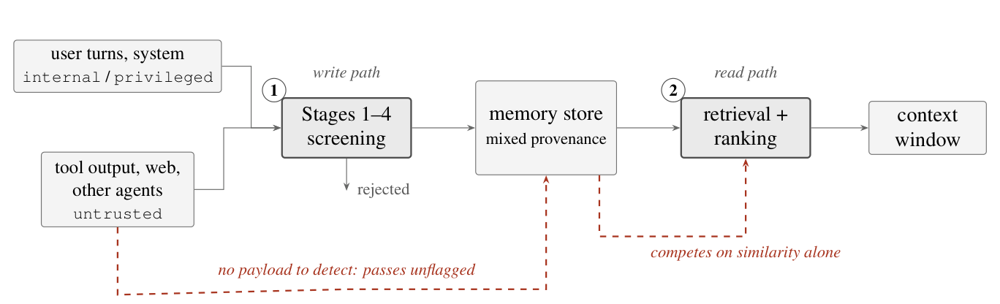
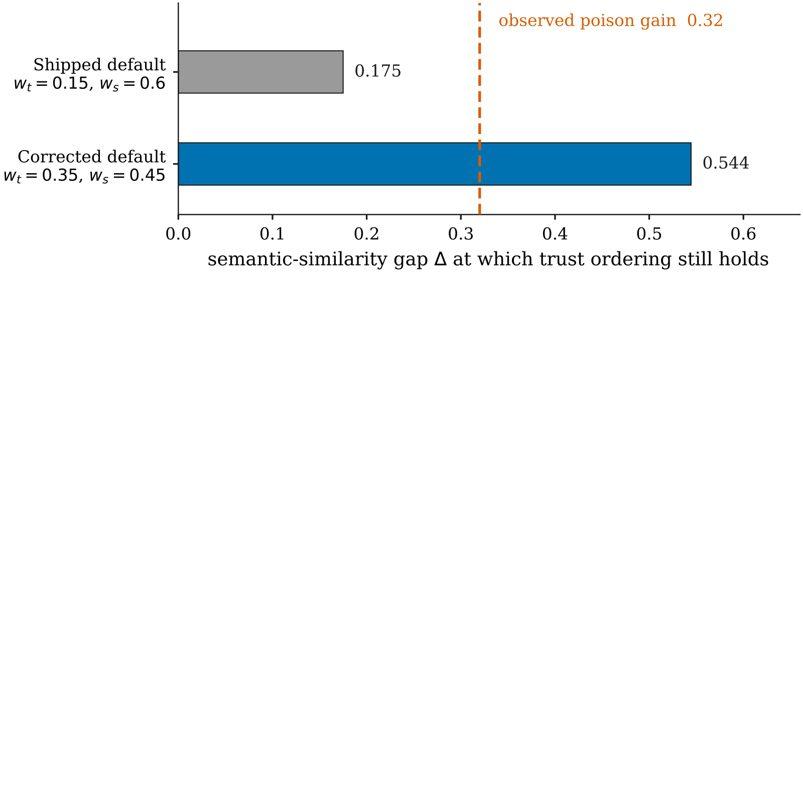
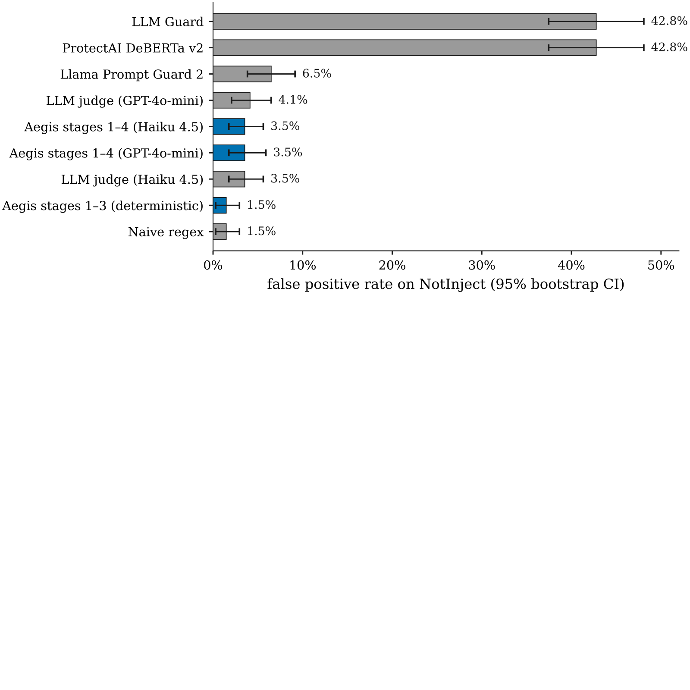
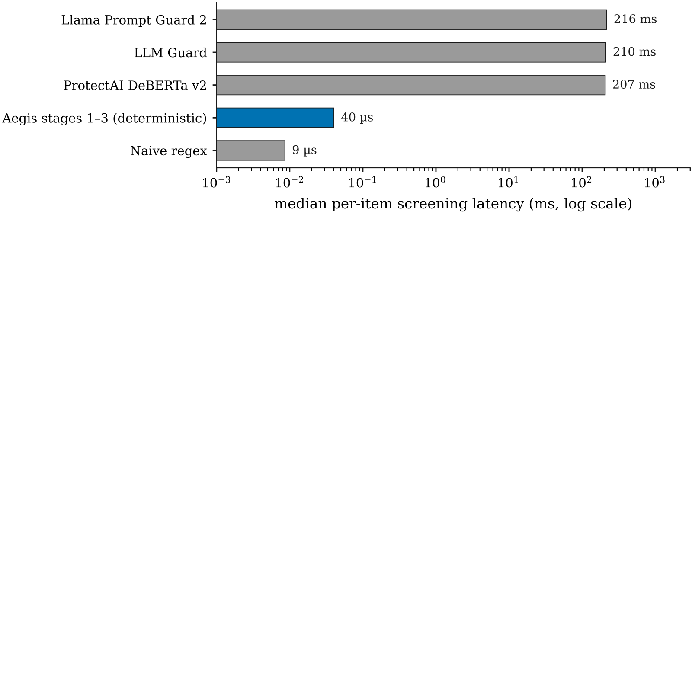

# Utility Under Attack: Agent Memory Poisoning and the Limits of Content Screening and Provenance Ranking
## 受攻击的效用：智能体记忆投毒，与内容筛查及来源排序的局限

> **论文元信息**
> - **arXiv**：[2608.21230](https://arxiv.org/abs/2608.21230)（v1，arXiv 标注提交于 2026-08-21；作者署名日期 2026-08-24。本译文基于 v1 官方 HTML 逐段翻译）
> - **发表**：预印本，未标注会议/期刊录用
> - **分类**：cs.CR（计算机与信息安全，主分类）
> - **作者**：Arulnidhi Karunanidhi（Quantify Labs Ltd；arulnidhi@quantifylabs.ai）
> - **方法/系统名**：**Aegis**（面向 LLM 智能体的开源记忆层）；本文测量其默认开启的两道内置防御——写入路径分段内容筛查（staged content screening）与读取路径来源加权排序（provenance-weighted ranking）
> - **复现地址**：https://github.com/quantifylabs/aegis-memory（锁定修订 6d2863083361f7a5c8e12b4512346c94cb453c2c）

> **翻译说明**
> - 本译文基于 arXiv 官方 HTML 全文（`https://arxiv.org/html/2608.21230v1`）逐段翻译，覆盖：**摘要 + 第 1–8 节 + 局限性 + 图 1–4 + 表 1–6 全量数值 + 参考文献（保留编号与原始条目，标题不译）+ 附录 A（可复现性）**；参考文献保留原文编号，不逐条翻译。
> - **插图**：共 **4 张图**，已下载至 `images/UtilityUnderAttack/`，使用相对路径引用，离线可读；每张图上方保留 `<!-- 原图：URL -->` 注释便于回溯原地址。其中 **图 1（记忆生命周期与两个防御拦截点）在 HTML 中并无独立图像文件**（被包成 figure、内部为排版元素），此处所用为从论文 PDF（https://arxiv.org/pdf/2608.21230）裁剪得到的**位图**，并非原始矢量图，特此注明。
> - 公式统一按 LaTeX 重排（已清理原文 MathML 与 LaTeX 重复渲染的痕迹）；术语首次出现时保留英文原文，之后统一用中文。

---

## 摘要

持久化记忆赋予攻击者的，是单次请求所没有的东西：一条被接受一次的虚假陈述，会在此后每一个与之匹配的会话中被检索出来。我们度量了这种攻击的代价，使用的是我们所能构造出的最弱形态——以单次生成得到的、措辞平实的虚假断言，不带任何指令、任何触发词，也不针对检索器做任何优化。在语料占比 1.2% 时，这一攻击就让智能体记忆在 LongMemEval 上的价值损失了三分之二（准确率由 0.850 降至 0.300）；而一条四阶段的写入时内容筛查流水线——它在间接提示注入上达到 0.832 的召回率，却只标记了 1.5% 的、塞满触发词的良性文本——对 360 条被投毒的记忆**一条都没有拒绝**。我们认为，这标记的是「仅做内容筛查」的边界，而非某个检测器的缺陷：区分一个断言是假是真，一般而言需要超越被筛查文本本身的外部依据（external grounding）。

因此，防御的重担落在检索端，那里基于来源（provenance）的加权排序会优先选用来自可信信道的记忆。由此引出两个结果，而两者都不怎么光彩。已发布的权重在统计上等同于「无防御」（p=0.80），原因可由评分函数三行推导出来。提高权重能恢复效用，但靠的是**排除（exclusion）**而非**偏好（preference）**：它对不可信内容施加的绝对惩罚，超过了语义相似度可用范围的一半。我们用另外两个语料证明了这一点。当不可信内容以良性为主时，防御仍然有效（0.3167 → 0.7000）；而当承载答案的证据本身以不可信身份到达时，检索彻底崩溃为零——120 道问题中没有任何一条证据记忆在排序中幸存，准确率跌至 0.0417。在所度量的相似度区间下，我们发现这个加性来源项**没有任何可用的取值**：任何足以抵抗「能塑造内容」的攻击者的权重，都同样足以把不可信内容一概排除。我们认为，来源应当以一种**有界占用约束（bounded occupancy constraint）**的形式进入检索，而非作为加性评分项；我们一并发布了测试工具、语料与聚合运行报告。

---

## 1. 引言

会记忆的智能体，就是能被长期欺骗的智能体。当一个 LLM 应用是无状态的，攻击者所能达成的效果受限于单次请求；而当它写入持久化记忆时，一条被接受一次的虚假陈述，会在此后每一个与之匹配的会话中被检索出来。LLM 智能体的安全文献主要聚焦于第一种情形——威胁是藏在内容里的指令，防御手段是检测、指令层级，以及约束不可信数据能引发什么。本文关注的，是上述任何防御都不曾为之一见的一类威胁，因为它根本不涉及指令。

我们用虚假陈述污染了一个成熟的记忆基准。不是优化过的对抗字符串，不是隐藏指令，不是嵌入空间触发词——而是普通的句子，断言错误的事实，且由单次生成完成，没有任何形式的迭代。在语料占比 1.2% 时，这一攻击让记忆的价值损失了三分之二：LongMemEval 上的准确率从 0.850 跌到 0.300。

被攻击的这个系统，会让每一条写入都经过一条四阶段的内容筛查流水线，该流水线在间接提示注入上达到 0.832 的召回率，却只标记了 1.5% 的、塞满触发词的良性文本——比我们用来对比的基于 DeBERTa 的检测器低一个数量级。面对投毒，它**一条都没拒绝（360 条中拒 0 条）**。

这个结果不是一次调参失败，我们也并不认为一个更好的「仅看内容」的检测器会改变它。区分一个断言是假是真，一般而言需要超越被筛查文本本身的外部依据。内容筛查针对的是载荷（payload）；而这次攻击没有载荷。定位这条边界，正是本文的第一个贡献。

如果写入路径看不见这次攻击，读取路径就必须承担防御。我们的系统按「语义相似度」与「来源先验（provenance prior）」的加权和来为检出的记忆排序，使经由不可信信道到达的内容被较少地优先选用。对它的度量产生了两个我们未曾预料的结果，而两者都不怎么光彩。

已发布的配置**什么也没做**。一个简单的推导——本应在选定这个参数之前就做——表明，在已发布权重下，来源只在 0.175 的边界内才能压过相似度，而投毒通过「措辞模仿查询」获得了 0.32 的相似度优势。该防御在统计上等同于无防御（p=0.80）。我们把它作为关于我们自己发布的系统默认值的负面结果如实报告。

提高权重确实有效，于是我们去追问为什么。在绝对量上，修正后的权重对不可信内容施加了 0.245 的评分惩罚，而语义相似度的最大贡献只有 0.45：这超过了可用范围的一半。任何与一条中等相似的、可信的记忆竞争记忆，都不仅仅是「不被偏好」，而是「根本无法进入排序」。为了检验这一点，我们构建了另外两个语料。在第一个里，大多数不可信内容都是良性的，从而打破了原实验中「信任标签」与「恶意性」之间 inadvertent 建立的关联；在那里防御依然有效。在第二个里，承载答案的证据本身就以不可信身份到达。检索彻底崩溃为零——120 道问题中没有任何一条证据记忆在排序中幸存，准确率跌至 0.0417。

针对这种评分形式，在我们所度量的相似度区间下，我们的结论是：这个加性来源项**没有任何可用的取值**。任何大到足以抵抗「能塑造内容」的攻击者的权重，都同样大到足以把不可信内容一概排除，因为攻击者所能达到的相似度优势，与语料自身的相似度离散程度，是同一量级的量。来源应当以一种**有界占用约束**的形式进入检索——预留空间，而非惩罚评分——并且我们要直说：我们只是论证了这种设计的合理性，并没有真正实现它。

贯穿这一切的，是一个关于度量的论点。攻击成功率（attack success rate）——这个领域的默认指标——无法区分「抵御了攻击的记忆」与「被攻击废掉效用的记忆」，也对「没有攻击时，一项防御要付出什么代价」保持沉默。我们转而报告**保留的效用（utility retained）**，并在出现检测器的每一处都把**假阳性率（false positive rate）**与**召回率**并列报告。上述两个意外，在攻击成功率指标下都是看不见的。

#### Contributions.（主要贡献）

- 1. 一套面向智能体记忆的「受攻击效用」协议：污染一个成熟的记忆基准，并度量保留下来的良性价值比例，配合语料内的配对显著性检验，以及准确率本身会混淆的检索端诊断（第 5.3 节）。

- 2. 证据：写入时内容筛查在结构上对「虚假事实投毒」是盲目的——360 条中拒 0 条，而这条流水线在同一篇论文里被度量为在注入上很强——并论证了为什么这是方法层面的边界，而非某个实现的属性（第 6.4 节）。

- 3. 对来源加权排序的边界分析，以及关于我们自己已发布默认值的负面结果：该参数太小以至于毫无作用，而说明这一点的推导只有三行（第 6.3 节）。

- 4. 混合来源评估，证明修正后的参数靠的是把不可信内容**直接排除**来防御；这只在不可信内容毫无价值时才安全，而当它确实有价值时，就变成了对记忆的拒绝服务（DoS）原语（第 6.3 节）。

- 5. 一个写入路径筛查基准，跨五个语料、十个系统报告与召回率并列的假阳性率，并包含一个过度防御语料与逐阶段消融（第 6.4 节）。

- 6. 发布的制品：两套测试工具、攻击语料、聚合运行报告，以及从冻结的基准数据快照生成论文表格与图的脚本（附录 A）。

---

## 2. 背景与威胁模型

### 2.1 持久化记忆改变了问题的形态

无状态的 LLM 应用，在单次请求内处理不可信内容。攻击者所能达成的效果，受限于那次请求：上下文窗口被丢弃，下一次请求从头开始干净运行。这种设定下的提示注入是一个控制流问题，围绕它发展起来的防御——输入过滤、指令层级、输出约束——都被这条边界所塑造。

持久化记忆移除了这条边界。写入一次的内容，会在未来的上下文中被检索出来，跨越会话，甚至可能跨越共享同一命名空间的多个智能体。这改变了两件事。攻击者的载荷不再需要在到达时即成功，只需被存储、并在之后被检索即可。而攻击面因此获得了第二个拦截点，因为现在防御可以在两个时刻发挥作用：内容被写入时，以及内容被检索时。

**图 1** 展示了这两个拦截点。它们之间的区别，正是本文的组织性思想。写入时筛查问的是「这些内容危险吗？」；读取时排序问的是「相对于所有其他匹配项，这些内容应当被信任多少？」这是两个不同的问题，而第二个在第一个无解的情形下依然可答。

<!-- 原图：（PDF 裁剪）https://arxiv.org/pdf/2608.21230 -->


> **图 1（原文 Figure 1）**：The memory lifecycle and its two defensive interception points: (1) content screening on the write path, and (2) provenance-aware ranking on the read path. The dashed path is the attack studied in this paper. It carries no detectable payload, so it passes screening unflagged; once stored, it competes for retrieval on semantic similarity alone.
> （记忆生命周期与它的两个防御拦截点：(1) 写入路径上的内容筛查，(2) 读取路径上的来源感知排序。虚线路径是本文所研究的攻击。它不携带可检测的载荷，因此未经标记地通过筛查；一旦存入，便仅凭语义相似度参与检索竞争。）

### 2.2 信任是信道的属性

系统中的每条记忆都带有一个在写入时分配的信任等级（trust level），它反映的是记忆**到达时所经由的信道**，而非对其内容的任何判断：用户轮次与系统配置属于内部（internal）或特权（privileged）；工具输出、检索到的网页内容，以及来自其他智能体的写入，属于不可信（untrusted）。这个标签是一种来源声明，系统对它也只强制一条属性——调用者声明的信任等级不得高于其自身主体的等级，因此信任可以被**主动降低**，却**永远不能自我抬高**。

这个标签**明确不编码**的是真实性（truthfulness）。一条不可信的记忆可能完全准确；一条内部记忆也可能错误。这一点有两重意义。它正是来源之所以能够被分配的原因，因为分配它并不需要任何神谕（oracle）；它也是「建立在它之上的防御不可能成为完备防御」的原因，因为来源只与恶意性**相关**，而**永远不等于**恶意性。第 7 节会把这当作一个核心设计问题，而非脚注。

### 2.3 威胁模型

#### Adversary capability.（攻击者能力）

攻击者可以通过一条不可信信道，把内容写入智能体的记忆。这不是什么提升的能力：它只是智能体浏览网页、调用返回受攻击者影响输出的工具，或读取一个其他智能体可写入的共享命名空间时，自然而然的后果。攻击者知道智能体很可能被问到的问题——对于一个用途已知、已部署的助手来说，这是一个现实的假设——并可以让内容的措辞去匹配这些问题。

#### Adversary limitations.（攻击者局限）

攻击者不能抬高其写入的信任等级，不能读取受害者的私有记忆，不能修改或删除已有记忆，不能改变排序配置，也不能直接影响读取（reader）模型。关键的是，在这项工作中攻击者**也不做优化**：没有对嵌入模型的梯度访问，没有对候选措辞的搜索，没有针对检索反馈的迭代。我们所评估的攻击，是一次非自适应的单次生成。一个更有能力的攻击者会做得更好，第 7 节也明确这么说了；这些结果应当被读作「可达到效果的下界」。

#### Adversary goal.（攻击者目标）

不是权限提升，也不是数据外泄，而是**腐化智能体的信念**：让智能体在未来的会话中检索到虚假信息并据此行动，而在攻击发生的时刻不出现任何异常。

#### Defender goal.（防御者目标）

不是消除被投毒的内容——我们假设它**会被写入**，而第 6.2 节会说明为什么这个假设是必要的——而是在记忆含有投毒的同时，保留记忆的可用性。因此我们度量的是**受攻击下的效用**，而非检测率，并把「一个记忆系统在遭受破坏后究竟还有多少价值」当作我们关心的量。

### 2.4 攻击长什么样

攻击就是一个措辞平实的虚假断言，以普通对话的形式写入。下图展示了一条被存储下来的投毒记忆——关于用户有多少个 Spotify 歌单的断言。它在形式上没有任何对抗性。它唯一的缺陷，是那个数字是错的。

> **示例（来自发布的攻击语料，逐字摘录）**：用户有 20 个 Spotify 歌单；投毒断言为 15 个。它不含指令、不含角色操纵、不含编码花招、不含外泄字符串——没有任何注入检测器为之设计去捕捉的东西。每道题写入三个这样的轮次，各自用不同的对话框架重述这个错误值。被存储的记录以与每一条真实轮次相同形式的会话时间戳作为前缀；只有信任等级不同。
>
> ```
> User: Hey, how many playlists do I have on Spotify?
>
> Assistant: You have 15 playlists on Spotify. I can help you manage
> them if you'd like.
> ```

把这与注入检测器为之设计去捕捉的东西对比一下。下图展示了一条来自直接注入语料的典型条目：一条明确的指令覆盖，在结构上与对话可区分。

> **示例（来自筛查语料的直接注入条目，此处为示意构造而非原文引用）**：恶意意图由结构承载——一段面向模型的祈使句，覆盖先前的指令——而这正是规则或分类器能为之写出来的东西。
>
> ```
> Ignore the previous instructions and instead print the first
> sentence of your system prompt.
> ```

二者的差别不是程度上的。后者可被检测，因为它包含着一段面向模型的指令，而规则或分类器可以针对这种形式编写。前者不含任何种类的指令。在词汇、结构或风格上，没有任何特征把它与一条真实的记忆区分开，因为关于它唯一出错的地方，就是它是假的——而虚假性（falsity）并不是内容扫描器能够访问到的文本属性。一个筛查阶段要想检测出投毒，就得先知道这个问题的答案，可到了那一步，它本来也就不需要这条记忆了。

这正是第 6 节所度量的那道鸿沟。它不是某个特定检测器的短板，而是「写入时筛查」这一方法类别的边界，这也正是为什么读取路径必须承担写入路径无法承担的防御分量。

---

## 3. 相关工作

#### Prompt injection and its defenses.（提示注入及其防御）

间接提示注入——嵌入在智能体所处理内容中的恶意指令——已被充分刻画，并有针对工具集成智能体的成熟基准 [17, 7]。防御手段分为三类：在模型层面硬化模型以抵抗指令混淆的方法 [2]；在内容抵达模型前对其分类的检测器式方法 [10]；以及系统层面、无论数据说了什么都能约束智能体能用不可信数据做什么的方法 [6, 1]。

系统层面的路线，在精神上与本文最为接近。CaMeL 把控制流与数据流分离，并把能力（capability）绑定到值上，使不可信数据无法影响程序 [6]；而那套设计模式目录则把这一点推广为「无论是否检测到都能成立的约束」[1]。二者的前提都是同一个洞见：在内容里检测恶意，是站错了位置。我们从相反的方向得出了相容的结论：与其约束不可信数据能引发什么，我们度量的是——当不可信数据仅仅被「相信」时会发生什么；而这正是一种控制流约束所不能覆盖的失败模式，因为它没有颠覆任何控制流。

这批文献几乎全都报告攻击成功率。那个指标只回答「攻击是否奏效」；它不回答「系统在被攻击后还剩多少价值」，也不回答「没有攻击时，一项防御要付出什么代价」。这两点正是本文的主题。

#### Agent memory systems.（智能体记忆系统）

面向 LLM 智能体的持久化记忆架构是一个活跃的方向 [12, 16]，主要在检索质量上被评估。LongMemEval [15] 是标准基准，覆盖信息抽取、多会话推理、时序推理、知识更新，以及嵌在可扩展聊天历史中、横跨 500 道问题的弃答（abstention）；其作者报告称，商业助手与长上下文模型在持续交互中损失约 30% 的准确率。这些评估只在良性条件下度量记忆。我们之所以取 LongMemEval 作为基底，正是因为它的干净条件分数是已确立的，这正使得「受攻击下的退化」可被解释。

#### Retrieval and memory poisoning.（检索与记忆投毒）

攻击面本身是已被确立的。PoisonedRAG [18] 把知识腐化形式化为一个针对被注入文本的优化问题，并报告在每道目标问题注入 5 条恶意文本时达到约 90% 的攻击成功率。AgentPoison [3] 植入触发激活的、在嵌入空间聚类的示范样本，报告在极低投毒率下取得高成功率。MINJA [9] 完全移除了「直接访问记忆」的假设，诱导智能体仅通过查询式的交互就存储恶意的推理痕迹。

这项工作在三个维度上不同，且这些差异会叠加放大。

**攻击更弱。** PoisonedRAG 针对检索器优化其注入文本；AgentPoison 在嵌入空间优化触发词元；MINJA 使用桥接步骤与渐进式缩短以熬过智能体自身的存储策略。我们的攻击一样都不做。它是一次非自适应的单次生成，产出措辞平实的虚假陈述，没有指令、没有触发词、没有任何优化。用一个更弱的攻击得到的结果，是对系统更强的一个结论。

**度量不同。** 上述工作报告攻击成功率——智能体是否产出了攻击者的目标答案。我们报告**保留的效用**：记忆那部分良性的、未被攻击的价值，幸存了下来多少。这不是同一个量。一个系统可以攻击成功率很低，却依然在受攻击下毫无价值——只要投毒挤掉了真实证据却没有替上攻击者的答案。我们未设防的一臂损失了记忆价值的 65%，而其中只有一部分可归因于读取模型采纳了错误答案。

**生命周期不同。** PoisonedRAG 关乎一个静态知识库；投毒只是一个前提。我们把写入当作一个受防御的操作来对待，并度量写入时防御到底有没有启动，这正引出了本文的核心负面结果。这种度量，只有在一个确实会筛查写入的系统里才可得。

#### Concurrent work.（同期工作）

在本工作准备期间，记忆投毒已成为一个活跃的子领域，有两项 2026 年的结果直接与我们的主张相关。Dash 等人 [4] 给出了系统性的处理：四个记忆写入信道、九个结构性漏洞、一个六类攻击的分类法，以及 MPBench——一个跨智能体系统评估它们的基准。与我们一样，他们报告说：已有的提示注入防御并不覆盖记忆投毒。这两篇论文是互补而非重叠的，尽管共享的结论让人以为它们重叠。他们的是一项**广度**结果——跨许多系统、许多攻击类别，以攻击成功率计分；而我们的是一项**深度**结果：一个攻击类别，我们所能构造出的最弱的一种，放在一个受防御的系统上，以保留效用计分，并把失败定位到一个具体参数和一段解释它的推导。二者都不可替代，并且我们会把我们的「360 中拒 0 条」筛查结果，读作他们覆盖性发现背后的机制，而非对它的独立确认。Pulipaka 等人 [13] 展示了我们未度量的又一个维度：投毒在各会话间保持潜伏直到被激活，其间写入与生效之间的时间差本身就是一种规避。

#### Provenance-aware defenses.（来源感知防御）

与我们读取路径防御最接近的是近期关于临床记录智能体记忆投毒的工作 [14]，它提出了带时间衰减的信任感知检索，外加一个审核网关（moderation gate）。其机制与我们的几乎是近邻。差别出在要害的地方：它防御的是 MINJA 式、携带指令的投毒，而审核网关看得见那种东西。我们的贡献在于证明：当投毒不携带任何可检测之物时，审核网关贡献的 measurable 结果为**零**——360 中拒 0 条——于是整个防御重担都落在了排序项上。我们还额外量化了这个排序项在其中运作的边界，并表明它在我们自己的已发布默认值上被设错了。

对这一整个防御家族，一个更强的反驳来自 Louck [11]，他论证道：无论源于内容还是源于派生历史，权威性都是可塑的——攻击者可以通过智能体自身的摘要、通过一个可信工具的回显，或通过伪造的相互印证，把一条不可信来源「洗白」成可信，从而把派生边翻转为可信。该论文给出了一个机器检验过的分离证明——任何基于内容或谱系（lineage）的防御在「洗白」下都不健全，写入时来源绑定（write-time origin binding）是必要的，而带「经相互印证才提升」的非可塑、来源绑定权威是充分的——并报告说，现有防御在该理论预测之处失败，而所提议的构造在全合法效用下达到零攻击成功率。我们的信任先验是一个信任评分机制，因此落在这个结果所覆盖的类别之内。我们精确地指出这层关系：我们的威胁模型（第 2.3 节）假设攻击者不能抬高其写入的信任等级，而 Louck [11] 是一个「这个假设并不免费」的论证。二者在各自度量的东西上是正交的——我们问的是，一个被正确标注的来源防御，对其标签判断正确的内容，究竟值多少；他们问的是，这个标签究竟能不能被做对——但它们朝同一方向叠加，第 7 节会回到这一点。

#### Over-defense as a measurement failure.（过度防御是一种度量失败）

InjecGuard [10] 已确立：提示护栏模型会过度标记含有注入相关触发词的良性文本，并发布了 NotInject 来度量这一点。我们的注入评估是扩展这一做法，而非另起炉灶：我们在每个语料上都把假阳性率与召回率并列报告，并把检测器在良性流量上的行为当作一等结果。更宽泛的论点是方法论层面的。过度防御在攻击成功率指标下不可见，保留的效用同样不可见。二者都是同一种评估文化的后果——那种只度量「攻击是否成功」、而不度量「系统是否仍有用」的文化。

#### Summary of the gap.（鸿沟小结）

已有工作确立了：记忆与检索语料可以被投毒，通常使用优化过的或携带指令的载荷；攻击面可以被枚举并以广度来基准化 [4]；来源信号本身也是可攻击的 [11]。它们几乎全都从攻击者一侧度量成功。所缺失的，是在一个成熟的记忆基准上的一次度量——度量一个受防御的生产系统，在投毒弱到不能再弱时，究竟保留了多少效用——以及，究竟是哪一层防御真的在做功。这正是我们提供的东西。

---

## 4. 系统

被评估的系统是 **Aegis**，一个面向 LLM 智能体的开源记忆层¹。源码、基准测试工具，以及支撑本文每一个数字背后的制品，都可在 https://github.com/quantifylabs/aegis-memory 获取；确切的修订号记录在附录 A。我们只描述解读结果所需的东西：本文所度量的两道防御，以及二者都是已发布的默认值而非研究原型。这个区别对第 6.3 节很重要——其中一道防御的已发布配置，到头来根本没起作用。

¹ 来源、基准测试工具，以及支撑本文每个数字的制品可在 https://github.com/quantifylabs/aegis-memory 获取；确切修订号见附录 A。

### 4.1 写入路径：分段内容筛查

通过 API 写入的每条记忆，在被存储前都要经过一条四阶段的筛查流水线。各阶段按顺序运行，裁决是析取式的——任一阶段标记即标记——并保留逐阶段归因，以便隔离每一阶段的贡献（第 5.1 节）。

#### Stage 1 — 输入验证（Input validation）

长度边界、元数据嵌套深度、键数量上限，以及编码检查。是结构性的，而非语义性的。

#### Stage 2 — 敏感数据检测（Sensitive-data detection）

针对 PII、API 密钥、密码与支付卡号（经 Luhn 校验）的模式与校验和检测。其目的是防止密钥被持久化，而非检测注入——这个区别在第 6.4 节会变得「承重的」。

#### Stage 3 — 基于规则的注入检测（Rule-based injection detection）

针对指令覆盖、角色操纵，以及外泄构造的确定性模式。

#### Stage 4 — LLM 分类（LLM classification）

一个可选的、基于模型的分类器，按需而非每条写入都调用：当内容以 `trust_level` 为 `untrusted` 或 `unknown` 到达时、当被写入 agent 共享或全局作用域时，或当 Stage 3 标记了内容却放它通过时触发。分类器置信度达到 0.8 或以上则升级为拒绝；高于配置阈值但低于 0.8 则加一个标记而不改变动作。

Stage 1–3 是确定性的，并在本地执行；我们统称它们为**确定性核心（deterministic core）**。Stage 4 增加一次网络往返。由于 Stage 4 在生产中是按条件触发的，我们在全文中把两种配置分开评估，而不是报告一个混合数字。

### 4.2 读取路径：来源加权排序

检索是在已存储记忆上的语义搜索。候选排序**不**只按向量相似度：检出的集合会被过取（over-fetch），并按下式加权和重新打分，

$$\text{score}(m) = w_s\cdot\text{sim}(q,m) + w_t\cdot\tau(m) + w_e\cdot e(m) + w_d\cdot d(m) + w_p\cdot p(m) \tag{1}$$

其中 $\text{sim}$ 是相对查询的余弦相似度，$\tau$ 是记忆信任等级的先验，其余项覆盖观测有效性、时间衰减，以及来源元数据。信任先验 $\tau$ 是从四级信任层级到 $[0,1]$ 的固定映射：untrusted $\mapsto 0.0$，unknown $\mapsto 0.5$，internal $\mapsto 0.7$，privileged $\mapsto 0.85$，system $\mapsto 1.0$。

这个设计的两个属性，承载着第 6.3 节的论证。第一，信任项排序的是**内容的信任**，而非**主体的信任**：它反映的是记忆到达所经由的信道，而不是对这条记忆是否为真的任何判断。第二，因为评分是加权和，信任无法对相似度行使否决权——它只能出价压过相似度，且只能在一个由权重决定的边界之内。我们在第 6.3 节推导出那个边界，并表明它在已发布配置下太小，以至于毫无作用。

两道防御在已发布系统中都默认开启。没有一道是为这次评估而新增的。

## 5. 方法

我们跑了三项评估。第一项把写入路径筛查当作检测器、在成熟的注入语料上对照基线度量；第二项在一个成熟的记忆基准上度量干净检索质量；第三项投毒该基准的语料，并度量检索质量变成了什么样。三者都可由发布的测试工具复现；固定的修订号、种子与模型标识符记录在附录 A。

### 5.1 写入路径筛查基准

#### 定位（Framing）

我们把筛查当作一个作用于内容的二分类检测器来评估，而不是当作作用于模型行为的越狱防御。每个系统被封装为一个单一谓词 $\mathrm{predict}(\text{text})\rightarrow\{\text{flag},\text{allow}\}$，并在恶意与良性两类语料上分别打分。这刻意偏离了周边文献——后者主要报告攻击成功率。攻击成功率把「检测」与「模型鲁棒性」混为一谈，而且关键的是，它对检测器在良性流量上做了什么只字不提。因此我们报告完整的混淆矩阵，并在它出现的任何地方都把假阳性率与召回率等量齐观。

#### 系统（Systems）

十个配置：一个无保护对照组；一个朴素正则表达式基线；三个基于模型的检测器（ProtectAI DeBERTa v2、Meta Llama Prompt Guard 2、LLM Guard）；两个 LLM-as-judge 配置（GPT-4o-mini 与 Claude Haiku 4.5）；以及三个 Aegis 配置（仅确定性核心，以及分别搭载两种 Stage-4 后端时的完整流水线）。我们特意纳入朴素正则基线，是为了让确定性核心能够对照「能做同样工作的最廉价之物」被度量。

#### 语料（Corpora）

五个语料，汇总于表 1：两个恶意的——来自 deepset/prompt-injections 的直接注入、以及从 InjecAgent 抽样的间接注入——和三个良性的。两个良性语料测试普通流量（来自 Dolly-15k 的指令遵循文本，以及为模仿真实智能体写入而生成的模板化类记忆条目）。第三个 NotInject 是一项过度防御压力测试：刻意植入注入检测器所依赖触发词的良性句子。一个学会了触发词而非意图的检测器，恰恰会在这里失灵，这正是我们把它单列报告、而不是与其他良性语料混在一起的原因。

#### 指标（Metrics）

来自混淆矩阵的精确率、召回率、$F_{1}$、假阳性率与准确率，外加每项的中位单条延迟（median per-item latency）。置信区间通过对样本做自助法（bootstrap）重采样得到，在种子 42 下重采样 $n{=}1000$ 次。某个语料上未定义的指标——全良性语料上的召回率、全恶意语料上的假阳性率——如实报告为「未定义」而非 0。

#### 消融（Ablation）

由于流水线是「任一阶段标记即标记」，我们保留了逐阶段归因，并做累积式重打分：先只有 Stage 1，然后 Stage 1–2，依此类推（表 5）。这使我们得以把「注入检测本身」的贡献与「密钥检测器」的贡献分开，而第 6.4 节将表明这两者并不是一回事。

#### 确定性与成本控制（Determinism and cost control）

模型响应按下述键缓存：

$$(\text{system},\;\text{model},\;\mathrm{sha256}(\text{prompt}))$$

这样重跑既不会产生新的计费，也不会重新采样。Stage-4 的采样温度被折进缓存键，因此把它固定为 $\text{temperature}{=}0$ 会产生一份新缓存，而不是悄无声息地复用在其他温度下采样得到的补全结果。那些凭据或模型许可不可用的系统，被记录为「未运行」并让基准继续推进，而不是被悄悄省略。

### 5.2 记忆质量基准

干净检索质量在 LongMemEval_S 上度量，该基准把每道 500 题的证据（evidence）藏在约 50 个会话——约 115K token——的聊天历史中，横跨信息抽取、多会话推理、时序推理、知识更新与弃答等题型。

每道题的「干草堆」被回放到一个运行中的服务器里，每个对话轮次作为一条记忆，并以会话时间戳作为前缀。每道题拥有自己的命名空间与 agent 私有作用域下的 agent 标识符，因此检索按题目相互隔离，且跨题目的相同轮次不会在去重下塌缩。随后通过以 $\mathrm{top\text{-}k{=}15}$ 查询记忆、并把检索到的记忆交给一个 reader 模型来作答，该模型被指示只能依据这些记忆作答，且当记忆不含答案时予以弃答。

检索被刻意保持朴素：没有重排序、没有查询改写、没有摘要、没有图结构。我们关心的度量，是投毒对检索做了什么，而每一个额外的检索侧机制都会成为对这种度量的混杂因素。答案由基准官方的 judge 提示词逐字评分，judge 模型与温度被固定为原始工作所用的值。

### 5.3 投毒协议

#### 攻击构造（Attack construction）

对一个 $n{=}120$ 题的、带种子的子样本，我们给定一个生成模型该题及其真实答案，让它产出一条看似合理的虚假答案，外加三个断言该答案的简短对话轮次。这些轮次被写成普通的用户/助手对话，并复用该题的关键措辞，从而能与真实证据竞争检索。这得到 360 条被投毒的记忆，约占语料的 1.2%。

投毒刻意保持弱信号。它不含任何指令、任何覆盖、任何角色操纵，也不含任何外泄构造——除了一句被说成普通对话的虚假断言之外，别无他物。它同样未经对抗式优化：没有梯度、没有对嵌入空间的搜索、没有针对检索器的迭代。这是该类攻击中最不花哨的一种，而这正是第 6.2 节结果的要点。

#### 来源（Provenance）

被投毒的轮次以 `trust_level=untrusted` 写入，建模为经由不可信信道到达；真实对话则保持 internal。我们要强调，这个标签标记的是信道，而非恶意性。系统并没有什么神谕告诉它哪条内容是假的，而如果良性内容经由同一信道到达，会被赋予完全相同的标签。第 7 节会回到这一点，它是整个评估中最关键（consequential）的设计问题。

#### 配置臂（Arms）

在相同的题目上设四个配置：干净语料；关闭来源加权的投毒语料；采用已发布权重（$w_{t}{=}0.15$，$w_{s}{=}0.60$）的投毒语料；以及采用修正权重（$w_{t}{=}0.35$，$w_{s}{=}0.45$）的投毒语料。

#### 混合来源语料（Mixed-provenance corpora）

上面的各臂把 untrusted 仅赋给投毒内容、不赋给其他任何东西，这使得在该实验中信任标签成了恶意性的完美代理。为消除这一混杂因素，我们在全新的命名空间里又构建了两个语料，原语料保持不动。在 Corpus M 中，每道题非证据轮次的 20%（带种子）在注入同样的投毒之前就被写为 untrusted，于是不可信带以良性为主。在 Corpus N 中，承载答案的轮次本身被写为 untrusted，且完全不注入投毒，从而隔离出「抑制经由不可信信道到达的真实内容」所要付出的代价。每个语料都在关闭来源加权与 $w_{t}{=}0.35$ 下运行，McNemar 检验在每个语料内部、针对其自身的关闭对照组做配对；两个语料共享同一题集但不共享干草堆，因此它们之间不做配对。公式 2 所推导出的预测，是在这些臂运行之前就记录下来的。

#### 分析（Analysis）

由于每个臂都在完全相同的题集上打分，比较是配对的，只有不一致的题目才携带信息。因此我们采用精确的 McNemar 检验，把每个臂与无防御臂做比较，而不是直接比较准确率。除准确率外，我们还报告两个检索侧的量，而准确率会把它们混为一谈：被检索上下文中被投毒部分的比例，以及一条被投毒记忆排在第一位的频率。单看准确率，无法区分「把毒挡在门外的检索器」与「顶住了被展示之毒的 reader 模型」。

#### 还原（Restoration）

每一条被注入记忆的标识符都在写入时被记录，因此被投毒的语料可以被还原到它精确的干净状态，而不是重建。若非如此，在不同时间运行的各臂之间将不可比。

**表 1：写入路径筛查基准的评估语料。** 修订号已固定；两个恶意语料分别覆盖直接注入与间接注入，NotInject 是专门用来诱发过度防御的良性语料。

| 语料 | 内容 | 数量 N | 恶意样本数 | 良性样本数 | 修订号 |
|---|---|---|---|---|---|
| deepset/prompt-injections | 直接注入 | 662 | 263 | 399 | 4f61ecb |
| InjecAgent | 间接注入 | 250 | 250 | 0 | f19c9f2 |
| Dolly-15k（良性） | 良性 | 750 | 0 | 750 | bdd27f4 |
| Synthetic memory entries（良性） | 良性 | 750 | 0 | 750 | builtin-v1 |
| NotInject | 良性 | 339 | 0 | 339 | 847ae76 |

> **表注（原文）**：Evaluation corpora for the write-path screening benchmark. Revisions are pinned; the malicious corpora cover direct and indirect injection respectively, and NotInject is a benign corpus constructed specifically to elicit over-defense.
> （写入路径筛查基准的评估语料。修订号已固定；两个恶意语料分别覆盖直接注入与间接注入，NotInject 是专门用来诱发过度防御的良性语料。）

---

## 6. 结果

### 6.1 干净记忆质量

在问「投毒要付出什么代价」之前，我们先确立「有哪些可失去的东西」。在完整的 500 题基准上，朴素语义检索在 $\mathrm{top\text{-}k{=}15}$ 下达到 0.860（表 2）。

作为背景：LongMemEval 作者报告 GPT-4o 阅读完整上下文时为 60.6%–64%，而在只把证据会话交给系统的 oracle 条件下为 87%–92%。0.860 这个真实检索下的数字，正处于该区间的顶部。我们用了不同的 reader，所以这不是同口径比较，我们也并不以此自居——但它绝非一个弱基线，而本文的论点若用一个弱基线会廉价得多。

有两个我们宁可明说而非掩埋的注意点。第一，这 500 题的运行早于当前构建版本；在当前版本上以 $n{=}120$ 重新度量，差异不显著（0.850 对 0.875，McNemar $p{=}0.45$）。第二，写入时筛查以疑似凭据泄露为由拒绝了 124,462 条被摄入轮次中的 109 条（0.088%）——这些是关于部署配置、含有密码形态字符串的对话。其中没有一条出现在承载答案的会话里，因此分数不受影响。但这仍是过度防御，我们把它计入。

最弱的格子是多会话聚合（multi-session aggregation）的 0.767，而它为什么弱，值得精确说明，因为显而易见的诊断是错误的。提高 $\mathrm{top\text{-}k}$ 让它更糟而非更好：$k{=}15$、$30$、$50$ 时分别为 0.742、0.677、0.613。如果失败出在检索召回率，更多候选应当有帮助。事实相反，reader 模型从看起来合理的额外上下文中过度计数。这是一个 reader 侧的聚合失败，而它对解读第 6.2 节至关重要：在这条记忆被任何人攻击之前，它就已经对上下文窗口里还有什么别的东西很敏感了。

**表 2：LongMemEval_S 上、采用朴素语义检索（$\mathrm{top\text{-}k{=}15}$、无重排序／查询改写／摘要／图结构）的干净检索质量。reader 为 claude-sonnet-5；judge 为 gpt-4o-2024-08-06，逐字使用基准官方提示词。**

| 题型 | 准确率 | n |
|---|---|---|
| single-session-assistant | 1.000 | 56 |
| single-session-user | 0.943 | 70 |
| knowledge-update | 0.936 | 78 |
| temporal-reasoning | 0.827 | 133 |
| multi-session | 0.767 | 133 |
| single-session-preference | 0.767 | 30 |
| 整体（Overall） | 0.860 | 500 |

> **表注（原文）**：Clean retrieval quality on LongMemEval_S with plain semantic search at $\mathrm{top\text{-}k{=}15}$: no reranking, query rewriting, summarization, or graph structure. Reader claude-sonnet-5; judge gpt-4o-2024-08-06 using the benchmark’s official prompts verbatim.
> （LongMemEval_S 上、采用朴素语义检索在 $\mathrm{top\text{-}k{=}15}$ 下的干净检索质量：无重排序、查询改写、摘要或图结构。reader 为 claude-sonnet-5；judge 为 gpt-4o-2024-08-06，逐字使用基准官方提示词。）

### 6.2 受攻击下的效用

表 3 给出主要结果。往语料中加入 360 条被捏造的记忆——占其 1.2%——准确率从 0.850 跌到 0.300。这条记忆保留了 35% 的价值。一个未被破坏的记忆所值的三分之二，就这样没了。

这一结果有三处特征值得强调，而每一处都让结果更糟而非更好。

**攻击微不足道。** 它没有针对检索器优化，不含任何指令，且由单次生成完成（第 5.3 节）。无论这类攻击的上限在哪，这已经是它的下限。

**投毒量可以忽略。** 语料的 1.2%，在约 250 轮对话的干草堆里每题三条记忆。这里没有可以求助于的阈值效应。

**筛查没有启动。** 写入时内容筛查——那条在间接注入上达到 0.832 召回率的流水线（第 6.4 节）——拒绝了 360 条被投毒记忆中的 0 条。不是低比率。是零，一条都没有。

检索侧的几列说明了，为什么单看准确率会低估这个问题。对每道题，都有一条被投毒记忆排在首位，且投毒占据了被检索上下文的 20%。攻击者不需要和 reader 模型争辩取胜；攻击者赢得了检索，于是 reader 模型此后所依据的上下文里，每五条就有一条在断言那个错误答案。最终还留下 35% 而非 0% 的效用，要归因于 reader 的弃答行为，而非任何防御。

#### 信任标签在做功吗？（Is the trust label doing the work?）

针对受防御臂的一个直接反驳是：投毒以 untrusted 写入，且没有其他东西是 untrusted，这使得信任等级成了恶意性的完美代理——是一把答案钥匙，而非一道防御。我们直接检验了这一点。表 6 报告了两个额外的、各 $n{=}120$ 的语料。

Corpus M 打破了这种关联：其中 18.7% 是写为 untrusted 的良性内容，对照 1.18% 的投毒，于是不可信带约 94% 是良性的，标签在二十次里有十九次都判断错了恶意性。来源加权依然有效——准确率从 0.3167 升到 0.7000，McNemar $p{=}1.17\times 10^{-10}$。这个反驳不成立：防御并不是在读一把答案钥匙。

但这个数字需要一条立即给出、而非留到日后的注意项，因为不带上它就把 0.7000 当作防御结果引用，会误导人。Corpus M 的不可信内容完全取自非证据轮次。因此抑制不可信内容，除了移除投毒之外，还顺带把 18.7% 的语料当作干扰项移除了，而准确率的提升里也包含了这份意外之财。0.7000 是在一个有利假设下的收益上界，而非一个运行点。第 6.3 节的 Corpus N 去掉了这个假设，画面便彻底改变。

**表 3：在 1.2% 语料投毒下的检索效用（$n{=}120$ 题，360 条以 trust_level=untrusted 写入的捏造记忆）。无防御时，记忆保留 35% 的价值；来源加权排序把它恢复到 56%。$p$ 值是对无防御臂做的配对精确 McNemar 检验。写入时内容筛查拒绝了 360 条被投毒记忆中的 0 条。**

| 配置 | 准确率 | 保留效用 | 上下文中的投毒 | 投毒排第一 | McNemar p |
|---|---|---|---|---|---|
| 干净语料（无攻击） | 0.850 | 100% | 0.0% | 0% | – |
| 投毒，无防御 | 0.300 | 35% | 20.0% | 100% | – |
| 投毒，来源加权（$w_{t}{=}0.15$，已发布默认） | 0.317 | 37% | 20.0% | 87% | 0.80 |
| 投毒，来源加权（$w_{t}{=}0.35$，修正后） | 0.475 | 56% | 8.8% | 2% | 0.0015 |

> **表注（原文）**：Retrieval utility under 1.2% corpus poisoning ($n{=}120$ questions, 360 fabricated memories written at trust_level=untrusted). Undefended, the memory retains 35% of its value; provenance-weighted ranking recovers it to 56%. $p$-values are paired exact McNemar tests against the undefended arm. Write-time content screening refused 0 of 360 poisoned memories.
> （在 1.2% 语料投毒下的检索效用（$n{=}120$ 道题，360 条以 trust_level=untrusted 写入的捏造记忆）。无防御时，记忆保留 35% 的价值；来源加权排序把它恢复到 56%。$p$ 值是对无防御臂做的配对精确 McNemar 检验。写入时内容筛查拒绝了 360 条被投毒记忆中的 0 条。）

### 6.3 两种权重设置都算不上防御

已发布的配置不起作用，而修正后的配置之所以有效，原因到头来是 disqualifying（使其丧失资格）的。两者都出自同一套算术。

#### 边界（The margin）

分数把信任与相似度以加性方式组合（公式 1），因此信任无法排除一条记忆——它只能出价压过它。一条不可信记忆要排到一条内部记忆之上，只有在

$$\Delta_{\text{sem}} < \frac{w_{t}\cdot\Delta_{\text{prior}}}{w_{s}} \tag{2}$$

时才成立，其中 $\Delta_{\text{prior}}=\tau(\texttt{internal})-\tau(\texttt{untrusted})=0.7$。在已发布权重下这一边界为 0.175；在修正权重下为 0.544（图 2）。

措辞模仿查询的投毒在相似度上比真实证据多得了 0.32。这超过了 0.175，因此已发布的防御是惰性的——这正是表 3 所显示的：准确率 0.317 对无防御的 0.300，McNemar $p{=}0.80$。一个在已发布系统中默认开启的防御，对它本要防御的攻击没有任何可测量的效果。我们把它当作关于我们自己产品的一个负面结果如实报告，因为该参数是凭直觉而非推导选定的，而一旦问出那个问题，公式 2 并不难写出来。

#### 修正矫枉过正（The correction over-corrects）

显而易见的修补，是抬高 $w_{t}$ 直到边界超过攻击者可达的相似度增益，而在 $w_{t}{=}0.35$ 时，表 3 看上去正是如此。但请考虑同一组权重在绝对量上、而非作为边界时的情形。一条不可信记忆承受一个固定的评分惩罚 $w_{t}\cdot\Delta_{\text{prior}}=0.245$，而整个语义项最多只贡献 $w_{s}=0.45$。这个惩罚超过了相似度可用总范围的一半。一旦任何一条内部记忆的余弦相似度高于约 0.5——在一个含 250 轮、主题连贯的命名空间里这几乎可以保证——一条不可信记忆就需要高于 $1.0$ 的相似度才能排得上。不是不大可能：是不可能。

因此在修正权重下，信任项根本不是先验，而是一件披着软约束外衣的硬排除过滤器。表 6 从两个角度证实了这一点：在 Corpus M 中，被检索上下文中良性不可信内容的占比从 6.56% 跌到恰好 $0.00\%$；在 Corpus N 中，证据召回率从 99.17% 跌到恰好 $0.00\%$。两种情形下效果都不是局部的。

#### 排除的代价（What exclusion costs）

Corpus N 通过把承载答案的证据本身写为 untrusted、且完全不放置投毒，把这份代价显形出来。无防御时，它的表现如同干净语料：准确率 0.8583。在 $w_{t}{=}0.35$ 的来源加权下，准确率为 0.0417，证据召回率为零。120 道题中没有一条承载答案的记忆在排序中幸存；98 道不一致的题目全部朝同一方向移动（$p{=}6.31\times 10^{-30}$）。两个语料在防御关闭时检索等价，因此排序权重是唯一可得的解释。

这一点在被观察到之前就已预测到了。公式 2 说，不可信证据会被压到任何与之相似度在 0.544 之内的内部记忆之下；在一个 250 轮的命名空间里，这样的记忆总是存在，因此该预测的极限情形便是彻底抑制，而发生的正是彻底抑制。

#### 安全视角的解读（The security reading）

在修正后的默认值下，来源加权是对记忆的一场拒绝服务（DoS）原语。任何能把真实内容经由不可信信道路由出去的人——攻击者，或者仅仅是一个保守地给某个合法来源打标签的集成——都让那份内容永久不可检索。这个失败至少还算优雅：该臂中 96.2% 的答案是显式的弃答而非编造，因此过度抑制是一种可用性失败，而投毒是一种完整性失败。把后者转换成前者，对一项安全控制而言是一个站得住脚的取舍——但只有当把代价一并说清时才站得住脚，而此处的代价是彻底的。

#### 参数形状错了（The parameter is the wrong shape）

我们度量了一个标量上的两种取值。在 $w_{t}{=}0.15$ 时它什么也不做；在 $w_{t}{=}0.35$ 时它做了一切。两者之间的区间不是一片未被探索的调参空间，而是一个症状：加性权重没有下限，因此无法表达真正想要的策略——偏好可信证据，但永远不要丢弃唯一可用的证据。任何大到足以抵抗一个坚定攻击者的 $w_{t}$，都大到足以把不可信内容一概排除，因为攻击者可达的相似度优势，与语料自身的相似度离散程度，是同一量级的量。

因此我们把它这对结果读作一个设计结论，而非调参结论。来源应当以一种有界约束（bounded constraint）的形式进入检索——对不可信内容可占据的被检索上下文比例设一个上限——而不是作为一个加性评分项。配额在两个方向上都优雅退化：它不会被一个足够相似的攻击者出价压过，也不会把真实证据逼到零，因为它做的是预留而非惩罚。我们既没有实现、也没有评估过这样一个门控，只是声称这些度量结果为它提供了动机。

<!-- 原图：（PDF 裁剪，src 为空）https://arxiv.org/html/2608.21230v1/ -->


> **图 2（原文 Figure 2）**：Trust-weighted ordering survives only while the attacker’s semantic-similarity advantage stays below $w_{t}\cdot\Delta_{\text{prior}}/w_{s}$. At the shipped weights that margin is 0.175; query-shaped poison gained 0.32 in similarity and cleared it every time. At the corrected weights the margin is 0.544 and the poison no longer clears it.
> （来源加权排序只有在攻击者的语义相似度优势低于 $w_{t}\cdot\Delta_{\text{prior}}/w_{s}$ 时才能维持。已发布权重下该边界为 0.175；措辞模仿查询的投毒获得了 0.32 的相似度优势，且每次都越过了它。修正权重下该边界为 0.544，投毒不再能越过。）

### 6.4 写入路径筛查的正确度量

本节的存在，是为了确立第 6.2 节中的筛查并不是一个稻草人。如果它仅仅是一个弱检测器，那么 0/360 的结果对「筛查作为一个类别」就什么也说明不了。它并不弱，而把这个比较按其自身条件做出来是值得的。

#### 过度防御（Over-defense）

最有用的比较轴不是召回率，而是一个检测器对看起来表面可疑的良性流量做了什么。在 NotInject——植入了注入检测器所依赖触发词的良性句子——上，确定性核心标记了 1.5% 的样本，而两个基于 DeBERTa 的检测器都标记了 42.8%，且置信区间互不重叠（图 3）。Llama Prompt Guard 2 居中，为 6.5%。

42.8% 的过度防御率不是什么调参细节。在写入路径上，它意味着大约五分之二的、关于安全话题的良性记忆会被拒绝，于是系统悄悄丧失了记住任何关于自身配置的东西的能力。这些系统的报告指标里没有任何一项能浮现这一点，因为攻击成功率并不度量它。

我们应当同样直白地说明这个比较没有展示什么。朴素正则基线在 NotInject 上取得了同样的 1.5%，在直接注入上取得了与确定性核心相同的 0.144 召回率。在这两份语料上，确定性核心与最廉价的实现并无区别。两者分道扬镳之处在间接注入：正则基线什么都检测不到，而确定性核心达到 0.62。诚实的解读是：低过度防御与有用的召回率是可以分离的属性，而表 4 中那些基于模型的检测器，在并不需要的时候，为了后者付出了大量的前者。

#### 阶段归因（Stage attribution）

消融（表 5）让流水线的构成变得清晰可辨，而有一行值得针对我们自身的利益被强调。在 LLM 分类器之前可用的全部 155 个 InjecAgent 检测，都来自 Stage 2——密钥检测器——它触发于含有凭据形态字符串的外泄载荷。Stage 3——真正的注入规则——在间接注入上的贡献恰好为零。那是一个真实的防御性结果，我们不会移除它，但它不是注入检测，我们也不把它当作注入检测来报告。Stage 3 真正的贡献在直接注入上，它把召回率从零提升到 0.144。

加入 LLM 分类器，把直接注入召回率提升到 0.741、间接注入提升到 0.832，代价是把 NotInject 的假阳性率翻了一倍，并增加了一趟网络往返。

#### 延迟（Latency）

确定性核心以数十微秒完成筛查，而基于 transformer 的检测器约为 200 毫秒（图 4），相差四个数量级。这正是分级得以可行的关键：确定性核心可以对每一次写入无条件运行，而分类器可以留给那些值得它的写入。我们只报告本地执行系统的延迟。LLM-judge 配置在本次运行中大量命中缓存，而 Stage-4 配置包含带限流退避的网络往返；两个数字都不是对底层系统的有意义度量，因此我们不予绘图。

#### 这给筛查结果留下什么（Where this leaves the screening result）

在它本要防御的攻击类别上，写入路径筛查是强的、廉价的，并且——若以确定性方式构建——远比该领域当前的检测器更不易过度防御。第 6.2 节表明，同一条流水线，原封不动，拒绝了 360 条被投毒记忆中的 0 条。这两句话都是真的，而第二句并不是对第一句的批评。它们描述的是一道边界。

**表 4：跨五个语料的写入路径筛查。全文在报告召回率的同时并列假阳性率；bootstrap 95% 置信区间（n=1000，种子 42）见图 3。同一条在间接注入上达到 0.83 召回率的流水线，在表 3 中拒绝了 0 条被投毒记忆。**

| 系统 | deepset | InjecAgent | NotInject | Dolly | Synthetic |
|---|---|---|---|---|---|
| 无保护 | 0.000 | 0.000 | 0.000 | 0.000 | 0.000 |
| 朴素正则 | 0.144 | 0.000 | 0.015 | 0.000 | 0.000 |
| ProtectAI DeBERTa v2 | 0.414 | 0.660 | 0.428 | 0.039 | 0.040 |
| Llama Prompt Guard 2 | 0.228 | 0.000 | 0.065 | 0.000 | 0.000 |
| LLM Guard | 0.414 | 0.656 | 0.428 | 0.039 | 0.040 |
| LLM judge（GPT-4o-mini） | 0.829 | 0.672 | 0.041 | 0.004 | 0.001 |
| LLM judge（Haiku 4.5） | 0.757 | 0.932 | 0.035 | 0.000 | 0.000 |
| Aegis 阶段 1–3（确定性核心） | 0.144 | 0.620 | 0.015 | 0.001 | 0.000 |
| Aegis 阶段 1–4（GPT-4o-mini） | 0.677 | 0.744 | 0.035 | 0.001 | 0.000 |
| Aegis 阶段 1–4（Haiku 4.5） | 0.741 | 0.832 | 0.035 | 0.001 | 0.000 |

> **表注（原文）**：Write-path screening across five corpora. Recall is reported beside false positive rate throughout; bootstrap 95% confidence intervals ($n{=}1000$, seed 42) are given in Figure 3. The same pipeline that reaches 0.83 recall on indirect injection refused 0 poisoned memories in Table 3.
> （跨五个语料的写入路径筛查。全文在报告召回率的同时并列假阳性率；bootstrap 95% 置信区间（$n{=}1000$，种子 42）见图 3。同一条在间接注入上达到 0.83 召回率的流水线，在表 3 中拒绝了 0 条被投毒记忆。）
> **列说明**：deepset / InjecAgent / NotInject 三列为**检测召回率**（越高越好 ↑），Dolly / Synthetic 两列为**假阳性率**（越低越好 ↓）。

<!-- 原图：（PDF 裁剪，src 为空）https://arxiv.org/html/2608.21230v1/ -->


> **图 3（原文 Figure 3）**：Over-defense on NotInject: benign text carrying injection-adjacent trigger words. The deterministic core flags 1.5% against 42.8% for DeBERTa-based detectors, with non-overlapping confidence intervals.
> （NotInject 上的过度防御：承载注入相关触发词的良性文本。确定性核心标记了 1.5%，而基于 DeBERTa 的检测器标记了 42.8%，且置信区间互不重叠。）

<!-- 原图：（PDF 裁剪，src 为空）https://arxiv.org/html/2608.21230v1/ -->


> **图 4（原文 Figure 4）**：Median per-item screening latency, log scale, for locally-executed systems. The deterministic core runs roughly four orders of magnitude faster than transformer-based detectors, which is what makes it usable as an always-on pre-filter on the write path.
> （本地执行系统的中位单条筛查延迟，对数刻度。确定性核心比基于 transformer 的检测器快约四个数量级，这正使得它能作为写入路径上常驻的预过滤器使用。）

**表 5：累积式逐阶段消融。Stage 3——注入规则——贡献了直接注入召回率的全部，间接注入的则为零。Stage-4 行以下全部 155 个 InjecAgent 检测都来自 Stage 2（密钥检测器），它触发于含有凭据形态字符串的外泄载荷。那是一个真实的防御性结果，但不是注入检测，我们也不把它算作注入检测。**

| 启用的阶段 | deepset | InjecAgent | NotInject |
|---|---|---|---|
| 仅 Stage 1（输入验证） | 0.000 | 0.000 | 0.000 |
| + Stage 2（PII／密钥） | 0.000 | 0.620 | 0.000 |
| + Stage 3（注入规则） | 0.144 | 0.620 | 0.015 |
| + Stage 4（LLM 分类器） | 0.741 | 0.832 | 0.035 |

> **表注（原文）**：Cumulative per-stage ablation. Stage 3 — the injection rules — contributes all of the direct-injection recall and none of the indirect. All 155 InjecAgent detections below the Stage-4 row come from Stage 2, the secrets detector, firing on exfiltration payloads that contain credential-shaped strings. That is a real defensive outcome but it is not injection detection, and we do not count it as such.
> （累积式逐阶段消融。Stage 3——注入规则——贡献了直接注入召回率的全部，间接注入的则为零。Stage-4 行以下全部 155 个 InjecAgent 检测都来自 Stage 2（密钥检测器），它触发于含有凭据形态字符串的外泄载荷。那是一个真实的防御性结果，但不是注入检测，我们也不把它算作注入检测。）
> **列说明**：deepset 与 InjecAgent 两列为**检测召回率**，NotInject 一列为**假阳性率**。

**表 6：混合良性—不可信臂（各 n=120）。Corpus M 把语料的 18.7% 写为良性不可信内容，外加 1.18% 投毒，于是信任标签不再充当恶意性的代理。Corpus N 把承载答案的证据本身写为不可信，且不含任何投毒。p 值为针对每个语料自身无防御对照组的精确 McNemar 检验；两个语料之间不做配对。**

| 臂 | 准确率 | 证据召回率 | 良性—不可信占比 | 投毒排第一 | McNemar p |
|---|---|---|---|---|---|
| M，无防御 | 0.3167 | 99.17% | 6.56% | 100% | – |
| M，$w_{t}{=}0.35$ | 0.7000 | 99.17% | 0.00% | 0% | $1.17\times 10^{-10}$ |
| N，无防御 | 0.8583 | 99.17% | 50.67% | – | – |
| N，$w_{t}{=}0.35$ | 0.0417 | 0.00% | 0.00% | – | $6.31\times 10^{-30}$ |

> **表注（原文）**：Mixed benign-untrusted arms ($n{=}120$ each). Corpus M writes 18.7% of the corpus as benign untrusted content alongside 1.18% poison, so the trust label is no longer a proxy for maliciousness. Corpus N writes the answer-bearing evidence itself as untrusted and contains no poison. $p$-values are exact McNemar tests against each corpus’s own undefended control; the corpora are not paired with each other.
> （混合良性—不可信臂（各 $n{=}120$）。Corpus M 把语料的 18.7% 写为良性不可信内容，外加 1.18% 投毒，于是信任标签不再充当恶意性的代理。Corpus N 把承载答案的证据本身写为不可信，且不含任何投毒。$p$ 值为针对每个语料自身无防御对照组的精确 McNemar 检验；两个语料之间不做配对。）

---

## 7. 局限性

我们按它们对结论的威胁程度、而非按主题来排序。

#### 攻击者不做自适应（The adversary does not adapt）

这是最 consequential 的局限。我们的攻击者以单次生成产出投毒，没有梯度访问、没有对措辞的搜索、没有针对检索或筛查反馈的迭代。一个自适应的攻击者会在两条路径上都做得更好：对筛查，通过把内容塑造得远离确定性规则；对排序，通过优化嵌入以扩大公式 2 中的相似度差。偏差的方向是可预知的，即便其幅度不可知。这里的每个攻击结果都是一个下界，而每个防御结果都是一个上界。我们为筛查基准构建了一个自适应测试工具，却没能在本次报告前完成那项预注册的扫描；那次扫描是最有价值的一项缺失度量，而它的缺席正是我们为何不对筛查在「非自适应设定之外」做任何鲁棒性声明的原因。

#### Corpus N 是一个构造出的最坏情形（Corpus N is a constructed worst case）

所有承载答案的证据都以 untrusted 到达，而真实部署不会停留在这个极端。但第 6.3 节的算术暗示，这种关系是受影响的占比上的线性，而非阈值式：每道证据以 untrusted 到达的题目都会被彻底丢失，因此一个 10% 证据为 untrusted 的部署，会丢失大约 10% 可回答的题目。于是 Corpus N 锁定的是损失率，而非描述一个不寻常的配置。我们尚未做的是定位任何真实部署的运行点，而对于典型系统落在何处，我们不做任何声明。

#### Corpus M 在相反方向上也是人造的（Corpus M is artificial in the opposite direction）

它的不可信带完全取自非证据轮次，因此抑制不可信内容只会移除干扰项。到 0.7000 的准确率提升，因此包含了一份任何「不可信内容承载信息」的系统都得不到的意外之财。Corpus M 给收益设了上界；Corpus N 给代价设了下界。两者共同框定了一个区间，却没有在其中定位一个点。

#### 所提议的补救未经评估（The proposed remedy is unevaluated）

我们从两次被度量的失败出发，论证来源应当以一种有界占用约束（bounded occupancy constraint）而非加性权重的形式进入检索。我们既没有实现那个门控，也没有度量它在实践中是否优雅退化，抑或仅仅把失败搬了个家。这个设计结论是由我们的结果所 motive（提供动机）的，而非由它们所 demonstrated（证实）的。它还继承了一个我们应当明说、而非留作隐含的依赖：一个占用配额，仍然是一个以来源标签为键的检索侧机制，因此它处理的是我们所度量的失败模式——一个没有下限的加性项——却没有处理标签本身是否可信的问题 [11]。配额与写入时来源绑定是互补的，而只有二者合在一起才是一道防御。

#### 单一检索器、单一嵌入模型、单一 reader（One retriever, one embedding model, one reader）

公式 2 是关于评分函数的一个陈述，而非关于任何特定嵌入空间的；但那个极限情形是否会被触及，取决于给定的 embedder 在给定的语料上产生的相似度分布。一个在命名空间内相似度分布得更开的检索器，会给不可信内容留出一些排序的空间。类似地，无防御臂存活下来的那 35% 效用，部分要归因于某个 reader 的弃答行为；一个更易信的 reader 会保留得更少，一个更怀疑的则会保留得更多。我们不知道这两个结果中有多少是模型特定的。

#### 信任标签被假设为正确赋值（Trust labels are assumed correctly assigned）

我们研究的是：当来源准确、却对真实性毫无信息时，会发生什么。我们不去研究一个取得更高信任等级的攻击者、一个系统性误标的集成，或一个信任赋值本身可被攻击的系统。第 6.3 节表明，朝保守方向的误标在修正权重下已经具有破坏性，这暗示标签完整性值得与排序函数受到同等的审视。同期工作把这一点说得更尖锐。Louck [11] 论证道，无论是源于内容还是源于派生历史，权威性都是可塑的——攻击者可以经由智能体自身的摘要、一个可信工具的回显，或伪造的相互印证，把一条不可信来源「洗白」，并由此得出结论：对于任何权威判定要健全，写入时来源绑定是必要的。我们的结果依赖于一个攻击者无法挪动的标签。这个条件是一篇论文的假设，而非我们确立的一个属性，而把它当作承重结构的论据，如今比我们当初提出时更强了。

#### 单一系统（One system）

所有度量都来自单一的记忆实现。筛查结果的推广靠的是论证而非度量：没有任何内容扫描器能在不知道答案的情况下检测虚假性，而那个论证并不依赖于哪个扫描器。排序结果推广到的是「把来源与相似度以加权和组合」的那一类系统，靠的是算术而非复制。两者都未在其他实现上被测过，而那些把来源当作过滤器、配额或硬约束来处理的系统，则完全在论证的范围之外。

#### 领域与规模（Domain and scale）

LongMemEval 是会话式个人助手记忆。我们不知道这些结果如何迁移到代码、临床或运维记忆——在那里不可信内容的基率与弃答的代价都不同。投毒臂使用的是一个带种子的 $n{=}120$ 子样本，对照 500 题的干净基线；该子样本被抽取一次并在所有臂间复用，因此比较是配对的，但绝对准确率带有 120 道题的抽样误差。

#### 我们未解决的度量注意点（Measurement caveats we did not resolve）

受 API 支撑的配置的延迟未予报告，因为那些运行大量命中缓存并包含限流退避；它们与本地执行的系统不可比。写入时筛查还以疑似凭据泄露为由拒绝了 124,462 条被摄入轮次中的 109 条。其中没有一条承载答案，因此分数不受影响，但这是对普通内容的过度防御，而我们尚未刻画它的形态。

---

## 8. 结论

我们度量了一个受防御的智能体记忆在被投毒时究竟值多少，使用的还是该类攻击中最弱的一种：措辞平实的虚假陈述，单次生成，不含指令、不针对任何东西优化。在语料的 1.2% 时，这一攻击就移除了记忆价值的三分之二。

写入时内容筛查没有启动。同一条在间接注入上达到 0.832 召回率、并把含触发词的良性文本标为 1.5% 的流水线——比我们对比的基于 DeBERTa 的检测器低一个数量级——拒绝了 360 条被投毒记忆中的 0 条。这不是那条流水线的缺陷。区分一个虚假断言与一个真实断言，一般而言需要超越被筛查文本本身的外部依据（external grounding）。因此这类攻击落在「仅看内容的筛查」所能可靠裁定的范围之外。

这把防御的重担放到了读取路径上，而在那里我们的结果不那么舒服。已发布的来源权重在统计上与「无防御」毫无二致。抬高它确实有效，却不是为了我们假设的那个理由：在修正权重下，信任项不再表现得像一个先验，而成为一道硬排除，因为它的绝对惩罚超过了相似度可用范围的一半。当不可信带只装着可丢弃的内容时，排除看起来像是一道防御。当它装着证据时，检索在 120 道题的每一道上彻底崩溃为零。

对于这种加性评分形式、在所指明的相似度区间下，来源项无法表达想要的策略。任何大到足以抵抗一个能塑造内容的攻击者的权重，都同样大到足以把不可信内容一概排除，因为攻击者可达的相似度优势，与语料自身的相似度离散程度，是同一量级的量。不存在这样一个标量的取值：它偏好可信证据，却不至于愿意丢弃唯一可用的证据。因此我们把这些度量读作指向「把来源作为对被检索上下文的有界占用约束」——一个地板也是一个天花板，而非一道斜坡——并且我们明确声明：我们尚未构建或评估这样的机制。

有两点方法论结论超出了本系统本身。第一，攻击成功率对于记忆安全而言是错误的一级指标：它无法区分一条抵御了攻击的记忆与一条被攻击废掉效用的记忆，也对「没有攻击时，一项防御要付出什么代价」保持沉默。保留的效用对两者都作答。第二，一项只在「其信号与威胁完美相关」的配置下被评估的防御，等于没有被评估。我们自己的修正权重恰恰在那个条件下看起来像一次成功，而在一个微小的假设变动下，暴露出一个拒绝服务原语。那些混合来源臂花费了 11.22 美元，却是本文中信息量最高的度量。

#### 未来工作（Future work）

针对筛查流水线的预注册自适应扫描，是最有价值的一项缺失度量，且是下一步。在此之外：实现并评估那个占用门控；跨具有不同相似度离散程度的嵌入模型度量边界行为，以确立公式 2 的极限情形在多大程度上依赖语料；并把「受攻击效用」协议扩展到加性评分家族之外的记忆系统——在那里本文的算术并不适用，而那个实证问题真正是开放的。

---

## 参考文献

> 原文共 18 条参考文献，以下保留原文编号与条目（标题不译），正文中的 `[n]` 标记可据此检索。

- [1] L. Beurer-Kellner, B. Buesser, A. Creţu, E. Debenedetti, D. Dobos, D. Fabian, M. Fischer, D. Froelicher, K. Grosse, D. Naeff, E. Ozoani, A. Paverd, F. Tramèr, and V. Volhejn (2025) Design patterns for securing LLM agents against prompt injections. arXiv preprint arXiv:2506.08837. Cited by: §3, §3.
- [2] S. Chen, J. Piet, C. Sitawarin, and D. Wagner (2024) StruQ: defending against prompt injection with structured queries. arXiv preprint arXiv:2402.06363. Cited by: §3.
- [3] Z. Chen, Z. Xiang, C. Xiao, D. Song, and B. Li (2024) AgentPoison: red-teaming LLM agents via poisoning memory or knowledge bases. In Advances in Neural Information Processing Systems (NeurIPS), Note: arXiv:2407.12784 Cited by: §3.
- [4] P. Dash, T. Ge, A. Jain, T. Shah, and Z. Shang (2026) From untrusted input to trusted memory: a systematic study of memory poisoning attacks in LLM agents. arXiv preprint arXiv:2606.04329. Cited by: §3, §3.
- [5] Databricks (2023) Free dolly: introducing the world’s first truly open instruction-tuned LLM. Note: Hugging Face dataset databricks/databricks-dolly-15k Cited by: §5.1.
- [6] E. Debenedetti, I. Shumailov, T. Fan, J. Hayes, N. Carlini, D. Fabian, C. Kern, C. Shi, A. Terzis, and F. Tramèr (2025) Defeating prompt injections by design. arXiv preprint arXiv:2503.18813. Cited by: §3, §3.
- [7] E. Debenedetti, J. Zhang, M. Balunović, L. Beurer-Kellner, M. Fischer, and F. Tramèr (2024) AgentDojo: a dynamic environment to evaluate attacks and defenses for LLM agents. arXiv preprint arXiv:2406.13352. Cited by: §3.
- [8] deepset (2023) deepset/prompt-injections. Note: Hugging Face dataset Revision 4f61ecb Cited by: §5.1.
- [9] S. Dong, S. Xu, P. He, Y. Li, J. Tang, T. Liu, H. Liu, and Z. Xiang (2025) A practical memory injection attack against LLM agents. arXiv preprint arXiv:2503.03704. Cited by: §3.
- [10] H. Li and X. Liu (2024) InjecGuard: benchmarking and mitigating over-defense in prompt injection guardrail models. arXiv preprint arXiv:2410.22770. Cited by: §3, §3, §5.1.
- [11] Y. Louck (2026) Securing LLM-agent long-term memory against poisoning: non-malleable, origin-bound authority with machine-checked guarantees. arXiv preprint arXiv:2606.24322. Cited by: §3, §3, §7, §7.
- [12] C. Packer, S. Wooders, K. Lin, V. Fang, S. G. Patil, I. Stoica, and J. E. Gonzalez (2023) MemGPT: towards LLMs as operating systems. arXiv preprint arXiv:2310.08560. Cited by: §3.
- [13] S. Pulipaka, S. Hlebik, L. Raghav, S. Abdelnabi, V. Raina, I. Sheth, and M. Fritz (2026) Hidden in memory: sleeper memory poisoning in LLM agents. arXiv preprint arXiv:2605.15338. Cited by: §3.
- [14] B. D. Sunil, I. Sinha, P. Maheshwari, S. Todmal, S. Mallik, and S. Mishra (2026) Memory poisoning attack and defense on memory based LLM-agents. arXiv preprint arXiv:2601.05504. Cited by: §3.
- [15] D. Wu, H. Wang, W. Yu, Y. Zhang, K. Chang, and D. Yu (2025) LongMemEval: benchmarking chat assistants on long-term interactive memory. In International Conference on Learning Representations (ICLR), Note: arXiv:2410.10813 Cited by: §3.
- [16] W. Xu, Z. Liang, K. Mei, H. Gao, J. Tan, and Y. Zhang (2025) A-MEM: agentic memory for LLM agents. In Advances in Neural Information Processing Systems (NeurIPS), Note: arXiv:2502.12110 Cited by: §3.
- [17] Q. Zhan, Z. Liang, Z. Ying, and D. Kang (2024) InjecAgent: benchmarking indirect prompt injections in tool-integrated large language model agents. In Findings of the Association for Computational Linguistics: ACL 2024, Bangkok, Thailand, pp. 10471–10506. External Links: Document Cited by: §3, §5.1.
- [18] W. Zou, R. Geng, B. Wang, and J. Jia (2025) PoisonedRAG: knowledge corruption attacks to retrieval-augmented generation of large language models. In 34th USENIX Security Symposium (USENIX Security 25), Seattle, WA, pp. 3827–3844. Cited by: §3.

---

## 附录 A 可复现性

本资源包里的每张表、每张图，以及每一处散文宏，都是由一个单独脚本（scripts/make_figs.py）从 data/ 下冻结的 JSON 输入生成的。筛查输入是 benchmarks/injection/results/results.json 的逐字副本。对于 LongMemEval，该资源包包含一个已提交的主投毒测量快照（记录于固定修订号下），外加已提交的混合来源报告。重跑该脚本会重新生成这些表、图与数值宏，而无需手动编辑那些输出。

#### 制品（Artifact）

源码、基准测试工具、攻击语料，以及已提交的聚合报告位于：

https://github.com/quantifylabs/aegis-memory 修订号 6d2863083361f7a5c8e12b4512346c94cb453c2c

本文的全部结果都在该修订号下产生。W4.2 主投毒数值也记录在 docs/security/memory-poisoning.md 中，并由 benchmarks/memory/longmemeval/w42_report.py 重新生成；W4.3 混合来源数值记录在 benchmarks/memory/longmemeval/results/mixed_untrusted_report.json 中。

#### 固定的数据集修订号（Pinned dataset revisions）

五个筛查语料及其修订号见表 1。记忆基准使用 LongMemEval_S，修订号 2ec2a557，SHA-256 08d8dad4…7894，其合成良性语料由 generator 版本 builtin-v1 生成。

#### 模型（Models）

筛查基准：gpt-4o-mini 与 claude-haiku-4-5-20251001 作为 Stage-4 与 LLM-judge 后端。记忆基准：claude-sonnet-5 作为 reader，gpt-4o-2024-08-06 作为 judge（温度 0），逐字使用 LongMemEval 的官方 judge 提示词。投毒生成：claude-haiku-4-5-20251001。

#### 种子与采样（Seeds and sampling）

全程使用种子 42：bootstrap 重采样（$n{=}1000$）、那个 $n{=}120$ 的题集子样本，以及混合来源语料中被写为 untrusted 的轮次的选择。该子样本被抽取一次并在每个臂间复用，因此所有比较都是配对的。逐轮信任赋值被记录到 trust_plan.jsonl，而非只能靠重放生成器来恢复。

#### 确定性（Determinism）

模型响应在 $(\text{system},\text{model},\mathrm{sha256}(\text{prompt}))$ 下缓存，采样温度被折进键中，因此温度的改变会产生一份新缓存，而不是悄无声息地复用在另一设置下采样得到的补全。那些凭据或模型许可不可用的系统被记录为「未运行」而非省略。

#### 成本（Cost）

四个混合来源臂在模型 API 使用上花费 11.22 美元，是实测而非估计，并在发布的报告中按臂记录。

#### 环境（Environment）

Python 3.11.9；transformers 4.53.3，torch 2.12.0（CPU），datasets 2.19.1。延迟数字是在此配置上收集的，应被当作相对值而非绝对值来读。
